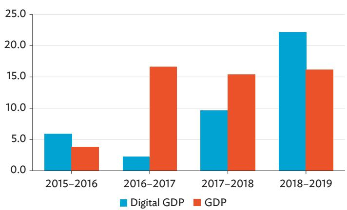
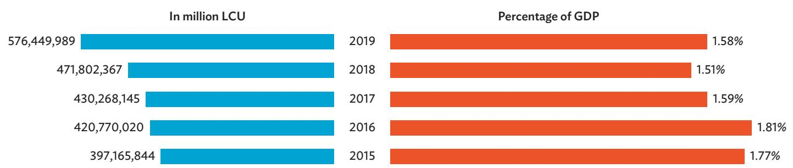
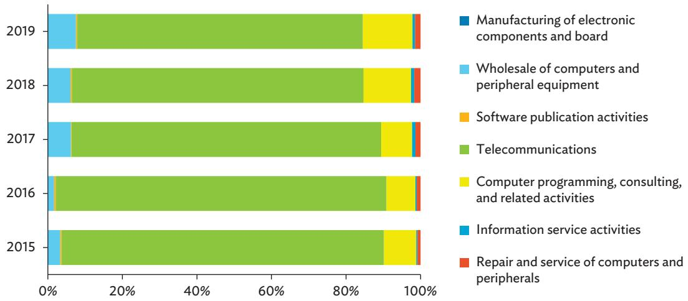
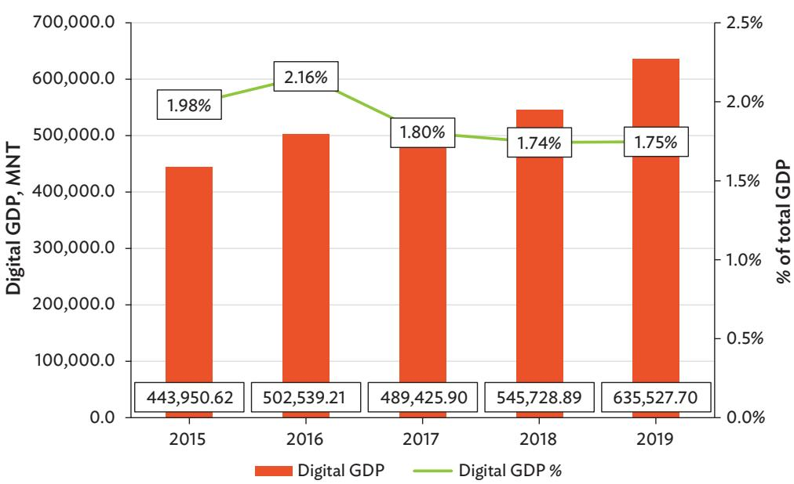
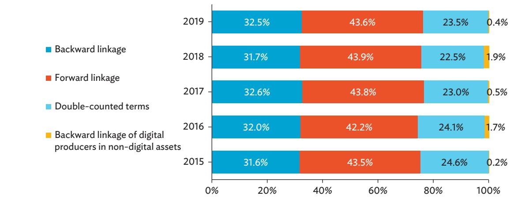

## KEY POINTS

\- This brief presents experimental estimates on Mongolia's digital economy. The analysis applies the Digital Supply and Use Table (DSUT) framework to measure digitalization across three dimensions—digital industries, digital products, and digital transactions.

\- Using Mongolia's 2015–2019 Supply and Use Tables, experimental DSUTs are compiled, focusing on digitally enabling industries due to data limitations. Preliminary results show that the digital economy contributed an average of 1.6% to Mongolia's gross domestic product from 2015 to 2019.

\- To complement the DSUT-based estimates, the analysis also applies the Asian Development Bank's input-output-based value flow methodology. Estimates derived from the two approaches highlight the growing importance of digital activities in Mongolia's economy.

\- This brief also discusses the use of alternative data sources and further methodological refinements to enhance and enable broader coverage of future estimates.

# Measuring the Digital Economy of Mongolia

Sameeksha Jain
Consultant
Economic Research and Development
Impact Department (ERDI)
Asian Development Bank (ADB)

Mahinthan Joseph Mariasingham
Principal Statistician
ERDI, ADB

Aparajita Pandharkar
Consultant
Pacific Department, ADB

Maegan Saroca
Consultant
ERDI, ADB

Nuri Ohn
Statistician
ERDI, ADB

Irene Talam
Consultant
ERDI, ADB

## INTRODUCTION

The emergence of the digital economy marks a pivotal transformation in the global economic landscape, fundamentally reshaping how economic activities are conducted and how products are created, managed, stored, and exchanged. This shift has been driven by the widespread adoption of technology and has revolutionized business operations, consumer behavior, supply chains, and the flow of goods and services across the world.

In Mongolia, the development of information and communication technology (ICT) is recognized as a key driver of economic diversification and long-term growth. This priority aligns with the Government of Mongolia's Vision 2050, which identifies science, technology, and innovation as central pillars of national development. Policy initiatives led by the Ministry of Digital Development, Innovation, and Communications aim to promote software and digital content production and expand exports of digital goods and services (Government of Mongolia, Ministry of Digital Development, Innovation, and Communications n.d.). Strengthening ICT infrastructure and improving internet connectivity are expected to enhance e-commerce, help overcome geographical constraints, and contribute to economic diversification (United Nations Trade and Development 2023).

As digital transformation advances, the availability of robust, consistent, and policy-relevant statistics becomes increasingly important for understanding the scale, structure, and evolution of the digital economy. This policy brief is a product of the collaborative initiative between the Asian Development Bank (ADB) and the National Statistics Office of Mongolia, with support from the Republic of Korea e-Asia and Knowledge Partnership Fund, to compile an experimental Digital Supply and Use Table (DSUT) for Mongolia. The DSUT framework provides a systematic approach to measuring digitalization by distinguishing between digital industries, digital products, and digital transactions.

The experimental DSUTs cover 2015–2019 and focus on digitally enabling industries, reflecting current data availability. This brief presents preliminary results, discusses key methodological and data challenges, and introduces an alternative input-output-based value flow approach developed by ADB. Together, these methods provide complementary insights into the role of digital activities in Mongolia's economy and inform future statistical development efforts.

Preliminary findings indicate that digital industries comprised an estimated $1.51\%$ to $1.81\%$ of Mongolia's gross domestic product (GDP) between 2015 and 2019. Comparing the growth of digital industries with that of the overall economy provides valuable insights for policymakers in formulating strategies to advance Mongolia's digitalization agenda. Future iterations of the DSUTs are expected to refine these estimates, incorporate additional digital industries, and expand coverage to other dimensions of the digital economy.

## CONSTRUCTION OF MONGOLIA'S 2015–2019 DIGITAL SUPPLY AND USE TABLES

## Methodology and Data Sources for the Compilation of the Digital Supply and Use Tables

The experimental DSUTs of Mongolia follow the recommendations of the Organisation for Economic Co-operation and Development (OECD) framework on measuring the digital economy. Under this framework, digitalization is captured across three key dimensions: digital industries, digital products, and digital transactions. Due to data constraints, the current compilation focuses solely on digital industries and, within this category, is limited only to the digitally enabling industries. The remaining six digital industries (Table 1), as well as the dimensions of digital products and digital transactions, will be incorporated in future iterations of the tables as more detailed data becomes available.

The foundation for the construction of Mongolia's 2015–2019 experimental DSUTs are the conventional 2015–2019 Supply and Use Tables (SUTs). The methodology involves reallocating output, intermediate consumption, and gross value added (GVA) from existing SUT industry columns to a newly defined column representing digitally enabling industries. Reallocation ratios are derived using revenue data from the Statistical Business Register (SBR) of Mongolia.

Table 1: List of Digital Industries

<table><tr><td>1</td><td>Digitally enabling industries</td></tr><tr><td>2</td><td>Digital intermediation platforms charging a fee</td></tr><tr><td>3</td><td>Data- and advertising-driven digital platforms</td></tr><tr><td>4</td><td>Producers dependent on digital intermediation platforms</td></tr><tr><td>5</td><td>E-tailers</td></tr><tr><td>6</td><td>Financial service providers predominantly operating digitally</td></tr><tr><td>7</td><td>Other producers only operating digitally</td></tr></table>

Source: OECD. 2023. OECD Handbook on Compiling Digital Supply and Use Tables. OECD Publishing.

Digitally enabling industries comprise producers of goods and services that facilitate digital transformation, such as manufacturers of ICT equipment and providers of ICT services. Compared to other digital industries, this classification is based on the nature of production activities and not the “digital activity” generated. Digitally enabling industries correspond broadly to “ICT industries” as defined by the OECD. They include the manufacture of computers, electronics, and optical products; wholesale and repairs of ICT products; software publishing; telecommunications; and production of IT and information services (OECD 2023). A more detailed list of these ICT industries is provided in Table 2.

Table 2: Information and Communication Technology Industries

<table><tr><td>International Standard Industrial Classification Code</td><td>Description</td></tr><tr><td>2610</td><td>Manufacture of electronic components and boards</td></tr><tr><td>2620</td><td>Manufacture of computers and peripheral equipment</td></tr><tr><td>2630</td><td>Manufacture of communication equipment</td></tr><tr><td>2640</td><td>Manufacture of consumer electronics</td></tr><tr><td>2680</td><td>Manufacture of magnetic and optical media</td></tr><tr><td>4651</td><td>Wholesale of computers, computer peripheral equipment, and software</td></tr><tr><td>4652</td><td>Wholesale of electronic and telecommunications equipment and parts</td></tr><tr><td>5820</td><td>Software publishing</td></tr><tr><td>61</td><td>Telecommunications</td></tr><tr><td>62</td><td>Computer programming, consultancy, and related activities</td></tr><tr><td>6311</td><td>Data processing, hosting, and related activities</td></tr><tr><td>6312</td><td>Web portals</td></tr><tr><td>9511</td><td>Repair of computers and peripheral equipment</td></tr><tr><td>9512</td><td>Repair of communication equipment</td></tr></table>

Source: International Standard Industrial Classification of All Economic Activities (ISIC) Revision 4.

Some ICT industries exhibit a one-to-one correspondence with the industries already identified in Mongolia's SUTs, namely electronic components and board manufacturing, communication equipment manufacturing, electrical connection and computer programming, and consulting and related activities. The entire columns of these industries are reallocated to the digitally enabling industries column. Other ICT industries are only partially digital. Hence, the following industry codes were disaggregated to reallocate the output, intermediate consumption, and GVA of the digital subindustries into the “digitally enabling industry” column in the DSUT:

(a) 465—wholesale of machinery, equipment, and their accessories;

(b) 58—original preparation and publication activities;

(c) 63—information service activities; and

(d) 95—repair and service of goods for personal and household use, computers.

The following steps were undertaken to compile the DSUTs:

## Digital Supply Table

(a) Full reallocation of ICT industries with one-to-one correspondence to the digitally enabling industries column;

(b) Computation of output reallocation ratios using the revenue data from the SBR; and

(c) Disaggregation of partially digital ICT industries using the reallocation ratios and reallocation of the digital subindustries to the digitally enabling industries column.

## Digital Use Table

(b) Computation of GVA reallocation ratios using the revenue data from the SBR as proxy indicator(s);

(c) Derivation of the GVA for digital and non-digital subindustries;

(d) Residual estimation of intermediate consumption by subtracting the derived GVA from the derived gross output; and

(e) Distribution of intermediate consumption across product rows using the original SUT use structure, assuming similar production processes for digital and non-digital firms within the same industry.

## Challenges in the Compilation of the Digital Supply and Use Tables and Future Refinements

The primary challenge of compiling Mongolia's experimental DSUTs is the limited scope of the digital economy that can be captured given current data availability. While the OECD framework distinguishes seven digital industries and features three dimensions of digitalization, the present estimates are focused only on the digitally enabling industries. The reliance on SBR revenue data alone constrains the ability to compute reallocation ratios for other digital industries, such as e-tailers and digital intermediary platforms. Expanding coverage will require access to more granular and diverse data sources, including establishment lists, enterprise microdata, financial statements, annual reports, and e-commerce-specific surveys. Improved data integration would also enable future DSUT iterations to incorporate digital products and transactions, thereby providing a more comprehensive view of Mongolia's digital economy.

## PRELIMINARY AGGREGATE RESULTS

The experimental estimates indicate that Mongolia's digital economy exhibited strong growth during the period particularly between 2016 and 2019 (Figure 1). The growth of the digital GDP was higher than the non-digital GDP and overall economy in the years 2016 and 2019, likely reflecting the increased adoption of internet and mobile technologies in the country. The digital economy increased in absolute terms over the 5-year period despite a slowdown in its growth in 2017. This underscores the rising demand for digital technologies and products among households and businesses during this period.

Figure 2 illustrates the relative size of the digital economy as a share of Mongolia's economy-wide GDP, showing a gradual decline from $1.77\%$ in 2015 to $1.58\%$ in 2019. However, this trend should not be interpreted as a reduction in the economic significance of digital activities. On the contrary, digital GDP increased in absolute terms over the period, reflecting continued expansion of the digital sector.

Figure 1: Comparison of Digital Gross Domestic Product and Total Economy Gross Domestic Product Growth Rates, 2015–2019
(%)  
  
GDP = gross domestic product.  
Source: Authors' calculations using National Statistics Office of Mongolia Supply and Use Tables and data from the Statistical Business Register.

Figure 3: Composition of the Digital Economy, 2015–2019 (% each component contributed to digital gross domestic product)  
Figure 2: Size of the Digital Economy of Mongolia, 2015–2019  
  
GDP = gross domestic product, LCU = local currency unit.  
Source: Authors' calculations using National Statistics Office of Mongolia Supply and Use Tables and data from the Statistical Business Register.

The observed decline in the digital economy's share of GDP should therefore be interpreted with caution. The strong growth of overall GDP during 2015–2019 mechanically affects the relative weight of the digital economy, as total GDP serves as the denominator in computing its share. As the broader economy expands, particularly resource-based and traditional sectors, the proportional contribution of digital activities may appear smaller even when digital output is rising in absolute terms.

Additionally, the estimates are expressed in current prices and have not been adjusted for inflation. Given that the prices of digital products and services tend to decline over time due to rapid technological progress and productivity gains, current-price measures may understate real growth in the digital economy. The use of constant-price data will provide a more accurate assessment of real growth in the digital economy.

In examining the digital economy by sector, telecommunications consistently accounted for the largest share of digital GDP from 2015 to 2019 (Figure 3). This is followed by the providers of computer programming, consulting, and related services; then wholesalers of computers and peripheral equipment. The remaining digitally enabling industries made up only around 1.48% to 2.91% of total digital GDP during the given period. The fastest growing among all the digital sectors was computer programming, consulting, and related services, showing significant growth from 2018 onward. As this sector becomes a larger part of the economy today, the need to capture its full extent more accurately intensifies.

  
Source: Authors' calculations using National Statistics Office of Mongolia Supply and Use Tables and data from the Statistical Business Register.

## MEASURING MONGOLIA'S DIGITAL ECONOMY USING ADB'S INPUT-OUTPUT-BASED VALUE FLOW METHODOLOGY

While highly valuable for disaggregating a country's digital economy estimates, the development of DSUTs has extensive data requirements. ADB proposes an alternative approach to measuring the scale of the digital economy grounded in input-output framework analysis. This method measures both the direct and indirect value-added contributions of digital industries to economy-wide GDP. This input-output-based measurement framework, fundamentally rooted in Leontief's analytical insights (Leontief 1936), assesses the direct and indirect value-added contributions of identified digital industries to the production of final goods and services.

Under this framework, digital products are defined as goods and services primarily used to generate, process, or store digitized data. Industries that predominantly produce these products are classified as digital industries. Five “core” digital products/industries are identified: (i) hardware, (ii) software publishing, (iii) web publishing, (iv) telecommunications services, and (v) specialized and support services. Table 3 lays out the five “core” digital products/industries, including their subcomponents.

By focusing on these core components, the input–output-based value flow approach adopts a narrow scope to produce estimates of the digital economy, providing a solid basis for informed policymaking while avoiding the uncertainty associated with judging the degree of “digitalization” in products whose functions are only partly digital, such as conventional appliances with smart features.

Table 3: Main Digital Industries by International Standard Industrial Classification of All Economic Activities Revision 4 (ISIC Rev. 4)

<table><tr><td>Main Activity Group</td><td>Code</td><td>Industry</td></tr><tr><td rowspan="2">Hardware</td><td>2620</td><td>Manufacture of computers and peripheral equipment</td></tr><tr><td>2680</td><td>Manufacture of magnetic and optical media</td></tr><tr><td>Software publishing</td><td>5820</td><td>Software publishing</td></tr><tr><td>Web publishing</td><td>6312</td><td>Web portals</td></tr><tr><td>Telecommunication services</td><td>61</td><td>Telecommunication services</td></tr><tr><td rowspan="2">Specialized and support services</td><td>62</td><td>Computer programming services, consulting, and other related services</td></tr><tr><td>6311</td><td>Data processing, hosting, and related activities</td></tr></table>

Source: Special Supplement to 2021 ADB Key Indicators for Asia and the Pacific—Capturing the Digital Economy: A Proposed Measurement Framework and Its Applications.

The core-digital GDP equation used in this measurement framework is specified as follows:

$$
GDP_{digital} = \underbrace{i^{T}\hat{v}B\hat{y}\varepsilon_{1}}_{\text{Backward linkage}} + \underbrace{i^{T}(\hat{v}B\hat{y})^{T}\varepsilon_{1}}_{\text{Forward linkage}} - \underbrace{\left[\text{diag}(\hat{v}B\hat{y})\right]^{T}\varepsilon_{1}}_{\text{Double - counted term}} + \underbrace{(i - \varepsilon_{1})^{T}\hat{v}B\hat{y}\hat{r}\varepsilon_{2}}_{\substack{\text{Backward linkage to other fixed investments by digital sectors}}}
$$

where, $\hat{V}$ is the diagonalized vector of value-added to gross output ratios, B is the Leontief (1936) inverse, $\hat{y}$ is the diagonalized vector final demands, i is a summation vector, and $E_{1}$ and $E_{2}$ are the first eliminator vector, which excludes transactions related to non-digital industries, and the second eliminator vector, which excludes fixed assets in digital products.

The first term from this equation accounts for the backward linkages between the digital industries and the industries from which they purchase inputs, which may be interpreted as the “digitally enabling industries.” The second term accounts for the value-added contributions of the digital industries to those sectors to which they sell—the “digitally enabled industries.” The third term captures the double counted items, i.e., the digital inputs that digital industries use to produce their own products. It is removed from the estimate to avoid double counting, for it appears in each of the first two terms. Finally, the fourth term accounts for the value-added contributions of the digitally enabling industries through the production of fixed capital goods that the core digital industries invest in.

Each term of the digital GDP framework (equation 1) captures a different channel of digital value creation, allowing focus on the components most relevant to analytical or policy needs. The approach is also flexible and can be adapted—for example, by expanding the set of digital products or incorporating digital value chain indicators—making it suitable for country-specific priorities. A fuller discussion of the framework and its extensions is available in ADB’s Special Supplement to the Key Indicators for Asia and the Pacific 2021 (ADB 2021).

Figure 4 illustrates the results obtained from applying the ADB input–output-based value flow method to Mongolia's input–output tables for 2015–2019. The value added generated by Mongolia's digital economy averaged about 1.89% of GDP during this period, peaking at 2.16% in 2016. This pattern is broadly consistent with the results derived from the DSUT method and may partly reflect the use of current price data, which are unadjusted for inflation.

Over the 5-year period, the digital economy recorded a compound annual growth rate of $7.44\%$ , following the trend of the overall GDP with a compound annual growth rate of $10.18\%$ . This indicates that digital sectors continued to play an important role in driving Mongolia's economic growth during the period.

It is worth noting that the digital economy estimates derived from the ADB input–output-based value flow method are consistently higher than the ones produced using the DSUT method. This difference is primarily attributable to the broader analytical scope of the input–output-based framework approach, which captures not only the direct value added generated by digital industries (i.e., forward linkages) but also their indirect impacts through backward linkages (i.e., supplier relationships), as well as the value added embodied in non-digital capital goods used by digital industries. In contrast, the DSUT approach estimates only cover the value added generated directly within the digitally enabling industries themselves, without accounting for these

Figure 4: Estimated Size of Mongolia's Digital Economy Using ADB's Input-Output-Based Value Flow Methodology, 2015–2019  
  
ADB= Asian Development Bank, GDP = gross domestic product, MNT = Mongolian togrog.  
Source: Authors' calculations using National Statistics Office of Mongolia Supply and Use Tables and data from the Statistical Business Register.

additional indirect effects. The differences between the two sets of estimates can be attributed to methodological variations and data limitations related to industry-level disaggregation. As further refinements are introduced and additional data become available, the results of the two methodologies are expected to improve.

Figure 5 presents the different components of the digital economy, as captured by equation 1, for 2015–2019.

Figure 5: Zooming In on Mongolia's Digital Transformation  
  
Source: Authors' calculations using National Statistics Office of Mongolia Supply and Use Tables and data from the Statistical Business Register.

Further, the availability of a time series of digital economy estimates for Mongolia also enables a structural assessment of its key components over time. Direct value added from digital industries (i.e., forward linkages) remains the largest component of the digital economy, with a relatively stable contribution throughout the period. Backward linkages between “digital industries” and “digitally enabling industries” represent the second largest component and exhibit a strengthening intersectoral linkage over time. Meanwhile, the contribution of fixed capital investments by the digital sectors shows significant fluctuations across the period, which could stem from episodic digital infrastructure upgrades and shifts in economic and policy conditions.

Table 4 shows the digital economy as a share of GDP for selected economies using the ADB measurement framework. The estimates show considerable variation across countries, reflecting differences in economic structure and the extent of digital integration. Mongolia's digital economy share is comparable to those of its Central Asian peers, including Georgia and Kazakhstan, while remaining below levels observed in more digitally advanced economies including Singapore, Malaysia, and Australia. This pattern is consistent with differing stages of digital development across the sample and underscores the usefulness of the ADB framework for producing consistent and comparable digital economy estimates across countries.

Table 4: Digital Economy as Percentage of Gross Domestic Product: Core Framework Estimates for Selected Economies

<table><tr><td rowspan="2">Economy</td><td colspan="2">Input-Output-Based Framework Estimates (Core)</td></tr><tr><td>Year</td><td>Percentage of Gross Domestic Product</td></tr><tr><td>Georgia</td><td>2018</td><td>2.5</td></tr><tr><td>Kazakhstan</td><td>2018</td><td>2.4</td></tr><tr><td>Indonesia</td><td>2016</td><td>2.9</td></tr><tr><td rowspan="2">Singapore</td><td>2016</td><td>6.8</td></tr><tr><td>2019</td><td>6.5</td></tr><tr><td rowspan="2">Malaysia</td><td>2015</td><td>7.6</td></tr><tr><td>2020</td><td>8.7</td></tr><tr><td rowspan="2">Australia</td><td>2018</td><td>5.0</td></tr><tr><td>2021</td><td>5.3</td></tr></table>

Source: ADB estimates.

## CONCLUSION AND RECOMMENDATIONS

The compilation of the experimental DSUTs for 2015–2019 marks a significant milestone for the statistical system of Mongolia. This statistical framework facilitates a fuller understanding of the state, evolution, and impact of economic digitalization. Although the experimental DSUTs are limited to digitally enabling industries, they provide valuable initial evidence on the scale and growth dynamics of digital activities in the country. Addressing existing data gaps will be essential for expanding coverage to other digital industries and dimensions of digitalization. Strengthening administrative and survey data, enhancing the SBR, and integrating alternative data sources will support more accurate estimates. ADB's input-output-based framework offers a useful complementary perspective and can serve as a validation tool for DSUT-based results. Continued collaboration between ADB and the National Statistics Office of Mongolia, combined with sustained investment in statistical capacity building, will be critical for advancing digital economy measurement in Mongolia. Improved statistics will help policymakers design evidence-based strategies to harness digitalization as a driver of inclusive and sustainable economic growth.

## REFERENCES

ADB. 2021. Capturing the Digital Economy: A Proposed Measurement Framework and Its Applications—A Special Supplement to Key Indicators for Asia and the Pacific 2021. http://dx.doi.org/10.22617/FLS210307-3.

Government of Mongolia, Ministry of Digital Development, Innovation, and Communications. n.d. Strategic Goals. (In Mongolian.) https://mddic.gov.mn/mn/strategic-goals/.

OECD. 2023. OECD Handbook on Compiling Digital Supply and Use Tables. OECD Publishing. https://doi.org/10.1787/11a0db02-en.

United Nations Trade and Development. 2023. Mongolia Eyes E-Commerce to Diversify Its Economy. 8 June. https://unctad.org/news/mongolia-eyes-e-commerce-diversify-its-economy.

W. Leontief. 1936. Quantitative Input and Output Relations in the Economic System of the United States. Review of Economics and Statistics. 18.

## About the Asian Development Bank

ADB is a leading multilateral development bank supporting inclusive, resilient, and sustainable growth across Asia and the Pacific. Working with its members and partners to solve complex challenges together, ADB harnesses innovative financial tools and strategic partnerships to transform lives, build quality infrastructure, and safeguard our planet. Founded in 1966, ADB is owned by 69 members—50 from the region.

ADB Briefs are based on papers or notes prepared by ADB staff and their resource persons. The series is designed to provide concise, nontechnical accounts of policy issues of topical interest, with a view to facilitating informed debate. The Department of Communications and Knowledge Management administers the series.

www.adb.org/publications/series/adb-briefs

The views expressed in this publication are those of the authors and do not necessarily reflect the views and policies of ADB or its Board of Governors or the governments they represent. ADB does not guarantee the accuracy of the data included here and accepts no responsibility for any consequence of their use. The mention of specific companies or products of manufacturers does not imply that they are endorsed or recommended by ADB in preference to others of a similar nature that are not mentioned. By making any designation of or reference to a particular territory or geographic area in this document, ADB does not intend to make any judgments as to the legal or other status of any territory or area.

Asian Development Bank
6 ADB Avenue, Mandaluyong City
1550 Metro Manila, Philippines
www.adb.org

## Creative Commons Attribution 3.0 IGO license (CC BY 3.0 IGO)

© 2026 ADB. The CC license does not apply to non-ADB copyright materials in this publication.
https://www.adb.org/terms-use#openaccess http://www.adb.org/publications/corrigenda pubsmarketing@adb.org