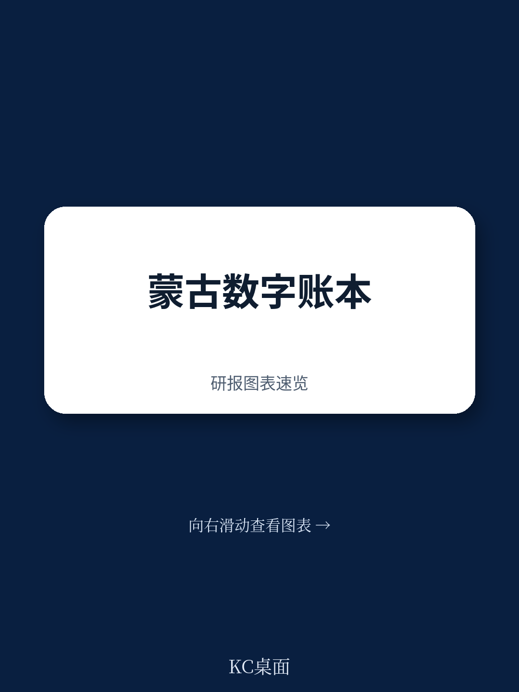
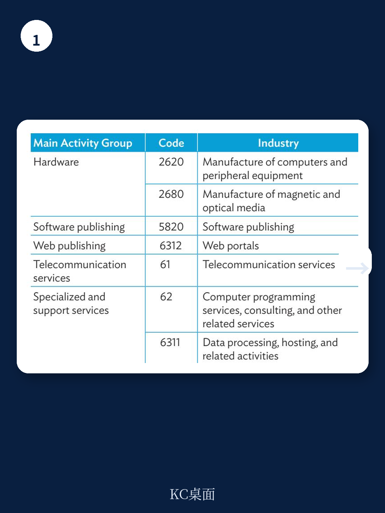
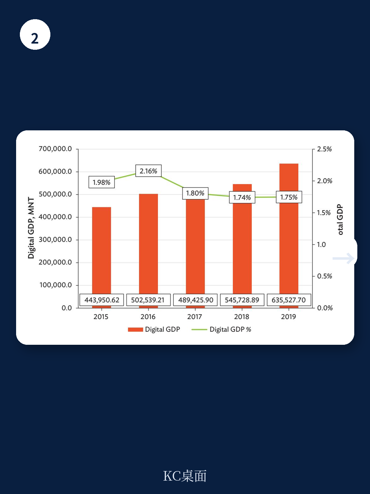

# 亚洲开发银行：蒙古数字宏观环境仅占GDP1.6%，统计方法才是真正突破

蒙古的数字宏观环境到底有多大？亚洲开发银行（ADB）最新发布的实验性统计报告给出了一个看似保守的答案：2015至2019年间，数字宏观环境仅占蒙古GDP的1.5%至1.8%。但这个数字的意义不在于它有多高，而在于它是如何被算出来的。

这份报告不是一份简单的宏观环境数据简报，而是ADB与蒙古国家统计办公室联合推进的一项统计基础设施工程。它首次将OECD的“数字供给使用表”（DSUT）框架应用于蒙古宏观环境，试图在传统统计体系中为数字活动建立独立的测量通道。对于关注新兴市场数字化进程的观察者来说，这份报告的价值不在结论，而在方法论本身。

## 1. 蒙古数字宏观环境的真实规模可能比数据显示的更大

报告给出的1.6%均值，在跨国比较中并不突出。ADB用投入产出框架测算的其他地区数据为：新加坡6.5%-6.8%、马来西亚7.6%-8.7%、澳大利亚5.0%-5.3%，而蒙古的邻国哈萨克斯坦和格鲁吉亚也分别达到2.4%和2.5%。

但这里有两个必须注意的技术性原因，可能导致蒙古的数字宏观环境被系统性低估。

第一，当前的DSUT只覆盖了七类数字产业中的第一类——“数字使能产业”，即ICT硬件制造、软件出版、电信、IT服务等。其余六类，包括数字中介平台、电商、纯数字运营商等，因数据不足尚未纳入。这意味着蒙古正在快速增长的电商和数字服务交易几乎没有被计入。

第二，报告使用的是现价数据，没有做通胀调整。而数字产品和服务的价格通常随时间下降——手机资费下降、硬件成本降低——这会导致现价口径下的实际增长被低估。

> **KC评论：** 1.6%这个数字本身不重要，重要的是它只覆盖了“数字化的供给端”，而“数字化的交易端”几乎是空白。如果蒙古的电商和数字平台交易数据能够补充进来，这个比例很可能会翻倍。完整报告中的图2展示了数字GDP绝对值的增长趋势，值得仔细看。

## 2. 电信仍是最大板块，但软件和IT服务正在加速

报告对数字宏观环境的内部结构做了拆解。2015至2019年间，电信服务始终是蒙古数字GDP的最大贡献者，其次是计算机编程与咨询、以及计算机与外围设备批发。其余细分行业合计仅占数字GDP的1.48%至2.91%。

最值得关注的信号是“计算机编程、咨询及相关服务”板块的增长速度。报告指出，该板块从2018年起显著加速，成为数字产业中增长最快的部分。这符合一个典型的发展中国家数字化路径：先靠电信基础设施铺路，然后软件和服务需求开始爆发。

对于读者或企业决策者而言，这个结构变化意味着：蒙古的数字化机会正在从“连接”转向“应用”。电信基础设施的边际红利在递减，而软件、云服务、企业IT咨询的需求正在上升。

## 3. 报告尚未完全回答的关键问题：数据瓶颈如何突破？

ADB在报告中坦诚列出了当前方法的局限性，这些限制恰恰是读者最应该关注的问题。

最核心的瓶颈是数据源单一。当前DSUT主要依赖蒙古统计商业登记簿（SBR）中的收入数据来推算数字产业的分配比例。但SBR数据无法支撑对电商、数字平台等新型数字活动的识别。报告提到，要扩展覆盖范围，需要接入企业微观数据、财务报表、电商专项调查等更细颗粒度的来源。

另一个方法论挑战是“数字产品”和“数字交易”两个维度的缺失。OECD框架要求从三个维度同时测量数字化，而蒙古目前只完成了第一个维度的初步工作。这意味着，即使未来数字产业数据补齐，对数字宏观环境的刻画仍然是不完整的。

> **KC评论：** 这不是蒙古独有的问题。几乎所有发展中国家在测量数字宏观环境时都面临同样的数据困境。ADB这篇报告的价值恰恰在于它把“统计能力建设”摆在了台面上——没有更好的数据基础设施，政策制定和研究决策都是盲人摸象。报告最后提到的“替代数据源”和“方法优化”部分，是真正值得政策制定者细读的内容。

## 4. 对观察者的框架：如何判断蒙古数字化的真实进程

如果你关注蒙古的数字化研究机会或政策走向，这份报告提供了一个清晰的观察框架：不要只看最终的数字占比，而要跟踪统计能力的升级节奏。

具体来说，有三个指标值得持续关注：第一，蒙古国家统计办公室是否在后续年份发布覆盖更多数字产业的DSUT更新；第二，是否开始引入电商专项调查或企业微观数据来补充SBR的不足；第三，ADB的投入产出框架与DSUT框架之间的差距是否在缩小。

这三个指标的进展，比任何单一的年增长率数字都更能说明蒙古数字宏观环境的真实健康状况。

## 5. 未解的问题与下一步

报告最大的未解问题是：当数据瓶颈逐步突破后，蒙古数字宏观环境的真实规模会是多少？在ADB的跨国比较表中，蒙古与哈萨克斯坦、格鲁吉亚处于同一梯队。但如果考虑到蒙古的地理条件——地广人稀、传统产业受制于运输成本——数字化对其宏观环境结构的重塑潜力可能比中亚国家更大。这个假设目前还没有数据支持，但值得持续跟踪。

完整报告、中文摘要、KC评论和图表合集，会放进每日国际信源汇编。适合快速扫当天主流叙事，也方便后续追问和横向比较。

For informational purposes only. Portions may be generated,translated,summarized,or edited with AI assistance based on source materials and may contain omissions or errors. Please verify independently. This is not investment,legal,tax,accounting,or other professional advice.
