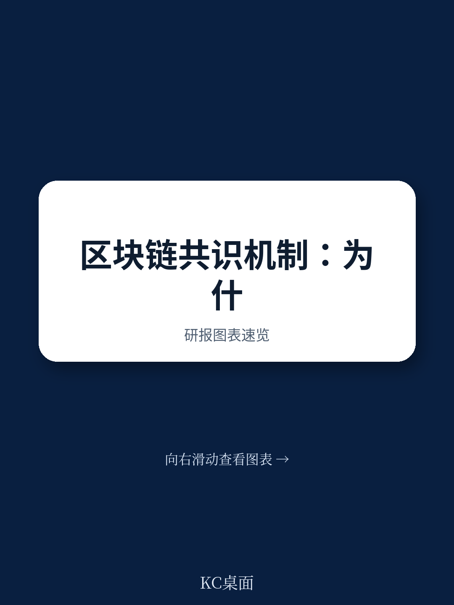
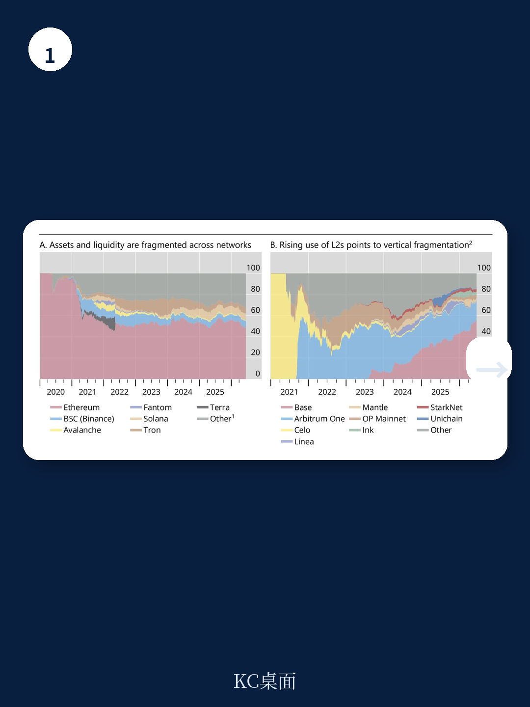
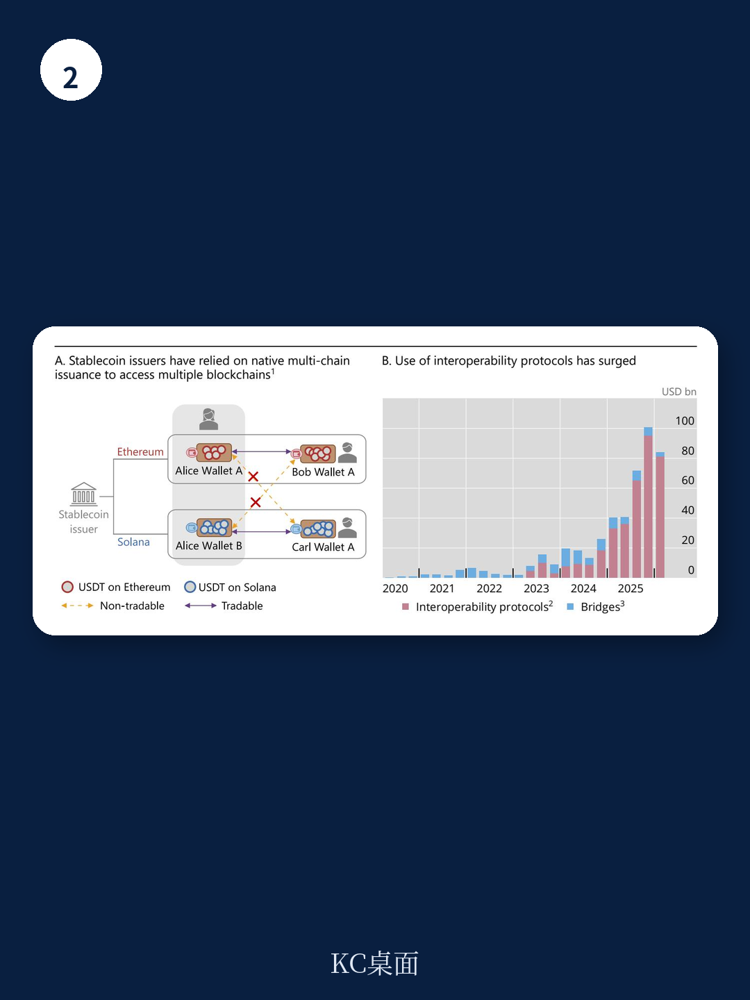

# 国际清算银行：共识机制不是技术选择，而是宏观环境均衡的结果

多数人谈论区块链时，关注的是比特币、以太坊、Solana谁会成为“赢家”。但国际清算银行这份最新研报给出了一个更冷静的判断：**区块链不会收敛于一个统一的基础设施，而是会持续碎片化。**

这并不是技术缺陷，而是宏观环境学的必然结果。共识机制的设计本质上是“代币激励下的均衡”——不同的奖励结构、验证者参与成本和协调方式，会天然产生不同的均衡点。这些均衡点无法同时满足去中心化、安全性和可扩展性三个维度，于是就有了今天我们看到的多条Layer 1链并存、Layer 2解决方案不断涌现的局面。

碎片化不是暂时的混乱，而是系统的结构性特征。

## 1. 共识机制不是技术选择，而是宏观环境均衡

报告最核心的洞察是：共识机制不是纯粹的技术架构问题，而是一个宏观环境激励设计问题。

以比特币的工作量证明和以太坊的权益证明为例，它们都追求广泛的验证者参与，这支撑了去中心化和安全性，但代价是吞吐量受限、延迟高。当用户需求上升，交易费用飙升，价格敏感的用户就被挤出。这是“区块链三难困境”的真实体现。

而Solana的时间排序加拜占庭容错、Avalanche的概率采样、Tron的委托权益证明，则走的是另一条路：通过缩小验证者规模或提高硬件门槛来换取高吞吐量和低延迟。代价是去中心化程度下降。

报告明确指出：**这些设计反映的是不同的宏观环境均衡，而非纯技术约束。** 当一条链上锁定的资产价值上升，攻击成本也必须上升，而成本最终由用户通过费用和代币稀释来承担。这意味着，不存在一个“最优”共识机制——只有最适合特定用户群体的设计。

## 2. 碎片化被Layer 2加剧，而非解决

Layer 2解决方案本意是解决Layer 1的可扩展性问题——通过将交易在链下处理，再把结果写回主链。但报告发现，这反而加剧了碎片化。

每个Layer 2都有自己的交易排序、定价机制和故障点，形成了独立的流动性池和治理机制。结果是：**碎片化从“跨链”延伸到了“链内”**。以太坊上已经有数十个Rollup，每个都像一个独立的“小国家”，有自己的规则和资产。

> **KC评论：** 这意味着用户和资金被分散到越来越多的小环境中。从一个Layer 2转移到另一个，并不比从以太坊转移到Solana简单多少。碎片化不是“暂时的成长痛”，而是模块化架构的内生结果。

## 3. 缓解碎片化的工具，引入了新的不确定性

报告梳理了四种主要缓解机制：跨链桥、原生多链发行、共享层和互操作协议。每种都有显著代价。

跨链桥是不确定性最集中的案例：2022年Ronin Network被盗6.25亿美元，直接原因就是跨链桥的私钥被攻破。原生多链发行（如USDT在多条链上同时发行）看似简单，但同一代币在不同链上无法直接转移，需要依赖跨链套利者来弥合价差。

共享层——如共享安全性、共享数据可用性层、共享排序器——虽然能减少碎片化，但**将治理和运营不确定性集中到了少数关键组件上**。这些组件可能变得“系统重要性”，一旦出问题，影响范围远超单一网络。

**报告尚未完全回答的关键问题在于：** 这些缓解机制是否会催生出新的“隐性中介”？当跨链消息传递协议或共享排序器变得不可或缺，它们是否就成了去中心化系统里的“新中心”？从宏观环境学角度看，任何降低摩擦的工具都会积累起新的摩擦点。

## 对观察者的框架

这份报告给决策者的启示不是“该投哪条链”，而是提供了一套评估框架

- **共识机制的成本分布**：谁在承担验证成本？用户、验证者还是代币持有者？
- **碎片化程度的可量化指标**：总锁定价值在多少条链上分布？跨链转账的成功率和成本如何？
- **缓解机制的信任假设**：桥接、共享层或互操作协议背后，存在哪些信任依赖？这些依赖是否集中？

当一条链或一个Layer 2宣称“解决了三难困境”时，更值得问的是：它在哪个维度做了妥协？代价由谁承担？

---

完整报告包含更详细的共识机制对比表格、碎片化趋势图表以及缓解机制的细分拆解。中文摘要、KC评论和图表合集，会放进每日国际信源汇编，适合快速对照主流叙事，也方便后续追问和横向比较。

For informational purposes only. Portions may be generated,translated,summarized,or edited with AI assistance based on source materials and may contain omissions or errors. Please verify independently. This is not investment,legal,tax,accounting,or other professional advice.
