MALI

IMF Country Report No. 26/165

July 2026

## SECOND REVIEW UNDER THE STAFF-MONITORED PROGRAM—PRESS RELEASE; AND STAFF REPORT

In the context of the Second Review Under the Staff-Monitored Program, the following documents have been released and are included in this package:

## A Press Release.

\- The Staff Report prepared by a staff team of the IMF for the Executive Board's information, following discussions that ended on March 3, 2026, with the officials of Mali on economic developments and policies underpinning the Staff- Monitored Program. Based on information available at the time of these discussions, the staff report was completed on March 18, 2026.

The IMF's transparency policy allows for the deletion of market-sensitive information and premature disclosure of the authorities' policy intentions in published staff reports and other documents.

Copies of this report are available to the public from

International Monetary Fund • Publication Services
PO Box 92780 • Washington, D.C. 20090
Telephone: (202) 623-7430 • Fax: (202) 623-7201
E-mail Web: http://www.imf.org

International Monetary Fund
Washington, D.C.

# IMF Management Approves the Second Review of the Staff-Monitored Program with Mali

FOR IMMEDIATE RELEASE

\- Management of the International Monetary Fund (IMF) has approved the Second and final Review of the Staff-Monitored Program (SMP) with Mali.

\- Program implementation was solid amid a challenging environment, with the authorities achieving all quantitative and indicatives targets and implementing structural reforms.

\- Mali is showing signs of accelerating growth flowing the difficulties experienced in the security and humanitarian arears in 2025. As the security situation improves and gold production recovers, the economy is projected to strengthen further in 2026.

Washington, DC: Management of the International Monetary Fund (IMF) approved on March 18, 2026 the second and final review of Mali's Staff Monitored Program (SMP). The SMP, approved in March 2025, aims to ensure fiscal sustainability, strengthen governance and public, and protect the most vulnerable $^{1}$ .

Mali's economy is rebounding from the setbacks experienced in late 2025, as security tensions have eased and gold production is recovering. Economic activity in 2025 was dampened by lower gold production and fuel supply disruption in the fourth quarter following terrorist attacks. Looking ahead, measures to restore fuel supply and improve security conditions, the repayment of domestic arrears, and the resolution of the mining dispute are expected to support recovery in 2026. Inflation remains below 3 percent, as in 2025.

Program implementation under the SMP has been robust. All quantitative and indicative targets in the second review—including priority social spending, net tax revenues, domestic and external arrears, and the primary fiscal deficit—were observed, and there was overperformance on some instances. All structural benchmarks were met, including digitalization of tax receipts, interconnectivity of tax administration and the development of an action plan related to the census of public accounts. The authorities remain committed to the transparent use of the IMF's April 2025 Rapid Credit Facility disbursement and have published the second quarterly report on the use of these resources, along with detailed procurement information on selection processes and beneficial ownership.

While fiscal policy remains appropriate, careful management of potential windfalls is needed amid high gold prices. The 2026 budget envisages a fiscal deficit within the West African Economic and Monetary Union (WAEMU) 3-percent-of-GDP ceiling, underpinned by strong domestic revenue mobilization and control of current spending. Elevated gold and lithium prices could generate additional revenues; transparent and prudent management, guided by a non-mining fiscal anchor, will help avoid procyclical policies.

Maintaining prudent fiscal policy remains essential to safeguard sustainability, as elevated borrowing costs and large development and security needs continue to limit fiscal space. Reform priorities include broadening the tax base, strengthening tax and customs administration, improving public financial management, addressing vulnerabilities in state-owned enterprises, and preserving space for public investment and protection of vulnerable households.

IMF staff commend the Malian authorities for their strong commitment and performance under the SMP. The program has provided an important platform for policy dialogue, strengthening institutional capacity, and advancing reforms that support macroeconomic stability and sustainable growth. IMF staff will continue to work closely with the authorities to advance the reform agenda and address Mali's evolving economic priorities.

# MALI

March 18, 2026

# SECOND REVIEW UNDER THE STAFF-MONITORED PROGRAM

## KEY ISSUES

Context. A 50-percent-of-quota disbursement under the Rapid Credit Facility (about US\$129 million) was approved on April 16, 2025, to help address urgent balance-of-payments challenges. This followed the approval of a Staff- monitored Program (SMP) by management, designed to build a policy track record towards an upper credit tranche (UCT) arrangement. The RCF disbursement helped mitigate the impact of the severe 2024 flooding amid tight financing conditions, while SMP reforms focus on improving transparency in the use of public resources and enhancing governance and accountability in public financial management.

Recent developments. The economic and security situation has improved after terrorist attacks in the second half of 2025 disrupted key transport routes and fuel deliveries. However, intermittent fuel shortages and electricity outages persist and could worsen if the conflict in the Middle East persists or intensifies. The dispute with the country's largest gold producer was resolved in late November 2025, paving the way for a gradual resumption of production in 2026.

SMP Review. Program performance was strong, with all end-December structural benchmarks (SBs) and quantitative performance criteria met. Whereas the first review centered on essential socio-economic policies to preserve stability and protect livelihoods, this review discussed reforms to strengthen fiscal policy frameworks—particularly governance and transparency—amid expected higher mining revenues. Specifically, the policy discussion focused on:

• Managing windfall revenues from gold mining.

• Enhancing fiscal governance and transparency.

Moreover, as part of the safeguards discussed for the RCF disbursements, the authorities committed to continue publishing quarterly spending reports on how the resources have been used and to have the Auditor General conduct a final audit of RCF spending by June 2026.

Risks. While program implementation across both reviews has been satisfactory, and the SMP is now completed, risks remain. The security situation remains uncertain, and persistently high (re)financing costs in the regional debt market could weigh on growth, fiscal performance, and social stability. The ongoing conflict in the Middle East also poses external risks, with higher oil prices could increase import costs and potential volatility in gold prices could affect export revenues. Nonetheless, record-high gold prices and the resolution of the gold-mining dispute substantially improve the macro-fiscal outlook in the medium term.

Key recommendations. Fiscal policy should continue to focus on strengthening domestic revenue mobilization—including through prudent management of mining revenues and improved tax administration. Additionally, there is need to enhance the quality and efficiency of public spending, safeguard priority social expenditures and investment, and prevent the accumulation of new arrears while continuing transparent clearance of existing ones. Staff encourage the authorities to continue progress on governance and transparency reforms, including stronger budget reporting, public procurement controls, and oversight of public entities and state-owned enterprises, alongside implementation of the anti-corruption framework.

Staff's views: Staff supports the completion of the final SMP review based on the strong performance against program targets and the authorities' commitment to further measures outlined in the Letter of Intent (LOI)/Memorandum of Economic and Financial Policies (MEFP). Staff welcome the authorities' intention to maintain prudent macroeconomic policies and sustain the reform momentum established under the program.

Policy discussions were conducted remotely between February 25-March 3, 2026. The team comprised Wenjie Chen (head), Michele Fornino, Maurizio Leonardi, Chima Simpson-Bell, Nico Valckx (AFR), Firmin Ayivodji, Kwanjai Yoo (SPR), Sherif Ayoub (LEG) and Moez Ben Hassine (Resident Representative) with research assistance from Amandine Spencer Goncalves and editorial support by Vicky Pilouzoue and Fey Derrouis. The mission met with the Minister of Finance and Economy Mr. Alousséni Sanou and his staff, the BCEAO in Bamako as well as directors and staff from other ministries and government agencies. The team also met with development partners.

## CONTENTS

CONTEXT 5

RECENT ECONOMIC DEVELOPMENTS AND OUTLOOK 6

PROGRAM IMPLEMENTATION UNDER THE SMP 10

POLICY DISCUSSIONS 12

STAFF APPRAISAL 17

## BOX

1. Official Resolution of the Gold Mining Dispute \_\_\_\_ 7

## FIGURES

1. High-Frequency Indicators 19

2. Real Sector Developments \_\_\_\_ 20

3. External Sector Developments \_\_\_\_ 21

4. Fiscal Developments 22

5. Monetary and Financial Sector Developments 23

## TABLES

1. Selected Economic and Financial Indicators, 2023–31 \_\_\_\_ 24

2a. Consolidated Fiscal Transactions of The Central Government, 2022–31 (GFSM86 and CFAF

Billions) 25

2b. Consolidated Fiscal Transactions of The Central Government, 2022–31 (GFSM86, Percent of

GDP, unless otherwise indicated) 26

3. Gross Fiscal Financing Needs, 2024–26 \_\_\_\_ 27

4a. Balance of Payments, 2022–31 (CFAF billions, unless otherwise indicated) \_\_\_\_ 28

4b. Balance of Payments, 2022–31 (Percent of GDP, unless otherwise indicated) \_\_\_\_ 29

5. Monetary Survey, 2022–31 \_\_\_\_ 30
6. Financial Soundness Indicators for the Banking Sector, 2020–25 \_\_\_\_ 31
7. External Financing Needs, 2022–31 \_\_\_\_ 32
8. Performance Criteria and Quantitative Targets for the SMP \_\_\_\_ 33
9. Structural Benchmarks Under the SMP \_\_\_\_ 34

## ANNEXES

I. Timeline of Key Political Developments, 2025Q4 Onward\_\_\_\_35
II. Risk Assessment Matrix \_\_\_\_36

## APPENDIX

I. Letter of Intent \_\_\_\_ 40
Attachment I. Memorandum of Economic and Financial Policies \_\_\_\_ 42
Attachment II. Technical Memorandum of Understanding \_\_\_\_ 49

## CONTEXT

1. The security situation in Mali has improved since the second half of last year but remains volatile. A sharp surge in terrorist attacks from mid-2025 disrupted fuel and goods transport, damaged infrastructure and industrial facilities, and weakened economic activity. Conditions began improving in late November, particularly in the capital, as the authorities' countermeasures took effect. $^{1}$ Nevertheless, occasional fuel shortages and electricity outages persist, alongside internal displacement and elevated food insecurity. These overlapping pressures continue to weigh on community resilience and heighten economic uncertainty.

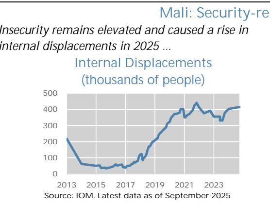  
... coinciding with elevated food insecurity, likely reaching a new peak in the 2026 lean season. Food Insecurity, 2020-2026

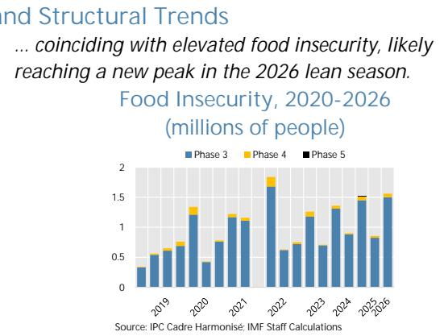  
Due to insecurity, 2,300 schools were not functional in October 2025, impacting 700,000 students...

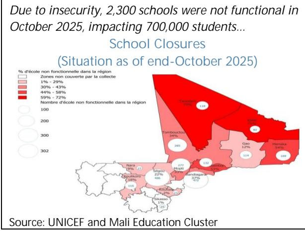  
... as violence and armed conflict remain a challenge in the broader Sahel region.

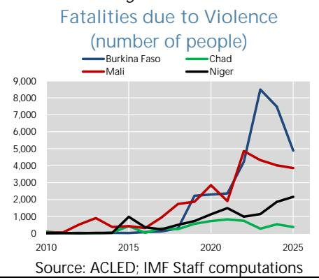

2. The protracted dispute with Mali's largest gold producer was resolved in late 2025. While gold output for 2025 declined for a second consecutive year because of the mine's shutdown, the resolution paves the way for normalization in 2026 (Box 1). Initial official estimates suggest that full adoption of the 2023 mining code would generate revenues of CFAF 761 billion (4.4 percent of GDP) in 2025. Going forward, higher mining production, record gold prices, and gold export revenue repatriation will boost production, fiscal revenues and banking sector liquidity.

3. In political developments, the authorities signaled openness to reinstating political parties, and WAEMU's sanctions from 2022 were overturned. In January 2026, the president of the Transition announced upcoming consultations on a draft law for the formation and operation of political parties—dissolved in May 2025, following opposition calls and a Supreme Court audit highlighting weaknesses in public financing of political parties (2000-2024). The WAEMU Court of Justice overturned the January 9, 2022, sanctions, which were intended to compel Mali to submit an acceptable electoral calendar, ruling that the measures were adopted without sufficient legal basis (Annex I).

## RECENT ECONOMIC DEVELOPMENTS AND OUTLOOK

4. Mali's economy grew by 5.7 percent in the first three quarters of 2025, up from 4.3 percent in 2024. A rebound in the secondary sector (from -2.4 to 3.4 percent), supported in part by lithium production, helped offset weaker services activity. However, the shutdown of the largest gold mine, tighter financing conditions, and slower private credit weighed on industrial and services sectors. In contrast, agriculture expanded strongly by 8.3 percent (yoy), supported by a robust post-flood harvest (text figure).

5. Real GDP growth for 2025 is projected at 4.9 percent, reflecting weaker performance in the fourth quarter amid heightened insecurity. In particular:

\- Severe fuel shortages amid security attacks curtailed electricity availability and mobility, constraining manufacturing and services in the fourth quarter; and

\- Agricultural production was disrupted by fuel shortages, delaying harvesting, transport, and exports of agrifood products and cotton in the fourth quarter.

Growth is projected to rebound to around 5.5 percent in 2026, assuming gradual security improvements that support stronger activity, higher gold output, a better business climate, and a recovery in credit (Table 1). Over the medium term, growth is expected to stabilize around 5½ percent, supported by higher public investment.

6. Risks are tilted to the downside. They include renewed insecurity and persistently high regional financing costs (Annex II). A return of fuel shortages in 2026 could weaken activity, reduce tax revenues, and raise inflation. While gold output could exceed expectations following the mining dispute's resolution (Box 1), it remains vulnerable to heightened insecurity. Global uncertainty following the conflict in the Middle East could have negative effects on Mali, through higher fuel, fertilizer, food prices, and through increased market risk premia. While Mali could benefit from rising gold prices, heightened global uncertainty may also increase volatility in gold markets.

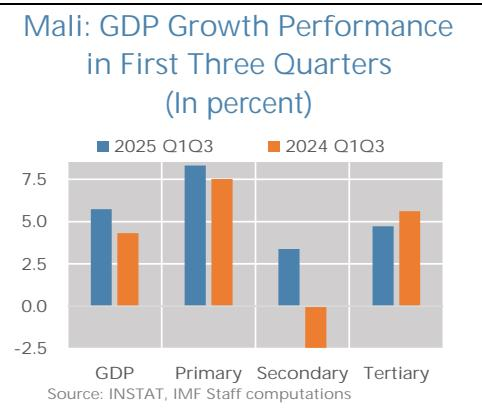  
Mali: Gold Sales, Volume and Price
(tons of gold, billion CFAF and US\$

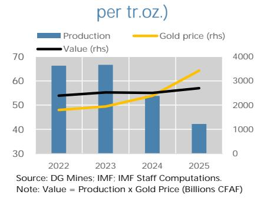

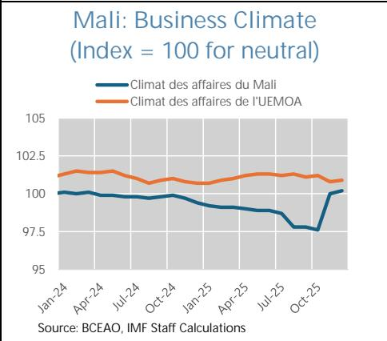

7. Inflation is estimated at 2.9 percent in 2025, easing to 2.2 percent in 2026 before stabilizing around 2 percent in the medium term. After elevated readings in early 2025, food price pressures moderated, though rising costs of durable goods and services lifted inflation in the second half. Under the baseline, inflation is expected to decline in 2026 as these pressures fade, and the temporary impact of 2025 tax increases dissipates (¶11). However, risks remain, including the possibility of higher oil prices depending on developments in the conflict in the Middle East.

## Box 1. Mali: Official Resolution of the Gold Mining Dispute

Shortly after the first SMP review mission, a breakthrough was reached in the dispute over Mali's largest gold mine. This box summarizes the main elements of the agreement, based on details shared by the authorities, and assesses its likely effects on Mali's economic and fiscal outlook.

On November 24, 2025, Mali's largest gold mine operator announced an agreement with the government resolving all outstanding disputes. The agreement withdrew legal charges against the company and its staff, ended the provisional administration of the mine, restored operational control to the operator, and led to the withdrawal of arbitration claims before ICSID. The mine was brought under the 2023 mining code, the company agreed to participate in the Mining Fund, and its license was renewed for 10 years in February 2026—signaling an improved business climate.

This agreement represents a significant upside for Mali's economy. The company made a settlement payment of CFAF 244 billion (1.4 percent of 2025 GDP), including VAT offsets and an earlier advance payment. Gold production is expected to recover gradually in 2026 to at least 10 tons, up from less than 3 tons in 2025—boosting value added, fiscal revenues, and exports amid high gold prices.

Staff estimates point to the positive effects on 2026 growth of about 0.2 percentage points, additional fiscal revenues of about 0.6 percentage points of GDP, and a positive contribution to the balance of payments of about 4.6 percent of GDP, from the export of additional gold forecasted to be produced at mine. The added fiscal space would enable the government to resume capital spending—constrained in recent years—and advance medium-term development goals under Vision 2063 (2025 Article IV report).

8. The current account deficit is estimated to have narrowed to 0.9 percent of GDP in 2025 (from 4.3 percent in 2024) and is projected to remain stable at 1.0 percent of GDP in 2026. The improvement in 2025 reflected higher gold prices, partly offset by somewhat higher fuel imports and weak gold production, alongside significant inflows from one-off payments related to the gold mine settlement agreement and the renewal of the license of a large telecommunications operator. In 2026, elevated gold prices, a production rebound, and stronger-than-anticipated lithium exports are expected to generate a large surplus in the trade balance, notwithstanding the negative impacts of more expensive fuel imports related to the conflict and ensuing spike in oil prices, which is assumed to generate a 15 percent increase in the average price of oil for 2026 compared to 2025. The overall balance is projected at 2.5 percent of GDP in 2025 and 2.8 percent in 2026. Risks to the external position are balanced: weaker gold output, lower prices, or higher energy imports related to a progressive intensification of the conflict could weigh on the outlook, while stronger gold performance would improve it dramatically. Over the medium term, the external position is expected to strengthen further as gold production normalizes and external financing gradually resumes from 2027, albeit below early-2020s levels.

9. The fiscal deficit is expected to fall substantially to 1.6 percent of GDP in 2025, from 2.2 percent in 2024, as additional mining revenues and new tax measures more than offset higher interest repayments and investment (Table 2 and Figure 4). $^{2}$ Higher gold prices and the mining settlement (Box 1)—which added CFAF 144 billion to December 2025 revenues—contributed to a downward revision of the projected 2025 deficit from 2.7 percent of GDP at the first SMP review to 1.6 percent currently. $^{3}$ Beyond measures introduced under the 2023 mining code reform, the government adopted further revenue actions in 2025, including new mobile money taxes, special mining levies, and higher taxes on alcohol and certain foodstuff. Part of the proceeds is earmarked for dedicated funds supporting basic infrastructure and social development.

10. For 2026, staff expect a fiscal deficit of 2.4 percent of GDP. The authorities are undertaking reforms to the wage bill—including revisions to the civil service framework, enhanced retirement severance allowances, and adjustments to the salary scale—while emphasizing that the fiscal impact will be gradual and contained. Current spending is projected to rise slightly as a share of GDP, driven mainly by the wage bill and transfers and subsidies, while goods and services spending is expected to remain below budgeted levels. The outlook also reflects spillovers from the conflict in the Middle East, including higher fuel costs affecting the state-owned electricity utility, requiring higher state subsidy, as well as lower petroleum excise revenues to mitigate the impact on retail fuel prices and somewhat higher government consumption expenditure. While elevated gold prices support the fiscal outlook, fiscal revenues may increase less than headline price movements suggest, as revenues depend not only on prices but also on production levels, fiscal terms, and deductible operating costs in the mining sector. Over the medium term, expenditure is expected to gradually shift from security toward social and development priorities, supported by higher capital outlays. Assuming elevated gold prices and full mine operations and barring further consolidation efforts, deficits in 2027–31 under the authorities' current policies are expected to hover at around 2½ percent of GDP—a level that is well below WAEMU's 3-percent ceiling, although it would allow for only a very gradual reduction of public debt and fiscal financing needs.

<table><tr><td rowspan="2"></td><td>2024</td><td>2025</td><td>2025</td><td>2026</td><td>2026</td><td>2027</td><td>2028</td><td>2029</td><td>2030</td><td>2031</td></tr><tr><td></td><td>1Rev SMP</td><td>Est.</td><td>1Rev SMP</td><td colspan="6">Projections</td></tr><tr><td>Real GDP growth (percent)</td><td>5.0</td><td>4.1</td><td>4.9</td><td>5.5</td><td>5.5</td><td>5.7</td><td>5.5</td><td>5.25</td><td>5.25</td><td>5.25</td></tr><tr><td>Consumer price growth (average, percent)</td><td>3.2</td><td>2.9</td><td>2.9</td><td>2.5</td><td>2.2</td><td>2.0</td><td>2.0</td><td>2.0</td><td>2.0</td><td>2.0</td></tr><tr><td>Public debt (central government, percent of GDP)</td><td>44.0</td><td>41.9</td><td>41.9</td><td>40.9</td><td>40.8</td><td>39.8</td><td>39.3</td><td>39.0</td><td>38.9</td><td>38.7</td></tr><tr><td>Overall balance (central government, percent of GDP)</td><td>-2.2</td><td>-2.7</td><td>-1.6</td><td>-2.6</td><td>-2.4</td><td>-2.4</td><td>-2.5</td><td>-2.5</td><td>-2.5</td><td>-2.5</td></tr><tr><td>Total revenue</td><td>18.7</td><td>18.3</td><td>19.3</td><td>18.3</td><td>19.9</td><td>20.6</td><td>20.6</td><td>20.6</td><td>20.7</td><td>20.8</td></tr><tr><td>Tax revenue</td><td>13.4</td><td>13.2</td><td>14.3</td><td>13.3</td><td>15.0</td><td>15.6</td><td>15.6</td><td>15.6</td><td>15.7</td><td>15.8</td></tr><tr><td>Other revenues</td><td>5.2</td><td>5.1</td><td>5.0</td><td>5.0</td><td>4.8</td><td>5.0</td><td>5.0</td><td>5.0</td><td>5.0</td><td>5.0</td></tr><tr><td>Grants</td><td>0.2</td><td>0.3</td><td>0.1</td><td>0.4</td><td>0.4</td><td>0.6</td><td>0.7</td><td>0.8</td><td>0.9</td><td>1.0</td></tr><tr><td>Expenditure</td><td>21.0</td><td>21.3</td><td>20.9</td><td>21.3</td><td>22.6</td><td>23.6</td><td>23.9</td><td>24.0</td><td>24.2</td><td>24.2</td></tr><tr><td>Current account (percent of GDP)</td><td>-4.3</td><td>-4.9</td><td>-0.9</td><td>-3.8</td><td>-1.0</td><td>1.7</td><td>2.7</td><td>1.8</td><td>1.1</td><td>0.3</td></tr><tr><td>Exports (% of GDP)</td><td>20.5</td><td>21.3</td><td>23.3</td><td>22.0</td><td>26.3</td><td>27.8</td><td>28.6</td><td>27.2</td><td>25.9</td><td>24.8</td></tr><tr><td>Imports (% of GDP)</td><td>-20.5</td><td>-21.1</td><td>-20.5</td><td>-20.7</td><td>-22.0</td><td>-21.0</td><td>-21.0</td><td>-20.5</td><td>-20.0</td><td>-19.6</td></tr><tr><td>Overall balance of payments</td><td>2.1</td><td>-1.1</td><td>2.5</td><td>-0.4</td><td>2.8</td><td>5.0</td><td>6.2</td><td>6.1</td><td>5.6</td><td>4.6</td></tr></table>

Note: Debt-related numbers in the tables are updated based on using 2025 as the first projection year.

11. Mali continues to access regional financing, but gross financing needs will increase in 2026 (Table 3). By end-2025, regional bond issuances totaled CFAF 1,035 billion and syndicated loans CFAF 100 billion—slightly below Mali's issuance target of CFAF 1,255 billion. However, about CFAF 1,285 billion in regional bonds and syndicated loans are maturing in 2026—nearly double 2025 levels—implying a sharp increase in gross financing needs, as evidenced by the government's increased issuance target for bonds and syndicated loans in 2026 of CFAF 1,450 billion.

12. Public debt to GDP is expected to fall in 2026 and ease gradually over the medium term. $^{4}$ The 2025 Article IV debt sustainability analysis (DSA) assessed Mali at moderate risk of external and public debt distress—an assessment that remains valid under the current macro framework. The debt-to-GDP ratio is projected to have fallen in 2025—partly reflecting a weaker US dollar—and is expected to continue declining with improved financing conditions and a gradual resumption of external support. Since the 2022 ECOWAS sanctions, Mali has accumulated sizable arrears—CFAF 213 billion in domestic arrears (1.2 percent of GDP) $^{5}$ and CFAF 102.8 billion in external arrears (0.7 percent of GDP) as of end-2025. External arrears have increased slightly since end-2024, including an increase of over CFAF 6 billion since September 30. By contrast, domestic

arrears have declined substantially for the first time since 2022, suggesting improved control over new arrears accumulation and substantial progress towards their reduction.

13. The banking system appears stable, and private sector credit growth resumed in the second half of 2025 (Tables 5 and 6, and Figure 5). Banking sector performance improved in the first half of 2025, but credit provision shrunk by 2 percent yoy. However, private sector credit growth picked up from mid-2025 onwards, following an improvement in the business climate and sharp easing of financing conditions, although banks' sovereign claims increased even more, pointing to the increased sovereign-bank nexus (Annex II). Deposit growth maintained a brisk pace of 15 percent growth in the second half of 2025.

Mali: Fiscal and Macro-Fiscal Developments

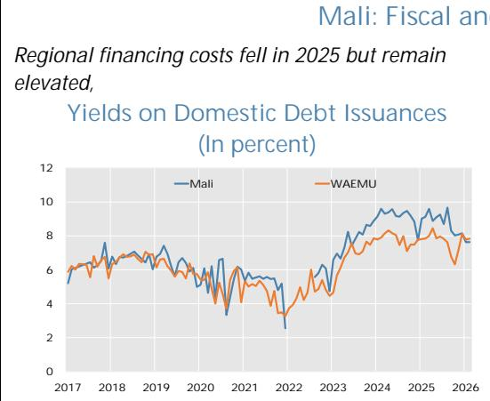

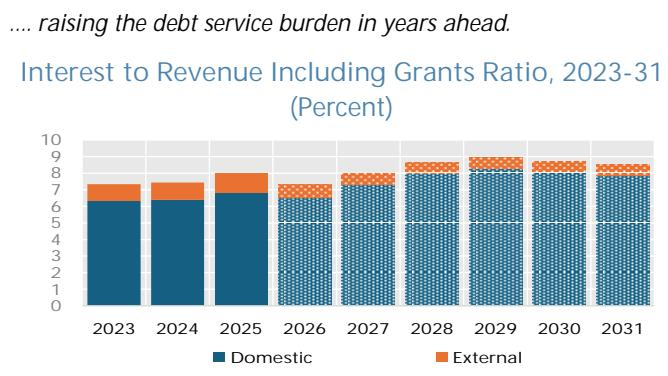

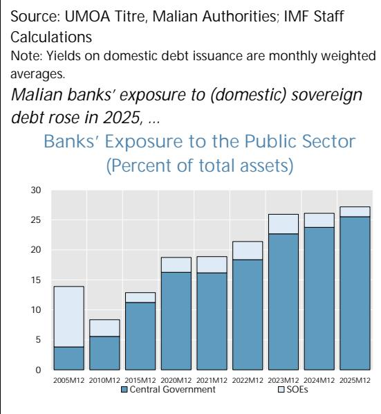  
Source: IMF Staff Calculations  
Source: Malian Authorities and IMF Staff Calculations
Note: lighter shades indicate projections according to the Debt Sustainability Analysis  
... increasing the (risk of) crowding out private sector credit.  
Claims on Public Sector/ Claims on Private Sector (Percent)

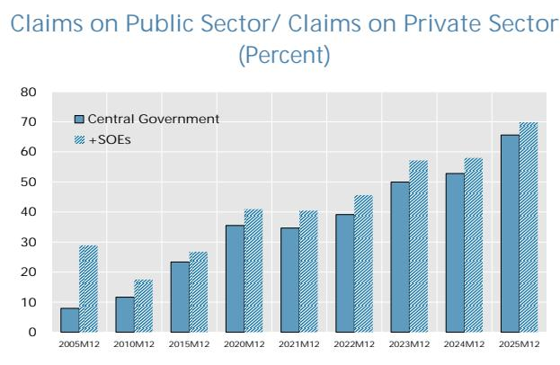  
Source: IMF Staff Calculations

## PROGRAM IMPLEMENTATION UNDER THE SMP

14. Program performance under the SMP's second review (end-December 2025 test date) was strong. Policies under the SMP remain on track, with revenue mobilization strengthened by digitalization of tax and customs administration and enhanced data sharing, including with the

Treasury. This performance is particularly notable given the challenging macroeconomic and security environment in the fourth quarter of last year.

15. Quantitative and indicative targets have been met. The authorities have met the indicative targets (ITs) on priority social spending and domestic arrears, and the quantitative targets (QTs) on net tax revenues excluding exceptional mining payments and the primary fiscal deficit (Table 2 and Table 8). Specifically:

\- Floor on priority social and development spending (IT). At end-December, priority social spending is estimated at CFAF 757 billion, exceeding the CFAF 671 billion floor, reflecting solid overperformance during the first SMP review (by 31 percent).

\- Floor on net tax revenues excluding exceptional mining payments (QT). By end-December, collections are estimated at CFAF 2,293 billion, exceeding the CFAF 2,077 billion floor, supported by ordinary mining and non-mining revenues in 2025 (¶9).

\- Ceiling on the net primary deficit (QT). By end-December, the net primary deficit is estimated at CFAF 6.4 billion, 293.6 billion below the CFAF 300 billion deficit ceiling.

\- External arrears (QT). External arrears amounted to CFAF 102.8 billion, slightly below the CFAF 103.5 billion benchmark for assessing performance. $^{6}$ The authorities explained that the timing of repayments, seemingly concentrated in the last quarter of the year, contributed to the stock of external arrears increasing by CFAF 6.7 billion between September and December.

\- Domestic arrears (IT). The zero ceiling on net arrears accumulation was met, with a significant reduction in arrears to private suppliers—from the end-December 2024 benchmark of CFAF 282.8 billion to CFAF 158.3 billion by end-December 2025—following repayments in 2025Q4. The authorities stated that budgetary resources were used to clear legacy arrears to suppliers from 2023 and 2024, which have now been fully repaid, emphasizing the importance of restoring liquidity to the private and banking sectors. They also plan to substantially reduce, if not eliminate, the stock of domestic arrears in 2026.

16. Structural benchmarks (SBs) for the end-December 2025 test date were met. The five end-December SBs—covering digitalization of tax payments, publication of the quarterly RCF usage report, disclosure of public procurement contracts, sharing the action plan to implement recommendations from the census of public sector bank accounts, and issuing instructions on data exchange between the DGTPC, DGD, and DGI—were fulfilled (Table 9):

\- On digitalization of payments, the target of 40 percent share of receipts via electronic payments by the end of 2025 has been met, as it reached 43.3 percent.

\- The second quarterly RCF spending report, published on the Ministry of Economy and Finance website, shows that additional funds corresponding to the RCF disbursements have been

utilized. $^{7}$ At this stage, and while recognizing that spending may continue through the end of the SMP, the provisionally reported expenditures exceed the amount of available RCF resources (see text table).

\- The authorities and BVG (Auditor General) confirmed the timeline of the audit of RCF expenditures, which must be finalized by June 2026. $^{8}$

\- The detailed list of public procurement contracts related to RCF spending has been updated on the portal of the DG Public Procurement (DGMP-DSP), with information on contract holders, beneficial owners, and the selection process. Additional procurements are mostly related to the Ministry of Health.

\- The authorities had shared an earlier draft action plan during the first review; this has since been

updated and implementation has begun. The plan includes the use of a consolidated database covering all bank accounts and the processing of requests for additional information from public entities prior to the closure of accounts (see next section for related policy discussion).

\- The instruction on the exchange of data related to liquidations, issuance and collection of tax liabilities between the

<table><tr><td colspan="4">Mali: Main Spending Categories of the RCF(Second quarterly report until end-October 2025)</td></tr><tr><td>Recipient</td><td>Category</td><td></td><td>Percent</td></tr><tr><td>Commissariat for Food Security</td><td>Food security</td><td>804</td><td>2.9</td></tr><tr><td>Ministry of Health</td><td>Health</td><td>4,318</td><td>15.6</td></tr><tr><td>Ministry of Water and Energy</td><td>Energy</td><td>22,216</td><td>80.5</td></tr><tr><td>Ministry of Environment</td><td>Health</td><td>251</td><td>0.9</td></tr><tr><td>Ministry of Education</td><td>Education</td><td>12</td><td>0</td></tr><tr><td>Total spending second report</td><td></td><td>27,602</td><td>100</td></tr><tr><td>Total spending first and second report</td><td></td><td>78,625</td><td></td></tr><tr><td>p.m. RCF disbursement</td><td></td><td>74,563</td><td></td></tr><tr><td colspan="4">Spending will be audited by BVG Pending BVG Audit, additional justification will be provided by the authorities for FCFA 22 billion included in the second report)</td></tr></table>

General Directorate of the Treasury and Public Accounting (DGTCP), the General Directorate of Customs (DGD) and the General Directorate of Taxes (DGI) was issued by the Ministry at the end of December.

## POLICY DISCUSSIONS

Policy discussions focused on strengthening the authorities' track record of reforms under the SMP, demonstrating effective policy implementation and transparent use of RCF resources. The discussions also considered policy priorities following the completion of the SMP, including the steps needed to sustain reform momentum to lay the groundwork for a potential future UCT-quality arrangement. Discussions of the reform agenda centered on strengthening fiscal policy—particularly governance and public financial management reforms—and ensuring prudent use of windfall mining revenues from record-high gold prices. $^{9}$

## A. Capitalizing on Good Times

17. Elevated gold prices, together with the recovery of lithium prices could improve export and fiscal revenues if these favorable conditions are sustained. However, given the volatility of commodity markets and uncertainties related to production dynamics and fiscal and cost structures in the mining sector, revenue gains may be more limited than headline price movements suggest. Staff therefore emphasized the importance of managing any upside prudently to preserve fiscal sustainability and intergenerational equity. $^{10}$ Strengthening governance and transparency in mining revenue management would help mitigate resource-curse risks and ensure that mining wealth translates into sustainable and inclusive development, as well as financial sector development. $^{11}$ In this regard, staff encouraged the authorities to carefully prioritize spending through the funds established under the 2023 mining code, which earmark mining revenues for specific development objectives.

## Mali: Capturing the Potential Revenue Windfall from Mining

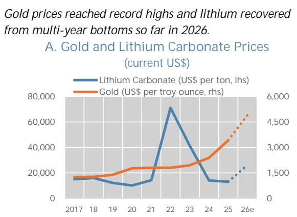  
This may translate into higher sales revenues in the years to come...  
B. Scenarios for Gold and Lithium Sales Value (current CFAF billions; mining quantity times price)  
Gold Lithium

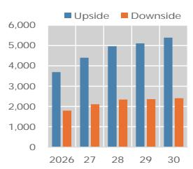

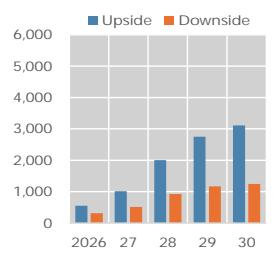  
Any upside in revenues can be spent on current outlays, investment, arrears payback, or saved for the future...
C. Fiscal Revenues from Gold and Lithium (percent of GDP; under alternate price scenarios)
Gold Lithium  
... but does not necessarily guarantee a better growth performance.

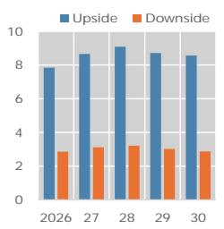

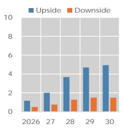  
D. Sub-Saharan Africa: Real GDP per Capita Growth, Post 2014 Growth Divergence (Median, PPP, international dollars)

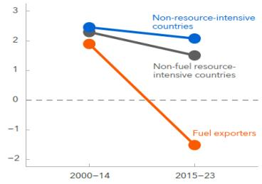  
Sources: Statista, CME, Mali DG Mines, IMF Staff Computations.

Notes: 26e = latest data from January 30, 2026. In panel B and C, Upside assumes futures curve for gold prices as of mid-January 2026 and lithium prices reaching 2022 levels by 2030. Downside assumes gold price curve from December 2023 and lithium prices staying around end-January 2026 levels. Quantities estimated by staff based on DG Mines survey. In Panel C, Government take is 40 percent in Upside scenario and 30 percent in Downside scenario. Panel D is from AFR REO, October 2024 Analytical Note One Region, Two Paths: Divergence in Sub-Saharan Africa.

18. Staff recommended adopting a medium-term fiscal framework that clearly distinguishes between mining and non-mining revenues and anchoring policymaking with a credible fiscal rule. This would allow differentiating between “normal” revenues and extraordinary mining-related revenue and smoothing spending of the latter over time. This approach would help avoid boom-bust cycles and manage mining wealth sustainability. Although broader reforms go beyond the scope of the SMP review, staff initiated discussions during the mission and will continue the dialogue through future engagements. Possible options, tailored to Mali’s fragile context and building on existing funds established under the mining code, include strengthening stabilization or sovereign wealth mechanisms, building fiscal and reserve buffers, reducing debt and arrears, scaling up well-targeted investment and diversification, and supporting social and environmental programs in mining-affected areas. $^{12}$ Discussions also focused on the appropriate balance between saving and spending windfall mining revenues, including the sequencing of expenditures and the prioritization of development needs to ensure fiscal sustainability and effective use of resources.

## B. Fiscal Policy

19. The 2026 budget, approved in December 2025, aims to balance fiscal support and sustainability. Staff's budget projections differ somewhat from the authorities' forecast, reflecting:

\- Higher tax revenues, stemming from higher mining receipts amid record gold prices and higher production forecast relative to the authorities' baseline;

\- Higher current expenditures, mostly driven by goods and services, subsidies and interest payments.

The 2026 budget foresees a 15 percent increase (yoy) in fiscal revenues, driven by higher direct and indirect tax revenues, relying in part on the implementation of the government's strategic development plan (Vision 2063), new tax measures implemented in 2025 (see above) and relatively high GDP

Mali: Comparison of 2026 Fiscal Projections by Staff and the Authorities

<table><tr><td rowspan="2"></td><td colspan="2">Staff</td><td colspan="2">Authorities</td></tr><tr><td>Billion CFAF</td><td>% GDP</td><td>Billion CFAF</td><td>% GDP</td></tr><tr><td>Revenue and grants</td><td>3,806</td><td>20.3</td><td>3,696</td><td>19.7</td></tr><tr><td>Total revenue</td><td>3,739</td><td>19.9</td><td>3,619</td><td>19.3</td></tr><tr><td>Budgetary revenue</td><td>2,984</td><td>15.9</td><td>2,864</td><td>15.3</td></tr><tr><td>Tax revenue</td><td>2,827</td><td>15.1</td><td>2,602</td><td>13.9</td></tr><tr><td>Direct taxes</td><td>961</td><td>5.1</td><td>936</td><td>5.0</td></tr><tr><td>Indirect taxes</td><td>1,866</td><td>10.0</td><td>1,764</td><td>9.4</td></tr><tr><td>VAT</td><td>830</td><td>4.4</td><td>825</td><td>4.4</td></tr><tr><td>Excises on petroleum products</td><td>198</td><td>1.1</td><td>198</td><td>1.1</td></tr><tr><td>Import duties</td><td>257</td><td>1.4</td><td>247</td><td>1.3</td></tr><tr><td>Other indirect taxes</td><td>679</td><td>3.6</td><td>494</td><td>2.6</td></tr><tr><td>Tax refund</td><td>-98</td><td>-0.5</td><td>-98</td><td>-0.5</td></tr><tr><td>Nontax revenue</td><td>156</td><td>0.8</td><td>137</td><td>0.7</td></tr><tr><td>Capital revenue</td><td>10</td><td>0.1</td><td>10</td><td>0.1</td></tr><tr><td>Special funds and annexed budgets</td><td>755</td><td>4.0</td><td>755</td><td>4.0</td></tr><tr><td>Grants</td><td>67</td><td>0.4</td><td>77</td><td>0.4</td></tr><tr><td>Total expenditure and net lending</td><td>4,261</td><td>22.7</td><td>4,119</td><td>22.0</td></tr><tr><td>Budgetary expenditure</td><td>3,509</td><td>18.7</td><td>3,367</td><td>18.0</td></tr><tr><td>Current expenditure</td><td>2,656</td><td>14.2</td><td>2,514</td><td>13.4</td></tr><tr><td>Wages and salaries</td><td>1,151</td><td>6.1</td><td>1,134</td><td>6.0</td></tr><tr><td>Goods and services</td><td>729</td><td>3.9</td><td>682</td><td>3.6</td></tr><tr><td>Transfers and subsidies</td><td>482</td><td>2.6</td><td>452</td><td>2.4</td></tr><tr><td>Interest</td><td>293</td><td>1.6</td><td>246</td><td>1.3</td></tr><tr><td>Capital expenditure</td><td>853</td><td>4.5</td><td>853</td><td>4.5</td></tr><tr><td>Special funds and annexed budgets</td><td>755</td><td>4.0</td><td>755</td><td>4.0</td></tr><tr><td>Net lending</td><td>-3</td><td>0.0</td><td>-4</td><td>0.0</td></tr><tr><td>Overall balance (accrual basis)</td><td>-455</td><td>-2.4</td><td>-423</td><td>-2.3</td></tr><tr><td>Net primary deficit</td><td>-161</td><td>-0.9</td><td>-177</td><td>-0.94</td></tr><tr><td colspan="5">Source: Staff Projections, Projet Loi de Finance 2026</td></tr></table>

growth. Staff expects mining revenues to exceed budget projections, as gold and lithium prices have risen by about 25 percent and 55 percent, respectively, since the budget was drafted in September 2025 (and further in early 2026). In contrast, nominal expenditures are projected to grow at 9 percent (yoy)—driven in part by capital expenditures, transfers, and subsidies. Staff's expenditure projections include some modest increases for goods and services and subsidies to account for the effect of higher fuel prices in 2026 stemming from the conflict in the Middle East.

20. While welcoming stronger revenues, staff emphasized the need for prudence and buffer-building amid potential mining windfalls and ongoing uncertainties. Fuel supply disruptions and related pressures may persist into 2026, especially given the outbreak of war in the Middle East. The budget targets a narrowing of the overall deficit from $2^{3/4}$ percent of GDP in 2025's budget law to $2^{1/4}$ percent in 2026, and of the primary deficit from 1.5 to 0.9 percent. In particular, staff stressed that the budget should be anchored on conservative, updated mining revenue projections, with a share of any windfall gains saved to bolster fiscal buffers against commodity price volatility and security risks. Limited, well-targeted spending in priority areas—such as security, social programs, and measures to ease fuel constraints—can be accommodated if revenues remain on track and permanent increases in recurrent spending, particularly the wage bill, are avoided (¶22).

21. Staff reiterated past advice to broaden the tax base in line with past TADAT recommendations, as non-mining revenues are projected to remain well below WAEMU's 20 percent-of-GDP target by 2031. Continued revenue mobilization should focus on advancing digitalization, expanding the taxpayer base (including fast-growing sectors), rationalizing VAT exemptions and excises, and developing property taxation through a real-estate cadaster. Staff cautioned against new taxes on basic food products given their regressive impact and noted IMF research highlighting the inefficiency of mobile money taxes, which can undermine financial inclusion and efforts to reduce informality. $^{13}$ The allocation of part of these proceeds to special funds will require strong governance and accountability mechanisms to ensure transparency, clear prioritization, and effective use of resources, including the institutional arrangements for managing these funds and their integration within the broader fiscal framework. The ongoing tax review should also incorporate measures to incentivize informal-sector formalization, including simplified regimes such as flat-rate taxation and streamlined social protection.

22. Discussions also focused on measures to improve the efficiency and composition of public spending, while supporting a faster pace of public investments. Besides recent HR reforms discussed in the first review, further gains could come from curbing waste through program-based budgeting and regular expenditure reviews. Staff welcomed the authorities' initial efforts to suspend ghost workers from the payroll but encouraged the use of biometric audits and regular verification to reduce potential errors and inconsistencies. Moreover, staff raised concerns about the recently approved changes to the wage bill and stressed the need for a comprehensive assessment to ensure that it does not trigger renewed wage pressures. While the authorities' preliminary assessment suggests that the impact on the wage bill would be marginal, staff emphasized the need for careful monitoring and verification. Staff also reiterated the need to reform loss-making SOEs, as highlighted in the 2025 Article IV consultation. At the same time, staff support scaling up public investment to offset recent under-execution and strengthen long-term growth, while noting the authorities' emphasis on mobilizing additional external financing to support higher investment. In this context, staff intend to have follow-up discussions on progress in addressing PIMA weaknesses identified in the 2018/2021 assessments $^{14}$ and will strongly encourage launching a new Public Expenditure and Financial Accountability (PEFA) framework assessment, given that the last one dates back to 2021.

23. As highlighted in the first SMP review, staff underscored the critical importance of improving debt and arrears management. Specifically, given rollover risks from the higher volume of debt maturing from 2026 onward and rising interest payments, the authorities agreed on the need to carefully manage the maturity profile of new borrowing. Similarly, they indicated that discussions with several external creditors are ongoing to establish modalities for the gradual settlement of outstanding arrears. Importantly, the authorities expressed a strong willingness to use available fiscal space to substantially reduce the stock of legacy domestic payment arrears, with the objective of restoring liquidity to the private sector, including the banking system.

## C. Enhancing Governance and Transparency

24. The mission emphasized that further strengthening governance remains essential. Since the 2021 Governance Diagnostic, Mali has advanced anti-corruption, judicial, and AML/CFT reforms, was removed from the FATF Grey List in June 2025 after addressing key deficiencies in its AML/CFT framework, and since then, has continued to strengthen AML/CFT measures. Staff stressed the need to make further progress, including on asset declarations and SOE oversight, as highlighted in the latest Article IV report. The authorities noted that a project is under preparation to strengthen governance, including a law to make the Court of Auditors fully operational, and a new law to support the rollout of online asset declarations.

25. Staff commended the authorities for the transparency and accountability improvements achieved under the SMP, while underscoring the need to deepen fiscal governance and PFM. Staff encouraged the authorities to carefully ensure that recorded expenditure remains consistent with the categories agreed under the program, to continue reporting expenditures, and cooperate with the BVG audit of the use of RCF resources, scheduled to be completed in June 2026. Staff also advocated for the implementation of the action plan following the census of public accounts, with strong monitoring, and continued refinements to incorporate

medium-term strategic actions supporting effective and sustainable cash management, with the aim of gradually moving toward a Treasury Single Account. Staff also requested further details on the broader fiscal governance reform agenda, particularly the timeline for consolidating the tax code in line with WAEMU and OHADA harmonization and revenue mobilization efforts, with a view to simplifying procedures and enhancing legal certainty for businesses. The information will inform more detailed discussion in future consultations.

## D. Other Issues

26. Safeguards assessments. The most recent safeguards assessment of the BCEAO was completed in August 2023. Progress on implementing the recommendations has been slow. A key recommendation was to align the BCEAO's Statute with the amendments introduced in the 2019 cooperation agreement with France. Staff continue to engage with the authorities to support follow-up efforts. The BCEAO welcomed the 2023 safeguard assessment finding that it “continues to have strong internal and external audit arrangements, sound financial reporting, and a well-established robust control environment.” The BCEAO also noted that following the assessment, it adopted a roadmap and incorporated related actions into its strategic plan to ensure effective implementation. On the pending recommendations, the BCEAO notes that progress is being made on aligning the BCEAO's Statute with the amendments introduced in the cooperation agreement with France. Thus far, four of the eight member States have ratified the revised cooperation agreement.

27. IMF capacity development (CD) should continue to support the authorities' reform efforts. Staff reiterated the importance of sustained CD engagement, focused on domestic revenue mobilization, public financial management, debt management, macroeconomic statistics, and governance. Following the recent upgrade of its national accounts to SNA 2008 standards with Fund support, Mali should continue to strengthen its macro fiscal framework and risk management, including developing fiscal rules to manage mining wealth and advancing tax and revenue administration reforms. Staff also discussed targeted support and training to enhance data management in customs and strengthen risk management practices.

## STAFF APPRAISAL

28. Mali is rebounding from the significant macroeconomic and humanitarian challenges in late 2025, as security tensions have eased and gold output is recovering. Terrorist attacks on fuel supply posed particular risks last year, given the economy's heavy reliance on fuel for power generation, manufacturing, agriculture and transportation, likely keeping growth below 5 percent in 2025 despite good performance in the first three quarters. Measures to restore fuel supply and security, significant repayment of domestic arrears, and the resolution of the mining dispute are expected to support a stronger recovery in 2026, with growth projected at 5.5 percent, although the recent conflict in the Middle East could have negative spillover effects on Mali.

29. Staff commends the authorities for the strong performance under the SMP, notwithstanding the shocks they have faced during the period. All quantitative and qualitative targets—including on priority social spending, net tax revenues, domestic and external arrears, and the primary deficit—were observed, and there was overperformance in some instances. All structural benchmarks, including digitalization of tax receipts, interconnectivity of tax departments, the publication of RCF spending and procurement, and the census of public sector bank accounts, were met.

30. A clearer distinction between mining and non-mining revenues is needed to guide fiscal policy in the context of historically high gold prices. Mining revenues have increased over the past two years following the reform of the mining code and are projected to rise further if gold and lithium prices remain elevated. Staff urged the authorities to manage these windfalls prudently through strong governance and transparency, careful prioritization of spending, and avoidance of procyclical policies. Staff also recommended developing a medium-term fiscal framework that clearly distinguishes between mining and non-mining revenues to better anchor fiscal policy. If well managed, these revenues could support sustainable and inclusive development in line with Vision 2063.

31. Fiscal sustainability, governance and PFM reforms, and continued arrears clearance remain key to improving the business climate and restoring investor confidence in the medium term. Staff welcomed the government's commitment to maintain a fiscal deficit below 3 percent of GDP while preserving priority social spending to address food insecurity, displacement, and the aftermath of the late-2025 fuel crisis. Staff supports efforts to broaden the tax base in a fair and transparent manner, including greater revenue mobilization from the informal economy, now better captured in the rebased GDP. Staff also emphasized the need for strong governance, transparency, and oversight of funds financed by mining revenues and other earmarked special funds established for specific policy objectives.

32. Staff supports the authorities' request for the completion of the second and final SMP review, based on strong program performance. Staff encouraged the authorities to sustain the reform momentum achieved under the SMP and to build on this progress toward a potential future UCT-quality program.

Real GDP growth in the first two quarters of 2025 slowed down compared with 2023 and 2024...

Figure 1. Mali: High-Frequency Indicators  
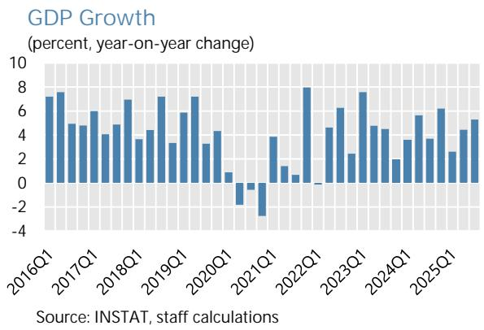

... reflecting contractions in the secondary and some of the tertiary sector.

Industrial and Services Sector (percent, year-on-year change)

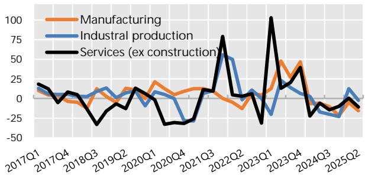  
Source: Malian Authorities; IMF Staff Computations  
Meanwhile, gold production continued to decline in 2025 even though gold market prices rose sharply, ...

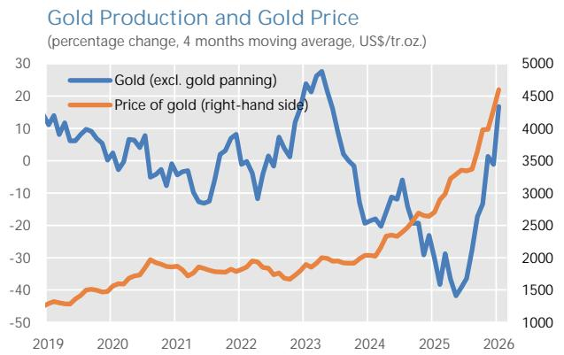  
Sources: Malian authorities; London Metal Exchange; IMF Staff Calculations

... while direct tax revenues rose, buoyed in particular by exceptional payments from mining companies.

Quarterly Tax Revenues (CFAF billions)

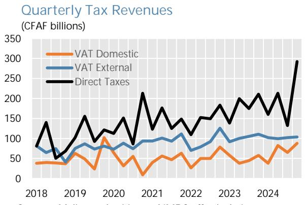  
Sources: Malian authorities and IMF Staff calculations  
Credit growth remained in negative territory for much of 2025 while deposit growth turned positive, relative to 2024 ...
Credit and Deposit Growth

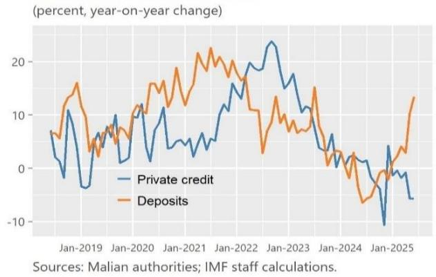  
... as domestic policy uncertainty intensified in Q3 2025.  
Uncertainty in Mali and the Rest of the World (Percent)

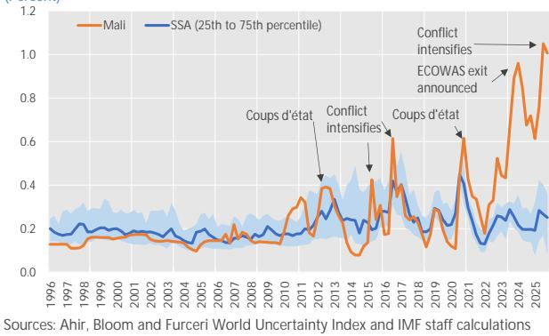

## Figure 2. Mali: Real Sector Developments

Mali's real GDP growth is expected to be slightly below the WAEMU average in the medium term, ...

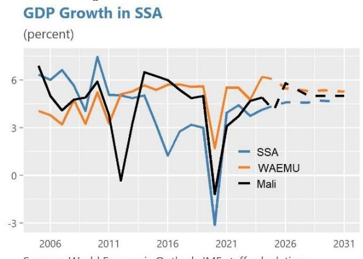  
Sources: World Economic Outlook; IMF staff calculations.  
The expected increase in growth from 2026 is broad-based across sectors ...

... with output expected to grow by 5 $^{1/4}$ percent annually in the medium term.

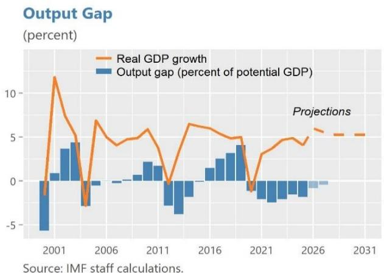  
Source: IMF staff calculations.  
Contributions to Growth: Supply Side  
...while on the demand side, the contributions from private consumption and public investment are expected to be larger from 2026 onwards.  
(year-on-year, percentage points)

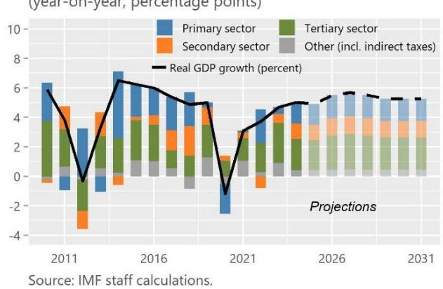  
Gold production fell back in 2025 but will recover from 2026 onwards amid record-high prices.

Contributions to Growth: Demand Side

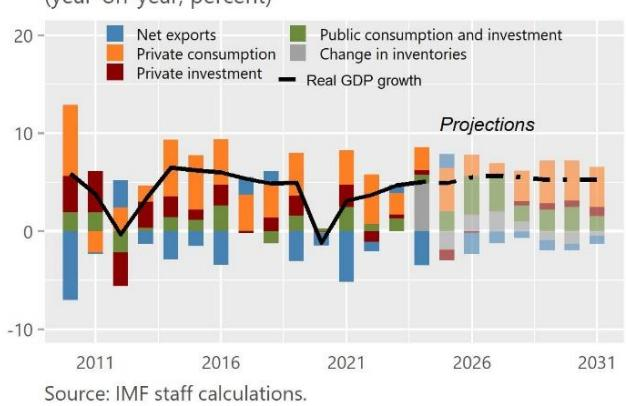  
Inflation is picking up in 2025 on the back of higher food prices and amidst rising uncertainty.  
Gold Production and Price (in \$/troy ounce and in tons)

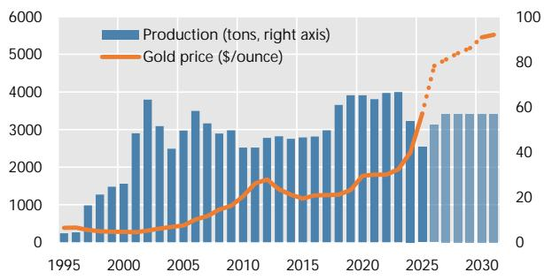  
Source: Malian authorities; IMF staff calculations  
Consumer Price Inflation and Components (percent, year-on-year change and contributions)

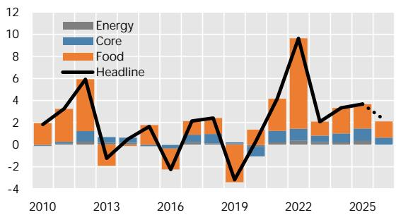  
Source: Malian authorities; IMF staff calculations

## Figure 3. Mali: External Sector Developments

The current account balance is expected to turn positive in 2026, reflecting a larger goods trade surplus ...

Current Account Balance

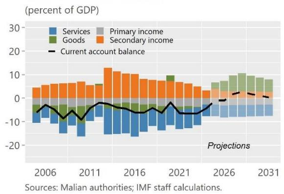  
Gold made up almost 80 percent of total exports in 2025 and is expected to remain Mali's key export commodity, ...  
... while the terms of trade is expected to improve in the short term, before worsening over the medium term.

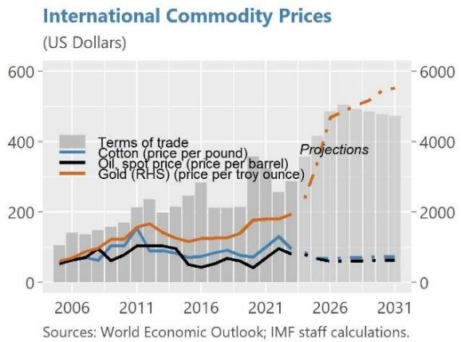  
Composition of Exports  
...while imports are estimated to remain broadly unchanged in 2026 relative to 2024 and 2025.

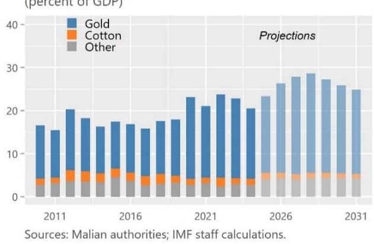  
Composition of Imports (percent of GDP)

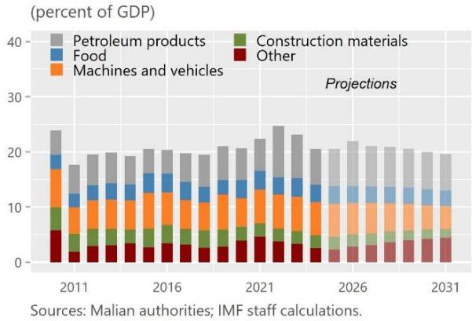  
Net external financing is expected to remain positive in 2025-2026 and should improve further over the medium term as gold production increases and budget support returns gradually in outer years.

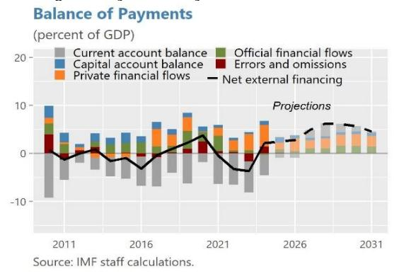  
The REER appreciated modestly at the start of 2025 before reversing course in H2, likely the result of higher inflation differentials with the rest of the world.

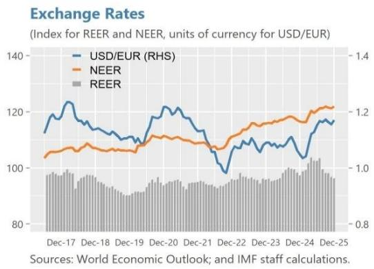

## Figure 4. Mali: Fiscal Developments

The fiscal deficit is expected to remain well below the WAEMU ceiling of 3 percent of GDP.

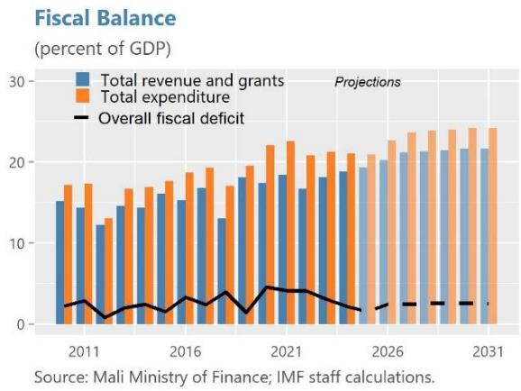  
The tax ratio is estimated to remain unchanged in 2025, and is expected to increase from 2026 onward  
Public debt is projected to decrease over the medium term, if current gold price trends remain in place.  
Total Public Debt (percent of GDP)

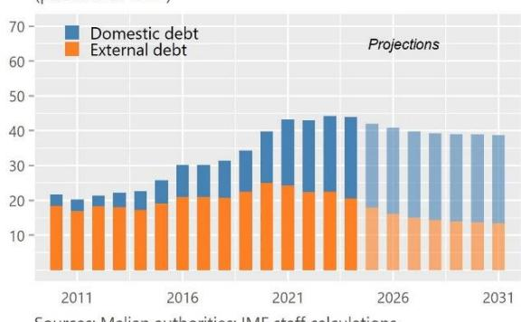  
... while the spending ratio is estimated to increase slightly from 2026 onward due to higher capital spending.  
Tax Revenues (percent of GDP)

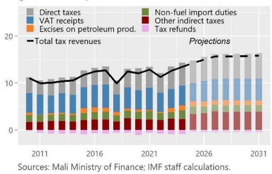  
Government Spending (percent of GDP)

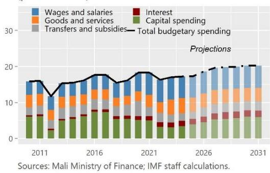  
External budget support has been at or near zero since 2021, ....  
External Public Grants and Loans (percent of GDP)

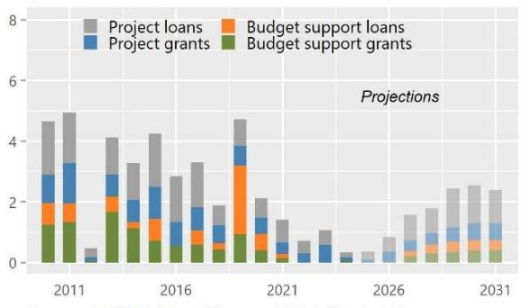  
... and the authorities have become reliant on expensive domestic financing to fund budget needs.
Financing

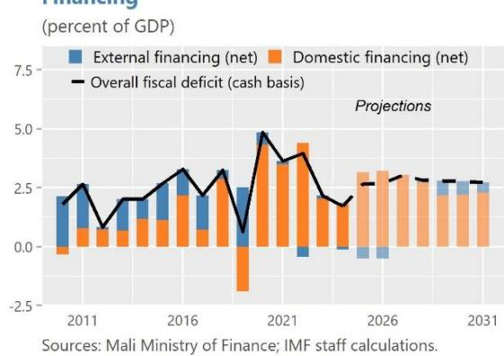

## Figure 5. Mali: Monetary and Financial Sector Developments

Private credit growth was negative in much of 2025, but shows signs of a turnaround by year-end...

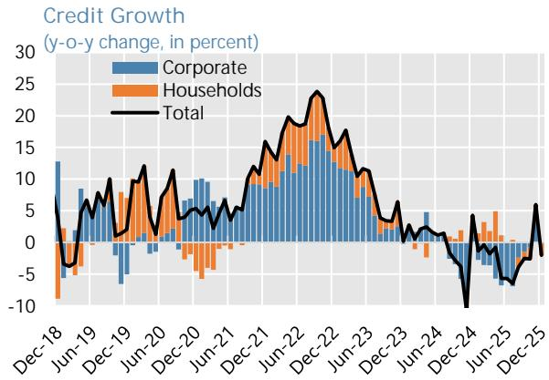  
The BCEAO (regional central bank) reduced the policy rate in July by 25 bps, with interbank rates following, ...  
... while deposit growth was positive, reversing the withdrawal of demand deposits during 2024.

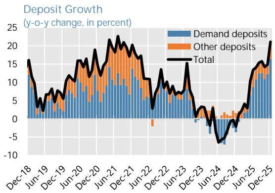  
... and the relatively large REER depreciation caused a loosening in financial conditions in H2 2025.  
BCEAO: Monetary Policy Rates (percent)

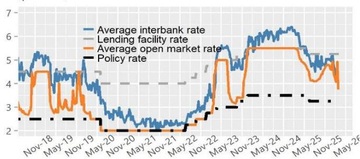  
Source: BCEAO; IMF staff calculations.
Note: In April 2020 the BCEAO moved from auctions with fixed amount-variable rate to a fixed rate-variable amount mechanism.  
Financial Conditions Index (index weights 50/50)

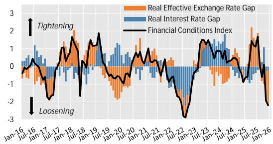  
Source: BCEAO; IMF Staff calculations.
Note: Real interest rate and REER gaps are relative to long-term trend.  
Mali's debt interest costs remain as elevated as in 2024, due to high yields on the regional market.

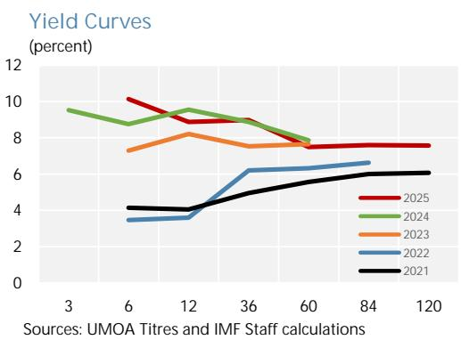  
On the regulatory side, banks' asset quality has remained broadly stable.  
Nonperforming Loans (percent of total loans)

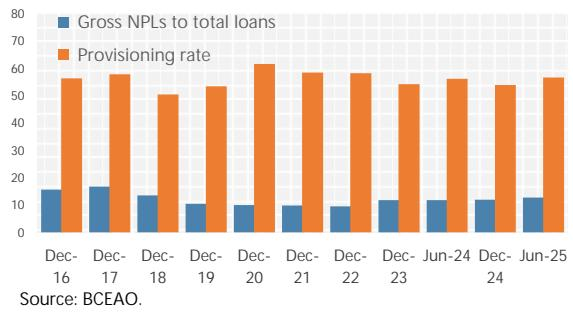

Table 1. Mali: Selected Economic and Financial Indicators, 2023–31

<table><tr><td rowspan="2"></td><td rowspan="2">2023</td><td rowspan="2">2024</td><td>2025</td><td>2025</td><td>2026</td><td>2026</td><td>2027</td><td>2028</td><td>2029</td><td>2030</td><td>2031</td></tr><tr><td>1Rev SMP</td><td>Est.</td><td>1Rev SMP</td><td colspan="6">Projections</td></tr><tr><td>National income and prices</td><td colspan="11">(Annual percentage change)</td></tr><tr><td>Real GDP</td><td>4.7</td><td>5.0</td><td>4.1</td><td>4.9</td><td>5.5</td><td>5.5</td><td>5.7</td><td>5.5</td><td>5.2</td><td>5.3</td><td>5.2</td></tr><tr><td>GDP deflator</td><td>1.9</td><td>2.7</td><td>2.5</td><td>2.5</td><td>2.2</td><td>2.2</td><td>2.0</td><td>2.0</td><td>2.0</td><td>2.0</td><td>2.0</td></tr><tr><td>Consumer price inflation (average)</td><td>2.1</td><td>3.2</td><td>2.9</td><td>2.9</td><td>2.5</td><td>2.2</td><td>2.0</td><td>2.0</td><td>2.0</td><td>2.0</td><td>2.0</td></tr><tr><td>Consumer price inflation (end of period)</td><td>-0.5</td><td>4.9</td><td>2.5</td><td>2.5</td><td>2.2</td><td>2.2</td><td>2.0</td><td>2.0</td><td>2.0</td><td>2.0</td><td>2.0</td></tr><tr><td>Money and credit</td><td></td><td></td><td></td><td></td><td></td><td></td><td></td><td></td><td></td><td></td><td></td></tr><tr><td>Credit to the government</td><td>34.8</td><td>0.2</td><td>19.2</td><td>17.7</td><td>20.1</td><td>20.0</td><td>18.2</td><td>12.9</td><td>8.9</td><td>8.8</td><td>9.1</td></tr><tr><td>Credit to the economy</td><td>0.3</td><td>4.1</td><td>-6.3</td><td>-1.7</td><td>7.9</td><td>7.9</td><td>7.8</td><td>7.6</td><td>7.4</td><td>7.4</td><td>7.4</td></tr><tr><td>Broad money (M2)</td><td>-1.1</td><td>1.8</td><td>0.1</td><td>12.0</td><td>7.9</td><td>7.9</td><td>7.8</td><td>7.6</td><td>7.4</td><td>7.4</td><td>7.4</td></tr><tr><td>Central government finance and public debt</td><td colspan="11">(Percent of GDP, unless otherwise indicated)</td></tr><tr><td>Revenue, o/w</td><td>17.6</td><td>18.7</td><td>18.3</td><td>19.3</td><td>18.3</td><td>19.9</td><td>20.6</td><td>20.6</td><td>20.6</td><td>20.7</td><td>20.8</td></tr><tr><td>Tax revenue</td><td>12.6</td><td>13.4</td><td>13.2</td><td>14.3</td><td>13.3</td><td>15.0</td><td>15.6</td><td>15.6</td><td>15.6</td><td>15.7</td><td>15.8</td></tr><tr><td>Grants</td><td>0.6</td><td>0.2</td><td>0.3</td><td>0.1</td><td>0.4</td><td>0.4</td><td>0.6</td><td>0.7</td><td>0.8</td><td>0.9</td><td>1.0</td></tr><tr><td>Total expenditure and net lending</td><td>21.2</td><td>21.0</td><td>21.3</td><td>20.9</td><td>21.3</td><td>22.6</td><td>23.6</td><td>23.9</td><td>24.0</td><td>24.2</td><td>24.2</td></tr><tr><td>Overall balance (accrual basis)</td><td>-3.0</td><td>-2.2</td><td>-2.7</td><td>-1.6</td><td>-2.6</td><td>-2.4</td><td>-2.4</td><td>-2.5</td><td>-2.5</td><td>-2.5</td><td>-2.5</td></tr><tr><td>Overall balance (cash basis)</td><td>-2.2</td><td>-1.7</td><td>-2.7</td><td>-2.6</td><td>-3.1</td><td>-2.7</td><td>-3.0</td><td>-2.8</td><td>-2.8</td><td>-2.8</td><td>-2.7</td></tr><tr><td>Public debt $^{1}$ </td><td>44.3</td><td>44.0</td><td>41.9</td><td>41.9</td><td>40.9</td><td>40.8</td><td>39.8</td><td>39.3</td><td>39.0</td><td>38.9</td><td>38.7</td></tr><tr><td>External public debt</td><td>22.5</td><td>20.6</td><td>18.0</td><td>17.9</td><td>16.9</td><td>16.2</td><td>15.0</td><td>14.4</td><td>14.0</td><td>13.8</td><td>13.4</td></tr><tr><td>Domestic public debt $^{2}$ </td><td>21.8</td><td>23.4</td><td>23.8</td><td>24.0</td><td>23.9</td><td>24.6</td><td>24.8</td><td>24.9</td><td>25.0</td><td>25.1</td><td>25.3</td></tr><tr><td>Debt service</td><td>6.0</td><td>5.7</td><td>6.1</td><td>6.9</td><td>8.6</td><td>9.4</td><td>10.0</td><td>12.0</td><td>11.6</td><td>11.6</td><td>11.8</td></tr><tr><td>External sector</td><td></td><td></td><td></td><td></td><td></td><td></td><td></td><td></td><td></td><td></td><td></td></tr><tr><td>Current account balance, including official transfers</td><td>-6.5</td><td>-4.3</td><td>-4.9</td><td>-0.9</td><td>-3.8</td><td>-1.0</td><td>1.7</td><td>2.7</td><td>1.8</td><td>1.1</td><td>0.3</td></tr><tr><td>Current account balance, excluding official transfers</td><td>-8.2</td><td>-4.5</td><td>-5.0</td><td>-1.9</td><td>-4.0</td><td>-1.1</td><td>1.4</td><td>2.2</td><td>1.3</td><td>0.5</td><td>-0.3</td></tr><tr><td>Exports of goods and services</td><td>24.7</td><td>22.3</td><td>23.1</td><td>25.0</td><td>23.8</td><td>28.0</td><td>29.5</td><td>30.2</td><td>28.8</td><td>27.5</td><td>26.4</td></tr><tr><td>Imports of goods and services</td><td>32.5</td><td>27.2</td><td>28.1</td><td>26.9</td><td>27.4</td><td>28.8</td><td>27.7</td><td>27.6</td><td>27.0</td><td>26.4</td><td>25.9</td></tr><tr><td>Overall balance of payments</td><td>-3.7</td><td>2.1</td><td>-1.1</td><td>2.5</td><td>-0.4</td><td>2.8</td><td>5.0</td><td>6.2</td><td>6.1</td><td>5.6</td><td>4.6</td></tr><tr><td>Terms of trade (deterioration -)</td><td>12.2</td><td>24.9</td><td>4.6</td><td>4.7</td><td>-0.5</td><td>9.4</td><td>10.3</td><td>1.4</td><td>-1.5</td><td>-1.7</td><td>-1.3</td></tr><tr><td>Real effective exchange rate (depreciation -)</td><td>2.1</td><td>1.4</td><td>...</td><td>...</td><td>...</td><td>...</td><td>...</td><td>...</td><td>...</td><td>...</td><td>...</td></tr><tr><td>Memorandum items:</td><td></td><td></td><td></td><td></td><td></td><td></td><td></td><td></td><td></td><td></td><td></td></tr><tr><td>Nominal GDP (CFAF billions) $^{3}$ </td><td>15,051</td><td>16,233</td><td>17,301</td><td>17,454</td><td>18,664</td><td>18,828</td><td>20,299</td><td>21,844</td><td>23,451</td><td>25,175</td><td>27,027</td></tr><tr><td>Nominal GDP (US$ billions)</td><td>24.8</td><td>26.8</td><td>29.8</td><td>30.0</td><td>33.2</td><td>33.8</td><td>36.4</td><td>39.1</td><td>41.9</td><td>45.0</td><td>48.3</td></tr><tr><td>Mining GDP (CFAF billions)</td><td>1,848</td><td>1,670</td><td>1,740</td><td>1,755</td><td>1,916</td><td>1,933</td><td>2,142</td><td>2,255</td><td>2,339</td><td>2,434</td><td>2,613</td></tr><tr><td>Public debt (CFAF billions)</td><td>6,666</td><td>7,147</td><td>7,241</td><td>7,312</td><td>7,625</td><td>7,683</td><td>8,087</td><td>8,579</td><td>9,148</td><td>9,782</td><td>10,465</td></tr><tr><td>US$ exchange rate (average)</td><td>606</td><td>606</td><td>581</td><td>581</td><td>...</td><td>...</td><td>...</td><td>...</td><td>...</td><td>...</td><td>...</td></tr><tr><td>US$ exchange rate (end of period)</td><td>602</td><td>626</td><td>562</td><td>560</td><td>...</td><td>...</td><td>...</td><td>...</td><td>...</td><td>...</td><td>...</td></tr><tr><td>WAEMU Pooled Reserves (end of period, US$ billions)</td><td>15.8</td><td>21.6</td><td>...</td><td>...</td><td>...</td><td>...</td><td>...</td><td>...</td><td>...</td><td>...</td><td>...</td></tr><tr><td>WAEMU Pooled Reserves (end of period, CFAF billions)</td><td>9,484</td><td>13,517</td><td>...</td><td>...</td><td>...</td><td>...</td><td>...</td><td>...</td><td>...</td><td>...</td><td>...</td></tr><tr><td>Months of imports of goods and services next year</td><td>3.3</td><td>4.5</td><td>...</td><td>...</td><td>...</td><td>...</td><td>...</td><td>...</td><td>...</td><td>...</td><td>...</td></tr><tr><td>Percent of broad money</td><td>20.0</td><td>26.2</td><td>...</td><td>...</td><td>...</td><td>...</td><td>...</td><td>...</td><td>...</td><td>...</td><td>...</td></tr><tr><td>Gold Price (US$/fine ounce London fix)</td><td>1,943</td><td>2,387</td><td>3,247</td><td>3,440</td><td>...</td><td>...</td><td>...</td><td>...</td><td>...</td><td>...</td><td>...</td></tr><tr><td>Cotton price (CFAF/kg)</td><td>1,207</td><td>1,100</td><td>956</td><td>942</td><td>...</td><td>...</td><td>...</td><td>...</td><td>...</td><td>...</td><td>...</td></tr><tr><td>Petroleum price (crude spot)(US$/bbl)</td><td>81</td><td>79</td><td>69</td><td>68</td><td>...</td><td>...</td><td>...</td><td>...</td><td>...</td><td>...</td><td>...</td></tr></table>

Table 2a. Mali: Consolidated Fiscal Transactions of The Central Government, 2022–31 (GFSM86 and CFAF billions)

<table><tr><td rowspan="2"></td><td rowspan="2">2022</td><td rowspan="2">2023</td><td rowspan="2">2024</td><td>2025</td><td>2025</td><td>2026</td><td>2026</td><td>2027</td><td>2028</td><td>2029</td><td>2030</td><td>2031</td></tr><tr><td>1Rev SMP</td><td>Est.</td><td>1Rev SMP</td><td></td><td></td><td colspan="4">Projections</td></tr><tr><td>Revenue and grants</td><td>2,360</td><td>2,733</td><td>3,061</td><td>3,220</td><td>3,376</td><td>3,490</td><td>3,806</td><td>4,302</td><td>4,656</td><td>5,031</td><td>5,449</td><td>5,866</td></tr><tr><td>Total revenue</td><td>2,318</td><td>2,645</td><td>3,034</td><td>3,170</td><td>3,362</td><td>3,423</td><td>3,739</td><td>4,190</td><td>4,508</td><td>4,837</td><td>5,210</td><td>5,609</td></tr><tr><td>Budgetary revenue</td><td>1,687</td><td>2,014</td><td>2,410</td><td>2,492</td><td>2,720</td><td>2,703</td><td>2,984</td><td>3,376</td><td>3,632</td><td>3,896</td><td>4,200</td><td>4,525</td></tr><tr><td> $Tax revenue^1$ </td><td>1,591</td><td>1,902</td><td>2,183</td><td>2,290</td><td>2,496</td><td>2,489</td><td>2,827</td><td>3,175</td><td>3,418</td><td>3,668</td><td>3,960</td><td>4,269</td></tr><tr><td>Direct taxes</td><td>595</td><td>723</td><td>797</td><td>854</td><td>830</td><td>936</td><td>961</td><td>1,086</td><td>1,157</td><td>1,236</td><td>1,349</td><td>1,461</td></tr><tr><td>Indirect taxes</td><td>996</td><td>1,179</td><td>1,385</td><td>1,436</td><td>1,666</td><td>1,553</td><td>1,866</td><td>2,089</td><td>2,261</td><td>2,431</td><td>2,611</td><td>2,808</td></tr><tr><td>VAT</td><td>572</td><td>606</td><td>681</td><td>709</td><td>682</td><td>762</td><td>830</td><td>919</td><td>998</td><td>1,081</td><td>1,171</td><td>1,269</td></tr><tr><td>Excises on petroleum products</td><td>36</td><td>132</td><td>172</td><td>174</td><td>192</td><td>188</td><td>198</td><td>194</td><td>237</td><td>248</td><td>258</td><td>275</td></tr><tr><td>Import duties</td><td>209</td><td>218</td><td>304</td><td>225</td><td>287</td><td>237</td><td>257</td><td>288</td><td>312</td><td>331</td><td>349</td><td>372</td></tr><tr><td>Other indirect taxes</td><td>295</td><td>353</td><td>371</td><td>432</td><td>583</td><td>464</td><td>679</td><td>794</td><td>829</td><td>896</td><td>967</td><td>1,041</td></tr><tr><td>Tax refund</td><td>-116</td><td>-131</td><td>-143</td><td>-104</td><td>-79</td><td>-98</td><td>-98</td><td>-106</td><td>-115</td><td>-124</td><td>-135</td><td>-149</td></tr><tr><td>Nontax revenue</td><td>96</td><td>112</td><td>227</td><td>202</td><td>224</td><td>214</td><td>156</td><td>201</td><td>214</td><td>229</td><td>240</td><td>255</td></tr><tr><td>Capital revenue</td><td>1</td><td>2</td><td>1</td><td>15</td><td>0</td><td>10</td><td>10</td><td>11</td><td>12</td><td>13</td><td>14</td><td>15</td></tr><tr><td>Special funds and annexed budgets</td><td>631</td><td>632</td><td>623</td><td>678</td><td>642</td><td>720</td><td>755</td><td>814</td><td>876</td><td>941</td><td>1,010</td><td>1,084</td></tr><tr><td>Grants</td><td>43</td><td>88</td><td>28</td><td>50</td><td>13</td><td>67</td><td>67</td><td>112</td><td>147</td><td>193</td><td>239</td><td>257</td></tr><tr><td>Projects grants</td><td>43</td><td>88</td><td>20</td><td>50</td><td>13</td><td>65</td><td>65</td><td>71</td><td>82</td><td>111</td><td>138</td><td>149</td></tr><tr><td>Budgetary support</td><td>0</td><td>0</td><td>8</td><td>0</td><td>0</td><td>2</td><td>2</td><td>41</td><td>66</td><td>82</td><td>101</td><td>108</td></tr><tr><td>Of which: General</td><td>0</td><td>0</td><td>1</td><td>0</td><td>0</td><td>0</td><td>0</td><td>41</td><td>66</td><td>82</td><td>101</td><td>108</td></tr><tr><td>Of which: Sectoral</td><td>0</td><td>0</td><td>7</td><td>0</td><td>0</td><td>2</td><td>2</td><td>0</td><td>0</td><td>0</td><td>0</td><td>0</td></tr><tr><td>Total expenditure and net lending $^2$ </td><td>2,932</td><td>3,192</td><td>3,412</td><td>3,682</td><td>3,653</td><td>3,967</td><td>4,261</td><td>4,799</td><td>5,210</td><td>5,624</td><td>6,088</td><td>6,542</td></tr><tr><td>Budgetary expenditure</td><td>2,306</td><td>2,566</td><td>2,791</td><td>3,008</td><td>3,012</td><td>3,251</td><td>3,509</td><td>3,988</td><td>4,337</td><td>4,687</td><td>5,081</td><td>5,461</td></tr><tr><td>Current expenditure</td><td>1,846</td><td>2,099</td><td>2,231</td><td>2,365</td><td>2,331</td><td>2,498</td><td>2,656</td><td>2,912</td><td>3,164</td><td>3,359</td><td>3,553</td><td>3,843</td></tr><tr><td>Wages and salaries</td><td>878</td><td>943</td><td>963</td><td>1,056</td><td>1,026</td><td>1,134</td><td>1,151</td><td>1,248</td><td>1,338</td><td>1,445</td><td>1,545</td><td>1,668</td></tr><tr><td>Goods and services</td><td>426</td><td>624</td><td>697</td><td>700</td><td>694</td><td>696</td><td>729</td><td>802</td><td>843</td><td>876</td><td>913</td><td>995</td></tr><tr><td>Transfers and subsidies</td><td>365</td><td>331</td><td>343</td><td>394</td><td>341</td><td>421</td><td>482</td><td>521</td><td>564</td><td>609</td><td>657</td><td>710</td></tr><tr><td>Interest</td><td>177</td><td>201</td><td>228</td><td>214</td><td>271</td><td>246</td><td>293</td><td>340</td><td>419</td><td>430</td><td>438</td><td>470</td></tr><tr><td>Capital expenditure</td><td>460</td><td>467</td><td>560</td><td>643</td><td>681</td><td>753</td><td>853</td><td>1,076</td><td>1,174</td><td>1,328</td><td>1,528</td><td>1,618</td></tr><tr><td>Externally financed</td><td>95</td><td>113</td><td>53</td><td>165</td><td>63</td><td>167</td><td>167</td><td>242</td><td>259</td><td>411</td><td>453</td><td>448</td></tr><tr><td>Domestically financed</td><td>365</td><td>353</td><td>507</td><td>478</td><td>617</td><td>586</td><td>686</td><td>834</td><td>915</td><td>916</td><td>1,075</td><td>1,170</td></tr><tr><td>Special funds and annexed budgets</td><td>631</td><td>632</td><td>623</td><td>678</td><td>642</td><td>720</td><td>755</td><td>814</td><td>876</td><td>941</td><td>1,010</td><td>1,084</td></tr><tr><td>Net lending</td><td>-5</td><td>-5</td><td>-2</td><td>-4</td><td>-1</td><td>-4</td><td>-3</td><td>-4</td><td>-4</td><td>-4</td><td>-4</td><td>-4</td></tr><tr><td>Overall balance (accrual basis)</td><td>-571</td><td>-459</td><td>-351</td><td>-462</td><td>-277</td><td>-476</td><td>-455</td><td>-497</td><td>-554</td><td>-593</td><td>-639</td><td>-676</td></tr><tr><td>Adjustment to cash basis</td><td>13</td><td>135</td><td>80</td><td>0</td><td>-184</td><td>-111</td><td>-54</td><td>-120</td><td>-60</td><td>-60</td><td>-60</td><td>-60</td></tr><tr><td>Overall balance (cash basis)</td><td>-558</td><td>-324</td><td>-279</td><td>-462</td><td>-461</td><td>-587</td><td>-509</td><td>-616</td><td>-614</td><td>-653</td><td>-699</td><td>-736</td></tr><tr><td>Financing</td><td>558</td><td>324</td><td>279</td><td>462</td><td>461</td><td>587</td><td>509</td><td>616</td><td>614</td><td>653</td><td>699</td><td>736</td></tr><tr><td>External financing (net)</td><td>-62</td><td>19</td><td>-23</td><td>-17</td><td>-90</td><td>34</td><td>-97</td><td>-1</td><td>21</td><td>142</td><td>145</td><td>117</td></tr><tr><td>Loans</td><td>56</td><td>73</td><td>27</td><td>201</td><td>50</td><td>275</td><td>90</td><td>205</td><td>242</td><td>380</td><td>400</td><td>391</td></tr><tr><td>Project loans</td><td>56</td><td>73</td><td>27</td><td>201</td><td>50</td><td>275</td><td>90</td><td>171</td><td>177</td><td>300</td><td>315</td><td>299</td></tr><tr><td>Budgetary loans</td><td>0</td><td>0</td><td>0</td><td>0</td><td>0</td><td>0</td><td>0</td><td>35</td><td>66</td><td>80</td><td>86</td><td>92</td></tr><tr><td>Amortization</td><td>-127</td><td>-89</td><td>-98</td><td>-223</td><td>-145</td><td>-241</td><td>-191</td><td>-206</td><td>-222</td><td>-238</td><td>-256</td><td>-274</td></tr><tr><td>Debt relief</td><td>9</td><td>5</td><td>6</td><td>5</td><td>5</td><td>0</td><td>4</td><td>0</td><td>0</td><td>0</td><td>0</td><td>0</td></tr><tr><td>Variation of External Arrears (Principal)</td><td>0</td><td>30</td><td>43</td><td>0</td><td>0</td><td>0</td><td>0</td><td>0</td><td>0</td><td>0</td><td>0</td><td>0</td></tr><tr><td>Domestic financing (net)</td><td>620</td><td>305</td><td>302</td><td>479</td><td>621</td><td>553</td><td>606</td><td>617</td><td>594</td><td>511</td><td>554</td><td>619</td></tr><tr><td>Banking system</td><td>590</td><td>255</td><td>232</td><td>484</td><td>427</td><td>437</td><td>428</td><td>469</td><td>393</td><td>306</td><td>330</td><td>369</td></tr><tr><td>Central bank</td><td>57</td><td>-19</td><td>-76</td><td>32</td><td>19</td><td>-56</td><td>-59</td><td>-55</td><td>-45</td><td>-35</td><td>-27</td><td>-18</td></tr><tr><td>Of which: IMF (net)</td><td>-12</td><td>-21</td><td>-29</td><td>32</td><td>29</td><td>-56</td><td>-59</td><td>-55</td><td>-45</td><td>-35</td><td>-27</td><td>-18</td></tr><tr><td>Commercial banks</td><td>532</td><td>488</td><td>78</td><td>452</td><td>373</td><td>492</td><td>487</td><td>524</td><td>438</td><td>341</td><td>356</td><td>387</td></tr><tr><td>Adjustment $^3$ </td><td>0</td><td>-184</td><td>230</td><td>0</td><td>35</td><td>0</td><td>0</td><td>0</td><td>0</td><td>0</td><td>0</td><td>0</td></tr><tr><td>Privatization receipts</td><td>-4</td><td>-5</td><td>-1</td><td>-15</td><td>-21</td><td>0</td><td>-35</td><td>0</td><td>0</td><td>0</td><td>0</td><td>0</td></tr><tr><td>Other financing</td><td>34</td><td>55</td><td>70</td><td>10</td><td>215</td><td>116</td><td>213</td><td>148</td><td>201</td><td>206</td><td>224</td><td>250</td></tr><tr><td>Financing gap</td><td>0</td><td>0</td><td>0</td><td>0</td><td>0</td><td>0</td><td>0</td><td>0</td><td>0</td><td>0</td><td>0</td><td>0</td></tr><tr><td>Memorandum items:</td><td></td><td></td><td></td><td></td><td></td><td></td><td></td><td></td><td></td><td></td><td></td><td></td></tr><tr><td>Nominal GDP</td><td>14,102</td><td>15,051</td><td>16,233</td><td>17,301</td><td>17,454</td><td>18,664</td><td>18,828</td><td>20,299</td><td>21,844</td><td>23,451</td><td>25,175</td><td>27,027</td></tr><tr><td>Net primary balance (accruals basis)</td><td>-394</td><td>-258</td><td>-123</td><td>-247</td><td>-6</td><td>-231</td><td>-161</td><td>-156</td><td>-135</td><td>-163</td><td>-201</td><td>-205</td></tr><tr><td>Tax revenues ex exceptional mining payments</td><td>1,591</td><td>1,902</td><td>1,998</td><td>2,200</td><td>2,309</td><td>2,489</td><td>2,827</td><td>3,175</td><td>3,418</td><td>3,668</td><td>3,960</td><td>4,269</td></tr><tr><td>Mining sector tax revenues $^4$ </td><td>659</td><td>544</td><td>655</td><td>476</td><td>868</td><td>575</td><td>1,285</td><td>1,525</td><td>1,685</td><td>1,701</td><td>1,726</td><td>1,761</td></tr></table>

Sources: Ministry of Economy and Finance; and IMF staff estimates and projections.  
$^{1}$ Tax revenue projections are based on staff projections, and budget expenditure projections are based on the 2026 draft budget adopted by the authorities. $^{2}$ Accrual basis.  
$^{3}$ Adjustment to account for the difference between the definitions of the government in the fiscal table and the monetary situation.  
$^{4}$ Data before 2020 are from EITI.

<table><tr><td rowspan="2"></td><td rowspan="2">2022</td><td rowspan="2">2023</td><td rowspan="2">2024</td><td>2025</td><td>2025</td><td>2026</td><td>2026</td><td>2027</td><td>2028</td><td>2029</td><td>2030</td><td>2031</td></tr><tr><td>1Rev SMP</td><td>Est.</td><td>1Rev SMP</td><td></td><td></td><td colspan="4">Projections</td></tr><tr><td>Revenue and grants</td><td>16.7</td><td>18.2</td><td>18.9</td><td>18.6</td><td>19.3</td><td>18.7</td><td>20.2</td><td>21.2</td><td>21.3</td><td>21.5</td><td>21.6</td><td>21.7</td></tr><tr><td>Total revenue</td><td>16.4</td><td>17.6</td><td>18.7</td><td>18.3</td><td>19.3</td><td>18.3</td><td>19.9</td><td>20.6</td><td>20.6</td><td>20.6</td><td>20.7</td><td>20.8</td></tr><tr><td>Budgetary revenue</td><td>12.0</td><td>13.4</td><td>14.8</td><td>14.4</td><td>15.6</td><td>14.5</td><td>15.8</td><td>16.6</td><td>16.6</td><td>16.6</td><td>16.7</td><td>16.7</td></tr><tr><td> $Tax revenue^1$ </td><td>11.3</td><td>12.6</td><td>13.4</td><td>13.2</td><td>14.3</td><td>13.3</td><td>15.0</td><td>15.6</td><td>15.6</td><td>15.6</td><td>15.7</td><td>15.8</td></tr><tr><td>Direct taxes</td><td>4.2</td><td>4.8</td><td>4.9</td><td>4.9</td><td>4.8</td><td>5.0</td><td>5.1</td><td>5.3</td><td>5.3</td><td>5.3</td><td>5.4</td><td>5.4</td></tr><tr><td>Indirect taxes</td><td>7.1</td><td>7.8</td><td>8.5</td><td>8.3</td><td>9.5</td><td>8.3</td><td>9.9</td><td>10.3</td><td>10.4</td><td>10.4</td><td>10.4</td><td>10.4</td></tr><tr><td>VAT</td><td>4.1</td><td>4.0</td><td>4.2</td><td>4.1</td><td>3.9</td><td>4.1</td><td>4.4</td><td>4.5</td><td>4.6</td><td>4.6</td><td>4.7</td><td>4.7</td></tr><tr><td>Excises on petroleum products</td><td>0.3</td><td>0.9</td><td>1.1</td><td>1.0</td><td>1.1</td><td>1.0</td><td>1.1</td><td>1.0</td><td>1.1</td><td>1.1</td><td>1.0</td><td>1.0</td></tr><tr><td>Import duties</td><td>1.5</td><td>1.5</td><td>1.9</td><td>1.3</td><td>1.6</td><td>1.3</td><td>1.4</td><td>1.4</td><td>1.4</td><td>1.4</td><td>1.4</td><td>1.4</td></tr><tr><td>Other indirect taxes</td><td>2.1</td><td>2.3</td><td>2.3</td><td>2.5</td><td>3.3</td><td>2.5</td><td>3.6</td><td>3.9</td><td>3.8</td><td>3.8</td><td>3.8</td><td>3.9</td></tr><tr><td>Tax refund</td><td>-0.8</td><td>-0.9</td><td>-0.9</td><td>-0.6</td><td>-0.5</td><td>-0.5</td><td>-0.5</td><td>-0.5</td><td>-0.5</td><td>-0.5</td><td>-0.5</td><td>-0.6</td></tr><tr><td>Nontax revenue</td><td>0.7</td><td>0.7</td><td>1.4</td><td>1.2</td><td>1.3</td><td>1.1</td><td>0.8</td><td>1.0</td><td>1.0</td><td>1.0</td><td>1.0</td><td>0.9</td></tr><tr><td>Capital revenue</td><td>0.0</td><td>0.0</td><td>0.0</td><td>0.1</td><td>0.0</td><td>0.1</td><td>0.1</td><td>0.1</td><td>0.1</td><td>0.1</td><td>0.1</td><td>0.1</td></tr><tr><td>Special funds and annexed budgets</td><td>4.5</td><td>4.2</td><td>3.8</td><td>3.9</td><td>3.7</td><td>3.9</td><td>4.0</td><td>4.0</td><td>4.0</td><td>4.0</td><td>4.0</td><td>4.0</td></tr><tr><td>Grants</td><td>0.3</td><td>0.6</td><td>0.2</td><td>0.3</td><td>0.1</td><td>0.4</td><td>0.4</td><td>0.6</td><td>0.7</td><td>0.8</td><td>0.9</td><td>1.0</td></tr><tr><td>Projects grants</td><td>0.3</td><td>0.6</td><td>0.1</td><td>0.3</td><td>0.1</td><td>0.3</td><td>0.3</td><td>0.4</td><td>0.4</td><td>0.5</td><td>0.6</td><td>0.6</td></tr><tr><td>Budgetary support</td><td>0.0</td><td>0.0</td><td>0.0</td><td>0.0</td><td>0.0</td><td>0.0</td><td>0.0</td><td>0.2</td><td>0.3</td><td>0.4</td><td>0.4</td><td>0.4</td></tr><tr><td>Of which: General</td><td>0.0</td><td>0.0</td><td>0.0</td><td>0.0</td><td>0.0</td><td>0.0</td><td>0.0</td><td>0.2</td><td>0.3</td><td>0.4</td><td>0.4</td><td>0.4</td></tr><tr><td>Of which: Sectoral</td><td>0.0</td><td>0.0</td><td>0.0</td><td>0.0</td><td>0.0</td><td>0.0</td><td>0.0</td><td>0.0</td><td>0.0</td><td>0.0</td><td>0.0</td><td>0.0</td></tr><tr><td>Total expenditure and net  $lending^2$ </td><td>20.8</td><td>21.2</td><td>21.0</td><td>21.3</td><td>20.9</td><td>21.3</td><td>22.6</td><td>23.6</td><td>23.9</td><td>24.0</td><td>24.2</td><td>24.2</td></tr><tr><td>Budgetary expenditure</td><td>16.4</td><td>17.0</td><td>17.2</td><td>17.4</td><td>17.3</td><td>17.4</td><td>18.6</td><td>19.6</td><td>19.9</td><td>20.0</td><td>20.2</td><td>20.2</td></tr><tr><td>Current expenditure</td><td>13.1</td><td>13.9</td><td>13.7</td><td>13.7</td><td>13.4</td><td>13.4</td><td>14.1</td><td>14.3</td><td>14.5</td><td>14.3</td><td>14.1</td><td>14.2</td></tr><tr><td>Wages and salaries</td><td>6.2</td><td>6.3</td><td>5.9</td><td>6.1</td><td>5.9</td><td>6.1</td><td>6.1</td><td>6.1</td><td>6.1</td><td>6.2</td><td>6.1</td><td>6.2</td></tr><tr><td>Goods and services</td><td>3.0</td><td>4.1</td><td>4.3</td><td>4.0</td><td>4.0</td><td>3.7</td><td>3.9</td><td>4.0</td><td>3.9</td><td>3.7</td><td>3.6</td><td>3.7</td></tr><tr><td>Transfers and subsidies</td><td>2.6</td><td>2.2</td><td>2.1</td><td>2.3</td><td>2.0</td><td>2.3</td><td>2.6</td><td>2.6</td><td>2.6</td><td>2.6</td><td>2.6</td><td>2.6</td></tr><tr><td>Interest</td><td>1.3</td><td>1.3</td><td>1.4</td><td>1.2</td><td>1.6</td><td>1.3</td><td>1.6</td><td>1.7</td><td>1.9</td><td>1.8</td><td>1.7</td><td>1.7</td></tr><tr><td>Capital expenditure</td><td>3.3</td><td>3.1</td><td>3.5</td><td>3.7</td><td>3.9</td><td>4.0</td><td>4.5</td><td>5.3</td><td>5.4</td><td>5.7</td><td>6.1</td><td>6.0</td></tr><tr><td>Externally financed</td><td>0.7</td><td>0.8</td><td>0.3</td><td>1.0</td><td>0.4</td><td>0.9</td><td>0.9</td><td>1.2</td><td>1.2</td><td>1.8</td><td>1.8</td><td>1.7</td></tr><tr><td>Domestically financed</td><td>2.6</td><td>2.3</td><td>3.1</td><td>2.8</td><td>3.5</td><td>3.1</td><td>3.6</td><td>4.1</td><td>4.2</td><td>3.9</td><td>4.3</td><td>4.3</td></tr><tr><td>Special funds and annexed budgets</td><td>4.5</td><td>4.2</td><td>3.8</td><td>3.9</td><td>3.7</td><td>3.9</td><td>4.0</td><td>4.0</td><td>4.0</td><td>4.0</td><td>4.0</td><td>4.0</td></tr><tr><td>Net lending</td><td>0.0</td><td>0.0</td><td>0.0</td><td>0.0</td><td>0.0</td><td>0.0</td><td>0.0</td><td>0.0</td><td>0.0</td><td>0.0</td><td>0.0</td><td>0.0</td></tr><tr><td>Overall balance (accrual basis)</td><td>-4.0</td><td>-3.0</td><td>-2.2</td><td>-2.7</td><td>-1.6</td><td>-2.6</td><td>-2.4</td><td>-2.4</td><td>-2.5</td><td>-2.5</td><td>-2.5</td><td>-2.5</td></tr><tr><td>Adjustment to cash basis</td><td>0.1</td><td>0.9</td><td>0.5</td><td>0.0</td><td>-1.1</td><td>-0.6</td><td>-0.3</td><td>-0.6</td><td>-0.3</td><td>-0.3</td><td>-0.2</td><td>-0.2</td></tr><tr><td>Overall balance (cash basis)</td><td>-4.0</td><td>-2.2</td><td>-1.7</td><td>-2.7</td><td>-2.6</td><td>-3.1</td><td>-2.7</td><td>-3.0</td><td>-2.8</td><td>-2.8</td><td>-2.8</td><td>-2.7</td></tr><tr><td>Financing</td><td>4.0</td><td>2.2</td><td>1.7</td><td>2.7</td><td>2.6</td><td>3.1</td><td>2.7</td><td>3.0</td><td>2.8</td><td>2.8</td><td>2.8</td><td>2.7</td></tr><tr><td>External financing (net)</td><td>-0.4</td><td>0.1</td><td>-0.1</td><td>-0.1</td><td>-0.5</td><td>0.2</td><td>-0.5</td><td>0.0</td><td>0.1</td><td>0.6</td><td>0.6</td><td>0.4</td></tr><tr><td>Loans</td><td>0.4</td><td>0.5</td><td>0.2</td><td>1.2</td><td>0.3</td><td>1.5</td><td>0.5</td><td>1.0</td><td>1.1</td><td>1.6</td><td>1.6</td><td>1.4</td></tr><tr><td>Project loans</td><td>0.4</td><td>0.5</td><td>0.2</td><td>1.2</td><td>0.3</td><td>1.5</td><td>0.5</td><td>0.8</td><td>0.8</td><td>1.3</td><td>1.3</td><td>1.1</td></tr><tr><td>Budgetary loans</td><td>0.0</td><td>0.0</td><td>0.0</td><td>0.0</td><td>0.0</td><td>0.0</td><td>0.0</td><td>0.2</td><td>0.3</td><td>0.3</td><td>0.3</td><td>0.3</td></tr><tr><td>Amortization</td><td>-0.9</td><td>-0.6</td><td>-0.6</td><td>-1.3</td><td>-0.8</td><td>-1.3</td><td>-1.0</td><td>-1.0</td><td>-1.0</td><td>-1.0</td><td>-1.0</td><td>-1.0</td></tr><tr><td>Debt relief</td><td>0.1</td><td>0.0</td><td>0.0</td><td>0.0</td><td>0.0</td><td>0.0</td><td>0.0</td><td>0.0</td><td>0.0</td><td>0.0</td><td>0.0</td><td>0.0</td></tr><tr><td>Variation of External Arrears (Principal)</td><td>0.0</td><td>0.2</td><td>0.3</td><td>0.0</td><td>0.0</td><td>0.0</td><td>0.0</td><td>0.0</td><td>0.0</td><td>0.0</td><td>0.0</td><td>0.0</td></tr><tr><td>Domestic financing (net)</td><td>4.4</td><td>2.0</td><td>1.9</td><td>2.8</td><td>3.6</td><td>3.0</td><td>3.2</td><td>3.0</td><td>2.7</td><td>2.2</td><td>2.2</td><td>2.3</td></tr><tr><td>Banking system</td><td>4.2</td><td>1.7</td><td>1.4</td><td>2.8</td><td>2.4</td><td>2.3</td><td>2.3</td><td>2.3</td><td>1.8</td><td>1.3</td><td>1.3</td><td>1.4</td></tr><tr><td>Central bank</td><td>0.4</td><td>-0.1</td><td>-0.5</td><td>0.2</td><td>0.1</td><td>-0.3</td><td>-0.3</td><td>-0.3</td><td>-0.2</td><td>-0.2</td><td>-0.1</td><td>-0.1</td></tr><tr><td>Of which: IMF (net)</td><td>-0.1</td><td>-0.1</td><td>-0.2</td><td>0.2</td><td>0.2</td><td>-0.3</td><td>-0.3</td><td>-0.3</td><td>-0.2</td><td>-0.2</td><td>-0.1</td><td>-0.1</td></tr><tr><td>Commercial banks</td><td>3.8</td><td>3.2</td><td>0.5</td><td>2.6</td><td>2.1</td><td>2.6</td><td>2.6</td><td>2.6</td><td>2.0</td><td>1.5</td><td>1.4</td><td>1.4</td></tr><tr><td> $Adjustment^3$ </td><td>0.0</td><td>-1.2</td><td>1.4</td><td>0.0</td><td>0.2</td><td>0.0</td><td>0.0</td><td>0.0</td><td>0.0</td><td>0.0</td><td>0.0</td><td>0.0</td></tr><tr><td>Privatization receipts</td><td>0.0</td><td>0.0</td><td>0.0</td><td>-0.1</td><td>-0.1</td><td>0.0</td><td>-0.2</td><td>0.0</td><td>0.0</td><td>0.0</td><td>0.0</td><td>0.0</td></tr><tr><td>Other financing</td><td>0.2</td><td>0.4</td><td>0.4</td><td>0.1</td><td>1.2</td><td>0.6</td><td>1.1</td><td>0.7</td><td>0.9</td><td>0.9</td><td>0.9</td><td>0.9</td></tr><tr><td>Financing gap</td><td>0.0</td><td>0.0</td><td>0.0</td><td>0.0</td><td>0.0</td><td>0.0</td><td>0.0</td><td>0.0</td><td>0.0</td><td>0.0</td><td>0.0</td><td>0.0</td></tr><tr><td>Memorandum items:</td><td></td><td></td><td></td><td></td><td></td><td></td><td></td><td></td><td></td><td></td><td></td><td></td></tr><tr><td>Nominal GDP (CFAF billions)</td><td>14,102</td><td>15,051</td><td>16,233</td><td>17,301</td><td>17,454</td><td>18,664</td><td>18,828</td><td>20,299</td><td>21,844</td><td>23,451</td><td>25,175</td><td>27,027</td></tr><tr><td>Net primary balance (accruals basis)</td><td>-2.8</td><td>-1.7</td><td>-0.8</td><td>-1.4</td><td>0.0</td><td>-1.2</td><td>-0.9</td><td>-0.8</td><td>-0.6</td><td>-0.7</td><td>-0.8</td><td>-0.8</td></tr><tr><td>Tax revenues ex exceptional mining payments</td><td>11.3</td><td>12.6</td><td>12.3</td><td>12.7</td><td>13.2</td><td>13.3</td><td>15.0</td><td>15.6</td><td>15.6</td><td>15.6</td><td>15.7</td><td>15.8</td></tr><tr><td>Mining sector tax revenues $^4$ </td><td>4.7</td><td>3.6</td><td>4.0</td><td>2.8</td><td>5.0</td><td>3.1</td><td>6.8</td><td>7.5</td><td>7.7</td><td>7.3</td><td>6.9</td><td>6.5</td></tr></table>

Table 3. Mali: Gross Fiscal Financing Needs, 2024–26

<table><tr><td rowspan="2"></td><td colspan="3">2024</td><td colspan="3">2025</td><td colspan="3">2026</td></tr><tr><td>billion CFAF</td><td>million USD</td><td>percent of GDP</td><td>billion CFAF</td><td>million USD</td><td>percent of GDP</td><td>billion CFAF</td><td>million USD</td><td>percent of GDP</td></tr><tr><td>(1) GFNs = (2) + (3)</td><td>1,098</td><td>1,810</td><td>6.8</td><td>1,146</td><td>1,972</td><td>6.6</td><td>1,954</td><td>3,512</td><td>10.4</td></tr><tr><td>(2) Overall deficit (accrual basis)</td><td>351</td><td>579</td><td>2.2</td><td>277</td><td>477</td><td>1.6</td><td>455</td><td>817</td><td>2.4</td></tr><tr><td>Overall deficit (accrual basis, excl. grants)</td><td>307</td><td>506</td><td>1.9</td><td>475</td><td>818</td><td>2.7</td><td>576</td><td>992</td><td>3.3</td></tr><tr><td>Primary deficit (excl. grants)</td><td>151</td><td>249</td><td>0.9</td><td>20</td><td>34</td><td>0.1</td><td>228</td><td>410</td><td>1.2</td></tr><tr><td>Interest payment</td><td>228</td><td>376</td><td>1.4</td><td>271</td><td>466</td><td>1.6</td><td>293</td><td>527</td><td>1.6</td></tr><tr><td>Domestic</td><td>195</td><td>322</td><td>1.2</td><td>230</td><td>396</td><td>1.3</td><td>251</td><td>451</td><td>1.3</td></tr><tr><td>Foreign, o/w:</td><td>32</td><td>53</td><td>0.2</td><td>41</td><td>70</td><td>0.2</td><td>43</td><td>77</td><td>0.2</td></tr><tr><td>World Bank</td><td>10</td><td>17</td><td>0.1</td><td>10</td><td>17</td><td>0.1</td><td>9</td><td>17</td><td>0.1</td></tr><tr><td>DSSI</td><td>0</td><td>0</td><td>0.0</td><td>0</td><td>0</td><td>0.0</td><td>0</td><td>0</td><td>0.0</td></tr><tr><td>(3) Amortization</td><td>746</td><td>1,231</td><td>4.6</td><td>868</td><td>1,495</td><td>5.0</td><td>1,500</td><td>2,695</td><td>8.0</td></tr><tr><td>Domestic</td><td>619</td><td>1,021</td><td>3.8</td><td>679</td><td>1,169</td><td>3.9</td><td>1,250</td><td>2,246</td><td>6.6</td></tr><tr><td>Bonds and t-bills, local</td><td>437</td><td>721</td><td>2.7</td><td>296</td><td>509</td><td>1.7</td><td>750</td><td>1,348</td><td>4.0</td></tr><tr><td>Bonds and t-bills, regional</td><td>182</td><td>300</td><td>1.1</td><td>383</td><td>660</td><td>2.2</td><td>500</td><td>898</td><td>2.7</td></tr><tr><td>Foreign, o/w:</td><td>127</td><td>210</td><td>0.8</td><td>189</td><td>326</td><td>1.1</td><td>250</td><td>449</td><td>1.3</td></tr><tr><td>World Bank</td><td>29</td><td>48</td><td>0.2</td><td>35</td><td>60</td><td>0.2</td><td>36</td><td>65</td><td>0.2</td></tr><tr><td>IMF</td><td>29</td><td>48</td><td>0.2</td><td>44</td><td>76</td><td>0.3</td><td>59</td><td>105</td><td>0.3</td></tr><tr><td>(4) Financing = (5) + (6) + (7)</td><td>1,098</td><td>1,810</td><td>6.8</td><td>1,146</td><td>1,973</td><td>6.6</td><td>1,954</td><td>3,512</td><td>10.4</td></tr><tr><td>(5) Domestic</td><td>985</td><td>1,625</td><td>6.1</td><td>1,280</td><td>2,204</td><td>7.3</td><td>1,919</td><td>3,448</td><td>10.2</td></tr><tr><td>Bonds and t-bills</td><td>976</td><td>1,609</td><td>6.0</td><td>1,193</td><td>2,054</td><td>6.8</td><td>1,917</td><td>3,444</td><td>10.2</td></tr><tr><td>Bonds and t-bills, local</td><td>742</td><td>1,224</td><td>4.6</td><td>686</td><td>1,181</td><td>3.9</td><td>1,150</td><td>2,067</td><td>6.1</td></tr><tr><td>Bonds and t-bills, WAEMU</td><td>234</td><td>386</td><td>1.4</td><td>507</td><td>873</td><td>2.9</td><td>767</td><td>1,378</td><td>4.1</td></tr><tr><td>Bank net credit</td><td>-238</td><td>-393</td><td>-1.5</td><td>-18</td><td>-31</td><td>-0.1</td><td>90</td><td>162</td><td>0.5</td></tr><tr><td>Central Bank (net), o/w:</td><td>-76</td><td>-125</td><td>-0.5</td><td>19</td><td>32</td><td>0.1</td><td>-59</td><td>-105</td><td>-0.3</td></tr><tr><td>IMF on-lending</td><td>0</td><td>0</td><td>0.0</td><td>73</td><td>126</td><td>0.4</td><td>0</td><td>0</td><td>0.0</td></tr><tr><td>Other credit</td><td>0</td><td>0</td><td>0.0</td><td>0</td><td>0</td><td>0.0</td><td>0</td><td>0</td><td>0.0</td></tr><tr><td>SDR</td><td>0</td><td>0</td><td>0.0</td><td>0</td><td>0</td><td>0.0</td><td>0</td><td>0</td><td>0.0</td></tr><tr><td>Deposits (- use of deposits)</td><td>47</td><td>77</td><td>0.3</td><td>10</td><td>17</td><td>0.1</td><td>0</td><td>0</td><td>0.0</td></tr><tr><td>WB disbursement</td><td>0</td><td>0</td><td>0.0</td><td>0</td><td>0</td><td>0.0</td><td>0</td><td>0</td><td>0.0</td></tr><tr><td>Commercial banks (net)</td><td>-162</td><td>-268</td><td>-1.0</td><td>-37</td><td>-63</td><td>-0.2</td><td>149</td><td>268</td><td>0.8</td></tr><tr><td>Other</td><td>-28</td><td>-47</td><td>-0.2</td><td>-5</td><td>-8</td><td>0.0</td><td>1</td><td>2</td><td>0.0</td></tr><tr><td>(6) External</td><td>33</td><td>54</td><td>0.2</td><td>50</td><td>86</td><td>0.3</td><td>90</td><td>162</td><td>0.5</td></tr><tr><td>Project loans</td><td>27</td><td>45</td><td>0.2</td><td>50</td><td>86</td><td>0.3</td><td>90</td><td>162</td><td>0.5</td></tr><tr><td>Budget loans</td><td>0</td><td>0</td><td>0.0</td><td>0</td><td>0</td><td>0.0</td><td>0</td><td>0</td><td>0.0</td></tr><tr><td>Other</td><td>6</td><td>9</td><td>0.0</td><td>0</td><td>0</td><td>0.0</td><td>0</td><td>0</td><td>0.0</td></tr><tr><td>(7) Change in float and arrears</td><td>80</td><td>132</td><td>0.5</td><td>-184</td><td>-317</td><td>-1.1</td><td>-54</td><td>-98</td><td>-0.3</td></tr><tr><td>Float</td><td>80</td><td>132</td><td>0.5</td><td>-184</td><td>-317</td><td>-1.1</td><td>-54</td><td>-98</td><td>-0.3</td></tr><tr><td>Arrears</td><td>0</td><td>0</td><td>0.0</td><td>0</td><td>0</td><td>0.0</td><td>0</td><td>0</td><td>0.0</td></tr><tr><td>(8) Financing Gap = (1) - (4)</td><td>0</td><td>0</td><td>0.0</td><td>0</td><td>0</td><td>0.0</td><td>0</td><td>0</td><td>0.0</td></tr><tr><td>Memo:</td><td></td><td></td><td></td><td></td><td></td><td></td><td></td><td></td><td></td></tr><tr><td>Nominal GDP</td><td>16,233</td><td>26,777</td><td>100.0</td><td>17,454</td><td>30,050</td><td>100.0</td><td>18,828</td><td>33,837</td><td>100.0</td></tr><tr><td>Overall deficit (accrual basis)</td><td>351</td><td>579</td><td>2.2</td><td>277</td><td>477</td><td>1.6</td><td>455</td><td>817</td><td>2.4</td></tr><tr><td>Overall deficit (cash basis)</td><td>279</td><td>460</td><td>1.7</td><td>461</td><td>794</td><td>2.6</td><td>509</td><td>915</td><td>2.7</td></tr><tr><td>Domestic financing (net)</td><td>366</td><td>603</td><td>2.3</td><td>601</td><td>1,035</td><td>3.4</td><td>669</td><td>1,202</td><td>3.6</td></tr><tr><td>External financing (net)</td><td>-95</td><td>-156</td><td>-0.6</td><td>-140</td><td>-240</td><td>-0.8</td><td>-160</td><td>-287</td><td>-0.8</td></tr><tr><td>Cash adjustment</td><td>80</td><td>132</td><td>0.5</td><td>-184</td><td>-317</td><td>-1.1</td><td>-54</td><td>-98</td><td>-0.3</td></tr><tr><td>Public debt</td><td>7,147</td><td>11,789</td><td>44.0</td><td>7,312</td><td>12,589</td><td>41.9</td><td>7,683</td><td>13,808</td><td>40.8</td></tr><tr><td>Debt service</td><td>974</td><td>1,607</td><td>6.0</td><td>1,139</td><td>1,961</td><td>6.5</td><td>1,793</td><td>3,222</td><td>9.5</td></tr><tr><td>Exchange rate (CFAF per USD)</td><td>606</td><td></td><td></td><td>581</td><td></td><td></td><td>556</td><td></td><td></td></tr></table>

Sources: Ministry of Economy and Finance; and IMF staff estimates and projections.

<table><tr><td rowspan="2"></td><td rowspan="2">2022</td><td rowspan="2">2023</td><td rowspan="2">2024</td><td>2025</td><td>2025</td><td>2026</td><td>2026</td><td>2027</td><td>2028</td><td>2029</td><td>2030</td><td>2031</td></tr><tr><td>1Rev SMP</td><td>Est.</td><td>1Rev SMP</td><td></td><td></td><td colspan="4">Projections</td></tr><tr><td colspan="13">Current account balance</td></tr><tr><td>Excluding official transfers</td><td>-1,225</td><td>-1,234</td><td>-729</td><td>-861</td><td>-330</td><td>-740</td><td>-211</td><td>276</td><td>480</td><td>293</td><td>128</td><td>-69</td></tr><tr><td>Including official transfers</td><td>-920</td><td>-977</td><td>-703</td><td>-844</td><td>-159</td><td>-718</td><td>-180</td><td>349</td><td>581</td><td>414</td><td>270</td><td>84</td></tr><tr><td>Trade balance</td><td>-135</td><td>-45</td><td>-7</td><td>33</td><td>498</td><td>244</td><td>822</td><td>1,378</td><td>1,677</td><td>1,574</td><td>1,494</td><td>1,410</td></tr><tr><td>Exports, f.o.b.</td><td>3,353</td><td>3,429</td><td>3,321</td><td>3,691</td><td>4,068</td><td>4,108</td><td>4,957</td><td>5,650</td><td>6,254</td><td>6,386</td><td>6,519</td><td>6,711</td></tr><tr><td>Cotton fiber</td><td>295</td><td>197</td><td>228</td><td>263</td><td>265</td><td>266</td><td>242</td><td>263</td><td>268</td><td>269</td><td>271</td><td>273</td></tr><tr><td>Gold</td><td>2,726</td><td>2,790</td><td>2,652</td><td>2,738</td><td>3,097</td><td>3,077</td><td>3,906</td><td>4,585</td><td>5,032</td><td>5,082</td><td>5,158</td><td>5,287</td></tr><tr><td>Other</td><td>331</td><td>443</td><td>441</td><td>691</td><td>707</td><td>765</td><td>809</td><td>802</td><td>955</td><td>1,035</td><td>1,089</td><td>1,151</td></tr><tr><td>Imports, f.o.b.</td><td>-3,487</td><td>-3,475</td><td>-3,329</td><td>-3,658</td><td>-3,570</td><td>-3,863</td><td>-4,135</td><td>-4,272</td><td>-4,577</td><td>-4,812</td><td>-5,025</td><td>-5,301</td></tr><tr><td>Petroleum products</td><td>-1,314</td><td>-1,182</td><td>-1,049</td><td>-1,058</td><td>-1,162</td><td>-1,249</td><td>-1,534</td><td>-1,485</td><td>-1,600</td><td>-1,652</td><td>-1,702</td><td>-1,797</td></tr><tr><td>Foodstuffs</td><td>-441</td><td>-514</td><td>-509</td><td>-558</td><td>-560</td><td>-565</td><td>-572</td><td>-609</td><td>-646</td><td>-682</td><td>-721</td><td>-761</td></tr><tr><td>Other</td><td>-1,732</td><td>-1,778</td><td>-1,770</td><td>-2,042</td><td>-1,849</td><td>-2,049</td><td>-2,029</td><td>-2,178</td><td>-2,331</td><td>-2,478</td><td>-2,602</td><td>-2,743</td></tr><tr><td>Services (net)</td><td>-1,167</td><td>-1,129</td><td>-790</td><td>-887</td><td>-837</td><td>-919</td><td>-981</td><td>-1,018</td><td>-1,092</td><td>-1,153</td><td>-1,213</td><td>-1,284</td></tr><tr><td>Credit</td><td>295</td><td>288</td><td>294</td><td>313</td><td>290</td><td>335</td><td>310</td><td>330</td><td>351</td><td>373</td><td>397</td><td>422</td></tr><tr><td>Debit</td><td>-1,462</td><td>-1,417</td><td>-1,085</td><td>-1,200</td><td>-1,126</td><td>-1,254</td><td>-1,290</td><td>-1,348</td><td>-1,444</td><td>-1,526</td><td>-1,609</td><td>-1,706</td></tr><tr><td>Freight and insurance</td><td>-740</td><td>-742</td><td>-710</td><td>-781</td><td>-760</td><td>-824</td><td>-880</td><td>-909</td><td>-974</td><td>-1,024</td><td>-1,069</td><td>-1,128</td></tr><tr><td>Income (net)</td><td>-488</td><td>-561</td><td>-440</td><td>-501</td><td>-496</td><td>-582</td><td>-578</td><td>-603</td><td>-638</td><td>-675</td><td>-715</td><td>-771</td></tr><tr><td>Interest due on public debt</td><td>-41</td><td>-28</td><td>-32</td><td>-41</td><td>-41</td><td>-43</td><td>-43</td><td>-37</td><td>-39</td><td>-43</td><td>-49</td><td>-52</td></tr><tr><td>Transfers (net)</td><td>869</td><td>759</td><td>535</td><td>511</td><td>676</td><td>538</td><td>557</td><td>592</td><td>635</td><td>668</td><td>703</td><td>729</td></tr><tr><td>Private transfers (net)</td><td>564</td><td>501</td><td>508</td><td>494</td><td>505</td><td>517</td><td>525</td><td>519</td><td>533</td><td>547</td><td>561</td><td>576</td></tr><tr><td> $Official\ transfers (net)^1$ </td><td>305</td><td>258</td><td>26</td><td>17</td><td>171</td><td>22</td><td>32</td><td>73</td><td>101</td><td>120</td><td>142</td><td>153</td></tr><tr><td>Budgetary grants</td><td>0</td><td>0</td><td>8</td><td>0</td><td>0</td><td>2</td><td>2</td><td>41</td><td>66</td><td>82</td><td>101</td><td>108</td></tr><tr><td>Capital and financial account</td><td>479</td><td>434</td><td>1,039</td><td>648</td><td>593</td><td>647</td><td>704</td><td>659</td><td>781</td><td>1,026</td><td>1,150</td><td>1,152</td></tr><tr><td>Capital account (net)</td><td>77</td><td>65</td><td>131</td><td>115</td><td>202</td><td>133</td><td>119</td><td>109</td><td>102</td><td>122</td><td>150</td><td>166</td></tr><tr><td>Debt forgiveness</td><td>9</td><td>5</td><td>5</td><td>5</td><td>5</td><td>4</td><td>4</td><td>4</td><td>3</td><td>3</td><td>3</td><td>9</td></tr><tr><td>Project grants</td><td>39</td><td>41</td><td>11</td><td>50</td><td>13</td><td>65</td><td>65</td><td>71</td><td>82</td><td>111</td><td>138</td><td>149</td></tr><tr><td>Financial account</td><td>401</td><td>369</td><td>908</td><td>533</td><td>391</td><td>513</td><td>585</td><td>550</td><td>680</td><td>903</td><td>1,000</td><td>985</td></tr><tr><td>Private (net)</td><td>349</td><td>276</td><td>949</td><td>384</td><td>263</td><td>326</td><td>498</td><td>348</td><td>452</td><td>532</td><td>623</td><td>611</td></tr><tr><td>Direct investment (net)</td><td>419</td><td>408</td><td>511</td><td>441</td><td>456</td><td>523</td><td>508</td><td>568</td><td>612</td><td>657</td><td>730</td><td>811</td></tr><tr><td>Portfolio investment private (net)</td><td>-1</td><td>0</td><td>-3</td><td>-2</td><td>-2</td><td>-2</td><td>-2</td><td>-2</td><td>-2</td><td>-2</td><td>-2</td><td>-2</td></tr><tr><td>Other private capital flows</td><td>-69</td><td>-132</td><td>441</td><td>-55</td><td>-191</td><td>-195</td><td>-9</td><td>-219</td><td>-158</td><td>-123</td><td>-105</td><td>-198</td></tr><tr><td>Official (net)</td><td>52</td><td>92</td><td>-42</td><td>149</td><td>128</td><td>188</td><td>87</td><td>202</td><td>228</td><td>372</td><td>377</td><td>374</td></tr><tr><td>Portfolio investment public (net)</td><td>123</td><td>109</td><td>29</td><td>171</td><td>224</td><td>153</td><td>188</td><td>203</td><td>208</td><td>230</td><td>232</td><td>257</td></tr><tr><td>Disbursements</td><td>56</td><td>73</td><td>27</td><td>201</td><td>50</td><td>275</td><td>90</td><td>205</td><td>242</td><td>380</td><td>400</td><td>391</td></tr><tr><td>Budgetary</td><td>0</td><td>0</td><td>0</td><td>0</td><td>0</td><td>0</td><td>0</td><td>35</td><td>66</td><td>80</td><td>86</td><td>92</td></tr><tr><td>Project related</td><td>56</td><td>73</td><td>27</td><td>201</td><td>50</td><td>275</td><td>90</td><td>171</td><td>177</td><td>300</td><td>315</td><td>299</td></tr><tr><td>Amortization due on public debt</td><td>-127</td><td>-89</td><td>-98</td><td>-223</td><td>-145</td><td>-241</td><td>-191</td><td>-206</td><td>-222</td><td>-238</td><td>-256</td><td>-274</td></tr><tr><td>Errors and omissions</td><td>-17</td><td>-12</td><td>11</td><td>0</td><td>0</td><td>0</td><td>0</td><td>0</td><td>0</td><td>0</td><td>0</td><td>0</td></tr><tr><td>Overall balance</td><td>-459</td><td>-555</td><td>347</td><td>-196</td><td>434</td><td>-71</td><td>525</td><td>1,008</td><td>1,362</td><td>1,440</td><td>1,419</td><td>1,235</td></tr><tr><td>Financing</td><td>459</td><td>555</td><td>-347</td><td>196</td><td>-434</td><td>71</td><td>-525</td><td>-1,008</td><td>-1,362</td><td>-1,440</td><td>-1,419</td><td>-1,235</td></tr><tr><td>Reserve  $assets^2$ </td><td>459</td><td>555</td><td>-356</td><td>196</td><td>-434</td><td>71</td><td>-525</td><td>-1,008</td><td>-1,362</td><td>-1,440</td><td>-1,419</td><td>-1,235</td></tr><tr><td>Operations account</td><td>471</td><td>577</td><td>-326</td><td>164</td><td>-462</td><td>127</td><td>-466</td><td>-954</td><td>-1,317</td><td>-1,404</td><td>-1,393</td><td>-1,217</td></tr><tr><td>IMF based on existing and prospective drawing (net)</td><td>-12</td><td>-21</td><td>-29</td><td>32</td><td>29</td><td>-56</td><td>-59</td><td>-55</td><td>-45</td><td>-35</td><td>-27</td><td>-18</td></tr><tr><td>SDR allocation</td><td></td><td></td><td></td><td></td><td></td><td></td><td></td><td></td><td></td><td></td><td></td><td></td></tr><tr><td>External trade</td><td></td><td></td><td></td><td></td><td></td><td></td><td></td><td></td><td></td><td></td><td></td><td></td></tr><tr><td></td><td></td><td></td><td></td><td></td><td></td><td></td><td></td><td></td><td></td><td></td><td></td><td></td></tr><tr><td></td><td></td><td></td><td></td><td></td><td></td><td></td><td></td><td></td><td></td><td></td><td></td><td></td></tr><tr><td></td><td></td><td></td><td></td><td></td><td></td><td></td><td></td><td></td><td></td><td></td><td></td><td></td></tr><tr><td></td><td></td><td></td><td></td><td></td><td></td><td></td><td></td><td></td><td></td><td></td><td></td><td></td></tr><tr><td></td><td></td><td></td><td></td><td></td><td></td><td></td><td></td><td></td><td></td><td></td><td></td><td></td></tr><tr><td></td><td></td><td></td><td></td><td></td><td></td><td></td><td></td><td></td><td></td><td></td><td></td><td></td></tr><tr><td></td><td></td><td></td><td></td><td></td><td></td><td></td><td></td><td></td><td colspan="4"></td></tr><tr><td></td><td></td><td></td><td></td><td></td><td></td><td></td><td></td><td></td><td></td><td></td><td></td><td></td></tr><tr><td></td><td></td><td></td><td></td><td></td><td></td><td></td><td></td><td></td><td></td><td></td><td></td><td></td></tr><tr><td></td><td></td><td></td><td></td><td></td><td></td><td></td><td></td><td></td><td></td><td></td><td></td><td></td></tr><tr><td></td><td></td><td></td><td></td><td></td><td></td><td></td><td></td><td></td><td></td><td></td><td></td><td></td></tr><tr><td></td><td></td><td></td><td></td><td></td><td></td><td></td><td></td><td></td><td></td><td></td><td></td><td></td></tr><tr><td></td><td></td><td></td><td></td><td></td><td></td><td></td><td></td><td></td><td></td><td></td><td></td><td></td></tr><tr><td></td><td></td><td></td><td></td><td></td><td></td><td colspan="7"></td></tr><tr><td colspan="13">Current account balance</td></tr><tr><td>Excluding official transfers</td><td>-8.7</td><td>-8.2</td><td>-4.5</td><td>-5.0</td><td>-1.9</td><td>-4.0</td><td>-1.1</td><td>1.4</td><td>2.2</td><td>1.3</td><td>0.5</td><td>-0.3</td></tr><tr><td>Including official transfers</td><td>-6.5</td><td>-6.5</td><td>-4.3</td><td>-4.9</td><td>-0.9</td><td>-3.8</td><td>-1.0</td><td>1.7</td><td>2.7</td><td>1.8</td><td>1.1</td><td>0.3</td></tr><tr><td>Trade balance</td><td>-1.0</td><td>-0.3</td><td>0.0</td><td>0.2</td><td>2.9</td><td>1.3</td><td>4.4</td><td>6.8</td><td>7.7</td><td>6.7</td><td>5.9</td><td>5.2</td></tr><tr><td>Exports, f.o.b.</td><td>23.8</td><td>22.8</td><td>20.5</td><td>21.3</td><td>23.3</td><td>22.0</td><td>26.3</td><td>27.8</td><td>28.6</td><td>27.2</td><td>25.9</td><td>24.8</td></tr><tr><td>Cotton fiber</td><td>2.1</td><td>1.3</td><td>1.4</td><td>1.5</td><td>1.5</td><td>1.4</td><td>1.3</td><td>1.3</td><td>1.2</td><td>1.1</td><td>1.1</td><td>1.0</td></tr><tr><td>Gold</td><td>19.3</td><td>18.5</td><td>16.3</td><td>15.8</td><td>17.7</td><td>16.5</td><td>20.7</td><td>22.6</td><td>23.0</td><td>21.7</td><td>20.5</td><td>19.6</td></tr><tr><td>Other</td><td>2.4</td><td>2.9</td><td>2.7</td><td>4.0</td><td>4.1</td><td>4.1</td><td>4.3</td><td>4.0</td><td>4.4</td><td>4.4</td><td>4.3</td><td>4.3</td></tr><tr><td>Imports, f.o.b.</td><td>-24.7</td><td>-23.1</td><td>-20.5</td><td>-21.1</td><td>-20.5</td><td>-20.7</td><td>-22.0</td><td>-21.0</td><td>-21.0</td><td>-20.5</td><td>-20.0</td><td>-19.6</td></tr><tr><td>Petroleum products</td><td>-9.3</td><td>-7.9</td><td>-6.5</td><td>-6.1</td><td>-6.7</td><td>-6.7</td><td>-8.1</td><td>-7.3</td><td>-7.3</td><td>-7.0</td><td>-6.8</td><td>-6.6</td></tr><tr><td>Foodstuffs</td><td>-3.1</td><td>-3.4</td><td>-3.1</td><td>-3.2</td><td>-3.2</td><td>-3.0</td><td>-3.0</td><td>-3.0</td><td>-3.0</td><td>-2.9</td><td>-2.9</td><td>-2.8</td></tr><tr><td>Other</td><td>-12.3</td><td>-11.8</td><td>-10.9</td><td>-11.8</td><td>-10.6</td><td>-11.0</td><td>-10.8</td><td>-10.7</td><td>-10.7</td><td>-10.6</td><td>-10.3</td><td>-10.1</td></tr><tr><td>Services (net)</td><td>-8.3</td><td>-7.5</td><td>-4.9</td><td>-5.1</td><td>-4.8</td><td>-4.9</td><td>-5.2</td><td>-5.0</td><td>-5.0</td><td>-4.9</td><td>-4.8</td><td>-4.8</td></tr><tr><td>Credit</td><td>2.1</td><td>1.9</td><td>1.8</td><td>1.8</td><td>1.7</td><td>1.8</td><td>1.6</td><td>1.6</td><td>1.6</td><td>1.6</td><td>1.6</td><td>1.6</td></tr><tr><td>Debit</td><td>-10.4</td><td>-9.4</td><td>-6.7</td><td>-6.9</td><td>-6.5</td><td>-6.7</td><td>-6.9</td><td>-6.6</td><td>-6.6</td><td>-6.5</td><td>-6.4</td><td>-6.3</td></tr><tr><td>Freight and insurance</td><td>-5.3</td><td>-4.9</td><td>-4.4</td><td>-4.5</td><td>-4.4</td><td>-4.4</td><td>-4.7</td><td>-4.5</td><td>-4.5</td><td>-4.4</td><td>-4.2</td><td>-4.2</td></tr><tr><td>Income (net)</td><td>-3.5</td><td>-3.7</td><td>-2.7</td><td>-2.9</td><td>-2.8</td><td>-3.1</td><td>-3.1</td><td>-3.0</td><td>-2.9</td><td>-2.9</td><td>-2.8</td><td>-2.9</td></tr><tr><td>Interest due on public debt</td><td>-0.3</td><td>-0.2</td><td>-0.2</td><td>-0.2</td><td>-0.2</td><td>-0.2</td><td>-0.2</td><td>-0.2</td><td>-0.2</td><td>-0.2</td><td>-0.2</td><td>-0.2</td></tr><tr><td>Transfers (net)</td><td>6.2</td><td>5.0</td><td>3.3</td><td>3.0</td><td>3.9</td><td>2.9</td><td>3.0</td><td>2.9</td><td>2.9</td><td>2.8</td><td>2.8</td><td>2.7</td></tr><tr><td>Private transfers (net)</td><td>4.0</td><td>3.3</td><td>3.1</td><td>2.9</td><td>2.9</td><td>2.8</td><td>2.8</td><td>2.6</td><td>2.4</td><td>2.3</td><td>2.2</td><td>2.1</td></tr><tr><td> $Official\ transfers (net)^1$ </td><td>2.2</td><td>1.7</td><td>0.2</td><td>0.1</td><td>1.0</td><td>0.1</td><td>0.2</td><td>0.4</td><td>0.5</td><td>0.5</td><td>0.6</td><td>0.6</td></tr><tr><td>Budgetary grants</td><td>0.0</td><td>0.0</td><td>0.0</td><td>0.0</td><td>0.0</td><td>0.0</td><td>0.0</td><td>0.2</td><td>0.3</td><td>0.4</td><td>0.4</td><td>0.4</td></tr><tr><td>Capital and financial account</td><td>3.4</td><td>2.9</td><td>6.4</td><td>3.7</td><td>3.4</td><td>3.5</td><td>3.7</td><td>3.2</td><td>3.6</td><td>4.4</td><td>4.6</td><td>4.3</td></tr><tr><td>Capital account (net)</td><td>0.5</td><td>0.4</td><td>0.8</td><td>0.7</td><td>1.2</td><td>0.7</td><td>0.6</td><td>0.5</td><td>0.5</td><td>0.5</td><td>0.6</td><td>0.6</td></tr><tr><td>Debt forgiveness</td><td>0.1</td><td>0.0</td><td>0.0</td><td>0.0</td><td>0.0</td><td>0.0</td><td>0.0</td><td>0.0</td><td>0.0</td><td>0.0</td><td>0.0</td><td>0.0</td></tr><tr><td>Project grants</td><td>0.3</td><td>0.3</td><td>0.1</td><td>0.3</td><td>0.1</td><td>0.3</td><td>0.3</td><td>0.4</td><td>0.4</td><td>0.5</td><td>0.6</td><td>0.6</td></tr><tr><td>Financial account</td><td>2.8</td><td>2.4</td><td>5.6</td><td>3.1</td><td>2.2</td><td>2.8</td><td>3.1</td><td>2.7</td><td>3.1</td><td>3.9</td><td>4.0</td><td>3.6</td></tr><tr><td>Private (net)</td><td>2.5</td><td>1.8</td><td>5.8</td><td>2.2</td><td>1.5</td><td>1.7</td><td>2.6</td><td>1.7</td><td>2.1</td><td>2.3</td><td>2.5</td><td>2.3</td></tr><tr><td>Direct investment (net)</td><td>3.0</td><td>2.7</td><td>3.1</td><td>2.6</td><td>2.6</td><td>2.8</td><td>2.7</td><td>2.8</td><td>2.8</td><td>2.8</td><td>2.9</td><td>3.0</td></tr><tr><td>Portfolio investment private (net)</td><td>0.0</td><td>0.0</td><td>0.0</td><td>0.0</td><td>0.0</td><td>0.0</td><td>0.0</td><td>0.0</td><td>0.0</td><td>0.0</td><td>0.0</td><td>0.0</td></tr><tr><td>Other private capital flows</td><td>-0.5</td><td>-0.9</td><td>2.7</td><td>-0.3</td><td>-1.1</td><td>-1.0</td><td>0.0</td><td>-1.1</td><td>-0.7</td><td>-0.5</td><td>-0.4</td><td>-0.7</td></tr><tr><td>Official (net)</td><td>0.4</td><td>0.6</td><td>-0.3</td><td>0.9</td><td>0.7</td><td>1.0</td><td>0.5</td><td>1.0</td><td>1.0</td><td>1.6</td><td>1.5</td><td>1.4</td></tr><tr><td>Portfolio investment public (net)</td><td>0.9</td><td>0.7</td><td>0.2</td><td>1.0</td><td>1.3</td><td>0.8</td><td>1.0</td><td>1.0</td><td>1.0</td><td>1.0</td><td>0.9</td><td>0.9</td></tr><tr><td>Disbursements</td><td>0.4</td><td>0.5</td><td>0.2</td><td>1.2</td><td>0.3</td><td>1.5</td><td>0.5</td><td>1.0</td><td>1.1</td><td>1.6</td><td>1.6</td><td>1.4</td></tr><tr><td>Budgetary</td><td>0.0</td><td>0.0</td><td>0.0</td><td>0.0</td><td>0.0</td><td>0.0</td><td>0.0</td><td>0.2</td><td>0.3</td><td>0.3</td><td>0.3</td><td>0.3</td></tr><tr><td>Project related</td><td>0.4</td><td>0.5</td><td>0.2</td><td>1.2</td><td>0.3</td><td>1.5</td><td>0.5</td><td>0.8</td><td>0.8</td><td>1.3</td><td>1.3</td><td>1.1</td></tr><tr><td>Amortization due on public debt</td><td>-0.9</td><td>-0.6</td><td>-0.6</td><td>-1.3</td><td>-0.8</td><td>-1.3</td><td>-1.0</td><td>-1.0</td><td>-1.0</td><td>-1.0</td><td>-1.0</td><td>-1.0</td></tr><tr><td>Errors and omissions</td><td>-0.1</td><td>-0.1</td><td>0.1</td><td>0.0</td><td>0.0</td><td>0.0</td><td>0.0</td><td>0.0</td><td>0.0</td><td>0.0</td><td>0.0</td><td>0.0</td></tr><tr><td>Overall balance</td><td>-3.3</td><td>-3.7</td><td>2.1</td><td>-1.1</td><td>2.5</td><td>-0.4</td><td>2.8</td><td>5.0</td><td>6.2</td><td>6.1</td><td>5.6</td><td>4.6</td></tr><tr><td>Financing</td><td>3.3</td><td>3.7</td><td>-2.1</td><td>1.1</td><td>-2.5</td><td>0.4</td><td>-2.8</td><td>-5.0</td><td>-6.2</td><td>-6.1</td><td>-5.6</td><td>-4.6</td></tr><tr><td>Reserve  $assets^2$ </td><td>3.3</td><td>3.7</td><td>-2.2</td><td>1.1</td><td>-2.5</td><td>0.4</td><td>-2.8</td><td>-5.0</td><td>-6.2</td><td>-6.1</td><td>-5.6</td><td>-4.6</td></tr><tr><td>Operations account</td><td>3.3</td><td>3.8</td><td>-2.0</td><td>0.9</td><td>-2.6</td><td>0.7</td><td>-2.5</td><td>-4.7</td><td>-6.0</td><td>-6.0</td><td>-5.5</td><td>-4.5</td></tr><tr><td>IMF based on existing and prospective drawing (net) SDR allocation</td><td>-0.1</td><td>-0.1</td><td>-0.2</td><td>0.2</td><td>0.2</td><td>-0.3</td><td>-0.3</td><td>-0.3</td><td>-0.2</td><td>-0.2</td><td>-0.1</td><td>-0.1</td></tr><tr><td>External trade</td><td></td><td></td><td></td><td></td><td></td><td></td><td></td><td></td><td></td><td></td><td></td><td></td></tr><tr><td></td><td></td><td></td><td></td><td></td><td></td><td></td><td></td><td></td><td></td><td></td><td></td><td></td></tr><tr><td></td><td></td><td></td><td></td><td></td><td></td><td></td><td></td><td></td><td></td><td></td><td></td><td></td></tr><tr><td></td><td></td><td></td><td></td><td></td><td></td><td></td><td></td><td></td><td></td><td></td><td></td><td></td></tr><tr><td></td><td></td><td></td><td></td><td></td><td></td><td></td><td></td><td></td><td></td><td></td><td></td><td></td></tr><tr><td></td><td></td><td></td><td></td><td></td><td></td><td></td><td></td><td></td><td></td><td></td><td></td><td></td></tr><tr><td></td><td></td><td></td><td></td><td></td><td></td><td></td><td></td><td></td><td></td><td></td><td></td><td></td></tr><tr><td></td><td></td><td></td><td></td><td></td><td></td><td></td><td></td><td></td><td colspan="4"></td></tr><tr><td></td><td></td><td></td><td></td><td></td><td></td><td></td><td></td><td></td><td></td><td></td><td></td><td></td></tr><tr><td></td><td></td><td></td><td></td><td></td><td></td><td></td><td></td><td></td><td></td><td></td><td></td><td></td></tr><tr><td></td><td></td><td></td><td></td><td></td><td></td><td></td><td></td><td></td><td></td><td></td><td></td><td></td></tr><tr><td></td><td></td><td></td><td></td><td></td><td></td><td></td><td></td><td></td><td></td><td></td><td></td><td></td></tr><tr><td></td><td></td><td></td><td></td><td></td><td></td><td></td><td></td><td></td><td></td><td></td><td></td><td></td></tr><tr><td></td><td></td><td></td><td></td><td></td><td></td><td></td><td></td><td></td><td></td><td></td><td></td><td></td></tr><tr><td></td><td></td><td></td><td></td><td></td><td></td><td colspan="7"></td></tr><tr><td></td><td></td><td></td><td></td><td></td><td></td><td></td><td></td><td></td><td></td><td></td><td></td><td></td></tr><tr><td></td><td></td><td></td><td></td><td></td><td></td><td></td><td></td><td></td><td></td><td></td><td></td><td></td></tr><tr><td></td><td></td><td></td><td></td><td></td><td></td><td></td><td></td><td></td><td></td><td></td><td></td><td></td></tr><tr><td></td><td></td><td></td><td></td><td></td><td></td><td></td><td></td><td></td><td></td><td></td><td></td><td></td></tr><tr><td></td><td></td><td></td><td></td><td></td><td></td><td></td><td></td><td></td><td></td><td></td><td></td><td></td></tr><tr><td></td><td></td><td></td><td></td><td></td><td></td><td></td><td></td><td></td><td></td><td></td><td></td><td></td></tr><tr><td></td><td></td><td></td><td colspan="10"></td></tr><tr><td>Net Foreign Assets</td><td>800</td><td>235</td><td>579</td><td>193</td><td>1,001</td><td>122</td><td>1,039</td><td>2,048</td><td>3,410</td><td>4,850</td><td>6,269</td><td>7,504</td></tr><tr><td>BCEAO</td><td>300</td><td>-29</td><td>94</td><td>-306</td><td>11</td><td>-378</td><td>535</td><td>1,544</td><td>2,906</td><td>4,346</td><td>5,765</td><td>7,000</td></tr><tr><td>Commercial Banks</td><td>500</td><td>264</td><td>485</td><td>500</td><td>504</td><td>500</td><td>504</td><td>504</td><td>504</td><td>504</td><td>504</td><td>504</td></tr><tr><td>Net Domestic Assets</td><td>3,991</td><td>4,502</td><td>4,243</td><td>4,094</td><td>4,399</td><td>5,085</td><td>4,786</td><td>4,232</td><td>3,348</td><td>2,406</td><td>1,520</td><td>858</td></tr><tr><td>Credit to the government (net)</td><td>1,348</td><td>1,817</td><td>1,821</td><td>2,171</td><td>2,144</td><td>2,607</td><td>2,572</td><td>3,040</td><td>3,433</td><td>3,739</td><td>4,068</td><td>4,437</td></tr><tr><td>BCEAO</td><td>443</td><td>424</td><td>349</td><td>357</td><td>352</td><td>302</td><td>294</td><td>239</td><td>194</td><td>158</td><td>132</td><td>114</td></tr><tr><td>Commercial banks, net</td><td>447</td><td>1,041</td><td>1,024</td><td>1,345</td><td>1,310</td><td>1,721</td><td>1,583</td><td>1,959</td><td>2,196</td><td>2,331</td><td>2,463</td><td>2,600</td></tr><tr><td>Other</td><td>457</td><td>352</td><td>448</td><td>468</td><td>481</td><td>584</td><td>695</td><td>843</td><td>1,044</td><td>1,249</td><td>1,473</td><td>1,723</td></tr><tr><td>Credit to the economy</td><td>3,480</td><td>3,491</td><td>3,634</td><td>3,407</td><td>3,572</td><td>3,675</td><td>3,853</td><td>4,154</td><td>4,470</td><td>4,799</td><td>5,152</td><td>5,531</td></tr><tr><td>Other items (net)</td><td>-447</td><td>-384</td><td>-682</td><td>-945</td><td>-681</td><td>-660</td><td>-1,003</td><td>-2,326</td><td>-3,919</td><td>-5,496</td><td>-7,065</td><td>-8,475</td></tr><tr><td>Money supply (M2)</td><td>4,791</td><td>4,737</td><td>4,822</td><td>4,827</td><td>5,400</td><td>5,207</td><td>5,825</td><td>6,280</td><td>6,758</td><td>7,255</td><td>7,789</td><td>8,362</td></tr><tr><td>Currency outside banks</td><td>1,215</td><td>1,041</td><td>1,200</td><td>946</td><td>1,019</td><td>1,020</td><td>1,099</td><td>1,185</td><td>1,275</td><td>1,369</td><td>1,469</td><td>1,577</td></tr><tr><td>Bank deposits</td><td>3,576</td><td>3,696</td><td>3,622</td><td>3,881</td><td>4,381</td><td>4,187</td><td>4,726</td><td>5,095</td><td>5,483</td><td>5,887</td><td>6,319</td><td>6,784</td></tr><tr><td>Memorandum item:</td><td></td><td></td><td></td><td></td><td></td><td></td><td></td><td></td><td></td><td></td><td></td><td></td></tr><tr><td>Base Money (M0)</td><td>1,717</td><td>1,373</td><td>1,596</td><td>1,414</td><td>1,413</td><td>1,503</td><td>1,499</td><td>1,591</td><td>1,689</td><td>1,790</td><td>1,899</td><td>2,015</td></tr><tr><td colspan="13">Contribution to growth of broad money(annual gro(annual growth rate))</td></tr><tr><td>Money supply (M2)</td><td>10.7</td><td>-1.1</td><td>1.8</td><td>0.1</td><td>12.0</td><td>7.9</td><td>7.9</td><td>7.8</td><td>7.6</td><td>7.4</td><td>7.4</td><td>7.4</td></tr><tr><td>Net foreign assets</td><td>-5.6</td><td>-11.8</td><td>7.3</td><td>-2.0</td><td>8.7</td><td>-1.5</td><td>0.7</td><td>17.3</td><td>21.7</td><td>21.3</td><td>19.6</td><td>15.9</td></tr><tr><td>BCEAO</td><td>-6.8</td><td>-6.9</td><td>2.6</td><td>-2.3</td><td>-1.7</td><td>-1.5</td><td>9.7</td><td>17.3</td><td>21.7</td><td>21.3</td><td>19.6</td><td>15.9</td></tr><tr><td>Commercial banks</td><td>1.2</td><td>-4.9</td><td>4.7</td><td>0.3</td><td>0.4</td><td>0.0</td><td>0.0</td><td>0.0</td><td>0.0</td><td>0.0</td><td>0.0</td><td>0.0</td></tr><tr><td>Net domestic assets</td><td>16.3</td><td>10.7</td><td>-5.5</td><td>2.9</td><td>3.2</td><td>20.5</td><td>7.2</td><td>-9.5</td><td>-14.1</td><td>-13.9</td><td>-12.2</td><td>-8.5</td></tr><tr><td>Credit to the central government</td><td>13.6</td><td>9.8</td><td>0.1</td><td>7.3</td><td>6.7</td><td>9.0</td><td>7.9</td><td>8.1</td><td>6.3</td><td>4.5</td><td>4.5</td><td>4.7</td></tr><tr><td>Credit to the economy</td><td>10.4</td><td>0.2</td><td>3.0</td><td>-4.7</td><td>-1.3</td><td>5.6</td><td>5.2</td><td>5.2</td><td>5.0</td><td>4.9</td><td>4.9</td><td>4.9</td></tr><tr><td>Other items net</td><td>-7.2</td><td>1.3</td><td>-6.3</td><td>0.5</td><td>0.0</td><td>5.9</td><td>-6.0</td><td>-22.7</td><td>-25.4</td><td>-23.3</td><td>-21.6</td><td>-18.1</td></tr><tr><td colspan="13">Memorandum items:(annual gro(annual growth rate))</td></tr><tr><td>Money supply (M2)</td><td>10.7</td><td>-1.1</td><td>1.8</td><td>0.1</td><td>12.0</td><td>7.9</td><td>7.9</td><td>7.8</td><td>7.6</td><td>7.4</td><td>7.4</td><td>7.4</td></tr><tr><td>Base money (M0)</td><td>4.0</td><td>-20.1</td><td>16.2</td><td>-11.4</td><td>-11.4</td><td>6.3</td><td>6.0</td><td>6.2</td><td>6.1</td><td>6.0</td><td>6.1</td><td>6.1</td></tr><tr><td>Credit to the economy</td><td>14.9</td><td>0.3</td><td>4.1</td><td>-6.3</td><td>-1.7</td><td>7.9</td><td>7.9</td><td>7.8</td><td>7.6</td><td>7.4</td><td>7.4</td><td>7.4</td></tr><tr><td>Velocity (GDP/M2)</td><td>2.9</td><td>3.2</td><td>3.4</td><td>3.6</td><td>3.2</td><td>3.6</td><td>3.2</td><td>3.2</td><td>3.2</td><td>3.2</td><td>3.2</td><td>3.2</td></tr><tr><td>Money Multiplier (M2/M0)</td><td>2.8</td><td>3.5</td><td>3.0</td><td>3.4</td><td>3.8</td><td>3.5</td><td>3.9</td><td>3.9</td><td>4.0</td><td>4.1</td><td>4.1</td><td>4.1</td></tr><tr><td>Currency outside banks / M2</td><td>25.4</td><td>22.0</td><td>24.9</td><td>19.6</td><td>18.9</td><td>19.6</td><td>18.9</td><td>18.9</td><td>18.9</td><td>18.9</td><td>18.9</td><td>18.9</td></tr></table>

Table 6. Mali: Financial Soundness Indicators for the Banking Sector, 2020–25 (in percent)

<table><tr><td rowspan="2"></td><td colspan="2">2020</td><td colspan="2">2021</td><td colspan="2">2022</td><td colspan="2">2023</td><td colspan="2">2024</td><td>2025</td></tr><tr><td>June</td><td>Dec.</td><td>June</td><td>Dec.</td><td>June</td><td>Dec.</td><td>June</td><td>Dec.</td><td>June</td><td>Dec.</td><td>June</td></tr><tr><td colspan="12">Solvency ratios1</td></tr><tr><td>Regulatory capital to risk weighted assets</td><td>13.6</td><td>13.5</td><td>14.0</td><td>13.6</td><td>13.0</td><td>14.1</td><td>13.4</td><td>15.1</td><td>15.2</td><td>15.2</td><td>15.6</td></tr><tr><td>Tier I capital to risk-weighted assets</td><td>12.8</td><td>12.6</td><td>13.0</td><td>13.2</td><td>12.3</td><td>13.4</td><td>12.8</td><td>14.0</td><td>14.3</td><td>14.3</td><td>14.5</td></tr><tr><td>Provisions to risk-weighted assets</td><td>5.1</td><td>5.6</td><td>5.1</td><td>5.0</td><td>4.8</td><td>5.1</td><td>6.0</td><td>5.5</td><td>5.7</td><td>5.2</td><td>5.6</td></tr><tr><td>Capital to total assets</td><td>8.6</td><td>8.0</td><td>8.8</td><td>8.4</td><td>9.8</td><td>8.4</td><td>8.2</td><td>9.5</td><td>10.0</td><td>10.3</td><td>9.7</td></tr><tr><td colspan="12">Composition and quality of assets</td></tr><tr><td>Total loans to total assets</td><td>52.2</td><td>50.4</td><td>49.8</td><td>50.6</td><td>53.8</td><td>52.3</td><td>51.4</td><td>52.0</td><td>52.3</td><td>51.4</td><td>46.0</td></tr><tr><td>Concentration: loans to 5 largest borrowers to  $capital^2$ </td><td>91.0</td><td>94.3</td><td>101.5</td><td>96.7</td><td>90.9</td><td>82.8</td><td>81.7</td><td>73.2</td><td>79.8</td><td>76.7</td><td>92.3</td></tr><tr><td colspan="12">Sectoral distribution of loans</td></tr><tr><td>Agriculture</td><td>4.0</td><td>3.0</td><td>2.5</td><td>5.8</td><td>6.9</td><td>6.1</td><td>5.8</td><td>5.5</td><td>6.0</td><td>6.0</td><td>0.3</td></tr><tr><td>Extractive industries</td><td>2.5</td><td>2.4</td><td>2.1</td><td>2.8</td><td>3.1</td><td>3.7</td><td>3.1</td><td>3.7</td><td>4.7</td><td>4.7</td><td>4.5</td></tr><tr><td>Manufacturing</td><td>13.0</td><td>11.3</td><td>10.5</td><td>11.8</td><td>11.3</td><td>10.4</td><td>10.4</td><td>11.5</td><td>10.5</td><td>10.5</td><td>8.9</td></tr><tr><td>Electricity, water and gas</td><td>2.2</td><td>2.0</td><td>1.8</td><td>2.1</td><td>2.0</td><td>2.6</td><td>3.8</td><td>4.9</td><td>6.8</td><td>6.8</td><td>11.0</td></tr><tr><td>Construction</td><td>8.7</td><td>9.6</td><td>8.4</td><td>9.3</td><td>9.1</td><td>9.1</td><td>8.5</td><td>7.2</td><td>6.9</td><td>6.9</td><td>6.3</td></tr><tr><td>Retail and wholesale trade, restaurants and hotels</td><td>43.5</td><td>44.7</td><td>45.3</td><td>42.7</td><td>43.1</td><td>42.9</td><td>46.0</td><td>42.7</td><td>42.3</td><td>42.3</td><td>47.7</td></tr><tr><td>Transportation and communication</td><td>11.8</td><td>12.2</td><td>13.3</td><td>10.8</td><td>9.8</td><td>9.5</td><td>7.8</td><td>9.7</td><td>8.5</td><td>8.5</td><td>8.6</td></tr><tr><td>Insurance, real estate and services</td><td>9.7</td><td>10.3</td><td>11.6</td><td>11.4</td><td>11.1</td><td>8.8</td><td>8.6</td><td>9.4</td><td>9.6</td><td>9.6</td><td>8.6</td></tr><tr><td>Other services</td><td>4.5</td><td>4.5</td><td>4.5</td><td>3.5</td><td>3.7</td><td>7.0</td><td>6.0</td><td>5.4</td><td>4.6</td><td>4.6</td><td>4.1</td></tr><tr><td>Gross NPLs to total loans</td><td>10.2</td><td>10.0</td><td>9.5</td><td>9.8</td><td>10.3</td><td>9.5</td><td>13.0</td><td>11.8</td><td>11.8</td><td>11.9</td><td>12.7</td></tr><tr><td>Provisioning rate</td><td>57.5</td><td>61.6</td><td>63.2</td><td>59.0</td><td>55.7</td><td>58.2</td><td>51.6</td><td>54.2</td><td>56.2</td><td>53.9</td><td>56.7</td></tr><tr><td>Net NPLs to total loans</td><td>4.6</td><td>4.1</td><td>3.7</td><td>4.3</td><td>4.8</td><td>4.2</td><td>6.7</td><td>5.8</td><td>5.5</td><td>5.8</td><td>5.9</td></tr><tr><td>Net NPLs to capital</td><td>27.9</td><td>25.8</td><td>21.0</td><td>25.6</td><td>29.5</td><td>26.0</td><td>41.8</td><td>30.4</td><td>29.1</td><td>29.3</td><td>27.2</td></tr><tr><td colspan="12">Earnings and profitability</td></tr><tr><td>Average cost of borrowed funds</td><td>...</td><td>0.6</td><td>...</td><td>1.8</td><td>...</td><td>1.9</td><td>...</td><td>2.4</td><td>...</td><td>2.9</td><td>...</td></tr><tr><td>Average interest rate on loans</td><td>...</td><td>7.4</td><td>...</td><td>6.8</td><td>...</td><td>7.3</td><td>...</td><td>8.1</td><td>...</td><td>8.3</td><td>7.4</td></tr><tr><td>Average interest  $margin^3$ </td><td>...</td><td>6.8</td><td>...</td><td>5.0</td><td>...</td><td>5.6</td><td>...</td><td>5.7</td><td>...</td><td>5.4</td><td>...</td></tr><tr><td>After-tax return on average assets (ROA)</td><td>...</td><td>1.1</td><td>...</td><td>1.3</td><td>...</td><td>1.5</td><td>...</td><td>1.2</td><td>...</td><td>1.3</td><td>1.1</td></tr><tr><td>After-tax return on average equity (ROE)</td><td>...</td><td>12.1</td><td>...</td><td>14.6</td><td>...</td><td>15.8</td><td>...</td><td>10.8</td><td>...</td><td>12.5</td><td>11.3</td></tr><tr><td>Noninterest expenses/net banking income</td><td>...</td><td>57.6</td><td>...</td><td>55.3</td><td>...</td><td>55.4</td><td>...</td><td>54.3</td><td>...</td><td>59.5</td><td>59.6</td></tr><tr><td>Salaries and wages/net banking income</td><td>...</td><td>28.6</td><td>...</td><td>26.8</td><td>...</td><td>25.9</td><td>...</td><td>27.6</td><td>...</td><td>31.3</td><td>26.4</td></tr><tr><td colspan="12">Liquidity</td></tr><tr><td>Liquid assets to total assets</td><td>30.8</td><td>28.1</td><td>28.1</td><td>27.5</td><td>30.3</td><td>31.6</td><td>30.5</td><td>30.0</td><td>27.9</td><td>24.8</td><td>24.8</td></tr><tr><td>Liquid assets to total deposits</td><td>49.8</td><td>44.1</td><td>41.9</td><td>40.3</td><td>44.7</td><td>51.1</td><td>49.8</td><td>49.3</td><td>48.0</td><td>40.4</td><td>40.4</td></tr><tr><td>Total loans to total deposits</td><td>89.9</td><td>84.4</td><td>79.0</td><td>79.0</td><td>84.1</td><td>89.7</td><td>89.9</td><td>91.5</td><td>96.3</td><td>89.6</td><td>77.0</td></tr><tr><td>Total deposits to total liabilities</td><td>61.8</td><td>63.6</td><td>67.1</td><td>68.1</td><td>67.8</td><td>61.7</td><td>61.2</td><td>60.8</td><td>58.2</td><td>61.3</td><td>59.8</td></tr><tr><td>Sight deposits to total  $liabilities^4$ </td><td>36.5</td><td>37.0</td><td>38.9</td><td>38.8</td><td>38.6</td><td>37.3</td><td>36.9</td><td>35.7</td><td>33.7</td><td>35.1</td><td>34.8</td></tr><tr><td>Term deposits to total liabilities</td><td>25.2</td><td>26.7</td><td>28.1</td><td>29.3</td><td>29.2</td><td>24.4</td><td>24.4</td><td>25.1</td><td>24.5</td><td>26.2</td><td>25.0</td></tr></table>

Source: BCEAO.  
$^{1}$ Since 2018, data reporting in accordance with Basel II/III prudential standards and the new banking chart of account.  
$^{2}$ Indicators do not account for the additional provisions required by the WAEMU Banking Commission.  
$^{3}$ Excluding tax on bank operations.  
$^{4}$ Including saving accounts.

<table><tr><td rowspan="2"></td><td>2022</td><td>2023</td><td>2024</td><td>2025</td><td>2025</td><td>2026</td><td>2026</td><td>2027</td><td>2028</td><td>2029</td><td>2030</td><td>2031</td></tr><tr><td></td><td></td><td></td><td>1Rev SMP</td><td>Est.</td><td>1Rev SMP</td><td></td><td></td><td colspan="4">Projections</td></tr><tr><td>Financing need</td><td>992</td><td>1,041</td><td>-248</td><td>640</td><td>28</td><td>590</td><td>-146</td><td>-452</td><td>-726</td><td>-595</td><td>-504</td><td>-276</td></tr><tr><td>Current account balance (excl. official transfers) $^{1}$ </td><td>1,243</td><td>1,247</td><td>718</td><td>861</td><td>330</td><td>740</td><td>211</td><td>-276</td><td>-480</td><td>-293</td><td>-128</td><td>69</td></tr><tr><td>Private capital and financial flows</td><td>-378</td><td>-295</td><td>-1,064</td><td>-444</td><td>-447</td><td>-390</td><td>-548</td><td>-382</td><td>-468</td><td>-540</td><td>-632</td><td>-620</td></tr><tr><td>Amortization of public loans (excl. IMF)</td><td>127</td><td>89</td><td>98</td><td>223</td><td>145</td><td>241</td><td>191</td><td>206</td><td>222</td><td>238</td><td>256</td><td>274</td></tr><tr><td>Financing</td><td>991</td><td>1,041</td><td>-248</td><td>640</td><td>28</td><td>590</td><td>-146</td><td>-452</td><td>-726</td><td>-595</td><td>-504</td><td>-276</td></tr><tr><td>Official loans</td><td>56</td><td>73</td><td>27</td><td>201</td><td>50</td><td>275</td><td>90</td><td>205</td><td>242</td><td>380</td><td>400</td><td>391</td></tr><tr><td>Project loans</td><td>56</td><td>73</td><td>27</td><td>201</td><td>50</td><td>275</td><td>90</td><td>171</td><td>177</td><td>300</td><td>315</td><td>299</td></tr><tr><td>Budgetary loans</td><td>0</td><td>0</td><td>0</td><td>0</td><td>0</td><td>0</td><td>0</td><td>35</td><td>66</td><td>80</td><td>86</td><td>92</td></tr><tr><td>Official transfers</td><td>353</td><td>304</td><td>43</td><td>72</td><td>189</td><td>91</td><td>101</td><td>148</td><td>186</td><td>235</td><td>284</td><td>311</td></tr><tr><td>Project grants</td><td>39</td><td>41</td><td>11</td><td>50</td><td>13</td><td>65</td><td>65</td><td>71</td><td>82</td><td>111</td><td>138</td><td>149</td></tr><tr><td>Budget grants</td><td>0</td><td>0</td><td>8</td><td>0</td><td>0</td><td>2</td><td>2</td><td>41</td><td>66</td><td>82</td><td>101</td><td>108</td></tr><tr><td>Other $^{2}$ </td><td>314</td><td>263</td><td>24</td><td>22</td><td>176</td><td>24</td><td>34</td><td>36</td><td>39</td><td>42</td><td>45</td><td>54</td></tr><tr><td>Portfolio investment public, net</td><td>123</td><td>109</td><td>29</td><td>171</td><td>224</td><td>153</td><td>188</td><td>203</td><td>208</td><td>230</td><td>232</td><td>257</td></tr><tr><td>NFA central bank</td><td>459</td><td>555</td><td>-347</td><td>196</td><td>-434</td><td>71</td><td>-525</td><td>-1,008</td><td>-1,362</td><td>-1,440</td><td>-1,419</td><td>-1,235</td></tr><tr><td>IMF transactions $^{3}$ </td><td>-12</td><td>-21</td><td>-29</td><td>32</td><td>29</td><td>-56</td><td>-59</td><td>-55</td><td>-45</td><td>-35</td><td>-27</td><td>-18</td></tr><tr><td>SDR Allocation</td><td></td><td></td><td></td><td></td><td></td><td></td><td></td><td></td><td></td><td></td><td></td><td></td></tr><tr><td>Financing gap</td><td>0</td><td>0</td><td>0</td><td>0</td><td>0</td><td>0</td><td>0</td><td>0</td><td>0</td><td>0</td><td>0</td><td>0</td></tr></table>

<table><tr><td colspan="4">Table 8. Mali: Performance Criteria and Quantitative Targets for the SMP (in CFAF billions)</td></tr><tr><td>December 2025</td><td>Target</td><td colspan="2">Outcome</td></tr><tr><td colspan="4">Indicative Targets</td></tr><tr><td>Ceiling on net accumulation of government domestic payment arrears1</td><td>0</td><td colspan="2">Met</td></tr><tr><td>Floor on priority social and development spending2</td><td>671</td><td colspan="2">757</td></tr><tr><td colspan="4">Quantitative Targets</td></tr><tr><td>Ceiling on net primary fiscal deficit</td><td>300</td><td colspan="2">6.4</td></tr><tr><td>Floor on net tax revenue excluding exceptional mining payments3</td><td>2,077</td><td colspan="2">2,293</td></tr><tr><td>Ceiling on net accumulation of government external payment arrears4,5</td><td>0</td><td colspan="2">Met</td></tr><tr><td colspan="4">Source: Malian authorities, IMF staff projections</td></tr><tr><td colspan="4">1Domestic arrears correspond to payments that have been overdue for more than 90 days to private sector suppliers. For new domestic arrears, the indicative target for September 2025 and December 2025 is to achieve a net accumulation of zero, without exceeding the level recorded at the end of 2024 (CFAF 282.8 billion).</td></tr><tr><td colspan="4">2Priority social spending is defined as the sum of expenditure in the sectors of basic education, secondary and higher education, scientific research, health, and social development other than transfers to the Malian Social Security Fund. It includes priority development spending, such as on roads, but excludes project-related capital expenditure financed by foreign technical and financial partners.</td></tr><tr><td colspan="4">3The floor for net tax revenues, excluding exceptional mining payments, is given by total tax revenues less any payments received from mining companies following the implementation of previous tax protocols. The floor on net tax revenue will be adjusted downward (upward) to the extent that tax refunds exceed (fall short of) the projected amount.</td></tr><tr><td colspan="4">4Notwithstanding the quantitative performance criterion on the net accumulation of external debt obligations, the government is negotiating in good faith with external creditors and will abide by all relevant policies governing IMF financing, including the non-toleration policy on external arrears. For external arrears, the quantitative target is that the level does not exceed that observed in February 2025 (CFAF 103.5 billion).</td></tr><tr><td colspan="4">5This quantitative target has been modified to non-continuous for the end-December 2025 test date.</td></tr><tr><td colspan="4">Table 9. Mali: Structural Benchmarks Under the SMP</td></tr><tr><td>Structural Benchmarks</td><td>Objective</td><td>Test date</td><td>Status</td></tr><tr><td>1. The committee overseeing the digitalization of tax payments in the tax administration should set and meet a target to increase the share of receipts via electronic payment to 40 percent by end-2025, compared with 30 percent in 2024.</td><td>Improve revenue mobilization</td><td>Dec 2025</td><td>Met. Digital receipts reached 43 percent of total payments end-December 2025.</td></tr><tr><td>2. Prepare and publish quarterly reports on usage of RCF disbursements in line with the authorities' commitment that spending should be consistent with the plans set out in the LOI within two months after reporting period.*</td><td>Enhance good governance and transparency</td><td>Dec 2025</td><td>Met. First and second report published on MEF website.</td></tr><tr><td>3. Publish procurement contracts, supplier selection processes and beneficial ownership for contracts to RCF spending (within two months of contracts being awarded)**</td><td>Promote good fiscal governance</td><td>Dec 2025</td><td>Met. Specific report is available and updated in addition to the general publication of procurement procedures.</td></tr><tr><td>4. Share the Treasury's action plan to implement the recommendations from the new census of public sector bank accounts with staff, including a focus on dormant and inactive accounts.</td><td>Promote good fiscal governance and enhance fiscal transparency</td><td>Dec 2025</td><td>Met. Action plan has been drafted and shared with IMF staff.</td></tr><tr><td>5. Sign a directive ("instruction") by the Minister of Economy and Finance to start the exchange of data between the General Directorate of the Treasury and Public Accounting (DGTCP), the General Directorate of Customs (DGD) and the General Directorate of Taxes (DGI), relating to liquidations, issuance and collection of tax liabilities.</td><td>Promote good fiscal governance and performance management</td><td>Dec 2025</td><td>Met. The instruction was communicated to all parties and has been shared with IMF staff.</td></tr><tr><td colspan="4">Notes: * The quarterly reports on Q2, Q3 and Q4 2025 usage of RCF disbursements will need to be published respectively by end-August 2025, end November-2025 and end February 2026. ** The structural benchmark (SB) on publishing procurement contracts within two months of contracts being awarded is a continuous SB, meaning that it must be consistently implemented and monitored throughout the entire program.</td></tr></table>

Annex I. Timeline of Key Political Developments, 2025Q4 Onward

<table><tr><td colspan="2">2025</td></tr><tr><td>December 23</td><td>The 2-day summit of the AES heads of state in Bamako discussed the strengthening of regional security cooperation, including the creation of a unified force of the AES to pool efforts in the fight against insecurity. During the summit, Télévision AES was inaugurated as an institutional communication channel to support the regional integration of the three AES states, and the Banque Confédérale d&#x27;Investissement et de Développement (BCID) was inaugurated as a new strategic instrument to finance growth and regional development projects, with a starting capital of CFAF 500 billion.</td></tr><tr><td colspan="2">2026</td></tr><tr><td>6 January</td><td>A final audit by the Supreme Court&#x27;s Accounts Section was released, analyzing the public funding of Malian political parties over the period 2000–2024. The document details the legal regulations, the amounts disbursed, the concentration of resources, and the limitations encountered in controlling public funds.</td></tr><tr><td>12 January</td><td>The President of the Transition, General Assimi Goïta, announced the launch of consultations on the draft bill that will determine the conditions for the formation and operation of political parties, as stipulated in Article 39 of the Constitution.</td></tr><tr><td>28 January</td><td>The Court of Justice of the West African Economic and Monetary Union (WAEMU) issued a ruling on January 28, 2026, invalidating the sanctions imposed on Mali in early 2022—including border closures and the suspension of financial transactions—after the Malian transitional authorities proposed an extended electoral calendar. The Court determined that the restrictive measures adopted by the Conference of Heads of State and Government did not comply with the established procedures of community law.</td></tr></table>

Annex II. Risk Assessment Matrix $^{1}$

<table><tr><td>Source of Risk</td><td>Relative Likelihood</td><td>Expected Impact if Realized / Time Horizon</td><td>Policies to Mitigate Risks</td></tr><tr><td colspan="4">Global Risks / Conjunctural Shocks</td></tr><tr><td>Geopolitical Tensions and Intensification of Conflicts. Rising geopolitical tensions, and a weakening of multilateralism, raise the risk of an escalation in military conflicts, accompanied by damage to key physical and financial infrastructure, disruptions in major transit routes and supply chains, higher migration pressures, additional financial frictions and market volatility.</td><td>High</td><td>HighRising geopolitical tensions raise the risk of conflict escalation, disrupting infrastructure, and trade routes. If realized, weaker trade and investment would strain Mali's external and fiscal positions, slow growth, and fuel inflation through higher food and energy prices, exacerbating social tensions and financing pressures.</td><td>Reaffirm commitment to multilateralism and regional cooperation.Diversify trade and investment partners to reduce exposure to external shocks.Advance sectoral reforms to stimulate investment and resilience.Preserve fiscal buffers and prioritize social spendingEnhance macroeconomic stability and investor confidence</td></tr><tr><td>Protectionism and Trade Disruptions. Tariff and nontariff measures disrupt global supply chains, weighing on activity while increasing inflation. Trade diversion triggers broader protectionism.</td><td>High</td><td>HighTrade disruptions could weigh on Mali's exports (gold, cotton, and lithium), reduce FDI, and slow growth over the short to medium term. Higher import costs could increase inflationary pressures and widen the current account deficit. Fiscal revenues could also decline if external demand weakens.</td><td>Strengthen domestic value chains to mitigate supply disruptions.Advance sectoral reforms to enhance competitiveness and investment.Build fiscal buffers to absorb external shocks and protect priority spending.Diversify trade and investment partners to reduce exposure to protectionist shocks.Strengthen regional trade integration with key partners</td></tr><tr><td>Fiscal Vulnerabilities and Higher Interest Rates. Higher public debt and deficit levels put further upward pressure on long-term interest rates, sharply tightening global financial conditions, amplifying currency volatility, and reducing consumption and investment that exacerbate adverse debt dynamics.</td><td>High</td><td>HighLower public investments and social spendings, higher unemployment, lower production, fiscal balance deterioration.</td><td>Implement fiscal consolidation to create space and strengthen debt sustainability.Reform the financial sector to enhance resilience and reduce sovereign-financial linkages.Seek concessional and emergency financing to ease fiscal pressures and smooth adjustment.Create fiscal buffers to absorb risk premia shocks</td></tr><tr><td>Commodity price volatility. Supply and demand imbalances—triggered by geopolitical tensions, coordinated production decisions, shifts in investor preferences, or structural changes in demand—fuel commodity price swings, amplifying external and fiscal pressures, social unrest, and macro instability.</td><td>High</td><td>HighThe effect will depend on the size and direction of changes in commodity prices. Higher food and energy prices could cause social and economic tensions by raising Mali's food and energy imports bill. Lower gold prices could negatively affect exports and fiscal revenues.</td><td>Create fiscal space to scale up social spendingRaise domestic food supply and request aid from international partners for food/energy needsEnhance resilience against commodity price shocks by updating revenue projections in multi-year fiscal framework</td></tr><tr><td>Social Discontent. Persistently high living costs, youth unemployment and inequality, amid an erosion in governance standards and pressures from geoeconomic realignments, trigger social unrest, political repression and instability, affecting countries' capacity to pursue economic reforms.</td><td>Medium</td><td>HighSocial discontent may rise if the cost of living escalates further, in an environment of large food insecurity and heightened violence. The postponement of the presidential election, combined with broader political developments, may contribute to increased uncertainty, weigh on confidence, and delay the resumption of IFI budget support and broader engagement.</td><td>Address food insecurity and the cost-of-living crisisRestore national unity to stem regional conflictCollaborate with international and regional security partnersAgree on election timetable to see resumption of IFI budget supportMaintain constructive dialogue around the transition process and continue communicating reform priorities</td></tr><tr><td>New Trade Agreements. Tangible progress in trade talks reduces uncertainty and trade barriers. Wider cooperation on services, FDI, and taxation boosts investment and bolsters public finances.</td><td>Low</td><td>HighReduced uncertainty and improved global trade prospects strengthened investment and trade flows, but could also lower commodity prices (e.g., gold, lithium), reducing export revenues and fiscal space over the medium term.</td><td>Promote export diversification to reduce reliance on a few commodities.Strengthen fiscal frameworks to manage revenue volatility.Enhance investment in infrastructure and human capital to boost competitiveness and integration.</td></tr><tr><td colspan="4">Global Structural Risks</td></tr><tr><td>Cyberthreats. Cyberattacks on physical or digital infrastructure (including digital currency and crypto assets), technical failures, or misuse of AI technologies trigger financial and economic instability.</td><td>High</td><td>HighCyberattacks could disrupt financial transactions, weaken public institutions, and reduce trust in digital infrastructure, affecting investment and economic stability.</td><td>• Strengthen cybersecurity frameworks.• Improve digital resilience and risk monitoring.• Enhance public-private cooperation in cyber defense.</td></tr><tr><td>Climate change. Extreme climate events driven by rising temperatures cause loss of life, damage to infrastructure, food insecurity, supply disruptions, lower growth, and financial instability.</td><td>Medium</td><td>MediumExtreme drought or rainfall could adversely affect food production and livelihoods, particularly given that a large share of Mali's agriculture is for self-sustenance.</td><td>• Build resilience to climate change in agriculture• Longer term, broaden the economic base and expand non-agricultural activities• Enhance post-disaster response</td></tr><tr><td>Labor Supply Gaps. Tighter restrictions to migration could worsen labor shortages in aging economies, reducing potential output, fueling inflation, and straining fiscal balances through lower revenues.</td><td>Medium</td><td>LowDirect exposure to labor-supply shortages in advanced economies is limited, but tighter migration restrictions could reduce remittance inflows and constrain household incomes and external balances over the medium term.</td><td>• Expand workforce participation and upskilling programs to support productivity and job creation• Promote private-sector development to broaden employment opportunities• Strengthen social-protection mechanisms to cushion households from potential remittance losses</td></tr><tr><td colspan="4">Domestic/Regional Risks</td></tr><tr><td>Significant deterioration of security situation. An increase in terrorist attacks across the country and a rise in the internally displaced population.</td><td>High</td><td>HighA deterioration in the security situation could lead to political instability and social unrest, which in turn could result in higher military spending, crowding out other developmental priorities. Internal refugee flows would put emergency aid procedures under strain.</td><td>• Restore collaboration with international and regional security forces and aid organizations.</td></tr><tr><td>Energy crisis and power outages. Inadequate energy infrastructure, coupled with increasing demand and external supply challenges, has led to frequent and prolonged power outages. These disruptions hinder economic productivity, limit public services, exacerbate social unrest, and undermine investor confidence, creating further economic instability.</td><td>Medium</td><td>HighPersistent power outages and fuel shortages disrupt economic activities, hinder public services, and exacerbate social discontent. Businesses face operational challenges, leading to economic losses, while households endure reduced quality of life. The energy crisis a0lso undermines investor confidence, potentially affecting future investments in the country.</td><td>Enhance energy infrastructure: invest in upgrading and expanding the electricity grid to improve reliability and meet growing demand.Diversify energy sources: develop renewable energy projects, such as solar and hydroelectric power, to reduce dependence on imported fuels and increase energy security.Improve EDM management: implement reforms to enhance the efficiency and financial stability of EDM, including addressing pricing discrepancies and reducing operational losses.Regional cooperation: explore energy import agreements with neighboring countries to alleviate shortages.</td></tr><tr><td>Regional financial sector spillovers. Public debt pressures in Senegal and Niger could affect the regional debt market and exposed domestic banks.</td><td>Medium</td><td>MediumReduced liquidity in public debt markets, tightening of financing conditions, and an increase in debt service. Profitability, liquidity, and solvency issues for fragile banks.</td><td>Strengthen banks' capital and liquidity buffers to enhance resilience.Maintain a proactive monetary policy stance to safeguard macro-financial stability.</td></tr></table>

Ms. Kristalina Georgieva
Managing Director
International Monetary Fund
Washington, DC 20431

Madam Managing Director,

Economic conditions in Mali have recently improved, supported by prudent macroeconomic policies, favorable commodity prices, continued reform efforts, including those under the Staff Monitored Program (SMP) and measures to improve the security situation.

The Staff Monitored Program (SMP) approved on March 30, 2025, together with the Rapid Credit Facility (50 percent of quota) approved on April 16, 2025, have provided timely support to address urgent balance-of-payment needs stemming from the 2024 severe flooding, while accelerating structural reforms and helping stabilize the macroeconomic situation amid a difficult domestic and external environment.

The implementation of our program supported by the SMP has been strong and satisfactory. By the end of December 2025, all five structural benchmarks were successfully met. The first two benchmarks focus on enhancing transparency in the use of RCF funds, particularly the publication of the second quarterly RCF spending report and detailed public procurement contracts, including information on contract holders, beneficial owners, and the selection process. On digitalization, the target of 40 percent share of receipts via electronic payments by end of 2025 has been exceeded. Additionally, an action plan has been adopted following the census of all public banking accounts. Moreover, the Ministry issued, at end-December, the instruction formalizing the exchange of data on liquidations, issuance and collection of tax liabilities among the General Directorate of the Treasury and Public Accounting (DGTCP), the General Directorate of Customs (DGD) and the General Directorate of Taxes (DGI).

We have met all the quantitative and indicative targets set for end-December 2025 and have overperformed on most of them. In particular, the quantitative target on the primary fiscal deficit was significantly below its target and the quantitative target on tax revenues excluding mining payment also surpassed its target thanks to strong mobilization of revenues. The indicative target on net accumulation of domestic payments arrears has been met with large margin thanks to a large repayment of arrears by the government. Additionally, the quantitative target on net accumulation of government external payment arrears and the indicative target on social and priority spending have been met.

More broadly, we have made significant progress on our reform agenda over the past year, particularly in strengthening governance and transparency. In June 2025, Mali was removed from Financial Action Task Force (FATF) list of jurisdictions under increased monitory (“grey list”), reflecting substantial progress in addressing deficiencies in the framework for anti-money laundering, counter-terrorist financing and proliferation of weapons of mass destruction. Significant steps have also been taken to improve the transparency in the mining sector through the implementation of the new mining code.

At the same time, progress has been achieved in mobilizing non-mining revenues, notably through tax administration reforms and digitalization efforts. Efforts are also underway to rationalize public banking accounts to improve public financial management and liquidity management.

With the conclusion of the SMP, the Government remains firmly committed to maintaining prudent macroeconomic policies and sustaining the reform momentum established under the program. Fiscal policy will continue to be guided by the objectives of sustainability, transparency, and efficiency, with a focus on further strengthening domestic revenue mobilization—including through prudent management of gold revenue windfalls, continued improvements in tax administration and enhanced oversight of the mining sector—improving the quality and efficiency of public spending while safeguarding priority social expenditures and public investment, and preventing the accumulation of new domestic and external payment arrears while continuing the clearance of arrears. In parallel, the authorities will continue to advance governance and transparency reforms by strengthening budget reporting, public procurement controls, and the oversight and reporting of public entities, including state-owned enterprises, and by further implementing the existing anti-corruption legal framework.

Given the satisfactory progress in the implementation of the SMP, we reiterate our interest in pursuing an arrangement under the Extended Credit Facility. Building on the track record established under the SMP, such an arrangement would help Mali's medium term financing needs and support and catalyze critical financial support at concessional terms.

In line with our commitment to transparency and accountability, we authorize the IMF to publish this letter and the staff report for the second review of the SMP.

Sincerely yours,

/s/

The Minister

Alousséni SANOU

Commander of the National Order

## Attachment I. Memorandum of Economic and Financial Policies

This memorandum provides an overview of Mali's recent economic developments, the near-term outlook, and the government's economic policy priorities supported by the Staff Monitored Program (SMP).

## RECENT ECONOMIC DEVELOPMENTS AND OUTLOOK

1. Economic activity in Mali remained resilient in 2025 despite a challenging domestic and external environment. Real GDP growth accelerated to 6.8 percent y-o-y in the third quarter of 2025, following revised growth rates of 2.9 percent in the first quarter and 6.4 percent in the second quarter. Growth was supported by the recovery of domestic demand, fueled by strong household consumption alongside with an expansion of public investment, whose ripple effects have positively influenced of the primary and tertiary sectors. These positive dynamics were partly offset by constraints related to energy supply disruptions, security challenges, and lower-than-expected gold production, which weighed on overall output. Economic activity is projected to rebound in 2026, helped by an increase in mining sector production and improvement in the security situation. Inflation reached 2.3 percent in 2025.

## PROGRAM PERFORMANCE

2. We have met all the quantitative and indicative targets set for end-December 2025 and have overperformed most of them. For the quantitative targets, at end-December, the net primary deficit was met with an outturn of a CFAF 6.4 billion, well below the CFAF 300 billion deficit ceiling. Net tax revenue excluding exceptional mining payments reached CFAF 2,292.9 billion, above the CFAF 2,077 billion floor, supported by strong mobilization of fiscal revenues. External arrears amounted to CFAF 102.8 billion, slightly below the target of CFAF 103.5 billion. We have also successfully met the indicative targets on priority social spending and the zero net accumulation of domestic arrears. By end-December, priority social spending is estimated at CFAF 757 billion, surpassing the CFAF 671 billion floor due to strong overperformance in the previous review. Domestic arrears also met the zero net accumulation ceiling, with a significant reduction from CFAF 282.8 billion at end-December 2024 to CFAF 158.3 billion by end-December 2025, following substantial repayments in the last quarter.

3. All structural benchmarks (SB) for December 2025 have been achieved. On digitalization of payments, the target of 40 percent share of receipts via electronic payments by the end of 2025 has been met. The second quarterly RCF spending report was published on the Ministry of Economy and Finance website (RAPPORT FCR AU 31102025.pdf) and has revealed that a large part of the expenses were liquidated, mainly on agriculture support and food security. A comprehensive list of public procurement contracts related to RCF spending was posted on the DG Public Procurement portal (DGMP-DSP: Marchés publics électroniques du Mali), detailing contract holders and the selection process. Furthermore, the instruction on the exchange of data related to liquidations, issuance and collection of tax liabilities between the General Directorate of the Treasury and Publica Accounting (DGTCP), the General Directorate of Customs (DGD) and the General Directorate of Taxes (DGI) has been issued by the Ministry end of December 2025. Additionally, an action plan has been adopted following the census of all public banking accounts.

## ECONOMIC AND FINANCIAL POLICIES GOING FORWARD

4. The government remains firmly committed to a program of macroeconomic stabilization and structural reform. Mali's macroeconomic policies focus on good governance, fiscal sustainability, sound public financial management, and safeguarding support to the most vulnerable households.

## A. Addressing Fuel Shortage

5. The fuel supply has improved markedly following the measures taken by the government. In response to the fuel shortage during the last quarter of 2025, the government took decisive measures—including the provision of security escorts for fuel conveys and the diversification of fuel sources—which have helped restore near-normal deliveries nationwide. Enhanced coordination with neighboring countries and domestic distributors has stabilized supply levels, ensuring adequate fuel availability for priority sectors such as electricity generation, public transportation and essential public services. In addition, enhanced monitoring and enforcement has limited speculation, hoarding, and parallel markets. Ongoing efforts to secure key transport routes, including coordination and partnerships with other countries, have further improved the reliability and timeliness of fuel deliveries across the country. Going forward, the government will continue to sustain efforts to ensure the full normalization and stability of fuel supply nationwide.

## B. Fiscal Policy

6. Fiscal policy under the SMP has been guided by the objective of macroeconomic stability and fiscal sustainability, while ensuring adequate resources for priority and security sectors. In a challenging environment marked by security pressures, we have maintained prudent fiscal management and strengthened expenditure discipline. The fiscal stance in 2025 resulted in a marked improvement in the primary fiscal balance to reach a deficit of CFAF 6.4 billion against the targeted deficit of CFAF 300 billion, reflecting strong revenue mobilization and enhanced control of current spending.

7. Despite the multiple shocks, we remain committed to a prudent fiscal policy. The fiscal policy for 2026 will continue to be anchored by the approved 2026 budget framework, which prioritizes domestic revenue mobilization, containment of current spending, strengthening defense and security, supporting social sectors, and economic recovery, particularly through investments in infrastructure. The fiscal deficit is projected to decline to CFAF 423 billion, around $2 \frac{1}{4}$ percent of GDP in 2026. Fiscal adjustment will be through:

\- Strong mobilization of revenues: Tax revenues are expected to increase thanks to the positive impact of the application of the new Mining Code in the Republic of Mali, particularly regarding the expected increase in revenue from the Ad Valorem Tax and the Contribution on the Provision of Services and the Special Tax on Certain Products bearing gold.

\- Better control of current spending: The wage bill is projected to reach CFAF 1,134 billion in 2026, an increase of 7.4 percent. This increase is mainly due to the adjustment of the index point value, the regularization of new recruits within the defense and security forces, and statutory promotions within the civil service. Transfers and subsidies are projected to amount to CFAF 452 billion, an increase of 14.9 percent due to higher subsidies to the electricity company. Spending on goods and services is expected to fall slightly in 2026, by 3 percent.

\- Increasing capital spending: Capital investment is projected to reach CFAF 853 billion about 16 percent increase. This is mainly due to resources from the fund for basic infrastructure projects and social development.

## C. Raising Fiscal Revenue

8. Strengthening domestic revenue mobilization remains a central pillar of the government's fiscal strategy. Building on the strong performance in 2025, we will continue to broaden the tax base, improve compliance, and enhance the efficiency and fairness of the tax system. Key measures will include reinforcing risk-based audits, improving taxpayer segmentation and strengthening coordination between tax, customs and treasury departments. Digitalization of revenue collection remains a central element of our strategy. Electronic payments, which reached 43 percent in 2025 above the SMP target, are expected to gradually increase over the medium term and will be expanded to include small taxpayers.

9. In the mining sector, oversight and monitoring will be strengthened to ensure full compliance with the new mining and tax codes. The government will ensure accurate reconciliation of production, export and revenue data to fully capture all royalties, taxes and non-tax obligations. Strengthening audit capacity, closer collaboration between revenue authorities and sectoral ministries and digitalization of revenue should reduce inefficiencies and support more reliable and predictable revenue mobilization.

## D. Improving Public Financial Management (PFM)

10. The government will enhance expenditure programming to ensure efficient budget execution, protect priority spending, and prevent the accumulation of domestic payment arrears. To achieve this, it will strengthen the coordination between expenditure commitments, government procurement plans, and cash flow management. This approach aims to optimize spending decisions based on available liquidity, ensuring that critical programs remain adequately funded while maintaining fiscal discipline. Public investment management will be reinforced to ensure efficient project appraisal, monitoring and execution while procurement and audit process will be improved to promote accountability and efficiency of public procurement.

11. The government is committed to preventing the accumulation of additional domestic and external arrears as part of its broader strategy to strengthen fiscal sustainability. A medium-term plan is being developed to progressively reduce the stock of domestic and external arrears. In line with this commitment, the government significantly reduced the stock of domestic arrears in 2025. It also pledges to avoid the accumulation of new external arrears in order to safeguard fiscal credibility and preserve access to external financing. In parallel, the authorities have engaged in constructive discussions with several external creditors to seek a rescheduling of already accumulated arrears, consistent with their commitments under the program.

## E. Helping the Most Vulnerable

12. The government remains committed to enhancing social safety nets to address the impact of recent shocks and to alleviate widespread poverty. It will continue to broaden social programs that improve living standards and foster social inclusion, with a special focus on the most vulnerable populations. Efforts will involve scaling up the provision of food rations to families affected by malnutrition and food insecurity, ensuring critical support reaches those most in need. This commitment is to scale-up priority social spending over the upcoming years, underscoring the government's resolve to protect at-risk communities.

## F. Promoting Good Governance

13. The government will lay the ground for robust, more inclusive, and sustainable growth by promoting good governance. In June 2025, Mali has been removed from the list of jurisdictions under increased monitoring (grey list) of the Financial Action Task Force (FATF), reflecting progress in addressing deficiencies in the framework of anti-money laundering, counter-terrorist financing and proliferation of weapons and mass destruction. To improve the standing of Mali in the international context, a National economic and financial center was established to fight corruption. Some further governance reforms are currently underway, including the adoption of a national strategy against corruption and a larger role for the Court des Comptes in the new constitution.

14. The government is committed to the transparent and accountable use of IMF resources disbursed under the RCF. To this end, an escrow account was created at the BCEAO, the second quarterly report on the use of the RCF has been published, and all contracts awarded under the RCF—including the selection process and beneficial ownership—have been made public. A large part of the RCF funds has been spent, primarily benefiting the agricultural sector and food security. Looking ahead, we are committed to continuing the publication of quarterly reports on the use of RCF funds and all contracts awarded. Additionally, an independent audit by the Auditor General (BVG) on the use of RCF funds will be conducted and published upon the completion of the use of all RCF funds.

15. Enhancing the accountability and transparency of fiscal transactions remains a top government priority. The existing system, characterized by the multiplicity of bank accounts held by public entities, adds complexity to cash management. To address this, the Treasury has since

completed a comprehensive census of public bank accounts. Building on these findings, a detailed action plan was developed to implement the proposed measures, with a particular focus on addressing dormant and inactive accounts. We will implement the measures included in the action plan to strengthen the management of public banking accounts and treasury.

<table><tr><td colspan="3">Table 1. Mali: Performance Criteria and Quantitative Targets for the SMP (in CFAF billions)</td></tr><tr><td>December 2025</td><td>Target</td><td>Outcome</td></tr><tr><td>Indicative Targets</td><td></td><td></td></tr><tr><td>Ceiling on net accumulation of government domestic payment arrears1</td><td>0</td><td>Met</td></tr><tr><td>Floor on priority social and development spending2</td><td>671</td><td>757</td></tr><tr><td>Quantitative Targets</td><td></td><td></td></tr><tr><td>Ceiling on net primary fiscal deficit</td><td>300</td><td>6.4</td></tr><tr><td>Floor on net tax revenue excluding exceptional mining payments3</td><td>2,077</td><td>2,293</td></tr><tr><td>Ceiling on net accumulation of government external payment arrears4,5</td><td>0</td><td>Met</td></tr></table>

Source: Malian authorities, IMF staff projections  
$^{1}$ Domestic arrears correspond to payments that have been overdue for more than 90 days to private sector suppliers. For new domestic arrears, the indicative target for September 2025 and December 2025 is to achieve a net accumulation of zero, without exceeding the level recorded at the end of 2024 (CFAF 282.8 billion).  
2 Priority social spending is defined as the sum of expenditure in the sectors of basic education, secondary and higher education, scientific research, health, and social development other than transfers to the Malian Social Security Fund. It includes priority development spending, such as on roads, but excludes project-related capital expenditure financed by foreign technical and financial partners.  
$^{3}$ The floor for net tax revenues, excluding exceptional mining payments, is given by total tax revenues less any payments received from mining companies following the implementation of previous tax protocols. The floor on net tax revenue will be adjusted downward (upward) to the extent that tax refunds exceed (fall short of) the projected amount.  
$^{4}$ Notwithstanding the quantitative performance criterion on the net accumulation of external debt obligations, the government is negotiating in good faith with external creditors and will abide by all relevant policies governing IMF financing, including the non-tolerance policy on external arrears. For external arrears, the quantitative target is that the level does not exceed that observed in February 2025 (CFAF 103.5 billion).  
5 This quantitative target has been modified to non-continuous for the end-December 2025 test date.

<table><tr><td colspan="4">Table 2. Mali: Structural Benchmarks Under the SMP</td></tr><tr><td>Structural Benchmarks</td><td>Objective</td><td>Test date</td><td>Status</td></tr><tr><td>1. The committee overseeing the digitalization of tax payments in the tax administration should set and meet a target to increase the share of receipts via electronic payment to 40 percent by end-2025, compared with 30 percent in 2024.</td><td>Improve revenue mobilization</td><td>Dec 2025</td><td>Met. Digital receipts reached 43 percent of total payments end-December 2025.</td></tr><tr><td>2. Prepare and publish quarterly reports on usage of RCF disbursements in line with the authorities&#x27; commitment that spending should be consistent with the plans set out in the LOI within two months after reporting period.*</td><td>Enhance good governance and transparency</td><td>Dec 2025</td><td>Met. First and second report published on MEF website.</td></tr><tr><td>3. Publish procurement contracts, supplier selection processes and beneficial ownership for contracts to RCF spending (within two months of contracts being awarded)**</td><td>Promote good fiscal governance</td><td>Dec 2025</td><td>Met. Specific report is available and updated in addition to the general publication of procurement procedures.</td></tr><tr><td>4. Share the Treasury&#x27;s action plan to implement the recommendations from the new census of public sector bank accounts with staff, including a focus on dormant and inactive accounts.</td><td>Promote good fiscal governance and enhance fiscal transparency</td><td>Dec 2025</td><td>Met. Action plan has been drafted and shared with IMF staff.</td></tr><tr><td>5. Sign a directive (&quot;instruction&quot;) by the Minister of Economy and Finance to start the exchange of data between the General Directorate of the Treasury and Public Accounting (DGTCP), the General Directorate of Customs (DGD) and the General Directorate of Taxes (DGI), relating to liquidations, issuance and collection of tax liabilities.</td><td>Promote good fiscal governance and performance management</td><td>Dec 2025</td><td>Met. The instruction was communicated to all parties and has been shared with IMF staff.</td></tr><tr><td colspan="4">Notes:* The quarterly reports on Q2, Q3 and Q4 2025 usage of RCF disbursements will need to be published respectively by end-August 2025, end November-2025 and end February 2026. ** The structural benchmark (SB) on publishing procurement contracts within two months of contracts being awarded is a continuous SB, meaning that it must be consistently implemented and monitored throughout the entire program.</td></tr></table>

## Attachment II. Technical Memorandum of Understanding

This Technical Memorandum of Understanding (TMU) defines the concepts, definitions, and reporting procedures referred to in the Memorandum of Economic and Financial Policies (MEFP) for the period covered by the SMP arrangement. It also presents reporting procedures, definitions and calculation methods, indicative and quantitative targets, structural benchmarks and other commitments under the MEFP.

1. The program exchange rates will be determined based on the official rates used by the IMF as of April 16, 2025.

## REPORTING OF DATA TO THE FUND

2. Data on all variables subject to quantitative targets will be reported periodically to the IMF as outlined in the SMP timetable set out in the MEFP. Any updates outside the specified schedule indicated in Table 1 should be reported promptly (within one week). In addition, the authorities will consult IMF staff if any new information or data emerge, not specifically defined in this TMU, but relevant for monitoring or measuring performance against the program objectives.

## VARIABLE DEFINITIONS

3. Unless otherwise indicated, government is defined as the central administration of the Republic of Mali and does not include local authorities, the central bank, or any public entity with autonomous legal status not included in the table detailing the financial operations of the State (TOFE).

4. The definition of debt is set out in IMF Executive Board Decision No. 15688-(14/107), Point 8, as published on the IMF website. "Debt" will be understood to mean all current, i.e., not contingent, liabilities created under a contractual arrangement through the provision of value in the form of assets (including currency) or services, and which requires the obligor to make one or more payments in the form of assets (including currency) or services, according to a given repayment schedule; These payments will discharge the principal and/or interest liabilities incurred under the contract. Debt can take various forms, with the primary types outlined below:

(i) loans, i.e., advances of money to the obligor by the lender made on the basis of an undertaking that the obligor will repay the funds in the future (including deposits, bonds, debentures, commercial loans and buyers' credits) and temporary exchanges of assets equivalent to fully collateralized loans under which the obligor is required to repay the funds, and usually pay interest, by repurchasing the collateral from the buyer in the future (such as repurchase agreements and official swap arrangements);

(ii) suppliers' credits, i.e., contracts where the supplier permits the obligor to defer payments after the delivery of goods or services are provided; and

(iii) leases, i.e., arrangements under which property is provided which the lessee has the right to use for one or more specified period(s) of time that are usually shorter than the total expected service life of the property, while the lessor retains the title to the property. For the purpose of these guidelines, the debt is the present value (at the inception of the lease) of all lease payments expected to be made during the period of the agreement, excluding those payments necessary for the operation, repair, or maintenance of the property.

5. Under the definition of debt set out above, arrears, penalties, and judicially awarded damages arising from the failure to make payment under a contractual obligation that constitutes debt are debt. Failure to make payment on a contractual obligation that is not considered a debt according to this definition (e.g., payment on delivery) does not constitute a debt.

6. External debt. For the purposes of the relevant assessment criteria, external debt is defined as debt denominated, or requiring payment, in a currency other than the CFA franc (with the exception of the West African Development Bank (BOAD), which is considered external debt). This definition also applies to debt contracted among WAEMU member countries.

## QUANTITATIVE TARGETS

7. Unless otherwise indicated, the following targets will serve as quantitative targets at end-December 2025 (MEFP Table 1). These objectives are key components of the SMP, April 2025–March 2026.

## A. Ceiling on Net Primary Fiscal Deficit

8. The net primary fiscal balance (commitment basis) is defined as the difference between total budgetary revenue and total expenditure and net lending, as recorded in the TOFE, excluding interest payments. This quantitative target will be verified at the September 2025 and December 2025 test dates.

## B. Floor on Net Tax Revenue, Excluding Mining-Related Exceptional Payments

9. Government net tax revenue, excluding mining-related exceptional payments, is the total tax revenue of the national budget as reported in the table detailing government financial operations (TOFE), after deduction of tax refunds generated during the year, in particular VAT credits. Mining-related exceptional payments are also deducted from this measure, which relates to any payment received from mining companies after the implementation of previous fiscal protocols.

## C. Ceiling on the Net Accumulation of Government Arrears on External Debt Obligations

10. External arrears are defined as external debt obligations of the government that have not been paid when due in accordance with the relevant contractual terms (taking into account any contractual grace periods). Under the program, the government agrees not to accumulate external payment arrears on its debt, except for arrears arising from external payment obligations being renegotiated with creditors, including bilateral non-Paris Club creditors. The quantitative target of non-accumulation of external payment arrears must be respected for the second review of the SMP on a discrete basis, such that the level of external arrears does not exceed the level recorded as of February 28, 2025. This quantitative target will be verified at the December 2025 test date.

## INDICATIVE TARGETS

11. Unless otherwise indicated, the targets below will serve as indicative targets for end-September 2025.

## D. Floor on Net Tax Revenue, Excluding Mining-Related Exceptional Payments

12. Government net tax revenue, excluding mining-related exceptional payments, is the total tax revenue of the national budget as reported in the table detailing government financial operations (TOFE), after deduction of tax refunds generated during the year, in particular VAT credits. Mining-related exceptional payments are also deducted from this measure, which relates to any payment received from mining companies after the implementation of previous fiscal protocols.

## E. Floor on Priority Social and Development Spending

13. Priority social spending for 2025 and beyond is defined as the sum of spending on basic education, secondary and tertiary education, scientific research, roads, and health and social development, excluding transfers to the Malian Social Security Fund (CMSS). Also excluded are capital expenditures associated with projects financed by foreign technical and financial partners. In response to the catastrophic floods in 2024, priority social spending now includes investments in reconstruction and climate resilience, particularly WASH facilities and food security programs to support affected populations and restore essential services. These indicative targets will be applied following the test dates at end-September 2025 and end-December 2025.

## F. Ceiling on the Government's Net Accumulation of Domestic Payment Arrears

14. Domestic government payment arrears arise when the date of payment is more than 90 days after the date of settlement of an undisputed debt to a third party, except in cases where the terms and conditions of the transaction stipulate a longer period. For domestic bank or financial market debt service, arrears arise 30 days after the due date. For purposes of the program, the government undertakes not to accumulate domestic payment arrears. "Domestic" is defined as the residence of the creditor. These indicative targets will be applied following the test dates of end-September 2025 and end-December 2025.

## STRUCTURAL BENCHMARKS

15. Information concerning the implementation of measures constituting structural benchmarks will be communicated to IMF staff at the time of implementation.

## ADDITIONAL INFORMATION FOR PROGRAM MONITORING

16. To facilitate program monitoring, the following summary table will provide IMF staff (in Excel format for all quantitative data).

<table><tr><td colspan="4">Table 1. Mali: Summary of Reporting Requirements for the SMP</td></tr><tr><td>Sectors</td><td>Type of data</td><td>Frequency</td><td>Reporting lag</td></tr><tr><td rowspan="4">Real Sector</td><td>National Accounts</td><td>Annual</td><td>Year-end + 19 months</td></tr><tr><td>Revised National Accounts</td><td>Variable</td><td>8 weeks after revision</td></tr><tr><td>National Accounts</td><td>Quarterly</td><td>End of quarter + 12 weeks</td></tr><tr><td>Disaggregated consumer price indexes</td><td>Monthly</td><td>End of month + 2 weeks</td></tr><tr><td rowspan="5">Public finance</td><td>TOFE for the central government</td><td>Quarterly</td><td>End-quarter + 6 weeks</td></tr><tr><td>Table of Monthly Revenues</td><td>Monthly</td><td>End of month + 3 weeks</td></tr><tr><td>Table of monthly expenditures</td><td>Monthly</td><td>End of month + 3 weeks</td></tr><tr><td>Information on execution of priority social and development expenditure</td><td>Quarterly</td><td>End of quarter + 4 weeks</td></tr><tr><td>Table of all payments made by mining companies to the government under tax protocols, by type of tax</td><td>Quarterly</td><td>End-quarter + 6 weeks</td></tr><tr><td rowspan="4">Monetary and financial data</td><td>Banks' survey, financial institutions survey</td><td>Monthly</td><td>(provisional); End of month + 8 weeks (final)</td></tr><tr><td>Foreign assets and liabilities and details of net foreign assets (NFA) of the BCEAO and commercial banks</td><td>Monthly</td><td>End of month + 8 weeks</td></tr><tr><td>Lending and deposit interest rates, BCEAO policy rate, BCEAO reserve requirement</td><td>Monthly</td><td>End of month + 4 weeks</td></tr><tr><td>Banks' prudential ratios</td><td>Monthly</td><td>End of month + 6 weeks</td></tr><tr><td rowspan="2">Balance of Payments</td><td>Balance of payments outturn</td><td>Annual</td><td>End-year + 12 months</td></tr><tr><td>Balance of payments estimates and revisions</td><td>Quarterly</td><td>4 weeks after each</td></tr><tr><td colspan="4">Table 1. Mali: Summary of Reporting Requirements for the SMP (concluded)</td></tr><tr><td>Sectors</td><td>Type of data</td><td>Frequency</td><td>Reporting lag</td></tr><tr><td rowspan="2">External debt</td><td>Debt service including breakdown of principal, interest and HIPC relief</td><td>Quarterly</td><td>End of month + 4 weeks</td></tr><tr><td>Updated information on borrowing plans, including when all new external debt will be contracted.</td><td>Quarterly</td><td>End of month + 4 weeks</td></tr><tr><td rowspan="2">Domestic debt</td><td>Debt service with principal breakdown, interest</td><td>Monthly</td><td>End of month + 4 weeks</td></tr><tr><td>Up-to-date information on regional debt issuances and syndicated loans, including interest rates, amounts, and maturities.</td><td>Monthly</td><td>End of month + 4 weeks</td></tr><tr><td>EDM</td><td>Detailed financial statements showing EDM's total revenues, including subsidies received; total expenditure; the level of debt owed to suppliers</td><td>Quarterly</td><td>End of month + 4 weeks</td></tr><tr><td colspan="4">Note: Preliminary national accounts data will be shared with IMF staff at the time of reviews.</td></tr></table>