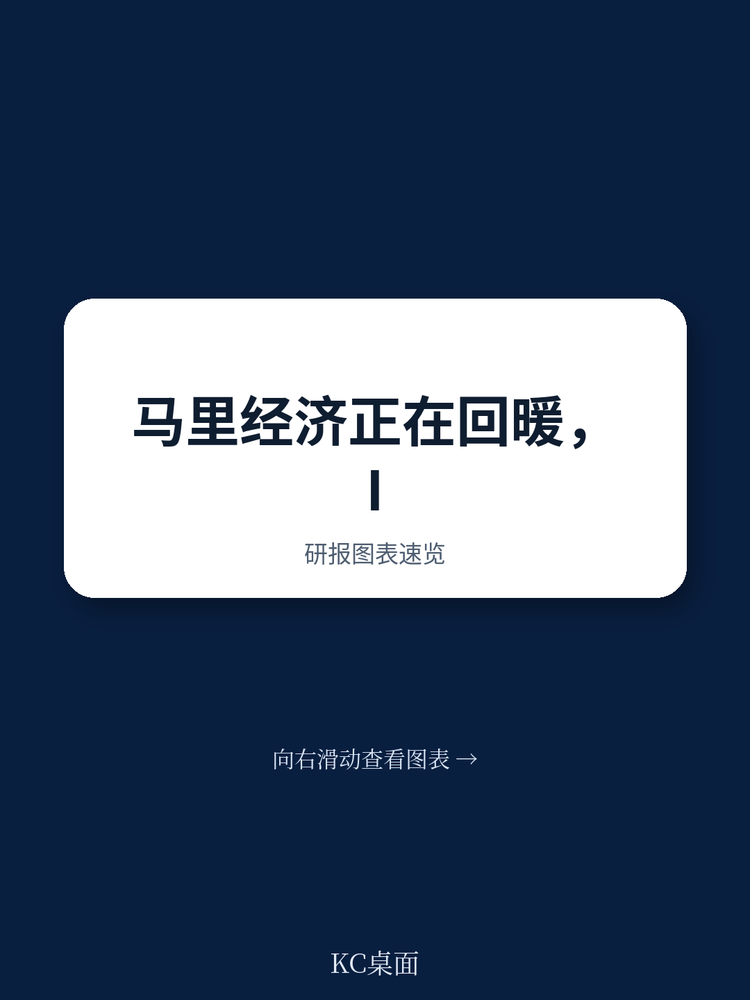
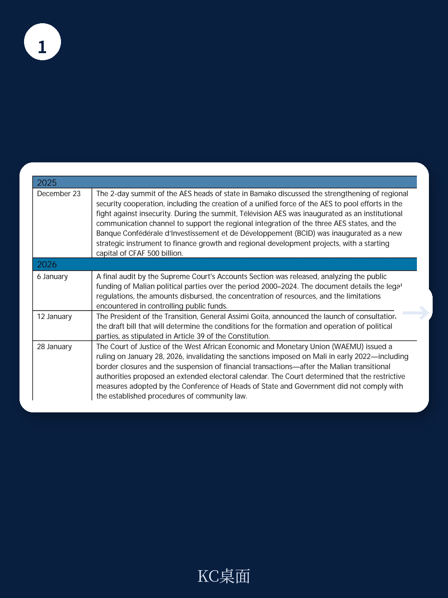
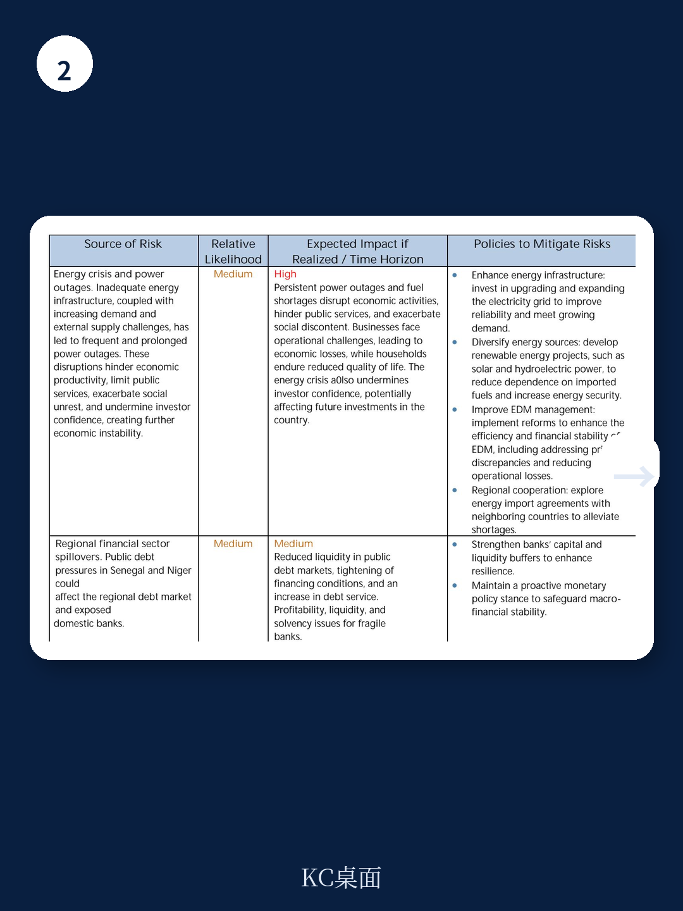

# IMF：马里宏观环境修复，不是安全改善，而是矿业意外财

马里正在经历一次不寻常的修复周期。国际货币产品组织（IMF）在2026年3月完成的对马里员工监督规划第二次审查报告中，给出了一个清晰但不太被外部注意的判断：这个西非国家在经历了2025年下半年严重的恐怖袭击冲击后，增长正在回正，但真正决定中期走向的，不是安全形势的边际改善，而是黄金和锂矿带来的意外财政空间能否被有效管理。

这份报告不是一份普通的国别评估。它标志着马里完成了为期一年的员工监督规划，为未来争取更高层级的中期信贷安排铺平了道路。而报告中最值得关注的信号，藏在对“矿业收入管理”的政策讨论里。

## 1. 安全冲击后的宏观环境韧性比预期更强

2025年对马里而言是典型的“前高后低”年份。上半年宏观环境动能强劲，前三季度实际GDP同比增长达到5.7%，高于2024年全年的4.3%。农业在良好收成支撑下扩张8.3%，锂矿生产也带动第二产业从负增长转正。

但第四季度形势急转直下。恐怖袭击切断了关键运输路线和燃料供应，导致制造业和服务业活动明显调整。全年增长率被拉低至4.9%，低于前三季度的表现。

关键在于，IMF认为这种冲击是暂时性的。随着安全局势逐步好转、金矿争端解决，2026年增长预计回升至5.5%左右，中期稳定在5.5%的潜在增速附近。这个判断基于一个核心假设：燃料供应能够恢复、金矿生产正常化、商业环境改善。

> **KC评论：** 5.5%的中期增长预期对于马里而言不算激进，但也不保守。它取决于安全局势能否持续改善，以及区域融资成本是否回落。完整报告中的不确定性矩阵和情景分析值得细看。

## 2. 黄金矿争端的解决才是真正的结构性拐点

2025年11月24日，马里政府与国内最大金矿运营商达成全面和解。这个协议的意义远超法律层面。运营方支付了约2440亿西非法郎（相当于2025年GDP的1.4%）的和解金，矿权续期10年，并纳入2023年矿业新规框架。

直接后果是：2025年该矿产量不足3吨，2026年预计恢复至至少10吨。IMF估算，这将为2026年增长贡献约0.2个百分点，额外增加约0.6个百分点的财政收入，对国际收支的正面贡献约达GDP的4.6%。

但报告同时指出，真正的问题不在于金矿恢复生产，而在于这笔意外之财怎么花。当前黄金价格处于历史高位，锂矿价格也有上行空间。如果缺乏非矿业财政锚的约束，高矿价带来的额外收入很容易转化为顺周期支出，重蹈资源型国家“繁荣-萧条”循环的覆辙。

## 3. 财政纪律是马里最脆弱的防线

从宏观指标看，马里财政表现并不差。2025年基本财政赤字控制在项目目标以内，优先社会支出、净税收收入等所有量化指标均达标。2026年预算也计划将赤字控制在西非经货联盟3%的GDP上限以内。

但真正值得警惕的是结构性约束。报告明确指出，高融资成本、巨大的发展需求和安全支出，持续挤压财政空间。区域债务市场的再融资成本居高不下，而马里在透明度和治理方面的改革才刚刚起步。

IMF的讨论重点放在了“如何管理矿业意外收入”上。建议包括：以非矿业财政赤字为锚定指标、避免顺周期支出、加强预算报告和公共采购管控。这些建议听起来像是标准教科书内容，但在马里当前的政治过渡期，执行难度不可低估。

> **KC评论：** 马里面临的核心挑战不是缺钱，而是如何确保额外收入不被低效或非透明的方式消耗掉。完整报告中有关于矿业收入管理框架的具体设计，以及审计安排的细节，对理解这个问题的复杂度很有帮助。

## 4. 报告尚未完全回答的关键问题

尽管审查结果积极，但报告至少留下了三个值得追问的缺口。

第一，安全局势的不确定性。报告承认“安全局势虽有改善但仍不稳定”，但并未给出一个量化场景分析——如果2026年再次出现类似2025年下半年的攻击浪潮，宏观环境增长和财政收入的弹性有多大。

第二，政治过渡的时间表。马里过渡政府已释放信号，计划就政党组建和运作的法律草案进行磋商。但选举时间表依然模糊。政治不确定性与宏观环境修复之间的互动关系，报告着墨不多。

第三，区域溢出效应。马里是西非萨赫勒地区安全扰动的一部分。邻国尼日尔、布基纳法索的局势如何影响马里的贸易通道、难民负担和区域融资环境，报告没有展开。

这些未解问题并不削弱报告的价值，但它们决定了马里的修复路径究竟是“V型反弹”还是“L型底部震荡”。对于关注非洲宏观环境的读者，这份报告的完整版本——包括不确定性矩阵、量化目标框架和结构性改革时间表——值得从原文中进一步提取。

完整报告、中文摘要、KC评论和图表合集，可以放在当天国际主线里继续看。