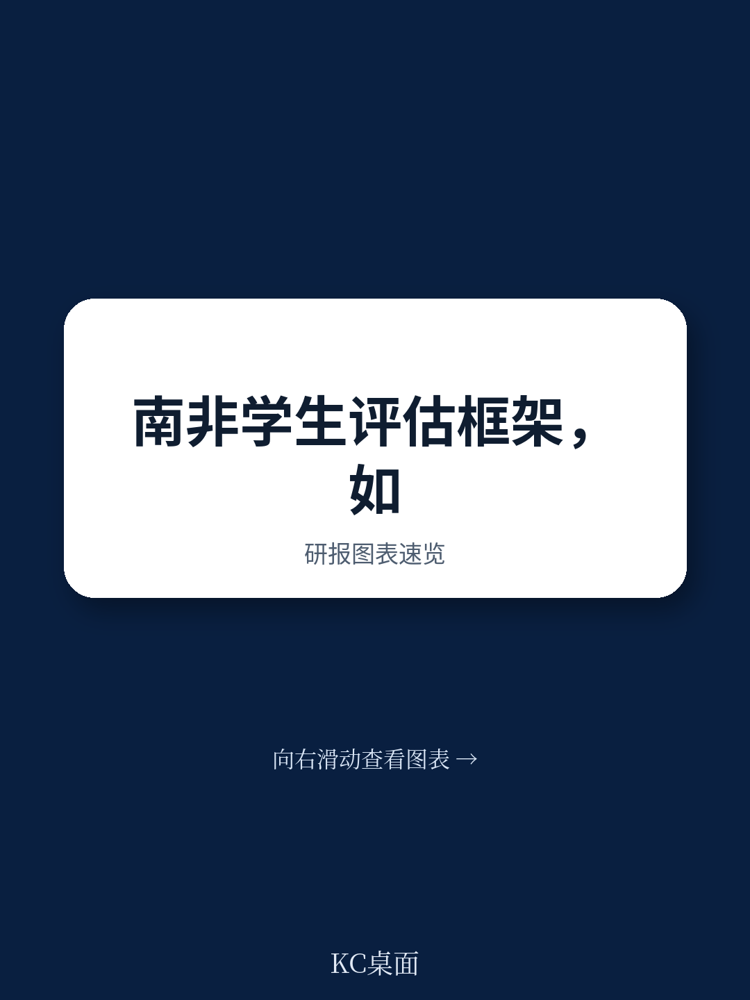
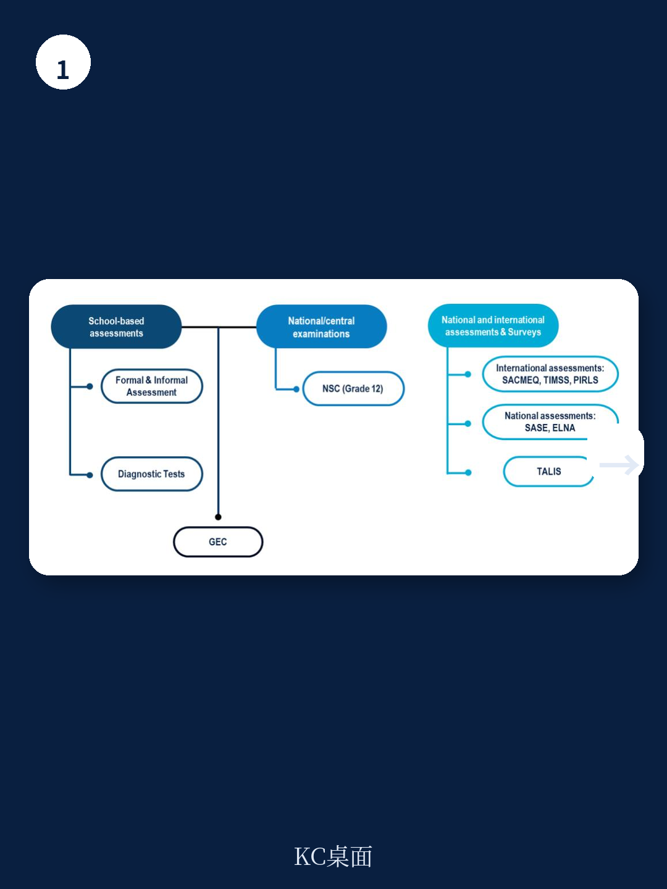
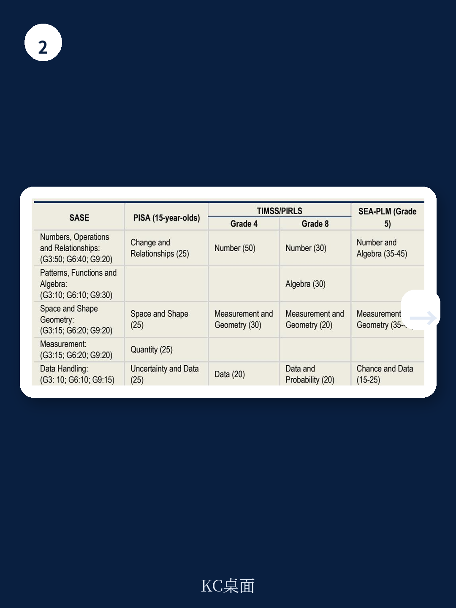

# 经合组织：南非基础教育真正瓶颈不是入学率，而是评估体系

过去三十年，南非在普及基础教育上取得了实打实的进展。更多孩子走进了教室，但教室里发生了什么，才是更棘手的问题。经合组织最新发布的政策简报，围绕南非国家学生评估框架的升级，给出了一个核心判断：南非教育质量提升的真正瓶颈，不在于学校数量或入学率，而在于缺乏一套能够精准诊断学习差距、并指导教学改进的评估体系。这份报告的价值，不只是为南非教育部门提供了技术建议，更在于它揭示了一个许多发展中地区都会遇到的共性困境——当规模扩张走到尽头，质量提升需要全新的基础设施。

## 1. 评估体系的缺失，正在让教学变成“盲人摸象”

报告引用的数据相当直观。2021年，南非三年级学生中有37%属于“萌芽级”读者，这意味着他们刚刚开始发展基础知识和技能，需要大量指导才能跟上进度。国际测评如TIMSS和PIRLS也印证了这一点。更关键的是，这些低学习成果并非随机分布，而是与学校之间长期存在的结构性不平等高度相关——优质教师和学习资源的分配不均，直接体现在了成绩单上。

> **KC评论：** 37%这个数字意味着什么？在任何一个三年级教室里，大约每三个孩子中就有一个连基本阅读都困难。如果评估体系只能给出一个模糊的平均分，而无法告诉老师“这个孩子到底卡在了哪里”，那教学改进就无从下手。经合组织报告的核心主张，正是要填补这个信息断层。

报告明确指出，南非基础教育部虽然已经意识到评估的重要性，并在2022年起草了国家学生评估框架的概念文件，但这份文件至今未公开发布，且存在明显的信息缺口。比如，文件中详细定义了系统评估（SASE）的特征，却对学校层面的评估和国家考试着墨甚少。没有清晰的框架，就难以形成统一的评估语言，更无法将评估结果与2025-30年战略规划中的学习目标挂钩。

## 2. 标准化评估之外，诊断性评估才是真正的“手术刀”

报告提出的建议中，最值得关注的一点是：南非应考虑引入额外的标准化评估资源，包括全国性诊断评估和试题库。这与目前以系统评估（SASE）为主的监测模式有本质区别。SASE是样本调查，每三年一次，主要用于宏观政策监测。而诊断评估的目标是服务个体学习——在学年或学期初进行，直接告诉教师每个学生的具体薄弱环节。

这种区分在报告中被反复强调。经合组织指出，南非目前的学校评估（SBA）在实践中有明显向终结性评价倾斜的趋势，因为SBA成绩直接影响学生的期末排名和升级。教师花在批改作业上的时间远超其他TALIS参与国，但这种高强度劳动未必转化成了有效的教学反馈。引入诊断性评估，本质上是在“监测”和“教学”之间架一座桥，让评估数据真正回到课堂。

## 3. 国际对标揭示的改进空间：数据时效性与能力描述颗粒度

经合组织将南非SASE的评估框架与PISA、PIRLS、TIMSS和SEA-PLM等国际测评做了系统对标，发现了两个值得注意的改进方向。

一是报告时效性。SASE从施测到结果发布，周期接近两年。对于一个需要快速调整教学策略的系统来说，这个滞后几乎让数据失去了即时指导意义。报告建议南非考虑在未来试点数字化评估，这不仅能缩短时间，还能增强数据分析能力。

二是能力水平描述的颗粒度不统一。在数学科目上，三年级和六年级的能力描述强调通用认知技能，而九年级则给出了更具体的能力预期。这种不一致会影响教师对评估结果的理解和使用。报告的建议很明确：任何调整都应与新修订的课程大纲对齐，避免评估与教学“两张皮”。

> **KC评论：** 这里有一个容易被忽略的细节。经合组织在对比中发现，SASE的数学框架在“数据处理”内容的覆盖上相对不足，且对高阶数学能力的关注度低于国际测评。这提示我们，评估框架的修订不只是技术问题，更涉及对“什么才是核心素养”的价值判断。南非的选择，将在很大程度上决定未来十年学生的学习方向。

## 4. 报告尚未完全回答的关键问题：教师能力与实施路径

经合组织的政策建议逻辑清晰，但有一个关键变量没有被充分展开——教师的评估素养。即使有了更好的评估框架和工具，如果教师不具备解读数据、调整教学的能力，再精密的诊断也只是一堆数字。报告提到了应通过TALIS调查加强对教师工作条件、专业发展的监测，但对于如何系统性地提升教师的评估能力，并没有给出具体路线图。

此外，报告建议将诊断评估放在学年或学期初进行，这一设计看似合理，但在资源有限的学校，如何保证诊断结果能迅速转化为差异化教学，仍然是一个巨大的执行挑战。南非学校之间的资源差距如此之大，一个统一的框架能否在不同情境下落地，还需要更细致的试点验证。

---

这份经合组织政策简报的完整版本、中文摘要、图表合集以及KC的详细拆解，会放入每日国际信源汇编。适合快速扫读当天全球主要机构的核心叙事，也方便后续对单一议题做横向比较和深入追问。