## Tax Co-operation for Development 2025 PROGRESS REPORT

## OECD

BETTER POLICIES FOR BETTER LIVES

DISCLAIMERS:

This work is published under the responsibility of the Secretary-General of the OECD. The opinions expressed and arguments employed herein do not necessarily reflect the official views of OECD member countries or of members of the Global Forum on Transparency and Exchange of Information for Tax Purposes or of the donor countries.

This report and the activities described within have been made possible through funding from a number of governments. Its contents are the sole responsibility of the OECD Secretariat and do not necessarily reflect the official policies of those governments providing funding. This document, as well as any data and map included herein, are without prejudice to the status of or sovereignty over any territory, to the delimitation of international frontiers and boundaries and to the name of any territory, city or area. The use of this work, whether digital or print, is governed by the Terms and Conditions to be found at http://www.oecd.org/termsandconditions.

© OECD 2026

Cover image: © Shutterstock.com

Please cite this publication as:

OECD (2026), Tax Co-operation for Development 2025: Progress Report,

OECD Publishing, Paris, https://doi.org/10.1787/d652a08b-en.

## Table of contents

Abbreviations and acronyms 2
1. Executive summary 4
2. The OECD offer to support domestic resource mobilisation 9
3. The OECD/G20 Inclusive Framework on Base Erosion and Profit Shifting 15
Inclusive Framework on Base Erosion and Profit Shifting (BEPS) 15
BEPS Implementation 18
The Global Minimum Tax (GMT) 19
Simplifying transfer pricing (Amount B) 21
In-depth technical assistance on BEPS 21
Tax Inspectors Without Borders 27
Support on taxing the extractives sector 30
4. The Global Forum on Transparency and Exchange of Information for Tax Purposes 32
Participation of developing countries to the tax transparency agenda 33

Regional initiatives – progress in 2025 34
Africa Initiative 34
Latin America Initiative 37
Asia Initiative 38
Pacific Initiative 39
Caribbean 39
Effective implementation of international standards on transparency and exchange of information 40
Building capacity on the effective use of exchange of information 41
5. Policy and statistics 43
Tax policy 43
Support on design and implementation of value added taxes (VAT) 46
Statistics 46
6. Delivering through global networks and partnerships 50
Global training networks 50
Partnerships 53

## 7. Next steps for the year to come

## Abbreviations and acronyms

ACCA Association of Certified Chartered Accountants

ADB Asian Development Bank

AEOI Automatic Exchange of Information

The Academy OECD Academy for Tax and Financial Crime Investigation

ATAF African Tax Administration Forum

ATO Australian Taxation Office

BEPS Base Erosion and Profit Shifting

CAANZ Chartered Accountants Australia and New Zealand

CARF Crypto-Asset Reporting Framework

CARICOM Caribbean Community

CARTAC Caribbean Regional Technical Assistance Centre

CbC Country-by-Country

CbCR Country-by-Country Reporting

CIAT Centro Interamericano de Administraciones Tributarias (Inter-American Center of Tax Administrations)

CIT Corporate Income Tax

COTA Caribbean Organisation of Tax Administrators

CREDAF Cercle de Réflexion et d'Échange des Dirigeants des Administrations fiscales (Circle of Reflection and Exchange of Managers of Tax Administrations)

CRS Common Reporting Standard

CRS-MCAA Multilateral Competent Authority Agreement on Automatic Exchange of Financial Account Information

DAC Development Assistance Committee

DCTR Digital Continuous Transactional Reporting

DGI Direction générale des Impôts (Directorate General of Taxes of Cameroon)

DRM Domestic Resource Mobilisation

DTMM Digital Transformation Maturity Model

ECOWAS Economic Community of West African States

EOI Exchange of Information

EOIR Exchange of Information on Request

EU European Union

FfD Financing for Development

FfD4 Fourth International Conference on Financing for Development

GDP Gross Domestic Product

Global Forum Global Forum on Transparency and Exchange of Information for Tax Purposes

GMT Global Minimum Tax

GRP Global Relations Programme on Taxation

GST Goods and Services Tax

IATF UN in the Inter-Agency Task Force

IFAC International Federation of Accountants

Inclusive OECD/G20 Inclusive Framework on BEPS Framework

IFCMA Inclusive Forum on Carbon Mitigation Approaches

IFFs Illicit Financial Flows

IGF Inter-Governmental Forum on Mining, Minerals, Metals and Sustainable Development

IMF International Monetary Fund

IOTA Inter-European Organisation of Tax Administrations

ISM Information Security Management

ISORA International Survey on Revenue Administration

IT Information and technology

ITID Investment Tax Incentives Database

ITTI Inventory of Tax Technology Initiatives

KSPTA Knowledge Sharing Platform for Tax Administrations

LAC Latin America and Caribbean

MAAC Convention on Mutual Administrative Assistance in Tax Matters

MCAA Multilateral Competent Authority Agreement

MLI Multilateral Convention to Implement Tax Treaty Related Measures to Prevent Base Erosion and Profit Shifting (Multilateral Instrument)

MNEs Multinational Enterprises

MoU Memorandum of Understanding

ODA Official Development Assistance

OECD Organisation for Economic Co-operation and Development

PCT Platform for Collaboration on Tax

PITAA Pacific Islands Tax Administrators Association

POSS Pacific-One-Stop-Shop

QDMTT Qualified Domestic Minimum Top-up Taxes

SADC Southern African Development Community

SDGs Sustainable Development Goals

SECO Swiss State Secretariat for Economic Affairs

Sevilla Commitment of the Fourth International
Commitment Conference on Financing for Development

SIDA Swedish International Development Co-operation Agency

STTR Subject to Tax Rule

TCEN Tax Crime Law Enforcement Network

TFTC Task Force on Tax Crimes and Other Financial Crimes

TIPS Tax Incentives Principles

TIWB Tax Inspectors Without Borders

TIWB-CI Tax Inspectors Without Borders – Criminal Tax Investigation

UN United Nations

UNDESA United Nations Department of Economic and Social Affairs

UNDP United Nations Development Programme

VAT Value Added Tax

VDPs Voluntary Disclosure Programmes

WBG World Bank Group

WHO World Health Organisation

Wider Use Multilateral Competent Authority Agreement
MCAA for the Wider Use of Information

ZRA Zambia Revenue Authority

# 1. Executive summary

The central role of tax in financing for development, and the importance of the provision of high-quality technical assistance on tax was reaffirmed at the highest political level in 2025. The Sevilla Commitment of the Fourth International Conference on Financing for Development (Sevilla Commitment) stressed the role of taxation in financing for development (FfD). In addition, there was a commitment to double funding for domestic resource mobilisation (DRM), the only area of development co-operation to receive such a commitment. Moreover, the Platform for Collaboration on Tax (PCT) report to the G20\* highlighted both the progress and continued scope for technical assistance on tax.

\* PCT (2025), Progress in Strengthening Frameworks for Building Tax Capacity: A Report to G20 Finance Ministers and Central Bank Governors, https://www.tax-platform.org/sites/default/files/publications/Progress-in-Strengthening-Frameworks-for-Building-Tax-Capacity.pdf.

The Organisation for Economic Co-operation and Development (OECD) support to developing countries on tax continues to evolve, reflecting changing demands, and contexts. With a growing number of developing countries at different stages of adopting an expanding set of international standards on tax, their technical assistance needs have become more diverse. At the same time technological developments have expanded the scope to provide assistance, while the potential for collaboration and co-ordination with partners continues to increase. These developments are taking place in a tight funding environment requiring greater efficiencies in the delivery of assistance. In this context the OECD has sought to focus its efforts where demand is clear and where it can provide identifiable added value.

Demand remains high for support across the range of Base Erosion and Profit Shifting (BEPS) and Transfer Pricing Actions, which is being met by a combination of bilateral and multilateral support. The number of bilateral BEPS and Transfer Pricing programmes running in 2025 reached 28. While these programmes provide the most comprehensive support in these areas, they are no longer the only means through which support on BEPS and transfer pricing issues is provided. There is growing use of multilateral approaches, ranging from large-scale training on foundational concepts, to in-depth extended workshops with small groups on specific topics. In addition, reflecting more niche and complex demands, support is becoming more tailored to specific issues such as on the Global Minimum Tax (GMT) and tax incentives, or the extractive sector.

Supporting developing countries in response to developments on the GMT was an area of focus in 2025, and is likely to become an even greater priority in 2026. With numerous countries already implementing the GMT, many developing countries were keen to understand their options, both under the GMT, and with respect to their tax incentives, while also tracking progress under the Side-by-Side package $^{1}$ .

Updated economic impact assessments were shared with countries, while 20 countries received bilateral support on the GMT and tax incentives reform. This was complemented by a range of multilateral events and workshops, and the PCT's publication of the Tax Incentives Principles $^{2}$ . Following the agreement on the Side-by-Side package in January 2026, bringing increased stability and certainty, as well as some important simplifications, further work will be needed in 2026 and beyond, to support countries to understand their options and implement their policy responses to the GMT.

Tax Inspectors Without Borders (TIWB) celebrated its 10 $^{th}$ anniversary in 2025, and its unique approach was recognised by inclusion in the Sevilla Platform for Action. Fourteen TIWB programmes were launched in 2025, including the first pilot programme on the GMT. Revenues raised from TIWB programmes passed a cumulative total of USD 2.72 billion. However, securing the expertise for TIWB programmes is becoming increasingly challenging due to a combination of

financial pressures in partner administrations and more specialised requirements for expertise.

The Global Forum on Transparency and Exchange of Information for Tax Purposes (Global Forum) supported 88 developing countries through its capacity-building and outreach activities in 2025, reflecting the continued growth in demand for support, both in volume and complexity. This support covered the full spectrum of transparency standards, including the signing and ratification of the Multilateral Convention on Mutual Administrative Assistance in Tax Matters (MAAC); implementation and effective use of the Exchange of Information on Request (EOIR) and Automatic Exchange of Information (AEOI) standards; implementing the new Crypto-Asset Reporting Framework (CARF); and strengthening Information Security Management (ISM). In this area, the ISM Maturity Assessment Initiative, launched in 2024, is playing a valuable role in helping countries develop a pathway towards AEOI implementation.

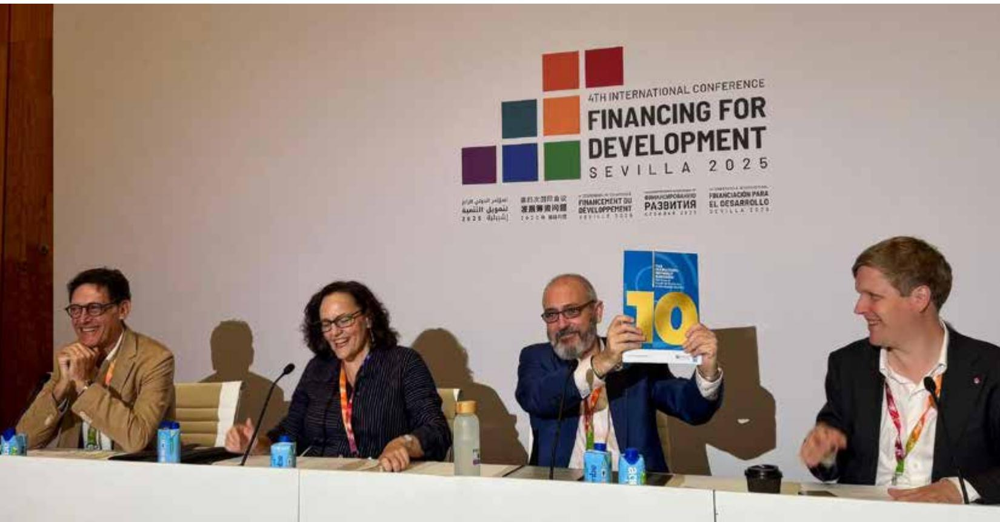  
Fourth International Conference on Financing for Development (FfD4), TIWB opening panel, 30 June-3 July 2025, Sevilla, Spain.

Developing countries are making increased use of transparency standards. In 2024 -the most recent year for which data on developing countries is available- an additional EUR 4 billion was raised through offshore tax investigations and voluntary disclosure programmes, bringing the total raised since 2009 to EUR 48 billion. In the same year, developing countries sent 4 600 requests for information to other jurisdictions, representing a $43\%$ increase compared to 2023. Developing countries participating in AEOI received information on 53 million financial accounts with a total value of EUR 2.7 trillion.

Developing countries continue to request OECD analysis on a range of tax policy issues, including health financing and social protection. New reports on social protection financing in Senegal and Thailand were delivered in 2025, with the work in Thailand already feeding into a recent pension reform and increase in social security ceiling. There has also been continued work on health financing, tobacco taxation, tax incentives and informality.

Demand for support on implementing the international standards for value added tax (VAT) on cross-border e-commerce remains high, with a big increase in requests from Francophone Africa in 2025. The international standards on VAT provide a tried and tested approach, which has proven to deliver significant revenues. As a result, a growing number of developing countries are implementing these standards, often with OECD support. Following successful OECD-supported reforms in Benin, several other Francophone countries have approached the OECD seeking similar assistance, which is now being provided.

Four additional countries joined the OECD Global Revenue Statistics initiative, which by the end of 2025 included 139 economies. It produces data increasingly used by governments, academia and the wider public. The Global Revenue Statistics database covers economies at all income levels and is an increasingly valuable tool for governments and researchers alike. Participating countries report using Global Revenue Statistics data to

BOX 1. OECD and Global Forum tax and development work in 2025, in numbers

<table><tr><td>4 billion EUR</td><td>additional revenues in developing countries in 2024 (most recent year) from offshore tax investigations and voluntary disclosures</td></tr><tr><td>2.72 billion USD</td><td>in additional revenues raised by TIWB since 2012</td></tr><tr><td>22 000 officials</td><td>trained in 2025 (nearly 15 000 through the GRP)</td></tr><tr><td>4 659 requests for information</td><td>sent by developing countries in 2024 (most recent year), an increase of 43% from 2023</td></tr><tr><td>527 officials</td><td>from financial crime authorities trained by the Academy</td></tr><tr><td>139 economies</td><td>covered in the Global Revenue Statistics Database (including 4 new developing countries in 2025)</td></tr><tr><td>92% share of participants</td><td>in OECD Academy for Tax and Financial Crime Investigation (the Academy) who can provide a concrete example of how the Academy training has assisted their work</td></tr><tr><td>88 developing countries</td><td>supported on tax transparency by the Global Forum</td></tr><tr><td>32 on-going technical assistance projects</td><td>to support developing countries in meeting confidentiality and data safeguard standards for the Common Reporting Standard (CRS)/ the Crypto-Asset Reporting Framework (CARF)/ Country-by-Country (CbC) reporting</td></tr></table>

compare and benchmark performance, develop tax policy, and inform national dialogue and international co-operation on tax.

Developing countries are continuing to explore options on environmental taxation, making use of OECD data and analysis. Thirty-seven developing countries were included in Effective Carbon Rates 2025, providing data on carbon emissions, carbon pricing mechanisms and fuel excise taxes, as well as a focus on emissions trading systems. The data and methodologies utilised in this dataset are also being used to support countries, including on carbon tax reforms in South Africa, and as part of broader tax policy reviews in Costa Rica and Thailand.

Work is continuing on a guide to support the development of a tax administration digitalisation and digital transformation strategy. This guide is being developed through a series of interactive workshops which have already been attended by over 500 officials from over 60 tax administrations. Once completed,

it will provide a step-by-step approach to building a digital transformation strategy, aligned with the Tax Administration 3.0 framework. Developing country tax administrations are also continuing to join the Inventory of Tax Technology Initiatives (ITTI), with six additional administrations joining in 2025, bringing the total to 54.

The work of the OECD tax and development programme continues to be disseminated widely through the OECD's global networks, which reached over 15 000 officials in 2025. The Global Relations Programme on Taxation (GRP) is the training delivery arm of the tax and development programme, providing a range of in-person, virtual and self-paced training, across its global network of multilateral tax centres, that underpins many technical assistance programmes. The GRP also ensures that the outputs of the tax and development programme are communicated widely and comprehensively. The OECD Academy for Tax and Financial Crime Investigation (the Academy) is a more specialised network of centres, whose courses on combatting tax crimes continue to be oversubscribed.

<table><tr><td>31</td><td>developing countries</td><td>included in Tax Policy Reforms</td></tr><tr><td>28</td><td>bilateral programmes</td><td>on BEPS and transfer pricing</td></tr><tr><td>25</td><td>developing countries</td><td>completed benchmarking on fighting tax crimes</td></tr><tr><td>20</td><td>countries</td><td>provided with support on GMT and tax incentives</td></tr><tr><td>15%</td><td>budget reduction</td><td>made in 2025 primarily through further efficiency measures, but also some reduction in activities</td></tr><tr><td>14</td><td>new TIWB programmes</td><td>launched</td></tr><tr><td>12</td><td>countries</td><td>drafted new or updated legislation and other instruments or engaged in organisational reform in line with BEPS standards</td></tr><tr><td>12</td><td>Train-the-Trainer regional programmes</td><td>on the effective use of international standards on transparency and Exchange of Information (EOI) for tax purposes and other forms of administrative co-operation</td></tr><tr><td>12</td><td>developing countries</td><td>assisted in using the Digital Transformation Maturity Model (DTMM) in collaboration with regional bodies and donors</td></tr><tr><td>3</td><td>toolkits published</td><td>1 PCT Toolkit on Tax Incentives and 2 extractives toolkits</td></tr></table>

Source: Results Framework, OECD Secretariat

The Academy also serves as an entry point for engagement with the Task Force on Tax Crimes and Other Financial Crimes (TFTC), the Ten Global Principles for Fighting Tax Crimes, and the TIWB-Criminal Tax Investigation (TIWB-CI) programme, in which 20 developing countries have now participated.

The PCT remains a key partnership for the OECD, where the four partners are speaking collectively on key issues on tax and development. In 2025, the PCT delivered several useful interventions, including a side-event at the Fourth International Conference on Financing for Development (FfD4), a set of principles on tax incentives, as well as a well-received report to the G20 on progress in tax capacity building. These interventions demonstrate a strong shared view across the PCT partners that can contribute to maintaining the global focus on tax and development, with an increasing emphasis on delivering tangible results through improved monitoring and evaluation.

A number of the recommendations from the external evaluation conducted in 2024 and published in 2025 $^{3}$ have been acted on in 2025. These include:

\- Increased focus on ex ante support to countries. This has been pursued across a range of the new standards including support for the GMT impact assessment, as well as extensive outreach and dialogue with

countries on the Subject to Tax Rule (STTR) and the simplified approach to transfer pricing (Amount B).

\- Further refinement and strengthening of relationships and co-ordination with regional partners. In Africa, the evolving relationship with partners has enabled OECD technical assistance to focus on more complex and specialised areas of support, while in the Caribbean strong collaboration between partners is supporting a regional programme with broad participation from both the countries in the regions and regional/global development partners.

Priorities for 2026 will include supporting developing countries in their policy responses to the GMT and the further development of the new platform for self-paced training, while continuing to respond to growing demand for assistance as efficiently as possible. Following the agreement on the side-by-side package in January, developing countries face a range of possible policy responses. The OECD will further articulate these options, and support countries in navigating them. In addition, the self-paced training offer under the Global Relations Programme has moved to a new platform, requiring a transition for its more than ten thousand users. More broadly, demand for assistance remain high across the full range of areas covered in this report, while Official Development Assistance (ODA) budgets are shrinking, requiring a strong focus on efficiency.

## 2. The OECD offer to support domestic resource mobilisation

The Organisation for Economic Co-operation and Development (OECD) has developed a comprehensive range of support, with a proven track record, that developing countries can integrate into their revenue strategies to strengthen domestic tax collection. This support is designed to assist countries that wish to participate in tax-related work undertaken at the OECD, as well as benefit from the tools and instruments developed at the OECD, the data it collects and the expertise available across both the Secretariat and the membership of the OECD-hosted forums on tax.

The importance of such support, and the central role of tax in financing for development (FfD), was highlighted in 2025. The Sevilla Commitment of the Fourth International Conference on Financing for Development (Sevilla Commitment) emphasis on both the role of taxation in financing for development, and the commitment to double support for domestic revenue mobilisation showed a strong shared recognition of the centrality of tax in development.

In parallel, spending needs in developing countries remain high, underscoring the importance of continued efforts to strengthen domestic resource mobilisation (DRM). Since the pandemic, the global financing gap for achieving the Sustainable Development Goals (SDGs) has widened to around USD 4 trillion a year (UN, Interagency Task Force, 2024). Estimates suggest that achieving progress on a subset of SDGs would require significant additional financing, particularly in low-income countries. Half of this financing need could be met by increasing the tax-to-Gross Domestic Product (GDP) ratio by 3 percentage points by 2030 (a target considered as “ambitious but not unrealistic”). Ultimately, achieving the SDGs without unsustainably high levels of external financing or public debt will require substantial further improvements in DRM.

The Platform for Collaboration on Tax (PCT) report on progress in supporting tax capacity development further underlined the need for increased and improved technical assistance $^{1}$ . The report, produced in response to a request from the G20, provided a stocktake on the role of tax in development and trends in support since the Third Financing for Development Conference in Addis Ababa. It also reaffirmed the key enablers of effective support on tax identified in the 2016 PCT report on the same topic $^{2}$ , tracked progress in these areas, and identified a future agenda focussing on the fundamentals of domestic tax systems, building on recent progress in international taxation, encouraging the use of Medium Term Revenue Strategies, and deepening the focus on collaboration and sustainability.

It is in this context, that the OECD, together with a wide range of partners across the globe, works with developing countries to provide a range of support. This offer has expanded over the years $^{3}$ enabling countries to tailor support to their needs across policy analysis and design, capacity building, tax administration and international collaboration.

Policy analysis and design is a core component of the OECD's support to developing countries, combining evidence-based analysis with practical policy advice to inform DRM and broader tax-related matters. Analytical work includes the production and expansion of global public datasets such as the Global Revenue Statistics Database $^{4}$ , which now covers 139 economies; datasets on carbon pricing and energy taxation developed through Effective Carbon Rates $^{5}$ now including 37 developing countries; the Investment Tax Incentives Database; and Corporate Tax Statistics $^{6}$ . This analytical work is complemented by an extensive programme of publications covering a wide range of DRM and tax policy topics. Over the last five years this has included health financing $^{7}$ , social protection $^{8}$ , tobacco taxation $^{9}$ , tax incentives $^{10}$ , taxing the informal sector and the use of presumptive regimes $^{11}$ , and tax morale $^{12}$ , among others. Building on this evidence, the OECD supports countries in the design, adaptation and implementation of tax policy frameworks aligned with international standards and national circumstances. This includes work on value added tax (VAT), notably for digital trade and

low-value imports, international taxation (transfer pricing, treaties, Base Erosion and Profit Shifting (BEPS) minimum standards and the Global Minimum Tax (GMT)), and targeted areas such as tax incentives, environmental taxation, social policy-related taxes, and the extractive industries.

\- Capacity building is at the heart of the OECD's engagement with developing countries on taxation. The OECD has developed a range of capacity-building modalities, enabling countries to tailor support to their needs, through a combination of bilateral and multilateral approaches.

\- Multilateral training is undertaken through various programmes and initiatives. The Global Relations Programme (GRP) is the largest one, which provides multilateral training on international tax topics through both live and self-paced formats. The OECD Academy for Tax and Financial Crime Investigation (the Academy) has expanded to centres in Africa, Asia-Pacific, Europe and Latin America. In addition, recent years have seen an increased focus on regional training by the OECD, bringing together peers from across a region to address common challenges, and create peer networks. Examples include the Caribbean, Central Asia and West Africa.

\- Bilateral programmes supplement multilateral training, providing more intensive support where needed. These programmes cover tax transparency,

  
IGF-OECD In-Country workshop on Capital Gains Tax implementation, 11 December 2025, Port Moresby, Papua New Guinea.

BEPS and transfer pricing standards, targeted technical support on VAT and intensive deep dive programmes on extractives taxation. Recent years have also seen support expand to cover tax incentives, especially in relation to the GMT. Complementing these efforts, the OECD–United Nations Development Programme (UNDP) Tax Inspectors Without Borders (TIWB) initiative marked its 10th anniversary in 2025 $^{13}$ . Demand for TIWB assistance remains high, reflecting the programme's expanded scope, which now includes support related to the GMT, digitalisation of tax administrations, criminal tax investigations, effective use of Automatic Exchange of Information (AEOI), and implementation and use of Country-by-Country (CbC) reporting.

\- Digitalisation of tax administration remains a high priority, explicitly recognised in the Sevilla Commitment, which calls for enhanced support "to modernise revenue administration, especially digitalisation” $^{14}$ , and reaffirmed in the PCT report to the G20 on capacity building $^{15}$ . As such the OECD is continuing to identify areas where it can add value in this field, drawing on the experience of the Forum on Tax Administration and its work on Tax Administration 3.0. Recent efforts have included developing a Digital Transformation Maturity Model (DTMM) self-assessment tool (28 developing countries have already shared their results with the OECD), and inviting developing countries to join the Inventory of Tax Technology Initiatives (ITTI), with 54 participating by the end of 2025. In addition, the OECD continues to be part of the International Survey on Revenue Administration $^{16}$ which compiles a range of data on 164 tax administrations around the world.

International collaboration shows strong synergies between the OECD's tax standard-setting work and its offer to support DRM. Over the last 15 years, key reforms – including the introduction of AEOI, the publication of the package of measures to address

BEPS (the BEPS Package), and more recently the agreement on a GMT – have significantly reduced, and aim to further curb, tax evasion and tax avoidance affecting developing countries. These standards are open to all countries, and developing countries have played an increasingly active role in shaping them. Since the establishment of the Global Forum on Transparency and Exchange of Information for Tax Purposes (Global Forum) in 2009 and the OECD/G20 Inclusive Framework on BEPS (Inclusive Framework) in 2016, developing country members have participated directly in the development, negotiation, refinement and peer reviews of these standards. To support developing country engagement, a range of measures has been introduced to ensure that developing countries' perspectives are effectively

reflected in international tax discussions. As shown in Figure 1, participation in OECD tax instruments and forums has grown steadily since 2009. The influence of developing country priorities is evident in several key outcomes of recent negotiations. Examples include the simplifications to transfer pricing through Amount B, the priority given to domestic top-up taxes under the GMT, and the development of the Subject to Tax Rule (STTR) Multilateral Instrument, which helps preserve source-country taxing rights.

In 2025, the Inclusive Framework took stock of developments a decade on from the publication of the BEPS Package with a report delivered to the G20 Finance Ministers and Central Bank Governors $^{17}$ . The report provided evidence of improved

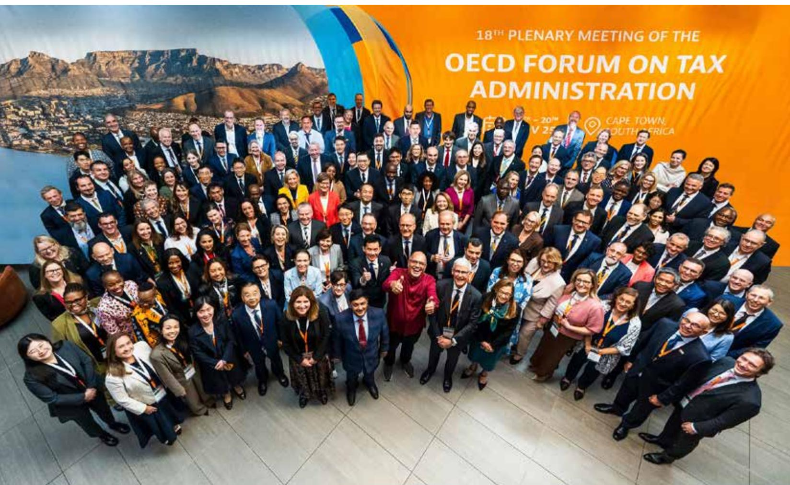  
18 $^{th}$ Plenary meeting of the OECD Forum on Tax Administration, 18-20 November 2025, Cape Town, South Africa.

FIGURE 1. Number of jurisdictions participating in OECD and OECD-hosted forums, instruments, and data on taxation, 2009-2025  
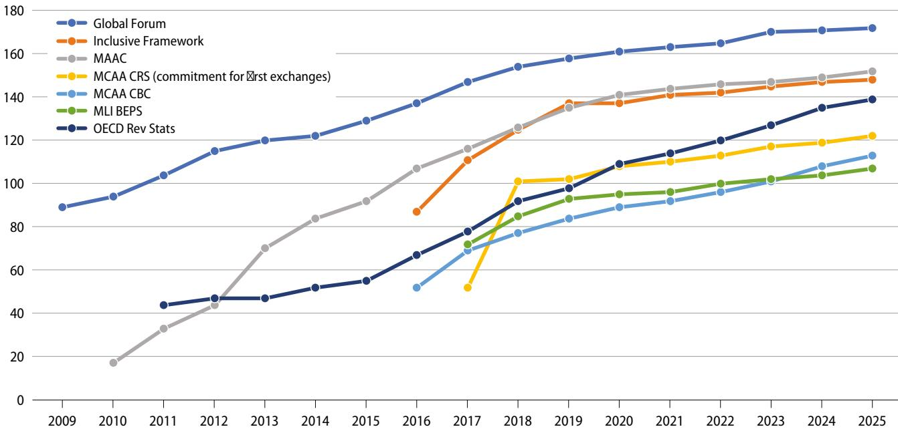  
Sources: https://www.oecd.org/tax/transparency/who-we-are/members/
https://www.oecd.org/tax/beps/inclusive-framework-on-beps-composition.pdf
https://www.oecd.org/tax/exchange-of-tax-information/Status\_of\_convention.pdf
https://www.oecd.org/ctp/exchange-of-tax-information/CbC-MCAA-Signatories.pdf  
https://www.oecd.org/tax/treaties/beps-mli-signatories-and-parties.pdf  
https://www.oecd.org/tax/tax-policy/global-revenue-statistics-database.htm  
https://www.oecd.org/tax/automatic-exchange/about-automatic-exchange/crs-mcaa-signatories.pdf

alignment between profits and economic activity, the stabilisation of corporate tax rates (which had previously been declining) and increased tax certainty. In parallel, tax transparency has provided EUR 48 billion in additional revenues to developing countries since 2009. The OECD continues to support developing countries' effective participation in international collaboration to ensure their needs and perspectives inform the design of international tax standards. For example, new members of the Inclusive Framework and Global Forum are provided with induction programmes, and over 50 such programmes have run in recent years for Inclusive Framework members. The OECD also assists developing countries in the implementation of these standards through capacity building and tax policy support activities. As a result, developing countries are making wide use of the tools and standards for international tax collaboration.

The OECD offer is demand-driven, flexible and fully respectful of the sovereignty of developing countries. There is no model or standard engagement with the OECD, nor do countries need to join the Inclusive Framework or Global Forum to be able to receive OECD support. Countries wishing to work with the OECD are able to tailor their engagement to their needs. This can include the whole lifecycle of tax reforms, targeted assistance on specific issues, training on key issues, or peer-to-peer support on live cases through TIWB.

## The OECD offer is delivered through multiple

partnerships. Alongside the TIWB initiative partnership with UNDP, the OECD takes part in the PCT, together with the International Monetary Fund (IMF), the United Nations (UN) and the World Bank Group (WBG) and works closely with a number of Regional Tax Organisations and Regional Development Banks. A wide range of developed and developing countries provide experts to help deliver OECD training and TIWB programmes. In addition, the work with developing countries is supported financially by generous donations from 15 countries and the European Union (EU).

The diverse range of support from the OECD produces a wide range of results, all contributing to improving the effectiveness of DRM in developing countries. Much of the OECD support aims to increase understanding of tax, and especially international standards and good practices. To that end the OECD provides significant training, with over 160 000 officials trained in the last five years. In addition, over 30 toolkits and tax policy reports have been produced in the same period, while OECD data sets on tax have also been expanded to include more developing countries, with an extra 26 developing countries included in the Global Revenue Statistics database in the last five years. A recent external evaluation highlighted the impact of OECD support with 90% of stakeholders agreeing that OECD support has enhanced the knowledge and skills of beneficiaries, and 85% agreeing that OECD support has improved the way participants carry out their work and has strengthened relevant processes and procedures in their countries $^{18}$ . Through more practical technical assistance the OECD supports countries in applying new standards and approaches: in the last five years, 39 countries have received support on VAT and 88 TIWB programmes have been launched; around 30 countries a year are supported on BEPS and Transfer Pricing issues, and over 65 a year on transparency and exchange of information. This support has led to numerous new and updated

pieces of legislation – over 65 in the area of BEPS and transfer pricing in the last five years alone – as well as developing country integration into the tools and standards for international tax collaboration (as shown in Figure 1). Ultimately, these impacts are reflected in the increased influence of developing countries on international tax standards, as well as in the additional revenues raised – TIWB programmes have realised over USD 2.72 billion in additional revenues, while developing countries have identified nearly EUR 48 billion in additional revenues through Exchange of Information on Request (EOIR) and the implementation of AEOI, including through related voluntary disclosure. Tracking the full impact of the support is challenging however, as a significant share of the impact relates to changes in taxpayer behaviour, which are more difficult to track and quantify accurately. To help improve the understanding of the results, the OECD has prepared a number of country case studies providing a more holistic overview of the support provided $^{19}$ . The OECD is also working with the PCT partners to improve the monitoring and evaluation of support on tax.

## 3. The OECD/G20 Inclusive Framework on Base Erosion and Profit Shifting

The work and outputs of the Inclusive Framework on Base Erosion and Profit Shifting (BEPS) continue to be a high priority for many developing countries, both in terms of participation and implementation. As more developing countries explore joining the Inclusive Framework on BEPS (hereafter Inclusive Framework) and its Steering Group, outreach has continued to evolve to strengthen engagement. Developing countries have also continued to make progress in implementing the BEPS actions. A ten-year stocktake highlighted both the progress made and the scope for further advancement in respect to the original BEPS Actions. Recent progress on the Global Minimum Tax (GMT) and simplification of transfer pricing has been accompanied by further guidance, outreach and support.

The work of the Inclusive Framework continues to be supported by a range of in-depth capacity- building initiatives. These include bilateral programmes, the Tax Inspectors Without Borders (TIWB) programme – a joint initiative of the Organisation for Economic Co-operation and Development (OECD) and the United Nations Development Programme (UNDP) – as well as programmes focussed on the particular challenges of the extractive sector. These initiatives continue to evolve, making greater use of regional approaches, while expanding into new dimensions, such as training for the judiciary. This breadth and depth of options for support enables developing countries to tailor assistance to their specific needs and capacities. In 2025, 61 jurisdictions benefited from at least one form of bilateral technical assistance on BEPS, while 30 jurisdictions received support through two or more programmes.

## INCLUSIVE FRAMEWORK ON BASE EROSION AND PROFIT SHIFTING (BEPS)

Developing countries continued to strengthen their engagement in the Inclusive Framework in 2025. Guatemala joined the Inclusive Framework in November 2025, bringing to 74 the number of developing country members $^{1}$ . At the April 2025 plenary meeting in Cape Town, eight non-member countries were invited to participate given their interest and engagement on BEPS issues. Elections to the Steering Group saw the appointment of senior officials from Azerbaijan, Nigeria and Zambia, bringing the total number of developing countries represented on the body to 13.

Developing countries' interest remained high across the technical workstreams, especially on Amount B and the Global Minimum Tax (GMT). Participation in working parties was substantial and developing countries provided written inputs on circulated documents. Interest was particularly strong in workshops on Amount B and the GMT, including co-led sessions with the African Tax Administration Forum (ATAF) that captured African perspectives. To further encourage active involvement, the Secretariat expanded bilateral dialogue with countries, including on transfer pricing, where ten developing countries updated or provided new profiles, and four additional developing

countries were added to the OECD Transfer Pricing Country Profiles $^{2}$ .

## Induction programmes

Induction Programmes on BEPS and the GMT continue to be available to new Inclusive Framework members. In total, eight programmes were ongoing in 2025. The expectation remains that induction programmes will be completed within two years of launch. Where requested and feasible, support continues to be provided to developing countries after completion through a combination of bilateral and multilateral assistance.

## Regional events and outreach

As part of the journey to improve the Inclusive Framework processes and inclusivity and as decided by members at the April plenary, regular briefing sessions are now held at regional level for Inclusive Framework members that are not part of the Steering Group. These Inclusive Framework Regional Touchpoints, organised by the Co-Chairs and the Secretariat, inform members about Steering Group discussions, collect input and respond to questions. They offer a practical opportunity for delegates to share perspectives, stay connected to the broader work and help frame diverse regional voices. In 2025, two optional information sessions for Inclusive Framework members on the Side-by-Side Package on the GMT were held and ten additional regional events were organised across Africa, Asia and the Pacific, Europe and Latin America and the Caribbean.

In the Caribbean, a new regional approach was launched in 2025, led by the Caribbean Community (CARICOM) and the Caribbean Organisation of Tax Administrators (COTA) and supported by the OECD and partners. See Box 3 for more details.

2. Transfer Pricing Country Profiles: https://www.oecd.org/en/topics/sub-issues/transfer-pricing/transfer-pricing-country-profiles.html.

## BOX 2. Examples of BEPS Induction Programmes

## MONTENEGRO

In May 2025, an induction mission took place to Podgorica, Montenegro for the delivery of a workshop on BEPS including a focus on the Global Minimum Tax, the BEPS Multilateral Instrument (MLI) and broader capacity-building support including on BEPS Action 14 (Mutual Agreement Procedure).

Following the mission to Montenegro and further follow-up support by the Secretariat, Mr Novica Vuković, Montenegro's Minister of Finance, signed the BEPS MLI at the OECD's Headquarters in Paris in November 2025. In the same month, the Ministry of Finance published for public consultation draft legislation to implement a Domestic Minimum Top-up Tax which was adopted in March 2026.

## AZERBAIJAN

A final induction mission occurred in Baku, Azerbaijan in December 2025. The mission aimed to strengthen the capacity of the Azerbaijani State Tax Service in applying OECD transfer pricing standards and related BEPS measures. It combined practical sessions on transfer pricing fundamentals, financial transactions, and selected advanced topics, while also addressing broader tax policy priorities.

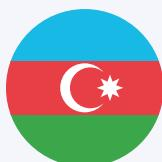

A roadmap setting out a comprehensive plan for co-operation between the OECD and the Azerbaijani State Tax Service for 2025–2027 was also agreed during the mission. The roadmap focuses on finalising BEPS 1.0 implementation, advancing BEPS 2.0 measures, and strengthening transfer pricing compliance. This roadmap complements the mission's objectives by ensuring continuity beyond the induction programme and guiding Azerbaijan towards full alignment with international tax standards.

Source: OECD Secretariat

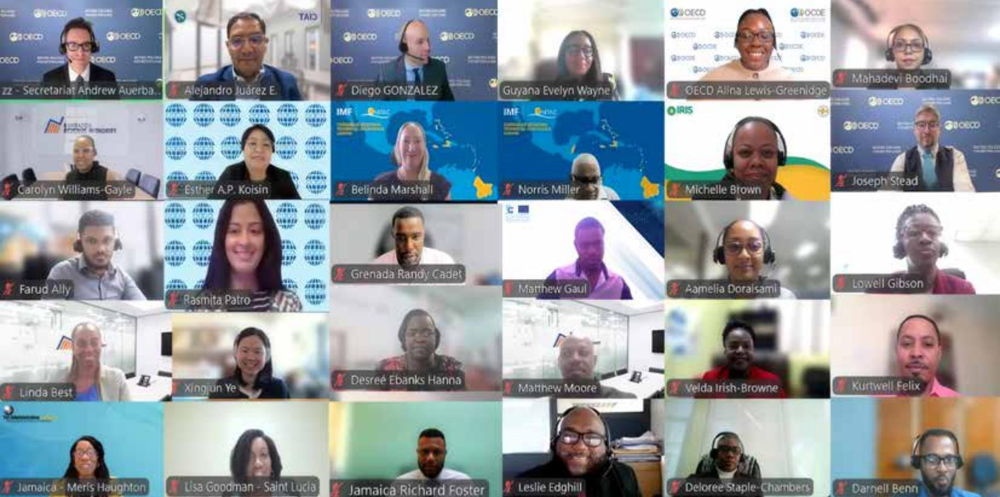  
Caribbean Tax Outreach Programme's Workshop on "Developing Taxpayers' Education, Encouraging Tax Morale & Increasing Compliance", 4 February 2026, virtual.

## BOX 3. Caribbean Tax Outreach Programme

The 26 $^{th}$ COTA General Assembly and Technical Conference took place from 22 – 26 July 2024 and was co-organised by the CARICOM Secretariat and the Government of Saint Lucia under the theme "Tax Resilience in a Rapidly Changing Global Environment". The event welcomed representatives from CARICOM Member States and Associate Members, international organisations and regional tax organisations to discuss an array of important tax topics in the region, such as the new international tax agenda, modernisation of the tax administration and updating of the CARICOM Double Taxation Agreement. The CARICOM Secretariat concluded the event with a regional roundtable in which jurisdictions and development partners outlined challenges which Caribbean tax administrations face and the capacity-building support required to tackle them.

In response, development partners working in the region have since joined forces more closely and collaboratively to offer a regional outreach programme to address the Caribbean's tax capacity-building priorities with a view to enhance domestic resource mobilisation. The initiative is led by CARICOM/COTA with the collaboration of the Commonwealth Association of Tax Administrators (CATA), the Inter-American Center of Tax Administrations (CIAT), the International Monetary Fund/Caribbean Regional Technical Assistance Centre (IMF/CARTAC), the Organisation for Economic Co-operation and Development (OECD) and the World Bank Group (WBG).

In March 2025, development partners hosted a two-day Virtual High-Level Seminar on International Tax Developments in the Caribbean, exploring topics such as corporate tax, tax and crime, transformation of the tax administration, OECD/G20 Inclusive Framework updates and regional tax priorities. This event gathered 148 participants from 20 Caribbean jurisdictions\*. Similarly, in June 2025, a two-day Virtual Workshop on Transfer Pricing in the Caribbean showcased the fundamentals and benefits of introducing transfer pricing, the Caribbean's transfer pricing journey, issues related to the tourism industry, tax administration considerations and capacity-building support, which brought together 307 participants from 18 Caribbean jurisdictions. The workshop benefitted from experience sharing from Antigua and Barbuda, Barbados, Grenada, Guyana, Jamaica, Saint Lucia and Suriname on challenges that their jurisdictions are facing regarding the implementation of transfer pricing rules. This regional initiative has encouraged experience sharing, peer-to-peer learning and discussions on pertinent international and domestic tax issues in the Caribbean.

Looking forward to 2026, partners working in the region hope that the initiative continues to synchronise capacity-building efforts at the jurisdictional level and strengthens the Caribbean's voice in wider international tax fora. Development partners in the region are seeking to meet the high demand for capacity-building support on tax issues through a series of virtual workshops and in-person events tailored to the needs and priorities of tax administrators and policymakers in the region.

\* OECD, Regional Tax Outreach, https://www.oecd.org/en/topics/sub-issues/tax-capacity-development-and-outreach/regional-tax-outreach.html.

## BEPS IMPLEMENTATION

## A decade of the BEPS initiative

A decade after the BEPS Package was released in 2015, the Inclusive Framework took stock of progress in a Report to G20 Finance Ministers and Central Bank Governors $^{3}$ . The report showed that:

\- Profits and substance are better aligned – the ratio of profits to employees for multinational enterprises (MNEs) in investment hubs has dropped by more than a quarter in recent years.

\- The sensitivity of the location of profits to tax rates has declined by up to 40% relative to pre-2015 estimates, indicating that business fundamentals are increasingly driving the location of MNEs profits.

Statutory corporate income tax (CIT) rates have stabilised after a prolonged downward trend.

\- Transparency has reached unprecedented levels: jurisdictions accounting for 98% of outbound Foreign Direct Investment (FDI) have introduced Country-by-Country (CbC) Reporting, while jurisdictions representing the majority of global Gross Domestic Product (GDP) are exchanging information rulings.

\- Dispute resolution has also been reinforced through wider and deeper use of Mutual Agreement Procedures (MAP).

For developing countries, the report highlighted that the BEPS Project has been directly relevant to domestic resource mobilisation (DRM), and further potential remains. Anti-avoidance measures can reduce tax avoidance and support CIT revenues, but effectiveness depends on capacity, data access and enforcement. Accordingly, the Inclusive Framework will continue to monitor implementation and impact, simplify and streamline processes where this can be achieved without weakening standards, and support practical delivery – particularly by ensuring access to CbC reports, strengthening risk assessment and audit use, and

sustaining capacity building with development partners (including through the Platform for Collaboration on Tax (PCT)).

With the maturity of the BEPS Project, revisions to the Inclusive Framework peer reviews have been established, which provide a simpler and more pragmatic approach, especially for developing countries:

\- For Action 5, the review process now adopts a more pragmatic approach, with a BEPS impact assessment preceding legislative review and less frequent monitoring.

\- For Action 6, peer reviews now take place every five years, with the next review in 2028, supported by technical assistance.

\- For Action 13, the annual peer review has been simplified and allows developing countries to choose their implementation timetable with Secretariat support.

\- For Action 14, a simplified peer review has been introduced for developing countries without significant MAP experience who were previously deferred from the peer review; Stage One of the simplified process was completed for 42 developing countries.

## Country-by-Country (CbC) Reporting

A new strategy was launched to support low- and middle-income countries in securing access to CbC reports. The approach is tailored to each jurisdiction's needs and timelines, provides targeted technical assistance across all stages of implementation and promotes practical solutions, including low- or no-cost information and technology (IT) tools for processing and accessing CbC data. Thirteen low- and middle-income Inclusive Framework members have indicated that they aim to be in a position to send and receive CbC reports within two years from September 2025.

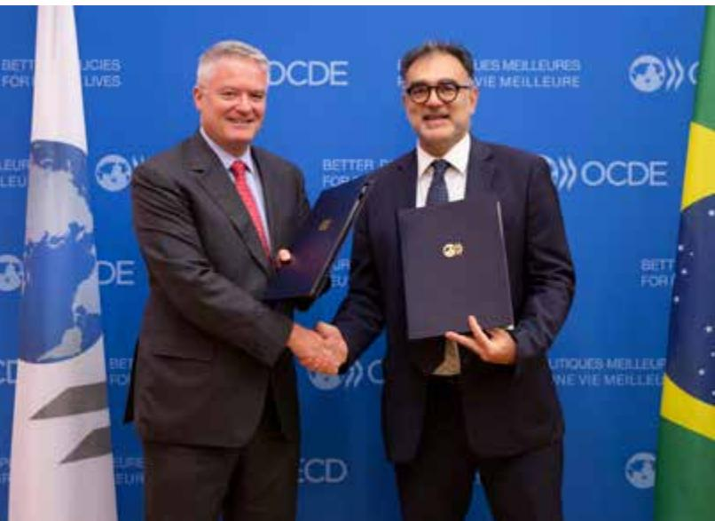  
Signing ceremony with Brazil for BEPS Multilateral Instrument, Ambassador Sarquis and OECD Secretary General Corman, 20 October 2025, Paris, France.

In total, 28 developing countries $^{4}$ , including 18 outside the OECD and G20 now have access to CbC reports, with two additional ones in 2025. Support was provided through bilateral assistance, Tax Inspectors Without Borders (TIWB) pilot programmes, multilateral workshops and Global Relations trainings, with Global Forum confidentiality assessments underpinning exchange readiness.

## BEPS Multilateral Instrument (MLI)

Forty-eight developing countries have now signed the MLI (Brazil and Montenegro signed in 2025), and 34 had ratified as of 31 December 2025 (Argentina, Kenya and Peru ratified in 2025) $^{5}$ . The MLI remains critical for implementing the BEPS treaty-related standards efficiently, allowing parties to update bilateral treaties without costly, time-consuming bilateral renegotiation. Almost all developing country signatories have received assistance from the OECD in the signing and ratification processes.

## THE GLOBAL MINIMUM TAX (GMT)

Developing countries continued to receive a range of support related to the GMT, with demand concentrated on economic impact, tax incentives and qualified domestic minimum top-up taxes (QDMTT). All developing country Inclusive Framework members received an updated economic impact assessment, and seven non-Inclusive Framework developing countries received assessments on request.

Building on the positive experiences of using series of multilateral, interactive workshops on the GMT for small groups of similarly situated countries in 2024, this approach was expanded in 2025. These workshops included a Francophone series for selected African countries, delivered with partners, such as the African Tax Administration Forum (ATAF), the International Institute for Sustainable Development (IISD), TIWB and the WBG. Such workshops have proved effective in providing developing countries with the foundations of the new rules and impact assessment considerations before delivering more tailored bilateral assistance on implementation. Support on the GMT was also provided through outreach events, such as a regional seminar for Europe and Central Asia co-hosted with the Intra-European Organisation of Tax Administrations (IOTA) at the Austrian Federal Academy of Finance, with countries sharing progress on legal frameworks, IT systems and information exchange. Two Southern African Development Community (SADC) workshops addressed the interaction between the GMT and investment policy.

Bilateral support on GMT and incentives reform was provided to 20 countries. Fifteen of these received technical support specifically on tax incentive reform and/or economic impact analysis, including outlining an approach to estimate revenue gains using taxpayer data, and direct support to conduct these assessments. Collectively, this combination of multilateral/regional and bilateral support provides countries with a comprehensive understanding of how the GMT affects them, on which they can make their policy decisions on how to proceed. In this respect, this approach also responds to the recommendation from the external evaluation of the OECD Tax and Development programme to provide enhanced ex-ante engagement with countries as they look to make decisions on implementation.

  
Regional Seminar on International Tax Developments for Europe and Central Asia, 18-20 March 2025, Vienna, Austria.

By the end of 2025, 12 developing countries had enacted GMT legislation (including Brazil, Indonesia, Kenya, Malaysia, Mauritius, Nigeria, North Macedonia, South Africa, Thailand, Türkiye, Viet Nam and Zimbabwe). Montenegro issued a draft law in late 2025 which was adopted in March 2026.

Following the publication of additional guidance and safe harbours related to the GMT, further work will be needed in 2026. Jurisdictions may need support to classify qualified tax incentives, assess policy impacts and refine revenue estimates under QDMTTs and potential revenues from the rest of the GMT rules.

The PCT published the Tax Incentives Principles (TIPS) $^{6}$ report in 2025. Alongside the report, the OECD has worked with the PCT to develop a TIPS learning toolkit, comprising explanatory videos and training materials based on the principles $^{7}$ . This will be complemented by a dedicated tax incentives section on the PCT website $^{8}$ . In parallel to this work, the database of investment tax incentives (ITID) $^{9}$ in developing countries was launched in June 2026.

## Amsterdam Dialogue

The Amsterdam Dialogue is an initiative of the Forum on Tax Administration working together with Inclusive Framework tax administration officials to improve co-ordination and consistency in GMT administration. The work is to be carried out in two phases. The first phase centred on upfront compliance with the GMT. In that context, two virtual workshops for tax administration representatives were organised in the first half of 2025 as well as an in-person meeting in Manchester, UK. These meetings gathered representatives from tax administrations from more than 60 jurisdictions, as well as business and other stakeholders, and partner organisations. This meeting concluded the work on the first phase and launched the second phase dedicated to the GMT risk assessment.

## Subject to Tax Rule (STTR)

On 23 September 2025, Albania signed the STTR MLI $^{10}$ , becoming the 10 $^{th}$ jurisdiction to join. The Cercle de Réflexion et d'Échange des Dirigeants des Administrations

fiscales (CREDAF) co-hosted a virtual workshop in November 2025 providing an overview of the STTR, a treaty-based provision aimed at developing country Inclusive Framework members, enabling them to “tax back” specific intra-group income where nominal rates fall below 9% and taxing rights have been ceded under a treaty.

## SIMPLIFYING TRANSFER PRICING (AMOUNT B)

Following the incorporation of Amount B into the OECD Transfer Pricing Guidelines in 2024, the focus in 2025 turned to supporting implementation decisions. In February 2025, a consolidated report was published $^{11}$ , gathering in one place all guidance released to date. Further implementation support was provided through Pricing FAQs which were published in February 2026 $^{12}$ , along with financial updates to the Amount B pricing tool.

Capacity-building support is now key to enable developing countries to take informed decisions when considering the implementation of Amount B. Capacity building featured a Train-the-Trainer workshop (Ankara), two virtual Q&A sessions, an Asia-Pacific

regional meeting session and a workshop at the Cape Town Inclusive Framework meeting. An ATAF–OECD series of workshops for Anglophone African countries (four virtual workshops; 160 participants from 18 ATAF members) highlighted simplicity, tax certainty and lower data needs, and the strong engagement in the discussions reflected the growing interest among African countries in considering Amount B. Zambia shared insights on how Amount B would have been beneficial in its transfer pricing dispute with Nestlé Zambia Trading Limited and discussed the state of play of Amount B implementation in Zambia (see Box 4).

## IN-DEPTH TECHNICAL ASSISTANCE ON BEPS

In-depth technical assistance on BEPS remains a core element of the OECD's capacity-building support to developing countries. In 2025, 28 bespoke bilateral country programmes on BEPS and Transfer Pricing were delivered. These bilateral engagements support countries in translating international standards into domestic legislation and delivering administrative results over time through strengthened administrative and legal frameworks.

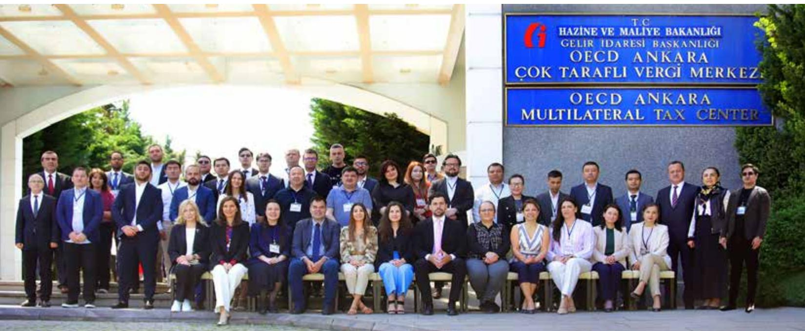  
Transfer Pricing Train-The-Trainers Workshop,12-15 May 2025, Ankara, Türkiye Multilateral Tax Centre.

## In 12 countries, new or updated legislation was

drafted and/or passed. This included transfer pricing regulations in eight countries and Country-by-Country (CbC) reporting regulations in six countries. The impact of these programmes can be seen over many years. While there can be some relatively rapid impacts

following improvements in transfer pricing legislation and capacity – primarily improved voluntary compliance from MNEs – the impact through results in audits takes longer, as cases can take many years to resolve. Box 5 summarises the progress made in Kazakhstan over the last decade.

## BOX 4. Putting capacity building on transfer pricing into practice – Zambia Revenue Authority v. Nestlé Zambia Trading Limited

On 20 August 2025, the Supreme Court of Zambia ruled in favour of Zambia Revenue Authority (ZRA) in its transfer pricing dispute with Nestlé Zambia Trading Limited (NZL), ordering NZL to pay an additional

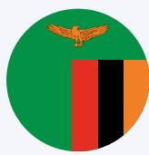

USD 600 000 in tax. This landmark decision underscores Zambia's commitment to implementing and enforcing transfer pricing rules, supported by OECD capacity-building initiatives since 2014.

Zambia has made significant progress in recent years, notably following its success in the Mopani case (May 2020) and its accession to the Global Forum in 2024. The NZL ruling further advances Zambia's transfer pricing framework by clarifying and reinforcing key international principles from OECD Guidelines for both taxpayers and ZRA. Specifically, the Supreme Court judgement established:

Burden of proof: once ZRA issues an assessment, the taxpayer must demonstrate compliance with the arm's length principle.

\- Documentation requirements: the case highlighted the need for robust transfer pricing documentation and confirmed ZRA's right to request any documentation supporting the pricing approach adopted.

Functional analysis and characterisation: by upholding NZL's classification as a Low-Risk Distributor, the Court emphasised a thorough analysis of functions performed, and risks assumed by the entity.

Transaction aggregation in transfer pricing methods: the ruling endorsed aggregation for interrelated transactions, consistent with OECD guidance, rather than applying a transaction-by-transaction approach that fails to reflect the integrated nature of certain series of transactions.

The case with NZL originated in 2016, when ZRA conducted a transfer pricing audit of NZL's related-party transactions to assess compliance with the arm's length principle. NZL had reported continuous losses since its incorporation in 2010. Following the audit, ZRA adjusted NZL's taxable profit by K56.5 million, resulting in a tax assessment of K13.8 million (approximately USD 565 000). NZL appealed to the Commissioner General and subsequently to the Tax Appeals Tribunal, which initially overturned ZRA's assessment in 2019. ZRA then appealed to the Supreme Court on five grounds, prevailing on four, successfully defending its audit approach and transfer pricing methodology and challenging a major multinational's structure.

The case illustrates the complexity and international dimension of transfer pricing disputes, with ZRA relying on foreign jurisprudence and OECD guidance in its arguments. A key recommendation advanced by ZRA following the case is the need for introduction of Amount B under the OECD framework.

Had Amount B been in place, the NZL case could have been resolved more swiftly and with less contention on major grounds for appeal. It would have reduced reliance on subjective benchmarking in the arm's length test by introducing a standardised pricing matrix and minimised disputes over comparables through the use of a global dataset. The Amount B framework would not necessarily have prevented the dispute altogether, but it would have significantly reduced complexity for qualifying transactions.

Source: https://tpcases.com/zambia-vs-nestle-zambia-limited-august-2025-supreme-court-case-no-03-2021/

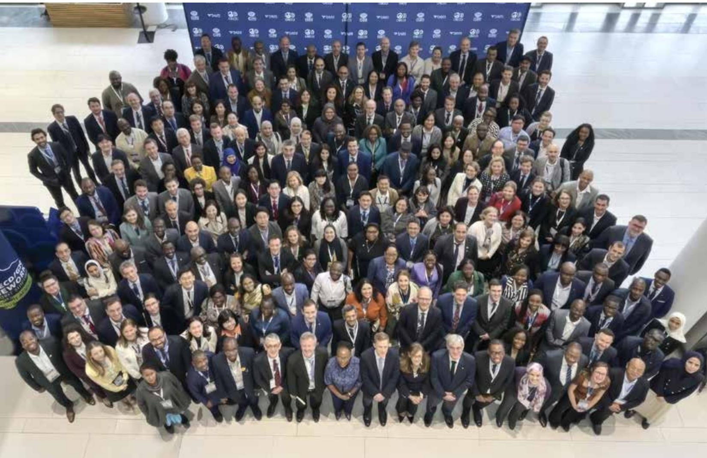  
17 $^{th}$ Plenary meeting of the OECD/G20 Inclusive Framework on BEPS, 7-10 April 2025, Cape Town, South Africa.

The bilateral programmes on BEPS and transfer pricing are increasingly complemented through additional programmes, providing highly bespoke support to countries. As the range of actions available to developing countries on addressing BEPS and transfer pricing issues has increased, the scope for tailored support has increased. For example, in 2025, 10 of the countries with a bilateral programme in place also received additional assistance on the GMT and/or tax incentives; 14 countries additionally participated in TIWB programmes, and three countries also benefitted from an extractives deep-dive programme. This flexible approach also extends to coordination with partners. As partners' capacity to provide technical support in some areas has increased, the OECD has focused on more complex and specialised areas where demand is growing, providing a more efficient collective response to demand.

Regional approaches are an increasingly valuable complement to bilateral support. Regional initiatives provide an efficient way to deliver support to multiple countries with similar needs and demands, especially on fundamental aspects. In addition, they also enable peer-to-peer learning through creating valuable peer networks, that can help improve the sustainability of support, especially when delivered in co-ordination with regional tax organisations. As such, the use of regional approaches as an integral part of bilateral support has increased in recent years, especially in Africa, Central Asia, and the Caribbean.

A series of multilateral, interactive workshops on new international tax standards for groups of similarly situated countries are an efficient tool to lay the necessary foundations of knowledge and

## BOX 5. Strengthening the capacity to tackle tax avoidance in Kazakhstan\*

This Tax and Development case study, released on 5 February 2025, illustrates how Kazakhstan has benefitted from holistic and well sequenced support in international tax capacity building. After working with the OECD for over a decade, the country has been able to strengthen its international tax capacity and identify key issues, which include addressing base erosion and profit shifting in the mining sector, as well as areas for improvement in the legal transfer pricing framework. Kazakhstan has also enhanced its access to tools for exchange of information, becoming the first country in Central Asia to fully implement the BEPS Action 13 minimum standard on CbCR. Furthermore, Kazakhstan has strengthened its tax-treaty network by implementing the BEPS Action 6 minimum standard to prevent treaty abuse. In addition, the country has achieved significant results in transfer pricing audits, including USD 174 million in additional collected tax in the period 2021-2023, supported by OECD and TIWB capacity-building programmes. The country also promoted regional tax co-operation, hosting 35 events and trainings on BEPS and transfer pricing, including targeted sessions on financial transactions, allowing nine countries from the region to benefit from the capacity-building activities of the OECD and other international partners.

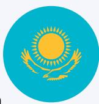

Mr Duysembiev Zhandos Zhumabayevich, Chairman of the State Revenue Committee, Kazakhstan, stated: "Kazakhstan joined the BEPS project at the end of 2016 and since then we have been working on the implementation of these standards. Through this project, Kazakhstan has implemented a multilateral convention that amended our bilateral tax treaties. We also introduced a three-tier transfer pricing documentation. These measures resulted in improved tax policy and tax administration."

Source: Strengthening the capacity to tackle tax avoidance in Kazakhstan methodology before providing more targeted bilateral implementation support. Partnering with regional tax organisations, such as ATAF, or international partners, like IISD, TIWB, and the WBG, on these series is ideal to ensure regional perspectives and a broad offer of implementation support can be provided.

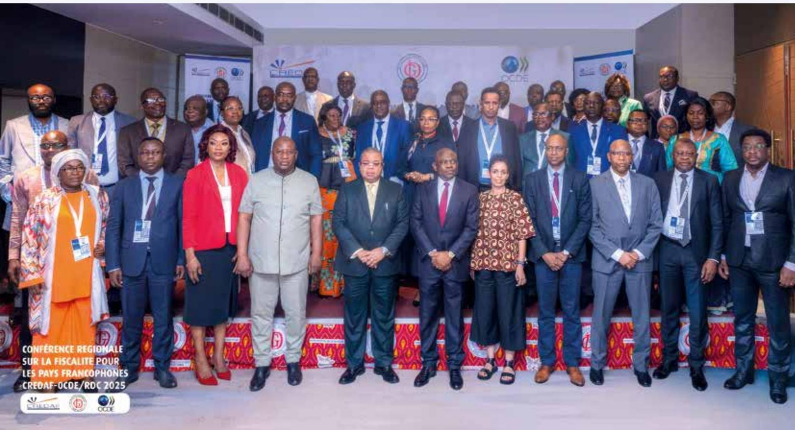  
OECD-CREDAF Regional Conference on Taxation for French-speaking countries, 13-15 May 2025, Kinshasa, Democratic Republic of the Congo.

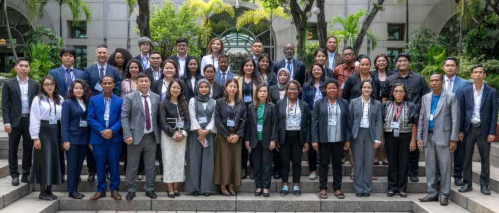  
OECD-IGF-ADB Regional Training Workshop on International Taxation and the Extractive Sector, 30 June-3 July 2025, Manila, Philippines.

Targeted capacity building for tax judges, initially developed for Ukraine judges, is emerging as an important area for further capacity building. An effective judiciary is vital in ensuring consistent interpretation of international tax standards, which in turn can contribute to tax certainty and domestic resource mobilisation. With this in mind, the OECD, initially as part of the Ukraine bilateral programme, has been developing capacity-building activities for tax judges, with a particular emphasis on legal concepts helping to deal with tax avoidance fact patterns, such as abuse of law or beneficial ownership. Encountering a high demand in this area, the OECD is currently working on the design of a programme of capacity building for tax judges in developing countries, with a view to starting its implementation in 2026.

BOX 6. Multilateral, interactive workshops on new international tax standards

In 2025, the OECD expanded the use of series of multilateral, interactive workshops on new international tax standards for small groups of similarly situated countries.

Developed in 2024 as a learning from bilateral pilot programmes on the GMT and tax incentives, a series of five interactive workshops focused on the economic impact assessment of the GMT, the drafting of the legal rules, its impact on tax incentives, and broader tax incentive reform. Between February and March 2025, the OECD delivered the workshops in French for five francophone African countries: Benin, Democratic Republic of the Congo, Gabon, Senegal, and Tunisia. External speakers included representatives from ATAF, IISD, TIWB, and the WBG. Following the workshops, Benin requested further assistance on the GMT through a TIWB programme which started in 2026.

The OECD replicated this successful model of series of multilateral, interactive workshops in October 2025 for Amount B. Four virtual workshops brought together 160 participants from 18 ATAF member countries, including eight non-Inclusive Framework members, to strengthen their understanding of Amount B and to equip African tax officials and policymakers with the necessary tools to evaluate the potential implementation of Amount B in the region\*. The programme covered Amount B's objectives, features, and implications for domestic resource mobilisation, along with technical guidance on scope, pricing frameworks, and implementation options. The workshops used region-specific case studies to encourage peer-to-peer learning and discussions in smaller breakout groups. This series was then delivered in French from February to March 2026, again in collaboration with ATAF\*\*.

Source: OECD Secretariat

  
International Tax Capacity-Building Programme for Ukrainian Administrative Court Judges, 24-26 November 2025, Paris, France.

## BOX 7. Capacity-building activities for tax judges

In 2025, the OECD continued to develop its work on capacity building for tax judges, as part of the support to Ukraine. Since 2022, at the request of the Ministry of Finance and the Supreme Court of Ukraine and the All-Ukrainian Association of Administrative judges, the OECD has delivered a programme of capacity building on international taxation, dedicated to judges dealing with tax cases at all levels of Ukraine's judiciary (district and regional courts, Supreme Court). The aim of the programme is to improve the consistency and alignment with international tax standards of the Ukrainian jurisprudence.

After a first cycle in 2022-2024, which covered the fundamentals of international taxation, a second cycle was launched at the end of 2024, with a focus on peer-to-peer learning. This second cycle included seven online sessions and two in-person workshops in the Czech Republic (in partnership with the Czech Supreme Administrative Court) and in France (in partnership with the Conseil d'État, France's Supreme Administrative Court)\*. In total, judges from ten OECD countries (Austria, Czech Republic, Finland, France, Germany, Norway, Poland, Spain, Sweden, and Switzerland) have taken part in the training, sharing their experience and case law on all the main dimensions of international taxation (tax treaties, transfer pricing, exchange of information, etc), with a particular emphasis on legal concepts helping to deal with tax avoidance fact patterns, such as abuse of law or beneficial ownership\*\*.

There is further demand beyond Ukraine for judicial capacity building, which the OECD will endeavour to respond to in 2026 and beyond. Judges from Indonesia, Kazakhstan, Mongolia, and Peru expressed interest in taking part in capacity-building activities similar to those performed for Ukraine, and so were invited to the Paris workshop as observers. Building on the experience to date with Ukraine, as well as the clear demand from other countries, further activities are being explored for 2026 and beyond.

Source: OECD Secretariat

## TAX INSPECTORS WITHOUT BORDERS

2025 marked the 10 $^{th}$ anniversary of TIWB, a joint initiative of the OECD and UNDP. Over the decade, 165 programmes have been implemented in 70 countries, raising USD 2.72 billion in additional revenues. TIWB has become an established part of the capacity-building landscape, with programmes expanding far beyond the original focus on transfer pricing to include criminal tax investigations, the effective use of Automatic Exchange of Financial Account Information (AEOI) and CbCR, digitalisation, value added tax (VAT) on digital trade, and, increasingly, the implementation of the GMT.

Fourteen new programmes were launched in 2025, including the first TIWB pilot on GMT in North Macedonia. New programmes also included a multi-partner initiative supporting the use of AEOI and CbCR in Nigeria, and a joint audit and criminal investigation programme in Papua New Guinea. Twelve programmes concluded in 2025. Results outlined in Box 8 show TIWB programmes continue to demonstrate both tangible revenue impact and wider institutional strengthening.

TIWB also played an active role in the Financing for Development (FfD) agenda throughout the year, co-hosting high-level events at the UN in New York and at the Fourth International Conference on Financing

for Development (FfD4) in Sevilla. TIWB was selected for inclusion in the Sevilla Platform for Action, reflecting its recognised contribution to delivering measurable progress on the 2030 Agenda.

TIWB expanded its pool of partner administrations to 32, with Colombia, Denmark, Egypt, Uruguay, and Zambia joining in 2025. However, resourcing pressures within partner administrations have reduced the availability of experts, even as demand has accelerated. As ten jurisdictions currently await partner administrations or roster experts, there is a growing need for more flexible delivery models. In response, TIWB is exploring options such as ad hoc virtual support, collaborative models in which multiple administrations jointly provide expertise, and shorter programme formats where long engagements are not feasible.

## TIWB – Criminal Investigations (TIWB-CI)

TIWB-CI programmes support global efforts to counter illicit financial flows (IFFs) by partnering international experts with developing jurisdictions to both strengthen their tax crime enforcement frameworks and enhance resolution of tax crime cases, including through real time support on complex investigations.

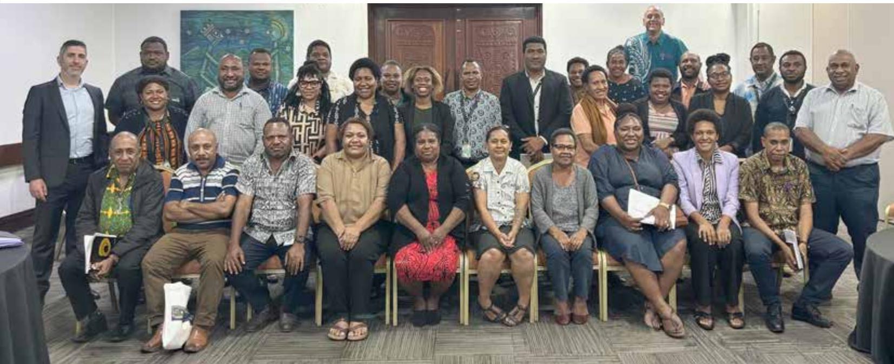  
Workshop on TIWB-Transfer Pricing-BEPS to the Internal Revenue Commission, 13-17 July 2025, Port Moresby, Papua New Guinea.

## BOX 8. Impact of selected TIWB-audit programmes completed in 2025

## EL SALVADOR

Launched in 2024 with support from a TIWB Roster expert, the TIWB-audit programme strengthened the audit capacity of El Salvador's General Directorate of Internal Taxes in key areas, including case selection, risk identification, audit planning, information requests, and analysis of taxpayer documentation. Nearly 100 tax officials received training on topics such as tax risks related to expenses, interest, and royalties, as well as compliance risk management. The expert also helped local auditors address challenges in resolving ongoing audits, suggested tools to address these issues, and proposed enhancements to the overall audit approach. As a result, three audit cases were finalised.

## KAZAKHSTAN

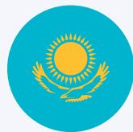

The TIWB-audit programme in Kazakhstan strengthened local auditors' capacity to conduct transfer pricing audits in the extractives sector, resulting in nine completed cases. During the programme, additional tax base adjustments of USD 264 million were issued in four audits, resulting in the assessment of USD 94 million in additional tax, of which USD 70 million has been collected to date. The TIWB Roster expert also provided recommendations for legislative reforms and supported the creation or improvement of 20 internal training resources and guidance materials.

Source: TIWB Secretariat

By the end of 2025:

\- 20 jurisdictions had completed Phase I (Maturity Model Self-Assessment and Action Plan underway), resulting in more than 300 recommendations.

\- 15 jurisdictions had received Phase II support (Implementation of the systemic gaps identified in the Action Plan and resolution of complex cases through real-time assistance underway), involving 215 days of on-site and 65 days of remote assistance across 97 criminal cases.

In 2025, four new TIWB-CI programmes were launched in Albania, Lesotho, Papua New Guinea, and Uganda. Progress also continued to be made in existing programmes:

\- Casework in Eswatini, supported by the South African Revenue Service, led to five criminal investigations being referred for prosecution, arrests, joint corporate charges, and asset-freezing measures. The estimated tax liability for these cases exceeds USD 6 million and anticipated penalties of USD 687 160.

In Ukraine, experts from the Netherlands' Ministry of Finance assisted with ten complex investigations involving smuggling, money laundering, cybercrime, and tax evasion, while also delivering operational training and facilitating exchanges with Rotterdam Customs.

Beyond casework, TIWB-CI programmes strengthened institutional frameworks in many jurisdictions by helping to develop legislative reforms, case management systems, digital forensic labs, and cross-agency co-ordination mechanisms. Triangular co-operation also continued to expand, with Liberia benefitting from a joint programme involving Kenya Revenue Authority and Sweden Tax Administration, which helped to advance major legislative amendments and establish new inter-agency agreements.

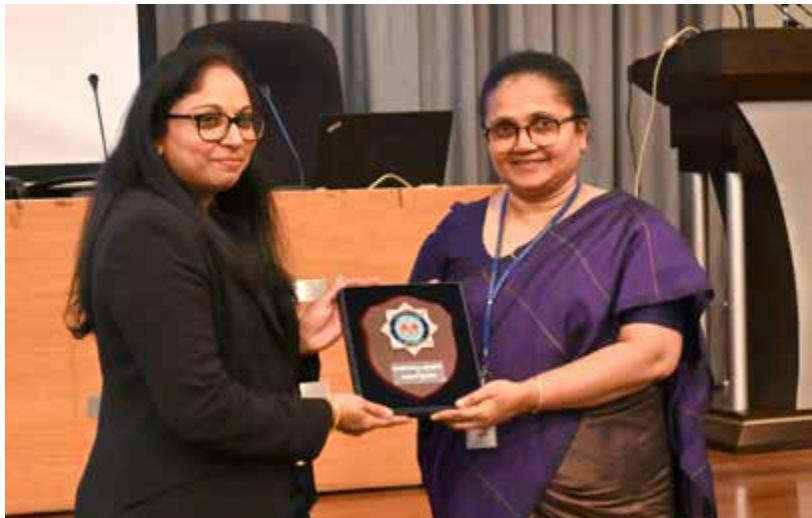  
TIWB-CI Sri Lanka launch, Commissioner General of the Inland Revenue Department of Sri Lanka, Rukdevi Fernando and Veenah Miah, from HMRC, during the launch of TIWB-CI programme in Colombo, 15 September 2025.

  
TIWB-CI Lesotho launch, Officials from the Revenue Services Lesotho participate in the official launch of the country's first TIWB-CI programme delivered in partnership with ATAF, 24 November 2025.

  
TIWB Nigeria launch, officials from the Nigeria Revenue Service, HMRC and the Turkish Tax Inspection Board announce the launch of two TIWB programmes focused on CRS-AEOI and CbCR data, 28 July 2025.  
TIWB Namibia launch, the Namibia Revenue Agency's first TIWB programme, implemented in triangular co-operation with a roster of experts and the German Ministry of Finance (BMF), 18 March 2025.

## SUPPORT ON TAXING THE EXTRACTIVES SECTOR

The OECD partnership with the Inter-Governmental Forum on Mining, Minerals, Metals and Sustainable Development (IGF) continued to provide integrated technical assistance to resource-rich countries through five Deep Dive Programmes. These engagements bring together mining sector expertise and international tax specialists to provide long-term capacity building, guidance on BEPS risks, legal and policy advisory services, and hands-on assistance along with TIWB.

\- Papua New Guinea received support on the implementation of the GMT, including economic and legal impact assessments and draft legislation, as well as assistance with introducing capital gains tax for the extractives sector, alongside TIWB-supported audits in the forestry and extractives sectors $^{13}$ .

\- Mongolia benefitted from significant training for 50 auditors on transfer pricing and international tax, building on lessons learned from TIWB programmes.

\- Ecuador advanced both legislative reform and audit support, including amendments to the mining code to limit allowable quality thresholds, mineral pricing rules, the launch of a TIWB programme, and immediate revenue gains, including USD 19.7 million in withholding tax payments.

\- Peru received technical assistance on the Authorised OECD Approach to permanent establishments.

\- Guinea was supported on the application and enforcement of its bauxite reference price.

Alongside Deep Dive programmes, regional training remained a central component of OECD-IGF work. An eight-module course on BEPS and international tax risks along the extractives value chain continued to be delivered with ATAF and the Asian Development Bank (ADB), using a blended learning format with pre-recorded technical content and live case-based sessions. The online extractives course was fully updated in 2025, expanding to around 20 hours of content including new case studies and quizzes which are hosted on the OECD's e-learning platform (the OECD Academy). For the Asia-Pacific region, an in-person training workshop was conducted in the Philippines, with 70 government officials from 20 countries attending. In Africa, eight virtual training sessions were delivered to 40 countries in English, French, and Portuguese, receiving highly positive feedback.

Several major guidance products were advanced in 2025. A toolkit on ring-fencing mining income $^{14}$ was published in July, providing practical guidance for policymakers and tax administrations on the design and administration of ring-fencing regimes for the mining sector. A Copper Pricing Toolkit $^{15}$ underwent public consultation and will be updated for release in 2026, while the Offshore Indirect Transfers toolkit continued development for consultation in 2026.

The appropriate design of fiscal regimes for critical minerals is an area of growing demand. The OECD will continue to develop guidance on mineral pricing such as copper and nickel, as well as explore other ways to respond to this demand.

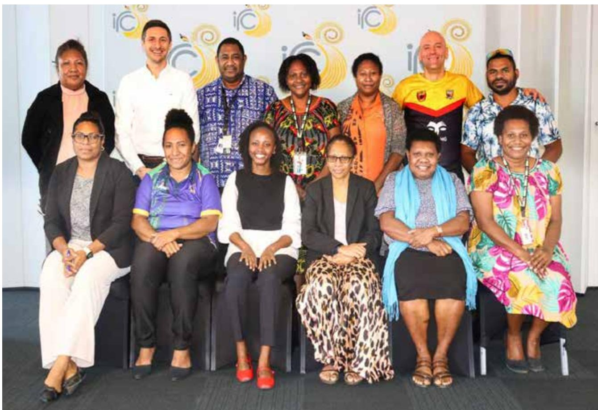  
OECD-IGF Deep Dive Programme and TIWB activities in forestry and extractives industry, 08-12 December 2025, Papua New Guinea.

4. The Global Forum on Transparency and Exchange of Information for Tax Purposes

Since 2009, the Global Forum on Transparency and Exchange of Information for Tax Purposes (Global Forum) has been instrumental in facilitating effective international co-operation to tackle cross-border tax evasion. The Global Forum promotes the implementation of the international tax transparency standards: the Standard on Transparency and Exchange of Information on Request (EOIR) and the Standards on Automatic Exchange of Information (AEOI), i.e. the Common Reporting Standard for Automatic Exchange of Financial Account Information (CRS), and the Crypto-Asset Reporting Framework (CARF).

Since 2011, capacity building has been a core duty of the Global Forum, supporting jurisdictions around the world in fighting tax evasion and other illicit financial flows (IFFs), promoting tax compliance, and mobilising domestic resources. The Secretariat of the Global Forum (Secretariat) accompanies the efforts to tackle existing challenges with a multi-pronged approach, which aims at building and disseminating knowledge and skills. With more than half of its 173 members being developing countries and with more advanced transparency standards being introduced, the Global Forum's capacity-building programme has continued to evolve in scale and depth.

The Secretariat's capacity-building programme continues to contribute to the significant results achieved globally, regionally and locally through the implementation and use of the tax transparency standards. In 2025, a record of 111 jurisdictions, including 88 developing countries, benefitted from bilateral assistance, reflecting growing experience among developing countries in successfully applying tax transparency standards, leading to substantial benefits:

\- Close to EUR 48 billion of additional revenues were identified by developing countries in the period 2009-2024 through EOIR and the implementation of the CRS, including related voluntary disclosure programmes (VDPs). This corresponds to about $36\%$ of the EUR 135 billion identified worldwide by Global Forum members.

\- In 2024 alone, they accounted for approximately $70\%$ of the nearly EUR 4 billion in additional revenue identified through offshore tax investigations and VDPs.

During this period, African, Asian and Latin American jurisdictions identified EUR 4.2 billion, EUR 24 billion and EUR 28.4 billion in additional revenue respectively.

More developing countries are actively using the tax transparency standards.

\- In 2024, they sent more than 4 600 requests for information to other jurisdictions to support cross-border tax investigations (increase of $43\%$ compared to 2023).

\- In the same year, developing countries participating in CRS exchanges received information from their partners on 53 million financial accounts, with a total value of EUR 2.7 trillion, - almost 2.5 times the number of financial accounts developing countries provided, and over 6 times the total value of their own exchanges.

Developing the knowledge and skills of officials, in particular tax auditors and exchange of information officers, is critical to ensure the effective use of exchange of information.

In 2025, the training programme contributed to build the capacities of 20 062 officials (+91% compared to 2024) through training events led by the Secretariat (9 421 officials; +64% compared to 2024), e-learning courses (5 634 officials; +117% compared to 2024), and the training led by the certified trainers of the Train-the-Trainer series (7 007 officials). In line with the objective of promoting gender balance, 54% of the participants in Global Forum trainings were women.

\- The Global Forum offers now ten e-learning courses. Over 18 400 officials were self-trained since the e-learning modules were developed.

Members positively rated the technical assistance (4.7/5) and training programmes (4.5/5).

## PARTICIPATION OF DEVELOPING COUNTRIES TO THE TAX TRANSPARENCY AGENDA

The dramatic changes made in the tax transparency landscape in the last 16 years have been the result of a strong political commitment of a growing number of jurisdictions around the world. To maintain and extend the tax transparency commitments, in 2025 the Secretariat continued to proactively engage with ministers, heads of tax administration and senior officials across the globe through 104 high-level meetings.

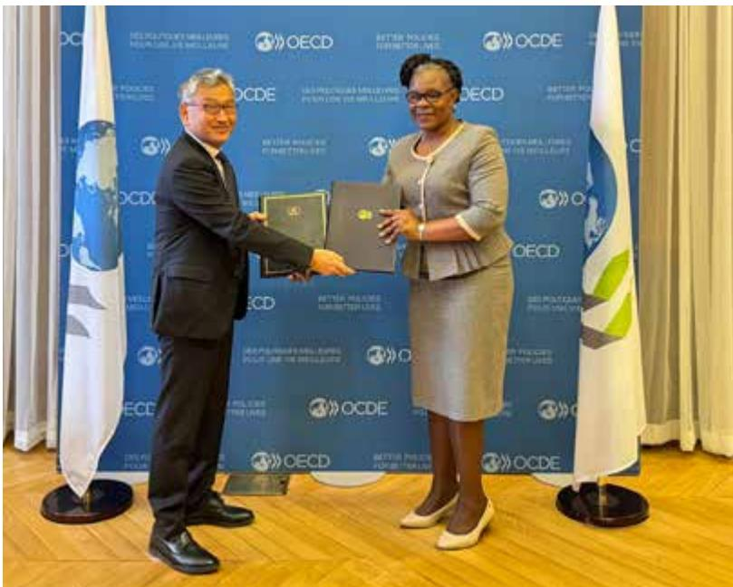  
Zimbabwe signs the Multilateral Convention on Mutual Administrative Assistance in Tax Matters, 31 July 2025, Paris, France.

The results of these long-standing and continuous activities paid off in 2025:

\- Sri Lanka joined as 172 $^{nd}$ member of the Global Forum. $^{1}$

Côte d'Ivoire and Zimbabwe signed the Convention on Mutual Administrative Assistance in Tax Matters (MAAC), while Madagascar and the Philippines deposited the instrument of ratification. The MAAC is the most comprehensive multilateral instrument for administrative co-operation among tax authorities worldwide with the participation of 152 jurisdictions (including 76 developing countries) $^{2}$ . The MAAC is already in force in 144 jurisdictions (including 69 developing countries) $^{3}$ .

\- Mongolia signed the Multilateral Competent Authority Agreement on Automatic Exchange of Financial Account Information (CRS-MCAA) $^{4}$ and nine developing countries signed the Addendum to the

GLOBAL FORUM ON
TRANSPARENCY AND EXCHANGE OF
INFORMATION FOR TAX PURPOSES
A Toolkit for Establishing a
Function for Cross-Border
Assistance in the Recovery
of Tax Claims

CRS-MCAA to implement the amendments made to the CRS in 2023. $^{4}$

\- Fiji and Zambia committed to implement the CRS by 2028. Out of the 129 member jurisdictions committed to start CRS exchanges by a specific date, 54 are developing jurisdictions.

\- Kazakhstan committed to start its first CARF exchanges in 2027, while Belize, Kenya, Mauritius, Panama and the Philippines committed to the 2028 timeline. This brings the number of jurisdictions committed to start CARF exchanges from 2027 to 76, including 20 developing countries.

Developing countries are also active contributors to all components of the tax transparency work:

\- The share of developing countries in the subsidiary bodies of the Global Forum is 31%.

Representing close to one third of the membership of the subsidiary bodies, they provided nearly one quarter of the inputs (either through written comments or substantial oral inputs made during meetings) that contributed to shaping the policy, direction and results of the Global Forum's work. Their contribution in each subsidiary group varies depending on their technical experience.

Developing country members provided 34% of all peer inputs, which play a critical role in ensuring the proper assessment and monitoring of the implementation of the standards. Despite having more recent EOI networks and experience, or even a narrow network of EOI relationships, they contributed to 40% of the EOIR peer inputs on their EOI partners and 37% of the peer input as part of the first enhanced monitoring cycle. They also provided 29% of the CRS peer inputs, while representing 37% of the CRS peers $^{6}$ .

\- The assessors made available by Global Forum members are central to the delivery of the peer review process and its integrity. Developing countries represent 34% of the Global Forum members providing assessors (and/or experts): they represent 38%, 55%, 18% and 42% of the jurisdictions that provided assessors/experts for EOIR peer reviews, EOIR enhanced monitoring, CRS and confidentiality and data safeguards, respectively.

\- Thirty-four developing countries shared their expertise and experience in capacity-building activities (67% of the jurisdictions sharing their experience).

## REGIONAL INITIATIVES – PROGRESS IN 2025

The regional approach is a key component of the Global Forum's capacity-building strategy. The Secretariat has been progressively promoting four regional initiatives. In the last few years, this regional approach has also been extended to the Caribbean.

## Africa Initiative

In 2025, the Africa Initiative continued to reach new milestones on its ambitious strategic goals. Over the past decade, the tax transparency landscape has significantly developed on the continent. The Tax Transparency in Africa 2025: Africa Initiative Progress Report $^{7}$ measures the progress achieved since the inception of the Initiative.

The seventh edition features the result achieved in 2024 by the long-term and steady contribution of tax transparency for domestic resource mobilisation (DRM) in Africa:

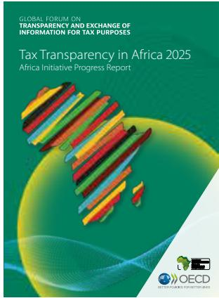

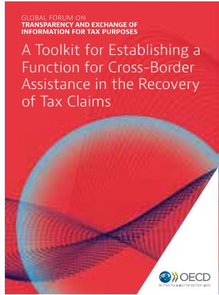

## BOX 9. Cameroon: The positive impact of exchange of information on domestic revenue mobilisation

By joining the Global Forum on Transparency and Exchange of Information for Tax Purposes in 2012, Cameroon sought not only to commit to implementing the Standards on Transparency and Exchange of Information, but above all to equip itself with the appropriate tools to take advantage of advances in international tax

co-operation in mobilising its national resources. This political will, reaffirmed through the signing of the Yaoundé Declaration, has enabled Cameroon to carry out major reforms in tax transparency, including:

the creation of an operational Exchange of Information (EOI) Unit within the Directorate General of Taxes (Direction générale des Impôts – DGI) with adequate human and technical resources,

the expansion of the EOI partner network through accession to the Convention on Mutual Administrative Assistance in Tax Matters (MAAC), in force since October 2015, thereby strengthening its capacity to collaborate with more than 150 jurisdictions,

the gradual adaptation of the legal framework to the requirements of the EOIR standards through the adoption of various legal and regulatory texts facilitating the availability of and access to relevant information: transparency regarding bearer shares, legal arrangements and beneficial owners (including the establishment of a central register of beneficial owners from 2024),

the implementation of an ambitious training programme for DGI officials – more than 1 500 officials trained between 2023 and 2025 – based on the Global Forum's training programme for trainers, in order to ensure full ownership of the EOI standards and their use,

the adoption of measures to improve the operational effectiveness of the EOI, including:

\- improving the quality and volume of outgoing requests

– introducing performance targets for DGI officials on the front line of the fight against international tax fraud and evasion

\- establishing an incentive system to reward the performance of EOI Unit officers for the first positive results obtained in coordinating and supporting auditors in the use of EOI in tax audits and investigations

\- systematising the monitoring and evaluation of the impact of EOI on tax revenue mobilisation

Beyond the satisfactory results obtained by Cameroon in its peer reviews in 2016 and 2024, Cameroon's steady progress in EOI has resulted in a substantial improvement in voluntary compliance with tax obligations and tax revenue mobilisation.

Between 2023 and 2025, Cameroon initiated 47, 101 and 130 requests for information, respectively, enabling the tax administration to obtain valuable information on tax avoidance practices. Since the first exchanges in 2012, these efforts have identified EUR 98.4 million in additional revenue, including EUR 20.9 million over the last two years (EUR 7.7 million in 2024 and EUR 13.2 million in 2025).

The strong leadership of the DGI and the strategic incentives put in place have played a key role in achieving these results. The Director General of Taxes personally monitors EOI-related performance and in 2025 joined the Resolution of Heads of African Tax Administrations to provide their tax administrations with a formal strategy to maximise the use of EOI.

Building on these results, Cameroon has now embarked on a new phase: the launch, in 2026, of the automatic exchange of information on financial accounts. This major tax transparency project will enable the country to continue consolidating its capacities and further strengthen the mobilisation of the national resources essential to its development.

17th meeting of the Global Forum's Africa Initiative, 1-2 July 2025, Eden Island, Seychelles.

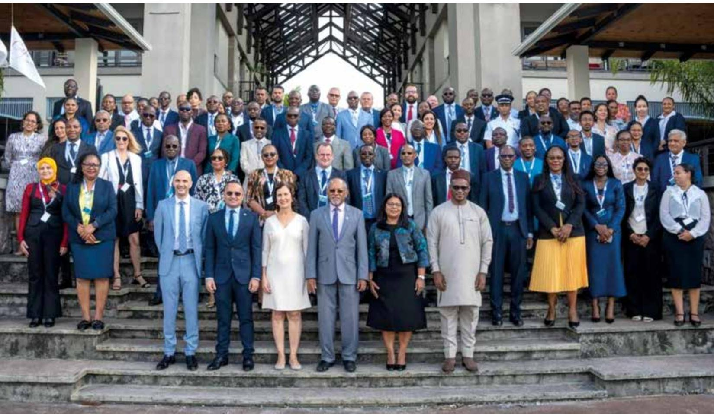

\- Nearly EUR 400 million of additional revenues (tax, interest and penalties) were identified by African countries using tax transparency tools (EOIR and other offshore investigations and the use of the CRS data received and related VDPs). Since 2009, EUR 4.2 billion in additional revenue was identified by African countries.

\- The continued expansion of the culture of EOI in Africa enabled the achievement of a record of 23 African countries sending requests. These countries sent 1756 requests of information (+98% compared to 2023) and remained largely net senders of requests.

\- African countries count 3 358 EOI relationships in force overall, mainly created through their participation to the MAAC.

\- African members exchanging under the CRS have received significantly more data than they sent.

In 2024, they received information on 2.28 million financial accounts, with a total aggregate value of more than EUR 211 billion and sent information on 1.09 million financial accounts, with a total aggregate value of nearly EUR 36 billion.

In 2025, additional progress was achieved under the Africa Initiative:

\- Democratic Republic of Congo, Zambia and Zimbabwe endorsed the Yaoundé Declaration, bringing to 37 the number of signatories of this call to fight tax evasion and other IFFs through transparency and EOI on the continent.

\- Two additional African countries signed the MAAC (26 African signatories) and participation in CRS exchanges increased with three starting exchanging and further commitments to begin exchanges and to implement the CARF in the coming years.

The Africa Initiative also continues to deliver on its working programme, which features advancements in the exploitation of both EOIR and AEOI, as well as paving the way of additional workstreams in the area of cross-border assistance in the recovery of tax claims.

\- 30 African countries endorsed a Resolution to maximise the use of EOIR.

\- Building on the work achieved by the Asia Initiative, a dedicated Working Group has been created to review the Guide on Tax Adjustments based on CRS Data and the Step-by-Step Guide for Cleansing and Matching with the aim to enrich these tools as necessary.

## Latin America Initiative

The Tax Transparency in Latin America 2025 report $^{8}$ highlights the progress made in 2024 in the implementation of the tax transparency standards, with the following outcomes:

\- At least EUR 585 million in additional revenues (tax, interest and penalties) was identified through EOIR and offshore tax investigations, VDPs and use of CRS data. This brings to EUR 28.4 billion the additional revenue identified in the region since 2009, thanks to the implementation of the tax transparency standards.

These results were supported by strong EOI networks developed by Latin American countries mainly thanks to the MAAC (2 048 EOI relationships in force).

\- Latin American members continued to be net senders of requests for information, with 1 009 requests sent, the second highest number ever.

\- Latin American members participating in CRS exchanges received data on over

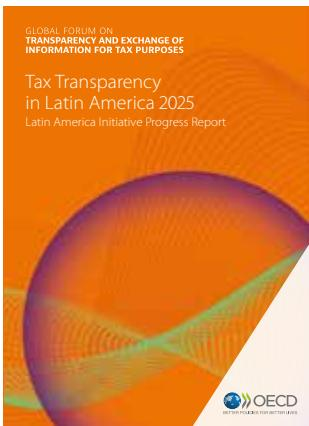

4.2 million financial accounts representing a value of over EUR 1.1 trillion.

Beyond the results crystallised in the annual report, additional progress was made in 2025:

\- Panama committed to implement the CARF by 2028.

\- Eleven Latin America Initiative members signed a resolution to carry out a self-assessment of the situation of EOI in their tax administrations as a first step towards enhancing their national strategies for maximising the use of EOIR.

\- Latin American members agreed on the establishment of a Working Group on the Effective Use of CRS data to review the Guide on Tax Adjustments based on CRS Data and the Step-by-Step Guide for Cleansing and Matching developed under the Asia Initiative with the aim to enrich these tools as necessary.

Members of the Latin America Initiative have made significant progress in their objective to explore extending the use of tax-treaty-exchanged information to areas such as anti-money laundering, anti-corruption, counter-terrorism financing, and customs (the so called “wider use of information”).

Seven jurisdictions joined a Pilot Project and signed the Multilateral Competent Authority Agreement for the Wider Use of Information (Wider Use MCAA), which defines the process and safeguards for obtaining authorisation for wider use. The Wider Use MCAA has already been activated for customs matters among six countries, marking a concrete step towards broader co-operation.

\- In 2025, the participants in the Wider Use Pilot Project agreed to establish a Wider Use Task Force to promote the effective implementation of the Wider Use MCAA, report progress to members of the Latin America Initiative, and contribute to the future 5-year assessment.

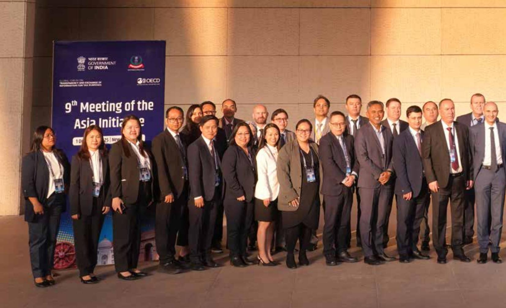  
9th meeting of the Global Forum's Asia Initiative, 1 December 2025, New Delhi, India.

## Asia Initiative

The Tax Transparency in Asia 2025 report $^{9}$ is the third progress report of the Asia Initiative and highlights the progress made in the region in 2024 and displays how they have benefited from the Global Forum's capacity-building programme to implement

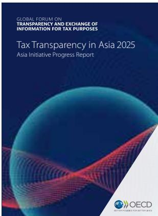

the tax transparency standards and mobilise domestic revenues.

Annual additional revenue identified by EOI has surpassed EUR 1 billion, reaching EUR 1.9 billion in 2024 (EUR 1.7 billion attributed to EOIR and offshore investigations, and around EUR 200 million are CRS-related, including VDPs). This brings to at least EUR 24 billion the additional revenues identified in the region through tax transparency since 2009.

\- Already 18 out of the 22 Asian members are committed to start CRS exchanges by a specific date, and 16 of them have already started.

\- Asian members reported receiving data on more than 64 million financial accounts in 2024, covering a staggering EUR 3.5 trillion in assets held abroad by their tax residents (25% increase in the number of accounts received).

The commitment to the tax transparency agenda has been high in the region in 2025:

\- Sri Lanka joined the Global Forum and became the $23^{\text{rd}}$ Asian member.

Viet Nam endorsed the Bali Declaration and joined the Asia Initiative as its $18^{\text{th}}$ member.

\- Kazakhstan and the Philippines committed to implement the CARF by 2027 and 2028 respectively.

The Asia Initiative also continues to deliver on its working programme, which features advancements in the exploitation of both EOIR and AEOI. This includes work aimed at delivering for 2026 a training toolkit for data analysts and a model audit protocol for tax auditors and enhancing the use of EOIR and measuring EOI impact on DRM.

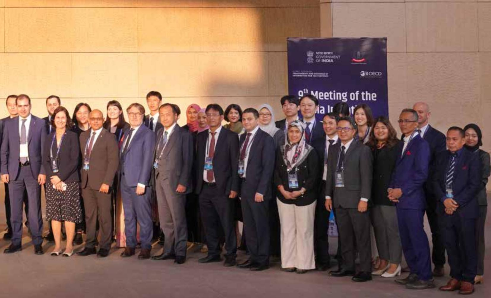

In co-operation with the Asian Development Bank (ADB), the Global Forum Secretariat organised in September 2025 a Central Asia high-level meeting on tax transparency. The meeting gathered decision-makers from tax authorities and ministries of finance from Kazakhstan, Kyrgyzstan, Tajikistan, and Uzbekistan to discuss challenges and opportunities in implementing international tax transparency standards.

## Pacific Initiative

Since 2020, the Secretariat has been one of the founding organisations of the Pacific Initiative. The Initiative aims to support Pacific Islands in strengthening their domestic tax systems by raising awareness of the benefits of tax transparency, as well as supporting the implementation and use of international tax standards, including the tax transparency standards, while fully taking into account the specific challenges they face. The Pacific Initiative follows a phased approach to the gradual implementation of these standards with a view to strengthen DRM.

An in-person workshop bringing officials from seven Pacific Island States was organised with the ADB, the Pacific Islands Tax Administrations Association (PITAA) and the Organisation for Economic Co-operation and Development (OECD) to strengthen their expertise in transfer pricing audits and the effective use of EOI in addressing cross-border tax risks.

Regarding member jurisdictions in the region, the main focus was to provide, in co-operation with the ADB, bilateral support in preparation for their upcoming peer reviews. The Secretariat, jointly with ADB, is also supporting two non-Global Forum members in joining the MAAC.

## Caribbean

In recent years, the Secretariat's capacity-building work with Caribbean jurisdictions has increasingly evolved from bilateral technical assistance towards a more comprehensive strategy aimed at addressing common issues with regional impact, building on key lessons learned from work in other regions.

Alongside on-demand assistance and regional training programmes, the Secretariat has continued efforts to facilitate a regional dialogue, aimed at sharing experience, identifying specific challenges to the region, and supporting efforts to address them.

Building on the close dialogue with Caribbean jurisdictions, as well as the Caribbean Community (CARICOM) and the Caribbean Organisation of Tax Administrations (COTA), the Secretariat organised two meetings in 2025. The discussion aimed at identifying priorities for support and paving the way for a regional action plan in 2026 under the Caribbean Dialogue.

FIGURE 2. Geographical distribution of the technical assistance programmes  
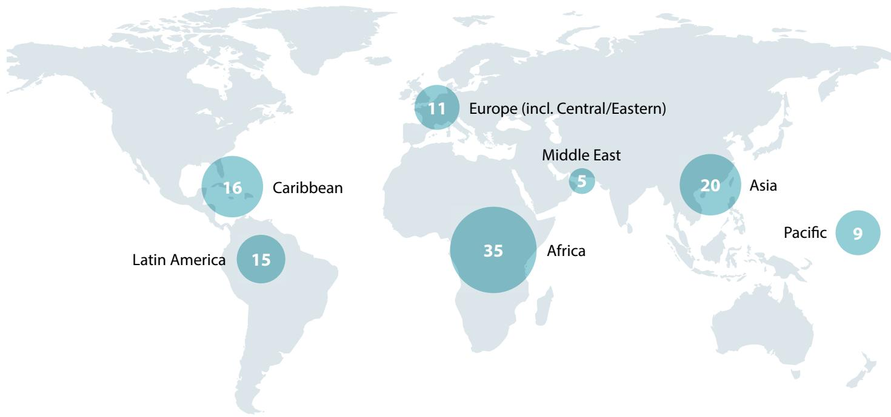  
Source: OECD (2026), Strengthening Capacities to Advance Tax Transparency and Mobilise Domestic Resources, 2026 Global Forum Capacity-Building Report, op. cit.

## EFFECTIVE IMPLEMENTATION OF INTERNATIONAL STANDARDS ON TRANSPARENCY AND EXCHANGE OF INFORMATION

In 2025, 111 jurisdictions received bilateral technical support, the highest number ever. It includes 88 developing countries that benefited from more extensive assistance. The scope and intensity of the technical support provided varied from one jurisdiction to another. The geographical distribution of technical assistance programmes is showcased in Figure 2.

## Key results in 2025 were:

\- 26 jurisdictions assisted in the signing and ratification of the MAAC, which led to two signatures and two deposits of the instrument of ratification. Developing countries represent now $50\%$ of the participating jurisdictions in the MAAC.

43 jurisdictions assisted in implementing the EOIR standard, including 28 jurisdictions assisted on the implementation of beneficial ownership requirements. Following previous support, Armenia, Côte d'Ivoire, Oman, and Trinidad and Tobago achieved a satisfactory rating of Largely Compliant. Burkina Faso, Eswatini, Honduras, Madagascar and

Mongolia successfully passed the first phase of their peer review process, with their legal frameworks generally found to be in place, although some improvements are still needed.

82 jurisdictions received CRS support as compared to 55 in 2024 (+49%) materialising a strong capacity-building investment to make a significant stride in the participation of developing countries in AEOI. As an outcome of the support provided in previous years, the results of the CRS peer reviews so far show high levels of compliance of developing country members with the requirements, with 90% of them having legal frameworks fully or substantially in accordance with the requirements (i.e. receiving a determination of “In Place” or “In Place but Needs Improvement”).

\- Since 2022, the Secretariat has supported 45 jurisdictions in strengthening the supervision of financial institutions' CRS obligations through a dedicated capacity-building programme. The interim report published in December 2025 highlights how this initiative is strengthening jurisdictions'

preparedness for the ongoing second-round effectiveness reviews, whose results will be issued in 2026. $^{10}$

\- 10 member jurisdictions are receiving technical support for the implementation of the CARF. In addition, the Secretariat developed two model legislations to support implementation of the CARF, which was provided upon request to 59 members. It also delivered an innovative fully online CARF Masterclass, training 470 officials.

\- 36 member countries benefited from technical support on information security management (ISM). As a result, four developing countries successfully passed their pre-exchange reciprocal assessments, while seven others achieved success in their post-exchange reciprocal assessments.

The ISM Maturity Assessment Initiative which started in 2024 has continued with 17 developing countries carrying out a Preliminary maturity Assessment (2) or a Detailed Maturity Assessment (17) of their ISM framework. This Initiative aimed at providing participating jurisdictions with an appraisal of their overall standing vis-à-vis the confidentiality and data safeguarding requirements of the AEOI standards, as well as a pathway for the implementation of all other AEOI requisites. An outcome report was released in 2025. $^{11}$

\- In 2025, at least 28 member jurisdictions improved their legal, regulatory or administrative frameworks to effectively implement EOIR (28 member jurisdictions, including at least ten on beneficial ownership requirements) and the CRS (23 jurisdictions).

## BUILDING CAPACITY ON THE EFFECTIVE USE OF EXCHANGE OF INFORMATION

A strategic axis of the Secretariat is to build capacities for tax auditors and EOI officers and foster a culture of EOI aimed at ultimately generating revenues. A range of activities is offered to Global Forum members to train tax officials and optimise tax administrations' practices through training, e-learning and specialised tools.

In 2025, a record 9 400 officials from 180 jurisdictions, including 13 non-member countries, participated in training on various topics related to tax transparency and administrative co-operation. These sessions were delivered through 55 events, including 37 virtual and 18 in-person events with 29 regional and 26 country-specific events.

The three Global Forum's flagship programmes designed to build sustainable capacities within member jurisdictions continued to expand and mature throughout 2025.

The Train-the-Trainer Programme continued to deepen its impact across the five participating regional groups (Africa, Asia, the Caribbean, Central and Eastern Europe and the Middle East, and Latin America). In 2025, the Initial Series trained 103 officials from 49 jurisdictions who subsequently trained over 3 000 officials locally while the Advanced series involved 92 participants from 44 jurisdictions who trained over 3 100 officials locally. Overall, since 2021, the programme has certified 303 trainers from 83 jurisdictions, who have trained 15 360 officials locally, complemented by a dedicated CRS compliance series that trained 102 officials from 50 jurisdictions and led to over 800 officials trained locally and 1 309 planned compliance activities, 60% of which have already commenced.

\- For its 1 consecutive year, the Women Leaders in Tax Transparency programme has brought together 26 women from 26 developing countries for a nine-month programme comprising six technical and leadership sessions. Since its launch in 2022, the programme has grown into a Network of 93 women from 45 developing countries, meeting annually both virtually and in-person alongside Global Forum Plenary meetings.

  
18th Global Forum Plenary meeting, 2-4 December 2025, New Delhi, India.

FIGURE 3. Train-the-Trainer Programme: Tax officials trained locally by region  
Number of officials trained through Train-the-Trainer  
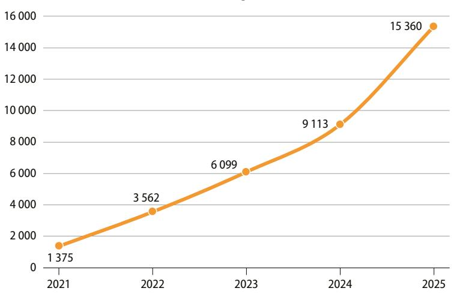

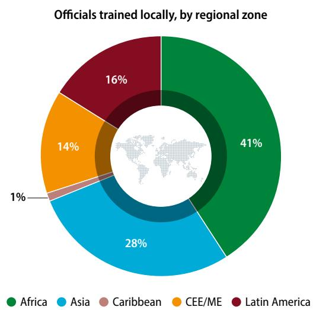  
Source: OECD (2026), Strengthening Capacities to Advance Tax Transparency and Mobilise Domestic Resources, 2026 Global Forum Capacity-Building Report, op. cit.

The ISM Network, launched in 2021, brought together 459 participants from 96 jurisdictions, including 287 officials from 50 developing countries – a 52% increase in developing-country participation compared to 2024. The Network provides a platform for security experts from tax authorities and ministries of finance to share resources, exchange practices, and discuss emerging issues.

The Secretariat continued to expand its portfolio of knowledge tools to assist members in implementing the tax transparency standards and related administrative co-operation frameworks. In 2025, 110 Global Forum members have requested at least one of the 31 tools and guidance developed by the

Secretariat. New and updated tools include model legislation for the CRS, CARF and beneficial ownership, guidance on implementation of a secure perimeter for AEOI purposes, Overall Information Security Policy for a Secure Perimeter, Change Management Policy Template with model change management process and the release in 2025 of the French and Spanish versions of the Cross-Border Assistance in the Recovery of Tax Claims Manual.

A new e-learning module was also launched to support members in completing the revised Confidentiality and Data Safeguards (CDS) questionnaire. The Secretariat now offers ten e-learning courses, which were taken by 5634 officials in 2025 (increase of 117% compared to 2024).

## 5. Policy and statistics

The importance of strengthening domestic tax policy was underscored in the Platform for Collaboration on Tax (PCT) report to the G20.\* Governments are increasingly turning to tax policy not only to mobilise revenues, but also to support social protection systems, strengthen health financing, encourage business formalisation, and address broader structural challenges. Achieving these objectives requires tax policy that is firmly grounded in robust evidence, rigorous economic analysis, and reliable tax and revenue statistics that enable informed decision-making and effective monitoring of outcomes. In 2025, the Organisation for Economic Co-operation and Development (OECD) continued to support developing countries in this area by combining analytical work, sustained country engagement, and the development of high-quality statistical data to strengthen evidence-based tax policy and revenue administration. Support on value added tax (VAT) reforms to address the challenges of cross-border e-commerce remained in high demand.

\* PCT (2025), Progress in Strengthening Frameworks for Building Tax Capacity: A Report to G20 Finance Ministers and Central Bank Governors, https://www.tax-platform.org/sites/default/files/publications/Progress-in-Strengthening-Frameworks-for-Building-Tax-Capacity.pdf.

## TAX POLICY

Over the past several years, the OECD has expanded its engagement with developing countries on tax policy, including through their inclusion into the annual Tax Policy Reforms $^{1}$ report. This has been complemented by more specialised analysis on specific aspects of tax policy in response to demand from developing countries. Alongside this analytical guidance, the OECD is also working actively to increase domestic tax policy capacity in developing countries.

## Health and tobacco

The OECD Health Tax Revenue Database continued to expand and now covers approximately 200 jurisdictions, consolidating comparable data from the Global Revenue Statistics Database $^{2}$ , the World Health Organisation (WHO), European Union National Tax Lists and national sources. The database provides information on revenues from excise taxes on tobacco, alcohol, sugar-sweetened beverages and certain food products from 2000 to 2024, and its unique scope and comparability make it a frequently requested resource for both countries and international organisations.

Work on tobacco taxation $^{3}$ has contributed to policy changes on tobacco taxation in Mexico and Brazil. The OECD has provided technical assessments of reform proposals and prepared policy briefs for high-level officials involved in Finance Law drafting. In Latin America and the Caribbean, this support contributed to policy changes, notably Mexico's introduction of a tobacco tax and a sugar-sweetened beverages tax reform in 2025 and the design of the new tobacco tax in Brazil that will be presented to the Brazilian Congress later in 2026. Progress was also made in South-East Europe, where the OECD held online and in-person meetings with Ministries of Finance, Customs and Tax Administrations, Ministries of Health, and Public Health Institutes, and participated in regional tobacco taxation policy roundtables, including a high-level meeting on tobacco tax reform in Albania, on illicit tobacco trade

in Montenegro, and on tobacco taxation in Bosnia and Herzegovina. Countries welcomed OECD support given high smoking prevalence and limited analytical capacity.

## Social protection

The OECD continued its work on social protection financing, publishing reports on Senegal $^{4}$ and Thailand. $^{5}$ In Senegal, the launch attracted participation from 50 representatives across 26 institutions, including Members of Parliament, technical advisors to the Presidency, Prime Minister and Ministry of Finance, and the head of the Social Protection and Solidarity Directorate General. In Thailand, the report contributed to the recently passed pension reform and the planned increase in the social security ceiling, to be implemented through a tiered approach from 2026.

Additional reports for Cameroon and Paraguay have advanced, with Cameroon's findings presented in Yaoundé and strong interest expressed for continued support on domestic resource mobilisation (DRM). In particular, the OECD will carry out an analysis of personal income tax return data to inform a personal income tax reform in Cameroon. Work for Paraguay was presented in October, with the final report to be shared with stakeholders in 2026.

## Tax policy capacity building and country reviews

The Tax Policy Reforms report continued to be well received, accompanied in 2025 by a dedicated brochure focusing on developing countries, $^{6}$ published as a separate Policy Brief. Developing country participation in the OECD's Working Party No. 2 on Tax Policy and Statistics also increased, with Azerbaijan, Brazil, Morocco, and Nigeria presenting their recent reforms.

Country-level capacity building continued in Tunisia to establish a Tax Policy Analysis Unit in partnership with the European Commission, with training delivered on behavioural responses to tax reforms and environmental taxation.

Country Tax Policy Reviews advanced in Costa Rica and Peru, with Peru's review set to inform the next government programme in 2026. OECD Tax Policy Reviews provide tailored tax policy recommendations based on an in-depth analysis of countries' tax systems using reliable comparative data, tax modelling tools, country benchmarking, and international good practices. They identify tax policy reform recommendations for the short and longer run that enable countries to raise revenues in ways that are supportive to economic growth, inclusive, and sustainable.

New analytical work began on labour and capital personal income tax microdata in Thailand, supported by the Swedish International Development Co-operation Agency (SIDA), to study effective tax rates and assess reform scenarios, including analysis of tax expenditures and revenue buoyancy. Work with Ukraine continued through the Swiss State Secretariat for Economic Affairs (SECO) and the OECD-Ukraine Country Programme, including revisions of tax benchmarks for personal income tax, corporate income tax (CIT), VAT, and excise taxes.

The OECD also advanced its analysis of tax incentives in the Latin America and the Caribbean (LAC) region and continued its work with Egypt, benchmarking tax incentives and modelling generosity using forward-looking effective tax rates. A report that analysed the tax system through an informal economy lens was shared with Egypt as part of the OECD Egypt country program. A training session on using OECD data, focusing particularly on revenue buoyancy, was delivered in Egypt.

## Tax morale and taxpayer education

A new project on tax morale in Asia was launched in 2025. Funded by Japan, this project will follow a similar approach to the LAC project launched in 2024, commencing with an analysis of public perceptions on tax in the region, and following this up with an analysis of tax administration perceptions, policies, and practices.

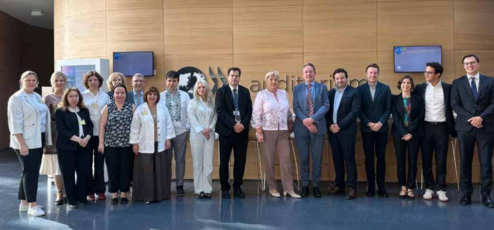  
Working meetings with Ukraine on tax policy progress, 8-11 July 2025, Paris, France.

Public Trust in Tax 2025: Asia and Beyond $^{7}$ provided the largest public perception survey of attitudes on tax in Asia, covering 19 countries in Asia. Produced in partnership with the International Federation of Accountants (IFAC), the Association of Chartered Certified Accountants (ACCA) and Chartered Accountants Australia and New Zealand (CAANZ), it looked at attitudes on the fiscal contract, as well as how different actors are consulted and trusted on tax issues. In addition to the 19 Asian countries, there were a further ten comparator countries included from Europe and Latin America, as well as the Anglophone Pacific $^{8}$ .

Key findings suggest a stronger fiscal contract between citizens and state in much of Asia, especially South-East Asia, than in Western Europe or Latin America. In almost all countries people are more likely to have a positive than negative experience of the tax administration, while politicians are, on average, the least trusted source of information on tax. In addition, taxpayers in Asia are much more likely than those in Western Europe and Latin America to say the tax system is equitable.

The LAC tax morale project (funded by Spain) continued in 2025, with further analysis of tax administration perceptions that have been shared with countries in the region. The results have been shared with all countries that participated in the survey and will be presented in a report that will issue for consultation with countries in the region in 2026.

## Supporting tax and development reporting and analysis

The OECD Official Development Assistance (ODA) database $^{9}$ continues to be the primary source of data on development co-operation on tax. The data is widely used both within and beyond the OECD. In 2025, the data continued to be used by the Addis Tax Initiative (ATI) in its monitoring and reporting, as well as by the United Nations (UN) in the Inter-Agency Task Force (IATF) monitoring work. It also featured in the PCT report to the G20. With the inclusion of a commitment to double development co-operation on tax in the Sevilla Commitment of the Fourth International Conference on Financing for Development (Sevilla Commitment), this dataset is likely to receive further attention in the coming years.

ODA to Domestic Revenue Mobilisation rose by 27% in 2024 to USD 1.1 billion, with over 65% provided by the World Bank Group (WBG). ODA to Domestic Revenue Mobilisation from Development Assistance Committee (DAC) countries increased from USD 233 million to USD 297 million between 2023 and 2024. This was primarily due to an increase in loans which increased from USD 23 million to USD 83 million. Funding from multilaterals increased from USD 630 million to USD 800 million. This was primarily driven by an increase in grants from USD 89 million in 2023 to USD 213 million in 2024. As in previous years, the WBG continues to be the largest source of ODA to Domestic Revenue Mobilisation, providing USD 739 million (67.4% of all funding).

The Sevilla Commitment contained a new voluntary commitment on ‘reducing tax exemptions on government-to-government aid on a voluntary basis.’ $^{10}$ This commitment follows the previous commitment in the Addis Action Agenda to ‘review’ such exemptions.

The OECD hub on the tax treatment of official development assistance $^{11}$ remains the most comprehensive source of data on the tax treatment of ODA. The hub was updated in early 2025 with two additional DAC members joining the hub (Austria and Lithuania), bringing the total to 24 members. There remains potential for further work on this topic, which will be taken forward if resourcing allows in 2026.

## SUPPORT ON DESIGN AND IMPLEMENTATION OF VALUE ADDED TAXES (VAT)

The VAT Digital Toolkits $^{12}$ continued to guide major reforms of VAT regimes across developing economies, complemented by targeted capacity building. While the toolkits are fulfilling one of their primary purposes, to empower jurisdictions to develop an effective strategy for VAT on digital trade independently, there are still demands for technical assistance to complement the toolkits. In 2025, demand grew particularly among French-speaking African jurisdictions. Benin's successful implementation of VAT on digital services prompted follow-on requests from Togo, where the OECD held preliminary meetings to support early design choices, and from Burkina Faso, where the OECD and ATAF are jointly assisting ahead of a technical review of draft regulations.

Nine countries are currently being supported through comprehensive bilateral support. Box 10 provides some case studies. In addition, support is being provided regionally to the Pacific through the Australian Taxation Office (ATO) led Pacific One Stop Shop (POSS) initiative. Many more countries are also supported through bespoke targeted assistance, focused on specific aspects of a VAT reform or on addressing specific issues encountered by jurisdictions.

Countries continued to explore VAT reforms for low-value imported goods as a second phase following digital services reforms. Peru requested support after implementing digital VAT in 2024. Azerbaijan also sought assistance on designing a point-of-sale VAT system for low-value imported goods, while the OECD continued to work closely with the Thailand Revenue Department on secondary regulations for its forthcoming regime.

A core function of OECD support is facilitating structured dialogue between tax administrations and the international business community. This work aims to ensure that new VAT regimes are workable for non-resident suppliers while maintaining revenue integrity.

There is also growing interest from developing countries in other areas of the OECD's work on VAT, especially in digital continuous transactional reporting (DCTR) and the VAT treatment of the crypto-asset economy. The OECD will explore avenues to provide more support to developing countries in these areas in 2026 and beyond.

## STATISTICS

## Revenue Statistics

Revenue Statistics continue to play a central role in supporting countries' ability to produce high-quality and internationally comparable revenue data. These statistics allow progress on international commitments to be monitored, including Sustainable Development Goals (SDGs) and the Sevilla Commitment's call to enhance support to developing countries for the improvement of revenue data and statistics.

In 2025, the Global Revenue Statistics $^{13}$ initiative produced and published harmonised tax revenue data for a total of 139 economies. Of these, 87 were low- and middle-income countries. Four additional countries joined the initiative in 2025: The Gambia, Liberia, Moldova, and Niue, expanding the reach of

## BOX 10. VAT bilateral support in 2025 – selected case studies

## GUATEMALA

Guatemala has advanced the preparation of a draft VAT reform bill to introduce VAT on international supplies of digital services, with the support of the OECD. Throughout Q2-Q3 of 2025, the OECD VAT facilitated a series of technical meetings to disseminate and explain the internationally recommended solutions promoted by the OECD, directly informing the design of the draft bill, which is expected to be submitted to Congress for discussion before the end of 2025.

## ZANZIBAR

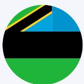

The OECD, together with the Chair of the VAT delegation within Business at OECD (BIAC), has assisted Zanzibar in improving compliance by major non-resident taxpayers with its existing regime applying VAT to international supplies of digital services. The support contributes to a comprehensive technical assistance project that the Norwegian tax authority is running and for which the lead official is a longstanding delegate of the OECD CFA's Working Party No. 9. Included in the OECD's assistance is a review of the regulatory framework and advice on how best to communicate and explain businesses' obligations to maximise engagement and compliance. Because Zanzibar is a semi-autonomous territory of Tanzania, the OECD has led important discussions on how the Zanzibar tax authority can support businesses in distinguishing between customers in Zanzibar and customers in the rest of Tanzania, utilising practical and reliable indicators, because separate VAT registration and collection requirements apply to each set.

the database and enhancing the breadth of global coverage. The four Revenue Statistics publications (OECD, Africa $^{14}$ , Asia and the Pacific 2025, $^{15}$ and Latin America and the Caribbean $^{16}$ ) feed into the Global Revenue Statistics Database, which remains the world's largest, most-detailed publicly available source of reliable and comparable tax revenue data.

In 2025, several enhancements were introduced in response to feedback from participating economies. Revenue Statistics in Latin America and the Caribbean 2025 included analysis of non-tax revenues, while Revenue Statistics in Africa 2025 featured information on health taxes and countries' experiences taxing the digital economy.

## Trends in revenue mobilisation

The new data collected in 2025 once again highlighted the substantial diversity in tax-to-Gross Domestic Product (GDP) ratios across the globe. In 2023, ratios ranged from 2.9% in Somalia to 44.0% in Denmark. Compared to 2022, tax-to-GDP ratios increased in 72 economies, decreased in 62, and remained unchanged in four.

Over a longer timeframe (2010–2023), approximately 70% of economies experienced an increase in their tax-to-GDP ratio. A majority of economies with tax-to-GDP ratios

FIGURE 4. Variation of tax-to-GDP ratios in 2023 across economies and regions  
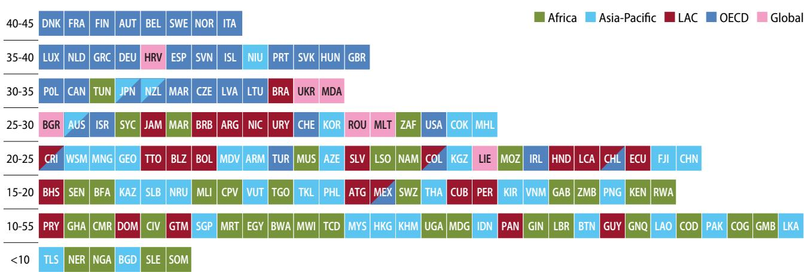  
Note: This chart covers 138 economies for which 2023 data was available: 38 in Africa, 33 in Asia-Pacific, 22 in Latin America and the Caribbean, 38 in OECD Member countries and 7 in Europe (non-OECD Members).  
Source: OECD Global Revenue Statistics Database.

below 15% in 2010 recorded increases (32 out of 38), with ten reaching the 15% threshold by 2023.

## Use of Revenue Statistics

Revenue Statistics data and analysis are extensively used by national administrations, researchers, and media outlets. Total usage of the three regional publications and dissemination materials via the OECD website increased by almost 30% in 2025. They inform benchmarking of countries' tax systems with other countries in the same region or around the globe, technical assistance programmes, policy and academic papers, and other international databases. Box 11 provides case studies of how several African countries have reported using Revenue Statistics.

## Environmentally related tax

The availability of energy tax data is vital to enable high quality analysis and policy to be developed on energy and environmental challenges. This includes the broader global dialogue on environmental taxation, domestic resource mobilisation, competitiveness, affordability and distributional concerns, and energy security. The expansion of the OECD dataset on carbon pricing and energy tax has therefore been instrumental in enabling developing country considerations and

perspectives to be integrated into the full range of work on environmental tax and related issues at the OECD including for the Inclusive Forum on Carbon Mitigation Approaches (IFCMA).

The Effective Carbon Rates 2025 $^{17}$ report covers carbon emissions, carbon pricing instruments, and fuel excise taxes for 79 countries, including 37 developing countries for 2023 with selected updates through 2025. The report highlights two key trends: (i) carbon pricing policies are increasingly diverse and flexible to balance diverse policy objectives, and (ii) their adoption, particularly that of Emissions Trading Systems (ETSs), continues to expand to new countries and more sectors including in large emerging economies such as Brazil and India. While explicit carbon pricing instruments now cover a growing share of emissions, fuel excise taxes remain the most widely used tool in developing countries, and significant gaps persist, particularly in the pricing of non- $CO_{2}$ greenhouse gases, the majority of which remain unpriced.

The OECD is using this data for more in-depth country and regional analysis. This includes identifying misalignments of energy taxation and carbon pricing with policy objectives, analysing fossil fuel subsidy reform, and assessing revenue-raising potential under different carbon pricing scenarios while accounting for

## BOX 11. Use of Revenue Statistics in Cameroon, Eswatini, Togo, and Zambia

At the Revenue Statistics in Africa Technical Workshop 2025 in Abidjan, Côte d'Ivoire, several countries shared their experience in using Revenue Statistics data and analysis:

\- Cameroon uses Revenue Statistics data and analysis to compare its revenue performance with that of countries at the same level of development, with a view to identify weaknesses in its tax system and inform new measures in the Finance Act (Loi de Finances). The country reports that Revenue Statistics in Africa is used in several tax reports and studies, notably during debates in the National Assembly on tax ratios. Examples of reforms informed by Revenue Statistics in Africa include a review of personal income tax and the introduction of export taxes on cacao and coffee (after identifying the substantial revenues these generated in Côte d'Ivoire).

Eswatini monitors revenue performance and benchmarks with Sub-Saharan countries as well as OECD countries on the basis of Revenue Statistics data and analysis, with a view to inform long-term and short-term revenue targets. The country also finds that Revenue Statistics in Africa provides a valuable reference for tax policy and administration as well as revenue mobilisation. For instance, presumptive taxes, discussed in Revenue Statistics in Africa webinars and annual reports, were introduced in 2024. Also, Eswatini is using Revenue Statistics in Africa as a tool to research and design policies around carbon taxes.

Togo also uses Revenue Statistics to benchmark its revenues with regional averages, to produce analysis and studies on Domestic Revenue Mobilisation and public finances, and to inform measures in the Finance Act (Loi de Finances). A key advantage of the initiative, according to Togo, is to facilitate benchmarking via easy access to harmonised revenue data.

Zambia finds that Revenue Statistics data expedites benchmarking with peer countries and regional averages for specific taxes, as well as facilitates the assessment of tax policy and tax administration (e.g. value added tax (VAT)) performance is below that of other countries, indicating room for improvement), policy development, and cost-efficiency improvements. Zambia has made efforts to harmonise data, further aligning to international classifications while identifying and addressing data gaps.

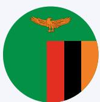

behavioural, affordability, and distributional impacts. The data have informed regional dialogue and capacity building, including engagement with LAC through UN ECLAC, country-level exchanges such as South Africa's carbon tax reforms, and policy reviews in countries including Costa Rica and Thailand. Targeted capacity-building activities on environmental taxation have also been delivered, including through EU-funded programmes.

The data and analysis on carbon pricing and energy taxation also underpin the OECD IFCMA, which brings together OECD and non-OECD members on an equal footing to strengthen the global effectiveness of climate mitigation policies. Drawing on detailed policy databases $^{18}$ , emissions mapping and metrics, IFCMA workstreams cover policy stocktaking, greenhouse gas emission mapping, carbon intensity measurement, and the analysis of international spillovers. This evidence-based analysis helps developing countries identify policy coverage gaps, understand interactions across instruments, reduce implementation and compliance costs, and address co-ordination challenges in increasingly complex climate policy landscapes. Pilot work, including a stocktake conducted with Nigeria, demonstrates how IFCMA analysis can directly support national reform efforts while improving coherence across policy instruments.

## 6. Delivering through global networks and partnerships

The Organisation for Economic Co-operation and Development (OECD) relies on networks and partnerships to enhance the reach and impact of its engagement with and support to developing countries. The global training networks of the Global Relations Programme (GRP) and the OECD Academy for Tax and Financial Crime Investigation (the Academy) provide both physical and virtual platforms to bring countries together with peers and experts to deepen their understanding on a range of topics. In many cases these activities also provide a foundation for more targeted and in-depth technical assistance. The wide range of global and regional partners helps diversify the perspectives within the OECD, while also providing routes for more efficient and effective support to be delivered. As such, much of the work described so far in this report is built upon the foundations these networks and partnerships provide.

## GLOBAL TRAINING NETWORKS

## Global Relations Programme on Taxation (GRP)

The GRP continued to deliver extensive multilateral training in 2025, reaching nearly 15 000 officials through a mix of in-person workshops, virtual events, and self-paced tools. It covers topics of international tax standards ranging from the Appropriate use of Country-by-Country Reporting (CbCR), to the Global Minimum Tax (GMT), to Tax Treaties issues, and many more $^{1}$ . Partnerships with the six OECD Multilateral Tax Centres and regional and international organisations, including ATAF, the Cercle de Réflexion et d'Échange des Dirigeants des Administrations Fiscales (CREDAF), the Inter-American Center of Tax Administrations (CIAT), the Asian Development Bank (ADB), the Australian Tax Office (ATO), the United Nations Department of Economic and Social Affairs (UNDESA), the German Agency for International Co-operation (GIZ), and others, were central to expanding reach, enriching the technical content of

activities, and achieving significant cost efficiencies by pooling resources and avoiding duplication.

The Impact Assessment Survey, completed by 556 participants from 2025 events, confirmed high levels of satisfaction and strong evidence that GRP training is improving daily work and promoting alignment with international standards. Notably, 91% of respondents found the trainings useful to their daily work; 80% have transmitted new knowledge gained from the GRP to their colleagues; and 77% found that the trainings helped them issue rulings, guidance, or responses to taxpayers.

## FIGURE 5. 2025 Live GRP Workshops in numbers

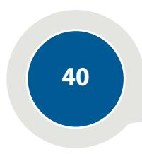

## Live Workshops

The GRP trained tax officials virtually and in-person
Participants

23 In-person events
6 Virtual workshops
11 Webinars and Q&As

  
Experts Contributions
82 Country experts
76 OECD experts  
Countries

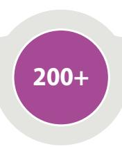

  
Large majority of participants found the training good or outstanding Satisfaction

## Languages

Arabic, English,
French, Mandarin,
Portuguese, Russian,
Spanish and Turkish

  
Advanced Workshop on Transfer Pricing, 8-12 September 2025, Yangzhou, China Multilateral Tax Centre.

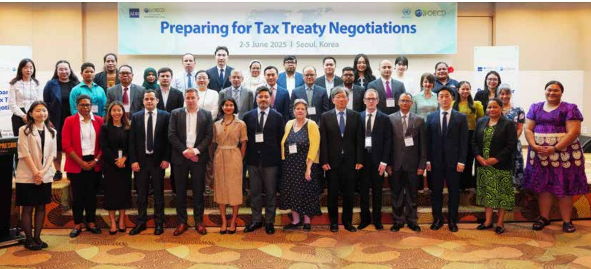  
Workshop on Preparing for Tax Treaty Negotiation in collaboration with the Korea Policy Centre, the Asian Development Bank and the United Nations, 2-5 June 2025, Seoul, South Korea.

The migration of self-paced tools from the Knowledge Sharing Platform (KSP $_{TA}$ ) to the OECD Academy started in 2025 and will continue in 2026. Since the launch of the GRP e-learning project, the GRP modules had been hosted on Canada's KSP $_{TA}$ . After the platform was decommissioned in December 2025, the GRP facilitated a smooth initial transition to the OECD Academy, $^{2}$ ensuring uninterrupted access to e-learning tools $^{3}$ for tax officials throughout the world.

## OECD Academy for Tax and Financial Crime Investigation (the Academy)

The Academy continued to deliver trainings in 2025, with 16 courses reaching 527 participants. This was a mix of ten in-person courses, and six virtual courses. The first Train-the-Trainer programme in Asia-Pacific was completed with support from the ADB, preparing ten new regional instructors. The Francophone pilot Academy in Togo delivered two courses, meeting the growing demand for training in French. A renewed set of Course Leaders, with expanded language capabilities, was engaged for 2025–2029. A new course on the misuse of technology in financial crimes was piloted, adding to a curriculum that spans asset recovery, crypto-assets, banking information, and value added tax (VAT)/goods and services tax (GST) fraud.

The annual impact assessment showed high effectiveness: 96% of respondents rated the training effective or very effective, and 91% reported enhancements in their investigative practices following their participation in the Academy. Respondents identified asset recovery and intelligence gathering from abroad as the most challenging aspects of combatting financial crimes. Some participants also reported career progression linked to the skills gained at the Academy.

As developing countries increase their capacity to fight tax crimes, they are becoming more active in the Task Force on Tax Crimes and other Financial Crimes (TFTC). The TFTC is the world's only international

standard-setting body specifically focused on combatting tax crime and enhancing the link between tax authorities and other law enforcement authorities. Thirty-two developing countries took part in the work of the TFTC in 2025, and 20 took part in the second annual meeting of the Global Tax Crime Law Enforcement Network (TCEN). This increased engagement has come on the back of participation in the International Academy on Financial Crime Investigation, where courses continue to be oversubscribed. It also builds on involvement in Tax Inspectors Without Borders – Criminal Tax Investigation (TIWB-CI) programmes, in which 20 developing countries have participated, as well as benchmarking against the Ten Global Principles for Fighting Tax Crimes, now completed by 25 developing countries, including nine additional countries in 2025.

## PARTNERSHIPS

The OECD works in close partnership across its full range of tax and development activities, helping to reduce duplication, reinforce complementarities and maximise impact. These partnerships have been central to the delivery of the OECD's work to date, allowing it to draw on a broad and diverse network of expertise from governments, international organisations, regional bodies and donors. Many of the activities detailed in this report would have been impossible without the commitment and dedication of the numerous partners, including those who provide the funding. As global attention on tax and development continues to increase, and as the number of actors involved expands, effective co-ordination, collaboration and partnership will become more critical in the years ahead.

At the same time, there is a growing emphasis on strengthening the monitoring and evaluation of support on taxation to developing countries. Measuring impact in this area is inherently complex, given time lags and the many factors influencing revenue outcomes. In this context, the OECD can support efforts to strengthen monitoring and evaluation by building on evidence generated through its technical assistance, making use of its comparative datasets, and facilitating dialogue and learning across the tax and development co-operation communities.

In 2025, the OECD continued to support the work of the Platform for Collaboration on Tax (PCT), which facilitates enhanced partnerships between the PCT partners (International Monetary Fund (IMF), OECD, UN, World Bank Group (WBG)) across various dimensions -both bilateral and multilateral- as well as through activities carried out explicitly under the PCT banner. The OECD moderated the Technical Working Group of the PCT in 2025, and played an active role in advancing the PCTs work plan.

In response to a request from the G20, the PCT produced a report on Strengthening Frameworks for Building Tax Capacity. $^{4}$ This report was developed by the PCT partners and informed by consultations with a range of regional tax organisations and multilateral development banks. The report provided a stocktake on the role of tax in development and trends in support since the Third Financing for Development Conference in Addis Ababa.

The OECD also participates as an observer to the UN Committee of Experts on Tax Matters and attends all sessions where observers are permitted. The OECD also partners with the UN in various other ways, including on capacity building for tax treaty negotiations, some of which is done in collaboration with the other PCT partners.

Much of the OECD's training and capacity building is also delivered through partnerships. Practicing experts from a range of governments around the world deliver a large share of the OECD tax training, including through the GRP and the OECD Academy on Tax and Financial Crime Investigation. The programme on extractives is built on a comprehensive partnership with the Intergovernmental Forum on Mining, Minerals, Metals and Sustainable Development (IGF) which in early 2026 was strengthened through a new Memorandum of Understanding (MoU). In addition, there are also regional partnerships with ATAF in Africa, CIAT in Latin America and the ADB in Asia-Pacific. Capacity building is also delivered in partnership with the WBG in several countries. These partnerships are continuously evolving to ensure the most effective use of each partner's skills and resources. For example, as partners strengthen their own capacity to deliver technical assistance – especially in

## BOX 12. Key findings from the Academy's 2025 impact assessment

## IMPACT ON PARTICIPANTS

96% of respondents reported that the Academy training was overall “very effective” or “effective” at providing them with the skills needed to conduct financial crime investigations.

84% rated the course curriculum as either "excellent" or "very good".

\- 92% of respondents provided either a case study or practical example demonstrating how they were able to apply the skills gained to their daily role including practical application to criminal investigations

Of the 17 respondents who reported a change in their role since their participation in the Academy, 8 respondents cited promotion as the reason for their change of role, and all attributed their promotion, at least in part, to their participation in the Academy.

## IMPACT ON ORGANISATIONS

97% of the respondents reported taking concrete steps to share the knowledge and skills gained at the Academy with their colleagues (including through briefings and training sessions) and 93% also shared the Academy training materials/OECD guidance.

\- 88% of respondents observed improvements in the quality of their investigations, and 91% reported enhancements in their investigative practices following their participation in the Academy.

83% of respondents reported seeing an improvement in their organisation's ability to co-operate with other financial crime agencies, including increases in intelligence sharing, reporting and information sharing, more regular cross-agency meetings, implementation of memoranda of understanding (MOUs), and increased outreach to other agencies to discuss common goals.

23% of respondents reported making procedural or operational reforms in their organisation as a result of their participation in the Academy, including updating or developing new internal guidance/procedures for investigations and reporting and information sharing with other financial crime agencies, etc.

## IMPACT ON JURISDICTIONS

\- 88% of respondents agreed that their participation had improved the quality of their investigations and 91% reported improvements in their investigative practices, in particular, better time management and co-ordination with prosecutors and other financial crime agencies.

\- 21% also reported initiating institutional reforms because of their participation in the Academy, including the creation of new units and/or departments focused on the enforcement relating to financial crimes, and an increase in human, financial, and technology resources for combatting financial crimes.

23% of respondents even reported initiating policy or legislative reforms as a result of their participation in the Academy, e.g., reforms related to the introduction of new financial crimes, access to financial information, and new or enhanced investigative powers, and changes to predicate offences for money laundering.

Source: 18-24-month follow-up survey on impact of Academy courses more established fundamentals of international taxation – the OECD's role is increasingly shifting towards more complex or newer standards, as well as more niche areas such as sector-specific issues or audit support.

TIWB is a global partnership between the OECD and UNDP. This partnership was solidified in 2025 with the signature of a new MoU. TIWB also relies on a number of further partnerships, including with ATAF in Africa and with the 32 partner tax administrations that provide expertise to the individual TIWB programmes.

## Several OECD datasets are produced through

partnership: the International Survey on Revenue Administration (ISORA) is a collaborative initiative between the OECD, the Inter-European Organisation of Tax Administrations (IOTA), the IMF and CIAT. Similarly, Revenue Statistics is developed in partnership with a range of organisations across its three regional publications: Africa, Asia-Pacific and Latin America and the Caribbean.

The OECD has continued to participate in the Addis Tax Initiative (ATI), including through its engagement in the post 2025 Task Force. The OECD was one of the supporting organisation representatives on the Task Force that helped develop the ATI's 2025 Declaration $^{5}$ , and it continues to participate in the ATI consultative groups.

All of the tax and development work is funded through voluntary contributions from a range of development partners. The majority of this funding is provided through a pooled fund supporting the full breadth of tax and development activities. This is complemented by a number of earmarked funds for specific countries/regions (including Egypt, Tunisia, Ukraine, the Economic Community of West African States (ECOWAS)) and projects, including Social Protection, Health Financing, Tobacco Taxation and Tax Morale. The full list of donors to the tax and development activities is below.

5. The Addis Tax Initiative: Declaration 2025, https://www.addistaxinitiative.net/sites/default/files/resources/ATI%20Declaration%202025%20%20%28EN%29.pdf.

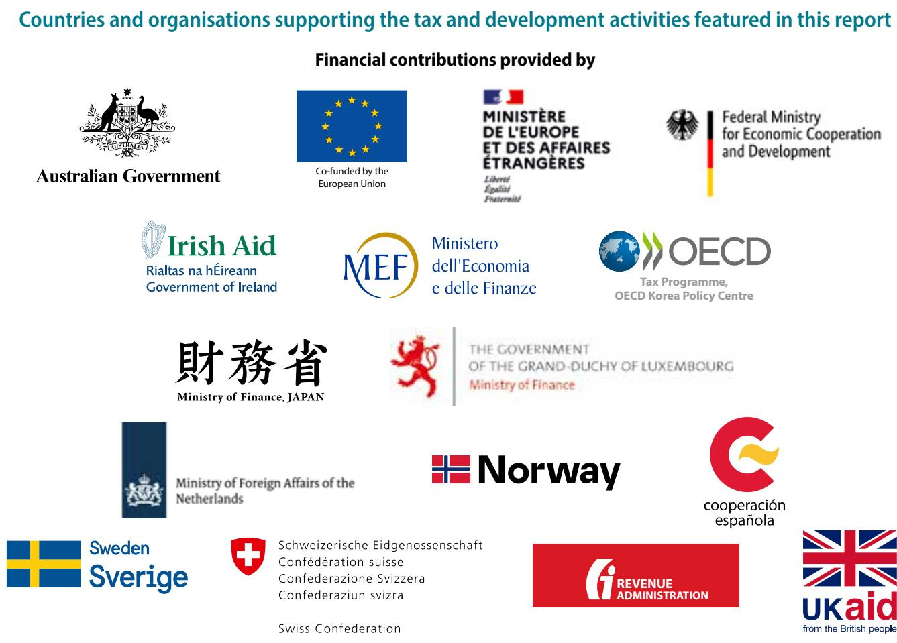

## 7. Next steps for the year to come

Building on the work completed in 2025, priorities for 2026 and beyond include:

\- Advance policy and analytic support on tax incentives and the Global Minimum Tax (GMT) in light of the side-by-side package.

\- Continue to refine the approach to bilateral capacity building to ensure programmes are responding to demand and further explore the potential for capacity building for judiciary.

\- Develop a strategy to engage developing countries in the new workstreams of the Inclusive Framework on global mobility and tax, inequality and growth.

\- Continue to evolve the Tax Inspectors Without Borders (TIWB) initiative, together with the United Nations Development Programme (UNDP).

\- Deepen the partnership with the Inter-Governmental Forum on Mining, Minerals, Metals and Sustainable Development (IGF), including through a new Memorandum of Understanding (MoU) to provide comprehensive support on BEPS in Mining signed in early 2026.

\- Continue supporting and scaling up the effective implementation of international tax transparency standards especially Exchange of Information on Request (EOIR) (with an emphasis on advancing beneficial ownership transparency), the common reporting standard (CRS) and the crypto-asset reporting framework (CARF).

\- Strengthen the evidence base on the impact of tax transparency to help demonstrate the added value of the standards, encourage sustained political commitment, and inform future strategic orientations.

\- Continue to expand engagement with developing countries in the Task Force on Tax Crime and Other Financial Crimes (TFTC), including through engagement in the preparations for the third edition of the guidance document on the Ten Global Principles.

\- Sustain broad coverage of high-quality, comparable data from developing countries and increase its coverage and use for analysis across the globe.

\- Continue to provide country reviews and notes on diverse topics (tax policy, tax administration) and continue to conduct targeted outreach on tax policy with special focus on boosting tax buoyancy and discussions on tax and informality and social protection financing at the country level.

\- Continue to ensure that Organisation for Economic Co-operation and Development (OECD) training on taxation is widely available, with a focus on establishing the OECD Academy taxation learning pathway as a replacement to the Knowledge Sharing Platform (KSP).

\- Continue to prioritise building and maintaining partnerships with other organisations to maximise outreach, provide expertise complementarity, identify efficiencies and avoid work duplication.

## © OECD (2026)

Attribution 4.0 International (CC BY 4.0)

This work is made available under the Creative Commons Attribution 4.0 International licence. By using this work, you accept to be bound by the terms of this licence (https://creativecommons.org/licenses/by/4.0/).

ATTRIBUTION – you must cite the work.

TRANSLATIONS – you must cite the original work, identify changes to the original and add the following text: In the event of any discrepancy between the original work and the translation, only the text of original work should be considered valid.

ADAPTATIONS – you must cite the original work and add the following text: This is an adaptation of an original work by the OECD. The opinions expressed and arguments employed in this adaptation should not be reported as representing the official views of the OECD or of its Member countries.

THIRD-PARTY MATERIAL – the licence does not apply to third-party material in the work. If using such material, you are responsible for obtaining permission from the third party and for any claims of infringement.

You must not use the OECD logo, visual identity or cover image without express permission or suggest the OECD endorses your use of the work.

Any dispute arising under this licence shall be settled by arbitration in accordance with the Permanent Court of Arbitration (PCA) Arbitration Rules 2012. The seat of arbitration shall be Paris (France). The number of arbitrators shall be one.

Supporting developing countries in their efforts to strengthen tax systems is a long-standing priority for the OECD. For well over a decade, the OECD tax and development programme has been in place to effectively collaborate with countries in addressing tax evasion and avoidance, improving revenue mobilisation, and advancing tax policy and administration reforms. This includes facilitating country participation in key international tax initiatives such as the Inclusive Framework on BEPS and the Global Forum on Transparency and Exchange of Information for Tax Purposes, providing internationally comparable and reliable data to inform policy analysis, and delivering targeted technical assistance across a range of international tax matters. This report provides an overview of the activities and results in these areas for 2025, which marked the 10th anniversary of the OECD/UNDP Tax Inspectors Without Borders initiative. It also provides an overview of priorities for 2026.

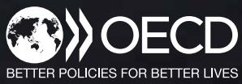

For more information:

www.oecd.org/tax

ctp.contact@oecd.org

@OECDtax

OECD Tax