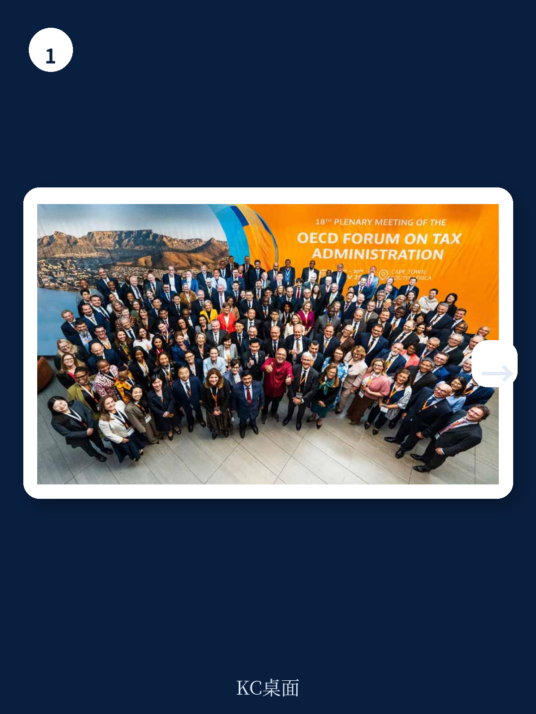
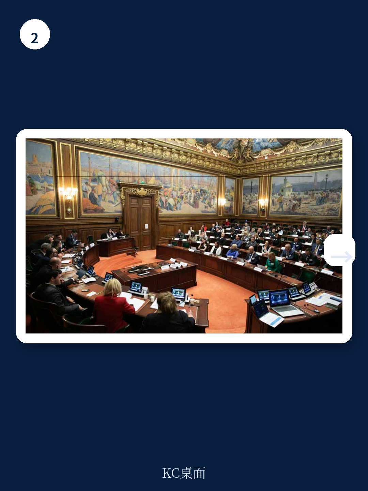

# 经合组织：全球最低税落地后，发展中国家的真正挑战才刚开始

2025年，全球税收治理进入一个微妙节点。经合组织最新发布的《2025年税收合作促进发展进展报告》传递了一个清晰信号：技术援助的需求不仅在增长，而且在质变——从“要不要接轨国际标准”转向“接轨之后如何用好规则”。这份报告覆盖了从BEPS、全球最低税到税收透明度的全链条，但最值得关注的判断只有一个：发展中国家正在从规则接受者变成主动使用者，但这一转变正遭遇能力瓶颈和资金紧缩的双重挤压。

报告开篇即点明一个关键政治信号：在2025年第四届发展筹资国际会议上，各国承诺将国内资源动员的双倍资金投入——这是整个发展合作领域唯一获得此类承诺的领域。但承诺与执行之间，经合组织自己坦承，2025年预算已削减15%，主要靠效率提升来消化。这意味着，未来几年技术援助的供需缺口，大概率会进一步扩大。

## 1. 全球最低税正在重塑发展中国家的税制选择空间

全球最低税（GMT）是2025年最密集的技术援助领域。20个国家获得了关于GMT和税收激励的双边支持。报告特别提到，经合组织向各国分享了更新后的宏观环境影响评估，但并未公开具体数字。这里的关键变量是：GMT一旦全面落地，发展中国家过去惯用的税收激励工具——比如免税期、税率减免——将失去部分效力，因为母公司所在国有权征收补足税。

> **KC评论：** 对于在东南亚、非洲设有生产基地的跨国企业来说，GMT带来的不是税率本身的变化，而是激励工具的重新定价。过去十年常见的“零税率园区”模式，在GMT框架下可能变成纯粹的利润转移，而非真实研究吸引力。完整报告中关于Side-by-Side方案的技术细节，值得企业税务团队逐条对照。

报告还指出，2026年1月达成的Side-by-Side协议带来了“更大的稳定性和确定性”，但也意味着发展中国家需要重新理解自己的政策选项。这不是一次性的政策调整，而是一个持续的学习过程。

## 2. 税收透明度正在从被动合规转向主动追缴，但数据鸿沟仍在

这是报告中最有说服力的数字部分。2024年，发展中国家通过离岸税务调查和自愿披露计划新增收入40亿欧元，自2009年以来累计已达480亿欧元。同年，发展中国家向其他管辖区发送了4659条信息请求，同比增长43%。参与自动信息交换（AEOI）的发展中国家，收到了5300万个资金账户信息，总价值2.7万亿欧元。

这些数字说明两件事。第一，透明度标准正在产生真实的财政收入效果，不是纸上谈兵。第二，信息请求量的暴增意味着发展中国家税务机关正在学会“用”这些工具，而不仅仅是“有”这些工具。

但报告也隐含一个未完全展开的问题：信息接收之后的分析能力是否跟得上？5300万个账户背后是海量数据，如果没有足够的数据分析团队，这些信息可能只是堆积在服务器里的数字。经合组织提到正在推动信息安全成熟度评估，但这只是第一步。

## 3. 技术援助的供给模式正在从双边转向多边，但质量能否维持仍是未知数

报告显示，2025年BEPS和转让定价的双边项目数量为28个，但经合组织明确表示，这已经不再是唯一的支持方式。多边培训、专题研讨会、线上课程正在快速铺开。2025年全年培训了约2.2万名官员，其中近1.5万人通过全球关系项目完成。

这一转变的逻辑很清楚：在预算削减15%的背景下，多边培训的单位成本更低，覆盖更广。但问题也随之而来——标准化培训能否替代“一对一”的深度辅导？报告自己也承认，税务无国界项目（TIWB）在获取专家资源方面越来越困难，原因包括合作税务机关的财务不确定性和越来越专业化的需求。

> **KC评论：** 对于关注发展中国家税务改革的研究者或企业来说，TIWB的专家资源瓶颈是一个值得跟踪的指标。如果这一项目的专家供给持续收紧，意味着发展中国家获取高质量技术支持的成本会上升，可能反过来影响其税制改革的节奏和深度。完整报告中关于TIWB十周年成果的详细清单，提供了各国具体案例的参考价值。

## 4. 报告尚未完全回答的三个关键问题

第一，GMT对发展中国家税收激励的替代效应，究竟有多大？报告提到更新了宏观环境影响评估，但未公开具体测算。这是政策制定者的核心关切，也是目前公开讨论中最模糊的部分。

第二，税收透明度的“最后一公里”问题——从信息获取到实际追缴，中间的能力缺口如何填补？4659条请求和40亿欧元收入之间，转化率是多少？报告没有提供。

第三，资金承诺能否落地？双倍资金的承诺来自2025年国际会议，但在主要援助国财政紧缩的背景下，这一承诺的兑现概率需要持续观察。经合组织自己已经在削减预算，这对未来几年的技术援助规模是一个现实约束。

---

这份报告提供了一个难得的全景式视角：全球税收治理的“硬件”——规则、标准、框架——已经相当完备，但“软件”——能力、资金、政治意愿——正在成为新的瓶颈。对于关注发展中国家税务环境变化的读者，完整的报告正文和图表合集，以及KC的逐项评论，已经放入每日国际信源汇编。适合快速扫读当天主流叙事，也方便后续追问和横向比较。

For informational purposes only. Portions may be generated,translated,summarized,or edited with AI assistance based on source materials and may contain omissions or errors. Please verify independently. This is not investment,legal,tax,accounting,or other professional advice.
