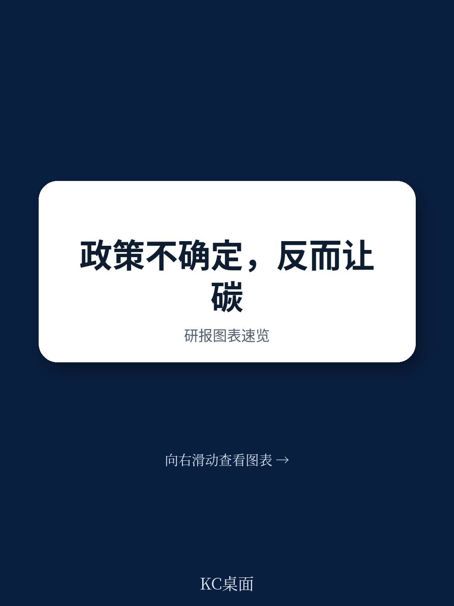
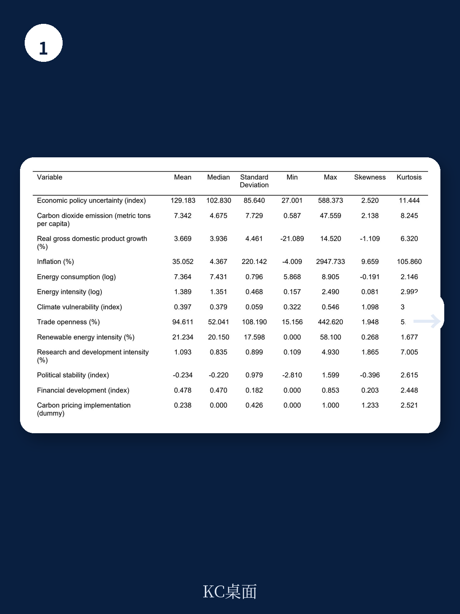
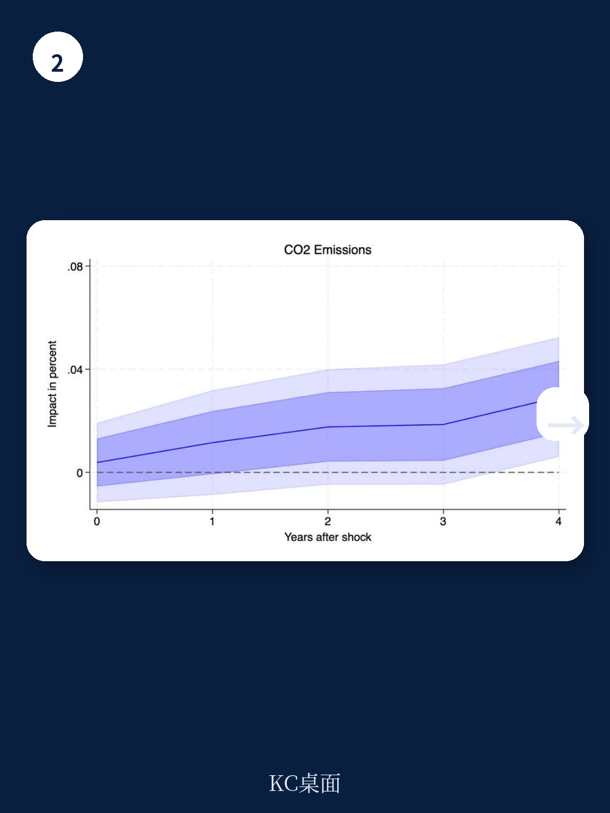

# 亚洲开发银行：政策不确定性延缓清洁转型，新兴市场如何提升排放韧性

政策不确定性不仅仅是研究和增长的敌人。亚洲开发银行最新工作论文给出了一个更具体的结论：在13个新兴市场地区长达33年的数据中，政策不确定性每上升一个标准差，碳排放就会增加0.03%。这个数字看似微小，但它揭示了一个被忽视的传导链条——不确定性不仅让企业推迟研究，还让它们推迟了向清洁技术的转型。

这份报告的价值不在于发现“不确定性需要继续观察”，而在于它系统性地回答了“什么样的地区更容易扛住这种冲击”。答案指向一组清晰的结构性特征：有碳定价机制、资金体系更发达、贸易开放度更高、政治更稳定的地区，对政策不确定性的“排放敏感度”显著更低。

---

## 1. 真正起作用的不是“减碳决心”，而是制度缓冲垫

报告最值得关注的发现，不是不确定性本身推高排放，而是不同地区之间的巨大差异。作者将13个地区按多种维度分组后发现：高收入新兴市场在面对政策不确定性时，碳排放几乎没有明显响应；而低收入新兴市场的排放则显著上升，且持续时间更长。

这个差异的背后是几根“缓冲支柱”。有碳定价机制的地区，在面对不确定性时排放增幅更小。资金发展水平更高的地区也是如此——它们的企业在面对政策模糊期时，更有能力维持清洁能源研究，而不是被迫回到高碳路径。政治稳定性同样是一个关键变量：政局越稳，政策不确定性对排放的冲击越弱。

> **KC评论：** 这里隐含的判断值得反复读：碳定价和资金发展不是“锦上添花”，而是对冲政策不确定性的减震器。对于正在设计碳市场的新兴地区来说，这份报告提供了一个额外论据——碳定价不仅能直接降排放，还能让整个地区在面对政策波动时更有韧性。

---

## 2. 能源结构的“锁定效应”比想象中更强

报告的另一组数据值得单独拿出来看：可再生能源占比更高的地区，对政策不确定性的排放响应更弱。这听起来像是常识，但背后的机制比“清洁能源排放少”更微妙。

作者在文献回顾中引用了关键理论：企业面对高度不确定性时，会采取“等待观望”策略。可再生能源研究通常是资本密集型、回报周期长、高度依赖政策稳定性的资产。当政策前景不明，企业最理性的选择就是推迟这类研究，继续沿用现有的高碳基础设施。这就是所谓的“锁定效应”——不确定性不是直接增加了排放，而是延缓了从高碳向低碳的切换速度。

那些已经积累了较高比例可再生能源的地区，恰恰是因为它们已经部分摆脱了这种锁定。它们的新增研究更多是“替换”而不是“新建”，决策不确定性更低。

---

## 3. 报告没有完全回答的关键问题：这个效应是暂时的还是永久的？

报告的实证方法捕捉的是短期动态响应——不确定性冲击后1到5年的排放变化。它没有回答一个更根本的问题：这种排放增加是“补课式”的（事后会被更快的减排抵消），还是“结构性”的（高碳路径一旦被延长，就难以逆转）？

从理论上看，两种可能性都存在。如果不确定性只是延缓了清洁研究，那么一旦政策明朗，企业可能加速补上进度，长期排放轨迹不受影响。但如果不确定性导致高碳基础设施被“锁定”了更长时间——比如企业延期关闭了一座煤电厂——那么这部分额外排放可能就是永久性的。

这个问题的答案，决定了政策制定者应该把报告结论理解为“短期波动”还是“长期警示”。

> **KC评论：** 报告本身没有在这个问题上给出明确答案，但这恰恰是它值得深入阅读的地方。作者在方法论部分坦诚地指出，他们的估计是“简化形式的净效应”，没有直接剥离宏观环境活动调整和结构调整节奏变化这两个渠道。对读者来说，这意味着报告的核心价值不是给出一个“精确数字”，而是打开了一个分析框架——如何评估你的地区在不确定性面前的“排放韧性”。

---

## 对读者的观察框架

如果你是一个新兴市场的政策制定者、企业战略负责人或读者，这份报告提供了一套自检清单

第一，你的地区是否拥有足够的制度缓冲垫？碳定价、资金深度、政治稳定性——这些不是“软指标”，而是决定你的排放路径在面对外部冲击时是否容易脱轨的硬约束。

第二，你的能源结构是否已经跨越了“锁定临界点”？可再生能源占比越高，不确定性对排放的冲击越弱。这不仅是环境问题，也是宏观环境韧性的一部分。

第三，你的贸易开放度和研发强度是否足够？报告显示，这两个变量同样是降低排放敏感度的有效工具。贸易开放度高意味着企业有更多渠道获得低碳技术和融资；研发强度高则意味着地区有更强的内生创新能力来应对政策波动。

最终，这份报告传递的信息是：不确定性无法消除，但可以管理。管理的工具不在“减碳承诺”本身，而在那些让地区在面对不确定性时仍能保持低碳路径的结构性条件。

---

For informational purposes only. Portions may be generated,translated,summarized,or edited with AI assistance based on source materials and may contain omissions or errors. Please verify independently. This is not investment,legal,tax,accounting,or other professional advice.
