# Enhancing Social Protection in Kiribati

Ni Wang

SIP/2026/057

IMF Selected Issues Papers are prepared by IMF staff as background documentation for periodic consultations with member countries. It is based on the information available at the time it was completed on April 24, 2026. This paper is also published separately as IMF Country Report No 26/100.

2026
JUL

# IMF Selected Issues Paper Asia Pacific Department

Enhancing Social Protection in Kiribati Prepared by Ni Wang (APD)

Authorized for distribution by Corinne Deléchat
July 2026

IMF Selected Issues Papers are prepared by IMF staff as background documentation for periodic consultations with member countries. It is based on the information available at the time it was completed on April 24, 2026. This paper is also published separately as IMF Country Report No 26/100.

ABSTRACT: Kiribati expanded social protection spending in response to COVID, drastically reducing poverty. Concurrently, an increase in untargeted social protection receipts has supported spending on goods that do not enhance human development and may have negative externalities. Causal evidence is established based on discontinuity in age-eligibility with a control function approach. We discuss policy options to enhance social protection taking into account logistical and capacity constraints.

RECOMMENDED CITATION: Ni Wang. 2026. Enhancing Social Protection in Kiribati. IMF Selected Issues Paper SIP/2026/057.

JEL Classification Numbers:

C26, D12, I32, I38

Keywords:

Social protection, unemployment benefits, copra subsidy, household income and consumption survey, targeting and efficiency

Author's E-Mail Address:

nwang2@imf.org

SELECTED ISSUES PAPERS

# Enhancing Social Protection in Kiribati

Kiribati

Prepared by Ni Wang $^{1}$

## KIRIBATI

SELECTED ISSUES

April 24, 2026

Approved By

Asia Pacific

Prepared by Ni Wang (APD).

Department

## CONTENTS

ENHANCING SOCIAL PROTECTION IN KIRIBATI 2
A. Introduction 2
B. Social Protection Programs in Kiribati 4
C. Social Protection Benefits and Spending: 2019 vs 2023 5
D. What to Spend on, and How Much? Extensive and Intensive Margins 7
E. Conclusions and Policy Recommendations 9

## References.

## TABLES

1. Poisson Pseudo Maximum Likelihood Estimates of Spending Semi-Elasticities in 2019/20 HIES \_\_\_\_ 12
2. Poisson Pseudo Maximum Likelihood Estimates of Spending Semi-Elasticities in 2023/24 HIES \_\_\_\_ 12
3. Logit Estimates of Spending Odds Semi-Elasticities in 2023/24 HIES \_\_\_\_ 13
4. Estimates of Spending Semi-Elasticities Conditional on Spending>0 in 2023/24 HIES \_\_\_\_ 14
5. PPML with Control Function Estimates of Spending Semi-Elasticities in 2023/24 HIES \_\_\_\_ 15
6. Diagnostic Statistics for the PPML with Control Function Approach (2023/24 HIES) 15
7. Logit with Control Functions: Estimates of Spending Odds Semi-Elasticities in 2023/24 HIES \_\_\_\_ 16
8. Control Function Estimates of Spending Semi-Elasticities Conditional on Spending >0 in 2023/24 HIES \_\_\_\_ 17
9. Diagnostic Statistics for the Hurdle Model with Control Function Approach (2023/24 HIES) \_\_\_\_ 18

## ANNEX

I. Robustness and Causal Inference 19

# ENHANCING SOCIAL PROTECTION IN KIRIBATI

Kiribati expanded social protection spending in response to COVID, drastically reducing poverty. Concurrently, an increase in untargeted social protection receipts has supported spending on goods that do not enhance human development and may have negative externalities. We discuss policy options to enhance social protection taking into account logistical and capacity constraints.

## A. Introduction

1. Kiribati is a remote, geographically dispersed Pacific Atoll country facing large human development and public infrastructure investment needs. Kiribati has a population of 127 thousand people, located in islands spanning 3.4mn km $^{2}$ of ocean. Shipping costs and lack of connectivity and infrastructure, especially on the outer islands, limit market sizes and service delivery. As a result, the economy is dependent on public spending funded by large but volatile fishing license revenues. Key social safety nets, including free education up to age 15, health care, unemployment, senior citizen and disability benefits, are provided by the government. The country is vulnerable to weather shocks and the long-run threat of rising sea levels, and the cost of building resilience to rising sea levels is very high (IMF 2025, Selected Issues Paper).

2. The expansion of social protection during the COVID-19 pandemic $^{1}$ supported households amid increased costs of living and contributed to a sharp reduction in poverty. The 2019/20 and 2023/24 Household Income and Expenditure Surveys (HIES) show that the poverty rate fell from 21.9 to 5.5 percent, and inequality declined as the Gini coefficient fell from 27.8 to 24.7. Poverty declined across all regions, including outer islands where reductions reached around 20 percentage points, and the urban–rural poverty gap narrowed. Extreme poverty (US2.15/day, 2017 PPP) was almost eliminated (0.04 percent in 2023/24). On non-monetary measures, sanitation deprivation fell from 56 percent to 35 percent between both surveys, while access to electricity and water and asset ownership (e.g., vehicles) improved.

3. Between 2019 and 2023, growth in social transfers was transformative for lower-income households, driving most of their increase in household income. Bottom-quartile households saw only modest increases in copra-related income and remittances, while formal labor income (excluding copra) was broadly unchanged. This reflects limited access to formal employment, particularly for outer-island low-income households reliant on coconut farming, and for some low-income Tarawa residents constrained by low educational attainment and limited employment opportunities. In contrast, income growth of richer households (those in top 3 quartiles of the income distribution) was mainly driven by work income, often in government and the formal sector, though they also benefited from social transfers.

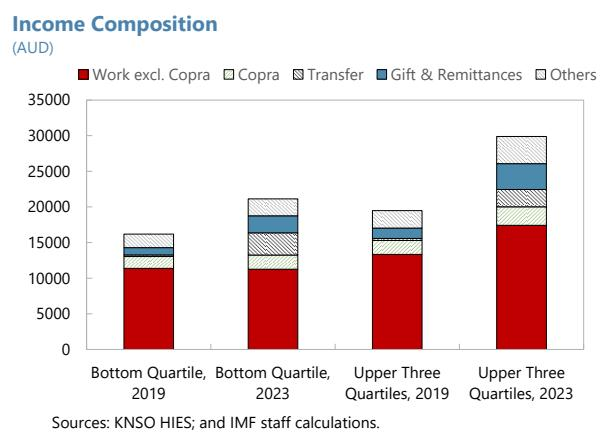  
Contributions to Average Total Household Income Growth (From 2019 to 2023; in percentage point)

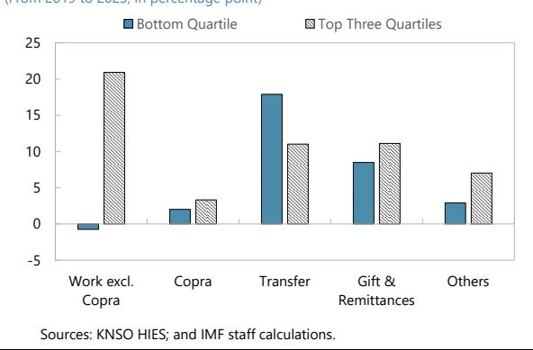

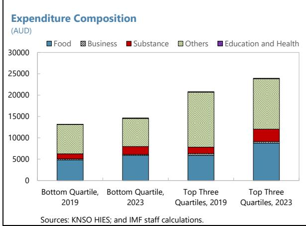  
Contributions to Average Total Household Expenditure Growth
(From 2019 to 2023; in percentage point)

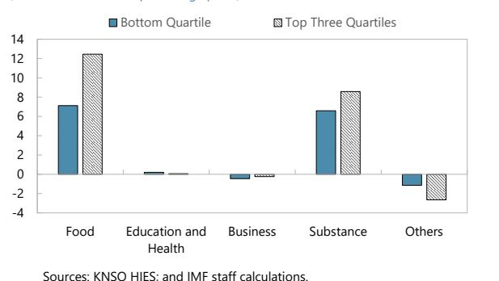

4. As a result of higher income, all households increased spending on food and substances (tobacco, alcohol, and kava), with limited growth in other spending categories. This suggests that a non-trivial share of the growing income was spent on goods that do not increase human development and may have negative health consequences. This motivates an examination of how additional benefits impact spending decisions.

5. This paper analyzes the effect of social transfers on household spending and draws policy implications. Section B describes Kiribati's current social protection programs, their progressivity, and cross-country comparisons. Section C documents how the relationship between social transfers and household spending changed between 2019 and 2023. Section D focuses on the 2023/24 HIES round and explores how social benefits affect the probability of spending on different categories (extensive margin) and how much to spend, conditional on spending (intensive margin). An age-eligibility-based fuzzy regression discontinuity strategy establishes a causal link between unemployment receipts and substance spending. Section E concludes with policy recommendations to strengthen efficiency, improve targeting and program coordination, and mitigate negative externalities.

## B. Social Protection Programs in Kiribati

## 6. Social protection programs in Kiribati include:

\- Copra subsidies, which aim to support the income of outer-island residents by purchasing copra at AUD 4/kg (doubled from AUD 2/kg in 2022), around four times the global market price, to produce coconut oil at state-owned coconut processing plants. Copra subsidy is the largest benefit, at 9 percent of GDP in 2025.

\- Unemployment benefits, introduced in 2022 via a Support Fund for Unemployment (SFU), which provide AUD 50 per person per month for people aged 18-60 who are not formally employed. Because of high informality in Kiribati, unemployment benefits reached close to universal coverage—about 95 percent of people in 2023/24 lived in a household with at least one SFU recipient, with about 2.4 beneficiaries per recipient household. The payments are paid on quarterly basis due to payment capacity constraints. Unemployment benefits stood at about 5 percent of GDP in 2025.

\- Senior citizen allowance, a fixed cash transfer for age-eligible elderly people. In 2020, the age requirement was reduced from 65 to 60 and the amount approximately tripled to AUD 200-300 per month per person. Senior citizen benefits were at 4 percent of GDP in 2025.

\- Disability allowance for people with permanent disabilities, introduced in 2020. Disability allowance is the smallest benefit in the aggregate, amounting to just 1 percent of GDP in 2025.

While senior citizen allowances and disability allowances belong to the traditional type of social assistance (the definition that this paper follows), the Government of Kiribati considers SFU as a form of social assistance as well. Benefit delivery is highly cash-dependent and is gradually transitioning towards digital payments. $^{2}$ Kiribati also has a contributory pension system via the Kiribati Provident Fund.

## 7. Kiribati social protection programs exhibit different degrees of progressivity.

Unemployment benefits, senior citizen and disability allowances decline with household consumption, though unemployment benefits are less well targeted, with a flatter decline across consumption levels. In contrast, copra benefits and contributory pensions increase with household consumption. $^{3}$ The substantial heterogeneity in progressivity across programs indicates scope for enhancing the efficiency and equity of social spending.

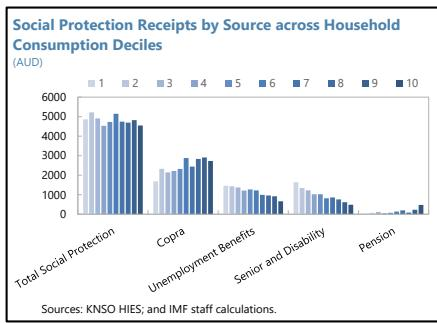

## 8. Traditional social assistance—senior citizen and disability allowances—has broad coverage, but overall social spending is high, with some overlap across programs. About 30

percent of senior citizen and disability transfers accrue to Kiribati households in the bottom consumption quintile, and almost 50 percent of people in the bottom quintile live in a household where at least one member receives these transfers, indicating high coverage and incidence, respectively. At the same time, spending on traditional social assistance is higher than in comparator countries and other Pacific Islands. Unemployment benefits are much higher than in the OECD. In addition, around 94 percent of the copra subsidy recipient households also receive unemployment benefits.

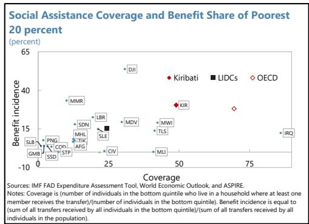

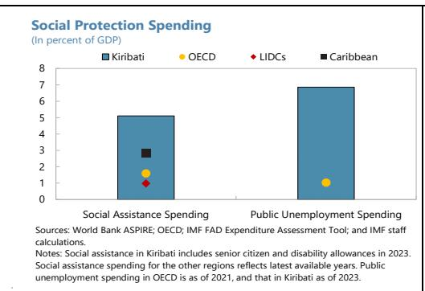

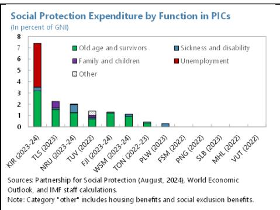

## C. Social Protection Benefits and Spending: 2019 vs 2023

9. This paper uses the two HIES waves to document how spending responses have changed between 2019/20 and 2023/24. Given the possibility of zero spending on certain categories (e.g. education, health, substance), Poisson Pseudo Maximum Likelihood (PPML) estimator is used, which allows consistent estimation of semi-elasticities in the presence of heteroskedasticity and zeros in the dependent variable. The specification $^{4}$ includes a rich set of fixed effects (village fixed effects; household head ethnicity, education, gender, age, marital status, and labor force status; indicators for home ownership, church donations, and car ownership). Additional controls include non-transfer income, household size, and the number of children and seniors, ensuring that estimates capture the marginal association between transfer receipts and spending behavior conditional on household characteristics and location.

## 10. Key findings $^{5}$ are as follows:

\- In 2019, social protection receipts were positively associated with spending on food, health, and business expenditure. Copra income, the largest benefit at the time, was associated with higher spending on food and business expenditure, but also with increased expenditure on alcohol/ tobacco, pointing to mixed effects on human development. Senior citizen allowance receipts were associated with higher household spending on food, health and business, alongside lower spending on alcohol/tobacco, suggesting that these transfers supported human development. Pension income was associated with higher spending on education and health, as well as kava.

\- In 2023, the link between social protection and human development spending is less clear. Unemployment benefits, now the largest, are associated with lower spending on education and high spending on substances, including alcohol, tobacco, and kava. Copra income remains positively associated with spending on food and business expenditure, and pension income is associated with higher spending on education and kava. Senior and disability allowances are no longer statistically significantly associated with a specific type of spending.

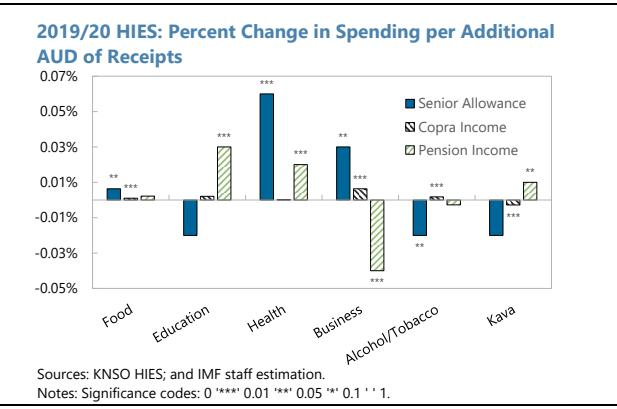

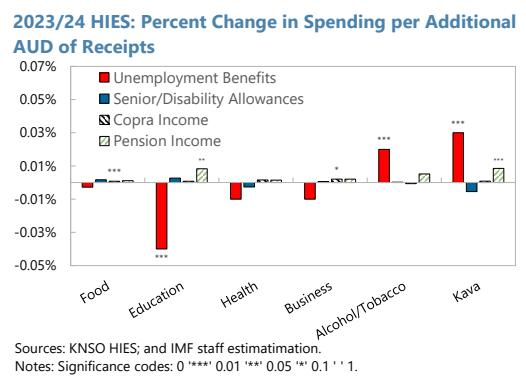

11. A causal effect of unemployment benefits on alcohol, tobacco, and kava spending is established using fuzzy regression discontinuity (Annex I). Instruments are constructed based on the number of household members who are eligible for unemployment benefits given their age (19-59). Estimation is implemented via a control-function (two-stage residual inclusion) approach with PPML in the second stage. Results (Tables 5-6) confirm a statistically significant causal effect of unemployment receipts on substance spending, with larger estimated semi-elasticities than in baseline regressions. For technical details see Annex I.

## D. What to Spend on, and How Much? Extensive and Intensive Margins

12. The impact of social protection receipts on the decision to spend or not is explored in a hurdle model. Around 11 percent of households did not report any substance spending. The shares of households not reporting spending on education, health (both largely government-provided), and business expenditure are 28 percent, 79 percent, and 51 percent, respectively. It is thus useful to separately consider the decision to spend or not (extensive margin) and the decision on how much to spend (intensive margin). An indicator variable for bottom quartile (by per capita consumption) households and its interaction with unemployment receipts are used to examine whether poorer households have different spending responses to unemployment receipts than richer households. $^{6}$

## 13. Bottom-quartile households are significantly less likely to spend on alcohol and

13. Bottom quartile households are significantly less likely to spend on alcohol and tobacco given unemployment receipts. $^{7}$ Overall, the extensive margin estimation yields similar patterns to the level regressions, where unemployment receipts are found to be associated with lower probability of spending on education (as well as health and business although the magnitudes are small) and higher probability of spending on substances. Importantly, the said association with alcohol/tobacco spending is much weaker among bottom-quartile households, with a statistically significant negative coefficient on the interaction term between unemployment receipts and the bottom-quartile dummy.

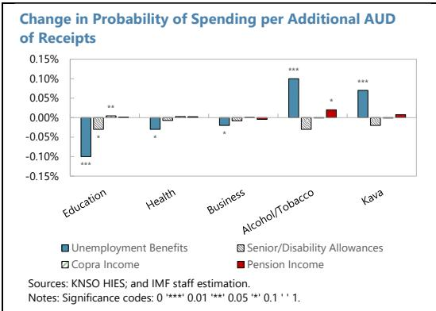

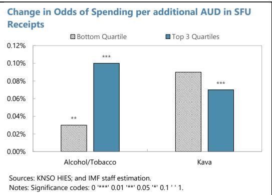

## 14. As a result, the overall average marginal effect of unemployment receipts on substance spending is smaller among bottom-quartile households. On average, an additional

AUD in SFU receipts is associated with 34 cents in alcohol/tobacco spending in the top three quartiles and 25 cents in the bottom quartile. $^{8}$ A similar result was found for kava, but the difference between households in the bottom quartile versus the top three quartiles is not statically significant. The causality relation between unemployment benefits and substance spending is also confirmed using the fuzzy regression discontinuity approach and are robust to the inclusion of additional controls and use of other functional forms for estimation (see Annex I and Tables 7-9).

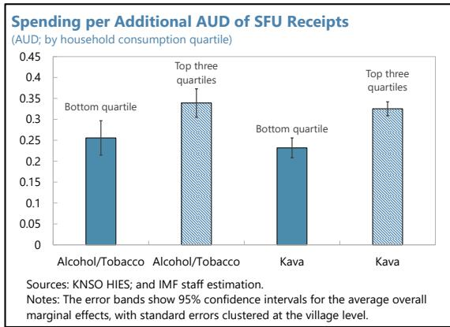

15. Finally, as a robustness check, spending across categories is compared for households eligible for unemployment benefits versus senior citizens' benefits. The charts below compare (potential) SFU recipient households and senior citizen allowance recipient households, based on the number of age-eligible household members for each benefit. Relative to an average non-recipient household, spending on kava and tobacco on average increases markedly faster than spending on food as the number of SFU-age-eligible people in the household increases. However, spending on substances does not increase substantially more than spending on food with the number of senior citizens in the household.

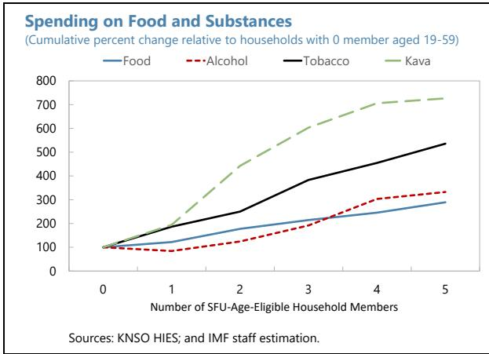

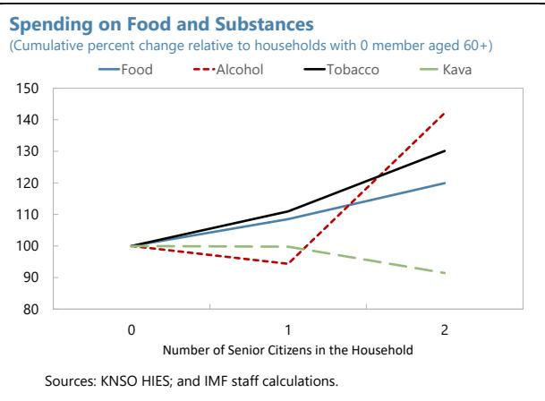

$$
\frac {\partial \mathrm{E} (\mathrm{y} _ {\mathrm{i}})}{\partial \text {SFUIncome} _ {\mathrm{i}}} = \frac {\partial \mathrm{P} (\mathrm{y} _ {\mathrm{i}} > 0)}{\partial \text {SFUIncome} _ {\mathrm{i}}} \times \exp \left((\widehat {\log y _ {1}})\right) + \mathrm{P} (\widehat {\mathrm{y} _ {1} > 0}) \times \frac {\partial \mathrm{E} (\mathrm{y} _ {\mathrm{i}} | \mathrm{y} _ {\mathrm{i}} > 0)}{\partial \text {SFUIncome} _ {\mathrm{i}}},
$$

## E. Conclusions and Policy Recommendations

16. Social protection benefits play an important role in pursuing inclusive growth in Kiribati and have contributed to a substantial, rapid reduction in poverty. Given limited access to education, difficulties in reaching formal labor markets, and lack of scale economies, especially on rural areas and on outer islands, social benefits ensure that most I-Kiribati have access to basic income. These benefits provide an opportunity to pursue education, start a business, and enter the formal labor force. In an environment where means testing is not feasible due to capacity constraints, the current approach has been effective in supporting the population during the extraordinary negative shocks of the COVID-19 pandemic in 2020 and the cost-of-living crisis in 2022 and 2023.

17. However, given the need to maintain fiscal sustainability while addressing the investment needs of climate-resilient infrastructure, it is important to enhance efficiency of social benefits while balancing their policy objectives. Some instruments—most notably unemployment benefits and the copra subsidy—operate at very large scale with limited targeting, leading to leakage to better-off households and potential distortions. Efficiency would be improved if desired outcomes (such as poverty reduction, better health, and education) could be achieved at lower fiscal cost. This implies assessing programs jointly along several criteria primarily focusing on coverage (whether beneficiaries and benefit shares are concentrated among poorer households), and efficiency (how much poverty and inequality are reduced per dollar spent), while ensuring that the overall social protection program is fiscally sustainable. IMF 2022 provides a detailed overview on how to design and institutionalize a spending review.

## 18. A reform agenda should include:

\- Increasing excises on tobacco and alcohol and introducing an excise on kava. These revenue measures would curb spending with negative public health externalities. They would help improve human development and should supplement expenditure measures.

\- Continuing copra subsidy reforms. The copra subsidy should be reformed to avoid distorting agricultural production. It could shift more towards low-income households by introducing caps or progressively replacing broad price support with targeted cash transfers.

\- Reviewing the adequacy and efficiency of social benefits. A review of social benefits could rationalize overlaps between programs (e.g. copra subsidy and unemployment benefits), reduce potential benefit leakage, and improve targeting.

19. Improving delivery and administration systems is central to both efficiency and equity. Reducing cash dependence, strengthening beneficiary identification and records, and modernizing payment channels would help lower administrative costs, improve timeliness and transparency, and enable agile support without expanding untargeted transfers. Overall, the design of social protection should avoid introducing market distortions, supporting spending with negative externalities, or providing higher benefits to richer households. While true targeting (e.g. means testing) has

prohibitively high administrative costs in Kiribati, targeting could be improved by tightening program eligibility, for example by capping the copra subsidy and preventing copra and unemployment benefits from accruing to the same households. IMF, 2019 provides further details on the trade-offs involved in different approaches to targeting. Overall, policies should ensure that scarce public resources are redirected toward high-impact services and well-targeted transfers that primarily benefit lower-income households.

## References

Doherty, L. and Sayegh, A. How to Design and Institutionalize Spending Reviews, IMF How to Notes, 2022, 004 (2022).

International Monetary Fund. Fiscal Affairs Dept. Kiribati: Agricultural Subsidies for Copra: Improving Efficiency and Equity and Balancing Trade-offs, High-Level Summary Technical Assistance Reports, 2024, 042 (2024).

International Monetary Fund. Asia and Pacific Dept. Kiribati: Selected Issues. IMF Staff Country Reports, 2024, 104 (2024).

International Monetary Fund. Asia and Pacific Dept. Kiribati: Selected Issues, IMF Staff Country Reports, 2025, 173 (2025).

Terza, J. V., Basu, A., & Rathouz, P. J. (2008). Two-stage residual inclusion estimation: Addressing endogeneity in health econometric modeling. Journal of Health Economics, 27(2), 531-543.

Santos Silva, J. M. C., & Tenreyro, S. (2006). The log of gravity. Review of Economics and Statistics, 88(4), 641–658.

Sargan, J. D. (1958). The estimation of economic relationships using instrumental variables. Econometrica, 26(3), 393–415.

World Bank. 2024. Beyond Copra. World Bank

Table 1. Kiribati: Poisson Pseudo Maximum Likelihood Estimates of Spending Semi-Elasticities in 2019/20 HIES

<table><tr><td>Dependent Var.:</td><td>Spending on Food</td><td>Spending on Education</td><td>Spending on Health</td><td>Spending on Business</td><td>Spending on Alcohol/Tobacco</td><td>Spending on Kava</td></tr><tr><td rowspan="2">Senior Allowance</td><td>6.35e-5**</td><td>-0.0002</td><td>0.0006***</td><td>0.0003**</td><td>-0.0002**</td><td>-0.0002</td></tr><tr><td>(3.03e-5)</td><td>(0.0003)</td><td>(0.0002)</td><td>(0.0001)</td><td>(0.0001)</td><td>(0.0001)</td></tr><tr><td rowspan="2">Copra Income</td><td>1.03e-5***</td><td>2.09e-5</td><td>2.37e-6</td><td>6.33e-5***</td><td>1.78e-5***</td><td>-2.8e-5***</td></tr><tr><td>(2.95e-6)</td><td>(2.3e-5)</td><td>(2.06e-5)</td><td>(1.25e-5)</td><td>(6.82e-6)</td><td>(1.04e-5)</td></tr><tr><td rowspan="2">Pension Income</td><td>2.21e-5</td><td>0.0003***</td><td>0.0002***</td><td>-0.0004***</td><td>-2.73e-5</td><td>0.0001**</td></tr><tr><td>(1.53e-5)</td><td>(7.62e-5)</td><td>(7.07e-5)</td><td>(5.32e-5)</td><td>(3.37e-5)</td><td>(5.05e-5)</td></tr><tr><td rowspan="2">Other Income</td><td>1.08e-5***</td><td>1.02e-5***</td><td>1.29e-5***</td><td>3.54e-5***</td><td>1.17e-6</td><td>1.31e-5***</td></tr><tr><td>(6.8e-7)</td><td>(3.28e-6)</td><td>(4.26e-6)</td><td>(2.24e-6)</td><td>(1.95e-6)</td><td>(2.27e-6)</td></tr><tr><td rowspan="2">Household Size</td><td>0.0713***</td><td>0.1342***</td><td>0.0127</td><td>-0.0497***</td><td>0.0927***</td><td>0.0643***</td></tr><tr><td>(0.0034)</td><td>(0.0214)</td><td>(0.0233)</td><td>(0.0159)</td><td>(0.0095)</td><td>(0.0099)</td></tr><tr><td rowspan="2">Number of Children</td><td>0.0035</td><td>0.0816**</td><td>-0.0412</td><td>-0.0465*</td><td>0.0134</td><td>-0.0309</td></tr><tr><td>(0.0055)</td><td>(0.0370)</td><td>(0.0450)</td><td>(0.0257)</td><td>(0.0158)</td><td>(0.0202)</td></tr><tr><td rowspan="2">Number of Seniors</td><td>0.0467**</td><td>0.1001</td><td>-0.6857***</td><td>0.1447</td><td>0.0348</td><td>0.0055</td></tr><tr><td>(0.0189)</td><td>(0.1929)</td><td>(0.1765)</td><td>(0.1215)</td><td>(0.0552)</td><td>(0.0715)</td></tr><tr><td>Fixed Effects:</td><td></td><td></td><td></td><td></td><td></td><td></td></tr><tr><td>Village</td><td>Yes</td><td>Yes</td><td>Yes</td><td>Yes</td><td>Yes</td><td>Yes</td></tr><tr><td>Ethnicity of Household Head</td><td>Yes</td><td>Yes</td><td>Yes</td><td>Yes</td><td>Yes</td><td>Yes</td></tr><tr><td>Education of Household Head</td><td>Yes</td><td>Yes</td><td>Yes</td><td>Yes</td><td>Yes</td><td>Yes</td></tr><tr><td>Sex of Household Head</td><td>Yes</td><td>Yes</td><td>Yes</td><td>Yes</td><td>Yes</td><td>Yes</td></tr><tr><td>Age Group (5-year) of Household Head</td><td>Yes</td><td>Yes</td><td>Yes</td><td>Yes</td><td>Yes</td><td>Yes</td></tr><tr><td>Marital Status of Household Head</td><td>Yes</td><td>Yes</td><td>Yes</td><td>Yes</td><td>Yes</td><td>Yes</td></tr><tr><td>Labor Force Status of Household Head</td><td>Yes</td><td>Yes</td><td>Yes</td><td>Yes</td><td>Yes</td><td>Yes</td></tr><tr><td>Home Ownership Status</td><td>Yes</td><td>Yes</td><td>Yes</td><td>Yes</td><td>Yes</td><td>Yes</td></tr><tr><td>Church Donation Indicator</td><td>Yes</td><td>Yes</td><td>Yes</td><td>Yes</td><td>Yes</td><td>Yes</td></tr><tr><td>Car Ownership x Number of Cars</td><td>Yes</td><td>Yes</td><td>Yes</td><td>Yes</td><td>Yes</td><td>Yes</td></tr><tr><td>S.E. type</td><td>Hetero.-rob.</td><td>Heter.-rob.</td><td>Heterosk.-rob.</td><td>Heter.-rob.</td><td>Heter.-rob.</td><td>Hetero.-rob.</td></tr><tr><td>Observations</td><td>3,432</td><td>2,865</td><td>1,969</td><td>3,288</td><td>3,432</td><td>3,423</td></tr><tr><td>Squared Cor.</td><td>0.53587</td><td>0.37799</td><td>0.32759</td><td>0.44273</td><td>0.28715</td><td>0.28014</td></tr><tr><td>Pseudo R2</td><td>0.54441</td><td>0.50003</td><td>0.31230</td><td>0.45884</td><td>0.33681</td><td>0.29082</td></tr></table>

Table 2. Kiribati: Poisson Pseudo Maximum Likelihood Estimates of Spending Semi-  
Elasticities in 2023/24 HIES

<table><tr><td>Dependent Var.:</td><td>Spending on Food</td><td>Spending on Education</td><td>Spending on Health</td><td>Spending on Business</td><td>Spending on Alcohol/Tobacco</td><td>Spending on Kava</td></tr><tr><td>Unemployment Benefits</td><td>-2.77e-5(2.08e-5)</td><td>-0.0004***(7.3e-5)</td><td>-0.0001(0.0001)</td><td>-0.0001(0.0001)</td><td>0.0002***(5.59e-5)</td><td>0.0003***(5.44e-5)</td></tr><tr><td>Senior/Disability Allowances</td><td>1.7e-5(2.5e-5)</td><td>2.67e-5(8.09e-5)</td><td>-2.66e-5(0.0001)</td><td>6.61e-6(0.0002)</td><td>2.18e-6(4.79e-5)</td><td>-5.46e-5(5.55e-5)</td></tr><tr><td>Copra Income</td><td>8.03e-6***(2.32e-6)</td><td>8.25e-6(1.05e-5)</td><td>1.59e-5(1.75e-5)</td><td>2.1e-5*(1.09e-5)</td><td>-6.24e-6(5.5e-6)</td><td>8.36e-6(5.67e-6)</td></tr><tr><td>Pension Income</td><td>1.12e-5(1.45e-5)</td><td>8.34e-5**(3.77e-5)</td><td>1.45e-5(5.63e-5)</td><td>2.06e-5(8.8e-5)</td><td>5.2e-5(3.41e-5)</td><td>8.54e-5***(2.92e-5)</td></tr><tr><td>Other Income</td><td>5.66e-6***(6.41e-7)</td><td>7.32e-7(2.32e-6)</td><td>1.03e-5***(2.79e-6)</td><td>2.56e-5***(2.8e-6)</td><td>7.36e-6***(1.7e-6)</td><td>7.55e-6***(1.48e-6)</td></tr><tr><td>Household Size</td><td>0.0793***(0.0100)</td><td>0.3274***(0.0354)</td><td>0.1023**(0.0514)</td><td>-0.0760(0.0625)</td><td>0.0877***(0.0267)</td><td>0.0928***(0.0284)</td></tr><tr><td>Number of Children</td><td>-0.0045(0.0116)</td><td>-0.1598***(0.0443)</td><td>-0.0123(0.0621)</td><td>0.0796(0.0781)</td><td>-0.0899***(0.0308)</td><td>-0.1018***(0.0344)</td></tr><tr><td>Number of Seniors</td><td>-0.0218(0.0686)</td><td>-0.4038**(0.1889)</td><td>0.1999(0.3916)</td><td>-0.1026(0.5328)</td><td>-0.0364(0.1311)</td><td>0.0908(0.1540)</td></tr><tr><td>Fixed Effects:</td><td></td><td></td><td></td><td></td><td></td><td></td></tr><tr><td>Village</td><td>Yes</td><td>Yes</td><td>Yes</td><td>Yes</td><td>Yes</td><td>Yes</td></tr><tr><td>Ethnicity of Household Head</td><td>Yes</td><td>Yes</td><td>Yes</td><td>Yes</td><td>Yes</td><td>Yes</td></tr><tr><td>Education of Household Head</td><td>Yes</td><td>Yes</td><td>Yes</td><td>Yes</td><td>Yes</td><td>Yes</td></tr><tr><td>Sex of Household Head</td><td>Yes</td><td>Yes</td><td>Yes</td><td>Yes</td><td>Yes</td><td>Yes</td></tr><tr><td>Age Group (5-year) of Household Head</td><td>Yes</td><td>Yes</td><td>Yes</td><td>Yes</td><td>Yes</td><td>Yes</td></tr><tr><td>Marital Status of Household Head</td><td>Yes</td><td>Yes</td><td>Yes</td><td>Yes</td><td>Yes</td><td>Yes</td></tr><tr><td>Labor Force Status of Household Head</td><td>Yes</td><td>Yes</td><td>Yes</td><td>Yes</td><td>Yes</td><td>Yes</td></tr><tr><td>Home Ownership Status</td><td>Yes</td><td>Yes</td><td>Yes</td><td>Yes</td><td>Yes</td><td>Yes</td></tr><tr><td>Church Donation Indicator</td><td>Yes</td><td>Yes</td><td>Yes</td><td>Yes</td><td>Yes</td><td>Yes</td></tr><tr><td>Car Ownership x Number of Cars</td><td>Yes</td><td>Yes</td><td>Yes</td><td>Yes</td><td>Yes</td><td>Yes</td></tr><tr><td>S.E. type</td><td>Hetero.-rob.</td><td>Heter.-rob.</td><td>Heterosk.-rob.</td><td>Heter.-rob.</td><td>Heter.-rob.</td><td>Hetero.-rob.</td></tr><tr><td>Observations</td><td>1,679</td><td>1,676</td><td>1,290</td><td>1,646</td><td>1,679</td><td>1,668</td></tr><tr><td>Squared Cor.</td><td>0.51670</td><td>0.39183</td><td>0.29135</td><td>0.44920</td><td>0.31078</td><td>0.25244</td></tr><tr><td>Pseudo R2</td><td>0.54426</td><td>0.47665</td><td>0.33806</td><td>0.50624</td><td>0.35479</td><td>0.25187</td></tr></table>

<table><tr><td colspan="6">Table 3. Kiribati: Logit Estimates of Spending Odds Semi-Elasticities in 2023/24 HIES</td></tr><tr><td>Dependent Var.:</td><td>Education spending&gt;0</td><td>Health spending&gt;0</td><td>Business spending&gt;0</td><td>Alcohol/tabacco spending&gt;0</td><td>Kava spending&gt;0</td></tr><tr><td>Unemployment benefits</td><td>-0.0010***(0.0002)</td><td>-0.0003*(0.0001)</td><td>-0.0002*(0.0001)</td><td>0.0010***(0.0002)</td><td>0.0007***(0.0002)</td></tr><tr><td>Senior/disability allowances</td><td>-0.0003*(0.0002)</td><td>-7.15e-5(0.0002)</td><td>-7.9e-5(0.0001)</td><td>-0.0003(0.0002)</td><td>-0.0002(0.0001)</td></tr><tr><td>Copra income</td><td>4.56e-5**(1.82e-5)</td><td>2.93e-5(2.07e-5)</td><td>1.08e-6(1.37e-5)</td><td>-8.78e-6(1.77e-5)</td><td>-1.01e-5(1.48e-5)</td></tr><tr><td>Pension income</td><td>1.32e-5(8.43e-5)</td><td>2.54e-5(7.83e-5)</td><td>-4.46e-5(7.66e-5)</td><td>0.0002*(0.0001)</td><td>7.69e-5(6.77e-5)</td></tr><tr><td>Other income</td><td>-4.77e-7(5.48e-6)</td><td>1.17e-5***(4.08e-6)</td><td>1.81e-5***(4.56e-6)</td><td>6.92e-7(5.57e-6)</td><td>1.56e-6(4.23e-6)</td></tr><tr><td>Household size</td><td>0.8914***(0.1186)</td><td>0.2573***(0.0750)</td><td>0.1379**(0.0644)</td><td>0.3818***(0.0953)</td><td>0.2636***(0.0703)</td></tr><tr><td>Number of children</td><td>0.3968***(0.1480)</td><td>-0.1882**(0.0944)</td><td>-0.1005(0.0771)</td><td>-0.3448***(0.1159)</td><td>-0.2738***(0.0896)</td></tr><tr><td>Number of seniors</td><td>-0.2548(0.5276)</td><td>0.2639(0.4619)</td><td>0.1042(0.3321)</td><td>0.9504*(0.5592)</td><td>0.5562(0.3975)</td></tr><tr><td>Unemployment benefits × Bottom quartile</td><td>-0.0005(0.0003)</td><td>-0.0002(0.0002)</td><td>0.0002(0.0002)</td><td>-0.0007**(0.0003)</td><td>0.0002(0.0002)</td></tr><tr><td>Fixed-Effects:</td><td></td><td></td><td></td><td></td><td></td></tr><tr><td>Village</td><td>Yes</td><td>Yes</td><td>Yes</td><td>Yes</td><td>Yes</td></tr><tr><td>Ethnicity of Household Head</td><td>Yes</td><td>Yes</td><td>Yes</td><td>Yes</td><td>Yes</td></tr><tr><td>Education of Household Head</td><td>Yes</td><td>Yes</td><td>Yes</td><td>Yes</td><td>Yes</td></tr><tr><td>Sex of Household Head</td><td>Yes</td><td>Yes</td><td>Yes</td><td>Yes</td><td>Yes</td></tr><tr><td>Age Group (5-year) of Household Head</td><td>Yes</td><td>Yes</td><td>Yes</td><td>Yes</td><td>Yes</td></tr><tr><td>Marital Status of Household Head</td><td>Yes</td><td>Yes</td><td>Yes</td><td>Yes</td><td>Yes</td></tr><tr><td>Labor Force Status of Household Head</td><td>Yes</td><td>Yes</td><td>Yes</td><td>Yes</td><td>Yes</td></tr><tr><td>Home Ownership Status</td><td>Yes</td><td>Yes</td><td>Yes</td><td>Yes</td><td>Yes</td></tr><tr><td>Bottom-quartile indicator</td><td>Yes</td><td>Yes</td><td>Yes</td><td>Yes</td><td>Yes</td></tr><tr><td>Church Donation Indicator</td><td>Yes</td><td>Yes</td><td>Yes</td><td>Yes</td><td>Yes</td></tr><tr><td>Car Ownership x Number of Cars</td><td>Yes</td><td>Yes</td><td>Yes</td><td>Yes</td><td>Yes</td></tr><tr><td>S.E. type</td><td>Hete.-rob.</td><td>Heter.-rob.</td><td>Heter.-rob.</td><td>Hete.-rob.</td><td>Hete.-rob.</td></tr><tr><td>Observations</td><td>1,628</td><td>1,287</td><td>1,591</td><td>1,542</td><td>1,619</td></tr><tr><td>Squared Cor.</td><td>0.48784</td><td>0.23433</td><td>0.22829</td><td>0.19464</td><td>0.22857</td></tr><tr><td>Pseudo R2</td><td>0.42690</td><td>0.20307</td><td>0.18266</td><td>0.18780</td><td>0.18557</td></tr><tr><td colspan="6">Table 4. Kiribati: Estimates of Spending Semi-Elasticities Conditional on Spending&gt;0 in 2023/24 HIES</td></tr><tr><td>Dependent Var.:</td><td>Log education spending</td><td>Log health spending</td><td>Log business spending</td><td>Log alcohol/tobacco spending</td><td>Log kava spending</td></tr><tr><td>Unemployment benefits</td><td>-0.0004***(6.66e-5)</td><td>-6.88e-6(0.0001)</td><td>8.8e-6(0.0001)</td><td>0.0002***(4.89e-5)</td><td>8.03e-5*(4.65e-5)</td></tr><tr><td>Senior/disability allowances</td><td>1.53e-5(5.93e-5)</td><td>1.53e-5(9.87e-5)</td><td>-5.42e-5(0.0001)</td><td>-2.41e-5(4.44e-5)</td><td>1.17e-5(4.99e-5)</td></tr><tr><td>Copra income</td><td>4.62e-7(6.13e-6)</td><td>-4.75e-6(2.35e-5)</td><td>4.15e-5***(1.36e-5)</td><td>-3.28e-6(4.86e-6)</td><td>1.07e-5**(5.15e-6)</td></tr><tr><td>Pension income</td><td>2.01e-5(3.71e-5)</td><td>-2.6e-5(4.02e-5)</td><td>-1.4e-5(5.58e-5)</td><td>4.21e-5(3.12e-5)</td><td>6.26e-5**(2.56e-5)</td></tr><tr><td>Other income</td><td>-8.27e-7(2.04e-6)</td><td>3.04e-6(2.77e-6)</td><td>2.05e-5***(3.27e-6)</td><td>4.66e-6***(1.57e-6)</td><td>4.41e-6***(1.66e-6)</td></tr><tr><td>Household size</td><td>0.2887***(0.0330)</td><td>0.0626(0.0494)</td><td>-0.0731(0.0510)</td><td>0.1452***(0.0258)</td><td>0.1048***(0.0264)</td></tr><tr><td>Number of children</td><td>-0.1688***(0.0395)</td><td>-0.0157(0.0526)</td><td>0.0229(0.0605)</td><td>-0.1616***(0.0300)</td><td>-0.1134***(0.0314)</td></tr><tr><td>Number of seniors</td><td>-0.3117**(0.1584)</td><td>0.0241(0.2574)</td><td>0.3725(0.3117)</td><td>0.0080(0.1208)</td><td>-0.0353(0.1372)</td></tr><tr><td>Unemployment benefits × Bottom quartile</td><td>4.42e-5(9.05e-5)</td><td>-0.0002(0.0002)</td><td>-8.78e-5(0.0002)</td><td>3.03e-5(6.72e-5)</td><td>-1.63e-5(7.29e-5)</td></tr><tr><td>Fixed-Effects:</td><td></td><td></td><td></td><td></td><td></td></tr><tr><td>Village</td><td>Yes</td><td>Yes</td><td>Yes</td><td>Yes</td><td>Yes</td></tr><tr><td>Ethnicity of Household Head</td><td>Yes</td><td>Yes</td><td>Yes</td><td>Yes</td><td>Yes</td></tr><tr><td>Education of Household Head</td><td>Yes</td><td>Yes</td><td>Yes</td><td>Yes</td><td>Yes</td></tr><tr><td>Sex of Household Head</td><td>Yes</td><td>Yes</td><td>Yes</td><td>Yes</td><td>Yes</td></tr><tr><td>Age Group (5-year) of Household Head</td><td>Yes</td><td>Yes</td><td>Yes</td><td>Yes</td><td>Yes</td></tr><tr><td>Marital Status of Household Head</td><td>Yes</td><td>Yes</td><td>Yes</td><td>Yes</td><td>Yes</td></tr><tr><td>Labor Force Status of Household Head</td><td>Yes</td><td>Yes</td><td>Yes</td><td>Yes</td><td>Yes</td></tr><tr><td>Home Ownership Status</td><td>Yes</td><td>Yes</td><td>Yes</td><td>Yes</td><td>Yes</td></tr><tr><td>Bottom-quartile indicator</td><td>Yes</td><td>Yes</td><td>Yes</td><td>Yes</td><td>Yes</td></tr><tr><td>Church Donation Indicator</td><td>Yes</td><td>Yes</td><td>Yes</td><td>Yes</td><td>Yes</td></tr><tr><td>Car Ownership x Number of Cars</td><td>Yes</td><td>Yes</td><td>Yes</td><td>Yes</td><td>Yes</td></tr><tr><td>S.E. type</td><td>Hete.-rob.</td><td>Het.-rob.</td><td>Heter.-rob.</td><td>Heter.-rob.</td><td>Heter.-rob.</td></tr><tr><td>Observations</td><td>1,204</td><td>365</td><td>877</td><td>1,379</td><td>1,110</td></tr><tr><td>R2</td><td>0.40879</td><td>0.44265</td><td>0.35613</td><td>0.38343</td><td>0.30655</td></tr><tr><td>Within R2</td><td>0.10972</td><td>0.05085</td><td>0.09911</td><td>0.15454</td><td>0.09718</td></tr></table>

Table 5. Kiribati: PPML with Control Function Estimates of Spending Semi-Elasticities in 2023/24 HIES

<table><tr><td>Dependent Var.:</td><td>Spending on Food</td><td>Spending on Education</td><td>Spending on Health</td><td>Spending on Business</td><td>Spending on Alcohol/Tobacco</td><td>Spending on Kava</td></tr><tr><td>Unemployment Benefits</td><td>0.0002**(8.47e-5)</td><td>-0.0003(0.0005)</td><td>-8.9e-5(0.0007)</td><td>-0.0007(0.0007)</td><td>0.0010***(0.0002)</td><td>0.0013***(0.0002)</td></tr><tr><td>First-Stage Residual</td><td>-0.0002***(8.53e-5)</td><td>-9.17e-5(0.0004)</td><td>-4.45e-5(0.0007)</td><td>0.0006(0.0007)</td><td>-0.0008***(0.0002)</td><td>-0.0011***(0.0002)</td></tr><tr><td>Senior/Disability Allowances</td><td>7.69e-6(2.71e-5)</td><td>2.21e-5(0.0001)</td><td>-2.88e-5(0.0001)</td><td>2.75e-5(0.0002)</td><td>-2.7e-5(4.91e-5)</td><td>-9.48e-5(6.1e-5)</td></tr><tr><td>Copra Income</td><td>6.26e-6***(2.31e-6)</td><td>7.5e-6(1.13e-5)</td><td>1.56e-5(2.22e-5)</td><td>2.49e-5*(1.42e-5)</td><td>-1.28e-5**(6.46e-6)</td><td>1.23e-7(6.09e-6)</td></tr><tr><td>Pension Income</td><td>2.06e-5(1.88e-5)</td><td>8.75e-5*(5.25e-5)</td><td>1.67e-5(8.27e-5)</td><td>-2.91e-6(0.0001)</td><td>8.7e-5*(4.52e-5)</td><td>0.0001***(3.98e-5)</td></tr><tr><td>Other Income</td><td>6.09e-6***(9.64e-7)</td><td>9.24e-7(2.62e-6)</td><td>1.04e-5***(3.84e-6)</td><td>2.48e-5***(3.89e-6)</td><td>9.16e-6***(1.51e-6)</td><td>9.7e-6***(1.73e-6)</td></tr><tr><td>Household Size</td><td>0.0184(0.0272)</td><td>0.3030*(0.1557)</td><td>0.0903(0.1952)</td><td>0.0798(0.2181)</td><td>-0.1325**(0.0603)</td><td>-0.1989***(0.0640)</td></tr><tr><td>Number of Children</td><td>0.0378*(0.0217)</td><td>-0.1434(0.1293)</td><td>-0.0041(0.1356)</td><td>-0.0277(0.1672)</td><td>0.0636(0.0447)</td><td>0.1026*(0.0595)</td></tr><tr><td>Number of Seniors</td><td>0.0569(0.0824)</td><td>-0.3701(0.2310)</td><td>0.2166(0.4694)</td><td>-0.2893(0.6464)</td><td>0.2391(0.1651)</td><td>0.4608***(0.1752)</td></tr><tr><td>Fixed Effects:</td><td></td><td></td><td></td><td></td><td></td><td></td></tr><tr><td>Village</td><td>Yes</td><td>Yes</td><td>Yes</td><td>Yes</td><td>Yes</td><td>Yes</td></tr><tr><td>Ethnicity of Household Head</td><td>Yes</td><td>Yes</td><td>Yes</td><td>Yes</td><td>Yes</td><td>Yes</td></tr><tr><td>Education of Household Head</td><td>Yes</td><td>Yes</td><td>Yes</td><td>Yes</td><td>Yes</td><td>Yes</td></tr><tr><td>Sex of Household Head</td><td>Yes</td><td>Yes</td><td>Yes</td><td>Yes</td><td>Yes</td><td>Yes</td></tr><tr><td>Age Group (5-year) of Household Head</td><td>Yes</td><td>Yes</td><td>Yes</td><td>Yes</td><td>Yes</td><td>Yes</td></tr><tr><td>Marital Status of Household Head</td><td>Yes</td><td>Yes</td><td>Yes</td><td>Yes</td><td>Yes</td><td>Yes</td></tr><tr><td>Labor Force Status of Household Head</td><td>Yes</td><td>Yes</td><td>Yes</td><td>Yes</td><td>Yes</td><td>Yes</td></tr><tr><td>Home Ownership Status</td><td>Yes</td><td>Yes</td><td>Yes</td><td>Yes</td><td>Yes</td><td>Yes</td></tr><tr><td>Church Donation Indicator</td><td>Yes</td><td>Yes</td><td>Yes</td><td>Yes</td><td>Yes</td><td>Yes</td></tr><tr><td>Car Ownership x Number of Cars</td><td>Yes</td><td>Yes</td><td>Yes</td><td>Yes</td><td>Yes</td><td>Yes</td></tr><tr><td>Observations</td><td>1,679</td><td>1,676</td><td>1,290</td><td>1,646</td><td>1,679</td><td>1,668</td></tr><tr><td>Squared Cor.</td><td>0.51967</td><td>0.39239</td><td>0.29159</td><td>0.45087</td><td>0.32002</td><td>0.27559</td></tr><tr><td>Pseudo R2</td><td>0.54645</td><td>0.47671</td><td>0.33807</td><td>0.50721</td><td>0.36359</td><td>0.26530</td></tr></table>

Table 6. Kiribati: Diagnostic Statistics for the PPML with Control Function Approach (2023/24 HIES)

<table><tr><td>Statistic</td><td>Food</td><td>Education</td><td>Health</td><td>Business</td><td>Alcohol/Tobacco</td><td>Kava</td></tr><tr><td>J statistic</td><td>0.424</td><td>0.250</td><td>4.568</td><td>1.289</td><td>3.537</td><td>1.117</td></tr><tr><td>J test df</td><td>2</td><td>2</td><td>2</td><td>2</td><td>2</td><td>2</td></tr><tr><td>J test p-value</td><td>0.809</td><td>0.883</td><td>0.102</td><td>0.525</td><td>0.171</td><td>0.572</td></tr><tr><td>First-stage joint Wald chi2</td><td>63.740</td><td>63.740</td><td>63.740</td><td>63.740</td><td>63.740</td><td>63.740</td></tr><tr><td>First-stage joint test df</td><td>3</td><td>3</td><td>3</td><td>3</td><td>3</td><td>3</td></tr><tr><td>First-stage joint test p-value</td><td>0.000</td><td>0.000</td><td>0.000</td><td>0.000</td><td>0.000</td><td>0.000</td></tr></table>

<table><tr><td>Dependent Var.:</td><td>Education spending&gt;0</td><td>Health spending&gt;0</td><td>Business spending&gt;0</td><td>Alcohol/tabacco spending&gt;0</td><td>Kava spending&gt;0</td></tr><tr><td>Unemployment benefits</td><td>-0.0026(0.0025)</td><td>-0.0008(0.0031)</td><td>-0.0007(0.0020)</td><td>0.0041*(0.0023)</td><td>0.0038*(0.0023)</td></tr><tr><td>Unemployment benefits × Bottom quartile</td><td>0.0003(0.0008)</td><td>0.0005(0.0010)</td><td>0.0004(0.0007)</td><td>-0.0016**(0.0008)</td><td>-0.0004(0.0008)</td></tr><tr><td>First stage residual of unemployment benefit</td><td>0.0016(0.0025)</td><td>0.0005(0.0031)</td><td>0.0004(0.0020)</td><td>-0.0031(0.0024)</td><td>-0.0031(0.0023)</td></tr><tr><td>First stage residual of unemployment benefit x bottom quartile</td><td>-0.0011(0.0010)</td><td>-0.0010(0.0011)</td><td>-0.0003(0.0008)</td><td>0.0010(0.0009)</td><td>0.0004(0.0008)</td></tr><tr><td>Senior/disability allowances</td><td>-0.0003(0.0003)</td><td>-4.41e-5(0.0003)</td><td>-5.72e-5(0.0002)</td><td>-0.0004(0.0003)</td><td>-0.0003*(0.0002)</td></tr><tr><td>Copra income</td><td>5.59e-5*(3.3e-5)</td><td>3.08e-5(3.61e-5)</td><td>3.92e-6(2.33e-5)</td><td>-2.98e-5(2.53e-5)</td><td>-3.35e-5(2.4e-5)</td></tr><tr><td>Pension income</td><td>-4.39e-5(0.0001)</td><td>1.06e-5(0.0002)</td><td>-6.19e-5(0.0001)</td><td>0.0003(0.0021)</td><td>0.0002**(0.0001)</td></tr><tr><td>Other income</td><td>-2.77e-6(7.51e-6)</td><td>1.12e-5(7.55e-6)</td><td>1.75e-5***(6.16e-6)</td><td>5.15e-6(9.16e-6)</td><td>6.56e-6(6.21e-6)</td></tr><tr><td>Household size</td><td>1.295*(0.7388)</td><td>0.3607(0.8811)</td><td>0.2517(0.5517)</td><td>-0.4800(0.6840)</td><td>-0.6338(0.6537)</td></tr><tr><td>Number of children</td><td>0.1252(0.5399)</td><td>-0.2559(0.6506)</td><td>-0.1786(0.4035)</td><td>0.2598(0.5175)</td><td>0.3624(0.4824)</td></tr><tr><td>Number of seniors</td><td>-0.7653(1.300)</td><td>0.1204(1.281)</td><td>-0.0496(0.7733)</td><td>2.089*(1.172)</td><td>1.743*(0.9061)</td></tr><tr><td>Fixed-Effects:</td><td>----</td><td>----</td><td>----</td><td>----</td><td>----</td></tr><tr><td>Village</td><td>Yes</td><td>Yes</td><td>Yes</td><td>Yes</td><td>Yes</td></tr><tr><td>Ethnicity of Household Head</td><td>Yes</td><td>Yes</td><td>Yes</td><td>Yes</td><td>Yes</td></tr><tr><td>Education of Household Head</td><td>Yes</td><td>Yes</td><td>Yes</td><td>Yes</td><td>Yes</td></tr><tr><td>Sex of Household Head</td><td>Yes</td><td>Yes</td><td>Yes</td><td>Yes</td><td>Yes</td></tr><tr><td>Age Group (5-year) of Household Head</td><td>Yes</td><td>Yes</td><td>Yes</td><td>Yes</td><td>Yes</td></tr><tr><td>Marital Status of Household Head</td><td>Yes</td><td>Yes</td><td>Yes</td><td>Yes</td><td>Yes</td></tr><tr><td>Labor Force Status of Household Head</td><td>Yes</td><td>Yes</td><td>Yes</td><td>Yes</td><td>Yes</td></tr><tr><td>Home Ownership Status</td><td>Yes</td><td>Yes</td><td>Yes</td><td>Yes</td><td>Yes</td></tr><tr><td>Bottom-quartile indicator</td><td>Yes</td><td>Yes</td><td>Yes</td><td>Yes</td><td>Yes</td></tr><tr><td>Church Donation Indicator</td><td>Yes</td><td>Yes</td><td>Yes</td><td>Yes</td><td>Yes</td></tr><tr><td>Car Ownership x Number of Cars</td><td>Yes</td><td>Yes</td><td>Yes</td><td>Yes</td><td>Yes</td></tr><tr><td>Observations</td><td>1,628</td><td>1,287</td><td>1,591</td><td>1,542</td><td>1,619</td></tr><tr><td>Squared Cor.</td><td>0.48988</td><td>0.23600</td><td>0.22847</td><td>0.19670</td><td>0.23077</td></tr><tr><td>Pseudo R2</td><td>0.42794</td><td>0.20479</td><td>0.18276</td><td>0.18987</td><td>0.18808</td></tr></table>

Table 8. Kiribati: Control Function Estimates of Spending Semi-Elasticities Conditional on Spending>0 in 2023/24 HIES

<table><tr><td colspan="6">Spending&gt;0 in 2023/24 HIES</td></tr><tr><td>Dependent Var.:</td><td>Log education spending</td><td>Log health spending</td><td>Log business spending</td><td>Log alcohol/tobacco spending</td><td>Log kava spending</td></tr><tr><td>Unemployment benefits</td><td>-0.0022(0.0014)</td><td>-0.0040(0.0024)</td><td>-0.0013(0.0021)</td><td>0.0006(0.0011)</td><td>0.0004(0.0011)</td></tr><tr><td>Unemployment benefits × Bottom quartile</td><td>0.0003(0.0005)</td><td>0.0007(0.0016)</td><td>0.0001(0.0007)</td><td>-0.0001(0.0004)</td><td>-0.0001(0.0004)</td></tr><tr><td>First stage residual of unemployment benefit</td><td>0.0018(0.0014)</td><td>0.0039(0.0024)</td><td>0.0013(0.0021)</td><td>-0.0004(0.0011)</td><td>-0.0003(0.0011)</td></tr><tr><td>First stage residual of unemployment benefit x bottom quartile</td><td>-0.0001(0.0005)</td><td>-0.0008(0.0017)</td><td>-0.0002(0.0007)</td><td>0.0002(0.0004)</td><td>8.66e-5(0.0004)</td></tr><tr><td>Senior/disability allowances</td><td>0.0001(0.0001)</td><td>0.0002(0.0002)</td><td>-4.72e-6(0.0001)</td><td>-4e-5(7.18e-5)</td><td>-2.39e-7(6.75e-5)</td></tr><tr><td>Copra income</td><td>1.33e-5(1.42e-5)</td><td>2.31e-5(3.68e-5)</td><td>5.05e-5**(2.02e-5)</td><td>-5.44e-6(9.54e-6)</td><td>8.92e-6(1.01e-5)</td></tr><tr><td>Pension income</td><td>-5.44e-5(7.63e-5)</td><td>-0.0002(0.0001)</td><td>-6.52e-5(9.54e-5)</td><td>5.62e-5(5.86e-5)</td><td>7.36e-5(5.34e-5)</td></tr><tr><td>Other income</td><td>-3.81e-6(3.28e-6)</td><td>-3.95e-6(6e-6)</td><td>1.85e-5***(4.99e-6)</td><td>5.16e-6**(2.25e-6)</td><td>4.82e-6*(2.48e-6)</td></tr><tr><td>Household size</td><td>0.7951**(0.3953)</td><td>1.172*(0.6852)</td><td>0.2924(0.5663)</td><td>0.0539(0.3106)</td><td>0.0303(0.3063)</td></tr><tr><td>Number of children</td><td>-0.5258*(0.2899)</td><td>-0.7936(0.4810)</td><td>-0.2354(0.3976)</td><td>-0.0983(0.2225)</td><td>-0.0614(0.2146)</td></tr><tr><td>Number of seniors</td><td>-0.9969**(0.4940)</td><td>-1.492(0.9310)</td><td>-0.0819(0.7195)</td><td>0.1269(0.4313)</td><td>0.0604(0.4148)</td></tr><tr><td>Fixed-Effects:</td><td></td><td></td><td></td><td></td><td></td></tr><tr><td>Village</td><td>Yes</td><td>Yes</td><td>Yes</td><td>Yes</td><td>Yes</td></tr><tr><td>Ethnicity of Household Head</td><td>Yes</td><td>Yes</td><td>Yes</td><td>Yes</td><td>Yes</td></tr><tr><td>Education of Household Head</td><td>Yes</td><td>Yes</td><td>Yes</td><td>Yes</td><td>Yes</td></tr><tr><td>Sex of Household Head</td><td>Yes</td><td>Yes</td><td>Yes</td><td>Yes</td><td>Yes</td></tr><tr><td>Age Group (5-year) of Household Head</td><td>Yes</td><td>Yes</td><td>Yes</td><td>Yes</td><td>Yes</td></tr><tr><td>Marital Status of Household Head</td><td>Yes</td><td>Yes</td><td>Yes</td><td>Yes</td><td>Yes</td></tr><tr><td>Labor Force Status of Household Head</td><td>Yes</td><td>Yes</td><td>Yes</td><td>Yes</td><td>Yes</td></tr><tr><td>Home Ownership Status</td><td>Yes</td><td>Yes</td><td>Yes</td><td>Yes</td><td>Yes</td></tr><tr><td>Bottom-quartile indicator</td><td>Yes</td><td>Yes</td><td>Yes</td><td>Yes</td><td>Yes</td></tr><tr><td>Church Donation Indicator</td><td>Yes</td><td>Yes</td><td>Yes</td><td>Yes</td><td>Yes</td></tr><tr><td>Car Ownership x Number of Cars</td><td>Yes</td><td>Yes</td><td>Yes</td><td>Yes</td><td>Yes</td></tr><tr><td>Observations</td><td>1,204</td><td>365</td><td>877</td><td>1,379</td><td>1,110</td></tr><tr><td>Squared Cor.</td><td>0.41342</td><td>0.45694</td><td>0.35721</td><td>0.38372</td><td>0.30660</td></tr><tr><td>Pseudo R2</td><td>0.11668</td><td>0.07519</td><td>0.10063</td><td>0.15494</td><td>0.09725</td></tr><tr><td colspan="6">Table 9. Kiribati: Diagnostic Statistics for the Hurdle Model with Control Function Approach (2023/24 HIES)</td></tr><tr><td>Statistic</td><td>Education</td><td>Health</td><td>Business</td><td>Alcohol/tobacco</td><td>Kava</td></tr><tr><td>Extensive J statistic</td><td>0.939</td><td>2.479</td><td>1.869</td><td>3.066</td><td>0.057</td></tr><tr><td>Extensive J df</td><td>2</td><td>2</td><td>2</td><td>2</td><td>2</td></tr><tr><td>Extensive J p-value</td><td>0.625</td><td>0.289</td><td>0.393</td><td>0.216</td><td>0.972</td></tr><tr><td>Intensive J statistic</td><td>0.128</td><td>0.009</td><td>0.164</td><td>3.489</td><td>1.289</td></tr><tr><td>Intensive J df</td><td>2</td><td>2</td><td>2</td><td>2</td><td>2</td></tr><tr><td>Intensive J p-value</td><td>0.938</td><td>0.995</td><td>0.921</td><td>0.175</td><td>0.525</td></tr><tr><td>First stage (unemp. income) joint Wald chi2</td><td>11.575</td><td>11.575</td><td>11.575</td><td>11.575</td><td>11.575</td></tr><tr><td>First stage (unemp. income) joint test df</td><td>3</td><td>3</td><td>3</td><td>3</td><td>3</td></tr><tr><td>First stage (unemp. income) joint test p-value</td><td>0.009</td><td>0.009</td><td>0.009</td><td>0.009</td><td>0.009</td></tr><tr><td>First stage (unemp. income) joint F</td><td>3.858</td><td>3.858</td><td>3.858</td><td>3.858</td><td>3.858</td></tr><tr><td>First stage (unemp. income x bottom quartile) joint Wald chi2</td><td>495.570</td><td>495.570</td><td>495.570</td><td>495.570</td><td>495.570</td></tr><tr><td>First stage (unemp. income x bottom quartile) joint test df</td><td>3</td><td>3</td><td>3</td><td>3</td><td>3</td></tr><tr><td>First stage (unemp. income x bottom quartile) joint test p-value</td><td>0.000</td><td>0.000</td><td>0.000</td><td>0.000</td><td>0.000</td></tr></table>

## Annex I. Robustness and Causal Inference

1. To address endogeneity concerns, we develop an identification strategy for causal effects by exploiting the discontinuity in age eligibility for SFU. Despite the rich set of controls and fixed effects, SFU receipts could still be endogenous and correlated with omitted factors determining spending patterns. We construct a series of instrumental variables that indicate whether the number of people aged 19-59 in each household is no less than one, two, and so on. These instruments are meant to capture exogenous variation in SFU receipts due to discontinuity in age eligibility. Put differently, the identification relies on the imperfect discontinuity (i.e., fuzzy regression discontinuity) in SFU receipt (treatment intensity) across otherwise similar households who have members close enough in age but vary in eligibility of SFU solely due to the age differences. An apparent concern is that the publicly available HIES data uses five-year grouping for age, and that five years in age difference may not be small enough for the instruments to be truly exogenous. However, the Sargan overidentification test cannot reject the null that the instruments are endogenous, alleviating the concern that coarse age grouping might make the instruments contaminated with age-varying omitted factors that correlate with both SFU receipts and the dependent variable (Tables 6 and 9).

2. Given model nonlinearity, estimation is implemented by a control function approach and inference implemented with bootstrap. The control function approach used is also known as two-stage residual inclusion, analogous to the two-stage least square estimator for linear regression models. In the first stage, linear fixed-effect regressions are used to estimate the relationship between SFU receipts and the age-eligibility instruments. Residuals from the first stage capture the component of SFU receipts that are endogenous as this component is not explained by the exogenous instruments. In the second stage, the first-stage residuals are included as a control, while all else (including the endogenous variable, SFU receipts) is unchanged from the equation without instruments. $^{1}$ The second stage is estimated with the same estimator as the estimation without instruments. The control functions tend to be highly significant, pointing to endogeneity in SFU receipts that are unaddressed in the regression without instruments. Standard errors, p-values, and confidence intervals for the estimated coefficients are obtained by repeated estimation on village-clustered bootstrapped samples.

3. We confirm the causal effect of SFU receipts on spending patterns. Table 3 shows that the estimated semi-elasticity of spending on substances on SFU receipts remains highly significant in the control-function approach, and the magnitude increases. This might be counterintuitive given the expectation that omitted factors could lead to positive correlation between SFU receipts and substance spending that is not causal, as a result of which the estimation bias should be upward. In Kiribati, employment opportunities and supply of goods and services tend to concentrate in Tarawa, where the capital is located, and therefore a negative correlation between unemployment and substance spending could arise due to geographical factors.

4. The control function approach is also used to establish the causality of the spending decision impact of SFU receipts (extensive vs. intensive margin). Again, we implement a two-stage residual inclusion strategy in which SFU receipts are first predicted using the age-eligibility instruments, and the resulting first-stage residual is then included in the second-stage logit equation in addition to SFU receipts. By conditioning on this residual, the second stage nets out the endogenous component of SFU receipts that would otherwise be correlated with unobserved determinants of household spending, restoring the exogeneity needed for causal interpretation. Inference is conducted using village-clustered bootstrap standard errors to account for the non-random nature of the generated regressor, which is the control function. Both SFU receipts and its interaction with bottom quartile dummy have unchanged signs and remain significant (Tables 7-8).

5. The estimated effects of SFU receipts on spending level and spending decision regarding substances are robust against additional controls and functional forms. Additional controls such as value of household durables and number of rooms in the dwelling do not lead to measurable differences in the key estimates either in the PPML regression or the hurdle model. Different functional forms, such as a simple linear regression in terms of level and a probit model for the extensive margin, do not materially change the results. Neither does redefining the instruments as indicators for the exact number of age-eligible people.