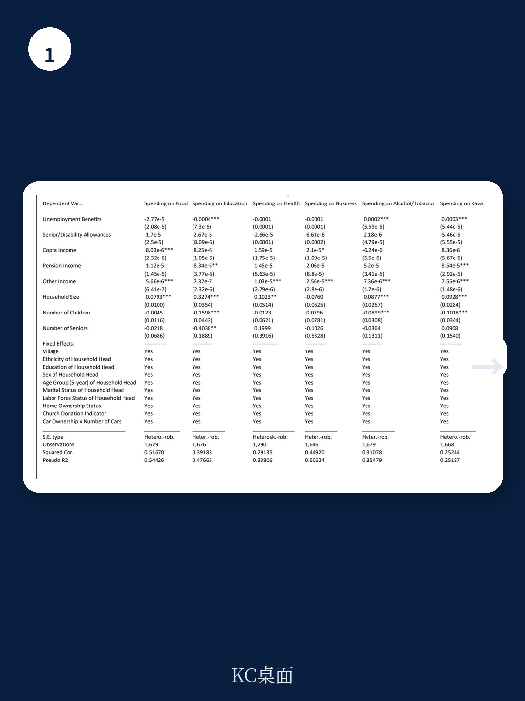
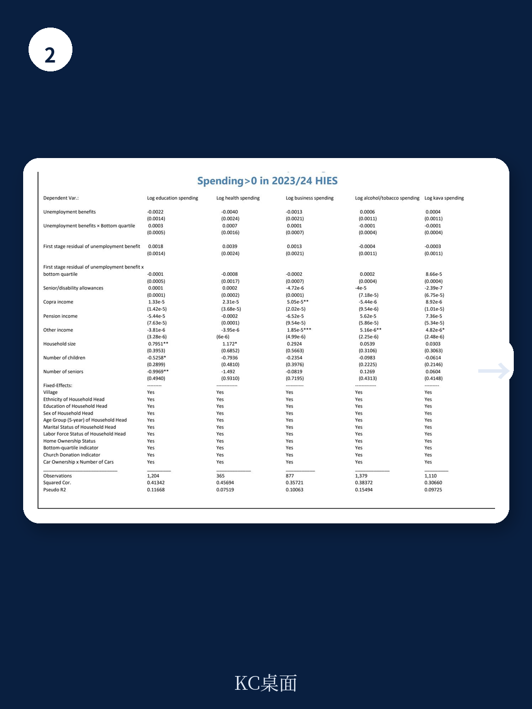

# IMF：基里巴斯案例，当社保支出增加，教育投入反而减少？

基里巴斯在新冠疫情期间大幅扩张社会保障支出，贫困率从21.9%骤降至5.5%，极端贫困几乎被消除。但IMF最新一期国别报告揭示了一个值得深思的问题：当社会保障覆盖率达到接近全民水平时，新增转移支付中的相当比例流向了酒精、烟草和卡瓦酒等不利于人力资本积累的消费。这份由IMF亚太部宏观环境学家Ni Wang执笔的Selected Issues Paper，通过断点回归设计建立了失业救济金与物质消费之间的因果关系，为小岛屿发展中国家的社会保障设计提供了新的分析框架。

## 1. 社会保障扩张的“双刃剑”：减贫成效与消费结构偏移

2019至2023年间，基里巴斯的社会保障支出发生了质变。新冠疫情后推出的失业救济金（SFU）覆盖了约95%的人口，加上已经翻倍的老年津贴和新增的残疾人津贴，传统社会援助支出占GDP比重远超OECD国家和太平洋岛国平均水平。报告显示，收入最低的四分之一家庭在此期间的收入增长几乎完全来自社会转移支付，而正式劳动收入基本未变。

问题在于，新增收入并未按预期流向教育、健康等人力资本研究领域。2023/24年度的家庭收支调查数据显示，所有收入组别的家庭都增加了食品和物质消费（酒精、烟草、卡瓦酒）的支出，而教育、健康等类别支出增长有限。这意味着，社会保障扩张在消除货币贫困的同时，可能并未有效提升家庭长期发展能力。

## 2. 失业救济金与物质消费：一个被证实的因果关系

报告最具方法论贡献的部分，是使用年龄资格断点作为工具变量，通过控制函数方法建立了失业救济金与物质消费之间的因果关系。由于失业救济金仅面向18-59岁的非正式就业人群，研究者利用家庭中符合年龄条件成员数量的外生变化，识别出了纯粹的转移支付效应。

结果令人警觉：每增加1澳元的失业救济金收入，家庭在酒精和烟草上的支出增加约34澳分（对于收入最高的四分之三家庭），而在收入最低的四分之一家庭中这一数字为25澳分。更重要的是，失业救济金与教育支出呈负相关——接受更多救济金的家庭，反而更不可能进行教育研究。

> **KC评论：** 这一因果识别策略的设计值得关注。在发展中国家评估社会保障效果时，选择性偏误往往是最大挑战。基里巴斯的情况特殊——失业救济金近乎全民覆盖，但年龄资格断点恰好提供了准实验条件。报告中的Sargan过度识别检验无法拒绝工具变量外生性假设，增强了结果可信度。完整报告中的诊断统计量和稳健性检验值得细读。

## 3. 为何低收入家庭的物质消费弹性更低？

一个反直觉的发现是：收入最低的四分之一家庭，失业救济金对物质消费的边际影响反而小于高收入家庭。报告给出的解释是，低收入家庭面临更强的预算约束和更少的可支配空间，其消费决策更受制于基本生存需求。

但这并不意味着低收入家庭的问题已经解决。报告指出，低收入家庭的收入增长几乎完全依赖转移支付，而他们的正式就业机会几乎没有改善。这意味着，一旦社会保障支出因财政不确定性而缩减，这些家庭将面临收入断崖式下跌。基里巴斯的社会保障支出高度依赖波动性较大的渔业许可证收入，这种结构性脆弱性不容忽视。

## 4. 报告未完全回答的关键问题：如何在不削弱减贫效果的前提下优化支出结构？

IMF报告提出了几项政策建议，包括加强项目间协调、减少项目重叠（94%的椰干补贴受益家庭同时也领取失业救济金）、以及探索有条件转移支付等。但报告坦诚地指出了两个未解难题

第一，基里巴斯的地理分散性和物流成本限制了政策工具选择。传统的社会保障评估框架假设政府有足够行政能力实施精准干预，但外岛的基础设施和人力资本瓶颈使这一假设难以成立。如何在能力约束下提高转移支付的“质量”，而非仅仅扩大“数量”，是报告留下的一大开放问题。

第二，物质消费的负外部性如何内部化？报告发现，失业救济金对物质消费的因果效应在控制功能方法下估计值甚至大于基准回归，暗示可能存在地理因素导致的负向偏误——就业机会和商品供应集中在首都塔拉瓦，失业与物质消费之间可能因地缘因素呈负相关。这意味着，单纯调整转移支付金额可能不足以改变消费行为，需要配套的公共健康干预和消费环境治理。

## 5. 给观察者的分析框架：社会保障扩张的“质量三角”

这份报告实际上提供了一个分析发展中国家社会保障效果的通用框架，可以概括为三个维度

一是减贫效率。基里巴斯用极高的支出（失业救济金占GDP的5%）换来了贫困率从21.9%降至5.5%，但每单位支出的减贫效果是否可持续，取决于财政来源的稳定性。

二是人力资本积累。转移支付是否流向了教育、健康等能提升长期生产力的领域？基里巴斯的案例表明，答案并非自动为“是”，需要制度设计来引导。

三是行为激励。社会保障是否改变了受益人的劳动供给和消费决策？基里巴斯的失业救济金近乎全民覆盖，且与就业状态挂钩的方式较为宽松，这种设计是否抑制了正式就业动机，报告没有直接回答，但为后续研究留下了空间。

对于关注小岛屿发展中国家或太平洋岛国宏观环境的研究者，这份报告提供了一个方法论扎实、数据丰富的参考案例。其核心启示或许在于：社会保障的“量”和“质”需要分开评估，而后者往往被减贫数字所掩盖。

For informational purposes only. Portions may be generated,translated,summarized,or edited with AI assistance based on source materials and may contain omissions or errors. Please verify independently. This is not investment,legal,tax,accounting,or other professional advice.
