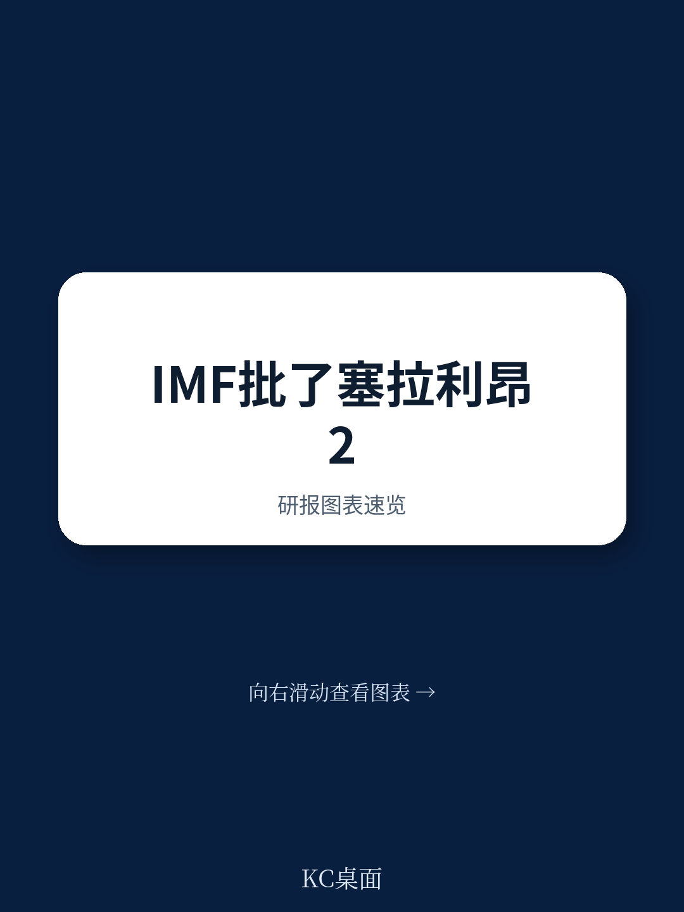
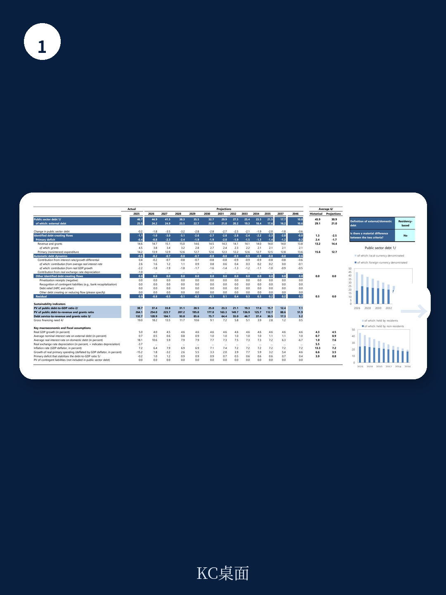
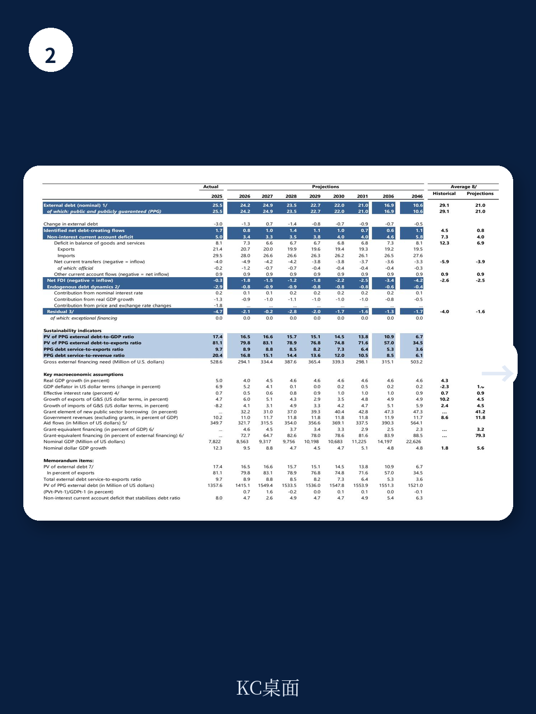

# IMF：塞拉利昂的紧缩见效了，但真正的考验在2028之前

IMF在2026年6月完成了对塞拉利昂的第三次ECF审查，同时批准了新的RSF安排。这份报告的核心信号是：过去三年的财政货币双紧缩确实稳住了汇率、压低了通胀、恢复了信贷，但储备依然薄弱，债务不确定性高企，而2028年大选前的政治不确定性正在上升。真正的问题不是紧缩是否有效，而是紧缩能否持续到选举结束。

## 1. 财政紧缩的成果是真实的，但2026年不确定性正在回流

塞拉利昂的国内基础收支从2022年到2025年改善了7个百分点的GDP，其中税收收入增长了3.5个百分点。这一成绩在非洲低收入国家中并不常见。与此同时，货币政策的收紧帮助稳定了汇率，通胀从2024年底的13.8%降至2025年底的4.3%，私人信贷增速从18%跃升至49%。

但2026年的数据开始出现裂痕。一季度财政收入低于预期10%，主要原因是税收合规率下降。更关键的是，由于中东战争推高燃料成本，政府不得不维持燃油补贴，每升汽油和柴油分别补贴1.1和4.3新利昂。这笔补贴虽然避免了更剧烈的价格波动，但也意味着财政空间正在被压缩。

> **KC评论：** 紧缩的成果是真实的，但报告也暗示了“改革疲劳”的不确定性。读者可以重点关注报告中的“国内基础收支”这一指标——它比整体赤字更能反映政府的自主财政纪律。

## 2. 债务可持续性仍是最大约束，RSF提供了一条新路径

报告明确指出，塞拉利昂的债务仍处于“高不确定性”状态。2025年公共债务占非铁矿石GDP的49.3%，预计2026年降至47.3%。但这个下降主要依赖宏观环境增长和财政紧缩，而非债务减免或重组。

RSF安排是这次审查中最值得关注的制度创新。总额约2.1亿美元的RSF贷款，利率低于ECF，期限更长，且聚焦于三个改革领域：气候敏感型公共研究管理、气候韧性、资金稳定。这不是一个单纯的融资工具，而是一个“改革锚”——它要求塞拉利昂在气候适应力方面做出结构性承诺，才能逐步获得资金。

报告没有完全回答的问题是：RSF的改革条件是否足够严格？如果塞拉利昂在2028年选举前出现政策松动，RSF的资金是否会暂停？这些细节在报告的“RSF Arrangement”章节中有更具体的改革时间表，值得原文读者仔细推敲。

## 3. 政治时间表与改革节奏之间的张力，报告没有完全展开

报告的“Context”部分提到，2028年大选前政治紧张正在上升。主要反对党在2026年4月才恢复参与议会，而人口普查、宪法审查等关键进程均存在延迟。这意味着，未来两年的改革窗口可能在选举前收窄。

报告中的指标也反映了这种张力。连续性的“国内基础收支”目标在2026年一季度未达标，而“社会支出”和“国内欠款”两个指标也连续miss。IMF对这些miss给予了豁免，但条件是采取纠正行动——包括将2026年的外债上限削减2025年超支的额度。

> **KC评论：** 报告没有直接说“选举会影响改革”，但数据暗示了这一点。读者可以关注报告附录中的“Prior Actions”列表——这是IMF判断改革是否脱轨的关键信号。

## 4. 两个值得持续追踪的观察框架

第一，看“国内基础收支”是否能在2026年下半年重回正轨。如果2026年全年该指标偏离目标超过1个百分点，ECF项目可能面临更大的执行不确定性。

第二，看RSF的“气候韧性”改革是否产生实质性的制度变化。塞拉利昂过去五年经历了多次洪水和泥石流，农业产出和基础设施损失严重。RSF的“气候敏感型公共研究管理”改革，如果能够建立一套项目筛选和气候不确定性评估流程，其长期价值可能超过短期融资。

报告中最被低估的一张图表是“Selected Economic Indicators”表格中的“Gross reserves (months of imports)”——2026年预计从2.0个月回升到2.7个月。这个数字虽然仍低于国际警戒线（3个月），但方向是积极的。它能否在2028年前达到3.5个月以上，将决定塞拉利昂能否真正摆脱对外部援助的依赖。

报告的完整版本还包含详细的Debt Sustainability Analysis、Climate Profile以及RSF改革的逐项时间表，这些内容对于理解塞拉利昂的中期前景至关重要。

For informational purposes only. Portions may be generated,translated,summarized,or edited with AI assistance based on source materials and may contain omissions or errors. Please verify independently. This is not investment,legal,tax,accounting,or other professional advice.
