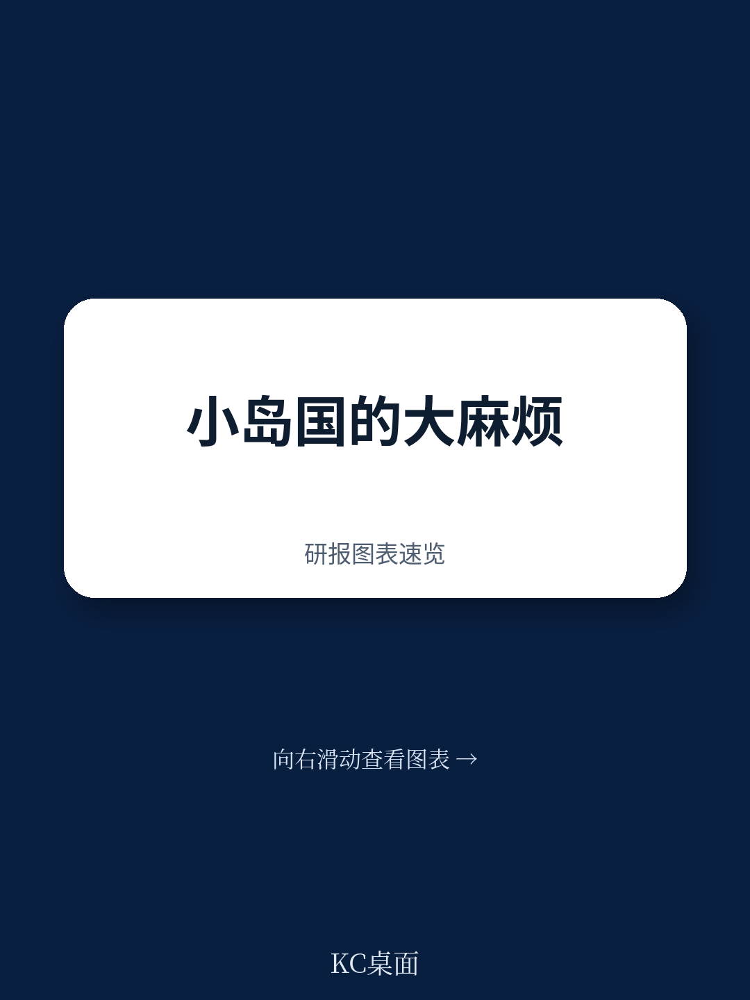
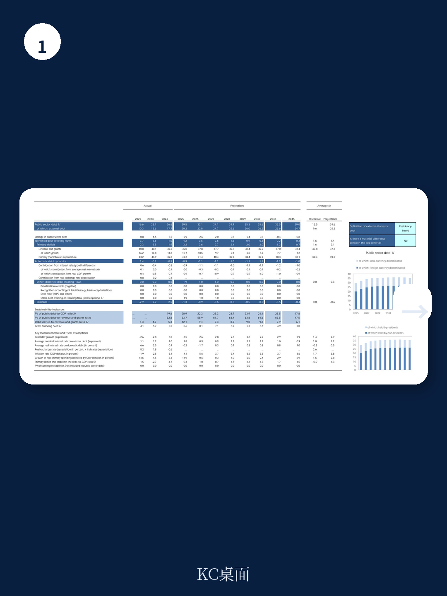
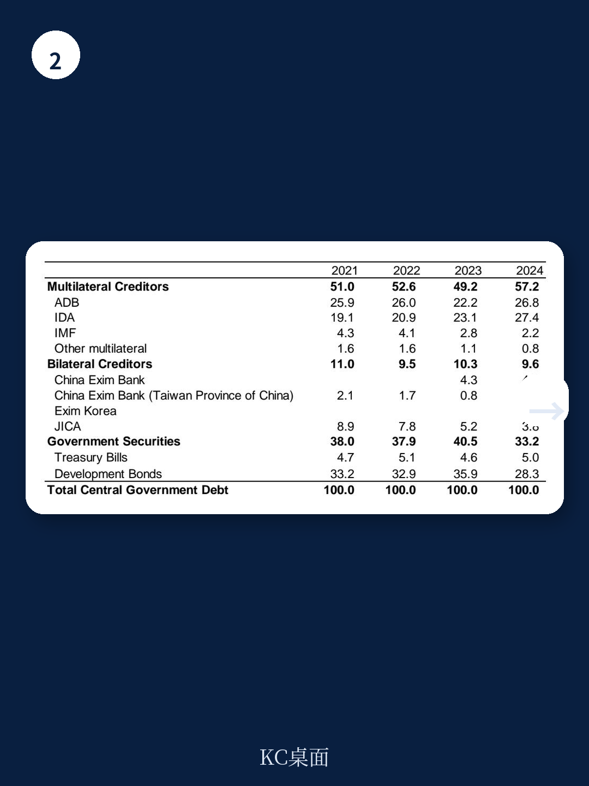

# IMF：不是周期而是治理，IMF评估所罗门群岛政策执行能力

2025年，所罗门群岛的宏观环境交出了一份不错的成绩单。黄金产量和农业产出双双走高，基础设施项目稳步推进，全年GDP增速达到3.5%，经常账户甚至录得5.6个百分点的盈余。但这份来自IMF的2026年第四条磋商报告，指向了一个更复杂的叙事：外部冲击正在重塑这个小岛国的增长轨迹，而内部治理的脆弱性让调整空间变得异常逼仄。

报告给出的核心判断是：2026年的增长将明显降温，通胀不确定性上升，财政空间正在被侵蚀。这不仅是周期性的扰动，更是对政策执行能力和治理质量的一次不确定性测试。

## 1. 黄金红利难以对冲中东冲击波

报告中最直观的变化来自外部账户。2025年经常账户从赤字4.2%大幅跳升为盈余5.6%，主要推手是黄金和农产品出口。但IMF预计，2026年这一格局将迅速逆转，经常账户将重新陷入3.4%的赤字。原因很直接：中东局势推高了燃料和食品进口价格，而出口端的黄金价格红利可能不足以完全对冲。

从数据看，进口占GDP的比重预计从2025年的55.5%升至61.9%，而出口占比则从52.4%回落至50.0%。贸易条件的出现变化几乎是确定性的。对于这样一个高度依赖进口能源和食品的地区，外部价格冲击的传导速度往往比模型预测更快。

> **KC评论：** 这里的关键变量不是黄金产量，而是黄金出口价格能否持续高位运行。报告提到了金矿扩产作为上行不确定性，但其前提是“稳健的资源管理和有限的财政激励”——这两个条件在当前治理环境下都非易事。完整报告中的债务可持续性分析（DSA）部分，值得关注外部债务在油价冲击下的不确定性测试假设。

## 2. 财政缓冲已近枯竭，预算执行面临硬约束

财政状况是这份报告最值得细读的部分。2025年财政赤字已扩大至GDP的3.9%，而2026年预计进一步升至4.1%。更令人担忧的是现金储备的消耗。报告明确提到“depleted cash balances”，这意味着政府在面对突发支出时几乎没有缓冲。

IMF给出的处方是现实的：限制国内融资赤字，逐步重建现金余额，同时加快引入增值税（VAT），加强税收执法，尤其是在采掘业领域。这些建议并不新鲜，但紧迫性在上升——报告指出，预算实施不确定性来自“现金储备枯竭、收入不确定性以及政府债券的有限吸收能力”。

问题的另一面是公共财政管理（PFM）的长期积弱。财政报告延迟、审计滞后、太平洋运动会审计未完成——这些不是技术细节，而是预算可信度的直接损失。没有可信的预算，任何财政整顿计划都难以落地。

## 3. 货币政策空间有限，固定汇率制的两难

所罗门群岛实行的是盯住一篮子货币的固定汇率制度。IMF明确支持这一安排，认为它有助于限制汇率波动和支持价格稳定。但挑战在于，当外部通胀不确定性上升时，央行的政策工具相当有限。

报告建议央行“保持随时收紧货币政策的准备”，但同时强调要“避免临时性的汇率调整”。这意味着，吸收通胀不确定性的主要渠道将是利率和流动性管理，而非汇率弹性。在当前银行体系存在过剩流动性的背景下，逐步吸收这些流动性并引入常备便利工具，是短期内的优先事项。

一个值得关注的长期问题是：如果黄金矿业大幅扩张，外资流入激增，固定汇率制将面临更大的管理难度。报告对此有所提及，但未展开。这是未来几年可能出现的政策张力。

> **KC评论：** 对于研究小国开放地区的读者，这份报告的汇率制度讨论是一个经典案例。固定汇率在稳定预期方面有优势，但代价是丧失了独立的货币政策空间。当外部冲击与内部流动性过剩同时出现时，央行的操作空间其实非常狭窄。建议回到报告正文中关于外汇市场政策一致性的段落，那里有更细致的讨论。

## 4. 报告没有完全回答的长期问题

报告在结构改革部分提出了一些方向：农业生产力提升、营商环境改善、基础设施补短板、治理强化、气候适应能力建设。这些都是正确的方向，但报告本身没有充分回答一个关键问题：在政治周期短、行政能力弱的环境下，这些改革如何从“优先事项”变为“实际执行”？

另外，关于矿产资源收入的管理，报告建议“开始考虑一个中期财政框架”，但并未给出具体的时间表或路线图。对于黄金扩产可能带来的财政机会，报告的态度是审慎的——强调需要“有限的财政激励”和“稳健的资源管理”。这种审慎有其道理，但留给读者的问题是：如果黄金收入真的大幅上升，现有的PFM能力能否承接和管理这笔增量资金？

气候变化的长期影响也被提及，但同样缺乏可操作的适应政策框架。对于海平面上升不确定性较高的太平洋岛国而言，这可能是比中东冲突更持久的挑战。

## 观察框架：三个值得持续跟踪的指标

对于关注太平洋岛国宏观环境或小国宏观研究的读者，建议从这份报告中提取三个高频跟踪指标

第一，**财政现金余额的变化**。这是判断政府是否有空间应对突发冲击的最直接信号。报告提到现金储备已“depleted”，下一轮数据将是验证整顿效果的关键。

第二，**增值税的立法进展**。IMF将VAT的引入视为财政改革的核心支柱之一，其推进速度将直接反映政策执行力。

第三，**黄金出口量和价格的月度数据**。这是短期内影响经常账户和财政收入的最大变量，也是报告中提到的上行不确定性的主要来源。

这份报告的信息密度很高，尤其是债务可持续性分析和资金部门评估部分，都包含了对于理解所罗门群岛不确定性轮廓的重要细节。

For informational purposes only. Portions may be generated,translated,summarized,or edited with AI assistance based on source materials and may contain omissions or errors. Please verify independently. This is not investment,legal,tax,accounting,or other professional advice.
