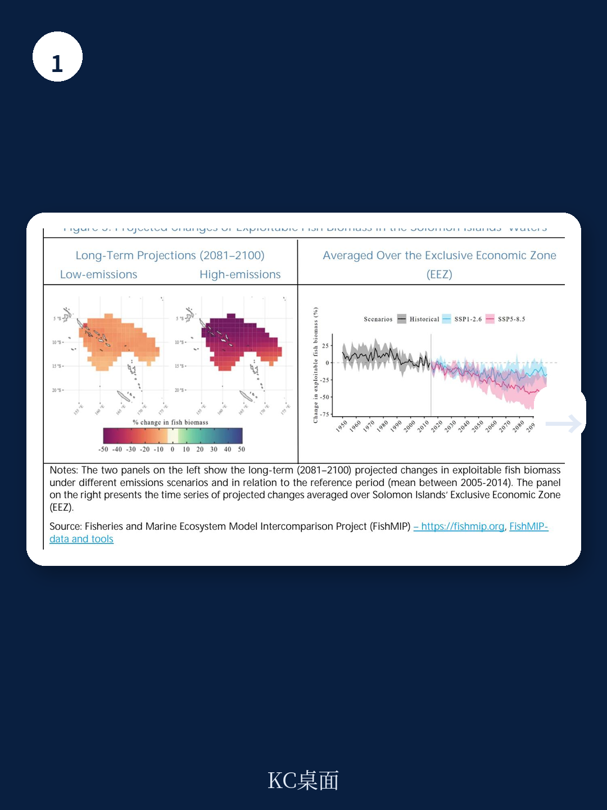
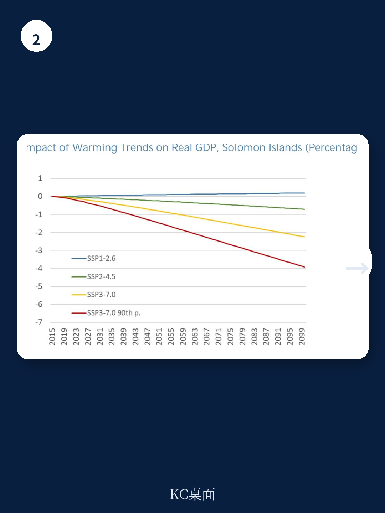

# IMF：不是台风而是海洋，IMF评估所罗门群岛两大长期不确定因素

一份来自IMF的《所罗门群岛：气候变化、宏观宏观环境不确定性与适应》报告，给出了一个反直觉的判断：这个太平洋岛国未来几十年最需要关注的，不是极端高温或更频繁的台风，而是两股更缓慢但更确定的力量——海平面上升和海洋生态系统变化。

报告基于最新气候模型和实证分析，试图回答一个核心问题：当气候变化以渐进方式冲击一个小型岛屿地区时，最脆弱的是哪些环节？答案指向了渔业资源、海岸基础设施和人口分布格局。

## 1. 渔业资源的长期调整，比想象中更确定

报告引用了Fisheries and Marine Ecosystem Model Intercomparison Project（FishMIP）的模拟结果：在所罗门群岛专属宏观环境区，可开发鱼类生物量到2050年将下降约11%，无论全球采取低排放还是高排放路径。到2100年，高排放场景下的降幅可能达到50%。

关键洞察在于时间窗口。报告指出，气候和海洋系统的惯性决定了，不同排放路径对渔业的影响要到本世纪后半叶才会显著分化。这意味着，即使全球减排取得进展，所罗门群岛在未来二三十年仍将承受渔业资源下降的冲击。考虑到渔业贡献了该国约4%的GDP，并支撑着大量人口的生计和粮食安全，这一趋势的宏观宏观环境含义不容忽视。

> **KC评论：** 渔业资源的长期下降，本质上是将所罗门群岛置于一个“时间陷阱”中——短期适应措施无法逆转这一趋势，而长期调整又需要从现在开始。报告没有展开的是，这将对政府财政收入、贸易平衡和农村就业结构产生怎样的连锁反应。

## 2. 海平面上升：一项可以量化的成本，但分布极不均匀

报告使用Kopp等人（2014）的投影数据，估算了不同排放路径下所罗门群岛的海平面上升幅度：到2100年，低排放路径下约0.52米，高排放路径下可达0.79米。这个数字本身并不惊人，但结合人口和宏观环境活动的空间分布后，问题变得尖锐。

报告进一步分析了不同海拔和海岸距离下的人口与资产分布。结果显示，大量人口、基础设施和宏观环境活动集中在低海拔沿海区域，包括首都霍尼亚拉。海平面上升带来的成本——通过淹没、侵蚀和风暴潮加剧——将高度集中在这部分地区。

报告估算，2020至2099年间，海平面上升的年均成本约占GDP的一定比例。这一数字虽未达到灾难性水平，但对于一个财政空间有限、基础设施脆弱的小型地区而言，属于需要严肃应对的长期不确定性。

> **KC评论：** 海平面上升的成本分布极不均匀，这意味着政府的适应资源分配将面临艰难的权衡。报告提到的“成本效益分析”框架在这里尤其关键——需要优先保护哪些区域，哪些区域可能需要考虑有管理的撤退，这不仅是宏观环境计算，也是政治决策。

## 3. 报告尚未完全回答的关键问题：适应能力从哪里来

报告在适应政策部分提出了清晰的原则：政府需要优先配置资源、实施成本有效的政策、消除阻碍私人适应的市场障碍。但一个核心问题并未充分展开——所罗门群岛的财政和制度能力是否足以支撑这些适应措施？

报告引用了宏观财政领域的指导原则，但缺乏对具体实施障碍的分析：地方政府的技术能力、数据可获得性、土地权属问题、以及国际气候融资的可得性和稳定性。这些因素可能比政策设计本身更决定适应措施的成败。

此外，报告对森林部门给出了相对乐观的评估——二氧化碳施肥效应可能促进森林生长——但这一判断建立在温度和降水保持在特定范围内的假设上。如果极端降水事件增加导致滑坡或水土流失，这一正面效应可能被削弱。报告承认了不确定性，但没有深入讨论。

## 4. 读者观察框架：从“气候不确定性”到“财政韧性”

这份报告提供了一个可迁移的分析框架：对于任何依赖自然资源、人口集中在沿海的小型地区，气候不确定性评估不应只关注极端事件，而应系统性地评估三个维度——资源基础的长期趋势、空间分布的脆弱性、以及适应能力的财政约束。

具体到所罗门群岛，值得持续追踪的指标包括：渔业出口收入的变化趋势、沿海基础设施的更新周期与海平面上升时间线的匹配度、以及国际气候融资的实际到位率。这些指标的动态变化，将比任何单一气候模型输出更能反映宏观环境的实际韧性。

报告本身是对一个具体国家的研究，但其方法论和判断逻辑，对于理解全球范围内小型岛屿地区的气候不确定性格局，具有参考价值。

---

For informational purposes only. Portions may be generated,translated,summarized,or edited with AI assistance based on source materials and may contain omissions or errors. Please verify independently. This is not investment,legal,tax,accounting,or other professional advice.
