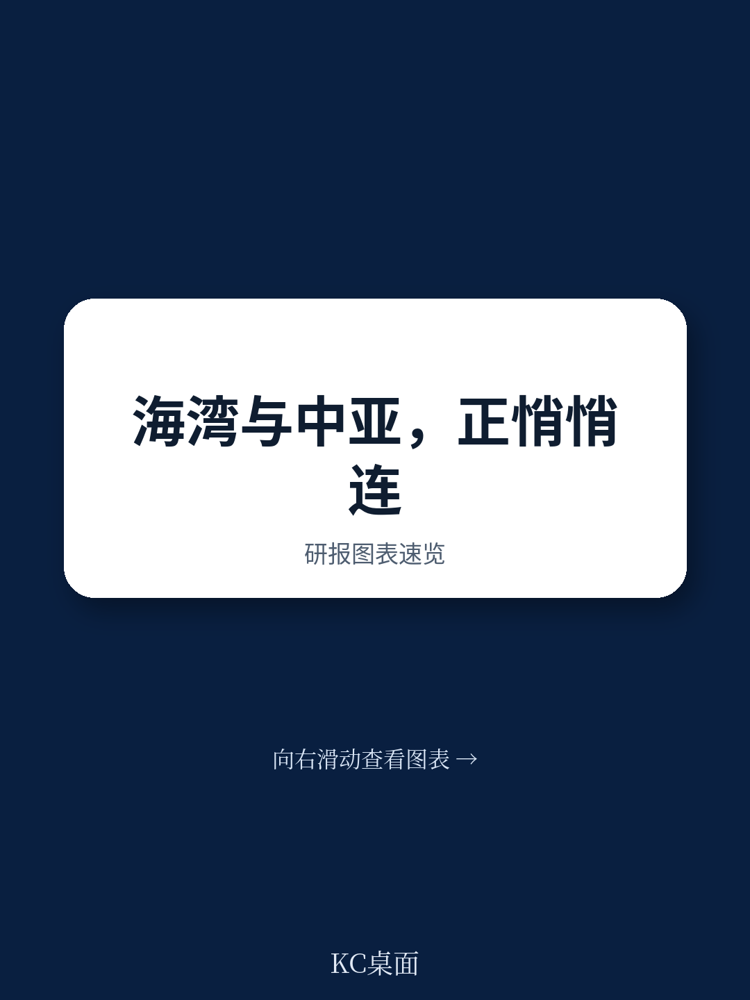
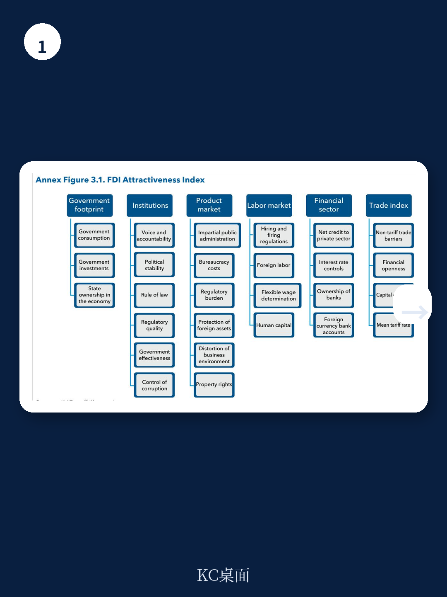
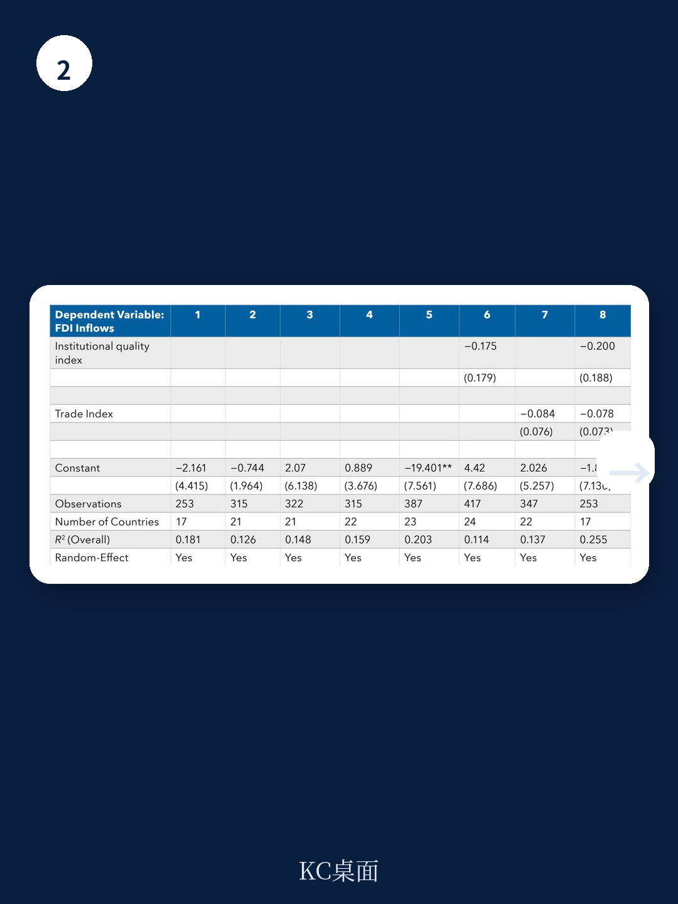

# IMF：不是缺贸易意愿，是政策卡住了，IMF看海湾与中亚合作

全球贸易碎片化正在重塑区域合作的逻辑。当各国都在寻找更可靠的贸易伙伴时，一份来自IMF的新报告给出了一个反直觉的判断：海湾合作委员会（GCC）与高加索和中亚地区（CCA）之间的宏观环境联系虽然目前很薄弱，但政策改善的回报可能远超预期。报告的核心不是提到某个具体行业，而是指出物流、治理和跨境支付这些“基础设施”层面的改革，能撬动高达150%的贸易增长。这不是一个关于石油的故事，而是一个关于如何把地缘邻近转化为宏观环境互补的实操框架。

## 1. 两地贸易的瓶颈不在需求，在政策环境

GCC和CCA的出口结构确实相似——都高度依赖碳氢化合物。但报告指出，非油气贸易正在变得多样化，且两地存在明显的资本流动互补性：GCC是资本净输出方，CCA是资本净输入方。理论上，这样的组合应该催生活跃的贸易和研究。

现实却是双边贸易占比极低。IMF通过引力模型测算发现，如果只看宏观环境规模和地理距离，GCC与CCA之间的实际贸易额远低于“应有水平”。造成这一差距的，不是缺乏贸易意愿，而是政策环境的制约。报告特别指出，GCC在物流、治理、监管负担和跨境支付系统方面表现更好，而CCA在非关税措施和政府宏观环境干预方面反而更优。这意味着，两地各有短板，也各有可相互借鉴的领域。

> **KC评论：** 这份报告最有价值的部分，不是告诉你“要合作”，而是用数据告诉你“卡在哪里”。如果你关注中亚或海湾的研究机会，真正值得看的不是资源禀赋，而是那些影响交易成本的制度细节——比如海关效率、支付清算速度、研究保护条款。

## 2. 物流和治理改善，能带来贸易翻倍增长

报告给出了具体的量化测算。如果CCA国家在物流绩效（LPI）和治理指标上提升到全球前25%的水平，其货物贸易可以分别增长约150%和120%。对于GCC国家，由于政策差距较小，改善的边际收益虽然低一些，但在治理、物流和降低监管负担方面仍有可观的提升空间。

这些数字背后有一个清晰的逻辑：贸易增长不是靠签署更多自由贸易协定（尽管报告也建议考虑），而是靠降低“交易摩擦”。物流效率决定了货物能否按时到达，治理质量决定了合同能否被执行，监管负担决定了企业是否愿意进入这个市场。报告还强调，改善跨境支付系统（XBPs）是支撑这些交易的基础设施——尤其是CCA地区，支付系统的现代化程度远低于GCC。

> **KC评论：** 150%的增长数字看起来很惊人，但它的前提是“政策改善到全球前25%”。这不是一个短期目标。对于企业来说，这意味着在中亚研究物流基础设施或资金科技，可能比直接寻找贸易伙伴更有长期价值——因为前者是解决系统性问题，后者只是利用现有机会。

## 3. 吸引外资的关键，在于结构性改革而非补贴

在FDI方面，报告给出了一个保守但务实的判断：全面结构性改革的效果，远好于设立宏观环境特区或提供补贴。模型显示，如果CCA国家弥补在制度质量、贸易自由化、劳动力市场和资金发展等方面的政策差距，FDI流入可以增加约0.7%的GDP。GCC的增幅较小，约0.14%。

报告特别提醒，宏观环境特区（SEZs）的成功率并不高。它们只有在解决特定市场失灵、且设计透明、有时限、不与宏观稳定冲突的情况下才有意义。更可靠的路径是减少政府在宏观环境中的直接参与——报告指出，降低“国家足迹”（state footprint）通常能提升FDI吸引力，尽管在某些资源型国家，政府干预可能反而有助于吸引特定类型的研究。

> **KC评论：** 这一部分的结论其实很“IMF”——不相信奇迹，只相信制度。对于关注中亚市场的读者来说，报告隐含了一个判断：不要期待政策突变带来的短期套利机会，应该关注那些正在推进结构性改革的国家，它们的FDI增长会更可持续。

## 4. 报告尚未完全回答的关键问题

报告在方法论上非常扎实，但也留下了几个值得追问的缺口。第一，它主要讨论“cross-cutting”政策，即适用于所有行业的通用改革，但并未深入分析具体哪些非油气行业最具互补潜力——比如资金服务、旅游业、或数字服务。第二，跨境支付系统的改善方案虽然被提及，但报告承认各国系统差异大，解决方案需要“量身定制”，这意味着短期内很难有统一的区域标准。第三，报告没有讨论地缘政治不确定性对合作的影响——例如，中亚国家与俄罗斯、中国的关系如何影响其与GCC的经贸往来。

这些未解问题恰恰是读者应该去翻阅完整报告的原因。IMF的附录中包含了详细的引力模型数据和FDI吸引力指数构建方法，对于政策研究者或跨国公司的区域策略团队来说，这些技术细节比结论本身更有参考价值。

## 观察框架：如何判断GCC-CCA宏观环境合作的真实进展

对于关注这一区域的读者，报告提供了一个清晰的监测框架。第一步，看物流绩效指数（LPI）的变化——这是贸易增长最直接的先行指标。第二步，关注各国是否在推进跨境支付系统的互联互通，尤其是GCC的即时支付系统能否与中亚的RTGS系统对接。第三步，观察双边研究协定的签署节奏——报告指出，GCC和CCA在研究协定方面表现不错，但在贸易协定方面滞后，这可能是下一个政策突破口。

真正值得跟踪的，不是一时的贸易数据波动，而是这些基础性制度是否在发生实质性改善。IMF的报告提供了一张路线图，但能否走通，取决于各国政府是否有意愿在物流、治理和资金基础设施这些“慢变量”上持续投入。

---

For informational purposes only. Portions may be generated,translated,summarized,or edited with AI assistance based on source materials and may contain omissions or errors. Please verify independently. This is not investment,legal,tax,accounting,or other professional advice.
