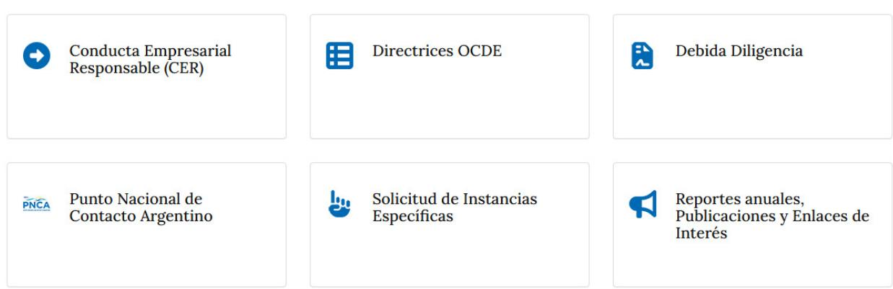
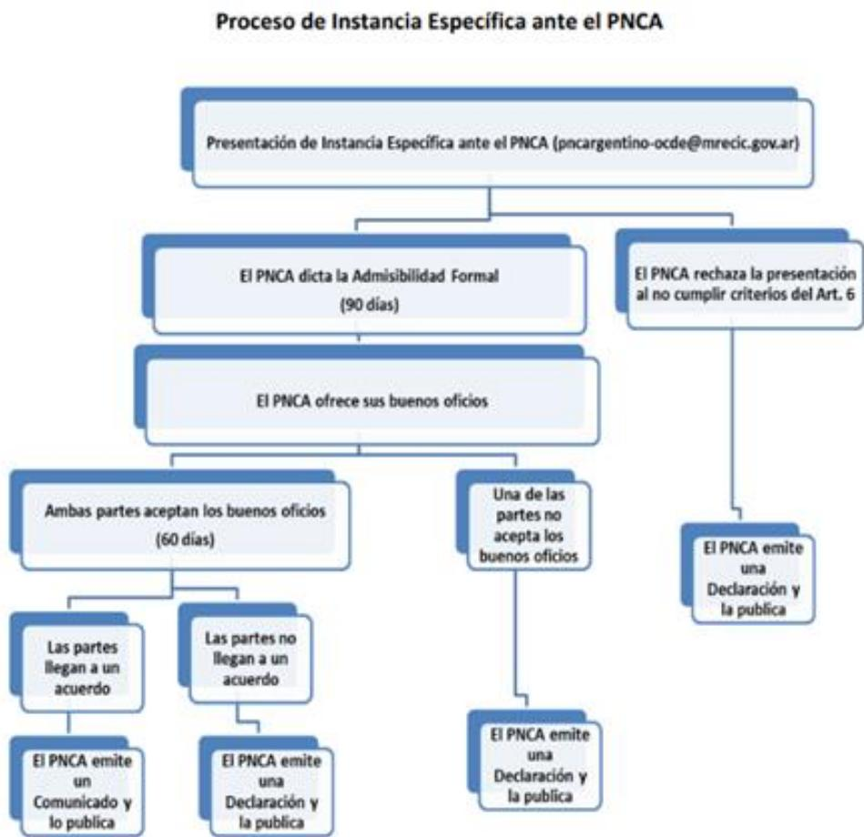

## National Contact Point for Responsible Business Conduct Peer Reviews

Argentina 2026

National Contact Point for Responsible Business Conduct Peer Reviews: Argentina 2026

# Disclaimers

This work was approved and declassified by the Working Party on Responsible Business Conduct on 18 May 2026.

This document, as well as any data and map included herein, are without prejudice to the status of or sovereignty over any territory, to the delimitation of international frontiers and boundaries and to the name of any territory, city or area.

Photo credits: © Cancillería Argentina.

© OECD 2026.

Attribution 4.0 International (CC BY 4.0).

This work is made available under the Creative Commons Attribution 4.0 International licence. By using this work, you accept to be bound by the terms of this licence (https://creativecommons.org/licenses/by/4.0/).

Attribution – you must cite the work.

Translations – you must cite the original work, identify changes to the original and add the following text: In the event of any discrepancy between the original work and the translation, only the text of original work should be considered valid.

Adaptations – you must cite the original work and add the following text: This is an adaptation of an original work by the OECD. The opinions expressed and arguments employed in this adaptation should not be reported as representing the official views of the OECD or of its Member countries.

Third-party material – the licence does not apply to third-party material in the work. If using such material, you are responsible for obtaining permission from the third party and for any claims of infringement.

You must not use the OECD logo, visual identity or cover image without express permission or suggest the OECD endorses your use of the work.

Any dispute arising under this licence shall be settled by arbitration in accordance with the Permanent Court of Arbitration (PCA) Arbitration Rules 2012. The seat of arbitration shall be Paris (France). The number of arbitrators shall be one.

## Foreword

The OECD Guidelines for Multinational Enterprises on Responsible Business Conduct (the Guidelines) are recommendations addressed by governments to multinational enterprises operating in or from adhering countries. They provide non-binding principles and standards for responsible business conduct in a global context consistent with applicable laws and internationally recognised standards. The Guidelines are the only multilaterally agreed and comprehensive code of responsible business conduct that governments have committed to promoting.

Adhering governments to the Guidelines are required to set up a National Contact Point for Responsible Business Conduct (NCP) that operates in a manner that is visible, accessible, transparent, accountable, impartial and equitable, predictable, and compatible with the Guidelines. The 2023 update of the Guidelines reinforced peer reviews of NCPs by making them mandatory and periodic, subject to the Modalities for Peer Reviews of National Contact Points for Responsible Business Conduct, approved by the Working Party on Responsible Business Conduct (WPRBC).

The peer reviews are led by representatives of two other NCPs who assess the NCP under review and provide recommendations. The reviews give NCPs a mapping of their strengths and accomplishments, while also identifying opportunities for improvement, including a structured assessment of how the NCP addresses the core effectiveness criteria. More information can be found online at https://www.oecd.org/en/networks/national-contact-points-for-responsible-business-conduct/national-contact-point-peer-reviews.html.

This document is the peer review report of the NCP of Argentina. This report was prepared by a peer review team made up of reviewers from the NCPs of Chile and Romania. The NCP of Chile was represented by Felipe Henríquez. The NCP of Romania was represented by Doru Claudian Frunzulică. The OECD Centre for Responsible Business Conduct was represented by Nicolas Hachez and Emily Halstead. The report was informed by dialogue between the peer review team, the NCP of Argentina and relevant stakeholders during an in-person mission on 3-4 November 2025. The peer review team wishes to acknowledge the NCP for the preparation of the peer review. This report also benefited from comments by delegates to the WPRBC and institutional stakeholders (BIAC, OECD Watch, TUAC). It was discussed by an informal review group of the WPRBC on 21 April 2026 and approved and declassified by the WPRBC on 18 May 2026.

## Table of contents

Disclaimers 2   
Foreword 3   
1 Key findings and recommendations 6   
Institutional arrangements 6   
Promotional activities 7   
Specific instances 8   
Support for government efforts to promote RBC 9   
2 Structured assessment of core effectiveness criteria 10   
3 Introduction 11   
2019 peer review of the Argentine NCP 12   
Economic context 13   
4 Institutional arrangements 15   
Legal basis 15   
NCP Structure 15   
Functions and operations 16   
Advisory Council (advisory body) 16   
Resources 19   
Reporting 19   
5 Promotion 21   
Promotional plan 21   
Information and promotional materials 22   
Promotional events 22   
Webpage 23   
Responding to enquiries 24   
Co-operation amongst NCPs 24   
6 Specific instances 26   
Overview 26   
Case-handling procedures 27   
Specific instances in practice 32

7 Support for government policies to promote RBC 36
Recent governmental policies enabling and promoting RBC 36
National Action Plan on Business and Human Rights 37
The role of the NCP 37
Annex A. Organisations that responded to the NCP peer review questionnaire 38
Annex B. Organisations that participated in the NCP peer review on-site visit 39
Annex C. Promotional events 40
Annex D. Overview of specific instances handled by the NCP as the leading NCP 44
References 47
Notes 49

## Tables

Table 1. Findings and recommendations – Institutional arrangements 6
Table 2. Findings and recommendations – Promotional activities 7
Table 3. Findings and recommendations – Specific instances 8
Table 4. Findings and recommendations – Support for government efforts to promote RBC 9
Table 5. Membership of the Advisory Council of the ANCP 17
Table 6. Findings and recommendations – Institutional arrangements 20
Table 7. Findings and recommendations – Promotional activity 25
Table 8. Specific instances where the Argentine NCP had co-ordinated with other NCPs 32
Table 9. Findings and recommendations – Specific instances 35
Table 10. Findings and recommendations – Support for government policies to promote RBC 37

Table A A.1. List of organisations that submitted a response to the NCP peer review questionnaire 38
Table A B.1. List of organisations that participated in the NCP peer review on-site visit 39
Table A C.1. Promotional activities in 2024 organised by the NCP 40
Table A C.2. Promotional activities in 2024 participated in by the NCP 40
Table A C.3. Promotional activities in 2023 organised by the NCP 40
Table A C.4. Promotional activities in 2023 participated in by the NCP 41
Table A C.5. Promotional activities in 2022 organised by the NCP 41
Table A C.6. Promotional activities in 2022 participated in by the NCP 41
Table A C.7. Promotional activities in 2021 organised by the NCP 42
Table A C.8. Promotional activities in 2021 participated in by the NCP 42
Table A C.9. Promotional activities in 2020 organised by the NCP 42
Table A C.10. Promotional activities in 2020 participated in by the NCP 43
Table A D.1. Overview of specific instances handled by the NCP as the leading NCP 44

Figures

Figure 1. Landing page selections available on the NCP website in Spanish 24
Figure 2. Infographic on the NCP case-handling process 28

# Key findings and recommendations

## Institutional arrangements

The NCP has a single agency structure with four members working within the same Ministry. The NCP is located in the Ministry of Foreign Affairs, International Trade and Worship. The NCP was first established in 2000, three years after Argentina's adherence to the OECD Declaration on International Investment and Multinational Enterprises (Investment Declaration). The NCP was given a legal basis for operation through its formal establishment through Ministerial Resolution No. 1567 on 31 July 2006. The Resolution was also updated in 2013.

The NCP is supported by an advisory body (the “Advisory Council”), which includes representatives from business, trade unions, civil society, and government. The Advisory Council of the NCP was formally established through Resolution 138/2019, but the body has not been called upon in practice relating to the NCP’s promotional plans or in the context of handling specific instances. The current membership as mentioned on the NCP’s website is out of date and there are no terms of reference for the operations of the Advisory Council. Feedback from stakeholders indicated that the NCP structure and operations in practice did not encourage engagement with stakeholders.

The human resources available to the NCP have generally decreased over the last five years. The NCP currently has 0.85 full-time equivalent (FTE), down from a high of 1.75 FTE staff in 2021. The NCP currently has four part-time staff members dedicating time to the NCP function. The NCP has not reported significant staff turnover in recent years. Stakeholder feedback highlighted that the NCP could benefit from dedicated full-time non-rotating staff.

The NCP does not have a dedicated budget, and its financial resources are provided from the ordinary budget of the Ministry of Foreign Affairs, International Trade and Worship. The NCP has indicated that the budget is not sufficient to allow the NCP to organise promotional events, and as a result the NCP relies on co-organising promotion.

Table 1. Findings and recommendations – Institutional arrangements

<table><tr><td></td><td>Finding</td><td>Recommendation</td></tr><tr><td>1.1</td><td>The NCP structure as established in the NCP's founding documents, including an advisory body with representatives from business, trade unions, civil society, and government has the potential to provide access to a variety of stakeholders. However, the membership and functions of the body are not well-established and the body is not being leveraged to support the NCP.</td><td>The NCP should define and publish terms of reference for the Advisory Council, notably including:Functions and duties of the Council members, clarifying any distinction between permanent and non-permanent members. Functions may include, for example, regular consultation with the body on strategic documents such as promotional plans and case-handling proceduresComposition of the Council, ensuring representativeness and ownership for stakeholder members. The composition should be clearly set and ensure representation from relevant sectors and thematic areas of the Guidelines and enable reach to stakeholders throughout the provinces of ArgentinaFrequency of meetings and process for agenda-setting,including clarifications on when meetings take place with all or a subset of the Council membership andDecision making procedures.</td></tr><tr><td>1.2</td><td>The legal basis for the NCP through the Ministerial Resolution lends authority to the NCP. Within the Resolution and on the NCP website, the NCP is not clearly identified within the Ministry of Foreign Affairs, blurring the lines between the NCP members as the NCP and as officials within the ministry, making it difficult to distinguish the NCP's work and allow it to be identified by other relevant parts of government.</td><td>Argentina should update the Ministerial Resolution establishing the NCP to better define the NCP function within the ministry and ensure that it can make its decisions autonomously, thereby increasing perceptions of impartiality and transparency of the NCP. Updates to the resolution may include:The consideration of the inclusion of stakeholders within the NCP structureDecision making procedures of the NCPReporting lines of the NCP, in terms of content reported and to whomDetails around NCP meetings, including frequency, process, and transparencyThe role of the NCP in specific instance handling, such as relating to statement drafting and mediation in good offices andClear provisions on avoidance and handling of conflicts of interest.</td></tr><tr><td>1.3</td><td>The NCP has four part-time staff members and can access financial resources through the general budget of the ministry. However, the NCP's human resources have been cut in half in the last three years and the NCP has reported that human and financial resources have not been sufficient for the NCP to address all of its responsibilities.</td><td>The ministry should progressively work to increase the NCP's resources, restoring resources lost in previous years, and ideally ensuring that at least one staff operates on a full-time and permanent basis, to avoid risk of turnover and loss of institutional knowledge.</td></tr></table>

## Promotional activities

The NCP has a history of participating in promotional events organised by others but has organised a limited number of promotional events in recent years. As resources have been a constraint for the NCP in terms of organising its own events, it has made use of partnerships to engage in the promotional events of others. Engagement with partners for promotion has often been done by invitation of the hosting entity, rather than by proactive engagement of the NCP. The NCP maintains a website with promotional information, including various pages available on the NCP in English. The NCP has also worked to develop various promotional materials that are available on its website, including newer materials aligned with the 2023 Guidelines. Despite these practices, visibility remains a key challenge for the NCP.

The NCP has adopted promotional plans in the past but has not done so in the last three years. The NCP considered strategic planning to reach the different provinces in the country to be a challenge. Feedback from stakeholders considered the material covered by the NCPs when engaging in promotion was often the same and not targeted to a specific audience or stakeholder group.

Table 2. Findings and recommendations – Promotional activities

<table><tr><td></td><td>Finding</td><td>Recommendation</td></tr><tr><td>2.1</td><td>The NCP has engaged in promotion in recent years, but it has often been reactive and focussed on general topics for general audiences around Buenos Aires.</td><td>The NCP should adopt a promotional plan, in consultation with the Advisory Council, including the following elements:Key milestones for the work of the NCP over the short- and medium-termPlans for varied and targeted promotion, identifying the most important sectors of the Argentine economy and targeting all stakeholder groups. This should take into account the need to promote in provinces throughout Argentina, for example by working with the Foreign Affairs Council andA role for the Advisory Council members in promotion, possibly considering how to leverage existing events organised by the member institutions.</td></tr><tr><td>2.2</td><td>The NCP has a largely comprehensive website with a lot of material available in both English and Spanish. The NCP does not engage in promotion on social media or leverage relationships with partners to build its online presence.</td><td>The NCP should assess ways to increase its online presence as a low-cost method for effective promotion. This may include creating a permanent presence for the NCP on social media, and leveraging its relationships for promotion and cross-references on partner websites, such as the entities included in the Advisory Council.</td></tr><tr><td>2.3</td><td>The NCP has been active in participating in promotional events in recent years, but limited resources have impacted its ability to organise its own events, which has limited its visibility.</td><td>The NCP should strive to organise its own events, possibly one or two flagship events per year, focussed on formats that do not require burdensome additional resources, such as webinars.</td></tr></table>

## Specific instances

Since its establishment in 2000, the NCP has received 15 specific instances. At the time of writing, 13 had been concluded and two were not accepted. Two of the concluded cases resulted in an agreement between the parties. Of the 15 specific instances received, ten were received since 2011 and one was received in the last five years, showing a recent decline in specific instance-handling activity. Stakeholder feedback considers that the decline in submissions and lack of positive outcomes in concluded cases may reduce the appeal of the mechanism for potential submitters. Further feedback noted the lack of visibility of the NCP as a non-judicial grievance mechanism.

The NCP most recently updated its case-handling procedures in 2025 to align with the 2023 Guidelines and Implementation Procedures. The updates to the procedures did not undergo a stakeholder consultation. The NCP's updated case-handling procedures are available on the NCP's website in English and Spanish. While the procedures are largely comprehensive, they are not fully aligned with the 2023 Guidelines and stakeholder feedback has indicated a need for further clarity around certain provisions, such as relating to transparency in the specific instance process.

Table 3. Findings and recommendations – Specific instances

<table><tr><td></td><td>Finding</td><td>Recommendation</td></tr><tr><td>3.1</td><td>The NCP updated its case-handling procedures following the publication of the 2023 Guidelines, but the updated procedures are not fully aligned with the Guidelines and the updates did not undergo a stakeholder consultation.</td><td>The NCP should further revise its case-handling procedures in consultation with stakeholders, notably through the NCP’s Advisory Council. Updates should ensure complete alignment with the 2023 Guidelines and clarify existing provisions where needed, such as regarding transparency.</td></tr><tr><td>3.2</td><td>The NCP has concluded 13 specific instances since its establishment, but most outcomes have not met the expectations of stakeholders, negatively affecting trust in the NCP grievance mechanism.</td><td>The NCP should work to build trust with companies and potential submitters as a non-judicial grievance mechanism, notably by:Ensuring predictability in the process by clearly explaining to the parties the nature of the mechanism, steps to be followed, and possible outcomesEnhancing its skillset related to case-handling, notably by ensuring access to mediation expertise, for example by prioritising the finalisation of the memorandum of understanding with the mediation team at the Ministry of Justice and reflecting options for mediation within the NCP’s case-handling proceduresImproving timeliness in case-handling, ensuring any delays are clearly communicated to parties; andPublishing more detailed statements with well-defined recommendations and providing parties with the opportunity to comment on drafts before publication.</td></tr></table>

## Support for government efforts to promote RBC

The Government of Argentina has had little engagement in RBC-related policies in recent years. In 2023, Argentina adopted its first National Action Plan (NAP) on Business and Human Rights, which contains references to the Guidelines, the Recommendation and the NCP. Limited steps have been taken to date to implement the NAP.

The NCP structure includes eight government agencies, one as the institutional home of the NCP and seven in its Advisory Council. The NCP has the possibility to disseminate information on its activities to other parts of governments by engaging with the government members of its Advisory Council and has particularly noted connections with officials responsible for trade and investment agreements. In practice, the NCP has had limited experience in providing support for government efforts to promote RBC. Feedback from stakeholders encouraged the NCP to play a more active role in engaging with the government on policies relevant to RBC, such as by promoting the NCP's expertise within government or providing a role for the NCP in the implementation of the NAP.

Table 4. Findings and recommendations – Support for government efforts to promote RBC

<table><tr><td></td><td>Finding</td><td>Recommendation</td></tr><tr><td>4.1</td><td>The NCP has access to other parts of government through its structure, including connections with officials working on trade and investment agreements. The NCP has had limited collaboration with other government officials on RBC-related themes, but the potential role for the NCP in supporting government efforts to promote RBC is not well known across government.</td><td>The NCP should promote the Guidelines and the Recommendation on the Role of Government in Promoting RBC to other parts of government, considering how a role for the NCP in supporting government policy to promote RBC could develop as capacity is increased.</td></tr></table>

## Structured assessment of core effectiveness criteria

As provided for in the Modalities for Peer Reviews of NCPs, the following table provides a structured assessment of the extent to which the NCP under review achieves the core effectiveness criteria as set out in the Implementation Procedures of the Guidelines. The findings in the table work to inform the report's recommendations and provide an overview of the NCP's functioning and areas for improvement.

<table><tr><td></td><td>Visibility</td><td>Accessibility</td><td>Transparency</td><td>Accountability</td><td>Impartiality and equitability</td><td>Predictability</td><td>Compatibility</td></tr><tr><td>Institutional arrangements</td><td>NCP is identifiable within government, though there is little distinction between the NCP members as the NCP and as government officials</td><td>Advisory body structurally connects NCP to stakeholders, but the body has had decreased activity in recent years</td><td>A founding document on the NCP is publicly available. Limited details about specific operations and meetings are available</td><td>NCP reports on its activities to some parts of government and makes annual reports available on its website</td><td>NCP structure and operations have limited safeguards to prevent and address conflicts of interest</td><td>NCP does not have well-defined operating and decision making procedures</td><td>Structure meets main Procedures&#x27; specifications. Resources have not always been sufficient</td></tr><tr><td>Promotion</td><td>NCP promotion has been reactive and not strategic to reach a broad range of stakeholders and audiences</td><td>Promotional materials and past events are available on the NCP website</td><td>No promotional plan or event information is available</td><td>NCP does not assess the impact of its promotion</td><td>Promotion is not strategic to reach all relevant stakeholders, such as outside of Buenos Aires</td><td>NCP does not have a plan for promotion and does not promote upcoming events on its website</td><td>Promotion is insufficient to meet the expectations of the Guidelines</td></tr><tr><td>Specific instances</td><td>There is limited visibility of role as non-judicial grievance mechanism with potential submitters</td><td>Case-handling procedures lack clarity around certain provisions</td><td>NCP statements are published. The specific instance process is not well-understood by parties</td><td>NCP does not specify provisions for feedback on specific instance handling and has not conducted a follow up</td><td>Parties to cases are treated fairly and the location of the NCP in the MoFA is viewed favourably</td><td>Specific instances have regularly experienced delays and parties are not always kept informed per NCP procedures</td><td>NCP case-handling procedures can be further aligned with the Procedures and consulted with stakeholders</td></tr><tr><td>Conclusion</td><td>Prioritise</td><td>Maintain</td><td>Strengthen</td><td>Maintain</td><td>Strengthen</td><td>Prioritise</td><td>Strengthen</td></tr></table>

Note: Light grey boxes correspond to areas where the NCP should maintain practice, medium grey boxes correspond to areas where the NCP should strengthen practice, and dark great boxes correspond to areas where the NCP should prioritise improvements to current practice. Conclusions reflect the overall level of achievement of effectiveness criteria across all three areas.

## 3 Introduction

## The Argentine NCP at a glance

Established: 2000

Structure: Single agency with advisory body

Location: National Directorate of Multilateral Economic Negotiations of the Ministry of Foreign Affairs, International Trade and Worship

Staffing: Four part-time staff

Webpage: https://cancilleria.gob.ar/es/iniciativas/pnca (Spanish)

Specific instances: 15, including 13 concluded, 2 not accepted, and none ongoing

The Implementation Procedures of the Guidelines require NCPs to operate in a manner that is visible, accessible, transparent, accountable, impartial and equitable, predictable, and compatible with the Guidelines. This report assesses conformity of the Argentine NCP with the core effectiveness criteria of NCPs and with the Implementation Procedures. A structured assessment of the core effectiveness criteria is provided as part of the peer review process.

Argentina adhered to the OECD Declaration on International Investment and Multinational Enterprises (Investment Declaration) in 1997. The OECD Guidelines for Multinational Enterprises on Responsible Business Conduct (the Guidelines) are part of the Investment Declaration. The Guidelines are recommendations on responsible business conduct (RBC) addressed by governments to multinational enterprises operating in or from Adherents. The Guidelines have been updated six times since 1976; the most recent revision took place in 2023.

Countries that adhere to the Investment Declaration are required to establish National Contact Points for Responsible Business Conduct (NCPs). NCPs are agencies established by adhering governments to “further the effectiveness of the Guidelines” (OECD, 2023[1]). The OECD Council Decision on the OECD Guidelines for Multinational Enterprises on Responsible Business Conduct [OECD/LEGAL/0307] (the Decision) states that “NCPs shall have the following responsibilities:

a) Promote awareness and uptake of the Guidelines, including by responding to enquiries;

b) Contribute to the resolution of issues that arise in relation to the implementation of the Guidelines in specific instances.

In addition, where appropriate and in coordination with relevant government agencies, NCPs may also provide support to efforts by their government to develop, implement, and foster coherence of policies to promote responsible business conduct" (OECD, 2023[2]).

Adherents are required to make human and financial resources available to their NCPs so they can effectively fulfil their responsibilities in a way that fully meets the core effectiveness criteria, taking into account internal budget capacity and practices [OECD/LEGAL/0307, Decision, I.4].

The Procedures attached to the Decision cover the role and functions of NCPs in six parts: institutional arrangements, information and promotion, specific instances, support for government efforts to promote responsible business conduct, reporting, and peer reviews.

From 2009-2024, NCPs underwent voluntary peer reviews. The methodology for the peer review was the OECD Core Template for Voluntary Peer Reviews of NCPs (OECD, 2021[3]). In 2017, at the OECD Ministerial Council Meeting (MCM), ministers committed ‘to having fully functioning and adequately resourced National Contact Points, and to undertake a peer learning, capacity building exercise or a peer review by 2021, with the aim of having all countries peer reviewed by 2023’ (OECD, 2017[4]). In 2023, the Procedures were updated. In particular, a new part on peer reviews was added providing for periodic mandatory peer reviews of NCPs. Mandatory peer reviews follow a cycle of seven years, with each NCP set to undergo a peer review in each cycle, starting in 2025. “Modalities for Peer Reviews of National Contact Points for Responsible Business Conduct” (the Modalities) were adopted in November 2024 (OECD, 2025[5]).

The objectives of peer reviews as set out in the Modalities and the Commentary (para. 23) are to evaluate the strengths and weaknesses of the NCP in accordance with its responsibilities and the core effectiveness criteria set out in the Procedures; and to make recommendations for improvement.

The peer review of the NCP was conducted by a peer review team made up of reviewers from the NCPs of Chile and Romania, along with representatives of the OECD Secretariat. The peer review included an on-site visit which took place on 3-4 November 2025. The information in this report is current as of 3 November. This visit included interviews with the NCP, other relevant government representatives and stakeholders. A list of organisations that participated in the on-site visit is set out in Annex B.

This report was prepared based on information provided by the NCP and in particular, its responses to the NCP questionnaire set out in the Modalities for Peer Reviews as well as responses to requests for additional information. The report also draws on responses to the stakeholder questionnaire and NCP Network questionnaire, which were completed by 12 organisations representing business, trade unions, civil society, academia, government, and two other NCPs, respectively (see Annex A for a complete list of stakeholders who submitted written feedback) and information provided during the on-site visit.

The peer review team wishes to acknowledge the NCP for the preparation, documentation and discussions throughout the peer review, the open exchanges at the on-site visit, and its efforts to ensure participation from stakeholder groups through written contributions and during the on-site visit. The peer review team regrets that several parties to specific instances were unable to participate in the review.

## 2019 peer review of the Argentine NCP

Argentina undertook an NCP peer review in 2019 under the system of voluntary peer reviews. The basis for the peer review was the 2011 version of the Guidelines and the methodology for the peer review was the 2015 version of the OECD Core Template for Voluntary Peer Reviews of NCPs (OECD (unpublished), n.d.[6]). The peer review was conducted by a peer review team made up of reviewers from Canada, Colombia and Denmark, along with representatives from the OECD Secretariat.

The on-site visit for the peer review took place on 5-6 September 2019. The report was published in 2019 (OECD, 2019[7]).

At the time of the 2019 peer review, the NCP was structured as a single agency NCP with a multistakeholder advisory body. The NCP was located in the National Directorate for Multilateral Economic Relations, Undersecretariat for Mercosur and International Economic Negotiations, of the Ministry of Foreign Affairs and Worship. The NCP had received 14 specific instances at the time of the review.

The peer review report contained 10 recommendations around three thematic areas addressed to the NCP, notably to:

\- Institutional arrangements: establish the NCP and advisory body through official documents, set up the NCP in a distinct unit, and adopt terms of reference for the advisory body.

\- Promotion: increase promotion generally, develop a strategic promotional plan, and build relations with other government departments with a view to foster RBC policy coherence.

\- Specific instances: revise the case-handling procedures for further alignment with the Procedures and to create a more predictable process, explore options related to the provision of mediation during good offices, improve the process for drafting final statements to include more relevant information, and ensure access to expertise relating to specific instance handling.

Argentina was invited to provide a report on follow-up to the recommendations to the WPRBC within 12 months following the presentation of the report.

The Argentine NCP reported back to the WPRBC on actions taken to implement the peer review recommendations at its meeting in November 2020. Notable actions to address recommendations included:

\- Institutional arrangements: progress towards proposing the government issue a decree establishing the NCP, a decision to maintain the NCP in its original location without creating a distinct unit, and the development of the terms of reference for the advisory body.

\- Promotion: improvements to the NCP website and the development of promotional materials, planned promotional events with the support of the advisory body, and leveraging the governmental members of the advisory body to inform other parts of government on ongoing NCP work and RBC issues.

\- Specific instances: revision of the NCP's case-handling procedures, work to begin the process to facilitate a memorandum of understanding to allow the participation of mediators from the Ministry of Justice in the specific instance process, an increase in the detail of final statements, and establishing ties with further relevant entities to enable access to expertise in specific instance handling.

## Economic context

In 2024, Argentina's gross domestic product (GDP) amounted to USD 1379.48 billion at current prices in purchasing power parity (PPP) terms, while GDP per capita stood at USD 29308.5 in current prices and PPP terms. Real GDP growth in 2022 was $5.2\%$ . The five largest sectoral contributors to GDP were wholesale and retail trade; repair of motor vehicles, motorcycles and personal and household goods; manufacturing; real estate, renting and business activities and public administration and defence, compulsory social security.

Regarding foreign direct investment (FDI), the inward stock of FDI, which represents the accumulated value of FDI in the Argentine economy over time, was USD 178.66 billion in 2024, equivalent to $29.56\%$ of its gross domestic product (GDP). The outward stock of FDI was USD 52.24 billion in 2024, representing $8.64\%$ of its GDP. In 2024, Argentina's exports of goods were USD 79.76 billion and exports of services were USD 17.17 billion, while imports of goods were USD 57.36 billion and imports of services were USD 22.92 billion.

The main investors in Argentina are United States, Spain, the Netherlands, Brazil and Uruguay, and the main inward investment sectors are “Extraction of crude petroleum and natural gas”, “Manufacture of motor vehicles, trailers and semi-trailers”, and “Retail trade (except of motor vehicles and motorcycles); repair of personal and household goods”. The main destinations for outward investment from Argentina are

Uruguay, the United States, Mexico, Brazil and the Netherlands. The most important partner countries for exports of goods are Brazil, the United States, Chile, People's Republic of China and India while the most important source countries for imports of goods are Brazil, China, the United States, Paraguay and Germany.

## Legal basis

Argentina adhered to the OECD Investment Declaration in 1997. The Argentine NCP (ANCP) was initially established in 2000 and formally established through Ministerial Resolution No. 1567 on 31 July 2006. This resolution was then repealed within an update, Ministerial Resolution No. 17 of 25 January 2013, which clarified the responsibilities of the NCP. The advisory body (“Advisory Council”) of the NCP was formally established through Resolution 138/2019. Resolutions are shared as electronic files with the entire organisational structure in the ministry before being adopted. While recommendations from the 2019 peer review of the Argentine NCP proposed updates to the NCP’s legal basis, such as by establishing the NCP through Presidential Decrees rather than Ministerial Resolutions, the founding documents have not been updated following the 2019 peer review.

## NCP Structure

The NCP has a single agency structure within the Ministry of Foreign Affairs, International Trade and Worship. It is supported by an NCP Secretariat located within the National Directorate of Multilateral Economic Negotiations. The NCP has an Advisory Council without an oversight function. Feedback from trade union stakeholders suggested a multipartite model for the NCP would enable more ongoing engagement with social actors, and also safeguard the NCP's impartiality.

## Location

The NCP considers that its location within the Ministry of Foreign Affairs, rather than in an agency in charge of investment promotion, allows it to operate in an impartial manner aligned with the core effectiveness criteria. The location of the NCP also allows for regular interaction with multiple other areas of government through structural co-operation between the Ministry of Foreign Affairs and other ministries, such as those focussed on trade and environment. Feedback from government representatives suggested a need for mechanisms that strengthened the functional autonomy of the NCP within its location in the ministry. Feedback from business stakeholders suggested that the NCP's location within the ministry gave it sufficient independence and allowed it to benefit from relevant expertise, noting that the ministry was less politicised than others and maintained more continuity in case of changes to the government. Feedback from civil society stakeholders suggested the location of the NCP undermined its independence and limited its ability to influence or act on key issues and agendas. The feedback further noted bureaucratic hurdles to the NCP's autonomy, noting the issue had been compounded by the government's deprioritisation of human rights and other RBC-related issues. Trade union stakeholder feedback questioned if the NCP location made it vulnerable to political changes.

Foreign Service Officials in Argentina are not permitted by law to hold any other job, which the NCP considers further prevents a real or perceived conflict of interest (Ministry of Justice (1975[8]), art. 23). Feedback from government representatives noted a lack of distinguishability between the NCP and the ministry, which contributed to an issue of visibility for the NCP within government and also risked making the NCP vulnerable to influence of competing agendas.

## Composition

The NCP membership includes four employees from the Ministry of Foreign Affairs, International Trade and Worship. The original members were specified by name in Resolution 17/2013, but the members have all since been replaced. There is not a public document noting the change in membership or current members. The NCP members are the staff of the NCP, and work on a part-time basis on NCP functions. One of the four members of the NCP is the National Director of Multilateral Economic Negotiations and acts as the Head of the NCP. Feedback from civil society stakeholders noted that, beyond the Head of the NCP, NCP membership and staff were not publicly disclosed, therefore making it difficult to determine the expertise available to the NCP and if the members and staff had adequate access to knowledge relating to due diligence and other RBC-related topics covered by the Guidelines.

## Functions and operations

Basic information relating to the functioning and operations of the NCP is provided in the ministerial resolutions that establish the NCP. Details on specific responsibilities of the different component parts of the NCP are not well-elaborated within these resolutions. While decision making procedures are not elaborated in a document, the NCP indicated that decisions are taken by consensus. In the case that consensus could not be reached, the NCP indicated that a final decision would be taken by the Head of the NCP, though this has not happened in practice. Feedback from civil society stakeholders noted the importance of having internal regulations to ensure transparent operations and decision making practices.

The missions of the NCP are included in Resolution 17/2013 and specify that the NCP is responsible for promoting the Guidelines, answering queries, and contributing to the resolution of issues raised relating to the implementation of the Guidelines. A specific mandate for providing support to government efforts to promote RBC is not provided.

The missions of the NCP Secretariat are to prepare and draft the decision of the NCP, which are shared with and approved by the NCP membership and then signed by the Head of the NCP. The Secretariat may also contribute to the promotional work of the NCP.

The missions of the Advisory Council (see below section on Advisory Council (advisory body)) are to support the NCP in its work to address its promotional responsibilities, and advise the NCP in handing specific instances, as relevant.

In addition to the aforementioned law that prevents foreign service officials from holding other jobs, the NCP considers that its institutional arrangements prevent conflicts of interest as any engagement its members have with business happens at an institutional level and no related issues have occurred in practice. Feedback from government representatives noted that the safeguards of the NCP that make it impartial should be more visible, notably as concerns were raised about the lack of transparency around the portfolios of the NCP staff members and any real or perceived conflicts between their work on NCP matters and any other work assigned to them.

## Advisory Council (advisory body)

The Advisory Council was formally established by Ministerial Resolution 138/2019 on 7 March 2019. The NCP's Advisory Council enables access to expertise due to the inclusion of the public sector members and stakeholder members covering different competencies included in the Guidelines. The NCP considers that the Advisory Council also allows it to maintain meaningful relationships with stakeholders given the body's biannual meetings and the inclusion of business, trade unions, and civil society representatives. While the NCP noted the role of the Advisory Council in opening the NCP to stakeholders, it also indicated that the Council had not been sufficiently leveraged to this end. Feedback from trade union and civil society stakeholders noted that the current NCP structure did not encourage the active participation of social actors.

## Composition

The exact membership of the Advisory Council is not established in an official document or included on the website of the NCP. Ministerial Resolution 138/2019 establishes the Advisory Council with permanent members, non-permanent members, and stakeholder representatives. The permanent members of the Advisory Council are government entities listed in the Resolution. The non-permanent members would be representatives of other public institutions, invited by the NCP to collaborate as relevant. The stakeholder representatives are noted to include business, trade unions, academia, and civil society. Specific stakeholder representatives are not included in the Resolution. The Resolution does not specify how stakeholder representatives are selected, nor how many representatives will be included from each stakeholder group and how a balance will be maintained across groups. In practice, the NCP has noted selecting civil society stakeholder representatives based on membership in OECD Watch. There are two main trade unions in Argentina (Confederación General del Trabajo and Central de los Trabajadores de la Argentina), which are both part of the advisory body. One of the associations representing business is a member of Business at OECD. Feedback from business stakeholders and government representatives considered that the Council membership allowed for balanced participation of different groups, enabling access to a variety of options and perspectives. Feedback from civil society stakeholders noted that the membership was largely experienced and familiar with the RBC agenda, noting also the possibility to expand expertise by adding the Secretary of Industry from the Ministry of Economy to the Council.

The Council currently includes three business organisations, two trade unions, three civil society organisations, and eight government representatives. Since the NCP's 2019 peer review, the membership of the Advisory Council has undergone some changes. In 2019, the Council additionally included Asociación Argentina de Ética y Compliance, Centro de Responsabilidad Social Empresarial y Capital Social and Programa de Capacitación Ejecutiva en Responsabilidad Social y Sustentabilidad Empresaria. Membership for civil society therefore went from eight representatives in 2019 to three representatives in 2025. Changes were in part due to the fact that several NGOs ceased to exist during this time period. There are also small differences in the names of the permanent member entities compared with the original Resolution given government names have changed over the years and with different administrations.

The NCP has also indicated regularly inviting three representatives from academia to the Advisory Council: Centro de Responsabilidad Social Empresarial y Capital Social, Programa de Capacitación Ejecutiva en Responsabilidad Social y Sustentabilidad Empresaria and the Universidad Nacional del Litoral). The NCP noted the possibility to add the ministry in charge of agriculture to the Advisory Council.

Table 5. Membership of the Advisory Council of the ANCP

<table><tr><td>Member entity</td><td>Membership type</td><td>Stakeholder group</td></tr><tr><td>Unión Industrial Argentina (UIA)</td><td>Stakeholder representative</td><td>Business</td></tr><tr><td>Cámara Argentina de Comercio y Servicios (CAC)</td><td>Stakeholder representative</td><td>Business</td></tr><tr><td>Consejo Empresario Argentino para el Desarrollo Sostenible (CEADS)</td><td>Stakeholder representative</td><td>Business</td></tr><tr><td>Confederación General del Trabajo (CGT)</td><td>Stakeholder representative</td><td>Trade unions</td></tr><tr><td>Central de los Trabajadores de la Argentina (CTA)</td><td>Stakeholder representative</td><td>Trade unions</td></tr><tr><td>Fundación Ambiente y Recursos Naturales</td><td>Stakeholder representative</td><td>Civil society</td></tr><tr><td>Fundación SES</td><td>Stakeholder representative</td><td>Civil society</td></tr><tr><td>Fundación Poder Ciudadano</td><td>Stakeholder representative</td><td>Civil society</td></tr><tr><td>Centro de Responsabilidad Social Empresarial y Capital Social</td><td>Stakeholder representative</td><td>Academia</td></tr><tr><td>Programa de Capacitación Ejecutiva en Responsabilidad Social y Sustentabilidad Empresaria</td><td>Stakeholder representative</td><td>Academia</td></tr><tr><td>Universidad Nacional del Litoral</td><td>Stakeholder representative</td><td>Academia</td></tr><tr><td>Defensoría del Pueblo de la Nación</td><td>Stakeholder representative</td><td>NHRI</td></tr><tr><td>Ministry of Justice and Human Rights</td><td>Permanent member</td><td>Government</td></tr><tr><td>Ministry of Economy</td><td>Permanent member</td><td>Government</td></tr><tr><td>Secretariat of Labor, Employment and Social Security</td><td>Permanent member</td><td>Government</td></tr><tr><td>Undersecretariat of Environment</td><td>Permanent member</td><td>Government</td></tr><tr><td>Secretariat of Energy</td><td>Permanent member</td><td>Government</td></tr><tr><td>Secretariat of Mining</td><td>Permanent member</td><td>Government</td></tr><tr><td>Undersecretariat of Science and Technology</td><td>Permanent member</td><td>Government</td></tr><tr><td>Anti-Corruption Office</td><td>Permanent member</td><td>Government</td></tr></table>

Source: NCP Annual Reporting Questionnaire (2024)

## Functions and operations

The basic functions and operations of the Advisory Council are included in Ministerial Resolution 138/2019. The Council is chaired by the Head of the NCP. The Council provides a framework for engagement of governmental representatives and stakeholders with the work of the NCP. The Advisory Council was set up and operated informally prior to 2019. The Advisory Council normally meets twice per year. The meeting agendas include information on the activities carried out by the NCP or involving the NCP, and further relevant information on promotional events organised by stakeholders. The agenda is determined by the NCP members, but there is flexibility to add items for discussion at the request of a stakeholder.

Feedback from civil society stakeholders considered that the NCP structure limited engagement with stakeholders given that stakeholder engagement has normally been confined to the invitation-only participation in the Advisory Council. The feedback further noted that the infrequent meetings of the Council, which have also decreased in recent years, have contributed to this limited engagement. In the year prior to the peer review, only the permanent members of the Council had met, and on only one occasion. As a general rule, the NCP indicated that the full membership of the Council would be convened and the last year had been an exception due to ongoing OECD accession discussions. In practice, Advisory Council members noted that decisions of the Council had been taken by consensus. Feedback from Advisory Council members noted that the meetings provided an opportunity to speak candidly with the membership, although the meetings had all been remote under the new administration in Argentina and participation in the NCP's work could generally be improved. Feedback from business stakeholders noted a need for further clarity around how and when the Advisory Council meets, such as if there is scope to have separate government and stakeholder member sessions, or other meetings with a subset of members, such as to focus on a particular sector.

The Advisory Council provides advice to the NCP relating to the NCP's promotional mandate and the handling of specific instances. The Council does not have decision making power relating to the NCP's work. The Advisory Council has not been called upon in practice relating to the NCP's promotional plans or in the context of handling specific instances, but calls are regularly made to Advisory Council members to include the NCP in their own promotional activities. While the NCP indicated work to develop terms of reference for its Advisory Council following a related recommendation in its 2019 peer review, no such document is currently available. $^{1}$ Feedback from trade union stakeholders noted that the Council should be involved in developing the agenda of the NCP's work and the NCP should involve stakeholders more in dialogue and co-ordination to better integrate stakeholder contributions into NCP reports, action plans, and specific instance handling. Further feedback noted that the Council should have its own institutional agenda, beyond the work it does at the discretion of the NCP.

## Resources

The human resources available to the NCP have generally decreased over the last five years. The NCP currently has four part-time staff members, two of which dedicate 10% of their working time to the NCP function, one working 15% on the NCP, and one working 50% of the time on the NCP function. The full-time equivalent staffing therefore is currently 0.85 FTE. This makes the NCP part of the 35% of the NCP Network with less than one FTE staff (OECD, 2025[9]). The NCP reported more staffing in 2023 when it had four part-time staff totalling 1.45 FTE, more staffing in 2022 with four part-time staff totalling 1.6 FTE, more staffing in 2021 with four part-time staff totalling 1.75 FTE, and in 2020 the NCP reported three part-time staff members totalling 1.5 FTE. The NCP has not reported significant staff turnover in recent years. The NCP noted the possibility to increase staff resources by incorporating more people into the NCP from the ministry should the workload require it.

The NCP does not have a dedicated budget, and its financial resources are provided from the ordinary budget of the Ministry of Foreign Affairs, International Trade and Worship. The NCP has indicated that the budget is not sufficient to allow the NCP to organise promotional events, and as a result the NCP relies on co-organising promotion. To address resource constraints, the NCP is in the process of signing an agreement with the National Mediation Directorate of the Ministry of Justice to support the specific instance process. During the 2019 peer review of the NCP, the NCP indicated that it had invited the National Mediation Directorate to participate in the NCP's Advisory Council, though the Directorate never joined.

The NCP noted that institutional knowledge was preserved as all past records relating to the NCP work were shared digitally. In case of staff turnover the NCP provides training to the new member.

Feedback from stakeholders suggested the government strengthen the institutional and financial resources available to the NCP, particularly noting that additional resources could be used to increase promotional activities and strengthen the visibility of the NCP. Feedback from business, trade union, and civil society stakeholders highlighted that the NCP could benefit from dedicated full-time non-rotating staff. Feedback from civil society stakeholders noted that rotating or short-term staff could hinder the capacity and expertise of the NCP.

## Reporting

The NCP reports annually to the OECD and makes the report publicly available on its website since 2010. Feedback from government representatives suggested the reports be made available also in Spanish.

The NCP does not report on its activities directly to Congress but the activities are shared at government level via the Ministry's chief of staff and national ministers.

Table 6. Findings and recommendations – Institutional arrangements

<table><tr><td></td><td>Finding</td><td>Recommendation</td></tr><tr><td>1.1</td><td>The NCP structure as established in the NCP&#x27;s founding documents, including an advisory body with representatives from business, trade unions, civil society, and government has the potential to provide access to a variety of stakeholders. However, the membership and functions of the body are not well-established and the body is not being leveraged to support the NCP.</td><td>The NCP should define and publish terms of reference for the Advisory Council, notably including:Functions and duties of the Council members, clarifying any distinction between permanent and non-permanent membersComposition of the Council, ensuring representativeness and ownership for stakeholder members. The composition should be clearly set and ensure representation from relevant sectors and thematic areas of the Guidelines and enable reach to stakeholders throughout the provinces of ArgentinaFrequency of meetings and process for agenda-setting, including clarifications on when meetings take place with all or a subset of the Council membership andDecision making procedures.</td></tr><tr><td>1.2</td><td>The legal basis for the NCP through the Ministerial Resolution lends authority to the NCP. Within the Resolution and on the NCP website, the NCP is not clearly identified within the Ministry of Foreign Affairs, blurring the lines between the NCP members as the NCP and as officials within the ministry, making it difficult to distinguish the NCP&#x27;s work and allow it to be identified by other relevant parts of government.</td><td>Argentina should update the Ministerial Resolution establishing the NCP to better define the NCP function within the ministry and ensure that it can make its decisions autonomously, thereby increasing perceptions of impartiality and transparency of the NCP. Updates to the resolution may include:The consideration of the inclusion of stakeholders within the NCP structureDecision making procedures of the NCPReporting lines of the NCP, in terms of content reported and to whomDetails around NCP meetings, including frequency, process, and transparencyThe role of the NCP in specific instance handling, such as relating to statement drafting and mediation in good offices andClear provisions on avoidance and handling of conflicts of interest.</td></tr><tr><td>1.3</td><td>The NCP has four part-time staff members and can access financial resources through the general budget of the ministry. However, the NCP&#x27;s human resources have been cut in half in the last three years and the NCP has reported that human and financial resources have not been sufficient for the NCP to address all of its responsibilities.</td><td>The ministry should progressively work to increase the NCP&#x27;s resources, restoring resources lost in previous years, and ideally ensuring that at least one staff operates on a full-time and permanent basis, to avoid risk of turnover and loss of institutional knowledge.</td></tr></table>

## 5 Promotion

## Promotional plan

The NCP reported promotional plans in the years 2020 to 2022 but has not adopted a promotional plan since. The previous plans are not publicly available. Feedback from trade union stakeholders noted that the NCP lacked a communication strategy and could benefit from developing a visual identity.

The NCP considers visibility to be one of its main challenges. Part of the problem stems from the size of the country and the difficulty to engage with stakeholders beyond a core group of very engaged stakeholders concentrated within the vicinity of Buenos Aires. The NCP has indicated plans to make use of the Federal Council for Foreign Affairs and International Trade, created under the authority of the Ministry of Foreign Affairs, International Trade and Worship, to act as a forum for exchange, consultation, advice, and co-ordination between the national government, the provinces and the Autonomous City of Buenos Aires. The Council would cover issues related to international outreach, regional integration, export promotion, investment attraction, and international co-operation. Through its ministry's involvement, the NCP is able to introduce items into the agenda of the Council. The NCP further noted that relationships with the provincial governments were being strengthened in the context of OECD accession discussions and such connections could help strengthen the NCP's network outside of Buenos Aires.

The NCP promotes the OECD Guidelines and related due diligence guidance by co-organising events with other stakeholders or participating in promotional activities hosted by external partners. The NCP does not monitor and measure the actual awareness or use of the Guidelines and related OECD due diligence guidance by companies. Feedback from civil society stakeholders noted that events often focussed on general topics and were not targeted to specific stakeholder groups.

The Argentine NCP raises awareness about the Procedures and its own role by regularly updating its website, where the NCP's annual reports are published. Awareness is also promoted through meetings with its Advisory Council.

Feedback from government representatives noted that the NCP promoted the Guidelines mainly through its website and outreach could be increased by organising meetings and seminars, for example focussed on raising awareness with labour market stakeholders or by highlighting the advantages of the NCP mechanism as compared to other avenues for remedy. General stakeholder feedback encouraged the NCP to increase its overall promotional efforts to raise visibility of the NCP. Feedback from trade union stakeholders suggested the NCP increase its promotional efforts also with the provincial administrations, particularly noting the establishment of companies in the extractives industry. The feedback also highlighted the importance of such engagement considering developments around technology, environmental issues, and climate change, noting that the provinces are quite autonomous in managing their natural resources. Furthermore, trade union stakeholders highlighted the need for the NCP to adapt to changes in the labour market, particularly considering digitalisation and platform companies.

## Information and promotional materials

The Argentine NCP web page, created within the website for the Ministry of Foreign Affairs (see section on Webpage), includes an annual activity report summarising its participation in events, including for each event the title, date, organising institution or host, and, where available, the format (virtual, in person, or hybrid) and location. The NCP also makes available the annual report as submitted to the OECD Secretariat each year. It contains case handling procedures for the ANCP, as well as statements from the specific instances handled by the Argentine NCP.

The NCP has developed a two-page promotional flyer available in Spanish, which includes a summary of the 2023 Guidelines, providing a brief overview of the 2023 Guidelines, their purpose and objectives, as well as an outline of the ANCP's core functions, operating principles, and the procedure for submitting a specific instance (NCP Argentina, 2025[10]). The flyer lists the core effectiveness criteria for operations of the NCP, but does not include all seven criteria listed in the Guidelines. The flyer only notes the criteria of visibility, accessibility, transparency, and accountability, not taking into account the expansion of the criteria by the 2023 update of the Guidelines.

The NCP has a 9-page guide to the Guidelines available on its website, updated in 2025. The guide defines responsible business conduct and presents the 2023 version of the Guidelines, along with the proactive agenda for multinational enterprises, although the proactive agenda has been completed and is no longer referenced in the Guidelines since 2023. It also includes sections on the role and structure of NCPs, its historical background, and the process for handling specific instances (NCP Argentina, 2025[11]). The flyer also provides some basic data relating to the specific instances handled by the NCP, as well as a frequently asked questions section.

The NCP website makes available the OECD Due Diligence Guidance for Responsible Business Conduct in Spanish, as well as sector-specific due diligence guidance documents for agriculture, the extractive sector, garment and footwear, and institutional investors.

## Promotional events

The NCP has co-organised and participated in a limited number of promotional events in recent years. In 2024, the NCP co-organised one event and participated in eight events. In 2023, it organised one talk and participated in 11 events. In 2022, the NCP participated in six events. In 2021, it co-organised one event and participated in one. In 2020, the NCP organised one event, co-organised three, and participated in nine events (see Annex C for an overview of events the NCP organised and participated in from 2020-2024). The NCP indicated that limited financial resources have constrained its ability to organise its own promotional events independently. Feedback from civil society encouraged the NCP to organise its own promotional events in order to strengthen its role in promoting the NCP and the Guidelines. Specifically, feedback encouraged the NCP to conduct promotion in a proactive and strategic way, rather than reacting to requests from partners.

The majority of events focussed on general presentations of the role of the NCP as a non-judicial grievance mechanism, the OECD Guidelines for Multinational Enterprises, and related Responsible Business Conduct (RBC) instruments. The NCP noted that the role of the NCP as a non-judicial grievance mechanism is a main part of the presentations given at promotional events where the Argentine NCP participates. In recent years, audiences have primarily included representatives from academia, business, and government. In earlier periods, events also occasionally included participation from non-governmental organisations (NGOs).

Some examples of recent promotional events organised by the NCP have notably included:

\- “The Process of Accessing the OECD: Implications for Subnational Governments,” an event organised by the Centre for International Strategies of Governments and Social Organisations of the government School of Austral University, in co-operation with the Argentine NCP. The event provided an opportunity to meet with policymakers from provincial governments in Argentina. The event took place in September 2024 and involved 10-50 participants.

\- Workshops on RBC co-organised with the Argentine Business Council for Sustainable Development. The workshops have allowed the Argentine NCP to engage with a wide range of companies to raise awareness of the NCP. The most recent workshop included companies from Argentina, Ecuador, El Salvador, Guatemala and Panama, and included representatives from the mining, energy, security, and consulting sectors. The workshop was conducted over a period of four days in June 2025 and included over 50 participants.

Feedback from civil society considered that presentations by the NCP often covered the same topics and were not tailored to the event audiences, limiting the efficacy of the promotional effort. Feedback from academia and civil society noted a lack of promotional events covering chapter IV (Human Rights) of the Guidelines, and encouraged the NCP to consider more promotional opportunities covering business and human rights. Feedback from business stakeholders noted the opportunity to engage in promotion in the mining, and oil and gas sectors, and additionally noted the opportunity to focus promotion on SMEs, which can be particularly challenging to engage in RBC.

## Webpage

The NCP has a dedicated webpage on the website of the Ministry of Foreign Affairs, International Trade and Worship, available in both Spanish and in English. Information on the English and Spanish webpage differs significantly. While some of the content from the Spanish version is available in English, the landing page of the English version of the website is not functional and it is therefore not possible to navigate to any of the content without first making a selection from the landing page in Spanish. The NCP noted that the technical issue of the English landing page occurred following a recent renovation of the website and work is ongoing to make it operational again. $^{2}$ In contrast, the Spanish webpage is fully operational and provides comprehensive information.

The NCP regularly updates its website and uses it as one of its main tools for promotion.

The subpages of the NCP webpage in Spanish include the following:

\- A section with an overview of responsible business conduct with links to the Guidelines and related due diligence guidance in Spanish

\- A section on the Guidelines, including a description of the Guidelines and a link to the OECD's YouTube Video on NCPs in Spanish (OECD, 2021[12])

\- A section on the OECD Due Diligence Guidance for Responsible Business Conduct, with links to sector-specific guidelines (also available in English)

\- A section on the Argentine NCP, its role in promoting and implementing the Guidelines, and an overview of its promotional activities (also available in English)

\- A section on the submission of specific instances to the NCP, including the NCP's case-handling procedures, initial questionnaire to submit a specific instance, and published statements from specific instances handled by the ANCP (a simplified version of the section is available in English, notably without the page including published statements)

\- A section featuring publications of interest, notably including the NCP's annual reports to the NCP and a page with links to relevant other documents, such as the Recommendation on the Role of Government in Promoting Responsible Business Conduct [OECD/LEGAL/0486] (the Recommendation).

Figure 1. Landing page selections available on the NCP website in Spanish  
  
Note: The landing page is not currently available in English.  
Source: Ministry of Foreign Affairs, International Trade and Worship (n.d.[13]), National Contact Point for Responsible Business Conduct, https://cancilleria.gob.ar/es/iniciativas/pnca

Feedback from civil society and trade union stakeholders noted that the website was not used to promote activities and could be updated regularly in this regard. Feedback further suggested that the website could benefit from the use of more plain language, images, and translation into indigenous languages, particularly in the context of accessing the specific instance mechanism.

The NCP is not active on social media, but indicated an interest to pursue this avenue for promotion in the future. Feedback from civil society encouraged the NCP to use social media to strengthen its promotional efforts, particularly considering low costs of social media promotion. Feedback from stakeholders in academia further noted that the NCP could increase its visibility through regular presence in print and digital media that specialise in areas covered by the Guidelines.

## Responding to enquiries

The NCP has their contact details listed on the webpage (address, email and telephone). It also makes available an initial questionnaire for submitting a specific instance. The NCP noted that it had received an enquiry from a foreign enterprise asking if a recently purchased group company had ever been subject to a specific instance.

## Co-operation amongst NCPs

The Argentine NCP has hosted one peer-learning activity and participated in another over the last few years. It consistently reports its interest in hosting and attending peer-learning activities.

The NCP has reported engaging with other NCPs be participating in activities through the regional network of NCPs in Latin American and the Caribbean. The Argentine NCP participated in the 2023 meeting of the Latin American and Caribbean regional network of NCPs.

The Argentine NCP has previously engaged in peer reviews as a member of the peer review team for the peer reviews of the NCPs of Brazil (2022), Estonia (2024) and observed the peer review of Chile (2018). Other NCPs that engaged in peer review processes with Argentina noted the very positive experience.

The Argentine NCP considered its participation in peer reviews of other NCPs to be a positive learning opportunity.

The Argentine NCP additionally participated in the peer review for the Estonian NCP, joining the onsite visit for the peer review in September 2023. Other NCPs that participated in the process noted that the representative from Argentina was co-operative and knowledgeable, and contributed significantly to the recommendations made in the process.

Table 7. Findings and recommendations – Promotional activity

<table><tr><td></td><td>Finding</td><td>Recommendation</td></tr><tr><td>2.1</td><td>The NCP has engaged in promotion in recent years, but it has often been reactive and focussed on general topics for general audiences around Buenos Aires.</td><td>The NCP should adopt a promotional plan, in consultation with the Advisory Council, including the following elements:Key milestones for the work of the NCP over the short and medium termPlans for varied and targeted promotion, identifying the most important sectors of the Argentine economy and targeting all stakeholder groups. This should take into account the need to promote in provinces throughout Argentina, for example by working with the Foreign Affairs Council andA role for the Advisory Council members in promotion.</td></tr><tr><td>2.2</td><td>The NCP has a largely comprehensive website with a lot of material available in both English and Spanish. The NCP does not engage in promotion on social media or leverage relationships with partners to build its online presence.</td><td>The NCP should assess ways to increase its online presence as a low-cost method for effective promotion. This may include creating a permanent presence for the NCP on social media, and leveraging its relationships for promotion and cross-references on partner websites, such as the entities included in the Advisory Council.</td></tr><tr><td>2.3</td><td>The NCP has been active in participating in promotional events in recent years, but limited resources have impacted its ability to organise its own events, which has limited its visibility.</td><td>The NCP should strive to organise its own events, possibly one to two flagship events per year, focussed on formats that do not require burdensome additional resources, such as webinars.</td></tr></table>

# 6 Specific instances

## Terminology for the status of specific instances

Specific instances concluded are those that the NCP found to merit further examination after the initial assessment and that have subsequently been closed. For such specific instances, the NCP will have offered its “good offices” (e.g. mediation/conciliation) to both parties.

Specific instances not accepted are those that the NCP found not to merit further examination, or cases that have been withdrawn prior to the completion of the initial assessment and that have therefore been closed.

Specific instances closed include both specific instances that have been concluded and those that were not accepted.

Specific instances that are ongoing are those that are not yet closed. These include submissions received by the NCP, both those awaiting initial assessment, as well as those accepted by the NCP.

Source: OECD (2025[9]), 2024 Annual Report on NCP Activity, https://www.oecd.org/content/dam/oecd/en/networks/national-contact-points/OECD-2024-Annual-Report-on-NCP-Activity.pdf/jcr\_content/renditions/original./OECD-2024-Annual-Report-on-NCP-Activity.pdf

## Overview

As of the date of the on-site visit, the NCP had received 15 specific instances in total (10 since 2011 and one in the last five years). The NCP considers one reason for the decrease in specific instance submissions in recent years may be a preference by submitters to submit cases to the NCP of the headquarter location of the company involved. To date, 21 specific instances involved issues arising in Argentina, six of which were not led by the Argentine NCP. Feedback from civil society stakeholders considers that the NCP does not effectively promote its role as a non-judicial grievance mechanism. Furthermore, the feedback considered that the lack of positive outcomes of the mechanism could reduce the appeal of the mechanism for potential submitters and implicated companies. Civil society stakeholder feedback suggested the NCP be given greater importance by the government, particularly given current limited mediation power and lack of outreach to vulnerable communities. Feedback from trade union stakeholders also noted the importance of reaching a larger public when promoting the grievance mechanism, particularly noting the risks for gender-based violence and harassment, and discrimination in the country. Beyond this, feedback noted the importance to promote mediation more generally as a facet of the specific instance process, given that there is a lack of familiarity with mediation in Argentina and this may cause confusion for potential submitters. Feedback further suggested the NCP publish clear statistics about complaints it receives on its website.

Business stakeholders noted the existence of other grievance mechanisms in Argentina, noting some issues, such as related to labour rights, were often covered through judicial processes as these allowed for the possibility of financial compensation to affected persons. Other feedback from business stakeholders noted that they include the NCP as an avenue for remediation should their members request options for dispute resolution.

Thirteen specific instances have been concluded by the NCP, two were not accepted and no specific instance is currently ongoing.

Among the 13 concluded cases:

\- two were concluded with agreement within the NCP process

\- eleven were concluded without agreement, including six which resulted in recommendations, and none which resulted in a determination.

The main sectors concerned by specific instances handled by the NCP are mining and quarrying (4 cases), financial and insurance activities (2), and information and communication (2). In terms of submitters, the main submitters of specific instances handled by the NCP are NGOs (6 cases), individuals (5), and trade unions (3). One case was submitted by an enterprise.

The most frequently raised chapters of the Guidelines in cases handled by the NCP are the chapters on General Policies (12 cases), Disclosure (7) and Employment and Industrial Relations (6).

An overview of all cases handled by the NCP is available in Annex D.

## Case-handling procedures

## Overview

The NCP has case-handling procedures that have been updated to align with the 2023 version of the Guidelines. The updates to the procedures did not undergo a stakeholder consultation. The case-handling procedures are available on the NCP's website in Spanish and English. The 2023 version of the case-handling procedures is currently only available on the English version of the website, while the latest Spanish version is from March 2021. $^{3}$ Stakeholder feedback from trade unions and civil society noted that the information related to specific instances on the NCP website was largely comprehensive, but the process could be made more user-friendly, such as through the use of examples of issues covered by the Guidelines.

The following analysis focuses predominantly on the English language procedures as publicly available at the time of writing, notably as they are more updated than the Spanish version of the procedures. The NCP's case-handling procedures are organised into 26 articles spread out over four sections:

• Introductory section (Articles 1-3)

• Section I: filing of the complaint (Articles 4-7)

• Section II: initial assessment (Articles 8-11)

• Section III: processing of the specific instance (Articles 12-25)

• Section IV: confidentiality (Article 26).

The NCP includes an infographic on the case-handling process within a promotional guide on the Argentine NCP, available in Spanish only on its website (NCP Argentina, 2019[14]). The infographic does not include all steps of the specific instance process as provided for in the Procedures, notably it does not include steps for co-ordination with other NCPs or for follow up after the conclusion of a specific instance. The language provided in the infographic, such as “admisibilidad formal”, is not aligned with the Spanish version of the Guidelines.

Figure 2. Infographic on the NCP case-handling process  
  
Source: Ministry of Foreign Affairs, International Trade and Worship (n.d.[13]), National Contact Point for Responsible Business Conduct, https://cancilleria.gob.ar/userfiles/ut/breve\_guia\_del\_pnca\_julio\_2025\_1.pdf

## Filing a complaint

The submission process to file a specific instance is included in section I of the NCP's case-handling procedures. Article 4 notes that any “human or legal person” may make a submission to the NCP when a question arises relating to an alleged breach of the Guidelines. Article 5 includes the requirements to be included in a submission, notably:

\- Submissions are to be made in writing in English or Spanish and include the full name of the individual applicant or entity making the submission

\- Contact information

• Description of the alleged breach of the Guidelines with annexed supporting documents, if relevant

\- The relationship between the alleged breach and the submitting party

\- Which standards of the Guidelines are related to the alleged breach

• Expected results of the process

• Any previously taken steps to address the issues

• And the existence of any parallel proceedings addressing the same topics.

The submission should be sent either by certified mail to the Ministry of Foreign Affairs, International Trade and Worship, or by email to pncargentino-ocde@mrecic.gov.ar.

The NCP may request any clarifications or further information from the submitter.

Article 7 of the case-handling procedures notes that submissions will not be accepted in the following cases:

• if they do not include the information as specified above

\- if, based on the information provided, there is no “clear relationship between the facts described and the principles and statements contained in the Guidelines”

\- if the issues were already addressed by the NCP and the presented submission if not substantiality different.

The NCP offers an online submission form available in English and Spanish (NCP Argentina, 2019[15]). The English version of the submission form was last updated in 2019, while the Spanish version was last updated in 2025. The main difference between the forms is the Spanish version uses the updated name of the Guidelines, while the English version uses the 2011 Guidelines name. The form contains eight questions for potential submitters, specifically:

• name and contact information of submitter

• name, address, and contact point of the multinational enterprise

• the provisions of the Guidelines that have allegedly not been observed

\- a detailed description of the action amounting non-observance of the Guidelines, including any supporting documents as an annex

• how the alleged actions affect the submitter or those represented by the submitter

• details on the remedy sought in the NCP process

• details relating to any prior actions taken to reach agreement with the company

• information about any parallel proceedings relating to the submission.

The NCP case-handling procedures and supporting materials do not include specific provisions on risk of reprisals in specific instances. Feedback from civil society stakeholders urged the NCP to include strong measures against reprisals in its case-handling procedures.

## Co-ordination with other NCPs on specific instances

Co-ordination with other NCPs on specific instances does not have a dedicated section within the NCP's case-handling procedures. The first reference to co-operation with other NCPs is in Article 8 in section II on initial assessment where it is noted that the NCP may request advice from other NCPs in relation to a specific instance submission, involve another NCP in the procedure and agree on which NCP acts as the lead and supporting NCP, or transfer the submission to another NCP if appropriate and in agreement with the other NCP.

## Initial assessment

Details on the initial assessment beyond co-ordination begin in Article 9 of the NCP's case-handling procedures. Article 9 notes that the NCP will determine if the submission “deserves further consideration” within a maximum of 90 days. This assessment will include establishing whether the submission is raised in good faith and if it falls under the Guidelines. Notably, the NCP considers the following criteria:

\- “the identity of the party concerned and its interest in the matter

• whether the issue is material and substantiated

\- whether there seems to be a link between the enterprise's activities and the issue raised in the specific instance

\- the extent to which applicable law and/or parallel proceedings limit the NCP's ability to contribute to the resolution of the issue and/or the implementation of the Guidelines; and if it would not create serious prejudice for either of the parties involved in these other proceedings or cause a contempt of court situation

• how similar issues have been, or are being, treated in other domestic or international proceedings

\- whether the consideration of the specific issue would contribute to the purposes and effectiveness of the Guidelines."

The noted criteria are not completely aligned with the Guidelines as the criterion relating to whether the enterprise is covered by the Guidelines is missing, and the fifth criterion on parallel proceedings is a mix of the wording used in the 2011 and 2023 versions of the Guidelines.

Based on the consideration of the submission during the initial assessment, the NCP will choose one of two courses of action:

a) Decide the issues raised do not deserve further consideration and inform the parties of the reasons for this decision.

b) Decide that all or some of the issues deserve further consideration and inform the parties within 30 days of reaching this decision. The NCP would then make an offer of good offices.

Article 11 of the case-handling procedures notes that if the submission is accepted for further consideration, the NCP may bring the decision to the knowledge of public bodies that the NCP deems pertinent. In such a case, the NCP would share in brief the substantive issues of the case along with the identities of the parties involved.

Once the NCP makes its decision to fully or partially accept a submission, no further amendments to the original request will be accepted.

## Good offices

In making an offer of good offices, the NCP will communicate with the company involved noting the issues that have been accepted for further consideration. The company then has 60 days after receipt of the notification to accept or reject the NCP's good offices (Article 14). The NCP will share a copy of all information shared by one party with the other, with the exception of information indicated to be confidential (Article 16). The NCP noted that it discusses with the parties about any information that needs to be kept confidential and agrees with the parties on the provisions for confidentiality in the process. If new events occur during the processing of the specific instance, the NCP will consult with the parties to determine if there is an impact on the specific instance and what course of action would be most appropriate to address the updates.

Article 17 notes that the NCP will aim to conclude the proceedings within 12 months from the date of the submission. The article notes that this timeframe may be extended if there are exceptional circumstances beyond the control of the NCP, with agreement by the parties. Article 18 notes that if the indicative timeframe has been exceeded without agreement between the parties for an extension, the NCP will declare the specific instance concluded within 30 days of exceeding the timeframe. The indicative timeframe for case-handling does not specify the allotment of an additional two months in the case of co-ordination with other NCPs, as provided for in the Guidelines.

If the company does not accept the NCP's good offices within 60 days, the NCP will proceed to conclude the specific instance and draft the final statement, which will then be reported to the appropriate body in the OECD (Article 19). The draft is shared with the parties before publishing.

The NCP notes that it may seek further advice from experts, such as other ministries, governmental agencies, or external experts, should the need arise in a specific instance.

## Conclusion

Per Article 23, the results of the process are published in a final statement, which will include the following:

\- When the case is not accepted at initial assessment, the statement will describe the issues raised, the positions of the parties as appropriate, the steps taken by the NCP in the process, the parties' engagement in the process, and the reasons for the NCP's decision.

\- When no agreement is reached or one of the parties does not agree to engage in the process, the statement will describe the issues raised, the positions of the parties as appropriate, the reasons why the NCP accepted the specific instance, the parties' engagement in the process, and the steps taken by the NCP in the process. Per the case-handling procedures, the NCP should include recommendations where relevant. The statement may also include information on why an agreement could not be reached. The NCP may also set out its view as to whether the enterprise observed the Guidelines. While it is suggested here that the NCP may make determinations, the NCP clarified that it does not do so in practice.

\- When the parties have reached agreement on the issues raised, the statement will describe the issues raised, the positions of the parties as appropriate, the steps taken by the NCP in the process and when the agreement was reached. Content of the agreement is included with agreement of the parties. The NCP may also include recommendations in the statement.

The final statement is to be issued within 60 days of the conclusion of the process (Article 24). The statement is published on the NCP website and sent to the OECD Secretariat.

Initial and final statements are drafted by the NCP members and final statements are shared with the parties for factual correction before publication. The NCP does not have the practice of publishing initial assessment statements.

## Follow up

Article 25 of the case-handling procedures includes provisions on follow up to specific instances. The NCP engages in follow up as relevant once a specific instance has been closed, either on the implementation of recommendations or on the agreement reached by the parties. Follow up plans and timelines are included in the final statements.

## Indicative timelines

The NCP notes timelines in various stages of the specific instance process. A timeline of 90 days is provided to complete the initial assessment, without mention of adjustment due to whether or not there is co-ordination, as provided for in the Guidelines. The case-handling procedures note that the whole process should be concluded within 12 months and a final statement should be issued within 60 days of the conclusion of the process.

## Confidentiality and transparency

Section IV, Article 26 of the NCP's case-handling procedures includes provisions on confidentiality. In particular, the article notes that the NCP may take measures to protect the identity of the parties to specific instances if there are reasons to believe the disclosure of the information could cause harm to the parties. This non-disclosure may include keeping the identity of the submitter confidential from the company involved.

As noted above, Article 16 states the NCP will share all information received from one party with the other party in the specific instance, with the exception of information deemed confidential. The NCP does not make any reference to transparency or campaigning within its case-handling procedures.

Feedback from civil society stakeholders suggested that the NCP revise its case-handling procedures to explicitly detail its commitment to transparency in the specific instance process.

## Impartiality and avoidance of conflict of interest in handling specific instances

The NCP does not have specific provisions on maintaining impartiality and avoiding conflicts of interest within its case-handling procedures.

## Parallel proceedings

The NCP's case-handling procedures note that the submitters should report any ongoing parallel proceedings when making a specific instance submission. Further details on how the NCP addresses parallel proceedings during the process are not included.

## Specific instances in practice

## Co-ordination with other NCPs on specific instances

To date, the NCP has co-ordinated with other NCPs in six cases, three of which the Argentine NCP acted as the lead and three cases in which the NCP acted as support (Table 8). The Argentine NCP has co-ordinated the most with the NCPs of Australia and the Netherlands, co-operating with these NCPs in two specific instances each.

Table 8. Specific instances where the Argentine NCP had co-ordinated with other NCPs

<table><tr><td>Specific instance [submission date]</td><td>Lead NCP</td><td>Supporting NCP(s)</td></tr><tr><td>Institute for Participation and Development of Argentina (INPADE) and Friends of the Earth Argentina &amp; Shell C.A.P.S.A [28 May 2008]</td><td>Argentina</td><td>The Netherlands</td></tr><tr><td>Barrick Gold Corporation and FOCO in Argentina [08 June 2011]</td><td>Argentina</td><td>Australia</td></tr><tr><td>Centro de Derechos Humanos y Ambiente (CEDHA) &amp; Xstrata Copper – Glencore [16 September 2011]</td><td>Argentina</td><td>Australia</td></tr><tr><td>Ceramic Workers’ Union of the Republic of Argentina (FOCRA) &amp; Etex, Building and Wood Workers’ International (BWI) [29 February 2016]</td><td>Belgium</td><td>Argentina</td></tr><tr><td>FNV, ITF, PSI and IndustriALL Global Union, supported by Friends of the Earth &amp; Chevron Netherlands BV and 13 other affiliated entities (Chevron et al.) [08 October 2018]</td><td>The Netherlands</td><td>Argentina, the United States</td></tr><tr><td>A group of NGOs &amp; a Germany company active in the Agriculture, forestry and fishing, and manufacturing sectors [25 April 2024]</td><td>Germany</td><td>Argentina, Brazil</td></tr></table>

Source: NCP Argentina (n.d. $^{[16]}$ ), Database of Specific Instances, https://www.oecd.org/en/networks/national-contact-points-for-responsible-business-conduct/database.html

## Non-accepted cases

Two out of 15 specific instances received have not been accepted by the NCP. The reasons for not accepting both cases related to a lack of information provided by the submitters at the request of the NCP. In one instance, procedural delays during a 2016 restructure of the Argentine NCP led to a lengthy delay in communication with the parties (see Annex D, specific instance 8). When the NCP reached out to request updated information for the submission, they were not able to make contact with the submitter and issued a final statement closing the case. In the second non-accepted instance, the process was paused due to ongoing parallel proceedings (see Annex D, specific instance 9). Due to the years elapsed, the Argentine NCP invited the submitters to provide a new submission with the current status of the issues. The submitters did not provide further information and the NCP issued a final statement closing the case.

The NCP has published a statement in both non-accepted specific instances on its webpage. Feedback from civil society stakeholders noted the impression that many complaints brought to the NCP ended in withdrawal or were closed without thorough analysis, recommendations, or planned follow up procedures. In combination with the long timelines, feedback suggested this could create unequal access to the mechanism and weaken the efficacy of the NCP.

## Accepted cases

Out of 15 cases received, 13 have been concluded (three following the 2019 peer review).

Outcomes in cases in which the NCP offered good offices include the following:

• two cases were concluded with agreement

• eleven cases were concluded without agreement.

Eight out of the 13 concluded cases from the NCP were handled prior to the 2011 Guidelines, which notably formalised the process for initial assessments and published statements. Three of these concluded specific instances were handled after the NCP's 2019 peer review. Of the eight specific instances that were concluded and handled under the 2011 Guidelines, none progressed to mediation or resulted in an agreement, none included a determination, five included recommendations, and none included plans for follow up.

In terms of issues raised in cases concluded since the 2011 Guidelines:

\- One case related to alleged bribery of the Argentine military, policy officers and lawyers by a company executive in relation to securing a contract for sea patrol vessels (see Annex D, specific instance 6).

\- One case related to pollution in towns adjacent to mining operations, affecting glaciers and biodiversity (see Annex D, specific instance 7).

• One case related to intellectual property rights (see Annex D, specific instance 10).

• One case related to wrongful termination (see Annex D, specific instance 11).

• One case related to an abuse of dominant market position (see Annex D, specific instance 12).

\- One case related to damages and compensation relating to an employee stock ownership programme (see Annex D, specific instance 13).

• One case related to environmental disclosure (see Annex D, specific instance 14) (Box 1).

\- And one case related to an alleged lack of environmental protection and environmental impact assessments related to project impacts (see Annex D, specific instance 15).

The NCP has not published initial assessment statements for cases handled since 2011 and has published final statements in all concluded cases. The NCP indicated an openness to publish future initial assessments, noting it was not certain of the rationale for not publishing them in the past. Feedback from civil society considers not publishing the initial assessments harms the transparency and credibility of the NCP. Feedback further suggested final statements in concluded instances were not always sufficiently detailed. Additional feedback related to the NCP's case-handling in practice considered that the process was not always well-explained to the parties and updates were not always provided at appropriate intervals, harming the transparency and predictability of the process.

## Box 1. Specific instance – Mónica Cabariti & Arca Continental

On 21 October 2020, an individual (Mónica Cabariti) submitted a specific instance to the Argentine NCP (ANCP) alleging that Arca Continental, the second largest bottling company active in the production, distribution and sale of non-alcoholic drinks by The Coca-Cola Company brands in Latin America, had not observed the General Policies (Chapter II), Disclosure (Chapter III) and Environment (Chapter VI) provisions of the Guidelines. Specifically, the issues raised included a failure by the company to disclose information relating to the environmental and social impacts of its operations, and failure to comply with its own Code of Ethics.

On 21 January 2021, the NCP completed an initial assessment deciding to accept the case for further examination. The NCP made an offer of good offices to the parties, which, after several exchanges of information to clarify the facts of the specific instance, the company did not accept, although thanked the NCP for its co-operation and invitation to participate in the procedure. The NCP indicates in its statement that the company's reason for declining the good offices was that it felt that it had already proved its compliance with all legal and regulatory provisions relating to environmental management.

On 28 April 2021, the NCP published a final statement officially concluding the procedure without an agreement between the parties. The NCP encouraged the parties to consider the necessary conditions to engage in dialogue and work constructively together. The NCP additionally called on all MNEs to adopt codes of conduct that identified, prevented, and mitigated risks related to company actions. The NCP did not report any plans for a follow up but noted it would remain available to the parties for any future inquiry.

Feedback on the process noted that the NCP had not sufficiently explained the steps to be taken in handling the specific instance. The NCP took several months to send an initial response following reception of the case and did not always provide updates during different phases, such as on the results of the initial assessment. Draft statements were not shared before publication by the NCP. Feedback highlighted the need for the NCP to provide better communication on the process and to ensure continuity in case-handling in the case of staff turnover at the NCP.

Source: Argentine NCP (n.d.[16]), Mónica Cabariti & Arca Continental, https://www.oecd.org/en/networks/national-contact-points-for-responsible-business-conduct/database.html

## Follow up

The NCP has not yet conducted follow ups in specific instances. The provision to conduct follow ups was not added to the NCP's case-handling procedures until after the 2023 update of the Guidelines and this has not yet been tested in practice.

## Timeliness

The average overall duration of cases concluded by the NCP handled under the 2011 Guidelines is 984 days. The average duration of non-accepted cases is 2 267 days. The average duration of the initial assessment phase for accepted cases is 141 days. The average case durations exceed the indicative timeframes (365 days under the 2011 Guidelines).

The NCP notes that it regularly updates the parties on the progress of the specific instance and any potential delays. In practice, a main reason for delay has been due to the postponement of the specific instance at the request of one of the parties during ongoing parallel proceedings. Feedback from business and civil society stakeholders noted that specific instances were not always dealt with in a timely manner, acknowledging this has sometimes been due to external factors. Feedback noted that extended timelines could damage the credibility and trust of the mechanism with stakeholders.

## Confidentiality and transparency

The NCP noted handling one specific instance that involved issues concerning confidentiality and transparency. In one specific instance, the company involved noted that the non-disclosure agreement reached prior to the good offices had been breached as the submitter NGO made declarations to the press. The company subsequently withdrew from the good offices phase, and the NCP concluded the process. The NGO submitted another specific instance to the NCP against the same company the following year as it had new information to present relating to the allegations, however the company declined to engage citing a lack of trust in the submitting NGO.

## Impartiality and avoidance of conflict of interest in the handling of specific instances

The NCP considers that it engages the parties to specific instances in an impartial an equitable way as it provides equal opportunities to present views, it maintains regular communications, and facilitates dialogue between the parties. The NCP has not noted an issue with conflicts of interest in case-handling in practice. The NCP considers its structure further safeguards its impartiality (see section on NCP Structure). Feedback from trade union stakeholders noted the impression that the NCP showed a willingness to facilitate impartial and equitable dialogue between parties involved in specific instances.

## Parallel proceedings

The NCP indicated that parallel proceedings have affected the handling of specific instances in practice. The NCP noted that the specific instance process had been suspended at the request of the parties due to ongoing parallel proceedings, in some cases leading to lengthy case timelines. The NCP considers parallel proceedings to be one of its greatest challenges when handling specific instances, particularly given the lengthy process and unwillingness of the companies to engage with the NCP while parallel proceedings are ongoing.

Table 9. Findings and recommendations – Specific instances

<table><tr><td></td><td>Finding</td><td>Recommendation</td></tr><tr><td>3.1</td><td>The NCP updated its case-handling procedures following the publication of the 2023 Guidelines, but the updated procedures are not fully aligned with the Guidelines and the updates did not undergo a stakeholder consultation.</td><td>The NCP should further revise its case-handling procedures in consultation with stakeholders, notably through the NCP&#x27;s Advisory Council. Updates should ensure complete alignment with the 2023 Guidelines and clarify existing provisions where needed, such as regarding transparency.</td></tr><tr><td>3.2</td><td>The NCP has concluded 13 specific instances since its establishment, but most outcomes have not met the expectations of stakeholders, negatively affecting trust in the NCP grievance mechanism.</td><td>The NCP should work to build trust with companies and potential submitters as a non-judicial grievance mechanism, notably by:Ensuring predictability in the process by clearly explaining to the parties the nature of the mechanism, steps to be followed, and possible outcomesEnhancing its skillset related to case-handling, notably by ensuring access to mediation expertise, for example by prioritising the finalisation of the memorandum of understanding with the mediation team at the Ministry of Justice and reflecting options for mediation within the NCP&#x27;s case-handling proceduresImproving timeliness in case-handling, ensuring any delays are clearly communicated to parties andPublishing more detailed statements with well-defined recommendations, and providing parties with the opportunity to comment on drafts before publication.</td></tr></table>

# Support for government policies to promote RBC

In line with the Implementation Procedures (OECD, 2023[2]; 2023[1]), NCPs may support efforts by their government to develop, implement, and foster coherence of policies aimed at promoting RBC. NCPs may thus assist with implementation of the Recommendation on the Role of Government in Promoting Responsible Business Conduct [OECD/LEGAL/0486] (the Recommendation). The Recommendation recognises the important role of NCPs in ensuring policy coherence for RBC, notably by facilitating co-ordination within government, disseminating information on the NCP's activities and specific instances, engaging or exchanging with other public authorities on RBC-related issues (e.g. public procurement officers, state-owned enterprise officials, trade and investment officials), and promoting stakeholder participation in the implementation, monitoring and promotion of RBC.

The NCP structure includes nine government ministries, one in its main structure and eight in its Advisory Council. The NCP is able to disseminate information on its activities to other parts of governments by engaging with the government members of its Advisory Council.

## Recent governmental policies enabling and promoting RBC

In 2019, Argentina adopted General Guidelines for the Rational Management of Mining Waste (Dirección Nacional de Producción Minera Susentable, 2019[17]). The guide focussed on the rational management of mining waste through the life cycle of a mine, which did not previously fall within the norms that regulated the management of waste at national and provincial level. The guide made reference to the Guidelines, related due diligence guidance and the NCP. The NCP worked with the Mining Secretariat to disseminate the General Guidelines but did not have a role in their development.

Feedback from government representatives noted the current government's efforts to strengthen dialogue and improve practices, and promote legislation supporting responsible agricultural supply chains. The NCP noted its involvement in the dissemination of this work with the Ministry of Agriculture but does not play a role in the promotion of the legislation. Related to promotion, the NCP indicated plans for co-operation with the Ministry of Agriculture and the Food and Agriculture Organization to participate in an event on due diligence in agricultural supply chains. Feedback from trade union stakeholders noted that many businesses still viewed RBC more as philanthropy than respecting human and labour rights, suggesting the need for clearer government and NCP guidance and training in this regard. Feedback from civil society stakeholders considered that without a dedicated state policy on RBC, the mandate of the NCP remains unstable and variable according to the priorities of the government, which threatens to weaken the efficacy as a promoter of RBC and as a grievance mechanism.

In the context of the OECD accession discussions, government representatives indicated increased co-ordination among themselves, including increased engagement with the NCP.

## National Action Plan on Business and Human Rights

Argentina adopted its first National Action Plan on Business and Human Rights (NAP) (“Plan Nacional de Acción sobre Empresas y Derechos Humanos”) on 27 November 2023 by Government Decree 624/2023 (Government of Argentina, 2023[18]). The Ministry of Foreign Affairs, International Trade and Worship led the drafting of the NAP. Two baseline assessments were done as part of the process to develop the NAP, the first by the CSO, Conectando Derechos, and the second by the National Human Rights Institution, Defensoría del Pueblo. The NAP was adopted under the previous government administration and limited work has been done to implement the plan following its adoption.

The NCP reported being consulted in the process of the development of the NAP. The NCP noted providing support to the Directorate in charge of developing the NAP, with assistance mainly focussed on expertise relating to the Guidelines and due diligence. The NAP contains references to the Guidelines, the Recommendation and the NCP. In particular, the NAP recommends to strengthen the capacity of the NCP and work to give it more visibility. Feedback from civil society stakeholders encouraged the NCP to support the government in the implementation of the NAP.

## The role of the NCP

The NCP includes information on the OECD Recommendation on the Role of Government in Promoting Responsible Business Conduct on its website. The NCP includes information relating to the OECD Due Diligence Guidance on its website, but stakeholder feedback from civil society suggested that a lack of engagement in related sectoral projects limited the ability of the NCP to engage with national policy and collaborate with stakeholders on related matters. Stakeholders noted previously being informed by the NCP of ongoing sectoral projects, but noted that they had not received updates in the last two years.

The NCP reported exchanging with public officials working on trade and investment issues related to RBC. The NCP does not inform other government agencies about the good faith engagement of companies in the specific instance process. Feedback from civil society suggested the NCP actively promote RBC and the Guidelines to government ministries that engage with rightsholders, as well as with embassies and investment promotion agencies.

Feedback from trade union stakeholders suggested a lack of co-ordination between UN, OECD and ILO instruments in the RBC space, which weakened to the promotion of RBC and the coherence of relevant policies. Feedback from civil society stakeholders noted a lack of coherence of policies related to RBC and considered it fundamental for the NCP to have a co-ordinating role with authorities making decisions in RBC-related areas to support consistency in public policies.

Table 10. Findings and recommendations – Support for government policies to promote RBC

<table><tr><td></td><td>Finding</td><td>Recommendation</td></tr><tr><td>4.1</td><td>The NCP has access to other parts of government through its structure, including connections with officials working on trade and investment agreements. The NCP has had limited collaboration with other government officials on RBC-related themes, but the potential role for the NCP in supporting government efforts to promote RBC is not well known across government.</td><td>The NCP should promote the Guidelines and the Recommendation on the Role of Government in Promoting RBC to other parts of government, considering how a role for the NCP in supporting government policy to promote RBC could develop as capacity is increased.</td></tr></table>

# Annex A. Organisations that responded to the NCP peer review questionnaire

Table A A.1. List of organisations that submitted a response to the NCP peer review questionnaire

<table><tr><td>Business</td></tr><tr><td>Consejo Empresario Argentino para el Desarrollo Sostenible (CEADS)</td></tr><tr><td>Trade unions</td></tr><tr><td>Confederación General del Trabajo (CGT RA)</td></tr><tr><td>Secretaría de Relaciones Internacionales, Central de Trabajadores de la Argentina Autónoma (CTA-A)</td></tr><tr><td>CSOs</td></tr><tr><td>Conectando Derechos Asociación Civil (CDAC)</td></tr><tr><td>Defensoría del Pueblo de la Nación (DPN) (NHRI)</td></tr><tr><td>Fundación Poder Ciudadano (FPC)</td></tr><tr><td>OECD Watch</td></tr><tr><td>Academia</td></tr><tr><td>Facultad de Ciencias Jurídicas y Sociales, Universidad Nacional de Litoral (FCJS)</td></tr><tr><td>National Center for Corporate Social Responsibility and Social Capital of the Faculty of Economics of the University of Buenos Aires (CENARSECS)</td></tr><tr><td>Government</td></tr><tr><td>National Commission for the Defence of Competition (CNDC)</td></tr><tr><td>Secretaría de Trabajo, Empleo y Seguridad Social (STESS)</td></tr><tr><td>Secretariat of Agriculture, Livestock and Fishery (SAGyP)</td></tr><tr><td>NCPs</td></tr><tr><td>Brazil</td></tr><tr><td>Israel</td></tr></table>

# Annex B. Organisations that participated in the NCP peer review on-site visit

Table A B.1. List of organisations that participated in the NCP peer review on-site visit

<table><tr><td>Business</td></tr><tr><td>CAC – Argentine Chamber of Commerce</td></tr><tr><td>CEADS-Argentinean Business Council for Sustainable Development</td></tr><tr><td>UIA – Argentine Industrial Union</td></tr><tr><td>Rio Tinto Lithium</td></tr><tr><td>Trade unions</td></tr><tr><td>Secretariat of International Relations of the General Confederation of Labour (CGT)</td></tr><tr><td>Argentine Workers’ Central Union (CTA)</td></tr><tr><td>TUAC</td></tr><tr><td>CSOs and NHRIs</td></tr><tr><td>CENARSECS – National Centre for Corporate Responsibility and Social Capital</td></tr><tr><td>Defensoría del Pueblo National Ombudsman’s Office</td></tr><tr><td>Environment and Natural Resources Foundation (FARN)</td></tr><tr><td>Faculty of Legal and Social Sciences National University of Litoral</td></tr><tr><td>Poder Ciudadano</td></tr><tr><td>Government</td></tr><tr><td>Anti-Corruption Office</td></tr><tr><td>Ministry of Economy</td></tr><tr><td>Secretariat of Agriculture, Livestock and Fishery (SAGyP)</td></tr><tr><td>Secretariat of Commerce</td></tr><tr><td>Secretariat of Labour, Employment and Social Security</td></tr><tr><td>Secretariat of Mining</td></tr></table>

# Annex C. Promotional events

Table A C.1. Promotional activities in 2024 organised by the NCP

<table><tr><td>Title</td><td>Date</td><td>Location</td><td>Size of audience</td><td>Organised or co-organised</td><td>Target audience</td></tr><tr><td>OECD Accession Process: Implications for Subnational Governments - Responsible Business Conduct</td><td>20-Sep-2024</td><td>Buenos Aires</td><td>Buenos Aires</td><td>Organised</td><td>Academia</td></tr></table>

Source: NCP Reporting Questionnaire (2024)

Table A C.2. Promotional activities in 2024 participated in by the NCP

<table><tr><td>Title</td><td>Date</td><td>Location</td><td>Size of Audience</td><td>Organiser</td><td>Target audience</td></tr><tr><td>Just Transition, Part 1</td><td>02-May-2024</td><td>Virtual</td><td>50-100</td><td>CERALC</td><td>Government</td></tr><tr><td>Regional Launch of the OECD Report: Focusing Sustainability Initiatives on Key Sectors in Latin America and the Caribbean</td><td>28-May-2024</td><td>Virtual</td><td>50-100</td><td>CERALC</td><td>Government</td></tr><tr><td>Just Transition, Part 2: Transition Minerals</td><td>29-May-2024</td><td>Virtual</td><td>50-100</td><td>CERALC</td><td>Government</td></tr><tr><td>Webinar on Implementing Responsible Business Conduct Due Diligence in Public Procurement</td><td>30-May-2024</td><td>Virtual</td><td>50-100</td><td>CERALC</td><td>Government</td></tr><tr><td>CEADS cycle on Business and Human Rights and Responsible Business Conduct&quot;EXTRAJUDICIAL STATE MECHANISMS OF REMEDY</td><td>25-Jun-2024</td><td>Buenos Aires</td><td>50-100</td><td>CEADS</td><td>Business</td></tr><tr><td>European Regulations on Due Diligence and Their Implementation in Latin America</td><td>10-Jul-2024</td><td>Virtual</td><td>50-100</td><td>CERALC</td><td>Government</td></tr><tr><td>Promoting Responsible Business Conduct through Trade and Investment in Latin America and the Caribbean</td><td>22-Jul-2024</td><td>Virtual</td><td>50-100</td><td>CERALC</td><td>Government</td></tr><tr><td>Preparatory Dialogues for the IX Regional Forum on Business and Human Rights in Latin America and the Caribbean)</td><td>17-Sep-2024</td><td>Virtual</td><td>50-100</td><td>CERALC</td><td>Government</td></tr></table>

Source: NCP Reporting Questionnaire (2024)

Table A C.3. Promotional activities in 2023 organised by the NCP

<table><tr><td>Title</td><td>Date</td><td>Location</td><td>Size of audience</td><td>Organised or co-organised</td><td>Target audience</td></tr><tr><td>Informative Talk</td><td>05-May-2023</td><td>National Institute of Foreign Service of the Ministry of Foreign Affairs Conference</td><td>50-100</td><td>Organised</td><td>Government</td></tr></table>

Source: NCP Reporting Questionnaire (2023)

Table A C.4. Promotional activities in 2023 participated in by the NCP

<table><tr><td>Title</td><td>Date</td><td>Location</td><td>Size of Audience</td><td>Organiser</td><td>Target audience</td></tr><tr><td>Comunidad de práctica intergubernamental sobre empresas y derechos humanos en América Latina y el Caribe – III Edición</td><td>22-Mar-2023</td><td>Virtual</td><td>10-50</td><td>CERALC</td><td>Government</td></tr><tr><td>Seminario Abierto: “Agen da 2023 de la Sustentabilidad Empresaria”</td><td>03-Mar-2023</td><td>Universidad de San Andrés</td><td>50-100</td><td>Centro de Innovación Social de la Universidad de San Andrés.</td><td>Not specified</td></tr><tr><td>Taller de Análisis Contemporáneo</td><td>10-May-2023</td><td>Virtual</td><td>50-100</td><td>Universidad de San Pablo Tucumán</td><td>Academia</td></tr><tr><td>Taller de Análisis Contemporáneo</td><td>19-May-2023</td><td>Virtual</td><td>50-100</td><td>Universidad de San Pablo Tucumán</td><td>Academia</td></tr><tr><td>Comunidad de práctica intergubernamental sobre empresas y derechos humanos en América Latina y el Caribe – PYMES y DDHH</td><td>28-Jun-2023</td><td>Virtual</td><td>50-100</td><td>CERALC</td><td>Government</td></tr><tr><td>4th CEADS Course Session on Business and Human Rights</td><td>25-Jul-2023</td><td>Virtual</td><td>50-100</td><td>CEADS</td><td>Government</td></tr><tr><td>Comunidad de Práctica Intergubernamental sobre empresas y derechos humanos en América Latina y el Caribe (CERALC) sobre ¿Cómo asegurar su compatibilidad con las obligaciones del derecho internacional de los derechos humanos en los Tratados de Comercio e Inversión?</td><td>30-Aug-2023</td><td>Virtual</td><td>50-100</td><td>CERALC</td><td>Government</td></tr><tr><td>Capacitación sobre oportunidades y desafíos de la internacionalización de las empresas</td><td>30-Aug-2023</td><td>Virtual</td><td>50-100</td><td>Universidad Autónoma de Entre Rios (UADER)</td><td>Academia</td></tr><tr><td>Actualización de los lineamientos de la OCDE sobre Conducta Empresarial Responsable</td><td>10-Oct-2023</td><td>Virtual</td><td>50-100</td><td>Cámara Argentina de Comercio y Servicios</td><td>Business</td></tr><tr><td>Comunidad de práctica intergubernamental sobre empresas y derechos humanos en América Latina y el Caribe – Diálogo con los Gobiernos sobre logros y expectativas frente al Proyecto CERALC</td><td>08-Nov-2023</td><td>Virtual</td><td>50-100</td><td>CERALC</td><td>Government</td></tr><tr><td>Derechos Humanos y Empresas en la esfera de las Nuevas Tecnologías</td><td>06-12-2023</td><td>Virtual</td><td>Not specified</td><td>CERALC</td><td>Government</td></tr></table>

Source: NCP Reporting Questionnaire (2023)

Table A C.5. Promotional activities in 2022 organised by the NCP

<table><tr><td>Title</td><td>Date</td><td>Location</td><td>Size of audience</td><td>Organised or co-organised</td><td>Target audience</td></tr><tr><td>-</td><td>-</td><td>-</td><td>-</td><td>-</td><td>-</td></tr></table>

Source: NCP Reporting Questionnaire (2022)

Table A C.6. Promotional activities in 2022 participated in by the NCP

<table><tr><td>Title</td><td>Date</td><td>Location</td><td>Size of Audience</td><td>Organiser</td><td>Target audience</td></tr><tr><td>Actividad de Difusión del Punto Nacional de Contracto Argentino</td><td>28-May-2022</td><td>Universidad Torcuato Di Tella</td><td>50-100</td><td>-</td><td>Academia</td></tr><tr><td>10ma. Edición – Taller Inicial “Empresa y Derechos Humanos y Conducta Empresarial Responsable”</td><td>07-Apr-2022</td><td>Consejo Empresario Argentino para el Desarrollo Sostenible(CEADS)</td><td>50-100</td><td>-</td><td>Business</td></tr><tr><td>Taller de Análisis Contemporáneo I y III del instituto de estudios sociales política y cultura – difusión Líneas Directrices y el PNC</td><td>03-Oct-2022</td><td>Universidad de San Pablo – Tucumán</td><td>50-100</td><td>-</td><td>Academia</td></tr><tr><td>Taller de Análisis Contemporáneo I y III del instituto de estudios sociales política y cultura – difusión Líneas Directrices y el PNC</td><td>12-Oct-2022</td><td>Universidad de San Pablo – Tucumán</td><td>50-100</td><td>-</td><td>Academia</td></tr><tr><td>Guías Directrices de la OCDE para Empresas Multinacionales</td><td>25-Nov-2022</td><td>Cámara Argentina de Comercio y Servicios</td><td>50-100</td><td>-</td><td>Business, Academia</td></tr><tr><td>Seminario sobre Empresas y Derechos Humanos: hacia la conformación de una Red nacional de organizaciones de la sociedad civil.</td><td>15-Dec-2022</td><td>Universidad de Tres de Febrero</td><td>50-100</td><td>-</td><td>NGOs</td></tr></table>

Source: NCP Reporting Questionnaire (2022)

Table A C.7. Promotional activities in 2021 organised by the NCP

<table><tr><td>Title</td><td>Date</td><td>Location</td><td>Size of audience</td><td>Organised or co-organised</td><td>Target audience</td></tr><tr><td>Meeting State-Academia Dialogues: The Labour Dimension of Responsible Business Conduct instruments</td><td>15-Sep-2021</td><td>Buenos Aires</td><td>10-50</td><td>Co-organised</td><td>Academia</td></tr></table>

Source: NCP Reporting Questionnaire (2021)

Table A C.8. Promotional activities in 2021 participated in by the NCP

<table><tr><td>Title</td><td>Date</td><td>Location</td><td>Size of Audience</td><td>Organiser</td><td>Target audience</td></tr><tr><td>Launching of the National Action Plan on Business and Human Rights</td><td>08-Nov-2021</td><td>Buenos Aires</td><td>10-50</td><td>Human Rights Directorate of the Ministry of Foreign Affairs</td><td>Government</td></tr></table>

Source: NCP Reporting Questionnaire (2021)

Table A C.9. Promotional activities in 2020 organised by the NCP

<table><tr><td>Title</td><td>Date</td><td>Location</td><td>Size of audience</td><td>Organised or co-organised</td><td>Target audience</td></tr><tr><td>Training activity addressed to future Diplomats of the Argentine Foreign Service Institute</td><td>10-Jun-2020</td><td>Buenos Aires</td><td>10-50</td><td>Co-organised</td><td>Future diplomats</td></tr><tr><td>Meeting with members of the Argentine Chamber of Trade and Services</td><td>20-Jul-2020</td><td>Buenos Aires</td><td>&lt;10</td><td>Co-organised</td><td>Members of a chamber</td></tr><tr><td>Meeting with the officials of the Ministry of Environment and Sustainable Development</td><td>06-Nov-2020</td><td>Buenos Aires</td><td>&lt;10</td><td>Organised</td><td>Public officials</td></tr><tr><td>How the OECD Guidelines Can Help you to prevent risks and boost your business</td><td>14-Dec-2020</td><td>Buenos Aires</td><td>10-50</td><td>Co-organised</td><td>Business, academia, NGOs, public officials</td></tr></table>

Source: NCP Reporting Questionnaire (2020)

Table A C.10. Promotional activities in 2020 participated in by the NCP

<table><tr><td>Title</td><td>Date</td><td>Location</td><td>Size of Audience</td><td>Organiser</td><td>Target audience</td></tr><tr><td>Challenge s and opportunities for the OECD Guidelines for Multinational Enterprises in Latin America</td><td>06-Aug-2020</td><td>Virtual</td><td>10-50</td><td>Legal and Social Sciences School of the Litoral&#x27;s University, with the support of the RBCLAC Project, the OECD, the European Union and Konrad Adenauer Foundation</td><td>Academia, general public</td></tr><tr><td>Responsible business conduct: Obligations for companies and the State</td><td>03-Sep-2020</td><td>Buenos Aires</td><td>10-50</td><td>Permanent Research Seminar in Economic and Integration Law – Faculty of Legal Sciences, University of Salvador</td><td>Academia, general public</td></tr><tr><td>V Regional Forum on Business and Human Rights. INDH and NCPs in Latin America and Caribbean: Exploring the potential for co-operation</td><td>10-Sep-2020</td><td>Virtual</td><td>&gt;100</td><td>Office of the United Nations High Commissioner for Human Rights (OHCHR) for Central America and the United Nations Working Group on Business and Human Rights. OECD, ILO and supported by the European Union (EU).</td><td>Public officials, NGOs, Business, Academia</td></tr><tr><td>V Regional Forum on Business and Human Rights, parallel session on reparation</td><td>11-Sep-2020</td><td>Virtual</td><td>&gt;100</td><td>Office of the United Nations High Commissioner for Human Rights (OHCHR) for Central America and the United Nations Working Group on Business and Human Rights. OECD, ILO and supported by the European Union (EU).</td><td>Public officials, NGOs, Business, Academia</td></tr><tr><td>OECD Guidelines for Responsible Business Conduct</td><td>10-Nov-2020</td><td>Virtual</td><td>10-50</td><td>National University of Tucumán, University del Norte Santo Tomas de Aquino and the Secretary of State of International Relations of the Government of Tucuman</td><td>Academia, general public</td></tr><tr><td>The OECD Guidelines for Responsible Business Conduct: their Scope and objectives</td><td>19-Nov-2020</td><td>Virtual</td><td>10-50</td><td>University of Jujuy</td><td>Academia, general public</td></tr><tr><td>General context on the role of the OECD in the establishment of corporate responsibility standards and its impact</td><td>24-Nov-2020</td><td>Buenos Aires</td><td>10-50</td><td>Argentine Chamber of Trade and Services</td><td>Business, academia</td></tr><tr><td>Round Table on the Next Decade of Business and Human Rights</td><td>04-Dec-2020</td><td>Buenos Aires</td><td>10-50</td><td>Argentine National Ombudsman and the Office of the United Nations High Commissioner for Human Rights and United Nation Working Group on business and human rights</td><td>Public officials, academia, NGOs</td></tr><tr><td>Business and Human Rights. Opportunities and challenges in access to reparation</td><td>10-Dec-2020</td><td>Buenos Aires</td><td>10-50</td><td>Office of the Argentine National Ombudsman together with the Office of the United Nations High Commissioner for Human Rights within the framework of the RBCLAC Project</td><td>Public officials, academia, NGOs</td></tr></table>

Source: NCP Reporting Questionnaire (2020)

## Annex D. Overview of specific instances handled by the NCP as the leading NCP

Table A D.1. Overview of specific instances handled by the NCP as the leading NCP

<table><tr><td></td><td>Enterprise</td><td>Submitter</td><td>Host Country</td><td>Chapter (s) of the Guidelines</td><td>Date of submission</td><td>Date of initial assessment</td><td>Date of conclusion</td><td>Outcome</td><td>Description</td><td>Follow-up</td></tr><tr><td>1</td><td>Argentine subsidiary of the Banca Nazionale del Lavoro (BNL) S.A.</td><td>Argentine Banking Association (Asociación Bancaria Argentina)</td><td>Argentina</td><td>II, V</td><td>01-12-2004</td><td>N/A</td><td>2007</td><td>Concluded</td><td>Case concluded after HSBC acquired 100% of BNL stock and the company and submitter did not continue the process.</td><td>No</td></tr><tr><td>2</td><td>Cargill S.A.</td><td>Argentine Miller's labour union (Unión Obrera Molinera Argentina)</td><td>Argentina</td><td>II, III, V</td><td>29-09-2006</td><td>N/A</td><td>2007</td><td>Concluded</td><td>Parties reached an agreement in the NCP's good offices.</td><td>No</td></tr><tr><td>3</td><td>Swedish multinational operating in the construction sector</td><td>Centro de Investigación y Prevención de la Criminalidad Económica</td><td>Argentina</td><td>VII, XI</td><td>19-11-2007</td><td>N/A</td><td>2008</td><td>Concluded</td><td>Case concluded following an alleged breach of the non-disclosure agreement.</td><td>No</td></tr><tr><td>4</td><td>Argentinian congressman Héctor Recalde</td><td>ACCOR</td><td>Argentina</td><td>II, V, VII</td><td>28-11-2007</td><td>N/A</td><td>2009</td><td>Concluded</td><td>Parties reached an agreement in the NCP's good offices.</td><td>No</td></tr><tr><td>5</td><td>Shell C.A.P.S.A.</td><td>Institute for Participation and Development of Argentina (INPADE) and Foundation Friend of the Earth of Argentina</td><td>Argentina</td><td>II, III, VI</td><td>28-05-2008</td><td>09-09-2008</td><td>17-02-2021</td><td>Concluded</td><td>Case concluded after parties could not agree on the scope for potential dialogue and another company purchased the refinery that had been subject of the complaint.</td><td>No</td></tr><tr><td>6</td><td>MAN Ferrostaal Argentina S.A.</td><td>Asociación Civil por la Igualdad y la Justicia (ACIJ)</td><td>Argentina</td><td>II, VII</td><td>17-03-2011</td><td>01-05-2011</td><td>11-11-2016</td><td>Concluded</td><td>Case concluded after parties could not agree on modalities for dialogue.</td><td>No</td></tr><tr><td>7</td><td>Barrick Gold Corporation</td><td>FOCO</td><td>Argentina</td><td>II, III, VI</td><td>08-06-2011</td><td>01-05-2013</td><td>01-09-2018</td><td>Concluded</td><td>Case concluded after agreement could not be reached on transparency provisions for dialogue.</td><td>No</td></tr><tr><td>8</td><td>BNP PARIBAS</td><td>Asociación Civil por la Igualdad y la Justicia (ACIJ)</td><td>Argentina</td><td>II, III</td><td>04-07-2011</td><td>15-12-2016</td><td>15-12-2016</td><td>Not accepted</td><td>Case was not examined during restructure of NCP and parties were non-responsive when the NCP reached out again.</td><td>No</td></tr><tr><td>9</td><td>Telecom Argentina S.A.</td><td>CEPETEL</td><td>Argentina</td><td>II, III, IV, V</td><td>13-12-2011</td><td>tbc</td><td>28-11-2018</td><td>Not accepted</td><td>Case was suspended due to parallel proceedings and finally not accepted when the submitter became unresponsive.</td><td>No</td></tr><tr><td>10</td><td>Lafarge Holcim</td><td>Ricardo Molina, individual</td><td>Argentina</td><td>I, VI, IX</td><td>01-03-2016</td><td>01-05-2016</td><td>01-12-2016</td><td>Concluded</td><td>Case concluded after parties were unable to reach agreement after engaging bilaterally with the NCP.</td><td>No</td></tr><tr><td>11</td><td>Tenaris S.A.</td><td>Flavia Di Cino</td><td>Argentina</td><td>IV, V, VII</td><td>25-09-2017</td><td>tbc</td><td>01-05-2019</td><td>Concluded</td><td>Case was concluded after the submitter withdrew the case after initial assessment.</td><td>No</td></tr><tr><td>12</td><td>Molinos Río de la Plata</td><td>Maxiconsumo S.A.</td><td>Argentina</td><td>II, X</td><td>01-06-2018</td><td>03-08-2018</td><td>26-12-2018</td><td>Concluded</td><td>Case was concluded after the company refused good offices due to parallel proceedings.</td><td>No</td></tr><tr><td>13</td><td>Telefónica de Argentina S.A. and Telecom Argentina S.A.</td><td>Individual</td><td>Argentina</td><td>II, V</td><td>11-10-2018</td><td>08-11-2018</td><td>16-11-2020</td><td>Concluded</td><td>Case concluded after company refused good offices, NCP issued recommendations.</td><td>No</td></tr><tr><td>14</td><td>Arca Continental</td><td>Individual</td><td>Argentina</td><td>I, II, III, VI</td><td>21-10-2020</td><td>21-01-2021</td><td>28-04-2021</td><td>Concluded</td><td>Case concluded after company refused good offices, NCP issued recommendations.</td><td>No</td></tr><tr><td>15</td><td>Argentine subsidiary of Xstrata Copper</td><td>CEDHA</td><td>Argentina</td><td>II, III, VI</td><td>16-09-2011</td><td>28-10-2011</td><td>03-11-2014</td><td>Concluded</td><td>Case concluded after parties could not agree on modalities for dialogue.</td><td>No</td></tr></table>

## References

Dirección Nacional de Producción Minera Susentable (2019), Guía de Recursos de Buenas Prácticas para el Cierre de Minas, https://www.argentina.gob.ar/sites/default/files/1cierre\_de\_minas\_1.quia\_de\_recursos\_buenas\_practicas\_cierre\_de\_minas\_2019\_spm.pdf (accessed on 22 September 2025).

Government of Argentina (2023), Plan Nacional de Acción Sobre Empresas y Derechos Humanos 2023-2026, https://www.boletinoficial.gob.ar/detalleAviso/primera/299187/20231128 (accessed on 22 September 2025).

Ministry of Foreign Affairs, International Trade and Worship (n.d.), National Contact Point for Responsible Business Conduct, https://cancilleria.gob.ar/en/initiatives/ancp (accessed on 27 April 2026).

Ministry of Justice (1975), Foreign Service Law No. 20.957, Ministerio de Justicia, [8] https://servicios.infoleg.gob.ar/infolegInternet/anexos/15000-19999/18795/texact.htm (accessed on 5 January 2026).

NCP Argentina (2025), Breve guía del Punto Nacional de Contacto Argentino para las Líneas Directrices de la OCDE para Empresas Multinacionales sobre Conducta Empresa Empresarial Responsable, https://cancilleria.gob.ar/userfiles/ut/breve\_guia\_del\_pnca\_julio\_2025\_1.pdf (accessed on 24 June 2026).

NCP Argentina (2025), Lineas Directrices de la OCDE para Empresas Multinacionales sobre Conducta Empresarial Responsable, https://cancilleria.gob.ar/userfiles/ut/pnca\_triptico\_julio\_2025.pdf (accessed on 24 June 2026). [10]

NCP Argentina (2019), Breve guía del Punto Nacional de Contacto Argentino para las Líneas Directrices de la OCDE para Empresas Multinacionales, https://cancilleria.gob.ar/userfiles/ut/guia\_del\_pnca.pdf (accessed on 25 June 2026).

NCP Argentina (2019), Initial Survey for the Submission of Specific Instances, [15] https://cancilleria.gob.ar/userfiles/ut/initial\_survey\_for\_specific\_instances.pdf (accessed on 25 June 2026).

NCP Argentina (n.d.), Database of Specific Instances, https://www.oecd.org/en/networks/national-contact-points-for-responsible-business-conduct/database.html (accessed on 6 May 2025). [16]

OECD (2025), 2024 Annual Report on NCP Activity, https://www.oecd.org/content/dam/oecd/en/networks/national-contact-points/OECD-2024-Annual-Report-on-NCP-Activity.pdf/ jcr content/renditions/original./OECD-2024-Annual-Report-on-NCP-Activity.pdf (accessed on 22 May 2025).

OECD (2025), Modalities for Peer Reviews of National Contact Points for Responsible Business Conduct, https://one.oecd.org/document/DAF/INV(2024)31/FINAL/en/pdf (accessed on 6 May 2025).

OECD (2023), Decision of the Council on the Guidelines for Multinational Enterprises on Responsible Business Conduct, OECD/LEGAL/0307, https://legalinstruments.oecd.org/en/instruments/OECD-LEGAL-0307 (accessed on 24 April 2025).

OECD (2023), OECD Guidelines for Multinational Enterprises on Responsible Business Conduct, OECD Publishing, Paris, https://doi.org/10.1787/81f92357-en.

OECD (2022), Recommendation of the Council on the Role of Government in Promoting Responsible Business Conduct, OECD/LEGAL/0486, https://legalinstruments.oecd.org/en/instruments/OECD-LEGAL-0486 (accessed on 1 June 2026).

OECD (2021), Conoce a los Puntos Nacionales de Contacto para la Conducta Empresarial Responsable, https://www.youtube.com/watch?v=voLVxxvdgjs (accessed on 25 June 2026).

OECD (2021), National Contact Point Peer Reviews: Core Template, OECD Publishing, Paris, https://doi.org/10.1787/2073dc40-en.

OECD (2019), National Contact Point Peer Reviews: Argentina 2019, OECD Publishing, Paris, https://doi.org/10.1787/7dcacae7-en (accessed on 26 August 2025).

OECD (2017), 2017 Ministerial Council Statement, https://one.oecd.org/document/C/MIN(2017)9/FINAL/en/pdf (accessed on 24 June 2026).

OECD (unpublished) (n.d.), Core Template for Voluntary Peer Reviews of National Contact Points.

OECD