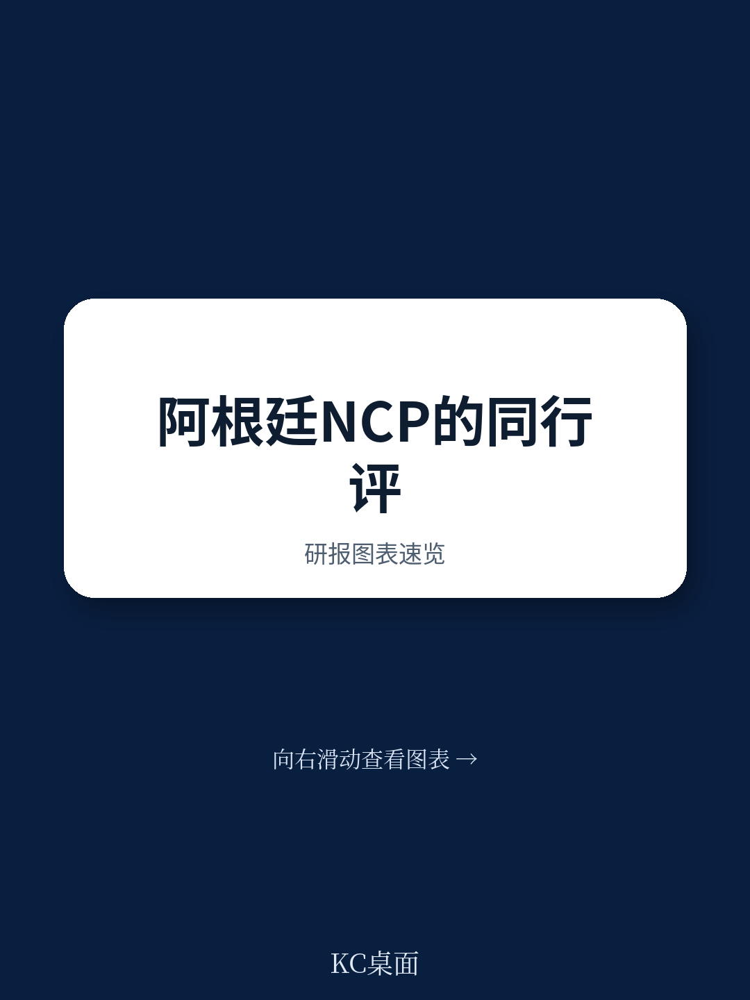
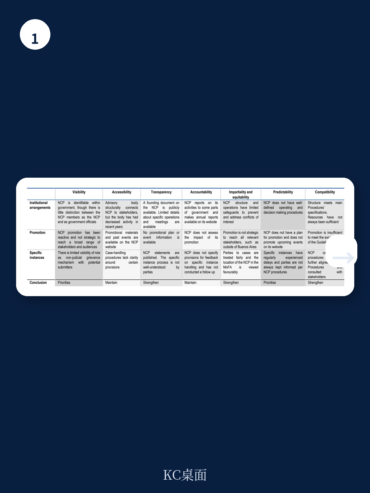
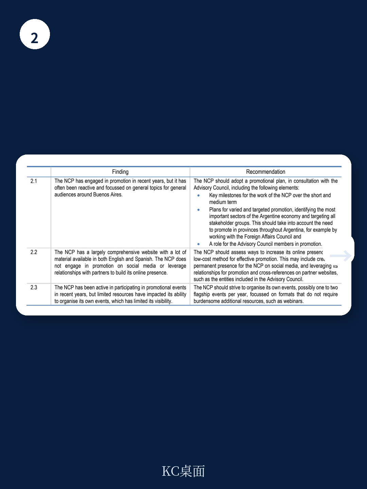

# 经合组织：经合组织支招阿根廷，NCP重建信任需先修复基础

阿根廷负责任商业行为国家联络点（NCP）正面临一个结构性矛盾：制度设计有潜力，但执行资源在过去五年被砍掉一半以上。经合组织2026年发布的同行评审报告指出，这个设在阿根廷外交部的机构目前只有0.85个全职人力，远低于2021年的1.75个。人力不足直接导致推广活动被动、案件处理量下降、利益相关方信任度走低。

这份报告的价值不在于批评，而在于它提供了一个可操作的修复路径：从法律基础、咨询委员会运作、到案件处理程序的全面更新。对在阿根廷运营的跨国公司、人权组织以及关注拉美负责任商业实践的观察者来说，这份报告揭示了NCP机制在实际运作中的典型困境。

## 1. 咨询委员会“有名无实”，制度设计未转化为实际影响力

阿根廷NCP在2000年成立，2006年通过部长决议获得法律基础。其制度设计中的一个亮点是设立了咨询委员会，理论上应包括企业、工会、公民社会和政府代表。但报告发现，这个委员会自2019年通过决议成立以来，从未就NCP的推广计划或具体案件处理被真正召集过。网站上列出的委员会成员信息已经过时，也没有明确的职权范围。

这意味着什么？利益相关方反馈显示，NCP的实际运作并未鼓励外部参与。一个不运作的咨询委员会，不仅浪费了制度设计的潜力，还会让外界认为NCP缺乏透明度和包容性。对于希望利用NCP作为非司法申诉机制的企业和公民社会组织来说，这种不确定性本身就是障碍。

> **KC评论：** 咨询委员会空转是许多新兴地区NCP的共性问题。经合组织的建议很具体：先明确职权范围，再定期开会，最后把委员会成员变成推广活动的“放大器”。完整报告里关于委员会组成和会议频率的建议，值得正在建设类似机制的国家仔细看。

## 2. 资源缩水导致推广被动，案件处理量下降形成恶性循环

人力从1.75个FTE降至0.85个，没有独立预算，完全依赖外交部常规经费——这是阿根廷NCP面临的资源现实。结果是：过去三年没有制定推广计划，活动多是被动受邀参与，且集中在布宜诺斯艾利斯周边。自2000年以来共受理15起具体案件，其中10起是2011年后收到的，过去五年仅1起。13起已结案件中，只有2起达成协议。

报告认为，案件提交量下降和结案结果不理想，可能降低了潜在申诉者对这一机制的信心。当NCP既没有资源主动推广，又无法在案件中产生有影响力的结果时，它就陷入了“低可见度—低使用率—低影响力”的循环。

> **KC评论：** 案件数量少不一定代表问题少，更可能代表机制失效。报告提到，阿根廷NCP需要与企业、潜在申诉者重建信任。一个值得追问的问题是：在资源受限的情况下，NCP应该优先提升案件处理质量，还是先扩大推广覆盖范围？报告给出的答案是两者都要，但顺序是先修复基础。

## 3. 2023年指南更新后的程序修订，仍缺少关键利益相关方参与

2023年经合组织更新了《跨国企业负责任商业行为指南》，阿根廷NCP随即在2025年修订了自己的案件处理程序。但报告指出，这次修订没有经过利益相关方协商，且新程序与2023年指南的完全对齐仍有差距。特别是在透明度条款上，利益相关方希望更清晰的说明。

这引出一个更深层的问题：NCP作为政府设立的促进性机制，其公信力不仅来自程序本身，还来自程序制定的过程。如果修订程序只在外交部内部完成，即使内容正确，也难以获得外部信任。

## 4. 报告尚未完全回答的关键问题：资源困境如何真正突破

报告建议阿根廷外交部逐步恢复NCP的人力资源，确保至少有一名全职、非轮岗的工作人员。但报告没有展开的是：在阿根廷当前财政约束下，这种资源恢复的政治可行性有多高？NCP是否可以考虑与其他政府部门或国际组织合作，以共享资源的方式降低成本？

另一个未解的问题是：NCP如何处理与国内其他申诉机制（如司法系统）的关系？报告提到几起案件因平行诉讼而被搁置，但未给出系统性的协调建议。

对于读者来说，这份报告提供了一套观察框架：评估一个国家NCP的有效性，不应只看其制度文本，而要看咨询委员会是否真运作、资源是否匹配、案件处理是否透明、推广是否走出首都。阿根廷NCP的现状，恰恰是许多发展中国家NCP面临的典型困境的缩影。

---

For informational purposes only. Portions may be generated,translated,summarized,or edited with AI assistance based on source materials and may contain omissions or errors. Please verify independently. This is not investment,legal,tax,accounting,or other professional advice.
