OVERVIEW

2026

World
Investment
Report

International Investment in a Turbulent Era

# © 2026, United Nations

This work is available through open access, by complying with the Creative Commons licence created for intergovernmental organizations, at http://creativecommons.org/licenses/by/3.0/igo/.

The designations employed and the presentation of material on any map in this work do not imply the expression of any opinion whatsoever on the part of the United Nations concerning the legal status of any country, territory, city or area or of its authorities, or concerning the delimitation of its frontiers or boundaries.

Photocopies and reproductions of excerpts are allowed with proper credits.

This publication has been edited externally.

United Nations publication issued by the United Nations Conference on Trade and Development

UNCTAD/WIR/2026 (Overview)

## Contents

Preface ....iv
Foreword....v

  
Page 1
International investment trends

  
Page 7
Investment policy trends

  
Page 11 International investment in a turbulent era: Trends and policy response

Annex table. FDI flows 20

# World Investment Report 2026 International Investment in a Turbulent Era Overview

## Preface

Our world has entered a period of profound turbulence – reflected in seismic shifts in the global investment landscape.

In 2025, global foreign direct investment rose by 6 per cent to reach \$1.6 trillion. But this growth masks underlying fragility and disparities across countries, regions and sectors.

Investment expansion was driven largely by a small number of megaprojects, particularly infrastructure related to artificial intelligence. Across most sectors, new project activity is subdued, reflecting heightened investor uncertainty amid geopolitical tensions, trade policy volatility, the rising cost of capital and intensifying technological competition.

At the same time, global investment is being reshaped by fault lines in international cooperation and rising economic security concerns. In response, governments are focusing on a narrow set of strategic sectors, while firms are redesigning supply chains along regional and geopolitical lines.

The opportunities — and risks — are many. Developing economies may break into new high-growth industries, including clean energy and advanced manufacturing, but investment could become concentrated, leaving many behind.

Monitoring by UNCTAD shows that governments are becoming increasingly active in shaping investment flows, with new investment policy measures reaching a record high in 2025. Among those measures are strong support for strategic sectors, industrial upgrading, digital transformation and the green transition.

Now is the time to reinvigorate international cooperation around investment as a driver of sustainable development, as developing countries build and strengthen the systems their people require. Governments must also rally behind the Sevilla Commitment's global call to address the limited access to finance faced by developing countries, and scale up investment at speed and scale.

The analysis and recommendations of UNCTAD offer important guidance for policymakers and development advocates to navigate an increasingly complex economic environment and harness international investment for sustainable and inclusive growth.

  
António Guterres
Secretary-General of the United Nations

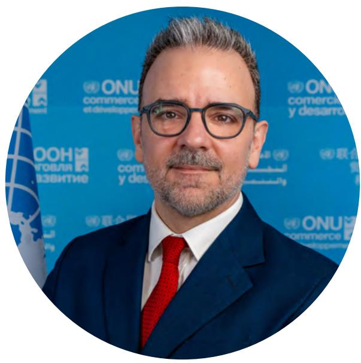

## Foreword

For decades, firms have expanded across borders in a world that was opening up, driving deeper integration, expanding trade and grounded on broadly stable rules.

That world is changing fast.

Today companies are rethinking where they invest as geopolitical tensions, volatile trade policies, technological competition and economic security concerns intensify.

The World Investment Report 2026 shows that global foreign direct investment rose by 6 per cent, to \$1.6 trillion, following declines in two consecutive years. However, growth remains fragile and uneven. Inflows increased by 11 per cent in developed economies, compared with 2 per cent in developing economies, and the outlook remains clouded by trade policy uncertainty and geopolitical tensions.

Investment is also concentrating. A handful of strategic sectors — semiconductors, artificial intelligence, clean energy, critical minerals — now represent almost half of all announced greenfield projects in 2025. However, least developed and lower-middle-income countries together attract barely 10 per cent of them, against more than 20 per cent in other industries.

A deeper change is also shaping global direct investment.

For decades, capital followed cost and efficiency, areas in which developing countries were able to compete. Today, investment follows strategic calculation and industrial policy marked by subsidies, economic security and technological advantage. Governments are competing with new investment policy measures, at a record high in 2025. This logic rewards deep pockets and established ecosystems, and most developing countries cannot match the support that the largest economies now deploy. The hardest challenges today are attracting investment at all, as the aspects driving investment no longer reward the strengths that developing economies have always brought.

# World Investment Report 2026 International Investment in a Turbulent Era Overview

Our report points to the challenges but underlines that the outcome is not inevitable.

The same changes that are concentrating investment are also creating new opportunities. As companies reshape their supply chains, some developing economies are emerging as alternative manufacturing locations, processing hubs for critical minerals and gateways to fast-growing regional markets. These opportunities are real, but they are limited. Taking advantage of them requires infrastructure, skills, technology and institutions that few developing countries can build on their own. However, it is an effort worth making.

Foreign direct investment remains a key driver of development. It brings more than capital into a country: it represents technology transfer, new skills, jobs and access to markets. Behind each flow is a real economy at work – a supplier entering a regional value chain, a young engineer finding opportunities without leaving home.

Meeting this challenge requires deliberate national policy choices – realistic entry points in evolving value chains, and aligning investment, skills, infrastructure and supplier policies, so that capacities grow in a new era of strategic globalization. This will also require renewed international cooperation, with partnerships that balance the resilience that investing countries expect with the development that recipient countries need.

At the XVIIth United Nations Conference on Trade and Development (UNCTAD 16) in October 2025, 170 countries adopted the Geneva Consensus, renewing their commitment to an open, equitable and development-oriented investment environment – a commitment that matters most as fragmentation pressures rise.

The World Investment Report 2026 analyses how rising competition and shifting patterns of investment are reshaping global flows, and the real options available to developing economies.

In this context UNCTAD's unique expertise in analysing the intersection of foreign direct investment and development is especially valuable to best support countries in navigating this challenging investment landscape. The policy choices made today will determine whether foreign direct investment becomes an engine of shared development or entrenches divergence.

Pedro Manuel Moreno
Acting Secretary-General
United Nations Conference on Trade and Development (UNCTAD)

  
International investment trends

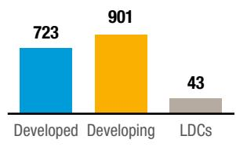

Development level

<table><tr><td>FDI</td><td>+11%</td><td>+2%</td><td>+21%</td></tr><tr><td>Greenfield projects (mostly industry)</td><td>+19%</td><td>-18%</td><td>+56%</td></tr><tr><td>International project finance (mostly infrastructure)</td><td>-12%</td><td>+20%</td><td>+185%</td></tr></table>

Greenfield projects
(Value, billions of dollars)

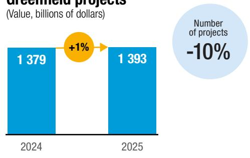  
Cross-border M&As (Value, billions of dollars)

## Regions

International project finance
(Value, billions of dollars)  
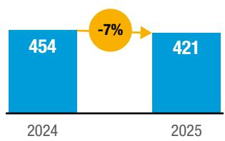

FDI
(Value, billions of dollars)  
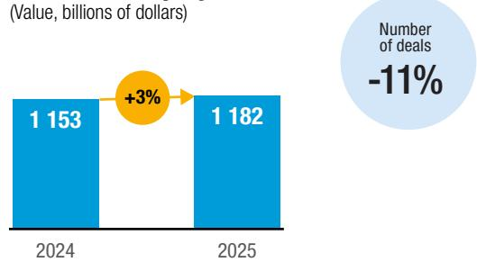

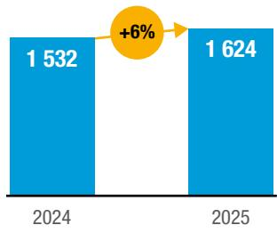

## Industries (Global, project values)

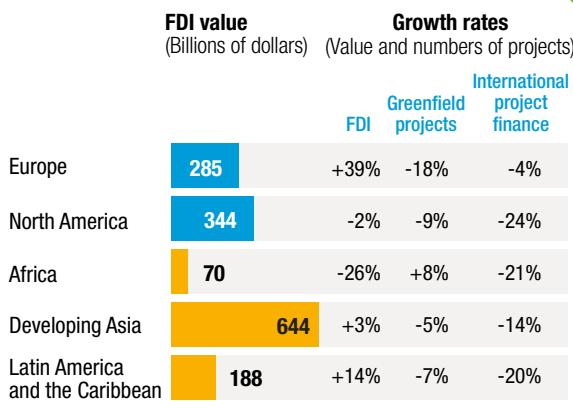

Infrastructure....+11%
GVC-intensive industries ....-13%
Semiconductors....+11%
Digital economy....+47%
Extractives....+8%

SDG sectors (Developing economies, project values)
All sectors, developing economies
Value: -1%
Number: -6%
Infrastructure ....+61%
Renewable energy ....-5%
Water, sanitation and hygiene ....-5%
Agrifood systems ....+69%
Health and education ....-7%

# World Investment Report 2026 International Investment in a Turbulent Era Overview

## Global trends and prospects

Global foreign direct investment (FDI) showed resilience in 2025. Flows rose by 6 per cent to \$1.6 trillion, despite geopolitical tensions, trade policy uncertainty and high financing costs. However, the increase was driven by swings in flows through major financial centres and investment hubs and by stronger inflows in a limited number of large economies. Excluding the conduit flows through major European financial centres, global FDI increased by 4 per cent, after two consecutive years of decline.

Investment activity became more selective and more concentrated. Growth was focused on a limited number of host economies and on capital- and technology-intensive sectors, notably digital infrastructure, semiconductors and selected energy-related activities. The top 20 host economies accounted for more than 80 per cent of global inflows in 2025, reflecting the continued concentration of investment in large markets, advanced economies and financial centres, and investment hubs. The composition of the top 20 recipients shifted only modestly, with developing economies representing half of them.

Project-level indicators point to fragile underlying investment conditions. Cross-border mergers and acquisitions (M&As) values declined by 7 per cent, despite strong domestic deal-making. Greenfield project announcements remained close to their 2024 level but were supported mainly by megaprojects in data centres, oil and gas, and semiconductors. International project finance deals halted a three-year decline, with values rising by 3 per cent, but remained about 25 per cent below the 2021 peak; deal numbers declined.

FDI remains the largest source of external finance for developing economies. In 2025, it accounted for about half of their total external financing, ahead of remittances, official development assistance and portfolio flows. Its development role is distinct through its links to productive capacity, technology transfer and participation in global value chains (GVCs).

FDI flows to structurally weak and vulnerable economies remained largely confined to a small number of resource-rich countries. While inflows to least developed countries (LDCs) increased by 21 per cent, they remained modest in small island developing States, concentrated mainly in tourism, renewable energy and logistics. Overall, the persistent low share of FDI in LDCs and its skewed distribution highlight the ongoing challenges in mobilizing investment for economies with smaller markets, higher perceived risks and weaker integration in high-growth sectors.

The outlook for FDI in 2026 is highly uncertain, with significant downside risks. Slower global growth, trade policy uncertainty, geopolitical tensions and conflicts are likely to weigh on investment decisions, leading firms to cancel, suspend or delay projects. Although strong profits among the largest multinational enterprises could support some investment, productive investment activity is likely to remain subdued and uneven. The strong balance sheets of leading firms may support investment in high-value industries but risk further concentrating FDI in a narrow set of sectors and locations.

## Regional trends

Flows to developed economies rose by 11 per cent, to about \$723 billion. The increase was concentrated in Europe, supported by flows through financial centres and investment hubs. In the European Union, cross-border M&A activity and large investment projects took place in a few countries, notably France and Germany. Flows to North America remained broadly stable, supported by continued investment in strategic industries but affected by weaker M&A and project finance activity. Other developed economies also remained broadly stable. Across developed economies, greenfield project values increased even as project numbers fell, pointing to fewer but larger projects concentrated in capital- and technology-intensive sectors such as semiconductors, data centres, clean energy, batteries and advanced manufacturing.

FDI inflows to developing economies rose by 2 per cent, to \$901 billion. Developing Asia remained the largest recipient among developing regions, while Africa, Latin America and the Caribbean, and structurally weak and vulnerable economies showed diverse trends:

In Africa, FDI inflows stood at about \$70 billion, down from the exceptional \$94 billion recorded in 2024, which had been lifted by a small number of very large transactions. Inflows remained about one third above the region's 2010–2024 average and represented the third-highest level since 1990. Greenfield project values fell by almost one third, but project numbers increased, pointing to broader engagement through smaller projects. Investment remained concentrated in energy infrastructure, extractives, renewable energy and critical minerals.

▶ Developing Asia remained the largest recipient among developing regions, with inflows increasing marginally to \$644 billion. The increase masked divergent trends: inflows declined in East Asia, including China, but rose in South-East Asia, South Asia, West Asia and Central Asia. South-East Asia became the largest recipient subregion, while India drove strong growth in South Asia, with inflows up 44 per cent. FDI remained highly concentrated: 8 of the top 10 developing-economy recipients were in developing Asia.

FDI inflows to Latin America and the Caribbean rose by 14 per cent, to \$188 billion, driven by investment in South America – particularly in Brazil. Investment remained highly concentrated, with the top 10 recipient economies accounting for 95 per cent of regional inflows. Stronger inflows were not matched by new project activity: the value of announced greenfield investment fell by about one third, to less than \$120 billion, with declines concentrated in manufacturing and logistics.

FDI flows to structurally weak and vulnerable economies continued to be limited, volatile and highly concentrated. Inflows to LDCs increased to \$43 billion, or 2.7 per cent of global FDI flows. Landlocked developing countries experienced a 2 per cent decrease, but small island developing States saw a 4 per cent increase. In all three groups, investment was largely concentrated in a few economies and often confined to resource-rich countries, with only limited and sector-specific flows, notably in renewable energy and logistics, and levels remained far below development needs.

## Sectoral highlights

Growth in announced greenfield projects and international project finance in 2025 was driven largely by digital infrastructure. Greenfield project values in digital infrastructure rose by more than 80 per cent, mainly for data centres. Project values in oil and gas and in semiconductors also increased, but on a much smaller scale. Most other sectors registered significant declines in greenfield investment and international project finance, including renewable energy, other infrastructure segments and GVC-intensive manufacturing.

Announced greenfield investment in GVC-intensive manufacturing industries fell 13 per cent, amid policy uncertainty and supply chain reconfiguration trends. $^{1}$ Several of these industries were more affected: project values in electronics, excluding semiconductors, fell by nearly 40 per cent, in automotive by roughly 25 per cent, and in textiles, clothing and leather by about 30 per cent.

Investment related to the Sustainable Development Goals picked up, particularly in LDCs, but the rebound remained uneven across sectors, economies and investment modes. In developing countries the value of announced greenfield projects rose by 11 per cent and that of international project finance deals by 26 per cent, with growth driven mainly by telecommunications. While renewable energy investment slowed in developing countries overall, both values and project activity increased in LDCs, albeit from a low base. Investment in other Goals-relevant investment sectors, including transport, water and sanitation, health and education, continued to lag – particularly in project numbers.

Digital infrastructure bucked the trend

+80% growth in greenfield project values

## Major investor trends

The global landscape of foreign direct investors is becoming more diverse. Alongside traditional multinational enterprises (MNEs), State-owned MNEs and private equity investors are playing more important roles in FDI.

The top 100 non-financial MNEs are increasingly driven by firms operating in sectors considered strategic in their home economies. Technology and pharmaceutical MNEs expanded their foreign assets by more than 10 per cent in 2025 and strengthened their position in the top 100 ranking. Over the past decade, MNEs from East Asia and developing economies have emerged among the fastest-internationalizing firms – as measured by share of foreign assets in total assets – particularly in the technology, manufacturing, infrastructure and renewable energy sectors.

State-owned MNEs are regaining prominence in international investment since the COVID-19 pandemic. They account for more than a quarter of the top 100 MNEs in the 2025 ranking, and half of the leading MNEs based in developing economies. Their international acquisitions, often undertaken through consortia involving private and institutional investors, are becoming an increasingly important component of global FDI.

Private equity is emerging as a major channel of international investment. In 2025, cross-border private equity transactions reached nearly \$200 billion, with international equity acquisitions accounting for about 20 per cent of global mergers and acquisitions. Although developing economies receive only a small share of private equity investment, activity there is concentrated in technology and other high-growth sectors, creating opportunities for innovation and growth.

  
Investment policy trends

## Investment policymaking reached a record high in 2025, with a rise in the share of restrictive measures

Number of measures by nature

■ Measures favourable to investors
■ Restrictive measures 229

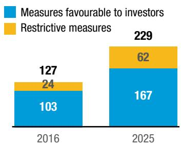  
Share of restrictive measures, world

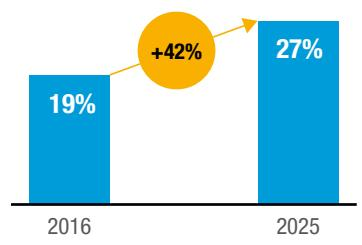

## Incentives dominated favourable measures while FDI screening continued to expand

Measures favourable to investors, 2025

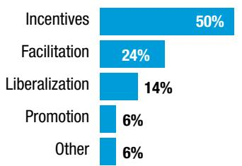  
Restrictive measures, 2025

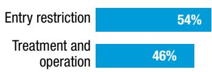  
Number of economies with an FDI screening regime

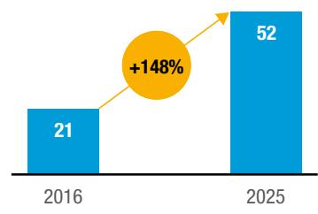

## Investment agreement content is evolving: recent treaties more often emphasize investment facilitation and cooperation.

IIA cooperation provisions

IIA facilitation provisions

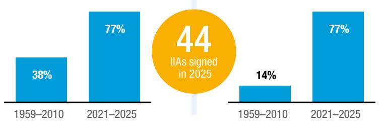  
IIA protection provisions

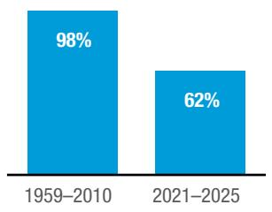  
Most of the 1,463 investor–State arbitration cases have relied on old-generation investment agreements. In 2025, almost 80 per cent of new cases were brought against developing countries.  
IIAs invoked in total ISDS cases, by year of signature

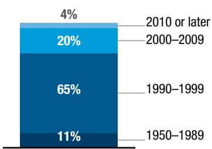  
Parties involved in 2025 cases

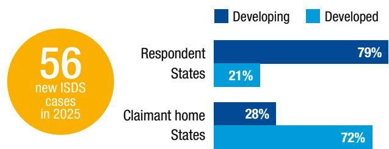

## National investment policies

In 2025, national investment policymaking became more active and more selective. The number of new measures reached a record high (229) amid heightened global uncertainty. Most of them remained favourable to investors (73 per cent), increasingly in the form of targeted incentives, facilitation and selective liberalization aimed at channeling investment towards strategic sectors such as clean energy, digital infrastructure, advanced manufacturing and critical minerals. Yet, restrictive measures continued to expand, especially through tighter investment screening, new entry restrictions, scaled-back incentive regimes and new localization requirements. These trends point to a more proactive approach, in which investment policy is used to pursue objectives of industrial development, economic security, resilience and domestic value creation.

Investment incentives accounted for a record 50 per cent of all measures favourable to investors in 2025 and became more targeted. Incentives were the largest category of favourable measures. They were increasingly directed at priority sectors, technologies and projects, often linked to performance criteria, and closely aligned with structural transformation objectives for clean energy, digital infrastructure, advanced manufacturing, critical minerals, infrastructure and strategic services. The global minimum tax initiative also began to reshape the design of investment incentives in developing countries.

Investment policy is becoming more selective and strategic

Investment facilitation remains a key tool for attracting and retaining investment amid continued uncertainty. It represents the second largest category of favourable measures. Countries turned to administrative simplification, improved investor services and stronger implementation mechanisms. Liberalization also continued in a selective form, with Asia recording the highest number of measures, focused on infrastructure, services and other priority activities.

Restrictive measures expanded further, especially in strategic and sensitive areas. In developed countries, they were driven mainly by the continued expansion of foreign investment screening for national security – covering both inbound and outbound investment. The number of economies operating a screening regime rose to 52, up from 21 a decade ago. Outright rejection of screened projects remains rare, at fewer than 1 per cent of cases reviewed. In developing countries, new entry restrictions in sensitive sectors gained prominence alongside operational requirements such as local employment, local content and procurement rules, reflecting efforts to strengthen domestic spillovers from foreign investment. Some restrictive measures also reflected broader efforts to rationalize incentives, improve fiscal sustainability and enhance the effectiveness of support schemes.

The overall pattern confirms a structural shift in investment policymaking. Governments continue to seek investment, but often on more selective terms, in targeted sectors and under specific conditions. This points to a more strategic, conditional and proactive approach. For developing countries, this shift raises the stakes of designing investment policies that are both strategic and competitive.

A shift
towards targeted
incentives and
tighter investment
screening

## International investment policies

In 2025, countries continued to conclude international investment agreements (IIAs) despite heightened global uncertainty. They signed 44 agreements, bringing the global IIA universe to more than 3,360 treaties and returning the annual number signed to pre-pandemic levels. Nearly half of these treaties (47 per cent) were broad economic agreements, reflecting a shift from stand-alone investment treaties towards frameworks that cover wide-ranging governance issues. At least 34 IIAs entered into force and 9 were terminated, bringing the total number of IIAs in force to at least 2,661.

The scope and content of IIAs is evolving, with a focus on facilitation and cooperation provisions. Agreements signed between 2021 and 2025 emphasize investment facilitation and cooperation (77 per cent of agreements), while traditional investment protection has become less dominant (62 per cent). Institutional frameworks for cooperation, including for specific sectors such as agriculture, the digital economy or energy, and facilitation provisions aimed at improving the regulatory environment gained the most ground. Liberalization and promotion provisions are also more common in recently concluded IIAs, and these agreements refine investment protection standards and dispute settlement.

International investment commitments play an important role in shaping the governance of critical minerals. They can have significant implications for host countries' policy and regulatory space. While such commitments can constrain governments' ability to regulate the extraction, processing and industrial use of critical minerals, they can also support industrialization and investment objectives when aligned with national development strategies for these strategic resources.

Investor-State arbitration cases reached a total of 1,463. Almost all of them – 96 per cent – were based on old-generation treaties concluded before 2010. In 2025, investors initiated 56 arbitrations. About 80 per cent of the new cases were brought against developing countries – higher than the average share of previous years. Disputes related to extractive activities, including the mining of critical minerals, accounted for about one third of cases.

UNCTAD is developing guiding principles to facilitate the reform of IIAs. International investment policymaking is taking place within an increasingly complex landscape, requiring accelerated reform to ensure that IIAs contribute to greater flows of sustainable investment while balancing host States' right to regulate with investors' need for certainty. To support this process, UNCTAD is developing a set of guiding principles that will serve as an overarching framework for policymakers, facilitating reform efforts while placing sustainable development at the centre of the international investment regime.

International investment in a turbulent era: Trends and policy response

## Top factors affecting FDI in the last three years

UNCTAD IPA survey 2026, share of respondents

Geopolitical tensions or conflicts  
Global economic slowdown  
Trade policy uncertainty  
Changes in industrial policies or subsidies in major economies  
Climate- or sustainability-related regulations  
Investment screening or national security  
Regional trade agreements  
Other

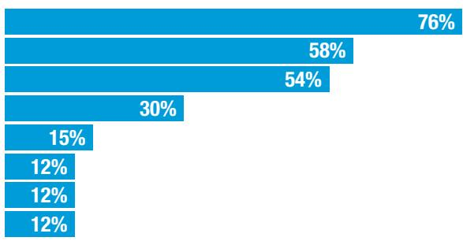  
...but is highly concentrated
Concentration at the top...
marginalization at the bottom

## FDI in strategic sectors is booming...

Growth of announced greenfield projects in strategic sectors (Billions of dollars and percentage)

## Manufacturing declines, hitting developing countries harder

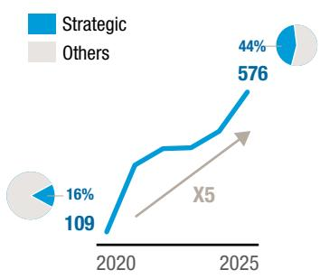  
Top three investors  
Top three recipients

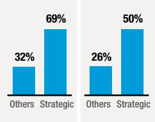  
Low-income and lower-middle-income recipients

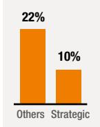  
Share of value of announced greenfield projects, 2020–2025  
Value of announced greenfield projects in manufacturing, non-strategic sectors (Billions of dollars and percentage)

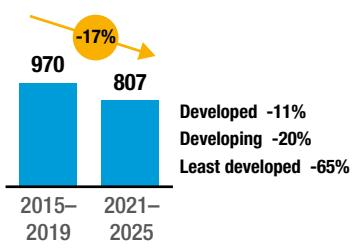  
Industrial policy interventions are increasing  
Average annual number by type

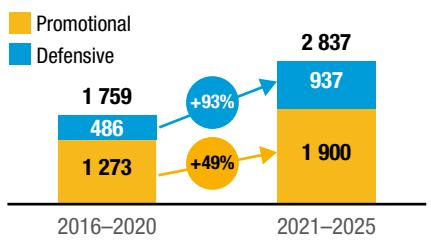

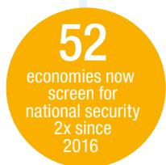

## Essential security exceptions appear more and more in international investment agreements

Share of agreements with exception

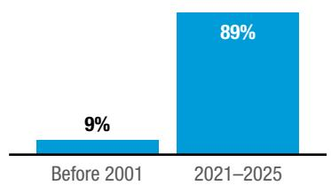

## Major economies dominate industrial policy activity

Share of policy interventions by economy and economy grouping, 2015–2024

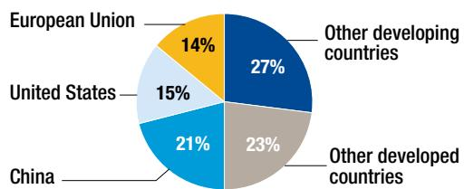  
Value of firm-specific subsidies, 2015–2024 (Billions of dollars)

## Subsidies are rising globally, but unevenly

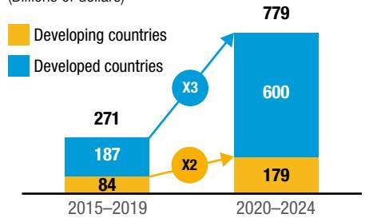

Geopolitical tensions, trade policy uncertainty and heightened economic security concerns are reshaping the environment for cross-border investment. As firms navigate a more uncertain global economy, investment decisions are increasingly influenced not only by efficiency and market access, but also by risk management considerations related to supply chain resilience, technological competition and shifting trade barriers.

  
Global uncertainty is changing investment decisions

Two broad trends stand out. First, FDI has expanded rapidly in sectors increasingly viewed as strategic from the perspective of technological competition, industrial policy and economic security. In this report, these sectors are AI infrastructure and AI-related technologies, advanced and sensitive technologies, critical minerals, energy transition technologies and services, and semiconductors. Second, the reconfiguration of global supply chains is increasingly shaping investment patterns in manufacturing industries. The result is a more selective, more concentrated and more complex global FDI landscape, with significant consequences for developing countries.

## Growth of international investment in strategic sectors

Strategic sectors have expanded rapidly, increasing their share of global greenfield investment from 16 to 44 per cent since 2020. The value of announced greenfield projects in these sectors rose from \$109 billion in 2020 to \$576 billion in 2025. This expansion reflects distinct but interconnected investment waves.

AI infrastructure is the largest strategic investment sector, while semiconductors is the fastest-growing one. AI infrastructure and AI-related technologies accounted for 60 per cent of total greenfield investment in strategic sectors in 2025, driven by the scale-up of data centres, cloud infrastructure and related digital infrastructure. Investment in semiconductors expanded at an annual rate of 54 per cent between 2020 and 2025, reflecting their central role in digital infrastructure and advanced manufacturing. Critical minerals, energy transition technologies and other advanced technologies also recorded solid growth.

Strategic sectors display markedly different investment patterns. Investment in AI and advanced technologies is concentrated around major digital markets and technology hubs, with the United States leading outward investment and Europe emerging as the main recipient location. Semiconductor investment follows a different pattern, shaped by the concentration of production capabilities among a small number of leading firms and manufacturing hubs. Critical minerals investment links resource-rich economies with processing centres, with China playing a prominent role both as an investor and across downstream supply chains. Energy transition technologies are organized around cross-border manufacturing chains spanning batteries, components and final assembly, increasingly connecting major markets with new production platforms.

AI and semiconductors are reshaping global FDI flows

Across these diverse strategic sectors, investment remains highly concentrated. During 2020–2025, the average share of the top three investor economies across these sectors was 69 per cent of global greenfield project values. The average share of the top three recipient economies was 50 per cent. Their shares in other sectors were 32 per cent and 26 per cent, respectively.

# World Investment Report 2026 International Investment in a Turbulent Era Overview

Many developing countries remain largely excluded from the strategic investment boom. Low-income and lower-middle-income economies together attract only about 10 per cent of global greenfield investment in strategic sectors, compared with more than 20 per cent in other sectors. While some strategic industries offer entry points through natural resources, manufacturing platforms or growing digital markets, the rapid concentration of investment risks widening existing development gaps.

## Industrial policy and economic security measures

Industrial policy is expanding and becoming more explicitly linked to economic security, technological leadership and geopolitical factors. Industrial policy is not new, but its scale, scope and connection to economic security have changed. The annual average number of industrial policy interventions globally grew by 60 per cent between 2016–2020 and 2021–2025. Subsidies, tax incentives, local content requirements, public procurement and other support measures are increasingly used to attract, retain and shape investment in strategic sectors. In developed economies, these policies more often reflect national and economic security concerns; in developing economies, they are more commonly framed around industrial upgrading, structural transformation and employment creation.

Industrial policy is increasingly driven by economic security

Industrial policy interventions are concentrated among a small number of large economies. Together, China, the United States and the European Union account for half of industrial policy interventions recorded over the past decade. Their approaches differ, but their combined effect is to concentrate support in economies with large markets, advanced capabilities and the fiscal space to deploy large-scale incentives. This makes competition for strategic investment increasingly asymmetric.

Investment screening on national security grounds has expanded rapidly. Most developed economies now operate case-by-case review mechanisms. Recent reforms have broadened the scope of screening beyond defence-related assets to include critical technologies, data infrastructure, supply chain chokepoints and systemic dependencies. Outbound investment controls have also expanded, reflecting concerns about the diffusion of critical technologies and know-how.

Although outright rejections remain rare, screening now affects a widening set of projects. Screening volumes have risen sharply in all countries for which data are available. This raises compliance costs and uncertainty concerns for investors and increases administrative burdens for public authorities.

In developing economies, FDI screening is also expanding, but from a lower base. Ten developing economies now operate dedicated screening regimes, more than half of them adopted since 2020. Most developing economies continue to rely primarily on equity caps, sectoral restrictions and entry bans rather than risk-based, case-by-case review. The policy challenge is to address genuine security risks without creating broad restrictions that discourage productive investment. Proportionate, transparent and risk-based oversight can help preserve openness while protecting sensitive assets.

# World Investment Report 2026 International Investment in a Turbulent Era Overview

Geopolitical tensions and industrial policy objectives are highlighting the regulatory constraints arising from old-generation IIAs. This has led countries to recalibrate their recently concluded IIAs to preserve policy space for security-related measures. Essential security exceptions in IIAs have become increasingly prevalent – present in about 90 per cent of agreements concluded after 2020. At the same time, recent instances of expansive reliance on these exceptions in international economic relations have brought forward the need for a balanced approach that can prevent abuse.

## Manufacturing investment and supply chain reconfiguration

Manufacturing FDI is becoming more selective

Manufacturing FDI is increasingly shaped by policy uncertainty, supply chain resilience and exposure to tariff changes. The value of global greenfield investment in the manufacturing sector, excluding the strategic sectors analyzed in the report, declined by 17 per cent between 2015–2019 and 2021–2025. The decline points to weaker expansion of international production networks. The process is selective, with some economies benefiting from diversification and relocation, while others face project cancellations and downsizing. Firms are adjusting investment locations to manage risks, maintain market access and respond to changing policy environments. Tariff measures may further accelerate supply chain reconfiguration, particularly where a sizable share of investment is concentrated in activities exposed to tariff changes.

Geographic proximity is not yet emerging as a major driver of supply chain reconfiguration. Despite expectations of nearshoring, investment in geographically proximate locations, including intraregional investment, has not increased consistently across regions. Current reconfiguration trends do not suggest a widespread move towards regionalized investment patterns.

Supply chain reconfiguration is reshaping investment in manufacturing industries in different ways. FDI in information and communication technologies and in electronics and electric vehicles is expanding into new locations, while FDI in life sciences – which continues to grow – remains concentrated in a small number of advanced hubs. Investment in intermediate inputs, materials and industrial manufacturing activities is diversifying across a wider range of production hubs. By contrast, labour-intensive and cost-driven industries – including agribusiness, consumer goods, textiles and parts of transport equipment manufacturing – are experiencing both declining investment and greater concentration.

Manufacturing entry points are narrowing for developing countries. The value of manufacturing greenfield investment declined by about 11 per cent in developed economies between 2015–2019 and 2021–2025, by 20 per cent in developing economies and by 65 per cent in LDCs. As labour-intensive and cost-driven industries lose momentum, opportunities to attract FDI, to build productive capacity and to integrate into international production networks are becoming increasingly constrained for countries at earlier stages of development.

## Development implications and policy responses

Development strategy must address a threefold challenge: capturing limited and selective opportunities, reducing exposure to new vulnerabilities and building the capabilities required to participate in more selective and resilience-oriented production networks.

The World Investment Report 2026 sets out five practical areas for action in navigating this more complex investment landscape, taking into account differences in countries' capacities, economic structures and development levels.

Identifying clear priorities and realistic entry points. Developing countries should focus on a limited number of promising and feasible opportunities where they have, or can realistically build, competitive advantages. This requires moving beyond broad sector labels towards specific activities, value chain functions, locations or clusters where investment is plausible. Prioritization should be evidence-based and adaptive, drawing on diagnostics, investor feedback, investment promotion agency experience and regular reassessment, so that priorities can evolve as technologies, standards and market conditions change.

Focusing industrial policy support on reducing investment bottlenecks and raising the development impact of FDI. For most developing countries, the central issue is not how to match large-scale subsidy programmes adopted by large economies, but how to use limited public resources to improve investment viability, reduce bottlenecks and raise the development impact of FDI. Better-governed incentives, enabling infrastructure, skills upgrading, supplier development, improved standards and catalytic public finance can help crowd in private investment and help raise the impact of FDI. In this context, incentive regimes should be transparent, targeted, performance-based and periodically evaluated, to ensure that scarce fiscal resources remain aligned with development priorities.

Managing national security concerns while preserving an open investment environment. As security considerations expand to critical infrastructure, data, technologies and strategic assets, developing countries need tools to address genuine risks without reverting to broad restrictions that discourage productive investment. Targeted authorization and risk-based review can provide alternatives to general bans, provided they are narrowly scoped, transparent and supported by adequate institutional capacity.

Turning shocks into opportunities for strategic repositioning. During periods of trade and financing uncertainty or supply chain pressure, immediate policy responses should help preserve viable projects and prevent temporary uncertainty from turning into permanent investment losses. Stronger aftercare, investor retention services and policy advocacy by investment promotion agencies can identify operational constraints early. Over time, well-serviced industrial sites, efficient customs and logistics services, supplier development and workforce upgrading can help countries position themselves as credible locations for backup, complementary or alternative production.

Building resilience

is central to
investment
promotion
strategies

Using regional integration to strengthen both the attraction of FDI and its development impact. Regional trade and investment frameworks can expand markets, reduce transaction costs and connect firms to wider supplier and logistics systems. Yet regional integration efforts can fall short of expectations in the absence of infrastructure connectivity, efficient border management, investment facilitation, institutional coordination and productive capacity. The development opportunity lies in using regional platforms, corridors, industrial zones and supplier networks to build more credible investment propositions and deepen regional production linkages.

## International cooperation: The search for the commons

In a more contested and uneven investment environment, international cooperation remains essential. However, it needs to focus on practical areas of shared interest. These “commons” can help preserve transparency and predictability for cross-border investment, while leaving countries space to pursue resilience, security and development objectives. The World Investment Report 2026 calls for several key and practical international cooperation initiatives:

▶ A global monitoring mechanism to improve timely and comparable reporting on policy measures that affect cross-border investment. Such a mechanism could strengthen transparency on trade, industrial and economic security measures that influence investment decisions. Better information would help countries anticipate policy shifts, adapt investment strategies and reduce uncertainty for investors.

▶ Policy guidelines and principles for security-related investment measures. These could support clearer definitions of sensitive activities, transparent procedures, proportionality, confidentiality safeguards, reasonable timelines and periodic reassessment. The aim would be to make security-related measures more predictable, more targeted and less distortive.

International cooperation
remains
essential

Joint project preparation and risk-sharing platforms for productive investment in developing countries. Multilateral development banks, development finance institutions and export credit agencies could coordinate support for bankable projects in industrial infrastructure, renewable power for industry, logistics, digital connectivity, supplier upgrading and selected strategic processing activities.

Facilities for supplier upgrading and standards support to help domestic firms connect to reconfigured production networks. Regional frameworks and institutions could help firms meet certification, quality, traceability, digital and logistics requirements. This would make regional integration a more effective platform for attracting and embedding investment.

▶ Accelerate reform of international investment agreements to safeguard essential security interests. Reform efforts should ensure that countries retain adequate policy space for legitimate and evolving security objectives, including those related to critical minerals, supply chain resilience, and emerging technologies, while minimizing misuse of security exceptions and promoting sustainable investment.

▶ Global investment partnerships to structure cooperation between home and host countries in evolving supply chains. Such partnerships would help align security-of-supply objectives with host-country development priorities, including local value addition, supplier upgrading and skills development.

To advance the commons, UNCTAD will convene discussions with all relevant stakeholders and explore concrete solutions at the 9 $^{th}$ World Investment Forum.

## Annex table FDI flows

(Billions of dollars and percentage)

<table><tr><td rowspan="2">Region</td><td colspan="3">FDI inflows</td><td colspan="3">FDI outflows</td></tr><tr><td>2023</td><td>2024</td><td>2025</td><td>2023</td><td>2024</td><td>2025</td></tr><tr><td>World</td><td>1 321</td><td>1 532</td><td>1 624</td><td>1 227</td><td>1 651</td><td>1 864</td></tr><tr><td>Developed economies</td><td>463</td><td>649</td><td>723</td><td>725</td><td>1 070</td><td>1 191</td></tr><tr><td>Europe</td><td>57</td><td>204</td><td>285</td><td>216</td><td>448</td><td>638</td></tr><tr><td>European Union</td><td>-7</td><td>231</td><td>164</td><td>23</td><td>458</td><td>496</td></tr><tr><td>Other Europe</td><td>64</td><td>-27</td><td>121</td><td>193</td><td>-9</td><td>143</td></tr><tr><td>North America</td><td>312</td><td>351</td><td>344</td><td>261</td><td>346</td><td>317</td></tr><tr><td>Other developed economies</td><td>94</td><td>94</td><td>94</td><td>247</td><td>276</td><td>235</td></tr><tr><td>Developing economies</td><td>858</td><td>883</td><td>901</td><td>503</td><td>581</td><td>673</td></tr><tr><td>Africa</td><td>55</td><td>94</td><td>70</td><td>0.2</td><td>3</td><td>2</td></tr><tr><td>Asia</td><td>624</td><td>623</td><td>644</td><td>466</td><td>547</td><td>613</td></tr><tr><td>Central Asia</td><td>7</td><td>4</td><td>5</td><td>1</td><td>-4</td><td>1</td></tr><tr><td>East Asia</td><td>296</td><td>270</td><td>238</td><td>299</td><td>317</td><td>316</td></tr><tr><td>South Asia</td><td>34</td><td>34</td><td>46</td><td>14</td><td>25</td><td>36</td></tr><tr><td>South-East Asia</td><td>201</td><td>222</td><td>244</td><td>91</td><td>83</td><td>118</td></tr><tr><td>West Asia</td><td>86</td><td>92</td><td>111</td><td>60</td><td>125</td><td>142</td></tr><tr><td>Latin America and the Caribbean</td><td>178</td><td>165</td><td>188</td><td>36</td><td>31</td><td>57</td></tr><tr><td>Oceania</td><td>0.7</td><td>0.5</td><td>-0.3</td><td>0.4</td><td>0.4</td><td>0.7</td></tr><tr><td>Least developed countries</td><td>34</td><td>36</td><td>43</td><td>1.2</td><td>1.1</td><td>1.0</td></tr><tr><td>Landlocked developing countries</td><td>25</td><td>25</td><td>25</td><td>4</td><td>-2</td><td>3</td></tr><tr><td>Small island developing States</td><td>8</td><td>9</td><td>10</td><td>2</td><td>1.2</td><td>-0.3</td></tr><tr><td colspan="7">Percentage of world FDI flows</td></tr><tr><td>Developed economies</td><td>35.1</td><td>42.4</td><td>44.5</td><td>59.0</td><td>64.8</td><td>63.9</td></tr><tr><td>Europe</td><td>4.3</td><td>13.3</td><td>17.5</td><td>17.6</td><td>27.1</td><td>34.3</td></tr><tr><td>European Union</td><td>-0.5</td><td>15.1</td><td>10.1</td><td>1.9</td><td>27.7</td><td>26.6</td></tr><tr><td>Other Europe</td><td>4.9</td><td>-1.7</td><td>7.4</td><td>15.7</td><td>-0.6</td><td>7.7</td></tr><tr><td>North America</td><td>23.6</td><td>22.9</td><td>21.2</td><td>21.3</td><td>20.9</td><td>17.0</td></tr><tr><td>Other developed economies</td><td>7.1</td><td>6.1</td><td>5.8</td><td>20.2</td><td>16.7</td><td>12.6</td></tr><tr><td>Developing economies</td><td>64.9</td><td>57.6</td><td>55.5</td><td>41.0</td><td>35.2</td><td>36.1</td></tr><tr><td>Africa</td><td>4.2</td><td>6.2</td><td>4.3</td><td>0.01</td><td>0.2</td><td>0.1</td></tr><tr><td>Asia</td><td>47.3</td><td>40.7</td><td>39.6</td><td>38.0</td><td>33.1</td><td>32.9</td></tr><tr><td>Central Asia</td><td>0.5</td><td>0.3</td><td>0.3</td><td>0.1</td><td>-0.2</td><td>0.0</td></tr><tr><td>East Asia</td><td>22.4</td><td>17.6</td><td>14.7</td><td>24.4</td><td>19.2</td><td>17.0</td></tr><tr><td>South Asia</td><td>2.6</td><td>2.2</td><td>2.8</td><td>1.1</td><td>1.5</td><td>1.9</td></tr><tr><td>South-East Asia</td><td>15.2</td><td>14.5</td><td>15.0</td><td>7.5</td><td>5.0</td><td>6.3</td></tr><tr><td>West Asia</td><td>6.5</td><td>6.0</td><td>6.8</td><td>4.9</td><td>7.6</td><td>7.6</td></tr><tr><td>Latin America and the Caribbean</td><td>13.4</td><td>10.8</td><td>11.5</td><td>2.9</td><td>1.9</td><td>3.1</td></tr><tr><td>Oceania</td><td>0.05</td><td>0.03</td><td>-0.02</td><td>0.03</td><td>0.03</td><td>0.04</td></tr><tr><td>Least developed countries</td><td>2.6</td><td>2.3</td><td>2.7</td><td>0.1</td><td>0.1</td><td>0.06</td></tr><tr><td>Landlocked developing countries</td><td>1.9</td><td>1.6</td><td>1.5</td><td>0.3</td><td>-0.1</td><td>0.1</td></tr><tr><td>Small island developing States</td><td>0.6</td><td>0.6</td><td>0.6</td><td>0.1</td><td>0.1</td><td>-0.02</td></tr></table>

The United Nations Conference on Trade and Development – UNCTAD – is the leading body of the United Nations focused on trade and development.

UNCTAD works to ensure developing countries benefit more fairly from a globalized economy by providing research and analysis on trade and development issues, offering technical assistance and facilitating intergovernmental consensus-building.

Standing at 195 countries, its membership is one of the largest in the United Nations system.

World Investment Report 2026

