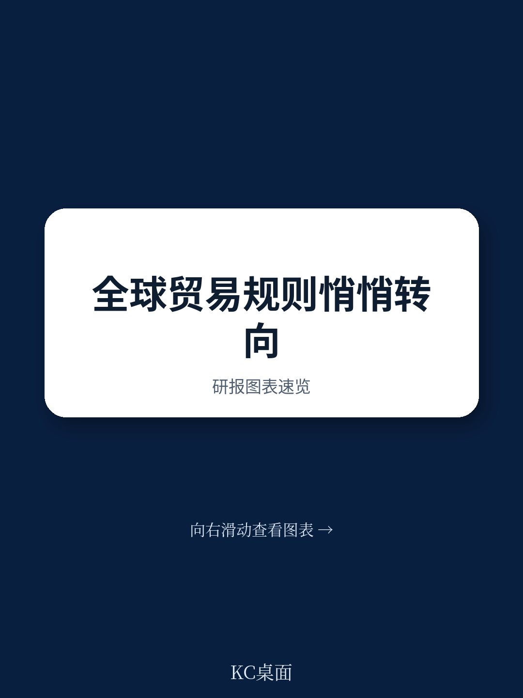

# 世界贸易组织：光伏电池到绿氢电解槽，环境产品贸易壁垒被逐一梳理

全球贸易与环境政策的交汇处，最缺的不是共识，而是可执行的行动框架。世界贸易组织最新发布的《贸易与环境可持续性结构化讨论五年报告》给出了一个清晰信号：经过五年对话，参与方已从“要不要做”进入到“怎么做”的阶段。这份报告的价值不在于提出新目标，而在于为碳定价、绿色补贴、环境产品贸易等争议性议题提供了可比较、可参照的实践清单。

报告由加拿大和哥斯达黎加联合牵头，79个世贸组织成员参与，覆盖从清洁能源转型到循环宏观环境四大工作组。相比过往多边环境谈判的“宣言多、落地少”，TESSD的独特之处在于：它把自己定位为“孵化器和测试实验室”，而非又一个谈判平台。

## 1. 贸易相关气候措施的透明度，正在从原则走向操作

报告最值得关注的产出之一，是工作组对贸易相关气候措施的系统梳理。成员方分享了在碳定价、边境碳调整、税收激励、标准认证、自愿行动等六大类政策设计中的具体做法。这不是一份理论文件，而是各国实际政策的“汇编与映射”。

关键洞察在于：各国在碳计量标准、合格评定程序、认证体系上仍存在显著差异，这正是未来贸易摩擦的潜在爆发点。报告明确提出，信息共享和透明度是降低摩擦成本的最直接路径。对于出口导向型地区而言，理解不同市场的碳核算规则，正在成为合规竞争力的新维度。

> **KC评论：** 这份报告没有给出统一的碳核算标准，但它提供了一份“谁在用哪种方法”的清单。对于企业而言，这意味着未来五年内，供应链碳足迹的披露要求将不再是选择题，而是必答题。报告附录中的具体政策清单值得细读。

## 2. 绿色补贴的“好与坏”，需要更精细的设计框架

补贴工作组是TESSD中最具争议性的议题之一。报告没有回避补贴可能产生的贸易扭曲效应，但也没有简单否定补贴的环境价值。它提出了一个分析框架：从合理性、设计要素、宏观环境影响、实施治理四个维度审视补贴。

这个框架的实用性在于，它为成员方提供了一个自我评估的工具。例如，一个旨在支持可再生能源的补贴，是否同时造成了市场准入障碍？对发展中国家和最不发达国家的差异化影响如何评估？报告收集了多个成员的具体经验，但并未试图达成统一规则，而是鼓励“经验分享和透明度提升”。

这里仍然存在一个未完全回答的关键问题：如何区分“环境友好型补贴”和“贸易保护型补贴”？报告给出了设计原则，但没有提供可量化的判定标准。这意味着，未来围绕绿色补贴的争端解决案例，仍将是规则演化的主要推动力。

## 3. 环境产品与服务的贸易促进，聚焦在具体瓶颈

环境产品与服务工作组的工作方法值得关注：它没有陷入“什么是环境产品”的定义之争，而是采用了目标导向的方法。报告识别了可再生能源领域的若干关键产品，包括光伏电池、风电齿轮箱、水电发电机、绿氢电解槽等，并系统梳理了这些产品的贸易壁垒和供应链瓶颈。

对于发展中国家，报告特别强调了服务贸易的重要性。环境咨询、工程测试、运营维护、回收服务等，往往比产品本身更难以跨境流动。报告建议的路径包括：简化海关程序、加强标准互认、推动技术合作。这些建议虽然不具约束力，但为后续双边和区域贸易协定提供了谈判素材。

> **KC评论：** 环境服务的贸易壁垒往往被忽视。一家中国的光伏组件制造商，如果无法在海外市场获得本地化的运维服务支持，其竞争力将大打折扣。TESSD报告的价值在于，它把“服务”这个软性环节纳入了贸易便利化的讨论框架。

## 4. 循环宏观环境的贸易维度：四个重点行业揭示的路径差异

循环宏观环境工作组选取了四个重点行业——塑料、电子、纺织、建筑——进行深入分析。报告指出，贸易政策在循环宏观环境中的作用贯穿产品全生命周期：从设计阶段的原材料选择，到消费阶段的使用模式，再到废弃后的回收和再流通。

一个被反复提及的瓶颈是废弃物跨境流动的管理。巴塞尔公约的“事先知情同意”程序被多次引用，但成员方普遍认为，合法、安全的废弃物贸易与非法废弃物贩运之间的界限需要更清晰的规则。此外，报告特别强调，发展中国家需要技术和能力建设支持，才能从循环宏观环境中获益，而非仅仅承担污染成本。

报告没有给出“统一的循环宏观环境贸易规则”，而是呈现了各国多元化的政策路径。例如，欧盟的循环宏观环境行动计划、毛里求斯的国家路线图、沙特阿拉伯的循环碳宏观环境框架，这些案例表明，循环宏观环境的贸易政策设计高度依赖国情和产业基础。

## 报告尚未完全回答的问题：如何从“自愿”走向“有约束力”？

TESSD的五年成果令人鼓舞，但报告本身也坦诚了局限性。79个成员虽然覆盖面广，但仍有一些主要贸易体未加入。更重要的是，TESSD的产出目前以“自愿性”和“信息分享”为主，缺乏强制执行机制。

从MC12到MC14，TESSD的路径是从“启动对话”到“产出文件”再到“推动实施”。下一阶段的关键挑战在于：如何将这些工作组的成果转化为世贸组织更广泛的规则制定？碳边境调整机制（BCA）的协调、绿色补贴的约束性规则、环境服务贸易的自由化承诺，这些议题仍需要更长时间的政治谈判。

对于产业界和读者而言，TESSD报告提供了一个观察窗口：未来三到五年，贸易政策与环境政策的交汇点将成为新的合规热点。那些能够提前理解各国政策差异、建立灵活供应链的企业，将在新一轮规则调整中占据先机。

For informational purposes only. Portions may be generated,translated,summarized,or edited with AI assistance based on source materials and may contain omissions or errors. Please verify independently. This is not investment,legal,tax,accounting,or other professional advice.
