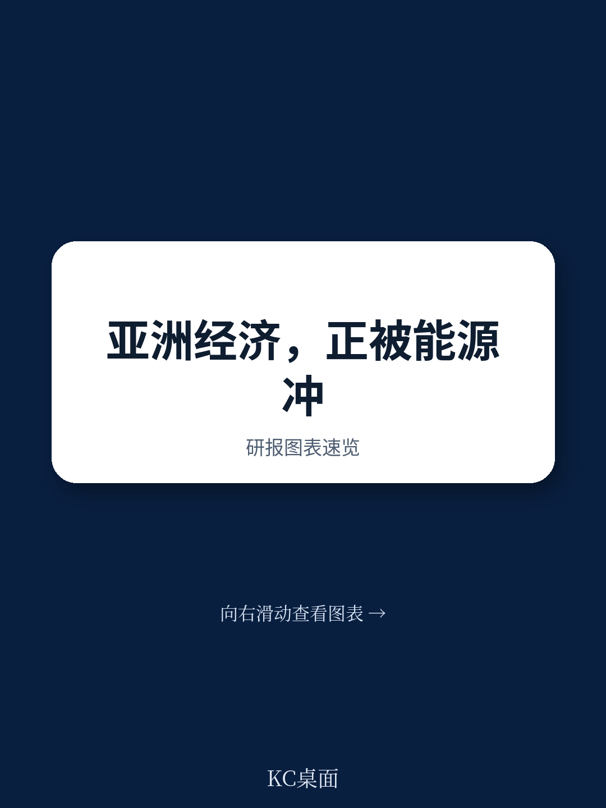
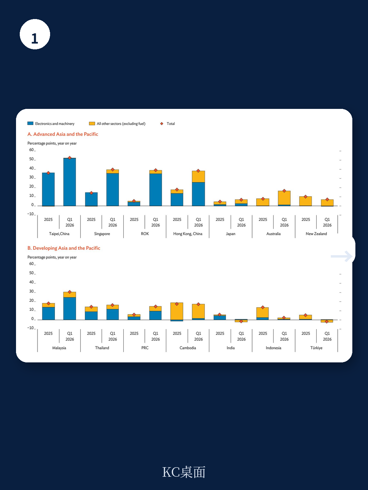
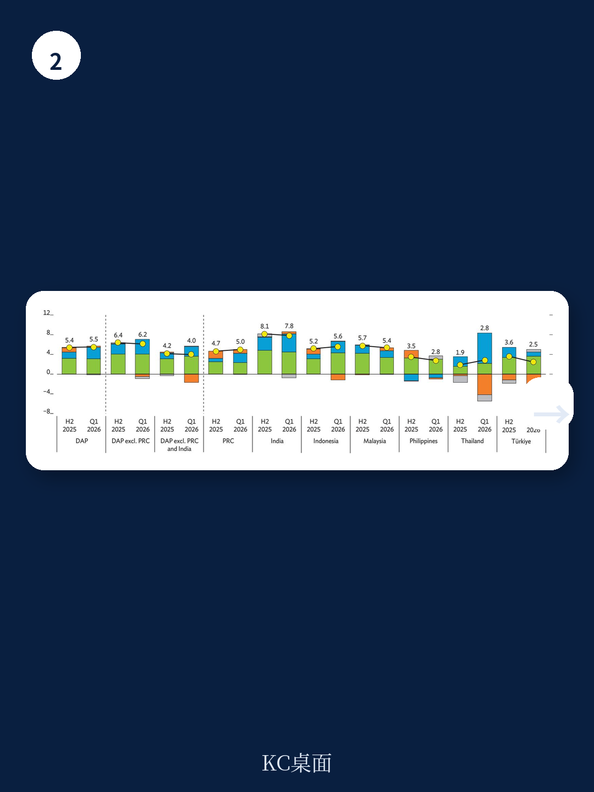

# 亚洲开发银行：中国出口韧性背后，亚太区域增长分化加剧

亚洲开发银行在7月发布的《亚洲发展展望》更新中，将2026年亚太发展中地区增长预测从4月的5.1%下调至4.9%，同时将通胀预期从3.0%大幅上修至4.3%。这份报告的核心判断是：中东冲突已演变为现代史上最大规模的石油供应冲击之一，峰值时期日均超过1000万桶的供应中断。更值得关注的不是油价本身，而是冲击的滞后效应——能源成本正在通过供应链、化肥价格和核心通胀缓慢渗透，而这些传导尚未完全体现在宏观环境数据中。

报告将2027年增长预测维持在5.1%，隐含的假设是能源市场能够逐步正常化。但报告同时承认，物理层面的恢复速度可能慢于市场预期：霍尔木兹海峡的排雷、战争险保险费的回归、改道油轮的重新部署，以及长期关井可能造成的油层损害，都会延长恢复周期。液化天然气的恢复可能比原油更慢。

## 1. 通胀的传导链条比市场预期的更长

报告提出的一个关键观察是，能源冲击的影响正在从生产者价格向食品和核心通胀扩散。5月，亚太地区除中国以外的通胀率达到7.6%，土耳其的持续高物价和超过半数地区的广泛价格上涨是主要推手。中国5月生产者价格指数升至46个月高点的3.8%，印度批发价格通胀更达到9.7%的43个月峰值。

化肥价格的上涨尤其值得警惕。报告通过国际水稻研究所的全球大米模型模拟了三种情景：如果2026年原油价格分别比基准水平（每桶69美元）上涨25%、50%和75%，南亚和东南亚部分地区的大米产量将分别下降0.4%、1.1%和2.1%。考虑到化肥价格对食品供应的传导通常需要6-12个月，2027年初的食品通胀不确定性可能被当前市场低估。

> **KC评论：** 市场往往关注油价本身的涨跌，但这份报告提醒我们，能源冲击的二次效应——通过化肥、运输和核心通胀——才是决定央行政策路径和消费实际购买力的关键变量。报告中的情景分析值得细读，特别是对大米产量的量化影响。

## 2. 中国出口的韧性掩盖了区域分化

2026年第一季度，中国GDP增速达到5.0%，出口和工业生产的强劲表现是主要支撑，特别是高技术制造业。但报告同时指出，除中国以外的亚太地区增长正在仍在调整：印度从2025年下半年的8.1%减速至第一季度的7.8%，菲律宾和土耳其也出现明显减速。

出口数据呈现鲜明的二元结构。电子产品与机械设备出口在人工智能研究热潮推动下表现强劲，马来西亚、泰国、中国香港、韩国、新加坡和中国台湾地区都从中受益。但其他非燃料部门的出口整体依然疲软。报告特别提到，美国从第122条关税向第301条关税的过渡增加了外部需求的不确定性，这可能在后续季度对出口形成不确定性。

## 3. 货币政策面临真实利率上升与通胀预期的两难

区域央行正面临一个棘手组合：名义利率上调，但通胀预期的更快上升导致实际政策利率反而下降。报告的计算显示，除印度尼西亚外，大多数地区的实际政策利率在2026年都出现了下降。印尼是唯一一个名义利率上调幅度超过通胀预期上升幅度的地区，因此也构成了实际紧缩。

与此同时，市场对2026年和2027年政策利率的预期正在上调。报告认为，这反映了通胀不确定性扩大化、能源价格持续高位的不确定性、货币贬值不确定性以及发达地区货币政策立场转鹰的共同影响。一个值得追问的问题是：如果实际利率在通胀预期推动下持续走低，区域央行是否需要更大幅度的名义加息来重建货币政策的可信度？

## 4. 报告尚未完全回答的关键问题

这份报告的价值在于提供了清晰的诊断框架，但有几个问题仍需进一步观察。第一，能源冲击对研究决策的长期影响——报告提到人工智能相关资本支出支撑了区域研究，但如果能源成本持续高企，是否会改变AI基础设施的选址逻辑和回报预期？第二，食品通胀的滞后效应能否在2027年得到有效缓解，取决于化肥价格走势和各国储备协调的实际效果。第三，报告提到的节奏变化不确定性清单中包括“全球市场大幅修正和AI相关公司重新定价”，但并未展开分析这一情景对亚太资本流动和汇率的具体传导路径。

对于关注亚太宏观的读者，这份报告最值得反复研读的部分是通胀分解图表和化肥-大米价格传导的情景分析。它们提供了在当前能源冲击下，判断通胀路径和央行政策转向时机的重要基准。

For informational purposes only. Portions may be generated,translated,summarized,or edited with AI assistance based on source materials and may contain omissions or errors. Please verify independently. This is not investment,legal,tax,accounting,or other professional advice.
