FSI Insights
on policy implementation
No 76

# On the comparison of capital requirements for global systemically important banks

by Patrizia Baudino, Jonathan Beissinger, Renzo Corrias, Mathias Drehmann, Egemen Eren, Burcu Erik and Nikola Tarashev

July 2026

JEL classification: G21, G28, F65, P52

Keywords: Basel Framework, banking regulation, capital buffers, capital requirements, financial stability, G-SIBs, macroprudential policy, microprudential policy, supervisory practices

FSI Insights are written by members of the Financial Stability Institute (FSI) of the Bank for International Settlements (BIS), often in collaboration with staff from supervisory agencies and central banks. The papers aim to contribute to international discussions on a range of contemporary regulatory and supervisory policy issues and implementation challenges faced by financial sector authorities. The views expressed in this publication are those of the authors and do not necessarily reflect the views of the BIS, its member central banks or the Basel-based standard-setting bodies.

Authorised by the Chair of the FSI, Fernando Restoy.

This publication is available on the BIS website (www.bis.org). To contact the BIS Global Media and Public Relations team, please email media@bis.org. You can sign up for email alerts at www.bis.org/emailalerts.htm.

© Bank for International Settlements 2026. All rights reserved. Brief excerpts may be reproduced or translated provided the source is stated.

## Contents

Executive summary....1   
Section 1 - Introduction....3   
Section 2 - The structure of the Basel III risk-based capital requirements....4 Risk-based capital stack - Pillar 1 requirements....6 Risk-based capital stack - Pillar 2 supervisory review....9 Risk-based capital stack - overall requirements....11 Risk-weighted assets....13   
Section 3 - The structure of the Basel III leverage ratio requirements....18   
Section 4 - Conclusions....24   
References....25   
Annex 1: List of G-SIBs in the sample....27   
Annex 2: Variation in capital requirements and actual capital ratios....28   
Annex 3: Variation in capital requirements (after excluding different components)....29   
Annex 4: RWA density and CET1 capital requirements....30   
Annex 5: Use of internal models and credit risk RWA densities before model restrictions....31   
Annex 6: Advanced IRB RWA density by exposure type....32   
Annex 7: Capital requirements stack by jurisdiction, over time (2014-25)....33   
Abbreviations....35

# On the comparison of capital requirements for global systemically important banks $^{1}$

Executive summary

Following the Great Financial Crisis (GFC), Basel III introduced a comprehensive package of capital reforms to bolster the resilience of the global banking system. The framework increased the quality of regulatory capital, raised minimum capital requirements and introduced regulatory buffers to absorb losses in stress and mitigate procyclicality. Alongside risk-based requirements, it added a non-risk-based leverage ratio requirement as a backstop. It also imposed additional regulatory buffers on global systemically important banks (G-SIBs), to lower the probability of their failure. Basel III has significantly strengthened banks' resilience, and the transition to full implementation is now well advanced across major jurisdictions.

As a minimum standard for internationally active banks, Basel III supports regulatory convergence across jurisdictions. The common baseline set by Basel III prevents a competitive race to the bottom and regulatory fragmentation. Comparability, combined with transparency, is essential for ensuring market discipline.

The Basel Framework gives national authorities flexibility to exceed the minimum standards. The possibility to tailor regulatory requirements to reflect structural differences across banking sectors and other supervisory considerations allows authorities to ensure that the same risk receives the same capital treatment. In particular, Pillar 2 allows supervisors to impose higher requirements where Pillar 1 requirements are seen as falling short of capturing fully all relevant risks at the bank or system level. At the same time, different practices make the comparison of capital requirements across jurisdictions more challenging.

Heterogeneous applications of Basel III have become central to current debates on how regulation may influence banks' competitiveness. Differences in the way and extent to which jurisdictions exceed the minimum Basel III standards may have fuelled perceptions of an uneven playing field. In the context of initiatives aiming at regulatory modernisation, the comparability of capital standards across jurisdictions has come under the intense scrutiny of authorities and market participants.

A key contribution of this paper is to document the various components of G-SIBs' overall capital requirement stacks and discuss potential drivers of the differences. While banks are required to publicly disclose key information on capital requirements, the information is generally not available in a centralised, consistent and machine-readable manner. The analysis in the paper relies on a hand-collected, harmonised data set from publicly available sources. It covers risk-based and leverage ratio capital requirements for 29 G-SIBs from seven jurisdictions, for the period 2014–25. These data contain information about banks' risk-weighted assets and exposure measures, and the underlying methodologies. The database also covers the different components of the capital ratio requirements, ie minima, regulatory buffers and supervisory guidance.

The data show that the composition of the capital stacks is heterogeneous across jurisdictions, and the level of capital ratio requirements is less dispersed for the highest-quality capital than for the overall measure. Minimum capital requirements are globally consistent. Some jurisdictions, however, require that they be met to a greater extent with higher-quality capital than prescribed by Basel III. In addition, heterogeneity in the capital stacks emerges as jurisdictions implement various regulatory buffers, supervisory add-ons and/or non-binding supervisory guidance, thus differently using the flexibility embedded in the Basel Framework. For instance, across the seven jurisdictions, the number of different elements of the total capital stack ranges from four to eight. In 2025 data, individual components, excluding minima, contributed to the overall ratio from as little as 0.1 percentage points on average across the banks in a jurisdiction to as much as 3 percentage points on average in another jurisdiction. The portion of the required ratios that refers to the highest-quality capital – Common Equity Tier 1 (CET1), possibly spanning several stack components – ranged from around 8 to around 11 percentage points on average across jurisdictions. At the level of the total requirements – comprising also additional Tier 1 and Tier 2 capital – the range was larger, from almost 12 to almost 17 percentage points on average.

Differences in required capital ratios stem partly from banks' different levels of systemic importance. Reflecting such differences, the current Basel III G-SIB buffers range from 1 to 2.5% of risk-weighted assets (RWA). One jurisdiction imposes higher surcharges (up to 4.5%) using a parallel method that generally yields more conservative surcharges than those prescribed by Basel III. In addition, some jurisdictions do not disclose Pillar 2 guidance or only disclose aggregate values – which can only be estimated in the data set.

The interpretation of comparisons of capital ratio requirements across jurisdictions may be distorted by differences in the approach to the computation of risk weights. There is suggestive evidence of different degrees of conservatism in risk weight measurement. The data reveal significant heterogeneity in the average risk density – ie the ratio of total assets to RWA – across jurisdictions. While this could reflect the riskiness of underlying exposures, it also seems to be influenced by the conservatism in the measurement approach and, in particular, the extent to which internal models can be used to calculate RWA. Consistent with measurement playing a role, risk densities tend to be less dispersed across banks if risk weights are counterfactually based on similar approaches. Moreover, there are indications that authorities may tend to compensate for lower risk measurement conservatism with higher capital requirements, considering that lower actual risk densities are often accompanied by higher required capital ratios.

Cross-country averages also highlight significant heterogeneity in the levels and capital composition of the leverage ratio requirements for G-SIBs. Similarly to the risk-based capital stack, national authorities have implemented different leverage ratio minima, buffer structures, capital quality requirements and adjustments to the exposure measure (the denominator of the leverage ratio). These differences result in heterogeneous capital stacks for the leverage ratio, with different levels of overall requirements.

A comprehensive cross-jurisdictional comparison requires looking at all elements of the capital requirements jointly. This includes the interaction of risk-based capital ratio requirements and RWA measurement, which jointly determine the risk-based capital requirements; the leverage ratio requirements; binding versus non-binding buffers; and supervisory expectations, which may not be fully evident in public data.

Drawing on lessons from the Basel III transition, several authorities are exploring ways to modernise their national frameworks. These efforts may help to simplify the structure of capital requirements. At the same time, if these proposals are approved, they may also affect comparisons across jurisdictions. International dialogue can help to ensure progress and avoid financial fragmentation. Meanwhile, ongoing efforts by the Basel Committee on Banking Supervision (BCBS) to facilitate access to published supervisory data will increase transparency regarding the diverse approaches taken by different jurisdictions.

## Section 1 – Introduction

1. Following the Great Financial Crisis (GFC), the Basel III framework introduced a comprehensive set of regulatory capital reforms to enhance the resilience of the global financial system. Except for some specific requirements, transition towards full implementation of the Basel III framework is well advanced. These reforms have raised minimum capital requirements, tightened the definition of regulatory capital and introduced capital buffers to absorb losses in periods of stress, prevent excessive risk-taking during financial expansions and mitigate the procyclical amplification of shocks during periods of economic stress. In addition to risk-based capital requirements, these reforms also introduced a non-risk-based leverage ratio, as a backstop to limit excessive leverage. To reduce the default probability of “too-big-to-fail” institutions, the reforms imposed additional capital surcharges for global systemically important banks (G-SIBs).

2. While the Basel III standards set minimum regulatory requirements for internationally active banks, individual jurisdictions have some flexibility to tailor the implementation. Certain elements of Basel III are principles-based rather than prescriptive, enabling authorities to adapt them to their domestic conditions, including differences in banks' risk profiles. Moreover, Basel III envisages that authorities may choose to go beyond the minimum rules and impose stricter requirements. Consequently, jurisdictions may use different tools and calibrations, making cross-country comparisons challenging.

3. Heterogeneous applications of Basel III have become central to current debates on how regulation may influence banks' competitiveness. Differences in the way and extent to which jurisdictions exceed the minimum Basel III standards may have fuelled perceptions of an uneven playing field. In the context of initiatives aiming at regulatory modernisation, the comparability of capital standards across jurisdiction has come under the intense scrutiny of authorities and market participants (see Box C for a review of some authorities' recent initiatives to modernise bank regulation).

4. To contribute to this debate, which draws comparisons across jurisdictions, this paper documents differences in G-SIBs' capital requirements – as revealed by publicly available data – and reviews potential underlying drivers. $^{2}$ Differences in G-SIBs' capital requirements may reflect banks' relative degree of systemic importance, as captured by the Basel III indicator-based methodology or as perceived by national supervisors. In addition, authorities may see different needs to compensate for the degree of conservatism embedded in the measurement of risk-weighted assets (RWA), in particular those based on banks' internal models. This paper aims to provide a rigorous review of the structure of capital requirements for G-SIBs and seeks to shed light on the various potential drivers of cross-jurisdictional differences.

5. The analysis focuses on both risk-based and leverage ratio capital requirements to provide a comprehensive perspective using a novel data set covering G-SIBs, based on public disclosures. The analysis draws on data covering 29 G-SIBs from 2014 to 2025, with granular bank-level information on capital requirements, hand-collected from public sources and harmonised across jurisdictions. It abstracts from resolution $^{3}$ and liquidity requirements. The analysis and charts in this paper are based on 2025 year-end data, unless otherwise indicated.

6. The remainder of the paper is organised as follows. Section 2 describes in detail the risk-based capital requirements, breaking them down into their main components, and analyses country-specific adjustments to the Basel III framework. This section also introduces the novel data set used in the paper (see Box A for more details). Section 3 examines the Basel III leverage ratio requirements and country-specific differences. Section 4 concludes.

## Section 2 – The structure of the Basel III risk-based capital requirements

7. The Basel III capital requirements are built on three pillars: minimum capital requirements and buffers (Pillar 1), supervisory review (Pillar 2) and market discipline (Pillar 3). Under Pillar 1, risk-based requirements prescribe a minimum proportion of bank capital to RWA:

$$
\frac {c a p i t a l}{R W A} \geq c a p i t a l r a t i o r e q u i r e m e n t.
$$

Basel III sets three minimum requirements depending on the quality of capital (Common Equity Tier 1 (CET1), Tier 1 capital and total capital), as discussed in the next subsection. The capital ratio requirements are composed of various elements which, together, make up the "capital stack". The RWA are the bank's assets weighted by their risk, according to the methodologies set by the Basel standards. The Pillar 2 supervisory review complements the Pillar 1 requirements with bank-specific add-ons to the capital stack meant to address risks not adequately covered by the Pillar 1 requirements. Finally, Pillar 3 requires public disclosures of key risk and capital adequacy metrics to improve transparency.

8. The requirements are composed of minima and buffers. The minimum requirements must be met at all times, while the buffers are meant to absorb losses in times of stress. Although banks are allowed to use these buffers while they are a going concern, breaching them triggers restrictions on the distribution of profits to a bank's shareholders. Such restrictions, known as the maximum distributable amount (MDA), address the need to ensure prompt capital restoration. Should a bank breach the minimum requirements, it would be considered a gone concern, ie deemed non-viable, and would enter resolution under the authority of the relevant resolution body.

9. In line with the objectives of Basel III, the quality and quantity of capital held by G-SIBs have increased since the start of the implementation phase. Since the beginning of the transition towards full implementation of the Basel III framework in 2014, capital requirements for banks have increased, relative to both CET1 capital – the more restrictive definition of capital – and total capital (Graph 1.A). In line with such developments, actual capital levels as a proportion of RWA have also increased (Graph 1.B).

10. Notwithstanding the overall rise in capital requirements, there have been notable differences across banks. Wide interquartile ranges reflect both variation in national implementation and differences in the business models and risk exposures of individual institutions. As of end-2025, G-SIBs' actual capital ratios appear to be relatively more homogenous compared with the variation in the requirements.

## Regulatory capital requirements and actual capital levels of G-SIBs $^{1}$

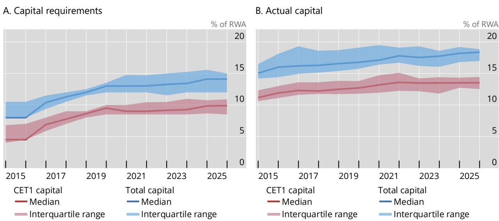  
$^{1}$ Capital requirements include minimum requirements and all legally binding buffers and capital add-ons – eg the capital conservation buffer (CCoB) and countercyclical capital buffer (CCyB), systemic surcharges and Pillar 2 requirements – and exclude non-binding supervisory recommendations, whether explicitly communicated (eg Pillar 2 guidance, Domestic Stability Buffer) or implied by stress test results (eg US Comprehensive Capital Analysis and Review prior to Q4 2020). Includes a constant sample of banks with G-SIB status as of end-2025. Includes capital requirements under the US standardised approach for US G-SIBs.  
Source: Banks' disclosures; S&P Capital IQ; authors' calculations.

11. The rest of the section discusses in detail the Pillar 1 and Pillar 2 risk-based requirements. To understand the requirements applicable to individual G-SIBs according to the specific implementation of Basel III in their home jurisdictions, the following subsections provide more information about the elements of Pillar 1 and Pillar 2 as set under Basel III, and the adjustments made to them by the home authorities.

## Banking data set

The data set used for the analysis in the paper includes 29 banks across seven jurisdictions designated as G-SIBs by the Financial Stability Board (FSB) as communicated on 27 November 2025 (see full list in Annex Table A.1). $^{①}$ Of these, seven are from the European banking union (BU), two from Canada, five from China, three from Japan, one from Switzerland, three from the United Kingdom and eight from the United States. The consolidated total assets of these institutions amounted to approximately USD 78,422 billion as at year-end 2025, representing around 70% of the consolidated total assets of the global banking system. $^{②}$

The sample covers 11 years of annual financial year-end data from 2014 to 2025, consolidated at the group level. The choice of 2014 as the starting point reflects both data availability and the beginning of Basel III implementation. For consistency, the analysis uses a constant sample of the 29 banks with G-SIB status as at end-2025 across the full period, regardless of when each bank was first designated as a G-SIB.

Data were manually collected from annual reports and Pillar 3 disclosures. These reports are not published in a harmonised structure and are generally not available in machine-readable format. Collecting bank-level information in a consistent and comprehensive format enables a granular and accurate discussion of capital levels and requirements over the selected period. The data cover the granular elements of Pillar 1 and Pillar 2 requirements, as well as several other systemic or country-specific capital buffers.

The database contains precise bank-level information on all key elements of the risk-based and leverage ratio requirements, except for the Pillar 2 guidance for G-SIBs in the BU, and Pillar 2B for banks in the UK, which are not publicly disclosed. For these items, the analysis relies on the average Pillar 2 guidance for G-SIBs in the BU as disclosed by the ECB, $^{③}$ and an estimate of the average Pillar 2B for G-SIBs in the UK based on a recent Bank of England report. $^{④}$

① See FSB (2025). ② Figures for the consolidated total assets are drawn from the BIS consolidated banking statistics. ③ Average Pillar 2 guidance has been disclosed since 2018 (system-wide average since 2018; G-SIB average available since 2023). ④ Bank of England (2025).

## Risk-based capital stack – Pillar 1 requirements

12. Basel III sets three minimum risk-based capital ratios. They are the CET1 ratio (4.5% of RWA), the Tier 1 ratio (6%) and the total capital ratio (8%). CET1 capital consists of common shares, retained earnings and accumulated other comprehensive income and has the highest loss absorbency. $^{4}$ Tier 1 capital includes CET1 and Additional Tier 1 (AT1) capital, which consists of perpetual subordinated instruments such as contingent convertible instruments and preferred shares. Tier 1 capital is meant to provide loss absorption on a going-concern basis, while the bank is expected to continue functioning for the foreseeable future. In contrast, Tier 2 instruments, which include subordinated debt with a maturity of at least five years, absorb losses in a gone-concern scenario. Tier 1 and Tier 2 capital make up a bank's total capital.

13. Basel III introduced two capital buffers applicable to all internationally active banks – the capital conservation buffer (CCoB) and the countercyclical capital buffer (CCyB) which sit on top of minimum requirements. Both buffers must be met with CET1 capital. The CCoB is set at 2.5% of RWA and is meant to absorb losses during periods of stress. The CCyB is a time-varying buffer ranging from 0 to 2.5% of RWAs (or higher at national discretion) which can be built up in periods of excessive credit growth and released in a downturn. In this way, it allows banks to support lending to the economy through the cycle while using the buffer to absorb losses. The CCyB rate is set by each individual jurisdiction based on their assessment of the macro-financial environment. So far, the CCyB has been activated in all G-SIB countries except China, Japan and the United States. Moreover, the United Kingdom and some countries in the European banking union (BU) have set a positive cycle-neutral CCyB rate (rather than zero in a neutral state).

14. Banks designated as global systemically important are also subject to a G-SIB buffer to reflect the disproportionate risks they may pose to the stability of the global and domestic financial systems. The G-SIB buffer must be met with CET1 capital and ranges between 1 and 3.5% of RWA. The bank-specific G-SIB rates are published every year by the Financial Stability Board (FSB), following the classification of G-SIBs into different risk buckets based on the Basel III methodology. $^{5}$ National authorities may also set additional buffers for banks of domestic systemic importance, $^{6}$ which, for some G-SIBs, may be higher than their G-SIB buffers.

4 While Basel III harmonises the definition of CET1 capital across G-SIBs, some jurisdictional differences remain in the treatment of certain capital deductions and regulatory adjustments (eg software assets, prudential valuation adjustments and foreign participations). However, these differences are generally limited compared with cross-jurisdictional differences in RWA calculations and therefore are not analysed further in this paper.

5 The BCBS developed the methodology for the G-SIB buffer – it is part of the Basel III standard (SCO40 – Global systemically important banks). In short, the methodology employs a scoring system based on the reported data of the G-SIBs. The assessment measures systemic importance using five different indicators, each weighted at 20%: size, interconnectedness, substitutability/financial institution infrastructure, complexity and cross-jurisdictional activity (BCBS (2014)).

$^{6}$ These banks may be labelled as domestic systemically important banks (D-SIBs) or other systemically important institutions (O-SIIs). The Basel III standard defines principles, rather than prescriptive rules, for jurisdictions to determine these buffers.

Jurisdiction-specific adjustments to Pillar 1 requirements

15. All G-SIB jurisdictions have implemented the Basel III risk-based capital stack, and some have introduced additional elements in their national rules. By the end of the sample period (end-2025), all G-SIB jurisdictions had implemented the Basel III risk-based requirements. In some cases, authorities have introduced additional elements to the Pillar 1 capital stack, such as additional buffers, higher-quality capital requirements for certain elements or parallel requirements based on different criteria. The full set of requirements is described in Table 1. The rest of this subsection explains cross-country differences under Pillar 1; the following subsection covers differences under Pillar 2.

16. Absolute risk-based capital requirements depend not only on the capital ratio requirements, but also on the RWA densities (RWA divided by total assets), which vary materially across jurisdictions, as shown in Table 1. RWA density can be materially influenced by the jurisdictional approaches to the calculation of RWA, which are discussed in the last subsection of Section 2, as well as by differences in banks' balance sheet structures and asset composition.

17. In the European banking union, the systemic risk buffer (SyRB) is an additional requirement to address systemic risks not covered by other elements of the capital stack. The SyRB is a macroprudential requirement designed to prevent and mitigate non-cyclical, long-term systemic risks. It must be met with CET1 capital, has no upper limit and its breach triggers MDA restrictions. The SyRB is set individually by each country and can vary by institution, group of institutions or specific subsets of exposures (for example, residential real estate). $^{7}$

18. Switzerland has tailored specific requirements for its G-SIBs under its too-big-to-fail regime. Swiss authorities introduced an AT1 systemic risk buffer of 0.8%, as well as an additional CET1 systemic risk buffer of 1.5% to reflect the systemic importance of Swiss G-SIBs. $^{8}$ Tier 2 instruments are not eligible to meet capital requirements according to Swiss capital requirements for G-SIBs.

19. In China, banks must meet a higher minimum CET1 capital ratio. Chinese banks (including G-SIBs) are subject to a 5% minimum CET1 ratio, higher than the Basel III minimum of 4.5%. The minimum Tier 1 and total capital ratios remain set at the Basel III levels of 6% and 8% respectively, thus effectively reducing reliance on AT1 capital.

20. In the US, the G-SIB buffer is determined as the highest result of two calculation methods. These are the approach specified in the Basel III framework, applicable to all G-SIBs (Method 1) and a US-specific approach (Method 2). Method 2 replaces the substitutability indicator of Method 1 with a measure of short-term wholesale funding and applies fixed coefficients for the denominators, rather than calculating a "market share" based on other banks' values each year as done under Method 1. This differentiated approach reflects the importance of US G-SIBs for financial stability as well as lessons from the GFC, when reliance on more volatile funding sources amplified systemic risks (Federal Register (2015)). Method 2 generally results in a higher surcharge, almost doubling the average add-on for US G-SIBs as of end-2025.

<table><tr><td colspan="11">Average risk-based capital requirements, as of end-20251</td></tr><tr><td>Requirement (% of RWA)</td><td>Buffer</td><td>Bank-specific</td><td>BU</td><td>CA</td><td>CH</td><td>CN</td><td>JP</td><td>UK</td><td>US (SA)</td><td>US (AA)</td></tr><tr><td colspan="11">Pillar 1</td></tr><tr><td colspan="11">Basel standard (All jurisdictions)</td></tr><tr><td>Pillar 1 minimum - CET1</td><td></td><td></td><td>4.5</td><td>4.5</td><td>4.5</td><td>5</td><td>4.5</td><td>4.5</td><td>4.5</td><td>4.5</td></tr><tr><td>Pillar 1 maximum - AT1</td><td></td><td></td><td>1.5</td><td>1.5</td><td>3.5</td><td>1</td><td>1.5</td><td>1.5</td><td>1.5</td><td>1.5</td></tr><tr><td>Pillar 1 maximum - T2</td><td></td><td></td><td>2</td><td>2</td><td>0</td><td>2</td><td>2</td><td>2</td><td>2</td><td>2</td></tr><tr><td>Pillar 1 minimum (total)</td><td></td><td></td><td>8</td><td>8</td><td>8</td><td>8</td><td>8</td><td>8</td><td>8</td><td>8</td></tr><tr><td>CCoB</td><td>X</td><td></td><td>2.5</td><td>2.5</td><td>2.5</td><td>2.5</td><td>2.5</td><td>2.5</td><td>-2</td><td>2.5</td></tr><tr><td>CCyB</td><td>X</td><td> $X^3$ </td><td>0.74</td><td>0.06</td><td>0.49</td><td>0</td><td>0.15</td><td>0.74</td><td>0</td><td>0</td></tr><tr><td>G-SIB  $buffer^4$ </td><td>X</td><td>X</td><td>1.16</td><td>1</td><td>1.50</td><td>1.45</td><td>1.2</td><td>1.69</td><td>1.81</td><td>1.81</td></tr><tr><td colspan="11">Jurisdiction-specific</td></tr><tr><td>Stress capital buffer - CET1</td><td>X</td><td>X</td><td></td><td></td><td></td><td></td><td></td><td></td><td>2.89</td><td>-2</td></tr><tr><td>Systemic risk buffer (BU) - CET1</td><td>X</td><td> $X^3$ </td><td>0.1</td><td></td><td></td><td></td><td></td><td></td><td></td><td></td></tr><tr><td>Systemic risk buffer (CH) -  $CET1^5$ </td><td>X</td><td></td><td></td><td></td><td>1.5</td><td></td><td></td><td></td><td></td><td></td></tr><tr><td>Systemic risk buffer (CH) - AT1</td><td>X</td><td></td><td></td><td></td><td>0.8</td><td></td><td></td><td></td><td></td><td></td></tr><tr><td colspan="11">Pillar 2</td></tr><tr><td>P2R/P2A - CET1</td><td></td><td>X</td><td>1.17</td><td></td><td>0.14</td><td></td><td></td><td>1.86</td><td></td><td></td></tr><tr><td>P2R/P2A - AT1 + T2</td><td></td><td>X</td><td>0.85</td><td></td><td>0.06</td><td></td><td></td><td>1.45</td><td></td><td></td></tr><tr><td>Additional G-SIB/O-SII  $buffer^6$ </td><td>X</td><td>X</td><td>0.19</td><td></td><td></td><td></td><td></td><td></td><td>1.34</td><td>1.34</td></tr><tr><td>Total capital requirements</td><td></td><td></td><td>14.69</td><td>11.56</td><td>14.99</td><td>11.95</td><td>11.85</td><td>16.24</td><td>14.04</td><td>13.65</td></tr><tr><td>Of which: CET1 capital</td><td></td><td></td><td>10.34</td><td>8.03</td><td>10.63</td><td>8.95</td><td>8.34</td><td>11.29</td><td>10.54</td><td>10.15</td></tr><tr><td colspan="11">Non-binding buffers</td></tr><tr><td>Domestic stability buffer - CET1</td><td>X</td><td></td><td></td><td>3.5</td><td></td><td></td><td></td><td></td><td></td><td></td></tr><tr><td>P2G/P2B - CET1</td><td>X</td><td>X</td><td>1.2</td><td></td><td></td><td></td><td></td><td> $0.55^7$ </td><td></td><td></td></tr><tr><td>Total capital requirements including non-binding buffers</td><td></td><td></td><td>15.89</td><td>15.06</td><td>14.99</td><td>11.95</td><td>11.85</td><td>16.79</td><td>14.04</td><td>13.65</td></tr><tr><td>Of which: CET1 capital</td><td></td><td></td><td>11.54</td><td>11.53</td><td>10.63</td><td>8.95</td><td>8.34</td><td>11.84</td><td>10.54</td><td>10.15</td></tr><tr><td>RWA densities (% of total assets)</td><td></td><td></td><td>28.01</td><td>30.90</td><td>30.51</td><td>54.85</td><td>27.86</td><td>26.21</td><td>44.93</td><td></td></tr><tr><td colspan="11">1Shows risk-based capital requirements as a percentage of RWAs, on a weighted-average basis, as of year-end 2025. Absolute capital requirements depend on both capital ratio requirements and average RWA densities (RWA divided by total assets, shown in the last row), which vary materially across jurisdictions and can be materially influenced by the jurisdictional approaches to the calculation of RWA, as well as by differences in banks&#x27; balance sheet structures and asset composition. The table shows standardised approach (SA) and advanced approach (AA) requirements separately for the US. For US banks, RWA density is calculated as the higher of RWA under AA and RWA under SA, divided by total assets. 2Under the US SA, a dynamic stress capital buffer (floored at 2.5%) applies instead of the CCoB. Under the US AA, the fixed 2.5% CCoB applies instead of the stress capital buffer. 3The SyRB may vary across institutions or sets of institutions as well as across subsets of exposures. The CCyB rates are set at jurisdictional level but each bank faces an individualised bank-level capital requirement calculated as the weighted average of the national CCyB rates in effect across all jurisdictions where a bank holds credit exposures. 4Indicates the G-SIB buffer as communicated in the FSB G-SIB list. 5Defined as the remainder after subtracting the internationally applicable CCoB and G-SIB surcharge from the Swiss-specific CET1 systemic risk buffer of 5.5%. 6Indicates the additional buffer applicable in excess to the G-SIB buffer set by the FSB (O-SII buffer in the BU, Method 2 in the US). 7UK Pillar 2 buffer (P2B) is approximated based on Bank of England (2025), which covers the 14 largest banks in the UK.</td></tr></table>

Sources: Banks' disclosures; Bank of England (2025); ECB; authors' calculations.

21. US G-SIBs must comply with two sets of requirements – each comprising minima and buffers – one based on internal models, the other on a standardised approach to RWA. First, US banks and other large banks active in the US must meet risk-based capital requirements based on RWA calculated using internal models ("advanced approach"). $^{9}$ In this case, the minimum capital ratios and buffer are based on the standard Basel III capital stack, but using the highest G-SIB buffer as determined by Methods 1 and 2. Second, banks must also meet risk-based requirements based on a subset of RWA calculated using standardised approaches ("standardised approach"). $^{10}$ In this case, the capital stack includes the same minimum capital ratios and G-SIB buffer as under the advanced approach, but the CCoB is replaced by the US-specific stress capital buffer (SCB), discussed in the Pillar 2 subsection below. As described in Federal Register (2010), the dual framework is intended to reduce reliance on potentially optimistic internal models of systemic banks and aims to ensure that their capital requirements are at least as high as those for smaller banks, thereby providing a more conservative floor to capital adequacy – similar to the Basel III output floor. In practice, most US G-SIBs are bound by the standardised approach requirements.

## Risk-based capital stack – Pillar 2 supervisory review

22. The Pillar 2 supervisory review process allows supervisors to impose additional capital requirements tailored to a bank's risk profile. The Pillar 2 framework is a flexible, principles-based approach whereby supervisors can impose additional capital requirements to better reflect the idiosyncratic risks of individual banks and avoid potential blind spots. Specifically, Pillar 2 is used to address: (i) risks that, while included in Pillar 1, may not be fully reflected in its calculations (such as credit concentration risk); (ii) risks outside the scope of Pillar 1, including interest rate risk in the banking book (IRRBB) and business or strategic risks; and (iii) broader external factors, such as the impact of the business cycle on a bank's stability.

23. Pillar 2 implementation can vary by jurisdiction, while remaining compliant with Basel III. Authorities may set different requirements or expectations under Pillar 2, distinguishing between binding and non-binding elements. Irrespective of their non-binding nature, the latter form part of effective capital targets through supervisory expectations, market discipline and internal risk management. $^{11}$ Flexibility in Pillar 2 implementation allows jurisdictions to address risk considerations specific to their banking system while staying consistent with the Basel III framework. At the same time, this flexibility results in significant differences in the way the framework is implemented across jurisdictions. Differences can be seen in the methodologies used to set capital requirements, the types of additional risks considered and the consequences of breaching binding versus non-binding expectations, as detailed below.

24. In both the BU and the UK, a two-tier Pillar 2 framework with binding and non-binding components applies. The binding Pillar 2 requirement (P2R in the BU $^{12}$ and P2A in the UK $^{13}$ ) must be met with at least 56.25% CET1 and 75% Tier 1 and covers risks not fully captured by Pillar 1. The non-binding supervisory expectation (P2G in the BU $^{14}$ and P2B in the UK $^{15}$ ) is calibrated from stress tests and supervisory judgment. P2R and P2A are publicly disclosed at the bank level. P2G is confidential at the bank level with only peer group averages (eg for G-SIBs) published. P2B is not disclosed for individual banks, and no official aggregate is published, though aggregate estimates can be inferred from a recent Bank of England (2025) publication.

25. In Switzerland, the supervisory authority applies binding Pillar 2 requirements, focused on institution-specific risks not covered under Pillar 1. Specifically, these requirements address risks arising from business activities, risk exposures, business strategy, risk management quality or the sophistication of techniques used (see Article 45 of the Swiss Capital Adequacy Ordinance (CAO)). These add-ons must typically be met with CET1 capital, although the final composition is at the supervisor's discretion. $^{16}$

26. In Canada, G-SIBs are subject to explicit non-binding supervisory expectations via the Domestic Stability Buffer (DSB). $^{17}$ The DSB applies to all domestic systemically important banks (D-SIBs), including Canada's two G-SIBs. Unlike in the BU and the UK, this buffer is not bank-specific but applies system-wide. The DSB is a non-binding, risk-based buffer designed to ensure D-SIBs maintain sufficient capital to address system-wide risks. It is reviewed at least twice a year and can be adjusted as needed, depending on prevailing conditions. $^{18}$

27. In the US, stress test results are translated into binding Pillar 2 capital requirements via the SCB. Large US banks are subject to the SCB when calculating requirements under the US standardised approach. The SCB is floored at 2.5% – the level of the CCoB under the US advanced approach (Federal Reserve Board (2024)). The stress tests aim to ensure that banks are sufficiently capitalised and able to lend to the economy even in an adverse scenario. US authorities do not set non-binding supervisory capital guidance.

28. In Japan, supervisory expectations and communication are used in lieu of explicit Pillar 2 requirements or guidance. Japanese G-SIBs are not subject to explicit Pillar 2 targets. However, supervisors expect banks to allocate capital to cover for the various risks not included in Pillar 1 requirements (which are addressed via Pillar 2 elements in other jurisdictions) when setting their actual capital targets. In addition, Japanese authorities run annual benchmarking exercises with capital stress tests for large banks (Bank of Japan (2020)). While banks are not given an explicit capital target to be met, the benchmarking exercise helps them to form an idea of the authorities' expectations of adequate capital ratios.

Risk-based capital stack – overall requirements

29. The different jurisdictional implementation of minimum and buffer requirements and Pillar 2 components results in a heterogeneous mix of components and required levels of capital. Those differences in requirements make it difficult to meaningfully compare banks' capital requirements across jurisdictions (Graph 2.A and Table 1). By design, the Pillar 1 total capital minimum of 8% is common across jurisdictions, even though some jurisdictional regimes emphasise higher-quality capital or restrict specific instruments (for example, Switzerland's constraints on Tier 2 under the too-big-to-fail framework; China's higher minimum CET1). But authorities' use of Pillar 2 requirements and guidance, systemic buffers and stress test-based add-ons differ widely, reflecting local conditions. That said, when binding buffers are included, overall risk-based requirements cluster at broadly similar levels across most jurisdictions by end-2025; when non-binding expectations are also considered, total stacks typically lie in a mid-teens. $^{19}$

30. Aggregating elements of the capital stack by the quality of required capital enhances comparability across countries. As noted earlier, most minimum requirements and buffers must be met with CET1, the highest-quality capital. Considering that this may be an important feature in determining the intensity of the requirement, the capital stack is simplified to separately identify all elements of the capital stack that must be met with each type of capital (Graph 2.B). Focusing only on the aggregate CET1 requirements (including buffers) instead of total capital requirements reveals somewhat less heterogeneity across jurisdictions, suggesting that the most loss-absorbing components of the capital requirements for G-SIBs are relatively aligned, in particular for banks in the BU, Canada, Switzerland, the UK and the US (see also the second-to-last row of Table 1).

31. While the CET1 requirements are more similar across jurisdictions, comparability becomes more nuanced once MDA trigger points are taken into account. MDA restrictions are undesirable to bank managers, which will attempt to retain enough capital to limit the risk of triggering them. Comparisons across banks must therefore consider MDA trigger thresholds. In terms of total capital, triggers in the BU, Switzerland, the UK and the US are closest (Graph 2.A). In contrast, while the height of the total capital stack (including the non-binding DSB) for Canada is similar to the MDA trigger levels of these jurisdictions, the actual MDA trigger is lower due to the non-binding nature of the DSB. This places Canada's MDA trigger at a level comparable with those of China and Japan, which do not have explicit non-binding capital buffers on top of their binding capital stack. $^{20}$

A. Stack decomposition by component $^{2}$  
B. Stack decomposition by capital instrument $^{3}$  
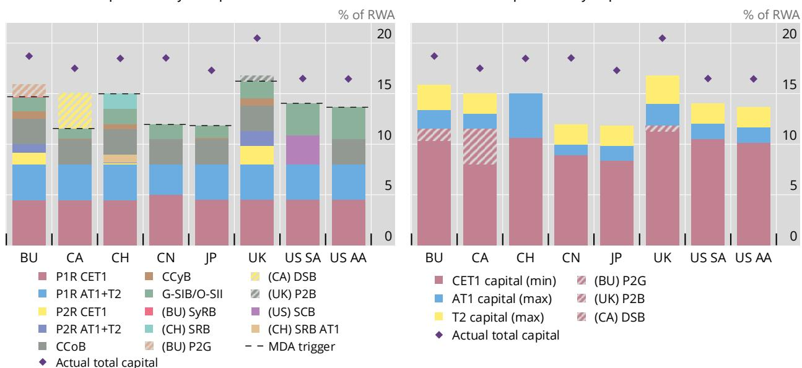  
BU = European banking union; CA = Canada; CH = Switzerland; CN = China; JP = Japan; UK = United Kingdom; US = United States.  
$^{1}$ Shows risk-based capital requirements as a percentage of RWA, on a weighted average basis, as of end-2025. For CH, only AT1 capital is eligible for the P1R AT1+T2 component shown. Unless otherwise indicated, all stack components must be met with CET1 capital. The standardised approach (SA) and advanced approach (AA) requirements are shown separately for the US. Non-binding capital buffers are shaded. UK Pillar 2 buffer (P2B) is approximated based on Bank of England (2025), covering the 14 largest banks in the UK. $^{2}$ Dashed horizontal lines indicate maximum distributable amount (MDA) triggers or their equivalent. Breaching these capital levels usually automatically restricts discretionary payments, including dividends and variable remuneration. $^{3}$ Capital requirements are defined as in footnote 1, but the components are aggregated by the type of capital instrument required, as compared with their specific regulatory function in panel A.

Sources: Banks' disclosures; Bank of England (2025); ECB; S&P Capital IQ; authors' calculations.

32. While there is significant heterogeneity in banks' capital requirements, G-SIBs' actual total capital ratios are relatively more homogeneous. G-SIBs seem to somewhat compensate for differences in the composition and overall level of capital requirements, leading to more homogeneity in their actual capital ratios (Graph 2.B and Annex Graph A.2). $^{21}$ This is consistent with findings in the literature that banks deliberately benchmark capital ratios with peers, either on their own incentive or because of pressure by their supervisors. $^{22}$ Banks usually aim to hold capital beyond overall regulatory requirements to account for uncertainty in earnings, RWA and underlying exposures. In this way, they reduce the probability of breaching distribution-related thresholds such as limits on dividends, AT1 coupons and variable pay. They also support internal risk appetites, facilitate strategic flexibility in stress and help to smooth through regulatory recalibrations or model changes, or anticipated reforms such as the phase-in of the Basel III output floor.

33. Key factors leading to relatively comparable actual capital levels include formal or implicit supervisory expectations, which often raise effective capital targets. Formal supervisory capital guidance such as P2G in the BU, P2B in the UK and the DSB in Canada shape banks' capital targets, even if they are not binding requirements. Moreover, while in those jurisdictions supervisory reviews produce explicit institution-specific guidance, in at least one jurisdiction implicit expectations are conveyed through "supervisory communication" that encourages additional headroom. For example, while supervisory authorities in Japan do not set explicit Pillar 2 targets, banks may consider non-public expectations as a de facto target. Moreover, supervisory benchmarking during stress testing exercises may further set implicit expectations for banks' actual capital ratios. Because such expectations are tailored to each bank and may not be disclosed, they can promote convergence in these ratios across peers and over time, even if statutory requirements differ.

34. In addition, local requirements for foreign subsidiaries may lift consolidated capital targets and drive cross-border convergence. Foreign subsidiaries of G-SIBs must meet their host country minima, buffers and, where applicable, Pillar 2 add-ons, which may be more stringent that those in their home jurisdiction. For G-SIBs with extensive foreign operations, this can lead to an increase in their actual capital levels at the consolidated level, even when the home country capital stack is lower.

## Risk-weighted assets

35. Risk-weighted assets translate a bank's diverse exposures into a risk-adjusted measure that seeks to ensure capital requirements are proportionate to the level of risk a bank actually carries. The total RWA is the sum of risk-specific RWA: credit risk in the banking book, counterparty credit risk for derivatives and securities financing, market risk in the trading book and operational risk. $^{23}$ For any given capital ratio requirement, an increase in RWA – whether due to balance sheet growth or higher calculated riskiness – translates into proportionately higher capital needs. Conversely, active portfolio de-risking or risk measurement changes that lower RWA reduce the required capital, all else the same.

36. Data show that RWA density varied across jurisdictions and over time, with dispersion persisting even as regulatory reforms took effect. RWA density is a useful normalised indicator for comparing the average riskiness of banks' exposures. RWA density levels have been slowly decreasing across jurisdictions in recent years, except for Switzerland (Graph 3.A). They have also become somewhat more homogeneous, at around 30%, $^{24}$ for BU, Swiss, UK, Canadian and Japanese G-SIBs, while US and Chinese banks have on average significantly higher densities at 45% and 55%, respectively.

A. Over time

## Average RWA density $^{1}$

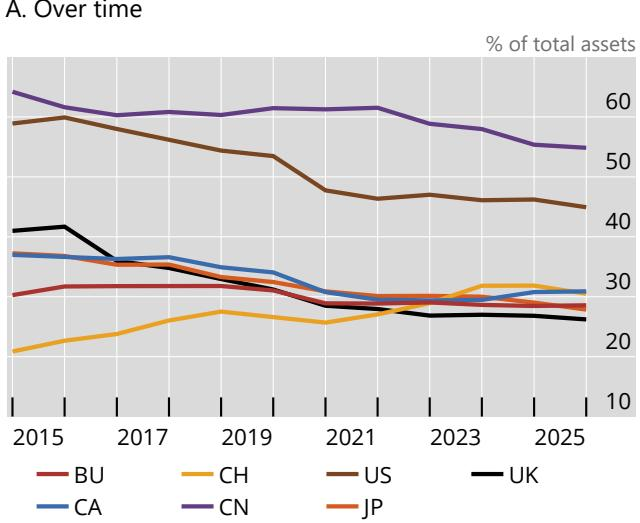

B. As of end-2025 vs CET1 capital requirements $^{2}$  
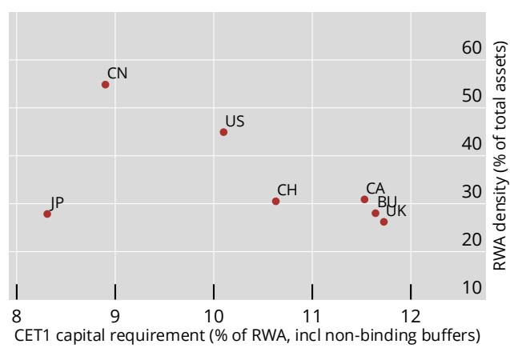  
$^{1}$ Defined as risk-weighted assets over total assets. Includes a constant sample of banks with G-SIB status as of end-2025. $^{2}$ Overall CET1 capital requirements include minimum requirements and all legally binding buffers and capital add-ons, eg CCoB, CCyB, systemic surcharges, and Pillar 2 requirements, as well as non-binding capital buffers, which are Pillar 2 guidance in the BU, the Pillar 2 buffer in the UK and the Domestic Stability Buffer in CA.

Sources: Banks' disclosures; Bank of England (2025); ECB; S&P Capital IQ; authors' calculations.

37. Observed differences in RWA density reflect both underlying risk profiles and methodological choices, which cannot be fully disentangled on the basis of the available data. Cross-bank and cross-country variation in RWA stems from genuine differences in asset mix, credit quality, trading activities and operational loss exposures, as well as from choices of approaches, model permissions and supervisory overlays. Isolating these effects would require a deeper analysis on identical exposures across banks. Consequently, level differences should be interpreted cautiously: higher RWA may signal higher intrinsic risk, more conservative measurement via greater use of standardised approaches over internal models, or both.

38. Differences in the approaches to the calculation of RWA across jurisdictions appear to play a significant role. The next subsection and Box B elaborate on this point. Importantly, they show the implications of applying the similar RWA computations to banks that calculate risk differently.

39. RWA and risk-based capital ratio requirements may substitute for each other in ensuring adequate capitalisation. Since changes in RWA affect one-to-one nominal capital requirements, a less conservative calculation of RWA, which may expose banks to higher model risk, might give relevant authorities grounds to set higher capital ratio requirements (eg via Pillar 2). Indeed, one possible implication arising from recent analysis by the Bank of England is that jurisdictions that pursue more conservative RWA calculations, for example by heavily restricting the use of internal models, may target lower headline capital ratio requirements, compared with those allowing lower RWA densities via wider use of internal models. $^{25}$ Consistent with this, the data indicate a negative relationship between RWA density and required capital ratios across the sample, both for country averages (Graph 3.B, and the bottom section of Table 1) and at the bank level (Annex Graph A.4).

Jurisdictional approaches to RWA

40. The Basel III standards allow banks to determine their RWA using either standardised approaches or internal models. Standardised approaches apply fixed, regulatory-set risk weights to banks' exposures. In contrast, internal model approaches allow banks to rely on their own internal data and estimates of risk components to determine the risk weights for a given exposure, subject to meeting pre-specified conditions and receiving supervisory approval. Broadly speaking, RWA calculated under the standardised approaches tend to be higher than RWA under internal models. An earlier report by the BCBS (2017) identified unwarranted variability in RWA as a critical issue undermining the credibility of capital ratios.

41. Domestic implementations differ in the balance between standardised and model-based methods, influencing RWA outcomes and nominal capital requirements. While the use of internal models is generally available to G-SIBs in all jurisdictions, local rules may further restrict the use of internal models, for example by setting more conservative parameter floors for certain exposures or not allowing internal models for certain asset classes. Two noticeable exceptions are the US and China (Graph 4.A). In the US, while most G-SIBs use internal models for 40-60% of their total RWA, those banks are generally constrained by the US standardised approach (described earlier) and effectively only use internal models for market risk exposures, which make up a small proportion of their overall RWA. In China, G-SIBs predominantly rely on “foundation” internal models for calculating credit risk RWA (Graph 4.A, blue bars). Under the foundation internal models, banks only model the probability of default but use fixed regulatory parameters for the other inputs, resulting in higher RWA densities compared with fully modelled approaches (Graph 4.B, blue dots).

42. Stricter limitations on internal models and advanced approaches are an important driver of observed differences in RWA densities. Some of the observed heterogeneity in RWA densities can be attributed to jurisdictional restrictions on internal models. Focusing on credit risk exposures, which are the largest component, the average RWA density for US G-SIBs is 24% when calculated using supervisory-approved internal models. This is broadly in line with the RWA density of G-SIBs from the BU, Canada, Switzerland and the UK (Graph 4.B, red bars). However, the RWA density for the same portfolio becomes significantly higher once the US restrictions on the use of internal models are applied and RWA are calculated using standardised approaches, driving the higher overall densities for those banks (Graph 4.A, blue dots). Similarly, as mentioned above, the high RWA densities for Chinese G-SIBs are driven by their predominant use of foundation internal models, which carry relatively higher risk weights. See Annex Graph A.5 for a breakdown by bank. In addition, Graph A.6 shows RWA density under internal models for granular portfolios, which allows to partially disentangle the impact of different business models on overall RWA densities. Box B discusses potential adjustments to disentangle some of the differences in approach and provide more comparable measures across jurisdictions.

A. Share of RWA calculated using internal models and RWA density $^{2}$  
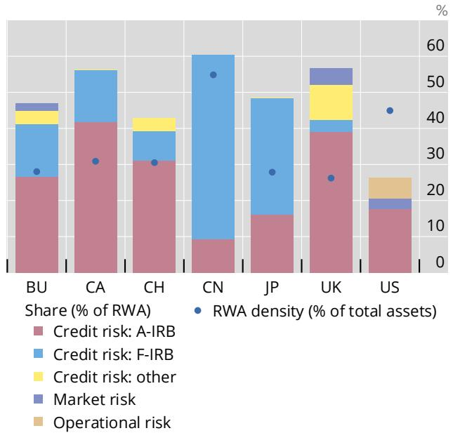  
A-IRB = advanced internal ratings-based approach; F-IRB = foundation internal ratings-based approach.  
$^{1}$ Shows jurisdictional averages as of end-2025. $^{2}$ Share of RWA using internal models is calculated as the share of RWA using internal model approaches over total RWA, by risk category. For credit risk, the category “other” aggregates RWA calculated under the supervisory slotting approach, SEC-IRB, and counterparty credit risk using the internal model method. For US banks bound by the standardised approach, given the Collins floor, the numerator comprises modelled market risk RWA components and the denominator is total RWA under the US standardised approach. For JPMorgan and Citigroup, the two US G-SIBs for which the advanced approach yields higher RWA in Q4 2025, the numerator consists of modelled credit, market and operational risk RWA components, and the denominator is total RWA under the US advanced approach. $^{3}$ IRB RWA density is calculated as aggregate RWA of the respective IRB approach, A-IRB vs F-IRB, over associated aggregate exposure at default (EAD), post credit conversion factors and credit mitigation techniques, by jurisdiction. Credit risk: total IRB is the weighted average RWA density of both approaches combined. Calculation does not include exposures to repo transactions, margin loans and OTC derivatives. Impact of internal model restrictions such as the output floor, and the Collins floor in the US, are not considered (ie for the US, the figures refer to RWA calculated under the advanced approach). US G-SIBs only use the A-IRB approach. Two out of three UK G-SIBs only use the A-IRB approach. For Chinese G-SIBs, only the F-IRB approach is permitted for corporate exposures.

B. Credit risk IRB RWA density before model restrictions $^{3}$  
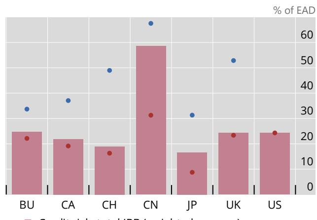  
- Credit risk: A-IRB  
- Credit risk: F-IRB

Sources: Banks' disclosures; S&P Capital IQ; authors' calculations.

43. The final Basel III framework issued in 2017 constrains the capital benefits obtained via internal models with the introduction of the output floor and other restrictions. To curb unwarranted dispersion in RWA from internal models, the final Basel III reforms introduced an RWA output floor. It restricts a bank's minimum total RWA to 72.5% of the RWA determined under standardised approaches, limiting the capital benefit from internal models. The goal of the output floor is to strengthen comparability of RWA across banks and jurisdictions while still allowing internal models to reflect higher risk sensitivity. The floor is meant to be phased in over multiple years and operates alongside other new safeguards, which include floors to the risk parameters, the removal of some internal model approaches for certain low-default asset classes and the removal of all internal approaches for equity credit risk exposures and operational risk. $^{26}$

44. National authorities are phasing in the output floor on different timelines, affecting near-term RWA comparability. The output floor is converging towards 72.5% across the sample but with staggered paths. In Japan, the floor became effective in March 2024 at 50%, rising by 5% annually to reach

72.5% by 31 March 2029. $^{27}$ In China, the floor was implemented at 72.5% in January 2024, without a transition phase. In Switzerland, it reached 60% in March 2025, rising to 72.5% by 2028. In Canada, a 65% floor became effective in April 2023, but was paused at 67.5% as of February 2025, with at least two years' notice before further increases. $^{28}$ In the BU, the floor was set to 50% in January 2025, rising to 72.5% by 2030. $^{29}$ In the UK, the implementation will start in January 2027 at 60%, reaching 72.5% in 2030. In March 2026, US authorities published for consultation their latest proposals for the implementation of the final Basel III rules (FDIC, Federal Reserve and OCC (2026)). The proposals do not envision an output floor but instead remove the use of internal models for credit and operational risk, and retain it for market risk for the largest banks.

Box B

## Adjustments to enhance RWA comparability

Comparing RWA and capital requirements across jurisdictions is challenging due to differences in how RWA are calculated. These differences arise from two main sources: (i) risk-based drivers, which reflect genuine variations in underlying risk exposures; and (ii) practice-based drivers, which stem from differences in bank practices and regulatory environments. $^{①}$ While risk-based drivers capture real differences in the riskiness of banks' activities, a significant portion of the complexity in cross-jurisdictional comparisons is driven by practice-based differences.

For example, banks using internal models to calculate RWA often report lower figures than those applying standardised approaches to similar exposures. This is by design, as internal models seek to maintain banks' risk measurement capacity and need to be approved by supervisors, whereas standardised approaches are meant to be simpler and easier to apply, and are typically calibrated more conservatively. The predominance of the use of internal models to determine RWA varies by jurisdiction: G-SIBs in the BU, Canada, Japan, Switzerland and the UK predominantly use internal models, whereas in the US, most G-SIBs are limited in the extent to which internal models can reduce RWA via their dual stack approach (also known as Collins floor), which effectively sets RWA as the highest of RWA under internal approaches (including credit, market, operational and credit valuation adjustment risk), and the sum of standardised RWA for credit risk and internal models RWA for market risk. Also within internal model usage, the choice of approach matters: for credit risk, the foundation internal-ratings based (F-IRB) approach tends to yield higher average risk weights than advanced internal-ratings based (A-IRB) approach (Graph 4.B). As shown in Graph 4.A, the F-IRB approach is much more widespread for G-SIBs in China, because the A-IRB approach is not permitted for certain asset classes (eg corporate exposures).

Leveraging new disclosure requirements, related to the output floor, which are currently available for all G-SIBs in the BU, Canada, Switzerland and Japan, it is possible to adjust banks' RWA to reduce practice-based differences and enhance cross-jurisdictional comparability.②

In this analysis, banks' RWA are adjusted as if they were subject to: (i) the US Collins floor (Graph B1.A); (ii) the 72.5% output floor; and (iii) full standardised approaches (Graph B1.B). Dividing the adjusted RWA by total assets, one obtains an adjusted RWA density, which provides an indication of the portfolio riskiness, $^{③}$ after some practice-based elements have been reduced. $^{④}$ This adjustment increases the median RWA density from 28% to 36%, bringing it closer to the observed median RWA density of 45% for US G-SIBs, which are subject to the Collins floor. In comparison, the application of the 72.5% output floor has a more muted impact (from 28% to 32%), while the adjustment using the fully standardised approach brings the median RWA density to 44%. The residual gap seems to reflect portfolio differences across G-SIBs on average. Compared with others, US G-SIBs tend to have on average a lower share of residential mortgages and a higher share of wholesale exposures on their balance sheets.

Actual vs adjusted RWA densities $^{1}$  
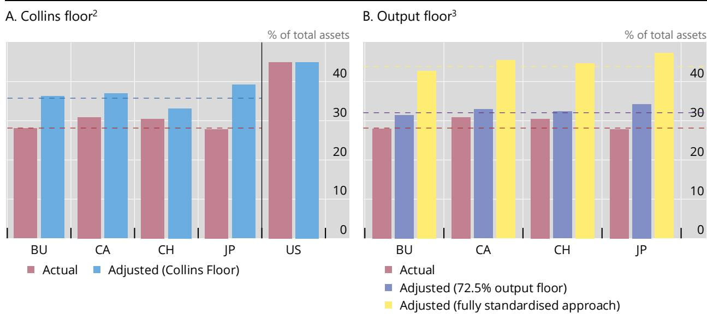  
$^{1}$ RWA density is calculated as RWA over total assets. Actual RWA density uses reported total RWA, while adjusted RWA density, except for US banks, is based on Template CMS1 ("Comparison of modelled and standardised RWA at risk level under DIS21"). Data are as of end-2025 and are unavailable for UK and CN banks. $^{2}$ Adjusted RWA density uses the higher of: (i) credit risk RWA under the fully standardised approach plus total market risk RWA; or (ii) actual total RWA. RWA under (i) are higher for all BU, CA, CH and JP banks in the sample. For US banks, actual and adjusted RWA densities are equivalent since the Collins floor applies in practice. Horizontal dashed lines show median actual and adjusted RWA densities, respectively, excluding US banks. $^{3}$ Adjusted RWA density uses the higher of: actual RWA, or RWA under the fully standardised approach multiplied by an output floor of either 0.725 (the fully phased-in Basel output floor); or 1.0 (ie the fully standardised approach). The output floor base that is applied to all banks excludes transitional adjustments. At 72.5%, the floor binds for all banks except one BU bank; at 100%, it binds for all banks. Horizontal dashed lines denote the medians of actual and adjusted RWA densities, respectively.

Sources: Banks' disclosures; S&P Capital IQ; authors' calculations.

As discussed in this paper, there are indications that regulators may somewhat compensate for the fact that, as shown in this box, the RWA densities would be significantly lower without the application of the floor. They do so by introducing additional capital requirement components, such as Pillar 2 requirements in the BU and the UK. For instance, a recent Bank of England study converts relevant Pillar 2 requirements into notional RWA to compute adjusted capital ratios, finding adjusted requirements in the UK and the BU broadly comparable and somewhat below US levels. $^{⑤}$ A recent ECB paper seeks to account for practice-based differences by applying US rules to BU banks, leading to significantly higher hypothetical requirements for BU G-SIBs. $^{⑥}$ Despite acknowledging data limitations and assumptions, both studies highlight the need to consider both risk- and practice-based factors when comparing capital requirements across jurisdictions.

① BCBS (2016a). ② These data are reported in Template CMS1 “Comparison of modelled and standardised RWA at risk level under DIS21”. The data are not available for UK and CN banks. ③ Mariathasan and Merrouche (2014). ④ Some practice-based differences remain even when applying the standardised approach data. For example, US capital rules do not allow the use of external ratings for the determination of risk weights under the standardised approach. ⑤ Bank of England (2025). ⑥ Dzezulskis et al (2026).

## Section 3 – The structure of the Basel III leverage ratio requirements

## 45. The leverage ratio (LR) requirement is intended to serve as a simple, non-risk-based backstop to prevent excessive build-up of leverage. Designed to complement risk-weighted capital requirements, the LR limits total leverage regardless of measured asset risk or modelling choices. It is

meant to reduce model risk, enhance transparency and comparability, and provide resilience when risk weights may understate true risk.

46. For G-SIBs, the Basel III LR mirrors the two-tier structure of minimum capital requirements and a G-SIB buffer. The Basel III standard requires Tier 1 capital of at least $3\%$ of the bank's leverage exposure measure:

$$
\frac {\text {Tier 1 capital}}{\text {Exposure measure}} \geq 3 \%.
$$

To maintain the relative roles of the risk-based capital and leverage ratio requirements, a G-SIB leverage buffer equal to 50% of the risk-based G-SIB surcharge is added on top, $^{30}$ thus seeking to make the backstop commensurate with the bank's systemic footprint. Breaches of the buffer trigger distribution limits analogous to the risk-based capital framework.

<table><tr><td colspan="10">Average leverage ratio capital requirements, as of end-2025 $^{1}$ Table 2</td></tr><tr><td>Requirement (% of LREM)</td><td>Buffer</td><td>Bank-specific</td><td>BU</td><td>CA</td><td>CH</td><td>CN</td><td>JP</td><td>UK</td><td>US</td></tr><tr><td colspan="10">Pillar 1</td></tr><tr><td colspan="10">Basel standard (all jurisdictions)</td></tr><tr><td>Pillar 1 minimum – CET1</td><td></td><td></td><td></td><td></td><td>1.5</td><td></td><td></td><td>2.44</td><td></td></tr><tr><td>Pillar 1 maximum – AT1</td><td></td><td></td><td>3</td><td>3</td><td>1.5</td><td>4</td><td>3.15</td><td>0.81</td><td>3</td></tr><tr><td>Pillar 1 minimum – (Tier 1 capital)</td><td></td><td></td><td>3</td><td>3</td><td>3</td><td>4</td><td>3.15 $^{2}$ </td><td>3.25 $^{2}$ </td><td>3</td></tr><tr><td>G-SIB – T1 $^{3}$ </td><td>X</td><td>X $^{3}$ </td><td>0.58</td><td>0.5</td><td></td><td>0.73</td><td>0.65</td><td></td><td>2</td></tr><tr><td colspan="10">Jurisdiction-specific</td></tr><tr><td>CCLB (UK) – CET1</td><td>X</td><td>X</td><td></td><td></td><td></td><td></td><td></td><td>0.26</td><td></td></tr><tr><td>ALRB (UK) – CET1</td><td>X</td><td>X</td><td></td><td></td><td></td><td></td><td></td><td>0.59</td><td></td></tr><tr><td>Systemic risk buffer (CH) – CET1 $^{4}$ </td><td>X</td><td></td><td></td><td></td><td>2</td><td></td><td></td><td></td><td></td></tr><tr><td colspan="10">Pillar 2</td></tr><tr><td>P2R-LR – CET1 $^{5}$ </td><td></td><td>X</td><td>0.06</td><td></td><td></td><td></td><td></td><td></td><td></td></tr><tr><td>P2R-LR – AT1+T2 $^{5}$ </td><td></td><td>X</td><td>0.04</td><td></td><td></td><td></td><td></td><td></td><td></td></tr><tr><td>Overall Tier 1 leverage ratio requirement</td><td></td><td></td><td>3.63</td><td>3.5</td><td>5</td><td>4.73</td><td>3.8</td><td>4.09</td><td>5</td></tr><tr><td colspan="10">Non-binding buffers</td></tr><tr><td>P2G-LR – CET1 $^{6}$ </td><td>X</td><td>X</td><td>0.05</td><td></td><td></td><td></td><td></td><td></td><td></td></tr></table>

$^{1}$ Shows leverage ratio requirements as a percentage of the leverage ratio exposure measure (LREM), on a weighted average basis, as of year-end 2025. It shows enhanced supplementary leverage ratio (eSLR) requirements for the US, which are identical for all US G-SIBs. $^{2}$ Pillar 1 minimum requirements were increased to 3.15% in Japan and 3.25% in the UK, respectively, as the LREM calculation excludes claims on central bank reserves. $^{3}$ Half of the G-SIB buffer applies (per the FSB G-SIB list). In the US, a uniform 2% eSLR buffer applies to all G-SIBs. Switzerland applies a CET1 systemic risk buffer instead. In the UK, a CET1 Additional Leverage Ratio Buffer (ALRB) at 35% of the FSB list G-SIB buffer applies instead. $^{4}$ Consists of a 1.5% base buffer capital requirement, a 0.25% LRE add-on requirement and a 0.25% market share add-on requirement. $^{5}$ Does not apply to all BU banks in the sample. $^{6}$ P2G-LR for BU G-SIBs is estimated based on the RWA-weighted average add-on applicable to five banks in 2025, whose names are not disclosed and therefore do not necessarily (or exclusively) include G-SIBs.

Sources: Banks' disclosures; ECB; authors' calculations.

30 For example, if a G-SIB buffer is set at 2% of CET1 capital relative to RWA, the corresponding leverage ratio requirement (minimum + buffer) would be 4% (3% minimum + 1% buffer) of Tier 1 capital relative to the leverage ratio exposure measure.

47. The leverage exposure measure aggregates broad sources of leverage using standardised rules. The exposure measure includes: (i) on-balance-sheet exposures; (ii) derivative exposures; (iii) securities financing transaction (SFT) exposures; and (iv) off-balance-sheet items converted via prescribed credit conversion factors. Netting and collateral recognition are deliberately limited to preserve simplicity and comparability across banks. $^{31}$

48. Differences in jurisdictional implementations and supervisory overlays create cross-country differences in the LR requirements. National authorities have implemented different LR minima, buffer structures, capital quality requirements and exposure measure adjustments. Moreover, banks in certain jurisdictions are subject to Pillar 2 requirements or guidance where supervisors judge risks to be elevated or insufficiently captured by the Pillar 1 requirements. These elements shape the effective leverage stack and its interaction with risk-based requirements. The specific LR requirements in each G-SIB jurisdiction are discussed below and summarised in Table 2.

Country-specific adjustments to LR requirements

49. G-SIBs in the BU may be required to supplement the LR requirements with Pillar 2 requirements and guidance. Pillar 2 requirements for the leverage ratio are binding and must be met with at least $56.25\%$ of CET1 and $75\%$ of Tier 1 capital. A non-binding Pillar 2 guidance component, to be met entirely with CET1, sets supervisory expectations above the binding stack but is not disclosed at the bank level. As for the risk-based requirements, the Pillar 2 components are bank-specific, tailored to each institution's risk profile.

50. In Switzerland, G-SIBs are subject to Pillar 2 requirements, an LR systemic risk buffer and additional requirements for the quality of capital. As part of tightened standards, Swiss G-SIBs are required to meet half of the 3% Tier 1 minimum leverage ratio requirement with CET1 capital. Similarly to banks in the BU, they are also subject to a binding Pillar 2 LR requirement, which must be fully met with CET1. Moreover, G-SIBs are also subject to an LR systemic risk buffer, which consists of a 1.5% base buffer capital requirement, a 0.25% LRE add-on requirement and a 0.25% market share add-on requirement. $^{32}$

51. In the UK, G-SIBs must layer a systemic LR buffer and a cyclical LR buffer over a higher minimum, which compensates for the exclusion of claims on central banks from the leverage exposure measure. UK G-SIBs face a 3.25% minimum leverage ratio – above Basel III's 3% – and must meet at least 75% of it with CET1 capital, whereas Basel III is not prescriptive about the composition of Tier 1 capital used to meet the LR requirement. The higher minimum is to compensate the exclusion of claims on central banks from the leverage exposure measure, in place since 2016. $^{33}$ Instead of the standard G-SIB LR buffer, UK G-SIBs must meet: (i) the Additional Leverage Ratio Buffer (ALRB) $^{34}$ , set at 35% of the highest of the bank's G-SIB and O-SII buffer: and (ii) the Countercyclical Leverage Buffer (CCLB), set at 35% of the bank-specific CCyB rate. Both the ALRB and the CCLB must be fully met with CET1 capital. In case buffers are breached, banks are not automatically subject to distribution restrictions.

52. In Japan, similarly to the UK, the exclusion of central bank claims from the leverage exposure measure is somewhat offset by a higher minimum LR requirement. Japanese G-SIBs are subject to an LR framework comprising a minimum requirement and an additional buffer. The minimum

LR is set at 3.15%, exceeding the Basel III standard of 3% by 0.15%. In addition, an LR equivalent to 50% of the bank's applicable G-SIB capital surcharge is applied on top of this minimum requirement. Furthermore, the Basel III leverage ratio buffer for G-SIBs has been extended by 0.05%, as part of the same set of measures to offset the impact of excluding Bank of Japan deposits from the exposure measure, a concession granted in exceptional macroeconomic circumstances. $^{35}$

53. In the US, all G-SIBs were subject to a flat 5% enhanced supplementary LR (eSLR) from 2018 until March 2026, but as of 1 April 2026 new rules align the LR buffer requirement with the Basel Framework. Until recently, the eSLR set the same requirement for all G-SIBs, composed of a 3% minimum and a 2% LR buffer. The new rules recalibrate the LR buffer from a flat 2% requirement to 50% of each bank's risk-based G-SIB surcharge under Method 1, in line with the Basel Framework.

54. The LR requirements in Canada and China follow the structure of the Basel III framework, but G-SIBs in China face a higher minimum requirement. Chinese G-SIBs must have Tier 1 capital of at least 4% of their leverage exposure measure, rather than 3% as under Basel III. Chinese authorities adopted a more conservative calibration, noting that the LR of most domestic banks was already around 4% and that a higher minimum could more effectively temper rapid balance sheet growth and support market confidence (China News Service (2011)).

55. Average LR requirements for G-SIBs show consistent differences across jurisdictions. Following the initial implementation phase, average LR requirements have been generally stable in each jurisdiction, with some marked increases in China, the BU, Japan and the UK in recent years, partially due to the introduction of the LR G-SIB buffer (Graph 5.A).

56. Cross-country averages highlight significant heterogeneity in the levels and capital composition of LR requirements. Similarly to the risk-based capital stack, the differences in national implementation described above result in heterogeneous capital stacks for the LR, with different levels of requirements, numbers of elements and requirements for the quality of capital (Graph 5.B). Requirements are the lowest in Canada and Japan, and highest in China, Switzerland and the US. These differences are likely to influence the level of capital above the requirements. In contrast to the actual risk-based capital ratios, there is less convergence in G-SIBs' actual leverage ratios. For example, Chinese banks' levels are significantly higher than average, driven by comparatively higher nominal risk-based requirements.

A. Average by jurisdiction $^{1}$  
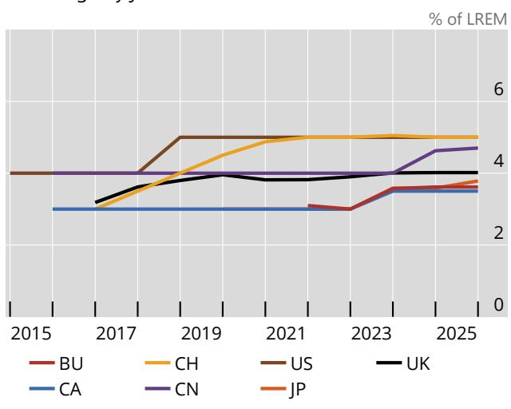

B. Stack decomposition by component $^{2}$  
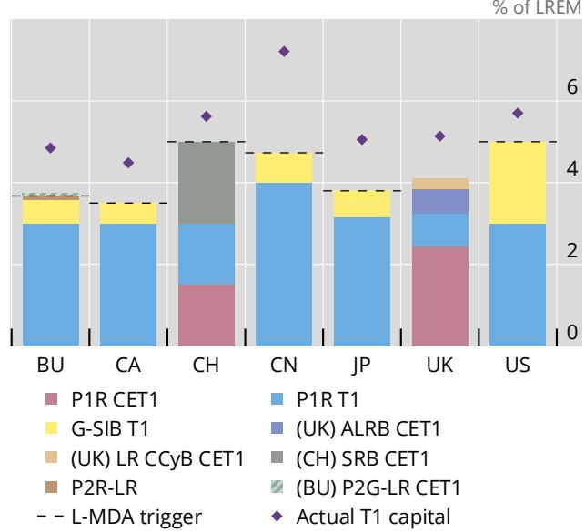  
$^{1}$ Overall leverage ratio requirements (OLRRs) as a percentage of leverage ratio exposure measure (LREM) include all binding buffers where applicable and exclude non-binding supervisory recommendations, whether explicitly communicated (eg Pillar 2 guidance) or implied by stress test results (eg US Comprehensive Capital Analysis and Review prior to Q4 2020). OLRRs for the US show the enhanced supplementary leverage ratio requirements. $^{2}$ This panel shows leverage ratio requirements as a percentage of LREM, on a weighted average basis, as of year-end 2025. Note that actual leverage ratios may not be fully comparable across jurisdictions, as central bank reserves are excluded from the exposure measure in both the UK and Japan. P2R-LR for CH must be fully met with CET1, whereas for the BU, banks can fulfil Pillar 2 requirements with a minimum 56.25% of CET1 and 75% of Tier 1. P2G-LR for BU corresponds to the weighted average add-on of 0.05% applicable to five banks in 2025, which are not disclosed and therefore do not necessarily (only) include G-SIBs. CH systemic risk CET1 buffer is composed of a 1.5% base buffer capital requirement, a 0.25% LRE add-on requirement and a 0.25% market share add-on requirement. Dashed horizontal lines indicate the leverage ratio-related maximum distributable amount (L-MDA) triggers or their equivalent. Breaching these capital levels usually automatically restricts discretionary payments, including dividends and variable remuneration. The UK does not impose such automatic restrictions.

Sources: Banks' disclosures; ECB; S&P Capital IQ; authors' calculations.

Box C

## Recent and proposed changes in capital frameworks affecting G-SIBs

In the process of completing the implementation of the Basel III framework, some G-SIB home jurisdictions have put forward proposals to revise some elements of the local implementation of the standard. This box summarises these proposals.

In March 2026, US federal agencies issued proposed revisions to the risk-based capital framework. $^{①}$ The revisions include modifications to the US-specific G-SIB surcharge methodology (Method 2): (i) more granular G-SIB surcharges in 10, rather than 50, basis point increments; (ii) calculation of most G-SIB indicators using averages over the year rather than year-end values to reduce window-dressing behaviour; and (iii) a relaxation of requirements under Method 2 by modifying coefficients to reflect economic growth and (iv) a change in the measurement and weighting of the short-term wholesale funding indicator. $^{②}$ Overall, these changes would reduce the G-SIB surcharge applicable under Method 2, which applies in parallel to the BCBS G-SIB methodology and generally results in more conservative buffers.

The US proposals would also replace the current US two-stack framework, where separate capital stacks are calculated using standardised and advanced approaches, in favour of a single-stack approach – the “expanded risk-based approach” (ERBA) – for G-SIBs and other very large banks. $^{③}$ Under the ERBA, only standardised approaches would be allowed for credit, counterparty credit and operational risk, while internal models would remain available for market risk. The Basel III output floor is not envisaged under the US revisions.

Separately, reforms to the US enhanced supplementary leverage ratio which became effective in April 2026 removed the flat 2% G-SIB buffer of top of the 3% Tier 1 minimum requirement and replaced it with a buffer set at 50% of the G-SIB surcharge as determined under the BCBS method. This reduces the leverage ratio surcharge for US G-SIBs and aligns its calibration with international practice. The revisions sought to restore the leverage ratio's role as a backstop to risk-based capital rather than a frequently binding constraint. $^{④}$

In the UK, final Basel III rules are scheduled to take effect on 1 January 2027, delaying the Basel III implementation by one year. $^{⑤}$ The output floor phases from 50% at implementation to 72.5% by 2030. The Financial Policy Committee has lowered its system-wide Tier 1 capital benchmark from around 14% to around 13% RWA, arguing that this change was justified by improvements in the risk measurements following the implementation of Basel III and that systemic buffers are lower than initially envisaged in 2015 as some banks have decreased in systemic importance. $^{⑥}$ The Prudential Regulation Authority (PRA) proposal to update Pillar 2A methodologies delivered a final policy covering reporting templates, reporting instructions and schedule, with implementation set for 1 January 2027. $^{⑦}$ The PRA also issued a consultation paper setting out proposed adjustments to the Basel III internal model approach for market risk. $^{⑧}$ Potential changes to the leverage ratio framework and a simplification of the capital stack are currently being reviewed. $^{⑨}$

In the BU, the Basel III package was implemented in July 2024. Most Basel III rules apply from 1 January 2025, while the new market risk framework (the Fundamental Review of the Trading Book) is deferred to 1 January 2027, in line with the UK. $^{⑩}$ This regulatory package revises the risk-based capital framework and introduces the output floor, phased in from 50% in 2025 to 72.5% by 2030.

Separately, the European Commission has launched a consultation on the competitiveness of the European banking sector, citing fragmentation, limited cross-border integration and an overly complex regulatory landscape. $^{⑪}$ The Eurosystem has responded with a report, also drawing on recommendations of a previously established High-Level Task Force on Simplification. $^{⑫}$ Among the proposals are merging the current five macroprudential buffers into two, one releasable and one non-releasable, and replacing the current combination of an EU capital requirements regulation and a directive transposed into national law with one single set of directly applicable EU requirements, reducing national divergence. The Eurosystem’s report also touches upon the going-concern loss-absorbing capacity of the capital stack, suggesting either enhancing the features of AT1 instruments to strengthen their loss absorption capabilities or removing non-CET1 instruments from the going-concern capital framework altogether. While the latter option could reduce complexity, the Eurosystem has noted that it raises significant questions about resilience, Basel III compliance and capital neutrality, particularly if non-CET1 instruments were removed without being fully replaced by CET1, which would imply a tightening of CET1 requirements. Similarly, the European Banking Authority put forward a report reflecting on how to streamline the EU capital framework without reducing banks’ resilience nor weakening supervisory action. $^{⑬}$ It discusses options to reduce unnecessary complexity, improve consistency and predictability, and support effective supervisory and resolution tools.

In Switzerland, Basel III rules entered into force on 1 January 2025. $^{⑭}$ They start the 72.5% output floor transition, restrict internal models for certain risks and adopt revised standardised approaches for credit, market and operational risk. Separately, the Federal Council has proposed a targeted strengthening of the too-big-to-fail framework under which systemically important banks would have to fully back participations in foreign subsidiaries with CET1 capital at the Swiss parent bank level. $^{⑮}$ The proposal is intended to reduce double leverage and strengthen the loss-absorbing capacity of the parent company, addressing vulnerabilities revealed by the Credit Suisse case. If adopted by the parliament, the requirement would be phased in over seven years. In addition, Switzerland has tightened certain other aspects of the capital framework (the treatment of software and prudential valuation adjustments).

① FDIC, Federal Reserve and OCC (2026). ② Federal Register (2026a). ③ Federal Register (2026b). ④ OCC (2025). ⑤ PRA (2026a). ⑥ Bank of England (2025). This benchmark needs to be understood as a system-wide reference point rather than a mechanical reduction of individual bank requirements. ⑦ PRA (2026b). ⑧ PRA (2026c). ⑨ Bailey (2026). ⑩ CRR III (Regulation (EU) 2024/1623); CRD VI (Directive (EU) 2024/1619). ⑪ European Commission (2026). ⑫ ECB (2025, 2026). ⑬ EBA (2026). ⑭ CAO: Ordinance - Switzerland - 2025/952.03. ⑮ Swiss Federal Council (2026); FINMA (2025).

57. This paper documents differences in the various components of the risk-based capital requirements for G-SIBs. The Basel III framework has enhanced the quality and quantity of capital held by G-SIBs, ensuring they are better equipped to withstand shocks. In line with the flexibility embedded in Basel III, the structure, characteristics and levels of capital requirements, buffers and supervisory requirements and guidance vary across jurisdictions. These differences directly influence the capital requirements for banks and imply due care is needed when making cross-border comparisons.

58. Differences in required capital ratios stem partly from banks' different levels of systemic importance. The current Basel III G-SIB buffers range from 1 to $2.5\%$ of RWA, but one jurisdiction imposes higher surcharges (up to $4.5\%$ ) using a parallel method that generally yields more conservative surcharges than those prescribed by Basel III.

59. The level of capital ratio requirements is less dispersed for the highest-quality capital than overall. CET1 ratios are somewhat more aligned even where their component mix varies significantly across supervisory requirements and guidance, systemic and countercyclical buffers, and other buffers.

60. There is significant heterogeneity in the average RWA density across jurisdictions, which seems to be influenced by the degree to which internal models can be used to calculate RWA. It is not possible to fully disentangle how much of the variation in RWA stems from portfolio composition versus supervisory or methodological choices such as the approach taken in relation to the use of internal models. That said, RWA densities appear significantly more homogeneous across jurisdictions when based on similar risk measurement approaches, indicating that the modelling choice does play a role.

61. There is some indication that certain jurisdictions may have adopted higher capital ratio requirements to compensate for lower conservatism in RWA measurement. In general, RWA densities seem to proxy for the conservatism of risk measurement. In addition, banks' required capital ratios tend to increase as these densities decline. The comparability in RWA across jurisdictions may be further affected by the phased implementation of the output floor, with different timelines and impacts across jurisdictions.

62. Cross-country averages also highlight some heterogeneity in the levels and capital composition of the leverage ratio requirements for G-SIBs. Similarly to the risk-based capital stack, national authorities have implemented different leverage ratio minima, buffer structures, capital quality requirements and adjustments to the exposure measure (the denominator of the leverage ratio). These differences result in heterogeneous stacks for the leverage ratio, with different levels of overall requirements.

63. Drawing on lessons from the Basel III transition, several authorities are exploring ways to modernise their national frameworks. These efforts may help to simplify the structure of capital requirements. At the same time, if those proposals are approved, they may also affect comparisons across jurisdictions. International dialogue can help to ensure progress and avoid financial fragmentation. Meanwhile, ongoing efforts by the BCBS to facilitate access to published supervisory data will increase transparency regarding the diverse approaches taken by different jurisdictions.

## References

Bailey, D (2026): "Building a banking regime for the future", speech at JPM UK Banks ALM Conference, 28 April.

Bank of England (2025): Financial Stability in Focus: The FPC's assessment of bank capital requirements, Financial Policy Committee.

Bank of Japan (2020): "Supervisory simultaneous stress testing based on common scenarios", Bank of Japan Review, 2020-E-9.

Basel Committee on Banking Supervision (BCBS) (2014): The G-SIB assessment methodology – score calculation.

(2016a): Regulatory consistency assessment programme (RCAP) – Analysis of risk-weighted assets for credit risk in the banking book.

(2016b): RCAP – Assessment of Basel III G-SIB framework and review of D-SIB frameworks – China.
(2017): Basel III: Finalising post-crisis reforms.

Board of Governors of the Federal Reserve System (2024): "2024 Federal Reserve stress test results".

Böhnke, V, S Ongena, F Paraschiv and E Reite (2024): "Back to the roots of internal credit risk models: Does risk explain why banks' risk-weighted asset levels converge over time?", Deutsche Bundesbank Discussion Paper, no 02/2024.

China News Service (2011): "银监会就《新监管标准指导意见》答记者问 (2)" ("The CBRC responds to reporters' questions on the 'Guiding Opinions on the New Regulatory Standards")", 3 May, www.chinanews.com/fortune/2011/05-03/3013767\_2.shtml.

Dzezulskis, S, M Libertucci and S McPhilemy (2026): "Understanding the banking sector capital framework in the European Union", European Central Bank Occasional Paper Series, no 387.

European Banking Authority (EBA) (2026): "Report on simplifying the stacking orders of the EU prudential and resolution framework", 16 June.

European Central Bank (ECB) (2025): "Simplification of the European prudential regulatory, supervisory and reporting framework".

(2026): Eurosystem response to the EU Commission's targeted consultation on the competitiveness of the EU banking sector.

European Commission (2026): "Targeted consultation on the competitiveness of the EU banking sector".

Federal Deposit Insurance Corporation (FDIC), Federal Reserve Board and Office of the Comptroller of the Currency (OCC) (2026): "Agencies request comment on proposals to modernize the regulatory capital framework and maintain the strength of the banking system", press release, 19 March.

Federal Register (2010): Risk-based capital standards: Advanced capital adequacy framework – Basel II; establishment of a risk-based capital floor.

(2015): Regulatory capital rules: Implementation of risk-based capital surcharges for global systemically important bank holding companies, vol 80.

(2026a): Regulatory capital rule (Regulation Q): Risk-based capital surcharges for global systemically important bank holding companies; Systemic risk report (FR Y-15).

(2026b): Regulatory capital rule: Category I and II banking organizations, banking organizations with significant trading activity, and optional adoption for other banking organizations.

Financial Services Agency (2020): "Publication of the draft partial amendment to the notification on leverage ratio regulation, etc", press release, 17 April.

(2022): "Publication of the results of the public comments on the draft partial amendments to cabinet and ministerial orders and notifications concerning leverage ratio regulation, etc", press release, 11 November.

Financial Stability Board (FSB) (2025): 2025 List of Global Systemically Important Banks (G-SIBs).

(2026): FSB Work programme for 2026, 3 February.

Hernández de Cos, P (2026): "Streamlining financial regulation while safeguarding stability and tackling new risks", Speech at the International Center for Monetary and Banking Studies, Geneva, 4 March.

Mariathasan, M and O Merrouche (2014): "The manipulation of Basel risk-weights", Journal of Financial Intermediation, vol 23, no 3.

Office of the Comptroller of the Currency (2025): "Modifications to the enhanced supplementary leverage ratio standards for US global systemically important bank holding companies: final rule", OCC Bulletin, no 2025-41.

Office of the Superintendent of Financial Institutions (OSFI) (2026a): Benchmarking Canadian bank capital ratios to international peers – Technical note – February 2026.

(2026b): Domestic Stability Buffer – Decision Summary Note – June 2026.

Prudential Regulation Authority (PRA) (2021): "The PRA's methodologies for setting Pillar 2 capital", Statement of Policy, July.

(2026a): "PS1/26 – Implementation of Basel 3.1: Final rules", Policy Statement 1/26.

(2026b): "PS15/26 – Pillar 2A review – Phase 1", Policy Statement 15/26.

(2026c): "CP9/26 – Basel 3.1: Adjustments to the internal model approach (IMA) for market risk", Consultation paper 9/26.

Schaeck, K and M Čihák (2007): "Banking competition and capital ratios", IMF Working Papers, vol 2007, no 216.

Scharfstein, D and J Stein (1990): "Herd behavior and investment", American Economic Review, vol 80, no 3.

Swiss Federal Council (2026): "Too-big-to-fail regulations: Federal Council adopts dispatch and Capital Adequacy Ordinance", press release, 22 April.

Swiss Financial Market Supervisory Authority (FINMA) (2025): "Capital backing for foreign participations", Information sheet, June.

Thedéen, E (2026): "Trends in capital rules for banks", speech at SNS & Swedish House of Finance, 31 March.

## Annex 1: List of G-SIBs in the sample

Table A.1 provides a list of the 29 banks designated as G-SIBs, along with their jurisdictions and G-SIB designation periods. The sample represents a constant set of banks based on their G-SIB status as of end-2025, regardless of changes in G-SIB status during the period 2014–25.

<table><tr><td colspan="3">Bank sample – list of 29 G-SIBs1</td></tr><tr><td>Bank name</td><td>Jurisdiction</td><td>G-SIB designation</td></tr><tr><td>Deutsche Bank</td><td>BU (DE)</td><td>2012–25</td></tr><tr><td>Banco Santander</td><td>BU (ES)</td><td>2012–25</td></tr><tr><td>BNP Paribas</td><td>BU (FR)</td><td>2012–25</td></tr><tr><td>BPCE Group</td><td>BU (FR)</td><td>2012–252</td></tr><tr><td>Crédit Agricole Group</td><td>BU (FR)</td><td>2012–25</td></tr><tr><td>Société Générale</td><td>BU (FR)</td><td>2012–25</td></tr><tr><td>ING Group</td><td>BU (NL)</td><td>2012–25</td></tr><tr><td>Royal Bank of Canada</td><td>CA</td><td>2012–25</td></tr><tr><td>Toronto-Dominion Bank</td><td>CA</td><td>2019–25</td></tr><tr><td>UBS</td><td>CH</td><td>2012–25</td></tr><tr><td>Agricultural Bank of China</td><td>CN</td><td>2014–25</td></tr><tr><td>Bank of Communications</td><td>CN</td><td>2022–25</td></tr><tr><td>Bank of China</td><td>CN</td><td>2012–25</td></tr><tr><td>China Construction Bank</td><td>CN</td><td>2015–25</td></tr><tr><td>Industrial and Commercial Bank of China</td><td>CN</td><td>2013–25</td></tr><tr><td>Mizuho Financial Group</td><td>JP</td><td>2012–25</td></tr><tr><td>Sumitomo Mitsui Financial Group</td><td>JP</td><td>2012–25</td></tr><tr><td>Mitsubishi UFJ Financial Group</td><td>JP</td><td>2012–25</td></tr><tr><td>Barclays</td><td>UK</td><td>2012–25</td></tr><tr><td>HSBC</td><td>UK</td><td>2012–25</td></tr><tr><td>Standard Chartered</td><td>UK</td><td>2012–25</td></tr><tr><td>Bank of New York Mellon</td><td>US</td><td>2012–25</td></tr><tr><td>Citigroup</td><td>US</td><td>2012–25</td></tr><tr><td>Wells Fargo</td><td>US</td><td>2012–25</td></tr><tr><td>Bank of America</td><td>US</td><td>2012–25</td></tr><tr><td>JPMorgan</td><td>US</td><td>2012–25</td></tr><tr><td>Morgan Stanley</td><td>US</td><td>2012–25</td></tr><tr><td>Goldman Sachs</td><td>US</td><td>2012–25</td></tr><tr><td>State Street</td><td>US</td><td>2012–25</td></tr></table>

$^{1}$ Constant sample includes all banks with G-SIB status as of end-2025 from 2014 to 2025, regardless of changes in G-SIB status. $^{2}$ Not designated as a G-SIB in 2017.

Graph A.2

## Annex 2: Variation in capital requirements and actual capital ratios

Graph A.2 illustrates the bank-level variation in capital requirements and actual capital ratios for G-SIBs by jurisdiction as of end-2025.

## Capital requirements and actual capital ratios $^{1}$

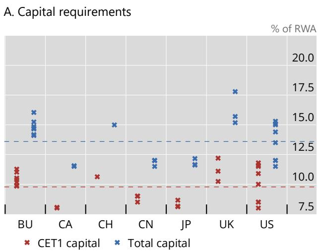

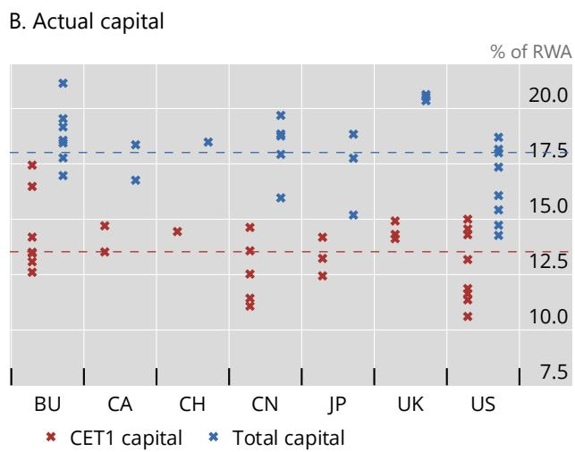  
$^{1}$ Shows bank-specific overall capital requirements (excluding non-binding capital buffers) for G-SIBs by country as of end-2025: seven banks from BU, two from CA, five from CN, three from JP, one from CH, three from UK and eight from US. Some observations within a country overlap due to similar or identical overall capital requirements. The horizontal dashed line represents the cross-sectional average. Pairwise comparison of mean, standard deviation (SD) and coefficient of variation (CV) below, higher value in bold:  
Panel A: CET1 capital: mean = 9.78; SD = 1.31; CV = 13.43    Total capital: mean = 13.59; SD = 1.79; CV = 13.18.  
Panel B: CET1 capital: mean = 13.53; SD = 1.56; CV = 11.56 Total capital: mean = 18.01; SD = 1.78; CV = 9.89.  
Sources: Banks' disclosures, S&P Capital IQ; authors' calculations.

## Annex 3: Variation in capital requirements (after excluding different components)

Graph A.3 illustrates the bank-level dispersion of capital requirements for G-SIBs by jurisdiction as of end-2025, showing unadjusted values, the impact of applying Method 1 G-SIB buffers (as per the FSB G-SIB list) instead of Method 2 for US banks, the impact of excluding all G-SIB buffers and the impact excluding both CCyBs and G-SIB buffers.

## Dispersion of capital requirements $^{1}$

A. Unadjusted

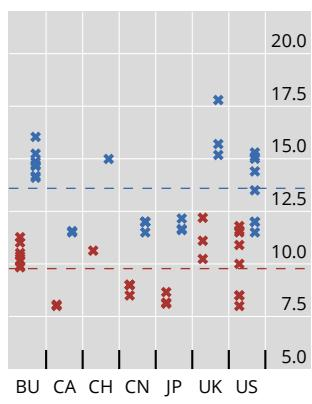  
B. Method 1 G-SIB buffer applied to US banks

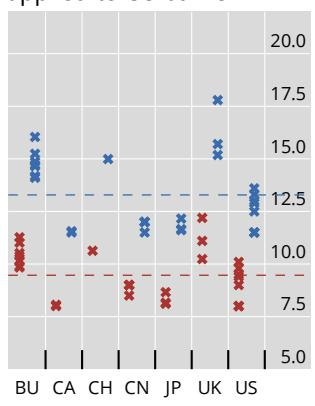  
C. G-SIB buffers excluded  
Graph A.3

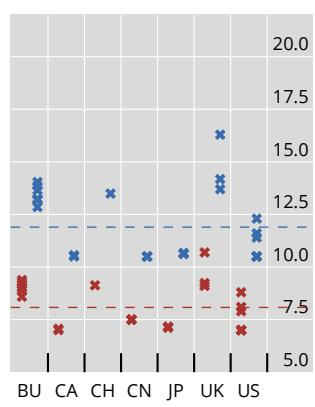  
✗ CET1 capital ✗ Total capital  
D. CCyB and G-SIB buffers excluded

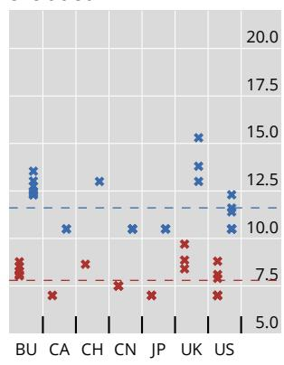  
$^{1}$ The chart shows bank-specific overall capital requirements (excluding non-binding capital buffers) for G-SIBs by country as of end-2025: seven banks from the BU, two from CA, five from CN, three from JP, one from CH, three from UK and eight from US. Some observations within a country overlap due to similar or identical overall capital requirements. The horizontal dashed line represents the cross-sectional average. Comparison of mean, standard deviation (SD) and coefficient of variation (CV) across panels below, lowest values in bold:

Panel A: CET1 capital: mean = 9.78; SD = 1.31; CV = 13.43 Total capital: mean = 13.59; SD = 1.79; CV = 13.18.

Panel B: CET1 capital: mean = 9.47; SD = 1.16; CV = 12.27 Total capital: mean = 13.28; SD = 1.74; CV = 13.12.

Panel C: CET1 capital: mean = 8.07; SD = 1.03; CV = 12.85 Total capital: mean = 11.90; SD = 1.65; CV = 13.89.

Panel D: CET1 capital: mean = 7.79; SD = 0.75; CV = 9.67 Total capital: mean = 11.61; SD = 1.34; CV = 11.58.

Sources: Banks' disclosures, S&P Capital IQ; authors' calculations.

## Annex 4: RWA density and CET1 capital requirements

Graph A.4 plots bank-level RWA densities against CET1 capital requirements (including non-binding capital buffers) as of end-2025. The fitted trendline indicates a statistically negative relationship between the two variables.

RWA density vs CET1 capital requirements by bank $^{1}$  
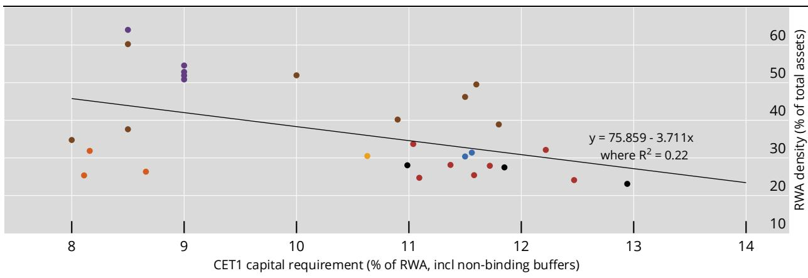

$^{1}$ Shows bank-level data for the 29 G-SIBs as of end-2025. RWA density is defined as risk weighted assets over total assets. Includes a constant sample of banks with G-SIB status as of end-2025. Overall CET1 capital requirements include minimum requirements and all legally binding buffers and capital add-ons, eg CCoB, CCyB, systemic surcharges and Pillar 2 requirements, as well as non-binding capital buffers, which are Pillar 2 guidance in the BU, Pillar 2 buffer in UK and Domestic Stability Buffer in CA.

Sources: Banks' disclosures; ECB; S&P Capital IQ; authors' calculations.

## Annex 5: Use of internal models and credit risk RWA densities before model restrictions

Graph A.5 shows the use of internal models and RWA densities for G-SIBs as of end-2025. Panel A illustrates the average share of RWAs calculated using internal models by risk category (considering model restrictions) alongside the overall RWA density, by jurisdiction. Panel B highlights differences in the average credit risk IRB RWA density (before model restrictions), distinguishing between advanced and foundation IRB approaches, along with the weighted average overall IRB RWA density, by jurisdiction.

## G-SIBs' internal model usage by bank $^{1}$

A. Share of RWA calculated using internal models and RWA density $^{2}$

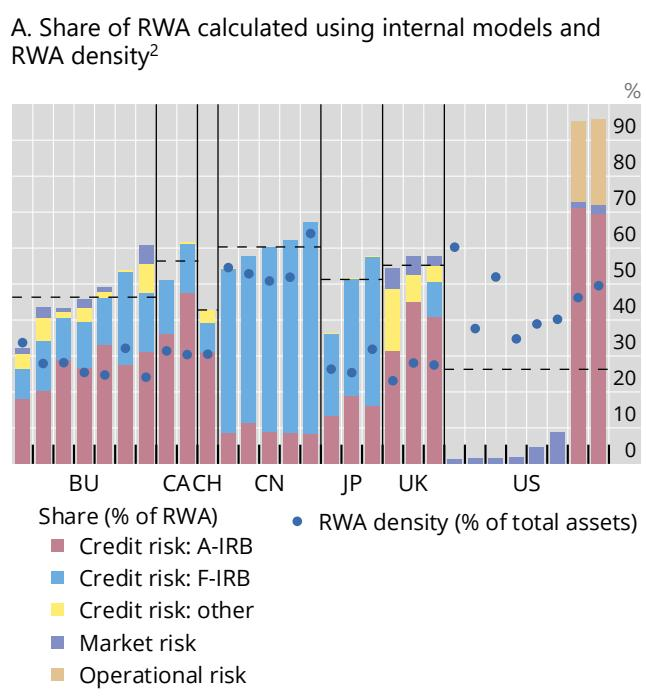

Graph A.5

B. Credit risk IRB RWA density before model restrictions $^{3}$

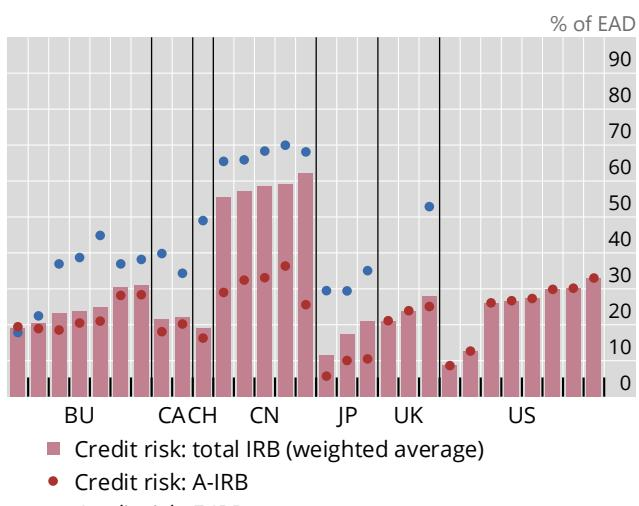  
A-IRB = advanced internal ratings-based approach; F-IRB = foundation internal ratings-based approach.

$^{1}$ Shows bank-level data as of end-2025. $^{2}$ Share of RWA using internal models is calculated as the share of RWA using internal model approaches over total RWA, by risk category. For credit risk, the category “other” aggregates RWA calculated under the supervisory slotting approach, SEC-IRB and counterparty credit risk using the internal model method. For US banks bound by the standardised approach, given the Collins floor, the numerator comprises modelled market risk RWA components and the denominator is total RWA under the US standardised approach. For JP Morgan and Citigroup, the two US G-SIBs for which the advanced approach yields higher RWA in Q4 2025, the numerator consists of modelled credit, market and operational risk RWA components, and the denominator is total RWA under the US advanced approach. $^{3}$ IRB RWA density is calculated as aggregate RWA of the respective IRB approach, A-IRB vs F-IRB, over associated aggregate exposure at default (EAD), post credit conversion factors and credit mitigation techniques, by jurisdiction. Credit risk: total IRB is the weighted average RWA density of both approaches combined. Calculation does not include exposures to repo transactions, margin loans, and OTC derivatives. The impact of internal model restrictions such as the output floor, and the Collins floor in the US are not considered (ie for US, the figures refer to RWA calculated under the advanced approach). US G-SIBs only use the A-IRB approach. Two out of three UK G-SIBs do not use the F-IRB approach in 2025 Q4. For Chinese banks, only the F-IRB approach is permitted for corporate exposures.

Sources: Banks' disclosures; S&P Capital IQ; authors' calculations.

## Annex 6: Advanced IRB RWA density by exposure type

Graph A.6 shows the average advanced IRB approach RWA density by selected exposure types for G-SIBs as of end-2025, by jurisdiction. Panel A presents the RWA density for retail residential mortgages, panel B for other retail exposures, panel C for corporate exposures and panel D for the aggregate of these exposure types.

Advanced IRB approach RWA density by selected exposure types $^{1}$

A. Retail – residential mortgage $^{2}$

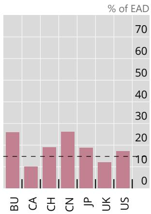  
B. Retail – other retail $^{3}$

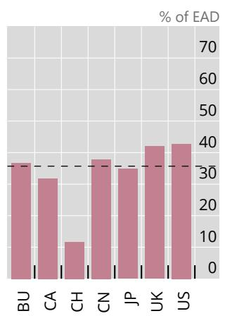  
C. Corporates $^{4}$

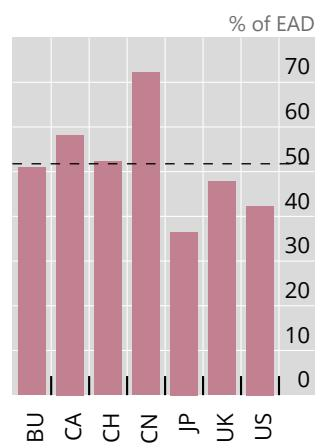  
Graph A.6

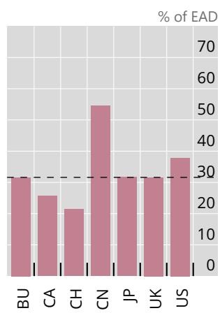

$^{1}$ Advanced internal ratings based (A-IRB) approach RWA densities are calculated as RWA over EAD post-CRM and post-CCF, respectively. Information is primarily disclosed in table CR6 (A-IRB credit risk exposures), available for most banks from 2025 onwards. Calculations are based on Q2 2025 disclosures. Residential real estate (RRE) risk weights (RW) and other retail RW cannot be calculated for State Street (US) due to missing data or negligible exposures. Repo transactions, margin loans and OTC derivatives are generally excluded if disclosed. $^{2}$ RRE includes mortgages secured by real estate. For BU and UK banks, small and medium-sized enterprise (SME) exposures are explicitly disclosed and included, as are (mostly negligible) purchased receivables for some BU banks. For CA, both insured and uninsured/unsecured mortgages, as well as home equity line of credit (HELOC), are included. For US banks, RRE generally includes closed-end first lien, junior lien and revolving exposures. $^{3}$ Other retail includes general other retail and qualifying revolving exposures (QRRE). SME exposures are explicitly disclosed and included for BU, CA and UK banks. QRRE is negligible for Morgan Stanley (US) and not reported. $^{4}$ Includes general and specialised corporate lending. SME exposures are explicitly disclosed and included for BU, JP and UK banks. For CH, corporates – other lending is included. For US banks, the corporates category includes income-producing real estate (IPRE) and high volatility commercial real estate (HVCRE). For China, only the F-IRB approach is permitted for corporates. $^{5}$ Total is calculated as aggregate RWA of the included categories over aggregate EAD by country.

Sources: Banks' disclosures; authors' calculations.

## Annex 7: Capital requirements stack by jurisdiction, over time (2014–25)

Graphs A.7.1 and A.7.2 show the risk-based total capital requirements and actual ratios for G-SIBs by jurisdiction over time, from 2014 to 2025.

## Risk-based total capital ratios: required vs actual, by jurisdiction, over time $^{1}$

European banking union $^{2}$

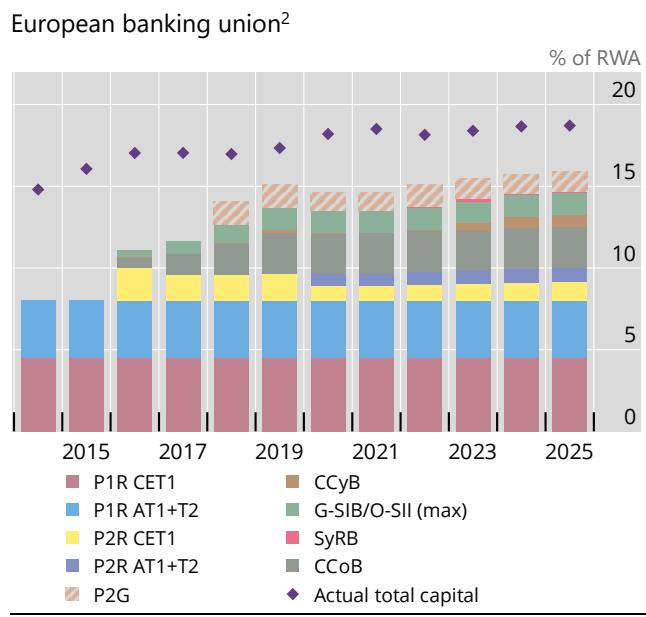

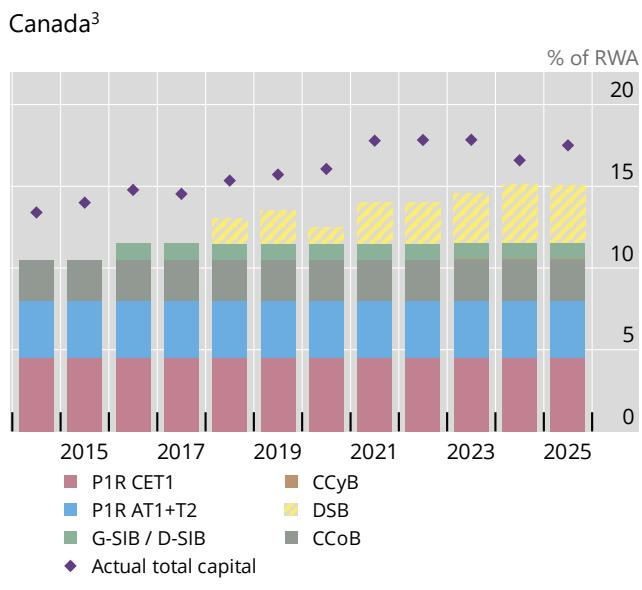  
China $^{4}$

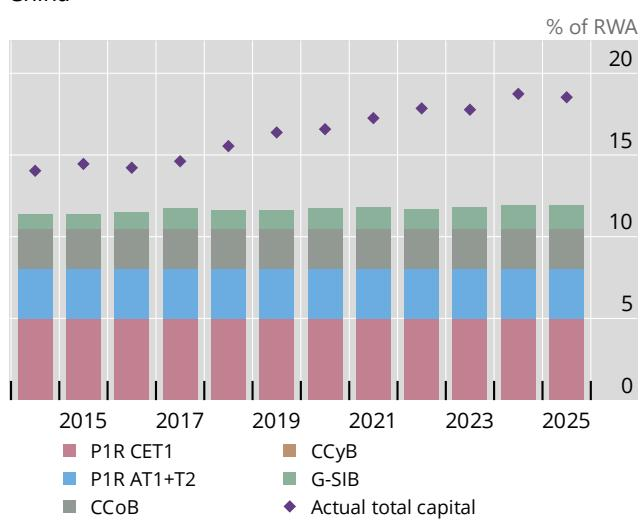

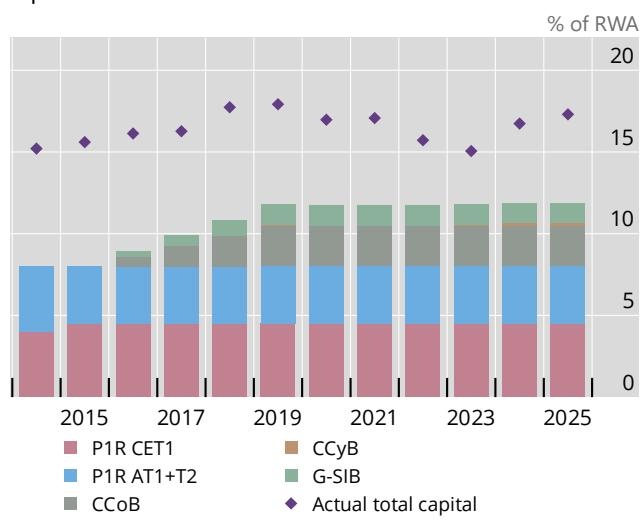  
$^{1}$ Shows risk-based capital requirements by jurisdiction as a percentage of RWA, on a weighted average basis. Unless otherwise indicated, all stack components must be met with CET1 capital. Non-binding capital buffers are shaded. Actual total capital ratios and requirements are shown reflecting transitional arrangements, eg for the CCoB or the G-SIB buffer. $^{2}$ Before 2020, P2R had to be fully met with CET1 capital. From 2020, P2R must be met with at least 56.25% CET1 capital, 75% with Tier 1 capital and a maximum of 25% with Tier 2 capital. For the G-SIB surcharge, the higher of the G-SIB buffer as per the FSB G-SIB list and O-SII buffer as per national discretion applies. As of end-2025, the O-SII buffer is binding for three G-SIBs in the BU. For P2G, the system-wide average is disclosed since 2018, the G-SIB average available since 2023. $^{3}$ The DSB applies system-wide to D-SIBs and has been disclosed since 2018. For the G-SIB surcharge, the higher of the G-SIB buffer as per the FSB G-SIB list and D-SIB buffer as per national discretion applies. $^{4}$ Phase-in timelines of G-SIB buffers and the CCoB are inferred from BCBS (2016b) due to limited information in banks' disclosures in earlier years.

Sources: Banks' disclosures; BCBS (2016b); ECB; S&P capital IQ; authors' calculations.

Risk-based total capital ratios: required vs actual, by jurisdiction, over time $^{1}$ (cont) Graph A.7.2

Switzerland $^{2}$  
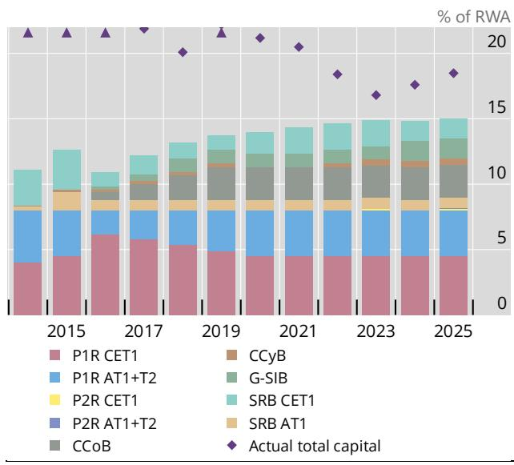

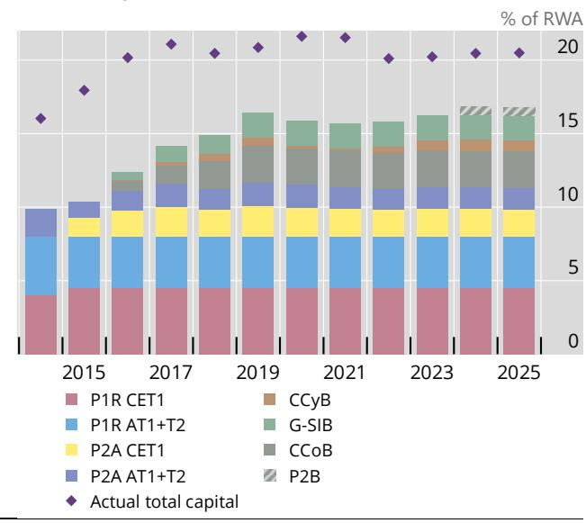

United States – advanced approach $^{4}$  
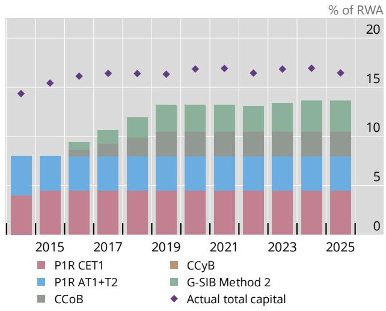

United States – standardised approach $^{4}$  
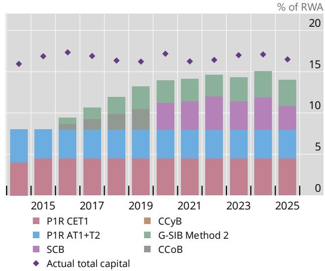

$^{1}$ Shows risk-based capital requirements by jurisdiction as a percentage of RWA, on a weighted average basis. Unless otherwise indicated, all stack components must be met with CET1 capital. Non-binding capital buffers are shaded. Actual total capital ratios and requirements are shown reflecting transitional arrangements, eg for the CCoB or the G-SIB buffer. $^{2}$ The Swiss SRB CET1 buffer is defined as the remainder after subtracting the internationally applicable CCoB and G-SIB surcharge from the Swiss-specific CET1 systemic risk buffer of 5.5%. From 2016 onwards, Tier 2 capital is not eligible to meet the "P1R AT1+T2" component under the too-big-to-fail framework. $^{3}$ The UK P2B, which has been set since before 2014, is not disclosed (also not as a system-wide average) but can be visually approximated based on the Bank of England (2025) report covering the 14 largest banks in the UK. In 2014, no minimum CET1 or AT1 components were required to meet the P2A requirements. $^{4}$ Due to the two-stack approach, both advanced approach (AA) and standardised approach (SA) requirements apply separately to US G-SIBs. Under the AA, the internationally applicable CCoB applies; under the SA, the CCoB applied until October 2020 and was subsequently replaced by the dynamic stress capital buffer. For each bank, the binding approach is the one that yields a higher nominal capital requirement, calculated as AA (SA) RWA times AA (SA) capital ratio requirements. For both AA and SA, for the G-SIB surcharge, the higher of Method 1 (equivalent to the FSB G-SIB list surcharges) and Method 2 applies, where the latter replaces the substitutability indicator of Method 1 with a measure of short-term wholesale funding and applies fixed coefficients for the denominators, rather than calculating a market share based on other banks' values each year. By design, Method 2 leads to higher or equal surcharges for all US G-SIBs.

Sources: Banks' disclosures; S&P capital IQ; authors' calculations.

## Abbreviations

<table><tr><td>AA</td><td>advanced approach</td></tr><tr><td>A-IRB</td><td>advanced internal ratings-based</td></tr><tr><td>ALRB</td><td>additional leverage ratio buffer</td></tr><tr><td>AT1</td><td>Additional Tier 1</td></tr><tr><td>CCLB</td><td>countercyclical leverage buffer</td></tr><tr><td>CCoB</td><td>capital conservation buffer</td></tr><tr><td>CCyB</td><td>countercyclical capital buffer</td></tr><tr><td>CET1</td><td>Common equity Tier 1</td></tr><tr><td>CV</td><td>coefficient of variation</td></tr><tr><td>CVA</td><td>credit valuation adjustment</td></tr><tr><td>DSB</td><td>Domestic Stability Buffer</td></tr><tr><td>D-SIB</td><td>domestic systemically important bank</td></tr><tr><td>EAD</td><td>exposure at default</td></tr><tr><td>eSLR</td><td>enhanced supplementary leverage ratio</td></tr><tr><td>G-SIB</td><td>global systemically important bank</td></tr><tr><td>IMM</td><td>internal model method</td></tr><tr><td>IRB</td><td>internal ratings-based</td></tr><tr><td>IRRBB</td><td>interest rate risk in the banking book</td></tr><tr><td>LGD</td><td>loss given default</td></tr><tr><td>LR</td><td>leverage ratio</td></tr><tr><td>LREM</td><td>leverage ratio exposure measure</td></tr><tr><td>MDA</td><td>maximum distributable amount</td></tr><tr><td>O-SII</td><td>other systemically important institution</td></tr><tr><td>OLRR</td><td>overall leverage ratio requirement</td></tr><tr><td>P2A</td><td>Pillar 2A</td></tr><tr><td>P2B</td><td>Pillar 2B</td></tr><tr><td>P2R</td><td>Pillar 2 requirement</td></tr><tr><td>P2G</td><td>Pillar 2 guidance</td></tr><tr><td>PD</td><td>probability of default</td></tr><tr><td>RRE</td><td>residential real estate</td></tr><tr><td>RWA</td><td>risk-weighted assets</td></tr><tr><td>SA</td><td>standardised approach</td></tr><tr><td>SCB</td><td>stress capital buffer</td></tr><tr><td>SFT</td><td>securities financing transactions</td></tr><tr><td>SyRB</td><td>systemic risk buffer</td></tr><tr><td>T1</td><td>Tier 1</td></tr><tr><td>T2</td><td>Tier 2</td></tr></table>