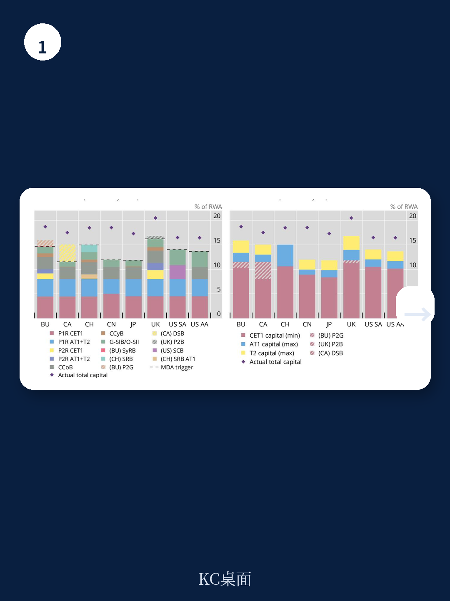
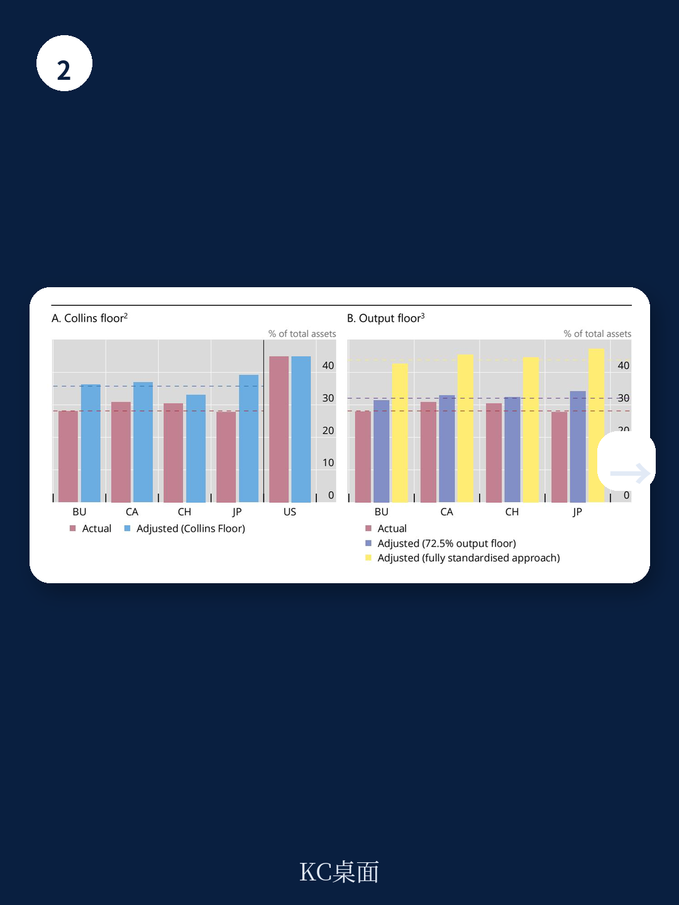

# 国际清算银行：7个司法管辖区GSIB资本要求差异，不是标准而是操作

全球系统重要性银行（G-SIB）的资本要求，表面看是同一套巴塞尔III框架，实际执行中却像七种不同的语言。国际清算银行资金稳定研究所（FSI）在2026年7月发布的一份报告中，基于29家G-SIB从2014到2025年的手工整理数据，给出了一个关键判断：**不同司法管辖区在资本要求上的差异，其核心来源不是最低标准，而是各国在缓冲、附加要求和监管指引上的“超额”操作**。

这份报告的价值在于，它把资本要求这个高度技术化的话题，还原为一个关于竞争公平性和监管可信度的现实问题。当一家美国银行和一家欧洲银行坐在同一张谈判桌上，它们的资本成本可能相差数个基点，而这与不确定性无关，与监管架构有关。

## 1. 资本堆叠层的数量差异，从4层到8层不等

巴塞尔III的资本要求由多个层次构成：最低资本要求、资本保存缓冲、逆周期资本缓冲、G-SIB附加缓冲、系统性不确定性缓冲，以及各司法管辖区特有的附加项。报告发现，在七个主要司法管辖区中，G-SIB的资本堆叠层数从4层到8层不等。

这种差异不是形式上的。报告数据显示，2025年，某些司法管辖区仅“非最低要求”部分（即缓冲和附加项）的贡献，平均高达3个百分点，而另一些地区仅有0.1个百分点。这直接导致核心一级资本（CET1）要求在各司法管辖区平均值从约8%到11%不等，而总资本要求的差距更大，从接近12%到接近17%。

> **KC评论：** 这意味着，判断一家G-SIB的资本充足率是否足够，不能只看其总资本比率数值，而要看其背后的堆叠结构。一家总资本比率15%的银行，如果其堆叠层数少、缓冲要求低，其实际抗不确定性能力可能弱于一家总资本比率13%但堆叠层数多的银行。报告中的图表（Graph A.7.1至A.7.2）对每个司法管辖区的时间序列做了拆解，值得细看。

## 2. 不确定性权重计算方法的差异，让资本要求比较变得扭曲

资本要求的比较，绕不开分母——不确定性加权资产（RWA）。报告揭示了不同司法管辖区在不确定性权重计算上的显著差异。平均不确定性密度（总资产与RWA之比）在各司法管辖区之间差异巨大，而这并非完全由资产组合的不确定性特征决定。

证据在于：当报告用假设的“标准化方法”统一计算不确定性权重时，各银行之间的不确定性密度离散度明显下降。这意味着，部分差异来自各国对内部模型使用的不同宽容度。报告还发现一个有趣的现象：**不确定性密度较低的司法管辖区，往往伴随更高的资本要求**。这暗示监管机构可能在用资本要求“补偿”不确定性度量上的宽松。

> **KC评论：** 这是报告最值得追问的部分。如果监管机构确实在“补偿”，那么这种补偿是否充分？是否存在某些司法管辖区既允许低不确定性密度，又没有相应提升资本要求？报告没有给出明确答案，但提供了一个观察框架：读者可以对比同一家银行在不同司法管辖区子公司的不确定性密度与资本要求，看是否存在“监管套利”空间。

## 3. 杠杆率要求的差异，同样不容忽视

不确定性加权资本要求之外，杠杆率要求作为非不确定性加权后门，同样存在显著的司法管辖区差异。报告指出，各国在杠杆率最低标准、缓冲结构、资本质量要求以及分母（杠杆率暴露计量）调整上，各有不同。

例如，美国实施的是“增强型补充杠杆率”（eSLR），对G-SIB的要求比巴塞尔III最低标准高出不少。而欧洲银行业联盟的杠杆率要求结构则包含不同的缓冲层次。这些差异的结果是，即使两家银行的不确定性加权资本要求相同，其杠杆率要求也可能相差半个百分点以上。

## 4. 报告尚未完全回答的关键问题：竞争中性是否正在被侵蚀？

报告在结论部分提到，多个司法管辖区正在探索监管框架的现代化改革。这些改革如果落地，可能进一步拉大或缩小现有的差异。但报告没有回答一个更根本的问题：**这种差异是否已经实质性地影响了G-SIB之间的竞争格局？**

目前，市场对G-SIB的定价主要基于其信用评级和总资本比率，而非其资本要求的堆叠结构。但正如报告所展示的，堆叠结构的差异意味着，在同样的总资本比率下，一家银行的“实际可分配利润空间”可能完全不同。如果读者开始更细致地审视这些差异，那么资本要求较低但堆叠结构较复杂的银行，可能面临重新定价。

对于产业决策者和银行管理层而言，这份报告提供了一个分析框架：在评估竞争对手时，不应只看其披露的资本比率，而应拆解其资本堆叠层、不确定性密度计算方法和杠杆率要求结构。这些细节，才是决定真实竞争地位的关键。

For informational purposes only. Portions may be generated,translated,summarized,or edited with AI assistance based on source materials and may contain omissions or errors. Please verify independently. This is not investment,legal,tax,accounting,or other professional advice.
