IMF Country Report No. 26/169

CHILE

July 2026

## 2026 ARTICLE IV CONSULTATION—PRESS RELEASE; STAFF REPORT; AND STATEMENT BY THE EXECUTIVE DIRECTOR FOR CHILE

Under Article IV of the IMF's Articles of Agreement, the IMF holds bilateral discussions with members, usually every year. In the context of the 2026 Article IV consultation with Chile, the following documents have been released and are included in this package:

\- A Press Release summarizing the views of the Executive Board as expressed during its July 6, 2026 consideration of the staff report that concluded the Article IV consultation with Chile.

\- The Staff Report prepared by a staff team of the IMF for the Executive Board's consideration on July 6, following discussions that ended on April 29, 2026, with the officials of Chile on economic developments and policies. Based on information available at the time of these discussions, the staff report was completed on June 18, 2026.

• An Informational Annex prepared by the IMF staff.

• A Statement by the Executive Director for Chile.

The IMF's transparency policy allows for the deletion of market-sensitive information and premature disclosure of the authorities' policy intentions in published staff reports and other documents.

Copies of this report are available to the public from

International Monetary Fund • Publication Services
PO Box 92780 • Washington, D.C. 20090
Telephone: (202) 623-7430 • Fax: (202) 623-7201
E-mail: publications@imf.org Web: http://www.imf.org
Price: \$18.00 per printed copy

International Monetary Fund
Washington, D.C.

# IMF Executive Board Concludes 2026 Article IV Consultation with Chile

## FOR IMMEDIATE RELEASE

\- Chile's economy remains resilient, with its outlook supported by higher copper prices, though the rise in oil prices has pushed inflation temporarily above target.

\- Heightened external risks calls for the central bank to stand ready to tighten monetary policy if oil prices remain higher for longer, while continuing to rebuild international reserves.

\- In line with the government's core objectives, medium-term policy priorities are to sustainably and credibly rebuild fiscal buffers and durably lift Chile's growth through structural reforms.

Washington, DC – July 6, 2026: The Executive Board of the International Monetary Fund (IMF) completed the Article IV Consultation for Chile. $^{1}$ The authorities have consented to the publication of the Staff Report prepared for this consultation. $^{2}$

Economic activity has remained robust, with GDP growing at 2.5 percent in 2025 driven by strong non-mining domestic demand. Inflation declined to the central bank's target in early 2026 but has since increased due to higher energy prices associated with the conflict in the Middle East. Fiscal deficits have persisted due to revenue underperformance, but public debt remains moderate. The financial system is sound overall, although vulnerabilities persist in construction and real estate.

GDP growth is expected to soften to 1.8 percent in 2026, rising to 2.6 percent in 2027 supported by higher copper prices. Inflation is expected to remain temporarily above target in 2026 and early 2027 before converging back to target. The implementation of announced fiscal consolidation measures should help gradually narrow the fiscal deficit over the medium term. However, achieving the government's objective of reaching structural balance by 2030 and keeping the debt-to-GDP ratio below 45 percent will require additional fiscal efforts. The external position is expected to remain broadly in line with medium-term fundamentals.

The outlook remains subject to elevated uncertainty, with near-term risks tilted to the downside. A more prolonged period of high oil prices could weigh on growth and inflation, and the central bank should stand ready to tighten monetary policy, if necessary. At the same time, persistently high copper prices and a successful implementation of growth-enhancing reforms could strengthen medium-term prospects. Rebuilding fiscal and external buffers, including continuing with the reserve accumulation plan, while advancing structural reforms, will be critical to maintain resilience and enhance Chile's long-term growth potential.

## Executive Board Assessment $^{3}$

Executive Directors agreed with the thrust of the staff appraisal. They commended Chile's very strong policies and institutional frameworks that have supported the economy's resilience amid heightened global uncertainty. Directors welcomed the authorities' commitment to improve structural fiscal balances, strengthen fiscal and external buffers, and advance structural reforms to preserve macroeconomic stability and enhance sustainable and inclusive growth.

Directors welcomed the authorities' plans to reduce the structural fiscal deficit to 1.5 percent of GDP by 2030 and to keep debt below 45 percent of GDP. While welcoming enhanced realism in macroeconomic assumptions, they noted that additional measures would be needed to achieve these objectives amid rising spending pressures. In this context, Directors welcomed proposed measures to rationalize expenditures, enhance spending efficiency, and support medium term growth. They emphasized that reforms under the National Reconstruction Plan should be carefully prioritized and sequenced, and that the fiscal costs and growth impact of tax and other reforms should be carefully considered to ensure fiscal sustainability. Directors noted that better targeting of the minimum guaranteed pension and consolidation of fragmented social programs could further strengthen spending efficiency while protecting the most vulnerable. They also encouraged further refinements to the already strong fiscal framework.

Directors highlighted the central bank's robust inflation targeting framework, encouraging the authorities to stand ready to tighten monetary policy should second round inflation effects materialize. They also welcomed the central bank's international reserve accumulation program that will strengthen resilience against external shocks, reinforcing the support from the FCL.

Directors agreed that the financial sector remains resilient and well supervised. Positively noting recent regulatory improvements, Directors encouraged the authorities to continue advancing the outstanding 2021 FSAP recommendations and welcomed progress made in strengthening the AML/CFT framework. Monitoring sectoral vulnerabilities in the real estate and construction sectors remains important. Directors also stressed the need to implement the recent pension reform in a well coordinated and gradual manner to avoid abrupt asset reallocations.

Directors supported the authorities' objective of fostering higher medium term growth, including through deregulation. They encouraged the authorities to also pursue complementary reforms to narrow labor market skill and gender gaps, as well as measures to improve the minimum wage setting process. Reform efforts to facilitate trade and support innovation and diversification would further boost productivity and investment.

<table><tr><td colspan="5">Table 1: Chile: Selected Economic Indicators, 2024-27</td></tr><tr><td>GDP (2025), in trillions of pesos</td><td>340</td><td colspan="3">Quota</td></tr><tr><td>GDP (2025), in billions of U.S. dollars</td><td>358</td><td colspan="2">in millions of SDRs</td><td>1,744</td></tr><tr><td>Per capita (2025), U.S. dollars</td><td>17,847</td><td colspan="2">in % of total</td><td>0.37</td></tr><tr><td>Population (2025), in millions 1/</td><td>20.0</td><td colspan="2">Poverty rate (2024) 1/</td><td>17.3</td></tr><tr><td>Main products and exports</td><td>Copper, fruits, fish</td><td colspan="2">Gini coefficient (2024) 1/</td><td>0.46</td></tr><tr><td>Key export markets</td><td>China, U.S., Euro Area</td><td colspan="2">Life expectancy (2026)</td><td>81.8</td></tr><tr><td></td><td></td><td colspan="3">Proj.</td></tr><tr><td></td><td>2024</td><td>2025</td><td>2026</td><td>2027</td></tr><tr><td>Output</td><td colspan="4">(Annual percentage change, unless otherwise specified)</td></tr><tr><td>Real GDP</td><td>2.8</td><td>2.5</td><td>1.8</td><td>2.6</td></tr><tr><td>Consumption</td><td>1.4</td><td>2.8</td><td>2.0</td><td>2.1</td></tr><tr><td>Fixed capital formation</td><td>-1.6</td><td>7.0</td><td>1.9</td><td>3.9</td></tr><tr><td>Exports of goods and services</td><td>7.2</td><td>4.6</td><td>0.6</td><td>3.5</td></tr><tr><td>Imports of goods and services</td><td>2.1</td><td>10.5</td><td>0.6</td><td>3.8</td></tr><tr><td>Output gap (in percent)</td><td>-0.1</td><td>0.2</td><td>-0.4</td><td>-0.1</td></tr><tr><td>Employment</td><td colspan="4">(in percent of labor force, annual average)</td></tr><tr><td>Unemployment rate</td><td>8.5</td><td>8.5</td><td>8.8</td><td>8.4</td></tr><tr><td>Prices</td><td colspan="4">(Annual percentage change, unless otherwise specified)</td></tr><tr><td>GDP deflator</td><td>7.1</td><td>6.8</td><td>4.1</td><td>1.5</td></tr><tr><td>Change of CPI (end of period)</td><td>4.5</td><td>3.4</td><td>4.2</td><td>3.0</td></tr><tr><td>Change of CPI (period average)</td><td>3.8</td><td>4.2</td><td>3.7</td><td>3.4</td></tr><tr><td>Public Sector Finances</td><td colspan="4">(In percent of GDP, unless otherwise specified)</td></tr><tr><td>Central government revenue</td><td>21.7</td><td>21.4</td><td>21.7</td><td>21.9</td></tr><tr><td>Central government expenditure</td><td>24.5</td><td>24.2</td><td>24.2</td><td>23.9</td></tr><tr><td>Central government fiscal balance</td><td>-2.9</td><td>-2.8</td><td>-2.5</td><td>-2.0</td></tr><tr><td>Central government structural fiscal balance 2/</td><td>-3.3</td><td>-3.3</td><td>-3.1</td><td>-2.4</td></tr><tr><td>Central government gross debt</td><td>41.8</td><td>41.5</td><td>43.2</td><td>45.0</td></tr><tr><td>Public sector gross debt 3/</td><td>61.9</td><td>60.6</td><td>62.3</td><td>64.1</td></tr><tr><td>Balance of Payments</td><td colspan="4">(In percent of GDP, unless otherwise specified)</td></tr><tr><td>Current account balance</td><td>-1.2</td><td>-1.2</td><td>-1.4</td><td>-2.1</td></tr><tr><td>Foreign direct investment flows</td><td>-2.8</td><td>-1.6</td><td>-2.2</td><td>-1.9</td></tr><tr><td>Gross external debt</td><td>74.4</td><td>77.6</td><td>72.3</td><td>71.1</td></tr><tr><td colspan="5">Sources: Central Bank of Chile, Ministry of Finance, Haver Analytics, and IMF staff calculations and projections.1/ Poverty rate and Gini coefficient are from CASEN (new methodology 2024), and are calculated based on national poverty line.2/ The structural fiscal balance includes adjustments for output, copper prices, and lithium revenues based on IMF calculations.3/ Includes liabilities of the central government, the Central Bank of Chile and public enterprises. Excludes Recognition Bonds.</td></tr></table>

# CHILE

## STAFF REPORT FOR THE 2026 ARTICLE IV CONSULTATION

June 18, 2026

## KEY ISSUES

Context. The new administration aims to raise potential growth through deregulation and tax reforms, while consolidating the fiscal position via expenditure cuts. While the economy remains resilient, fiscal buffers have shrunk and structural challenges persist.

Outlook and Risks. Growth is projected to moderate to 1.8 percent in 2026, as higher oil prices and tighter financial conditions following the war in the Middle East weigh on activity, partly offset by support from elevated copper prices. Risks are to the downside in the near term and broadly balanced over the medium term.

## Key Policy Recommendations

Fiscal Policy. The objective of steadily reducing the structural fiscal deficit to 1.5 percent of GDP by 2030 is welcome but additional measures will be needed, especially if some of the announced spending cuts are not feasible or if downside risks materialize. Long-term spending pressures call for more targeted and structural revenue measures and further strengthening the fiscal framework. Tax cuts planned under the National Reconstruction Plan could imply additional consolidation pressures over the medium term.

Monetary and Exchange Rate Policies. The central bank's approach to evaluating monetary policy trajectory remains appropriate. However, oil prices staying well above the baseline for longer and triggering second-round effects on wages and other prices would call for a tighter monetary policy stance. Completing the three-year international reserve accumulation program would strengthen Chile's external buffers.

Financial Sector Policies. Policy priorities include implementation of the Financial Resilience Law and key recommendations from the 2021 FSAP to enhance the resilience of the financial sector. Pension reform should be implemented gradually and in a well-coordinated manner to prevent abrupt portfolio reallocations.

Structural Reforms. Broad-based measures to boost growth, including by rationalizing regulations, are critical. Complementary policies to facilitate trade and logistics, narrow skill gaps, and raise female labor supply would enhance productivity and investment.

Discussions took place in Santiago over January 26-30 and April 22–29, 2026. The team comprised Andrea Schaechter (Head), Si Guo, Myrto Oikonomou (all WHD), Jocelyn Boussard (SPR), and Kazuhiro Hiraki (MCM). The incoming mission chief Bikas Joshi (WHD) joined the April mission, while Peter Nagle (WHD) participated virtually in some meetings. Rodrigo Alfaro (OED) also participated in the discussions. The mission met with Central Bank of Chile President Rosanna Costa, Minister of Finance Jorge Quiroz, Minister of Labor and Social Security Tomas Rau, other senior officials, and private sector, labor, and business representatives. Natalia Martinez-Camelo and Nomuuntugs Tuvaan (both WHD) provided research and administrative support.

## CONTENTS

CONTEXT 4

RECENT ECONOMIC DEVELOPMENTS 4

OUTLOOK AND RISK 7

POLICY DISCUSSIONS 9

A. Fiscal Policy: Strengthening Fiscal Balances 9

B. Monetary Policy and Reserve Accumulation: Staying Agile 13

C. Financial Sector Policies: Reinforcing Resilience 15

D. Structural Reforms: Generating Higher Medium-Term Growth 17

STAFF APPRAISAL 20

## BOXES

1. Alternative Growth Scenarios 8

2. Policy Options to Reach the Medium-Term Fiscal Targets \_\_\_\_ 12

3. Manufacturing and Skill Supply 19

## FIGURES

1. Economic Activity 23

2. External Sector 24

3. Inflation 25

4. Public Finances 26

5. Financial Sector 27

6. Financial Markets 28  
7. Pension Fund Sector 29

## TABLES

1. Selected Social and Economic Indicators 30  
2. Summary of Operations of the Central Government 31  
3. Balance of Payments 32  
4. Monetary Survey 33  
5. Medium-Term Macroeconomic Framework 34  
6. Financial Soundness Indicators 35  
7. Indicators of External Vulnerabilities 36

## ANNEXES

I. Progress on Past Policy Recommendations \_\_\_\_ 37
II. Determinants of the Exchange Rate in Chile \_\_\_\_ 39
III. External Sector Assessment \_\_\_\_ 42
IV. Risk Assessment Matrix \_\_\_\_ 45
V. National Reconstruction Plan \_\_\_\_ 46
VI. Chile's Fiscal Framework: Areas for Potential Refinement \_\_\_\_ 48
VII. Sovereign Risk and Public Debt Sustainability Analysis \_\_\_\_ 51
VIII. Implementation Status of 2021 FSAP Key Recommendations \_\_\_\_ 60
IX. Economic Gains from Improving the Allocation of Female Talent \_\_\_\_ 69
X. Data Issues \_\_\_\_ 71

## CONTEXT

1. Amid heightened global uncertainty, the Chilean economy remains resilient as it confronts long-term challenges. Domestic demand has picked up, export growth is robust, and the current oil price shock is thus far manageable. Nonetheless, structural challenges persist—income convergence has stalled, the population is expected to age rapidly, inequality continues to be elevated relative to the OECD average, and fiscal buffers have shrunk. While higher copper prices would support activity and fiscal revenues, a prolonged war in the Middle East could be a major headwind. Continued reforms are critical to address structural challenges (Annex I).

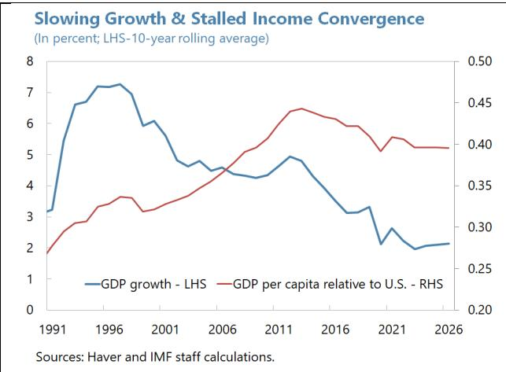

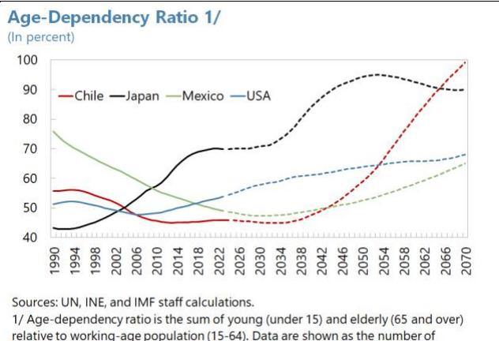  
Sources: UN, INE, and IMF staff calculations.  
1/ Age-dependency ratio is the sum of young (under 15) and elderly (65 and over) relative to working-age population (15-64). Data are shown as the number of dependents per 100 working-age population.

2. The new administration has prioritized boosting potential growth and resuming fiscal consolidation. Since assuming office in March, the government has submitted to Congress a National Reconstruction Plan (NRP), comprising revenue, expenditure, and structural reform measures. The authorities aim to raise growth to 4 percent over the medium-term, mainly by cutting red tape and reducing corporate income taxes (CIT), while restoring structural fiscal balance, including via across-the-board expenditure rationalization.

## RECENT ECONOMIC DEVELOPMENTS

3. Economic activity has moderated somewhat. Real GDP growth eased to 2.5 percent in 2025, from 2.8 percent in 2024 (Figure 1). While mining output (about 13 percent of the economy) fell 1.3 percent, largely due to an accident in July 2025, non-mining growth picked up to 3 percent in 2025, supported by private consumption and investment amid robust wage growth and lower borrowing costs. Mining and renewable energy projects contributed to strong growth in investment of 8.9 percent. Real GDP contracted by 0.5 percent (y/y) in 2026Q1, largely due to a decline in the volume of copper production and the unwinding of the rapid expansion in output in the agriculture and fishing sectors seen in 2025. Domestic demand, on the other hand, remains robust.

Sources: Haver and IMF staff calculations.
1/ Inflation rates over 2014-2023 are calculated based on the 2018 CPI basket. Inflation rates after January 2024 are calculated based on the 2023 CPI basket.

## 4. Labor market slack persists. The seasonally adjusted unemployment rate has fluctuated

19 average of around 7 percent. Recently, employment growth in the formal sector has lagged that in the informal sector, with female unemployment rising more than male. The slack reflects, inter alia, sizable minimum wage hikes and other regulatory changes (such as reduced weekly hours), a sluggish recovery in the construction sector, and the recent decline in public sector employment. Real year-on-year hourly wages increased by 2.8 percent in 2025, decelerating in 2026Q1 to 2.3 percent.

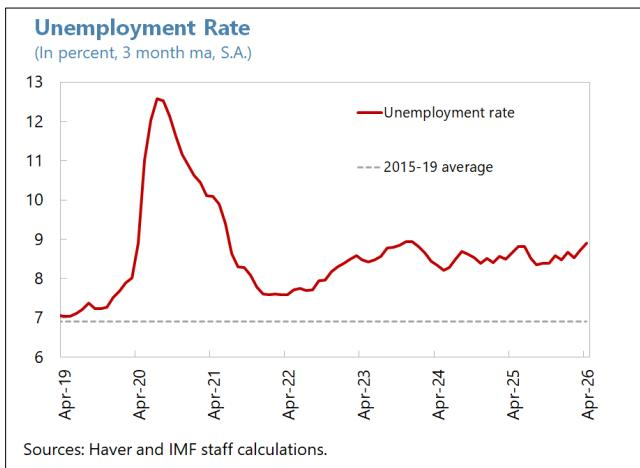

5. Inflation recently breached the 3-percent target due to higher energy prices. Before the war in the Middle East, headline year-on-year inflation had been declining, reaching 2.4 percent in

February 2026, reflecting fading base effects of electricity price hikes implemented during 2024-25, moderating wage growth, lower import prices amid trade diversion, and peso appreciation (Figure 3). However, inflation picked up in March and reached 3.9 percent in May, largely due to higher fuel and transportation service prices. Core inflation has remained steady at 3.2 percent. Against this backdrop, the Central Bank of Chile (BCCh) has kept the policy rate unchanged at 4.5 percent at its last four meetings.

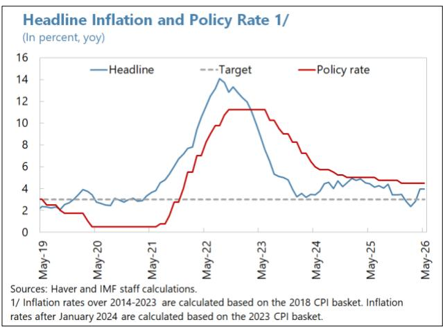

6. At 2.8 percent of GDP, the headline fiscal deficit in 2025 was broadly similar to that in 2024, though 1.8 percentage points higher than budgeted. Revenue underperformance was the key driver, as higher mining-related revenue did not fully offset weaker-than-anticipated non-mining tax revenue and slower growth in non-tax revenue. Staff estimates the 2025 structural deficit at 3.3 percent of GDP, broadly unchanged from 2024. The end-2025 central government debt stood at 41.5 percent of GDP (Figure 4), with liquid treasury assets at 0.01 percent of GDP.

7. Chile's external position improved in 2025 and early 2026, supported by higher copper prices. Copper prices rose on average by about 9 percent in 2025 relative to 2024, and by around 30 percent in 2026Q1 relative to the 2025 average, due to stronger structural demand, global copper supply shocks, and concerns over potential U.S. tariffs on refined copper. The peso appreciated by 8 percent in 2025, broadly in line with the regional trend, reaching its strongest level in February 2026 given subsiding policy uncertainties and rising copper prices (Annex II). At 1.2 percent of GDP, the current account deficit in 2025 was the same as in 2024 as higher exports

receipts were offset by stronger imports of capital goods amid a pickup in investment and lower copper export volumes following the July 2025 accident (Figure 2). Chile's external position in 2025 is assessed as broadly in line with medium-term fundamentals and desirable policies (Annex III).

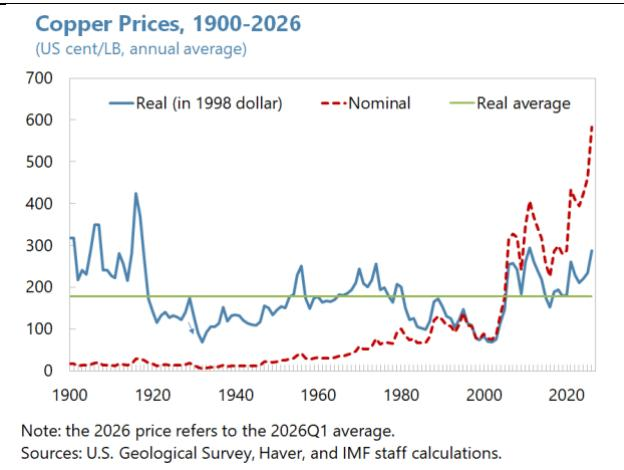

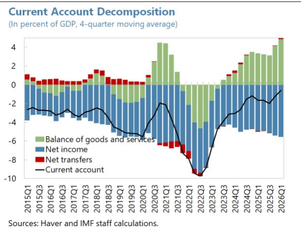

8. The war in the Middle East has partly reversed Chile's more favorable external conditions. Since the escalation of the conflict in February, Brent oil prices and U.S. long-term interest rates have risen and the global growth outlook for 2026-27 weakened, reflecting heightened global uncertainty. As such, the peso depreciated by about 6 percent in March following the conflict, recovered somewhat in April, but remains weaker than its February average (Figure 2). Despite a higher import bill, Chile's goods trade surpluses have remained historically high, reaching 6.8 percent of GDP in April and May, supported by high copper prices.

9. Financial conditions have tightened since the onset of the war, reversing the easing trend observed in the second half of 2025. Before the conflict, the Chilean stock market had risen to record highs, supported by lower interest rates and improved market sentiments amid higher inflows from global equity and fixed-income funds (Figure 6). Since then, the equity index has fluctuated, with softer portfolio inflows. Bank credit has shown only tentative signs of recovery, mainly reflecting weak credit demand, with additional drag from valuation effects on foreign-currency loans following peso appreciation and substitution from bank credit toward corporate financing. The latter is especially relevant for mining and energy projects, which led the pickup in investment, while the issuance of non-financial corporate bonds have increased in recent quarters as corporate bond yields declined. At the sectoral level, while construction and real estate remained weak, the mortgage subsidy program and lower lending rates supported housing sales and mortgage demand.

## Authorities' Views

10. The authorities broadly agreed with staff's assessment of the external position. They took note of recent refinements to the EBA methodology, which have resulted in a lower current account balance norm, and concurred with staff's assessment that the recent rise in copper prices was partly driven by a long-term trend of increasing demand for copper rather than by cyclical

factors. The authorities highlighted that transitory factors that contributed to higher current account deficits in the aftermath of the pandemic have largely subsided, and pointed out that foreign direct investment, particularly in the mining sector, continues to finance a substantial portion of the current account deficit, thereby reducing the risks associated with abrupt capital outflows.

## OUTLOOK AND RISK

11. The near-term outlook is stable, though external conditions present headwinds. While copper prices remain high, the growth outlook for 2026 is clouded by the impact of the conflict in the Middle East and continued weakness in copper production. The baseline assumes a gradual decline in oil prices to around US\$85/bbl in 2026Q4 and to around US\$75/bbl in 2027Q4. Copper production is assumed to contract by 2 percent in 2026, before rebounding by 4 percent in 2027. The baseline also assumes a structural shift in copper prices to close to US\$5 per pound, below the 2026Q1 peak (of about US\$6) but above the long-term historical average in real terms. Under these assumptions, real GDP is projected to grow by 1.8 percent in 2026 and 2.6 percent in 2027. Inflation is expected to rise temporarily above the target through the remainder of 2026 and early 2027, reflecting higher fuel and transportation prices. Pending finalization of the new government's NRP, staff projects a broadly neutral fiscal impulse in 2026 and a structural consolidation in 2027 through expenditure containment and revenue recovery. The current account deficit is projected to widen slightly in 2026, with higher copper prices offset by higher oil prices and lower copper and agricultural export volumes, before widening toward 2 percent of GDP over the medium term as copper prices retreat (Table 3).

12. External risks are tilted to the downside in the near term and balanced over the medium term (Annex IV). Protracted hostilities in the Middle East could keep oil prices higher for longer and weigh on growth through lower disposable income, disruptions to production, and tighter financial conditions. In a severe scenario where oil prices stay above US\$130/bbl in 2026H2 and 2027, inflation could rise above 5 percent in late 2026 and stay above that level through the first half of 2027, requiring significant monetary tightening to resume its downward path. Continued trade tensions and a disorderly correction in the outlook related to AI-led productivity gains represent additional risks. On the other hand, persistently high copper prices—due to structurally higher demand from the energy transition, AI-related infrastructure, and defense spending—represent a key upside risk.

13. Domestic risks are broadly balanced. The government's agenda of catalyzing private investment and employment through cutting red tape, lowering labor costs, and reducing the CIT rates in a phased manner should support medium-term growth. A scenario with sustained high copper prices and investment-enhancing reforms under the NRP could result in growth reaching around 3 percent during 2027-30. However, sharp across-the-board public spending cuts to offset revenue losses from tax reductions risk limiting room for increasing productivity-enhancing spending, such as childcare. Amid persistently high inequality, social discontent continues to be a risk. In addition, climate events—possibly related to a “super El Niño” climate cycle—could adversely affect the agriculture, fishing, forestry, and mining sectors and raise food prices regionally. Given

these risks, rebuilding reserve and fiscal buffers would be essential to preserve policy space and mitigate potential adverse shocks. If severe adverse shocks materialize, policies should focus on temporary and targeted support to vulnerable groups, while letting automatic stabilizers operate. This could also imply a more gradual return to the structural balance target.

## Box 1. Alternative Growth Scenarios

This box discusses two alternative growth scenarios. An upside scenario considers the materialization of several uncertain but positive developments such as persistently higher copper prices, while a downside scenario mainly reflects a more prolonged conflict in the Middle East.

## Upside scenario

\- Copper prices. The scenario assumes copper prices around the US\$6 per pound range over 2026-30, about 30 percent above the 2025 average, driven by structurally stronger global copper demand. The main growth impulse would come from spillovers into non-mining sectors via higher disposable income and investment-related input demand, estimated at around 0.5 percentage point annually in 2026-27 relative to the baseline, with the boost fading gradually thereafter.

\- Rationalization of regulations. The baseline scenario already assumes a 0.1 percentage point gain in growth from implementation of the law to streamline sectoral permits. In this scenario, faster implementation and additional regulatory streamlining related to environmental permits and the

construction sector are assumed to boost annual growth by an additional 0.1 percentage point relative to the baseline, starting in 2027.

\- CIT rate cut. The planned cut in the CIT rate from 27 to 23 percent is estimated, based on the Hall-Jorgensen user-cost approach, to increase growth by 0.15-0.2 percentage point over a decade starting in 2027.

\- Employment tax credit and full integration of CIT payment. This measure is assumed to raise growth by 0.1 percentage point relative to the baseline, starting in 2027.

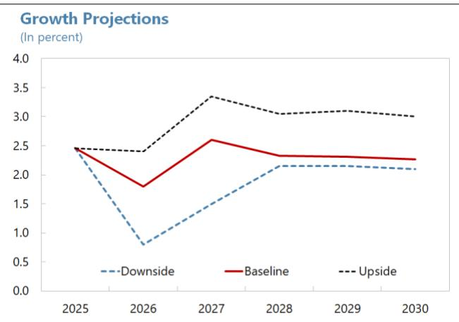  
Source: IMF staff calculations.

## Downside scenario

\- A more prolonged conflict in the Middle East. This scenario assumes oil prices rising further and remaining elevated at around US\$130/bbl, about 100 percent higher than in the pre-war baseline, through 2026 and 2027. Coupled with high uncertainty, this scenario estimates that growth in 2026 and 2027 would be 1.1 and 1 percentage points lower, respectively, relative to the baseline, reflecting the impact of higher oil prices on disposable income and domestic demand, disruptions to economic activity, and tighter financial conditions.

\- Smaller-than-expected impact from deregulation. If the implementation of the sectoral permitting law is delayed or investment responses are weak, the 0.1 percentage point growth gain assumed in the baseline would not materialize.

## Authorities' Views

14. The authorities broadly shared staff's near-term outlook, concurring that external risks had risen following the war in the Middle East. They agreed on growth and inflation trajectories being contingent on the evolution of the conflict. Staff's projection for growth in 2026 was the same as that of the Ministry of Finance and at the upper end of the BCCh's range of 1-1.75 percent. For 2027, staff and the authorities project a similar rebound in growth, reflecting stronger investment prospects and unwinding of supply-side restraints on non-mining output. The BCCh also expects inflation to return to the 3 percent target in early 2027 under the baseline, noting continued uncertainties in oil prices. The authorities also acknowledged risks arising from global trade tensions and geopolitical developments.

## POLICY DISCUSSIONS

## A. Fiscal Policy: Strengthening Fiscal Balances

15. The administration is targeting a sustained improvement in the structural deficit through 2030 while maintaining the debt ceiling of 45 percent of GDP. The 2026 budget prepared by the previous government projected a headline deficit of 1.5 percent of GDP, revised by the current administration in its May Public Finance Report (PFR) to 2.4 percent of GDP. This revision, which is broadly aligned with staff's projection of a headline deficit of 2.5 percent of GDP, reflects more realistic revenue assumptions given underperformance in 2025 as well as higher spending pressures due to public wage adjustments, higher social security contributions of public employment, and support measures in response to the oil shock. $^{1}$ In early June, the authorities announced their new Fiscal Policy Decree targeting a frontloaded reduction in the structural deficit—from 2.6 percent of GDP in 2026 to 1.8 percent in 2027, easing gradually thereafter to 1.5 percent by 2030. This consolidation, which also reflects an updated methodology to calculate structural balances, assumes growth recovery supported by measures in the NRP, expenditure rationalization, and strengthened management of public companies as well as of public assets and liabilities. While the debt ceiling is maintained at 45 percent of GDP, the authorities acknowledge the possibility of temporary breaches in the near term under exceptional circumstances.

16. The authorities envision expenditure cuts of around 0.4 percent of GDP in 2026, with further savings envisaged over the medium-term. As part of their corrective actions, they have announced expenditure adjustments in two stages. Permanent measures enacted by executive orders for 2026, which are incorporated in staff's baseline, comprise curbing misreporting of public sector medical leave, reducing hiring, rationalizing public investment, and tightening control over goods and services. The authorities have also identified measures to permanently reduce below-theline items by about 0.1 percent of GDP. Over the medium term, additional spending measures are planned, via improving the targeting of social spending through cross-validation of beneficiary registries with administrative information, strengthening of the medium-term financial planning framework, and modernizing state-owned enterprise and public asset management. Further savings envisioned under the NRP include early retirement incentives and lower replacement of retirees, as well as education-sector reforms (see Annex V).

<table><tr><td colspan="7">Authorities&#x27; and Staff&#x27;s Fiscal Projections(In percent of GDP, unless otherwise specified)</td></tr><tr><td></td><td>2025</td><td>2026</td><td>2027</td><td>2028</td><td>2029</td><td>2030</td></tr><tr><td colspan="7">Authorities</td></tr><tr><td>Targeted structural fiscal balance 1/</td><td></td><td>-2.6</td><td>-1.8</td><td>-1.7</td><td>-1.6</td><td>-1.5</td></tr><tr><td>Estimated structural fiscal balance 2/</td><td>-3.7</td><td>-3.7</td><td>-2.6</td><td>-2.5</td><td>-2.2</td><td>-1.8</td></tr><tr><td>Headline fiscal balance</td><td>-2.8</td><td>-2.4</td><td>-1.7</td><td>-1.8</td><td>-1.8</td><td>-1.4</td></tr><tr><td>Total revenues 3/</td><td>21.6</td><td>21.7</td><td>22.1</td><td>22.1</td><td>22.0</td><td>22.0</td></tr><tr><td>Non-mining tax revenues</td><td>16.4</td><td>15.8</td><td>16.3</td><td>16.7</td><td>16.8</td><td>17.0</td></tr><tr><td>Private mining tax revenues</td><td>1.6</td><td>1.9</td><td>1.9</td><td>1.7</td><td>1.5</td><td>1.4</td></tr><tr><td>Total expenditures 3/</td><td>24.4</td><td>24.1</td><td>23.8</td><td>23.9</td><td>23.8</td><td>23.5</td></tr><tr><td>Public debt</td><td>41.5</td><td>43.1</td><td>44.4</td><td>45.4</td><td>46.3</td><td>46.5</td></tr><tr><td>Copper Price (USD cents per pound)</td><td>451</td><td>546</td><td>506</td><td>504</td><td>504</td><td>504</td></tr><tr><td>Real GDP (annual percentage change)</td><td>2.5</td><td>2.1</td><td>2.2</td><td>2.2</td><td>2.2</td><td>2.3</td></tr><tr><td colspan="7">Staff</td></tr><tr><td>Structural fiscal balance 4/</td><td>-3.3</td><td>-3.1</td><td>-2.4</td><td>-2.0</td><td>-2.0</td><td>-1.8</td></tr><tr><td>Headline fiscal balance</td><td>-2.8</td><td>-2.5</td><td>-2.0</td><td>-2.0</td><td>-2.0</td><td>-1.8</td></tr><tr><td>Total revenues</td><td>21.4</td><td>21.7</td><td>21.9</td><td>21.9</td><td>21.9</td><td>21.9</td></tr><tr><td>Non-mining tax revenues</td><td>16.3</td><td>15.8</td><td>16.3</td><td>16.5</td><td>16.6</td><td>16.6</td></tr><tr><td>Private mining tax revenues</td><td>1.6</td><td>1.9</td><td>1.8</td><td>1.7</td><td>1.6</td><td>1.6</td></tr><tr><td>Total expenditures</td><td>24.2</td><td>24.2</td><td>23.9</td><td>23.9</td><td>23.9</td><td>23.8</td></tr><tr><td>Unspecified measures</td><td></td><td>0.0</td><td>-0.4</td><td>-0.6</td><td>-0.8</td><td>-1.0</td></tr><tr><td>Public debt</td><td>41.5</td><td>43.2</td><td>45.0</td><td>46.2</td><td>47.4</td><td>48.4</td></tr><tr><td>Copper Price (USD cents per pound)</td><td>451</td><td>563</td><td>489</td><td>487</td><td>485</td><td>485</td></tr><tr><td>Real GDP (annual percentage change)</td><td>2.5</td><td>1.8</td><td>2.6</td><td>2.3</td><td>2.3</td><td>2.3</td></tr></table>

17. Revenue projections have been revised to reflect lower non-mining tax receipts, partially offset by higher mining revenue. Notably, the authorities have revised estimates of yields from the Tax Compliance Law (TCL) from 1.5 percent of GDP to 0.5 percent cumulatively over the medium term, in line with past IMF technical assistance. This revision in TCL measures, which constitutes the main driver of the revision in non-mining tax revenue projections, complements welcome ongoing efforts to improve revenue forecasting including via ex post monitoring of TCL

revenue yields. The NRP's tax measures, not included in staff's baseline, would imply further revenue losses (Annex V).

18. While the commitment to fiscal consolidation is welcome, additional revenue and expenditure measures are likely needed. Given the worse than expected outcome in 2025, additional measures of around 0.5 percent of GDP will be required to reach the government's 2030 structural deficit target of 1.5 percent of GDP (beyond the currently unidentified measures in the baseline of 1 percentage point). Should the NRP be approved, additional consolidation efforts will likely be needed given that the authorities estimate total costs of 0.3 percent of GDP by 2030, even after incorporating their anticipated growth dividends from the reforms (Annex V). Options (outlined in Box 2) could include adjustments to PIT thresholds and parametric changes to the minimum guaranteed pension (PGU).

19. Tax cuts being discussed under the NRP should consider the need to preserve fiscal sustainability by exploring an alternative set of more targeted and less costly measures. The planned gradual reduction in the CIT rate to align it with the OECD average could be reconfigured to combine more moderate CIT cuts with provisions for accelerated depreciation, particularly in the non-mining sector, to support investment while limiting fiscal costs and preserving revenue adequacy. $^{2}$ Similarly, the tax employment credit could consider narrowing the subsidy to directly target new employment creation. Measures not directly contributing to growth and employment objectives, such as changes in the housing-sector VAT and property tax exemptions, warrant reconsideration to safeguard the consolidation path. It would also be crucial to ensure that estimates of growth-enhancing dividends from reforms are realistic as they affect revenue projections. Additionally, windfall revenues from elevated copper prices should not be used to finance permanent tax cuts or spending commitments, in line with the structural balance target rule.

20. There is scope to further enhance the effectiveness of Chile's strong fiscal framework with targeted refinements. Recognizing the significant progress made in recent years to modernize the fiscal framework, Annex VI highlights several technical aspects that warrant reconsideration: the formulation of committed expenditure in the medium-term fiscal path, the operationalization of corrective actions following target deviations, the estimation of structural parameters, and the treatment of revisions to national accounts. These modifications complement the recently announced methodological improvements by the Autonomous Fiscal Council (CFA). $^{3}$ The ongoing IMF technical assistance on budget classification and analysis on below-the-line operations as well as assistance on tax gap estimates and enhancing tax administration capacity will also contribute to the operation of the fiscal framework.

## Box 2. Policy Options to Reach the Medium-Term Fiscal Targets

This box considers various revenue and expenditure measures that could help meet the administration's fiscal targets. Attaining these objectives would require structural efforts of about 0.5 percent of GDP beyond the currently unidentified measures in the baseline of 1 percentage point.

\- Expenditure containment and efficiency measures. Two expert committees $^{1/}$ have estimated medium-term savings of between 1 to 1.7 percent of GDP, including by limiting baseline pressures $^{2/}$

\- Parametric reform of the PGU. The current design of the PGU, under which most eligible retirees receive the full benefit despite wide disparities in retirement savings, points to a significant scope for containing the fiscal costs of the program while maintaining support for the most vulnerable elderly. For

instance, reducing the coverage of the PGU from bottom 90 percent of the income distribution to 60 percent, while preserving support for lower-income households, could lower annual costs over the medium term by 0.8 percent of GDP (see Selected Issues Papers, Chapter 1). $^{3/}$

\- Enhancing PIT revenue collection. Raising the PIT-to-GDP ratio by 0.4 percent would be feasible, for instance, by lowering the exemption threshold, which would move Chile up one position from its current close-to-bottom position relative to its OECD peers. $^{4/}$

<table><tr><td colspan="2">Fiscal Impact from Reform Proposals(Percent of GDP)</td></tr><tr><td>Additional Fiscal Space</td><td>Medium-term</td></tr><tr><td>Expenditure measures</td><td>1-1.7</td></tr><tr><td>Stronger personal income tax (PIT) revenues</td><td>0.4</td></tr><tr><td>Narrowing of PGU Coverage</td><td>0.8</td></tr><tr><td>Total</td><td>2.1-2.8</td></tr><tr><td colspan="2">Sources: Chilean authorities, WORLD database, Centro de Estudios Publicos and IMF staff estimations.</td></tr></table>

\- Further capital spending containment presents risks. General government investment spending has steadily declined as a share of GDP since 2015, placing Chile at the bottom of the OECD and the LA7 region in recent years (see Selected Issues Papers, Chapter 2). $^{5/}$ In this context, further reductions in productive public investment could weigh on productivity and potential growth.

4/ About 74 percent of the registered taxpayers are below the current PIT exemption threshold. The PIT tax rates for the low and middle brackets are modest, with only about 2 percent of the eligible population subject to a PIT rate that is higher than 20 percent and about 17 percent subject to a 4-percent PIT rate (2023 Article IV Staff Report). As a result, the PIT is one of the weakest pillars of Chile's tax system and significantly underperforms OECD countries (2023 Selected Issues Papers, Chapter 1).

21. Public debt is assessed to be sustainable with high probability, though keeping debt below the 45 percent of GDP ceiling would require additional consolidation or favorable shocks. In the baseline, which assumes a reduction in the structural deficit of 1.5 percent of GDP and cumulative unidentified measures of 1 percent of GDP through 2030, central government debt would breach the prudent ceiling in 2028 before stabilizing at about 50 percent of GDP (Annex VII).

Without further consolidation, debt would remain below the 45 percent anchor only under favorable conditions, such as persistently high copper prices and accelerated growth rates. Otherwise, adhering to the debt ceiling would require additional measures of around 1 percent of GDP, uniformly phased in over the projection horizon through the end of the administration. Under a downside scenario (Box 1), the debt ratio would breach the 45 percent threshold already in 2027, as it assumes that the government would let automatic stabilizers play and offer targeted

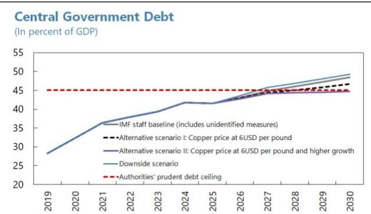  
Sources: Ministry of Finance and IMF staff calculations and projections. Note: Alternative scenario I assumes a 10 percent increase in the price of copper results in a 0.2 pps higher mining revenue-to-GDP ratio. Alternative scenario II assumes a real GDP growth rate of 2.4 percent in 2026, 3 percent in 2027, 3.5 percent in 2028 and 4 percent in 2029. The downside scenario growth assumptions are explained in detail in Box 1.

support. Under such a scenario, a more gradual return to a structural balance relative to baseline may be warranted.

## Authorities' Views

## 22. The authorities underscored their commitment to their medium-term fiscal

consolidation plan. They reaffirmed their intention to further strengthen revenue projections, including by revisiting yields of the Tax Compliance Law measures given likely optimism in previous collection estimates and further refining revenue models and data structures. In this context, they have requested technical assistance from the IMF to review and provide guidelines on the most appropriate treatment of budget item classifications under the GFSM framework, as well as to validate their tax-gap estimates, strengthen the governance and operational performance of tax administration, and assess the impact of past tax reforms. The authorities clarified that the NRP already incorporates offsetting fiscal measures, noting that residual net fiscal cost of the NRP could be accommodated through expenditure containment and gains in spending efficiency, including in public investment. To that end, they noted that, in addition to the approximately US\$2 billion in consolidation measures already identified, the ongoing review is expected to yield an additional US\$1 billion. They also pointed to potential additional revenue from liquidation of some public non-financial assets and complementary measures to streamline the regulatory environment.

## B. Monetary Policy and Reserve Accumulation: Staying Agile

23. The central bank should stand ready to tighten monetary policy if the current shock persists. Chile's inflation targeting framework has served it well. After a sequence of shocks since the pandemic, inflation steadily declined to below target in January 2026. The recent rise in inflation, going above the target in April, follows the sharp rise in global oil prices. While the real policy rates have been slightly below the estimated neutral range since March, this largely reflects the oil price-driven rise in near-term inflation expectations. The two-year-ahead inflation expectations—consistent with the central bank's inflation targeting horizon—continue to be well anchored. The monetary policy stance is broadly neutral when assessed over the policy horizon. Looking ahead, trade diversion and a stronger peso associated with higher copper prices relative to 2025 will

continue to help contain import price increases, but the recent rise in oil prices will add to inflationary pressures. Under the baseline oil price assumptions, inflation is expected to move temporarily above target in 2026 and early 2027. Given Chile's forward-looking framework, a temporary price spike would not, by itself, warrant a policy rate change. However, if oil prices remain high for longer, a tighter monetary policy stance could become necessary.

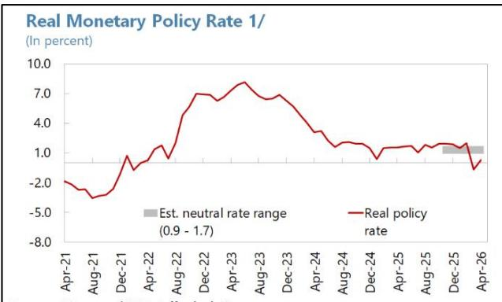  
Sources: Haver and IMF staff calculations.  
1/ Real policy rate is calculated as nominal policy rate minus 1-year inflation expectation, with the latter calculated using the difference between 1-year peso- and UF- denominated (inflation indexed) interbank rates.

24. Continued international reserve accumulation would enhance resilience. In August 2025, the BCCh launched a three-year sterilized international reserve accumulation program under which it would purchase up to US\$25 million a day, for a total of up to US\$18.5 billion. While maintaining its total external buffers (which comprise currency swaps, credit lines, and reserves) at about 20 percent of GDP, the BCCh intends to gradually replace part of its foreign currency credit lines with reserves. The program has performed well, with purchases by end-May of US\$4.6 billion, on average 91 percent of the planned daily maximum. As of end-May, gross reserves had risen to

US\$32.2 billion, though reserve coverage relative to the IMF's ARA metric has stayed at around 81 percent due to a rise in external liabilities during 2025H2 and is below the recommended range of 100-150 percent. International reserves and IMF resources available under the FCL provide buffers against possible financing gaps in adverse scenarios. As such, completing the three-year program should remain a priority, as the program is flexible to accommodate any severe disorderly FX market conditions. As planned by the BCCh, the program should

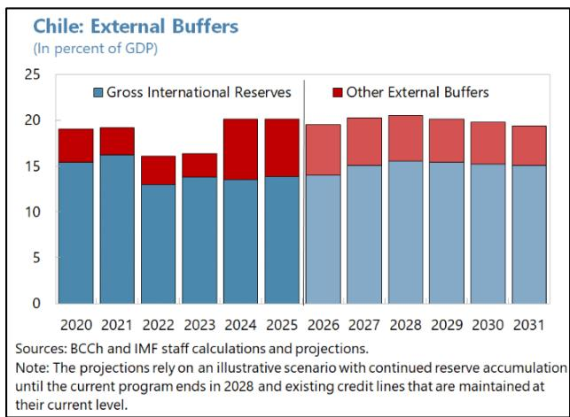

continue to be assessed every six months, with developments in relevant benchmarks (GDP and ARA metrics) monitored to ensure forward-looking assessments beyond the completion of the program.

## Authorities' Views

25. The central bank remains committed to its mandate. The BCCh underscored that its future monetary policy decisions would be made on a meeting-by-meeting basis, recognizing the high uncertainty around the war in the Middle East that has unfolded more adversely than previously envisaged. Noting that two-year inflation expectations remain close to target, the BCCh emphasized that it would closely monitor factors that affect inflation pass-through or persistence and take decisions to ensure projected inflation at 3 percent over the two-year horizon. The BCCh continues to view flexible exchange rates as a critical shock absorber. It noted that the current three-year international reserve accumulation program, which has operated smoothly, will be completed as planned. Over the longer term, the BCCh intends to maintain external buffers at an adequate level, while continuing to assess the composition between reserves and other liquidity buffers.

## C. Financial Sector Policies: Reinforcing Resilience

26. Overall, the financial system remains sound. Banks' capital adequacy, liquidity, and profitability are at or above pre-pandemic levels. While non-performing loan ratios have edged slightly above pre-pandemic levels, provisions remain adequate. The banking sector completed the implementation of the Basel III capital and liquidity requirements in 2025. The BCCh had maintained a counter-cyclical capital buffer (CCyB) of 0.5 percent of risk-weighted assets (RWA) since May 2024, with banks continuing to hold comfortable voluntary capital buffers (Figure 5). In May 2026, the

BCCh raised the CCyB rate to a positive-neutral level of 1.0 percent of RWA, with a 24-month implementation period. This decision to implement the CCyB in a gradual and forward-looking manner is welcome, as it takes into account macro-financial developments and banks' ability to lend. The Financial Market Commission (CMF) recently announced an intent to amend regulations on calculations of market RWA and to allocate additional resources for the implementation of the internal ratings-based approach, to align RWA density to international standards. Asset prices do not

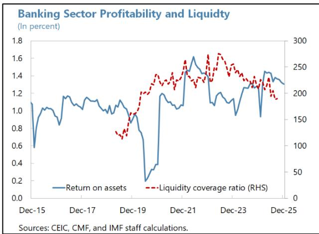

show signs of overvaluation, with the price-to-earnings ratio of the equity index remaining below its historical average. The latest analysis from the BCCh shows that the banking sector is able to withstand severe stress scenarios, akin to or more severe than the adverse scenario in the IMF's April 2026 WEO, where economic activity sharply contracts and financial conditions abruptly tighten.

27. Given the financial system's significant exposure, residual risks mainly stem from the real estate and construction sectors. While financial health of households and corporates is sound overall, and improved slightly in 2025, vulnerabilities remain in the construction and real estate sectors, smaller firms with government-guaranteed loans, and low-income indebted households. The mortgage subsidy program and lower lending rates have supported housing sales and eased financial burdens of real estate and construction firms, while the NRP proposes further measures to support the housing sector including a temporary elimination of the VAT on housing purchases. However, adjustment in these sectors could take time given the elevated housing inventories (Figure 5). Separately, the Pension Supervisor (SP) recently amended the regulatory limit for derivative positions based on risk exposure to curb risks related to pension funds' increased exposure to U.S. interest swaps.

## 28. The implementation of pension reform will require a gradual and well-coordinated

approach. While the increased contribution rate under the reform will deepen Chile's capital market, reform implementation poses challenges. First, a shift from the current multi-fund system to a generational-fund system could induce portfolio reallocation, the direction and size of which would depend on the reference glide path (age-based portfolio allocation schedule) to be announced by SP (see Figure 7, and Selected Issues Papers, Chapter 3). Staff welcomes the supervisor's approach of explicitly considering market-impact mitigation during this transition alongside improving the investment regime's risk-return profile. Second, new competition-enhancing mechanisms, including the biennial auctions that reassign 10 percent of the affiliates to the lowest-fee pension fund administrators (AFPs) and performance-based reward-penalty scheme may complicate pension funds' asset management, especially during the transition. Staff recommends that the supervisor prioritize a smooth transition by making full use of implementation flexibility available under the pension reform law, with gradual and well-calibrated dissemination of information on new regulatory designs to mitigate any sharp announcement effects and anticipatory trading behavior.

29. Chile has made notable progress in strengthening financial sector resilience, in line with the 2021 FSAP recommendations. Recent advances include the implementation of the Basel III requirements, Financial Market Resilience Law, and regulatory amendments to support repo market development (Annex VIII). The proposed expansion of access to Real-Time Gross Settlement System for non-bank financial institutions will enhance systemic liquidity, while regulatory proposals to strengthen banks' corporate governance and recovery planning will improve the risk management framework and crisis preparedness. Mandatory reporting to the Consolidated Debt Registry at the CMF, which began in April 2026, strengthens credit risk management, supervision, and monitoring of indebtedness for financial stability. The BCCh is also working on introducing prudential regulations for domestically issued stablecoins. Staff recommends continued efforts in creating an industry-funded deposit insurance, introducing a new Bank Resolution Law, and risk-based supervision of insurance companies. Granting budgetary independence to the CMF would help ensure adequate resources as its responsibilities expand and become more complex, while contributing to stronger governance in financial sector oversight.

30. The AML/CFT supervisory framework for the financial sector is being enhanced, but sustained political support and adequate staffing remain critical. Coupled with the execution of the 2023-2027 National AML/CFT Strategy, the recent extension of AML/CFT coverage to some non-financial sectors and updated regulations on financial institutions is expected to bolster the detection and prevention of illegal transactions, aiming to address deficiencies identified in the 2021 AML/CFT Mutual Evaluation Report. Furthermore, the proposed amendments to the Financial Intelligence Unit (UAF) law will introduce significant adjustments to the AML/CFT framework, establishing a collaboration framework that will enhance data sharing between the UAF, tax, and customs authorities, thereby strengthening financial investigation and coordination capabilities. Strong political backing will be essential to ensure a timely and orderly implementation of these reforms, including to secure a level of staffing commensurate with the expanded responsibilities of

the UAF to ensure the effective application of a risk-based approach, and expanding coverage to key designated nonfinancial businesses and professions (DNFBPs) such as lawyers and accountants.

## Authorities' Views

31. The authorities agreed that risks to the resilient financial system are mostly external. They underscored that vulnerabilities related to the construction and real estate sectors, smaller firms with government-guaranteed loans, and low-income indebted households are being carefully monitored, and highlighted their broad-based resilience-building efforts. They acknowledged the need to closely monitor changes in the depth of local financial markets. The authorities noted that the implementation of Basel III capital regulations has enhanced resilience and a timely and gradual conversion to the positive-neutral CCyB level would strengthen buffers against shocks. They reiterated their efforts to implement the FSAP recommendations, particularly regarding bank resolution framework, risk-based supervision of insurance companies, evaluation of an industry-funded deposit insurance, and enhancement of bank corporate governance. They also underscored their commitment to implement the Financial Market Resilience and Fintech Laws and advance in the digital payment agenda, including on stablecoins. Regarding AML/CFT risk, they committed to continue to address the shortcomings identified in the 2021 AML/CFT Mutual Evaluation Report.

## D. Structural Reforms: Generating Higher Medium-Term Growth

32. The growth strategy of the administration centers on deregulation and tax reforms. The omnibus bill (NRP) currently being discussed in Congress comprises measures to simplify the permitting process and boost investment and economic activity through several tax reforms. The authorities estimate that these measures could raise the level of GDP relative to the baseline by about 8.5 percent by 2040. While deregulation and lower corporate taxes would spur growth, the size and timing of gains from permitting reforms and corporate tax cuts could be uncertain in practice. In Chile, mining investment dynamics appear to have been closely influenced by copper prices, with the non-mining investment-to-GDP ratio remaining broadly stable since 2005, including after the 2014-17 CIT increase. This could suggest that the investment response to CIT changes may have been limited, although it is also possible that investment could have been stronger absent the 2014-17 CIT increase. More generally, cross-country comparisons suggest that higher-income economies that once had income levels comparable to Chile grew by 2.9 percent per year on average. Adjusting for the more favorable demographics and global growth those economies enjoyed, their average growth rate would have been closer to 2 percent, highlighting the challenge of increasing trend growth.

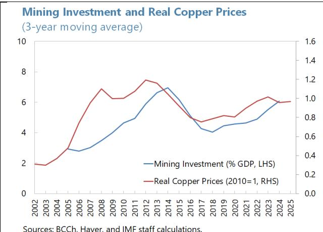  
Sources: BCCh, Haver, and IMF staff calculations.

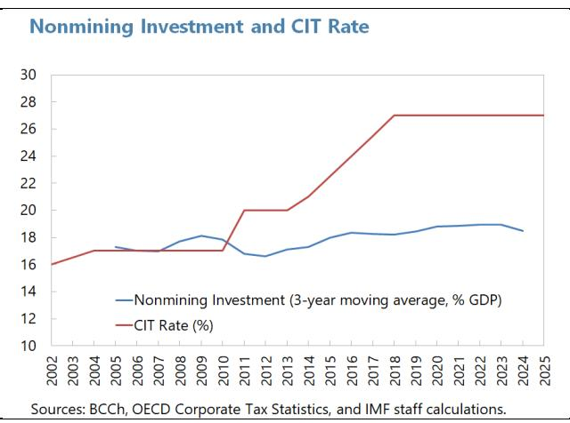

Implementing the cabotage law that increases the flexibility for foreign vessels in domestic maritime transportation could facilitate trade and logistics, further integrating Chile into the global production chain. Increasing the flexibility of university researchers participating in technology companies and the sharing of research proceeds, a central point under the proposed knowledge transfer law, would promote university-business collaboration at a minimum fiscal cost.

34. A more investment-friendly environment would also help narrow skill gaps by facilitating job creation. A recent study highlighted possible productivity gains in Chile from enhanced STEM capabilities of the labor force, noting existing shortages in several STEM-related skills. Addressing investment bottlenecks in capital-intensive sectors, where STEM skills are in higher demand, would foster job creation and strengthen incentives for youths to acquire relevant skills. This demand-side labor market channel can usefully complement existing education and training policies that focus on the supply of skills (Box 3).

35. Relaxing the distortionary size-dependent childcare mandate and moving toward a more universal childcare system could raise female labor supply and productivity. This is in line with the 2023 “Marfan Commission Report,” which highlighted the GDP and revenue gains from higher female labor participation. Staff analysis also suggests that reducing the gender gap in employment quality—highly educated women in Chile are less likely to work in high-paying occupations—to the median OECD level, could raise aggregate productivity by 3 percent by better distributing talent (Annex IX).

36. The setting of minimum wages could benefit from greater inputs from an independent expert body. Following sharp increases in real minimum wages over 2022-25, a more modest increase was pursued in 2026. However, under the current tripartite process, minimum wage growth continues to be closely linked to the policy preferences of each administration. A formal independent expert body could help align minimum wage decisions more firmly with economic fundamentals and less with political cycles. Better access to data, such as wage distribution from administrative data, would further strengthen the process, especially given the difficulties in accurately measuring median wages from labor surveys.

Box 3. Manufacturing and Skill Supply

Manufacturing plays an important role in productivity growth. Duarte and Restuccia (2010) document productivity growth in manufacturing generally being faster than in services. McNerney et al. (2022) show productivity growth in manufacturing having larger spillover effects on aggregate productivity, reflecting the sector's stronger input-output linkages with the rest of the economy. In Chile, the slowdown in productivity over the last two decades has coincided with a steady decline in manufacturing's role in the economy: manufacturing value added fell from around 18 percent of non-mining GDP in 1996 to about 11 percent in 2025.

While manufacturing typically requires more STEM-trained skills, supply of such skills may itself be constrained by the size of the sector. Economies with a higher proportion of STEM graduates among tertiary graduates also have larger manufacturing sectors. However, in many countries, employers often report persistent difficulties in filling manufacturing vacancies, citing a shortage of workers with technical skills. At the same time, young people may be less inclined to pursue STEM fields when manufacturing has a limited presence and offers fewer job opportunities.

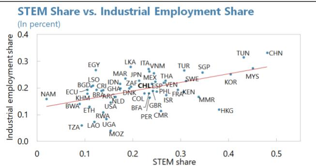  
Note: STEM share is calculated as the annual number of tertiary graduates in STEM fields divided by total number of tertiary graduates. Industrial employment share is calculated as the number of employees in the industry sector divided by total employment. Sources: Reproduced from Adhikari and Guo (2026), using data from UNESCO and the Groningen Growth and Development Centre. For most countries, data refer to the latest available years between 2010 and 2019.

Recent staff analysis shows that policies that

foster investment can also boost the supply of relevant technical skills through job creation. Firms often need to make costly upfront investments—in machines, factories, and other capital—before hiring workers for production. Once these investments are made, firms have a somewhat weaker position in wage bargaining: if the bargaining is not successful, upfront investment will be idle. As a result, firms may not fully capture the returns on investment and may underinvest and create fewer jobs, especially in capital-intensive industries such as manufacturing. Policies that improve the investment climate—such as more efficient regulation, faster permitting, and accelerated depreciation allowances—can therefore support job creation by encouraging investment, particularly in manufacturing and other capital-intensive industries. As job opportunities expand, more students may choose STEM fields, anticipating better job prospects, thus easing the constraint on the supply of STEM skills.

## Authorities' Views

37. The authorities note that their reform plans would deliver meaningful growth gains. They viewed Chile's heavy tax and regulatory burden since the mid-2010s as an important factor in its slower growth, emphasizing on-going administrative and legislative efforts to expedite permitting as the needed answer. They also pointed to the need to address higher labor costs arising from pension reform, minimum wage increases, and reductions in weekly working hours, and viewed the proposed employment tax credits as a useful tool to offset these costs and support formal job creation. While they are not currently planning to establish an expert body to provide inputs into minimum wage adjustments, they noted their intention of pursuing minimum wage increases commensurate with economic conditions. The authorities agreed on the importance of increasing female labor supply, including by addressing distortions from the childcare mandate, but highlighted that alternative options could entail fiscal costs and difficult policy tradeoffs.

## STAFF APPRAISAL

38. The Chilean economy remains resilient notwithstanding elevated external risks. Chile's macroeconomic position is sound, supported by a sustained track record of very strong macroeconomic fundamentals, institutional policy frameworks, and policy implementation. The economy is close to its potential, inflation is near its target (accounting for the impact of higher oil prices), and the external position in 2025 is assessed to be broadly in line with medium-term fundamentals and desirable policies. Public debt is relatively low and sustainable with high probability. However, the volatile external environment, with the impact of high copper price balanced against spillovers from the conflict in the Middle East, calls for policies to further strengthen fiscal and external buffers and preserve policy space against future shocks.

39. The welcome focus on boosting medium-term growth through deregulation and tax measures should also consider the fiscal impact of such measures. The National Reconstruction Plan rightly proposes rationalizing regulations, reducing the tax burden, and maintaining fiscal discipline with strong expenditure restraint. While these measures should support growth, the timing and size of the gains could be uncertain. Therefore, near-term fiscal implications of such measures should be clarified to avoid adding to consolidation pressures, not least since the authorities' objective of restoring structural balance already requires significant adjustments. Therefore, measures with lower fiscal costs—such as a swift and consistent implementation of permitting reform—should be prioritized, complemented by efforts to enhance productivity and investment, including by fostering university-business collaboration, narrowing the skill gaps, and improving logistics through cabotage reform. Additionally, moving toward a more universal childcare system could raise female labor supply and productivity.

40. A credible consolidation path would help ensure fiscal sustainability. Given the worse than anticipated fiscal position in 2025, the authorities' welcome goal to reduce the structural fiscal balance in a sustained manner to 1.5 percent of GDP by 2030 would require additional revenue or expenditure measures of around 0.5 percentage points of GDP beyond staff's baseline. Keeping debt below 45 percent of GDP would likely necessitate an additional effort of around 1 percentage points of GDP beyond staff's baseline. The announced administrative spending cuts and the capping of the oil price stabilization mechanism signal strong commitments to contain expenditure.

41. The fiscal consolidation strategy should be supported by careful policy prioritization and more efficient spending while continuing to protect the most vulnerable. Costly tax reduction measures should be weighed against the need to maintain productive public spending and preserve fiscal space against shocks. The timing, size, and design of policies not directly linked to the growth and employment goals, such as property tax exemptions, could be reconsidered to contain fiscal pressure. Over the medium term, the ongoing efforts to strengthen tax compliance and achieve greater spending efficiency will be critical. Consolidating the fragmented social programs and better targeting the minimum guaranteed pension (PGU) could further enhance spending efficiency and protect the most vulnerable.

42. Chile's already strong fiscal framework could be further refined. The fiscal framework is very sound overall, and transparency has improved over time, including through the addition of a prudent debt ceiling and better reporting of below-the-line operations. Additional refinements, by more comprehensively integrating expenditure pressures into the medium-term fiscal path and establishing clearer corrective actions to address deviations from fiscal targets, could further enhance the effectiveness of the framework.

43. The central bank should stand ready to tighten monetary policy if the current shock creates second-round inflation effects. The inflation-targeting framework has served Chile well, and the current broadly neutral monetary stance is appropriate. In the period ahead, the inflation trajectory will largely be shaped by external factors, particularly oil and copper prices. If oil prices stay much above the baseline for longer and add to inflationary pressures through second-round effects on wages and other prices, a tighter monetary policy stance would become necessary.

44. Continued international reserve accumulation enhances resilience. With the flexible exchange rate in place as a shock absorber, the central bank's access to international liquidity provides an additional defense against potential external shocks. The three-year reserve accumulation program launched in August 2025 has been operating as planned. Completing the program as designed—with periodic assessments—would bolster Chile's external buffers, maintaining the level of reserve coverage against relevant adequacy metrics.

45. The financial system remains sound. Banks' capital adequacy, liquidity, profitability, and asset quality are better than or comparable to pre-pandemic levels. The banking sector has implemented Basel III capital and liquidity requirements with comfortable voluntary buffers. A timely and gradual conversion to the positive-neutral CCyB level would further strengthen buffers against shocks. At the same time, vulnerabilities related to the construction and real estate sectors persist, as adjustments in these sectors may take time given the elevated housing inventories and as financial sector exposures remain significant.

46. Continued implementation of the 2021 FSAP recommendations and other resilience-enhancing measures remains important. Recent advances include the implementation of the Financial Market Resilience Law and related regulatory amendments to support the repo market development, as well as mandatory reporting to the Consolidated Debt Registry. Outstanding priorities include creating an industry-funded deposit insurance, introducing a new Bank Resolution Law, and risk-based supervision of insurance companies. Granting budgetary independence to the Financial Market Commission would help ensure adequate resources as its responsibilities have expanded and become more complex.

47. Implementation of the recent pension reform would require a gradual and well-coordinated approach to avoid abrupt asset reallocations. While increased pension contribution rates should help deepen Chile's capital market, the transition to a generational-fund system could result in portfolio reallocations. The biennial auction mechanism aimed at fostering competition among pension funds could also complicate the management of pension funds. Ensuring a smooth transition by making full use of the implementation flexibility available under the law would therefore be important.

48. Staff recommends that the next Article IV consultation take place on the standard 12-month cycle.

Exports and Imports of Goods and Services (S.A. - 2019Q3=100)

## Figure 1. Chile: Economic Activity

Growth has moderated since the second half of 2025...  
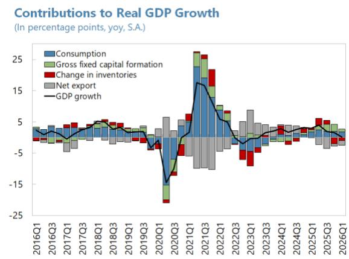  
Weaker exports largely reflect a decline in mining activity following an accident in July 2025...

... mostly driven by smaller contributions from net exports.  
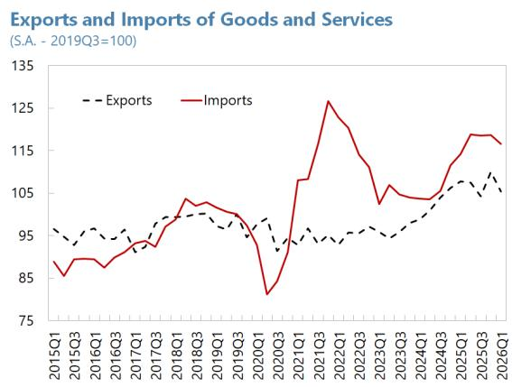  
...while stronger imports in 2025 reflect a pickup in investment...  
GDP Growth Composition (In percent of GDP)

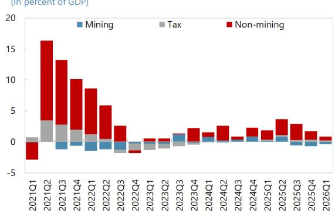  
Real Gross Fixed Capital Formation (Index, 2019Q4 = 100)

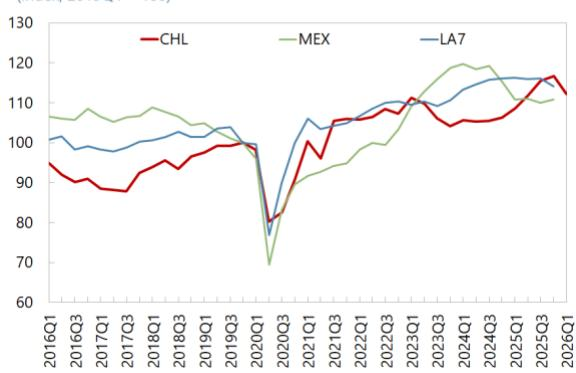

... and still-robust consumption growth.  
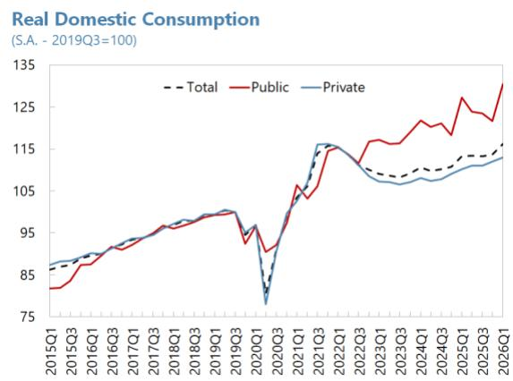  
Business confidence improved through 2025 and early 2026 but has softened since the Middle East conflict.

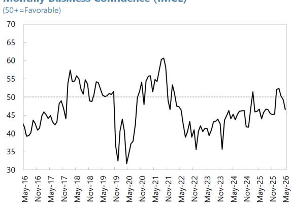  
Sources: Central Bank of Chile, Ministry of Finance, INE, Haver Analytics, and IMF staff calculations.

## Figure 2. Chile: External Sector

The current account deficit narrowed though 2026Q1.  
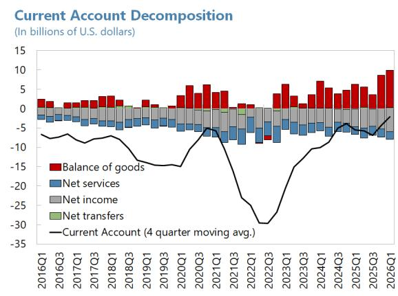  
... and the higher trade balance mainly reflects higher copper export prices.

Imports have continued to grow, consistent with robust consumption and investment growth, ...
Private Consumption and Real Imports
(Index, 2023Q1=100)  
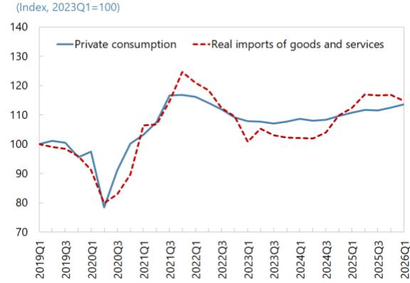  
The peso appreciated as copper prices rose, despite temporary volatility following the Middle East conflict.  
Prices of Goods Exports and Goods Imports (USD price index, 2023Q1=100)

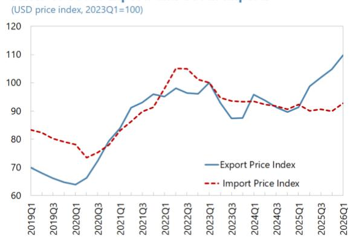  
Chile: Exchange Rate and Copper Price (CLP/USD - LHS; USD per pound - RHS)

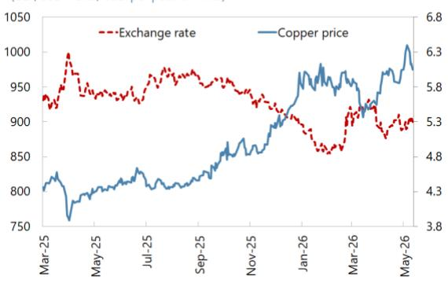  
Gross international reserves increased in 2025 but are below 100% of the ARA metric.  
Gross Reserves and Reserve Adequacy Metric 1/ (In billions of U.S. dollars)

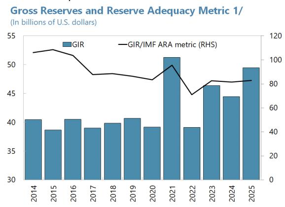  
FX buffers held by the government (not counted as international reserves) have stabilized at a low level. Government Liquid FX Assets (In billions of U.S. dollars)

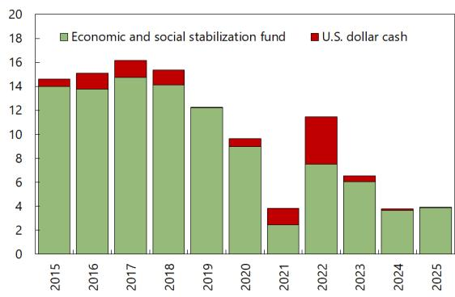  
Sources: Central Bank of Chile, DIPRES, Haver Analytics, and IMF staff calculations. 1/ As percent of the IMF reserve adequacy metric. See Assessing Reserve Adequacy, IMF.

Figure 3. Chile: Inflation 1/  
After briefly falling below target, headline inflation has picked up following the conflict in the Middle East.  
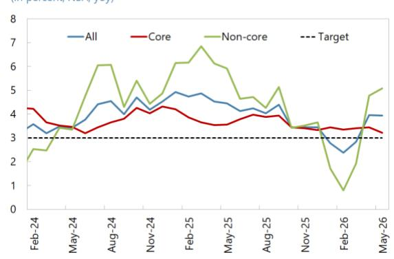  
Prior to the war, disinflation was led by tradable prices, reflecting falling import prices, and peso appreciation...  
The disinflation in 2025 and the pickup in inflation since March 2026 have broadly mirrored regional trends. Headline Consumer Price Inflation 2/

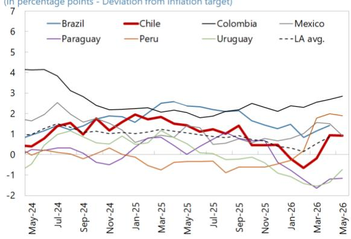

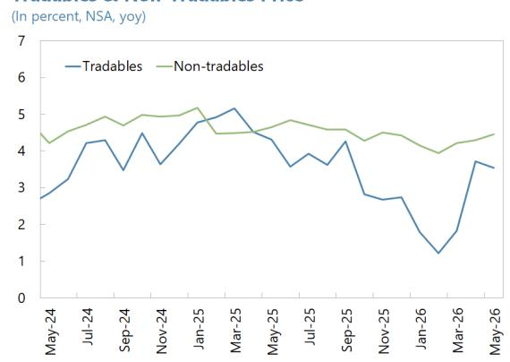  
... as well as the fading base effects from the electricity price hikes implemented during 2024-25.

The rise in inflation since March is driven by fuel and transportation prices, with limited second-round effects.  
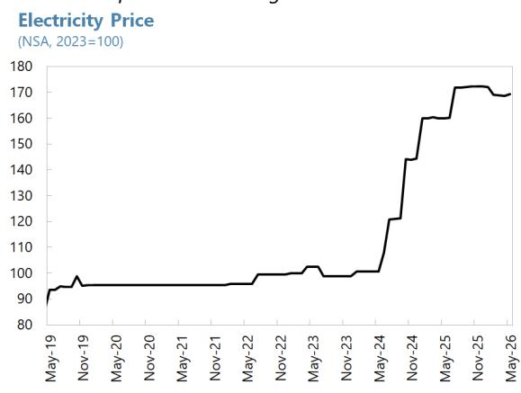

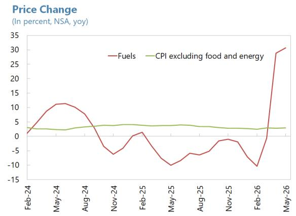  
Two-year inflation expectations remain close to the target.  
Inflation Expectations at 1 and 2 Years (In percent)

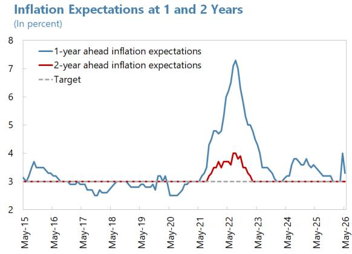  
Sources: Central Bank of Chile, Haver Analytics, and IMF staff calculations.  
1/ Inflation rates during 2014-2023 are calculated based on the 2018 CPI basket. Inflation rates after January 2024 are calculated based on the 2023 CPI basket.  
2/ LA7 group includes seven Latin American countries: Brazil, Chile, Colombia, Mexico, Paraguay, Peru, and Uruguay. Average LA inflation is calculated as the PPP-GDP-weighted average inflation rate across these countries.

The fiscal deficit was unchanged in 2025 mainly due to a weaker-than-expected revenue performance...
Fiscal Balance, Expenditure and Revenue

## Figure 4. Chile: Public Finances

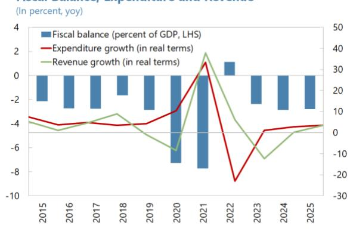  
Capital spending execution increased somewhat in 2025 but remained below pre-pandemic levels.  
... which is linked to the persistently low non-mining tax revenue-to-GDP ratio.

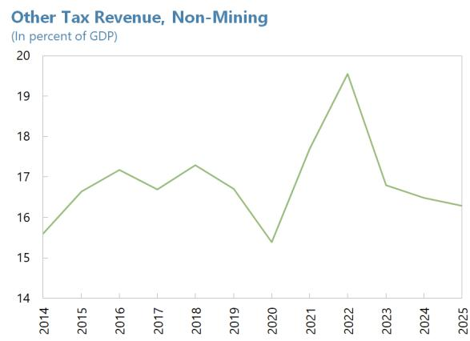  
Chile's gross debt-to-GDP ratio is relatively low by international standards, and...  
Capital Spending Execution (Percent of budgeted amount)

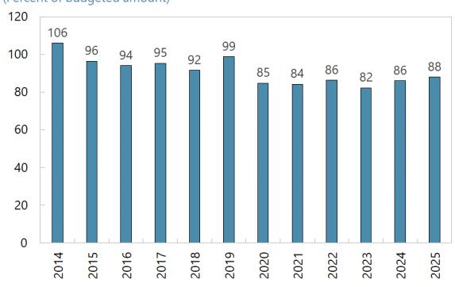  
General Government Gross Debt 1/ (In percent of GDP)

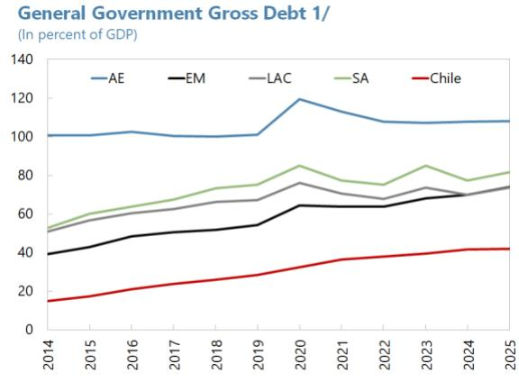  
...the government continues to borrow at favorable rates, EMBI Spreads (Basis points)

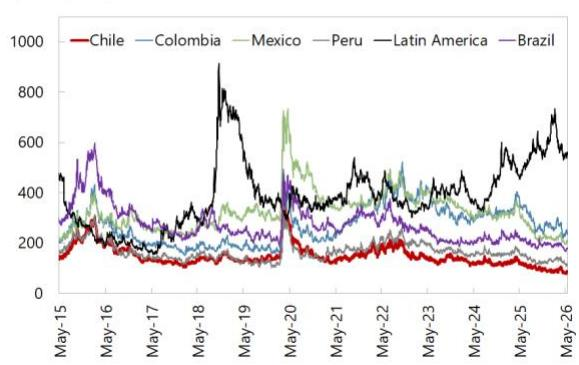  
... while Treasury assets have not recovered.

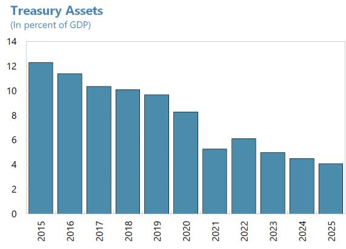  
Sources: Ministry of Finance, Dipres, Central Bank of Chile, Bloomberg, and IMF staff calculations and projections. 1/ AE = Advance Economies; EM = Emerging and Developing Economies; LAC = Latin America and the Caribbean, excluding Venezuela; SA = South America, excluding Venezuela.

1/ The solid line represents the banking system series, and the dashed lines represent the maximum and minimum values among the six D-SIBs. Data prior to December 2020 is based on the Basel I regulations.

Figure 5. Chile: Financial Sector  
Banks implemented Basel III requirements by end-2025 with a comfortable level of voluntary buffers.  
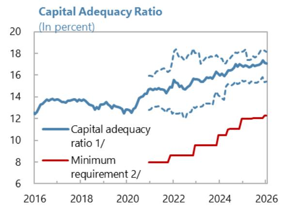  
NPL ratios stabilized at a level slightly above the pre-pandemic average...  
Credit growth was sluggish, with a mild recovery in the second half of 2025.

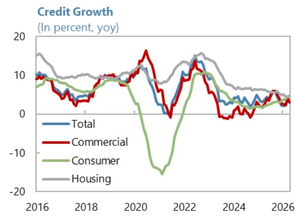

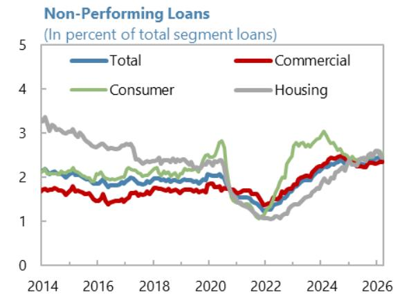  
... with provision coverage ratios similar to the pre-pandemic levels.  
Lending rates gradually decreased.

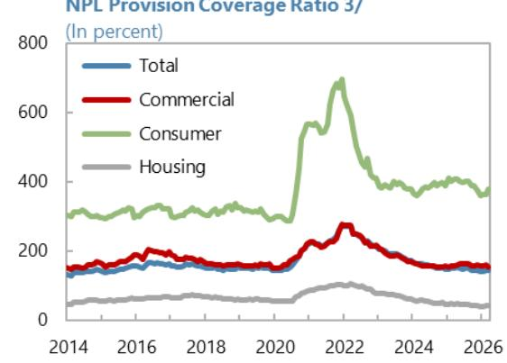

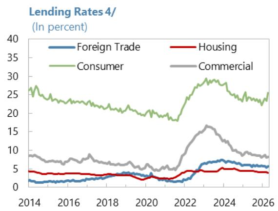  
Weaknesses in the housing markets remain, given still-elevated inventory levels and subdued sales.  
Sources: CMF, CEIC, BCCh, Haver Analytics, and IMF staff calculations.

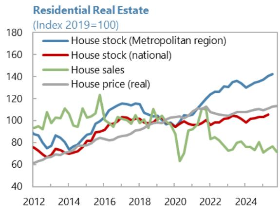  
2/ The minimum requirement includes the D-SIB surcharge and the Pillar 2 requirements calculated as the weighted average of individual banks requirements weighted by the risk-weighted assets.  
3/ The ratio of the sum of specific and additional provisions to non-performing loans.  
4/ Interest rates for commercial and consumer loans are nominal rates (CLP-based), while that for housing loans is a real rate (UF-based).

Peso Interest Rates (Swap Rates)

Dollar Funding Premium in the Local Markets

Sources: BCCh, Bloomberg, CEIC, Haver Analytics, and IMF staff calculations.

Figure 6. Chile: Financial Markets  
The equity index remains close to its 2025 historical highs, while the price-to-earnings ratio is below its past average.  
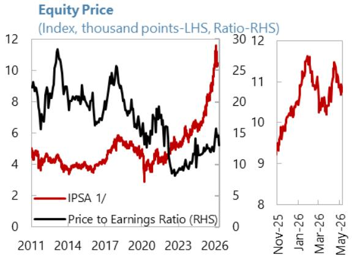  
After a gradual decline following monetary policy rate cuts, short-term nominal rates have increased since the War.

Long-term rates and the sovereign spread have largely been stable in the recent period.  
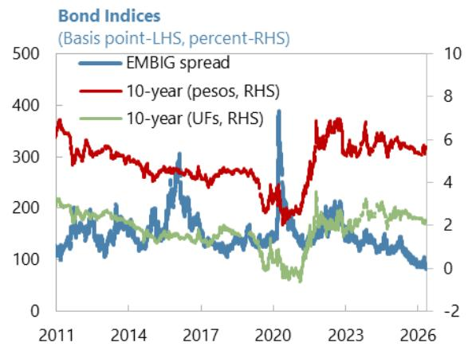  
The dollar funding premium is largely unchanged.

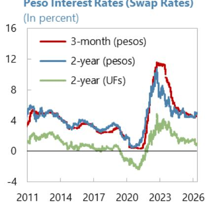

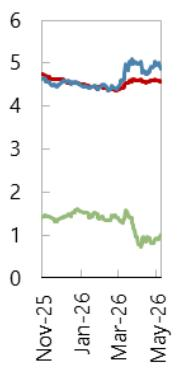  
Domestic non-financial corporate bond issuance has seen some dynamism in recent quarters.

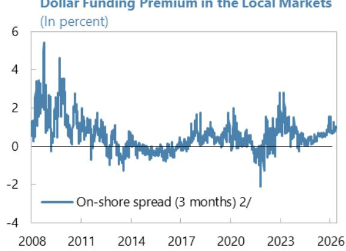

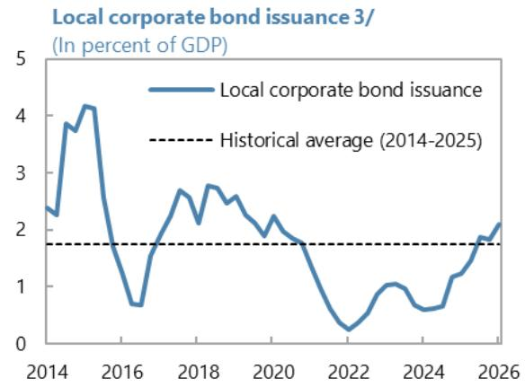  
After experiencing robust inflows, equity and bond funds inflows have softened since the War.

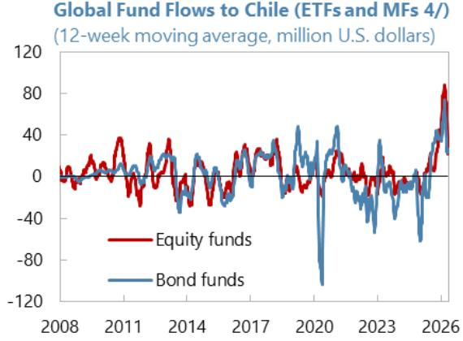  
1/ The index measures the performance of some of the largest and most liquid stocks listed on the Santiago Stock Exchange.
2/ The difference between the onshore rate (the prime deposit rate, i.e., the rate offered by banks to institutional investors) and the Libor (the term SOFR since August 2022), providing a proxy of the cost of financing in U.S. dollars in the national market vis-à-vis the international market

3/ The ratio of the moving sum of four quarters of local corporate bond issuance to a moving sum of four quarters of the quarterly GDP.

4/ ETFs: Exchange traded funds; MFs: Mutual funds.

## Figure 7. Chile: Pension Fund Sector

The pension fund assets-to-GDP ratio is projected to increase thanks to the increased contribution rate.

Pension funds' U.S. interest rate swaps by term  
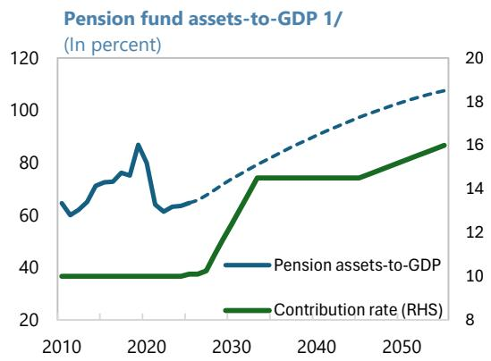  
Pension funds are the primary long-term investors in the domestic capital markets.  
Currently, the pension fund system operates under a multi-fund system with five funds of different riskiness.

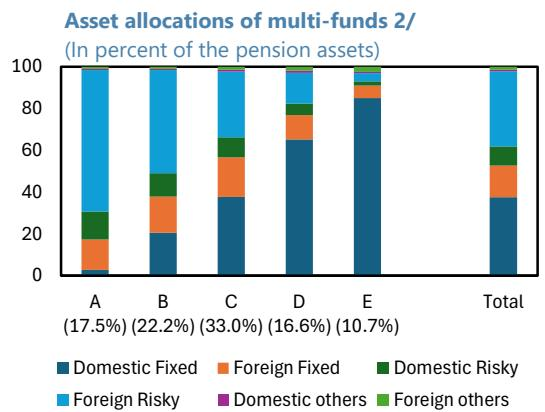  
The size of asset reallocations due to the transition will crucially depend on the design of the glide path.

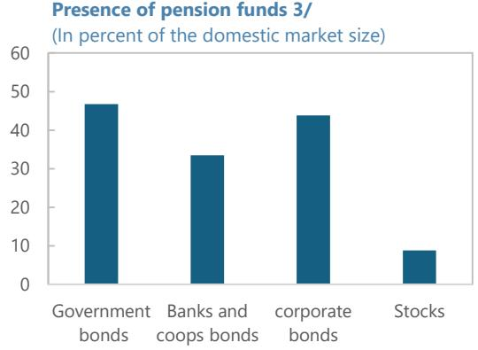  
Pension funds have been rapidly building derivative positions on U.S. interest rates since 2023.  
Estimated size of asset reallocations 4/ (In trillion pesos)

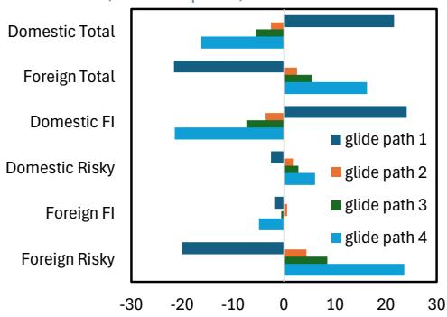  
The pension supervisor has amended regulations on derivative limits based on the size of risk exposure.

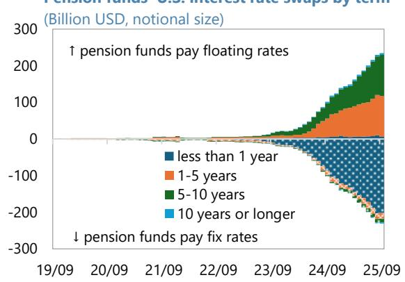  
Pension funds' interest rate swap: DV01 5/ (Millions USD)

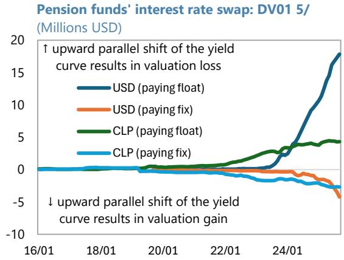  
Sources: BCCh, CMF, SP, INE, and IMF staff calculations.  
1/ The pension assets-to-GDP values for and after 2025 are based on staff's projection.  
2/ As of October 2025. The percentage figures in the parentheses denote the proportion of pension assets of each multi-fund type to the aggregate pension assets.  
3/ As of September 2025. The values for the bond segments are the pension funds' domestic bond holdings to the stock of the respective domestic bonds. The value of "Stocks" is the ratio to the total market capitalization of the Santiago Stock Exchange. 4/ The estimated asset reallocation size under several example glide paths for the generational funds. See the Selected Issues Paper for the details.  
5/ DV01 measures the valuation loss of swap positions given an upward parallel shift of the yield curve by one basis point.

<table><tr><td colspan="11">Table 1. Chile: Selected Social and Economic Indicators 1/</td></tr><tr><td>GDP (2025), in trillions of pesos</td><td>340</td><td></td><td></td><td></td><td></td><td colspan="5">Quota</td></tr><tr><td>GDP (2025), in billions of U.S. dollars</td><td>358</td><td></td><td></td><td></td><td></td><td colspan="4">in millions of SDRs</td><td>1,744</td></tr><tr><td>Per capita (2025), U.S. dollars</td><td>17,847</td><td></td><td></td><td></td><td></td><td colspan="4">in % of total</td><td>0.37</td></tr><tr><td>Population (2025), in millions 1/</td><td>20.0</td><td></td><td></td><td></td><td></td><td colspan="4">Poverty rate (2024) 1/</td><td>17.3</td></tr><tr><td>Main products and exports</td><td>Copper, fruits, fish</td><td></td><td></td><td></td><td></td><td colspan="4">Gini coefficient (2024) 1/</td><td>0.46</td></tr><tr><td>Key export markets</td><td>China, U.S., Euro Area</td><td></td><td></td><td></td><td></td><td colspan="4">Life expectancy (2026)</td><td>81.8</td></tr><tr><td></td><td></td><td></td><td></td><td></td><td></td><td colspan="5">Proj.</td></tr><tr><td></td><td>2022</td><td>2023</td><td>2024</td><td>2025</td><td>2026</td><td>2027</td><td>2028</td><td>2029</td><td>2030</td><td>2031</td></tr><tr><td>Output</td><td colspan="10">(Annual percentage change, unless otherwise specified)</td></tr><tr><td>Real GDP</td><td>2.1</td><td>0.7</td><td>2.8</td><td>2.5</td><td>1.8</td><td>2.6</td><td>2.3</td><td>2.3</td><td>2.3</td><td>2.3</td></tr><tr><td>Consumption</td><td>2.5</td><td>-3.4</td><td>1.4</td><td>2.8</td><td>2.0</td><td>2.1</td><td>2.3</td><td>2.2</td><td>2.3</td><td>2.4</td></tr><tr><td>Private</td><td>1.6</td><td>-4.7</td><td>1.1</td><td>2.7</td><td>2.0</td><td>2.2</td><td>2.3</td><td>2.1</td><td>2.3</td><td>2.5</td></tr><tr><td>Public</td><td>6.3</td><td>2.3</td><td>2.8</td><td>3.0</td><td>1.8</td><td>1.9</td><td>2.0</td><td>2.5</td><td>2.0</td><td>2.0</td></tr><tr><td>Investment 2/</td><td>1.5</td><td>-4.7</td><td>0.5</td><td>8.9</td><td>1.4</td><td>4.3</td><td>3.2</td><td>3.2</td><td>3.2</td><td>3.2</td></tr><tr><td>Fixed capital formation</td><td>4.6</td><td>0.3</td><td>-1.6</td><td>7.0</td><td>1.9</td><td>3.9</td><td>3.2</td><td>3.2</td><td>3.1</td><td>3.2</td></tr><tr><td>Exports of goods and services</td><td>0.8</td><td>0.3</td><td>7.2</td><td>4.6</td><td>0.6</td><td>3.5</td><td>2.1</td><td>2.5</td><td>2.1</td><td>2.0</td></tr><tr><td>Imports of goods and services</td><td>1.3</td><td>-11.1</td><td>2.1</td><td>10.5</td><td>0.6</td><td>3.8</td><td>3.0</td><td>3.0</td><td>3.0</td><td>3.1</td></tr><tr><td>Output gap (in percent)</td><td>2.5</td><td>0.3</td><td>-0.1</td><td>0.2</td><td>-0.4</td><td>-0.1</td><td>0.0</td><td>0.0</td><td>0.0</td><td>0.0</td></tr><tr><td>Employment</td><td></td><td></td><td></td><td></td><td></td><td></td><td></td><td></td><td></td><td></td></tr><tr><td>Unemployment rate (in percent, annual average)</td><td>7.9</td><td>8.7</td><td>8.5</td><td>8.5</td><td>8.8</td><td>8.4</td><td>8.1</td><td>7.8</td><td>7.7</td><td>7.6</td></tr><tr><td>Prices</td><td></td><td></td><td></td><td></td><td></td><td></td><td></td><td></td><td></td><td></td></tr><tr><td>GDP deflator</td><td>7.5</td><td>6.6</td><td>7.1</td><td>6.8</td><td>4.1</td><td>1.5</td><td>3.4</td><td>3.1</td><td>3.1</td><td>3.0</td></tr><tr><td>Change of CPI (end of period)</td><td>12.8</td><td>3.9</td><td>4.5</td><td>3.4</td><td>4.2</td><td>3.0</td><td>3.0</td><td>3.0</td><td>3.0</td><td>3.0</td></tr><tr><td>Change of CPI (period average)</td><td>11.6</td><td>7.6</td><td>3.8</td><td>4.2</td><td>3.7</td><td>3.4</td><td>3.0</td><td>3.0</td><td>3.0</td><td>3.0</td></tr><tr><td>Public Sector Finances</td><td colspan="10">(In percent of GDP, unless otherwise specified)</td></tr><tr><td>Central government revenue</td><td>26.1</td><td>22.9</td><td>21.7</td><td>21.4</td><td>21.7</td><td>21.9</td><td>21.9</td><td>21.9</td><td>21.9</td><td>21.9</td></tr><tr><td>Central government expenditure</td><td>25.0</td><td>25.3</td><td>24.5</td><td>24.2</td><td>24.2</td><td>23.9</td><td>23.9</td><td>23.9</td><td>23.8</td><td>23.7</td></tr><tr><td>Central government fiscal balance</td><td>1.1</td><td>-2.4</td><td>-2.9</td><td>-2.8</td><td>-2.5</td><td>-2.0</td><td>-2.0</td><td>-2.0</td><td>-1.8</td><td>-1.7</td></tr><tr><td>Central government structural fiscal balance 3/</td><td>-1.7</td><td>-3.4</td><td>-3.3</td><td>-3.3</td><td>-3.1</td><td>-2.4</td><td>-2.0</td><td>-2.0</td><td>-1.8</td><td>-1.7</td></tr><tr><td>Structural non-mining primary balance</td><td>-2.3</td><td>-4.2</td><td>-3.8</td><td>-4.2</td><td>-4.4</td><td>-3.7</td><td>-3.3</td><td>-3.0</td><td>-2.8</td><td>-2.7</td></tr><tr><td>Central government gross debt</td><td>37.9</td><td>39.4</td><td>41.8</td><td>41.5</td><td>43.2</td><td>45.0</td><td>46.2</td><td>47.4</td><td>48.4</td><td>49.2</td></tr><tr><td>of which, FX-denominated debt</td><td>13.5</td><td>14.0</td><td>15.1</td><td>14.1</td><td>14.1</td><td>14.8</td><td>15.7</td><td>16.2</td><td>16.6</td><td>16.1</td></tr><tr><td>Central government debt net of treasury assets</td><td>31.8</td><td>34.4</td><td>37.3</td><td>37.5</td><td>39.6</td><td>41.5</td><td>42.9</td><td>44.2</td><td>45.3</td><td>46.2</td></tr><tr><td>Public sector gross debt 4/</td><td>67.2</td><td>70.2</td><td>61.9</td><td>60.6</td><td>62.3</td><td>64.1</td><td>65.3</td><td>66.5</td><td>67.4</td><td>68.2</td></tr><tr><td>Money and Credit</td><td colspan="10">(Annual percentage change, unless otherwise specified)</td></tr><tr><td>M2</td><td>5.9</td><td>2.7</td><td>6.1</td><td>2.9</td><td>3.0</td><td>4.2</td><td>5.7</td><td>5.5</td><td>5.5</td><td>5.4</td></tr><tr><td>Credit to the private sector</td><td>10.0</td><td>3.3</td><td>3.9</td><td>2.2</td><td>4.0</td><td>4.5</td><td>6.0</td><td>6.0</td><td>6.0</td><td>6.0</td></tr><tr><td>Balance of Payments</td><td></td><td></td><td></td><td></td><td></td><td></td><td></td><td></td><td></td><td></td></tr><tr><td>Current account (% of GDP) 5/</td><td>-8.9</td><td>-3.1</td><td>-1.2</td><td>-1.2</td><td>-1.4</td><td>-2.1</td><td>-2.0</td><td>-1.9</td><td>-1.9</td><td>-1.9</td></tr><tr><td>Current account (in bn of USD)</td><td>-26.7</td><td>-10.4</td><td>-3.8</td><td>-4.3</td><td>-5.6</td><td>-9.0</td><td>-8.8</td><td>-8.7</td><td>-9.1</td><td>-9.7</td></tr><tr><td>Gross international reserves (in bn of USD) 6/</td><td>39.2</td><td>46.4</td><td>44.4</td><td>49.5</td><td>57.2</td><td>64.9</td><td>70.8</td><td>73.5</td><td>76.3</td><td>79.3</td></tr><tr><td>Gross external debt (% of GDP) 5/</td><td>76.9</td><td>72.4</td><td>74.4</td><td>77.6</td><td>72.3</td><td>71.1</td><td>71.8</td><td>72.2</td><td>72.4</td><td>71.6</td></tr><tr><td>Memorandum Items</td><td></td><td></td><td></td><td></td><td></td><td></td><td></td><td></td><td></td><td></td></tr><tr><td>Nominal GDP (trillions of pesos)</td><td>263</td><td>282</td><td>311</td><td>340</td><td>360</td><td>376</td><td>397</td><td>419</td><td>442</td><td>465</td></tr><tr><td colspan="11">Sources: Central Bank of Chile, Ministry of Finance, Haver Analytics, and IMF staff calculations and projections.</td></tr><tr><td colspan="11">1/ Poverty rate and Gini coefficient are from CASEN (new methodology 2024), and are calculated based on national poverty line.</td></tr><tr><td colspan="11">2/ Investment includes gross fixed capital formation and changes in inventories.</td></tr><tr><td colspan="11">3/ The structural fiscal balance includes adjustments for output, copper prices, and lithium revenues based on IMF calculations.</td></tr><tr><td colspan="11">4/ Includes liabilities of the central government, the Central Bank of Chile and public enterprises. Excludes Recognition Bonds.</td></tr><tr><td colspan="11">5/ Calculated as a share of US$ GDP.</td></tr><tr><td colspan="11">6/ Includes earned interest on reserve assets.</td></tr><tr><td colspan="11">Table 2. Chile: Summary of Operations of the Central Government(In percent of GDP, unless otherwise specified)</td></tr><tr><td rowspan="2"></td><td colspan="10">Proj.</td></tr><tr><td>2022</td><td>2023</td><td>2024</td><td>2025</td><td>2026</td><td>2027</td><td>2028</td><td>2029</td><td>2030</td><td>2031</td></tr><tr><td>Revenues</td><td>26.1</td><td>22.9</td><td>21.7</td><td>21.4</td><td>21.7</td><td>21.9</td><td>21.9</td><td>21.9</td><td>21.9</td><td>21.9</td></tr><tr><td>Taxes</td><td>21.1</td><td>17.6</td><td>17.6</td><td>17.8</td><td>17.8</td><td>18.1</td><td>18.2</td><td>18.2</td><td>18.2</td><td>18.2</td></tr><tr><td>Private mining companies</td><td>1.5</td><td>0.8</td><td>1.1</td><td>1.6</td><td>1.9</td><td>1.8</td><td>1.7</td><td>1.6</td><td>1.6</td><td>1.6</td></tr><tr><td>Other tax revenues, non-mining</td><td>19.6</td><td>16.8</td><td>16.5</td><td>16.3</td><td>15.8</td><td>16.3</td><td>16.5</td><td>16.6</td><td>16.6</td><td>16.5</td></tr><tr><td>Social contributions</td><td>1.0</td><td>1.2</td><td>1.2</td><td>1.3</td><td>1.4</td><td>1.4</td><td>1.4</td><td>1.4</td><td>1.4</td><td>1.4</td></tr><tr><td>Grants</td><td>0.1</td><td>0.0</td><td>0.0</td><td>0.0</td><td>0.0</td><td>0.0</td><td>0.0</td><td>0.0</td><td>0.0</td><td>0.0</td></tr><tr><td>Other revenue</td><td>4.0</td><td>4.1</td><td>2.8</td><td>2.2</td><td>2.6</td><td>2.4</td><td>2.3</td><td>2.3</td><td>2.4</td><td>2.3</td></tr><tr><td>Codelco revenues</td><td>0.7</td><td>0.4</td><td>0.4</td><td>0.5</td><td>0.6</td><td>0.6</td><td>0.6</td><td>0.5</td><td>0.5</td><td>0.5</td></tr><tr><td>Income on assets</td><td>0.5</td><td>0.7</td><td>0.4</td><td>0.4</td><td>0.5</td><td>0.4</td><td>0.3</td><td>0.3</td><td>0.3</td><td>0.3</td></tr><tr><td>Lithium (rental income) 1/..</td><td>0.9</td><td>1.0</td><td>0.2</td><td>0.1</td><td>0.2</td><td>0.2</td><td>0.2</td><td>0.2</td><td>0.2</td><td>0.2</td></tr><tr><td>Operating income</td><td>0.4</td><td>0.5</td><td>0.5</td><td>0.4</td><td>0.4</td><td>0.4</td><td>0.4</td><td>0.4</td><td>0.4</td><td>0.4</td></tr><tr><td>Other income</td><td>1.3</td><td>1.5</td><td>1.3</td><td>0.7</td><td>0.8</td><td>0.8</td><td>0.8</td><td>0.8</td><td>0.8</td><td>0.8</td></tr><tr><td>Expenditures</td><td>25.0</td><td>25.3</td><td>24.5</td><td>24.2</td><td>24.2</td><td>23.9</td><td>23.9</td><td>23.9</td><td>23.8</td><td>23.7</td></tr><tr><td>Expense</td><td>23.5</td><td>23.8</td><td>23.1</td><td>22.7</td><td>23.0</td><td>23.1</td><td>23.4</td><td>23.5</td><td>23.6</td><td>23.5</td></tr><tr><td>Compensation of employees</td><td>4.7</td><td>4.9</td><td>4.9</td><td>5.0</td><td>4.9</td><td>4.9</td><td>4.9</td><td>4.9</td><td>4.9</td><td>4.9</td></tr><tr><td>Purchases of goods and services</td><td>2.0</td><td>1.9</td><td>1.9</td><td>2.0</td><td>1.8</td><td>1.8</td><td>1.8</td><td>1.8</td><td>1.8</td><td>1.8</td></tr><tr><td>Interest payments</td><td>1.0</td><td>1.1</td><td>1.2</td><td>1.2</td><td>1.3</td><td>1.3</td><td>1.5</td><td>1.6</td><td>1.7</td><td>1.7</td></tr><tr><td>Subsidies and grants</td><td>9.3</td><td>8.9</td><td>8.4</td><td>7.8</td><td>8.4</td><td>8.0</td><td>7.8</td><td>7.6</td><td>7.4</td><td>7.4</td></tr><tr><td>Social benefits</td><td>4.3</td><td>5.0</td><td>4.6</td><td>4.6</td><td>4.5</td><td>4.6</td><td>4.7</td><td>4.7</td><td>4.6</td><td>4.7</td></tr><tr><td>Other expense</td><td>2.1</td><td>2.0</td><td>2.0</td><td>2.0</td><td>2.2</td><td>2.2</td><td>2.2</td><td>2.2</td><td>2.1</td><td>2.0</td></tr><tr><td>Unspecified measures</td><td>0.0</td><td>0.0</td><td>0.0</td><td>0.0</td><td>0.0</td><td>-0.4</td><td>-0.6</td><td>-0.8</td><td>-1.0</td><td>-1.0</td></tr><tr><td>Net acquisition of nonfinancial assets</td><td>1.5</td><td>1.5</td><td>1.4</td><td>1.4</td><td>1.2</td><td>1.2</td><td>1.2</td><td>1.2</td><td>1.2</td><td>1.1</td></tr><tr><td>Investment</td><td>1.5</td><td>1.5</td><td>1.4</td><td>1.4</td><td>1.2</td><td>1.2</td><td>1.2</td><td>1.2</td><td>1.2</td><td>1.2</td></tr><tr><td>Net Lending/Borrowing</td><td>1.1</td><td>-2.4</td><td>-2.9</td><td>-2.8</td><td>-2.5</td><td>-2.0</td><td>-2.0</td><td>-2.0</td><td>-1.8</td><td>-1.7</td></tr><tr><td>Non-mining overall balance</td><td>-2.1</td><td>-4.7</td><td>-4.6</td><td>-5.0</td><td>-5.3</td><td>-4.6</td><td>-4.5</td><td>-4.2</td><td>-4.2</td><td>-4.1</td></tr><tr><td>Net Financial Transactions</td><td>1.1</td><td>-2.4</td><td>-2.9</td><td>-2.8</td><td>-2.5</td><td>-2.0</td><td>-2.0</td><td>-2.0</td><td>-1.8</td><td>-1.7</td></tr><tr><td>Net acquisition of financial assets</td><td>3.5</td><td>-0.7</td><td>-0.3</td><td>-0.3</td><td>1.6</td><td>1.0</td><td>1.1</td><td>1.0</td><td>1.0</td><td>1.0</td></tr><tr><td>Net incurrence of liabilities</td><td>2.4</td><td>1.7</td><td>2.6</td><td>2.5</td><td>4.1</td><td>3.0</td><td>3.1</td><td>3.0</td><td>2.8</td><td>2.7</td></tr><tr><td>Domestic</td><td>0.7</td><td>0.8</td><td>1.6</td><td>1.7</td><td>2.8</td><td>1.9</td><td>1.5</td><td>1.8</td><td>1.7</td><td>2.5</td></tr><tr><td>External</td><td>1.8</td><td>1.0</td><td>1.0</td><td>0.9</td><td>1.3</td><td>1.1</td><td>1.5</td><td>1.2</td><td>1.1</td><td>0.2</td></tr><tr><td>Recognition bonds</td><td>-0.1</td><td>-0.1</td><td>-0.1</td><td>0.0</td><td>0.0</td><td>0.0</td><td>0.0</td><td>0.0</td><td>0.0</td><td>0.0</td></tr><tr><td>Memorandum Items</td><td></td><td></td><td></td><td></td><td></td><td></td><td></td><td></td><td></td><td></td></tr><tr><td>Primary balance</td><td>1.6</td><td>-2.0</td><td>-2.1</td><td>-2.0</td><td>-1.7</td><td>-1.1</td><td>-0.8</td><td>-0.8</td><td>-0.5</td><td>-0.3</td></tr><tr><td>Structural fiscal balance 2/</td><td>-1.7</td><td>-3.4</td><td>-3.3</td><td>-3.3</td><td>-3.1</td><td>-2.4</td><td>-2.0</td><td>-2.0</td><td>-1.8</td><td>-1.7</td></tr><tr><td>Structural revenue</td><td>23.3</td><td>21.9</td><td>21.3</td><td>20.9</td><td>21.1</td><td>21.5</td><td>21.9</td><td>21.9</td><td>21.9</td><td>21.9</td></tr><tr><td>Structural Non-Mining Primary Balance (% of NGDP) 1/</td><td>-2.3</td><td>-4.2</td><td>-3.8</td><td>-4.2</td><td>-4.4</td><td>-3.7</td><td>-3.3</td><td>-3.0</td><td>-2.8</td><td>-2.7</td></tr><tr><td>Fiscal impulse 3/</td><td>-9.7</td><td>1.9</td><td>-0.4</td><td>0.4</td><td>0.2</td><td>-0.7</td><td>-0.4</td><td>-0.3</td><td>-0.2</td><td>-0.1</td></tr><tr><td>Expenditure growth (in real terms; annual percent change)</td><td>-23.0</td><td>1.1</td><td>2.7</td><td>3.5</td><td>2.4</td><td>-0.5</td><td>2.9</td><td>2.3</td><td>1.8</td><td>1.8</td></tr><tr><td>Central government debt net of treasury assets</td><td>31.8</td><td>34.4</td><td>37.3</td><td>37.5</td><td>39.6</td><td>41.5</td><td>42.9</td><td>44.2</td><td>45.3</td><td>46.2</td></tr><tr><td>Central government gross debt</td><td>37.9</td><td>39.4</td><td>41.8</td><td>41.5</td><td>43.2</td><td>45.0</td><td>46.2</td><td>47.4</td><td>48.4</td><td>49.2</td></tr><tr><td>Public sector gross debt 4/</td><td>67.2</td><td>70.2</td><td>61.9</td><td>60.6</td><td>62.3</td><td>64.1</td><td>65.3</td><td>66.5</td><td>67.4</td><td>68.2</td></tr><tr><td>Public sector debt net of treasury assets 4/</td><td>61.1</td><td>65.2</td><td>57.4</td><td>56.5</td><td>58.6</td><td>60.5</td><td>61.9</td><td>63.2</td><td>64.3</td><td>65.3</td></tr><tr><td>General government fiscal balance 5/</td><td>1.4</td><td>-2.3</td><td>-2.8</td><td>-2.8</td><td>-2.4</td><td>-2.0</td><td>-2.0</td><td>-1.9</td><td>-1.8</td><td>-1.7</td></tr><tr><td>Nominal GDP (trillions of pesos)</td><td>263</td><td>282</td><td>311</td><td>340</td><td>360</td><td>376</td><td>397</td><td>419</td><td>442</td><td>465</td></tr><tr><td colspan="11">Table 3. Chile: Balance of Payments(In US$ billions, unless otherwise specified)</td></tr><tr><td rowspan="2"></td><td colspan="10">Proj.</td></tr><tr><td>2022</td><td>2023</td><td>2024</td><td>2025</td><td>2026</td><td>2027</td><td>2028</td><td>2029</td><td>2030</td><td>2031</td></tr><tr><td>Current Account</td><td>-26.7</td><td>-10.4</td><td>-3.8</td><td>-4.3</td><td>-5.6</td><td>-9.0</td><td>-8.8</td><td>-8.7</td><td>-9.1</td><td>-9.7</td></tr><tr><td>Trade balance</td><td>3.6</td><td>13.8</td><td>20.8</td><td>23.8</td><td>30.0</td><td>23.3</td><td>23.6</td><td>24.4</td><td>24.6</td><td>24.7</td></tr><tr><td>Exports</td><td>98.5</td><td>93.0</td><td>98.9</td><td>110.4</td><td>124.8</td><td>119.8</td><td>122.6</td><td>126.1</td><td>129.6</td><td>133.1</td></tr><tr><td>Copper</td><td>43.8</td><td>42.6</td><td>49.9</td><td>58.7</td><td>69.6</td><td>63.1</td><td>63.3</td><td>63.8</td><td>64.4</td><td>64.8</td></tr><tr><td>Non-copper</td><td>54.7</td><td>50.4</td><td>49.0</td><td>51.7</td><td>55.2</td><td>56.6</td><td>59.3</td><td>62.3</td><td>65.2</td><td>68.3</td></tr><tr><td>Imports</td><td>94.9</td><td>79.1</td><td>78.1</td><td>86.5</td><td>94.8</td><td>96.5</td><td>99.0</td><td>101.7</td><td>105.0</td><td>108.4</td></tr><tr><td>Net services</td><td>-15.5</td><td>-10.7</td><td>-9.2</td><td>-8.9</td><td>-10.6</td><td>-10.7</td><td>-11.0</td><td>-11.7</td><td>-12.2</td><td>-12.7</td></tr><tr><td>Net income</td><td>-14.7</td><td>-14.2</td><td>-15.4</td><td>-19.4</td><td>-25.5</td><td>-21.9</td><td>-21.8</td><td>-21.9</td><td>-22.0</td><td>-22.0</td></tr><tr><td>Net transfers</td><td>-0.2</td><td>0.6</td><td>0.0</td><td>0.1</td><td>0.4</td><td>0.4</td><td>0.4</td><td>0.4</td><td>0.4</td><td>0.4</td></tr><tr><td>Capital account balance</td><td>0.0</td><td>0.1</td><td>0.0</td><td>0.0</td><td>0.0</td><td>0.0</td><td>0.0</td><td>0.0</td><td>0.0</td><td>0.0</td></tr><tr><td>Financial Account Balance</td><td>-19.9</td><td>-16.0</td><td>-3.7</td><td>-8.4</td><td>-11.2</td><td>-14.5</td><td>-12.1</td><td>-8.7</td><td>-9.1</td><td>-9.7</td></tr><tr><td>Foreign direct investment</td><td>-4.7</td><td>-10.8</td><td>-9.1</td><td>-5.8</td><td>-8.7</td><td>-8.1</td><td>-7.6</td><td>-8.3</td><td>-8.1</td><td>-8.1</td></tr><tr><td>Abroad by Chilean residents</td><td>14.1</td><td>8.4</td><td>4.0</td><td>8.7</td><td>7.5</td><td>7.0</td><td>8.2</td><td>8.0</td><td>8.1</td><td>8.5</td></tr><tr><td>In Chile by foreign residents</td><td>18.8</td><td>19.2</td><td>13.1</td><td>14.5</td><td>16.2</td><td>15.1</td><td>15.8</td><td>16.2</td><td>16.2</td><td>16.6</td></tr><tr><td>Of which, debt instruments</td><td>0.5</td><td>2.5</td><td>0.4</td><td>-0.2</td><td>0.9</td><td>0.4</td><td>0.4</td><td>0.6</td><td>0.5</td><td>0.5</td></tr><tr><td>Portfolio investment</td><td>-5.6</td><td>1.4</td><td>1.0</td><td>7.4</td><td>3.6</td><td>2.0</td><td>1.5</td><td>3.5</td><td>4.3</td><td>2.8</td></tr><tr><td>Abroad by Chilean residents</td><td>7.6</td><td>5.3</td><td>5.5</td><td>18.9</td><td>10.5</td><td>10.0</td><td>10.6</td><td>11.7</td><td>13.0</td><td>11.8</td></tr><tr><td>In Chile by foreign residents</td><td>13.2</td><td>3.9</td><td>4.5</td><td>11.6</td><td>6.9</td><td>7.9</td><td>9.1</td><td>8.2</td><td>8.7</td><td>9.0</td></tr><tr><td>Of which, equities</td><td>7.7</td><td>-1.4</td><td>-0.8</td><td>-3.1</td><td>-1.8</td><td>-2.0</td><td>-2.4</td><td>-2.1</td><td>-2.3</td><td>-2.3</td></tr><tr><td>Of which, debt</td><td>5.5</td><td>5.3</td><td>5.3</td><td>14.7</td><td>8.7</td><td>9.9</td><td>11.5</td><td>10.4</td><td>11.0</td><td>11.3</td></tr><tr><td>Financial derivatives</td><td>0.0</td><td>-1.7</td><td>-0.5</td><td>-1.8</td><td>-1.4</td><td>-1.3</td><td>-1.6</td><td>-1.5</td><td>-1.5</td><td>-1.6</td></tr><tr><td>Other investments</td><td>-9.7</td><td>-4.8</td><td>4.8</td><td>-8.1</td><td>-4.7</td><td>-7.2</td><td>-4.4</td><td>-2.4</td><td>-3.8</td><td>-2.8</td></tr><tr><td>Abroad by Chilean residents</td><td>-0.9</td><td>-3.0</td><td>5.2</td><td>1.2</td><td>1.2</td><td>2.6</td><td>1.8</td><td>2.0</td><td>2.2</td><td>2.1</td></tr><tr><td>In Chile by foreign residents</td><td>8.7</td><td>1.8</td><td>0.4</td><td>9.3</td><td>5.9</td><td>9.8</td><td>6.2</td><td>4.4</td><td>6.0</td><td>4.9</td></tr><tr><td>Change in Reserves Assets</td><td>-9.2</td><td>6.8</td><td>-2.6</td><td>2.2</td><td>5.6</td><td>5.6</td><td>3.3</td><td>0.0</td><td>0.0</td><td>0.0</td></tr><tr><td>Errors and omissions</td><td>-2.4</td><td>1.2</td><td>-2.5</td><td>-1.8</td><td>0.0</td><td>0.0</td><td>0.0</td><td>0.0</td><td>0.0</td><td>0.0</td></tr><tr><td>Gross international reserves (in billions of USD) 1/</td><td>39.2</td><td>46.4</td><td>44.4</td><td>49.5</td><td>57.2</td><td>64.9</td><td>70.8</td><td>73.5</td><td>76.3</td><td>79.3</td></tr><tr><td colspan="11">(In percent of GDP)</td></tr><tr><td>Current Account 2/</td><td>-8.9</td><td>-3.1</td><td>-1.2</td><td>-1.2</td><td>-1.4</td><td>-2.1</td><td>-2.0</td><td>-1.9</td><td>-1.9</td><td>-1.9</td></tr><tr><td>Trade balance of Goods</td><td>1.2</td><td>4.1</td><td>6.3</td><td>6.7</td><td>7.4</td><td>5.4</td><td>5.3</td><td>5.2</td><td>5.0</td><td>4.8</td></tr><tr><td>Exports</td><td>32.7</td><td>27.7</td><td>30.0</td><td>30.9</td><td>30.9</td><td>27.9</td><td>27.3</td><td>26.9</td><td>26.5</td><td>26.1</td></tr><tr><td>Copper</td><td>14.5</td><td>12.7</td><td>15.1</td><td>16.4</td><td>17.2</td><td>14.7</td><td>14.1</td><td>13.6</td><td>13.2</td><td>12.7</td></tr><tr><td>Non-copper</td><td>18.2</td><td>15.0</td><td>14.9</td><td>14.5</td><td>13.7</td><td>13.2</td><td>13.2</td><td>13.3</td><td>13.3</td><td>13.4</td></tr><tr><td>Imports</td><td>31.5</td><td>23.6</td><td>23.7</td><td>24.2</td><td>23.5</td><td>22.5</td><td>22.1</td><td>21.7</td><td>21.5</td><td>21.2</td></tr><tr><td>Net services</td><td>-5.1</td><td>-3.2</td><td>-2.8</td><td>-2.5</td><td>-2.6</td><td>-2.5</td><td>-2.5</td><td>-2.5</td><td>-2.5</td><td>-2.5</td></tr><tr><td>Net income</td><td>-4.9</td><td>-4.2</td><td>-4.7</td><td>-5.4</td><td>-6.3</td><td>-5.1</td><td>-4.9</td><td>-4.7</td><td>-4.5</td><td>-4.3</td></tr><tr><td>Net transfers</td><td>-0.1</td><td>0.2</td><td>0.0</td><td>0.0</td><td>0.1</td><td>0.1</td><td>0.1</td><td>0.1</td><td>0.1</td><td>0.1</td></tr><tr><td>Financial Account Balance 3/</td><td>-6.6</td><td>-4.8</td><td>-1.1</td><td>-2.3</td><td>-2.8</td><td>-3.4</td><td>-2.7</td><td>-1.9</td><td>-1.9</td><td>-1.9</td></tr><tr><td colspan="11">(Annual change in percent)</td></tr><tr><td>Goods export volume</td><td>-1.8</td><td>-1.0</td><td>5.6</td><td>4.2</td><td>-0.5</td><td>4.0</td><td>2.0</td><td>2.5</td><td>2.2</td><td>2.0</td></tr><tr><td>Goods import volume</td><td>-2.6</td><td>-12.7</td><td>2.4</td><td>12.0</td><td>1.7</td><td>2.6</td><td>3.0</td><td>2.9</td><td>3.0</td><td>3.1</td></tr><tr><td>Terms of trade 4/</td><td>-9.1</td><td>2.1</td><td>4.5</td><td>8.7</td><td>0.5</td><td>-8.9</td><td>0.8</td><td>0.5</td><td>0.4</td><td>0.5</td></tr><tr><td>Goods export prices 4/</td><td>6.0</td><td>-4.7</td><td>0.8</td><td>7.1</td><td>13.9</td><td>-7.9</td><td>0.3</td><td>0.4</td><td>0.6</td><td>0.7</td></tr><tr><td>Goods import prices 4/</td><td>16.7</td><td>-6.7</td><td>-3.5</td><td>-1.4</td><td>13.6</td><td>1.0</td><td>-0.5</td><td>-0.1</td><td>0.1</td><td>0.2</td></tr><tr><td colspan="11">Memorandum Items</td></tr><tr><td>Copper price (WEO; U.S. cents per pound)</td><td>400</td><td>385</td><td>415</td><td>451</td><td>563</td><td>489</td><td>487</td><td>485</td><td>485</td><td>486</td></tr><tr><td>Copper price (WEO; annual change in percent)</td><td>-5.2</td><td>-3.8</td><td>7.7</td><td>8.8</td><td>24.9</td><td>-13.2</td><td>-0.5</td><td>-0.3</td><td>0.0</td><td>0.1</td></tr><tr><td>Volume of copper exports (2005=100)</td><td>96</td><td>95</td><td>99</td><td>100</td><td>97</td><td>101</td><td>102</td><td>103</td><td>104</td><td>105</td></tr><tr><td>Gross international reserves (in percent of ARA metric)</td><td>71</td><td>83</td><td>81</td><td>79</td><td>84</td><td>90</td><td>92</td><td>90</td><td>88</td><td>87</td></tr></table>

<table><tr><td colspan="6">Table 4. Chile: Monetary Survey(In billions of pesos, unless otherwise specified)</td></tr><tr><td></td><td>2021</td><td>2022</td><td>2023</td><td>2024</td><td>2025</td></tr><tr><td colspan="6">Central Bank</td></tr><tr><td>Net foreign assets</td><td>40,891</td><td>31,476</td><td>38,756</td><td>41,618</td><td>42,702</td></tr><tr><td>International reserves</td><td>43,643</td><td>33,653</td><td>41,003</td><td>44,071</td><td>45,074</td></tr><tr><td>Other foreign assets, net</td><td>-2,752</td><td>-2,177</td><td>-2,247</td><td>-2,453</td><td>-2,372</td></tr><tr><td>Domestic assets</td><td>23,405</td><td>24,229</td><td>18,885</td><td>-797</td><td>-639</td></tr><tr><td>Net credit to general government</td><td>356</td><td>322</td><td>311</td><td>278</td><td>294</td></tr><tr><td>Net claims on banks and financial corporations</td><td>26,894</td><td>23,342</td><td>15,845</td><td>-1,351</td><td>-3,263</td></tr><tr><td>Credit to the private sector</td><td>-38</td><td>-33</td><td>-28</td><td>-32</td><td>-35</td></tr><tr><td>Other items (net)</td><td>-3,807</td><td>599</td><td>2,756</td><td>308</td><td>2,365</td></tr><tr><td>Monetary liabilities</td><td>64297</td><td>55,705</td><td>57,641</td><td>40,821</td><td>42,062</td></tr><tr><td>Monetary base</td><td>21,456</td><td>17,641</td><td>16,791</td><td>18,079</td><td>18,497</td></tr><tr><td>Currency</td><td>15,210</td><td>11,608</td><td>10,524</td><td>10,852</td><td>11,042</td></tr><tr><td>Currency reserves</td><td>6,247</td><td>6,033</td><td>6,268</td><td>7,226</td><td>7,455</td></tr><tr><td>Others</td><td>42,840</td><td>38,064</td><td>40,850</td><td>22,742</td><td>23,566</td></tr><tr><td colspan="6">Other Depository Institutions</td></tr><tr><td>Net foreign assets</td><td>-4,608</td><td>-7,158</td><td>-7,998</td><td>-8,856</td><td>-12,953</td></tr><tr><td>Net foreign assets (in millions of US$)</td><td>-5,420</td><td>-8,328</td><td>-9,041</td><td>-8,926</td><td>-14,216</td></tr><tr><td>Domestic assets</td><td>186,430</td><td>202,050</td><td>207,819</td><td>218,679</td><td>225,107</td></tr><tr><td>Credit to general government</td><td>17,607</td><td>16,945</td><td>16,944</td><td>20,607</td><td>24,318</td></tr><tr><td>Credit to the private sector</td><td>197,943</td><td>217,695</td><td>224,836</td><td>233,496</td><td>238,533</td></tr><tr><td>Other items (net)</td><td>-29,120</td><td>-32,590</td><td>-33,960</td><td>-35,424</td><td>-37,744</td></tr><tr><td>Liabilities to the private sector</td><td>181,821</td><td>194,891</td><td>199,820</td><td>209,822</td><td>212,153</td></tr><tr><td>Demand deposits</td><td>64,091</td><td>47,687</td><td>47,482</td><td>51,035</td><td>53,512</td></tr><tr><td>Quasi-money</td><td>117,730</td><td>147,205</td><td>152,338</td><td>158,787</td><td>158,640</td></tr><tr><td colspan="6">Banking System</td></tr><tr><td>Net foreign assets</td><td>36,283</td><td>24,318</td><td>30,757</td><td>32,762</td><td>29,749</td></tr><tr><td>Domestic assets</td><td>177,442</td><td>195,691</td><td>198,472</td><td>201,852</td><td>207,249</td></tr><tr><td>Net credit to general government</td><td>17,963</td><td>17,267</td><td>17,256</td><td>20,884</td><td>24,611</td></tr><tr><td>Credit to the private sector</td><td>197,905</td><td>217,662</td><td>224,808</td><td>233,464</td><td>238,498</td></tr><tr><td>Other items (net)</td><td>-38,426</td><td>-39,237</td><td>-43,591</td><td>-52,496</td><td>-55,862</td></tr><tr><td>Money and private quasi-money</td><td>213,725</td><td>220,009</td><td>229,230</td><td>234,614</td><td>236,997</td></tr><tr><td>Money</td><td>79,301</td><td>59,295</td><td>58,005</td><td>61,887</td><td>64,554</td></tr><tr><td>Quasi-money</td><td>134,424</td><td>160,715</td><td>171,225</td><td>172,726</td><td>172,443</td></tr><tr><td colspan="6">Memorandum Items</td></tr><tr><td></td><td colspan="5">(Annual percentage change)</td></tr><tr><td>Monetary base</td><td>-29.1</td><td>-17.8</td><td>-4.8</td><td>7.7</td><td>2.3</td></tr><tr><td>Banking system&#x27; credit to the private sector</td><td>10.1</td><td>10.0</td><td>3.3</td><td>3.9</td><td>2.2</td></tr><tr><td></td><td colspan="5">(In percent of GDP)</td></tr><tr><td>Monetary base</td><td>9.0</td><td>6.7</td><td>6.0</td><td>5.8</td><td>5.4</td></tr><tr><td>Banking system&#x27;s credit to the private sector</td><td>82.6</td><td>82.8</td><td>79.7</td><td>75.1</td><td>70.2</td></tr></table>

<table><tr><td colspan="11">Table 5. Chile: Medium-Term Macroeconomic Framework</td></tr><tr><td rowspan="2"></td><td colspan="10">Proj.</td></tr><tr><td>2022</td><td>2023</td><td>2024</td><td>2025</td><td>2026</td><td>2027</td><td>2028</td><td>2029</td><td>2030</td><td>2031</td></tr><tr><td>National Accounts</td><td colspan="10">(Annual percentage change, unless otherwise specified)</td></tr><tr><td>Real GDP</td><td>2.1</td><td>0.7</td><td>2.8</td><td>2.5</td><td>1.8</td><td>2.6</td><td>2.3</td><td>2.3</td><td>2.3</td><td>2.3</td></tr><tr><td>Total domestic demand</td><td>2.2</td><td>-3.7</td><td>1.2</td><td>4.2</td><td>1.9</td><td>2.7</td><td>2.5</td><td>2.5</td><td>2.5</td><td>2.6</td></tr><tr><td>Consumption</td><td>2.5</td><td>-3.4</td><td>1.4</td><td>2.8</td><td>2.0</td><td>2.1</td><td>2.3</td><td>2.2</td><td>2.3</td><td>2.4</td></tr><tr><td>Private</td><td>1.6</td><td>-4.7</td><td>1.1</td><td>2.7</td><td>2.0</td><td>2.2</td><td>2.3</td><td>2.1</td><td>2.3</td><td>2.5</td></tr><tr><td>Public</td><td>6.3</td><td>2.3</td><td>2.8</td><td>3.0</td><td>1.8</td><td>1.9</td><td>2.0</td><td>2.5</td><td>2.0</td><td>2.0</td></tr><tr><td>Investment 1/</td><td>1.5</td><td>-4.7</td><td>0.5</td><td>8.9</td><td>1.4</td><td>4.3</td><td>3.2</td><td>3.2</td><td>3.2</td><td>3.2</td></tr><tr><td>Gross fixed capital formation</td><td>4.6</td><td>0.3</td><td>-1.6</td><td>7.0</td><td>1.9</td><td>3.9</td><td>3.2</td><td>3.2</td><td>3.1</td><td>3.2</td></tr><tr><td>Inventories 2/</td><td>-0.7</td><td>-1.1</td><td>0.5</td><td>0.4</td><td>-0.1</td><td>0.1</td><td>0.0</td><td>0.0</td><td>0.0</td><td>0.0</td></tr><tr><td>Net exports 2/</td><td>-0.2</td><td>4.5</td><td>1.6</td><td>-1.6</td><td>0.0</td><td>0.1</td><td>-0.2</td><td>-0.1</td><td>-0.2</td><td>-0.2</td></tr><tr><td>Exports of goods and services</td><td>0.8</td><td>0.3</td><td>7.2</td><td>4.6</td><td>0.6</td><td>3.5</td><td>2.1</td><td>2.5</td><td>2.1</td><td>2.0</td></tr><tr><td>Imports of goods and services</td><td>1.3</td><td>-11.1</td><td>2.1</td><td>10.5</td><td>0.6</td><td>3.8</td><td>3.0</td><td>3.0</td><td>3.0</td><td>3.1</td></tr><tr><td>GDP Deflator</td><td>7.5</td><td>6.6</td><td>7.1</td><td>6.8</td><td>4.1</td><td>1.5</td><td>3.4</td><td>3.1</td><td>3.1</td><td>3.0</td></tr><tr><td>Change of CPI, end of period</td><td>12.8</td><td>3.9</td><td>4.5</td><td>3.4</td><td>4.2</td><td>3.0</td><td>3.0</td><td>3.0</td><td>3.0</td><td>3.0</td></tr><tr><td>Change of CPI, period average</td><td>11.6</td><td>7.6</td><td>3.8</td><td>4.2</td><td>3.7</td><td>3.4</td><td>3.0</td><td>3.0</td><td>3.0</td><td>3.0</td></tr><tr><td>Output gap (percent of potential GDP)</td><td>2.5</td><td>0.3</td><td>-0.1</td><td>0.2</td><td>-0.4</td><td>-0.1</td><td>0.0</td><td>0.0</td><td>0.0</td><td>0.0</td></tr><tr><td>Balance of Payments</td><td colspan="10">(In percent of GDP, unless otherwise specified)</td></tr><tr><td>Current account 3/</td><td>-8.9</td><td>-3.1</td><td>-1.2</td><td>-1.2</td><td>-1.4</td><td>-2.1</td><td>-2.0</td><td>-1.9</td><td>-1.9</td><td>-1.9</td></tr><tr><td>Trade balance 3/</td><td>1.2</td><td>4.1</td><td>6.3</td><td>6.7</td><td>7.4</td><td>5.4</td><td>5.3</td><td>5.2</td><td>5.0</td><td>4.8</td></tr><tr><td>Financial account balance 3/</td><td>-6.6</td><td>-4.8</td><td>-1.1</td><td>-2.3</td><td>-2.8</td><td>-3.4</td><td>-2.7</td><td>-1.9</td><td>-1.9</td><td>-1.9</td></tr><tr><td>Of which, foreign direct investment (net) 3/</td><td>-1.6</td><td>-3.2</td><td>-2.8</td><td>-1.6</td><td>-2.2</td><td>-1.9</td><td>-1.7</td><td>-1.8</td><td>-1.7</td><td>-1.6</td></tr><tr><td>Change in reserves assets 3/</td><td>-3.1</td><td>2.0</td><td>-0.8</td><td>0.6</td><td>1.4</td><td>1.3</td><td>0.7</td><td>0.0</td><td>0.0</td><td>0.0</td></tr><tr><td>Errors and omissions 3/</td><td>-0.8</td><td>0.4</td><td>-0.8</td><td>-0.5</td><td>0.0</td><td>0.0</td><td>0.0</td><td>0.0</td><td>0.0</td><td>0.0</td></tr><tr><td>Gross int. reserves (in billions of U.S. dollars)</td><td>39.2</td><td>46.4</td><td>44.4</td><td>49.5</td><td>57.2</td><td>64.9</td><td>70.8</td><td>73.5</td><td>76.3</td><td>79.3</td></tr><tr><td>Copper price (WEO; U.S. cents per pound)</td><td>400</td><td>385</td><td>415</td><td>451</td><td>563</td><td>489</td><td>487</td><td>485</td><td>485</td><td>486</td></tr><tr><td colspan="11">Savings and Investment</td></tr><tr><td>Gross domestic investment</td><td>25.8</td><td>23.3</td><td>23.1</td><td>24.1</td><td>23.6</td><td>24.5</td><td>24.6</td><td>24.8</td><td>24.9</td><td>25.2</td></tr><tr><td>Public</td><td>1.7</td><td>1.7</td><td>1.7</td><td>1.7</td><td>1.5</td><td>1.5</td><td>1.5</td><td>1.5</td><td>1.5</td><td>1.4</td></tr><tr><td>Private</td><td>24.1</td><td>21.6</td><td>21.4</td><td>22.4</td><td>22.2</td><td>23.0</td><td>23.1</td><td>23.3</td><td>23.5</td><td>23.7</td></tr><tr><td>National saving</td><td>16.9</td><td>20.2</td><td>22.0</td><td>22.8</td><td>22.2</td><td>22.4</td><td>22.6</td><td>22.9</td><td>23.1</td><td>23.3</td></tr><tr><td>Public</td><td>3.0</td><td>-0.5</td><td>-1.2</td><td>-1.1</td><td>-1.0</td><td>-0.5</td><td>-0.5</td><td>-0.5</td><td>-0.4</td><td>-0.3</td></tr><tr><td>Private</td><td>13.8</td><td>20.7</td><td>23.1</td><td>23.9</td><td>23.2</td><td>22.9</td><td>23.1</td><td>23.4</td><td>23.4</td><td>23.5</td></tr><tr><td colspan="11">Operations of the Central Government</td></tr><tr><td>Central government gross debt</td><td>37.9</td><td>39.4</td><td>41.8</td><td>41.5</td><td>43.2</td><td>45.0</td><td>46.2</td><td>47.4</td><td>48.4</td><td>49.2</td></tr><tr><td>Central government debt net of treasury assets</td><td>31.8</td><td>34.4</td><td>37.3</td><td>37.5</td><td>39.6</td><td>41.5</td><td>42.9</td><td>44.2</td><td>45.3</td><td>46.2</td></tr><tr><td>Central government balance</td><td>1.1</td><td>-2.4</td><td>-2.9</td><td>-2.8</td><td>-2.5</td><td>-2.0</td><td>-2.0</td><td>-2.0</td><td>-1.8</td><td>-1.7</td></tr><tr><td>Total revenue</td><td>26.1</td><td>22.9</td><td>21.7</td><td>21.4</td><td>21.7</td><td>21.9</td><td>21.9</td><td>21.9</td><td>21.9</td><td>21.9</td></tr><tr><td>Total expenditure</td><td>25.0</td><td>25.3</td><td>24.5</td><td>24.2</td><td>24.2</td><td>23.9</td><td>23.9</td><td>23.9</td><td>23.8</td><td>23.7</td></tr><tr><td>Central government structural balance</td><td>-1.7</td><td>-3.4</td><td>-3.3</td><td>-3.3</td><td>-3.1</td><td>-2.4</td><td>-2.0</td><td>-2.0</td><td>-1.8</td><td>-1.7</td></tr><tr><td colspan="11">Employment(In percent of labor force)</td></tr><tr><td>Unemployment rate (in percent, annual average)</td><td>7.9</td><td>8.7</td><td>8.5</td><td>8.5</td><td>8.8</td><td>8.4</td><td>8.1</td><td>7.8</td><td>7.7</td><td>7.6</td></tr></table>

Table 6. Chile: Financial Soundness Indicators 1/ (In percent, unless otherwise specified)

<table><tr><td></td><td>2018</td><td>2019</td><td>2020</td><td>2021</td><td>2022</td><td>2023</td><td>2024</td><td>2025</td><td>6/</td></tr><tr><td colspan="10">Assets</td></tr><tr><td>Total assets (In billions of Chilean pesos)</td><td>232,963</td><td>264,803</td><td>323,610</td><td>335,326</td><td>382,768</td><td>399,046</td><td>401,936</td><td>402,389</td><td></td></tr><tr><td>Total assets (Percent of GDP)</td><td>123.0</td><td>135.4</td><td>160.8</td><td>140.1</td><td>145.5</td><td>141.6</td><td>129.0</td><td>121.5</td><td>7/</td></tr><tr><td>Total loans (In billions of Chilean pesos) 2/</td><td>180,957</td><td>197,834</td><td>204,342</td><td>225,485</td><td>248,093</td><td>258,101</td><td>269,496</td><td>278,799</td><td></td></tr><tr><td>Total loans (Percent of GDP) 2/</td><td>95.5</td><td>101.2</td><td>101.5</td><td>94.2</td><td>94.3</td><td>91.6</td><td>86.5</td><td>84.2</td><td>7/</td></tr><tr><td colspan="10">Capital Adequacy</td></tr><tr><td>Regulatory capital to risk-weighted assets</td><td>13.3</td><td>12.8</td><td>14.7</td><td>14.8</td><td>15.6</td><td>16.2</td><td>16.9</td><td>17.0</td><td></td></tr><tr><td>Regulatory tier 1 capital to risk-weighted assets</td><td>10.7</td><td>10.3</td><td>10.7</td><td>10.6</td><td>11.9</td><td>12.1</td><td>13.1</td><td>13.3</td><td></td></tr><tr><td>Common Equity Tier 1 capital to risk-weighted assets</td><td>...</td><td>...</td><td>...</td><td>...</td><td>11.2</td><td>11.9</td><td>11.9</td><td>12.2</td><td></td></tr><tr><td>Regulatory tier 1 capital to assets</td><td>8.2</td><td>7.3</td><td>6.6</td><td>6.7</td><td>7.3</td><td>7.8</td><td>8.9</td><td>9.2</td><td></td></tr><tr><td colspan="10">Credit Risk</td></tr><tr><td>Provisions to NPLs 3/</td><td>128.4</td><td>123.7</td><td>171.4</td><td>190.6</td><td>146.0</td><td>120.4</td><td>105.9</td><td>107.1</td><td></td></tr><tr><td>NPLs to gross loans</td><td>1.9</td><td>2.1</td><td>1.6</td><td>1.2</td><td>1.7</td><td>2.1</td><td>2.3</td><td>2.3</td><td></td></tr><tr><td>NPLs net of provisions to capital</td><td>-3.8</td><td>-3.6</td><td>-7.7</td><td>-7.5</td><td>-5.0</td><td>-2.7</td><td>-0.8</td><td>-1.0</td><td></td></tr><tr><td colspan="10">Profitability</td></tr><tr><td>Return on assets (after tax)</td><td>1.0</td><td>1.0</td><td>0.4</td><td>1.1</td><td>1.4</td><td>1.1</td><td>1.3</td><td>1.4</td><td></td></tr><tr><td>Return on equity (after tax)</td><td>12.5</td><td>12.4</td><td>5.6</td><td>16.6</td><td>21.0</td><td>15.4</td><td>15.2</td><td>15.9</td><td></td></tr><tr><td>Financial leverage 4/</td><td>12.1</td><td>12.4</td><td>14.5</td><td>14.5</td><td>14.6</td><td>13.4</td><td>12.1</td><td>11.5</td><td></td></tr><tr><td>Interest margin to gross income</td><td>67.1</td><td>66.9</td><td>69.4</td><td>69.5</td><td>74.4</td><td>69.6</td><td>70.4</td><td>68.5</td><td></td></tr><tr><td>Noninterest expenses to gross income</td><td>48.9</td><td>46.7</td><td>54.9</td><td>43.6</td><td>39.3</td><td>42.1</td><td>42.6</td><td>42.4</td><td></td></tr><tr><td>Personnel expenses to noninterest expenses</td><td>49.0</td><td>48.3</td><td>40.9</td><td>47.3</td><td>47.8</td><td>47.7</td><td>46.2</td><td>47.4</td><td></td></tr><tr><td>Trading income to gross income</td><td>8.6</td><td>9.6</td><td>8.4</td><td>8.2</td><td>5.9</td><td>9.0</td><td>7.7</td><td>8.8</td><td></td></tr><tr><td colspan="10">Liquidity</td></tr><tr><td>Liquidity coverage ratio</td><td>...</td><td>160.3</td><td>236.1</td><td>242.3</td><td>274.4</td><td>256.1</td><td>208.5</td><td>190.0</td><td></td></tr><tr><td>Liquid assets to total assets</td><td>14.2</td><td>15.3</td><td>22.2</td><td>20.1</td><td>17.1</td><td>16.0</td><td>14.1</td><td>14.8</td><td></td></tr><tr><td colspan="10">FX and Derivative Risk</td></tr><tr><td>FX loans to total loans 2/</td><td>18.4</td><td>18.9</td><td>16.1</td><td>18.3</td><td>18.7</td><td>19.0</td><td>20.7</td><td>20.6</td><td></td></tr><tr><td>Gross asset position in financial derivatives to capital</td><td>46.5</td><td>98.3</td><td>103.2</td><td>102.1</td><td>105.5</td><td>81.7</td><td>81.2</td><td>64.9</td><td></td></tr><tr><td>Gross liability position in financial derivatives to capital</td><td>43.1</td><td>95.4</td><td>106.1</td><td>103.2</td><td>116.1</td><td>86.5</td><td>83.3</td><td>67.1</td><td></td></tr><tr><td colspan="10">Memorandum Items</td></tr><tr><td>Real Loan Growth (yoy)</td><td>7.3</td><td>6.3</td><td>-0.5</td><td>3.6</td><td>-2.5</td><td>-1.1</td><td>0.4</td><td>-1.1</td><td>8/</td></tr><tr><td>Commercial loans (yoy)</td><td>7.2</td><td>6.6</td><td>2.8</td><td>2.1</td><td>-4.6</td><td>-4.6</td><td>-1.3</td><td>-0.6</td><td>8/</td></tr><tr><td>Mortgage loans (yoy)</td><td>6.7</td><td>8.0</td><td>5.0</td><td>5.9</td><td>1.4</td><td>3.3</td><td>1.6</td><td>1.5</td><td>8/</td></tr><tr><td>Consumer loans (yoy)</td><td>6.0</td><td>1.0</td><td>-16.6</td><td>-6.7</td><td>-2.0</td><td>-0.3</td><td>-2.5</td><td>-0.2</td><td>8/</td></tr><tr><td colspan="10">Real Estate Sector indicators</td></tr><tr><td>General residential property price (index, 2008=100)</td><td>188</td><td>198</td><td>205</td><td>220</td><td>210</td><td>211</td><td>217</td><td>221</td><td></td></tr><tr><td>Number of home sales (index, 2008=100)</td><td>128</td><td>128</td><td>100</td><td>131</td><td>104</td><td>98</td><td>97</td><td>93</td><td></td></tr><tr><td>Loan to home value ratio (simple average)</td><td>78</td><td>78</td><td>79</td><td>78</td><td>76</td><td>78</td><td>78</td><td>77</td><td></td></tr><tr><td colspan="10">Private Sector Debt Indicators</td></tr><tr><td>Household debt to GDP 5/</td><td>48.6</td><td>51.2</td><td>50.7</td><td>47.4</td><td>49.2</td><td>48.8</td><td>47.2</td><td>46.6</td><td></td></tr><tr><td>Household mortgage debt to GDP 5/</td><td>25.3</td><td>27.3</td><td>28.7</td><td>27.4</td><td>28.5</td><td>28.5</td><td>27.4</td><td>26.7</td><td></td></tr><tr><td>Household gross saving to GDP 5/</td><td>6.1</td><td>8.1</td><td>7.6</td><td>5.1</td><td>-0.4</td><td>5.2</td><td>5.6</td><td>5.3</td><td></td></tr><tr><td>Household net financial assets to GDP 5/</td><td>132.8</td><td>146.3</td><td>147.6</td><td>130.6</td><td>120.3</td><td>121.2</td><td>120.4</td><td>124.9</td><td></td></tr><tr><td>Non-financial corporate debt to GDP</td><td>101.7</td><td>109.1</td><td>112.6</td><td>106.5</td><td>101.4</td><td>98.8</td><td>97.5</td><td>94.1</td><td></td></tr><tr><td colspan="10">Non-Bank Financial Institutions Indicators</td></tr><tr><td>Money market fund assets to GDP</td><td>9.2</td><td>11.8</td><td>13.3</td><td>10.7</td><td>9.6</td><td>12.1</td><td>13.8</td><td>13.0</td><td>7/</td></tr><tr><td>Other investment fund assets to GDP</td><td>20.3</td><td>22.7</td><td>23.2</td><td>23.1</td><td>19.9</td><td>19.9</td><td>22.9</td><td>26.0</td><td>7/</td></tr><tr><td>Insurance company assets to GDP</td><td>24.6</td><td>26.7</td><td>26.7</td><td>22.2</td><td>22.9</td><td>22.7</td><td>22.6</td><td>22.3</td><td>7/</td></tr><tr><td>Pension fund assets to GDP</td><td>70.9</td><td>82.0</td><td>75.5</td><td>60.6</td><td>57.6</td><td>59.2</td><td>59.3</td><td>65.5</td><td>7/</td></tr></table>

Table 7. Chile: Indicators of External Vulnerabilities (In percent, unless otherwise specified)

<table><tr><td></td><td>2021</td><td>2022</td><td>2023</td><td>2024</td><td>2025</td></tr><tr><td colspan="6">Financial Indicators</td></tr><tr><td>M3 (percent change)</td><td>13.4</td><td>3.0</td><td>6.4</td><td>6.8</td><td>6.1</td></tr><tr><td>Private sector credit to GDP</td><td>82.6</td><td>82.8</td><td>79.7</td><td>75.1</td><td>70.2</td></tr><tr><td>Share of foreign currency deposits in total deposits</td><td>18.7</td><td>17.3</td><td>16.5</td><td>16.9</td><td>15.8</td></tr><tr><td>Share of foreign currency loans in total credit</td><td>12.6</td><td>12.9</td><td>12.6</td><td>13.7</td><td>12.0</td></tr><tr><td colspan="6">External Indicators</td></tr><tr><td>Exports of goods, U.S. dollars (annual percentage change)</td><td>27.8</td><td>4.1</td><td>-5.6</td><td>6.4</td><td>11.6</td></tr><tr><td>Imports of goods, U.S. dollars (annual percentage change)</td><td>53.0</td><td>12.6</td><td>-16.6</td><td>-1.3</td><td>10.8</td></tr><tr><td>Terms of trade (annual percentage change) 1/</td><td>12.3</td><td>-9.1</td><td>2.1</td><td>4.5</td><td>8.7</td></tr><tr><td>REER (annual percent change, period average)</td><td>0.2</td><td>7.3</td><td>-10.8</td><td>7.1</td><td>-0.9</td></tr><tr><td>Exchange rate (pesos per U.S. dollar, period average)</td><td>759.1</td><td>873.2</td><td>839.8</td><td>943.7</td><td>951.2</td></tr><tr><td>Current account balance (percent of GDP) 2/</td><td>-7.3</td><td>-8.9</td><td>-3.1</td><td>-1.2</td><td>-1.2</td></tr><tr><td>Financial account less reserves accumulation (percent of GDP) 2/</td><td>-11.9</td><td>-6.6</td><td>-4.8</td><td>-1.1</td><td>-2.3</td></tr><tr><td>Gross official reserves (in billions of U.S. dollars) 3/</td><td>51.3</td><td>39.2</td><td>46.4</td><td>44.4</td><td>49.5</td></tr><tr><td>Gross official reserves to M3</td><td>14.3</td><td>10.7</td><td>12.3</td><td>12.4</td><td>11.9</td></tr><tr><td>Gross official reserves to short-term external debt 4/</td><td>89.8</td><td>65.2</td><td>78.5</td><td>82.6</td><td>93.0</td></tr><tr><td>Gross official reserves (percent of GDP)</td><td>16.3</td><td>13.0</td><td>13.8</td><td>13.5</td><td>13.8</td></tr><tr><td>Gross official reserves (percent of ARA metric) 5/</td><td>95.5</td><td>71.0</td><td>83.2</td><td>81.1</td><td>78.7</td></tr><tr><td>Government liquid FX assets (US$ billions) 6/</td><td>2.5</td><td>7.5</td><td>6.0</td><td>3.6</td><td>3.9</td></tr><tr><td>Total external debt (percent of GDP) 7/</td><td>74.6</td><td>76.9</td><td>72.4</td><td>74.4</td><td>77.6</td></tr><tr><td>Total external debt to exports of goods and services</td><td>234.4</td><td>216.3</td><td>235.7</td><td>221.1</td><td>224.9</td></tr><tr><td>External interest payments to exports of goods and services</td><td>5.2</td><td>6.1</td><td>8.3</td><td>8.0</td><td>7.2</td></tr><tr><td>External amortization payments to exports of goods and services</td><td>42.6</td><td>53.4</td><td>58.1</td><td>53.3</td><td>43.6</td></tr><tr><td colspan="6">Financial Market Indicators</td></tr><tr><td>Stock market index (in U.S. dollars; period average) 8/</td><td>1182</td><td>1128</td><td>1111</td><td>1027</td><td>1273</td></tr><tr><td>Sovereign long-term foreign currency debt rating (end of period)</td><td></td><td></td><td></td><td></td><td></td></tr><tr><td>Moody&#x27;s</td><td>A1</td><td>A2</td><td>A2</td><td>A2</td><td>A2</td></tr><tr><td>S&amp;P</td><td>A</td><td>A</td><td>A</td><td>A</td><td>A</td></tr><tr><td>Fitch ratings</td><td>A-</td><td>A-</td><td>A-</td><td>A-</td><td>A-</td></tr><tr><td colspan="6">Sources: Central Bank of Chile, Haver Analytics, WEO, and IMF staff calculations.</td></tr><tr><td colspan="6">1/ Based on a simple average of quarterly price indexes.</td></tr><tr><td colspan="6">2/ Calculated as a share of US$ GDP.</td></tr><tr><td colspan="6">3/ Gold valued at end-period market prices.</td></tr><tr><td colspan="6">4/ Includes amortization of medium/long-term debt due during the following year.</td></tr><tr><td colspan="6">5/ Assessing Reserve Adequacy (IMF, 2011 Policy Paper).</td></tr><tr><td colspan="6">6/ Calculated as the sum of the government&#x27;s economic and social stabilization fund and U.S. dollar cash.</td></tr><tr><td colspan="6">7/ Data from the BCCh for both public and private external debt. Calculated as a share of US$ GDP.</td></tr><tr><td colspan="6">8/ Morgan Stanley Capital International Index (Dec1987 = 100).</td></tr></table>

Annex I. Progress on Past Policy Recommendations

<table><tr><td>IMF Recommendation</td><td>Policy Action</td></tr><tr><td>Monetary Policy and Reserves</td><td></td></tr><tr><td>A cautious data-dependent approach to the pace of future monetary policy rate cuts is recommended.</td><td>In line with a declining inflation trajectory, the BCCh lowered its policy rate from 5.0 percent to 4.5 percent in 2025. In 2026, noting a rise in short-term inflationary pressures following the conflict in the Middle East, the BCCh has kept its policy rate unchanged at 4.5 percent.</td></tr><tr><td>Rebuilding international reserve buffers is essential for enhancing resilience.</td><td>The BCCh started a foreign reserve accumulation program in August 2025, under which it may purchase up to US$25 million per day over three years, for a cumulative total of up to US$18.5 billion. By June 1, 2026, it had accumulated US$ 4.6 billion.</td></tr><tr><td>Fiscal Policy</td><td></td></tr><tr><td>Adhere to the government's target of a broadly balanced fiscal position in the medium term.</td><td>The fiscal deficit targets were missed in both 2024 and 2025. After the deviation from the target in 2024, the authorities requested and received IMF technical assistance to strengthen their revenue forecasting framework, which subsequently led to several methodological improvements and downward alignments of revenue projections in 2025 and 2026. In 2025, the authorities also implemented several corrective spending measures. The new administration plans to steadily reduce the structural fiscal deficit to 1.5 percent of GDP by 2030.</td></tr><tr><td>Tax and social spending reforms should be conditional on revenue performance to preserve fiscal sustainability.</td><td>The authorities remain committed to preserving fiscal sustainability and have indicated that the implementation of new spending and tax measures would be contingent on reaching structural deficit targets.</td></tr><tr><td>Structural Reforms</td><td></td></tr><tr><td>Moving forward, implement pension reform to ensure adequate self-financed pensions and reduce future fiscal costs.</td><td>A landmark pension reform was approved in January 2025, which will gradually increase the employer contribution rate by 7 percentage points, adding to the 10 percent employee contribution. This is expected to raise pension savings, addressing pension adequacy challenges, and deepen capital markets.</td></tr><tr><td>Streamline the investment permit process.</td><td>A law was approved in July 2025 to streamline sectoral permitting and reducing regulatory uncertainty for investment.The National Reconstruction Plan includes further reforms to streamline the Environmental Impact Assessment System (SEIA), facilitate aquaculture concession procedures, and reduce the time window for invalidating granted permits.</td></tr><tr><td>Continue to boost female labor participation to enhance growth and gender equality.</td><td>A bill that would replace the current firm-level childcare mandate remains pending in Congress.</td></tr><tr><td>Reduce trade costs through trade agreements and regulatory changes.</td><td>A new maritime cabotage law, which is expected to facilitate competition and lower trade costs, was approved in 2025 to partially open Chile's maritime cabotage market to foreign vessels.The EU-Chile Interim Trade Agreement and UAE-Chile Comprehensive Economic Partnership Agreement entered into force in 2025. Chile continues to advance bilateral trade agreements with other economies, including India, the United States, and the Philippines.</td></tr><tr><td>Financial Sector</td><td></td></tr><tr><td>Continued implementation of the 2021 FSAP recommendations and other resilience enhancing measures is important.</td><td>See Annex VIII for more details. The authorities fully implemented the Basel III capital and liquidity requirements by end-2025. They also implemented regulatory amendments to support repo market development. The consolidated debt registry (REDEC) system became operational in November 2025, and mandatory reporting started in April 2026. The authorities continue to implement the Financial Market Resilience Law, enhancing policy responses in scenarios of financial stress, and strengthening the mutual fund liquidity management framework. The authorities are also implementing the Fintech Law, which places fintech activities within the regulatory perimeter. The ongoing pension reform is expected to help deepen the domestic capital markets and promote long-term investment.</td></tr><tr><td>Continue monitoring the quality of banks and insurers' portfolios, address data gaps in commercial real estate price indices, and continue to improve stress tests to assess real estate sector risks effectively.</td><td>The authorities have been closely monitoring developments in the real estate and construction sectors.</td></tr></table>

## Annex II. Determinants of the Exchange Rate in Chile

This annex assesses the determinants of the Chilean peso vis-à-vis the U.S. dollar, using a two-stage error correction approach. The results indicate that, in the long-run, the standard channels are operative in Chile, and that Chile's nominal exchange rate adjusts to close the gap between the real exchange rate and its model-implied equilibrium. While the peso was moderately undervalued in 2025 (around 11 percent on average), it had converged to equilibrium by early 2026.

1. Heightened exchange rate volatility has complicated the assessment of the peso's position relative to fundamentals. The Chilean peso has experienced large swings since 2023, given shifts in global financial conditions, fluctuations in copper prices, divergent monetary policies in the U.S., Chile, and Latin America, and changes in Chile's external position. Disentangling high-frequency fluctuations from movements in the underlying long-run equilibrium exchange rate is challenging in such an environment, yet essential for the assessment of Chile's external sector and calibration of macroeconomic policies.

2. To overcome these challenges, it is important to distinguish between slow-moving fundamentals and short-run drivers. The economic literature posits that the real exchange rate converges to a constant value consistent with Purchasing Power Parity, though with mixed evidence. In Chile, the data show that the real exchange rate of the peso with the U.S. dollar is not stationary over the past three decades, indicating instead a co-integrating relationship between the real exchange rate and standard long-term fundamentals. Given Chile's flexible exchange rate regime, convergence to equilibrium is expected to occur through nominal short-term adjustments. The analysis should also account for other short-term drivers that are expected to affect changes in the nominal exchange rate. $^{1}$

3. A forthcoming analysis combines two stages of an error-correction model. $^{2}$ Using monthly data since 2000, Boussard (2026) uses an estimated model to gauge the deviation of the peso from its estimated equilibrium real exchange rate and the convergence toward equilibrium:

\- The first stage estimates a behavioral equilibrium exchange rate (BEER) specification between long-run factors: $^{3}$

$$
\mathrm {q_ {t}} = \beta_ {1} \mathrm {nf a _ {t - 1}} + \beta_ {2} \mathrm {y_ {t}} + \beta_ {3} \mathrm {y_ {t} ^ {US}} + \beta_ {4} \mathrm {cg_ {t}} + \beta_ {5} \mathrm {cop_ {t}} + \beta_ {6} \mathrm {EPU_ {t}} + \beta_ {7} r r _ {t} + \beta_ {7} \mathrm {r r _ {t} ^ {US}} + \bar {\mathrm{q}} + \mathrm {ec_ {t}}
$$

where the log real exchange rate $(q_{t})$ is linked to external imbalances, proxied by lagged net foreign assets to GDP $(nfa_{t-1})$ , log LME copper price $(cop_{t})$ , and both the log tradable-to-non-tradable productivity differentials in Chile and the U.S. $(y_{t}$ and $y_{t}^{US})$ and the log Chilean government

consumption (cg $_{t}$ ), skewed toward non-tradable, as measures of the Balassa-Samuelson effect. Other dependent variables include financing conditions, proxied by long-term real interest rates ( $rr_{t}$ and $rr_{t}^{US}$ ), and economic policy uncertainty (EPU $_{t}$ ). $^{4}$ The residual ec $_{t}$ measures deviations from the model-implied equilibrium.

\- The second stage models the change in the nominal exchange rate as a function of the lagged error correction term and short-run drivers:

$$
\Delta e _ {t} = \alpha_ {1} e c _ {t} + \alpha_ {2} t b _ {t} + \alpha_ {3} \Delta c o p _ {t} + \alpha_ {4} \Delta V I X _ {t} + \alpha_ {5} \Delta r _ {t} + \alpha_ {6} \Delta r _ {t} ^ {\mathrm{US}} + \alpha_ {7} \Pi_ {t} + \alpha_ {8} \Pi_ {t} ^ {\mathrm{US}} + \delta + \epsilon_ {t}
$$

where the change in the log nominal exchange rate $(\Delta e_{t})$ is linked to the deviation from the model-implied equilibrium $(ec_{t})$ . As in the portfolio channel, higher net external liabilities imply a weaker currency; monthly changes in net external liabilities are proxied by the trade balance $(tb_{t})$ . Global financial stress, proxied by the VIX, and commodity terms-of-trade, proxied by the copper price, also affect the exchange rate. Finally, the empirical framework accounts for both the current and the expected future monetary policy stance in both Chile and the U.S. These are measured, respectively, by monthly changes in the real monetary policy rates $(r_{t}$ and $r_{t}^{US})$ and by the inflation levels $(\Pi_{t}$ and $\Pi_{t}^{US})$ .

<table><tr><td colspan="4">Table 1. Chile: Estimation Results(+=depreciation logarithms, unless otherwise specified)</td></tr><tr><td colspan="2">(1) Real Exchange Rate</td><td colspan="2">(2) Δ Nominal Exchange Rate</td></tr><tr><td>Lagged Net Foreign Assets $^{1}$ </td><td>-0.093**</td><td>Lagged Residual from (1)</td><td>-0.064**</td></tr><tr><td>Government Consumption $^{1}$ </td><td>-2.717**</td><td>Trade Balance $^{1}$ </td><td>-0.037</td></tr><tr><td>LME Copper Price</td><td>0.047*</td><td>Δ LME Copper Price</td><td>-0.209**</td></tr><tr><td>Economic Policy Uncertainty Index $^{2}$ </td><td>0.163**</td><td>Δ VIX</td><td>0.028**</td></tr><tr><td>Tradable/Non-Tradable Productivity Gap</td><td></td><td>Inflation $^{2}$ </td><td></td></tr><tr><td>Chile</td><td>-0.241</td><td>Chile</td><td>-0.085</td></tr><tr><td>U.S.</td><td>0.775**</td><td>U.S.</td><td>0.194*</td></tr><tr><td>Real Interest Rate, LT $^{2}$ </td><td></td><td>Δ Real Interest Rate, ST $^{2}$ </td><td></td></tr><tr><td>Chile</td><td>-2.258**</td><td>Chile</td><td>-0.591*</td></tr><tr><td>U.S.</td><td>3.285**</td><td>U.S.</td><td>0.298</td></tr><tr><td>Constant</td><td>6.275**</td><td>Constant</td><td>0.003</td></tr><tr><td>N</td><td>316</td><td>N</td><td>313</td></tr><tr><td>Adj. R-squared</td><td>0.834</td><td>Adj. R-squared</td><td>0.392</td></tr><tr><td>F-Test (p-value)</td><td>0.000</td><td>F-Test (p-value)</td><td>0.000</td></tr><tr><td>Augmented DF Test (p-value)</td><td>0.032</td><td>Breusch-Godfrey Test (p-value)</td><td>0.123</td></tr><tr><td colspan="4">Sources: Central Bank of Chile, Haver Analytics, and IMF staff calculations.Notes: Exchange rate in Chilean peso per U.S. dollar; monthly data from January 2000 to March 2026; Δ: first-difference; * p&lt;0.10, ** p&lt;0.05, *** p&lt;0.01 $^{1}$  In percent of GDP $^{2}$  In percent</td></tr></table>

4. The estimated determinants of the long-run equilibrium real exchange rate are consistent with the literature. In the long run, higher net foreign assets, higher government consumption, lower economic policy uncertainty, higher (lower) Chilean (U.S.) tradable to non-tradable productivity, and tighter (looser) financing conditions in Chile (U.S.) are associated with a more appreciated Chilean peso (Table 1, left).

5. In the short run, the nominal exchange rate moves to facilitate real exchange rate convergence to its estimated long-run equilibrium. Higher trade balance, lower uncertainty, and tighter (looser) current and expected monetary policy in Chile (U.S.) are associated with a nominal appreciation of the peso. Nominal exchange rate adjustment ensures speedy convergence to the long-run equilibrium, as estimates show a reduction of the gap by 50 percent in around ten months. The role of copper prices is, however, ambiguous. $^{5}$ In Chile, higher copper prices are weakly associated with a more depreciated currency in the long run but strongly associated with nominal appreciation in the short term (Table 1, right).

## 6. The analysis also clearly identifies contributions to variations in the exchange rate:

\- Deterioration in the external position and higher policy uncertainty largely explain the real peso depreciation since the end of the previous commodity boom. Chile's net foreign assets decreased from +7 percent in 2007 to -20 percent of GDP in 2025. At the same time, amid social unrest, the Covid pandemic, and two referenda on changing the constitution, economic policy uncertainty has increased since 2019. These two factors have driven trend real depreciation since 2014 (Figure 1, left, blue and yellow bars). While the real exchange rate has stabilized since 2022, it remained about 16 percent more depreciated at end-2025 than its 2000-2018 average. $^{6}$

\- The results also indicate that the nominal exchange rate appreciation in 2025-2026Q1 can be explained by the convergence to a slightly more appreciated equilibrium level and by the recent increase in copper prices (Figure 1, right, yellow and red bars), with the monetary policy stance of Chile relative to the U.S. and global financial stress playing relatively minor roles.

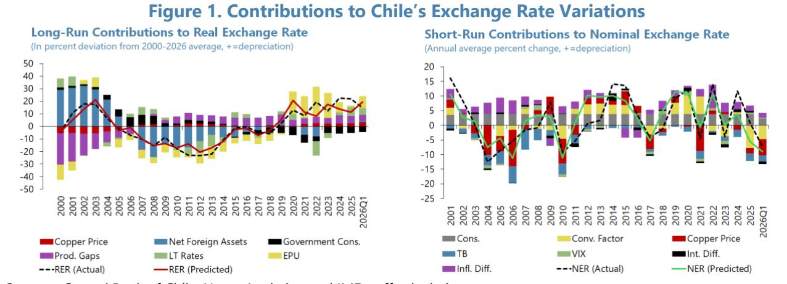  
Sources: Central Bank of Chile, Haver Analytics, and IMF staff calculations.  
Notes: Exchange rate in Chilean peso per U.S dollar.

# Annex III. External Sector Assessment

Overall Assessment: The estimated external position of Chile in 2025 was broadly in line with medium-term fundamentals and desirable policies, anchored on the current account (CA) assessment. The CA deficit stabilized in 2025 amid a pickup in private investment, which drove capital goods imports, offsetting the favorable terms of trade. It is projected to widen in 2026, due to higher oil prices and weaker copper and agricultural export volumes, converging to 2 percent of GDP over the medium term, a level broadly in line with its adjusted norm. The net international investment position deteriorated slightly in 2025 due to strong FDI inflows.

Potential Policy Responses: Macroeconomic imbalances built during the pandemic have been largely resolved, supported by very strong policies. The authorities responded appropriately to inflation developments, have started to rebuild international reserve buffers, and are committed to steadily improve the structural fiscal position over the medium term. These policies, alongside exchange rate flexibility, are projected to support maintaining external balance over the medium term.

## Foreign Assets and Liabilities: Position and Trajectory

Background. After recovering to -17.1 percent of GDP at end-2024, Chile's net international investment position (NIIP) resumed its downward trend in 2025, registering -20.2 percent of GDP as of 2025Q4 (from a peak at -7.8 percent at end-2021), close to its 2017-2019 pre-pandemic average (-18.3 percent). The moderate trend deterioration in the NIIP reflects strong FDI inflows. The appreciation of the Chilean peso vis-à-vis major currencies in 2025 also contributed, by decreasing mostly foreign-currency-denominated assets as a share of GDP. From a sectoral perspective, the lower NIIP in 2025 was primarily driven by lower net FDI position of non-financial corporations (NFCs) and households of 3.5 percentage points of GDP. External debt stood at 77.6 percent of GDP at end-2025, of which 31.9 percent of GDP was owed by NFCs (excluding FDI entities), 16.2 percent of GDP by FDI entities, and 17.2 percent of GDP by the general government.

Assessment. Chile has large gross external liabilities, but these are largely offset by its gross foreign assets.

Moreover, the weight of FDI in gross liabilities is

significant, and most sectors (consolidated public sector, pension funds, and other non-bank financial institutions) have positive net positions. While banks and NFCs have negative net positions of 13.8 and 45.8 percent of GDP, respectively, over two thirds of NFCs' liabilities are FDI. FDI is comfortably the largest type of liability by instrument, representing

54.1 percent of gross liabilities as of 2025Q4. Another mitigating factor is the regulation that banks' short FX positions due in thirty days cannot exceed long positions by more than banks' capital. In sum, external vulnerabilities due to the negative NIIP remain limited.

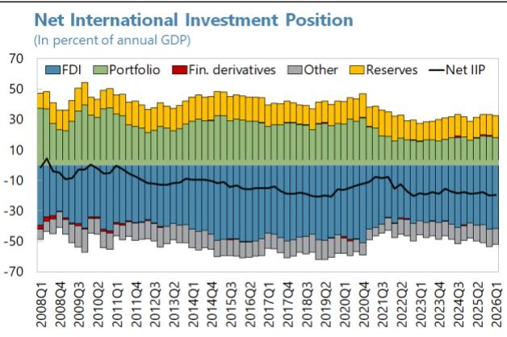  
Sources: Central Bank and IMF staff calculations.

<table><tr><td>2025(% GDP)</td><td>NIIP:-20.2</td><td>Gross Assets:147.8</td><td>Reserve Assets:13.9</td><td>Gross Liab:167.9</td><td>Ext. Debt:77.6</td></tr></table>

## Current Account

Background. The CA deficit stabilized in 2025, after recovering from its pandemic peaks (7.3 and 8.9 percent of GDP in 2021 and 2022, respectively), and a sharp decline in 2024 to 1.2 percent of GDP (after 3.1 percent of GDP in 2023) due to improved terms of trade and a broad-based rise in exports. The stabilization foreign reserve accumulation program to gradually replace part of the BCCh existing foreign currency credit lines with its own internal reserves. Under the announced three-year program, the BCCh intends to purchase up to US\$25 million per day in foreign reserves and accumulate up to a total of US\$18.5 billion, sterilized through the issuance of central bank securities and with reviews every six months or when there are relevant changes in market conditions. With average execution at about 91 percent of the announced maximum, cumulative accumulation reached US\$4.6 billion by end-May. In addition, the BCCh reallocated its reserve holdings and purchased US\$1 billion worth of gold in February 2026. At end-May 2026, gross international reserves stood at US\$52.2 billion, an increase of US\$7.8 billion since end-2024.

<table><tr><td colspan="7">was supported by higher copper prices, which offset stronger imports of capital goods related to the pickup in investment and lower copper export volumes following a July 2025 mining accident. From a savings-investment perspective, the increase in private investment was financed by an increase in private savings, while the public sector balance remained broadly constant. Following higher oil prices and the weak real export growth in early 2026, the current account deficit is set to widen in 2026. In the medium-term, IMF staff projects that the CA deficit will converge to its adjusted norm of about 2 percent of GDP.Assessment.The EBA model estimates a CA norm of -1.0 percent of GDP in 2025, compared to a cyclically adjusted CA of -1.7 percent of GDP. IMF staff estimates CA adjustments of 1.1 percent of GDP to account for measurement biases due to portfolio equity retained earnings.1The resulting staff CA gap is between -0.1 and +0.9 percent of GDP, with a midpoint at 0.4 percent of GDP.</td></tr><tr><td>2025(% of GDP)</td><td>Actual CA (E):- 1.2</td><td>Cycl.-Adj. CA (E):-1.7</td><td>EBA CA Norm:- 1.0</td><td>EBA CA gap:- 0.7</td><td>Adjustors:1.1</td><td>Staff CAgap: 0.4</td></tr><tr><td colspan="7">Real Exchange Rate</td></tr><tr><td colspan="7">Background. After depreciating by 7.1 percent on average in 2024, the REER appreciated by 1.2 percent on average in 2025. The appreciation accelerated in 2025Q4, and, as of January 2026, the REER was 5.6 percent stronger than the 2025 average. This appreciation has been driven by the strengthening of the Chilean peso amid the widening of the interest rate differential with the U.S. and strong copper prices. Between end-January and end-April, the peso depreciated by about 4 percent, reflecting the recent spike in uncertainty associated with the conflict in the Middle East.Assessment. The estimated CA gap implies a small undervaluation by 1.6 percent ± 2.1 percent (applying an estimated elasticity of 0.24). Considering model uncertainties, that the REER remained 11 percent below its long-term equilibrium level in 2025 (Annex II), and that the actual current account does not fully reflect the 2024 depreciation, in large part due to an accident in July 2025 that lowered the volume of copper exports, staff assesses that the REER is undervalued with a midpoint of 6 percent ± 5 percent.</td></tr><tr><td colspan="7">Capital and Financial Accounts: Flows and Policy Measures</td></tr><tr><td colspan="7">Background. FDI accounted for the bulk of net inflows to Chile in 2025 (around 1.6 percent of GDP, against a CA deficit of 1.2 percent of GDP). Pension funds&#x27; and the central bank&#x27;s net purchases of foreign assets—3.3 percent of GDP (US$11.8 billion) and 0.5 percent of GDP (US$1.8 billion), respectively—offset net inflows to Chile&#x27;s general government of 2.9 percent of GDP (US$10.4 billion) and, to a lesser extent, to banks and other financial institutions.Assessment. Chile has demonstrated ample capacity to absorb short-term capital flow volatility. There are many mitigating factors, including usable liquid FX assets by the government, which limit financial market risks (see below).</td></tr><tr><td colspan="7">FX Intervention and Reserves Level</td></tr><tr><td colspan="7">Background. The peso is floating, and FX interventions have been limited to preventing disorderly market conditions. In April 2023, the BCCh began to gradually unwind the FX forward operations from its 2022 intervention program (with a daily reduction of US$50 million intended over ten months), and in June 2023, announced a reserve accumulation program (with daily purchases of US$40 million intended over twelve months). Both programs were suspended on October 26, 2023. On August 8, 2025, the BCCh started a new</td></tr></table>

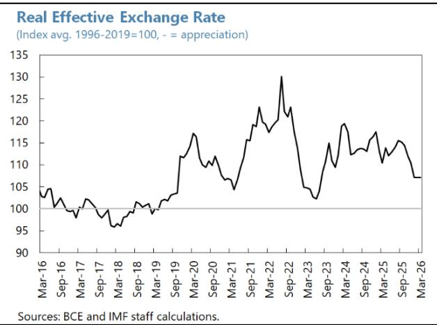

Assessment. Gross international reserves amounted to 82.4 percent of the IMF's reserve adequacy metric (ARA) on average over 2021–25—78.7 percent at end-2025, and up to 81.1 percent in May 2026. Staff assesses reserves to be adequate due to several mitigating factors, largely unchanged since the 2025 FCL review:

\- The government has usable liquid FX assets (US\$5.3 billion as of end-April 2026), up 45 percent since end-2024. This includes US\$3.9 billion in the economic and social stabilization fund, and US\$1.4 billion cash (equivalent to an improvement in reserve coverage of up to 8.2 percentage points).

\- Around 16 percent of short-term debt represents intercompany loans for foreign direct investors to local firms (US\$8.6 billion as of 2026Q1). These loans are a very stable source of funding with a low probability of resulting in FX funding needs.

\- Around 60 percent of banks' short-term external debt (US21.5 billion at end-2026Q1) $^{2}$ is covered by banks' liquid foreign assets (US12.8 billion) which reduces banks' potential short-term FX funding needs.

\- Reserves are complemented with two FX liquidity lines totaling US\$8.05 billion: a credit line with FLAR (US\$1.25 billion) and a bilateral 5-year, renewable period swap facility with the PBOC (US\$6.8 billion) without restrictions on the use of the RMBs. The BCCh is also a subscriber of the Fed's FIMA repo facility, which allows for the

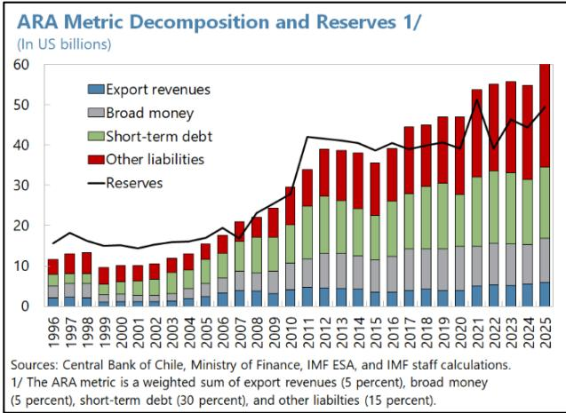  
Sources: Central Bank of Chile, Ministry of Finance, IMF ESA, and IMF staff calculations. 1/ The ARA metric is a weighted sum of export revenues (5 percent), broad money (5 percent), short-term debt (30 percent), and other liabilities (15 percent).

temporary exchange of U.S. Treasury securities held with the Fed for U.S. dollars (US\$26 billion).

\- The authorities remain strongly committed to a flexible exchange rate.

$^{1}$ Chile’s net portfolio equity position is positive due to the pension funds’ investment abroad and net FDI position is negative due to foreign investment in the mining sector. This adjustor accounts for the fact that retained earnings on portfolio equity are not recorded in the income balance (while they are for FDI). Chile’s NIIP valuation changes tend to be positive, which means that the NIIP does not deteriorate as much as implied by the CA deficits which reflect large mining investment financed by FDI. This is a further indication of a negative measurement bias, understating the CA balance.

$^{2}$ Includes banks' short-term external debt stock of US\$14.1 billion at end-2026Q1 and US\$7.4 billion of banks' long-term debt due in the following twelve months.

Annex IV. Risk Assessment Matrix $^{1}$

<table><tr><td>Source of Risks</td><td>Likelihood</td><td>Impact</td><td>Impact on Chile</td><td>Policy Advice</td></tr><tr><td colspan="5">External Risk</td></tr><tr><td>(+/-) Commodity price volatility. Supply and demand imbalances — triggered by geopolitical tensions, coordinated production decisions, shifts in investor preferences, or structural changes in demand—fuel commodity price swings, amplifying external and fiscal pressures, social unrest, and macro instability.</td><td>HIGH</td><td>HIGH</td><td>Chile would benefit from higher copper and lithium prices but would be negatively impacted by higher oil prices.</td><td>Continue to let the exchange rate play its role as a shock absorber. In response to negative shocks to Chile (e.g., sharply higher oil prices), provide targeted fiscal support to vulnerable groups and continue to advance reforms to address social demands. In the event of positive shocks to Chile (e.g., higher copper and lithium prices), the stronger-than-projected fiscal revenues should be saved.</td></tr><tr><td>(-) Trade-related risks - Protectionism and Trade Disruptions. Tariff and nontariff measures disrupt global supply chains, weighing on activity while increasing inflation. Trade diversion triggers broader protectionism.</td><td>HIGH</td><td>MEDIUM</td><td>Chile will be affected mainly through indirect channels. Trade-related risks could weigh on growth in its main trading partners and, in turn, the demand for Chilean exports.</td><td>Continue reducing trade costs by expanding trade agreements and improving trade infrastructure.</td></tr><tr><td>(-/+) Climate change. Extreme climate events driven by rising temperatures cause loss of life, damage to infrastructure, food insecurity, supply disruptions, lower growth, and financial instability.</td><td>MEDIUM</td><td>MEDIUM</td><td>Chile is highly exposed to climate risks such as floods, storms, and wildfires. On the positive side, the global green transition may increase the demand for copper, lithium, and renewable energy of which Chile has an abundant endowment.</td><td>Continue the adaptation and mitigation measures in response to climate change. Continue to build fiscal buffers to cope with spending needs related to sudden climate shocks.</td></tr><tr><td>(-) Disorderly AI Correction. An abrupt revision in expectations of strong AI-led productivity gains causes a sharp market correction, investment decline, and wealth loss, which suppress demand and tighten financial conditions globally.</td><td>HIGH</td><td>MEDIUM</td><td>Tighter global financial conditions can have spillover effects on Chile&#x27;s financial markets through reduced risk appetite and exchange rate volatility. A downward revision to AI-driven investment outlook can put downward pressure on copper prices.</td><td>Continue strengthening financial system resilience by implementing the reforms outlined in the 2021 FSAP. Continue building FX reserves as an external buffer.</td></tr><tr><td colspan="5">Domestic Risk</td></tr><tr><td>(-) Political polarization and fragmentation</td><td>MEDIUM</td><td>MEDIUM</td><td>Political polarization and fragmentation could lead to continued reform gridlock.</td><td>Continue the dialogue and explore opportunities for reforms built on broad-based support with a pragmatic approach.</td></tr><tr><td>(-) Social discontent. High inequality, youth unemployment, high living costs, and security situation could trigger social protests followed by populist policy responses and/or policy gridlock.</td><td>LOW</td><td>MEDIUM</td><td>Social unrest could negatively affect business confidence and investment, dampening potential growth.</td><td>Prioritize spending cuts, protect spending for the most vulnerable and ensure equal access to opportunities. Accelerate policies for faster and inclusive growth.</td></tr></table>

## Annex V. National Reconstruction Plan

1. The National Reconstruction Plan (NRP) encompasses expenditure, revenue, and regulatory facilitation measures aimed at boosting investment and lifting potential output. Key regulatory reforms include streamlining of the Environmental Impact Assessment System (SEIA), facilitating aquaculture concession procedures, strengthening the Environmental Assessment Service's (SEA) role in coordinating other sectoral agencies, and reducing the time window for invalidating granted permits. It also includes reforms to fast-track investment projects and a tax invariability measure whereby the maximum tax burden is fixed for 25 years for major investment projects. Notable fiscal measures include gradually reducing the CIT rate from 27 to 23 percent, shifting to a fully-integrated tax system allowing 100 percent of the CIT payment as credits against final income taxes, and providing tax credits for firms that hire or retain workers at a high risk of informality (earning less than 150 percent of the minimum wage).

2. The direct fiscal cost of the plan is estimated at 0.73 percent of GDP by 2030 and 0.46 percent of GDP by 2050.

\- On the revenue side, transitory measures to front-load collection include a substitute tax, capital repatriation provisions, and regularization incentives, such as preferential rates on inheritance and donation tax, alongside a one-year VAT exemption on housing sales to address the high unsold housing inventory, and an increase in the Transitory Emergency Fund for Fires (FET).

\- Permanent revenue measures include a corporate income tax (CIT) reform, the employment tax credit, full tax integration, a property tax exemption for primary residences of owners aged 65 and above, elimination of the capital gains tax on exchange-traded securities, a small-property tax benefit to support housing supply, enhanced enforcement against tobacco smuggling, and the elimination of tax exemptions for training expenses.

\- On the expenditure side, measures include a deferral of free education expansion to additional income deciles, a moratorium on the entry of new higher education institutions (HEIs), a reduction in the public wage bill through enhanced retirement incentives, a lower replacement rate, and strengthened enforcement against sick leave abuse, and reduced utilization of the Single Employment Subsidy (SUE). Additional fiscal savings from data cross-referencing initiatives in the NRP are not costed.

3. Even accounting for a growth dividend, front-loaded collection, and some permanent expenditure measures, net fiscal cost by 2030 is estimated at 0.3 percent of GDP by 2030. The NRP is projected to generate significant second-round fiscal effects through the impact of tax and regulatory reforms on economic activity and tax base broadening. By 2030, tax measures are estimated to yield an additional revenue of 0.17 percent of GDP, with regulatory measures contributing a further 0.23 percent of GDP, resulting in aggregate indirect effects of 0.4 percent of GDP. Authorities project these growth dividends to increase substantially, reaching 1.21 percent of GDP by 2050. Even when accounting for second-round effects, the NRP entails a net fiscal cost over the medium term, reaching 0.3 percent of GDP by 2030. The fiscal balance turns positive by 2035, with the NRP yielding significant net fiscal gains of up to 0.76 percent of GDP by 2050.

<table><tr><td colspan="10">Table 1. Chile: Cumulative Yields from Measures Under the National Reconstruction Plan(Percent of GDP)</td></tr><tr><td></td><td>2026</td><td>2027</td><td>2028</td><td>2029</td><td>2030</td><td>2031</td><td>2035</td><td>2040</td><td>2050</td></tr><tr><td>Direct Fiscal Cost (A+B)</td><td>-0.20</td><td>-0.50</td><td>-0.65</td><td>-0.68</td><td>-0.73</td><td>-0.72</td><td>-0.67</td><td>-0.55</td><td>-0.46</td></tr><tr><td>Fiscal Cost including growth dividend (A+B+C)</td><td>-0.20</td><td>-0.37</td><td>-0.46</td><td>-0.38</td><td>-0.33</td><td>-0.21</td><td>0.24</td><td>0.54</td><td>0.76</td></tr><tr><td>Transitory measures (A)</td><td>-0.02</td><td>-0.01</td><td>-0.03</td><td>0.02</td><td>-0.02</td><td>-0.02</td><td>-0.02</td><td>0.01</td><td>-0.02</td></tr><tr><td>Emergency Fund for Fires (FET) resource increase</td><td>-0.02</td><td>-0.05</td><td>-0.03</td><td>0.00</td><td>0.00</td><td>0.00</td><td>0.00</td><td>0.00</td><td>0.00</td></tr><tr><td>Moratorium on free-tuition eligibility for new HEIs</td><td>0.00</td><td>0.00</td><td>0.03</td><td>0.05</td><td>0.00</td><td>0.00</td><td>0.00</td><td>0.00</td><td>0.00</td></tr><tr><td>Exemption of VAT on housing</td><td>-0.12</td><td>-0.17</td><td>0.00</td><td>0.00</td><td>0.00</td><td>0.00</td><td>0.00</td><td>0.00</td><td>0.00</td></tr><tr><td>Inheritance and gift tax reduction</td><td>0.03</td><td>0.04</td><td>-0.01</td><td>-0.01</td><td>-0.01</td><td>-0.01</td><td>-0.01</td><td>0.00</td><td>0.00</td></tr><tr><td>Capital repatriation and foreign income tax amnesty</td><td>0.01</td><td>0.07</td><td>0.00</td><td>0.00</td><td>0.00</td><td>0.00</td><td>0.00</td><td>0.00</td><td>0.00</td></tr><tr><td>Substitute taxation</td><td>0.08</td><td>0.11</td><td>-0.02</td><td>-0.02</td><td>-0.02</td><td>-0.02</td><td>-0.02</td><td>0.00</td><td>0.00</td></tr><tr><td>Intellectual Property Fund</td><td>0.00</td><td>0.00</td><td>0.00</td><td>0.00</td><td>0.00</td><td>0.00</td><td>0.00</td><td>0.00</td><td>0.00</td></tr><tr><td>Permanent measures (B)</td><td>-0.18</td><td>-0.49</td><td>-0.62</td><td>-0.70</td><td>-0.71</td><td>-0.70</td><td>-0.65</td><td>-0.56</td><td>-0.44</td></tr><tr><td>Lower CIT tax rate</td><td>0.00</td><td>-0.16</td><td>-0.31</td><td>-0.42</td><td>-0.44</td><td>-0.44</td><td>-0.44</td><td>-0.44</td><td>-0.44</td></tr><tr><td>Employment tax credit</td><td>-0.19</td><td>-0.41</td><td>-0.38</td><td>-0.35</td><td>-0.32</td><td>-0.29</td><td>-0.19</td><td>-0.10</td><td>0.00</td></tr><tr><td>Full integration tax system</td><td>0.00</td><td>0.00</td><td>-0.01</td><td>-0.02</td><td>-0.04</td><td>-0.05</td><td>-0.10</td><td>-0.12</td><td>-0.12</td></tr><tr><td>Delayed expansion to free education</td><td>0.00</td><td>0.00</td><td>0.00</td><td>0.00</td><td>0.00</td><td>0.00</td><td>0.00</td><td>0.03</td><td>0.05</td></tr><tr><td>Public employment measures</td><td>-0.01</td><td>0.02</td><td>0.02</td><td>0.02</td><td>0.02</td><td>0.02</td><td>0.02</td><td>0.02</td><td>0.02</td></tr><tr><td>Lower use of SUE subsidy</td><td>0.00</td><td>0.02</td><td>0.02</td><td>0.02</td><td>0.02</td><td>0.01</td><td>0.01</td><td>0.00</td><td>0.00</td></tr><tr><td>Property tax exemption</td><td>0.00</td><td>-0.04</td><td>-0.04</td><td>-0.04</td><td>-0.04</td><td>-0.04</td><td>-0.04</td><td>-0.04</td><td>-0.04</td></tr><tr><td>Elimination of special capital gains tax</td><td>0.00</td><td>-0.01</td><td>-0.01</td><td>-0.01</td><td>-0.01</td><td>-0.01</td><td>-0.01</td><td>-0.01</td><td>-0.01</td></tr><tr><td>Housing tax benefit</td><td>0.00</td><td>-0.01</td><td>-0.01</td><td>-0.01</td><td>-0.01</td><td>-0.01</td><td>-0.01</td><td>-0.01</td><td>-0.01</td></tr><tr><td>Sanctions against tobacco smuggling</td><td>0.00</td><td>0.01</td><td>0.01</td><td>0.02</td><td>0.02</td><td>0.02</td><td>0.02</td><td>0.02</td><td>0.02</td></tr><tr><td>Elimination of training tax exemption (SENCE)</td><td>0.01</td><td>0.08</td><td>0.08</td><td>0.08</td><td>0.08</td><td>0.08</td><td>0.08</td><td>0.08</td><td>0.08</td></tr><tr><td>Acuaculture patents</td><td>0.00</td><td>0.00</td><td>0.00</td><td>0.00</td><td>0.00</td><td>0.00</td><td>0.00</td><td>0.00</td><td>0.00</td></tr><tr><td>Growth dividends (C)</td><td>0.00</td><td>0.12</td><td>0.19</td><td>0.30</td><td>0.40</td><td>0.51</td><td>0.91</td><td>1.09</td><td>1.21</td></tr><tr><td>Lower CIT tax rate</td><td>0.00</td><td>0.01</td><td>0.04</td><td>0.07</td><td>0.11</td><td>0.14</td><td>0.27</td><td>0.33</td><td>0.33</td></tr><tr><td>Full integration tax system</td><td>0.00</td><td>0.00</td><td>0.01</td><td>0.01</td><td>0.02</td><td>0.02</td><td>0.05</td><td>0.06</td><td>0.06</td></tr><tr><td>Employment tax credit</td><td>0.00</td><td>0.01</td><td>0.02</td><td>0.03</td><td>0.04</td><td>0.06</td><td>0.10</td><td>0.11</td><td>0.11</td></tr><tr><td>Reduction in permit processes</td><td>0.00</td><td>0.04</td><td>0.08</td><td>0.12</td><td>0.15</td><td>0.19</td><td>0.33</td><td>0.37</td><td>0.36</td></tr><tr><td>Investment facilitation</td><td>0.00</td><td>0.06</td><td>0.04</td><td>0.03</td><td>0.01</td><td>0.00</td><td>0.00</td><td>0.00</td><td>0.00</td></tr><tr><td>Tax invariability</td><td>0.00</td><td>0.00</td><td>0.00</td><td>0.04</td><td>0.07</td><td>0.10</td><td>0.16</td><td>0.23</td><td>0.35</td></tr></table>

# Annex VI. Chile's Fiscal Framework: Areas for Potential Refinement $^{1}$

1. Targeted refinements would further improve Chile's strong fiscal framework. Significant progress has been made in recent years in modernizing the fiscal framework, which now combines a structural balance target with a medium-term public debt anchor. However, operational challenges that have since emerged could be addressed with technical modifications to further strengthen the framework's effectiveness and resilience. $^{2}$ This annex focuses on the (i) operationalization of corrective actions in response to deviations from the fiscal target, (ii) role of committed expenditure on the medium-term fiscal path, (iii) estimation of structural parameters, and (iv) treatment of revisions to national accounts.

2. Operationalization of corrective actions in response to deviations from the fiscal target. In line with the Fiscal Responsibility Law, when the structural balance deviates from the target absent the activation of an escape clause, the Ministry of Finance is required to outline corrective measures in the Public Finance Report (PFR) following the final closing of the fiscal year to ensure return to a sustainable fiscal path. While the 2025Q1 PFR was the first to present such corrective actions, only a fraction of the announced package was expected to be implemented in the same year as the rest would have required legislative approval. This shortfall in the execution of corrective measures contributed to a larger-than-anticipated deficit and the subsequent non-compliance with the fiscal target. This experience with implementing corrective actions has highlighted the trade-off between more ambitious measures that require legislative approvals, and therefore entail implementation uncertainty, and more limited measures that have greater certainty of execution.

\- Proposed refinement: Greater transparency and realism around announced corrective actions—including regarding the likelihood of their implementation and their timeline—is warranted. One option would be to include in the baseline scenario only those corrective measures that can be implemented by the executive branch with a high degree of certainty, with additional measures presented as part of an optimistic scenario. Another option would be to embed pre-specified corrective actions in the annual budget that could be triggered when fiscal targets are not met, creating automaticity. In addition, the time horizon for corrective actions could be revisited to ensure that the scale of adjustment within the remainder of the year is realistic and finds a reasonable balance between fiscal sustainability and cyclical conditions.

3. Committed expenditure calculation in the medium-term fiscal path. Under the current methodology, expenditure projections are based on “committed spending,” estimated on the basis of operational continuity of financial programming. They therefore exclude future investment projects not yet backed by contractual or legal obligations as well as prospective real increases in wages, subsidies, and grants, etc. This approach tends to understate underlying expenditure

pressures. Public investment is a particularly problematic component, as projected investment ratios decline to unrealistically low levels when assessed against both historical and cross-country benchmarks (text chart). As a result, estimated fiscal buffers—defined as the gap between committed spending and spending compatible with the target—are likely overstated, reflecting an artificially compressed expenditure baseline.

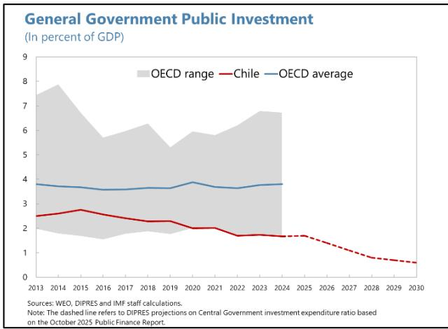

## • Proposed refinement: To better reflect the

underlying spending pressures of the medium-term fiscal path, more conservative assumptions could be adopted in the medium-term fiscal framework, including capital expenditure projections that are aligned with historical execution levels and employee compensation real spending that grows with some measure of potential GDP.

4. Review of methodologies used to estimate the output gap structural parameters.
Empirical evidence points to sizable and persistent optimism bias in trend GDP estimates, driven in part by overly optimistic total factor productivity (TFP) growth assumptions (Vial et al., 2025; Isea, 2024). Over the past decade, these systematic mismeasurements likely contributed to an overestimation of structural revenues and excessive expenditure space as ex ante output gap estimates enter directly into the formulation of the structural balance target. Methodological changes introduced in 2022 have likely mitigated risks related to this optimism bias for the contemporaneous budget year. However, risks persist for the medium-term fiscal plan as medium-term projections continue to rely on a production-function framework to estimate trend GDP and therefore remain sensitive to TFP assumptions that may still be subject to optimism bias. $^{3}$

\- Proposed refinement: The authorities should systematically monitor forecast errors of the ex ante output gap estimates for the budget year. For the medium term, consideration could be given to reviewing the methodology used to cyclically adjust headline revenues, aiming to enhance robustness to potential optimism bias in trend growth assumptions.

5. Review of methodologies used to estimate the benchmark copper price. As highlighted in the October 2025 CFA report, the divergence between the benchmark and projected copper prices in the medium term is still partly attributable to the use of different prices (nominal versus real), introducing risks of bias and excess volatility in the estimation of the structural balance. These methodological inconsistencies have resulted in a growing misalignment between the budget office's copper price projections and the estimates produced by the independent Committee of Experts, despite broadly similar macroeconomic assumptions. Moreover, one of the drivers of the

structural deficit in 2025 was the sizable gap between actual fiscal transfers from Codelco and their cyclically adjusted counterpart (February 2026 PFR), since the current methodology does not distinguish between components of Codelco's transfers that are related to copper price movement, such as mining royalties, and others, such as dividends, that do not closely co-move with copper prices or sales.

\- Proposed refinement: Review the internal consistency between the projected effective copper price and its reference price and refine the cyclical adjustment of Codelco transfers.

6. Sensitivity of ex post compliance assessment to historical GDP revisions. Given that fiscal target compliance is assessed ex post, historical national accounts revisions can impact measured compliance and related budgetary decisions. This is an undesirable feature of the fiscal rule as ex post compliance assessment that is not robust to GDP revisions reflects not only fiscal effort but also statistical noise.

\- Proposed refinement: Ex post assessments of compliance should be based on a “corrected” output gap measure that is robust to national accounts revisions. Absent such adjustments, revisions to historical GDP can mechanically trigger non-compliance, potentially leading to abrupt expenditure adjustments for reasons unrelated to underlying fiscal policy. Options previously discussed with the authorities include maintaining the GDP growth assumptions set at the time of budget formulation but applying them to the revised GDP base. An alternative could be to assess compliance using the data vintage available at the time the budget was prepared.

## Annex VII. Sovereign Risk and Public Debt Sustainability Analysis

<table><tr><td colspan="101">Table 1. Chile: Risk of Sovereign Stress</td></tr><tr><td>Horizon</td><td>Mechanical signal</td><td>Final assessment</td><td colspan="98">Comments</td></tr><tr><td>Overall</td><td>...</td><td>Low</td><td colspan="98">The overall risk of sovereign stress is low, reflecting a relatively low level of vulnerability, including in the medium- and long-term horizons.</td></tr><tr><td colspan="101">Near term 1/</td></tr><tr><td>Medium term</td><td>Low</td><td>Low</td><td colspan="98" rowspan="4">Medium-term risks are assessed as low, reflecting the strength of the fiscal framework in guiding fiscal policy and rebuilding buffers.</td></tr><tr><td>Fanchart</td><td>Moderate</td><td colspan="98">...</td></tr><tr><td>GFN</td><td>Low</td><td colspan="98">...</td></tr><tr><td>Stress test</td><td>Comm. Prices Nat. Disast.</td><td colspan="98">...</td></tr><tr><td>Long term</td><td>...</td><td>Low</td><td colspan="98">The overall long-run risk indicator is assessed as low. Under the baseline, debt stabilizes at around 50 percent of GDP, which is above the government's debt anchor of 45 percent of GDP. A narrower-than-baseline primary balance is required to stabilize the debt ratio at levels compatible with the government's medium-term fiscal commitment. Increases in aging-related expenditure linked to health and pension are expected to be largely paired with higher revenues.</td></tr><tr><td colspan="2">Sustainability assessment 2/</td><td>Sustainable with high probability</td><td colspan="98">The projected debt path is expected to stabilize and GFNs will remain at manageable levels. Therefore, debt is assessed as sustainable with high probability.</td></tr><tr><td colspan="3">Debt stabilization in the baseline</td><td colspan="98">No</td></tr><tr><td colspan="101">DSA Summary Assessment</td></tr><tr><td colspan="101">Commentary: Public sector debt is assessed to be sustainable under a wide range of plausible shock scenarios and with high probability, with low medium-term sovereign and financing risks. However, under the baseline, debt-to-GDP ratio is projected to breach the authorities' prudent debt ceiling of 45 percent and stabilize around 50 percent of GDP. The National Reconstruction Plan (NRP), currently under discussion in Congress, is not included in the baseline.</td></tr><tr><td colspan="101">Source: Fund staff.Note: The risk of sovereign stress is a broader concept than debt sustainability. Unsustainable debt can only be resolved through exceptional measures (such as debt restructuring). In contrast, a sovereign can face stress without its debt necessarily being unsustainable, and there can be various measures—that do not involve a debt restructuring—to remedy such a situation, such as fiscal adjustment and new financing.1/ The near-term assessment is not applicable in cases where there is a disbursing IMF arrangement. In surveillance-only cases or in cases with precautionary IMF arrangements, the near-term assessment is performed but not published.2/ A debt sustainability assessment is optional for surveillance-only cases and mandatory in cases where there is a Fund arrangement. The mechanical signal of the debt sustainability assessment is deleted before publication. In surveillance-only cases or cases with IMF arrangements with normal access, the qualifier indicating probability of sustainable debt ("with high probability" or "but not with high probability") is deleted before publication.1. Debt coverage in the DSA: 1/</td></tr><tr><td colspan="101"></td></tr><tr><td colspan="100">1a. If central government, are non-central government entities insignificant?</td><td></td></tr><tr><td colspan="97">2. Subsectors included in the chosen coverage in (1) above:</td><td></td><td></td><td></td><td></td></tr><tr><td colspan="97">Subsectors captured in the baseline</td><td></td><td></td><td></td><td></td></tr><tr><td rowspan="8">CPS</td><td rowspan="8">NFPs</td><td rowspan="8">GG: expected</td><td rowspan="8">CG</td><td>1</td><td colspan="86">Budgetary central government</td><td></td><td></td><td></td><td></td><td></td><td></td><td></td><td></td><td></td><td></td></tr><tr><td>2</td><td colspan="78">Extra budgetary funds (EBFs)</td><td></td><td></td><td></td><td></td><td></td><td></td><td></td><td></td><td></td><td></td><td></td><td></td><td></td><td></td><td></td><td></td><td></td><td></td></tr><tr><td>3</td><td colspan="74">Social security funds (SSFs)</td><td></td><td></td><td></td><td></td><td></td><td></td><td></td><td></td><td></td><td></td><td></td><td></td><td></td><td></td><td></td><td></td><td></td><td></td><td></td><td></td><td></td><td></td></tr><tr><td>4</td><td colspan="71">State governments</td><td></td><td></td><td></td><td></td><td></td><td></td><td></td><td></td><td></td><td></td><td></td><td></td><td></td><td></td><td></td><td></td><td></td><td></td><td></td><td></td><td></td><td></td><td></td><td></td><td></td></tr><tr><td>5</td><td colspan="69">Local governments</td><td></td><td></td><td></td><td></td><td></td><td></td><td></td><td></td><td></td><td></td><td></td><td></td><td></td><td></td><td></td><td></td><td></td><td></td><td></td><td></td><td></td><td></td><td></td><td></td><td></td><td></td><td></td></tr><tr><td>6</td><td colspan="67">Public nonfinancial corporations</td><td></td><td></td><td></td><td></td><td></td><td></td><td></td><td></td><td></td><td></td><td></td><td></td><td></td><td></td><td></td><td></td><td></td><td></td><td></td><td></td><td></td><td></td><td></td><td></td><td></td><td></td><td></td><td></td><td></td></tr><tr><td>7</td><td colspan="64">Central bank</td><td></td><td></td><td></td><td></td><td></td><td></td><td></td><td></td><td></td><td></td><td></td><td></td><td></td><td></td><td></td><td></td><td></td><td></td><td></td><td></td><td></td><td></td><td></td><td></td><td></td><td></td><td></td><td></td><td></td><td></td><td></td><td></td></tr><tr><td>8</td><td colspan="58">Other public financial corporations</td><td></td><td></td><td></td><td></td><td></td><td></td><td></td><td></td><td></td><td></td><td></td><td></td><td></td><td></td><td></td><td></td><td></td><td></td><td></td><td></td><td></td><td></td><td></td><td></td><td></td><td></td><td></td><td></td><td></td><td></td><td></td><td></td><td></td><td></td><td></td><td></td><td></td><td></td></tr><tr><td colspan="64">3. Instrument coverage: Currency &amp; deposits Loans Debt securities Oth acct. payable 2/ IPSGSs 3/</td><td></td><td></td><td></td><td></td><td></td><td></td><td></td><td></td><td></td><td></td><td></td><td></td><td></td><td></td><td></td><td></td><td></td><td></td><td></td><td></td><td></td><td></td><td></td><td></td><td></td><td></td><td></td><td></td><td></td><td></td><td></td><td></td><td></td><td></td><td></td><td></td><td></td></tr><tr><td>4. Accounting principles: Basis of recording Valuation of debt stock Non-cash basis 4/ Cash basis Nominal value 5/ Face value 6/ Market value 7/ Consolidated Non-consolidated Consolidated Consolidated Consolidated Consolidated Consolidated Consolidated Consolidated Consolidated Consolidated Consolidated Consolidated Consolidated Consolidated Consolidated Consolidated Consolidated Consolidated Consolidated Consolidated Consolidated Consolidated Consolidated Consolidated Consolidated Consolidated Consolidated Consolidated Consolidated Consolidated Consolidated Consolidated Consolidated Consolidated Consolidated Consolidated Consolidated Consolidated Consolidated Consolidated Consolidated Consolidated Consolidated Consolidated Consolidated Consolidated Consolidated Consolidated Consolidated Consolidated ConsolidatedConsolidated Consolidated Consolidated Consolidated Consolidated Consolidated Consolidated Consolidated Consolidated Consolidated Consolidated Consolidated Consolidated Consolidated Consolidated Consolidated Consolidated Consolidated Consolidated Consolidated Consolidated Consolidated Consolidated Consolidated Consolidated Consolidated Consolidated Consolidated Consolidated Consolidated Consolidated Consolidated Consolidated Consolidated Consolidated Consolidated Consolidated Consolidated Consolidated Consolidated Consolidated Consolidated Consolidated Consolidated Consolidated Consolidated Consolidated Consolidated Consolidated Consolidation Consolidated Consolidated Consolidated Consolidated Consolidated Consolidated Consolidated Consolidated Consolidated Consolidated Consolidated Consolidated Consolidated Consolidated Consolidated Consolidated Consolidated Consolidated Consolidated Consolidated Consolidated Consolidated Consolidated Consolidated Consolidated Consolidated Consolidated Consolidated Consolidated Consolidated Consolidated Consolidated Consolidated Consolidated Consolidated Consolidated Consolidated Consolidated Consolidated Consolidated Consolidated Consolidated Consolidated Consolidated Consolidated Consolidated Consolidated Consolidated Consolidated ConsolidationConsolidated Consolidated Consolidated Consolidated Consolidated Consolidated Consolidated Consolidated Consolidated Consolidated Consolidated Consolidated Consolidated Consolidated Consolidated Consolidated Consolidated Consolidated Consolidated Consolidated Consolidated Consolidated Consolidated Consolidated Consolidated Consolidated Consolidated Consolidated Consolidated Consolidated Consolidated Consolidated Consolidated Consolidated Consolidated Consolidated Consolidated Consolidated Consolidated Consolidated Consolidated Consolidated Consolidated Consolidated Consolidated Consolidated Consolidated Consolidated ConsolidatedConsolidation Consolidated Consolidated Consolidated Consolidated Consolidated Consolidated Consolidated Consolidated Consolidated Consolidated Consolidated Consolidated Consolidated Consolidated Consolidated Consolidated Consolidated Consolidated Consolidated Consolidated Consolidated Consolidated Consolidated Consolidated Consolidated Consolidated Consolidated Consolidated Consolidated Consolidated Consolidated Consolidated Consolidated Consolidated Consolidated Consolidated Consolidated Consolidated Consolidated Consolidated Consolidated Consolidated Consolidated Consolidated Consolidated Consolidated Consolidated Consolidated ConsolidatedConsOLIDATED Consolidated Consolidated Consolidated Consolidated Consolidated Consolidated Consolidated Consolidated Consolidated Consolidated Consolidated Consolidated Consolidated Consolidated Consolidated Consolidated Consolidated Consolidated Consolidated Consolidated Consolidated Consolidated Consolidated Consolidated Consolidated Consolidated Consolidated Consolidated Consolidated Consolidated Consolidated Consolidated Consolidated Consolidated Consolidated Consolidated Consolidated Consolidated Consolidated Consolidated Consolidated Consolidated Consolidated Consolidated Consolidated Consolidated Consolidated Consolidated Consolidated Consolidate Consolidated Consolidated Consolidated Consolidated Consolidated Consolidated Consolidated Consolidated Consolidated Consolidated Consolidated Consolidated Consolidated Consolidated Consolidated Consolidated Consolidated Consolidated Consolidated Consolidated Consolidated Consolidated Consolidated Consolidated Consolidated Consolidated Consolidated Consolidated Consolidated Consolidated Consolidated Consolidated Consolidated Consolidated Consolidated Consolidated Consolidated Consolidated Consolidated Consolidated Consolidated Consolidated Consolidated Consolidated Consolidated Consolidated Consolidated Consolidated Consolidated Consolidates Consolidated Consolidated Consolidated Consolidated Consolidated Consolidated Consolidated Consolidated Consolidated Consolidated Consolidated Consolidated Consolidated Consolidated Consolidated Consolidated Consolidated Consolidated Consolidated Consolidated Consolidated Consolidated Consolidated Consolidated Consolidated Consolidated Consolidated Consolidated Consolidated Consolidated Consolidated Consolidated Consolidated Consolidated Consolidated Consolidated Consolidated Consolidated Consolidated Consolidated Consolidated Consolidated Consolidated Consolidated Consolidated Consolidated Consolidated Consolidated Consolidated Consolidating Consolidated Consolidated Consolidated Consolidated Consolidated Consolidated Consolidated Consolidated Consolidated Consolidated Consolidated Consolidated Consolidated Consolidated Consolidated Consolidated Consolidated Consolidated Consolidated Consolidated Consolidated Consolidated Consolidated Consolidated Consolidated Consolidated Consolidated Consolidated Consolidated Consolidated Consolidated Consolidated Consolidated Consolidated Consolidated Consolidated Consolidated Consolidated Consolidated Consolidated Consolidated Consolidated Consolidated Consolidated Consolidated Consolidated Consolidated Consolidated Consolidated Consolidatons Consolidated Consolidated Consolidated Consolidated Consolidated Consolidated Consolidated Consolidated Consolidated Consolidated Consolidated Consolidated Consolidated Consolidated Consolidated Consolidated Consolidated Consolidated Consolidated Consolidated Consolidated Consolidated Consolidated Consolidated Consolidated Consolidated Consolidated Consolidated Consolidated Consolidated Consolidated Consolidated Consolidated Consolidated Consolidated Consolidated Consolidated Consolidated Consolidated Consolidated Consolidated Consolidated Consolidated Consolidated Consolidated Consolidated Consolidated Consolidated Consolidated Consolidational Consolidated Consolidated Consolidated Consolidated Consolidated Consolidated Consolidated Consolidated Consolidated Consolidated Consolidated Consolidated Consolidated Consolidated Consolidated Consolidated Consolidated Consolidated Consolidated Consolidated Consolidated Consolidated Consolidated Consolidated Consolidated Consolidated Consolidated Consolidated Consolidated Consolidated Consolidated Consolidated Consolidated Consolidated Consolidated Consolidated Consolidated Consolidated Consolidated Consolidated Consolidated Consolidated Consolidated Consolidated Consolidated Consolidated Consolidated Consolidated Consolidated Consolidant Consolidated Consolidated Consolidated Consolidated Consolidated Consolidated Consolidated Consolidated Consolidated Consolidated Consolidated Consolidated Consolidated Consolidated Consolidated Consolidated Consolidated Consolidated Consolidated Consolidated Consolidated Consolidated Consolidated Consolidated Consolidated Consolidated Consolidated Consolidated Consolidated Consolidated Consolidated Consolidated Consolidated Consolidated Consolidated Consolidated Consolidated Consolidated Consolidated Consolidated Consolidated Consolidated Consolidated Consolidated Consolidated Consolidated Consolidated Consolidated Consolidated Consolidative Consolidated Consolidated Consolidated Consolidated Consolidated Consolidated Consolidated Consolidated Consolidated Consolidated Consolidated Consolidated Consolidated Consolidated Consolidated Consolidated Consolidated Consolidated Consolidated Consolidated Consolidated Consolidated Consolidated Consolidated Consolidated Consolidated Consolidated Consolidated Consolidated Consolidated Consolidated Consolidated Consolidated Consolidated Consolidated Consolidated Consolidated Consolidated Consolidated Consolidated Consolidated Consolidated Consolidated Consolidated Consolidated Consolidated Consolidated Consolidated Consolidated Consolided Consolidated Consolidated Consolidated Consolidated Consolidated Consolidated Consolidated Consolidated Consolidated Consolidated Consolidated Consolidated Consolidated Consolidated Consolidated Consolidated Consolidated Consolidated Consolidated Consolidated Consolidated Consolidated Consolidated Consolidated Consolidated Consolidated Consolidated Consolidated Consolidated Consolidated Consolidated Consolidated Consolidated Consolidated Consolidated Consolidated Consolidated Consolidated Consolidated Consolidated Consolidated Consolidated Consolidated Consolidated Consolidated Consolidated Consolidated Consolidated Consolidated Consolidal Consolidated Consolidated Consolidated Consolidated Consolidated Consolidated Consolidated Consolidated Consolidated Consolidated Consolidated Consolidated Consolidated Consolidated Consolidated Consolidated Consolidated Consolidated Consolidated Consolidated Consolidated Consolidated Consolidated Consolidated Consolidated Consolidated Consolidated Consolidated Consolidated Consolidated Consolidated Consolidated Consolidated Consolidated Consolidated Consolidated Consolidated Consolidated Consolidated Consolidated Consolidated Consolidated Consolidated Consolidated Consolidated Consolidated Consolidated Consolidated Consolidated Consolidator Consolidator Consolidator Consolidator Consolidator Consolidator Consolidator Consolidator Consolidator Consolidator Consolidator Consolidator Consolidator Consolidator Consolidator Consolidator Consolidator Consolidator Consolidator Consolidator Consolidator Consolidator Consolidator Consolidator Consolidator Consolidator Consolidator Consolidator Consolidator Consolidator Consolidator Consolidator Consolidator Consolidator Consolidator Consolidator Consolidator Consolidator Consolidator Consolidator Consolidator Consolidator Consolidator Consolidator Consolidator Consolidator Consolidator Consolidator Consolidator Consolidator Consolidateras Consolidator Consolidator Consolidator Consolidator Consolidator Consolidator Consolidator Consolidator Consolidator Consolidator Consolidator Consolidator Consolidator Consolidator Consolidator Consolidator Consolidator Consolidator Consolidator Consolidator Consolidator Consolidator Consolidator Consolidator Consolidator Consolidator Consolidator Consolidator Consolidator Consolidator Consolidator Consolidator Consolidator Consolidator Consolidator Consolidator Consolidator Consolidator Consolidator Consolidator Consolidator Consolidator Consolidator Consolidator Consolidator Consolidator Consolidator Consolidator Consolidator Consolidatoa Consolidatoa Consolidatoa Consolidatoa Consolidatoa Consolidatoa Consolidatoa Consolidatoa Consolidatoa Consolidatoa Consolidatoa Consolidatoa Consolidatoa Consolidatoa Consolidatoa Consolidatoa Consolidatoa Consolidatoa Consolidatoa Consolidatoa Consolidatoa Consolidatoa Consolidatoa Consolidatoa Consolidatoa Consolidatoa Consolidatoa Consolidatoa Consolidatoa Consolidatoa Consolidatoa Consolidatoa Consolidatoa ConsolidatoaConsolidatoaConsolidatoaConsolidatoaConsolidatoaConsolidatoaConsolidatoaConsolidatoaConsolidatoaConsolidatoaConsolidatoaConsolidatoaConsolidatoaConsolidatoaConsolidatoaConsolidatoaConsolidatoaConsolidatoaConsolidatoaConsolidatoaConsolidatoaConsolidatoaConsolidatoaConsolidatoaConsolidatoaConsolidatoaConsOLIDATAGGAGGAGGAGGAGGAGGAGGAGGAGGAGGAGGAGGAGGAGGAGGAGGAGGAGGAGGAGGAGGAGGAGGAGGAGGAGGAGGAGGAGGAGGAGGAGGAGGAGGAGGAGGAGGAGGAGGAGGAGGAGGAGGAGGAGGAGGAGGAGGAGGAGGAGCAGGAGGAGGAGGAGGAGGAGGAGGAGGAGGAGGAGGAGGAGGAGGAGGAGGAGGAGGAGGAGGAGGAGGAGGAGGAGGAGGAGGAGGAGGAGGAGGAGGAGGAGGAGGAGGAGGAGGAGGAGGAGGAGGAGGAGGAGGAGGAGGAGGAGAAGGAGGAGGAGGAGGAGGAGGAGGAGGAGGAGGAGGAGGAGGAGGAGGAGGAGGAGGAGGAGGAGGAGGAGGAGGAGGAGGAGGAGGAGGAGGAGGAGGAGGAGGAGGAGGAGGAGGAGGAGGAGGAGGAGGAGGAGGAGGAGGAGGAGGGAGGAGGAGGAGGAGGAGGAGGAGGAGGAGGAGGAGGAGGAGGAGGAGGAGGAGGAGGAGGAGGAGGAGGAGGAGGAGGAGGAGGAGGAGGAGGAGGAGGAGGAGGAGGAGGAGGAGGAGGAGGAGGAGGAGGAGGAGGAGGAGGAGGAG GAGGAGGAGGAGGAGGAGGAGGAGGAGGAGGAGGAGGAGGAGGAGGAGGAGGAGGAGGAGGAGGAGGAGGAGGAGGAGGAGGAGGAGGAGGAGGAGGAGGAGGAGGAGGAGGAGGAGGAGGAGGAGGAGGAGGAGGAGGAGGAGGAGGAGCCAGGAGGAGGAGGAGGAGGAGGAGGAGGAGGAGGAGGAGGAGGAGGAGGAGGAGGAGGAGGAGGAGGAGGAGGAGGAGGAGGAGGAGGAGGAGGAGGAGGAGGAGGAGGAGGAGGAGGAGGAGGAGGAGGAGGAGGAGGAGGAGGAGGAGSAGGAGGAGGAGGAGGAGGAGGAGGAGGAGGAGGAGGAGGAGGAGGAGGAGGAGGAGGAGGAGGAGGAGGAGGAGGAGGAGGAGGAGGAGGAGGAGGAGGAGGAGGAGGAGGAGGAGGAGGAGGAGGAGGAGGAGGAGGAGGAGGAGGAGGCAGGAGGAGGAGGAGGAGGAGGAGGAGGAGGAGGAGGAGGAGGAGGAGGAGGAGGAGGAGGAGGAGGAGGAGGAGGAGGAGGAGGAGGAGGAGGAGGAGGAGGAGGAGGAGGAGGAGGAGGAGGAGGAGGAGGAGGAGGAGGAGGAGGAGTACCGCGCGCGCGCGCGCGCGCGCGCGCGCGCGCGCGCGCGCGCGCGCGCGCGCGCGCGCGCGCGCGCGCGCGCGCGCGCGCGCGCGCGCGCGCGCGCGCGCGCGCGCGCGCGCGCGCGCGCGCGCGCGCGCGCGCGCGCGCGCGCGCGCGCGCGCGCGCGCGCGCGCGCGCGCGCGCGCGCGCGCGCGCGCGCGCGCGCGCGTGCGCGCGCGCGCGCGCGCGCGCGCGCGCGCGCGCGCGCGCGCGCGCGCGCGCGCGCGCGCGCGCGCGCGCGCGCGCGCGCGCGCGCGCGCGCGCGCGCGCGCGCGCGCGCGCGCGCGCGCGCGCGCGCGCGCGCGCGCGCGCGCGCGCGCGCGCGCGCGCGCGCGCGCGCGCGCGCGCGCGCGCGCGCGCGCGCGCGCGCCTCGCGCGCGCGCGCGCGCGCGCGCGCGCGCGCGCGCGCGCGCGCGCGCGCGCGCGCGCGCGCGCGCGCGCGCGCGCGCGCGCGCGCGCGCGCGCGCGCGCGCGCGCGCGCGCGCGCGCGCGCGCGCGCGCGCGCGCGCGCGCGCGCGCGCGCGCGCGCGCGCGCGCGCGCGCGCGCGCGCGCGCGCGCGCGCGCGCGCGCCCTCGCGCGCGCGCGCGCGCGCGCGCGCGCGCGCGCGCGCGCGCGCGCGCGCGCGCGCGCGCGCGCGCGCGCGCGCGCGCGCGCGCGCGCGCGCGCGCGCGCGCGCGCGCGCGCGCGCGCGCGCGCGCGCGCGCGCGCGCGCGCGCGCGCGCGCGCGCGCGCGCGCGCGCGCGCGCGCGCGCGCGCGCGCGCGCGCGCGCSTCGCGCGCGCGCGCGCGCGCGCGCGCGCGCGCGCGCGCGCGCGCGCGCGCGCGCGCGCGCGCGCGCGCGCGCGCGCGCGCGCGCGCGCGCGCGCGCGCGCGCGCGCGCGCGCGCGCGCGCGCGCGCGCGCGCGCGCGCGCGCGCGCGCGCGCGCGCGCGCGCGCGCGCGCGCGCGCGCGCGCGCGCGCGCGCGCGCGCGCSCTCGCGCGCGCGCGCGCGCGCGCGCGCGCGCGCGCGCGCGCGCGCGCGCGCGCGCGCGCGCGCGCGCGCGCGCGCGCGCGCGCGCGCGCGCGCGCGCGCGCGCGCGCGCGCGCGCGCGCGCGCGCGCGCGCGCGCGCGCGCGCGCGCGCGCGCGCGCGCGCGCGCGCGCGCGCGCGCGCGCGCGCGCGCGCGCGCGCGCCSTCGCGCGCGCGCGCGCGCGCGCGCGCGCGCGCGCGCGCGCGCGCGCGCGCGCGCGCGCGCGCGCGCGCGCGCGCGCGCGCGCGCGCGCGCGCGCGCGCGCGCGCGCGCGCGCGCGCGCGCGCGCGCGCGCGCGCGCGCGCGCGCGCGCGCGCGCGCGCGCGCGCGCGCGCGCGCGCGCGCGCGCGCGCGCGCGCGCGCETCGCGCGCGCGCGCGCGCGCGCGCGCGCGCGCGCGCGCGCGCGCGCGCGCGCGCGCGCGCGCGCGCGCGCGCGCGCGCGCGCGCGCGCGCGCGCGCGCGCGCGCGCGCGCGCGCGCGCGCGCGCGCGCGCGCGCGCGCGCGCGCGCGCGCGCGCGCGCGCGCGCGCGCGCGCGCGCGCGCGCGCGCGCGCGCGCGCGCGSGTCCCTCTCTCTCTCTCTCTCTCTCTCTCTCTCTCTCTCTCTCTCTCTCTCTCTCTCTCTCTCTCTCTCTCTCTCTCTCTCTCTCTCTCTCTCTCTCTCTCTCTCTCTCTCTCTCTCTCTCTCTCTCTCTCTCTCTCTCTCTCTCTCTCTCTCTCTCTCTCTCTCTCTCTCTCTCTCTCTCTCTCTCTCTCTCTCTCTCTCTCTACTCTCTCTCTCTCTCTCTCTCTCTCTCTCTCTCTCTCTCTCTCTCTCTCTCTCTCTCTCTCTCTCTCTCTCTCTCTCTCTCTCTCTCTCTCTCTCTCTCTCTCTCTCTCTCTCTCTCTCTCTCTCTCTCTCTCTCTCTCTCTCTCTCTCTCTCTCTCTCTCTCTCTCTCTCTCTCTCTCTCTCTCTCTCTCTCTCTCTCTTACTCTCTCTCTCTCTCTCTCTCTCTCTCTCTCTCTCTCTCTCTCTCTCTCTCTCTCTCTCTCTCTCTCTCTCTCTCTCTCTCTCTCTCTCTCTCTCTCTCTCTCTCTCTCTCTCTCTCTCTCTCTCTCTCTCTCTCTCTCTCTCTCTCTCTCTCTCTCTCTCTCTCTCTCTCTCTCTCTCTCTCTCTCTCTCTCTCTCTACTTACTTACTTACTTACTTACTTACTTACTTACTTACTTACTTACTTACTTACTTACTTACTTACTTACTTACTTACTTACTTACTTACTTACTTACTTACTTACTTACTTACTTACTTACTTACTTACTTACTTACTTACTTACTTACTTACTTACTTACTTACTTACTTACTTACTTACTTACTTACTTACTTACTTACT TACTTACTTACTTACTTACTTACTTACTTACTTACTTACTTACTTACTTACTTACTTACTTACTTACTTACTTACTTACTTACTTACTTACTTACTTACTTACTTACTTACTTACTTACTTACTTACTTACTTACTTACTTACTTACTTACTTACTTACTTACTTACTTACTTACTTACTTACTTACTTACTTACTTACTTTACTTACTTACTTACTTACTTACTTACTTACTTACTTACTTACTTACTTACTTACTTACTTACTTACTTACTTACTTACTTACTTACTTACTTACTTACTTACTTACTTACTTACTTACTTACTTACTTACTTACTTACTTACTTACTTACTTACTTACTTACTTACTTACTTACTTACTTACTTACTTACTTACTTACTATCTTACTTACTTACTTACTTACTTACTTACTTACTTACTTACTTACTTACTTACTTACTTACTTACTTACTTACTTACTTACTTACTTACTTACTTACTTACTTACTTACTTACTTACTTACTTACTTACTTACTTACTTACTTACTTACTTACTTACTTACTTACTTACTTACTTACTTACTTACTTACTTACTTACTTAC TACTTACTTACTTACTTACTTACTTACTTACTTACTTACTTACTTACTTACTTACTTACTTACTTACTTACTTACTTACTTACTTACTTACTTACTTACTTACTTACTTACTTACTTACTTACTTACTTACTTACTTACTTACTTACTTACTTACTTACTTACTTACTTACTTACTTACTTACTTACTTACTTACTT ACTTACTTACTTACTTACTTACTTACTTACTTACTTACTTACTTACTTACTTACTTACTTACTTACTTACTTACTTACTTACTTACTTACTTACTTACTTACTTACTTACTTACTTACTTACTTACTTACTTACTTACTTACTTACTTACTTACTTACTTACTTACTTACTTACTTACTTACTTACTTACTTACTTACTT ACT TACTTACTTACTTACTTACTTACTTACTTACTTACTTACTTACTTACTTACTTACTTACTTACTTACTTACTTACTTACTTACTTACTTACTTACTTACTTACTTACTTACTTACTTACTTACTTACTTACTTACTTACTTACTTACTTACTTACTTACTTACTTACTTACTTACTTACTTACTTACTTACTTACTTAC TTACTTACTTACTTACTTACTTACTTACTTACTTACTTACTTACTTACTTACTTACTTACTTACTTACTTACTTACTTACTTACTTACTTACTTACTTACTTACTTACTTACTTACTTACTTACTTACTTACTTACTTACTTACTTACTTACTTACTTACTTACTTACTTACTTACTTACTTACTTACTTACTTACTTACTtACTtACTtACTtACTtACTtACTtACTtACTtACTtACTtACTtACTtACTtACTtACTtACTtACTtACTtACTtACTtACTtACTtACTtACTtACTtACTtACTtACTtACTtACTtACTtACTtACTtACTtACTtACTtACTtACTtACTtACTtACTtACTtACTtACTtACTtACTtACTtACTtACTtACT tACTtACTtACTtACTtACTtACTtACTtACTtACTtACTtACTtACTtACTtACTtACTtACTtACTtACTtACTtACTtACTtACTtACTtACTtACTtACTtACTtACTtACTtACTtACTtACTt</td><td></td><td></td><td></td><td></td><td></td><td></td><td></td><td></td><td></td><td></td><td></td><td></td><td></td><td></td><td></td><td></td><td></td><td></td><td></td><td></td><td></td><td></td><td></td><td></td><td></td><td></td><td></td><td></td><td></td><td></td><td></td><td></td><td></td><td></td><td></td><td></td><td></td><td></td><td></td><td></td><td></td><td></td><td></td><td></td><td></td><td></td><td></td><td></td><td></td><td></td><td></td><td></td><td></td><td></td><td></td><td></td><td></td><td></td><td></td><td></td><td></td><td></td><td></td><td></td><td></td><td></td><td></td><td></td><td></td><td></td><td></td><td></td><td></td><td></td><td></td><td></td><td></td><td></td><td></td><td></td><td></td><td></td><td></td><td></td><td></td><td></td><td></td><td></td><td></td><td></td><td></td><td></td><td></td><td></td><td></td><td></td><td></td><td></td><td></td><td></td></tr></table>

Table 3. Chile: Public Debt Structure Indicators (ent of GDP)  
Debt by Currency (Percent of GDP)  
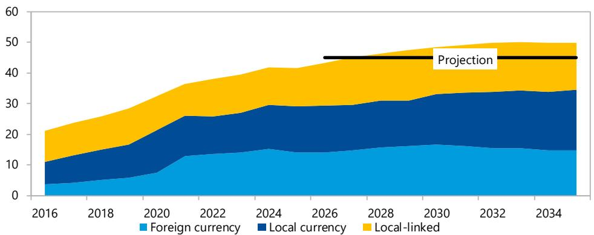  
Note: The perimeter shown is central government.

Public Debt by Holder (Percent of GDP)  
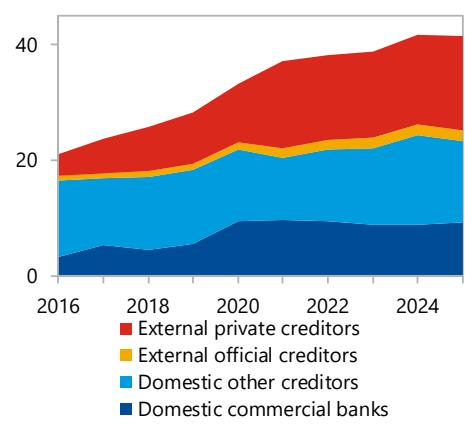  
Note: The perimeter shown is central government.

Public Debt by Governing Law, 2025 (percent)  
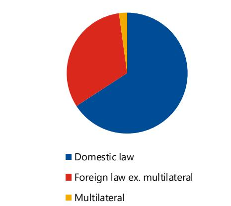  
Note: The perimeter shown is central government.

Debt by Instruments (Percent of GDP)  
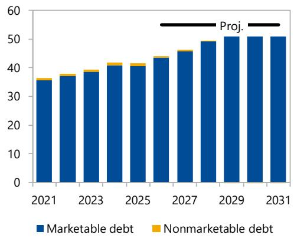

Public Debt by Maturity (Percent of GDP)  
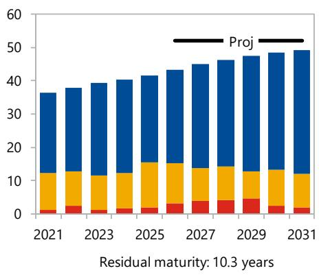  
■ ≤ 1 year ■ 1-5 years ■ > 5 years  
Note: The perimeter shown is central government.  
Note: The perimeter shown is central government.  
Commentary: Chile has a well-diversified investor base with a large presence of domestic creditors. The share of foreign currency debt is stable at around a third of total debt. The residual maturity of debt is above 10 years, and most of its debt is traded on secondary markets.

Table 4. Chile: Baseline Scenario (In percent of GDP unless indicated otherwise)

<table><tr><td rowspan="2"></td><td>Actual</td><td colspan="6">Medium-term projection</td><td colspan="4">Extended projection</td></tr><tr><td>2025</td><td>2026</td><td>2027</td><td>2028</td><td>2029</td><td>2030</td><td>2031</td><td>2032</td><td>2033</td><td>2034</td><td>2035</td></tr><tr><td>Public debt</td><td>41.5</td><td>43.2</td><td>45.0</td><td>46.2</td><td>47.4</td><td>48.4</td><td>49.2</td><td>49.7</td><td>50.0</td><td>49.9</td><td>49.8</td></tr><tr><td>Change in public debt</td><td>-0.2</td><td>1.7</td><td>1.8</td><td>1.2</td><td>1.2</td><td>1.0</td><td>0.8</td><td>0.5</td><td>0.3</td><td>-0.1</td><td>0.0</td></tr><tr><td>Contribution of identified flows</td><td>-2.0</td><td>2.0</td><td>1.2</td><td>0.8</td><td>0.7</td><td>0.5</td><td>0.4</td><td>0.2</td><td>0.0</td><td>-0.3</td><td>-0.3</td></tr><tr><td>Primary deficit</td><td>2.0</td><td>1.7</td><td>1.1</td><td>0.8</td><td>0.7</td><td>0.5</td><td>0.3</td><td>0.1</td><td>0.1</td><td>-0.2</td><td>-0.3</td></tr><tr><td>Noninterest revenues</td><td>20.9</td><td>21.2</td><td>21.5</td><td>21.6</td><td>21.6</td><td>21.6</td><td>21.6</td><td>21.2</td><td>21.6</td><td>22.2</td><td>22.1</td></tr><tr><td>Noninterest expenditures</td><td>22.9</td><td>22.9</td><td>22.6</td><td>22.5</td><td>22.3</td><td>22.1</td><td>21.9</td><td>21.3</td><td>21.7</td><td>22.0</td><td>21.7</td></tr><tr><td>Automatic debt dynamics</td><td>-3.4</td><td>-0.8</td><td>-0.5</td><td>-0.7</td><td>-0.7</td><td>-0.6</td><td>-0.6</td><td>-0.5</td><td>-0.6</td><td>-0.7</td><td>-0.6</td></tr><tr><td>Real interest rate and relative inflation</td><td>-2.0</td><td>-0.1</td><td>0.7</td><td>0.3</td><td>0.4</td><td>0.5</td><td>0.5</td><td>0.6</td><td>0.5</td><td>0.4</td><td>0.5</td></tr><tr><td>Real interest rate</td><td>-2.5</td><td>-0.4</td><td>0.7</td><td>0.0</td><td>0.2</td><td>0.3</td><td>0.3</td><td>0.5</td><td>0.3</td><td>0.2</td><td>0.4</td></tr><tr><td>Relative inflation</td><td>0.5</td><td>0.3</td><td>0.0</td><td>0.2</td><td>0.2</td><td>0.2</td><td>0.2</td><td>0.2</td><td>0.2</td><td>0.2</td><td>0.2</td></tr><tr><td>Real growth rate</td><td>-1.0</td><td>-0.7</td><td>-1.1</td><td>-1.0</td><td>-1.1</td><td>-1.0</td><td>-1.1</td><td>-1.1</td><td>-1.1</td><td>-1.1</td><td>-1.1</td></tr><tr><td>Real exchange rate</td><td>-0.4</td><td>...</td><td>...</td><td>...</td><td>...</td><td>...</td><td>...</td><td>...</td><td>...</td><td>...</td><td>...</td></tr><tr><td>Other identified flows</td><td>-0.6</td><td>1.2</td><td>0.6</td><td>0.8</td><td>0.7</td><td>0.6</td><td>0.6</td><td>0.6</td><td>0.6</td><td>0.5</td><td>0.6</td></tr><tr><td>Contingent liabilities</td><td>0.0</td><td>0.0</td><td>0.0</td><td>0.0</td><td>0.0</td><td>0.0</td><td>0.0</td><td>0.0</td><td>0.0</td><td>0.0</td><td>0.0</td></tr><tr><td>(minus) Interest Revenues</td><td>-0.4</td><td>-0.5</td><td>-0.4</td><td>-0.3</td><td>-0.3</td><td>-0.3</td><td>-0.3</td><td>-0.4</td><td>-0.4</td><td>-0.4</td><td>-0.4</td></tr><tr><td>Other transactions 1 /</td><td>-0.2</td><td>1.6</td><td>1.0</td><td>1.1</td><td>1.0</td><td>1.0</td><td>1.0</td><td>1.0</td><td>1.0</td><td>1.0</td><td>1.0</td></tr><tr><td>Contribution of residual</td><td>1.8</td><td>-0.3</td><td>0.6</td><td>0.4</td><td>0.4</td><td>0.5</td><td>0.4</td><td>0.3</td><td>0.3</td><td>0.3</td><td>0.3</td></tr><tr><td>Gross financing needs</td><td>6.5</td><td>4.3</td><td>5.0</td><td>5.7</td><td>5.8</td><td>6.3</td><td>4.0</td><td>3.6</td><td>5.3</td><td>3.8</td><td>4.9</td></tr><tr><td>of which: debt service</td><td>5.0</td><td>3.1</td><td>4.3</td><td>5.2</td><td>5.4</td><td>6.2</td><td>4.0</td><td>3.8</td><td>5.7</td><td>4.4</td><td>5.6</td></tr><tr><td>Local currency</td><td>4.2</td><td>1.6</td><td>2.6</td><td>1.5</td><td>3.1</td><td>2.3</td><td>1.6</td><td>1.4</td><td>3.0</td><td>2.1</td><td>2.4</td></tr><tr><td>Foreign currency</td><td>0.6</td><td>1.0</td><td>1.2</td><td>1.1</td><td>1.5</td><td>1.0</td><td>1.5</td><td>1.4</td><td>1.1</td><td>1.5</td><td>0.9</td></tr><tr><td>Memo:</td><td></td><td></td><td></td><td></td><td></td><td></td><td></td><td></td><td></td><td></td><td></td></tr><tr><td>Real GDP growth (percent)</td><td>2.5</td><td>1.8</td><td>2.6</td><td>2.3</td><td>2.3</td><td>2.3</td><td>2.3</td><td>2.3</td><td>2.3</td><td>2.3</td><td>2.3</td></tr><tr><td>Inflation (GDP deflator; percent)</td><td>6.8</td><td>4.2</td><td>1.5</td><td>3.4</td><td>3.1</td><td>3.1</td><td>3.0</td><td>3.0</td><td>3.0</td><td>3.1</td><td>3.1</td></tr><tr><td>Nominal GDP growth (percent)</td><td>9.4</td><td>6.0</td><td>4.2</td><td>5.7</td><td>5.5</td><td>5.5</td><td>5.4</td><td>5.4</td><td>5.4</td><td>5.5</td><td>5.5</td></tr><tr><td>Effective interest rate (percent)</td><td>0.2</td><td>3.2</td><td>3.1</td><td>3.5</td><td>3.6</td><td>3.8</td><td>3.7</td><td>4.0</td><td>3.7</td><td>3.7</td><td>3.9</td></tr></table>

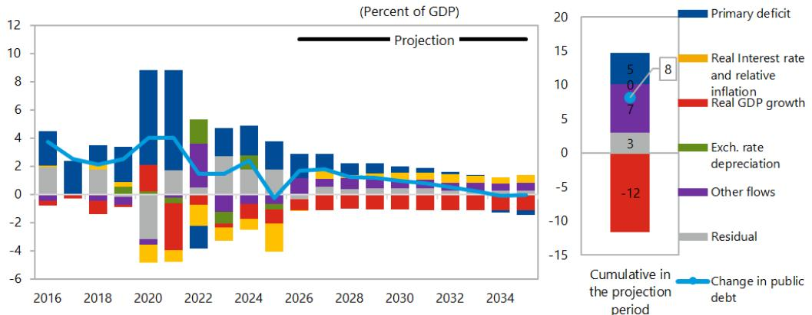

Commentary: Public debt is expected to stabilize around 50 percent of GDP under staff's baseline scenario. The primary balance is projected to deteriorate by roughly 1-1.5 pp of GDP in the next 5-10 years relative to the last Staff Report, reflecting persistent revenue underperformance and rising structural pressures. This deterioration in the primary balance, which shifts in the medium to extended projection period from a surplus, as was the case in the previous Staff Report, to a deficit is the dominant driver of the projected increase in public debt, contributing to the ratio exceeding the authorities' prudent debt ceiling of 45 percent of GDP.

1/ Other transactions include the use and accumulation of government financial assets, as well as other below-the-line operations.

(Percent of GDP)

Table 5. Chile: Realism of Baseline Assumptions 1/  
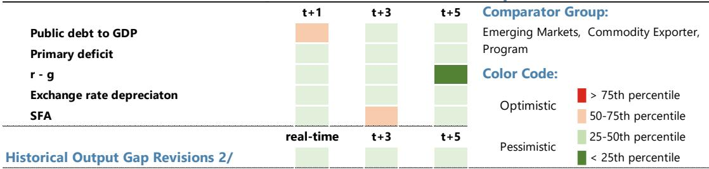  
Historical Output Gap Revisions 2/  
Public Debt Creating Flows

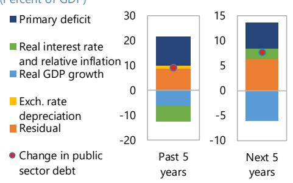  
3-Year Debt Reduction  
Bond Issuances (Bars, debt issuances (RHS,  
%GDP); lines, avg marginal interest rates (LHS, percent))

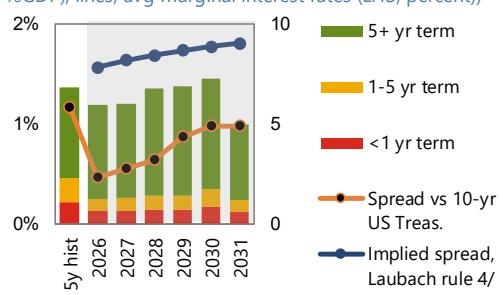

(Percent of GDP)  
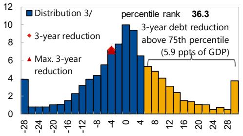

3-Year Adjustment in Cyclically-Adjusted Primary Balance (Percent of GDP)  
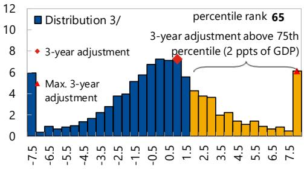

Fiscal Adjustment and Possible Growth Paths  
(Lines, real growth using multiplier (LHS); bars, fiscal adj. (RHS))  
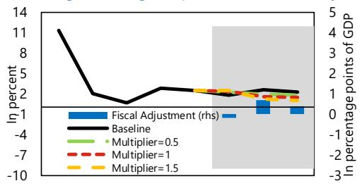  
Real GDP Growth

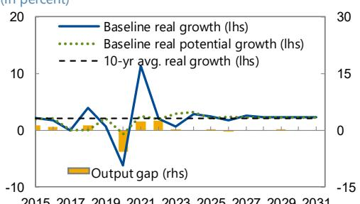

Commentary: The realism analysis does not point to major concerns, and the forecast track record does not reveal any systematic bias. The projected fiscal consolidation is reasonable, when considering Chile's history and other country experiences. The residual contribution to the projected debt ratio comes from 'other flows,' including below-the-line operations like SOE recapitalization and payments on government-guaranteed student loans.

1/ Projections made in the October and April WEO vintage. Program status not used in creating comparator group due to lack of data.  
2/ Calculated as the percentile rank of the country's output gap revisions (defined as the difference between real time/period ahead estimates.

3/ Data cover annual observations from 1990 to 2019 for MAC advanced and emerging economies. Percent of sample on vertical axis.
4/ The Laubach (2009) rule is a linear rule assuming bond spreads increase by about 4 bps in response to a 1 ppt increase in the projected debt-to-GDP ratio.

<table><tr><td></td><td>Value</td><td>Contrib 1/</td><td>Percentile in peer group 2/</td></tr><tr><td colspan="4">Final Fanchart (Percent of GDP)</td></tr><tr><td colspan="4">Debt fanchart module</td></tr><tr><td>Fanchart width (percent of GDP)</td><td>33.2</td><td>0.5</td><td></td></tr><tr><td>Probability of debt non-stabilizaiton (percent)</td><td>47.1</td><td>0.4</td><td></td></tr><tr><td>Terminal debt-to-GDP x institutions index</td><td>18.6</td><td>0.4</td><td></td></tr><tr><td>Debt fanchart index (DFI)</td><td>1.3</td><td></td><td></td></tr><tr><td>Risk signal: 3/</td><td>Moderate</td><td></td><td></td></tr><tr><td colspan="4">Gross Financing Needs (GFN) module</td></tr><tr><td>Average baseline GFN (percent of GDP)</td><td>5.2</td><td>1.8</td><td></td></tr><tr><td>Initial Banks&#x27; claims on the gen. govt (pct bank assets)</td><td>7.4</td><td>2.4</td><td></td></tr><tr><td>Chg. In banks&#x27; claims in stress (pct banks&#x27; assets)</td><td>5.5</td><td>1.9</td><td></td></tr><tr><td>GFN financeability index (GFI)</td><td>6.0</td><td></td><td></td></tr><tr><td>Risk signal: 4/</td><td>Low</td><td></td><td></td></tr><tr><td colspan="4">Triggered stress tests (stress tests not activated in gray)</td></tr><tr><td>Banking crisis</td><td>Commodity prices</td><td></td><td></td></tr><tr><td colspan="4">Medium-Term Index (Index Number)</td></tr><tr><td>Exchange rate</td><td>Contingent liab.</td><td>Natural disaster</td><td></td></tr><tr><td colspan="4">Medium-term risk analysis</td></tr><tr><td></td><td>Value (normalized d)</td><td>Weight Contribution</td><td></td></tr><tr><td>Debt fanchart index</td><td>1.3</td><td>0.3</td><td>0.5</td></tr><tr><td>GFN finaceability index</td><td>6.0</td><td>0.1</td><td>0.5</td></tr><tr><td>Medium-term index</td><td>0.2</td><td></td><td></td></tr><tr><td>Risk signal: 5/</td><td>Low</td><td></td><td></td></tr><tr><td>Final assessment:</td><td>Low</td><td></td><td></td></tr><tr><td colspan="4">Prob. of missed crisis, 2026-2031, if stress not predicted: 9.1 pct.</td></tr><tr><td colspan="4">Prob. of false alarms, 2026-2031, if stress predicted: 54.5 pct.</td></tr></table>

GFN-to-GDP Ratio

Total Public Debt-to-GDP Ratio

Long-Term Risk Assessment: Large Amortization

<table><tr><td colspan="4">Table 7. Chile: Long-Term Risk Analysis</td></tr><tr><td colspan="4">Triggered Modules</td></tr><tr><td rowspan="2">Large amortizations</td><td>Pensions</td><td>Climate change: Adaptation</td><td rowspan="2">Natural Resources</td></tr><tr><td>Health</td><td>Climate change: Mitigation</td></tr></table>

<table><tr><td>Projection</td><td>Variable</td><td>Risk Indication</td></tr><tr><td rowspan="3">Medium-term extrapolation</td><td>GFN-to-GDP ratio</td><td></td></tr><tr><td>Amortization-to-GDP ratio</td><td></td></tr><tr><td>Amortization</td><td></td></tr><tr><td rowspan="3">Medium-term extrapolation with debt stabilizing primary balance</td><td>GFN-to-GDP ratio</td><td></td></tr><tr><td>Amortization-to-GDP ratio</td><td></td></tr><tr><td>Amortization</td><td></td></tr><tr><td rowspan="3">Historical average assumptions</td><td>GFN-to-GDP ratio</td><td></td></tr><tr><td>Amortization-to-GDP ratio</td><td></td></tr><tr><td>Amortization</td><td></td></tr><tr><td>Overall Risk Indication</td><td></td><td></td></tr></table>

<table><tr><td>Variable</td><td>2031</td><td>2035 to 2039 average</td></tr><tr><td>Real GDP growth</td><td>2.3%</td><td>2.3%</td></tr><tr><td>Primary Balance-to-GDP ratio</td><td>-0.3%</td><td>0.1%</td></tr><tr><td>Inflation (GDP deflator)</td><td>3.0%</td><td>3.1%</td></tr></table>

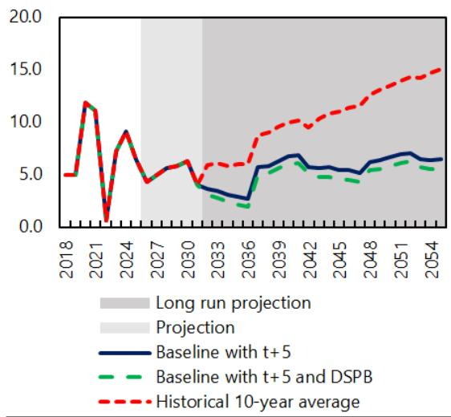

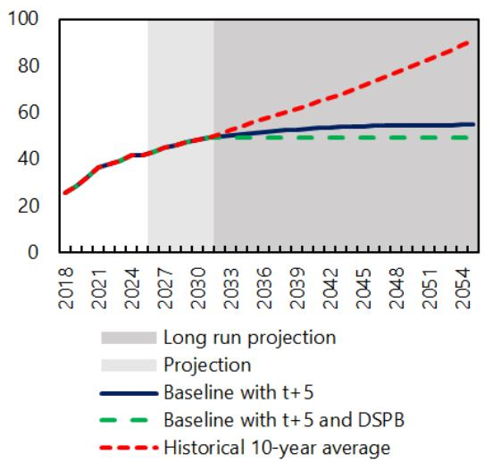  
Commentary: The long-run amortization module does not trigger an overall risk indication. The overall long-run risk indicator is low. Under the baseline, debt stabilizes at around 50 percent of GDP in 2050. If historical 10-year averages are used, however, then debt could rise from around 42 percent to almost 90 percent of GDP by 2050. However, this simulation may not be representative as it reflects historically elevated gross financing needs, including the impact of the COVID-19 pandemic.

Table 8. Chile: Long-Term Risk Analysis II  
Demographics: Pensions

<table><tr><td>(Percent of GDP)</td><td>30 years</td><td>50 years</td><td>Until 2100</td></tr><tr><td>PGU Costs</td><td>4.4</td><td>5.7</td><td>6.3</td></tr><tr><td>Pension financing needs</td><td>2.2</td><td>3.5</td><td>4.1</td></tr></table>

Pension Financing Needs  
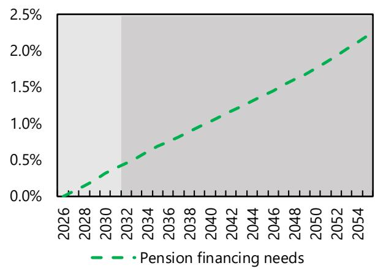

Total Benefits Paid  
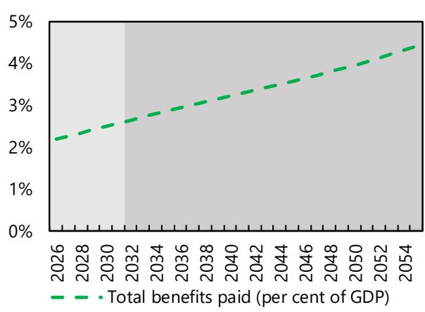  
GFN-to-GDP Ratio

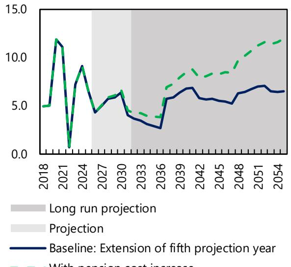

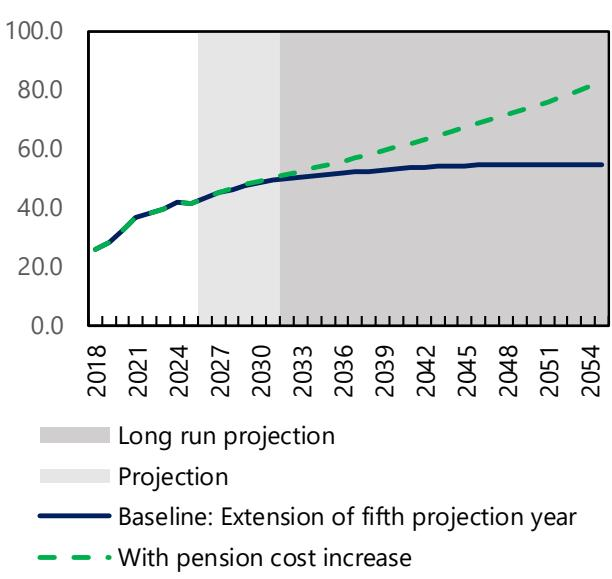

Commentary: Demographic dynamics would increase the fiscal costs of solidarity pensions (including mainly the PGU) from about 2 to about 4.5 percent of GDP in the next 30 years, under the assumption that solidarity pensions increase in real terms in line with real GDP growth. Assuming that available financing through general taxes for solidarity pensions remains at around 2 percent of GDP throughout the forecast period, this would imply an increase in debt to about 75 percent of GDP by 2050 (25 percentage points above the baseline scenario).

Natural Resources

## Table 9. Chile: Long-Term Risk Analysis III

Demographics: Health

GFN-to-GDP Ratio

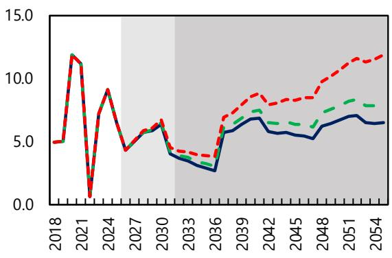  
Baseline: Extension of fifth projection year  
Health (Demographics)  
---- Health (Demographics + ECG)  
Total Public Debt-to-GDP Ratio

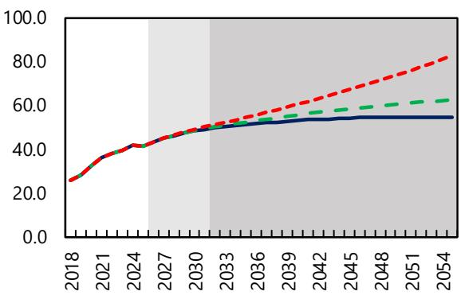  
Baseline: Extension of fifth projection year  
Health (Demographics)  
---- Health (Demographics + ECG)  
Commentary: Higher health costs due to demographics dynamics as well as excess cost growth of health (difference between health prices and aggregate CPI) would increase debt to about 75 percent of GDP by 2050.  
GFN-to-GDP Ratio

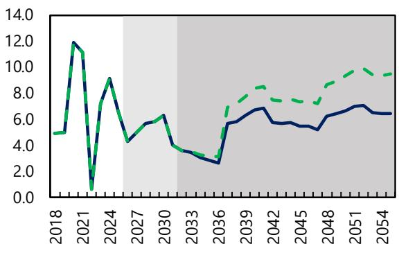  
Baseline: Extension of fifth projection year  
Total Public Debt-to-GDP Ratio

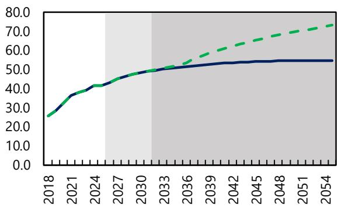  
Baseline: Extension of fifth projection year  
- - · Natural Resources  
- - · Natural Resources

Commentary: One source of risk is lower copper revenue due to lower production. We assume copper production to increase on average 1 percent annually between 2026-2035 and an annual production of 5 million tonnes is assumed thereafter. Copper revenues were around 2.1 percent of GDP in 2025. We assume copper prices to grow in line with US inflation at 2 percent after 2031, lower than Chile's GDP nominal growth. Taking changes in copper revenues into account, debt would be about 70 percent of GDP by 2050, and the GFN-to-GDP ratio would be about 4 percentage points of GDP higher than under the baseline by 2050.

Annex VIII. Implementation Status of 2021 FSAP Key Recommendations

<table><tr><td></td><td>Recommendations</td><td>Time1</td><td>Status</td></tr><tr><td colspan="4">A. Bank Solvency and Liquidity</td></tr><tr><td>1</td><td>Ensure banks transition to Basel III-compliant capital structures and complete announced plans for capital raises in a timely manner.</td><td>NT</td><td>The Basel III solvency requirements have been adopted, with full implementation completed in2025. Only minor elements remain under a gradual implementation scheduled to be finalized by 2027.Since March 2021, the capital adequacy ratio has taken into account credit, market, and operational risks.The Financial Market Commission (CMF) expects to issue a normative update to requirements for internal ratings-based models (IRB) in 2026. The normative is planned to be published for public consultation during July/August 2026.InApril 2026, the CMF announced that it will allocate additional resources to the validation of IRB models.InMarch 2026, the CMF published its proposal to amend the standard model for market risk-weighted assets (RWA). Following the comments received, in addition to refining the current approach, the proposal is expected to include the duration method as an alternative for measuring market risks. Accordingly, a new consultation process would be required.Capital Conservation buffer, AT1 requirement, and capital discounts (e.g., goodwill, deferred tax assets) were phased in from December 2021 to December 2025.Since May 2022, the Central Bank of Chile (BCCh) has held Financial Policy Meetings twice a year to determine whether to activate the Counter Cyclical Buffer (CCyB), set its level, and establish its compliance deadline, in coordination with CMF. InMay 2023, the BCCh activated the CCyB, setting the charge at 0.5 percent of RWA, which was completed in May 2024. InNovember 2024, the BCCh updated the CCyB framework, including the definition of a positive-neutral CCyB level at 1 percent of RWA, with a gradual, state-contingent implementation path after the full implementation of Basel III capital requirements.In May 2026, the BCCh decided to converge to the neutral CCyB level, over a 24-month implementation period.FromMarch 2021untilMarch 2026, the CMF has identified and defined additional capital charges for systemically important banks (D-SIBs). Additional capital charges were phased in from December 2022 to December 2025. The process for defining D-SIBs continues to be carried out annually by CMF, in coordination with the BCCh, with the identification of these entities and their associated charges completed each March. InFebruary 2024, the CMF lowered threshold scores for determining D-SIBs. As of March 2026, six banks remain classified as D-SIB with capital requirements ranging from 1.0% to 1.5% of RWA.Since 2020, banks have submitted annually the Effective Equity Self-Assessment Report (IAPE) to the CMF as part of the Internal Capital Adequacy Assessment Process (ICAAP), which enables the CMF to continually assess the banks' specific risk profiles (e.g., banking book interest rate risk and loan concentration risk), and potentially define additional capital charges under the Pillar 2 of Basel III. In July 2023, the</td></tr><tr><td></td><td></td><td></td><td>CMF published "Guidelines on Stress Testing in Banking Institutions" for IAPE, and in January 2024, it published the final version.In October 2024, the CMF published proposals to amend regulations about Pillar 2 (e.g., banking book market risks and the determination of the internal capital target). In July 2025, the CMF published the finalized regulations.In April 2023, information disclosure requirements for banks under Basel III Pillar 3 were introduced. In February 2024, the CMF clarified the requirements.In January 2024, January 2025, and January 2026, the CMF imposed additional capital requirements on individual banks under the Basel III Pillar 2 framework. Banks must constitute the additional capital requirements as part of the minimum regulatory requirements by the end of June of the respective year with gradual implementation (25 percent of the additional capital requirements for 2024, 50 percent for 2025, and 75 percent for 2026). The remaining percentages shall be built up annually as determined by the CMF in accordance with each year's ICAAP As of January 2026, seven banks were required to hold additional capital, with values ranging from 0.1% to 2.4% of RWA.</td></tr><tr><td>2</td><td>Improve the collateral valuation and reporting framework.</td><td>NT</td><td>In August 2023, the CMF published its proposal for a new reporting framework for foreclosures and liquidation cash flows, along with complementary instructions for early interventions.In March 2024, the CMF issued a standard method for computing loan loss reserves for consumer loans, which came into force in January 2025. With this, a set of standard methodologies for retail, corporate and mortgage loans loan loss reserves is complete.In January 2024, the CMF published a new information requirement to capture data on recoveries, expenses, and renegotiations of defaulted loans. This data will enable a more accurate characterization of losses in the event of loan payment default, aimed at improving regulatory parameters calibration and helping to prevent financial stress that could impact the banking system's resilience. First data reports were received in January 2025, containing information as of December 2024.In January 2025, the CMF published its proposal to review banks' collateral valuation regulations, including requirements for collateral accepted as credit risk mitigators, valuation criteria, and an adequate collateral management process. The finalized regulation is expected to be published during 2026.</td></tr><tr><td>3</td><td>Define and communicate clear criteria regarding conditions for the future unwinding of extraordinary liquidity support measures (FCIC and LCL).</td><td>1</td><td>In November 2022, the BCCh established a plan to standardize eligible collateral, which replaces the current stock of pledged credit portfolio with eligible financial instruments in the Central Securities Depository.In April 2023, banks submitted their plans for the expiration of FCIC/LCL to the CMF as the first Liquidity Self-Assessment Report (LSAR) of the Internal Liquidity Adequacy Assessment Process (ILAAP).In September 2023, the BCCh started offering banks liquidity deposits aimed exclusively at guaranteeing and operationally supporting the payment of the FCIC.In April and July 2024, the BCCh smoothly unwound the FCIC.</td></tr><tr><td>4</td><td>Introduce liquidity stress tests for prudential and stability monitoring.</td><td>NT</td><td>In April 2023, the ILAAP began implementation, and banks submitted their first LSARs to the CMF.In April 2024, private banks submitted their second ILAAP, focusing on internal stress testing without including any CMF scenarios.Since 2025, the liquidity regulation issued by the BCCh allows the CMF to impose additional High Quality Liquid Assets (HQLA) requirements on specific institutions, depending on the outcome of the ILAAP. Before that date, the LSAR was based exclusively on funding plans carried out by banks for different economic scenarios provided by the CMF.A full version of ILAAP has been revised since 2025. No additional measures have been taken to date, as it is concluded that the banking liquidity position remains adequate.In July 2023, the CMF published "Guidelines on Stress Testing in Banking Institutions" for LSAR, and in January 2024, it published the final version.</td></tr><tr><td colspan="4">B. Banking Supervision</td></tr><tr><td>1</td><td>Ensure sufficient budget resources (of the CMF) to attract and retain specialized talent.</td><td>I</td><td>There are no changes in CMF's budget independence.Since 2019, CMF's budget has been continuously reduced. In some cases, additional budget has been granted to cover new legal changes (e.g., the implementation of the Fintech Law).Although the Ministry of Finance instructed a general 3 percent reduction in resources, initiatives have been undertaken to increase resources for the supervision of IRB methodologies.</td></tr><tr><td>2</td><td>Strengthen credit risk management and asset classification, including provisioning and treatment of restructured loans.</td><td>I, NT</td><td>In January 2023, the first proposal for asset classification and treatment of restructured loans was presented internally. A standard method for loan loss reserves for consumer loans was issued in March 2024.InMarch 2024, the CMF issued a standard method for computing loan loss reserves for consumer loans, which came into force in January 2025. With this, a set of standard methodologies for retail, corporate and mortgage loans loan loss reserves is complete.InApril 2025, the CMF published its first regulatory proposal for incorporating conditions to consider loan insurance and derivatives as credit risk mitigators in capital requirements pursuant to Basel III standards. InOctober 2025, the CMF published its updated regulatory proposal, incorporating public comments received during the first consultation period. However, following the prior favorable agreement of the BCCh, the CMF decided in April 2026 to defer its final issuance to further assess its proper implementation.</td></tr><tr><td>3</td><td>Establish an integrated risk management framework and enhance corporate governance standards and supervision.</td><td>NT</td><td>InAugust 2023, the CMF published regulatory proposals on corporate governance and integrated risk management requirements for securities market entities, and in May 2024, the CMF issued the regulations.InJuly 2024, the CMF published regulatory proposals on corporate governance, comprehensive risk management, and operational risk management requirements for securities intermediaries, commodities brokers, and in December 2024, the CMF issued the regulations.InJanuary 2025, the CMF moved the implementation date of regulations to July 1, 2025.InOctober 2024, the CMF published a regulatory proposal on the requirements for being considered an independent director in public firms, as well as the minimum content for general policies regarding theelection of directors to be established and disclosed by the parent companies of subsidiaries supervised by the CMF.In March 2025, the CMF issued the regulations.InJune 2025, the CMF amended the regulation to ban banks from granting loans to their directors, representatives, and parties related to them.InJanuary 2026, the CMF published a regulatory proposal on strengthening corporate governance and risk management of banks. Once approved, changes will be applied starting from the management assessment process for 2028.</td></tr><tr><td>4</td><td>Strengthen the legal framework for licensing to ensure banks' shareholders are fit, proper, and financially strong.</td><td>NT</td><td>The CMF is drafting an internal proposal to address the necessary legal/regulatory changes.</td></tr><tr><td>5</td><td>Improve the corrective actions framework.</td><td>NT</td><td>In October 2023, a draft bill was circulated to the Joint Working Group for Banking Resolution (technical staff of the CMF, the BCCh, and the Ministry of Finance). The proposal is still under discussion.InNovember 2023, CMF issued a new regulation that establishes complementary instructions applicable to early regularization and forced liquidation.</td></tr><tr><td>6</td><td>Improve consolidated supervision by enhancing the legal framework, supervision practices, and organizational arrangements.</td><td>NT</td><td>In August 2023, the CMF published "Guidelines for a Financial Conglomerates Act in Chile," which analyzes the relevance of including financial conglomerates within the institutions under the CMF's prudential supervision and proposes a supervisory legal framework.The CMF has continued its meetings and presentations with various stakeholders in the financial market following the analysis of comments received during the public consultation process for the "Guidelines for Financial Conglomerates Act in Chile."</td></tr><tr><td colspan="4">C. Pension Funds</td></tr><tr><td>1</td><td>Avoid further pension withdrawals and ensure that the pension system continues to support deep and liquid long-term capital markets.</td><td>I</td><td rowspan="2">No additional pension fund withdrawals have been approved since April 2021.The CMF, the BCCh, and the CEF (Financial Stability Council) delivered several opinions and reports against this measure, including presentations in Congress hearings and Financial Stability Reports, among others.The pension reform law was enacted in March 2025. The reform will (i) increase the contribution rate to the mandatory individual pension account by 4.5%, (ii) transition the current multi-fund system to a generational fund system, and (iii) introduce new incentive mechanisms to promote competition among pension fund administrators (AFPs), such as a 10% random tender every two years awarded to the pension fund administrator (AFP) with the lowest commission and a reward and penalty mechanism for AFPs based on pension fund performances. The Pension Supervisor (SP) is currently preparing a new investment regime and reference portfolios under the generational fund system and details of competition-promoting mechanisms. The new investment regime and reference portfolios will be published by September 2026 and the</td></tr><tr><td>2</td><td>Improve pension fund regulation and investment options to promote long-term investment and minimize excessive switching.</td><td>NT</td></tr><tr><td></td><td></td><td></td><td>transition to the generational fund system will start in April 2027 with a three-year transition period.InFebruary 2026, the SP published a proposal of fifteen Generational Funds according to pension affiliates' age brackets.InFebruary 2026, the BCCh set the maximum investment limits on foreign and sovereign financial instruments for the new Generational Funds and the FAPP as 80 percent of the funds' values.InDecember 2025, the SP published a proposal of the investment regime for Fondo Autónomo de Protección Previsional (FAPP). InFebruary 2026, the SP published the finalized investment regime for FAPP. The investment regime for FAPP will become effective on July 1, 2026.InApril 2026, the SP issued a new derivatives regulation, effective in 2027, introducing a Derivatives Exposure Limit based on stress losses and a minimum Liquidity Coverage Requirement to ensure sufficient liquid assets for margin calls and reduce forced asset sales risk.</td></tr><tr><td colspan="4">D. Insurance</td></tr><tr><td>1</td><td>Halt any further liquidations of life annuities.</td><td>I</td><td>No additional liquidations of life annuities since April 2021.The CMF, the BCCh, and the CEF delivered several opinions and reports against this measure.</td></tr><tr><td>2</td><td>Implement a modern risk-based capital framework in insurance with due regard to the impact of introducing IFRS 17 and IFRS 9.</td><td>NT</td><td>InNovember 2024, the CMF published a regulatory proposal to amend the methodology to calculate exposure to counterparty credit risk in financial derivatives, migrating from a contract-sized (notional) approach to a risk-based approach that measures exposure through the credit equivalent.InOctober 2025, the CMF published a regulatory proposal to require the application of IFRS standards (9 and 17) exclusively to insurance companies with securities registered in the Securities Registry, as well as to insurers that must consolidate their financial statements with their parent companies that issue securities, with the exceptions established for the annuities business line (accounting at amortized cost of assets/liabilities). The comments received as of the end of November 2025 are currently under review by the CMF.</td></tr><tr><td colspan="4">E. Mutual Funds</td></tr><tr><td>1</td><td>Strengthen the mutual fund liquidity management framework.</td><td>NT</td><td>InOctober 2023, the "Financial Markets Resilience" bill was approved by the Congress. The law empowers the CMF to establish a minimum investment requirement for the fund in liquid assets, as well as the power to establish the definition of liquid assets.InMarch 2025, the CMF published a new information system manual for funds, which enhances the collection of supervisory information of general fund managers and their funds. InAugust 2025, the CMF published a proposal requiring general fund managers and portfolio managers to submit information on minimum equity and collateral requirements.</td></tr><tr><td colspan="4">F. Crisis Management and Bank Resolution</td></tr><tr><td>1</td><td>Establish a statutory bank resolution authority with a comprehensive range of crisis management and resolution tools.</td><td>I</td><td>In January 2023, the CMF published a policy paper titled "Guidelines for a new bank resolution and deposit insurance framework in Chile", which describes the main legal and regulatory gaps in the resolution framework and bank liquidation, as well as developing a proposal for closing gaps to be addressed in future legal amendments. It also includes basic elements</td></tr><tr><td>2</td><td>Establish and implement recovery and resolution planning and set a loss-absorbing capacity requirement for systemically important banks.</td><td>I</td><td rowspan="2">of the financial safety net, such as a deposit insurance mechanism and tools and powers of resolution authorities.InAugust 2023, the CMF published its proposal on establishing complementary instructions on early regularization and compulsory liquidation, aiming at improving the current legal framework. Specifically, it defines the means and timeframe for banks to communicate the occurrence of financial or operational deterioration to the CMF and outlines the suitability and technical capacity requirements that individuals appointed as delegated inspectors, temporary administrators, and liquidators must fulfill. InNovember 2023, the CMF published the regulation based on the proposal.In November 2023, the CMF had a closed meeting with the industry to address the comments sent in relation to the policy paper above.A working group formed by technical staff of the CMF, the BCCh, and the MoF is drafting a new bill on a resolution framework, new resolution authority and deposit insurance scheme, based on the white paper. A first draft has yet to be presented to Congress.InJanuary 2026, the CMF published regulatory proposal on strengthening banks' recovery planning by establishing information that must be included in recovery plans and integrating recovery planning into governance and risk management. Once approved, the regulatory changes will be applied starting from the management assessment process for 2028.The BCCh has approved the conduct of a crisis simulation exercise (CSE), which will be planned during 2026 and carried out in the first quarter of 2027, with the aim of assessing the resilience of the current framework under a stress scenario.</td></tr><tr><td>3</td><td>Establish a new industry funded deposit protection scheme.</td><td>NT</td></tr><tr><td colspan="4">G. Systemic Liquidity</td></tr><tr><td>1</td><td>Facilitate the development ofthe interbank repomarket.</td><td>NT</td><td>In January 2023, the authorities met with the repo market participants to identify potential frictions in the development of the repo market. A CMF survey aimed to understand the market's characteristics, frictions, and development opportunities.InOctober 2023, the "Financial Markets Resilience" bill was approved by Congress. The bill clarifies which repo transactions are eligible for special compensation mechanisms in the event of default by either party. It also provides a framework under which the BCCh may, in exceptional circumstances, offer repos to market segments experiencing financial stress.IMF technical assistance (May/June 2024) was provided to improve systemic liquidity management across four areas: collateral policy, emergency liquidity assistance, system-wide measures to support market functioning, and repo market development.In August 2024, the CMF established the Strategic Market Development Promotion Committee to advance a market development agenda, including the development of the interbank repo market.InApril 2025, the CMF published its first regulatory proposal to simplify and clarify the regulatory treatment of repo transactions. InOctober 2025, the CMF published its updated regulatory proposal, incorporating public comments received during the first consultation period. InApril2026, the CMF published the finalized regulation, following a prior favorable agreement of the BCCh.In July 2025, the BCCh published its regulatory proposal for public comment, which extends the close-out netting provision to repo transactions and acknowledges master agreements for repo transactions. In December 2025, the BCCh adopted the proposed amendment to its regulation.</td></tr><tr><td>2</td><td>Enhance the risk management function of the BCCh through higher haircuts and a stricter approach to unsecured bank bonds.</td><td>I</td><td>In 2021, the BCCh carried out a review and update of the margin and haircut scheme applied to liquidity provision operations.The internal task force reviewing and updating the BCCh collateral framework is ongoing. This line of work draws upon the previously mentioned IMF Technical Assistance in 2024.In August 2023, the BCCh published its regulatory proposal for comments, which incorporates self-securitized instruments as a new collateral alternative for liquidity operations, with the objective of increasing the availability of instruments for financial institutions.In July 2024, after reviewing public comments, the BCCh published the final regulation for self-securitized bonds, which may serve as collateral in operations with the BCCh and other financial institutions.In April 2025, the CMF published its first regulatory proposal to eliminate regulatory disincentives to self-securitization operations. In October 2025, the CMF published its updated regulatory proposal, incorporating public comments received during the first consultation period. In April 2026, the CMF published the finalized regulation, following a prior favorable agreement of the BCCh.</td></tr><tr><td>3</td><td>Finalize the Emergency Liquidity Assistance (ELA) framework.</td><td>NT</td><td>In August 2023, the BCCh and the CMF signed a Memorandum of Understanding (MoU) to enhance coordination and the exchange of information, specifically regarding the liquidity situation and the viability of a troubled financial institution, with the CMF providing the BCCh with the information needed to properly evaluate a potential ELA.In October 2023, the “Financial Markets Resilience” bill was approved by Congress. It authorizes the BCCh, in exceptional circumstances, to extend ELA to banks that temporarily cease to comply with certain capital requirements while they implement a recovery plan, provided that a viability opinion is granted by the CMF. The law also makes ELA possible for systemic credit unions and Central Counterparties.IMF technical assistance (May/June 2024) was provided to improve systemic liquidity management across four areas: collateral policy, emergency liquidity assistance, system-wide measures to support market functioning, and repo market development.In November 2025, the BCCh issued a public consultation on the regulatory framework for access to its liquidity facilities. This project also includes access for non-bank financial institutions to the Real-Time Gross Settlement (RTGS) system.Development of a specific ELA framework is ongoing.</td></tr><tr><td colspan="4">H. Macro-prudential Framework and Tools</td></tr><tr><td>1</td><td>Increasing CEF secretariat resources and consider annual publication of officialCEF views on macroprudential risks.</td><td>NT</td><td>In 2023, the members of the CEF and the BCCh signed an interinstitutional MoU to enhance coordination, exchange information,and address communication issues related to critical situations that may affect financial stability.</td></tr><tr><td>2</td><td>Enhance interagency coordination on the use of the macroprudential toolkit.</td><td>NT</td><td>Most interagency coordination is carried out at the CEF.There is close coordination between the BCCh, and the CMF related to the CCyB. Before each semi-annual financial policy meeting of the BCCh Board, staff of the BCCh and the CMF share views on financial stability risks.In July 2023, the CMF and the BCCh signed a MoU focused particularly on coordination in critical situations that may arise in the local banking and financial system.</td></tr><tr><td>3</td><td>Establish a consolidated and comprehensive public credit registry.</td><td>NT</td><td>In July 2024, the Law to establish a consolidated debt registry was published. It will be administered by the CMF and will allow reporting entities to access debtors' credit information for assessing commercial and credit risks.In April 2025, the CMF published its regulatory proposal for the operations of the Consolidated Debt Registry. In July 2025, the CMF issued a finalized regulation on the Consolidated Debt Registry (REDEC). Reporting to the REDEC became mandatory starting from April 2026. In August 2025, the CMF further amended the regulation to incorporate Credit Advisory services (such as credit bureaus) as reporters in REDEC. In July 2025 the CMF published the list of entities obligated to report to REDEC, other than those directly defined in the Law, from March 1 to December 31, 2026In December 2025, the CMF published a public consultation on regulatory amendments to REDEC's operating rules, aimed at strengthening the terms governing individuals' consent. Subsequently, in May 2026, a new proposal was published, and a final version is expected to be issued this year.</td></tr><tr><td colspan="4">I. AML/CFT</td></tr><tr><td>1</td><td>Ensure a swift implementation of the 2021 AML/CFT Mutual Evaluation Report (MER) recommendations.</td><td>NT</td><td>In November 2022, the CMF issued an updated regulation on the prevention of money laundering, financing of terrorist activities, and non-proliferation of weapons of mass destruction, which applies to banks, savings and credit cooperatives, and payment card issuers and focuses on identification of final beneficiaries, customer due diligence determined under a risk-based approach, and prevention and detection of terrorist financing. It includes necessary adjustments to strengthen the definitions of standards related to the 40 FATF (Financial Action Task Force) recommendations, and also addresses some of the MER recommendations, approved in July 2021 by the Financial Action Task Force of Latin America (GAFILAT).In February 2024, the CMF issued regulations on the risk management system for insurance companies to incorporate an evaluation of the risk of Money Laundering, Financing of Terrorism and Proliferation of Weapons of Mass Destruction within the legal risk.In February 2024, the CMF issued regulations for fintech sector requirements for corporate governance and risk management and obligations to disclose and deliver information. According to the 2023-2027 National AML/CFT Strategy, CMF and Financial Analysis Unit (UAF)will evaluate the incorporation of Money Laundering, Financing of Terrorism and Proliferation Finance prevention measures.InMarch 2025, the UAF issued regulations to impose AML-CFT related obligations on fintech firms effective from June 2025. InFebruary 2026, the CMF amended the regulations on banks, non-banking payment card issuers, and savings and credit cooperatives to ensure consistency across the financial institutions concerning AML-CFT compliance, pursuant to the mandates set forth in the aforementioned regulation of the UAF.The CMF is preparing to revise the sanctioning framework for banks' AML/CFT violations to ensure greater consistency.</td></tr><tr><td colspan="4"> $^{1}$ I = Immediate (within one year); NT = Near Term (within 1 to 3 years).</td></tr></table>

# Annex IX. Economic Gains from Improving the Allocation of Female Talent $^{1}$

1. While higher female employment rates can support GDP growth, the quality of women's employment matters more for productivity. If gender-talent distributions were similar across countries, one would expect similar gender representation across occupations. In practice, however, the differences are large. Compared with the United States, highly educated women in

Chile are much less likely to work in high-paid occupations. Among employed women aged 35-44 with tertiary education, only 4.4 percent are managers in Chile, compared with 10.9 percent in the United States. More broadly, 42 percent of employed women in this group work in elementary occupations in Chile, compared to 11 percent in the United States. These patterns suggest hidden barriers that prevent women from pursuing occupations that best match their skills. A recent study suggests that removing such barriers could yield sizeable productivity gains.

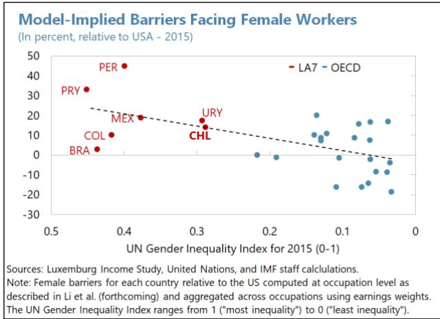  
Sources: Luxemburg Income Study, United Nations, and IMF staff calculations. Note: Female barriers for each country relative to the US computed at occupation level as described in Li et al. (forthcoming) and aggregated across occupations using earnings weights. The UN Gender Inequality Index ranges from 1 ("most inequality") to 0 ("least inequality").

2. Occupational barriers facing women in Chile are estimated to be higher than those in most OECD economies. The model-implied barrier measure is inferred from cross-country differences in the distribution of occupations, earnings, and participation by gender, using microdata from the Luxembourg Income Study. It is strongly correlated with established indicators of gender inequality, such as the UN Gender Inequality Index (text chart). As of 2015, the estimated

barriers in Chile were 14 percent higher than those in the United States. While Chile ranks near the median among Latin American peers, its estimated barrier levels remain above those in most OECD economies. $^{2}$

3. Reducing female occupational barriers to the OECD median could permanently raise Chile's per capita income, primarily through productivity gains. Counterfactual simulations using the model in Li et al. (forthcoming IMF Working Paper) suggest

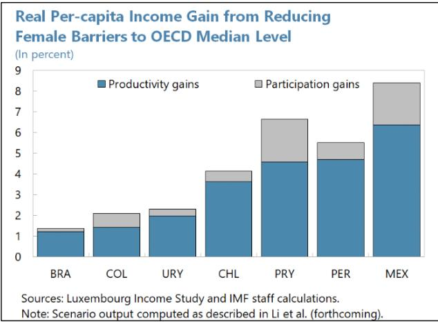

that reducing barriers to the OECD median would increase average income in all LA7 economies (text chart). For Chile, this estimated gain in per capita income is 3.6 percent, most of which—about 3.1 percent—would come from higher labor productivity as women are able to sort into occupations better aligned with their abilities. The remaining 0.5 percent would come from higher labor force participation. This decomposition highlights that while Chile's female labor force participation is approaching OECD levels, meaningful barriers persist in high-skilled occupations, particularly in managerial, professional, and technical jobs. Easing these barriers would raise productivity by improving the allocation of talent across occupations.

<table><tr><td>Table 2. Chile: Data Standards Initiatives</td></tr><tr><td>Chile adheres to the Special Data Dissemination Standard (SDDS) Plus since March 2020 and publishes the data on its National Summary Data Page. The latest SDDS Plus Annual Observance Report is available on the Dissemination Standards Bulletin Board (https://dsbb.imf.org/).</td></tr></table>

Annex X. Data Issues

<table><tr><td colspan="8">Table 1. Chile: Data Adequacy Assessment for Surveillance</td></tr><tr><td colspan="8">Data Adequacy Assessment Rating1</td></tr><tr><td colspan="8">A</td></tr><tr><td colspan="8">Questionnaire Results2</td></tr><tr><td rowspan="2">Assessment</td><td>National Accounts</td><td>Prices</td><td>Government Finance Statistics</td><td>External Sector Statistics</td><td>Monetary and Financial Statistics</td><td>Intersectoral Consistency</td><td>Median Rating</td></tr><tr><td>A</td><td>A</td><td>A</td><td>A</td><td>B</td><td>A</td><td>A</td></tr><tr><td colspan="8">Detailed Questionnaire Results</td></tr><tr><td colspan="8">Data Quality Characteristics</td></tr><tr><td>Coverage</td><td>A</td><td>A</td><td>B</td><td>A</td><td>A</td><td></td><td></td></tr><tr><td rowspan="2">Granularity3</td><td>A</td><td></td><td>A</td><td>A</td><td>A</td><td></td><td></td></tr><tr><td></td><td></td><td>A</td><td></td><td>B</td><td></td><td></td></tr><tr><td>Consistency</td><td></td><td></td><td>B</td><td>A</td><td></td><td>A</td><td></td></tr><tr><td>Frequency and Timeliness</td><td>A</td><td>A</td><td>A</td><td>A</td><td>B</td><td></td><td></td></tr><tr><td colspan="8">Note: When the questionnaire does not include a question on a specific dimension of data quality for a sector, the corresponding cell is blank. $^{1}$ The overall data adequacy assessment is based on staff&#x27;s assessment of the adequacy of the country&#x27;s data for conducting analysis and formulating policy advice, and takes into consideration country-specific characteristics. $^{2}$ The overall questionnaire assessment and the assessments for individual sectors reported in the heatmap are based on a standardized questionnaire and scoring system (see IMF Review of the Framework for Data Adequacy Assessment for Surveillance, January 2024, Appendix I). $^{3}$ The top cell for &quot;Granularity&quot; of Government Finance Statistics shows staff&#x27;s assessment of the granularity of the reported government operations data, while the bottom cell shows that of public debt statistics. The top cell for &quot;Granularity&quot; of Monetary and Financial Statistics shows staff&#x27;s assessment of the granularity of the reported Monetary and Financial Statistics data, while the bottom cell shows that of the Financial Soundness indicators.</td></tr><tr><td>A</td><td colspan="7">The data provided to the Fund are adequate for surveillance.</td></tr><tr><td>B</td><td colspan="7">The data provided to the Fund have some shortcomings but are broadly adequate for surveillance.</td></tr><tr><td>C</td><td colspan="7">The data provided to the Fund have some shortcomings that somewhat hamper surveillance.</td></tr><tr><td>D</td><td colspan="7">The data provided to the Fund have serious shortcomings that significantly hamper surveillance.</td></tr><tr><td colspan="8">Rationale for staff assessment. Data provision is adequate for surveillance. The two areas for improvement that were discuss during the mission were: (i) coverage and timeliness on the provision of FSIs and (ii) transparency and better reporting on below-the-line operations which drive the large residual in the DSA. The authorities are already taking action to improve on the provision of FSIs. They have also increased the detail on the below-the-line items and committed to undertake further improvements in coming Fiscal Policy Reports.</td></tr><tr><td colspan="8">Changes since the last Article IV consultation Chile has continued to make improvement in several statistics to further enhance the quality of data for surveillance. As an example, the statistical agency INE updated the base year of CPI to 2023 and made changes to its categories to better capture the pattern of consumption of Chilean households.</td></tr><tr><td colspan="8">Corrective actions and capacity development priorities The team discussed with the authorities ways to improve provision of financial sector statistics including identifying series that may be currently produced by the BCCh and not reported to the Fund. Efforts on this front are underway. On fiscal statistics, the team will be working with the authorities on best reporting practices for the Fiscal Policy Report including granularity on debt driver flows.</td></tr><tr><td colspan="8">Use of data and/or estimates in Article IV consultations in lieu of official statistics available to staff. Staff does not use any data and/or estimates in the staff report in lieu of official statistics.</td></tr><tr><td colspan="8">Other data gaps. Data provision on emerging issues including climate, gender, digitalization have not represented limitations to conduct surveillance. However, lack of homogenous standards on these areas do not allow the team to assess whether the quality of the data provided is adequate or alternatively identify improvements that could be reasonably expected.</td></tr></table>

Table 3. Chile: Table of Common Indicators Required for Surveillance
As of June 03, 2026

<table><tr><td rowspan="2"></td><td colspan="4">Data Provision to the Fund</td><td colspan="4">Publication under the Data Standards Initiatives through the National Summary Data Page</td></tr><tr><td>Date of Latest Observation</td><td>Date Received</td><td>Frequency of Data7</td><td>Frequency of Reporting7</td><td>Expected Frequency7,8</td><td>Announced Frequency9</td><td>Expected Timeliness7,8</td><td>Announced Timeliness9</td></tr><tr><td>Exchange Rates</td><td>2026-06-02</td><td>2026-06-02</td><td>D</td><td>D</td><td>D</td><td>...</td><td>...</td><td>...</td></tr><tr><td>International Reserve Assets and Reserve Liabilities of the Monetary Authorities1</td><td>2026-04</td><td>2026-04</td><td>M</td><td>M</td><td>M</td><td>M</td><td>1W</td><td>1M</td></tr><tr><td>Reserve/Base Money</td><td>2026-04</td><td>2026-04</td><td>M</td><td>M</td><td>M</td><td>M</td><td>2W</td><td>1W</td></tr><tr><td>Broad Money</td><td>2026-04</td><td>2026-04</td><td>M</td><td>M</td><td>M</td><td>M</td><td>1M</td><td>3W</td></tr><tr><td>Central Bank Balance Sheet</td><td>2026-04</td><td>2026-04</td><td>M</td><td>M</td><td>M</td><td>M</td><td>2W</td><td>1W</td></tr><tr><td>Consolidated Balance Sheet of the Banking System</td><td>2026-03</td><td>2026-04</td><td>M</td><td>M</td><td>M</td><td>M</td><td>1M</td><td>3W</td></tr><tr><td>Total assets of other depository corporations2</td><td>2026-03</td><td>2026-04</td><td>Q</td><td>Q</td><td>M</td><td>M</td><td>1M</td><td>3W</td></tr><tr><td>Total credit from other depository corporations2</td><td>2026-03</td><td>2026-04</td><td>Q</td><td>Q</td><td>M</td><td>M</td><td>1M</td><td>3W</td></tr><tr><td>Interest Rates3</td><td>2026-06-02</td><td>2026-06-02</td><td>D</td><td>D</td><td>D</td><td>...</td><td>...</td><td>...</td></tr><tr><td>Consumer Price Index</td><td>2026-04</td><td>2026-05</td><td>M</td><td>M</td><td>M</td><td>M</td><td>1M</td><td>5D</td></tr><tr><td>Revenue, Expenditure, Balance, and Composition of Financing4-General Government5</td><td>2025-12</td><td>2026-03</td><td>Q</td><td>Q</td><td>A</td><td>...</td><td>2Q</td><td>...</td></tr><tr><td>Revenue, Expenditure, Balance, and Composition of Financing4-Central Government</td><td>2026-04</td><td>2026-05</td><td>M</td><td>M</td><td>M</td><td>M</td><td>1M</td><td>2M</td></tr><tr><td>Stocks of Central Government and Central Government-Guaranteed Debt6</td><td>2026-03</td><td>2026-05</td><td>Q</td><td>Q</td><td>Q</td><td>Q</td><td>1Q</td><td>NLT 1Q</td></tr><tr><td>Total stock of General Government Debt5</td><td>2026-03</td><td>2026-05</td><td>Q</td><td>Q</td><td>Q</td><td>Q</td><td>4M</td><td>120D</td></tr><tr><td>External Current Account Balance</td><td>2026-03</td><td>2026-04</td><td>Q</td><td>Q</td><td>Q</td><td>Q</td><td>1Q</td><td>7W</td></tr><tr><td>Exports and Imports of Goods and Services</td><td>2026-04</td><td>2026-05</td><td>M</td><td>M</td><td>M</td><td>M</td><td>8W</td><td>NLT 3W</td></tr><tr><td>GDP/GNP</td><td>2026-03</td><td>2026-05</td><td>Q</td><td>Q</td><td>Q</td><td>Q</td><td>1Q</td><td>11W</td></tr><tr><td>Gross External Debt</td><td>2026-03</td><td>2026-04</td><td>Q</td><td>Q</td><td>Q</td><td>Q</td><td>1Q</td><td>5W</td></tr><tr><td>International Investment Position</td><td>2026-03</td><td>2026-05</td><td>Q</td><td>Q</td><td>Q</td><td>Q</td><td>1Q</td><td>3M</td></tr></table>

## CHILE

June 18, 2026

## STAFF REPORT FOR THE 2026 ARTICLE IV CONSULTATION—INFORMATIONAL ANNEX

Prepared By

The Western Hemisphere Department (In consultation with other departments)

## CONTENTS

FUND RELATIONS 2

RELATIONS WITH OTHER INTERNATIONAL FINANCIAL INSTITUTIONS \_\_\_\_ 5

## FUND RELATIONS

(As of May 31, 2026)

Membership Status: Joined December 31, 1945; Article VIII

<table><tr><td>General Resources Account:</td><td>SDR Million</td><td>Percent Quota</td></tr><tr><td>Quota</td><td>1,744.30</td><td>100.00</td></tr><tr><td>Fund holdings of currency</td><td>1,285.05</td><td>73.67</td></tr><tr><td>Reserve Tranche Position</td><td>459.26</td><td>26.33</td></tr></table>

Lending to the Fund  
New Arrangements to Borrow

<table><tr><td>SDR Department:</td><td>SDR Million</td><td>Percent of Allocation</td></tr><tr><td>Net cumulative allocation</td><td>2,488.72</td><td>100.00</td></tr><tr><td>Holdings</td><td>2,522.18</td><td>101.34</td></tr></table>

Outstanding Purchases and Loans: None

Latest Financial Arrangements:

<table><tr><td>Type</td><td>Date of Arrangement</td><td>Expiration Date</td><td>Amount Approved (SDR Million)</td><td>Amount Drawn (SDR Million)</td></tr><tr><td>FCL</td><td>Aug 27, 2024</td><td>Aug 26, 2026</td><td>10,465.80</td><td>0.00</td></tr><tr><td>FCL</td><td>Aug 29, 2022</td><td>Aug 26, 2024</td><td>13,954.00</td><td>0.00</td></tr><tr><td>SLL</td><td>May 20, 2022</td><td>Aug 28, 2022</td><td>2,529.00</td><td>0.00</td></tr><tr><td>FCL</td><td>May 29, 2020</td><td>May 19, 2022</td><td>17,443.00</td><td>0.00</td></tr><tr><td>Stand-By</td><td>Nov 8, 1989</td><td>Nov 7, 1990</td><td>64.00</td><td>64.00</td></tr><tr><td>EFF</td><td>Aug 15, 1985</td><td>Aug 15, 1989</td><td>825.00</td><td>806.25</td></tr><tr><td>Stand-By</td><td>Jan 10, 1983</td><td>Jan 9, 1985</td><td>500.00</td><td>500.00</td></tr></table>

Projected Future Payments to Fund (SDR Million)

<table><tr><td rowspan="2"></td><td colspan="5">Forthcoming</td></tr><tr><td>2026</td><td>2027</td><td>2028</td><td>2029</td><td>2030</td></tr><tr><td>Principal</td><td></td><td></td><td></td><td></td><td></td></tr><tr><td>Charges/Interest</td><td></td><td>0.01</td><td>0.01</td><td>0.01</td><td>0.01</td></tr><tr><td>Total</td><td></td><td>0.01</td><td>0.01</td><td>0.01</td><td>0.01</td></tr></table>

## Exchange Rate Arrangements

Chile's de jure exchange rate arrangement is free floating, and the de-facto exchange rate arrangement is floating. Chile has accepted the obligations of Article VIII, Sections 2, 3, and 4 of the IMF's Articles of Agreement, and maintains an exchange rate system free of restrictions on the making of payments and transfers for current international transactions and multiple currency practices.

## Previous Article IV Consultation

The last Article IV consultation was concluded on February 5, 2025. Article IV consultations with Chile are currently held on a standard 12-month cycle.

## Financial Sector Assessment Program (FSAP)

An FSAP mission was conducted remotely during March 15–April 9 and July 19–August 4, 2021. The FSAP mission assessed financial sector risks and vulnerabilities, the quality of supervisory oversight of banks, the provision of systemic liquidity, crisis management and bank resolution arrangements, and the functioning of the pension system. The Financial System Stability Assessment (FSSA) was published on December 9, 2021.

## Technical Assistance

Chile is an active user of the Fund's technical assistance. Technical assistance has centered on the Fund's core competencies, notably in the areas of fiscal policy and financial sector supervision. Since 2021, technical assistance has been provided on the following issues:

## Fiscal Sector

• Tax Revenue Projections (January 2025)

• Strengthening Revenue Administration (August 2023)

• Managing Stabilization Funds (March 2023)

• Subnational Taxation (April 2023)

• International Corporate Tax Risks (April 2023)

• Fiscal Reporting (December 2022)

• Green Tax Policy (October 2022)

• Fiscal Transparency Evaluation (June 2021)

• Mining Tax Policy (March 2021).

## Monetary and Financial Sectors

• Insurance Stress Testing (April 2026)

• Mutual Fund Stress Testing (November 2025)

• Systemic Liquidity Management (May 2024)

• Liquidity Stress Testing Training (November 2023)

• Liquidity Risk Supervision (November 2023)

• Interest Rate Risk Supervision (May 2023)

• Risk Heatmaps (September 2022)

• Deposit Insurance (May 2022)

• Conglomerate Supervision (April 2022)

• Internal Rating Based Approaches for Credit Risk (April 2021)

• Regulation and Supervision of Money Market Funds (January-February 2021).

# RELATIONS WITH OTHER INTERNATIONAL FINANCIAL INSTITUTIONS

World Bank: https://www.worldbank.org/en/country/chile

Inter-American Development Bank: https://www.iadb.org/en/who-we-are/country-offices/chile

# Statement by Leonardo Madcur, Executive Director for Chile and Rodrigo Alfaro, Advisor to Executive Director

July 6, 2026

On behalf of the Chilean authorities, we extend our gratitude to Ms. Schaechter and Mr. Joshi and their team for the constructive discussions during the Article IV Consultation, as well as for valuable insights in the report. The authorities welcome staff's analysis and insightful policy advice.

The Chilean economy remains resilient despite recent external shocks, operating slightly below its potential output and with medium-term inflation expectations fully anchored. Monetary, financial, and fiscal policies have been instrumental in navigating through an uncertain external environment, leveraging strong institutions and robust policy frameworks. Over the medium term, the recently approved pension reform will improve pension adequacy and deepen capital markets, while the National Reconstruction Plan (NRP) —currently under discussion in Congress—is expected to boost growth by streamlining investment permit processes. Furthermore, the authorities are committed to implementing a credible medium-term fiscal consolidation plan and maintaining external buffers at an adequate level. Taken together, these efforts reflect the authorities' resolve to safeguard macroeconomic stability while laying the foundations for stronger and more sustainable medium-term growth. The authorities have provided the following additional comments for consideration:

## Recent Developments and Economic Outlook

Chile's economic activity has moderated in early 2026, mainly reflecting natural resource sector dynamics, while inflation was pushed up by the increase in global energy costs. GDP contracted in the first quarter, driven by a decline in copper production, which is expected to persist in the short term, as well as lower output in the agricultural and fishing sectors. Gross fixed capital formation weakened, and preliminary data for the second quarter confirmed that trend. Nonetheless, the medium-term outlook for growth and investment continues to be favorable, amid resilient global demand, high copper price levels, and supportive financial conditions. In the labor market, the seasonally adjusted (SA) total unemployment rate has risen reaching 8.9 percent in April and the SA female unemployment rate reached 9.9 percent in the same period, while various indicators point to weak job creation. The authorities concur with staff that the labor market has been negatively affected by recent regulatory changes, including minimum wage hikes, a reduction in working hours, higher social security costs from the Pension Reform, and the slow recovery in the construction sector. Furthermore, the conflict in the Middle East increased energy and transportation costs, pushing up local inflation, which reached 3.9 percent in May (up from 2.4 percent in February), and is weighing on growth. In this context, the Ministry of Finance (MoF) implemented transitory and targeted fiscal measures in response to the oil price shock, including paraffin subsidies to low-income households and public transport fare freezes, while the Central Bank of Chile (BCCh) has conducted a data dependent monetary policy approach, keeping the policy rate unchanged.

External risks continue to be elevated; thus, economic buffers must be rebuilt. In mid-June, the BCCh revised down its estimates for GDP growth to 1.0-1.75 percent for the current year and revised up its forecast for 2027 to 2.0-3.0 percent; while inflation projections were revised up to 4.2 percent for

December 2026, maintaining its expected convergence to the BCCh's 3.0 percent target from the second quarter of 2027. More recently, a successful first round of negotiations between the US and Iran, and the reopening of the Strait of Hormuz, significantly reduced the oil price in the spot market; however, the authorities note that further negotiations are needed to reach a durable peace agreement, concluding that for the short run the external environment will continue to exhibit a high level of uncertainty. At the same time, key measures are in place to rebuild buffers: (i) the expenditure adjustment implemented by the MoF is expected to yield around 0.4 percent of GDP in 2026, correcting the weak outcome obtained in 2025, and the MoF's program to sell state-owned land and properties without productive use are decisively actions that contribute to the medium-term fiscal consolidation, (ii) the three-year reserve accumulation program conducted by the BCCh is accumulating purchases, by end-June US\$5 billion, bringing international reserves to US\$52 billion, and (iii) the BCCh raised the counter-cyclical capital buffer (CCyB) to its neutral level at 1.0 percent of risk-weighted assets, strengthening financial sector resilience.

## Fiscal Policy

The authorities are committed to implementing a credible medium-term fiscal consolidation plan. This commitment is reflected in a structural deficit path that envisages a steady reduction in fiscal imbalances, targeting 1.5 percent of GDP by 2030. This consolidation plan is supported by expenditure rationalization, an improvement in targeting social spending, and an enhancement of public companies' efficiency. Previous government projections for the 2026 headline fiscal deficit have been revised up from 1.5 percent of GDP to 2.4 percent, reflecting more realistic assumptions on both expected revenues and spending pressures.

The NRP is a comprehensive reform package, aimed at accelerating investment and lifting potential output. The reform includes a reduction in the CIT rate from 27 to 23 percent, returning to a fully integrated tax system, and a tax invariability measure for major investment projects. These measures aim to recover the tax competitiveness of the country, boost investment, and lift medium-term growth. The authorities would like to stress that the fiscal costs of the measures are based on conservative assumptions, the package incorporates offsetting fiscal actions, and they expect to accommodate any residual net fiscal cost through gains in spending efficiency.

## Monetary and Financial Sector Policies

The Board of the BCCh reaffirms its commitment to continue conducting monetary policy with flexibility to ensure that inflation reaches 3 percent over the two-year horizon. In May, headline inflation reached 3.9 percent, while core inflation was 3.2 percent, reflecting the impact of the oil price shock. Headline inflation is expected to be at 4.2 percent by year-end, but inflation expectations remain anchored at 3 percent in the two-year horizon of the BCCh's target. Against this backdrop, the Board of the BCCh estimates that the balance of risks to inflation has been shifting gradually toward equilibrium, although the macroeconomic outlook remains subject to a higher-than-usual degree of uncertainty. Accordingly, the future path of the monetary policy rate will be assessed on a meeting-by-meeting basis, based on how events unfold.

The free-floating exchange rate (FX) regimen has served the economy well, and the BCCh is fully committed to maintaining it. The Chilean peso has served as an external shock absorber for the economy since 1999, and FX interventions have been exceptional and limited to addressing disorderly market conditions. On all these occasions, the Bank has implemented transparent programs, announcing and publishing financial conditions after the market close. The FX framework is supported by comfortable external liquidity buffers, currently around 20 percent of GDP, including both international reserves and access to credit lines. On the latter, the Flexible Credit Line (FCL) remains a critical element, particularly under the current adverse external environment. In this context, the authorities reiterate their commitment to use the FCL as a precautionary facility, as it is intended, and to reduce the access level in line with improvements in the external conditions and the performance of the reserve accumulation program.

The Chilean economy benefits from macroeconomic strength and robust financial regulation and supervision standards, which provide adjustment mechanisms and buffers to mitigate the effects of severe shocks. The local institutional framework includes tools to address exceptional scenarios, as well as coordination mechanisms among authorities and regulators. Banks have continued to strengthen their capital base, and their solvency indicators have improved in line with Basel standards. The main risk to local financial stability comes from an abrupt tightening of financing conditions. Stress tests indicate that, under a scenario in which activity drops abruptly and funding costs rise significantly, banks would maintain capital levels above regulatory requirements. In this context, the Board of the BCCh decided to continue the convergence of the CCyB toward its neutral level, with implementation to be completed within 24 months, and conveyed that a continuous assessment of macro-financial conditions and their implications for the CCyB is warranted.

## Structural Reforms

The NRP considers a broad set of measures to improve environmental and sectorial regulation based on micro-sectorial areas. The bill also considers measures that could reduce processing times by at least one-third and provide greater legal certainty—for example, by ensuring the return of investments in the event that an approval is revoked due to procedural irregularities. These measures have been supplemented by improvements in process management, using tools to monitor and track permits.

The recent passage of the Technology and Knowledge Transfer Act paves the way for universities to advance knowledge and innovation. The law promotes technology transfer, intellectual property protection, science- and technology-based companies, and collaboration among academia, industry, entrepreneurs, and investors. It also strengthens transparency, establishes a national scientific knowledge repository, and ensures that publicly funded research delivers a greater economic and social impact.

In the coming months, a labor market bill focused on increasing flexibility and protecting formal employment will be introduced. The sustained increase in labor costs in recent years has had a negative impact on the unemployment rate, which remains high. Recognizing this, the authorities have considered measures such as hourly contracts, a proposed severance package applicable in all circumstances, and initiatives to strengthen worker training have been considered.

The Universal Daycare Center Bill promises to eliminate distortions in the labor market and promote women's employment. The bill seeks to reform Chile's Labor Code to guarantee the right to daycare for all children under the age of two, eliminating the current restriction that requires only companies with 20 or more female employees to provide this benefit. To ensure this benefit is provided equitably, funding will no longer be a direct burden on individual employers and will instead be managed through a Solidarity Fund financed by unemployment insurance contributions.

In addition to the NRP, a capital market bill aims to deepen and enhance liquidity within the financial system through a draft bill scheduled for submission to Congress in 2H2026. This macro-critical structural reform is structured around four fundamental pillars: regulatory simplification to modernize financial intermediation, the digital strengthening of financial infrastructure and payment systems, the development of the debt market to restore fixed-income liquidity, and the promotion of Fintech innovation. Furthermore, the design of these policies leverages the technical support of the Capital Markets Advisory Council to ensure efficient public-private coordination, aligning with structural benchmarks to mitigate macro-financial risks and foster sustainable domestic growth.