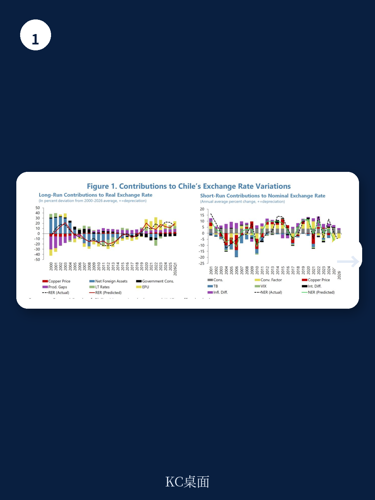
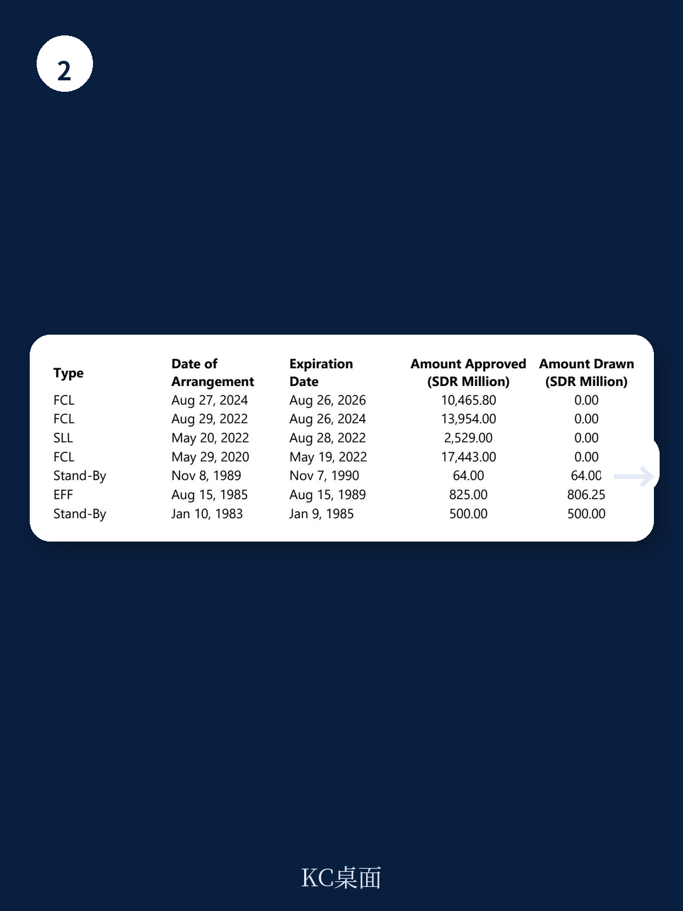

# IMF：铜价支撑难抵油价冲击，智利通胀再破3%目标

智利正在经历一场典型的“好消息与坏消息并存”的宏观叙事。2025年GDP增长2.5%，国内非矿业需求强劲，铜价高企为财政提供了缓冲。但进入2026年，中东冲突推高能源价格，通胀再度突破3%目标，增长预期节奏变化至1.8%。这份IMF第四条款磋商报告的核心判断是：智利宏观环境基本面依然稳健，但外部不确定性与内部结构性挑战的叠加，正在考验其政策框架的灵活性与财政纪律的可持续性。对于关注新兴市场宏观环境的读者而言，智利案例提供了一个观察“资源型地区如何在高波动环境中管理预期”的窗口。

## 1. 铜价是短期支撑，但油价才是决定通胀路径的关键变量

报告最值得关注的判断，在于对通胀前景的重新定位。智利央行曾成功将通胀引导回目标区间，但2026年5月，受能源价格冲击，CPI已升至3.9%，核心通胀也达到3.2%。IMF预计全年通胀将收于4.2%，高于目标，且要到2027年初才能回归。

这里的核心张力在于：铜价上涨为宏观环境增长和财政收入提供了正面支撑，但油价上涨的成本传导更为直接。报告明确指出，如果油价在更长时间内维持高位，并触发工资和其他价格的第二轮效应，央行必须准备好收紧货币政策。这意味着，智利央行的政策路径将不再单纯由国内需求决定，而是被外部能源成本绑架。

> **KC评论：** 对于关注新兴市场央行政策的读者，智利案例的关键在于“通胀预期是否脱锚”。目前两年期通胀预期仍锚定在3%，这给了央行观察空间。但如果油价持续超预期，央行从“按兵不动”转向“被迫加息”的窗口期可能比市场想象的要短。完整报告中关于油价不同情景下的通胀路径推演，值得细读。

## 2. 财政整顿目标清晰，但“额外措施”意味着更大的政治博弈

智利政府的核心目标是到2030年将结构性财政赤字降至GDP的1.5%，并将公共债务率控制在45%以下。IMF对此表示欢迎，但措辞中透露出明显的保留——报告多次强调“需要额外措施”。

问题出在收支两端。收入端，铜价和锂收入的高波动性使结构性收入预测充满不确定性；支出端，养老金改革、国家重建计划中的减税措施，以及长期的人口老龄化不确定性，都在挤压财政空间。报告特别指出，如果已宣布的支出削减部分不可行，或者节奏变化不确定性兑现，现有的整顿计划将无法达标。这意味着，智利的财政纪律最终将取决于政府能否在国会中推动更深入的税制改革和支出效率提升，而这是一场典型的政治博弈。

## 3. 资金体系整体稳健，但房地产和养老金改革是潜在不确定性点

IMF对智利资金体系的评价是“整体稳健，监管良好”。但两个领域被反复提及：一是房地产和建筑行业的部门性脆弱性仍需持续监控；二是养老金改革必须“循序渐进、协调推进”，以避免资产组合的突然重新配置。

后者尤其值得关注。智利养老金体系是拉美最成熟的DC模式之一，资产规模巨大。改革若导致资金流向发生剧烈变化，可能对本地债券市场和银行体系造成流动性冲击。报告强调，监管机构需要对改革实施过程中的市场反应保持高度警惕。

## 4. 报告没有完全回答的关键问题：潜在增长如何从2.5%跃升至4%

智利政府的目标是将中期潜在增长率提升至4%。这需要一套完整的结构性改革组合拳，包括放松监管、促进贸易、缩小技能差距、提高女性劳动参与率等。IMF对此表示支持，但报告更多是在列举政策方向，而非给出清晰的传导机制或量化路径。

一个未被充分讨论的问题是：在人口快速老龄化、劳动力市场存在结构性僵化（如最低工资大幅上调、每周工时缩短）的背景下，仅靠放松监管和减税能否实现增长跃升？报告提到了制造业与技能供给的错配，也提到了女性人才配置的改善空间，但这些议题目前仍停留在“政策建议”层面，缺乏具体的执行时间表和成本收益分析。对于读者而言，这或许意味着智利的中期增长故事尚需更多证据支撑。

## 5. 给读者的观察框架：三个需要持续跟踪的信号

- **油价与通胀预期的脱钩程度：** 如果两年期通胀预期开始高于3%，将触发央行的政策响应，进而影响比索汇率和利率曲线。
- **财政整顿的“额外措施”是否落地：** 关注智利国会关于税改和支出削减的辩论进程，这是判断政府财政纪律可信度的核心指标。
- **养老金改革对本地资产配置的影响：** 资金流动的方向和速度，将直接影响智利本地债券市场的定价和银行体系的流动性状况。

这份报告描绘了一个在外部冲击中保持韧性的智利，但也清晰指出了其面临的约束。对于关注新兴市场宏观的读者而言，智利的经验提醒我们：资源禀赋是优势，但政策纪律和改革执行力才是决定长期回报的关键变量。

For informational purposes only. Portions may be generated,translated,summarized,or edited with AI assistance based on source materials and may contain omissions or errors. Please verify independently. This is not investment,legal,tax,accounting,or other professional advice.
