## CHILE

## SELECTED ISSUES

July 2026

This paper on Chile was prepared by a staff team of the International Monetary Fund as background documentation for the periodic consultation with the member country. It is based on the information available at the time it was completed on June 18, 2026.

Copies of this report are available to the public from

International Monetary Fund • Publication Services
PO Box 92780 • Washington, D.C. 20090
Telephone: (202) 623-7430 • Fax: (202) 623-7201
E-mail: publications@imf.org Web: http://www.imf.org
Price: \$18.00 per printed copy

International Monetary Fund
Washington, D.C.

# CHILE

## SELECTED ISSUES

June 18, 2026

Approved By

Western Hemisphere

Department

Prepared by Francisco Cabezon (RES), Kazuhiro Hiraki (MCM), and Myrto Oikonomou (WHD).

## CONTENTS

## CHILE'S PENSION REFORM—FISCAL IMPLICATIONS OF THE MINIMUM

GUARANTEED PENSION 3

A. Introduction 3

B. Overview of the Chilean Pension System and the 2025 Pension Reform \_\_\_\_ 4

C. Challenges in the Current Design of the PGU 6

D. Baseline Scenario and the Role of Indexation 8

E. Reform Scenarios 9

F. Conclusion 11

## FIGURES

1. Distribution of Pension Contributions and Savings at Retirement \_\_\_\_ 7

2. Scenario Analysis for Share of Population with Savings Below Lower PGU Threshold 8

3. PGU Costs Under Baseline Scenario 9

4. Pension Evolution Under Baseline and Reform Scenarios 11

## ANNEX

I. Model Description \_\_\_\_ 12

References 15

## PUBLIC SPENDING TRENDS AND BENCHMARKING EFFICIENCY IN EDUCATION

AND HEALTH SECTORS 16

A. Introduction 16

B. Overall Spending Trends \_\_\_\_ 16

C. Efficiency in Health and Education Spending 21  
D. Conclusion 28

## FIGURES

1. Expenditure Ratios by Economic Transaction 17
2. Selected Expenditure Categories by Economic Transaction, Chile & OECD 18
3. Expenditure Ratios by Economic Function, Chile & OECD 19
4. Expenditure Ratios by Economic Function Over Time, Chile & OECD 20
5. Selected Healthcare Inputs 22
6. Selected Health Outcomes 23
7. Selected Public Healthcare Spending Indicators 24
8. Efficiency Frontiers in the Healthcare Sector 25
9. Selected Education Outcomes 26
10. Selected Education Spending Indicators 27
11. Efficiency Frontiers in the Education Sector 28
References 30

PENSION REFORM AND CHILEAN CAPITAL MARKETS 31
A. Introduction 31
B. Overview of the Two Pension Fund Systems 32
C. Estimating the Size of Asset Reallocations Due to the Transition 35
D. Implementation of the Transition to the Generational Fund System 45
E. Conclusions 50

FIGURES
1. Asset Reallocations Under the Multi-fund-based Example Glide Paths 38
2. Asset Reallocations Under the Model-based Example Glide Paths 41

ANNEXES
I. Overview of the Chilean Pension System 52
II. Life-cycle Optimal Portfolio Model 53
III. Pension Funds' Derivative Investment 56

References 61

# CHILE'S PENSION REFORM—FISCAL IMPLICATIONS OF THE MINIMUM GUARANTEED PENSION $^{1}$

Chile approved a comprehensive pension reform in 2025 that, among other changes, significantly raises the contribution rate, aiming to lift pension adequacy. This chapter analyzes implications on fiscal sustainability of the reform's expansion of the solidarity pillar, the Minimum Guaranteed Pension (PGU), which accounts for roughly one-third of the estimated cost of the reform. While the PGU's design formally includes a tapered benefit structure intended to account for the heterogeneity in individual pension savings, microdata analysis indicates that there is no targeting in practice, implying a substantial fiscal burden. The chapter simulates an evolution of the distribution of pension savings to explore the long-term fiscal implications of the current PGU design under different indexation regimes as well as under different reform scenarios. The results suggest that there is significant scope to contain PGU's fiscal costs via different measures, including: (i) narrower targeting of PGU, (ii) maintaining a prudent indexation rule that precludes catch-up to wage growth, and (iii) increasing the statutory retirement age and PGU eligibility age in line with life expectancy gains. While recognizing that such measures would also carry important distributional implications, this chapter focuses solely on their impact on fiscal sustainability.

## A. Introduction

1. Over time, Chile has expanded the solidarity pillar that co-exists with its fully capitalized pension system. Originally established in 2008, the solidarity pillar was aimed at addressing the persistently low replacement rates under the defined-contribution system, reflecting low contribution rates and high informality. The solidarity pillar introduced a government-funded pension payment that phased out with individual savings, which secured a minimum pension of about 40 percent of the minimum wage. The benefit levels have since increased and, in 2020, the design was changed to what in practice is a lump-sum transfer (PGU) to 90 percent of the eligible population. At a fiscal cost of about 2.2 percent of GDP, the PGU has increased average replacement rates, reduced old-age poverty, and narrowed gender pension gaps (OECD 2025). $^{2}$

2. The 2025 pension reform marks an important step toward improving pension adequacy. The gradual increase in contribution rates by 7 percentage points and the expanded coverage for self-employed workers and unemployed are expected to raise contribution densities and replacement rates, lifting substantially total pensions over time. This increase is driven by the reform, larger contribution rates, and the PGU, as well as by the strengthening of the labor market observed in Chile over the last three decades.

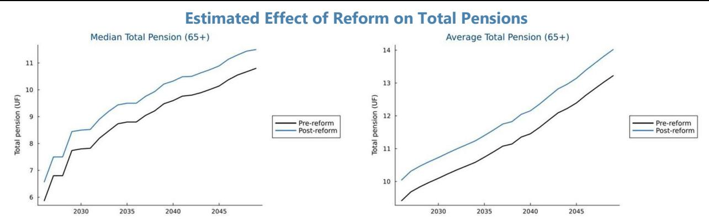  
Sources: Encuesta de Protección Social and IMF staff calculations.  
Note: The Unidad de Fomento (UF) is an inflation-indexed unit of account used in Chile to preserve the real value of financial transactions, contracts, and obligations over time. The value of this reference unit is adjusted daily in line with the previous month's CPI inflation.

3. However, the design of PGU benefit implies a substantial fiscal burden. Under the current design, the self-financed pension thresholds that define the amount of PGU received allow also pensioners at the upper end of the pension savings distribution to receive the full PGU benefit. Thus, the fiscal cost of the PGU is projected to grow linearly with the elderly population and, given the rapid increase of this demographic group in the next decades, the PGU will likely generate a significant fiscal cost. Tackling this burden is an important policy challenge to address, particularly in the current juncture when fiscal space has narrowed.

## B. Overview of the Chilean Pension System and the 2025 Pension Reform

4. Chile's pension system is based on a defined-contribution individual accounts system complemented by a solidarity pillar. The pension system, a central component of Chile's social protection framework, is structured around three pillars. The first pillar is non-contributory and consists of the Minimum Guaranteed Pension (PGU), which provides a tapered benefit to individuals aged 65 and above belonging to the lowest 90 percent of income distribution. $^{3}$ The second pillar is mandatory and contributory, requiring workers to contribute 10 percent of their taxable wages to individual pension saving accounts that are managed by private pension fund administrators (AFPs). Following the 2025 reform, employers are also required to contribute 8.5 percent to the individual capitalization accounts and the new Social Insurance which is administered by the Autonomous Social Security Protection Fund (FAPP). The third pillar is voluntary, allowing affiliates to supplement their mandatory savings, supported by tax incentives. Upon reaching statutory retirement age (65

for men and 60 for women), accumulated balances can be converted into an annuity, a programmed withdrawal, or a combination of both.

5. The approval of the reform reflected a broad political consensus. The reform, approved by Congress on January 29, 2025, envisaged a gradual increase in employer contributions by 7 percentage points, raising total employer contributions to 8.5 percent of workers' taxable income over a transition period of nine years (or eleven years under an alternative schedule). The reform also increased PGU in a gradual manner from CLP 224,000 to CLP 250,000, depending on beneficiaries' age. In parallel, a new Social Insurance scheme was established whereby part of the employer contributions are deposited to the Autonomous Social Security Protection Fund (FAPP) $^{4}$ which finances the compensation for the gender pension gap, the pension bonus based on years of contribution, and contributions to individual accounts with protected returns. $^{5}$ The reform further includes a transition from a multi-fund to a generational-fund system where investment portfolios will be adjusted based on the affiliate's age, and mandates every two years a reallocation of 10 percent of affiliates to the fund administrator with the lowest fee to enhance competition (see Chapter III). Lastly, the reform introduced several measures to increase contribution densities, including a mechanism to cover pension contributions during unemployment as well as a simplified monthly contribution scheme for self-employed workers.

6. The authorities estimate pension reform to generate additional fiscal costs of around 1 percent of GDP over the medium term. Lower tax revenues resulting from a narrower tax base are

projected at around 0.34 percent of GDP by 2035 and costs linked to higher pension-related expenditures for public sector employees are estimated at 0.22 percent of GDP, while fiscal transfers to the FAPP are projected to peak at about 0.23 percent of GDP. Increased spending on the PGU is projected to add costs of 0.3 percent of GDP under the baseline scenario (which assumes that PGU is indexed to CPI inflation), accounting for about one third of the total fiscal burden of the reform. These additional costs are projected to peak at around

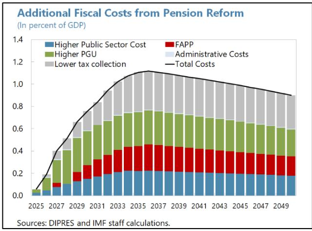

1.1 percent of GDP by 2035 and to gradually decline thereafter, stabilizing at approximately 0.9 percent of GDP by 2050.

## C. Challenges in the Current Design of the PGU

7. Microdata analysis points to substantial heterogeneity in individual accumulated balances at retirement. The analysis draws on micro-level data from the Encuesta de Protección Social (EPS), which provides a representative sample of the adult population comprising of 32,537 individuals. The dataset contains detailed demographic information, including date of birth and gender, as well as comprehensive monthly earnings history dating back to 1981 (covering more than 11 million observations). It also includes monthly pension savings data since 2002 and detailed information on pension outcomes, distinguishing between self-funded and government-financed pensions. One key result is that the mass of the distribution is highly concentrated at very low levels of the reference self-funded pension (PAFE) $^{6}$ , indicating that a vast majority of retirees enter retirement with a limited self-funded pension (Figure 1, lower charts) and thus high reliance on the PGU.

8. This heterogeneity in pension savings reflects large disparities in both lifetime earnings and labor-market participation, with a particularly pronounced gender gap. The distribution of average formal wages is markedly skewed, while contribution densities vary widely across individuals, with a substantial share contributing zero or close to zero to their individual accounts (Figure 1, upper charts). Earnings and contribution densities are strongly correlated, with high-wage individuals also exhibiting higher contribution densities, compounding differences in accumulated pension wealth. The unequal distribution is particularly pronounced across genders, as women systematically experience lower earnings and lower contribution densities, amplifying gaps in pension outcomes.

## 9. In theory, the PGU allows for targeting based on individual savings as it features a tapered benefit structure which is also meant to contain fiscal costs. Eligibility to the PGU is

based on a number of criteria, which include residency and age (individuals should be at least 65 years of age) as well as income criteria (individuals should be at the lowest 90 percent of the income distribution). Additionally, the PGU features a tapered benefit structure. Retirees with self-financed pensions below a lower threshold (at CLP 789,139 per month as of February 2026) receive the full PGU benefit, those between the lower and upper threshold, receive a gradually phased out benefit as the self-financed pension increases, and once the upper threshold (at

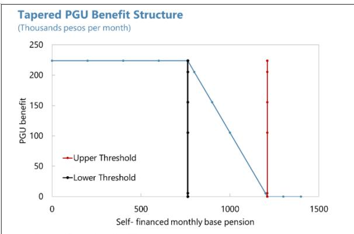  
Source: IMF staff based on information from the Superintendency of Pensions.

CLP 1,252,602 per month as of February 2026) is reached, the PGU is fully eliminated. $^{7}$ In principle, this design aims to condition benefits on pension savings at retirement, thereby targeting support to the lower-income elderly population.

Sources: Encuesta de Protección Social and IMF staff calculations.  
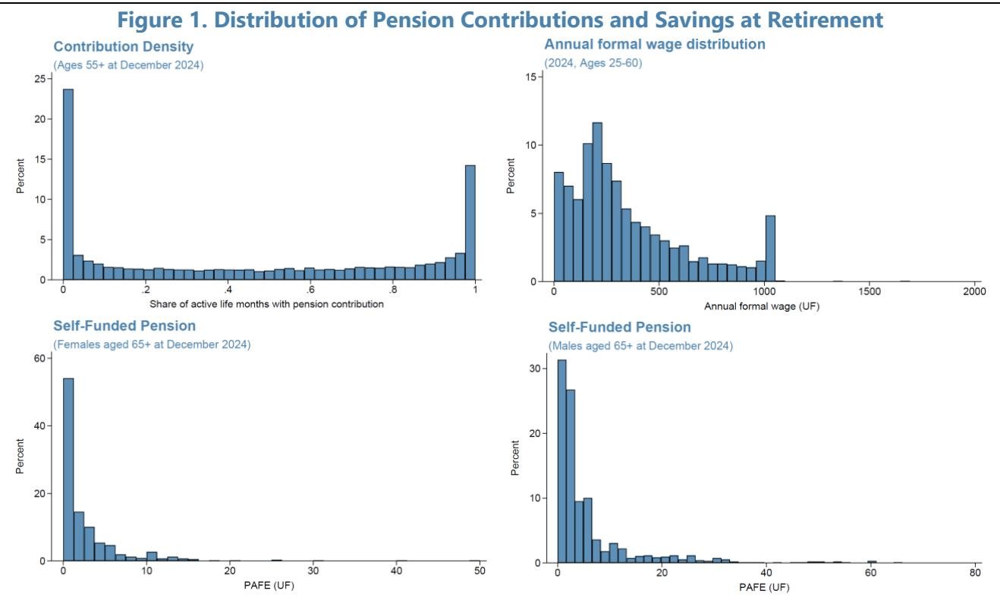  
Note: The Unidad de Fomento (UF) is an inflation-indexed unit of account used in Chile to preserve the real value of financial transactions, contracts, and obligations over time. The value of this reference unit is adjusted daily in line with the previous month's CPI inflation. PAFE is an estimated pension at retirement age used to determine the amount of the PGU.

10. We use microdata to simulate the distribution of pensions until 2050. Following the methodology developed by Cabezon (2024), forward projections are prepared starting at end-2024 using the subsample of individuals aged 40 and above. For the period 2022–24, individuals are assigned to earnings deciles by sex and age bins. Initial conditions are based on observed pension savings as of December 2024. A wage path is projected on a year-by-year basis by earning decile-age-gender cells. Given wage paths and the contribution rate schedule announced by the government, pension savings are projected. $^{8}$ Upon reaching the statutory retirement age of 65 for men and 60 for women, accumulated balances are converted into a reference pension (PAFE), which serves as the basis for assessing PGU eligibility and benefit levels. $^{9}$

11. Microdata and simulations suggest that the current taper design of the PGU is limited in practice and will likely be ineffective in reducing the PGU's fiscal burden. Microdata from the EPS indicates that in 2024, 96 percent of retirees aged 65 and above had a self-financed monthly pension below the lower threshold at which the PGU starts phasing out (Figure 2), implying that, if eligible, this share of retirees will receive the full PGU. Our simulations suggest that this will also be the case going forward, projecting that more than 92 percent of retirees will be below the lower PGU threshold by 2050. $^{10}$ Notably, even if the PGU thresholds are kept frozen in nominal terms, as many as 78 percent of women and 70 percent of men would still remain below the lower PGU threshold by 2050 under this extreme scenario. Thus, our analysis indicates that despite higher contribution rates under the 2025 reform, most eligible retirees will receive the full benefit in 2050 and despite the increase in savings generated by the pension reform, the fiscal expenditure on the PGU will grow linearly with the size of the elderly population.

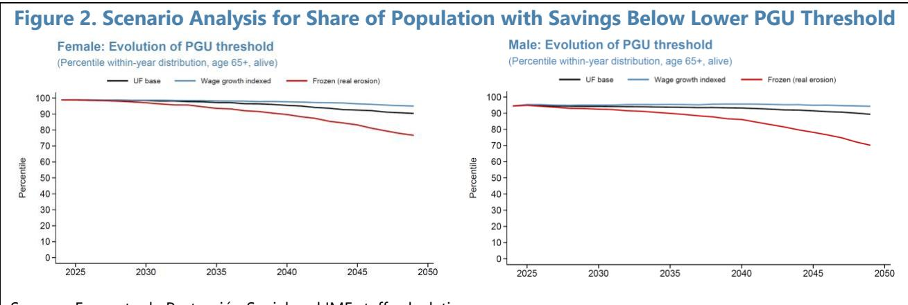  
Sources: Encuesta de Protección Social and IMF staff calculations.

## D. Baseline Scenario and the Role of Indexation

12. The type of indexation plays an important role for the evolution of the PGU's fiscal costs. For these estimations, we apply the projected shares of beneficiaries receiving the full and partially phased-out PGU benefits derived from the micro-simulation analysis to the UN World Population Prospects (2024) median demographic projections. Wage growth is proxied by growth in GDP per working-age population, and macroeconomic assumptions are aligned with IMF staff's baseline macro framework. Under these assumptions, PGU spending is projected to increase from about 2.2 percent of GDP to approximately 2.5 percent of GDP by 2040, assuming that the benefit

levels and the eligibility thresholds are adjusted based on the consumer price index (CPI) in line with current legislation. $^{[11]}$ Under wage rather than inflation indexation, fiscal costs would be about 0.5 percentage points (pps) higher by 2040 and about 1 pps higher by 2050. An alternative metric, the ratio of PGU-related spending to total central government revenue, shows that the non-contributory pillar would require allocating between 1 to 2 pps more of public resources over the next five years (Figure 3).

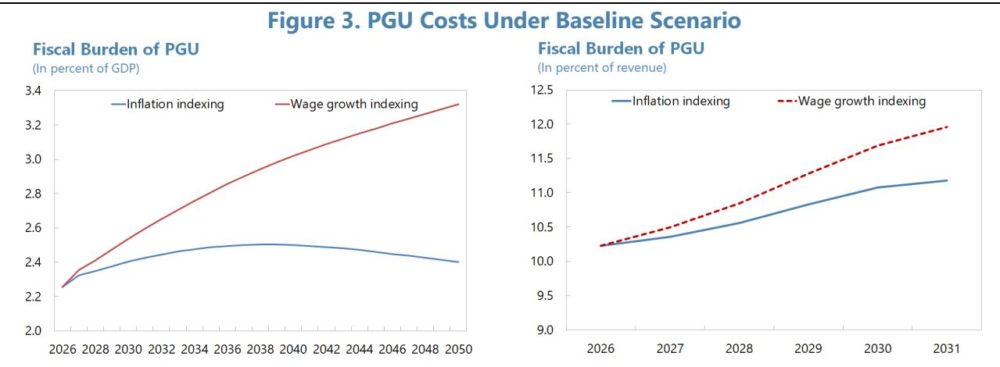  
Sources: Encuesta de Protección Social, UN World Population Prospects (2024) and IMF staff calculations.

## E. Reform Scenarios

13. With additional savings generated under the pension reform not translating into lower PGU costs, further parametric changes are needed to contain its fiscal cost. Taking as given that the nominal value of the PGU should be preserved at least by CPI indexation, two main reform options emerge to either narrow the eligibility by income or lower benefit levels for all beneficiaries. Should the PGU be indexed to wage developments, much larger offsetting parametric changes would be required. We quantify two alternative targeting approaches: one based

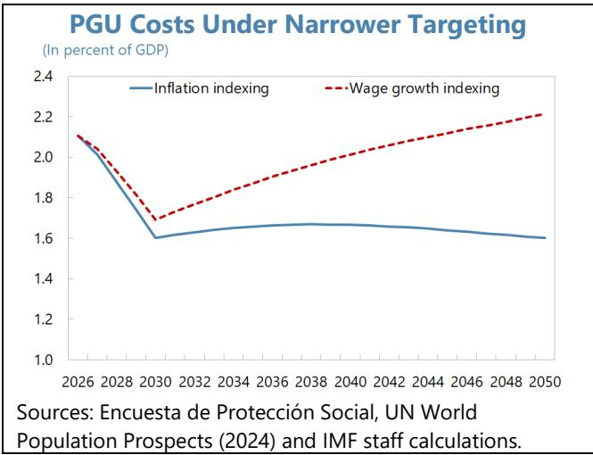

on income whereby coverage of the PGU is reduced to the bottom 60 percent of the distribution, and one based on age, in which retirement and PGU eligibility age is increased to 67 for men and women.

savings. This reform scenario considers gradually reducing eligibility from the current coverage of 90 percent of the income distribution to 60 percent over a five-year period. The 60 percent threshold is used for illustrative purposes, as it corresponds to the eligibility threshold established in 2008, under the original design of the solidarity pillar. Under this scenario, total fiscal costs of the PGU would decline markedly, reaching about 1.6 percent of GDP by 2040 or 0.8 percentage points below the baseline scenario. Fiscal gains would be even larger when the targeting is applied to a scenario in which the PGU was indexed to wage growth. With narrower targeting, PGU spending reaches about 2 percent of GDP by 2040, 1 percentage point below the scenario with 90-percent coverage.

15. Increasing the retirement age and the PGU eligibility age to 67 for both men and women would significantly reduce the fiscal burden. Such an adjustment would focus the benefits on the older cohorts. It would also allow incorporating life expectancy gains into the design of the system. According to the OECD data, in the past two decades, the health-adjusted life

increased by approximately two years, rising from 76.8 years in 2001 to 79 years in 2021. This option would affect fiscal costs via two channels. Firstly, it would directly reduce the number of recipients of PGU. It would also increase individual savings by allowing individuals to accumulate pensions through longer contribution periods, a channel particularly important for women. Our simulation shows that the total self-funded pension of women, for whom the retirement age increases from 60 to 67, would rise by around 30 percent, while for

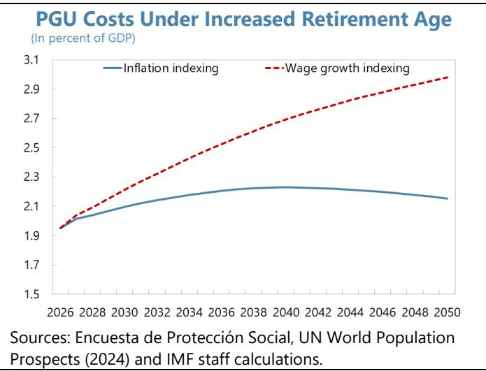

men, for whom the retirement age increases from 65 to 67, this increase would be around 13 percent. At the same time, the number of recipients of PGU would drop by about 11 percent by 2040, thereby reducing the total PGU expenditure by 0.3 percent of GDP relative to the baseline scenario.

16. While narrowing the PGU targeting would reduce the average pension, increasing the retirement age would increase it. The first option (narrower targeting) would generate fiscal savings but go along with a lower average pension since fewer public resources would be devoted to the solidarity pillar (Figure 4, left chart, dotted line). The second option (higher retirement age), on the other hand, would come with two positive effects: fiscal savings and a higher average pension over the long term (Figure 4, left chart, blue line). This is because of the longer contribution period, the higher accumulated investment returns and the shorter payout time of the PGU. Changing the retirement and PGU eligibility age would have a marginal impact on the median total pension, while narrowing targeting would not affect the median total pension.

Figure 4. Pension Evolution Under Baseline and Reform Scenarios  
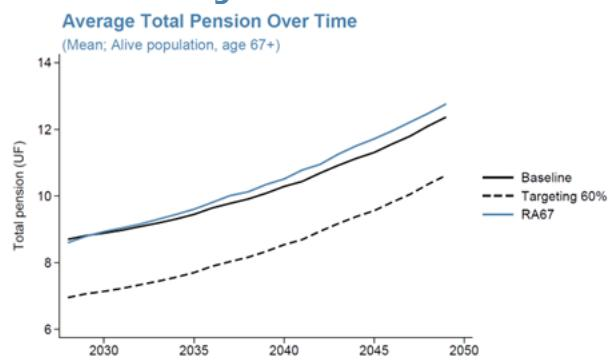

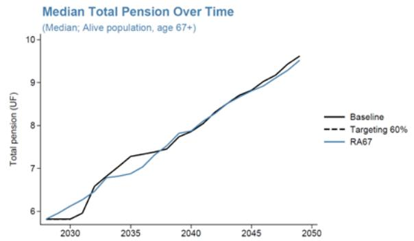  
Sources: Encuesta de Protección Social and IMF staff calculations.  
Note: The reform scenarios considered include: (i) narrowing the targeting of the PGU to the lower 60 percent of the income distribution over a five-year period; (ii) increasing the retirement age and the PGU eligibility age to 67 for both men and women.

## F. Conclusion

17. The 2025 pension reform was an important step toward improving pension adequacy, but reliance on the PGU remains high and fiscal costs are rising. This chapter examines implications for fiscal sustainability of the 2025 pension reform, focusing on the design of the PGU. Microdata analysis suggests substantial heterogeneity in pension savings at retirement, reflecting differences in earnings and contribution densities. While the PGU formally incorporates a tapered benefit structure intended to account for this heterogeneity, this taper is largely ineffective in practice, with most eligible retirees getting the full PGU benefit. Simulation analysis indicates that this feature is likely to persist over time, implying that the higher contribution rates introduced under the 2025 reform are unlikely to translate into a lower fiscal burden associated with the PGU.

18. Further parametric adjustments would help contain the fiscal burden of the PGU. This chapter has explored two options aimed at containing fiscal costs: (i) narrowing the PGU's targeting to the poorest 60 percent of the population, and (ii) targeting more elderly cohorts by increasing both retirement and PGU eligibility age to 67 for men and women in line with gains in life expectancy. Both reforms would generate sizable fiscal savings relative to the baseline. Although such reforms would also carry important distributional implications, these are beyond the scope of this chapter. The analysis also underscores the importance of the indexation regime: maintaining a prudent indexation rule that avoids catch-up to wage growth would help contain fiscal costs under both the baseline and reform scenarios. To the extent that a benefit adjustment is warranted on pension adequacy grounds, it should be implemented on a discretionary, one-off basis. An automatic wage-indexation mechanism would introduce a permanent and largely irreversible fiscal liability, further straining the long-term fiscal sustainability of the PGU.

# Annex I. Model Description

## I. Data and Sample Construction

The analysis draws on administrative records from the Encuesta de Protección Social (EPS), a longitudinal dataset of Chilean AFP affiliates containing monthly observations on taxable earnings, date of birth, sex, AFP account balances across sub-accounts A through E, and pension status. The sample is restricted to affiliates observed through December 2024 and the panel is balanced—months with no earnings record are assigned zero earnings—and all monetary variables are expressed in UF using the contemporaneous UF deflator.

## II. Earnings Schedule

Future earnings are governed by a $10 \times 5$ matrix W, where entry W[d, b] denotes the mean annual earnings in UF of workers in decile $d \in \{1, \cdots, 10\}$ and five-year age bin $b \in \{[40, 45), [45, 50), [50, 55), [55, 60), [60, 65)\}$ , computed from observed 2024 annual earnings. Deciles are assigned within each age bin via a rank-based procedure applied to 2024 annual earnings, with random tie-breaking. The matrix W is updated each year by a uniform real wage growth factor and is held constant across deciles and age bins conditional on that growth.

## III. Initial Conditions

For each individual i in the sample, the state vector at t = 0 (December 2024) consists of:

• $a_{i}(0)$ : age in years

\- $S_{i}(0)$ : total AFP balance across sub-accounts A–E, in UF

\- $d_{i}$ : earnings decile within age bin (time-invariant)

\- PAFE $_{i}$ : the Pensión autofinaciada de Referencia (reference pension), computed using regulatory parameters at the time of retirement and held constant thereafter. For workers not yet retired at t = 0, PAFE $_{i}$ = 0.

## IV. Forward Simulation

Time runs from t = 0 (year 2024) to t = T = 25 (year 2049), with one period corresponding to one calendar year.

Wage growth. The earnings schedule is updated each period at the real annual rate g:

$$
\mathbf {W} _ {t} = \mathbf {W} _ {t - 1} \times (1 + g)
$$

Survival. At each period, every surviving individual draws from a Bernoulli distribution with success probability $q_{x}(a)$ , the probability of dying over the year at age a from the CB-2020 male mortality and RV-M-2020 female mortality tables. Individuals who die are removed from the simulation for all subsequent periods.

Savings accumulation (age < 65 for males, and 60 for females). While working, the AFP account balance evolves as:

$$
S _ {i} (t + 1) = S _ {i} (t) \times R + c _ {t} \times \mathbf {W} _ {\mathrm{t}} [ d _ {i}, b (a _ {i} (t)) ]
$$

where R is the gross annual real return on savings, $c_{t}$ is the mandatory contribution rate in period t, and $b(a)$ maps current age to its five-year bin.

Retirement conversion (age = 65). Upon reaching age 65, the accumulated fund is converted into a fixed monthly pension:

$$
P _ {i} = S _ {i} / (C N U \times 1 2)
$$

where CNU is the commutation number — the present value of an annuity paying 1 UF per year — calibrated by the regulatory authority from the CB-2020 or RV-M-2020 mortality tables and the prevailing interest rate.

Post-retirement (age > 65). The pension remains constant in real terms:

$$
P _ {i} (t + 1) = P _ {i} (t)
$$

For individuals already retired at t = 0, their PAFE carries forward unchanged throughout the simulation, consistent with the regulatory definition of PAFE as a fixed reference value computed at the time of retirement.

## V. Policy Counterfactual: Contribution Rate Reform

Contribution rate to the personal account schedule:

<table><tr><td>Period t</td><td>1</td><td>2</td><td>3</td><td>4</td><td>5</td><td>6</td><td>7</td><td>8</td><td>&gt; 8</td></tr><tr><td>Post-reform</td><td>10.1%</td><td>10.1%</td><td>10.25%</td><td>11.0%</td><td>11.7%</td><td>12.4%</td><td>13.1%</td><td>13.8%</td><td>14.5%</td></tr></table>

The post-reform schedule captures a gradual phase-in of higher mandatory contributions, as legislated by the reform.

## VI. Outcome Variables

For each calendar year, among individuals aged 65 or above who are alive and receiving a positive pension, we compute the cross-sectional mean and median total monthly pension, expressed in UF.

## Parameters Table

<table><tr><td>Parameter</td><td>Symbol</td><td>Value</td><td>Source / Notes</td></tr><tr><td>Simulation horizon</td><td>T</td><td>25 years</td><td>2025–2049</td></tr><tr><td>Annual real wage growth rate</td><td>g</td><td>1.4% per year</td><td>Calibrated</td></tr><tr><td>Annual gross real return on savings</td><td>R</td><td>3.5%</td><td>Real return (all variables in UF)</td></tr><tr><td>Commutation number</td><td>CNU</td><td>15.41 for males17.56 for females</td><td>Calibrated by CMF from mortality tables and Superintendencia de Pensiones published interest rates.</td></tr><tr><td>Retirement age</td><td>—</td><td>65 for males60 for females</td><td>Current legal retirement ages</td></tr><tr><td>Base year</td><td>—</td><td>2024</td><td>Initial conditions from EPS administrative records</td></tr><tr><td>Earnings deciles</td><td>—</td><td> $10 \times 5$  matrix</td><td>Computed from 2024 EPS data, by age bin and gender</td></tr></table>

## Summary Statistics

<table><tr><td>Variable</td><td>Obs</td><td>Mean</td><td>Median</td><td>Std. Dev.</td><td>Min</td><td>Max</td></tr><tr><td>Age (years)</td><td>18004</td><td>62.25</td><td>61</td><td>13.63</td><td>40</td><td>101</td></tr><tr><td>Savings (UF)</td><td>18004</td><td>420.12</td><td>87.31</td><td>829.56</td><td>0</td><td>19767.81</td></tr><tr><td>Annual earnings (UF, age ≤ 60)</td><td>8927</td><td>215.78</td><td>97.18</td><td>276.19</td><td>0</td><td>968.24</td></tr><tr><td>PAFE (UF/month, age ≥ 65)</td><td>7043</td><td>3.11</td><td>0</td><td>6.52</td><td>0</td><td>66</td></tr><tr><td>PAFE | PAFE &gt; 0 (age ≥ 65)</td><td>2834</td><td>7.74</td><td>5</td><td>8.36</td><td>1</td><td>66</td></tr></table>

## References

Cabezon, Jose F., 2024, "Essays on the Optimal Design of Social Security and the Effect of Population Aging on Long-term Care Cost", (Princeton, NJ: Princeton University)

Evans, Christopher, and Samuel Pienknagura, 2024, “Assessing Chile’s Pension System: Challenges and Reform Options”, Economía, Vol. 23, No. 1, pp. 50-73.

Hiraki, Kazuhiro, 2026, "Pension Reform and Chilean Capital Markets", IMF Selected Issues Paper (Chapter III), International Monetary Fund.

OECD, 2025, Expanding Social Protection and Addressing Informality in Latin America (OECD Publishing, Paris).

## PUBLIC SPENDING TRENDS AND BENCHMARKING EFFICIENCY IN EDUCATION AND HEALTH SECTORS $^{1}$

This chapter examines trends in Chile's government spending over the past few decades. Using the functional government spending classification (COFOG) and applying Data Envelopment Analysis to a range of outcome indicators, it also benchmarks the efficiency of Chile's public spending in health and education—two areas that have expanded significantly in recent years. Public investment spending, on the other hand, has trended down to a historic low. The results suggest that while Chile performs relatively well in terms of spending efficiency in the health sector, there is significant scope to improve the efficiency of public spending on education. Realizing such efficiency gains would help create additional fiscal space.

## A. Introduction

1. Improving public spending efficiency is critical to alleviate pressure on public finances. Chile's fiscal position is exposed to commodity price volatility, impacting its copper and lithium-related revenues, and to structural spending pressure linked to demographic changes and growing demand for social programs. Meanwhile, fiscal buffers (including the Economic and Social Stabilization Fund FEES and cash balances) have been eroded in recent years, weakening the country's shock-absorbing capacity. Amid these challenges, improving public spending efficiency would help create fiscal space, enabling delivery of the same quality of public services at lower fiscal costs. This is particularly important at the current juncture, as the new administration aims to reduce the structural budget deficit over the next four years while also considering tax cuts.

## B. Overall Spending Trends

2. The size of total government spending in Chile is small relative to LA7 and OECD peers, and below cross-country averages for most economic spending categories. $^{2}$

\- Total public expenditure in Chile reached 26.7 percent of GDP in 2024, 10 percentage points (pps) lower than the weighted average for LA7 (Figure 1). This difference mainly reflects lower public social benefits (4.9 percent of GDP in Chile versus 10.5 percent of GDP in LA7) and the lowest level of interest payments in the region (1.2 percent against 6.3 percent of GDP). Moreover, Chile recorded the lowest public investment ratio in LA7, though this may be somewhat understated since investment executed at Chile's regional level via capital transfers is not captured under gross fixed capital formation which is the measure used here. $^{3}$ Expenditure-to-GDP ratios on employee compensation and goods and services were close to the LA7 average.

\- Conducting the same comparison against OECD countries yields consistent results. Chile's total expenditure ratio was about 14 pps below the OECD average, with its social benefits-to-GDP ratio (which excludes the mandatory social security contributions) amounting to less than one-third of the OECD average $^{4}$ and its public investment being the lowest in the group.

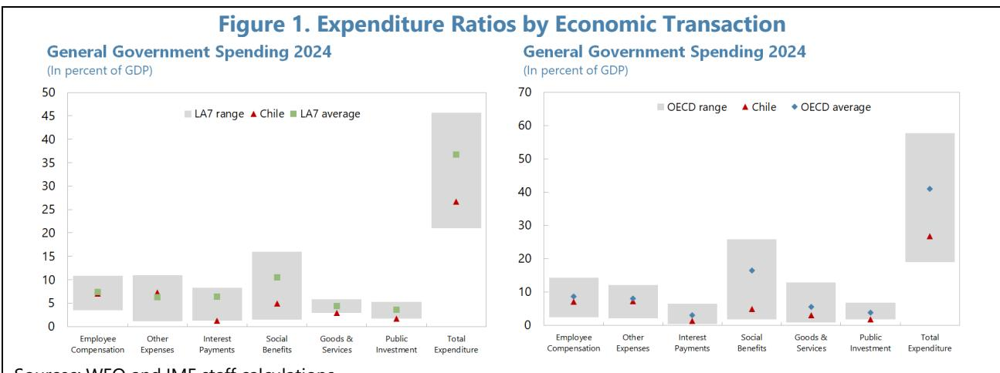  
Sources: WEO and IMF staff calculations.

Note: Averages refer to the PPP GDP weighted average of LA7 and OECD countries.

3. A longer-term perspective shows a gradual increase in Chile's size of government, at a slightly higher pace than among OECD peers. Over the past 12 years, total public spending (relative to GDP) in Chile rose by about 3.6 pps while average OECD spending inched up 1.3 pps (Figure 2). The spending category that recorded the most pronounced advancement, relative to the OECD average, was compensation for public employees. By 2024, it reached 7 percent of GDP (1.1 pps higher than in 2013), equivalent to 82 percent of the OECD average (compared to about 65 percent in 2013). This shift partly reflects sustained staffing increases over the past decade. $^{5}$ While Chile's spending trends in most other spending categories remained broadly similar to the OECD

average, its investment spending ratio steadily declined since 2015, placing Chile since 2020 at the bottom end of the OECD.

Figure 2. Selected Expenditure Categories by Economic Transaction, Chile & OECD

General Government Expenditure (In percent of GDP)

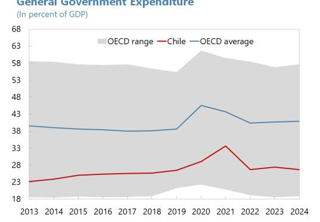  
General Government Expenditure (In USD PPP adjusted constant 2020, per capita)

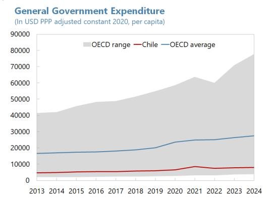  
General Government Goods and Services (In percent of GDP)

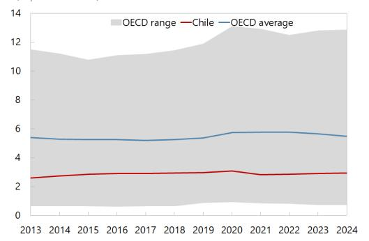  
General Government Public Investment (In percent of GDP)

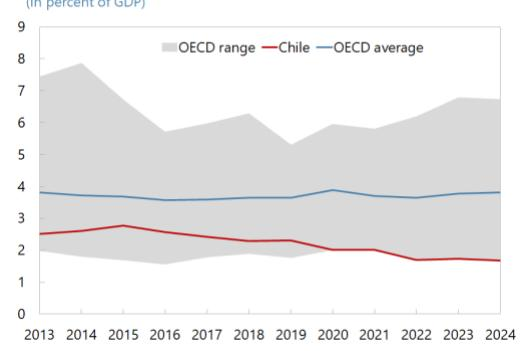  
General Government Employee Compensation (In percent of GDP)

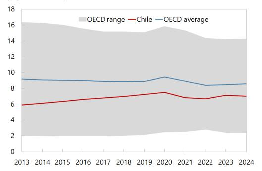  
General Government Other Expenses (In percent of GDP)

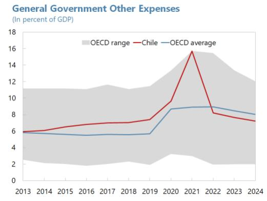  
General Government Social Benefits (In percent of GDP)

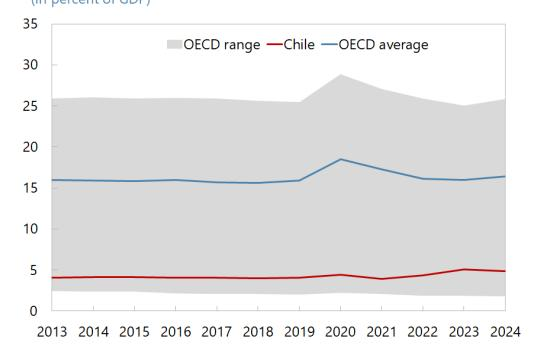  
General Government Interest Payments (In percent of GDP)  
Sources: WEO and IMF staff calculations.

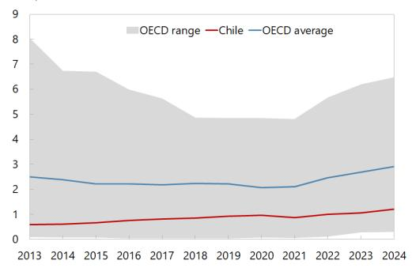  
Note: OECD average refers to the PPP GDP weighted average of OECD countries.

4. Chile's public spending-to-GDP ratios are below OECD averages across most economic functions. Data based on the Classification of the Functions of Government (COFOG) (or "sectors") reveal the sharpest difference (in percent of GDP) on social protection outlays, where Chile spent 8.6 percent of GDP in 2023 against an OECD average of 13.6 percent (Figure 3, left chart). This likely reflects the country's relatively small public sector and differences in the design of pension systems, with Chile's system primarily based on a defined-contribution, individual accounts scheme, as opposed to the pay-as-you-go publicly managed schemes that are prevalent in most OECD countries. Similarly, the General Public Services and Healthcare spending were 3.3 pps and 3.1 pps respectively below OECD peers, with the latter reflecting in part differences in the organization of the health insurance system and in the mandatory healthcare contribution rates. However, Chile's spending on Housing and Community Amenities is above OECD peers as a share of GDP.

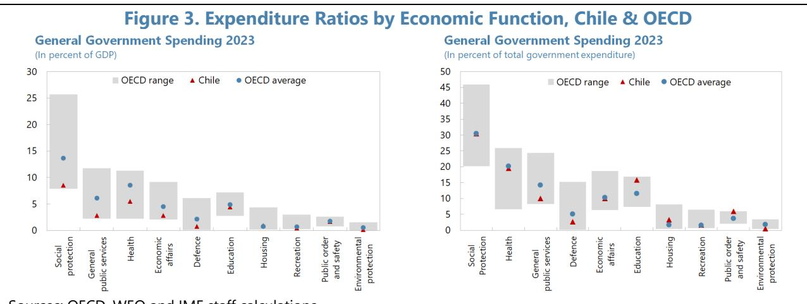  
Sources: OECD, WEO and IMF staff calculations.  
Note: OECD average refers to the PPP GDP weighted average of OECD countries.

5. Chile's public expenditure is mainly concentrated in social functions. Examining the functional or sectoral composition as a share of total government expenditure rather than GDP offers a clearer view of policy priorities as it enables abstracting from differences in government size. This analysis shows that Chile has strongly prioritized social spending over the past decade (Figure 4). In 2023, it allocated around two-thirds of total spending to social sectors (health, education and social protection), closely aligned with the OECD average. Chile's healthcare spending in particular shows a significant increase over the past decade—in line with the sustained upward drift observed for the OECD average—as reforms that expanded coverage and benefits to public healthcare services as well as population ageing and rising costs increased expenditure. $^{6}$ Chile has also consistently allocated a higher share of total expenditure to housing and community amenities compared to the OECD average, as well as to public order and safety, although this share has somewhat declined since 2019 (Figure 4).

General Public Services Expenditure (In percent of total expenditure)  
Figure 4. Expenditure Ratios by Economic Function Over Time, Chile & OECD  
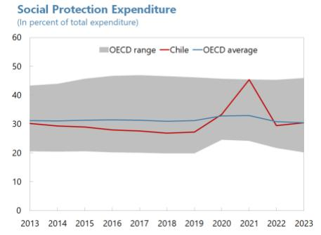  
Economic Affairs Expenditure (In percent of total expenditure)

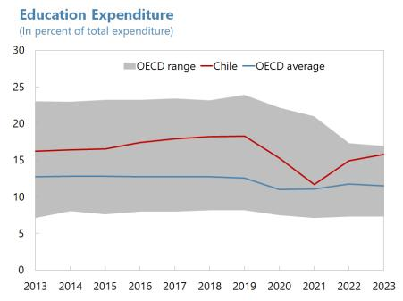

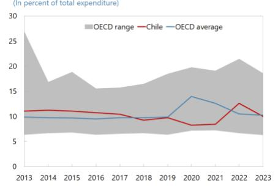

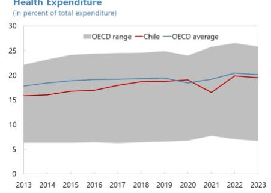

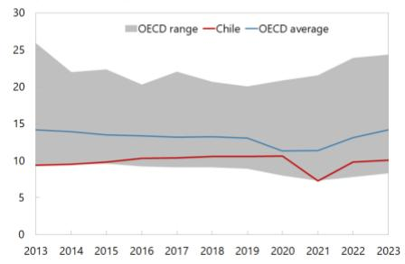  
Public Order and Safety Expenditure (In percent of total expenditure)

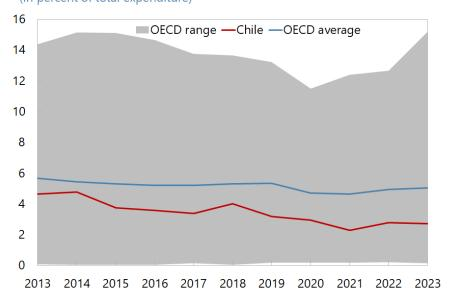  
Housing and Community Amenities Expenditure (In percent of total expenditure)

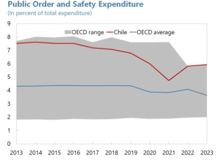  
Recreation, Culture and Religion Expenditure (In percent of total expenditure)

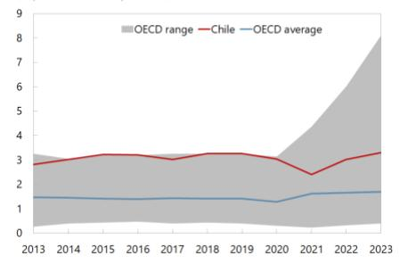  
Environmental Protection Expenditure (In percent of total expenditure)

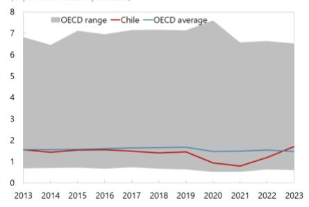  
Sources: OECD, WEO and IMF staff calculations.  
Note: OECD average refers to the PPP GDP weighted average of OECD countries.

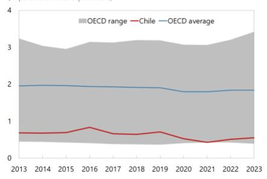

## C. Efficiency in Health and Education Spending

6. The relative efficiency of Chile's public expenditure in health and education can be assessed using Data Envelopment Analysis (DEA), with OECD economies as a reference group. Comparisons could be drawn with a relevant group of peer countries and potential public spending efficiency gaps identified using a range of indicators and DEA, a non-parametric statistical method that is widely employed to evaluate the relative efficiency of public spending across countries. This methodology consists of constructing an "efficiency frontier" that represents the maximum attainable output for a given level of input in a sample of comparator countries. The distance of a country from an efficiency frontier can be interpreted as its scope for potential efficiency gains relative to its peers. Given DEA's sensitivity to sample composition, this analysis relies on comparison with OECD countries which generally serve as aspirational peers to Chile. Public spending per capita (in purchasing power terms) is used as the primary input, with a focus on sector-specific outcomes (such as students' performance scores and life expectancy indicators) rather than outputs (such as the number of teachers or medical visits) as the former reflect more accurately the social policy objectives. One caveat of the DEA approach is that it does not control for country-specific structural characteristics that may influence the level of inputs required to achieve a given level of output. $^{7}$ This methodology is applied to healthcare and education, two sectors that have been at the forefront of the domestic policy debate regarding public spending efficiency and have been a focal point of the recent report of the Advisory Committee for Structural Reforms to Public Spending. $^{8}$ Exploring specific policy measures to address the identified efficiency gaps goes beyond the chapter's scope of the analysis.

## Health Sector

7. Chile's healthcare sector operates as a mixed system, combining both public and private provision of health services as well as financing and insurance. Health services are delivered through a public network of hospitals and primary care centers which operate alongside private clinics and providers, with primary care being administered largely through municipalities. The National Health Fund (FONASA) delivers subsidized or free public healthcare to around 80 percent of Chile's population and is financed through a 7 percent mandatory contribution of taxable income by employed individuals and pensioners and fiscal transfers. In parallel, the private insurer (ISAPRES), which covers around 13 percent of the population, allows access to private healthcare and relies on the same mandatory contribution supplemented by voluntary top-ups and co-payments. $^{9}$ Approximately 60 percent of total health spending in Chile is covered via publicly mandated schemes (OECD 2025).

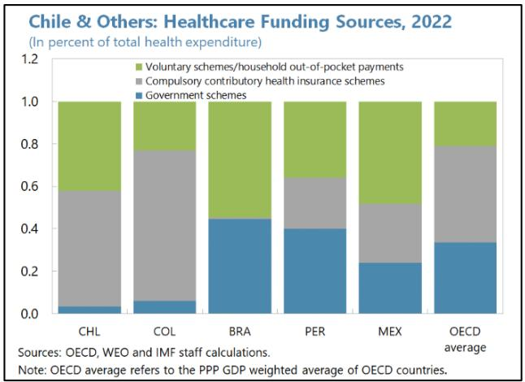

8. The Chilean public health system has been facing persistent capacity constraints. Chile has one of the highest Intensive Care Unit (ICU) occupancy rates in the OECD, with utilization at 84 percent in 2023 (Figure 5). $^{10}$ Although the gap with the OECD average has narrowed slightly post-pandemic, it remains significant (at 16 pps), pointing to relatively limited flexibility to accommodate unexpected surges in patients requiring hospitalization. Meanwhile, the country’s public hospital bed density remains low, at 1½ beds per 1,000 inhabitants, placing Chile at the lower end of OECD countries. $^{11}$ Chile also reports longer waiting times for different types of healthcare compared to OECD average, which may be linked to bed capacity deficits (OECD Health Statistics, 2025). Overall, constrained bed supply and high ICU occupancy in public hospitals indicate narrow buffers reducing the sector’s resilience amid growing health needs.

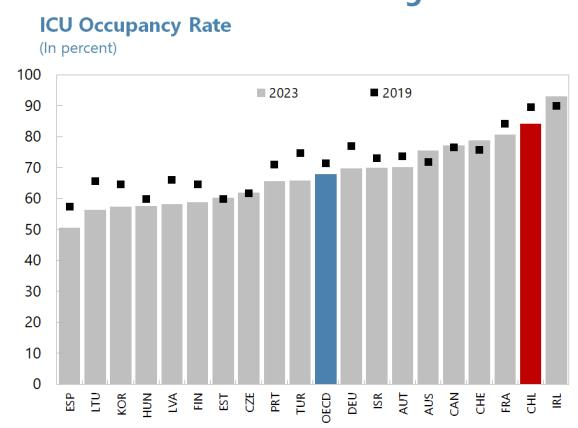  
Figure 5. Selected Healthcare Inputs  
Sources: OECD.

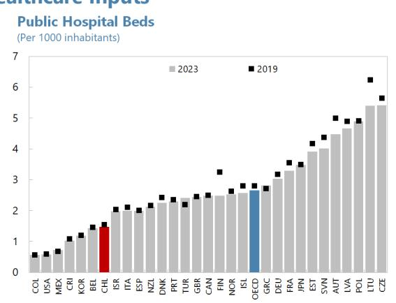  
Note: OECD averages are unweighted. The ICU occupancy rates refer to total adult ICUs. Data on ICU occupancy rate for Chile, Austria and Canada exclude private hospitals, whereas for the remaining countries coverage is either unspecified or includes private and public hospitals.

## 9. Chile generally performs well in terms of health outcomes, with significant

improvements over time. The health-adjusted life expectancy (HALE) at birth increased from 76.8 years in 2001 to 79 years in 2021, narrowing the gap against the OECD average (Figure 6). Chile also outperforms its regional peers: the LA7 average HALE declined over the past two decades from 74.5 to 73.4 years, widening Chile's relative ranking. Although infant mortality rates remain higher than in the OECD, the age-adjusted overall mortality rate, as well as preventable and treatable mortality rates are broadly in line with the OECD average. However, the perceived health status varies across socio-economic groups and by gender, pointing to significant heterogeneity in how different population groups experience their health. In 2021, only around 45 percent of same-age individuals at the bottom quintile of the income distribution reported a good health status, against 60.5 percent at the top quintile, a gap larger than the OECD average. Similarly, Chile's gender gap in perceived health exceeds that observed across the OECD, underscoring persistent inequalities in subjective health assessments.

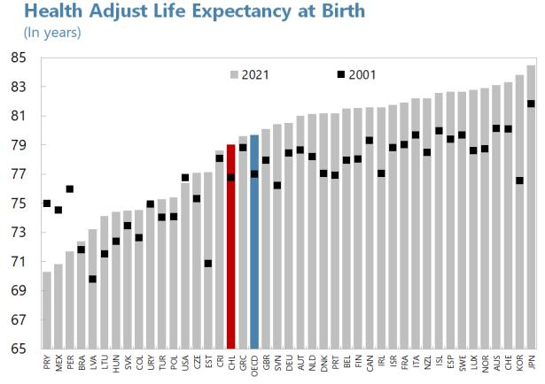

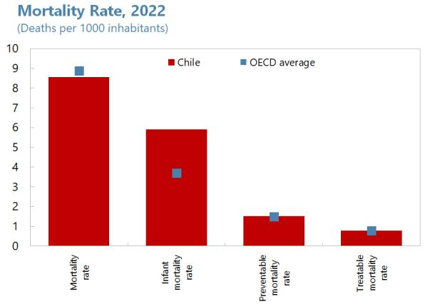

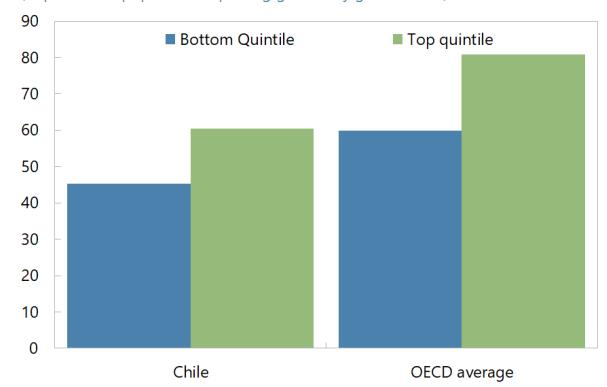

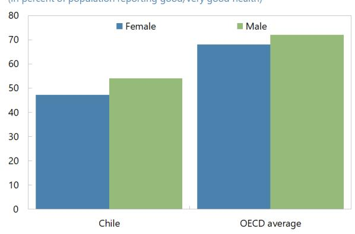  
Note: OECD averages are unweighted. Mortality rates are age-standardized to account for differences in population structures across countries.

10. Even though public spending on healthcare has increased over time, it remains relatively low compared to OECD countries. As a share of GDP, Chile's public healthcare spending increased from 3.7 percent in 2013 to 5.5 percent in 2023, in line with a similar drift in the OECD average (Figure 7). This upward trend was largely driven by higher expenditure on hospital services which accounts for the majority of public health spending in Chile. Focusing on recent years, real

Health Spending Composition (In percent GDP)

per-capita public health spending (in PPP-adjusted terms) in 2023 exceeded its pre-pandemic level only slightly.

Figure 7. Selected Public Healthcare Spending Indicators

Government Health Spending (US dollars per person, PPP constant prices 2020)

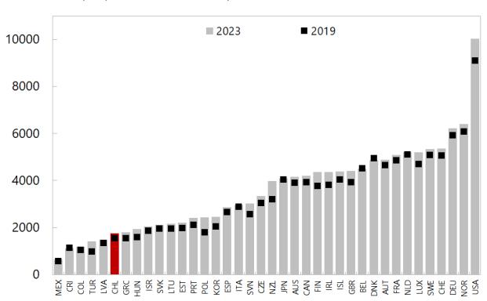  
General Government Spending on Health (In percent of GDP)

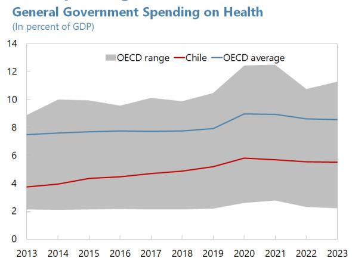  
Chile: Composition of Central Government Healthcare Expenditure (In percent of total)

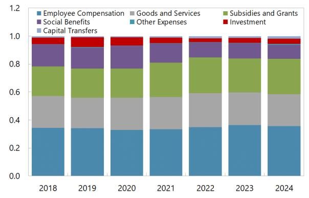

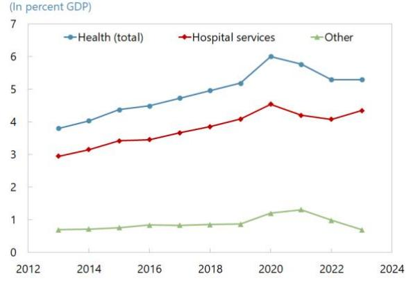  
Sources: OECD, GFS, DIPRES and IMF staff calculations.  
Note: OECD average refers to the PPP GDP weighted average of OECD countries. GFS data for Chile include spending at the central government level.

11. At the central government level, the composition of healthcare spending has remained broadly unchanged relative to pre-pandemic years in terms of economic transactions. The largest component remains employees' compensation, at 35.6 percent of total spending in 2024 (up from 34.1 percent in 2019), followed by subsidies and grants and goods and services (at 25.4 and 22.9 percent respectively in 2024). Overall, public spending (including via mandatory health insurance contribution schemes) represents approximately 60 percent of total health spending in Chile, far below the weighted OECD average of 80 percent, though comparable to other countries in the region such as Mexico and Brazil.

12. Chile's public spending on healthcare is reasonably efficient relative to peer countries but there is room for absolute efficiency gains. Using government healthcare spending per capita in PPP terms as input and health-adjusted life expectancy as well as age-adjusted mortality rate as output indicators, an efficiency frontier can be constructed from peer OECD and LA5 countries (Figure 8). As such, Chile is positioned at or close to the efficiency frontier, suggesting that relative to comparator countries with similar spending allocation, Chile manages its resources well in achieving its health outcomes. However, these results do not evaluate absolute efficiency. As shown from the upward healthcare spending trends, in Chile and elsewhere, there is a need to find absolute efficiency gains to contain spending pressure in the sector that will further rise with demographic change. $^{12}$

Figure 8. Efficiency Frontiers in the Healthcare Sector  
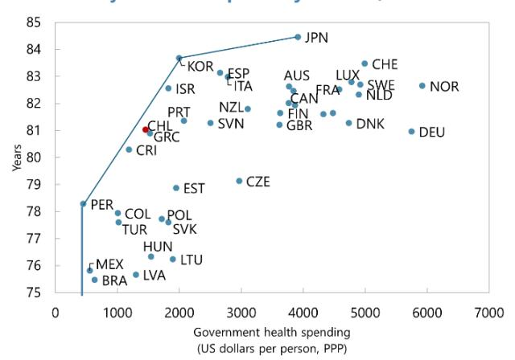

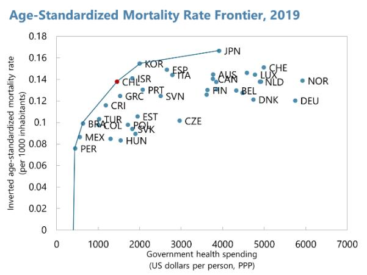  
Note: The efficiency frontier defines the maximum potential health outcome in the sample for given government healthcare spending. As it benchmarks relative performance, countries at or close to the frontier can be characterized as relatively more efficient in terms of public healthcare spending.

## Education

13. Chile's education sector comprises a mix of public, fully private, and state-subsidized private schools financed through voucher-based mechanisms. The higher education system is

likewise mixed, encompassing public and private universities as well as technical institutes and training centers. The sector has undergone several important reforms over the past decade. The School Inclusion Law (2016) phased out co-payments in subsidized private schools, mandated non-selective admissions and conversion into non-profit entities, and expanded targeted subsidies through the Preferential School Subsidy (SEP) to support students from lower-income households. In

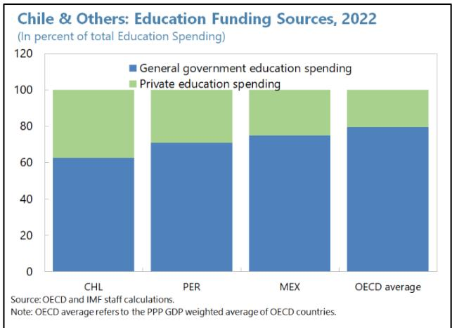

Academic Performance Inequality

Sources: OECD, PISA database and IMF staff calculations. Note: LA7 and OECD averages are unweighted.

higher education, the Gratuidad reform (2016) substantially expanded tuition-free access for eligible students, while the Local Public Education Services (SLEP) reform is gradually transferring public school management from municipalities to the central government. Based on latest OECD data for 2022, public financing accounts for roughly 80 percent of total resources for primary to post-secondary non-tertiary education and about 38 percent for tertiary education.

## 14. Chile's educational performance is above regional peers but below OECD averages.

Student performance measured by PISA scores in different test domains is higher in Chile relative to LA7 comparators (Figure 9). However, there are still significant gaps with the OECD average across all domains, with the largest divergence seen in mathematics. Educational inequality indicators are mixed; Chile recorded lower socio-economic disparities in academic performance relative to both the OECD and the LA7 averages but higher gender gaps in math performance. $^{13}$

Figure 9. Selected Education Outcomes  
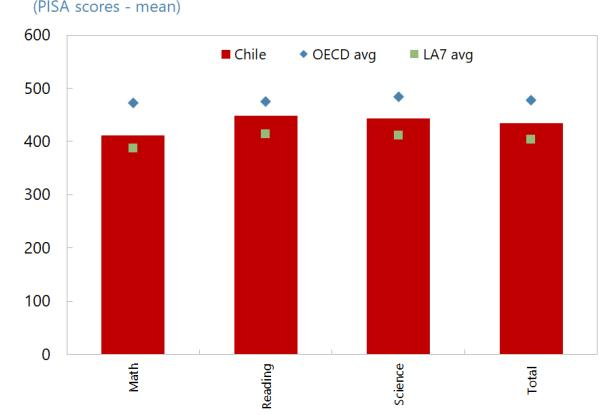

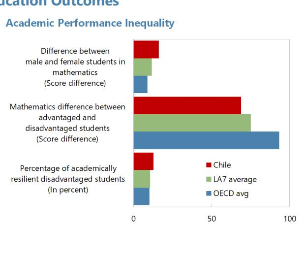

15. Chile's level of public education spending is similar to the OECD average when measured relative to GDP. Over the past decade, government education expenditure increased from 3.8 percent of GDP to 4.5 percent in 2023, approaching the OECD average of 4.9 percent (Figure 10). $^{14}$ While Chile ranks at the lower end of the OECD distribution across different education levels (primary to post-secondary non-tertiary and tertiary) when assessed in terms of spending per-student (PPP-adjusted), this largely reflects differences in income levels. Examining spending-to-GDP ratios to adjust for country income heterogeneity, Chile's public spending on primary to post-

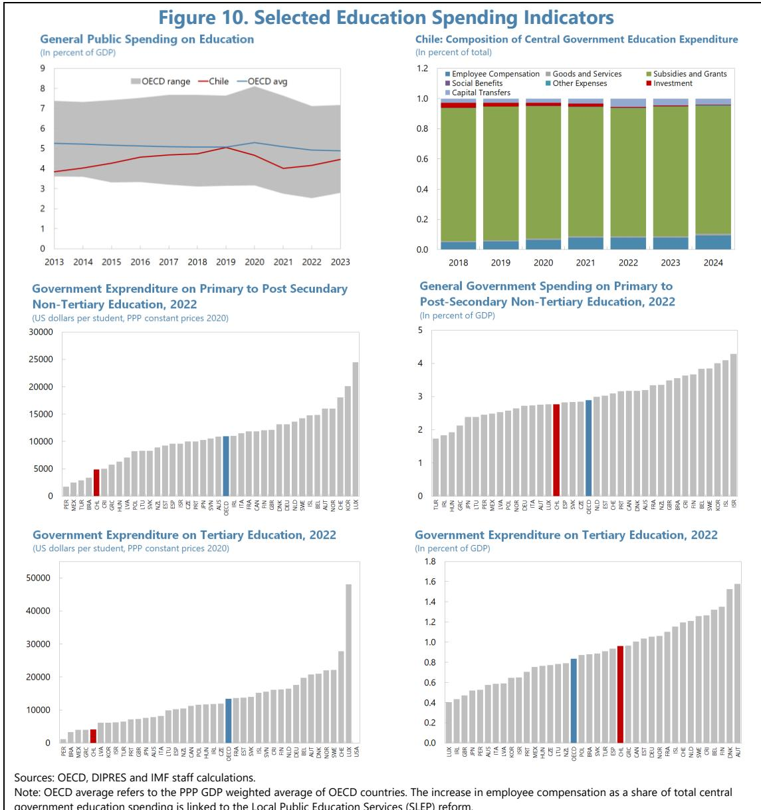  
Figure 10. Selected Education Spending Indicators  
Government Expenditure on Tertiary Education, 2022 (US dollars per student, PPP constant prices 2020)  
Government Expenditure on Primary to Post Secundary Non-Tertiary Education, 2022
(US dollars per student, PPP constant prices 2020)  
General Government Spending on Primary to Post-Secondary Non-Tertiary Education, 2022 (In percent of GDP)

secondary education was close to the OECD average in 2022, while tertiary education spending even exceeded it.

16. Central government expenditure in education has remained heavily concentrated in subsidies and grants, accounting for roughly 85 percent of total spending in 2024. $^{15}$ The transfer of education service provision from municipalities to the central government under the Local Public Education Services (SLEP) reform explains the increase in the wage bill from 4.8 percent to 9.3 percent of total education expenditure at the central government level. By contrast, the share of capital spending in education contracted over the same period from 3.3 percent to just 0.5 percent of total central government education spending.

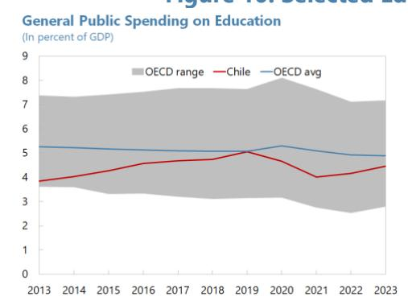

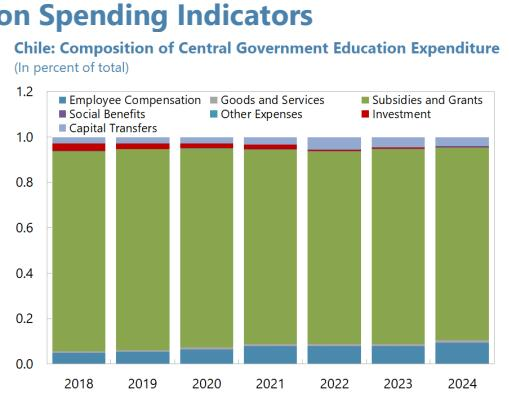

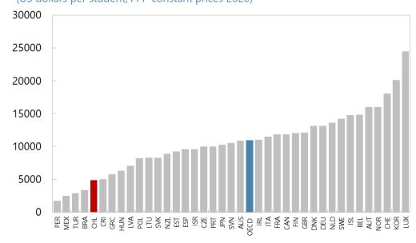

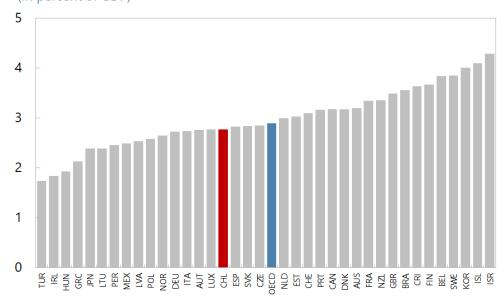

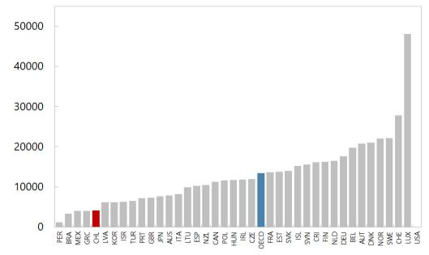

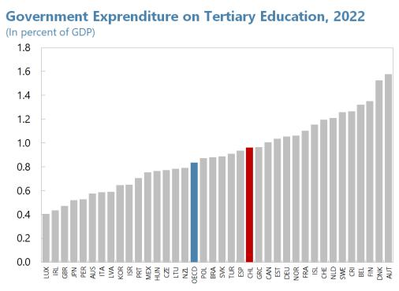  
Note: OECD average refers to the PPP GDP weighted average of OECD countries. The increase in employee compensation as a share of total central government education spending is linked to the Local Public Education Services (SLEP) reform.

$^{15}$ A breakdown of education spending by economic classification is only available at the central government level and not for the general government.

17. Compared to OECD peers, Chile operates below the spending efficiency frontier in education and has scope to raise the efficiency of its public education spending. Mapping student performance indicators measured by latest PISA scores and different input measures (government spending as a share of GDP and in PPP-adjusted dollar terms per student) suggests that Chile lags behind peer countries at the frontier (Figure 11). The distance from the efficiency frontier highlights significant scope for achieving the same performance outcomes at a lower fiscal cost. Challenges extend also to the tertiary education sector. Despite relatively high public spending, Chile has persistently low scores in adults' proficiency in literacy, numeracy, and problem solving, ranking last among OECD countries in the 2023 Survey of Adult Skills (OECD, 2024) with evidence also pointing to persistent qualification and skill mismatches (Sevilla 2020, OECD 2024).

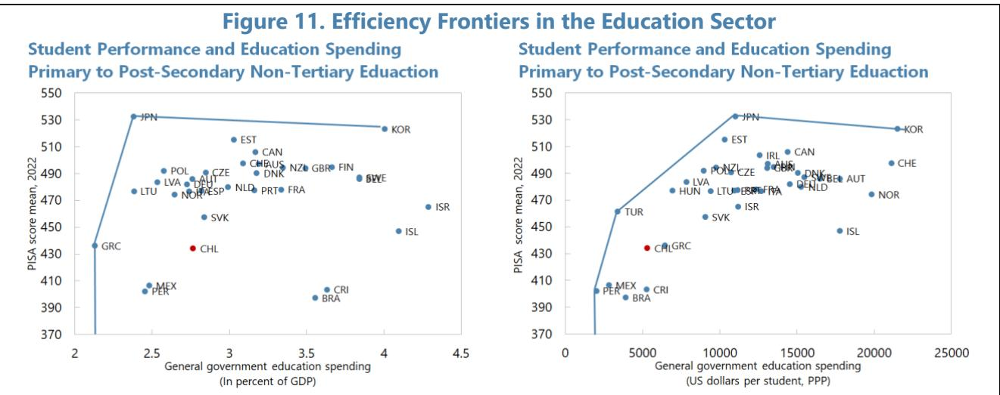  
Sources: OECD, Pisa database and IMF staff calculations.

Note: The efficiency frontier defines the maximum potential education outcome in the sample for given government education spending. As it benchmarks relative performance, countries at or close to the frontier can be characterized as relatively more efficient in terms of public education spending.

## D. Conclusion

18. Chile's total public spending remains relatively small compared with OECD countries across most economic and functional categories, despite a gradual upward trend. The composition of spending continues to be heavily concentrated in social sectors, including health, education, and social protection. By contrast, public investment has declined over time and currently stands at historically low levels, though this may be somewhat understated since not all investment executed at Chile's regional level is fully captured under the measure employed.

19. Improving the efficiency of public spending represents an important avenue for creating additional fiscal space. This paper's benchmarking exercise against international peers on the efficiency of healthcare and education sectors finds that Chile performs comparatively well in the health sector while there is significant potential to enhance the efficiency of education spending. At the same time, recent expert assessments have demonstrated that, even in sectors where Chile

performs relatively well, there remains scope for absolute efficiency gains. $^{16}$ Realizing these relative and absolute efficiency gains would strengthen the value for money of public spending, alleviating fiscal pressures while preserving the quality of public services in the face of growing structural demands.

## References

Budget Office, 2025, Advisory Commission on Structural Reforms on Public Expenditure Final Report (Santiago).

Centre for Public Studies, 2025, En busca de espacio fiscal: líneas de acción para contener y priorizar el gasto público (Santiago).

OECD, 2025, Health at a Glance 2025: OECD Indicators (OECD Publishing, Paris).

OECD, 2025, Education at a Glance 2025: OECD Indicators (OECD Publishing, Paris).

OECD, 2024, Do adults have the skills they need to thrive in a changing world? Survey of Adult Skills 2023 (OECD Publishing, Paris).

OECD, 2024, Survey of Adult Skills – Country Note: Chile (OECD Publishing, Paris).

National Institute for Health and Care Excellence NICE, 2018, Bed Occupancy in emergency and acute medical care (UK).

Sevilla, Maria P., and Farias Mauricio, 2020, Labour market mismatch in emerging countries: the case of Chile, Compare: A Journal of Comparative and International Education, Vo. 50, Issue 2, pp. 276-293.

## PENSION REFORM AND CHILEAN CAPITAL MARKETS $^{1}$

The Chilean pension reform law enacted in 2025 introduced several changes affecting the pension fund sector. From a financial stability perspective, the planned transition to a generational fund system poses a key implementation challenge, as it could trigger sizable asset reallocations across major asset classes. This paper examines the potential magnitude of these shifts under various example glide paths (age-based asset allocation schedules). While outcomes vary notably across glide paths, a gradual transition process that prioritizes smooth adjustment of asset allocation is essential to minimize market impact regardless of glide-path design.

## A. Introduction

1. The Chilean pension fund sector is large and plays a key role in the capital markets as a major long-term investor. Reflecting its long history as a defined-contribution mandatory self-funded pension system established in 1981, the pension fund sector is one of the largest among Latin American and emerging economy peers. The pension fund assets-to-GDP ratio stood at nearly 70 percent in 2025-Q3. $^{2}$ The sizable pension fund sector has served as a long-term funding source for the government, banks, and non-financial firms (see e.g., BCCh 2025).

Pension assets-to-GDP (In percent of the GDP)

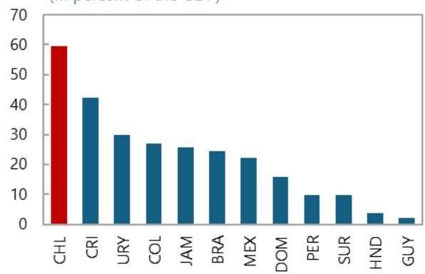  
Sources: OECD and IMF staff calculations.
Note: As of end-2024.

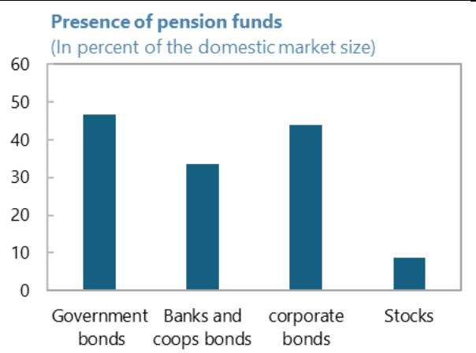  
Sources: BCCh, SP, and IMF staff calculations.
Note: As of September 2025. The values for the three bond segments are the pension funds' domestic bond holdings to the stock of the respective domestic bonds. The value for "stocks" the pension funds' domestic equity holdings to the total market capitalization of the Santiago Stock Exchange.

2. The 2025 pension reform introduces several key changes to the pension system and pension fund industry with implications to capital markets. These changes include (i) a gradual increase of contribution rate to the mandatory individual pension account from 10 percent of taxable income to 14.5 percent by 2033, $^{3}$ (ii) a transition of the pension fund system from the multi-fund system to a generational fund system, (iii) the introduction of competition-enhancing mechanisms among pension fund administrators (AFPs after the Spanish acronym), and (iv) the creation of a public autonomous fund, FAPP (Fondo Autónomo de Protección Previsional), that administers, among others, newly created pension benefits (Annex I).

3. Even though the current pension reform will deepen capital markets in the long run, its implementation could entail various challenges in the short term. The accumulation of pension assets will raise the pension fund assets-to-GDP ratio beyond its pre-pandemic level, but multiple near-term challenges arise in the design and implementation phases. First and foremost, depending on the design of the transition to the generational fund system, it may induce large portfolio reallocations across major asset classes, with financial stability implications if abrupt adjustment in asset prices occurred and impacted funding of local bond issuers. Second, while the introduction of competition-enhancing mechanisms among AFPs should lower commission fees, discipline AFPs investment performance, and benefit pension affiliates, it could have unintended consequences on AFPs' risk-taking behavior. Third, the timing of the introduction of the new competition-enhancing mechanisms could complicate the adjustment process of asset allocations toward the generational fund system as both occur simultaneously.

4. This chapter examines the implication of the reform on capital markets, focusing on the size of asset reallocations due to the transition to the generational fund system. $^{4}$ After providing in Section B an overview of the institutional setup of the multi-fund system and the generational fund system, Section C estimates the magnitude of asset reallocations under various example glide paths (age-based asset allocation schedules under the generational fund) for the generational fund system. Section D discusses various reform elements that may affect behaviors of pension funds during the transition process. Section E concludes by summarizing policy implications.

## B. Overview of the Two Pension Fund Systems

## Multi-fund System

5. In the Chilean pension system, private pension fund administrators manage assets under the mandatory contributory pension accounts. Currently, there are seven AFPs, among which pension affiliates can freely choose. $^{5}$ They can also freely switch between AFPs, but in practice this movement between AFPs has not been that prevalent. This AFP-based structure will remain unchanged under the new generational fund system.

6. Since 2002, the contributory pension fund system has operated under a multi-fund system. Each AFP provides five types of funds ranging in their riskiness from the "Most Risky" Type A fund to "Most Conservative" Type E fund. Affiliates can allocate their pension balance to up to two types of funds. Investment limits by asset classes are differentiated by the multi-fund type (e.g., the limit of the risky asset weight is 80 percent for Type A, while it is 5 percent for Type E). Accordingly, asset allocations of the five multi-funds differ substantially. $^{6}$

7. The multi-fund system was aimed at enhancing long-term investment performance, while giving affiliates flexibility to reflect their individual risk preferences. As discussed later, the life-cycle optimal portfolio theory suggests that younger generations should invest their financial wealth heavily in riskier assets, gradually shifting allocations toward less risky ones as they get older. The multi-fund system partially implements this idea, as it allows affiliates to follow a life-cycle portfolio strategy by starting from a relatively riskier fund type and gradually shifting the fund type to less risky ones. At the same time, the flexibility of the multi-fund system enables pension affiliates to choose the multi-fund type that best fits their individual preference. To support this, affiliates can switch between multi-funds within the same AFP without fees at least twice a year.

8. However, there is growing evidence of the shortcomings of the multi-fund system. While the flexibility of the multi-fund system may be beneficial for well-informed affiliates with high financial literacy, this flexibility could also invite undesirable behavioral issues. One such example is the excessive switching problem. In 2020, the cumulative volume of multi-fund type switches was equivalent to about 80 percent of the total pension fund assets. Moreover, most of these switches occurred between types A and E, the two extreme fund types, which was difficult to rationalize by changes in individual risk preference (Fuentes, Salvo, and Hernández, 2022). Indeed, these switches were intended to time the market, encouraged by unregulated online financial advisors. $^{7}$ This excessive switching is problematic both for pension affiliates' individual welfare and financial stability. Fuentes, Salvo, and Hernández (2022) also document that about three quarters of affiliates who switched the fund experienced worse performance compared to the benchmark. Abrupt fund outflows from Type E funds could lead to dislocations in bank and corporate bond funding (IMF, 2021), while foreign exchange flows associated with fund switching had an impact on frictions in foreign exchange markets (e.g., Aldunate et al., 2025).

9. Asset allocations under the multi-fund system exhibit a mild shift from risky assets to safer assets as affiliates age. The most popular fund type (in terms of asset under management)

evolves from Type B for affiliates under 40 years old, to Type C for affiliates in their 40s and 50s, and then to Type D for those in their 60s and older, with significant heterogeneity in the fund type choice in most age cohorts. As a result, asset allocations by age cohort have exhibited a mild shift toward conservative ones over time. This is another motivation for the transition to the generational fund system: long-term investment performance could be improved by applying the optimal life-cycle portfolio theory and better align portfolio allocations and duration with investment horizon. Note that, as affiliates gradually accumulate pension account balances toward retirement, pension assets under management are the largest for the age cohort between the ages of 55 and 59. $^{8}$

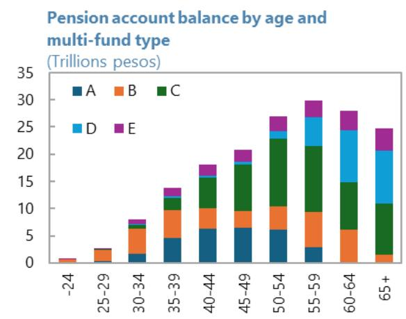  
Sources: SP and IMF staff calculations.
Notes: This chart shows an estimated pension account balance distributions by age cohort and fund type based on the randomly sampled five percent of individual records for June 2024.

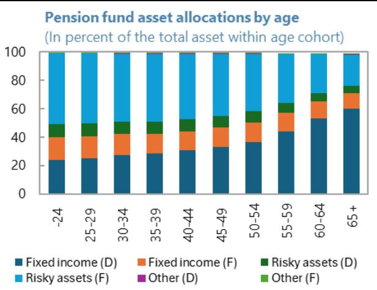  
Notes: This chart shows an estimated portfolio allocations by age based on the 5 percent random sampling of individual records for June 2024. "D" and "F" in the parentheses in the legend denotes "Domestic" and "Foreign", respectively.

## Generational Fund System

10. Under a generational fund system, AFPs will provide target-date funds (TDFs). A TDF is a type of retirement fund initially developed in the US and are distinguished by their target retirement year and a glide path, an age-based schedule of portfolio allocations. TDFs provide an automatic adjustment of portfolio allocations over a life cycle, consistent with the target retirement year. Typically, investors are organized into age brackets. For example, in the Mexican generational fund system, there are ten generational funds with five-year bracket ranges. In Chile, the pension reform law stipulates that there must be at least ten generational funds. Given this requirement, this chapter considers ten age cohorts for subsequent analysis: affiliates at or younger than ages 24, 25-29, 30-34, ..., 60-64, affiliates at or older than 65. $^{9}$

11. TDFs have become more popular globally both in private pension fund industry and among public pension systems. In the US, TDFs started to grow after they were designated as Qualified Default Investment Alternatives in the U.S. 401(k) plans in 2006, with asset under management (AUM) in TDFs reaching USD 1.8 trillion in 2021 (Mao and Wong, 2025). Several Latin American countries adopted or are considering adopting a TDF-style pension fund system within their public pension systems. The first such country was Mexico, which transitioned from a multi-fund system to a TDF-style generational fund system in 2019. Costa Rica also approved the transition to a generational fund system, although its implementation is currently pending. Colombia enacted a law to transition to a generational fund system, while Peru is currently discussing and evaluating the transition. Chile is the second Latin American country to implement the transition to a generational fund system, with its case being particularly important and challenging given its large size of the pension fund sector.

12. The automatic adjustment feature of TDFs is expected to resolve issues found in a multi-fund system. As pension affiliates no longer need to choose fund types, a generational fund system resolves the excessive switching issue of a multi-fund system. Moreover, as TDFs' glide paths are designed by considering life-cycle optimal portfolio allocations, it would be expected to enhance investment performance over the long run. For instance, FIAP (2025) notes that the transition to a generational fund system enabled pension funds to increase risky asset weights by three percentage points, and the preliminary result suggests that the investment return improved more than 100 basis points, contributing to improving the replacement rate.

13. The Pension Supervisor is currently designing the reference glide path and an investment regime for generational funds. Per reform law, the Pension Supervisor is required to publish the reference glide path by September 2026. Its design is a crucial element that determines the long-term investment performance under the generational fund system as well as the size of asset reallocations due to the transition from the multi-fund system, which is important from a financial stability perspective.

## C. Estimating the Size of Asset Reallocations Due to the Transition

14. The design of the reference glide path faces a trade-off between the optimality of life cycle investment strategies and market impact due to asset reallocations. If implementation of

\- Fixed income (D) - Fixed income (F) - Risky assets (D)
- Risky assets (F) - Others

the theoretically optimal glide path results in aggregate asset allocations that are quite different from the current allocations, there would be large asset reallocations which could result in market disruptions. To this end, the Pension Supervisor has clarified that it would carefully consider both objectives in this trade-off in developing the reference glide path.

15. Considering this trade-off, this chapter employs three approaches to produce example glide paths. The first approach is the status quo that would prioritize the mitigation of the market impact as the glide paths would not cause asset reallocations at the aggregate level. The second approach is a multi-fund-based approach, where glide paths are constructed based on the current allocations of the five multi-funds. The third approach employs a standard life-cycle optimal portfolio model, which exclusively focuses on the optimality of investment strategies without considering the current allocations.

16. The analytical results can help understand the implications of the transition for financial stability and welfare of the pension affiliates. In addition to the potential size of asset reallocations, model-based exercises can provide useful inputs on the sensitive of key parameters and the specifics of the Chilean pension system. However, this exercise does not intend to recommend any specific glide path as optimal. Designating one reference glide path for heterogeneous affiliates would require a holistic review of the characteristics of Chilean pension affiliates and professional judgement as well as judgement on trade-offs between the optimality and mitigation of market impact. Such decisions lie outside the scope of this model-based analysis.

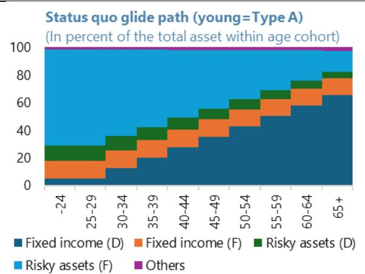  
Sources: SP and IMF staff calculations.
Notes: This glide path keeps the aggregate asset allocations unchanged vis-à-vis the average allocation in 2024. The allocations for affiliates under age 30 is equal to the average allocation of the Type A multi-fund in 2024.

## Status Quo Approach

17. Status quo glide paths can be viewed as benchmark paths to avoid market impact. To construct these status quo glide paths, two assumptions are imposed: (i) a linear glide path is assumed for the intermediate age cohorts, and (ii) the asset allocation of the youngest cohorts (those under age 30) is given as

<table><tr><td colspan="5">Asset allocations for the 65+ age cohort(In percent of the total assets)</td></tr><tr><td></td><td>Status quo(Young =A)</td><td>Status quo(Young =B)</td><td>Type D MF(2024 avg)</td><td>Aggregate(2024 avg)</td></tr><tr><td>Fixed income (D)</td><td>65.3</td><td>55.4</td><td>65.2</td><td>59.9</td></tr><tr><td>Fixed income (F)</td><td>12.3</td><td>10.3</td><td>11.7</td><td>10.9</td></tr><tr><td>Risky assets (D)</td><td>1.9</td><td>4.8</td><td>5.6</td><td>5.3</td></tr><tr><td>Risky assets (F)</td><td>15.4</td><td>26.5</td><td>14.8</td><td>21.8</td></tr><tr><td colspan="5">Sources: SP and IMF staff calculations.Notes: The columns &quot;Status quo (Young=A)&quot; and &quot;Status quo (Young=B)&quot; report the allocation of the status quo glide path by assuming that the allocations for affiliates under age 30 is Type A (Type B) multi-fund and the glide path linearly changes to the allocation of the 65+ age cohort.</td></tr></table>

either the current Type A or Type B multi-fund. Then, one could pin down status quo glide paths by choosing the allocation for the oldest 65+ cohort. When the youngest cohort allocation equals the

Type A allocation, the oldest cohort should allocate about 65 percent of their pension balance on domestic fixed income assets, 15 percent on foreign risky assets, and 12 percent on foreign fixed income assets. This allocation resembles the allocation of the Type D fund. Therefore, if the glide path is more aggressive (conservative) than this path, it would imply a shift of allocations from fixed income assets (risky assets) to risky assets (fixed income assets).

## Multi-fund-Based Glide Paths

18. The second approach utilizes the current portfolio allocations of the five multi-funds. As discussed above, the multi-fund system partly incorporates the idea of an optimal life-cycle portfolio theory. Therefore, constructing example glide paths based on the allocations of the multi-funds may be a reasonable way to bridge the multi-fund system and the generational fund system.

19. The first example of this approach, the default multi-fund option path, is constructed based on the default fund choice under the multi-fund system. The multi-fund system designates the default multi-fund option for new pension affiliates who do not have a specific preference on the choice of a multi-fund. The default choice is determined based on age and gender: Type B for men and women below age 35, Type C for men between 35 and 54 and women between 35 and 49, and Type D for men at or above 55 and women at or above 50. In other words, this example glide path reveals the aggregate asset allocation under a hypothetical situation where all pension affiliates choose their age-gender-based default fund choice.

20. The default multi-fund option glide path will cause a large shift from foreign risky assets to domestic fixed income assets. As the default multi-fund option spans only three fund types from Types B to D, this example glide path looks coarse (Figure 1, left column). $^{10}$ The estimation result suggests that the weight on foreign risky assets will drop by about 12 percentage points of total assets, while that on domestic fixed income assets will increase by about 14 percentage points. An alternative glide path, which evolves from the Type A to Type E allocations, yields a qualitatively similar result, although this glide path exhibits a much steeper slope (Figure 1, right column). Note that this alternative result is also similar to the estimation by Scotiabank (2024), reflecting the similarity in the estimation approach.

## Model-based Glide Paths

21. The third approach employs a standard life-cycle optimal portfolio model. Specifically, it follows the seminal paper by Cocco, Gomes, and Maenhout (2005) (henceforth CGM, see Annex II for details of the model). The CGM model assumes two financial assets, a riskless bond and a risky asset, and derives optimal asset allocation weights. The investor earns labor income, which is subject to income shocks. Under this setup, the model solves the optimal glide path (i.e., the age-dependent path of the risky asset weight) based on optimization of the expected life-time utility. The model

incorporates key parameters such as risk aversion, correlation between income risk and risky asset returns, and social security benefits after retirement.

## 22. Life-cycle optimal portfolio models tend to recommend large allocations weights on

the risky asset during younger-age periods. The intuition behind this result is as follows: In a simple mean-variance portfolio model, the optimal risky asset allocation for a constant relative risk-aversion investor does not depend on the level of the wealth and is given by $(\mu - r_{f})/(\gamma\sigma^{2})$ , that is, the optimal risky asset weight is proportional to the expected excess risky asset return $(\mu - r_{f})$ and inversely proportional to the variance of the risky asset return $(\sigma^{2})$ and the relative risk aversion parameter $(\gamma)$ . Life-cycle portfolio models extend this result by considering “human capital.”

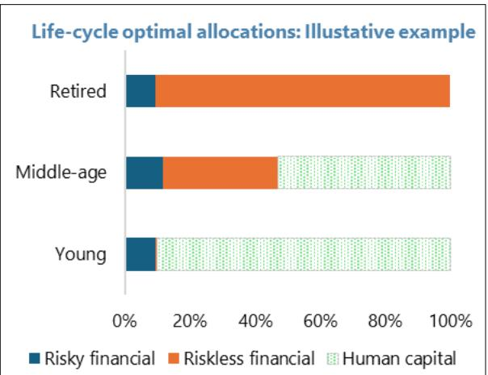

Although it is not a financial asset, human capital should be considered as a part of the investor's wealth as it yields a stream of cashflows (i.e., labor income) like fixed income assets. In fact, the literature shows that the ratio of the optimal risky asset allocation to total wealth (the sum of the financial wealth and the present value of the human capital) should equal the optimal mean-variance weight if there is no labor income risk (e.g., Merton, 1971; Jagannathan and Kocherlakota, 1996; CGM).

Figure 1. Asset Reallocations under the Multi-fund-based Example Glide Paths  
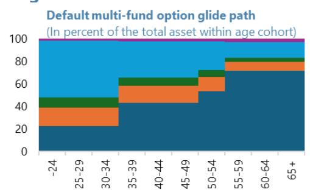

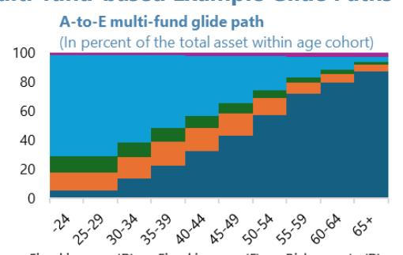

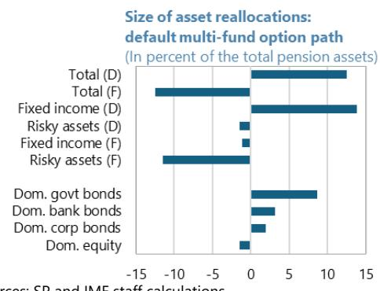

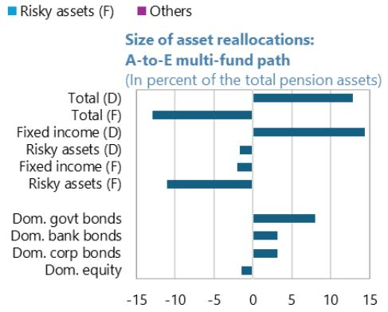  
Notes: The estimation is based on the average allocations in 2024, combined with the estimated pension account balance by cohort in June 2024. "D" and "F" in the parentheses in the legends denote "Domestic" and "Foreign," respectively.

23. The model is calibrated to reflect the institutional setting of the Chilean pension system as well as its financial market and labor market data. The baseline calibration is deliberately kept simple for tractability, and the baseline estimation is supplemented by various alternative specifications to highlight the sensitivity of the result to key parameters as well as Chile-specific institutional arrangements. See Annex II for the details of this calibration.

24. The baseline estimation result suggests a mild shift from domestic fixed income assets to (mainly foreign) risky assets. The median worker fully invests their financial wealth in the risky asset up to age 31 (Figure 1, left column). Then the optimal risky asset weight decreases as the investor ages, reaching 32 percent at retirement (age 65). The risky asset weight decreases over time because the proportion of human capital in the total wealth decreases as the investor accumulates financial wealth and approaches retirement. However, the risky asset weight stays above the "complete market case," which corresponds to the simple mean-variance portfolio solution, even during the retirement period. This reflects the fact that retired investors still earn social security benefits that constitute non-financial income. To estimate the size of asset reallocations for the four major asset classes, the estimated path of the optimal risky asset weight is mapped to the glide path by assuming that the ratio of domestic to foreign asset allocations within the risky asset and fixed income asset categories remains the same as in 2024. $^{11}$ This glide path suggests a mild shift from domestic fixed income assets to mainly foreign risky assets: the weight on domestic fixed income assets decreases by 2.1 percent of the total pension asset, while that on foreign risky assets increases by 2.5 percent.

## 25. Estimations based on alternative specifications yield the following results:

\- Social security income after retirement. For the baseline estimation, social security income after retirement is assumed to be a constant fraction of the income level at retirement regardless of the income level. While this specification follows the CGM model, it does not align with the Chilean social security framework as the tax-funded first pillar of the pension system provides a constant peso amount of pension benefits, called the Minimum Guaranteed Pension (PGU), for most pensioners. As a result, the replacement rate of the PGU is larger (and can be even above 100 percent) for lower income groups and lower for higher income groups. To reflect this institutional arrangement in the analysis, the model is re-estimated by replacing the retirement income function with a constant function (Figure 1, right column). Interestingly, the estimated optimal risky weight path is above the baseline during younger periods whereas it is below the baseline path during later stages of life. This result can be interpreted as follows: For younger workers, the insurance effect of the PGU is larger as they face greater income risks. In other words, the expected replacement rate of the PGU for younger workers is high because longer remaining working period makes it more likely for them to be hit by negative income shocks.

This higher expected replacement rate encourages them to invest more in the risky asset. This insurance effect diminishes for the median worker as they age, eventually facing a lower replacement rate of the PGU. This explains a lower risky asset weight during the later stage. Overall, the size of asset reallocations at the aggregate level is slightly larger outflows from domestic fixed income assets at 4.3 percent of the total pension asset.

\- Risk-return profile of the risky asset. For the baseline estimation, the risk premium (expected excess return) and the volatility of the risky asset are calibrated to the historical average of the Santiago Stock Exchange's blue-chip IPSA index during 2016 and 2025. However, the Chilean pension funds invest more on foreign risky assets such as the S&P 500 index than domestic equities. To examine the extent to which the risk-return profile of the risky asset affects the estimation result, an alternative setting is examined by replacing the excess return and volatility of the risky asset with those of the S&P 500 with partially hedged exchange rate risk (Figure 1, left panel). The result suggests more allocations on the risky asset throughout life, reflecting the improved risk-return profile even after considering the additional risk related to the exchange rate (the Sharpe ratio is 0.183 under the baseline versus 0.304 under the alternative). Accordingly, the shift from domestic fixed income assets to foreign risky assets will be more pronounced compared to the baseline—the outflow from domestic fixed income assets is estimated to be -12.4 percent of the total pension asset.

\- Relative risk aversion parameter. When the relative risk-aversion parameter—one of the most influential parameters—is changed from the baseline value of $\gamma = 5$ to a less risk-averse level of $\gamma = 3$ , the glide path dramatically shifts to an aggressive strategy—the median worker fully invests in the risky asset up to age 46 and the risky asset weight stays above 50 percent throughout the life cycle (Figure 2, right column). As a result, this glide path induces a significant shift from fixed income assets to risky assets, reaching around 30 percent of the total assets. While this result may be informative to understand optimal behaviors for less risk averse workers, this parametrization does not seem to align with the aggregate household investment patterns. Henríquez and Barrero (2026) document that the Chilean households' direct and indirect asset allocations on risky assets are much lower than the ones implied by the less risk-averse $\gamma = 3$ result, implying that the relative risk-aversion parameter may be larger than three.

\- Correlation between income risk and risky asset return. Following the literature, the baseline estimation sets the correlation between persistent shocks to income and risky asset return to zero. However, workers in cyclical sectors may be subject to a positive correlation between income risk and risky asset return. In this case, these workers may want to allocate less wealth on the risky asset, as it provides weaker hedging effect on their income risk. When the correlation parameter is set to 0.2, the risky asset allocation during the working age period is dampened significantly (Figure 2, right column). Accordingly, other things being equal, asset allocations will be tilted toward more conservative ones. Specifically, the estimation result suggests that the direction of reallocations may flip from the baseline case—that is, there could be a shift from risky assets to fixed income assets if a high risk aversion parameter is combined with a positive correlation parameter.

Figure 2. Asset Reallocations under the Model-based Example Glide Paths
Baseline estimation PGU-like retirement income  
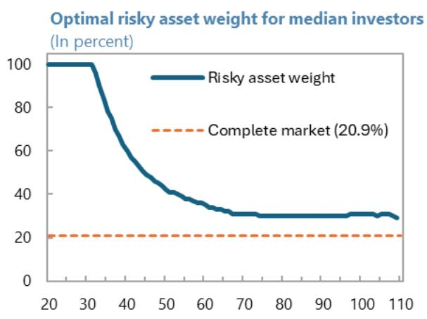

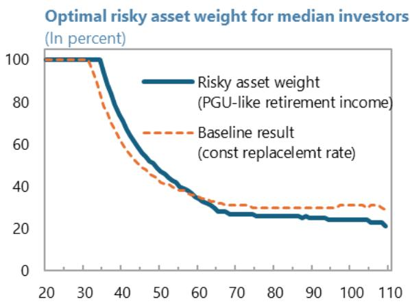

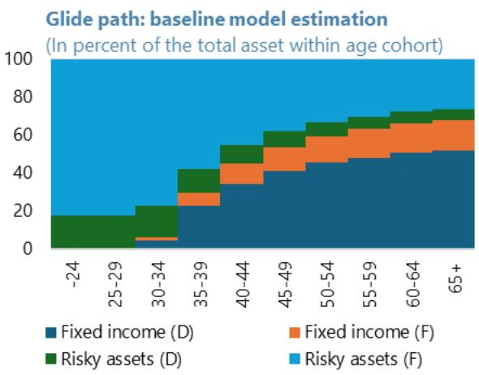

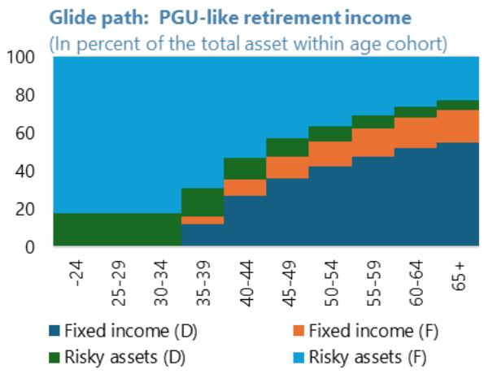

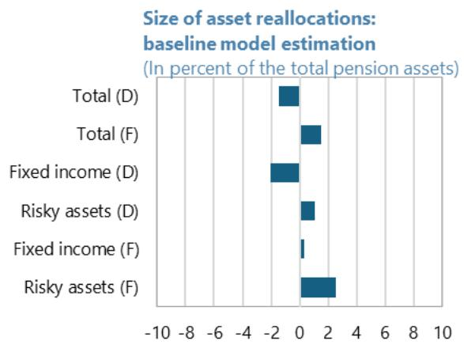

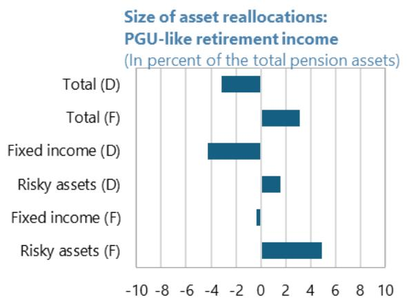  
Notes: The top row reports the optimal risky asset weight path of the median investors calculated based on 10,000 simulations. The middle row reports the glide path mapped from the optimal risky asset weight path by assuming that domestic-to-foreign asset allocation ratio is the same as in 2024 within the risky asset and fixed income asset categories. "D" and "F" in the parentheses in the legends denote "Domestic" and "Foreign", respectively.

Risk aversion ( $\gamma$ ) and income-return correlation ( $\rho$ )

Figure 2. Asset Reallocations under the Alternative risk-return profile (S&P 500 with partially hedged FX risk)

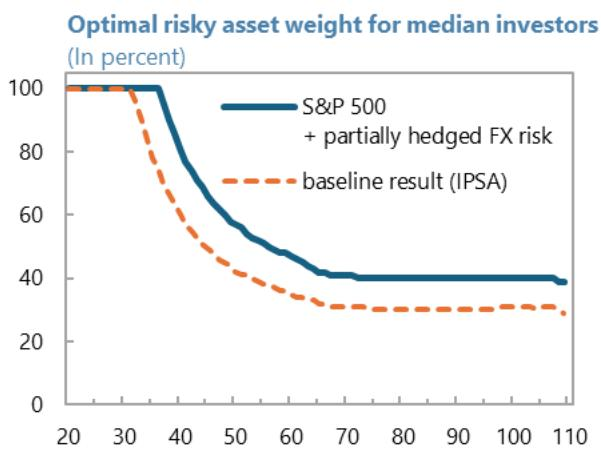

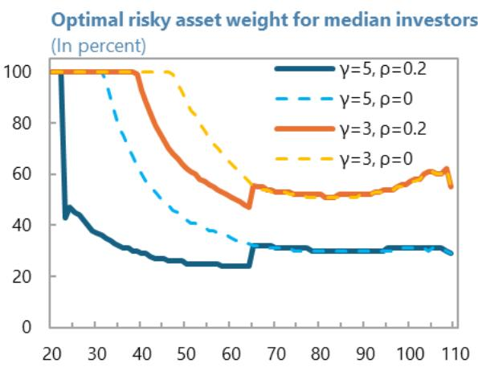

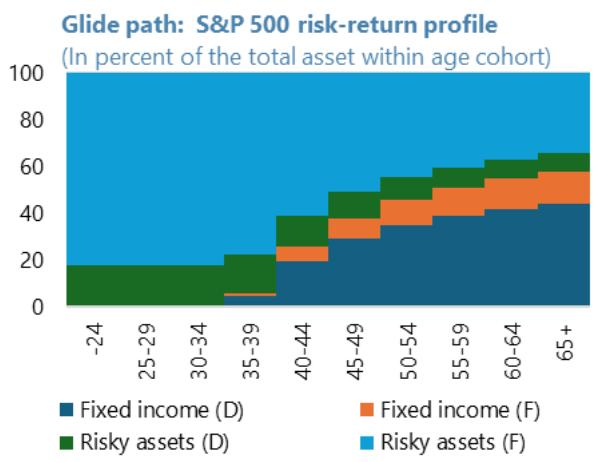

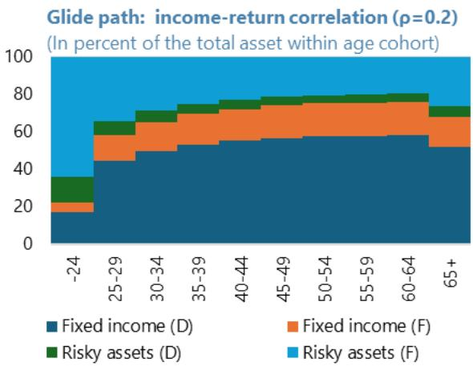

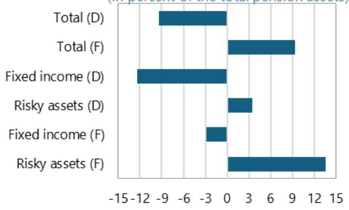

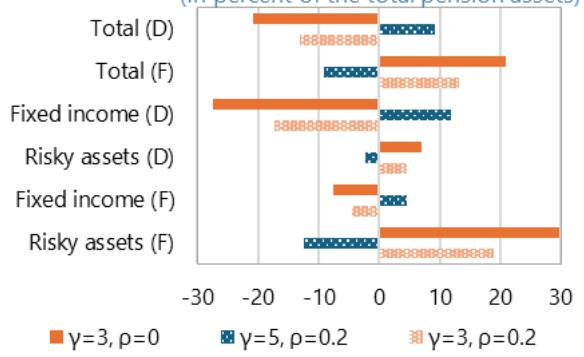  
Sources: SP and IMF staff calculations.

Notes: The top row reports the optimal risky asset weight path of the median investors calculated based on 10,000 simulations. The middle row reports the glide path mapped from the optimal risky asset weight path by assuming that domestic-to-foreign asset allocation ratio is the same as in 2024 within the risky asset and fixed income asset categories. "D" and "F" in the parentheses in the legends denote "Domestic" and "Foreign", respectively.

26. Interpretation of the model-based estimation results require several important caveats. Even though the CGM model incorporates key elements relevant to the optimal life-cycle portfolio, it is still a stylized model that does not necessarily capture the full complexity of the Chilean pension system and the labor market. $^{12}$

\- Unemployment spells. While the model calibration assumes full contribution density, in practice average density of contributions is around 60 percent for male and around 50 percent for female affiliates due to relatively high unemployment rates and informality. If unemployment risk and lower contribution density are considered, the optimal risky asset weight would decrease because human capital is riskier than in the baseline. According to Bagliano et al. (2019), who extend the CGM model to consider unemployment, the optimal risky asset weight is dampened especially during earlier periods of life.

\- Segregation of the mandatory pension account from private savings. To keep the number of state variables small and make the model tractable, this paper derives optimal allocations as if affiliates manage their pension account together with their private savings account. However, there are several constraints that are not modeled in the estimation. First, there is a minimum requirement for savings as it is compulsory to contribute a certain fraction of their labor income to the pension account. Second, the pension account balance cannot be withdrawn before retirement unlike private savings account. Even after retirement, affiliates cannot freely dispose of their pension asset balance. On the contrary, the pension balance is reimbursed following specific rules under the chosen pension benefit modality. Relevant to this point is Gomes, Michaelides, and Polkovnichenko (2009), who extend the CGM model to include two types of savings accounts: a tax-deferred retirement account and a regular taxable account. The characteristics of a tax-deferred account share similarity with a mandatory pension account in that workers need to contribute a constant fraction of their labor income while they cannot withdraw balance before retirement. The analysis in the literature suggests that having a segregated tax-deferred account promotes wealth accumulation and increases consumption during the retirement period.

\- Habit formation. Instead of a constant relative risk-aversion utility function, one can consider habit formation preferences, where an excess consumption $C_t - kH_t$ contributes to the utility, with $H_t$ being the habit level that may depend on the past consumption level (Gomes and Michaelides, 2003; Polkovnichenko, 2007; Achury et al., 2012). Habit formation may lower risky asset allocations especially for younger workers and low-income workers as their income level is close to the habit level (or subsistence consumption level).

\- The choice of pension benefit modality. In the Chilean pension system, there are two main modalities for pension benefits: life annuity and programmed withdrawal. These two modalities differ in important dimensions, including regarding how benefit cashflows are calculated, who manages pension assets, who assumes longevity risk, treatment of inheritance, etc. However, the model implicitly assumes that all retirees choose the programmed withdrawal because the model treats retirees as if they manage asset allocations of their financial wealth during the retirement period. Considering implications of the reference glide path on the choice of pension benefit modality is important, as it has significant implications on the pensioners' welfare as well as macro-level asset allocations between the pension fund sector and the life insurance sector.

\- Mapping the single risky asset weight to actual asset allocations. Because the model has two financial assets, a riskless bond and stock, estimation in this section (i) assumed that the domestic-to-foreign allocation ratio stays the same as in 2024, and (ii) abstracted from investment in the "other" asset class. As for the first assumption, while it would be likely that domestic assets dominate in the fixed income asset category and foreign assets in the risky asset category, exact rebalancing results would depend on various factors including the design of investment limit and hedging requirements on foreign assets, relative performance of domestic and foreign assets, etc. As for the second assumption, it should be noted that the "other" asset class includes alternative assets and derivatives. As the reform aims to enhance long-term investment and increase weights on alternative assets, allocations on this category may have visible effect on aggregate allocations.

## 27. The optimal risky asset weight varies significantly depending on the investors' characteristics, including their degree of risk-aversion, income level, and income-asset risk

correlation. The estimation results based on alternative specifications show that these individual characteristics significantly affect the path of optimal risky asset weights. Moreover, income level also has a significant influence on the optimal risky asset weight. Within the same age group, investors with less accumulated wealth and/or lower income level allocate a higher weight on the risky asset. Under the baseline estimation, the dispersion of the optimal risky weight is non-negligible. Except for the very early period of life during which investors fully invest in the risky asset, the interquartile range typically hovers around 10 to 20 percentage points. This finding implies that the optimal glide path for a specific group

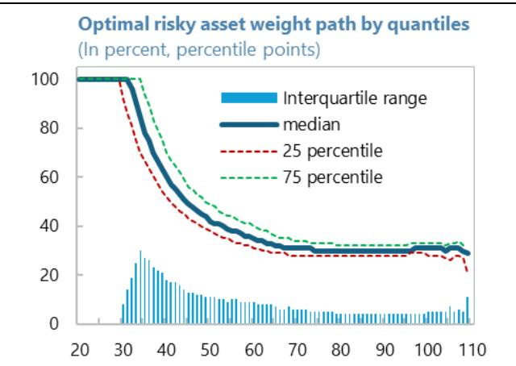  
Sources: SP and IMF staff calculations.
Notes: The three line series show the 25, 50 (median), and 75 percentile points of the distribution of the optimal risky asset weights based on 10,000 simulations of labor income paths and the risky asset return paths. The result is based on the baseline specification.

of individuals may be very different from that for the average affiliate. While it would be natural to target the average worker to calibrate the single system-wide reference glide path, it is also important to consider the possibility that the design of the reference glide path has a significantly heterogeneous welfare implication across various groups of the population (see e.g., Viceira, 2010).

28. The analysis in this section shows that the size and direction of asset reallocations crucially depend on the design of glide paths. The result ranges from a large shift toward domestic fixed income assets under the default multi-fund option path (worth 13.9 percent of the total assets) to a massive outflow from domestic fixed income assets under the model-based path with a low risk-aversion parameter (27.3 percent of the total assets). However, considering the full range of estimation results and additional considerations that are outside the scope of the theoretical model (see paragraph 28), a reasonable range of the size of asset reallocations (in terms of the change in the domestic fixed income asset weight) could be within ten percentage points of the total assets in absolute term.

<table><tr><td colspan="8">Summary of the Estimated Size of Assets Allocations(In Percent of the Total Assets, Percent Points)</td></tr><tr><td rowspan="2"></td><td rowspan="2">2024 average</td><td rowspan="2">multi-fund default option</td><td rowspan="2">baseline</td><td colspan="4">Life cycle model-based</td></tr><tr><td>S&amp;P 500 risk profile</td><td>PGU-like benefits</td><td>Low risk aversion</td><td>Positive correlation</td></tr><tr><td>Domestic Total</td><td>50.9</td><td>63.3</td><td>49.4</td><td>41.5</td><td>47.7</td><td>30.0</td><td>60.1</td></tr><tr><td>Foreign Total</td><td>49.1</td><td>36.7</td><td>50.6</td><td>58.5</td><td>52.3</td><td>70.0</td><td>39.9</td></tr><tr><td>Domestic Fixed income</td><td>43.3</td><td>57.2</td><td>41.3</td><td>31.0</td><td>39.1</td><td>16.0</td><td>55.2</td></tr><tr><td>Domestic Risky assets</td><td>7.0</td><td>5.6</td><td>8.1</td><td>10.5</td><td>8.7</td><td>14.0</td><td>4.9</td></tr><tr><td>Foreign Fixed income</td><td>12.5</td><td>11.4</td><td>12.9</td><td>9.7</td><td>12.2</td><td>5.0</td><td>17.2</td></tr><tr><td>Foreign Risky assets</td><td>35.2</td><td>23.7</td><td>37.7</td><td>48.8</td><td>40.1</td><td>65.0</td><td>22.7</td></tr><tr><td>Fixed income Total</td><td>55.9</td><td>68.6</td><td>54.1</td><td>40.6</td><td>51.2</td><td>21.0</td><td>72.4</td></tr><tr><td>Risky assets Total</td><td>42.3</td><td>29.3</td><td>45.9</td><td>59.4</td><td>48.8</td><td>79.0</td><td>27.6</td></tr><tr><td colspan="8">Change from the average allocations in 2024</td></tr><tr><td>Fixed income Total</td><td>---</td><td>12.8</td><td>-1.7</td><td>-15.2</td><td>-4.6</td><td>-34.9</td><td>16.5</td></tr><tr><td>Domestic fixed income</td><td>---</td><td>13.9</td><td>-2.1</td><td>-12.4</td><td>-4.3</td><td>-27.3</td><td>11.8</td></tr><tr><td>Risky assets Total</td><td>---</td><td>-13.0</td><td>3.6</td><td>17.1</td><td>6.5</td><td>36.7</td><td>-14.7</td></tr><tr><td colspan="8">Sources: SP and IMF staff calculations.Note: The model-based estimated asset allocations do not include &quot;other&quot; asset classes, while &quot;2024 average&quot; and &quot;multi-fund default option&quot; columns take &quot;other&quot; asset classes into account (about two percent of the total assets). &quot;Low risk aversion&quot; column reports the result based on y=3,p=0 and &quot;Positive correlation&quot; column reports the result based on y=5,p=0.2.</td></tr></table>

## D. Implementation of the Transition to the Generational Fund System

## Three-Year Transition Period

29. Scenarios where there would be outflows from domestic fixed income assets warrant a closer look. Outflows from domestic bonds may affect funding on issuers including the government, banks, and non-financial corporates. Moreover, given the large presence of AFPs in local fixed income markets, especially those with long maturity, efforts to sell a large amount of fixed income assets may encounter difficulties in finding willing buyers and/or large price impact.

Relevant historical experiences are the three rounds of pension withdrawals during 2021-22. $^{13}$ They resulted in decreases in the domestic fixed income asset holdings by pension funds of more than 10 percent of the GDP. However, this significant movement did not result in major market disruptions because bond issuers could shift issuances to offshore markets, while the central bank provided temporary liquidity support programs for pension funds and commercial banks.

30. The pension reform law stipulates a three-year transition period. The transition is scheduled to start in April 2027, with the period ending in March 2030. While the previous section estimated the size of reallocations without considering any transition period, it is important to consider the extent to which this transition period mitigates the effect of the impact on the market.

31. Having a transition period helps mitigate the impact of transition through three main channels. A longer transition period enables pension funds to diversify outright sales of assets to

reduce their weights over the time dimension. In addition to this, there are two additional channels that alleviate the need for outright sales of assets. First, if the net non-investment revenue (mainly the difference between contribution revenue and pension benefit payouts) is positive, pension funds can allocate these fresh funds into asset classes they want to increase allocations without selling asset classes they want decrease allocation

<table><tr><td colspan="2">Implementation Timeline of the Pension Reform</td></tr><tr><td>March 2025</td><td>Pension reform law enacted</td></tr><tr><td>February 2026</td><td>BCCh published investment limits of 80% on foreign investments and government instruments</td></tr><tr><td>September 2026</td><td>SP publishes the investment regime and the reference glide path for the generational funds</td></tr><tr><td>April 2027</td><td>Transition to the generational fund system starts with a 36 months transition period</td></tr><tr><td>December 2027</td><td>First auction of 10 percent of affiliates to the lowest commission AFP</td></tr><tr><td>April 2029</td><td>Start of the performance-based reward-penalty scheme</td></tr><tr><td>March 2030</td><td>End of the transition period to the generational fund system</td></tr></table>

weights. This channel can make a meaningful contribution to the transition process as AFPs currently earn annual net non-investment revenue of around 1.5 percent of the total assets. Second, the so-called weight drift can help mechanically increase risky asset weights. Because risky assets enjoy a higher return than fixed income assets under normal market circumstances, risky asset weights would mechanically increase if pension funds do not rebalance the allocation.

<table><tr><td></td><td>Baseline $(\mu=4\%, \text{NR}=1.5)$ </td><td> $\mu=2\%$ </td><td> $\mu=6\%$ </td><td>Net revenue =1</td><td>Net revenue =2</td></tr><tr><td>Immediate transition</td><td>20.0%</td><td>20.0%</td><td>20.0%</td><td>20.0%</td><td>20.0%</td></tr><tr><td>By end Year t+1</td><td>8.1%</td><td>8.5%</td><td>7.6%</td><td>8.6%</td><td>7.6%</td></tr><tr><td>By end Year t+2</td><td>4.5%</td><td>5.1%</td><td>3.8%</td><td>4.9%</td><td>4.0%</td></tr><tr><td>By end Year t+3</td><td>2.6%</td><td>3.3%</td><td>1.9%</td><td>3.1%</td><td>2.2%</td></tr><tr><td colspan="6">Source: IMF staff calculations.Notes: This table reports the required outright sales of fixed income assets in terms of the total fixed income assets in each year to achieve the new target allocation by the year specified in the first column. The initial allocation is 50-50 on the risky and fixed income assets and the new target allocation is 60 and 40. The initial total asset size is normalized to 100. The annual net non-investment revenue (NR) is 1.5 in the baseline, while the risk premium  $(\mu)$  is 4% in the baseline. The nominal risk-free rate is assumed to be 5%.</td></tr></table>

Mitigation Effect of a Transition Period: Illustrative Numerical Examples (In Percent of the Total Fixed Income Assets)

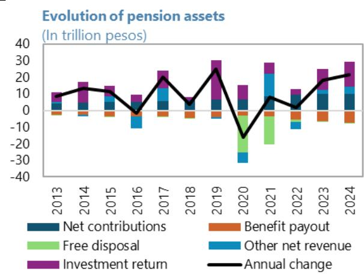  
Sources: SP and IMF staff calculations.
Notes: "Net contributions" is calculated as contribution revenue less commission and SIS premium expenses. "Free disposal" includes cash out due to the pension withdrawals.

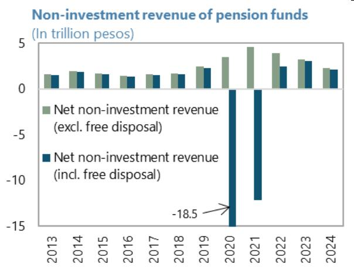  
Sources: SP and IMF staff calculations.
Notes: The dark bar series shows the net revenue of pension funds except investment returns. The light bar series further excludes the free disposal item, which includes cashout due to the pension withdrawals during the pandemic.

32. These mitigating factors combined would dramatically alleviate the annual size of asset reallocations through outright sales. The table below summarizes the annual size of asset reallocations under a scenario where the pension fund adjusts its initial 50-50 allocations on risky and fixed income assets to 60-40 allocations. This ten percentage-point reduction in the fixed income asset weight is large, yet at around the upper end of the reallocation size implied by the analysis in the previous section. For the baseline, net non-investment revenue is set to 1.5 percent of the initial total asset and the equity risk premium (which determines the impact of the weight drift channel) is set to four percent. In this case, pension funds only need to sell 2.5 percent of their fixed income asset holdings each year to attain the 60-40 allocations in three years.

33. Even when a sufficiently long transition period is in place, asset prices may sharply react upon the announcement of new regulatory designs. There is a strand of literature that documents predictable trading patterns (e.g., due to regulatory reasons, routine rebalancing) by institutional investors may be exploited by sophisticated investors (see e.g., Harvey, Mazzoleni, and Melone, 2025 and references therein). While consistent and transparent communication on the implementation process is a cornerstone of trustable and successful implementations of the reform, any communication should be mindful that too granular an information disclosure could exacerbate anticipatory trading behavior especially when regulatory requirements and implementation timeline allow limited flexibility, because these factors make it easier to precisely predict trading patterns of pension funds during the transition period.

## Competition-enhancing Designs

34. The reform introduces several mechanisms to enhance competitions among AFPs. These designs include (i) an auction of randomly chosen ten percent of affiliates to reassign them to the AFP with the lowest commission fee in every two years, and (ii) an investment performance-based reward-penalty mechanism. These measures are intended to enhance competition among AFPs as affiliates do not actively switch between AFPs even though there has been a significant dispersion in commission fee rates.

35. The introduction of these mechanisms could complicate asset management by the AFPs during the transition period to the generation fund system. As the implementation of these mechanisms coincides with the three-year transition period to the generational fund system, AFPs may need to familiarize themselves with these new mechanisms while adjusting their portfolios toward the generational fund structure. This not only requires operational capacity but can also complicate portfolio adjustment. For example, while the transition period is set to three years, AFPs may be incentivized to complete the adjustment of their portfolios well before the end of the transition period if the reward-penalty mechanism is tightly designed. This is because the performance is measured based on deviations from the reference portfolio and track records from April 2028 (one year after the start of the transition period) are counted for the performance measurement. $^{14}$

36. The design of the performance-based reward-penalty mechanism may have significant influence on pension funds' behavior, relevant to financial stability. An example is herding behavior, which could result in financial stability concerns as it would make the whole pension fund sector more susceptible to shocks and synchronized trading, possibly causing abrupt asset price adjustments. Under the current multi-fund system, AFPs are subject to a minimum guaranteed return. Specifically, AFPs need to compensate for shortfalls from the minimum guaranteed return at the cost of their capital. The minimum guaranteed return is time-varying and calculated separately for each multi-fund type as the average return of seven AFPs over last 36 months. This relative

benchmarking design strongly encourages AFPs to take herding behaviors; AFPs are strongly incentivized to mimic what other AFPs do to avoid registering underperformance relative to industry average (see e.g., Raddatz and Schmukler, 2011). The new reward-penalty mechanism would mitigate herding as it is no longer based on the relative performance within the industry. However, should the reward-penalty mechanism be tightly designed, it may mechanically result in similar portfolio allocations around the reference portfolio.

## Long-term Implications

37. The increase in the contribution rate to the mandatory pension account helps in the accumulation of pension assets. Prior to the reform, employees contributed 10 percent of their taxable income to the mandatory pension account. The reform requires contributions by employers totaling 7 percent of their employees' taxable income, of which 4.5 percent goes to the individual pension account. $^{15}$ At the aggregate level, increased contributions help accumulate pension assets and eventually strengthen pension benefits (see e.g., SP, 2024).

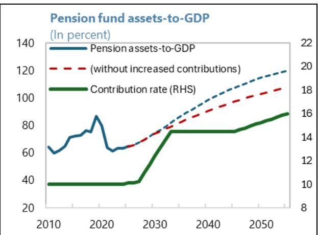  
Sources: BCCh, IME, SP and IMF staff calculations.
Notes: Pension assets-to-GDP series in and after 2025 are projected figures.

38. In the long run, investment in domestic assets will recover to the pre-pandemic level regardless of the design of the glide path. Not surprisingly, the domestic pension asset allocations-to-GDP ratio will be lower and take more time to recover to the pre-pandemic level if the reference glide path is tilted more toward risky assets. However, the long-run effect of aggregate pension asset accumulation will eventually help recover to the pre-pandemic level.

## E. Conclusions

39. The design of the reference glide path should carefully balance the optimality of the investment strategy and mitigation of market impact during the transition. As emphasized by the Pension Supervisor, these objectives are the two key mandates that need to be carefully balanced in reform implementation, while the development of domestic capital markets is only a welcome byproduct of the reform. Within the trade-off of the two main objectives, an important consideration is that the optimal life cycle portfolio may significantly differ depending on

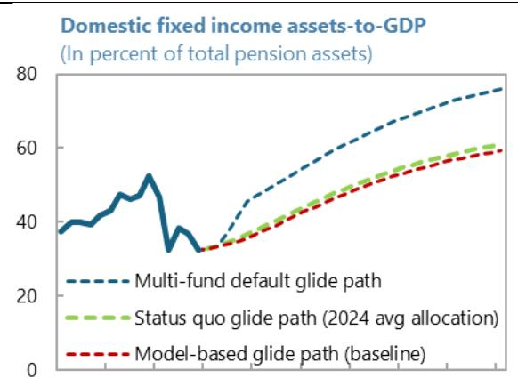  
2010 2015 2020 2025 2030 2035 2040 2045 2050 2055
Sources: BCCh, INE, SP and IMF staff calculations.
Notes: Pension assets-to-GDP series in and after 2025 are projected figures.

individual characteristics such as income level and the degree of risk aversion. Therefore, the design of the reference glide path should consider not only the optimality for the average affiliate but also its potentially heterogeneous implications for different groups of individuals. Additionally, mitigation of market impact during the transition may also be beneficial for affiliates, especially for older generations, to safeguard the investment performance. Lastly, the reform law mandates the Pension Supervisor and the Technical Investment Committee to review the reference portfolio and investment regime at least every seven years and adjust these regulations if necessary. This arrangement may be helpful to further mitigate market impact.

40. A gradual implementation of various elements of the reform would help achieve a smoother transition to the new regime. While the transition to the generational fund system is the primary challenge in the transition process, the reform introduces various other new elements such as biannual auctions of ten percent of affiliates and a performance-based reward-penalty mechanism, which could complicate AFPs' ability to smoothly adjust their asset allocations. Therefore, although the key implementation dates such as the transition to a generational funds system and the first auction of randomly chosen affiliates, are set by the law, it would be desirable to employ available regulatory flexibility for the design of the competition-enhancing mechanisms so that AFPs can prioritize a smooth transition to the generational fund system.

## 41. A gradual and well-calibrated dissemination of information regarding new regulatory designs would be helpful in mitigating a sharp announcement effect on asset prices.

Predictable trading by AFPs may invite anticipatory trading by other market participants and a sharp announcement effect. To mitigate these concerns, communication regarding new regulatory designs should be gradual so that market participants do not sharply correct their expectations upon a single announcement. The granularity of communicated information should also be calibrated carefully. While clear and transparent communication is a key cornerstone of smooth transitions, excessively detailed information dissemination could enable non-constrained investors to more precisely predict future trading patterns by AFPs. Embedding appropriate flexibility in the

investment regime and competition-enhancing mechanisms can also be helpful in reducing excessive predictability of trading patterns by AFPs.

42. Regulations on non-traditional assets should be consistently designed to safeguard the sound risk-return profile of generational funds. While the current allocation weight on the "other" asset category is small, regulations on this category is important to safeguard pension fund's risk profile and financial stability as this category includes alternative assets and derivatives, both of which are subject to specific types of risks not common to traditional asset classes. Specifically, derivative investment warrants attention. AFPs use derivatives not only for hedging exchange rate risks but also for investment purposes, especially in recent years. Because derivatives may have significant financial stability concerns, regulations should place appropriate limits to avoid excessive risk taking and have necessary arrangements in place to manage liquidity risks. See Annex III for recent developments in derivative investments by pension funds.

43. In the long run, encouraging supply of high-quality long-term fixed income assets is also important for a sound development of capital markets. While accumulating pension assets contributes to deepening capital markets by enhancing long-term funding sources, it could have negative consequences if the supply of high-quality long-term assets does not keep up with the growth of pension assets. Excessive demand could lower the yields of these assets, negatively affecting investment returns for pension funds and life insurance companies, which ultimately affect the welfare of pension affiliates. At the same time, low-return environments may encourage these investors to engage in a search for yield, potentially increasing financial stability risk. While this downside scenario seems unlikely to be an issue over the short term as the Chilean pension fund sector is in the process of recovering its pre-pandemic depth, it may be an important long-term agenda as pension fund assets grow over coming decades.

## Annex I. Overview of the Chilean Pension System

This annex summarizes the three pillar-structure of the Chilean pension system and key changes introduced by the reform bill enacted in 2025.

1. The Chilean pension system comprises three pillars. The first pillar is a tax-funded non-contributory pillar, while the second pillar is the mandatory self-funded pillar. The third pillar is a voluntary pillar, whose size is relatively small.

2. The non-contributory pillar provides a minimum guaranteed pension. This minimum guaranteed pension, called the PGU (Pension Garantizada Universal, Universal Guaranteed Pension), provides benefits under a tapered structure (about USD 250 per month) for a wide range of pensioners above 65 years of age except for top income groups. The reform bill strengthens the PGU benefits. See Chapter I for the details on the PGU and associated fiscal implications.

3. The 2025 reform introduces major changes to the second pillar. Earlier, the second pillar comprised self-financed defined-contribution pension accounts, operated under a multi-fund system. Prior to the reform, employees contributed ten percent of taxable income to the self-funded pension account, while employers paid around 1.5 percent of taxable income to fund the Disability and Survivor Insurance (SIS in Spanish acronym). The reform increases contributions by employers by seven percentage points, of which 4.5 percent goes to the self-funded pension account, with the remaining 2.5 percent funding the newly created social security component. The reform also transitions the multi-fund system to a generational fund system. Finally, the reform creates a new social security fund, which administers three newly created benefits: (i) “benefit for years contributed,” which pays a constant benefit proportional to the number of years affiliates contributed to the individual account; (ii) compensation for differences in life expectancy, which equalizes pension benefits between men and women with the same savings and retirement age; and (iii) the transitory “protected-return contribution” component. $^{1}$

4. The social security component is administered by a newly created autonomous pension fund. The reform law creates an autonomous pension fund called the FAPP (Fondo Autónomo de Protección Previsional), which administers the social security component. The FAPP also administers SIS, which was administered by AFPs prior to the reform. The Pension Supervisor regulates the FAPP's investment regime. The FAPP will commission management of its pension assets to the administrator of FAPP (AFAPP), which will be designated through public bidding. The asset management by the AFAPP is scheduled to start in July 2026. As the FAPP administers defined-benefit pension benefits and prioritize the sustainability of the fund, its asset allocations are expected to resemble those of life insurance companies rather than those of AFPs.

## Annex II. Life-cycle Optimal Portfolio Model

This annex explains the theoretical model used for the model-based analysis of asset reallocations, closely following a standard life-cycle optimal portfolio model by Cocco, Gomes, and Maenhout (2005) (henceforth CGM). This annex also explains the details of the model calibration.

## Model Setup

5. A finite-period model is considered where the investor maximizes her life-time expected utility from a consumption stream. Suppose that the investor enters the labor market at adult age t = 1, retires at K, and lives up to T. Then the utility maximization problem of the investor is described by the following time-separable power utility function:

$$
E \left[ \sum_ {t = 1} ^ {T} \delta^ {t - 1} \left(\prod_ {j = 0} ^ {t - 2} p _ {j}\right) \left\{p _ {t - 1} \frac {C _ {t} ^ {1 - \gamma}}{1 - \gamma} + b (1 - p _ {t - 1}) \frac {D _ {t} ^ {1 - \gamma}}{1 - \gamma} \right\} \right],
$$

where $\delta$ is the discount factor, $\gamma$ is the relative risk-aversion parameter, $C_{t}$ is the consumption at time t, $D_{t}$ is the amount of wealth the investor bequeaths to her descendants at death, b is the parameter controlling the strength of bequest motive, and $p_{t}$ is the conditional survival rate between age t and $t + 1$ , that is the probability of the agent still alive at age $t + 1$ conditional on the agent alive at age t. For simplicity and by following the literature, we set the bequest motive parameter b = 0 to switch off the utility coming from the bequest.

6. The investor earns labor income during the working-age period, which is subject to persistent and temporary shocks. Specifically, the investor earns labor income $Y_{t}$ given by $\log(Y_{t}) = f(t) + v_{t} + \varepsilon_{t}$ , where $f(t)$ is the age-dependent deterministic component (i.e., the average labor income by age), $\varepsilon_{t} \sim N(0, \sigma_{\varepsilon}^{2})$ is the temporary shock to labor income, and $v_{t}$ is the persistent labor income shock that follows the random walk process, $v_{t} = v_{t-1} + u_{t}$ , where $u_{t} \sim N(0, \sigma_{u}^{2})$ .

7. During the period after retirement, the investor receives non-self-financed social security benefits. For the baseline specification, we follow CGM to assume that the social security benefits are calculated with a constant replacement rate regardless of the income level at retirement. That is, the income after retirement is given by $\log(Y_{t}) = \log(\lambda) + f(K) + v_{K}$ , where $\lambda$ denotes the constant replacement rate. Under this specification, retirees receive $\lambda$ fraction of the permanent labor income at retirement, and the value of $\lambda$ does not depend on the labor income level at retirement. However, this baseline specification does not align with the non-self-funded retirement benefits, PGU. Because the PGU benefit is a constant peso amount for a wide range of the population, the replacement rate of the PGU is higher for low-income groups (often exceeding 100 percent) while it is low for high-income groups. An alternative specification considers a PGU-like social security benefits function.

8. There are two financial assets, a risk-free bond and a risky asset (stock). The risk-free bond has a constant gross real return of $R_{f}$ , while the stock return is given by $R_{t+1} - R_{f} = \mu + \eta_{t+1}$ , where $\mu$ is the constant risk premium and $\eta \sim N(0, \sigma_{\eta}^{2})$ . The stock return may be correlated with permanent shocks to the labor income, that is, $Corr(\eta, u) = \rho$ can take a non-zero value.

9. The investor chooses consumption and the allocation weight on the stock to maximize her expected life-time utility. Specifically, by letting $X_{t}$ denote cash-on-hand in period t (i.e., the sum of the initial wealth and labor income), the cash-on-hand evolves as $X_{t+1} = Y_{t+1} + (X_{t} - C_{t})(\alpha R_{t+1} + (1 - \alpha)R_{f})$ , and the Bellman equation for this problem is given by:

$$
V _ {t} (X _ {t}, v _ {t}) = \max _ {C _ {t}, \alpha_ {t}} \bigl [ U (C _ {t}) + \delta p _ {t} E [ V _ {t + 1} (X _ {t + 1}, v _ {t + 1}) ] \bigr ]. ^ {1}
$$

While the model does not admit analytical solutions, it can be numerically solved by a backward induction of the value function because it is a finite-period model.

10. Once the model is solved, the optimal risky asset allocation path for median workers is estimated based on a simulation. The model solution yields policy functions for consumption and the risky asset allocation for each age period, with cash-on-hand and the permanent income level as the two state variables. Therefore, the optimal risky asset allocation depends on the income level. To map this result to discussions on the reference glide path, this paper focuses on the optimal asset allocation path for median workers. To this end, 10,000 simulation paths are generated to obtain the trajectories of consumption flows and risky asset weight paths, and the median of these policy variables is taken.

## Calibration

11. Model parameters are calibrated to the Chilean data and institutional setup. To follow the CGM model setup as closely as possible, the calibration target is an average formal male worker with full contribution density. The base year is 2024.

\- The investor enters the labor force at age 20, retires at age 65, and lives up to age 110. Note that the legal retirement age for men is 65, while the mortality table provided by the Pension Supervisor treats age 110 as the terminal age. The conditional survival rate $p_t$ is taken from the Pension Supervisor's mortality table for 2020.

\- The deterministic income curve $f(t)$ is constructed based on the ESI (Encuesta Suplementaria de Ingresos) 2024 average formal male worker data. Specifically, A smoothed income curve by age is constructed based on the age cohort level data. The peak of the income curve is at CLP 15.3 million per year (around USD 16.3 thousand) at age 43.

\- The relative risk-aversion parameter $\gamma$ is set to $\gamma = 5$ in the baseline specification. While this value is lower than the CGM case for the US ( $\gamma = 10$ ), it is used in other studies such as Gomes and Michaelides (2005) and it is at the upper range of typical values used in the finance literature on Chile. In addition, a less risk-averse $\gamma = 3$ case is examined in some alternative scenarios.

\- The replacement rate $\lambda$ for the retirement period income is set to 0.38 in the baseline specification. This value is the average replacement rate for men retired between 2015 and 2022, excluding self-financed component (SP, 2024). Only the non-self-financed pension component is considered for the retirement period income, as the model setup treats the pension account balance as included in the accumulated wealth. Alternatively, a PGU-like retirement income function is also considered. In this specification, annual retirement income is CLP 2.57 million if the permanent income at retirement is below CLP 26.3 million, and it equals zero if the permanent income at retirement is above CLP 41.7 million. For investors whose income at retirement is between CLP 26.3 million and 41.7 million, retirement income is linearly interpolated value between CLP 2.57 million and zero. $^{2}$

\- Standard deviations of permanent and temporary income shock are set to 0.1449 and 0.2049, respectively, based on Huneeus and Repetto (2005). Note that permanent income risk is about 1.5 times larger than the value in CGM while temporary income risk is about three quarters of that in CGM.

\- The real risk-free rate is set at two percent, which is the same as in CGM. Moreover, this value is consistent with the historical short-term real interest rate level in Chile.

\- The risk premium and volatility of the risky asset is calibrated to 3.2 percent and 17.5 percent, respectively, based on the historical average of the IPSA (the blue-chip stock index of the Santiago Stock Exchange) between 2016 and 2025. To calculate excess return, the central bank's policy rate is subtracted from the return of the IPSA. Alternatively, we also examine the risk-return profile of the S&P 500 index with partially hedged exchange rate risk, where the risk premium is 6.2 percent and the volatility is 20.4 percent.

\- The correlation between permanent income shock and the stock return $\rho$ is set to zero in the baseline specification, which follows empirical findings reported in the literature. Alternatively, a positive correlation case of $\rho = 0.2$ is also examined.

## Annex III. Pension Funds' Derivative Investment

This annex summarizes the Chilean pension funds' use of derivative instruments with a special focus on the rapid increase of their position taking on US interest rate swaps over recent years.

1. Chile's derivatives market is one of the deepest among peers. According to the Triennial Central Bank Survey of foreign exchange (FX) and Over-the-counter (OTC) derivatives markets published by the Bank for International Settlements (BIS) in 2025, the depths (annualized turnover-to-GDP ratio) of FX derivatives market and interest rate derivatives market are the largest among Latin American peers and saw a rapid increase compared with the survey in 2022.

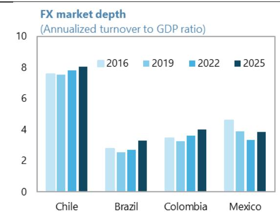  
Sources: BIS, IMF, and IMF staff calculations

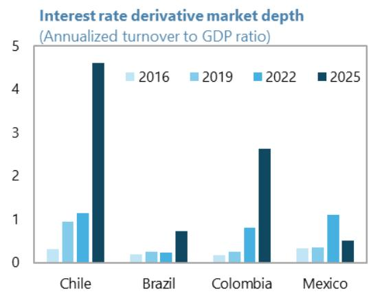  
Note: An annualized turnover is calculated by multiplying a daily turnover by 252. The GDP is the annual GDP converted to the USD value based on the average exchange rate in the respective years.

## 2. Pension funds are major participants in FX derivatives and interest rate swaps markets.

Pension funds invest sizable components of their asset under management in foreign assets. To manage FX risks and fulfill regulatory requirements on minimum FX hedge ratios on certain asset classes, pension funds have been using FX derivatives for hedging purposes. The outstanding FX derivative contracts size has been stable over recent years. Reflecting the prevalent use of an inflation-linked unit of account, the Unidad de Fomento (UF), pension funds also actively engage in trading of derivatives exchanging pesos and UFs.

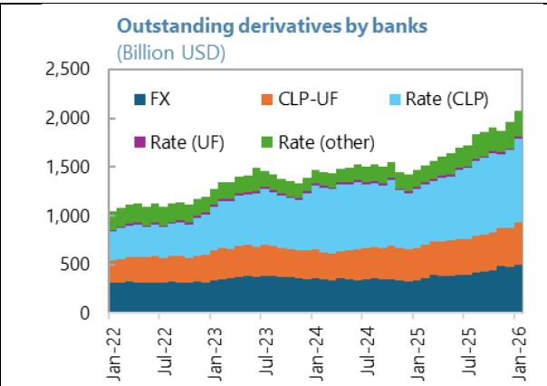  
Sources: BCCh and IMF staff calculations

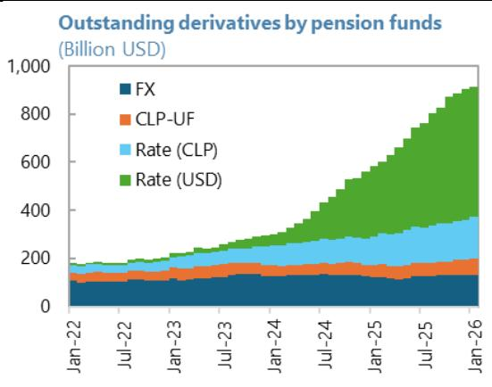

3. Recently, pension funds have been rapidly increasing derivative investments in interest rate swaps, especially those written on USD interest rates. Compared to 2023, the notional amount of USD interest rate swap positions taken by pension funds are more than 30 times larger, surpassing 200 percent of the total pension assets. Positions on CLP interest rate swaps have also increased in recent years, although the magnitude is much more moderate than the USD swaps. Prior to regulatory revisions in April 2026, derivative positions were regulated based on the notional size of derivative contracts, with a netting provision between payer and receiver positions (see 18 below for the revised regulations). The former regulation required the aggregate notional size of investment-purpose derivatives to be within three percent of total pension assets regardless of multi-fund types. However, the regulations allowed netting between payer swap positions (i.e., contracts for which pension funds pay fixed rates and receive floating rates) and receiver swap positions (i.e., contracts for which pension funds pay floating rates and receive fixed rates) regardless of the maturity of swaps provided that the underlying currency is the same. This netting provision allows pension funds to take gross notional positions much larger than the three percent limit by taking both payer and receiver positions with similar notional sizes. Indeed, the net notional size has been close to zero, sufficiently below the three-percent limit both for CLP and USD interest rate swaps.

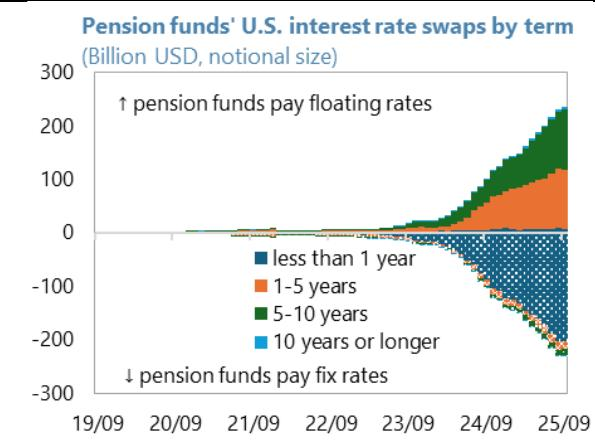  
Sources: SP and IMF staff calculations.
Note: This chart reports the notional size of swap contracts by time to maturity at each reporting date.

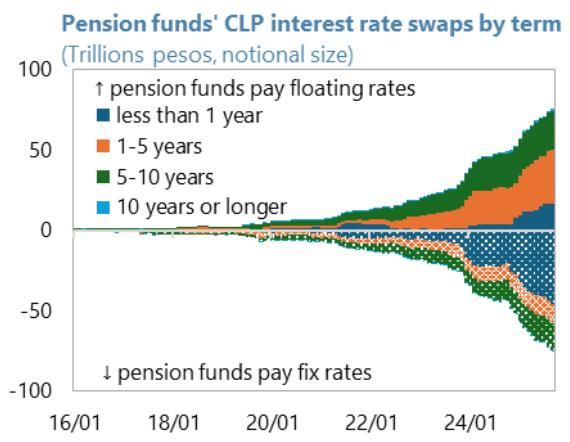  
Sources: SP and IMF staff calculations.
Note: This chart reports the notional size of swap contracts by time to maturity at each reporting date.

4. Interest rate swap positions give rise to valuation risk. Valuation of swap contracts fluctuates as the underlying interest rates (yield curve) change. For example, when pension funds pay floating rate legs and receive fixed rate legs, an upward shift of the yield curve results in a valuation loss because they need to pay more floating rate legs, but the fixed leg receipts do not change. While taking interest rate derivative positions may be beneficial to lengthen the duration of pension asset portfolios, a large exposure to interest rate risks increases sensitivity of the return of pension fund investment.

5. Large valuation changes may result in liquidity risk. Under a standard master agreement, if pension funds' swap position's negative valuation exceeds (in absolute terms) the collateral they

have already pledged, they need to post additional collaterals to cover it. The margin calls occur daily, and collateral transactions should be done within a short time frame (typically within two business days). Therefore, should there be abrupt changes in interest rates, pension funds need to post collaterals to the counterparty within a short time. If pension funds do not have sufficient eligible assets for collaterals (e.g., cash, bank deposit), they may need to sell assets to respond to margin calls or they may be forced to close their swap positions.

6. As interest rate risk exposure of swaps differ depending on remaining time to maturity, pension funds have been building up significant exposure to interest rate risks. The sensitivity of swap valuations to changes in interest rates—duration risk—is larger for longer-maturity swaps. Therefore, if there is a mismatch between the average duration of payer swap and receiver swap positions, pension funds are exposed to interest rate risks even if the “netted-out” notional size is small. This is indeed the case in Chile. Pension funds are taking longer maturity swap positions for the receiver side, while they are taking shorter maturity swap positions for the payer side. This means that pension funds are exposed to a positive duration risk as the duration of the receiver swap positions (which result in loss) is larger than that of the payer swap positions (which result in profit). As a result, pension funds will incur valuation losses when the yield curve shifts up.

7. The large interest rate exposure has been making notable contributions to pension fund investment performance in the recent period. To quantify duration risk exposure, DV01 (which measures how the valuation of a swap contract changes when there is a parallel shift of the yield curve by one basis point) is a frequently used risk metric of the sensitivity of swap valuations to changes in interest rate. Staff's estimation suggests that, as of September 2025, DV01 of the receiver USD interest rate swaps is around 18 million USD whereas that of the payer swaps is around -4 million USD. By netting the payer and receiver positions, one basis point parallel upward shift of the US swap yield curve would result in USD 14 million in valuation losses. Standardizing by the total pension assets, DV01 of USD interest rate swaps is about USD 6.4 thousand per USD 100 million AUM. DV01 of CLP interest rate swaps is about USD 0.8 thousand per USD 100 million AUM. This magnitude of DV01 may be large compared to other pension fund systems, given that the Chilean pension funds are defined-contributions funds that do not need to conduct strict asset liability management. As a result, valuation of USD interest rate swap positions has been making notable contributions to the pension fund return. For example, when the US long-term swap rate increased from around 3.5 percent to 4.5 percent between September 2024 to January 2025, valuation of USD interest rate swaps significantly decreased around 1.0 percent of the total assets to -1.5 percent of the total assets. Moreover, large fluctuations in derivative valuation may have implications on liquidity positions of pension funds, given that pension funds increased their cash and deposit holdings when they were required to pledge more collaterals around the end of 2024.

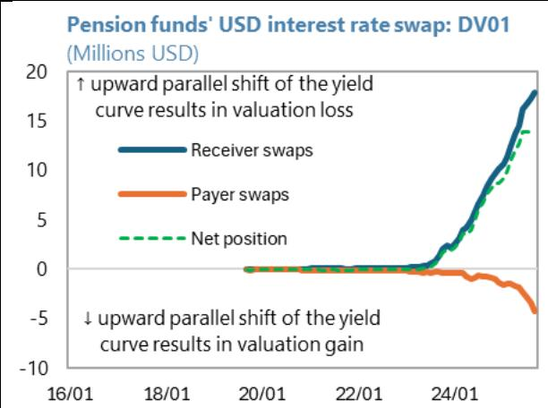  
Sources: BCCh, LSEG, SP, and IMF staff calculations.

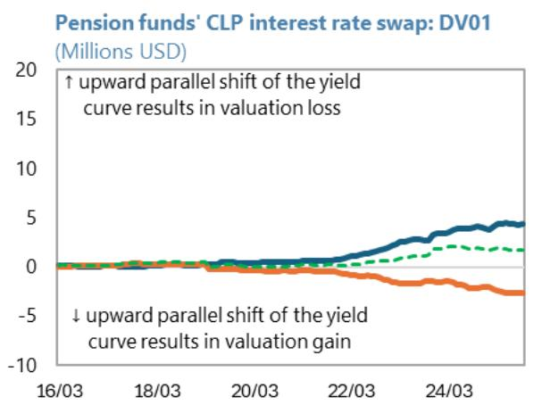  
Sources: BCCh, LSEG, SP, and IMF staff calculations.

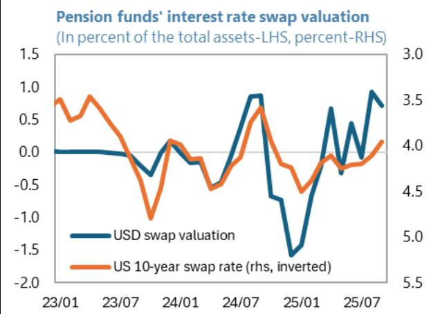  
Sources: LSEG, SP, and IMF staff calculations.
Note: US 10-year swap rate series shows a monthly average of the daily 10-year swap rate.

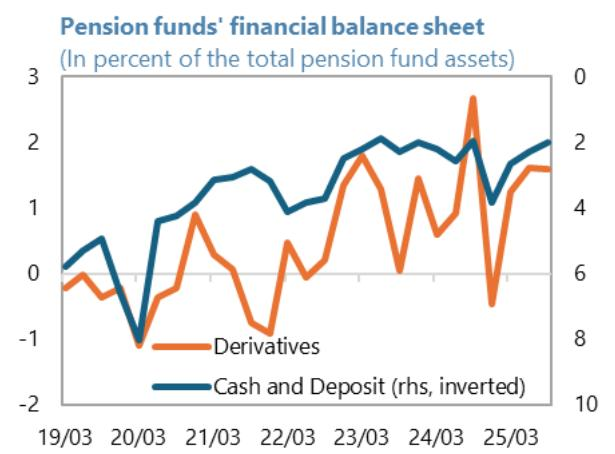  
Sources: BCCh and IMF staff calculations.
Note: Quarterly data based on the National Accounts statistics by Institutional sector.

8. The Pension Supervisor has recently amended regulations on derivative investments. After public consultation which took place in February 2026, the Pension Supervisor published revised regulations on derivative investments in April 2026. The new regulations introduce two metrics to regulate derivative investments, with limits on risk exposure and requirement on liquidity coverage ratio instead of the former regulations based on notional size. These new regulations impose a cap on interest rate risk exposure as well as require pension funds to hold enough liquid assets to accommodate abrupt margin calls.

\- Limit on risk exposure: In the new regulations, potential valuation loss amount should be calculated under six different stress scenarios. The scenario that gives rise to the largest valuation loss is then used to define the risk exposure. The most relevant stress scenario under the current maturity structure of swap positions is an upward parallel shift of the yield curve by

40bps. $^{1}$ The new regulations impose limits on risk exposure at 3 percent of the total asset for multi-fund Types A and B, 2.5 percent for Type C, and 2 percent for Types D and E.

\- Liquidity coverage ratio: The Pension Supervisor also has imposed a liquidity coverage ratio requirement so that pension funds hold sufficient liquid assets to accommodate large and abrupt margin calls. This ratio is calculated by dividing the amount of high-quality liquid assets by the required liquidity. The high-quality liquid assets are characterized by eligible asset classes and haircut rates, if applicable. The required liquidity is calculated as the sum of the current collateral needs and the potential liquidity needs under stress scenarios. The latter term is tied to the risk exposure amount calculated for the limit on risk exposure above.

9. Going forward, the regulations on derivative investments should be calibrated consistently within the overall risk management framework of the generational fund system. Given the rapid build-up of US interest rate swap positions over last few years, the Pension Supervisor's prompt amendment of the derivative investment regulations prior to the transition to the generational fund system is a welcome development. As the transition of the pension fund system starts in 2027, sound derivative risk regulations should be embedded in the investment regime of the generation fund system consistently with the reference glide path and acceptable risk allowance for pension funds under the new system.

## References

Achury, C., Hubar, S., and Koulovatianos, C., 2012, "Saving rates and portfolio choice with subsistence consumption," Review of Economic Dynamics, Vol. 15, pp. 108–126.

Aldunate, F., Da, Z., Larrain, B., and Sialm, C., 2025, "Pension fund flows, exchange rates, and covered interest rate parity," Journal of Financial Economics, Vol. 170, 104075.

Bagliano, F., Fugazza, C., and Nicodano, G., 2019, "Life-cycle welfare losses from rules-of-thumb asset allocation," Economics Letters, Vol. 192, 109655.

Banco Central de Chile, 2025, Financial Stability Report Second Half 2025.

Cabezon, F. and Oikonomou, M., 2026, “Chile’s: Pension Reform—Fiscal Implications of the Guaranteed Universal Pension”, IMF Selected Issues Paper (Chapter I).

Cocco, J., Gomes, F., and Maenhout, P., 2005, "Consumption and Portfolio Choice over the Life Cycle," Review of Financial Studies, Vol. 18, No. 2, pp. 491–533.

Duarte, V., Fonseca, J., Goodman, A., and Parker, J., 2022, “Simple Allocation Rules and Optimal Portfolio Choice over the Lifecycle,” NBER Working Paper No. 29559, National Bureau of Economic Research.

International Federation of Pension Fund Administrators (FIAP), 2025, "The challenge of moving towards Target Date Funds in Latin America," FIAP/Pension Notes, N° 87, International Federation of Pension Fund Administrators.

Fuentes, O., Salvo, E., and Hernández, C., 2022, "Evolución y desempeño individual de los cambios de fondos en el Sistema de Pensiones," Documento de Trabajo N° 69, Superintendencia de Pensiones.

Gomes, F., 2020, "Portfolio Choice Over the Life Cycle: A Survey," Annual Reviews of Financial Economics, Vol. 12, pp. 277–304.

\_\_\_\_, and Michaelides, A., 2003, "Portfolio choice with internal habit formation: a life cycle model with uninsurable labor income risk," Review of Economic Dynamics, Vol. 6, pp. 729–66.

\_\_\_\_, 2005, "Optimal Life-Cycle Asset Allocation: Understanding the Empirical Evidence," Journal of Finance, Vol. 60, No. 2, pp. 869–904.

\_\_\_\_, and Polkovnichenko, V., 2009, "Optimal savings with taxable and tax-deferred accounts," Review of Economic Dynamics, Vol. 12, pp. 718–735.

Harvey, C., Mazzoleni, M., and Melone, A., 2026, "The Unintended Consequences of Rebalancing," Fisher College of Business Working Paper No. 2025-03-001, Ohio State University.

Henríquez, C. and Barrero, A., 2026, "Inversión directa e indirecta de los hogares de Chile," Estudio económico estadístico N° 147, Banco Central de Chile.

Huneeus, C. and Repetto, A., 2005, "The Dynamics of Earnings in Chile," in Labor Markets and Institutions, edited by Restrepo, J. and Santiago, T., pp. 383–410, Central bank of Chile.

IMF, 2021, "Chile: Financial System Stability Assessment," IMF Country Report No. 21/262, International Monetary Fund.

Jagannathan, R. and Kocherlakota, N., 1996, "Why Should Older People Invest Less in Stocks Than Younger People?" Quarterly Review, 20(3), Federal Reserve Bank of Minneapolis.

Mao, Q. and Wong, C. H., 2025, "Increased risk-taking by lifecycle funds," Pacific-Basin Finance Journal, Vol. 92, 102816.

Merton, R. C., 1971, "Optimum Consumption and Portfolio Rules in a Continuous-Time Model," Journal of Economic Theory, Vol. 3, pp. 373–413.

Okuda, T., 2025, "Post-Pandemic Changes to Chile's Financial Markets," IMF Selected Issues Paper, SIP/2025/012, International Monetary Fund.

Raddatz, C. and Schmukler, S., 2011, "Deconstructing Herding—Evidence from Pension Fund Investment Behavior," World Bank Policy Research Working Paper 5700, World Bank.

Scotiabank, 2024, “Target-Date Funds Scheme for Chile: Main Takeaways,” Economics Publication by Scotiabank Economics, available at https://www.scotiabank.com/ca/en/about/economics/economics-publications/post.other-publications.latam-decks.latam-decks.chile-target-date-funds--september-24--2024-.html (retrieved on March 10, 2026).

Superintendencia de Pensiones, 2010, "The Chilean Pension System," Edited by Berstein, S., Superintendencia de Pensiones.

\_\_\_\_, 2024, "Estudio sobre tasas de reemplazo en el sistema de pensiones chileno y sus proyecciones bajo distintos escenarios," Documento de Trabajo, Superintendencia de Pensiones.

Polkovnichenko, V., 2007, "Life cycle consumption and portfolio choice with additive habit formation preferences and uninsurable labor income risk," Review of Financial Studies, Vol. 20, No. 1, pp. 83–124.

Viceira, L., 2010, "Application of Advances in Financial Theory and Evidence to Pension Fund Design in Developing Economies," in Evaluating the Financial Performance of Pension Funds, edited by Hinz, R., Rudolph, H., Antolin, P. and Yermo. J., pp. 203–242, World Bank.