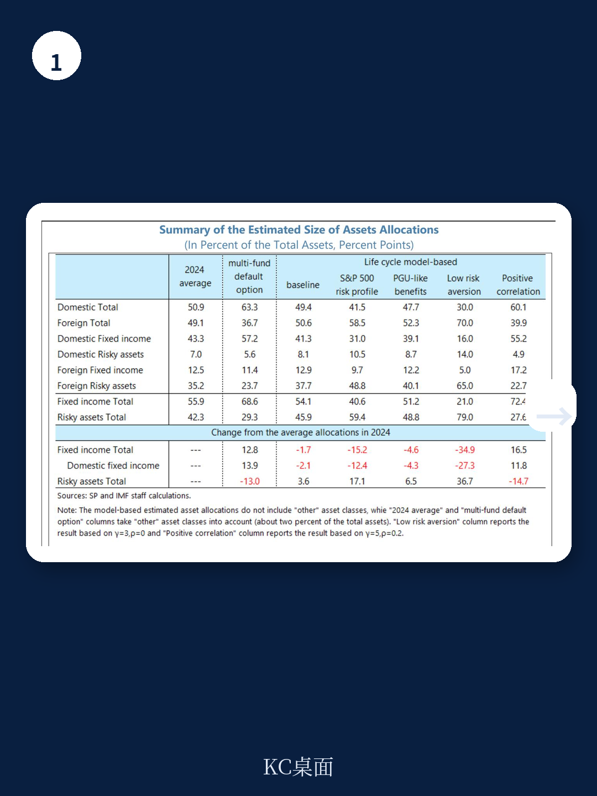
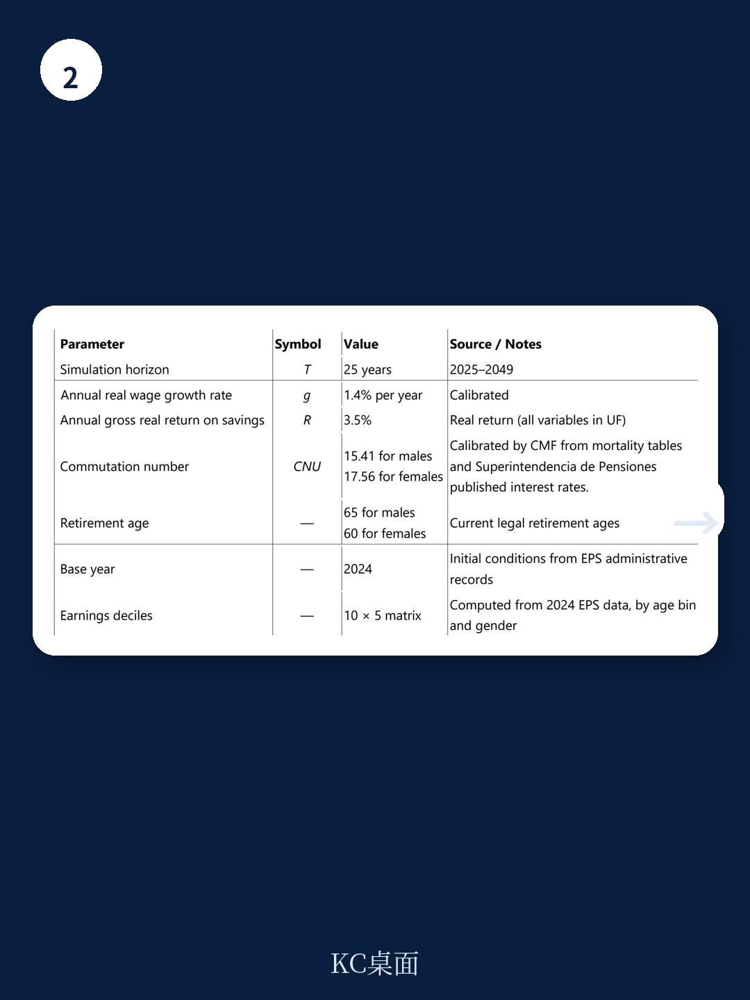

# IMF：IMF模拟智利养老金改革，指数化规则是财政可持续性的分水岭

智利2025年通过的综合养老金改革，被市场视为提升替代率的关键一步。但IMF一份基于微观数据的模拟报告揭示了一个容易被忽视的结构性问题：改革的核心组成部分——最低保障养老金（PGU），其当前的设计形式在财政上不可持续。报告的核心判断是，由于PGU的“阶梯式递减”机制在实践中几乎失效，超过九成的退休人员实际领取的是全额补贴，这意味着PGU的财政支出将随老年人口线性增长，而非随养老金储蓄改善而收敛。

这份报告的重要性在于，它把讨论焦点从“改革是否足够”引向“改革的设计细节是否经得起长期推演”。对于关注新兴市场财政可持续性和社保体系改革的读者，这是一个必须仔细审视的案例。

## 1. PGU的“阶梯递减”形同虚设，九成以上退休者拿全额

PGU的设计初衷是通过收入测试实现精准补贴。其机制是：自筹养老金低于下限（约79万智利比索/月）者领取全额；介于上下限之间者，补贴逐步递减；超过上限则完全退出。然而，IMF基于智利社会保障调查（EPS）的微观数据分析显示，2024年96%的65岁以上退休人员的自筹养老金低于这一下限。即便考虑到改革后缴费率的大幅提升，模拟至2050年，仍有超过92%的退休人员处于“全额领取”区间。

这意味着，PGU在实际运行中已退化为一种接近“全民普发”的待遇。其财政成本不再与个人储蓄能力挂钩，而是直接与老年人口规模挂钩。在智利人口快速老龄化的背景下，这一设计将构成持续的财政不确定性。

> **KC评论：** 这里的关键不在于PGU本身的好坏，而在于其“靶向机制”完全失效。对于政策制定者，这提示了一个普遍困境：名义上的“精准补贴”如果门槛设置过高或调整不及时，会迅速变成一项无差别的福利支出。报告中的图2直观展示了这一变化趋势，值得仔细查看。

## 2. 指数化规则是决定长期财政成本的分水岭

报告模拟了不同指数化假设下的PGU财政支出路径。在当前的CPI指数化规则下，PGU支出占GDP的比例将从目前的约2.2%上升至2040年的约2.5%。但如果改为与工资增长挂钩，2040年这一比例将高出约0.5个百分点，2050年则高出约1个百分点。

这一差异的根源在于：工资增长通常快于通胀。一旦PGU与工资挂钩，其实际购买力将随宏观环境增长“被动升级”，财政负担的增速将显著加快。报告强调，如果维持工资指数化，需要更大规模的参数调整（如缩小覆盖范围或提高退休年龄）才能抵消其影响。

## 3. 报告未完全回答的关键问题：改革的政治可行性与分配效应

报告提出了两种控制财政成本的参数调整方案：一是将PGU覆盖范围从目前收入最低的90%缩小至60%（回到2008年原始设计）；二是将法定退休年龄和PGU领取年龄统一提高至67岁。模拟显示，前者可使PGU支出占GDP的比例在2050年下降约0.5个百分点，后者则可下降约0.3个百分点。

但报告坦诚地指出，这些分析“仅聚焦于财政可持续性”，并未充分讨论其分配效应和政治可行性。缩小覆盖范围意味着将部分中低收入群体排除在外，而提高退休年龄则可能对劳动参与率较低的人群（尤其是女性）造成不成比例的影响。这是报告留下的一个关键空白——在现实政治中，这些参数调整的阻力可能远超模型假设。

## 4. 给读者的观察框架：关注三个“隐性变量”

对于跟踪智利养老金改革或类似新兴市场社保改革的读者，建议从以下三个角度建立观察框架

**第一，关注PGU的指数化规则是否被修改。** 这是决定长期财政成本最敏感的杠杆。任何向工资指数化的倾斜，都应被视为财政不确定性加大的信号。

**第二，关注覆盖范围的调整是否被提上议程。** 缩小PGU覆盖范围（如回到60%门槛）是控制成本最直接的手段，但其政治代价也最高。如果政策讨论中出现这一方向，意味着改革进入了“真金白银”的博弈阶段。

**第三，关注退休年龄与预期寿命的挂钩机制。** 这是许多发达国家已采用的自动稳定器。智利若引入类似机制，将有助于在人口结构变化中自动调节财政负担，避免临时性参数调整带来的政治冲击。

---

> **KC评论：** 这份报告的价值不在于提出颠覆性的结论，而在于用微观测算清晰地揭示了一个“制度设计陷阱”——一项初衷良好的福利政策，因参数设置不当而失去了精准性。对于任何关注社保体系长期可持续性的人，报告中的图1（养老金储蓄分布）和图3（不同指数化假设下的成本路径）是两幅必须理解的图表。

For informational purposes only. Portions may be generated,translated,summarized,or edited with AI assistance based on source materials and may contain omissions or errors. Please verify independently. This is not investment,legal,tax,accounting,or other professional advice.
