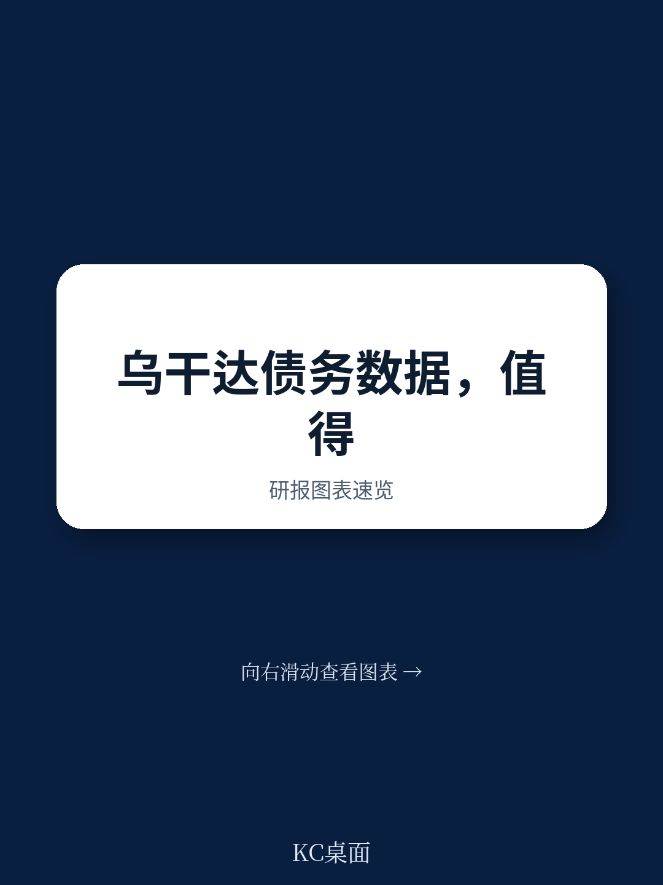

# IMF：IMF评估乌干达债务数据，统计口径之外的真实负债被低估

2025年底，IMF技术援助团完成了一项对乌干达公共部门债务统计（PSDS）的数据质量评估。结果并不令人意外：乌干达的债务数据在准确性和及时性上基本达标，但真正的问题藏在数据边界之外——大量实际负债未被纳入官方统计口径。

这份评估报告的价值，不在于它确认了乌干达当前处于“中等债务困境不确定性”，而在于它揭示了发展中国家债务统计中普遍存在但常被忽略的结构性缺陷：法律框架的授权模糊、统计范围的人为调整、以及跨部门数据协调的深层障碍。对于关注新兴市场债务不确定性的研究者和政策制定者来说，这些发现远比一个评级数字更有参考意义。

## 1. 统计口径的边界在哪里，债务不确定性就在哪里

乌干达当前的公共债务统计主要覆盖预算中央政府（BCG）的贷款和债务标的。这看上去很清晰，但问题在于，大量实际存在的政府负债被排除在外。

报告明确指出，非预算单位、地方政府和国有企业的非担保负债，目前仅被报告为BCG的“或有负债”，而非纳入广义公共部门债务。截至2024年6月，仅国内欠款（包括与乌干达银行的透支）就达到14.6万亿乌干达先令。这些数字没有被计入核心债务统计。

更值得关注的是，IMF评估发现乌干达的债务报告目前排除了养老金义务、应付账款、透支、公私合营相关负债和融资租赁等关键负债类别。这意味着，官方公布的债务数字可能低估了政府实际承担的财务义务。对于外部观察者而言，仅凭现有公开数据判断乌干达的债务可持续性，可能得出偏乐观的结论。

> **KC评论：** 这一点对任何研究新兴市场债务的人都是提醒——不能只依赖官方公布的债务/GDP比率。统计口径的宽窄，直接影响你对不确定性的真实判断。完整的债务画像需要包括那些“尚未被确认为债务”的政府承诺。

## 2. 法律框架的空白与数据孤岛

乌干达的债务管理和报告责任分散在财政部和乌干达银行之间。虽然双方签署了谅解备忘录进行数据交换，但报告发现，缺乏明确的法律授权来界定债务统计的收集、处理和发布职责。这在操作层面意味着，当数据出现分歧时，没有一个法定的协调机制。

另一个操作层面的问题是系统重复。财政部和乌干达银行各自维护着相似的债务记录数据库。这种冗余不仅增加了人力成本，更重要的是，可能导致两套数据之间出现不一致。报告建议通过立法将所有债务管理和报告职责集中到一个统一的部门，建立明确的前台、中台和后台职能。

数据共享的效率问题同样突出。虽然财政部和乌干达银行之间有数据交换协议，但评估发现，升级DMFAS系统（债务管资金规划务分析系统）至第7版是当务之急。当前版本无法覆盖透支、特别提款权分配、货币存款、国内欠款和贸易信贷等工具。这意味着，即使有数据交换的意愿，系统本身的局限性也限制了数据覆盖的广度。

## 3. 方法论上的两个关键偏差

报告揭示了两个看似技术性、实则影响重大的方法论问题。

第一个是内外债的划分标准。乌干达目前依据货币而非债权人居住地来区分外债和内债。这与国际统计标准存在偏差。更具体地说，2021年8月特别提款权分配后，乌干达将部分SDR兑换为本国货币。目前的PSDS将其列为对IMF的外债，但按照国际标准，这应被记录为财政部与乌干达银行之间的内债。这个看似细微的调整，会直接影响外债规模的统计和债务可持续性分析的基准。

第二个是债务估值和修订政策的缺失。报告指出，乌干达缺乏标准化的债务数据修订流程。通常修订仅限于最近时期，早期数据保持不变。当其他宏观宏观环境统计数据更新时，债务数据的不一致性就会显现。对于长期追踪乌干达债务趋势的研究者来说，这意味着历史数据可能无法直接与最新数据比较，增加了分析难度。

## 4. 报告尚未完全回答的关键问题：透明度改善的政治宏观环境学

这份评估报告列举了清晰的优先建议：通过立法整合债务管理职责、扩大工具覆盖范围、建立修订政策、推行自动化质量保证程序。这些建议本身是合理的，但它们回避了一个更深层的问题：为什么这些显而易见的改进在过去没有发生？

乌干达的债务统计透明度问题，部分源于制度惯性——各部门之间的职责划分已经形成路径依赖。但更关键的是，扩大统计范围、纳入更多负债类别，可能会在短期内推高官方债务数字，影响市场情绪和融资成本。这是一个典型的政治宏观环境学困境：透明度改善的收益是长期的、分散的，而成本是即期的、集中的。

对于读者而言，这份报告的价值不仅在于它指出了乌干达需要做什么，更在于它提供了一个分析框架：任何国家的债务统计透明度，都不能仅从技术层面理解。法律授权、机构协调、系统升级和政治激励，共同决定了统计数据离真实负债的距离。

> **KC评论：** 如果你在追踪新兴市场的债务不确定性，不妨用这份报告给出的框架审视其他国家的债务统计——它们的统计口径是否覆盖了所有政府负债？内外债划分是否与国际标准一致？数据修订是否有透明政策？这些“技术细节”往往隐藏着最大的不确定性信号。

For informational purposes only. Portions may be generated,translated,summarized,or edited with AI assistance based on source materials and may contain omissions or errors. Please verify independently. This is not investment,legal,tax,accounting,or other professional advice.
