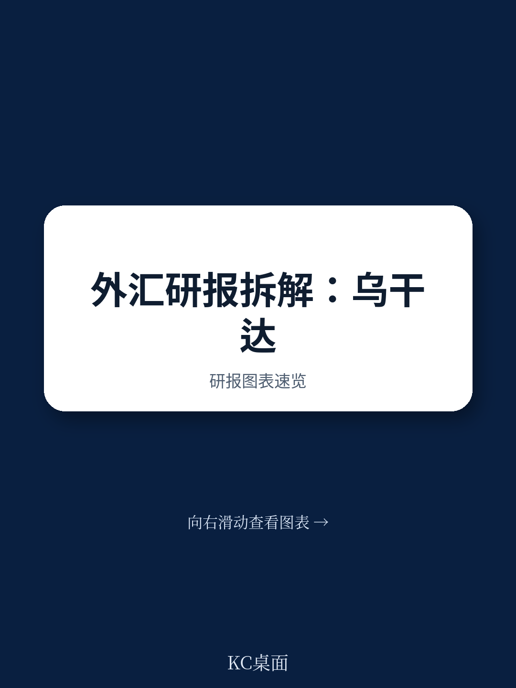
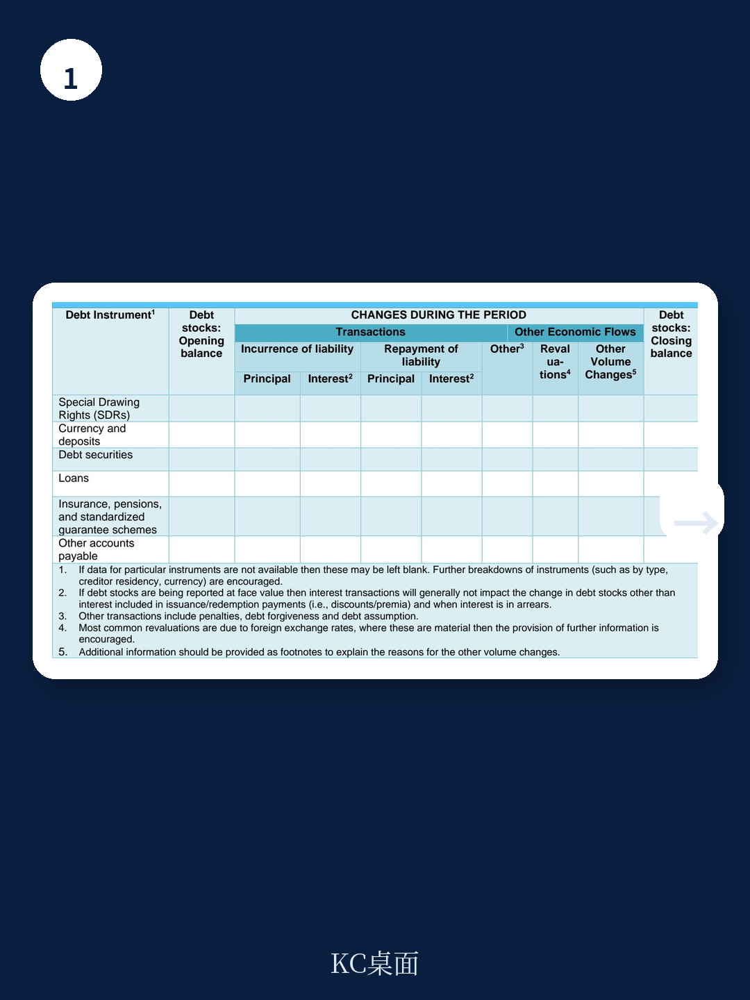
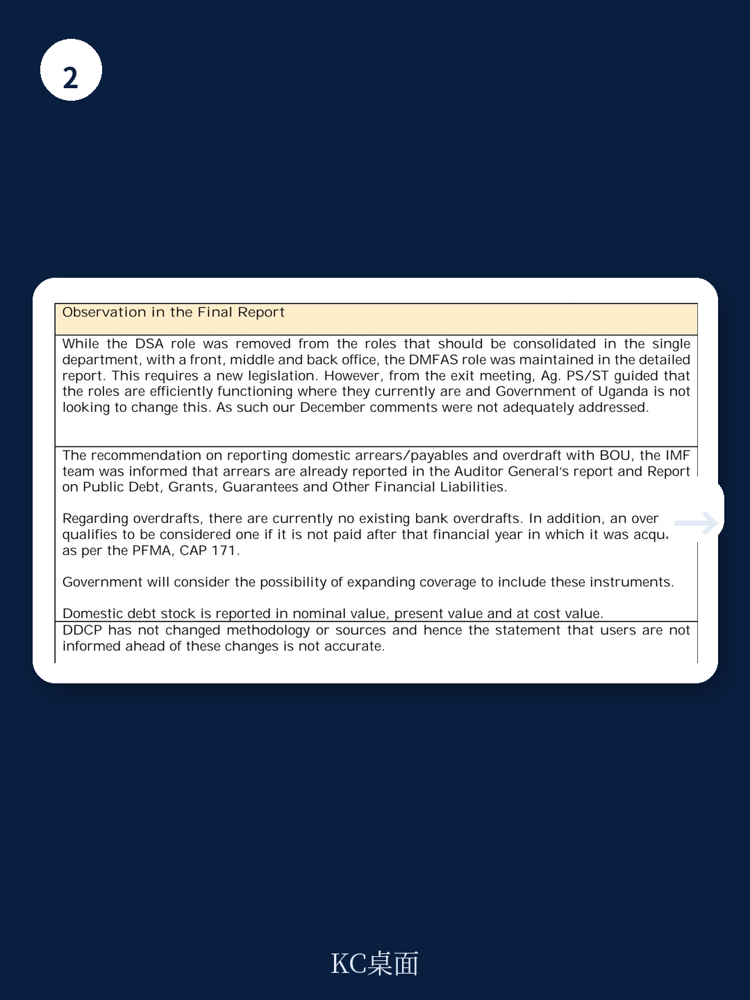

# IMF：发展中国家债务统计困境，乌干达欠款和透支远高于表面数据

IMF在2026年6月发布的技术援助报告中，对乌干达公共部门债务统计数据质量进行了全面评估。结论并不意外：数据基本准确、发布及时，但真正值得关注的是那些被排除在官方统计之外的债务——国内欠款、央行透支、国有企业非担保负债，以及尚未被纳入的养老金义务和公私合作项目相关负债。截至2024年6月，仅国内欠款和央行透支两项就达到14.6万亿乌干达先令。这个数字意味着，如果按国际标准重新计算，乌干达的实际公共债务负担可能显著高于官方披露的水平。

这份报告的价值不在于否定现有数据，而在于指出了一个发展中国家普遍面临的结构性困境：债务统计的覆盖边界，往往比政策制定者希望看到的要窄得多。

## 1. 统计口径的差异，可能改变债务不确定性评估

乌干达目前被评估为中等债务困境不确定性。债务可持续性分析显示，在基准情景下，多数外部和公共债务指标低于临界值。但IMF团队明确指出，这一评估并未包含预算外实体和国有企业的非担保债务。

问题出在统计口径的错位。乌干达的主要债务指标仅覆盖预算中央政府，而预算外单位、地方政府和国有企业的负债被单独列示在债务公报中，作为“隐性或有负债”处理。按照国际标准——GFSM 2014和PSDSG 2013——这些应当纳入广义公共部门债务统计。

一个具体的案例是SDR的处理。2021年8月SDR分配后，乌干达将部分SDR转换为本币，但在统计中仍将其列为对IMF的外部债务。IMF建议，这笔负债应被记录为财政部与央行之间的国内债务。这种分类调整不只是技术细节，它会直接影响外部债务与国内债务的比例，进而影响债务可持续性分析的结论。

## 2. 欠款、透支和表外工具：债务统计的灰色地带

报告中最具信息量的部分是那些“未被计入”的项目。截至2024年6月，包括央行透支在内的国内欠款总额达14.6万亿乌干达先令。IMF技术团队此前已建议将央行透支按GFSM 2014分类为贷款负债，但这一建议尚未落地。

此外，乌干达政府使用期票或其他类似安排进行公共资产研究，这些工具在发行时即构成政府负债，应被确认为债务。报告敦促财政部审查所有此类安排，包括用于预融资的安排。

> **KC评论：** 欠款和透支是发展中国家债务统计中最容易被忽略的部分。它们不产生利息或期限结构，容易被归为“运营问题”而非“债务问题”。但14.6万亿先令这个数字——相当于乌干达相当比例的年度财政收入——说明这不是边缘问题，而是核心不确定性。

## 3. 机构整合与系统升级：被低估的瓶颈

报告指出了另一个关键问题：债务记录在财政部和央行两个系统中并行维护，存在重复记录和潜在不一致。IMF建议通过立法将所有债务管理和报告职责集中到一个统一部门，建立具有明确前台、中台和后台职能的综合性债务管理办公室。

但乌干达当局的回应显示，这一建议短期内难以落地。代理常务秘书在离境会议上表示，现有职能运行有效，政府不打算改变现状。这意味着，数据质量提升更多将依赖系统升级——特别是将DMFAS系统升级到第7版，以覆盖透支、SDR分配、国内欠款和贸易信贷等目前被排除在外的工具。

## 报告尚未完全回答的关键问题

这份评估报告留下了几个值得持续关注的问题

第一，如果按国际标准重新计算，乌干达的真实公共债务/GDP比率会是多少？报告给出了欠款和透支的绝对数字，但没有模拟调整后的债务指标。对于读者和多边机构而言，这个数字才是真正的不确定性锚。

第二，国有企业非担保负债的规模有多大？报告承认这些负债被排除在DSA之外，但未提供估算。考虑到乌干达国家社保产品、国家水务公司等实体的体量，这一缺口可能相当可观。

第三，统计口径调整的节奏是什么？IMF给出了优先级建议，但乌干达当局在立法和系统升级上的实际推进速度，将决定数据质量改善的时间表。

对于关注非洲主权信用和债务可持续性的研究者、读者和政策制定者，这份报告提供了一个难得的窗口：它不只是一次技术评估，更像一面镜子，照出了发展中国家债务统计中那些“看不见的角落”。完整报告中的用户调查结果、标准化债务表格以及当局的详细回应，值得进一步细读。