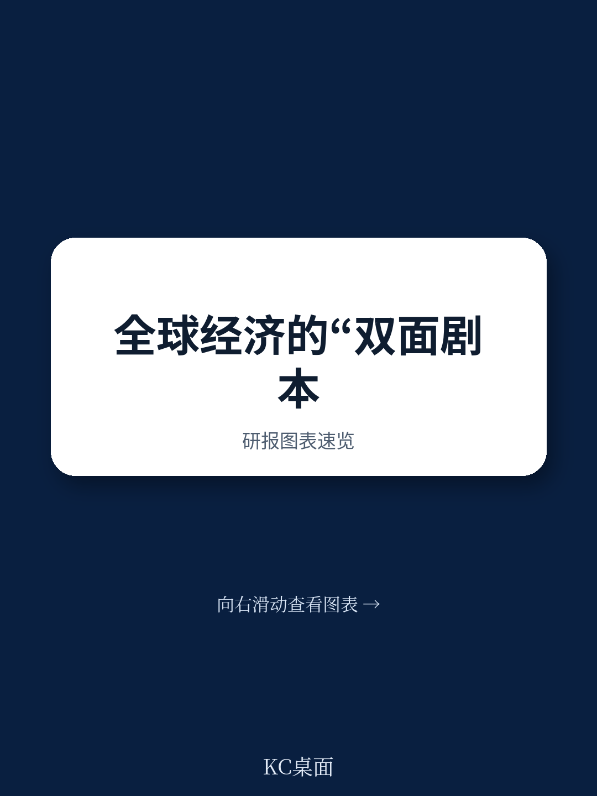
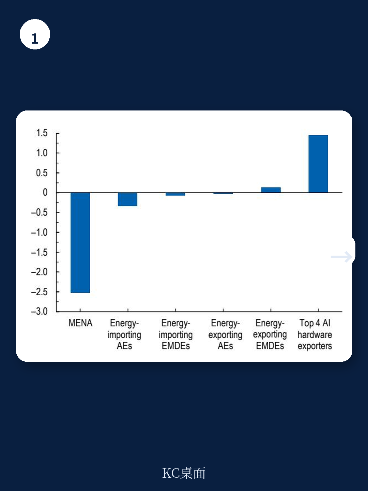
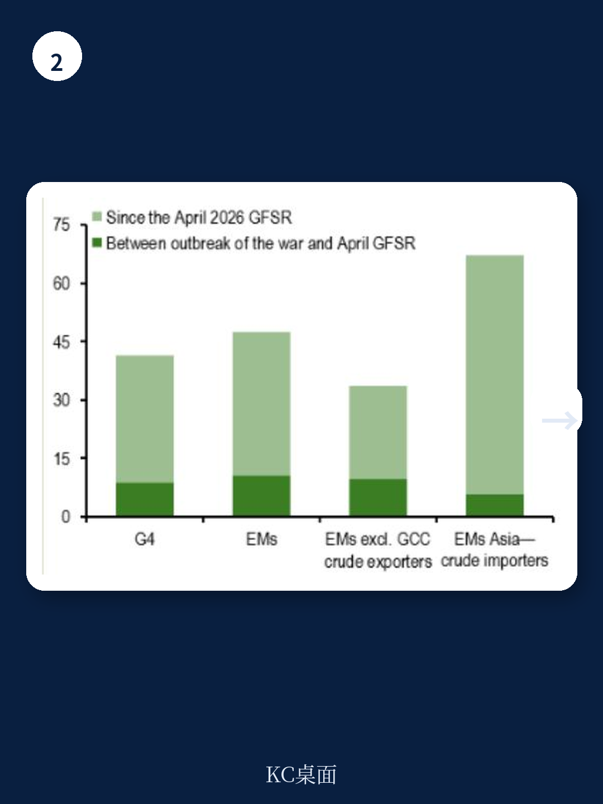

# IMF：全球通胀停滞在4.7%，美联储降息窗口被技术红利与战争冲击压缩

全球宏观环境增长正在经历一场罕见的“结构性撕裂”。IMF在2026年7月发布的《全球宏观环境展望》更新报告中，将2026年全球增速预测下调至3.0%，2027年回升至3.4%。这个数字本身并不惊人，真正值得关注的是它的构成：中东战争带来的供给冲击，与人工智能驱动的技术正周期，正在以截然相反的方向重塑各国增长轨迹。报告的核心判断是，全球宏观环境已经不再是一个“同涨同跌”的系统，而是分裂为三类地区——能源出口受益者、技术链深度参与者、以及两头不占的“夹心层”。这个分类，比任何总量数字都更能解释未来两年的研究与政策逻辑。

## 1. 战争冲击被技术周期对冲，但红利分配极不均匀

报告最引人注目的发现是，全球增长在2026年第一季度表现远超预期。IMF原本预计当季年化增速为2.7%，实际录得3.0%。但“超预期”几乎完全集中在少数几个地区：全球前四大AI硬件净出口地区（韩国、马来西亚、中国台湾、泰国）的平均增速意外高达4.4个百分点，而全球其余国家的平均意外为-0.3个百分点。

韩国的案例尤其典型。尽管高度依赖中东能源进口，韩国一季度增速达到7.5%，是4月预测值1.8%的四倍多。驱动引擎是半导体和AI硬件出口的爆发。中国增速达到8.1%（基于IMF季调估计），同样由高技术制造业和出口拉动，而国内消费仍偏弱。美国2.1%的增速略低于预期，但企业设备与知识产权研究依然强劲。

> **KC评论：** 这张图揭示了2026年最重要的宏观线索——技术周期对增长的拉动，已经大到足以对冲一场区域性战争的谨慎冲击。但前提是，地区必须身处技术价值链内部。对于不在其中的国家，战争的影响几乎是净负的。

## 2. 通胀回落进程已经停滞，货币政策拐点被推迟

全球通胀走势是这份报告另一个值得反复研读的部分。2026年全球整体通胀率预计从2025年的4.1%升至4.7%，2027年才回落至3.9%。IMF明确表示，“自2024年初以来的去通胀趋势已经停滞”。

核心通胀目前尚稳，但整体通胀的跳升正在推高短期通胀预期。报告中的图2显示，各国2026年的通胀预期普遍上移，而2027年的预期变动要小得多。这意味着市场相信通胀是暂时的，但货币政策的反应已经显现：市场正在定价更高的名义政策利率，长期主权回报表现普遍上升。

对于欧洲和日本而言，这意味着货币宽松的空间被进一步压缩。对于美国，虽然能源净出口国地位提供了缓冲，但通胀粘性叠加财政扩张，使得美联储的降息窗口变得极为不确定。

## 3. 报告没有完全回答的关键问题：技术红利能持续多久

IMF的基准假设是，AI驱动的全球技术周期将在预测期内“温和节奏变化”，且没有外生的生产率增长提振。这是一个相当保守的假设。如果技术研究超预期，或者AI应用带来的效率提升开始渗透到更广泛的行业，报告中的增长预测可能被大幅上修。反之，如果科技股估值出现修正，或者地缘政治不确定性导致技术供应链中断，节奏变化不确定性同样存在。

报告指出了这个不确定性，但没有给出判断框架。读者需要追问的是：当前AI硬件出口的繁荣，是库存周期还是资本开支周期？韩国和台湾地区的半导体产能扩张，是否已经接近短期天花板？中国的高技术制造业出口，在贸易摩擦持续的环境下，能保持多久的韧性？这些问题的答案，将决定2027年之后全球增长的真正轨迹。

## 4. 给读者的观察框架：用“技术链参与度”替代传统的“能源依赖度”

传统上，分析全球增长分化时，能源依赖度是最常用的分类变量。但这份报告表明，技术链参与度正在成为同等重要的维度。韩国同时属于高能源依赖和高技术参与，结果是净受益；欧洲国家属于高能源依赖和低技术参与，结果是净受损。

建议读者在评估任何一个地区或行业时，建立两个维度的坐标：能源敞口和技术敞口。那些同时拥有低能源依赖和高技术参与的地区（如美国、部分东南亚国家），在当前的宏观环境下拥有最大的政策余地和增长韧性。而那些两头不占的地区，尤其是依赖能源进口且未深度嵌入AI供应链的低收入国家，正面临最严峻的调整不确定性。

这份IMF报告的核心价值，不在于给出了一个精确的预测数字，而在于提供了一个更精细的分析框架。全球增长的故事，已经从“谁在涨、谁在跌”变成了“谁在受益、谁在承受成本”。

For informational purposes only. Portions may be generated,translated,summarized,or edited with AI assistance based on source materials and may contain omissions or errors. Please verify independently. This is not investment,legal,tax,accounting,or other professional advice.
