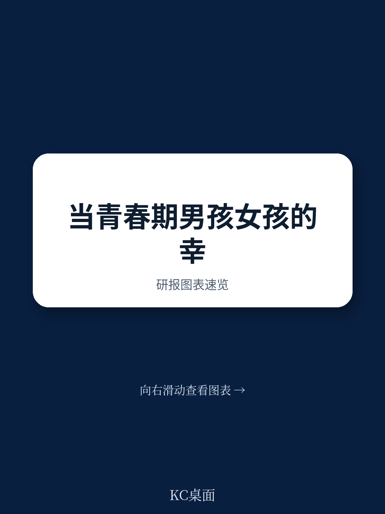
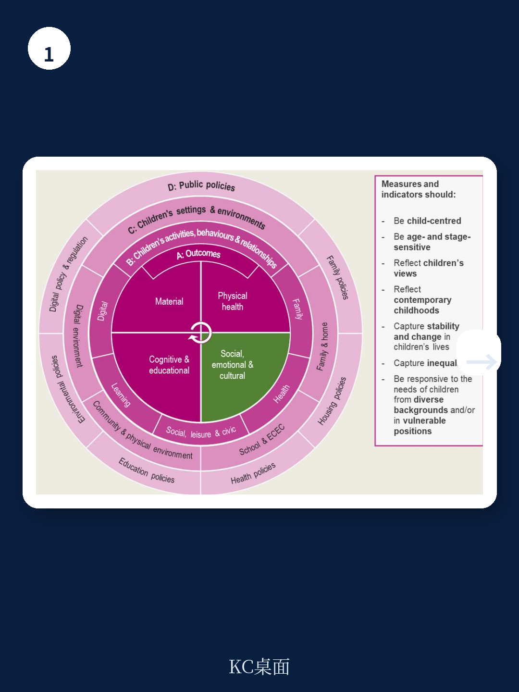
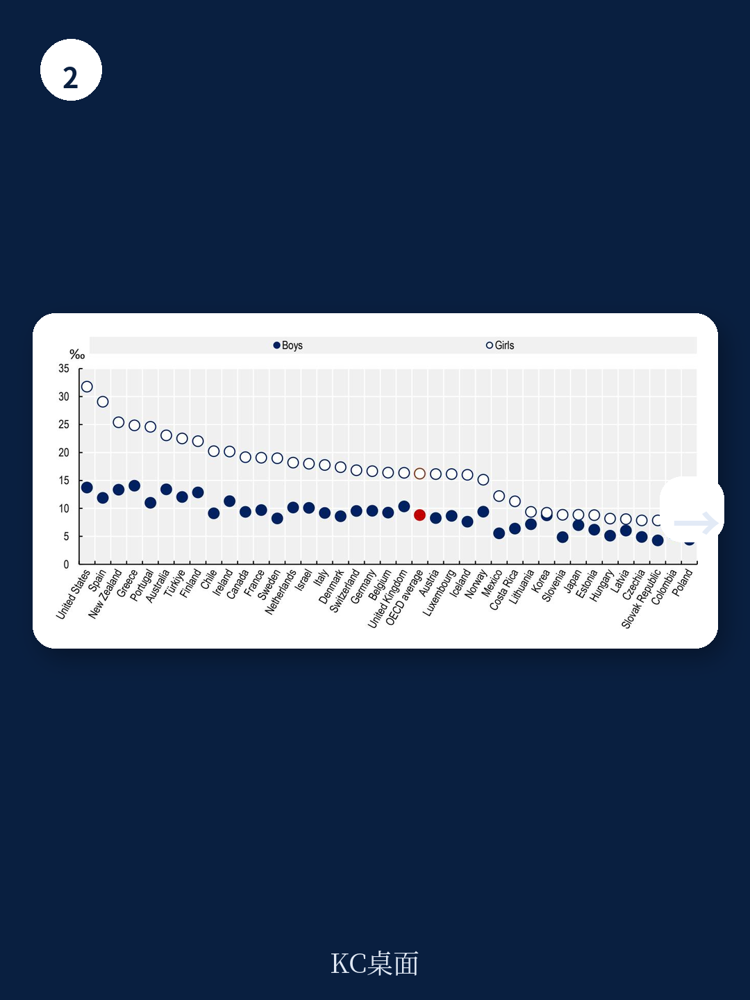

# 经合组织：不是焦虑，是内收，经合组织揭示男孩女孩福祉差异的真正原因

全球青少年福祉正在经历一场无声但深刻的出现变化。经合组织最新发布的政策报告基于跨国数据揭示了一个关键事实：男孩与女孩在社会情绪福祉上的下降路径截然不同，而当前的政策框架往往用同一套方案应对两种本质迥异的问题。

报告的核心判断是：女孩的困境更多表现为内在化——焦虑、身体意象困扰、自伤行为；男孩的困境则更多表现为外在化——学业脱钩、攻击性行为、不确定性偏好上升。两者都指向同一个结论——我们需要为不同性别的青少年设计差异化的支持体系，而不是继续用“一刀切”的方式回应正在扩大的福祉缺口。

## 1. 女孩的焦虑是内收的，男孩的不确定性是外放的

数据呈现的性别差异非常清晰。在11至15岁青少年中，女孩报告低生活满意度的概率是男孩的1.65至2.5倍。抑郁不确定性在女孩群体中更为集中，而男孩则更容易被诊断为行为障碍。这种分化不是偶然的——它反映了两种不同的应对模式。

女孩倾向于将不确定性内化。她们更频繁地报告身体意象困扰，对自己外貌的不满程度显著高于同龄男孩。报告特别指出，在几乎所有经合组织国家，女孩对身体的不满比例都高于男孩，且这一差距在社交媒体使用更频繁的群体中进一步扩大。

男孩则更多通过外在行为表达困境。他们参与肢体冲突的比例更高，学业脱钩现象更为普遍。报告引用的数据显示，男孩在学业投入度上的下降幅度大于女孩，且更倾向于回避寻求帮助——这与传统的男性气质规范密切相关。

> **KC评论：** 这不是说男孩比女孩“更健康”或“问题更少”。两者的不确定性类型不同，但结果同样严重。女孩的焦虑更容易被识别，因为她们更愿意表达；男孩的问题往往在行为爆发或学业明显波动时才被注意到，那时干预窗口已经收窄。

## 2. 社会规范成为隐形推手，问题出在“应该怎样”而非“实际怎样”

报告的一个关键贡献在于将“性别规范”纳入分析框架。它不只是呈现差异，还试图解释差异的来源。

对女孩而言，社会对“女性应该怎样”的期待——尤其是对外貌的关注——在社交媒体环境中被放大。报告提到，女孩在遭遇谨慎网络内容后更容易感到不安，她们对网络骚扰的敏感度也更高。这不是女孩“更脆弱”，而是她们面临的不确定性源更多、更密集。

对男孩而言，“男性应该坚强、不要示弱”的规范抑制了求助行为。报告指出，遵循传统男性气质的青少年更少向父母或老师倾诉心理困扰，也更容易将不确定性转化为对抗性或不确定性行为。这是一种被低估的福祉杀手——因为它不会出现在常规的心理健康筛查中，直到问题升级到不可忽视的程度。

## 3. 家庭、学校、社区和网络——四个环境都需要重新设计

报告没有停留在诊断层面，而是提出了一个多环境干预框架。它强调，青少年福祉不是单一系统能够支撑的，家庭、学校、社区和数字空间必须协同发力。

家庭层面的挑战尤为突出。数据显示，约三分之一的经合组织国家青少年报告与父母沟通存在困难，而女孩的这一比例更高。报告建议，政策应帮助家长识别早期信号，而非等到问题严重后再介入。

学校层面，报告关注到学业不确定性对女孩的影响更为显著——女孩感受到的学业不确定性普遍高于男孩，这与外部期望和自我要求的叠加有关。而男孩在学校中的主要不确定性则是学业脱钩，在缺乏正向激励的环境中更容易放弃。

数字环境是一个相对较新的变量。报告特别提到，某些线上空间可能助长男孩的反社会行为，而女孩则在网络骚扰和身体意象不确定性中承受更大负担。这意味着，数字平台的设计本身就是一个福祉政策议题。

> **KC评论：** 报告没有给出“简单答案”，这恰恰是它的价值。它提醒政策制定者：如果你只改善学校环境但忽略家庭沟通，或者只关注网络安全但不管社区支持，效果都会打折扣。这四个环境是串联的，不是并列的。

## 4. 报告尚未回答的关键问题：什么干预真正有效？

报告坦诚地指出，目前关于“什么对男孩和女孩分别有效”的证据基础仍然薄弱。它呼吁更多研究来评估针对性干预的效果，尤其是在预防反社会行为和促进健康数字体验这两个领域。

这里有一个值得注意的空白：报告提供了丰富的诊断数据，但在“如何做”的层面，更多是原则性建议而非具体方案。例如，它提到需要“低门槛的早期识别机制”，但没有给出经过验证的模型。这部分需要政策实践者自己去填补。

对于读者而言，这份报告的价值不在于提供操作手册，而在于提供了一个更精确的观察框架。当我们在讨论青少年心理健康扰动时，不能再用“整体出现变化”来概括——必须区分男孩和女孩的不同路径，必须在家庭、学校、社区和数字空间四个维度同时寻找解决方案。

For informational purposes only. Portions may be generated,translated,summarized,or edited with AI assistance based on source materials and may contain omissions or errors. Please verify independently. This is not investment,legal,tax,accounting,or other professional advice.
