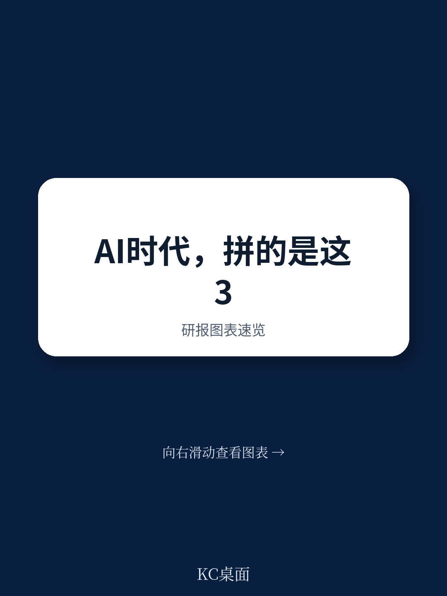
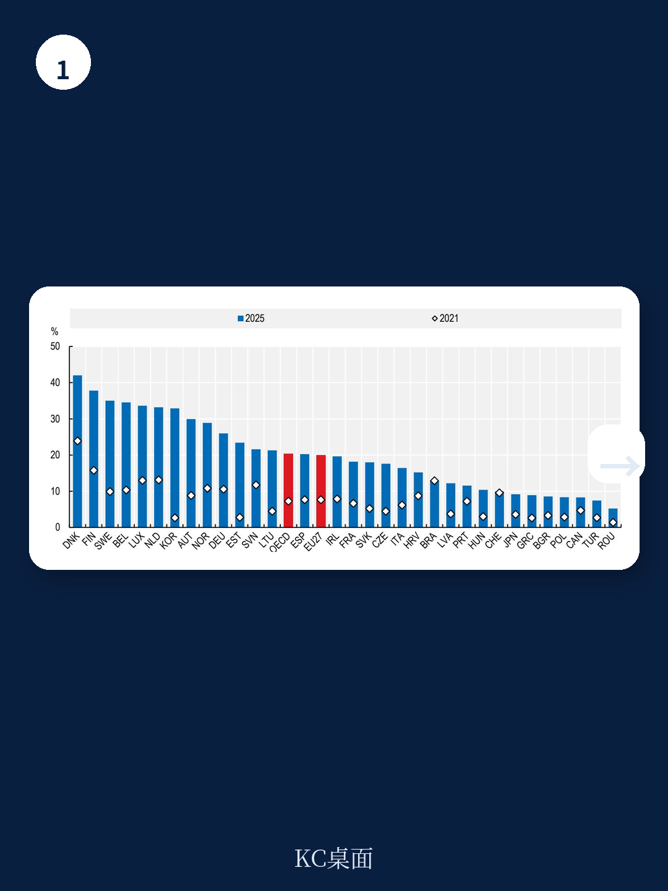
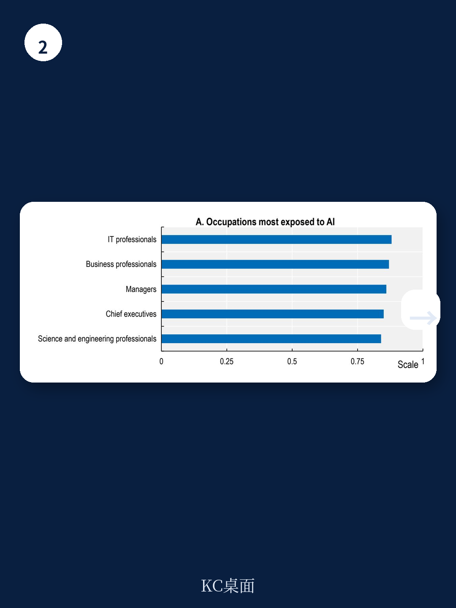

# 经合组织：AI技能人才仅占劳动力1%，政策制定者真正该焦虑的不是失业

OECD一份新报告给出了一个反直觉的判断：AI对就业的真正冲击，不是来自自动化，而是来自技能需求的系统性重组。报告追踪了2021至2025年间OECD国家企业AI采用率从约7%跃升至约20%的过程，但更值得关注的发现是——高技能岗位反而是AI暴露度最高的群体，而自动化不确定性最集中的却是中低技能岗位。这意味着，AI时代的赢家与输家，并不按传统“高技能安全、低技能危险”的剧本走。

报告的核心变量是“暴露度”与“自动化不确定性”的分离。这两个概念长期被混用，但OECD用数据证明，它们指向完全不同的职业群。管理者、专业人士、工程师的AI暴露度最高，但他们的工作依赖非程式化的认知与社交技能，自动化不确定性反而较低。而从事常规体力和认知任务的中低技能岗位，自动化不确定性更高，但AI直接暴露度并不突出。

> **KC评论：** 这张图是整份报告最有价值的分析框架。它提醒读者，讨论AI对就业的影响时，首先要区分“被AI增强”和“被AI替代”。前者是白领的现实，后者是蓝领和行政岗位的潜在不确定性。报告里关于O*NET职业数据的交叉分析值得仔细看。

报告进一步指出，到2022至2024年，已有约四分之一的劳动者暴露于生成式AI，这一比例预计将大幅上升。但AI技能人才目前仅占劳动力总量的约1%，供需缺口巨大。这才是政策制定者真正需要焦虑的地方——不是AI消灭了多少工作，而是当AI增强高技能岗位时，中低技能劳动者能否及时补上新的技能组合。

## 1. 技能短缺已成为企业采用AI的首要障碍

报告明确将技能短缺列为AI扩散的关键瓶颈。企业调研中，成本、基础设施和熟练工人短缺是中小企业采用AI的三大障碍。大企业和初创公司更有能力跨越这些门槛，而中小企业若不解决技能问题，将被进一步甩开。生产力差距的扩大，可能从企业层面传导至国家层面。

## 2. 教育体系面临“同时追赶三个目标”的难题

OECD建议各国在三个维度同时发力：提升基础素养（读写、计算、科学知识）、扩大ICT与AI技能培养、强化批判性思维与协作能力等“互补技能”。这不是一个简单的课程改革问题。报告引用的PISA和PIAAC数据表明，许多OECD国家的基础技能水平本身就在下滑，叠加AI对高级技能的需求，教育系统面临的是结构性再平衡，而非增量修补。

## 3. 雇主主导的培训才是真正的杠杆

报告特别强调了雇主主导培训的作用，并提供了德国、韩国、爱沙尼亚等国的政策案例。关键洞察在于：仅靠政府提供的正规教育无法跟上技术迭代速度，企业内部的继续培训体系才是技能更新的主战场。但中小企业在培训投入上天然不足，需要补贴、联合融资等机制来弥补市场失灵。

> **KC评论：** 报告没有回答的一个问题是：当AI本身可以加速培训内容的生产和个性化分发时，传统的“培训供给”逻辑是否会被颠覆？爱沙尼亚的“AI Leap”项目已经在这方面做了尝试，但规模化的效果仍需验证。

## 报告尚未完全回答的关键问题

OECD的分析框架清晰，但至少留有三个值得持续追踪的缺口。第一，AI对不同收入水平国家的影响差异没有被充分讨论。报告数据主要覆盖OECD成员，而发展中地区的技能基础更薄弱，AI可能带来更大的替代冲击。第二，“AI素养”的定义仍然模糊。报告呼吁推广AI素养，但从基础使用到批判性评估，不同层级所需的能力跨度极大，缺乏可操作的衡量标准。第三，职业转换的微观成本未被量化。从高自动化不确定性岗位转向AI增强型岗位，需要多长时间、多少投入、哪些支持最有效，都需要更细颗粒度的研究。

对于关注产业政策、教育研究和劳动力市场的读者，这份报告提供了一个清晰的诊断框架。AI时代的技能挑战不是“更多人学编程”就能解决的，而是需要政府、企业和教育机构在基础能力、技术技能和软技能三条线上同时推进。真正的政策难点，不在于知道该做什么，而在于如何在资源有限的情况下做出优先级排序。