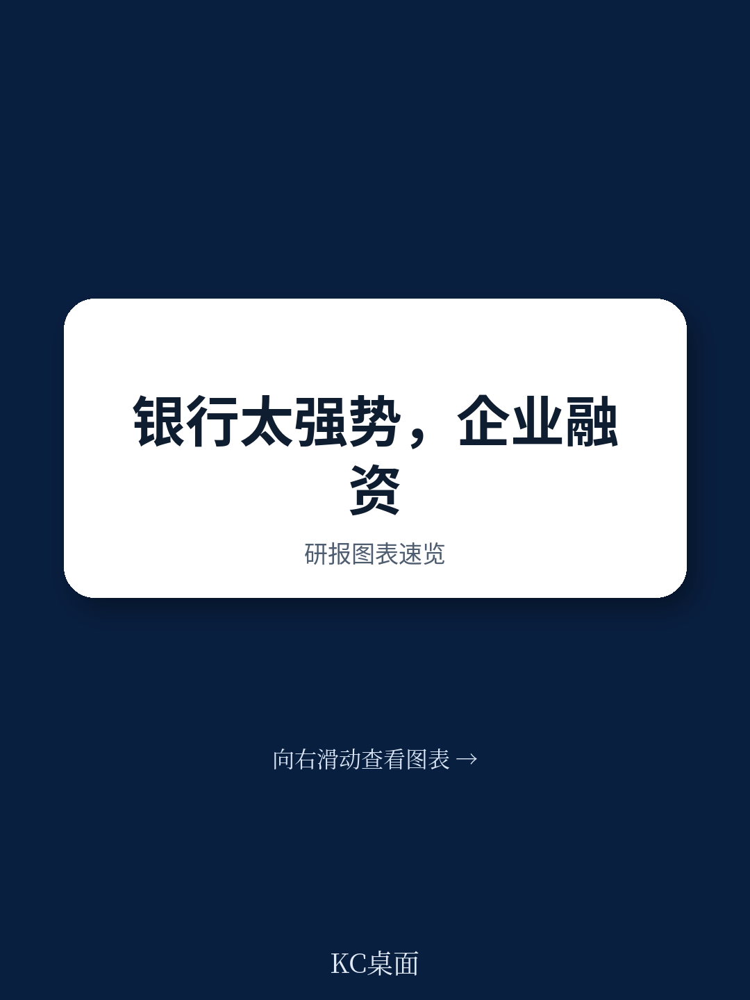
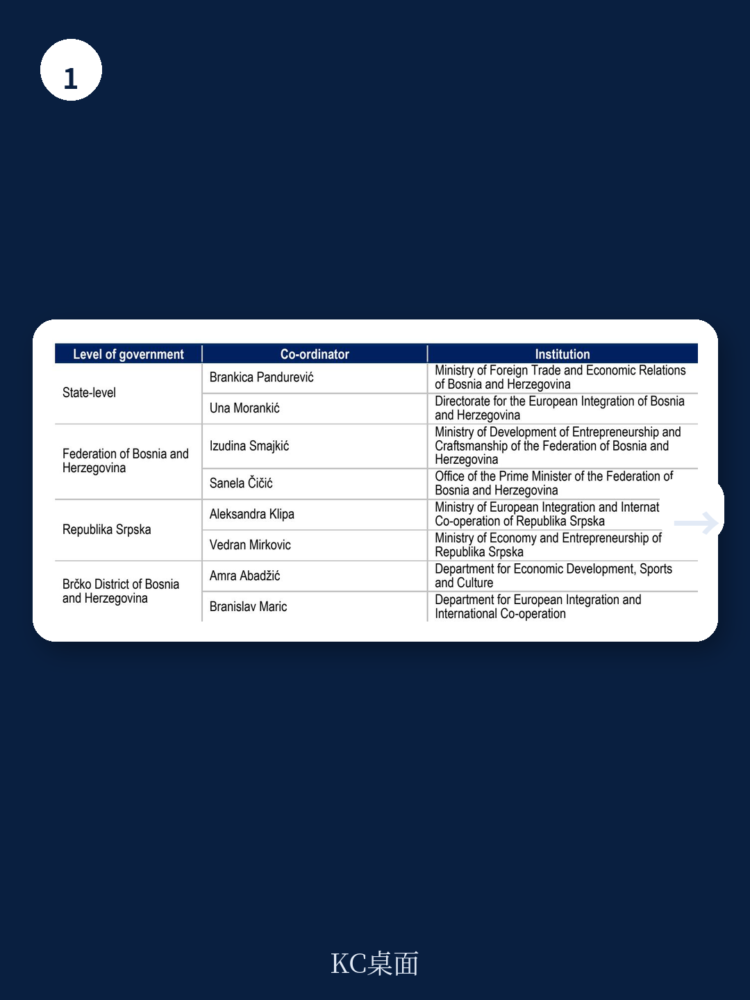
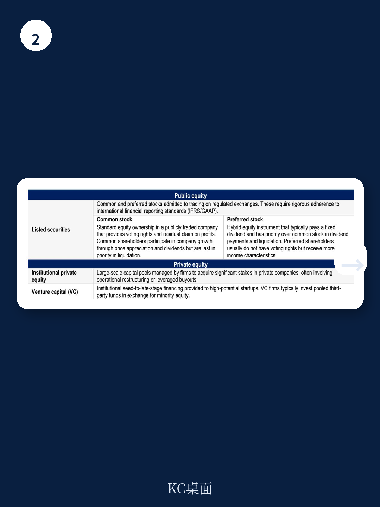

# 经合组织：波黑资本市场缺的不是资金，是信任和整合

波黑的企业融资结构有一个典型矛盾：银行信贷占资金体系资产超过90%，但国内私人部门信贷占GDP比重从2014年的约60%降至2024年的48%，远低于欧盟平均的76%。与此同时，居民存款却创下新高。经合组织这份政策报告的核心判断是：波黑资本市场的问题不在于资金总量不足，而在于制度碎片化、企业端需求与市场供给之间的结构性错配，以及战后私有化遗留的信任赤字。

报告提出，资本市场发展对波黑不仅是资金部门议题，更是私营部门尤其是中小企业能否获得成长所需长期资金的前提。在欧盟一体化进程中，更深、更规范的市场也是波黑融入欧盟单一市场、吸引研究、维持竞争力的必要条件。

## 1. 两个交易所、三个监管框架，市场深度被制度切割稀释

波黑资本市场最突出的结构问题是分裂。萨拉热窝标的交易所和巴尼亚卢卡标的交易所各自运作，2024年两市总市值分别约占实体GDP的22%和30.6%。表面上有565只上市标的，但多数是战后私有化遗留的产物，而非企业主动融资的结果。退市速度持续快于新上市，大量挂牌公司几乎没有交易量。

更值得关注的是，布尔奇科特区计划设立第三家交易所。经合组织的措辞克制但态度明确：在没有强有力的协调与统一规则的前提下，这一举措只会进一步分散本已稀薄的流动性。报告引用西班牙整合交易所基础设施的案例，暗示波黑应当考虑的方向是合并而非增设。

> **KC评论：** 对于读者而言，一个分裂的小市场意味着定价效率低、退出通道窄。报告没有明说，但逻辑指向一个结论：波黑资本市场改革的第一优先级不是新建平台，而是消除制度性的交易成本。

## 2. 公司债市场有需求，但供给端被结构性门槛卡住

公司债发行高度集中在少数非银行机构手中，单笔规模小，期限短。报告指出了几层障碍：招股说明书义务对中小企业来说过于繁重、最低认购门槛将小读者挡在门外、机构数量有限导致分销网络薄弱。这些不是技术细节，而是决定市场能否启动的底层规则。

一个被低估的信号是，2025年塞族共和国发行主权储蓄债券获得成功。报告将其视为可复制的经验，但强调这只是第一步。真正的挑战在于，如何让企业债券发行从“少数大机构的高频游戏”变成“中小企业也能参与的工具”。报告没有给出速效药方，但明确建议简化发行程序、扩大结构化咨询服务。

## 3. 机构读者缺位是市场无法形成闭环的根本原因

报告反复提到一个关键变量：自愿养老金产品。塞族共和国自2017年建立框架后，到2025年已积累约38000名成员、5300万波黑马克资产；而波黑联邦至今没有一家自愿养老金产品投入运营。这种落差不是市场选择的结果，而是监管障碍所致。

经合组织给出的分析框架值得注意：没有机构读者，就没有稳定的长期资金买方；没有买方，公司债和股权融资就难以形成定价基准；没有定价基准，散户更不敢入场。这是一个相互锁定的恶性循环。报告建议波黑联邦优先解决养老金产品运营的监管障碍，同时扩大塞族共和国的自动加入机制，使其覆盖范围超越公共部门。

> **KC评论：** 养老金产品是资本市场从“交易场所”变为“资本配置平台”的转换器。波黑目前的局面是：有储蓄，有企业融资需求，但中间缺少一个能把两者对接的制度管道。报告对养老金产品的强调，本质是在说“先修管道，再谈流量”。

## 4. 报告没有完全回答的关键问题：信任如何重建

经合组织坦率地承认，战后私有化过程中许多公民持有的公司最终变成了损失，加上波黑联邦资本市场操纵案的调查仍在进行，居民对市场的信任度极低。报告列举了各种财政激励措施，但激励只能解决参与成本问题，解决不了“为什么我要相信你”的问题。

报告给出了方向——提高资金素养、扩大零售债务产品、加强监管执法——但并未给出信任修复的时间表或量化路径。这或许是所有改革中最不确定的变量。一个没有信任基础的资本市场，再好的制度设计也可能沦为纸上工程。

## 5. 对观察者的实用框架：三个变量判断波黑资本市场是否真正启动

1. 制度整合进度：布尔奇科交易所是否选择与现有平台合并，而非独立运营。
2. 养老金产品落地：波黑联邦自愿养老金产品是否在2026-2027年内出现第一家运营实体。
3. 散户行为变化：主权储蓄债券之后的第二次零售产品发行能否延续，且不依赖财政补贴。

这三个变量分别对应流动性、机构买方和信任重建。报告没有直接给出“看多”或“看空”的判断，但提供了一个清晰的检视清单。

For informational purposes only. Portions may be generated,translated,summarized,or edited with AI assistance based on source materials and may contain omissions or errors. Please verify independently. This is not investment,legal,tax,accounting,or other professional advice.
