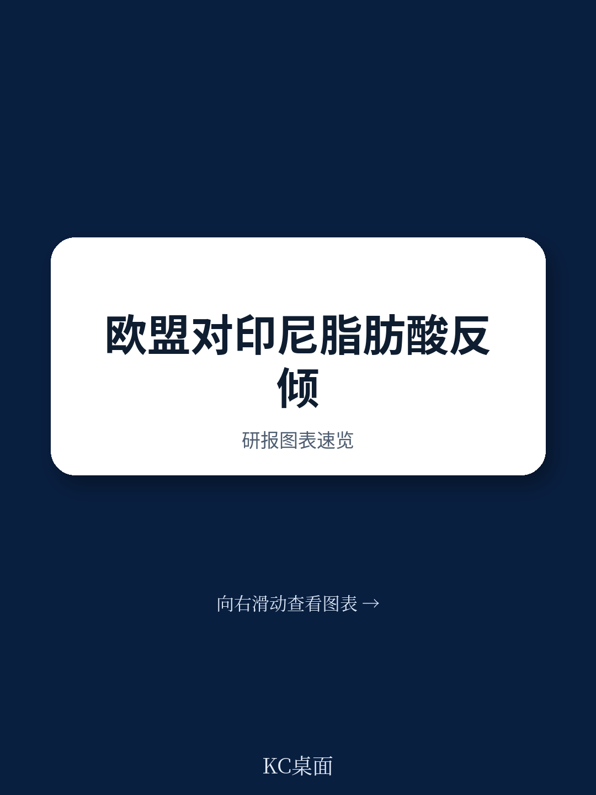

# 世界贸易组织：世界贸易组织裁决，欧盟对印尼反倾销案汇率计算违规

世界贸易组织专家组近日就印尼诉欧盟脂肪酸反倾销措施一案发布裁决报告。这份超过300页的法律文件在技术细节之外，传递了一个对全球贸易参与者都值得关注的信号：反倾销调查的程序合规性正在被更严格地审视，但挑战调查机关实体裁量的门槛依然很高。印尼在汇率计算和征税幅度上赢了关键一局，却在产业损害认定、程序中止等核心抗辩上全面落败。这起案件不是简单的胜负判定，而是为全球贸易救济规则的执行边界提供了一个新的观察样本。

## 1. 汇率计算错误成为欧盟违规的突破口，但影响范围有限

专家组认定，欧盟委员会在计算印尼出口商Musim Mas的倾销幅度时，未能按照《反倾销协定》第2.4.1条的要求使用销售当日的汇率，而是采用了其他汇率基准。这一操作直接导致倾销幅度被高估，进而使最终征收的反倾销税超过了依法应计算的倾销幅度，违反了第9.3条和GATT 1994第6:2条。

这个结论的法律意义大于商业意义。它确认了反倾销调查中汇率计算必须严格遵守“销售当日”原则，不能以操作便利为由进行调整。对于正在或即将接受反倾销调查的出口企业来说，这意味着核查阶段对汇率数据的记录和举证变得至关重要。但也要看到，这只是一个技术性违规，并不否定欧盟发起调查的正当性或产业损害的认定逻辑。欧盟只需在后续程序中修正汇率计算方法，即可恢复合规状态。

> **KC评论：** 汇率争议是反倾销案件中常见的攻防点，但能像本案这样被专家组明确认定为违规的并不多。出口企业应当把汇率数据的完整记录从“合规加分项”升级为“法律防御的必选项”。不过，这个胜利的辐射范围有限——它只影响Musim Mas一家的税率，不会动摇整个案件的基础。

## 2. 产业损害认定的抗辩几乎全面失败，暴露了挑战调查机关的难度

印尼试图从多个角度质疑欧盟的产业损害分析，包括调查机关在收到申请方撤回后仍继续调查、未给予某些积极趋势的损害指标足够权重等。专家组对这些抗辩逐一驳回。

关键判断在于：印尼未能证明欧盟在整体评估国内产业状况时，对显示积极趋势的因素“未给予适当权重”。专家组明确指出，调查机关有权在多项指标中做出综合判断，只要不是完全忽略某一类证据，就不构成违规。这个逻辑对任何试图挑战反倾销调查实体结论的申诉方都是一个警示——程序上的瑕疵容易举证，但要让专家组推翻调查机关对产业状况的实质性判断，需要证明的不是“权重不够”，而是“完全没有考虑”。

## 3. 程序中止的争议留下了未完全回答的问题

印尼的另一项核心主张是，欧盟在反补贴调查因申请撤回而终止后，继续推进同一产品的反倾销调查，违反了GATT 1994第10:3(a)条关于统一、公正、合理行政的要求。专家组以印尼未能证明存在一项“未成文措施”为由驳回了这一主张。

这里有一个尚未被完全澄清的疑问：如果未来有申诉方能够更清晰地举证调查机关在类似情形下存在系统性不一致的行政实践，而非仅仅指称一次性的行为差异，第10:3(a)条是否可能成为新的抗辩路径？本案没有给出答案，但它为后续争端留下了理论上的可能性。对于同时面临反倾销和反补贴调查的企业而言，关注两种调查程序之间的衔接逻辑，或许比单独应对其中一项更有战略价值。

## 4. 这份裁决对产业参与者的观察框架意味着什么

对于从事国际贸易的决策者而言，这份裁决的价值不在于记住具体条款，而在于理解当前世界贸易组织争端解决机制对反倾销案件的审查偏好。专家组更倾向于纠正程序性和技术性错误，而不是重新评估调查机关的产业判断。这意味着，企业在应对反倾销调查时，资源应当向程序合规和证据链完整性倾斜，而非单纯寄望于在实体结论上推翻调查机关。

同时，本案中印尼在多项实体主张上的失败，也提醒了所有贸易争端参与者：世界贸易组织的裁决不是“上诉法院”，不会轻易替代调查机关的专业判断。真正有效的抗辩策略，应当从调查阶段就开始构建，而不是等到裁决阶段才试图否定整个调查的基础。

---

For informational purposes only. Portions may be generated,translated,summarized,or edited with AI assistance based on source materials and may contain omissions or errors. Please verify independently. This is not investment,legal,tax,accounting,or other professional advice.
