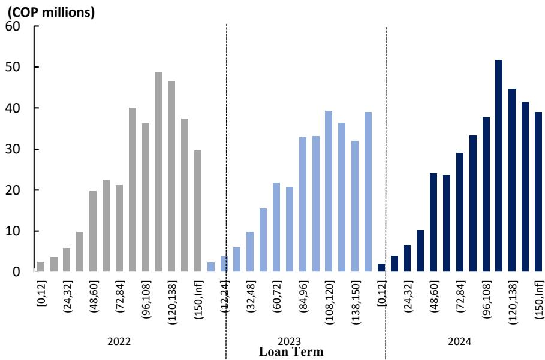
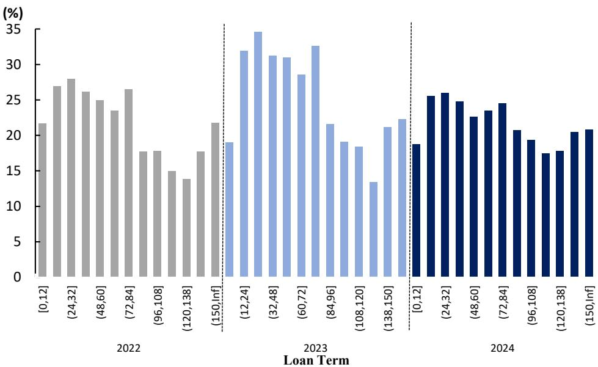
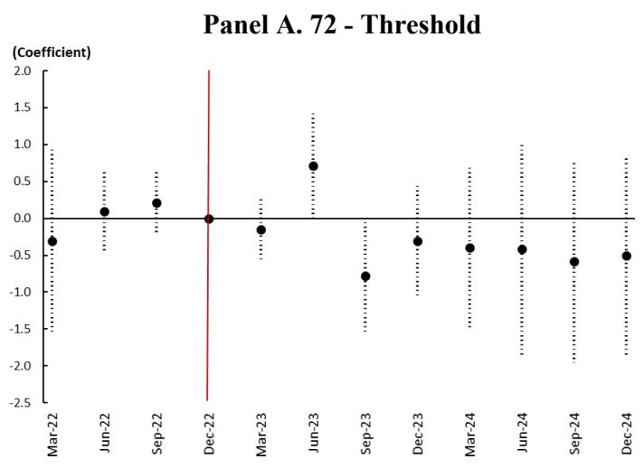
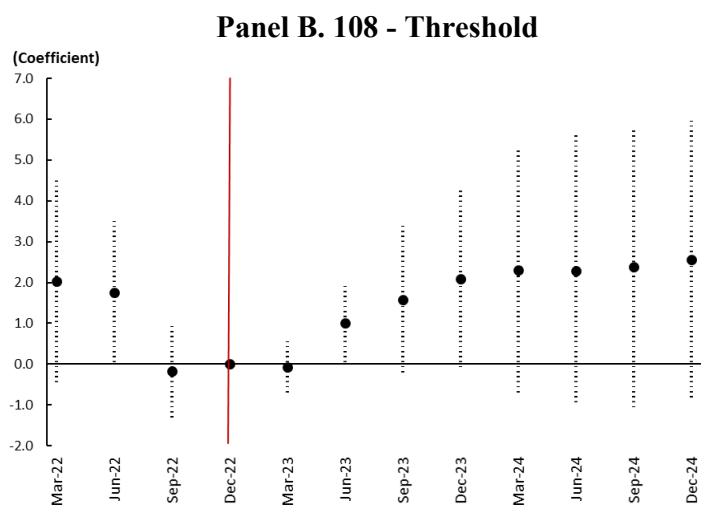
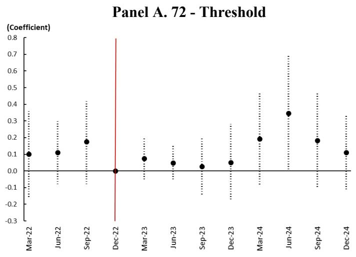
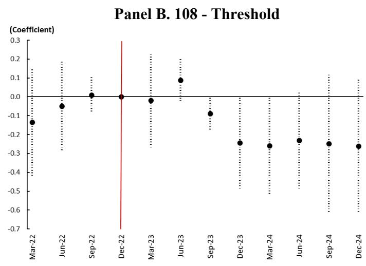
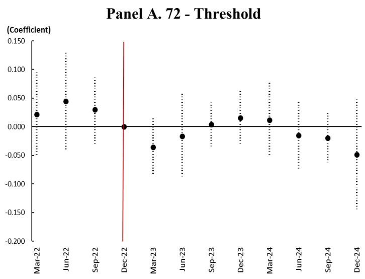
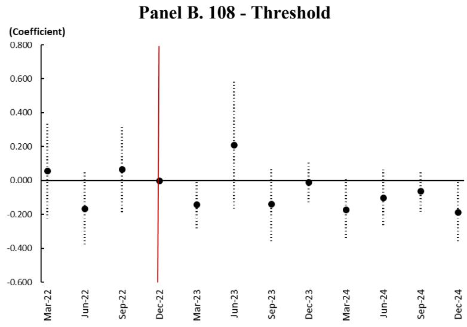

## BIS Working Papers No 1366

# Assessing the effects of recent provisioning rules on consumer credit allocation in Colombia

by Diego Cuesta-Mora, Fredy Gamboa-Estrada and Camilo Sanchez-Quinto

Monetary and Economic Department

July 2026

JEL classification: E51, E60, G21, G28

Keywords: loan-loss provisions, credit supply, consumer loans, credit risk

BIS Working Papers are written by members of the Monetary and Economic Department of the Bank for International Settlements, and from time to time by other economists, and are published by the Bank. The papers are on subjects of topical interest and are technical in character. The views expressed in this publication are those of the authors and do not necessarily reflect the views of the BIS or its member central banks.

This publication is available on the BIS website (www.bis.org).

ISSN 1020-0959 (print)
ISSN 1682-7678 (online)

# Assessing the Effects of Recent Provisioning Rules on Consumer Credit Allocation in Colombia\*

DIEGO CUESTA - MORA♦ FREDY GAMBOA-ESTRADA§ CAMILO SANCHEZ - QUINTO $^{L}$

## Abstract

Colombia's post-pandemic recovery in 2021–2022 was marked by rapid consumer credit growth, followed by deteriorating credit quality indicators amid tightening financial conditions. In January 2023, the Superintendence of Finance of Colombia (SFC) introduced higher provisioning requirements for long-term consumer loans to enhance financial resilience against credit risk materialization and to help moderate the rapid expansion of consumer credit observed prior to the reform. From the perspective of credit institutions (CIs), increased provisions imply higher expenses and potential profitability pressures, which could lead to adjustments in lending strategies. This study evaluates the effect of that regulatory policy on consumer credit dynamics and CI soundness. We find that the measure increased CIs' provision coverage ratio, indicating progress toward the policy's resilience objective, but it did not significantly affect overall credit supply conditions for longer-maturity loans in terms of loan amounts, interest rates, and collateral requirements. However, these average effects mask notable heterogeneity across institutions. Smaller lenders tightened credit supply for loans whose maturity exceeds 108 months by reducing loan amounts and lowering loan-to-value ratios, while larger lenders absorbed the higher provisioning costs without altering credit terms.

JEL Classification: E51, E60, G21, G28.

Keywords: Loan-loss provisions, credit supply, consumer loans, credit risk.

## 1. Introduction

The Colombian economy experienced a notable recovery during 2021 and 2022 following the severe contraction caused by the Covid-19 pandemic. This rebound was accompanied by real credit growth across all segments, with consumer credit expanding particularly rapidly. A breakdown of this segment shows that personal loans and credit card lending accounted for the largest share of this dynamism. At the same time, the stance of monetary policy led to a broad-based increase in lending rates across consumer credit products. Moreover, throughout 2022, newly disbursed loans were increasingly granted at maturities longer than five years, even though the overall stock of consumer credit continues to be dominated by loans with maturities shorter than five years (Cuesta-Mora et al., 2022).

From the second half of 2022 onward, however, the acceleration in consumer credit coincided with a deterioration in credit quality indicators, including rising short-term delinquency rates. Although loan-loss provisions continued to grow, their pace slowed relative to the previous year; nonetheless, the provision coverage ratio remained at historically high levels. These developments unfolded against a macroeconomic outlook characterized by rising inflation, tighter monetary conditions, slowing economic activity, and increasing unemployment. Given that 2023 was expected to bring a further deceleration of the economy, with interest rates remaining elevated and inflation above the Central Bank of Colombia's target, pressures on households' repayment capacity intensified, raising concerns about the sustainability of consumer credit growth and underscoring the importance of continued monitoring of these trends.

In response to these challenges, the Superintendence of Finance of Colombia (SFC)—the regulatory authority overseeing the financial system—issued External Circular 026 of 2022 on November 29, 2022. This regulation introduced new guidelines for credit institutions (CIs) on the provisioning of consumer loan risk, aiming to promote the healthy and sustainable growth of this portfolio while recognizing the potential deterioration in borrowers' repayment capacity amid economic slowdown and persistent inflation. Effective January 1, 2023, CIs were required to incorporate the risk associated with long-term leverage into the calculation of individual provisions for new consumer loans, excluding credit cards, revolving credit, and pensioner loans. Specifically, for new loans with maturities exceeding 72 months and 108 months, provisions had to be increased by 10% and 40%, respectively, relative to the amounts calculated under the existing expected loss model.

Regulatory changes of this type are commonly expected to influence credit supply conditions and the characteristics of newly originated loans. Existing literature on macroprudential and supervisory interventions in Colombia finds that tighter regulatory requirements—particularly those related to countercyclical provision schemes for commercial loans—can affect loan supply and its characteristics (López et al., 2014; Gómez et al., 2020; Morais et al., 2021; Cabrera et al., 2025). Nevertheless, empirical evidence on the effects of provisioning-based regulatory measures remains limited, especially in the context of emerging economies and consumer credit portfolios. Therefore, the introduction of maturity-specific provisioning requirements provides an opportunity to examine how higher regulatory costs associated with long-term lending affect consumer loan supply decisions and the allocation of credit across maturities.

The contribution of this paper is threefold. First, using granular supervisory data, it evaluates the effects of the 2022 macroprudential policy measure that updated the expected loss-based provisioning rules on supply conditions of new long-term loans, including loan amounts, interest rates, and collateral requirements. Second, it examines the heterogeneity of institutional responses by analyzing how lenders with different market positions adjusted to the higher provisioning requirements applied at the 72- and 108-month thresholds. Third, the analysis employs advanced matching methodologies that address issues such as imbalance, inefficiency, model dependence, and bias that typically arise in widely used causal inference techniques like propensity score matching, which have been prevalent in prior studies on Colombia (López et al., 2014). By doing so, we provide new insights into the interaction between regulatory measures, credit market behavior, and financial stability in emerging economies.

Our results indicate that the introduction of maturity-specific provisioning requirements did not lead to a contraction in the supply of long-term consumer credit. Contrary to concerns that higher provisioning costs would reduce loan amounts or tighten contract terms, we find no significant effects on loan volumes, interest rates, or collateral requirements for those loans in terms of loan-to-value ratios. Instead, the regulation increased coverage ratios, thereby strengthening the capacity of credit institutions to absorb potential losses. However, we also find that smaller institutions tightened credit standards for loans with maturities above 108 months—reducing both disbursed capital and loan-to-value (LTV) ratios. These asymmetric responses highlight the importance of financial institutions' market share in the consumer credit segment and their balance sheet strength in shaping the transmission of provisioning-based regulation. Taken together, the results suggest that macroprudential policies focused on broad, system-wide provisioning requirements may have more pronounced effects on credit supply conditions than maturity-specific provisioning schemes that target only a narrow segment of the loan portfolio. Additionally, because the policy measure studied in this paper coincided with a period of contractionary monetary policy, its effects on credit supply were marginal, and the policy rate likely had a stronger influence on the dynamics of consumer loans. Overall, these findings suggest that the reform improved the preparedness of CIs for potential defaults on longer-term loans, thereby supporting their overall resilience against credit risk materialization.

This article consists of five sections including this introduction. The second section describes the background on changes of the provisioning framework in Colombia and reviews prior literature. The third section describes the data and presents descriptive statistics. The fourth section presents the econometric approach and the main results. The last section summarizes the findings and discusses policy implications.

## 2. Contextual background and literature overview

## 2.1. Background on changes to the loan portfolio provisioning framework in Colombia

Since 2002, Colombia's prudential regulation evolved from a reactive, cyclical approach to a risk-sensitive, forward-looking framework that integrates countercyclical buffers and loan-loss provisions based on expected loss models. This transition reflects a broader trend toward prudential regulation aligned with global standards (e.g., Basel III, IFRS 9), aiming to enhance financial stability and reduce systemic risk.

Prior to 2002, loan-loss provisioning in Colombia was governed by accounting and supervisory rules that required CIs to increase provisions mainly in response to observed loan delinquency and did not account for macroeconomic conditions. As a result, during economic expansions CIs maintained low levels of provisions, whereas they were sharply increased during downturns, which destabilized earnings and weakened capital adequacy. In 2002, Colombia's financial regulation on loan-loss provisioning evolved to address systemic vulnerabilities caused by procyclicality. SFC introduced a comprehensive reform of the credit risk management framework in 2002, known as the Sistema de Administración de Riesgo de Crédito (SARC, External Circular 11). SARC established a structured approach to identifying, measuring, and monitoring credit risk at the institutional level, requiring credit institutions to develop internal processes, information systems, and governance arrangements to support risk management. Its implementation was carried out in phases, allowing institutions to progressively adapt their systems and reporting capabilities.

Within this broader risk management framework, the SFC later in 2007 introduced a countercyclical provisioning tool—drawing inspiration from Spain’s 2000 model. The objective was to maintain a stable ratio of provisions-to-loan portfolio throughout credit cycles, thereby reducing volatility and strengthening financial resilience. Under the mechanism, banks accumulated additional provisions during credit expansions and released them during downturns. These countercyclical provisions (CIC) were defined as the difference between current and long-term average provisions. By mitigating the procyclicality of profits and fostering stability in the entity’s credit growth, these measures enhanced resilience of the financial system—a desirable outcome for regulators—while reducing uncertainty regarding future dividends and profitability $^{1}$ , which is advantageous for shareholders.

To ensure practical implementation, SARC introduced a standardized provisioning methodology, known as the reference model for expected loss (Chapter 31 of the Circular Básica Contable y Financiera). $^{2}$ To establish individual provisions that reflect borrowers' credit risk, CIs distinguish across loan portfolio segments. For the housing and microcredit segments, CIs must provision at least 1% of the combined loan portfolio and then apply the deterministic model. In contrast, for commercial and consumer segments, CIs follow the individual provisioning model, which combines procyclical individual (CIP) and countercyclical individual (CIC) components. The CIP represents the portion of the provision that reflects the current credit risk of each borrower, whereas the CIC accounts for potential deterioration in asset quality under adverse economic conditions.

Within the individual provisioning model, CIs must distinguish two phases—accumulation and decumulation—which govern the evolution of CIC over the credit cycle. The calculation of provisions differs across these phases, and transitioning from accumulation to decumulation requires meeting specific conditions, such as a sustained increase in provisions and moderate growth in the consumer loan portfolio (Appendix A). Despite these phase-dependent rules, the input used to compute provisions remains unchanged: loan exposure, risk matrices, adjustment factors, and expected loss. Loan exposure is determined by the outstanding balance of the loan, while risk matrices and adjustment factors are predefined by regulation and vary across loan sub-segments, collateral types, and borrower risk ratings.

Expected loss is computed as shown in Equation 1, where the probability of default (PD) represents the likelihood that a borrower will default within the next 12 months. This parameter is critical because it captures the forward-looking credit risk of the portfolio. PD is estimated using transition matrices under both normal conditions and stress scenarios (Appendix B). The exposure at default (EAD) measures the total exposure at the time of default—including principal, accrued interest, and other receivables—and is essential because it determines the magnitude of potential losses if default occurs, directly linking credit risk to the size of the outstanding obligation. The loss given default (LGD) indicates the proportion of exposure that is not recoverable after default; LGD is assigned based on the number of days past due following classification in the default category (Appendix C).

$$
E x p e c t e d L o s s = P D * E A D * L G D\tag{1}
$$

Since 2007, the provisioning framework for consumer credit (i.e., the individual provision model) has undergone incremental adjustments aimed at strengthening its sensitivity to emerging risks. In 2012, the SFC introduced a temporary additional provision for consumer loans, activated when delinquency indicators deteriorated, thereby reinforcing buffers during periods of rising household credit risk. Subsequently, in 2016, the framework was refined to account explicitly for loan maturity, requiring expected losses on new consumer loans—excluding credit cards and revolving credit lines—to increase with the remaining repayment horizon. This change recognized that longer maturities expose lenders to greater uncertainty over the credit cycle and updated the expected loss formula to include a fourth term that is triggered when the remaining maturity of a loan exceeds 72 months.

In November 2022, the SFC released External Circular 026, which introduced new instructions for the establishment of provisions for risk on consumer loan portfolios. The new framework requires CIs to incorporate a factor that captures the additional risk associated with higher borrower leverage at longer maturities. For new loans—excluding credit cards, revolving credit lines and payroll loans to pensioners—granted since January 2023, an additional provisioning percentage of 10% applies when the loan maturity is greater than 72 months (6 years), and 40% when the maturity is greater than 108 months (9 years).

According to External Circular 026, these measures aim to promote the sound and sustainable growth of the consumer loan portfolio and to recognize the potential impact on borrowers' repayment capacity in the context of economic slowdown and persistent inflation. Following this update, expected losses for consumer loans should be calculated as shown in Equation 2 where the maturity adjustment (MA)—introduced in the 2016 regulatory update—accounts for loan term risk in expected loss calculations. The MA equals 1 for loans with a remaining maturity shorter than 72 months, and $MA = \frac{m}{72}$ otherwise, where $m$ denotes the remaining maturity in months. Additionally, CIs were also required to conduct a forward-looking analysis of potential deterioration in the consumer loan portfolio and, if necessary, establish an additional general provision no later than December 31, 2022.

$$
E x p e c t e d L o s s = P D * E A D * L G D * M A * K\tag{2}
$$

Longer maturities generally imply greater uncertainty and increased exposure to adverse conditions, making this adjustment essential for risk-sensitive provisioning. The $K$ factor captures additional risk associated with higher leverage at longer maturities, enhancing the model's sensitivity to structural vulnerabilities in consumer credit portfolios, particularly under scenarios of prolonged debt accumulation. The $K$ factor is calculated as follows:

$$
K = \left\{ \begin{array}{c c} 1 & i f m \leq 7 2 \\ 1. 1 i f 7 2 <   m \leq 1 0 8 \\ 1. 4 & i f m > 1 0 8 \end{array} \right\}\tag{3}
$$

By design, the introduction of the K factor increases the marginal cost of supplying long-maturity consumer credit, particularly for loans extending beyond six and nine years. This discrete and maturity-specific adjustment to expected loss calculations provides a natural setting to assess how higher regulatory provisioning requirements influence loan supply decisions and the allocation of credit across maturities in the consumer loan market.

## 2.2. Related literature

Since the global financial crisis of 2008, regulatory authorities in an increasing number of jurisdictions have required CIs to adopt an expected credit loss (ECL) provisioning framework. Under this approach, institutions must accumulate provisions from the time a loan is disbursed, rather than waiting for credit risk to materialize, as was the case under the incurred loss approach. This shift responds to concerns that delayed recognition of credit losses can exacerbate systemic vulnerabilities (Cohen and Edwards, 2017). Moreover, the ECL framework has been shown to mitigate the procyclical behavior of credit, which can amplify adverse shocks during economic downturns. A seminal paper by Jiménez et al. (2017) drew considerable attention from policymakers and scholars to the relationship between regulation and bank risk-taking. The authors examined the effects of countercyclical loan-loss provisions (CIC) in Spain on the credit cycle and found that countercyclical buffers provide additional protection during downturns. Their results show that increases in provisioning requirements contributed to smoothing credit-supply cycles.

López, Tenjo, and Zárate (2014) assessed the effectiveness of the countercyclical provisioning system (CIC tool) on credit dynamics in Colombia. Using Propensity Score Matching (PSM) models, their findings indicate that this type of macroprudential policy exerted a negative impact on credit growth across different percentiles. Cardozo, Murcia, and Vargas (2017) employed a panel data model and found that SARC strengthened bank solvency and liquidity by inducing a reduction in risk-weighted assets. Gómez et al. (2020) explored the impact of dynamic provisions on commercial credit in the run-up to the 2008 crisis. Applying a two-way fixed effects (TWFE) model restricted to firms with multiple banking relationships, they documented a negative effect of these provisions on credit growth, which varied according to specific characteristics of banks and borrowers. Morais et al. (2021) analyzed the impact of SARC on commercial credit using a bank-firm relationship panel. Their results suggest that banks tightened their credit allocation policies, affecting higher-risk debtor firms. Finally, Cabrera et al. (2025) examined the effects of the countercyclical provisioning scheme on the corporate credit portfolio over 2008–2018. They found that higher provisioning costs for downgraded loans reduced credit supply, increased collateral requirements, and tightened LGD coverage. Downgraded firms also faced investment constraints and contractions in liabilities, equity, and assets.

A large empirical literature examines how macroprudential policies affect credit dynamics. Saurina and Jiménez (2006) show that rapid credit growth increases loan losses and that countercyclical provisions enhance banking-system soundness. Drehmann and Gambacorta (2012) find that countercyclical capital buffers mitigate credit procyclicality and strengthen resilience. Tovar et al. (2012) document that reserve requirements in Latin America have modest, short-term effects on credit and complement monetary policy. Aikman et al. (2015) argue that macroprudential tools curb credit cycles through risk-cost and expectations channels. Using cross-country data, Akinci and Olmstead-Rumsey (2018) show that tighter macroprudential measures reduce credit growth, a result consistent with evidence for Latin America in Gambacorta and Murcia (2020), who also find stronger effects when paired with monetary policy. Andries et al. (2022) report that macroprudential policies reduce credit growth in the short run but support sustainable expansion in the long run. Ekinci and Özcan (2021) further show that these measures are more effective when reinforced by tighter regulatory frameworks.

Our study builds on Morais et al. (2020) and López, Tenjo, and Zárate (2014), who evaluate the effects of Colombia's provisioning framework on commercial credit. By contrast, we focus on the consumer loan segment, which is directly affected by the 2022 maturity-specific regulatory reform. In addition, we exploit supervisory data at a finer level of disaggregation, which enables us to examine how institutions adjust loan supply across the maturity distribution. Methodologically, while earlier work commonly relies on propensity score matching, we apply more advanced matching procedures that overcome limitations such as imbalance and model dependence.

## 3. Data and stylized facts

## 3.1. Data and sample description

This section describes the data used to assess the impact of the regulatory change detailed above. Our primary data source is Format 341 from the SFC, an administrative record that provides granular quarterly information on the universe of credit portfolios in Colombia, disaggregated at the debtor-institution level.

The dataset is structured along two dimensions. First, it includes debtor-level information such as legal status, identification, and main economic activity. Second, it incorporates detailed loan-level characteristics, including segment, sub-segment, loan amount (outstanding balance), interest rate, provisions, origination and maturity dates, collateral value and type, and days past due. In addition, the determinants of expected loss are reported: PD, LGD, and EAD. Technical details for all variables included in the sample are provided in Table D.1 of Appendix D.

Given that the 2022 regulatory reform applies only to recent originated consumer credit, the sample is restricted exclusively to new loans within the consumer loan portfolio. These are defined as obligations whose origination date coincides with the reporting month. Credit card operations are excluded, as this segment is not subject to the new provisioning requirements. Similarly, revolving credit is exempt from the regulation. However, because this segment cannot be explicitly isolated within the database, we exclude all loans classified as 'Other' that cannot be identified—based on their specific risk parameters—under the sub-modalities of payroll-deducted $^{3}$ , personal $^{4}$ , vehicle, or low-amount loans.

Format 341 exhibits a technical peculiarity whereby, if a borrower holds multiple obligations within the same segment, credit rating, collateral type, and financial institution, the system consolidates these operations into a single record. In such cases, the format presents aggregated values for loan amount and provisions, and weighted averages for interest rates; however, the origination and maturity dates, as well as the collateral value, correspond only to the largest loan. To avoid biases in estimating the effects on new credit supply arising from this aggregation procedure, the sample is restricted to unique records for each borrower-institution pair by segment, rating, and collateral. Specifically, only observations for which the number of underlying loans equals one are retained. $^{5}$

With the dataset constructed, an outlier-cleaning process was applied by trimming observations at the 1st and 99th percentiles for capital, interest rate, collateral value, and loan-to-value variables. Additionally, the regulation stipulates that within the payroll-deducted sub-segment, the reform does not apply to pensioners. Consequently, loans associated with these borrowers —identified through the debtor's economic sector variable—are excluded from the sample. $^{6}$ After implementing the full set of control variables and data-cleaning procedures, the final dataset for the 2022–2024 period comprises 8,120,390 newly originated loans.

Additional borrower-level variables were constructed to capture recent credit history. Specifically, dummy variables were defined to identify whether the borrower had maintained any commercial relationship with the financial system during the four quarters preceding the new loan's origination. Likewise, indicators were created to determine whether the borrower had experienced delinquency exceeding 30 days during that period, and whether the prior credit relationship was with the same institution granting the new loan. These variables help capture latent borrower risk characteristics and account for pre-existing banking relationships that may influence the supply conditions of new credit.

Finally, the database was merged with bank-level financial indicators to control for bank heterogeneity. This information, also sourced from the SFC, includes operational and size metrics such as total assets and a dummy identifying institutions with the largest market share in the consumer loan portfolio. Risk-management indicators were also incorporated, including portfolio quality by delinquency and risk.

Performance and solvency measures were added as well, such as Return on Assets (ROA), the Net Stable Funding Ratio (NSFR) as a measure of structural liquidity, and the capital adequacy ratio (CAR). Additionally, an indicator capturing whether an institution met the regulatory conditions to activate the countercyclical provision release phase was included (Appendix A).

## 3.2. Treatment identification and descriptive statistics

Utilizing the loan maturity variable and the filtering criteria outlined in the previous section, we distinguish between loans subject to the regulatory change (treatment) and those not affected (control). Given the regulation's tiered structure, we define two treatment groups corresponding to the 72- and 108-month thresholds. Both groups are compared against a common control group—consisting of loans with maturities of 72 months or less, as formalized in Equations (4) and (5).

$$
T r e a t m e n t _ {7 2 i} = \left\{ \begin{array}{l l} 1, & \text {if 72 months <   term of loan i\leq 108 months} \\ & 0, \text {if term of loan i\leq 72 months} \end{array} \right.\tag{4}
$$

$$
T r e a t m e n t _ {1 0 8 i} = \left\{ \begin{array}{l l} 1, & \text {if term of loan i > 108 months} \\ 0, & \text {if term of loan i \leq 72 months} \end{array} \right.\tag{5}
$$

Since the dataset consists of new loans issued each quarter, the data are structured as a pooled cross-section. We do not track individual loans over time to construct a panel, as our focus is not on the evolution of credit performance but on the conditions granted at the moment of origination. Accordingly, the composition of the treatment and control groups varies across periods, with loans classified solely based on their initial maturity term.

As is standard in impact evaluations, the validity of our analysis relies on the comparability between the treatment tiers and the control group, ensuring that observed differences can be properly identified as average treatment effects. This requirement poses a challenge in our setting, as loans naturally exhibit different characteristics depending on their maturity. As shown in Chart 1, longer-term loans tend to have higher average loan amounts, while Chart 2 indicates that average interest rates are typically higher for shorter-term loans. Recognizing these structural differences is essential: failing to account for such intrinsic characteristics could lead to spurious findings, for example, incorrectly attributing higher loan amounts or lower interest rates to the regulatory change. Additionally, although the regulation could incentivize credit institutions to shift their loans to shorter maturities, we did not observe any change in the loan distribution by maturity before and after its adoption.

When evaluating balance between the control and treatment samples, substantial disparities emerge across other observable variables, as measured by the Standardized Mean Difference (SMD). This metric, widely used to assess covariate balance, computes the difference in means relative to the pooled standard deviation. Unlike traditional t-tests, the SMD is independent of sample size and therefore avoids detecting statistically significant differences merely due to very large samples. Conventionally, an SMD value above 0.1 signals meaningful imbalances between groups.

Chart 1. Average Loan Amount by Maturity Term  
  
Source: Financial Superintendence of Colombia (SFC). Authors' calculations.

Chart 2. Average Interest Rates by Maturity Term  
  
Source: Financial Superintendence of Colombia (SFC). Authors' calculations.

Comparison between the control group and the 72-month treatment group (Treatment 72) shows considerable differences across nearly all loan-level variables, except for the credit rating, interest rate, and the coverage indicator (Table 1). Detailed descriptive statistics, including means and standard deviations for continuous variables and distributions for categorical variables are provided in Table E.1. For example, collateral values are higher in the treatment group, consistent with the lower prevalence of unsecured loans in that segment. Differences are also apparent in loan sub-modalities: the control group is heavily concentrated on personal loans, whereas the treatment group exhibits a higher share of vehicle and payroll deducted loans. At the debtor level, imbalances arise primarily across economic sectors. By contrast, the dummy variables capturing borrowers' historical relationship with the financial system appear more balanced. There is also notable heterogeneity in the distribution of financial institutions originating new loans, indicating that some lenders are more exposed to specific maturity terms.

Table 1. Covariate Balance Assessment using Standardized Mean Differences (SMD)

<table><tr><td rowspan="2">Category</td><td rowspan="2">Variable</td><td colspan="2">Standardized Mean Difference (SMD)</td></tr><tr><td>Control vs Treatment 72</td><td>Control vs Treatment 108</td></tr><tr><td>Time Variables</td><td>Reporting Quarter</td><td>0.203*</td><td>0.141*</td></tr><tr><td rowspan="10">Loan-Level Variables</td><td>Loan Sub-segment</td><td>0.849*</td><td>1.912*</td></tr><tr><td>Collateral Type</td><td>0.378*</td><td>0.337*</td></tr><tr><td>Credit Rating</td><td>0.067</td><td>0.302*</td></tr><tr><td>Probability of Default</td><td>0.531*</td><td>0.396*</td></tr><tr><td>Loss Given Default</td><td>0.763*</td><td>2.115*</td></tr><tr><td>Collateral Value</td><td>0.326*</td><td>0.155*</td></tr><tr><td>Loan Amount</td><td>0.675*</td><td>1.247*</td></tr><tr><td>Interest Rate</td><td>0.005</td><td>1.067*</td></tr><tr><td>Loan to value</td><td>0.352*</td><td>0.145*</td></tr><tr><td>Coverage Indicator</td><td>0.017</td><td>0.34*</td></tr><tr><td rowspan="5">Debtor-Level Variables</td><td>Debtor Type</td><td>0.018</td><td>0.039</td></tr><tr><td>Economic Sector</td><td>0.137*</td><td>0.391*</td></tr><tr><td>Prior Credit Relationship</td><td>0.095</td><td>0.009</td></tr><tr><td>Prior Delinquency</td><td>0.03</td><td>0.003</td></tr><tr><td>Recurring Debtor</td><td>0.001</td><td>0.116*</td></tr><tr><td>Financial Institution-Level Variables</td><td>Financial Institution</td><td>0.992*</td><td>1.387*</td></tr></table>

Source: Financial Superintendence of Colombia (SFC). Authors' calculations. Notes: \* SMD > 0.1, indicating an unbalanced covariate. For the purpose of this table, when the LTV is undefined due to a zero-collateral value, it is recorded as zero.

For the 108-month treatment group (Treatment 108), deviations from the control group are even more pronounced. All loan-level variables are unbalanced according to the SMD. Differences in average principal amounts are particularly pronounced, accompanied by lower interest rates and higher coverage levels. Regarding credit ratings, although both groups are concentrated in Category A, the treatment group exhibits a higher share of lower-quality ratings. Sub-modality patterns also differ: the treatment group contains a larger proportion of payroll-deducted loans, whereas the control group is more heavily represented in the personal-loan sub-segment. As in the 72-month tier, debtor-level differences for Treatment 108 are mainly associated with economic sector composition. Moreover, longer-term loans do not appear to be mainly driven by borrowers with prior credit relationships with the same bank. Finally, as in the 72-month tier, the concentration of originating financial institutions differs markedly between the treatment and control groups.

## 4. Econometric approach and results

## 4.1. Exact matching

Given the structural imbalances observed between the control and treatment groups, it is essential to adopt an identification strategy that ensures comparability across observable variables, thereby allowing us to isolate the policy's effect on new consumer loans. To address this issue and mitigate selection bias, we employ Exact Matching (EM) as the first step in our econometric approach.

Unlike other matching techniques —such as Propensity Score Matching—EM relies on a strict criterion: each treated unit is matched to all control units that share the same values for all covariates. This procedure partitions the data into subclasses defined by unique combinations of observable characteristics. Within each subclass, treatment and control units are identical with respect to these variables, ensuring that any remaining difference is driven solely by loan maturity, which determines treatment assignment. Observations that do not find an exact match are discarded, guaranteeing perfect covariate balance within the analyzed subsample.

We implement multiple specifications of the exact matching algorithm, varying the set of covariates according to the outcome variable of interest, as detailed in Table 2. This framework is applied consistently to both treatment comparisons: the control group versus Treatment 72 and the control group versus Treatment 108. The first specification (EM1) is used across all primary outcomes —interest rate, loan amount, coverage ratio, and LTV. For the LTV analysis, the sample is restricted to loans with non-zero collateral values, as the ratio is otherwise undefined. To ensure that loans are compared under identical macroeconomic and financial conditions, EM1 includes the reporting quarter as a mandatory matching covariate. Matches are further restricted to within the same financial institution, thereby controlling for unobserved supply-side heterogeneity, such as differences in risk appetite and credit-scoring models across lenders. To account for segment-specific lending policies, we require exact matches on the loan sub-segment. We also control for risk profiles by matching on collateral type, credit rating, PD, and LGD, ensuring that comparisons are restricted to loans with equivalent risk characteristics. Finally, at the borrower level, we match on debtor type and economic sector, thereby holding constant the borrower's economic activity across treatment and control groups.

The second specification (EM2) builds on the baseline by incorporating additional loan conditions to further refine the counterfactuals. Specifically, we include discretized values of collateral, loan amount, and interest rate, which are added to the covariate set depending on the dependent variable under analysis. Because these are continuous variables, we discretized them into percentiles to ensure comparability: loan amount and interest rate are divided into 100 percentiles while collateral is divided into 20 percentiles. $^{7}$ This partitioning enables the matching algorithm to account for more granular loan characteristics.

The specifications impose specific restrictions depending on the dependent variable under analysis to avoid over-matching. For the interest rate analysis, we include loan amount and collateral value in the covariate set to ensure that loans of comparable size and collateralization are matched. Crucially, the interest rate itself is excluded from the matching process; otherwise, treatment and control groups would be artificially balanced on the outcome variable, making the treatment effect unidentifiable. For the analysis of loan amount and coverage ratio, we instead match on the interest rate and collateral value. The same restriction applies to the coverage ratio because this indicator is a function of the loan principal (provisions divided by capital); therefore, including loan amount in the matching set would induce mechanical bias. Finally, for the LTV analysis, matches are selected solely on the interest rate (in addition to the EM1 baseline covariates), explicitly excluding both loan amount and collateral value since these variables directly compose the LTV ratio.

Table 2. Matching Specifications by Variable of Interest

<table><tr><td rowspan="2">Category</td><td rowspan="2">Variable</td><td colspan="3">Interest rate</td><td colspan="3">Loan Amount &amp; Coverage Ratio</td><td colspan="3">LTV</td></tr><tr><td>EM1</td><td>EM2</td><td>EM3</td><td>EM1</td><td>EM2</td><td>EM3</td><td>EM1</td><td>EM2</td><td>EM3</td></tr><tr><td>Time Variables</td><td>Quarter Identifier</td><td>X</td><td>X</td><td>X</td><td>X</td><td>X</td><td>X</td><td>X</td><td>X</td><td>X</td></tr><tr><td rowspan="8">Loan-Level Variables</td><td>Loan Sub-segment</td><td>X</td><td>X</td><td>X</td><td>X</td><td>X</td><td>X</td><td>X</td><td>X</td><td>X</td></tr><tr><td>Collateral Type</td><td>X</td><td>X</td><td>X</td><td>X</td><td>X</td><td>X</td><td></td><td></td><td></td></tr><tr><td>Credit Rating</td><td>X</td><td>X</td><td>X</td><td>X</td><td>X</td><td>X</td><td>X</td><td>X</td><td>X</td></tr><tr><td>Probability of Default</td><td>X</td><td>X</td><td>X</td><td>X</td><td>X</td><td>X</td><td>X</td><td>X</td><td>X</td></tr><tr><td>Loss Given Default</td><td>X</td><td>X</td><td>X</td><td>X</td><td>X</td><td>X</td><td>X</td><td>X</td><td>X</td></tr><tr><td>Collateral Value Category</td><td></td><td>X</td><td>X</td><td></td><td>X</td><td>X</td><td></td><td></td><td></td></tr><tr><td>Loan Amount Category</td><td></td><td>X</td><td>X</td><td></td><td></td><td></td><td></td><td></td><td></td></tr><tr><td>Interest Rate Category</td><td></td><td></td><td></td><td></td><td>X</td><td>X</td><td></td><td>X</td><td>X</td></tr><tr><td rowspan="5">Debtor-Level Variables</td><td>Debtor Type</td><td>X</td><td>X</td><td>X</td><td>X</td><td>X</td><td>X</td><td>X</td><td>X</td><td>X</td></tr><tr><td>Economic Sector</td><td>X</td><td>X</td><td>X</td><td>X</td><td>X</td><td>X</td><td>X</td><td>X</td><td>X</td></tr><tr><td>Prior Credit Relationship</td><td></td><td></td><td>X</td><td></td><td></td><td>X</td><td></td><td></td><td>X</td></tr><tr><td>Prior Delinquency</td><td></td><td></td><td>X</td><td></td><td></td><td>X</td><td></td><td></td><td>X</td></tr><tr><td>Recurring Debtor</td><td></td><td></td><td>X</td><td></td><td></td><td>X</td><td></td><td></td><td>X</td></tr><tr><td>Financial Institution-Level Variables</td><td>Financial Institution</td><td>X</td><td>X</td><td>X</td><td>X</td><td>X</td><td>X</td><td>X</td><td>X</td><td>X</td></tr><tr><td rowspan="2">Observations</td><td>Control and Treatment 72</td><td>6,687,016</td><td>5,344,050</td><td>5,049,605</td><td>6,687,016</td><td>5,300,503</td><td>5,101,238</td><td>255,322</td><td>214,057</td><td>201,235</td></tr><tr><td>Control and Treatment 108</td><td>3,801,224</td><td>2,288,194</td><td>2,040,704</td><td>3,801,224</td><td>2,342,041</td><td>2,121,412</td><td>14,643</td><td>2,682</td><td>2,064</td></tr></table>

Source: Financial Superintendence of Colombia (SFC). Authors' calculations. Note: An "X" denotes the covariates included in each specification.

Finally, the third specification (EM3) incorporates covariates related to the borrower's recent credit history across all outcome variables. This ensures that loans are matched between borrowers with similar profiles in terms of access to the financial system and delinquency behavior — factors that financial institutions routinely use when determining credit supply conditions. Consequently, EM3 represents the most comprehensive specification, imposing stricter matching criteria than EM1 and EM2. This additional rigor naturally results in a smaller number of matched observations, as shown in Table 2, a pattern that holds for both the 72-month and 108-month treatment comparisons. Employing these three alternative matching specifications enable us to assess the robustness of our findings.

The matching process serves a dual purpose: it isolates the subset of matched treatment and control observations that form our final analytical sample and generates the specific weights required to balance both groups across observable characteristics. These weights play a central role for the second stage of our econometric approach.

## 4.2. Difference-in-differences

Once the matched datasets are established, the next step is to identify the causal effect of the regulatory change on credit conditions. To this end, we employ a Difference-in-Differences (DiD) framework. This approach leverages the fact that we observe loans in both the control and treatment groups before the regulatory change (up to December 2022) and after its implementation. We therefore estimate the baseline specification (6) separately for the 72-month and 108-month thresholds. In each case, we use the corresponding matched subsample derived from the exact matching procedure described in the previous section, along with the appropriate treatment indicator $Treatment_{72i}$ or $Treatment_{108i}$ . The model is estimated using Weighted Least Squares (WLS), incorporating the matching weights to preserve covariate balance.

This specification includes a robust set of controls to ensure proper identification of the treatment effect. Time fixed effects are included to absorb aggregate shocks affecting all loans in each quarter, while financial-institution fixed effects account for time-invariant characteristics such as business models or risk management practices. In addition, we incorporate time-varying bank-level controls to capture institutions' most recent financial performance. Importantly, although matching enhances comparability between treatment and control groups, it does not guarantee that the outcome variables share the same baseline levels on average. Therefore, the treatment indicator must be explicitly included in the estimation.

$$
Y _ {i f t} = \alpha + \mu T r e a t m e n t _ {i} + \beta (T r e a t m e n t _ {i} * P o s t _ {t}) + \sigma_ {t} + \delta_ {f} + \Gamma X _ {f t} + e _ {i f t}\tag{6}
$$

## where:

■ $Y_{ift}$ : outcome variable for loan i of financial institution f in quarter t.

\- $Treatment_{i}$ : binary indicator representing the treatment group specific to the analysis $Treatment_{72i}$ or $Treatment_{108i}$ .

\- $Post_{t}$ : dummy variable equal to 1 for quarters following the regulatory change (post-2022), and 0 otherwise.

■ $\mu$ : captures the time-invariant baseline difference between the treatment and control groups.

■ $\beta$ : identifies the Average Treatment Effect (ATE) of the regulation.

■ $\sigma_{t}$ : time fixed effects.

■ $\delta_{f}$ : financial institution fixed effects.

\- $X_{ft}$ : vector of time-varying bank-level controls, including the countercyclical phase, size (log assets), non-performing loan (NPL) ratio, quality risk indicator (QRI), return on assets (ROA), Capital Adequacy Ratio (CAR), and the Net Stable Funding Ratio (NSFR).

■ Γ : vector of coefficients associated with the bank-level controls.

■ $e_{ift}$ : idiosyncratic error term.

The first step in our analysis is to assess whether the incorporation of parameter K into the expected loss calculation effectively impacted the Provision Coverage Ratio, thereby enhancing financial institutions' preparedness for potential credit risk materialization. As shown in Table 3, the regulation produced the expected positive effect on newly originated long-term credit. At the 72-month threshold, the regulatory change resulted in an average increase of 0.166 percentage points in the coverage ratio (Column 3) under the strictest exact matching specification (EM3), a result that is statistically significant at the $95\%$ confidence level. Importantly, the coefficients remain positive and statistically significant across all alternative matching specifications, confirming the robustness of this finding.

At the 108-month threshold, the impact is considerable stronger, with an average increase of 0.86 percentage points (Column 6), again consistently observed across all matching specifications. The larger magnitude of the effect at the 108-month threshold relative to the 72-month threshold aligns with the regulatory design: expected losses increased by 40% for loans exceeding 108 months, compared with 10% for those exceeding 72 months. Overall, these results indicate that the regulation successfully strengthened the resilience against credit risk materialization of financial institutions by bolstering their buffers against potential loan defaults.

<table><tr><td></td><td colspan="3">72 - Threshold</td><td colspan="3">108 - Threshold</td></tr><tr><td></td><td>(1)</td><td>(2)</td><td>(3)</td><td>(4)</td><td>(5)</td><td>(6)</td></tr><tr><td colspan="7">Panel A. Difference-in-Differences Estimates</td></tr><tr><td rowspan="2">μ</td><td>0.21438**</td><td>0.21629**</td><td>0.2164*</td><td>2.12686**</td><td>2.04887**</td><td>1.99117***</td></tr><tr><td>(0.10135)</td><td>(0.10472)</td><td>(0.10744)</td><td>(0.75775)</td><td>(0.7305)</td><td>(0.70232)</td></tr><tr><td rowspan="2">β</td><td>0.20994***</td><td>0.17921***</td><td>0.16651***</td><td>0.90777**</td><td>0.83055**</td><td>0.86115**</td></tr><tr><td>(0.03744)</td><td>(0.04456)</td><td>(0.04217)</td><td>(0.40209)</td><td>(0.38964)</td><td>(0.40262)</td></tr><tr><td>Time Fixed Effects</td><td>Yes</td><td>Yes</td><td>Yes</td><td>Yes</td><td>Yes</td><td>Yes</td></tr><tr><td>FI-Fixed Effects</td><td>Yes</td><td>Yes</td><td>Yes</td><td>Yes</td><td>Yes</td><td>Yes</td></tr><tr><td>FI-Characteristics</td><td>Yes</td><td>Yes</td><td>Yes</td><td>Yes</td><td>Yes</td><td>Yes</td></tr><tr><td colspan="7">Panel B. Matching Procedure</td></tr><tr><td>EM1</td><td>X</td><td></td><td></td><td>X</td><td></td><td></td></tr><tr><td>EM2</td><td></td><td>X</td><td></td><td></td><td>X</td><td></td></tr><tr><td>EM3</td><td></td><td></td><td>X</td><td></td><td></td><td>X</td></tr><tr><td>Observations</td><td>6,687,016</td><td>5,300,503</td><td>5,101,238</td><td>3,801,224</td><td>2,342,041</td><td>2,121,412</td></tr></table>

Table 3. Effects on Provision Coverage Ratio  
Notes: \*\*\*, \*\*, \* denote whether coefficients are statistically significant at the 1%, 5%, and 10% levels, respectively. Standard errors in parentheses, clustered by entity. An “X” denotes the matched sample used for the estimation (Panel B). “FI” indicates Financial Institution. Source: Financial Superintendence of Colombia (SFC). Authors’ calculations.

Having confirmed that the regulation achieved its intended effect, we now turn the core of the analysis: evaluating its impact on credit conditions, specifically regarding interest rates, loan amounts, and LTV ratios.

As discussed in the introduction, higher provision requirements for long-term loans impose additional cost pressures on financial institutions. Lenders may respond by tightening the terms of new originations—either by passing on higher costs through increased interest rates, reducing exposure via smaller loan amounts, or requiring greater collateral coverage, which would exert downward pressure on LTV ratios.

Regarding interest rates, the analysis yields several noteworthy results (Table 4). Across all three matching specifications, the estimated treatment effect at the 72-month threshold is negative—a finding that contradicts our initial expectation. Although the coefficient in the second specification (EM2) is statistically significant at the 95% confidence level, this significance disappears under the strictest specification (EM3, Column 3). Accordingly, we conclude that, on average, the treatment effect on interest rates at this threshold is not statistically distinguishable from zero.

Crucially, across all three specifications, the structural baseline difference between groups—captured by the coefficient $\mu$ on the treatment indicator—consistently shows that interest rates in the treatment group are inherently higher than those in the control group. This result is particularly noteworthy because, in the raw unmatched dataset, the opposite pattern appeared: longer-term loans generally exhibited lower interest rates. The reversal underscores the value of the matching procedure: by ensuring comparability between groups, the analysis reveals that, for new consumer loans with similar borrower and risk profiles, interest rates are structurally higher for longer maturities.

At the 108-month threshold, the estimated treatment effect becomes positive; however, it remains statistically insignificant across all three matching specifications. Conversely, the structural baseline difference turns negative—consistent with patterns observed in the unmatched sample, where lower rates were more pronounced for loans exceeding 108 months—although this baseline estimate is itself not statistically significant.

Taken together, these results suggest that the regulatory change did not impact credit interest rates, indicating that financial institutions did not adjust pricing to offset the higher provision costs. These findings remain robust under an alternative specification that replaces time fixed effects with the average monetary policy rate, thereby explicitly controlling for the monetary policy stance $^{8}$ (Appendix F).

Table 4. Effects on Interest Rates

<table><tr><td></td><td colspan="3">72 - Threshold</td><td colspan="3">108 - Threshold</td></tr><tr><td></td><td>(1)</td><td>(2)</td><td>(3)</td><td>(4)</td><td>(5)</td><td>(6)</td></tr><tr><td colspan="7">Panel A. Difference-in-Differences Estimates</td></tr><tr><td>μ</td><td>1.08229(0.83445)</td><td>1.14848***(0.37953)</td><td>1.14936***(0.4106)</td><td>-1.86906(1.1014)</td><td>-1.25583(1.40203)</td><td>-1.27954(1.43264)</td></tr><tr><td>β</td><td>-0.48678(0.30482)</td><td>-0.29459**(0.14378)</td><td>-0.30037*(0.14902)</td><td>0.96612(0.71777)</td><td>0.75842(0.73786)</td><td>0.77581(0.7475)</td></tr><tr><td>Time Fixed Effects</td><td>Yes</td><td>Yes</td><td>Yes</td><td>Yes</td><td>Yes</td><td>Yes</td></tr><tr><td>FI Fixed Effects</td><td>Yes</td><td>Yes</td><td>Yes</td><td>Yes</td><td>Yes</td><td>Yes</td></tr><tr><td>FI Characteristics</td><td>Yes</td><td>Yes</td><td>Yes</td><td>Yes</td><td>Yes</td><td>Yes</td></tr><tr><td colspan="7">Panel B. Matching Procedure</td></tr><tr><td>EM1</td><td>X</td><td></td><td></td><td>X</td><td></td><td></td></tr><tr><td>EM2</td><td></td><td>X</td><td></td><td></td><td>X</td><td></td></tr><tr><td>EM3</td><td></td><td></td><td>X</td><td></td><td></td><td>X</td></tr><tr><td>Observations</td><td>6,687,016</td><td>5,344,050</td><td>5,049,605</td><td>3,801,224</td><td>2,288,194</td><td>2,040,704</td></tr></table>

Notes: \*\*\*, \*\*, \* denote whether coefficients are statistically significant at the 1%, 5%, and 10% levels, respectively. Standard errors in parentheses, clustered by entity. An “X” denotes the matched sample used for the estimation (Panel B). “FI” indicates Financial Institution. Source: Financial Superintendence of Colombia (SFC). Authors’ calculations.

Turning to the analysis of loan amounts, the results for the 72-month threshold show no statistically significant treatment effect under the stricter specifications (EM2 and EM3), as shown in Table 5. Interestingly, the least restrictive specification (EM1) yields a positive and statistically significant coefficient—a finding contrary to theoretical expectations. This discrepancy highlights the importance of the stricter matching criteria used in EM2 and EM3, which control for interest rates and collateral to mitigate omitted-variable bias and improve estimation precision. Regarding the structural baseline difference, the estimate is positive and significant across all specifications, indicating that, on average, new loans in the treatment group are larger than those in the control group.

Table 5. Effects on Loan Amount (Log)

<table><tr><td></td><td colspan="3">72 - Threshold</td><td colspan="3">108 - Threshold</td></tr><tr><td></td><td>(1)</td><td>(2)</td><td>(3)</td><td>(4)</td><td>(5)</td><td>(6)</td></tr><tr><td colspan="7">Panel A. Difference-in-Differences Estimates</td></tr><tr><td rowspan="2">μ</td><td>0.48947**</td><td>0.48431***</td><td>0.49579***</td><td>1.13778***</td><td>1.06413***</td><td>1.04885***</td></tr><tr><td>(0.2322)</td><td>(0.12389)</td><td>(0.1202)</td><td>(0.0863)</td><td>(0.11576)</td><td>(0.10313)</td></tr><tr><td rowspan="2">β</td><td>0.1352**</td><td>0.03963</td><td>0.01843</td><td>-0.10236</td><td>-0.11955*</td><td>-0.10373</td></tr><tr><td>(0.05881)</td><td>(0.02763)</td><td>(0.02527)</td><td>(0.09626)</td><td>(0.05972)</td><td>(0.07232)</td></tr><tr><td>Time Fixed Effects</td><td>Yes</td><td>Yes</td><td>Yes</td><td>Yes</td><td>Yes</td><td>Yes</td></tr><tr><td>FI Fixed Effects</td><td>Yes</td><td>Yes</td><td>Yes</td><td>Yes</td><td>Yes</td><td>Yes</td></tr><tr><td>FI Characteristics</td><td>Yes</td><td>Yes</td><td>Yes</td><td>Yes</td><td>Yes</td><td>Yes</td></tr><tr><td colspan="7">Panel B. Matching Procedure</td></tr><tr><td>EM1</td><td>X</td><td></td><td></td><td>X</td><td></td><td></td></tr><tr><td>EM2</td><td></td><td>X</td><td></td><td></td><td>X</td><td></td></tr><tr><td>EM3</td><td></td><td></td><td>X</td><td></td><td></td><td>X</td></tr><tr><td>Observations</td><td>6,687,016</td><td>5,300,503</td><td>5,101,238</td><td>3,801,224</td><td>2,342,041</td><td>2,121,412</td></tr></table>

Notes: \*\*\*, \*\*, \* denote whether coefficients are statistically significant at the 1%, 5%, and 10% levels, respectively. Standard errors in parentheses, clustered by entity. An “X” denotes the matched sample used for the estimation (Panel B). “FI” indicates Financial Institution. Source: Financial Superintendence of Colombia (SFC). Authors’ calculations.

A similar pattern emerges at the 108-month threshold. The structural baseline difference remains positive and significant, with a larger magnitude than at 72 months. For the treatment effect, the point estimates across all three specifications are negative—consistent with the intuitive expectation of a contraction in credit supply—but none are statistically distinguishable from zero. Thus, we find no evidence that the regulatory change affected credit conditions through its impact on the amount of loans disbursed at either threshold.

Finally, focusing on the Loan-to-Value (LTV) analysis—restricted to new loans with non-zero collateral—we find no statistically significant treatment effect at the 72-month threshold (Table 6). Although the point estimates across all three matching specifications are negative, consistent with the theoretical expectation of tighter collateral requirements, none of them achieve statistical significance. By contrast, the structural baseline difference is positive and statistically significant, indicating that, on average, treated loans exhibit higher LTV ratios. This result aligns with the descriptive statistics, which show that longer-term loans typically involve larger disbursement amounts relative to the collateral pledged. Under the strictest specification (Column 3), the treatment group displays an average LTV that is 13.4 percentage points higher than that of the control group.

Results for the 108-month threshold follow a similar pattern. The structural baseline difference is even more pronounced: the treatment group exhibits an LTV premium of 28.7 percentage points over the control group in column 3. Regarding the treatment effect, the coefficients under the strictest matching specifications remain negative but statistically indistinguishable from zero. Thus, we find no evidence that the regulatory change significantly altered LTV at both thresholds.

Overall, the results evidence that institutions did not pass the higher provisioning costs onto borrowers, However, the results also show that provisioning policies targeted at specific maturity terms have more limited effects on moderating credit supply or reducing risk exposure through tighter lending conditions than broader countercyclical provisioning adjustments.

Table 6. Effects on Loan to Value (LTV)

<table><tr><td></td><td colspan="3">72 - Threshold</td><td colspan="3">108 - Threshold</td></tr><tr><td></td><td>(1)</td><td>(2)</td><td>(3)</td><td>(4)</td><td>(5)</td><td>(6)</td></tr><tr><td colspan="7">Panel A. Difference-in-Differences Estimates</td></tr><tr><td> $\mu$ </td><td>0.16279***(0.04974)</td><td>0.13328***(0.03156)</td><td>0.13379***(0.03353)</td><td>0.25503***(0.01299)</td><td>0.29132***(0.0481)</td><td>0.28754***(0.06192)</td></tr><tr><td> $\beta$ </td><td>-0.04943(0.05168)</td><td>-0.03567(0.03692)</td><td>-0.03857(0.03872)</td><td>-0.0706**(0.0253)</td><td>-0.11766(0.06687)</td><td>-0.11753(0.07439)</td></tr><tr><td>Time Fixed Effects</td><td>Yes</td><td>Yes</td><td>Yes</td><td>Yes</td><td>Yes</td><td>Yes</td></tr><tr><td>FI Fixed Effects</td><td>Yes</td><td>Yes</td><td>Yes</td><td>Yes</td><td>Yes</td><td>Yes</td></tr><tr><td>FI Characteristics</td><td>Yes</td><td>Yes</td><td>Yes</td><td>Yes</td><td>Yes</td><td>Yes</td></tr><tr><td colspan="7">Panel B. Matching Procedure</td></tr><tr><td>EM1</td><td>X</td><td></td><td></td><td>X</td><td></td><td></td></tr><tr><td>EM2</td><td></td><td>X</td><td></td><td></td><td>X</td><td></td></tr><tr><td>EM3</td><td></td><td></td><td>X</td><td></td><td></td><td>X</td></tr><tr><td>Observations</td><td>255,322</td><td>214,057</td><td>201,235</td><td>14,643</td><td>2,682</td><td>2,064</td></tr></table>

Notes: \*\*\*, \*\*, \* denote whether coefficients are statistically significant at the 1%, 5%, and 10% levels, respectively. Standard errors in parentheses, clustered by entity. An “X” denotes the matched sample used for the estimation (Panel B). “FI” indicates Financial Institution. Source: Financial Superintendence of Colombia (SFC). Authors’ calculations.

The final step in validating our findings on loan amounts, interest rates, and LTV ratios is to assess the plausibility of the parallel trends assumption, the key identifying condition underlying the Difference-in-Differences identification strategy. To this end, Appendix G presents result for each outcome variable and maturity threshold, estimated using the dynamic Equation (7) applied to the strictest matched sample (EM3).

$$
\begin{array}{r l} & Y _ {i f t} = \alpha + \mu T r e a t m e n t _ {i} + \sum_ {j = - 3} ^ {- 1} \beta_ {j} \mathrm{Treatment} _ {i} * I [ j = t - t _ {0} ] + \\ & \sum_ {j = 1} ^ {8} \beta_ {j} \mathrm{Treatment} _ {i} * I [ j = t - t _ {0} ] + \sigma_ {t} + \delta_ {f} + \Gamma X _ {f t} + e _ {i f t} \end{array}\tag{7}
$$

where:

\- $t_0$ : indicates the quarter immediately preceding the introduction of changes in the calculation of provisions—that is, the fourth quarter of 2022.

■ $I[*]$ : indicator variable that equals 1 if condition $[*]$ holds.

\- $\beta_{j}$ : denotes the dynamic difference between treatment and control groups $j$ quarters relative to the regulation implementation date $t_0$ . For $\mathbf{j} < 0$ these estimates test the parallel trends assumption (i.e., whether outcomes differed significantly prior to the regulation). For $j > 0$ they quantify the dynamic treatment effect and its persistence over time.

As shown in Appendix G, the coefficients associated with the periods preceding the regulation's implementation are statistically indistinguishable from zero across all outcome variables. The absence of pre-existing differential trends supports the plausibility of the parallel trends assumption, thereby reinforcing the internal validity of the main results reported under Specification 3. Furthermore, consistent with our earlier findings, the post-treatment coefficients also lack statistical significance in every specification, confirming that the regulatory change did not induce a dynamic adjustment in credit conditions over the observed horizon.

However, while these aggregate results suggest no average impact on credit conditions, potential heterogeneity driven by the market share of financial institutions may still exist. Larger institutions, which typically hold a significant share of the consumer credit market, may have the financial capacity to absorb the increased provisioning costs without harming their operating results. As a result, these institutions may be less likely to pass these costs on to borrowers. Conversely, smaller institutions with a lower market share in the consumer credit segment, yet exposed to the same portfolio risks, may face tighter margin pressures. This could prompt them to adopt stricter standards for new loan originations to maintain profitability.

To examine this hypothesis, we estimate an augmented version of the baseline model that includes an interaction term for Market Concentration $MC_{f}$ . This binary variable takes the value of 1 if the financial institution holds more than 10 percent of the total consumer credit portfolio in the given quarter, and 0 otherwise. Among the 31 institutions in our sample, three consistently meet this criterion across all quarters. $^{9}$

Consequently, we estimate Equation (8). Relative to Equation (6), this model adds the interaction between the treatment group and financial institutions' market share in the consumer credit segment to account for baseline-level differences in treated loans that are specific to large institutions. Crucially, it also includes the triple interaction between the treatment indicator, the post-regulation period, and the market share variable. Note that the standalone $MC_{f}$ term is omitted from the equation because it is perfectly collinear with the financial institution fixed effects.

$$
\begin{array}{r} Y _ {i f t} = \alpha + \mu T r e a t m e n t _ {i} + \gamma (T r e a t m e n t _ {i} * M C _ {f}) + \beta (T r e a t m e n t _ {i} * P o s t _ {t}) + \\ \theta (T r e a t m e n t _ {i} * P o s t _ {t} * M C _ {f}) + \sigma_ {t} + \delta_ {f} + \Gamma X _ {f t} + e _ {i f t} \end{array}\tag{8}
$$

where:

\- $MC_{f}$ : a dummy variable equal to 1 for financial institutions whose share of the total consumer loan portfolio exceeds $10\%$ , and 0 otherwise.

\- $\gamma$ : captures the differential baseline gap between treatment and control loans specific to large institutions.

\- $\beta$ : identifies the Average Treatment Effect (ATE) of the regulation for smaller financial institutions (i.e., when $MC_{f} = 0$ ).

\- $\theta$ : captures the differential (marginal) effect of the regulation on large financial institutions relative to smaller ones.

\- $\beta + \theta$ : represents the total effect of the regulation for institutions with high market share (i.e., when $MC_{f} = 1$ ).

Turning to the heterogeneity analysis for interest rates, Table 7 shows that at the 72-month threshold—mirroring the aggregate findings—the treatment effect for smaller institutions is negative but statistically indistinguishable from zero at the 95% confidence level across the two strictest matching specifications. Regarding the triple interaction term, the coefficient is also negative and statistically insignificant, indicating no relative differential effect between large and small institutions. To assess the total effect for large entities, we test the linear hypothesis $H_{0}:\beta+\theta=0$ . Panel C reports the associated p-values, which indicate that the total effect is not statistically significant in any specification.

Analogous results are observed at the 108-month threshold. Consistent with the aggregate analysis, the coefficient for smaller institutions is positive but remains statistically indistinguishable from zero under all three matching specifications. Similarly, for large institutions, neither the marginal effect in the triple interaction nor the total aggregated effect is statistically significant. Overall, these findings corroborate the aggregate results: even when accounting for heterogeneity in the share of the consumer credit market, there is no evidence of an impact on interest rates for newly originated consumer loans.

Table 7. Effects on Interest Rates by Market Share

<table><tr><td></td><td colspan="3">72 - Threshold</td><td colspan="3">108 - Threshold</td></tr><tr><td></td><td>(1)</td><td>(2)</td><td>(3)</td><td>(4)</td><td>(5)</td><td>(6)</td></tr><tr><td colspan="7">Panel A. Difference-in-Differences Estimates</td></tr><tr><td>μ</td><td>0.06661(0.38471)</td><td>0.88159***(0.16638)</td><td>0.85105***(0.16093)</td><td>-1.14168***(0.27438)</td><td>0.02481(0.35408)</td><td>0.02881(0.34789)</td></tr><tr><td>γ</td><td>2.62823***(0.90642)</td><td>0.76576(0.78287)</td><td>0.85859(0.86272)</td><td>-1.6254(2.33512)</td><td>-2.8887(2.76025)</td><td>-2.93767(2.84354)</td></tr><tr><td>β</td><td>-0.31614(0.26633)</td><td>-0.21505(0.14833)</td><td>-0.18528(0.1351)</td><td>0.46913(0.30916)</td><td>0.29272(0.28841)</td><td>0.29933(0.28082)</td></tr><tr><td>θ</td><td>0.08216(0.53369)</td><td>-0.13733(0.69468)</td><td>-0.24219(0.65935)</td><td>1.13456(1.62964)</td><td>1.18314(1.62619)</td><td>1.19758(1.66467)</td></tr><tr><td>Time Fixed Effects</td><td>Yes</td><td>Yes</td><td>Yes</td><td>Yes</td><td>Yes</td><td>Yes</td></tr><tr><td>FI Fixed Effects</td><td>Yes</td><td>Yes</td><td>Yes</td><td>Yes</td><td>Yes</td><td>Yes</td></tr><tr><td>FI Characteristics</td><td>Yes</td><td>Yes</td><td>Yes</td><td>Yes</td><td>Yes</td><td>Yes</td></tr><tr><td colspan="7">Panel B. Matching Procedure</td></tr><tr><td>EM1</td><td>X</td><td></td><td></td><td>X</td><td></td><td></td></tr><tr><td>EM2</td><td></td><td>X</td><td></td><td></td><td>X</td><td></td></tr><tr><td>EM3</td><td></td><td></td><td>X</td><td></td><td></td><td>X</td></tr><tr><td>Observations</td><td>6,687,016</td><td>5,344,050</td><td>5,049,605</td><td>3,801,224</td><td>2,288,194</td><td>2,040,704</td></tr><tr><td colspan="7">Panel C. Linear hypothesis test - p-value</td></tr><tr><td> $H_0: \beta + \theta = 0$ </td><td>0.566</td><td>0.552</td><td>0.458</td><td>0.295</td><td>0.346</td><td>0.350</td></tr></table>

Notes: \*\*\*, \*\*, \* denote whether coefficients are statistically significant at the 1%, 5%, and 10% levels, respectively. Standard errors in parentheses, clustered by entity. An “X” denotes the matched sample used for the estimation (Panel B). “FI” indicates Financial Institution. Source: Financial Superintendence of Colombia (SFC). Authors’ calculations.

Regarding loan amounts (Table 8), at the 72-month threshold, the two strictest matching specifications indicate that the effect for smaller institutions is negative but statistically indistinguishable from zero, while the marginal effect for large institutions is positive. This suggests that the aggregate analysis, which reported a positive but insignificant coefficient, was largely driven by the differential behavior of large institutions. However, the hypothesis test for the total effect on large entities confirms that the impact is not statistically significant in any specification.

Striking results emerge at the 108-month threshold. For smaller entities, the treatment effect is negative and statistically significant. Specifically, the coefficient of -0.234 implies that smaller institutions reduced new-loan disbursements by approximately 20.9% $^{10}$ , consistent with the hypothesis that these lenders restricted credit supply by lowering loan sizes to manage the higher provisioning costs.

It is noteworthy that the marginal effect for large institutions is positive and significant. This helps explain why the aggregate result in Table 5 was insignificant: the contraction in loans among smaller banks was effectively offset by the opposite behavior of larger banks. However, when testing the linear hypothesis for the total effect on large institutions, the results remain statistically indistinguishable from zero under all matching specifications.

Table 8. Effects on Loan Amount (Log) by Market Share

<table><tr><td></td><td colspan="3">72 - Threshold</td><td colspan="3">108 - Threshold</td></tr><tr><td></td><td>(1)</td><td>(2)</td><td>(3)</td><td>(4)</td><td>(5)</td><td>(6)</td></tr><tr><td colspan="7">Panel A. Difference-in-Differences Estimates</td></tr><tr><td> $\mu$ </td><td>0.77369***(0.07169)</td><td>0.61961***(0.02321)</td><td>0.63588***(0.02511)</td><td>1.06668***(0.07701)</td><td>0.94439***(0.09696)</td><td>0.94806***(0.09637)</td></tr><tr><td> $\gamma$ </td><td>-0.73546**(0.29913)</td><td>-0.37555*(0.19979)</td><td>-0.39361*(0.20913)</td><td>0.15887(0.18051)</td><td>0.27171(0.21091)</td><td>0.23012(0.18973)</td></tr><tr><td> $\beta$ </td><td>0.01549(0.03828)</td><td>-0.02351(0.02108)</td><td>-0.04234(0.03035)</td><td>-0.23715***(0.04748)</td><td>-0.23454***(0.04878)</td><td>-0.23403***(0.04931)</td></tr><tr><td> $\theta$ </td><td>0.20782***(0.06585)</td><td>0.13999*(0.07276)</td><td>0.13578*(0.07493)</td><td>0.27974**(0.12263)</td><td>0.23206**(0.09035)</td><td>0.26636**(0.09925)</td></tr><tr><td>Time Fixed Effects</td><td>Yes</td><td>Yes</td><td>Yes</td><td>Yes</td><td>Yes</td><td>Yes</td></tr><tr><td>FI Fixed Effects</td><td>Yes</td><td>Yes</td><td>Yes</td><td>Yes</td><td>Yes</td><td>Yes</td></tr><tr><td>FI Characteristics</td><td>Yes</td><td>Yes</td><td>Yes</td><td>Yes</td><td>Yes</td><td>Yes</td></tr></table>

Panel B. Matching Procedure

<table><tr><td>EM1</td><td>X</td><td></td><td></td><td>X</td><td></td><td></td></tr><tr><td>EM2</td><td></td><td>X</td><td></td><td></td><td>X</td><td></td></tr><tr><td>EM3</td><td></td><td></td><td>X</td><td></td><td></td><td>X</td></tr><tr><td>Observations</td><td>6,687,016</td><td>5,300,503</td><td>5,101,238</td><td>3,801,224</td><td>2,342,041</td><td>2,121,412</td></tr><tr><td colspan="7">Panel C. Linear hypothesis test - p-value</td></tr><tr><td> $H_0: \beta + \theta = 0$ </td><td>0.001</td><td>0.139</td><td>0.303</td><td>0.742</td><td>0.973</td><td>0.720</td></tr></table>

Notes: \*\*\*, \*\*, \* denote whether coefficients are statistically significant at the 1%, 5%, and 10% levels, respectively. Standard errors in parentheses, clustered by entity. An “X” denotes the matched sample used for the estimation (Panel B). “FI” indicates Financial Institution. Source: Financial Superintendence of Colombia (SFC). Authors’ calculations.

In conclusion, while the aggregate estimates suggested no overall impact, the heterogeneity analysis reveals a clear asymmetry. Institutions with less market share in the consumer credit segment significantly reduced the amount of capital disbursed, indicating that credit tightening occurred exclusively among smaller lenders.

Finally, we extend this heterogeneity analysis to the Loan-to-Value (LTV) ratios presented in Table 9. At the 72-month threshold, mirroring the aggregate results, we find no statistically significant treatment effect for either small or large institutions.

However, a distinct asymmetry emerges at the 108-month threshold. Under the two strictest matching specifications, the treatment effect for smaller institutions is negative and statistically significant. Specifically, the estimates indicate a regulatory-induced reduction in LTV of 8.8 percentage points. Conversely, for large institutions, neither the marginal differential effect nor the total aggregate effect tested through the linear hypothesis is statistically significant. Thus, consistent with the findings on loan amounts, smaller entities responded to the regulation by tightening credit conditions for longer-term loans, specifically through lower LTV ratios.

Table 9. Effects on Loan to Value by Market Share

<table><tr><td></td><td colspan="3">72 - Threshold</td><td colspan="3">108 - Threshold</td></tr><tr><td></td><td>(1)</td><td>(2)</td><td>(3)</td><td>(4)</td><td>(5)</td><td>(6)</td></tr><tr><td colspan="7">Panel A. Difference-in-Differences Estimates</td></tr><tr><td>μ</td><td>0.17942***(0.05507)</td><td>0.1409***(0.03489)</td><td>0.14152***(0.03691)</td><td>0.28628***(0.03563)</td><td>0.27285***(0.02141)</td><td>0.24672***(0.02242)</td></tr><tr><td>γ</td><td>-0.0708(0.04566)</td><td>-0.03571(0.02858)</td><td>-0.03865(0.03016)</td><td>-0.03535(0.0321)</td><td>0.02453(0.05889)</td><td>0.05831(0.0943)</td></tr><tr><td>β</td><td>-0.06617(0.0547)</td><td>-0.04624(0.03932)</td><td>-0.0497(0.04119)</td><td>-0.107*(0.05379)</td><td>-0.11602**(0.03545)</td><td>-0.08885***(0.01573)</td></tr><tr><td>θ</td><td>0.0713*(0.03529)</td><td>0.05007*(0.02435)</td><td>0.05594*(0.02654)</td><td>0.05529(0.05164)</td><td>0.09221(0.08859)</td><td>0.05248(0.10177)</td></tr><tr><td>Time Fixed Effects</td><td>Yes</td><td>Yes</td><td>Yes</td><td>Yes</td><td>Yes</td><td>Yes</td></tr><tr><td>FI Fixed Effects</td><td>Yes</td><td>Yes</td><td>Yes</td><td>Yes</td><td>Yes</td><td>Yes</td></tr><tr><td>FI Characteristics</td><td>Yes</td><td>Yes</td><td>Yes</td><td>Yes</td><td>Yes</td><td>Yes</td></tr><tr><td colspan="7">Panel B. Matching Procedure</td></tr><tr><td>EM1</td><td>X</td><td></td><td></td><td>X</td><td></td><td></td></tr><tr><td>EM2</td><td></td><td>X</td><td></td><td></td><td>X</td><td></td></tr><tr><td>EM3</td><td></td><td></td><td>X</td><td></td><td></td><td>X</td></tr><tr><td>Observations</td><td>255,322</td><td>214,057</td><td>201,235</td><td>14,643</td><td>2,682</td><td>2,064</td></tr><tr><td colspan="7">Panel C. Linear hypothesis test - p-value</td></tr><tr><td> $H_0: \beta + \theta = 0$ </td><td>0.815</td><td>0.852</td><td>0.780</td><td>0.000</td><td>0.783</td><td>0.719</td></tr></table>

Notes: \*\*\*, \*\*, \* denote whether coefficients are statistically significant at the 1%, 5%, and 10% levels, respectively. Standard errors in parentheses, clustered by entity. An “X” denotes the matched sample used for the estimation (Panel B). “FI” indicates Financial Institution. Source: Financial Superintendence of Colombia (SFC). Authors’ calculations.

## 5. Conclusions

This paper examines the effects of the introduction in 2022 of the maturity-specific provisioning rules on the allocation of newly originated consumer credit in Colombia. Using supervisory-level information from the SFC and a combination of Exact Matching and Difference-in-Differences estimators, we assess how higher expected-loss requirements for long-maturity loans affect provisioning behavior, credit supply conditions, and institutional heterogeneity across lenders. By focusing on new loan originations and controlling for borrower risk, loan characteristics, and financial institution conditions, our analysis isolates the direct impact of the new provisioning factors introduced in January 2023.

Three empirical findings stand out. First, the regulation reinforced the forward-looking buffers of financial institutions against potential losses. Second, despite the mechanical increase in provisions, the regulation did not materially affect supply conditions in terms of interest rates, loan amounts, and collateral requirements. Across all matching specifications, estimated effects are small and statistically insignificant.

These results indicate that provision changes targeted at specific maturity buckets have far more limited effects than broader, system-wide changes in provisioning rules, and that higher provisioning costs for long-term consumer credit were not transmitted to borrowers through pricing, loan size contraction, or stricter collateral requirements. While this is a positive consumer-protection outcome, it also means that the reform did not meaningfully moderate credit growth, an objective typically associated with macroprudential interventions. Third, the results also reveal meaningful heterogeneity across financial institutions. While average effects are negligible, smaller institutions—those with lower market share in the consumer credit segment and narrower margins—exhibited significant adjustments. For loans exceeding 108 months, smaller lenders reduced loan amounts and lowered LTV ratios, indicating a targeted tightening of credit supply for riskier maturity segments. In contrast, large institutions, which hold greater buffers and can absorb higher provisioning costs, exhibited no significant adjustment in pricing or lending terms. This asymmetry underscores the importance of financial institutions' market share in the consumer credit segment and balance-sheet strength in shaping institutional responses to regulatory changes.

From a policy perspective, these findings have two important implications. First, if the objective is to enhance resilience against credit risk materialization in segments of the consumer loan portfolio more exposed to long-term risk, targeted provisions—such as those introduced in November 2022—are effective and do not disrupt market functioning. Second, if the policy goal is to moderate aggregate credit growth, maturity-specific provisioning rules are unlikely to deliver meaningful effects. Instead, system-wide adjustments to expected-loss models or countercyclical buffers appear more effective, particularly when combined with complementary tools such as monetary policy.

A natural avenue for future research is to further exploit institutional heterogeneity by examining how provisioning-rule adjustments affect profitability and risk-taking across banks of different sizes and business models. Linking maturity-specific provisioning shocks to institution-level earnings dynamics, risk appetite, and balance-sheet strategies would provide a deeper understanding of how prudential tools operate across diverse financial intermediaries in emerging economies.

## REFERENCES

Aikman, D., Haldane, A. G., & Nelson, B. D. (2015). Curbing the credit cycle. The Economic Journal, 125(585), 1072-1109.

Akinci, O., & Olmstead-Rumsey, J. (2018). How effective are macroprudential policies? An empirical investigation. Journal of Financial Intermediation, 33, 33-57.

Andries, A. M., Melnic, F., & Sprincean, N. (2022). The effects of macroprudential policies on credit growth. The European Journal of Finance, 28(10), 964-996.

Cabrera, W., Gamba, S., Gómez, C., & Villamizar-Villegas, M. (2025). Examining Macroprudential Policy Through a Microprudential Lens: W. Cabrera et al. IMF Economic Review, 1-28.

Cardozo, P. A., Murcia, A. & Vargas, H. (2017). The macroprudential policy framework in Colombia. BIS Paper, (94i).

Cohen, B. H., & Edwards, G. (2017). The new era of expected credit loss provisioning. BIS Quarterly Review, March.

Cuesta-Mora, D. F., Clavijo-Ramírez, F., Chipatecua-Peralta, O., Gómez-Molina, A. C., Quicazán-Moreno, C. A., Baiter-Barreto, M. A., & Sarmiento-Paipilla, N. M. (2022). Informe especial de estabilidad financiera: riesgo de crédito-Segundo Semestre de 2022.

Drehmann, M., & Gambacorta, L. (2012). The effects of countercyclical capital buffers on bank lending. Applied economics letters, 19(7), 603-608.

Ekinci, M. F., & Özcan, G. (2021). Effectiveness of Macroprudential Policies: Panel Data Evidence on the Role of Institutions, Financial Structure, and Banking Regulations. In Economic Growth and Financial Development: Effects of Capital Flight in Emerging Economies (pp. 103-114). Cham: Springer International Publishing.

Gambacorta, L., & Murcia, A. (2020). The impact of macroprudential policies in Latin America: An empirical analysis using credit registry data. Journal of Financial Intermediation, 42, 100828.

Gómez, E., A. Murcia, A. Lizarazo, and J. C. Mendoza (2020): “Evaluating the impact of macroprudential policies on credit growth in Colombia,” Journal of Financial Intermediation, 42, 100843, macro prudential policies in the Americas.

Jiménez, G., Ongena, S., Peydró, J. L., & Saurina, J. (2017). Macroprudential policy, countercyclical bank capital buffers, and credit supply: Evidence from the Spanish dynamic provisioning experiments. Journal of Political Economy, 125(6), 2126-2177.

López, M., F. Tenjo, and H. Zárate (2014): “Credit cycles, credit risk and countercyclical loan provisions,” Ensayos sobre Política Económica, 32, 9–17

Morais, B., G. Ormazabal, J.-L. Peydró, M. Roa, and M. Sarmiento (2021): “Forward Looking Loan Provisions: Credit Supply and Risk-Taking,” Borradores de Economia 1159, Banco de la Republica de Colombia.

Saurina, J., and G. Jiménez (2006): “Credit cycles, credit risk, and prudential regulation,” MPRA Paper 718, University Library of Munich, Germany.

Tovar Mora, C. E., Garcia-Escribano, M., & Vera Martin, M. (2012). Credit growth and the effectiveness of reserve requirements and other macroprudential instruments in Latin America.

## Appendix A: Criteria for the decumulation of countercyclical provisions (CIC)

According to Annex 1 of Chapter XXXI of the Circular Básica Contable y Financiera (CBCF), credit institutions intending to decumulate countercyclical provisions (CIC) must meet the following criteria:

1. Growth of individual provisions on riskier loans. This indicator measures the real quarterly growth of individual provisions associated with loans classified in categories B, C, D, and E (i.e., loans already exhibiting elevated risk). The regulatory threshold requires the real quarterly growth to be greater than or equal to 9%.

2. Provisioning burden relative to interest income. This criterion compares net provisions (after recoveries) recorded in the income statement to interest income from loans and leasing, accumulated over the quarter. The regulatory threshold requires net provisions to be greater than or equal to 17% of accumulated interest income.

3. Provisioning burden relative to adjusted financial margin. This indicator compares net provisions with the adjusted gross financial margin, defined as operating margin plus net credit provisions. The regulatory threshold requires net provisions to be less than or equal to 0%, or greater than or equal to 42% of the adjusted margin.

4. Credit growth. This criterion measures the real annual growth rate of the gross loan portfolio. The regulatory threshold requires the real annual growth rate to be less than 23%.

These criteria neither determine expected losses nor alter the value of individual provisions. Instead, they govern the phase of the countercyclical mechanism, dictating whether institutions continue accumulating CIC or are allowed to release it. External Circular 017 of 2023 formalized the rule that CIs must meet at least three of the four criteria for three consecutive months in order to enter the decumulation phase.

## Appendix B: The Probability of Default

The Probability of Default (PD) represents the likelihood that a borrower will enter default within a 12-month horizon. Under the SFC's reference model, PD is assigned based on borrower risk classification and loan segment and reflects the expected transition of loans into default status over the next year. PD values are obtained from regulatory transition matrices (Chapter 31 of Circular Basica Contable y Financiera).

There are two transition matrices mapping the probability that a loan migrates from its current risk category to default: one corresponding to normal economic conditions and another reflecting adverse or stress conditions. These matrices allow the provisioning framework to capture both baseline credit risk and the potential deterioration of borrower performance during unfavorable macroeconomic environments. As a result, PD is a forward-looking measure that varies systematically across loan sub-segments, borrower ratings, and economic conditions, and constitutes a central input in the calculation of expected losses for consumer credit.

Cumulative phase Matrix

<table><tr><td>Rating</td><td>General – Vehicles</td><td>General – Other Consumer Loans</td><td>Credit Cards</td><td>Financing Companies – Vehicles</td><td>Financing Companies – Other Loans</td></tr><tr><td>AA</td><td>0.97%</td><td>2.10%</td><td>1.58%</td><td>1.02%</td><td>3.54%</td></tr><tr><td>A</td><td>3.12%</td><td>3.88%</td><td>5.35%</td><td>2.88%</td><td>7.19%</td></tr><tr><td>BB</td><td>7.48%</td><td>12.68%</td><td>9.53%</td><td>12.34%</td><td>15.86%</td></tr><tr><td>B</td><td>15.76%</td><td>14.16%</td><td>14.17%</td><td>24.27%</td><td>31.18%</td></tr><tr><td>CC</td><td>31.01%</td><td>22.57%</td><td>17.06%</td><td>43.32%</td><td>41.01%</td></tr><tr><td>Default</td><td>100.0%</td><td>100.0%</td><td>100.0%</td><td>100.0%</td><td>100.0%</td></tr></table>

Decumulation phase Matrix

<table><tr><td>Rating</td><td>General – Vehicles</td><td>General – Other Consumer Loans</td><td>Credit Cards</td><td>Financing Companies – Vehicles</td><td>Financing Companies – Other Loans</td></tr><tr><td>AA</td><td>2.75%</td><td>3.88%</td><td>3.36%</td><td>2.81%</td><td>5.33%</td></tr><tr><td>A</td><td>4.91%</td><td>5.67%</td><td>7.13%</td><td>4.66%</td><td>8.97%</td></tr><tr><td>BB</td><td>16.53%</td><td>21.72%</td><td>18.57%</td><td>21.38%</td><td>24.91%</td></tr><tr><td>B</td><td>24.80%</td><td>23.20%</td><td>23.21%</td><td>33.32%</td><td>40.22%</td></tr><tr><td>CC</td><td>44.84%</td><td>36.40%</td><td>30.89%</td><td>57.15%</td><td>54.84%</td></tr><tr><td>Default</td><td>100.0%</td><td>100.0%</td><td>100.0%</td><td>100.0%</td><td>100.0%</td></tr></table>

Source: Financial Superintendence of Colombia (SFC).

## Appendix C: Loss Given Default

Loss Given Default (LGD) represents the proportion of the exposure that is not expected to be recovered once a borrower has defaulted. In the SFC's reference model, LGD is assigned according to the borrower's delinquency status and the characteristics of the loan following classification into default. LGD values depend on factors such as the number of days past due, recovery prospects, and the presence and quality of collateral. By incorporating LGD, the regulatory framework accounts for differences in recovery rates across consumer loans and ensures that provisioning reflects not only the probability of default but also the severity of losses when default occurs.

Loss Given Default Matrix

<table><tr><td>Type of Collateral</td><td>Initial LGD</td><td>Days After Default</td><td>Updated LGD</td><td>Days After Default</td><td>Final LGD</td></tr><tr><td colspan="6">Eligible Collateral</td></tr><tr><td>Admissible financial collateral</td><td>0–12%</td><td>-</td><td>-</td><td>-</td><td>-</td></tr><tr><td>Commercial and residential real estate</td><td>40%</td><td>360</td><td>70%</td><td>720</td><td>100%</td></tr><tr><td>Real estate leasing assets</td><td>35%</td><td>360</td><td>70%</td><td>720</td><td>100%</td></tr><tr><td>Non-real estate leasing assets</td><td>45%</td><td>270</td><td>70%</td><td>540</td><td>100%</td></tr><tr><td>- Receivables (rights to collect)</td><td>45%</td><td>360</td><td>80%</td><td>720</td><td>100%</td></tr><tr><td>- Other eligible collateral</td><td>50%</td><td>270</td><td>70%</td><td>540</td><td>100%</td></tr><tr><td>Non-eligible collateral</td><td>60%</td><td>210</td><td>70%</td><td>420</td><td>100%</td></tr><tr><td>- Payroll deducted loans</td><td>45%</td><td>-</td><td>-</td><td>-</td><td>-</td></tr><tr><td>Without collateral</td><td>75%</td><td>30</td><td>85%</td><td>90</td><td>100%</td></tr></table>

Source: Financial Superintendence of Colombia (SFC).

Table D.1. Variable Definitions

<table><tr><td>Category</td><td>Variable</td><td>Description</td></tr><tr><td>Time Variables</td><td>Reporting Quarter</td><td>Year and quarter of the reporting cut-off date.</td></tr><tr><td rowspan="15">Loan-Level Variables</td><td>Origination Date</td><td>The date on which the loan was granted.</td></tr><tr><td>Maturity Date</td><td>The date on which the loan is scheduled to be fully paid off.</td></tr><tr><td>Loan Term</td><td>Time difference between the maturity date and the origination date.</td></tr><tr><td>New Loan</td><td>Dummy variable equal to 1 if the loan originated during the reporting quarter; 0 otherwise.</td></tr><tr><td>Loan Segment</td><td>Credit portfolio type. Restricts sample to Consumer loans.</td></tr><tr><td>Loan Sub-segment</td><td>Classification of the loan into one of the following categories: Personal, Payroll-deducted, Vehicles, Credit Cards, Low-amount loans, or Other.</td></tr><tr><td>Credit Rating</td><td>Standard credit risk classification: A (Normal risk), B (Acceptable risk), C (Appreciable risk), D (Significant risk), or E (Unrecoverable/Default).</td></tr><tr><td>Collateral Class</td><td>Broad classification of the collateral: Admissible or Other.</td></tr><tr><td>Number of Loans</td><td>Number of active credit operations held by the debtor with the financial institution within the same rating and collateral class.</td></tr><tr><td>Collateral Type</td><td>Categorical variable indicating the specific type of collateral. For debtors with multiple loans in the same rating and collateral class, the collateral type of the loan with the largest exposure is recorded. Categories are:0 = No guarantee; 1 = Non-admissible guarantee; 2 = Commercial and residential real estate, mortgage trusts; 3 = Other pledges; 4 = Pledge on revenues of territorial and decentralized entities; 5 = Sovereign Guarantee (Nation);6 = Irrevocable mercantile trust guarantees (including concession revenues);7 = Guarantees by the National Guarantee Fund (FNG); 8 = Admissible Stand-by Letters of Credit; 9 = Other admissible guarantees; 10 = Agricultural Guarantee Fund (FAG);11 = Personal guarantee;12 = Non-real estate leasing assets;13 = Real estate leasing assets; 14 = Pledge on securities issued by financial institutions; 15 = Cash collateral deposits; 16 = Credit insurance.</td></tr><tr><td>Loan Amount</td><td>Capital amount of the credit. For debtors with multiple loans in the same rating and collateral class, it represents the consolidated capital balance of all active loans.</td></tr><tr><td>Interest Rate</td><td>Effective Annual Interest Rate. For debtors with multiple loans in the same rating and collateral class, it is the exposure-weighted average of the interest rates.</td></tr><tr><td>Provisions</td><td>Consolidated balance of provisions (sum of procyclical and countercyclical components) for the loans within the same collateral class and rating.</td></tr><tr><td>Collateral Value</td><td>Appraised value of the collateral. For debtors with multiple loans within the same collateral class and rating, the value corresponds to the collateral of the loan with the largest exposure.</td></tr><tr><td>Probability of Default</td><td>Likelihood that a borrower will default on their obligations within a 12-month period. Categories depend on rating, financial institution, and loan sub-segment.</td></tr><tr><td rowspan="3">Loan-Level Variables</td><td>Loss Given Default</td><td>Economic loss percentage the financial institution would incur if a default event occurred. Categories depend on collateral type and days past due. For debtors with multiple loans, it is the weighted average by collateral value of the loans within the same rating and collateral class.</td></tr><tr><td>Exposure at Default</td><td>Measures the total exposure at the time of default, including principal, accrued interest, and other receivables. For debtors with multiple loans in the same rating and collateral class, it corresponds to the consolidated capital balance of active loans.</td></tr><tr><td>Days Past Due</td><td>The number of days the borrower is in arrears at the reporting cut-off date. For debtors with multiple loans in the same rating and collateral class, it corresponds to the maximum days past due among these loans.</td></tr><tr><td rowspan="6">Debtor-Level Variables</td><td>Debtor Type</td><td>Categorical variable indicating the debtor's identification document type: 0 = Not applicable.1 = Citizenship ID; 2 = Foreigner ID; 3 = Tax ID; 4 = Identity card; 5 = Passport; 6 = Diplomatic card; 7 = Foreign entity without local Tax ID; 8 = Trust; 9 = Civil registration.</td></tr><tr><td>Debtor ID</td><td>Unique identification code for the debtor.</td></tr><tr><td>Economic Sector</td><td>Borrower's economic activity based on aggregated ISIC codes, or specific categories for individuals (e.g., employee, pensioner, or capital income earner).</td></tr><tr><td>Prior Credit Relationship</td><td>Dummy variable equal to 1 if the debtor maintained any commercial relationship with the financial system in the four quarters preceding the new loan's origination; 0 otherwise.</td></tr><tr><td>Prior Delinquency</td><td>Dummy variable equal to 1 if the borrower registered a delinquency of more than 30 days in the four quarters preceding the new loan's origination; 0 otherwise.</td></tr><tr><td>Recurring Debtor</td><td>Dummy variable equal to 1 if the debtor maintained a commercial relationship with the same institution granting the new loan in the four quarters preceding origination; 0 otherwise.</td></tr><tr><td rowspan="10">Financial Institution-Level Variables</td><td>Final Institution Type</td><td>Categorical variable indicating the type of financial institution granting the credit: 1 = Banks; 2 = Financial Corporations; 4 = Financing Companies; 32 = Financial Cooperatives.</td></tr><tr><td>Financial Institution</td><td>Unique identification code of the lending entity.</td></tr><tr><td>Countercyclical Phase</td><td>Indicator variable for the fulfillment of regulatory conditions to trigger the release of countercyclical provisions (de-accumulation phase).</td></tr><tr><td>Market Concentration</td><td>Indicator variable equal to 1 if the financial institution holds a market share exceeding 10% of the total consumer credit portfolio; 0 otherwise.</td></tr><tr><td>NPL Ratio</td><td>Ratio of Non-Performing Loans (Consumer portfolio &gt;30 days past due) to the total consumer loan portfolio.</td></tr><tr><td>Quality Risk indicator - QRI</td><td>Ratio of the outstanding balance of consumer loans with a credit rating other than 'A' (i.e., ratings B, C, D, or E) to the total consumer loan portfolio.</td></tr><tr><td>Size</td><td>Bank Size (Log Assets)</td></tr><tr><td>ROA</td><td>Return on Assets</td></tr><tr><td>CAR</td><td>Capital Adequacy Ratio</td></tr><tr><td>NSFR</td><td>Net Stable Funding Ratio</td></tr></table>

Source: Financial Superintendence of Colombia (SFC).

Table E.1. Covariate Balance Assessment using Standardized Mean Differences (SMD)

<table><tr><td rowspan="2">Category</td><td rowspan="2">Variable</td><td rowspan="2">Values</td><td rowspan="2">Control</td><td colspan="2">Treatment (72)</td><td colspan="2">Treatment (108)</td></tr><tr><td>Treatment</td><td>SMD</td><td>Treatment</td><td>SMD</td></tr><tr><td rowspan="12">Time Variables</td><td rowspan="12">Reporting Quarter</td><td>2022_1</td><td>753084 (12.4)</td><td>126804 (8.9)</td><td></td><td>59451 (10.0)</td><td></td></tr><tr><td>2022_2</td><td>705500 (11.6)</td><td>155055 (10.8)</td><td></td><td>63220 (10.7)</td><td></td></tr><tr><td>2022_3</td><td>654421 (10.7)</td><td>161898 (11.3)</td><td></td><td>64512 (10.9)</td><td></td></tr><tr><td>2022_4</td><td>557796 (9.2)</td><td>143631 (10.0)</td><td></td><td>51443 (8.7)</td><td></td></tr><tr><td>2023_1</td><td>442621 (7.3)</td><td>123085 (8.6)</td><td></td><td>53415 (9.0)</td><td></td></tr><tr><td>2023_2</td><td>413800 (6.8)</td><td>122398 (8.5)</td><td>0.203*</td><td>48049 (8.1)</td><td>0.141*</td></tr><tr><td>2023_3</td><td>439459 (7.2)</td><td>130477 (9.1)</td><td></td><td>49232 (8.3)</td><td></td></tr><tr><td>2023_4</td><td>380569 (6.2)</td><td>118794 (8.3)</td><td></td><td>36443 (6.1)</td><td></td></tr><tr><td>2024_1</td><td>349342 (5.7)</td><td>89009 (6.2)</td><td></td><td>39132 (6.6)</td><td></td></tr><tr><td>2024_2</td><td>433716 (7.1)</td><td>81591 (5.7)</td><td></td><td>47932 (8.1)</td><td></td></tr><tr><td>2024_3</td><td>473406 (7.8)</td><td>91239 (6.4)</td><td></td><td>42050 (7.1)</td><td></td></tr><tr><td>2024_4</td><td>490719 (8.1)</td><td>88588 (6.2)</td><td></td><td>38509 (6.5)</td><td></td></tr><tr><td rowspan="12">Loan-Level Variables</td><td rowspan="3">Loan Sub-segment</td><td>Vehicles</td><td>156763 (2.6)</td><td>211801 (14.8)</td><td></td><td>1584 (0.3)</td><td></td></tr><tr><td>Payroll-deducted</td><td>371480 (6.1)</td><td>401608 (28.0)</td><td>0.849*</td><td>437335 (73.7)</td><td>1.912*</td></tr><tr><td>Personal</td><td>5566190 (91.3)</td><td>819160 (57.2)</td><td></td><td>154469 (26.0)</td><td></td></tr><tr><td rowspan="9">Collateral Type</td><td>Mortgage</td><td>8 (0.0)</td><td>14 (0.0)</td><td></td><td>5 (0.0)</td><td></td></tr><tr><td>Leasing assets</td><td>58 (0.0)</td><td>44 (0.0)</td><td></td><td>0 (0.0)</td><td></td></tr><tr><td>Not specified</td><td>31182 (0.5)</td><td>2811 (0.2)</td><td></td><td>1075 (0.2)</td><td></td></tr><tr><td>Non-admissible guarantee</td><td>606523 (10.0)</td><td>88236 (6.2)</td><td></td><td>121336 (20.4)</td><td></td></tr><tr><td>Personal guarantee</td><td>347 (0.0)</td><td>12 (0.0)</td><td>0.378*</td><td>0 (0.0)</td><td>0.337*</td></tr><tr><td>Personal</td><td>16433 (0.3)</td><td>11439 (0.8)</td><td></td><td>1768 (0.3)</td><td></td></tr><tr><td>Pledge</td><td>118467 (1.9)</td><td>144091 (10.1)</td><td></td><td>1527 (0.3)</td><td></td></tr><tr><td>Pledge on securities</td><td>1 (0.0)</td><td>0 (0.0)</td><td></td><td>0 (0.0)</td><td></td></tr><tr><td>No guarantee</td><td>5321414 (87.3)</td><td>1185922 (82.8)</td><td></td><td>467677 (78.8)</td><td></td></tr><tr><td rowspan="26">Loan-Level Variables</td><td rowspan="5">Credit Rating</td><td>A</td><td>5839349 (95.8)</td><td>1361118 (95.0)</td><td></td><td>527666 (88.9)</td><td></td></tr><tr><td>B</td><td>116872 (1.9)</td><td>24415 (1.7)</td><td></td><td>11296 (1.9)</td><td></td></tr><tr><td>C</td><td>62810 (1.0)</td><td>24257 (1.7)</td><td>0.067</td><td>21965 (3.7)</td><td>0.302*</td></tr><tr><td>D</td><td>59406 (1.0)</td><td>18623 (1.3)</td><td></td><td>27490 (4.6)</td><td></td></tr><tr><td>E</td><td>15996 (0.3)</td><td>4156 (0.3)</td><td></td><td>4971 (0.8)</td><td></td></tr><tr><td rowspan="21">Probability of Default</td><td>0.97</td><td>100057 (1.6)</td><td>169299 (11.8)</td><td></td><td>402 (0.1)</td><td></td></tr><tr><td>1.02</td><td>45173 (0.7)</td><td>31208 (2.2)</td><td></td><td>1 (0.0)</td><td></td></tr><tr><td>2.1</td><td>5307507 (87.1)</td><td>1118323 (78.1)</td><td></td><td>494792 (83.4)</td><td></td></tr><tr><td>2.88</td><td>3308 (0.1)</td><td>1801 (0.1)</td><td></td><td>1 (0.0)</td><td></td></tr><tr><td>3.12</td><td>2795 (0.0)</td><td>5442 (0.4)</td><td></td><td>239 (0.0)</td><td></td></tr><tr><td>3.54</td><td>242485 (4.0)</td><td>2938 (0.2)</td><td></td><td>12497 (2.1)</td><td></td></tr><tr><td>3.88</td><td>158588 (2.6)</td><td>39193 (2.7)</td><td></td><td>20852 (3.5)</td><td></td></tr><tr><td>7.19</td><td>4921 (0.1)</td><td>11 (0.0)</td><td></td><td>58 (0.0)</td><td></td></tr><tr><td>7.48</td><td>618 (0.0)</td><td>1003 (0.1)</td><td></td><td>53 (0.0)</td><td></td></tr><tr><td>12.34</td><td>210 (0.0)</td><td>172 (0.0)</td><td></td><td>0 (0.0)</td><td></td></tr><tr><td>12.68</td><td>84143 (1.4)</td><td>16138 (1.1)</td><td>0.531*</td><td>10056 (1.7)</td><td>0.396*</td></tr><tr><td>14.16</td><td>54354 (0.9)</td><td>21509 (1.5)</td><td></td><td>20554 (3.5)</td><td></td></tr><tr><td>15.76</td><td>450 (0.0)</td><td>1012 (0.1)</td><td></td><td>89 (0.0)</td><td></td></tr><tr><td>15.86</td><td>6415 (0.1)</td><td>5 (0.0)</td><td></td><td>11 (0.0)</td><td></td></tr><tr><td>22.57</td><td>4081 (0.1)</td><td>1338 (0.1)</td><td></td><td>1246 (0.2)</td><td></td></tr><tr><td>24.27</td><td>117 (0.0)</td><td>27 (0.0)</td><td></td><td>0 (0.0)</td><td></td></tr><tr><td>31.01</td><td>442 (0.0)</td><td>368 (0.0)</td><td></td><td>68 (0.0)</td><td></td></tr><tr><td>31.18</td><td>521 (0.0)</td><td>0 (0.0)</td><td></td><td>6 (0.0)</td><td></td></tr><tr><td>41.01</td><td>2764 (0.0)</td><td>1 (0.0)</td><td></td><td>2 (0.0)</td><td></td></tr><tr><td>43.32</td><td>81 (0.0)</td><td>2 (0.0)</td><td></td><td>0 (0.0)</td><td></td></tr><tr><td>100</td><td>75403 (1.2)</td><td>22779 (1.6)</td><td></td><td>32461 (5.5)</td><td></td></tr><tr><td rowspan="15">Loan-Level Variables</td><td rowspan="10">Loss Given Default</td><td>12 - 37.5</td><td>1 (0.0)</td><td>0 (0.0)</td><td rowspan="10">0.763*</td><td>0 (0.0)</td><td rowspan="10">2.115*</td></tr><tr><td>37.5 - 42.5</td><td>8 (0.0)</td><td>12 (0.0)</td><td>6 (0.0)</td></tr><tr><td>42.5 - 47.5</td><td>371744 (6.1)</td><td>401959 (28.1)</td><td>437344 (73.7)</td></tr><tr><td>47.5 - 52.5</td><td>88531 (1.5)</td><td>122269 (8.5)</td><td>1010 (0.2)</td></tr><tr><td>52.5 - 57.5</td><td>9478 (0.2)</td><td>5874 (0.4)</td><td>93 (0.0)</td></tr><tr><td>57.5 - 62.5</td><td>4166 (0.1)</td><td>2137 (0.1)</td><td>31 (0.0)</td></tr><tr><td>62.5 - 67.5</td><td>24 (0.0)</td><td>40 (0.0)</td><td>10 (0.0)</td></tr><tr><td>67.5 - 80</td><td>5507610 (90.4)</td><td>863557 (60.3)</td><td>118908 (20.0)</td></tr><tr><td>80 - 90</td><td>20689 (0.3)</td><td>5225 (0.4)</td><td>11245 (1.9)</td></tr><tr><td>90 - 100</td><td>92182 (1.5)</td><td>31496 (2.2)</td><td>24741 (4.2)</td></tr><tr><td>Collateral Value</td><td></td><td>1255993.80 (9498044.99)</td><td>6514265.67 (20747993.28)</td><td>0.326*</td><td>155408.07 (3269462.99)</td><td>0.155*</td></tr><tr><td>Loan Amount</td><td></td><td>11892447.49 (16524719.43)</td><td>26493090.21 (25763852.50)</td><td>0.675*</td><td>43928011.67 (32348502.36)</td><td>1.247*</td></tr><tr><td>Interest Rate</td><td></td><td>25.80 (10.50)</td><td>25.75 (9.73)</td><td>0.005</td><td>16.02 (7.60)</td><td>1.067*</td></tr><tr><td>Loan to value</td><td></td><td>0.01 (0.11)</td><td>0.09 (0.27)</td><td>0.352*</td><td>0.00 (0.05)</td><td>0.145*</td></tr><tr><td>Coverage Indicator</td><td></td><td>4.60 (10.02)</td><td>4.79 (11.89)</td><td>0.017</td><td>10.57 (22.73)</td><td>0.34*</td></tr><tr><td rowspan="7">Debtor-Level Variables</td><td rowspan="7">Debtor Type</td><td>1</td><td>6080391 (99.8)</td><td>1430075 (99.8)</td><td rowspan="7">0.018</td><td>592921 (99.9)</td><td rowspan="7">0.039</td></tr><tr><td>2</td><td>13132 (0.2)</td><td>2478 (0.2)</td><td>450 (0.1)</td></tr><tr><td>3</td><td>5 (0.0)</td><td>0 (0.0)</td><td>0 (0.0)</td></tr><tr><td>4</td><td>113 (0.0)</td><td>2 (0.0)</td><td>0 (0.0)</td></tr><tr><td>5</td><td>781 (0.0)</td><td>13 (0.0)</td><td>16 (0.0)</td></tr><tr><td>6</td><td>1 (0.0)</td><td>1 (0.0)</td><td>0 (0.0)</td></tr><tr><td>9</td><td>10 (0.0)</td><td>0 (0.0)</td><td>1 (0.0)</td></tr><tr><td rowspan="29">Debtor-Level Variables</td><td rowspan="26">Economic Sector</td><td>A</td><td>27298 (0.4)</td><td>5234 (0.4)</td><td rowspan="12"></td><td>1236 (0.2)</td><td rowspan="12"></td></tr><tr><td>B</td><td>2224 (0.0)</td><td>234 (0.0)</td><td>70 (0.0)</td></tr><tr><td>C</td><td>49701 (0.8)</td><td>9669 (0.7)</td><td>1885 (0.3)</td></tr><tr><td>D</td><td>1086 (0.0)</td><td>151 (0.0)</td><td>28 (0.0)</td></tr><tr><td>E</td><td>1929 (0.0)</td><td>232 (0.0)</td><td>55 (0.0)</td></tr><tr><td>F</td><td>20135 (0.3)</td><td>4208 (0.3)</td><td>531 (0.1)</td></tr><tr><td>G</td><td>266429 (4.4)</td><td>51227 (3.6)</td><td>5481 (0.9)</td></tr><tr><td>H</td><td>42386 (0.7)</td><td>8548 (0.6)</td><td>2345 (0.4)</td></tr><tr><td>I</td><td>21823 (0.4)</td><td>4378 (0.3)</td><td>660 (0.1)</td></tr><tr><td>J</td><td>15898 (0.3)</td><td>2619 (0.2)</td><td>551 (0.1)</td></tr><tr><td>K</td><td>18543 (0.3)</td><td>1771 (0.1)</td><td>3478 (0.6)</td></tr><tr><td>L</td><td>13007 (0.2)</td><td>1636 (0.1)</td><td>434 (0.1)</td></tr><tr><td>M</td><td>55838 (0.9)</td><td>17772 (1.2)</td><td rowspan="14">0.137*</td><td>2852 (0.5)</td><td rowspan="14">0.391*</td></tr><tr><td>N</td><td>71235 (1.2)</td><td>10602 (0.7)</td><td>3847 (0.6)</td></tr><tr><td>O</td><td>18761 (0.3)</td><td>1570 (0.1)</td><td>1721 (0.3)</td></tr><tr><td>P</td><td>19591 (0.3)</td><td>2868 (0.2)</td><td>1412 (0.2)</td></tr><tr><td>Q</td><td>25155 (0.4)</td><td>5061 (0.4)</td><td>936 (0.2)</td></tr><tr><td>R</td><td>7565 (0.1)</td><td>1170 (0.1)</td><td>296 (0.0)</td></tr><tr><td>S</td><td>77856 (1.3)</td><td>9657 (0.7)</td><td>4126 (0.7)</td></tr><tr><td>T</td><td>18136 (0.3)</td><td>1077 (0.1)</td><td>928 (0.2)</td></tr><tr><td>U</td><td>1436 (0.0)</td><td>72 (0.0)</td><td>41 (0.0)</td></tr><tr><td>Employee</td><td>5109133 (83.8)</td><td>1242218 (86.7)</td><td>528611 (89.1)</td></tr><tr><td>Pensioner</td><td>88712 (1.5)</td><td>19569 (1.4)</td><td>4287 (0.7)</td></tr><tr><td>Natural persons subsidized by third parties</td><td>7653 (0.1)</td><td>1365 (0.1)</td><td>609 (0.1)</td></tr><tr><td>Natural persons and illiquid estates</td><td>24832 (0.4)</td><td>7169 (0.5)</td><td>23021 (3.9)</td></tr><tr><td>Capital rentiers</td><td>88071 (1.4)</td><td>22492 (1.6)</td><td>3947 (0.7)</td></tr><tr><td>Prior Credit Relationship</td><td>"1"</td><td>4347250 (71.3)</td><td>1082142 (75.5)</td><td>0.095</td><td>425765 (71.8)</td><td>0.009</td></tr><tr><td>Prior Delinquency</td><td>"1"</td><td>481984 (7.9)</td><td>124982 (8.7)</td><td>0.03</td><td>47412 (8.0)</td><td>0.003</td></tr><tr><td>Recurring Debtor</td><td>"1"</td><td>3306283 (54.3)</td><td>777892 (54.3)</td><td>0.001</td><td>287451 (48.4)</td><td>0.116*</td></tr><tr><td rowspan="31">Financial Institution-Level Variables</td><td rowspan="31">Financial Institution</td><td>1_1</td><td>1058133 (17.4)</td><td>407818 (28.5)</td><td rowspan="15"></td><td>47501 (8.0)</td><td rowspan="31">1.387*</td></tr><tr><td>1_12</td><td>5615 (0.1)</td><td>5058 (0.4)</td><td>24518 (4.1)</td></tr><tr><td>1_13</td><td>347281 (5.7)</td><td>71675 (5.0)</td><td>118266 (19.9)</td></tr><tr><td>1_2</td><td>64493 (1.1)</td><td>26416 (1.8)</td><td>61015 (10.3)</td></tr><tr><td>1_23</td><td>152212 (2.5)</td><td>129165 (9.0)</td><td>28678 (4.8)</td></tr><tr><td>1_30</td><td>367205 (6.0)</td><td>34773 (2.4)</td><td>29043 (4.9)</td></tr><tr><td>1_39</td><td>1069268 (17.5)</td><td>73824 (5.2)</td><td>124238 (20.9)</td></tr><tr><td>1_42</td><td>63707 (1.0)</td><td>126948 (8.9)</td><td>11381 (1.9)</td></tr><tr><td>1_43</td><td>31292 (0.5)</td><td>19403 (1.4)</td><td>2094 (0.4)</td></tr><tr><td>1_49</td><td>81664 (1.3)</td><td>24266 (1.7)</td><td>50124 (8.4)</td></tr><tr><td>1_51</td><td>56351 (0.9)</td><td>3666 (0.3)</td><td>16556 (2.8)</td></tr><tr><td>1_54</td><td>22213 (0.4)</td><td>31106 (2.2)</td><td>1236 (0.2)</td></tr><tr><td>1_55</td><td>72635 (1.2)</td><td>26346 (1.8)</td><td>6605 (1.1)</td></tr><tr><td>1_56</td><td>316103 (5.2)</td><td>6291 (0.4)</td><td>1 (0.0)</td></tr><tr><td>1_57</td><td>14191 (0.2)</td><td>6075 (0.4)</td><td>22026 (3.7)</td></tr><tr><td>1_59</td><td>16830 (0.3)</td><td>21953 (1.5)</td><td rowspan="16">0.992*</td><td>338 (0.1)</td></tr><tr><td>1_6</td><td>38507 (0.6)</td><td>10195 (0.7)</td><td>7229 (1.2)</td></tr><tr><td>1_60</td><td>208696 (3.4)</td><td>0 (0.0)</td><td>0 (0.0)</td></tr><tr><td>1_62</td><td>126 (0.0)</td><td>0 (0.0)</td><td>0 (0.0)</td></tr><tr><td>1_63</td><td>37531 (0.6)</td><td>2028 (0.1)</td><td>12 (0.0)</td></tr><tr><td>1_65</td><td>92366 (1.5)</td><td>1 (0.0)</td><td>0 (0.0)</td></tr><tr><td>1_7</td><td>1476298 (24.2)</td><td>346178 (24.2)</td><td>29836 (5.0)</td></tr><tr><td>32_1</td><td>18477 (0.3)</td><td>247 (0.0)</td><td>0 (0.0)</td></tr><tr><td>32_2</td><td>104014 (1.7)</td><td>20670 (1.4)</td><td>0 (0.0)</td></tr><tr><td>32_4</td><td>5936 (0.1)</td><td>562 (0.0)</td><td>0 (0.0)</td></tr><tr><td>32_5</td><td>62058 (1.0)</td><td>1722 (0.1)</td><td>89 (0.0)</td></tr><tr><td>4_121</td><td>18708 (0.3)</td><td>2993 (0.2)</td><td>10071 (1.7)</td></tr><tr><td>4_122</td><td>30045 (0.5)</td><td>26300 (1.8)</td><td>0 (0.0)</td></tr><tr><td>4_26</td><td>137325 (2.3)</td><td>1 (0.0)</td><td>0 (0.0)</td></tr><tr><td>4_31</td><td>18503 (0.3)</td><td>6712 (0.5)</td><td>0 (0.0)</td></tr><tr><td>4_46</td><td>106650 (1.7)</td><td>177 (0.0)</td><td>2531 (0.4)</td></tr><tr><td colspan="3">Observations</td><td>6094433</td><td>1432569</td><td></td><td>593388</td><td></td></tr></table>

Source: Financial Superintendence of Colombia (SFC). Authors' calculations. Note: For categorical variables, values represent the number of observations (percentage of the subsample in parentheses). For continuous variables, values represent the mean (standard deviation in parentheses). An asterisk (\*) denotes a Standardized Mean Difference (SMD) > 0.1, indicating a substantial imbalance.

Table F.1. Effects on Interest Rates

<table><tr><td></td><td colspan="3">72 - Threshold</td><td colspan="3">108 - Threshold</td></tr><tr><td></td><td>(1)</td><td>(2)</td><td>(3)</td><td>(4)</td><td>(5)</td><td>(6)</td></tr><tr><td colspan="7">Panel A. Difference-in-Differences Estimates</td></tr><tr><td>μ</td><td>0.89769(0.77035)</td><td>0.8949**(0.36424)</td><td>0.88975**(0.39246)</td><td>-2.09606(1.24943)</td><td>-1.44776(1.54285)</td><td>-1.46901(1.58289)</td></tr><tr><td>β</td><td>-0.17389(0.29796)</td><td>0.12936(0.27414)</td><td>0.12828(0.26723)</td><td>1.34583(0.9601)</td><td>1.07844(0.97408)</td><td>1.08756(0.99765)</td></tr><tr><td>Time Fixed Effects</td><td>No</td><td>No</td><td>No</td><td>No</td><td>No</td><td>No</td></tr><tr><td>FI Fixed Effects</td><td>Yes</td><td>Yes</td><td>Yes</td><td>Yes</td><td>Yes</td><td>Yes</td></tr><tr><td>FI Characteristics</td><td>Yes</td><td>Yes</td><td>Yes</td><td>Yes</td><td>Yes</td><td>Yes</td></tr><tr><td colspan="7">Panel B. Matching Procedure</td></tr><tr><td>EM1</td><td>X</td><td></td><td></td><td>X</td><td></td><td></td></tr><tr><td>EM2</td><td></td><td>X</td><td></td><td></td><td>X</td><td></td></tr><tr><td>EM3</td><td></td><td></td><td>X</td><td></td><td></td><td>X</td></tr><tr><td>Observations</td><td>6,687,016</td><td>5,344,050</td><td>5,049,605</td><td>3,801,224</td><td>2,288,194</td><td>2,040,704</td></tr></table>

Notes: \*\*\*, \*\*, \* denote whether coefficients are statistically significant at the 1%, 5%, and 10% levels, respectively. Standard errors clustered by entity. An “X” denotes the matched sample used for the estimation (Panel B). “FI” indicates Financial Institution. Source: Financial Superintendence of Colombia (SFC). Authors’ calculations.

Chart G.1. Results on Interest Rate  

Chart G.2. Results on Loan Amount (log)  

Chart G.3. Results on the Loan-to-Value (LTV) ratio  

  
Source: Financial Superintendence of Colombia (SFC). Authors' calculations. Notes: the figure plots the coefficients estimated from Equation (4) along with their 95% confidence intervals, computed using standard errors clustered at the entity level. The vertical red line denotes the reference period of the analysis.