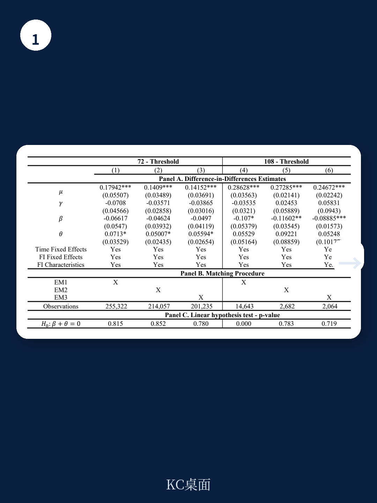

# 国际清算银行：消费贷款监管加码，小银行在108个月这道门槛上退缩

一项针对哥伦比亚消费贷款拨备新规的实证研究，给出了一个反直觉的结论。2023年1月生效的监管要求，对期限超过72个月和108个月的消费贷款分别加征10%和40%的额外拨备——这原本被市场预期会显著压缩长期信贷供给。但国际清算银行（BIS）最新工作论文显示，这项政策的平均效果几乎为零：贷款金额、利率和抵押要求均未出现统计显著的调整。

真正的故事藏在细节里。

## 1. 拨备成本上升，大银行选择“自己消化”

论文的核心发现是：大型机构吸收了新增拨备成本，没有将其转嫁给借款人。对于期限超过108个月的贷款，大银行既没有提高利率，也没有降低贷款价值比（LTV）。原因不难理解——这些机构在消费信贷市场占据主导份额，资产负债表足够厚，能够将额外拨备视为一项可控的合规成本，而非需要立即调整定价策略的信号。

这意味着，当监管政策针对的是整个系统的韧性目标时，头部机构的缓冲能力远比想象中强。它们的行为逻辑不是“成本增加就调整”，而是“成本增加是否触及盈利底线”。对于大行而言，10%或40%的边际拨备增幅，远未达到需要改变放贷策略的阈值。

> **KC评论：** 这份报告最值得关注的地方，不是结论本身，而是它揭示了一个经常被忽视的机制——监管成本在不同规模机构间的分布极不均匀。大银行可以“吸收”，小银行只能“调整”。完整报告中对机构异质性的计量分析，尤其是利用匹配方法处理选择偏误的部分，值得仔细阅读。

## 2. 小银行被迫收紧：108个月成为真正的分水岭

与大型机构的从容不同，小型贷款机构在108个月以上的超长期贷款上做出了明确调整。具体表现为：贷款发放金额下降，贷款价值比（LTV）降低。换言之，小银行既少借钱给客户，也要求客户出更多首付。

为什么是108个月，而不是72个月？论文给出的解释是：72个月（6年）的额外拨备仅为10%，而108个月（9年）的额外拨备高达40%。后者带来的边际成本增幅，恰好跨过了小型机构的承受阈值。这些小银行通常资金成本更高、客户集中度更大、盈利空间更薄，40%的拨备增幅直接压缩了它们的不确定性调整后收益。

这也解释了为什么政策制定者选择两个阶梯式阈值——72个月是“温和提醒”，108个月才是真正具有约束力的门槛。但报告没有完全回答的一个问题是：小银行调整后，这些超长期消费贷款需求流向了哪里？是被大银行承接，还是直接消失？如果是后者，那么政策可能对低收入借款人的可及性产生了非对称影响。

> **KC评论：** 报告在异质性分析部分展示了不同规模机构的差异化反应，但未进一步讨论借款人的福利效应。这是读者可以自行追问的方向：监管政策在提升系统韧性的同时，是否无意中排挤了特定群体？完整报告附录中的平衡性检验和匹配结果，为深入理解这一机制提供了技术细节。

## 3. 一个尚未解决的谜题：拨备政策与货币政策的叠加效应

论文在结论部分谨慎地提到，2023年恰好是哥伦比亚货币政策紧缩期。这意味着，消费信贷的整体走势可能更多受到政策利率传导的影响，而非单一拨备规则的作用。换言之，拨备政策的效果被宏观环境“淹没”了。

这给所有政策评估者提了一个难题：如何区分“监管政策本身的效果”和“监管政策叠加宏观周期后的净效果”？论文使用的双重差分和匹配方法，在控制时间固定效应和机构特征后，仍然难以完全剥离利率政策的干扰。报告对此没有给出完美答案，但指出了未来研究的方向——需要在更长的时间窗口内，观察拨备规则在不同利率周期下的表现。

对于关注新兴市场资金监管的读者来说，这份报告的价值不在于给出了一个“政策有效或无效”的判断，而在于展示了一个真实世界中监管政策传导的复杂性：同样的规则，对不同机构意味着完全不同的成本；同样的成本，在不同宏观环境下可能产生截然不同的行为反应。

---

For informational purposes only. Portions may be generated,translated,summarized,or edited with AI assistance based on source materials and may contain omissions or errors. Please verify independently. This is not investment,legal,tax,accounting,or other professional advice.
