# Competing for inputs: how the European Union can improve critical raw materials supply security

Madalena Barata da Rocha and Camille Reverdy

Madalena Barata da Rocha (madalena.barata-rocha@bruegel.org) is a Research Analyst at Bruegel

Camille Reverdy (camille.reverdy@bruegel.org) is an Affiliate Fellow at Bruegel

The authors thank Ben McWilliams, Ignacio Garcia Bercero, Flora Marchioro and participants to the Bruegel research seminar for their useful comments. We are grateful to Niclas Poitiers for his insightful suggestions and to Benjamin Bjerkan-Wade for the subsidies analysis.

## Executive summary

CRITICAL RAW MATERIALS (CRMs) are essential to the European Union's green and digital transition, underpinning technologies from batteries to semiconductors. Demand is expected to increase hugely by 2050, yet CRM supply chains remain highly concentrated and exposed to geopolitical and market risks. The EU also faces growing competition from Japan and the United States, both of which are actively securing CRM supply through third-country partnerships and domestic investment.

WE ANALYSE THE INTERNAL AND EXTERNAL ASPECTS of the EU strategy on CRMs, drawing on data on the 60 CRM strategic projects, EU CRM strategic partnerships with third countries and trade agreements with CRM provisions. We find that strategic projects are unlikely to meet EU self-sufficiency targets and strategic partnerships have not yet produced measurable trade effects. So far, provisions in trade agreements have been the EU's most effective external instrument, leading to significant increases in CRM exports to the EU.

THE EU SHOULD BETTER ALIGN CRM investments with supply risks, strengthen CRM governance through strategic partnerships and trade frameworks and ensuring support for CRM projects. It should engage cautiously with price-floor proposals led by the United States, favouring instead bilateral off-take agreements and plurilateral cooperation involving developing supplier countries, with the goal of serving broad supply-security objectives.

## 1 Introduction

As essential inputs for technologies including batteries, wind turbines, solar panels and semiconductors, critical raw materials (CRMs) are a strategic priority in European Union trade and industrial policy. Rising demand for these materials, including substances such as cobalt, copper and lithium, is driven by the need to meet climate targets and rapid technological change. But rising global demand has also highlighted significant vulnerabilities in European supply chains, especially following the surge in commodity prices in the 2000s.

Securing access to CRM supply chains has thus become an increasingly pressing priority for the EU. The EU has sought to increase domestic supply of CRMs and to improve resource efficiency, including through substitution and recycling (Szczepanski, 2021). Since 2011, the European Commission has published five CRM lists and has mapped dependencies on third countries (Figure 1). Since 2021, it has also established strategic partnerships with third countries covering CRMs.

The EU is particularly dependent on China, and especially Chinese refining and processing, for a range of CRMs. However, China has shown it is prepared to weaponise supply chains, by imposing export controls, notably through restrictions on rare-earth element exports in 2009 and 2012, and controls on critical minerals and related products since 2023 and 2025 (Teer, 2026; Gormley et al, 2026). This shows the risks associated with concentrated external dependency in critical supply chains. Other major economies, including the United States, Japan and Canada, are also competing aggressively for CRMs while seeking to diversify away from China.

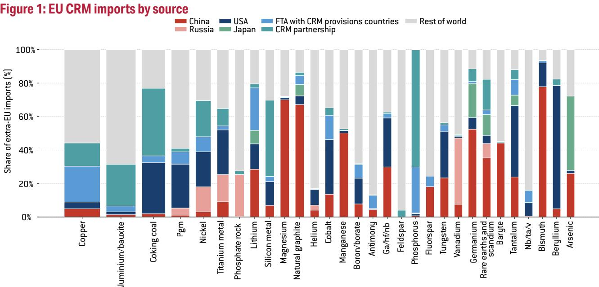

Source: Bruegel based on CEPII BACI and EU CRMA official list. Note: bar width is proportional to extra-EU import values. Tables A1 and A2 in the appendix list countries included in the 'FTA with CRM provisions countries' group and the 'CRM Partnership' group respectively. Canada and Chile both have an FTA with CRM provisions and a CRM partnership with the EU; to avoid double counting, these countries are only included in the former group.

As part of the response to these challenges, the EU adopted in 2024 the Critical Raw Materials Act (CRMA, Regulation (EU) 2024/1252). Among other things, this sets the framework for pursuing strategic CRM projects both outside and within the EU, meaning upstream raw materials and downstream clean-tech capacity are governed according to the same logic of supply security and resilience. EU external policies, including strategic partnerships and free trade agreements (FTAs) with resource-rich countries (see the appendix for lists), complement the CRMA.

The EU approach has faced harsh criticism (Blot, 2024; Küblböck et al, 2025; Tröster et al, 2024). The European Court of Auditors (ECA, 2026) described the CRM framework as "not a rock-solid policy". Hool et al (2024) emphasised the practical and political constraints associated with expanding domestic extraction and requirements for diversification and reduced dependencies on single third-country suppliers, including local opposition and the risk of exacerbating trade tension. Le Mouel and Poitiers (2023) argued that domestic efforts alone are insufficient to solve the EU's supply vulnerabilities. Rietveld et al (2022) stressed the need for risk-management tools, such as strategic stockpiling and more public-private coordination to make supply chains more resilient. However, such contributions are largely descriptive and provide limited empirical evidence on the effectiveness of specific policy instruments.

Alongside the EU-level policy, several EU countries have national CRM initiatives, leading to significant overlap in partner countries, duplication of efforts, intra-European competition and reduced bargaining power with third countries.

Against this background, this policy brief answers two main questions: how successful is the EU CRM strategy, and how can it be improved? We first highlight the main challenges for EU CRM policy and evaluate both the policy's internal and external dimensions. We then compare the EU approach to the Japanese and US approaches, before setting out policy recommendations.

## 2 The main challenges for EU CRM policy

## 2.1 Fast growing demand

The global demand for critical raw materials is projected to increase substantially, driven in part by the deployment of clean energy technologies. The International Energy Agency (IEA) has illustrated the magnitude of the future demand pressures on CRMs in three scenarios that relate to future demand for clean-energy technologies depending on changes in climate policy: a current policy settings scenario (STEPS; Figure 2), an announced emissions-reduction pledges scenario (APS) that assumes governments deliver on all commitments, and the net-zero emissions (NZE) by 2050 scenario.

The top panels of Figure 2 show projected global demand growth for six critical raw materials relative to their 2024 levels in each of these scenarios $^{1}$ . Lithium stands out with projected demand growth by 2050 ranging from 470 percent to 800 percent. Demand for graphite and nickel would also grow substantially, though with variation across the different scenarios, with projected demand growth by 2050 ranging from 130 percent to 250 percent. The bottom panels of Figure 2 show how, over the same period, the yearly share of total demand accounted for by clean technologies is projected to grow, rising from, on average, 20 percent to 60 percent in 2024 to 35 percent to 93 percent by 2050, depending on the mineral and scenario. This highlights the need to secure the supply chains for these minerals. Table 1 sets out the main characteristics of the CRMs in Figure 2.

## 2.2 Highly concentrated supply

A small number of countries dominate CRM extraction and processing, creating significant supply chain risks (Figure 3). Some EU countries play comparatively larger roles in the export of processed and recycled CRMs. The Democratic Republic of the Congo (DRC), Chile, Australia and Indonesia dominate the export of raw and processed cobalt, copper, lithium and nickel, respectively, whereas China accounts for large shares of the extraction and processing of graphite, cobalt and rare earth elements $^{2}$ .

Figure 4 shows the main extra-EU sources from which EU imports CRMs. The EU imports relatively little of unprocessed cobalt because most cobalt is processed before it reaches the EU. The EU relies heavily on China for processed cobalt and for extracted and processed graphite, lithium and rare earth elements. The EU imports copper is significant quantities; unprocessed copper is mostly imported from Brazil, Peru and Chile, while the main sources of processed copper are Chile, DRC and Türkiye. Russia is still the largest source of EU raw nickel as the EU has not at time of writing implemented a full import ban on Russian-origin nickel (Caprile and Cirlig, 2025). Notably, intra-EU trade also accounts for a significant share of EU CRM imports, especially of recycled CRMs.

## Figure 2: CRM demand projections in three IEA scenarios

Stated policies (STEPS) -- Net Zero emissions (NZE)
Announced pledges (APS) □ STEPS–NZE range

a) Growth of worldwide CRM demand relative

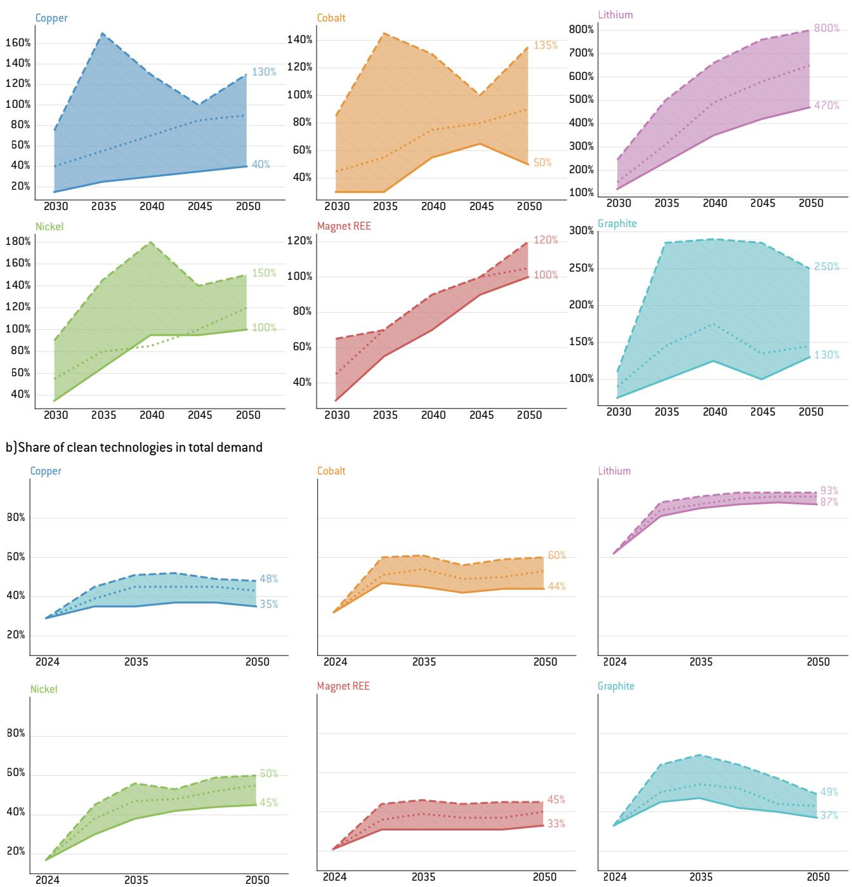  
Source: Bruegel based on IEA (2025). Note: see section 2.1 for a description of the IEA scenarios.

Concentration increases the vulnerability of supply chains to disruption in a limited number of suppliers. However, not all CRMs have the same economic or strategic importance. The quantities and values imported by the EU vary widely (Figure 1). For instance, in 2024, EU imports from outside the EU amounted to €24 billion for copper, €7 billion for nickel and €1 billion for lithium, with supplies destined for a wide range of industrial applications (Table 1). In contrast, the EU imported only about €0.1 billion euros worth of rare earths and germanium. These elements are nevertheless crucial for the manufacturing of electrical and electronic components and magnetic materials used in, for example, clean technologies, semiconductors and optic fibre. For rare earths and germanium, among others, the EU depends on China, which is the dominant and near-monopolistic supplier (Figure 1).

Table 1: Selected CRMs: market size, main uses, supply risks and substitutability

<table><tr><td>Material</td><td>Main uses (%)</td><td>Supply risks</td><td>Can it be replaced?</td></tr><tr><td>Lithium</td><td>Batteries (87%); ceramics and glass (5%); lubricating greases (2%)</td><td>Australia, Chile and China account for 80% of mining; China refines 70% of the world&#x27;s supply; prices spiked in early 2026 after two years of oversupply</td><td>Hard to replace in batteries. Sodium-ion batteries are a cheaper emerging alternative for short-range and stationary storage; no commercial substitute for high-performance EV batteries</td></tr><tr><td>Copper</td><td>Buildings and construction (26%); equipment manufacturing (23%); infrastructure (17%); transport (13%); industrial (12%)</td><td>China represents more than 45% of global processing; average time to open a new mine almost 18 years for mines started in 2020–23</td><td>Hard to replace. Aluminium is an alternative in some applications, but no scalable alternative for power grids or EVs</td></tr><tr><td>Graphite</td><td>Batteries and electrodes for steelmaking, other steelmaking processes</td><td>China processes more than 90% of the graphite used in battery anodes; China has required export licences since 2024</td><td>Hard to replace. Can be lab-made but lab-made graphite uses five times more energy than natural; silicon-based alternatives are improving but cannot fully replace graphite</td></tr><tr><td>Cobalt</td><td>EV batteries (43%); portable device batteries (30%); high-performance metal alloys (12%); chemical catalysts (3%); ceramics and colours (3%)</td><td>DRC supplies more than 75% of mined cobalt; small-scale informal mining (15%–30% of supply) raises ethical and environmental issues; China refines more than 75% of the world&#x27;s cobalt</td><td>Currently easy to replace. LFP batteries (now over half the electric-vehicle market) use no cobalt</td></tr><tr><td>Nickel</td><td>Stainless steel (66%); EV batteries (14%); high-performance alloys and metal coatings (14%)</td><td>The high-purity grade needed for batteries is scarce, though lower-grade nickel is abundant; Western mines are closing; Indonesia, the main producer, is imposing stricter control on its mining sector</td><td>Partly replaceable. LFP batteries are pushing nickel out of mass-market EVs, but nickel-rich batteries are still preferred for long-range models; nickel is not yet replaceable in stainless steel</td></tr><tr><td>Rare earth elements (REE)</td><td>Permanent magnets over 50% (EVs, wind turbines, robots); other industrial equipment (25%)</td><td>China controls 60% of global REE production and 90% of refining; export licences imposed in April 2025</td><td>Almost impossible to replace. The REE group comprises 17 substances; no workable substitute for rare earths in high-performance magnets</td></tr></table>

Sources: Bruegel. Note: DRC = Democratic Republic of the Congo; LFP = lithium iron phosphate.

However, Chinese dominance in the mining and processing of CRMs does not automatically translate into high EU import dependency (Figure 4). For some CRMs including copper and nickel, China controls a large share of global production and refining capacity (Teer, 2026), yet the EU's actual import exposure to materials from China remains rather limited. This is partly explained by EU efforts to diversify supply, and by China using part of its production for later stages of the value chain (Gormley et al, 2026). However, even where direct EU dependence on Chinese processed CRMs appears limited, China may still have a hold over downstream chokepoints in intermediate products, such as magnets, highlighting the need for the EU to diversify its supply chains for all stages of processing.

Recycling

Figure 3: Main exporters of CRMs by production stage, 2024  
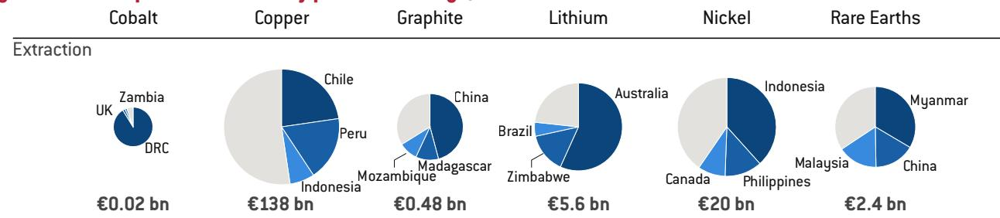

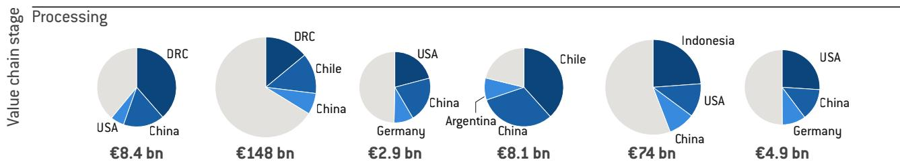

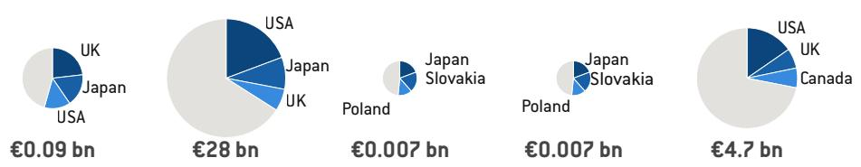

Source: Bruegel based on CEPII BACI and Georgitzikis et al (2023). Note: the size of the bubbles is proportional to the total export value of the mineral in 2024. The EU rare earths export share in the recycling stage cannot be estimated as no product code is assigned to exports of recycled REE. Intra-EU trade is removed from the calculations. While some nickel intermediates might contain some cobalt and copper components, we only include it in the nickel category.

Figure 4: Value of EU CRM imports from extra-EU suppliers, 2024  
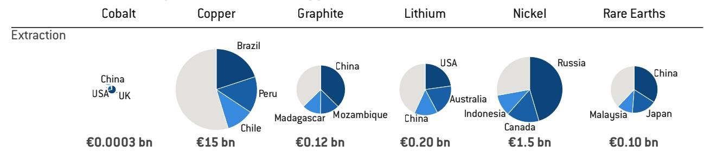

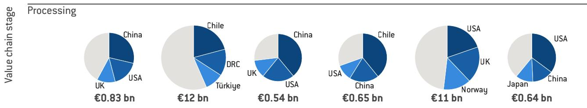

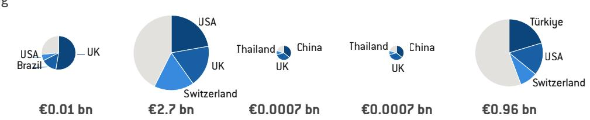

Source: Bruegel based on CEPII BACI and Georgitzikis et al (2023). Note: intra-EU trade is removed from the calculation. See note to Figure 3. While under sanctions on Russia issued on of 23 April 2026, the EU banned the importation of Russian-origin cobalt, it has not implemented a full import ban on Russian-origin nickel. See Reuters, 'LME issues notice on warranting of Russian-origin copper, cobalt in EU', 17 June 2026, https://www.reuters.com/business/lme-issues-notice-warranting-russian-origin-copper-cobalt-eu-2026-06-17/.

Figure 5: EU shares of CRM exports by CRM and production stage, 2024  
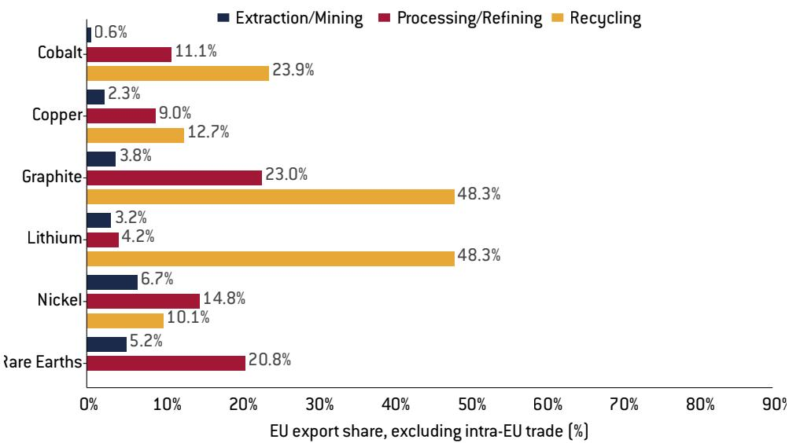  
Source: Bruegel based on CEPII BACI and Georgitzikis et al (2023). Note: the shares exclude intra-EU trade.

The EU's own extraction and processing capacity remains limited. The EU share of global extraction is negligible for most CRMs, lower than 10 percent, while its processing shares range from 9.5 percent for lithium to 49.4 percent for graphite. However, the EU has a large share of global exports of recycled CRMs (Figure 5) $^{3}$ .

## 2.3 Market failures

Three types of market failure are particularly relevant in CRM markets: moral hazard, competitive pressures and collective action. Moral hazard arises when firms underinvest in supply-chain diversification because they expect government intervention during shortages, meaning in the CRM context that firms are unwilling to pay for sourcing other than from China.

Competitive pressures make sourcing from more expensive suppliers a disadvantage for European manufacturers, particularly in sectors in which CRMs make up a significant share of the final product cost $^{4}$ . Finally, collective-action problems arise because most industrial firms purchase only small quantities of specialised materials. Even when a firm is willing to invest in diversification, its limited demand is often insufficient to justify the development of new mining or processing facilities. In such cases, government coordination, through demand aggregation or direct support, can help overcome constraints.

# 3 Does the EU have a sufficient CRM strategy?

## 3.1 Current EU policies

The CRMA sets four benchmarks for 2030 covering all CRMs:

1. A minimum of 10 percent of annual CRM consumption should be sourced from domestic extraction;

2. Domestically processed CRMs should meet 40 percent of domestic consumption;

3. Recycling should meet 25 percent of domestic consumption;

4. No more than 65 percent of supply of a CRM at any relevant stage of processing should be sourced from a single third country.

This approach has been reinforced by several measures to expand primary and secondary CRM production, notably through a €3 billion 'financing hub' supporting CRMA strategic projects $^{5}$ , a proposed Critical Raw Materials Centre, a Raw Materials Mechanism to coordinate demand and investment and a pilot scheme for stockpiling. In addition, a critical raw materials Important Project of Common European Interest (IPCEI) – a joint project backed by EU member state funding – is underway with 13 EU involved, at time of writing $^{6}$ .

EU financing for CRM-related projects has relied on many existing instruments and has involved relatively low amounts (ECA, 2026). To complement EU funding, state aid updates allow support for CRM extraction, processing and recycling. The Commission has also encouraged initiatives on joint purchasing and stockpiling of CRMs, consistent with antitrust rules $^{7}$ .

Some EU countries have also adopted CRM strategies (Table A4 in the appendix). France pursues strategic industrial autonomy, Nordic countries leverage their significant domestic resource endowments and mining capabilities, while Germany focuses on import diversification through long-term contracts, investments, and partnerships with resource-rich countries, supported by its strong industrial base $^{8}$ .

## 3.2 The role of CRMA strategic projects

To reach the CRMA targets, alongside efforts to diversify trade, the CRMA's main feature is the designation of strategic projects, both within and outside the EU. These projects benefit from streamlined permitting procedures, one-stop-shop administrative support and facilitated access to financing. However, the practical benefits associated with the strategic project label are relatively limited.

The first wave saw the approval of 60 projects, of which 47 are in the EU (Figure 6). For projects outside the EU, the label primarily provides a reputational benefit to project promoters, as there is no formal legal link between the label and access to financing. However, the label may be taken into consideration by the European Investment Bank (EIB) or other financing institutions in their assessment processes. These international projects focus exclusively on extraction and/or processing activities and cover a number of minerals, most notably graphite, nickel and cobalt $^{9}$ . Figure 6 shows the breakdown of projects by mineral and stage of production, illustrating the EU's priorities. Lithium, nickel, copper, cobalt and graphite account for the largest numbers of projects, followed closely by rare earth elements. Most projects are concentrated in extraction, processing or integrated extraction and processing, the stages in which EU production capacities are the lowest. Recycling also represents a non-negligible share, especially for most of the key minerals $^{10}$ .

Figure 6: Overview of CRMA strategic projects  
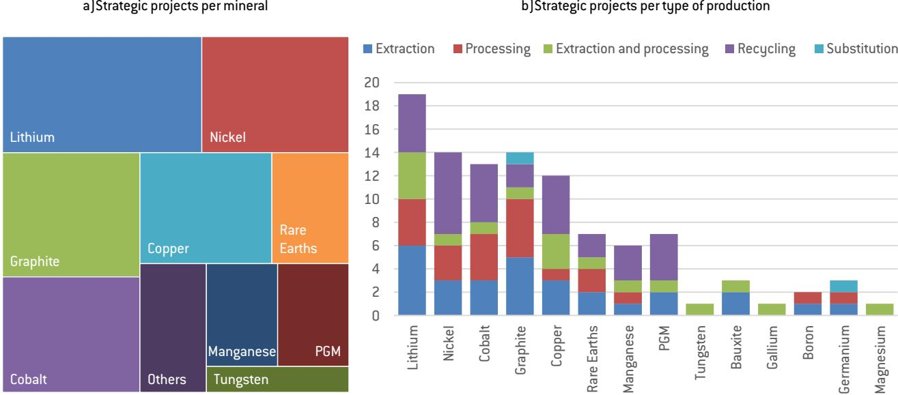  
Source: Bruegel based on European Commission. Note: box sizes in the left panel are proportional to the numbers of projects covering this mineral. Projects that cover multiple minerals are counted in each relevant category; for instance, a project involving both lithium and nickel is recorded under each mineral.

To assess the effectiveness of the domestic EU CRM strategy, we examine whether the allocation of strategic projects aligns with projected demand growth and current supply vulnerabilities, proxied by EU dependency, notably on China. We treat the number of projects per material as an initial indicator before overlaying it with projected demand coverage and an analysis of subsidies received to account for different sizes of projects.

Figure 7 (left panel) indicates a positive relationship between projected demand growth and the number of projects allocated to each mineral, with graphite as an exception. This suggests that the EU tends to prioritise minerals for which demand growth is expected to be significant. In contrast, there is no evident systematic relationship between import dependency on China and project allocation, providing no strong evidence that greater dependency translates into a higher number of strategic projects (Figure 7, right panel). The conclusion is the same when accounting separately for the three production stages of extraction, processing and recycling (Figure A1 in the appendix), and when comparing the materials covered by strategic projects with the import dependencies highlighted in Figure 1. Projects do not address dependencies for magnesium, germanium, bismuth, barite and vanadium, though a significant number of projects cover graphite, cobalt and rare earths.

Figure 7: Alignment of strategic project allocation with demand and dependency
Nickel Copper Cobalt Graphite Lithium REE  
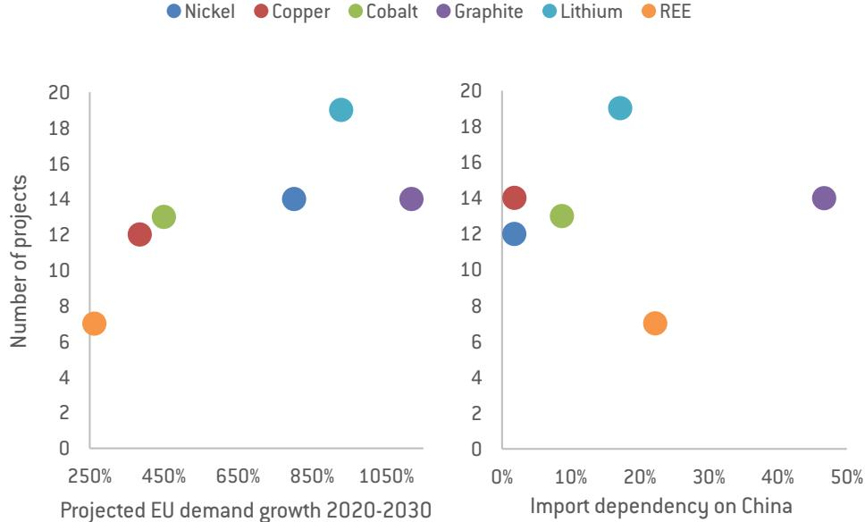  
Source: Bruegel based on European Commission and CEPII BACI. Note: for REE, projected demand (left panel) is based on average projected EU demand growth for neodymium and dysprosium, the most important light and heavy REEs, respectively.

We then analyse the potential contribution of strategic projects to the CRMA targets by constructing projected production as a share of EU demand in 2030. This exercise relies on several assumptions. First, projected production figures are provided by project promoters and are not verified independently or not reported systematically for all projects, resulting in missing data in many cases. Second, projects targeting multiple minerals create a challenge in allocating output across minerals. Limited information

on the purity and final form of production further constrains comparability. Moreover, there are clear incentives for project developers to overstate expected output to secure strategic project status.

Nevertheless, our preliminary estimates suggest that, on average, strategic projects could allow the EU to meet CRMA targets for extraction and processing in a low-demand scenario for five CRMs, while they might not be sufficient to meet the recycling objective (Figure 8). These results should be interpreted with caution; for the reasons set out above, apparent alignment with CRMA targets does not provide a reliable indication that the EU will meet its 2030 objectives.

Figure 8: Share of forecast 2030 demand potentially covered by strategic projects  
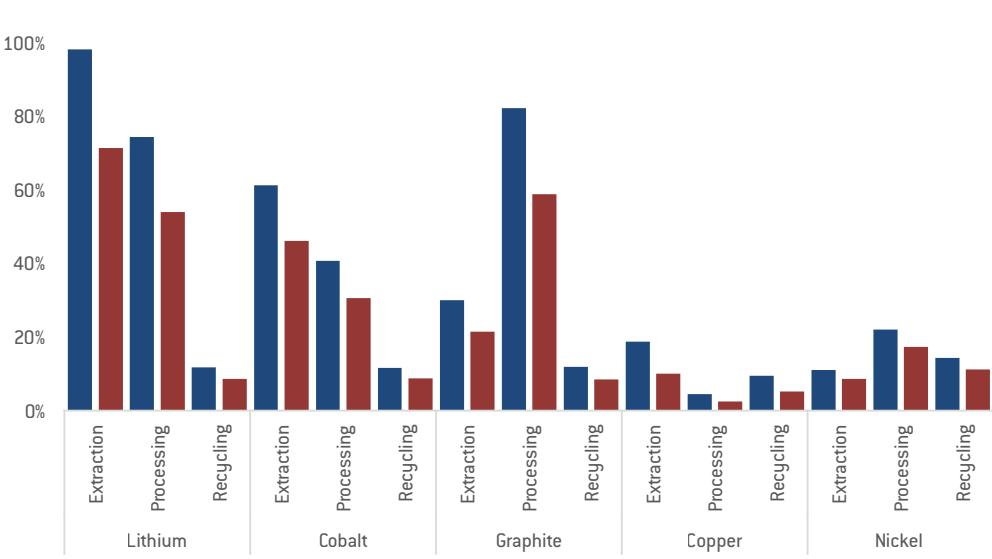

Source: Bruegel based on European Commission. Note: demand growth scenarios are calculated and defined by the European Commission's Joint Research Centre as high demand: "a rapid technology deployment and a combination of market shares and material intensities resulting in a rapid increase of materials demand"; low demand: "slow technology deployment and combinations of market shares and material intensities resulting in a moderate increase or even a decrease in materials demand" (Carrara et al, 2023). These estimates rely on self-reported project-level production figures and do not account for current levels of EU production.

Third, to complement the analysis, we examine the extent of the financial support received by strategic projects. Of the 60 strategic projects, we were able to track at least 21 projects in receipt of public subsidies, amounting to approximately €1.26 billion (Table A3 in the appendix) $^{11}$ . €576 million of this is sourced from EU instruments, €461 million is state aid and €218 million comes from international financial institutions $^{12}$ .

In July 2024, the EU and the European Bank for Reconstruction and Development signed an agreement on a new facility to provide equity investment for exploration for critical and strategic raw materials, aiming to mobilise around €100 million $^{13}$ . However, the limited number of projects in third countries, together with the absence of significant public financial support for such projects, points to a significant gap in the EU's strategy $^{14}$ . Given the political, environmental and economic limits to expanding processing capacity domestically, fostering investment in third-country processing projects will be critical to achieve meaningful diversification. The limited scale of funding, combined with its reliance on a set of pre-existing instruments with different objectives and rules, rather than a dedicated CRM facility, raises doubts about whether CRMA targets lack the financial backing and coherence necessary for credible implementation $^{15}$ .

Additional risks may further undermine these projects, particularly those related to social acceptance and governance. Local opposition has already proved to be a constraint. In July 2024, there were large-scale protests in Serbia, driven by fears of environmental damage, land use and water pollution, against the Jadar lithium mine, an EU CRMA strategic project led by Rio Tinto $^{16}$ . Several other projects face local-level challenges, including environmental risks and adverse social impacts for local communities, which may hinder their implementation (BHRC, 2025).

## 3.3 CRM Strategic Partnerships and FTAs

For its external CRM policy, the EU relies on free trade agreements (FTAs) with dedicated CRM chapters and strategic partnerships.

Since the early 2010s, the EU has aimed to secure CRM access through bilateral trade agreements. Earlier FTAs include provisions on raw material export restrictions and binding clauses that set rules on partner countries' use of export restrictions, including limits on export taxes, quotas and monopolistic measures. More recent FTAs are substantially more ambitious, including bans on export restrictions and dual pricing, rules on state-owned enterprises in mining and sustainable-mining cooperation, transparency obligations for licensing and regulation and limits on state price intervention (Table A1 in the appendix).

In addition, the EU started in 2021 to establish strategic partnerships on CRMs. By 2025, the EU had established partnerships with 15 countries (Figure 9). These partnerships focus on securing supply across the entire value chain, including investment, processing and recycling. This approach is not without risks and has been criticised as being based on an extractive model $^{17}$ . For instance, the EU strategic partnership with Rwanda was strongly criticised for not including sufficient safeguards to prevent proceeds from minerals from feeding into ongoing military activities in Eastern Congo supported by Rwandan forces $^{18}$ .

Figure 9: EU strategic raw material partnerships  
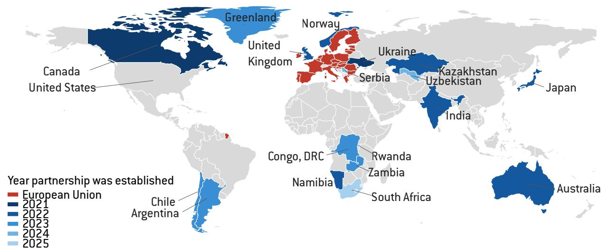  
Source: Bruegel based on European Commission strategic partnerships information.

To assess the effectiveness of EU CRM external policies (Figure 10), we empirically estimate the impact of EU strategic partnerships and bilateral agreements on CRM exports to the EU. We also evaluate how competition from Japan and the United States affects access to critical resources (see section 4 for more detail on the Japanese and US CRM strategies).

Our analysis shows, first, that CRM partnerships do not appear to have a significant effect on CRM exports to the EU, partly reflecting their largely declarative nature and the absence of binding commitments $^{19}$ . In contrast, EU FTAs including CRM provisions are significantly associated with higher CRM exports to the EU. CRM exports from partner countries with such FTAs are, on average, 62.4 percentage points higher following the introduction of the agreement.

Second, the EU does not appear to face competition from the respective strategic partnerships of Japan or the US. However, overlaps emerge when partners sign FTAs with CRM provisions with both the EU and Japan, pointing to intensifying competition for the same geographically concentrated materials. This is primarily the case for Chile. Finally, no comparable competition effect is observed with respect to the US. One likely explanation is that US CRM diplomacy is recent, with partnerships only initiated in 2023, suggesting that their effects may not yet be observable (see section 4).

Figure 10: Estimation of the effects of EU CRM policies on CRM exports to the EU  
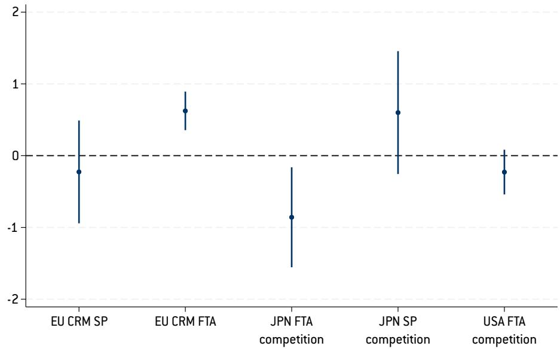  
Source: Bruegel. Note: the figure shows the change in bilateral CRM exports to the EU, induced by a change of one of the explanatory variables. For instance, CRM exports from partner countries with CRM-provision FTAs are, on average, 62.4 percentage points higher following the introduction of the agreement, CRM exports from partner countries with CRM-provision FTAs with both the EU and Japan decrease by 23.4 percentage points. The other variables do not have a significant effect on bilateral CRM exports. The vertical solid lines represent 95 percent confidence intervals.

## 4 Comparative approaches to CRM policy

With the importance of CRMs only set to increase, other major economies, including Japan and the United States, have also implemented policies to secure their supply chains.

## 4.1 Japan

Japan offers a useful comparison to EU CRM policies. Following rare-earth export restrictions imposed by China in 2010-2011, Japan significantly strengthened its resource security strategy through international partnerships, strategic stockpiles, overseas instruments and support for recycling and substitution.

Japan's domestic policy framework is centrally guided by the Ministry of Economy, Trade and Industry (METI), notably through the Strategy for Ensuring Stable Supplies of Rare Metals (2020) and subsequent updates under the Economic Security Promotion Act (ESPA) (2022). Under its legal mandate, a public agency, the Japan Organization for Metals and Energy Security (JOGMEC), is responsible for implementing key elements of the strategy, including the management of strategic critical mineral stockpiling, equity participation in overseas resource projects and the provision of risk capital and guarantees to support Japanese firms engaged in upstream investments.

Japan has also introduced substantial public financing across the CRM value chain to reduce dependence on concentrated suppliers, particularly China. As of December

2024, Japan had allocated a budget of 2.183 trillion yen and two-step loans through the Development Bank of Japan, which presupposes co-financing with private financial institutions for loans of more than 5 billion yen (Kim, 2025).

Japan has also been particularly active in establishing mineral partnerships with numerous countries, and participating in multilateral initiatives, including the Indo-Pacific Economic Framework for Prosperity (a US-led initiative promoting cooperation on trade, supply chains and clean energy) and the Quad Critical Minerals Initiative (a partnership involving Australia, India, Japan and the US focused on secure critical mineral supply chains). These resource partnerships and cooperation frameworks are often supported by public agencies such as JOGMEC $^{20}$ . In parallel, Japan has established broader economic partnerships including provisions on investment protection and mining cooperation. It signed its first CRM-relevant partner agreement, with Chile, in 2007.

## 4.2 The United States

The United States has also significantly strengthened its CRM policy since the late 2010s, particularly following the identification of critical minerals under a 2017 Executive Order on supply chain security and subsequent updates $^{21}$ . Major laws, notably the Bipartisan Infrastructure Law (2021) and the 2022 Inflation Reduction Act (IRA), have provided substantial financial support for domestic extraction, processing and recycling capacities, especially for battery materials and clean-energy technologies. The One Big Beautiful Bill Act, enacted by the second President Donald Trump administration on 4 July 2025, has significantly rolled back IRA provisions relevant to critical minerals $^{22}$ .

In parallel, US domestic policy emphasises the reshoring and 'friend-shoring' of supply chains through subsidies, tax credits and grants designed to incentivise private investment (NEC/NSC, 2024).

Public financing to support critical mineral projects domestically and abroad has expanded. Since 2022, more than \$19.2 billion in federal support for mineral mining and processing projects has been approved or is under consideration, spread across agencies including the Department of Defense, Department of Energy, Export-Import Bank, International Development Finance Corporation and US Trade and Development Agency (Barrios, 2025). The Trump administration has reinforced this approach by supporting direct equity investments and scaling up the use of the International Development Finance Corporation. Since the beginning of 2026, the administration has announced more than \$30 billion in letters of interest, investments, loans and other forms of support for critical mineral projects $^{23}$ . The administration is also increasing efforts to build strategic reserves through Project Vault, a 12 billion public-private programme (Hendrix, 2026). However, the scale and dispersion of these interventions raise questions about project prioritisation, long-run competitiveness and financial sustainability.

The US has also accelerated its CRM diplomacy in recent years. It has prioritised the development of strategic partnerships with allied and resource-rich countries to diversify supply chains and reduce dependence on dominant suppliers. The Minerals Security Partnership (MSP), initiated in 2022 aimed to coordinate investments in critical minerals projects. In 2023, the US and Japan concluded a Critical Minerals Agreement, which includes joint cooperation and funding for specific projects, including in third countries such as Australia $^{24}$ . US critical minerals frameworks now cover more than 20 countries (Figure 11).

The US has also increasingly integrated critical minerals provisions into broader trade and economic frameworks. While several earlier FTAs and targeted arrangements enabled partner countries to qualify under IRA sourcing requirements for preferential access to critical minerals inputs, more recent US arrangements have increasingly moved beyond tariff- or tax-credit-based incentives towards more explicit cooperation on critical minerals supply chains. This includes investment coordination and joint development of mining, refining and processing capacity, as illustrated by agreements with Japan and Australia and ongoing discussions with the EU. Given the high geographic concentration of CRM production, the EU is likely to face increasing competition from these actors to secure access to supply.

Figure 11: Japan and US CRM partnership networks
a) Japan's critical mineral partnerships  
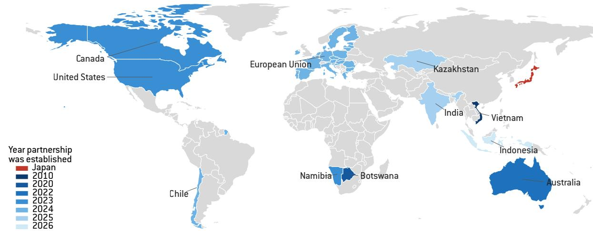

b) US critical mineral partnerships  
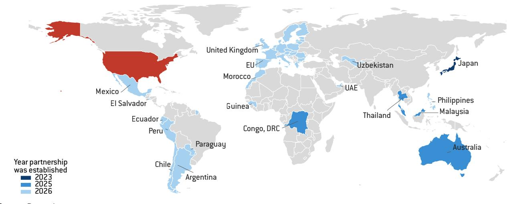

Thus, these economies are competing for inputs with the EU using building blocks: financial and administrative support to individual projects domestically and abroad, CRM specific diplomacy with supplier countries, risk mitigation instruments such as stockpiling and joint purchasing, and efforts towards recycling and substitution. Assessing the efficiency of the US and Japanese strategies is not straightforward, partly due to data limitation. Yet, Japan can inspire the EU with its decades-long efforts and investments for de-risking from Chinese control, providing great stability to investors. The US, on the other hand, is an example for its pragmatic focus on individual projects in third countries with large financial support.

## 4.3 Multilateral cooperation

Several developed economies – major CRM buyers – pursue CRM-related friend-shoring strategies through plurilateral initiatives. The MSP Forum, co-chaired by the EU and the US, was inaugurated in 2024, bringing together MSP participants and 15 CRM-producing and consuming countries, to formalise and foster coordinated policies while supporting individual projects (Vivoda et al, 2025). According to the US Department of State, 32 projects have been announced under this framework. The MSP Forum also expands the concept of the CRM Club (Critical Raw Materials Club) led by the European Commission. In February 2026, the US administration announced the creation of Forum on Resource Geostrategic Engagement (FORGE) as the successor to the MSP $^{25}$ .

In addition, the G7 initiated a Critical Minerals Action Plan in 2025, and a Critical Minerals Ministerial involving more than 40 countries and the European Commission took place in February 2026 $^{26}$ .

In April 2026, the EU and US signed a memorandum of understanding on a strategic partnership on critical minerals and agreed an EU-US Critical Minerals Action Plan $^{27}$ , under which new trade instruments will be explored, such as border-adjusted price floors, standards-based markets, price gap subsidies and off-take agreements $^{28}$ . In June 2026, EU countries agreed the European Commission could on behalf of the EU join Pax Silica, a US-led initiative to build a ‘trusted ally’ supply chain for artificial-intelligence and semiconductor technologies and critical minerals $^{29}$ .

A new development is the growing interest in price-stabilisation mechanisms and preferential trading arrangements among major consuming countries. In this context, the United States has put forward proposals for minimum price or price-floor mechanisms for critical minerals, aimed at supporting investment in diversified supply chains. While minimum prices could support the diversification of sources, in particular processing in developing countries, they might also bring significant risks, notably potentially increasing trade tensions with non-participating countries (Gormley et al, 2026). Higher mineral prices could also reduce the competitiveness of EU downstream manufacturers and create captive markets favouring US investments. Overall, multilateral CRM diplomacy is emerging but remains fragmented, with overlapping initiatives focused on supporting individual projects and de-risking supply chains.

26 See 'G7 Leaders' statements' of 17 June 2025, https://ec.europa.eu/commission/presscorner/detail/fr/statement\_25\_1552.

27 See European Commission press release of 24 April 2026, 'EU and US launch strategic partnership on critical minerals', https://ec.europa.eu/commission/presscorner/detail/en/ip\_26\_862.

# 5 Policy recommendations

Based on our findings and the policies adopted in other economies, we make three main sets of recommendations for EU policy.

## 5.1 Aligning and scaling CRM investment in response to supply risks

A major challenge in addressing the growing demand for CRMs in a context of concentrated supply is the selection and financing of strategic projects, both within and outside the EU. We were only able to find partial evidence of CRM-relevant EU funding amounting to €1.255 billion, far below the amounts invested by the US and Japan. EU funding is drawn from various existing instruments with different rules and objectives, and covers only part of the projects. This level of support is likely insufficient given the scale of the challenge. Insufficient funding is particularly acute for external projects, particularly in comparison with the resources dedicated by Japan and the US.

To further foster access to financial support, the EU should create a dedicated CRM investment facility with meaningful firepower, rather than relying on repackaged existing instruments. The €3 billion (guarantees and loans) financing hub supporting CRMA strategic projects (see section 3.1) is a first step, but its adequacy relative to the scale of the challenge remains to be demonstrated. Safeguards should be introduced to avoid over-subsidisation and the crowding out of private capital should also be avoided.

Second, similarly to models used by Japan (JOGMEC) and the US (Development Finance Corporation), the EU should expand the use of public equity participation and state-backed guarantees for high-risk mining and processing investments. Prioritising the tackling of choke points is essential given the limited resources of the EU and EU countries.

Third, to ensure strategic projects will enable the EU to cover a significant part of its demand, credible verification of projected production volumes and timelines associated with each strategic project should be introduced. Current announcements often rely on optimistic assumptions, with limited independent validation of future output (see section 3.2). For example, several lithium and rare earth projects in Europe and partner countries have announced production timelines aligned with policy targets, although these projections often rely on feasibility-stage estimates that have not yet been independently validated.

Fourth, the current allocation of strategic projects does not systematically address the EU's most acute supply vulnerabilities. While projects (in numbers and projected output) broadly reflect projected demand growth, they show no systematic relationship with import dependency on China.

A more targeted approach should focus on identifying low-volume but high-risk CRMs for which Chinese concentration poses the greatest economic security threat. Direct support should be provided for extraction and processing projects in third countries able to supply those materials. Supply-side instruments are particularly relevant, similarly to the approach taken by the US, both domestically through support for mining expansion and internationally through DFC project financing.

Finally, more ambitious recycling targets and further enabling measures, such as product design norms to enhance the recyclability of final products, could both increase secondary supply and help foster the development of recycling projects within the EU. This could be done via the upcoming Circular Economy Act $^{30}$ and in the implementation of the Batteries Regulation (Regulation (EU) 2023/1542). However, recycling alone will unlikely be sufficient to meet fast-growing demand in strategic sectors such as batteries, and will therefore complement rather than substitute primary supply and external sourcing strategies.

## 5.2 Enhancing CRM governance through FTAs and partnerships

FTAs with CRM provisions are the EU's most effective external instrument to reduce its dependence on single suppliers (section 3.3). CRM-related provisions include commitments on dual pricing, export restrictions and the governance of state-owned enterprises in the mining sector. The EU should therefore seek to move beyond largely declaratory strategic partnerships by, where possible, converting them into binding commitments, or by embedding CRM cooperation within FTA frameworks. Alternatively, CRM cooperation could be pursued through a Clean Trade and Investment Partnership (CTIP), as in the case of South Africa. Such frameworks encompassing FTAs and CRM partnerships should also include financing mechanisms, off-take agreements and human rights and environmental safeguards, notably in countries with weaker governance. Fostering joint purchasing and demand aggregation would help overcome collective-action problems among small buyers, while off-take agreements backed by public guarantees can incentivise firm participation and support the development of new projects located outside of the EU.

Some of these measures have already been demonstrated at member-state level. However, the growing overlap between national and EU approaches risks duplication of efforts, competition for access to the same resources and a weakening of collective bargaining power in relation to supplier countries. Stronger coordination is therefore required across CRM diplomacy, to enhance supply security and leverage in global markets.

## 5.3 Engage cautiously in multilateral cooperation

The US has proposed a minimum pricing regime for critical minerals (section 4). While such minimum prices could support non-Chinese production, they also entail significant risks, including potential trade distortions and measures that might be inconsistent with EU FTA commitments. Rather than joining a US-led price floor coalition, the EU should pursue a more cautious and targeted approach based on project-based, bilateral off-take agreements with resource-rich supplier countries. These agreements would effectively create long-term purchase commitments that may generate implicit price stability tailored to specific materials and supply relationships, without locking the EU into a formal pricing regime with uncertain trade consequences. This approach would preserve flexibility, limit exposure to coalition-wide tariff escalation effects, and focus resources on a narrow number set of high-risk, low-volume CRMs for which supply security is genuinely at stake.

Alternatively, any EU participation in broader plurilateral arrangements with producing countries should ensure the broad participation of developing partners, while providing incentives to retain value-added in producing countries through domestic processing. This is not merely an equity question but a political precondition for securing long-term cooperation.

Countries such as Indonesia have already signalled their preference for domestic processing, for instance through export restrictions on nickel ores in 2020, bauxite since June 2023 and copper concentrates $^{31}$ . The EU approach should therefore incorporate a contingent price floor: a commitment to stable above-spot pricing that is conditional on allowing domestic processing in producing countries, while avoiding export restrictions on downstream processed products.

This would encourage in-country processing, particularly in developing countries, and reduce dependence on Chinese processing – for example, by supporting Indonesia's domestic nickel refining capacity. A price floor would then function as a supply-security tool and as a development-finance instrument, improving the economics of domestic processing in partner countries. Any such regime should involve producer countries in governance and be designed to serve broad supply-security objectives rather than the interests of any single partner.

## References

Barrios, C. (Aug. 2025) 'Growing U.S. Public Financing for Minerals Projects', Issue Brief, Friends of the Earth, available at https://foe.org/wp-content/uploads/2025/09/Transition-Minerals\_Issue\_Brief\_final-1.pdf

Blot, E. (2024) 'Sourcing critical raw materials through trade and cooperation frameworks', Briefing, Institute for European Environmental Policy, available at https://ieep.eu/publications/sourcing-critical-raw-materials-through-trade-and-cooperation-frameworks/

BHRC (2025) 'Strategic projects for whom? Challenges and local realities of the European Union's strategic mineral projects', Briefing, Business & Human Rights Resource Centre, available at https://www.business-humanrights.org/en/from-us/briefings/strategic-projects-for-whom-challenges-and-local-realities-of-the-european-unions-strategic-mineral-projects/

Caprile, A. and C. Cirlig (2025) 'EU sanctions against Russia 2025: State of play, perspectives and challenges', Briefing, European Parliamentary Research Service, available at https://www.europarl.europa.eu/RegData/etudes/BRIE/2025/767243/EPRS\_BRI%282025%29767243\_EN.pdf

31 See International Energy Agency, 'Prohibition of the export of nickel ore', 19 March 2024, https://www.iea.org/policies/16084-prohibition-of-the-export-of-nickel-ore; Coordinating Ministry for Economic Affairs, Republic of Indonesia press release of 21 December 2022, 'Increasing Domestic Bauxite Processing and Refining Industry, Government Bans Exports of Bauxite Ores Starting June 2023', https://ekon.go.id/publikasi/detail/5028/increasing-domestic-bauxite-processing-and-refining-industry-government-bans-exports-of-bauxite-ores-starting-june-2023. See also Guberman et al (2024).

Carrara, S., S. Bobba, D. Blagoeva, P. Alves Dias, A. Cavalli, K. Georgitzikis ... M. Christou (2023) Supply chain analysis and material demand forecast in strategic technologies and sectors in the EU – A foresight study, JRC Science for Policy Report, European Commission Joint Research Centre, available at https://dx.doi.org/10.2760/386650

ECA (2026) Critical raw materials for the energy transition: Not a rock-solid policy, Special Report 04/2026, European Court of Auditors, available at https://www.eca.europa.eu/ECAPublications/SR-2026-04/SR-2026-04\_EN.pdf

European Commission (2023) 'European Economic Security Strategy', JOIN(2023) 20 final, available at https://eur-lex.europa.eu/legal-content/EN/TXT/HTML/?uri=CELEX:52023JC0020

Georgitzikis, K. (2023) Trade codes of non-food, non-fuel raw materials and their products, JRC Scientific Information Systems and Databases Report, European Commission Joint Research Centre, available at https://dx.doi.org/10.2760/923241

Gormley, L., C. Boullenois and O. Melton (2026) 'Critical Mineral Chokepoints Extend Far Beyond Mining and Refining', Note, Rhodium Group, available at https://rhg.com/research/critical-mineral-chokepoints-extend-far-beyond-mining-and-refining/

Guberman, D., S. Schrieber and A. Perry (2024) 'Export Restrictions on Minerals and Metals: Indonesia's Export Ban of Nickel', Working Paper ICA-104, Office of Industry and Competitiveness Analysis, United States International Trade Commission, available at https://www.usitc.gov/publications/332/export\_restrictions\_minerals\_and\_metals\_indonesia.htm

Hendrix, C.S. (2026) 'Strengthening Project Vault: The US plan to stockpile critical minerals', Policy Brief 26-8, Peterson Institute for International Economics, available at https://www.piie.com/publications/policy-briefs/2026/strengthening-project-vault-us-plan-stockpile-critical-minerals

Hool, A., C. Helbig and G. Wierink (2024) 'Challenges and opportunities of the European Critical Raw Materials Act', Mineral Economics 37(3): 661–668, available at https://link.springer.com/article/10.1007/s13563-023-00394-y

IEA (2025) Global Critical Minerals Outlook 2025, International Energy Agency, available at https://www.iea.org/reports/global-critical-minerals-outlook-2025

Kim, G. (2025) 'Japan's Critical Minerals Policy and its Implications for South Korea', World Economy Brief 25-05, Korea Institute for International Economic Policy, available at https://dx.doi.org/10.2139/ssrn.5897923

Küblböck, K., S. Papatheophilou, B. Tröster and L. Ulrici (2025) 'EU raw material partnerships: Mutual benefits or green extractivism?' Research Report 25/2025, Austrian Foundation for Development Research, available at https://doi.org/10.60637/2025-rr25

Le Mouel, M. and N. Poitiers (2023) 'Why Europe's critical raw materials strategy has to be international', Analysis 07/2023, Bruegel, available at https://www.bruegel.org/analysis/why-europes-critical-raw-materials-strategy-has-be-international

NEC/NSC (2024) 2021–2024 Quadrennial Supply Chain Review, National Economic Council and National Security Council, available at https://bidenwhitehouse.archives.gov/wp-content/uploads/2024/12/20212024-Quadrennial-Supply-Chain-Review.pdf

Rietveld, E., T. Bastein, T. van Leeuwen, S. Wieclawska, N. Bonenkamp, D. Peck, M. Klebba, M. Le Mouel and N. Poitiers (2022) Strengthening the security of supply of products containing Critical Raw Materials for the green transition and decarbonisation, Study requested by the ITRE Committee, European Parliament, available at https://www.europarl.europa.eu/RegData/etudes/STUD/2022/740058/IPOL\_STU(2022)740058\_EN.pdf

Szczepanski, M. (2021) 'Critical raw materials in EU external policies: Improving access and raising global standards', Briefing, European Parliamentary Research Service, available at https://www.europarl.europa.eu/RegData/etudes/BRIE/2021/690606/EPRS\_BRI(2021)690606\_EN.pdf

Teer, J. (2026) 'Beijing's Critical Raw Materials Weapon and How to Dismantle it', Chaillot Paper 189, European Union Institute for Security Studies, available at: https://www.iss.europa.eu/sites/default/files/2026-05/CP\_189\_0.pdf

Tröster, B., S. Papatheophilou and K. Küblböck (2024) 'In search of critical raw materials: What will the EU Critical Raw Materials Act achieve? An analysis of legal and factual implications of the CRMA', Research Report 25/2025, Austrian Foundation for Development Research, available at https://doi.org/10.60637/2024-rr18

Vivoda, V., R. Matthews and J. Andresen (2025) 'Securing defense critical minerals: Challenges and US strategic responses in an evolving geopolitical landscape', Comparative Strategy 44(2): 281-315, available at https://doi.org/10.1080/01495933.2025.2456427

## Appendix: Additional figures and tables

Figure A1: Import dependency on China vs. number of projects by stage of production

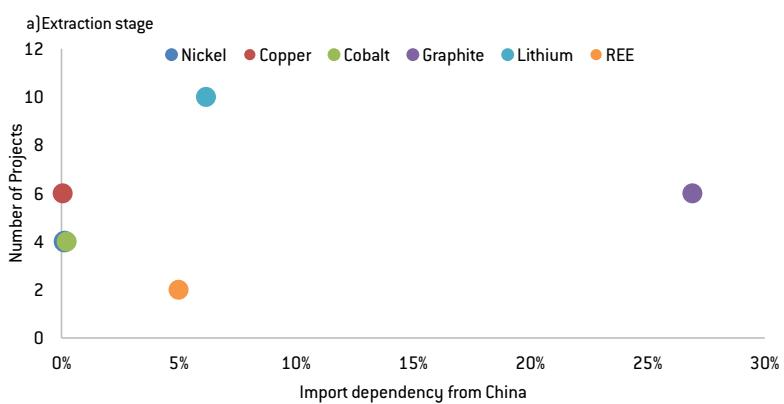

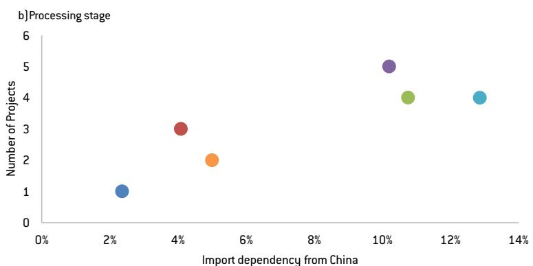

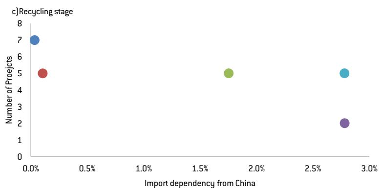  
Source: Bruegel based on European Commission, CEPII BACI and Georgitzikis et al (2023). Note: integrated extraction and processing projects are counted at the extraction stage.

Table A1: EU FTAs with CRM provisions

<table><tr><td>Agreement</td><td>Year</td><td>CRM-related provisions</td></tr><tr><td>EU-South Korea</td><td>2011</td><td>Prohibition of export duties, taxes or other fees on the export of CRMs</td></tr><tr><td>CETA (EU-Canada Comprehensive Economic and Trade Agreement)</td><td>2017</td><td>Tariffs reduction/elimination in mining products and processed raw materials, national treatment and market access for investors. Bilateral dialogue on raw materials (Art. 25.4); Strategic partnership established in the CETA framework in 2021</td></tr><tr><td>EU-Singapore</td><td>2019</td><td>Prohibition of duties, taxes or measures of equivalent effect on exportation; investor protection/ISDS provisions relevant to mining investment</td></tr><tr><td>EU-Vietnam</td><td>2020</td><td>Prohibition of export duties or taxes on CRM exports</td></tr><tr><td>EU-Chile Advanced Framework Agreement</td><td>2023</td><td>Energy and raw materials chapter covering lithium and copper; Includes: ban/ limits on export restrictions and dual pricing; rules on state-owned enterprises in mining; sustainable mining cooperation</td></tr><tr><td>EU-New Zealand</td><td>2024</td><td>Energy and raw materials chapter; includes: prohibition of both import and export monopolies for raw materials (Art. 13.4); ban on export/dual pricing where export prices exceed domestic prices (Art. 13.5); limits on state price intervention; transparent and non-discriminatory authorisation procedures for exploration and production of raw materials, with right of appeal; mandatory environmental impact assessments for raw material production activities; responsible sourcing cooperation including OECD Guidelines for Multinational Enterprises and coordination in international fora; environmental safeguards for resource projects</td></tr><tr><td>EU-Indonesia Comprehensive Economic Partnership Agreement*</td><td>2025</td><td>Energy and raw materials chapter; includes: ban on export monopolies for raw materials; disciplines on export restrictions/duties (linked to goods chapter); prohibition of dual pricing (higher export prices vs domestic prices); limits on state price intervention; transparency obligations for licensing and regulation; investment and governance rules in extractive sectors; environmental safeguards for resource projects</td></tr><tr><td>EU-Mexico Agreement*</td><td>2026</td><td>Raw materials chapter; includes: ban on export monopolies for raw materials; prohibition of dual; transparency and predictability in case of domestic pricing regulation; elimination of export restrictions; no non-automatic import licensing requirements; right of establishment and non-discrimination for EU investors in Mexico&#x27;s raw materials sector; responsible sourcing standards</td></tr></table>

Source: Bruegel. Note: $*$ = agreements not in force at time of writing.

Table A2: EU strategic CRM partnerships

<table><tr><td>Partnership</td><td>Year</td><td>Partnership provisions</td></tr><tr><td>EU-Canada Strategic Partnership on Raw Materials</td><td>June 2021</td><td>Three pillars: (i) integration of Canada-EU raw materials value chains; (ii) science, technology and innovation collaboration; (iii) ESG criteria and standards. Covers minerals and metals critical for the green and digital transition. Aims to advance the value, security and sustainability of trade and investment in raw materials and downstream value chains.</td></tr><tr><td>EU-Ukraine Strategic Partnership on Raw Materials</td><td>July 2021</td><td>Covers the entire value chain of primary and secondary critical raw materials and batteries. Activities include the integration of CRM and battery value chains; development of mineral resources in Ukraine in a sustainable and socially responsible way; R&amp;I collaboration via Horizon Europe. Minerals covered include titanium, lithium, manganese, graphite and rare earth elements.</td></tr><tr><td>EU-Kazakhstan Strategic Partnership on Sustainable Raw Materials, Batteries and Renewable Hydrogen</td><td>November 2022</td><td>Covers CRMs, other metals and industrial materials and renewable hydrogen. Scope includes extraction, processing, refining, recovery and recycling. Roadmap foresees review of trade and investment restrictions; digitalization and classification of mineral resource data; Earth-observation programs; identification of joint-venture projects. Includes cooperation on ESG standards and investment climate improvement.</td></tr><tr><td>EU-Namibia Partnership on Sustainable Raw Materials Value Chains and Renewable Hydrogen</td><td>November 2022</td><td>Six pillars: (i) integration of CRM and renewable hydrogen value chains, including trade and investment facilitation; (ii) ESG criteria and alignment with international standards; (iii) mobilisation of funding for infrastructure and private sector leverage; (iv) capacity building, training and skills development; (v) R&amp;I cooperation including mineral knowledge, circularity and hydrogen technologies; (vi) regulatory alignment on hydrogen definitions, standards and certification. Covers full value chain (exploration, extraction, processing, refining, recycling) with focus on CRMs (lithium, cobalt, graphite, REE) and renewable hydrogen.</td></tr><tr><td>EU-Argentina Strategic Partnership on Sustainable Raw Materials</td><td>June 2023</td><td>Covers the entire value chain of primary and secondary CRMs. Key minerals: lithium, copper, nickel and cobalt. Focuses on: sustainable and responsible extraction; development of local processing and refining capacity; investment facilitation; value chain integration; ESG standards. Includes cooperation on R&amp;I and skills development.</td></tr><tr><td>EU-Chile Strategic Partnership on Sustainable Raw Materials</td><td>July 2023</td><td>Covers sustainable mining and value chain integration; local processing capacity; technology cooperation; ESG standards; R&amp;I collaboration. Includes a review clause with commitment to upgrading the chapter's enforcement once in force. Complements the dedicated Energy and Raw Materials chapter of the EU-Chile Advanced Framework Agreement (2023).</td></tr><tr><td>EU-Zambia Strategic Partnership on Sustainable Raw Materials Value Chains</td><td>October 2023</td><td>Covers five key areas of the CRM value chain: exploration, extraction, processing, refining and recycling. Key minerals: copper, cobalt and lithium deposits. Supports the development of sustainable and resilient value chains while creating quality local jobs. Includes facilitation of financing for related infrastructure.</td></tr><tr><td>EU-Democratic Republic of Congo Strategic Partnership on Sustainable Raw Materials Value Chains</td><td>October 2023</td><td>Covers five key areas of the CRM value chain: exploration, extraction, processing, refining and recycling. Key minerals: cobalt, coltan (tantalum), copper and tin. Supports sustainable, fair, inclusive and peaceful socioeconomic development. Includes facilitation of financing for related infrastructure.</td></tr><tr><td>EU-Greenland Strategic Partnership on Critical Raw Materials</td><td>November 2023</td><td>Covers geological mapping, exploration, sustainable extraction and investment facilitation. Key minerals: rare earth elements, graphite and other critical minerals. Includes infrastructure financing support.</td></tr><tr><td>EU-Rwanda MoU on Sustainable Raw Materials</td><td>February 2024</td><td>Covers tin, tantalum, tungsten and gold (3TG minerals). Focuses on responsible sourcing, and traceability. Includes financing facilitation for related infrastructure.</td></tr><tr><td>EU-Norway Strategic Partnership on Raw Materials and Batteries</td><td>March 2024</td><td>Covers mineral extraction, battery materials processing and recycling. Focuses on: supply chain integration for battery and clean energy value chains; ESG standards; R&amp;I cooperation.</td></tr><tr><td>EU-Uzbekistan MoU on Sustainable Critical &amp; Strategic Minerals</td><td>April 2024</td><td>Covers REE, copper, uranium and other strategic minerals along the full value chain. Focuses on: sustainable extraction and processing capacity; investment facilitation; ESG standards alignment; R&amp;I cooperation.</td></tr><tr><td>EU-Australia MoU on Sustainable Critical &amp; Strategic Minerals</td><td>May 2024</td><td>Covers lithium, cobalt, nickel, rare earths and other strategic minerals. Focuses on: supply chain resilience; sustainable sourcing; processing and refining; R&amp;I cooperation; ESG and due diligence standards alignment.</td></tr><tr><td>EU-Serbia Strategic Partnership on Critical Raw Materials and EV/Battery Value Chains</td><td>July 2024</td><td>Covers lithium, boron and battery-grade processed materials. Specifically includes off-take agreements as part of value chain integration, materialising into commitments by public and private sector actors to invest in a lithium battery. Focuses on: sustainable extraction; ESG compliance; integration into EU electric vehicle supply chains.</td></tr><tr><td>EU-South Africa MoU on Sustainable Critical &amp; Strategic Minerals</td><td>November 2025</td><td>Covers platinum group metals (PGMs), manganese, chrome and vanadium. Focuses on: sustainable and responsible sourcing; local value addition and beneficiation; investment facilitation; ESG standards. Complements the Clean Trade and Investment Partnership (CTIP) signed the same year.</td></tr></table>

Source: Bruegel based on European Commission.

Table A3: CRM-relevant subsidies by strategic project (2016–2025)

<table><tr><td>Company</td><td>CRMA Project</td><td>Proj. Loc.</td><td>Raw Materials</td><td>EU Funds (EUR M)</td><td>IFIs (EUR M)</td><td>State Aid (EUR M)</td><td>Total (EUR M)</td><td>SA Country</td></tr><tr><td>Elemental Battery Metals</td><td>POLVOLT</td><td>PL</td><td>Ni, Cu, Co, Li, PGM, Mn</td><td>78.7</td><td>5.7</td><td>244.1</td><td>328.4</td><td>PL</td></tr><tr><td>Northvolt Revolt</td><td>NorthCYCLE</td><td>SE</td><td>Mn, Li, Gr, Ni, Co</td><td>232.7</td><td>52.7</td><td>0.6</td><td>285.9</td><td>DE</td></tr><tr><td>Sibanye-Stillwater</td><td>GALLICAM</td><td>FR</td><td>Ni, Co, Li, Gr, Mn, Cu</td><td>143.3</td><td>—</td><td>—</td><td>143.3</td><td>—</td></tr><tr><td>Talga AB</td><td>Talga Natural Graphite ONE</td><td>SE</td><td>Graphite</td><td>69.1</td><td>22.5</td><td>1.1</td><td>92.7</td><td>UK</td></tr><tr><td>Caremag</td><td>CAREMAG</td><td>FR</td><td>REE for magnets, boron</td><td>—</td><td>—</td><td>58.5</td><td>58.5</td><td>FR</td></tr><tr><td>Cobre Las Cruces</td><td>Polymetallic sulphide</td><td>ES</td><td>Copper</td><td>2.5</td><td>—</td><td>42.6</td><td>45.2</td><td>ES</td></tr><tr><td>Mag Resource</td><td>MagFactory</td><td>FR</td><td>REE for magnets</td><td>3.8</td><td>—</td><td>38.5</td><td>42.3</td><td>FR</td></tr><tr><td>Vulcan Energie</td><td>Zero Carbon Lithium</td><td>DE</td><td>Lithium</td><td>—</td><td>37.5</td><td>2.7</td><td>40.2</td><td>DE</td></tr><tr><td>Metlen Energy &amp; Metals</td><td>Metlen CRM Investments</td><td>GR</td><td>Al, Bauxite, Ga</td><td>—</td><td>13.5</td><td>—</td><td>13.5</td><td>—</td></tr><tr><td>Lithium Iberia</td><td>Las Navas</td><td>ES</td><td>Lithium</td><td>—</td><td>—</td><td>32.5</td><td>32.5</td><td>ES</td></tr><tr><td>Geomet</td><td>Cinovec lithium</td><td>CZ</td><td>Lithium</td><td>32.4</td><td>—</td><td>—</td><td>32.4</td><td>—</td></tr><tr><td>Eramet</td><td>Ageli</td><td>FR</td><td>Lithium</td><td>—</td><td>30.0</td><td>0.6</td><td>30.6</td><td>FR</td></tr><tr><td>Kelib Technology</td><td>KELIBER LITHIUM</td><td>FI</td><td>Lithium</td><td>0.1</td><td>25.1</td><td>1.6</td><td>26.8</td><td>FI</td></tr><tr><td>Tokai Cobex Savoie</td><td>BAM4EVER</td><td>FR</td><td>Graphite</td><td>—</td><td>—</td><td>20.3</td><td>20.3</td><td>FR</td></tr><tr><td>Iberian Resources</td><td>P6 Metals</td><td>ES</td><td>Tungsten</td><td>13.3</td><td>—</td><td>5.3</td><td>18.6</td><td>ES</td></tr><tr><td>Up Catalyst</td><td>CO2 Graphite</td><td>EE</td><td>Graphite</td><td>—</td><td>2.7</td><td>4.4</td><td>7.1</td><td>EE</td></tr><tr><td>Euro Manganese</td><td>Chvaletice Manganese Project</td><td>CZ</td><td>Manganese</td><td>—</td><td>5.9</td><td>—</td><td>5.9</td><td>—</td></tr><tr><td>Rock Tech Guben</td><td>Li Hydroxide Converter</td><td>DE</td><td>Lithium</td><td>—</td><td>22.5</td><td>5.2</td><td>27.7</td><td>DE</td></tr><tr><td>Hycamite TCD</td><td>Hycamite TCD</td><td>FI</td><td>Graphite</td><td>0.2</td><td>—</td><td>2.0</td><td>2.2</td><td>FI</td></tr><tr><td>PCC Thorion</td><td>ProHiPerSi</td><td>DE</td><td>Graphite</td><td>—</td><td>—</td><td>0.5</td><td>0.5</td><td>DE</td></tr><tr><td>Jervois Finland</td><td>Cobalt Refinery Expansion</td><td>FI</td><td>Cobalt</td><td>—</td><td>—</td><td>0.4</td><td>0.4</td><td>FI</td></tr><tr><td>Total (21 projects)</td><td></td><td>576.0</td><td>218.1</td><td>460.9</td><td>1,254.9</td><td></td><td></td><td></td></tr></table>

Source: Bruegel. Note: 'Proj. Loc.' is the country in which the strategic project is located while 'SA Country' is the EU country allocating state aid to the project. EU Funds encompass all expenditures under direct EU budget management, EU Cohesion Policy project records, Innovation Fund and CINEA programme grants, and Horizon Europe/Horizon 2020 research participation while IFIs comprise EIB and EBRD loans, equity and guarantees. To ensure comparability amounts are converted to gross grant-equivalent (GGE) amounts using rates fixed per instrument class: grants and subsidies = 100%, repayable advances = 90%, equity = 50%, loans = 15%, guarantees = 10%, tax advantages = 15%, following the European Commission State Aid Scoreboard methodology.

Table A4: CRM policies of EU countries

<table><tr><td>Member State(s)</td><td>Strategic approach</td><td>Key instruments</td><td>International partnerships</td></tr><tr><td>France</td><td>State-led; strategic industrial autonomy</td><td>Domestic CRM projects and industrial capacity development</td><td>Japan (2024, 2026), Australia (2022), Canada (2023), Morocco (2023), Chile (2024)</td></tr><tr><td>Nordic countries (Sweden, Finland)</td><td>Resource endowment-led; domestic focus</td><td>Extraction and refining within the EU</td><td>—</td></tr><tr><td>Germany</td><td>Industry-driven; import diversification</td><td>Long-term contracts, equity investments, offtake agreements, joint ventures; public financial institution guarantees and co-financing; National Raw Materials Strategy</td><td>Chile (2013), Kazakhstan (2012), Mongolia (2011, renewed 2024), Peru (2014)</td></tr></table>

Source: Bruegel.

## Republishing and referencing policy

© Bruegel 2026. Bruegel publications can be freely republished and quoted according to the Creative Commons licence CC BY-ND 4.0. Please provide a full reference, clearly stating the relevant author(s) and including a prominent hyperlink to the original publication on Bruegel's website. You may do so in any reasonable manner, but not in any way that suggests the author(s) or Bruegel endorse you or your use. Any reproduction must be unaltered and in the original language. For any alteration (for example, translation), please contact us at press@bruegel.org. Publication of altered content (for example, translated content) is allowed only with Bruegel's explicit written approval. Bruegel takes no institutional standpoint. All views expressed are the researchers' own.