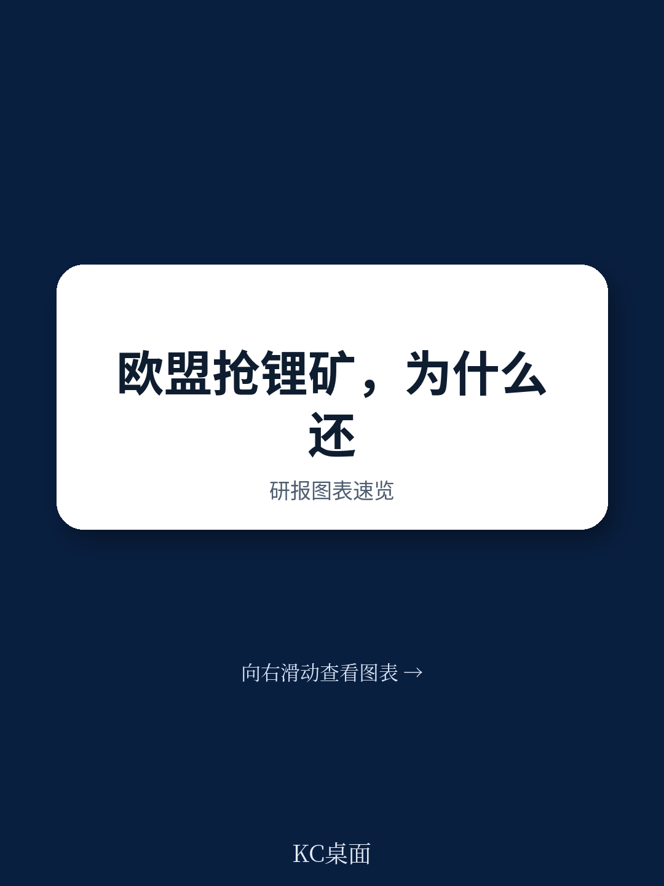
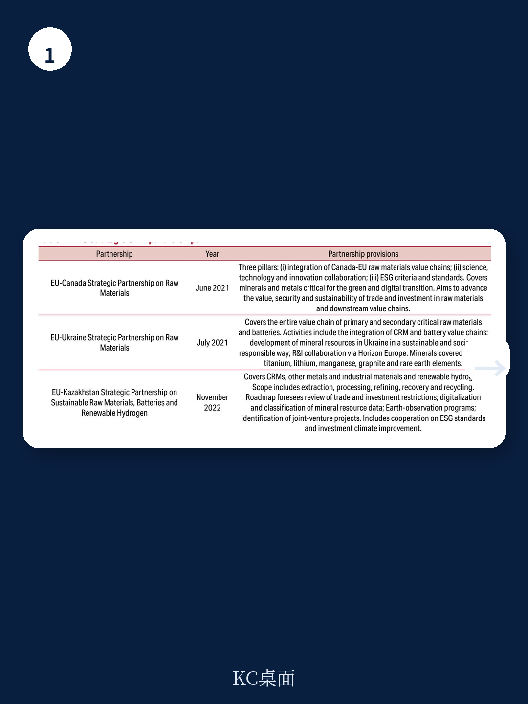
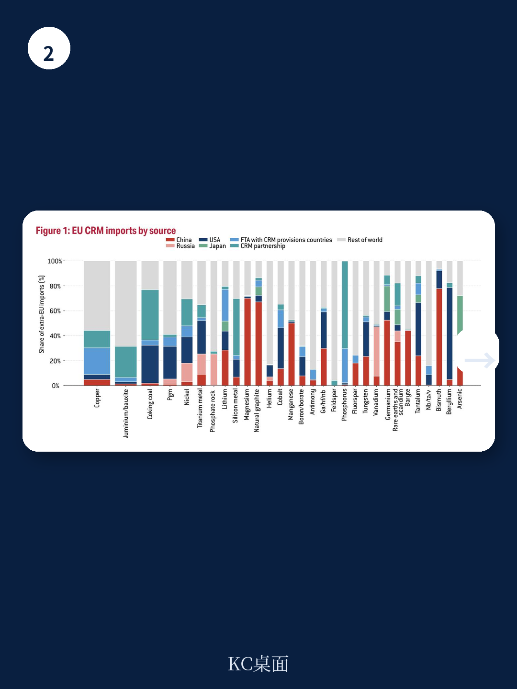

# 布鲁盖尔研究所：中国掌控70%锂加工，欧盟供应链突围要靠贸易协定

全球绿色转型对关键原材料的需求正在以指数级增长。锂的需求预计到2050年将增长470%至800%，石墨和镍的增幅也在130%到250%之间。然而，欧盟的应对策略——从《关键原材料法案》到战略伙伴关系——在实证检验面前，成绩单并需要继续观察看。

布鲁盖尔研究所最新发布的政策简报，系统评估了欧盟关键原材料战略的内外两个维度。结论直接且克制：欧盟的“战略项目”很难实现自给自足目标，“战略伙伴关系”至今未产生可测量的贸易效应。真正有效的，反而是那些被低估的贸易协定条款。

这份报告的价值不在于罗列问题，而在于提供了一套可量化的评估框架。它让产业决策者看清：哪些政策工具在真实运转，哪些只是纸面承诺。

> **KC评论：** 报告中关于“战略项目”的数据值得细看。60个项目中，目前只有21个获得了明确的资金支持，总金额约12.5亿欧元。考虑到单个大型矿山从勘探到投产的平均周期超过10年，这笔资金能否撬动足够产能，存在很大疑问。建议读者重点关注报告中的表A3，那里详细列出了每个项目的资金来源和规模。

## 1. 欧盟自给自足的目标，与项目现实之间存在断层

《关键原材料法案》设定了四个2030年基准：10%的消费来自国内开采，40%来自国内加工，25%来自回收，且单一第三国供应不超过65%。这些数字本身是合理的战略目标，但报告用数据揭示了一个尴尬的落差。

欧盟目前的全球开采份额几乎可以忽略不计，绝大多数关键矿物的开采占比低于10%。加工环节稍好，锂的加工份额达到9.5%，石墨达到49.4%。但这些数字距离40%的加工目标仍有巨大差距。更关键的是，欧盟在回收环节的全球份额较高，这反而暗示了一个结构性现实：欧洲的优势不在“挖矿”，而在“循环”。

报告中提到，60个战略项目中，大部分仍处于早期阶段。资金支持分散在多个现有工具中，缺乏集中火力。这让人联想到一个经典问题：当目标宏大但资源有限时，优先级排序才是真正的战略。

> **KC评论：** 这里有一个容易被忽略的细节。报告指出，战略项目的分布与供应不确定性并不完全匹配。比如，一些低不确定性材料获得了较多关注，而稀土这类高不确定性、低进口额但战略价值极高的材料，项目数量反而有限。这提醒我们：政策制定者需要区分“进口金额”和“战略脆弱性”两个维度。

## 2. 贸易协定比战略伙伴关系更有效，这是一个反直觉发现

欧盟与资源丰富国家签署了一系列战略伙伴关系，从智利到澳大利亚，从加拿大到哈萨克斯坦。这些伙伴关系被寄予厚望，被视为多元化供应链的关键工具。但报告通过贸易数据分析后发现：到目前为止，这些伙伴关系并未带来可测量的出口增长。

真正产生效果的是自由贸易协定中的关键原材料条款。报告数据显示，与欧盟签署了含关键原材料条款自贸协定的国家，其对欧盟的关键原材料出口有显著增长。这一发现具有政策含义：与其追求高调但空洞的伙伴关系声明，不如在贸易协定的法律框架内嵌入可执行的条款。

这个结论对企业的启示也很直接。如果一家欧洲制造商正在评估长期供应合同，它应该优先关注那些与欧盟有成熟自贸协定的国家，而非仅仅依赖政治层面的伙伴关系声明。

## 3. 报告尚未完全回答：欧盟如何应对中国的加工优势？

报告坦率承认了中国在关键原材料加工环节的主导地位。中国控制着全球90%以上的稀土加工、75%以上的钴加工、70%的锂加工。同时，中国已证明其愿意将供应链作为地缘政治工具，自2023年以来陆续实施了出口管制。

但报告留下了一个关键未解问题：欧盟是否有能力在加工环节实现实质性突破？目前，欧盟的加工能力主要集中在回收环节，而原生材料的加工高度依赖中国。即使欧盟成功从澳大利亚、智利等地获得更多原材料，如果加工环节仍然绕不开中国，供应链的脆弱性并未真正消除。

报告建议欧盟应谨慎对待美国主导的最低价格提案，转而支持双边承购协议和包含发展中国家供应商的多边合作。这一建议务实，但回避了一个核心矛盾：在加工环节，欧盟需要的是技术突破，而非政策声明。

> **KC评论：** 报告中的图3和图4值得反复看。它们分别展示了全球主要出口国和欧盟进口来源。你会注意到，欧盟对俄罗斯的镍进口依赖仍然存在，而中国在多个环节的份额远超其他任何国家。这两张图基本解释了为什么欧盟的供应链多元化战略如此紧迫。

## 给观察者的一套框架

对于关注这一议题的产业决策者和研究人员，报告实际上提供了一套评估框架，可以用于追踪欧盟战略的进展

第一，看“战略项目”的融资进度和投产时间表。如果2028年前没有一批项目进入建设阶段，2030年的目标基本可以判定为无法实现。

第二，看贸易协定的更新速度。自由贸易协定中的关键原材料条款被证明是有效的，欧盟与印尼、菲律宾等资源国的谈判进展将是重要风向标。

第三，看加工环节的突破。如果欧盟企业能够在锂和稀土加工技术上取得商业化进展，供应链格局才会真正改变。

第四，看美欧日在关键原材料领域的协调。报告对比了美国、日本和欧盟的策略，三者在竞争的同时也存在合作空间。任何一方单独行动的效果都有限。

这份报告没有给出激动人心的结论，但它用数据拆解了一个复杂问题：当一个地区试图在全球化退潮时重塑供应链，哪些工具真正有用，哪些只是政治表态。对于身处这一产业链中的企业而言，答案并不令人安心，但至少提供了方向。

For informational purposes only. Portions may be generated,translated,summarized,or edited with AI assistance based on source materials and may contain omissions or errors. Please verify independently. This is not investment,legal,tax,accounting,or other professional advice.
