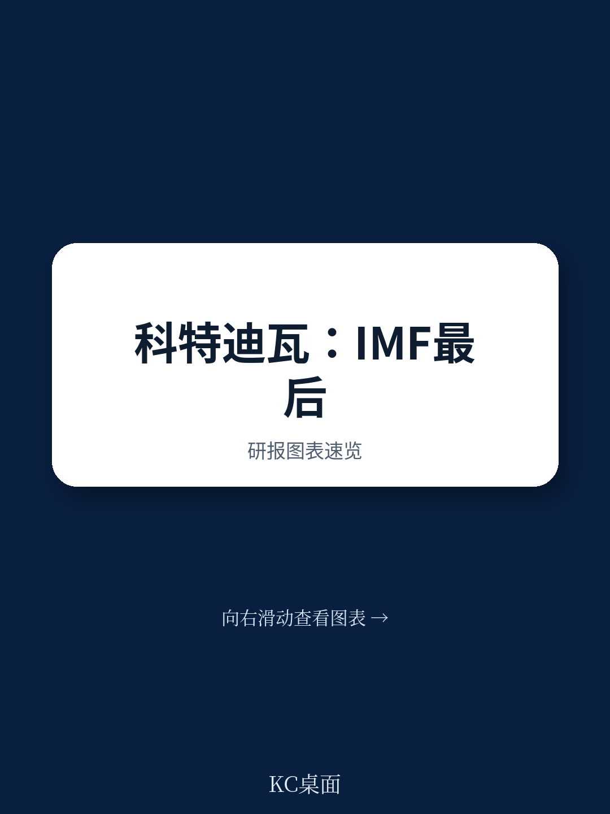
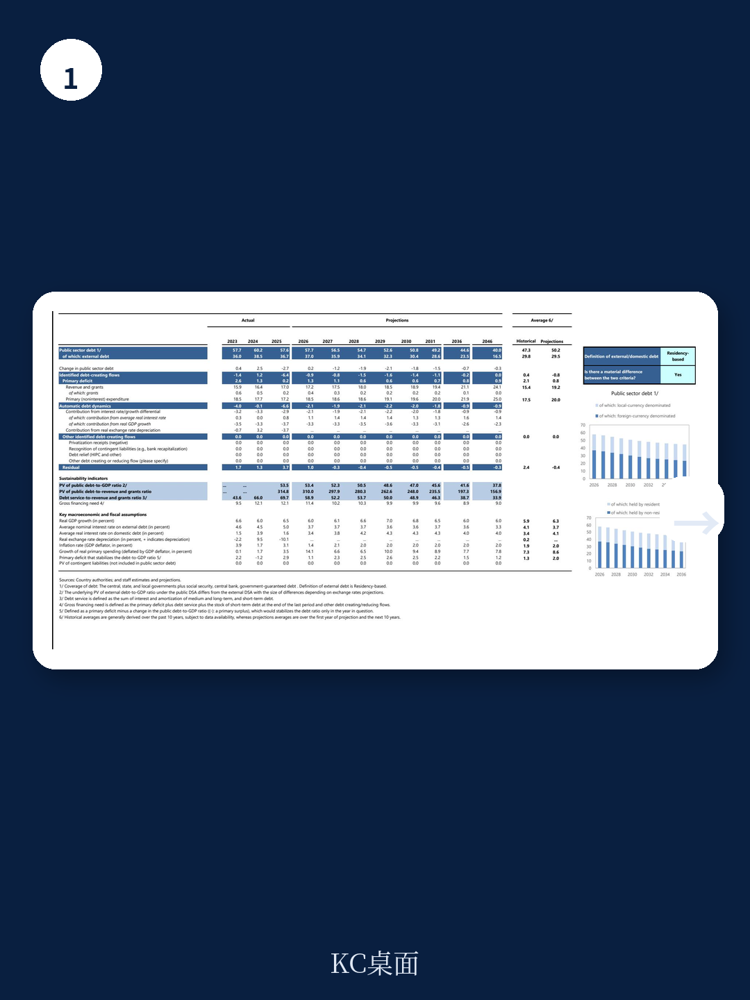
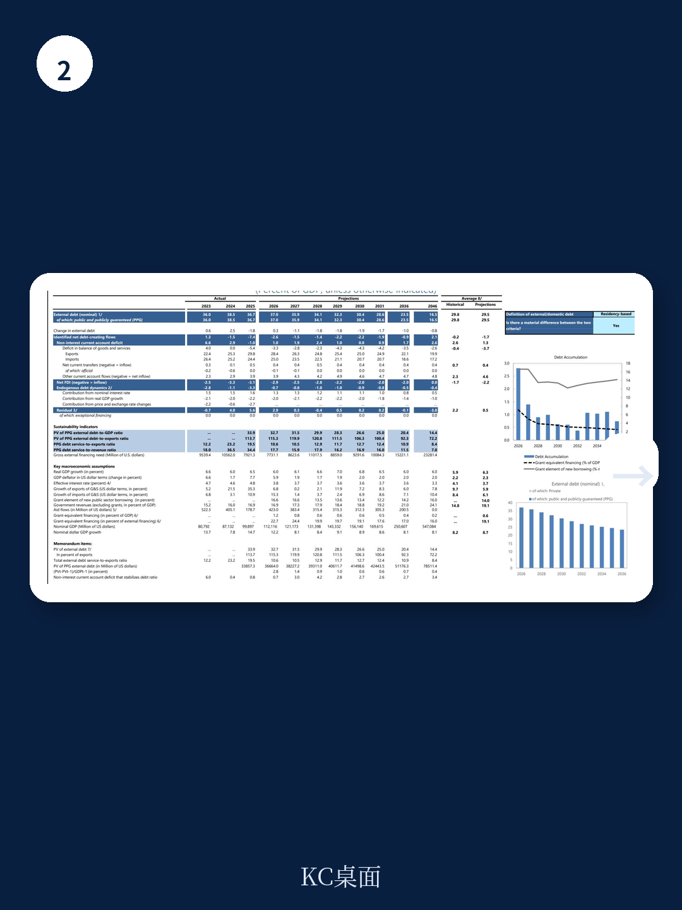

# IMF：财政赤字压至3%上限，科特迪瓦如何应对中东冲击？

西非国家科特迪瓦在2026年6月完成了与IMF的最后一轮项目审查，拿到了约8.3亿美元的最后一笔拨款。这份IMF国别报告（Country Report No. 26/171）的核心判断是：一个依赖大宗商品出口、长期面临财政赤字和债务不确定性的发展中国家，通过持续的收入侧财政整顿和审慎债务管理，不仅把财政赤字压到了西非经货联盟3%的GDP上限，还让公共债务占GDP比重在十多年来首次下降，债务困境不确定性从“中等”改善为“低”。这个转变对观察新兴市场债务治理和非洲主权信用修复具有参照价值。

报告完成于全球不确定性加剧的背景下——中东冲突推高油价至每桶100美元左右，科特迪瓦两大收入来源（石油税收和可可出口）同时承压。但这并未打乱其改革节奏。

## 1. 财政纪律的考验在于：外部冲击来临时，是否还守得住3%赤字红线

科特迪瓦在2025年成功将财政赤字压到3%的GDP，完成了西非经货联盟的硬性要求。但进入2026年，中东冲突的溢出效应开始显现：燃油收入下降、可可出口收入减弱，叠加需要维持优先研究支出，政府不得不将2026年赤字目标从3%放宽至3.8%。

这个调整并非放弃纪律。报告明确指出，政府承诺在2028年前重回3%的赤字上限。关键在于调整的“质量”——不是靠压缩公共研究，而是通过提高燃油零售价（2026年5月1日执行）、加强税收征管（包括推进电子发票、完善转让定价规则）来弥补收入缺口。换句话说，调整的代价主要由消费端和税收合规承担，而非砍掉基础设施建设。

> **KC评论：** 对关注新兴市场主权信用的读者来说，科特迪瓦的案例提供了一个“不确定性测试”样本。当外部冲击来临时，财政松弛的“度”在哪里？IMF认可了3%到3.8%的临时放宽，但附加条件是2028年必须回归。这比许多拉美或东南亚国家在类似冲击下直接放弃财政目标的做法要严格得多。

## 2. 债务不确定性改善的真正驱动力不是“降杠杆”，而是“增承压能力”

公共债务占GDP比重从2024年的59.5%降至2025年的57.1%，十年来首次下降。但更值得关注的是债务可持续性评估的变化：IMF将科特迪瓦的债务困境不确定性从“中等”上调为“低”。

这个升级并非单纯因为债务率下降。报告显示，科特迪瓦的“CI评分”（债务承压能力指标）显著提升，意味着即使债务规模不变，宏观环境吸收债务冲击的能力变强了。这背后是持续的收入动员改革——财政收入占GDP比重从2023年的15.2%升至2025年的16.8%，为财政腾挪提供了更多空间。

同时，外债管理策略也在调整。报告附件II详细说明了政府转向更审慎的借款策略，包括优先使用优惠融资、控制商业借款节奏、维持对国际市场的谨慎接触。在区域层面，西非经货联盟的储备池覆盖了超过8个月的进口，为科特迪瓦提供了额外的外部缓冲。

## 3. 气候改革全部完成，但报告没有展开的关键问题是“后项目时代”如何持续

科特迪瓦的韧性可持续性安排（RSF）覆盖了所有改革措施，包括农业气候不确定性保险、碳税战略、清洁车辆政策、以及两个光伏电站的招标。这在IMF的RSF项目中属于完成度较高的案例。

但报告也留下了一个未充分回答的问题：RSF项目结束后，这些改革能否自主推进？碳税战略的落地需要国内政治支持，光伏电站的建设周期较长，农业保险的推广依赖财政补贴。报告只是笼统地表示“当局打算继续实施改革议程”，但没有给出具体的资金安排或时间表。

> **KC评论：** 对于跟踪气候融资和绿色转型的读者，科特迪瓦的案例值得继续关注的是“项目退出后的政策自主性”。IMF的RSF提供了技术支持和资金激励，但一旦项目结束，改革动力能否延续，将是检验改革“内生化”程度的真正指标。

## 4. 报告尚未完全回答的观察框架：私人部门能否接棒成为增长引擎

科特迪瓦2026-2030年国家发展计划（NDP）设定了雄心勃勃的目标：总研究约1400亿美元，其中70%来自私人部门。报告将此描述为“私人部门主导的增长”，但并未详细拆解私人资本是否真的愿意进入、以及哪些行业具备吸收大规模研究的能力。

报告提到了四个目标行业：农产品加工、制造业、矿业、能源和建筑。但这些行业的研究门槛、政策不确定性、基础设施配套情况，在报告中着墨不多。对于关注非洲研究机会的读者，这恰恰是需要自行补充研究的领域——科特迪瓦的政治稳定和债务改善是必要但不充分条件，真正的研究决策还需要更细颗粒度的行业分析。

---

**对产业决策者的启示：** 科特迪瓦的案例表明，新兴市场的债务修复并非一蹴而就，而是收入端改革、债务管理策略和外部环境共同作用的结果。其财政纪律的“弹性执行”（短期放宽但明确回归路径），可能成为其他大宗商品出口国在不确定环境下的参考模板。但私人部门研究能否如期接棒，将决定这个西非地区能否真正迈向上中等收入国家行列。

For informational purposes only. Portions may be generated,translated,summarized,or edited with AI assistance based on source materials and may contain omissions or errors. Please verify independently. This is not investment,legal,tax,accounting,or other professional advice.
