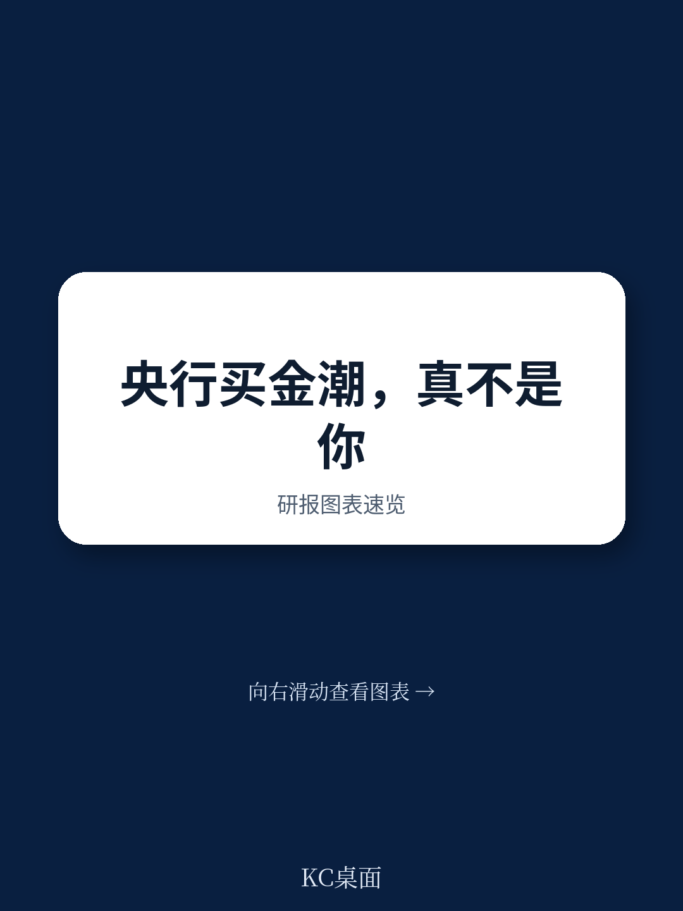
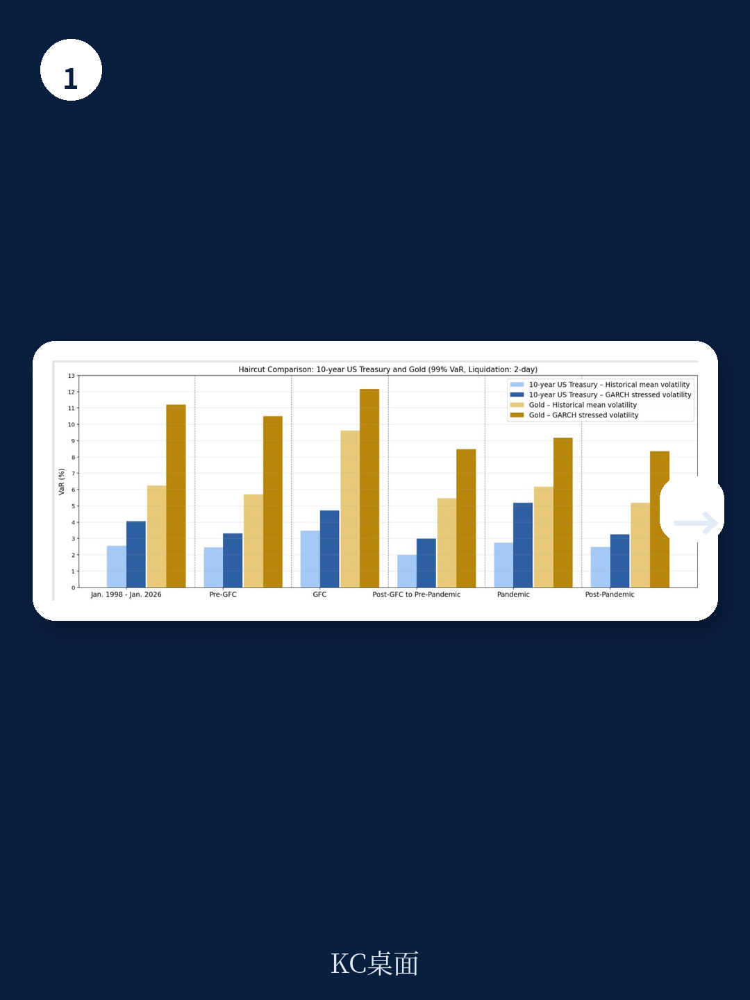
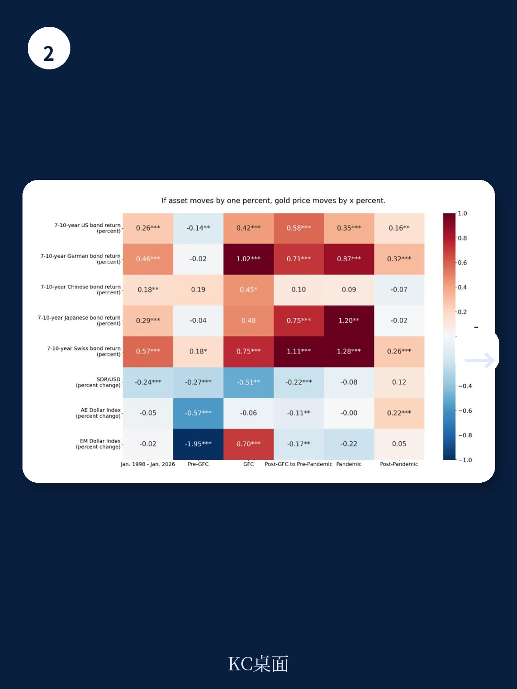

# IMF：黄金不是终极避险资产？IMF揭示其流动性远低于市场预期

黄金在各国央行储备中的占比从2019年初的10%飙升至2025年8月的超过22%，但这份IMF最新发布的Note/2026/007号研究报告给出了一个反直觉的判断：推动这一变化的，不是央行大规模观点偏积极实物黄金，而是金价上涨带来的估值效应。2018年至2025年，全球央行黄金储备的市值从约1.2万亿美元升至4.5万亿美元，增幅达268%，但同期黄金持有量仅增长约8.5%。这意味着，近三分之二的市值增长来自那些持有量基本未变的央行。

这份报告的核心主张是：黄金是一种高不确定性储备资产，其避险属性高度依赖于特定情境，且流动性远低于其名义市场价值所暗示的水平。对央行和决策者而言，当前最需要警惕的不是“该不该买黄金”，而是“如何正确评估现有黄金头寸的真实不确定性”。

## 1. 黄金的避险功能正在退化，尤其在尾部不确定性面前

报告通过大量实证数据检验了黄金对不同不确定性的响应特征。结果显示，黄金最稳定的对冲功能是针对利率不确定性和美元贬值，但在疫情后，其对市场下跌、通胀意外和地缘政治冲击的保护作用显著减弱。2022年以来，公司与债券之间传统负相关关系的瓦解，进一步削弱了黄金在组合观察中的分散化价值。

更关键的是，黄金并不具备可靠的“安全港”属性。在尾部事件中，黄金价格与不确定性资产的相关性并不稳定，有时甚至同步下跌。这意味着，当央行最需要动用储备来应对极端市场冲击时，黄金可能无法提供预期的保护。

> **KC评论：** 许多市场参与者习惯将黄金视为“终极避险资产”，但IMF的实证分析提示，这一认知需要更新。黄金的避险功能是有条件的，且正在变化。对于依赖储备进行扰动管理的央行来说，过度依赖黄金可能反而削弱储备的“自我保险”功能。

## 2. 流动性是黄金作为储备资产的阿喀琉斯之踵

尽管伦敦黄金市场日均交易量约1340亿美元，规模可观，但报告指出，黄金的流动性质量远低于其交易量所暗示的水平。核心问题在于：黄金的流动性在不确定性环境下会显著下降，且其买卖价差远大于高信用等级政府债券。

报告建议，央行应将黄金严格限定在“组合观察”而非“流动性组合”中。如果央行不采用分层管理框架，则必须使用流动性调整后的市值来评估黄金的实际可用性。计算表明，黄金提供的有效流动性远低于其账面市值——这一差异在扰动时期会被急剧放大。

对于需要随时动用储备来干预汇率或应对资本外流的国家，将黄金纳入流动性组合可能造成严重的操作不确定性。

## 3. 国内黄金购买计划：一个尚未被充分认知的不确定性源

报告用较大篇幅讨论了央行购买国内黄金（DGP）计划带来的特殊不确定性。这些不确定性涉及授权清晰度、治理结构、资产负债表暴露、资金完整性、操作安排和货币政策实施等多个维度。

最突出的问题在于：当央行购买非货币黄金（即需要精炼后才能成为储备资产的黄金）时，实际上是在从事准财政活动。这类操作不仅模糊了央行与财政部门的边界，还会在资产负债表上引入精炼商信用不确定性、价格波动不确定性和操作不确定性。报告明确指出，此类活动“通常应避免或分配给其他公共实体”。

对于黄金生产国而言，国内黄金购买还存在一个结构性矛盾：如果本国宏观环境高度依赖黄金出口，那么金价下跌将同时冲击出口收入和储备价值，形成双重打击。

> **KC评论：** 这是报告中最具政策含义的部分。许多新兴市场央行将国内黄金购买视为“支持本地矿业”和“增厚储备”的双赢策略，但IMF的分析揭示了其中的隐性成本。读者可以重点关注报告中关于“非货币黄金”与“货币黄金”的区分，以及精炼环节引入的额外不确定性。

## 4. 报告尚未完全回答的关键问题

尽管报告提供了全面的分析框架，但有几个问题值得进一步探讨。

第一，报告对黄金在制裁不确定性下的保护作用着墨不多。在资金碎片化加剧的背景下，黄金作为“无对手方不确定性”资产的价值可能被低估。第二，报告主要基于历史数据，但黄金市场的结构性变化——比如各国央行购买行为的集中化——可能改变其未来的价格行为和流动性特征。第三，报告没有深入讨论央行之间黄金借贷和互换市场的运作机制，这可能是理解黄金实际流动性的另一关键维度。

## 5. 读者可以建立怎样的观察框架

对关注央行储备管理的读者而言，这份报告提供了三个核心分析维度。

第一，区分“估值效应”与“实际积累”。当看到央行黄金储备占比上升时，首先要问：这是金价涨了，还是央行真的在买？第二，评估流动性匹配度。央行需要根据自身的流动性需求来设计黄金配置——短期干预需求越高的央行，黄金的配置上限应当越低。第三，审视国内黄金购买计划的真实成本。对于黄金生产国，需要对比“支持矿业”的产业政策收益与“储备质量下降”的资金不确定性，而不是简单地将两者混为一谈。

黄金重回央行资产负债表中心，但这并不意味着它应该被视为传统储备资产的替代品。正如这份报告所强调的：黄金应当被评估为一种高不确定性储备资产，而不是一种安全的、流动性的储备工具。

For informational purposes only. Portions may be generated,translated,summarized,or edited with AI assistance based on source materials and may contain omissions or errors. Please verify independently. This is not investment,legal,tax,accounting,or other professional advice.
