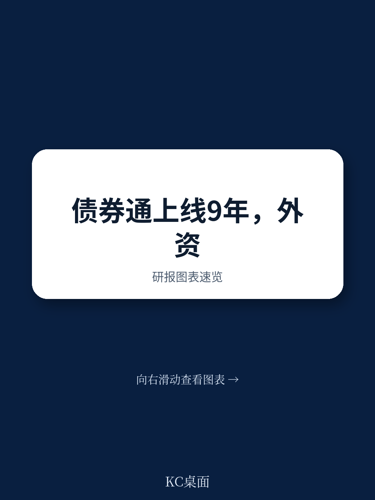
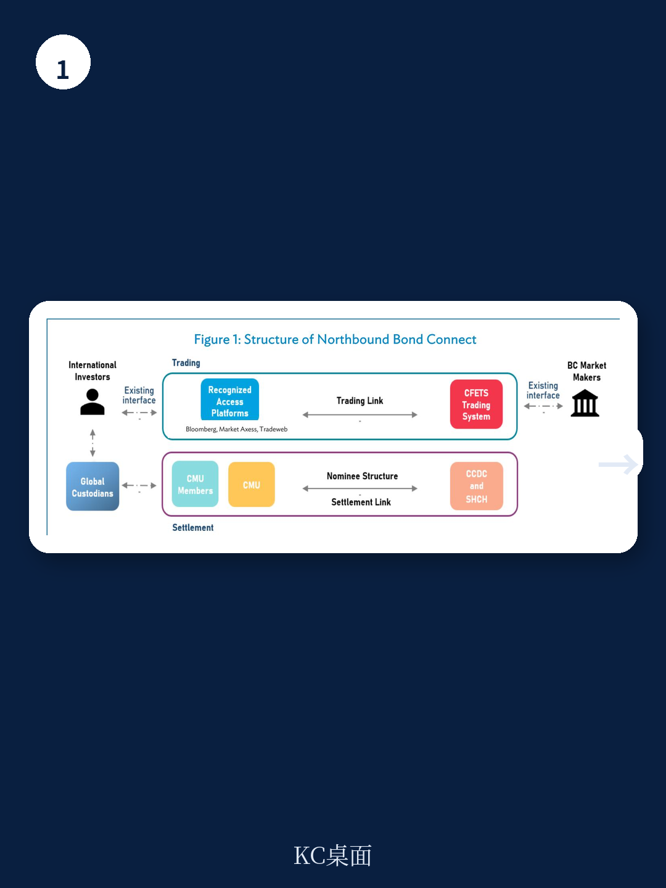
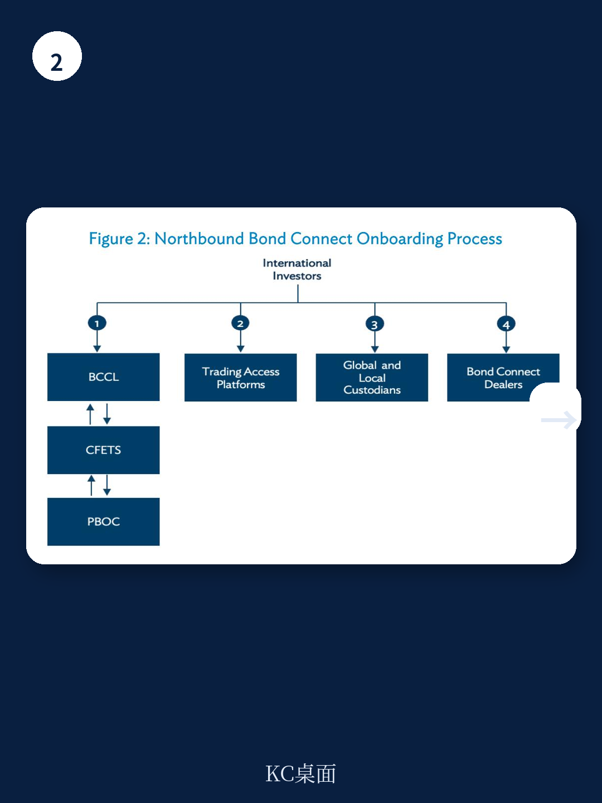

# 亚洲开发银行：不是额度限制，而是基础设施兼容性决定资金是否长期停留

一份来自亚洲开发银行（ADB）的专题简报，没有聚焦宏观预测或利率走势，而是花大量篇幅拆解了一个看似技术性的基础设施——Bond Connect。但读完你会发现，它讨论的远不止是一个交易通道。

这份报告的核心判断是：Bond Connect已经从2017年一个简单的市场准入选项，演变为一个覆盖交易、托管、外汇、衍生品和回购的完整跨境生态。它正在改变国际读者参与中国银行间债券市场（CIBM）的方式，而且这种改变的速度和深度，可能被很多人低估了。

报告特别指出，到2025年，Bond Connect已经允许境外读者参与CIBM的买断式回购业务，这是与国际接轨的关键一步。同时，通过Swap Connect提供的利率互换工具，以及配套的外汇服务，Bond Connect几乎覆盖了国际读者在进入一个新兴债券市场时最关心的所有环节：能不能买、怎么结算、如何对冲、能不能做融资。

> **KC评论：** 很多人讨论中国债市开放，关注的是“有没有额度限制”或者“指数纳入了几次”。但亚开行这份简报提醒我们，真正决定资金是否愿意长期停留的，是基础设施的兼容性——读者能不能用自己熟悉的平台、托管行和结算习惯来操作。Bond Connect解决的就是这个“无缝接入”的问题。

## 1. 真正的变量不是额度，而是操作兼容性

报告用了大量篇幅对比Bond Connect与QFII/RQFII、CIBM Direct两种传统路径的差异。区别并不仅仅在于没有额度限制。

更关键的是，Bond Connect让国际读者可以继续使用Bloomberg、MarketAxess、Tradeweb这些他们已经部署的全球交易平台，直接连接到中国外汇交易中心（CFETS）的系统。托管层面，读者可以继续使用自己在香港已有的全球托管行或本地托管行，通过CMU（债务工具中央结算系统）的代理账户完成结算。

这意味着，一个已经在新兴市场有配置的全球资产管理公司，进入中国债市的边际成本大幅降低。它不需要在中国境内重新建立运营团队、不需要适应本地结算流程、不需要重新谈判托管协议。报告说得很直白：“对大型且有经验的国际读者而言，研究CIBM就像‘打开’一个新市场一样简单。”

这个“打开”的时间，根据报告数据，通常只需要2到6周。相比之下，QFII的审批流程和运营磨合成本要高得多。

## 2. 回购业务的开放，可能比想象中更重要

报告提到的一个2025年重要进展，是Bond Connect开始允许境外读者参与CIBM的买断式回购。这个细节容易被忽视，但它对市场深度的影响可能超过许多人的预期。

回购市场的核心功能是提供流动性管理和杠杆工具。没有回购，持有债券的读者在需要资金时只能卖出债券，这会增加交易成本和市场波动。有了回购，读者可以用持仓做抵押融资，资金使用效率大幅提升。

更重要的是，亚开行强调，Bond Connect下的回购业务采用的是“title-transfer”模式，即所有权转移式回购，这与国际惯例一致；而境内读者之间交易的更多是质押式回购。这种差异意味着，国际读者不需要为了参与中国债市而学习一套陌生的法律和操作框架。

> **KC评论：** 回购开放的意义在于，它让中国国债作为抵押品的功能被激活。当全球读者可以像使用美国国债或德国国债那样，用中国国债做融资和杠杆操作时，中国债券的“高流动性资产”属性才会真正建立起来。报告提到PBOC将“推动人民币债券成为高质量流动性资产”列为四大优先事项之一，回购开放就是这个目标的技术基础。

## 3. 报告没有完全回答的问题：资金流入的可持续性

这份简报在描述Bond Connect机制时非常详尽，但它并没有深入讨论一个关键变量：在基础设施已经就位的情况下，国际资金是否会持续流入中国债市？

报告提到了中国国债被纳入三大全球债券指数——彭博巴克莱全球综合指数、摩根大通GBI-EM全球多元化指数、富时世界国债指数——带来的被动资金流入。但被动资金流入是一次性的，真正的增量取决于主动读者的配置意愿。

这里有几个报告没有完全展开的观察点。第一，Bond Connect虽然降低了操作门槛，但并不能解决汇率不确定性对冲的成本问题。报告提到读者可以通过FX Services进行外汇对冲，但人民币远期和掉期市场的深度和定价效率，与美元、欧元市场仍有差距。第二，中国央行在2025年提出的四大优先事项——推动人民币债券成为高质量流动性资产、增强跨境基础设施连接、丰富不确定性管理工具、优化投融资环境——方向是对的，但执行细节和市场反馈仍需观察。

对于关注中国债市开放的读者，这份简报最有价值的部分不是它提供的结论，而是它展示的基础设施架构。它提醒我们，判断一个市场是否真正开放，不能只看政策文件中的“允许”二字，更要看国际读者是否能用自己习惯的方式、在自己熟悉的平台上、以可接受的成本完成交易、托管和对冲。

Bond Connect在这方面已经走得很远。接下来的问题，是这些基础设施能否吸引足够多的用户，形成正向循环。