TOWARD MORE LIVABLE CITIES
IN THE HINDU KUSH HIMALAYAS

LESSONS FROM THE NEXUS OF AFFORDABLE AND SEISMIC-RESILIENT HOUSING IN BHUTAN, THE INDIA-HIMALAYA REGION, AND NEPAL

Jude E. Kohlhase, Saswati G. Belliappa, and Charlene Liau

NO. 104

July 2026

ADB SOUTH ASIA

WORKING PAPER SERIES

# Toward More Livable Cities in the Hindu Kush Himalayas: Lessons from the Nexus of Affordable and Seismic-Resilient Housing in Bhutan, the India-Himalaya Region, and Nepal

Jude E. Kohlhase, Saswati G. Belliappa, and Charlene Liau

No. 104 | July 2026

The ADB South Asia Working Paper Series presents ongoing and recently completed research and policy studies meant to enhance greater understanding of and promote dialogue on current important economic and development issues in South Asia. The views expressed are those of the authors and do not necessarily reflect the views and policies of ADB or its Board of Governors or the governments they represent.

Jude E. Kohlhase is a principal portfolio management specialist at the Office of Business Intelligence and Operations Coordination, Asian Development Bank (ADB). Saswati G. Belliappa is a principal safeguards specialist at the Office of Safeguards (ADB). Charlene Liau is a results management specialist at the Strategy, Policy, and Partnerships Department (ADB).

© 2026 Asian Development Bank

6 ADB Avenue, Mandaluyong City, 1550 Metro Manila, Philippines

Tel +63 2 8632 4444; Fax +63 2 8636 2444

www.adb.org

Some rights reserved. Published in 2026.

ISSN 2313-5867 (print), 2313-5875 (PDF)

Publication Stock No. WPS260311-2

DOI: http://dx.doi.org/10.22617/WPS260311-2

The views expressed in this publication are those of the authors and do not necessarily reflect the views and policies of the Asian Development Bank (ADB) or its Board of Governors or the governments they represent.

ADB does not guarantee the accuracy of the data included in this publication and accepts no responsibility for any consequence of their use. The mention of specific companies or products of manufacturers does not imply that they are endorsed or recommended by ADB in preference to others of a similar nature that are not mentioned.

By making any designation of or reference to a particular territory or geographic area in this document, ADB does not intend to make any judgments as to the legal or other status of any territory or area.

This publication is available under the Creative Commons Attribution 3.0 IGO license (CC BY 3.0 IGO) https://creativecommons.org/licenses/by/3.0/igo/. By using the content of this publication, you agree to be bound by the terms of this license. For attribution, translations, adaptations, and permissions, please read the provisions and terms of use at https://www.adb.org/terms-use#openaccess.

This CC license does not apply to non-ADB copyright materials in this publication. If the material is attributed to another source, please contact the copyright owner or publisher of that source for permission to reproduce it. ADB cannot be held liable for any claims that arise as a result of your use of the material.

Please contact pubsmarketing@adb.org if you have questions or comments with respect to content, or if you wish to obtain copyright permission for your intended use that does not fall within these terms, or for permission to use the ADB logo.

The ADB South Asia Working Paper Series is a forum for ongoing and recently completed research and policy studies undertaken in ADB or on its behalf. It is meant to enhance greater understanding of current important economic and development issues in South Asia, promote policy dialogue among stakeholders, and facilitate reforms and development management.

The ADB South Asia Working Paper Series is a quick-disseminating, informal publication whose titles could subsequently be revised for publication as articles in professional journals or chapters in books. The series is maintained by the South Asia Department. The series will be made available on the ADB website and on hard copy.

Corrigenda to ADB publications may be found at http://www.adb.org/publications/corrigenda.

## Notes:

In this publication, “\$” refers to United States dollars and “₹” refers to Indian rupees. ADB recognizes “Vietnam” as Viet Nam.

## CONTENTS

TABLES, FIGURES, AND BOXES
ACKNOWLEDGMENTS
ABBREVIATIONS
EXECUTIVE SUMMARY
I. INTRODUCTION
Regional Context
Purpose and Method
II. SEISMIC RISK IN THE HINDU KUSH HIMALAYA REGION
Seismic Risk
Main Messages
III. URBANIZATION IN BHUTAN, THE INDIA-HIMALAYA REGION, AND NEPAL
Urbanization Trends
Economic Importance of Urban Areas
Role of Mid-Weight and Intermediate Towns
Urban Policies, Spatial Planning, and Risk Information
Bhutan's Urbanization Challenges
India's Urbanization Challenges
Nepal's Outlook on Urbanization
Main Messages
IV. HOUSING AFFORDABILITY AND SEISMIC RISK IN BHUTAN,
THE INDIA-HIMALAYA REGION, AND NEPAL
Overview
Housing Institutions and Policies
Housing Conditions of the Urban Poor and Policy Responses
Adequate Housing and Backlogs
Housing Affordability in Bhutan
De Facto Housing
Housing Typologies and Earthquakes
Main Messages

V. ROAD MAP FOR SUPPORTING AFFORDABLE AND SEISMICALLY RESILIENT HOUSING IN THE HINDU KUSH HIMALAYA REGION
Overview
Recommendations for Strategy 2030
43
44
BIBLIOGRAPHY
46

# TABLES, FIGURES, AND BOXES

## TABLES

1 Urbanization in India and the India–Himalaya Region States, 2011 7
2 Earthquake Damages for Kangra District, Himachal Pradesh 22
3 Share of Urban Population Living in Slum Conditions in the Hindu Kush Himalaya Region 26
4 Earthquake-Safe Traditional Construction Practices in the India–Himalaya Region 36

## FIGURES

1 Geomorphological Features of Hindu Kush Himalaya Region 4  
2 The Housing Value Chain 16  
3 Indonesia InaRisk Platform: Risk Assessment for Earthquakes 42

## BOXES

1 Salient Features of India's National Urban Housing and Habitat Policy 2007 20  
2 Self-Built Housing Under the Pradhan Mantri Awas Yojana Urban Mission: Dharamshala, Himachal Pradesh 21  
3 Overview of Acts and Policies in Nepal 24  
4 Housing Conditions of the Urban Poor, Shimla City, Himachal Pradesh, India Himalaya Region 28  
5 Integrating Affordability, Resilience, and Convergence: India's Evolving Urban Housing Framework 30  
6 Typical Urban Housing Typologies, Thimphu, Bhutan 34  
7 Generalized Building Typologies and Seismic Performance 37

# ACKNOWLEDGMENTS

The team leading this paper from the Asian Development Bank (ADB), Jude Kohlhase, principal portfolio management specialist of the Office of Business Intelligence and Operations Coordination; Saswati Ghosh Belliappa, principal safeguards specialist (Social), Office of Safeguards; and Charlene Liau, results management specialist, Strategy, Policy, and Partnerships Department, would like to express gratitude to the management of ADB's Water and Urban Development Sector Office (SD2-WUD) within the Sector Department 2 for their guidance, supervision, and support, most especially to Norio Saito, senior director, SD2-WUD and Manoj Sharma, director, SD2-WUD.

Preparation of this paper benefited from insightful feedback from peer reviewers Ramola Naik Singru, principal urban development specialist; and Hong Soo Lee, senior urban development specialist. We are grateful for the review comments provided by Sonomi Tanaka, country director; and Sonam Lhendup, senior economics officer, Bhutan Resident Mission. The team thanks Arnaud Cachois, country director; and Malika KC Thapa, operations assistant, Nepal Resident Mission, for their support and coordination with the Government of Nepal. We are also grateful to Rajesh Deol, principal communications officer; K. Balaji, associate operations officer; and Poornima Prasad, executive assistant, India Resident Mission, for coordinating the review by the Government of India.

This paper is based on inputs from the following ADB consultants: Colleen Butcher-Gollach, Charles Scawthorn, Deependra Pourel, Banashree Banerjee, and Sanjaya Pradhan—under the support of the Implementation of Strategy 2030 Operational Plans Technical Assistance. The team also thanks Ruthcelyn U. Francisco, ADB consultant, for coordinating the clearances and editing process.

## ABBREVIATIONS

ADB Asian Development Bank
COVID-19 coronavirus disease
GDP gross domestic product
HKH Hindu Kush Himalaya
km kilometer
MFI microfinance institution
MOHUA Ministry of Housing and Urban Affairs
MPI multidimensional poverty index
NHDCL National Housing Development Corporation Limited
PMAY-U Pradhan Mantri Awas Yojana-Urban
PRC People's Republic of China

# EXECUTIVE SUMMARY

Context. The Hindu Kush Himalaya (HKH) region stretches 3,500 kilometers (km) eastward through Afghanistan, Pakistan, the People's Republic of China (PRC), Nepal, India, Bangladesh, Bhutan, and into Myanmar. $^{1}$ It is vast and home to many glaciers. This natural “water tower of Asia” feeds the Indus, Ganges, and Brahmaputra (known as the Yarlung Zangbo in the PRC). These rivers support a rich biodiversity and the livelihoods and economies of more than a billion people. In this working paper, the Asian Development Bank (ADB) assesses the seismicity of the region and the policies and practices affecting the supply of affordable and seismic-resilient housing in India, Bhutan, and Nepal. India stands as the largest country with a staggering population of 1.46 billion. However, this study is focused on the Indian Himalayan Region within the HKH, comprising an estimated 8% of India's total population. In contrast, Bhutan is the smallest country, with a population of 800,000. Nepal, with a population of 29.6 million, is notably one of the poorer countries in the region.

Strategic challenge. Rapid population growth in seismically hazardous areas requires meeting the challenges of supplying affordable housing and reducing seismic risk. The Himalayan uplift is a result of tectonic plate movements that occurred 50 million years ago and continue to this day. The region is characterized by a concentration of ongoing seismic activity that impacts the lives, buildings, and assets of residents, and that impact is compounded by accelerating glacial melt and associated breach floods and landslides as a result of global warming. In addition to their common seismic hazard risk, the populations living in the widely disparate countries along the Himalayan arc face the additional shared challenge of adequate, affordable housing. A recorded 446 million people live in unplanned slums and informal settlements in the eight countries, comprising nearly 45% of the world's total number of people living in poor housing conditions.

The population of these seismically hazardous areas of Asia increased by 21% between 2000 and 2015, a 3.4% faster growth rate than that of less seismically hazardous areas. This growth is stretching the respective countries' resources for planning and financing the supply of well-located and safe land, infrastructure, and climate-resilient housing to meet the demands of the burgeoning population.

Housing value chain. The efficient supply of formal housing to meet demand at affordable prices in the volume needed to keep abreast with urban growth is the result of the interactions and coordination between public and private sector value chain activities. As countries' urban populations grow from natural population growth and in-migration for economic and other opportunities, bottlenecks are exacerbated, and housing prices are expected to continue to increase as the demand-supply gap widens. In the three countries analyzed, the supply-side activity of providing households and developers with access to consolidated blocks of land that are appropriately located, planned, and zoned for residential purposes, with climate-proofed infrastructure and other municipal services, is predominantly carried out by the public sector. However, the design, financing, and construction of houses are largely taken up by the private sector.

Disconnect in knowledge, policies, financial services, and practices to achieve affordable and seismically resilient housing. The housing markets of the three countries represent a disconnect in the knowledge, policies, and practices needed to achieve an adequate housing supply that meets the needs and affordability levels of lower-income groups. Another challenge is ensuring that such housing is in safe areas and that the design costs imposed by standards for seismic risk-resilient homes do not add to the rental stress of households, where housing costs exceed 30% of household income.

Housing affordability gap. In Bhutan's two largest cities (thromdes), rental stress is a burden on households across almost all Thimphu and Phuentsholing suburbs. On average, the rent-to-income ratio is 42% for women-headed families and 33% for men-headed families living in officially sanctioned housing in almost all the suburbs of Thimphu. The median rent-to-income ratio in Phuentsholing is a high 42.5%. Nationwide, the median rent-to-income ratio for privately rented housing is 27.5% and is notably higher than the ratio for public sector housing, which in the past has been subsidized. However, affordability varies for different income groups. Rental stress is felt most by the poorest 20% of households across Bhutan's thromdes, by the near-poor households (20%-40% income quintile), and middle-income households (in the third quintile) in Phuentsholing, Paro, Gelephu, and Thimphu.

In India, while the urban housing stock has grown consistently, the urban housing shortage has also risen over time. In India's Himalaya region states, $56\%$ of the population classified as economically weaker faces a housing shortage. Similarly in Nepal, the National Shelter Policy (2012) calculated the need for 1.4 million housing units in urban areas by 2023, requiring the construction of around 90,000 new housing units per year. In reality, far fewer new units were constructed each year over the period. For example, one in four households living in Bagmati Province, including Kathmandu, suffered housing deprivation in 2019.

Measures to improve affordable housing supply. Several recent studies correctly identify and recommend removing barriers to improved housing supply to meet the affordability of low- and middle-income earners. These include the need for mobilizing and designating suitable land for residential development, streamlining procedures and permitting requirements for local construction materials, public sector financing for infrastructure, and regulatory reforms to enable options for land development and housing finance accessible to lower-income earners.

Seismic risk reduction. Future earthquake damage and losses can be reduced by adopting and implementing risk-informed policies and actions in two areas. First, by using risk-informed land-use plans to avoid development in areas with underlying soil and rock conditions that will amplify ground shaking or liquefaction, avoiding landslide-prone soils, and by accommodating urban expansion onto safer lands rather than pursuing densification policies. Second, by designing and constructing stronger buildings to meet specified seismic performance standards. The most common residential building types in the three countries are vernacular, non-engineered buildings constructed with lightweight materials such as fired brick, unreinforced mortar, and adobe-block walls. If well-constructed, these traditional buildings can withstand significant seismic events. Non-engineered low-rise earth and masonry buildings should follow the seismic design guidelines of the International Association of Earthquake Engineering.

The associated increase in costs is dependent on many factors but is generally in the range of 5%–20% of total building costs. Savings effected through simple design modifications could be used to offset the costs without compromising amenities, such as lowering the height of rooms, ensuring regular shaped rooms, and promoting the use of wood-frame construction where appropriate. Subsidies offered by schemes such as Pradhan Mantri Awas Yojana Urban (PMAY-U) “Housing for All” in India offer an example of how government assistance can help offset such costs for poor households, particularly in the case of beneficiary-led construction options, serving to safeguard affordability.

The diverse range of failures during a seismic disaster highlights the need to promote not only the enforcement of building codes but also seismic awareness among households and small-scale builders and disseminating improved construction practices to enhance overall seismic resilience.

On the supply side of the housing value chain. Developers, from governments, support partners, profit and nonprofit companies to self-builders, all work to build housing that meets household needs and preferences in terms of plot size, building design, size of floor space, location, and price. Public agencies must facilitate timely access to suitable, well-located, and serviced land for development, with infrastructure services such as water supply, wastewater disposal, power, and roads. Developers and builders then decide whether or not to undertake house construction in that location.

If a steady and predictable pipeline of land is not available, or approval of sites takes a long time and is costly, the entire value chain becomes choked, and housing supply dries up and cannot keep up with population growth. This, in turn, leads to the formation and perpetuation of informal settlements, typically on marginal and unsafe land, or to overcrowding of existing housing stock, resulting in exacerbated loss to human life if a disaster were to occur.

There are several factors necessary to underwrite supply-side activities:

(i) Public and political acceptance of the positive role that well-managed cities play translating into policies and a legal framework that enable changes in land use so that the urban footprint is able to expand or densify in safer areas to accommodate urban growth and adequate provisioning for residential land, which typically accounts for between 40% and 70% of all urban land.

(ii) Availability and ease of using accurate and granular risk information to translate these policies into practice through risk-informed forward spatial city planning and infrastructure investments in well-located and low-hazard risk areas.

(iii) Resources and incentives that bring about change in the knowledge, attitudes, and practices of house designers, builders, and financiers for the design and construction of seismically strengthened but affordable houses.

On the demand side of the housing value chain. This encompasses activities that enable a household to become a home occupant as an owner or a renter. The main considerations that facilitate this transition are developer finance, end-user financing or financial support, and the means to acquire consumer financial literacy and risk understanding.

Lessons learned from case studies. This working paper documents three case studies that showcase noteworthy policy approaches and exemplary practices along the housing value chain toward achieving the twin objectives of affordable and seismically resilient housing.

Road map for supporting affordable and seismically resilient housing in the Hindu Kush Himalaya Region. ADB's Strategy 2030 outlines a road map for addressing the diverse and evolving development challenges in Asia and the Pacific. There are a number of development solutions for achieving adequate, resilient, and affordable housing in the region in alignment with ADB's Strategy 2030.

# I. INTRODUCTION

## Regional Context

The Hindu Kush Himalaya (HKH) region, with a population of 240 million people, stretches 3,500 kilometers (km) eastward through Afghanistan, Pakistan, the People's Republic of China (PRC), Nepal, India, Bangladesh, Bhutan, and into Myanmar. It is home to the world's highest mountain ranges and glaciers $^{1}$ and the source of 10 major river systems, including the Indus, Ganges, Yangtze, and Brahmaputra. $^{2}$ It supports rich biodiversity and the livelihoods of nearly 1.8 billion people who live in its 10 river basins.

The interface of the colliding Australian and Eurasian plates, a décollement called the Main Himalayan Thrust, is the world's largest active continental megathrust, with a relative current motion of the converging plates of around 44 millimeters per year. As a result, the region is characterized by ongoing seismic activity that impacts the lives, buildings, and assets of its residents. In the last 5 decades, the region has suffered four strong earthquakes of magnitude 6.0–6.9 on the Richter scale, three major earthquakes of magnitude 7.0–7.9, and two powerful earthquakes of magnitude 8.0 or higher. The risk of seismic disasters increases with accelerating glacial melt linked to global warming, which also leads to more frequent and severe breach floods and landslides.

In addition to their common seismic hazard risk, the people living in the widely disparate countries along the Himalayan arc face the additional shared challenge of affordable, adequate housing. Across countries along the arc, 446 million people reside in unplanned informal settlements and slums, representing approximately $45\%$ of the world's total population who lack safe urban housing. $^{3}$ Population growth in the most seismically hazardous areas of Asia is occurring $3.4\%$ faster than in the less seismically hazardous areas, $^{4}$ and one in three people in the HKH region lives in poverty. $^{5}$ Governments and development partners in the region recognize that more should be done to achieve the goals of adequate, resilient, and affordable shelter.

With a population of 1.46 billion, India is the largest country having a population of about 230 million in the Himalaya region; Bhutan is the smallest (population 800,000); and Nepal (population 29.6 million) is one of the poorer countries in the region. The analyses and case studies from India in this working paper relate to the 95 districts in mountain exposed to high seismic risk, namely Assam, Uttarakhand, Himachal Pradesh, Manipur, Meghalaya, Mizoram, Nagaland, Sikkim, Tripura, and certain districts of West Bengal. $^{6}$ This India–Himalaya region has a combined population representing nearly 8% of India's total population. The estimated total population of Bhutan, the India–Himalaya region, and Nepal is 240 million people.

In the study area, a notable characteristic is that the provision of residential land appropriately located and zoned for residential purposes, consolidated, planned, and provided with climate-proofed infrastructure and other municipal services is predominantly a public sector responsibility. The land is either formally or informally accessed. The private sector carries out the subsequent financing and construction of houses, often as self-built and small developer-built housing.

Over the past several decades, as urban populations have grown from natural population growth and in-migration for economic opportunities, bottlenecks in the formal land and housing delivery systems have become more pronounced, and housing prices have increased as the demand-supply gap has widened. Consequently, for a significant share of the urban population in all three countries, those living in poverty are left with no alternative but to build or rent housing in informal markets. In the absence of appropriate guiding policies, housing supply has been largely uninformed by the high degree of seismic risk underlying the region's towns and cities.

## Purpose and Method

An apparent disconnect persists between (i) achieving affordable housing that satisfies the needs and priorities of lower-income groups, including housing that is near to employment and complies with design and construction standards that are within the means of low-income earners; and (ii) reducing disaster risk. $^{7}$ The latter may require human settlements to be relocated away from hazardous locations and higher design costs and construction standards for buildings to withstand extreme events.

Several noteworthy practices from the study area have successfully advanced both objectives through adopting risk- and pro-poor informed policies, spatial and nonspatial planning instruments to guide location decisions, and construction practices. They have been supported in several instances by the Asian Development Bank (ADB) through project operations and technical assistance grants. Exemplary practices have also been implemented by households either through their own agency or facilitated by nongovernment organizations or civil society organizations and some by local, state, and central governments.

From the assessments and individual case studies, a set of recommendations is provided at the end of this working paper as inputs to inform ADB's Strategy 2030 and its midterm review strategic focus areas on climate action, regional cooperation, and public goods. $^{8}$ The purpose of these recommendations is to support decision-making and actions to meet the seemingly conflicting objectives of seismically resilient but affordable housing in mountainous, geographically constrained, and high geohazard risk cities and towns.

## II. SEISMIC RISK IN THE HINDU KUSH HIMALAYA REGION

## Seismic Risk

Naturally occurring hazards, whether hydro-meteorological or geomorphological, cannot be controlled, but the severity of impact on human lives, physical infrastructure, and buildings can be managed. The intensity of their impact depends on factors such as how powerful and frequent the hazards are, how exposed communities and settlements are to these threats, and the extent to which those communities are vulnerable or equipped with coping strategies to mitigate, withstand, and bounce back from adverse impacts. Because of geography and location, a wide array of natural hazards affect the HKH countries, including tropical cyclones and convective storms, riverine and flash floods, droughts, forest fires, extreme temperatures and rainfall, earthquakes, landslides, and glacial lake outburst floods.

Over the last 3 decades (1992–2022), the Global Emergency Management Database, Emergency Events Database (EM-DAT), recorded 264 disasters in the study area, leading to fatalities (71,691 deaths), displacement (1.2 billion people affected, including 8.4 million people made homeless), and substantial economic losses (damage to assets was \$110.96 billion, adjusted). $^{9}$ These disasters affected many people more than once over the period, and with diminishing buffers, made recovery more difficult with each event. The figures do not include the countless smaller-scale floods, storms, and localized seismic events that are not recorded in the Emergency Events Database.

Earthquakes, associated landslides, and glacial lake outburst floods cannot be easily predicted. Even with recent advances in monitoring, advance warnings are in the order of less than 10 seconds rather than minutes, making timely evacuation impossible and so often resulting in a high number of human injuries and fatalities. While geophysical hazards, particularly earthquakes, are less frequent than other disasters in the region and account for only 6% of the recorded 264 disasters over the period, they result in 61% of all disaster-related injuries and 15% of all disaster-related fatalities.

Housing bears a disproportionate brunt of earthquake-induced damage. For example, over half a million homes were destroyed, 8,969 lives were lost, and 20,360 people injured in the two moderate magnitude earthquakes (7.6 and 7.8) in Nepal in April and May 2015. $^{10}$ Modeling indicates that an earthquake with a magnitude of 8.0 could have caused up to 150,000 deaths, roughly 16 times more fatalities than previously recorded. $^{11}$

The HKH region's elevated seismic activity can be attributed to the ongoing tectonic activity of converging Indo-Australian and Eurasian tectonic plates, resulting in the occurrence of various types of fault lines, including thrust faults, normal faults, and strike-slip faults (Figure 1).

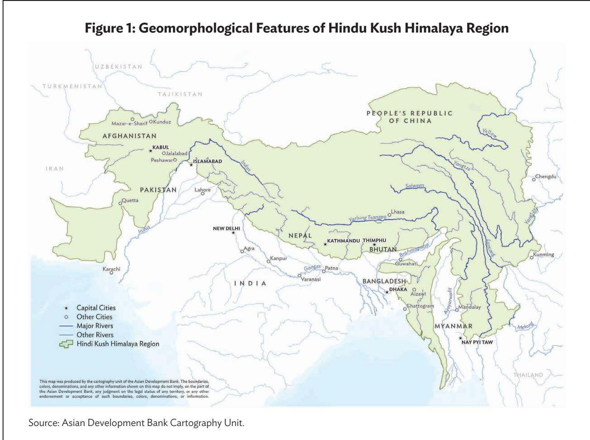

The Global Earthquake Model shows the potential for large earthquakes in the HKH region. $^{12}$ However, certain studies also suggest a potential underestimation of seismic risk due to insufficient data inputs, with about two-thirds of the HKH having a high probability of experiencing one or more major earthquakes. $^{13}$

In the study area, two areas would sustain very large earthquakes if a segment along the Himalayan Main Boundary failed with a magnitude greater than 8.7 over the Central Gap northwest of Kathmandu and over East Bhutan. An earthquake with a magnitude of 7.8 to 8.3, as experienced in 1714, for example, would result in peak ground acceleration values of over 1 gravity (equivalent to g-force), with a probability of 10% in 50 years in many locations throughout the country. $^{14}$

Approximately 650 million people live in the HKH high seismic-risk areas (including a 100-km buffer zone). Of these, an estimated 346 million people live in the study area, which has a higher level of seismic risk than previous models have suggested. $^{15}$ Given the location and density of human settlements and the vulnerability of different building types in the region, the potential for catastrophic human fatalities, physical damage, and economic losses is high and calls for targeted interventions.

## Main Messages

## Strengthen Seismic Probability, Exposure, and Vulnerability Data

A holistic approach is necessary to mitigate the potential impact of earthquakes. This involves explicitly recognizing the region's high seismic risk, investing in technological advancements for better understanding seismotectonic activity, evaluating exposure and vulnerability, and disseminating knowledge.

To accurately predict the impacts of seismic risk in different areas, detailed data and analyses regarding the probability and expected shaking intensity on a particular site or part of a city are necessary. The strength, stiffness, and thickness of local soils and whether they are susceptible to becoming liquid (ground shaking causes saturated soils to lose their strength), and landslide susceptibility are also crucial data points. As scientific measurement and modeling techniques continue to evolve, it is essential that practitioners have access to updated and validated data, such as customized vulnerability models for structures and enhanced exposure mapping (footnote 15) for spatial planning and building performance standards. $^{16}$

## Promote Seismic Risk-Informed Mitigation Policies

If poorly managed, urbanization may exacerbate the risk of damage to assets and loss of life from a seismic event. In part, this is because of denser settlement patterns and, in part, because urban structures tend to be built with concrete, which, if not appropriately reinforced, can cause greater injuries during building collapse as compared to more lightweight traditional building materials predominantly used in rural settlements. $^{17}$ Countries can lessen the impact of future earthquake damage and losses by adopting and implementing risk-informed policies and actions in two key areas:

(i) Location. Avoid settlement in areas with soil and underlying rock conditions that will amplify ground shaking or that will liquefy; also, avoid building on landslide prone soils. This might be achieved through prescriptive means such as preparing risk-informed land-use plans for rapidly growing urban centers and applying development control and enforcement mechanisms to restrict growth into unsuitable areas. A more proactive approach would be to guide and create incentives for well-planned urban expansion and for voluntary relocation by households onto safer lands. This might be achieved by supporting strategic public sector investments in infrastructure such as roads, power, and water supplies; streamlining and reducing the barriers to land administration; lowering the time and costs of property registration and transfers; and building plan approvals.

(ii) Buildings. Design and construct stronger buildings to meet specified seismic performance objectives that describe or prescribe the expected performance level of a building for a specified seismic hazard level. Typically, seismic performance objectives use a tiered approach, for example, to meet “life safety” or “immediate occupancy” performance levels.

## III. URBANIZATION IN BHUTAN, THE INDIA-HIMALAYA REGION, AND NEPAL

## Urbanization Trends

The challenging topography and geology of the Himalaya area pose significant constraints on the availability of suitable land for development, and limit alternative and easy transport routes between settlements. Half of India's Himalaya region urban population is concentrated in the eastern, lower elevation Himalaya states, and conversely, in Bhutan, the $dzongkhags$ (districts) with the smallest populations are in the central-western and eastern high elevation regions. $^{18}$

Since the early 2000s, urban population growth in the HKH countries has surged and continues steadily. Growth is driven by structural changes in their economies that have seen manufacturing and service industries increasingly take the place of agriculture. The urban populations in Bhutan and Nepal have nearly doubled over the last 2 decades. Urban growth rates ran at 2.2% per annum in both countries in the early 2000s, making them the most rapidly urbanizing countries in the region. $^{19}$ By 2021, urban expansion in both countries had decelerated to 1.7%, yet remained above the national average growth rate of 1.0% annually. $^{20}$ As of 2022, approximately 44% of Bhutan's population resided in urban areas, and if current trends persist, over half the population is expected to live in cities by 2040. $^{21}$

Likewise, the Himalaya region of India has undergone significant urban expansion over the past 30 years. Table 1 shows the share of urban population across the Indian Himalayan Region, based on the 2011 national census (the most recent available data) and highlights urban growth rates from 2001 to 2011. While these states are slightly less urbanized than the national average (27% versus 31%), their urban population grew at an annual rate of 3.8% during that decade, outpacing the national average of 2.8%.

Table 1: Urbanization in India and the India-Himalaya Region States, 2011

<table><tr><td>State/India</td><td>Urban Population (‘000s)</td><td>Urban Population as % of Total</td><td>Average Annual Urban Growth Rate (2001–2011)</td></tr><tr><td>India</td><td>377,106</td><td>31.1</td><td>2.8</td></tr><tr><td>Total IHR</td><td>12,078</td><td>27.2</td><td>3.8</td></tr><tr><td>Assam  $Hills^a$ </td><td>175</td><td>14.6</td><td>1.6</td></tr><tr><td>Himachal Pradesh</td><td>689</td><td>10.0</td><td>1.5</td></tr><tr><td>Manipur</td><td>834</td><td>29.2</td><td>3.6</td></tr><tr><td>Meghalaya</td><td>595</td><td>20.1</td><td>2.7</td></tr><tr><td>Mizoram</td><td>572</td><td>52.1</td><td>2.4</td></tr><tr><td>Nagaland</td><td>571</td><td>28.9</td><td>5.2</td></tr><tr><td>Sikkim</td><td>154</td><td>25.2</td><td>9.3</td></tr><tr><td>Tripura</td><td>961</td><td>26.2</td><td>5.7</td></tr><tr><td>Uttarakhand</td><td>3,049</td><td>30.2</td><td>3.5</td></tr><tr><td> $West Bengal Hillsborough^b$ </td><td>728</td><td>39.4</td><td>4.6</td></tr></table>

IHR = India-Himalaya region.  
$^{a}$ The districts of Dima Hasao and Karbi Anglong are part of the IHR.  
$^{b}$ The districts of Darjeeling and Kalimpong are part of the IHR.  
Sources: Government of India, Government of Assam. 2022. Statistical Handbook, Assam 2022; Government of India, Government of West Bengal. 2014. District Statistical Handbook 2014; Government of India; Government of India, Ministry of Home Affairs. 2001. 2001 Census of India; Government of India, Ministry of Home Affairs. 2011. 2011 Census of India; and Government of India, Ministry of Housing and Urban Affairs. 2019. Handbook of Urban Statistics 2019.

## Economic Importance of Urban Areas

The rapid urbanization taking place in the study area aligns with increases in national prosperity. For example, in Bhutan, as the proportion of the urban population grew from 33% in 2007 to 40% in 2017, poverty rates dropped over the same period from 23% to 8% (footnote 20). In 2018, poverty levels were a low 0.7% in urban areas versus 12% in rural areas. $^{22}$ Median household incomes in urban areas are three times higher than in rural areas, and urban literacy rates are around 23% higher than rural literacy rates. While the poverty rate is estimated to have declined further in 2019, the coronavirus disease (COVID-19) pandemic is assessed to have reversed the progress. $^{23}$ The Bhutan Gross National Happiness surveys conducted in 2022 recorded that urban residents were happier than those living in rural communities. $^{24}$

The multidimensional poverty index (MPI) captures nonmonetary aspects of poverty. It is based on three broad indicators (health, education, and standard of living) and is used globally as a more realistic measure of poverty than income alone. $^{25}$ According to the 2020 Global MPI, India was ranked 62nd among 107 countries based on 2015/2016 data. Nepal was ranked 65th and Bhutan 68th. The MPI figures for the India–Himalaya region show a wide range, with some states ahead of the national average and others lagging.

In Nepal, the proportion of the population below the then poverty threshold of 1.90 per day (extreme poverty) fell dramatically from 66.0% in 1995 to 3.4% in 2021. $^{26}$ Over the same period, the share of the urban population almost doubled, increasing from 11% in 1995 to 21% in 2021. Urban areas offer economic and social opportunities for women and girls that are often unavailable in rural environments. In rapidly urbanizing Nepal, this is evidenced by women’s overall participation in the urban labor force, which rose from 82% participation in 2010 (women aged 25 years or older) to 84% in 2019. Women’s participation dropped slightly to 83% in 2022, reflecting the effects of the COVID-19 pandemic. $^{27}$

Urban areas of Nepal account for a low 21% of the total population (2022) but contribute 33% of the national gross domestic product (GDP). $^{28}$ Nepal’s urban growth rate is one of the most rapid in South Asia and, on the current trajectory, the urban share of the population will be nearly 40% by 2050. $^{29}$ The National Urban Development Strategy of 2017 calls for greater coordination between government ministries in urban areas and private sector involvement, proposes an increased level of public investment in the mid- and far-west underdeveloped regions (southern plains and inner plains), and stipulates budgeting at least 2% of GDP for urban infrastructure investments for the period 2015–2030.

The government has several new initiatives, including designating megacities, smart cities, satellite and new towns, and corridor cities. Additionally, the Fifteenth Plan (2019–2024) sets the objective of achieving sustainable economic and social development through urbanization. However, as elsewhere in the study area, financial and institutional resources for implementing the policies and programs have been thinly spread. Overlapping responsibilities between federal, provincial, and local governments have made coordination challenging. Nepal also has a constitutional provision that limits any government-imposed restrictions on the use of private property.

## Role of Mid-Weight and Intermediate Towns

Smaller, mid-weight, and intermediate towns play a central role in driving social and economic opportunity and innovation in the mountainous region. The expansion of road links has facilitated the growth and diversification of rural economies. The dramatic uptake of internet services has further aided government administrative functions and economic activity in physically remote settings.

Intermediate towns have long served as market and administrative centers and provided services to the rural hinterland; many of them are home to traditional occupations such as dairying and handlooms. Border or “gateway towns” located along the national transportation and electricity routes offer trade and distribution services. Mining areas and an increasing number of hydropower projects have spawned their own townships based on primary production and service employment. In the last 2 decades, India's Himalayan state governments have encouraged the development of industries in small towns in the lower reaches of states such as Himachal Pradesh and Uttarakhand through increasing public expenditure on new office buildings, roads, and bridges; local government grants for the incubation of new cities, and regulatory reforms for improved ease of doing business. $^{30}$

The smaller but economically growing mid-weight towns primarily function as local market and distribution centers or for agro-processing and small manufacturing, for example, in Bhutan, Mongar, and Trashigang, with populations of around 10,000 people, and the tea estates in West Bengal Hills with populations ranging from 2,000 to 6,000 people. In more remote parts of the region, the administrative centers (for example, Gasa and Trongsa with populations ranging from around 1,400 to 3,500) provide essential services such as primary health, education, justice services, and important religious functions for the majority, remote, and hard-to-reach rural hinterland populations.

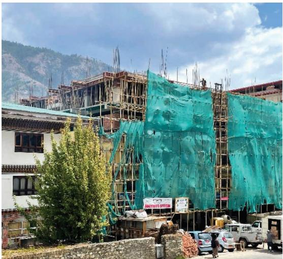  
Housing in Thimphu. High-rise apartments are under construction on limited available land (photo by Deependra Pourel).

## Urban Policies, Spatial Planning, and Risk Information

Policies in the study area have paid insufficient attention to the underlying high seismic risk profile. Seismic disasters accounted for nearly two-thirds of all disaster-related injuries in the HKH region between 1992 and 2022. Advance warning systems for earthquakes, even making use of recent technical innovations in seismic monitoring, are in the order of seconds rather than minutes, hours, or days. Therefore, reducing and, if possible, avoiding seismic risk before a disaster happens warrants further investigation and resources. Measures might include using risk information when deciding the location of new settlements and adopting policies that support urban footprint expansion rather than overly restrictive containment, which has led to the densification of existing settlements.

In Bhutan, the calculated nationwide shortfall of urban housing in 2022 was 11,423 units, of which 39% (4,493 housing units) are in Phuentsholing and Thimphu. In the face of high, unmet demand for housing, rents are increasing annually, and 5.3% of the urban population lives in shared apartments to meet their housing costs. $^{31}$ This increasing densification and the poor quality of portions of the housing stock pose additional risks if the housing is located in an unsafe area, and where the responsibility for paying for the costs of strengthened construction becomes difficult to allocate between landlords and informal tenants.

Two longstanding gaps in the study area's urban policies and spatial plans have been a slowness to (i) recognize the need to undertake planning and strategic public investments to accommodate growth of the urban centers, and (ii) make everyday use of evidence-based risk information when preparing urban policies and city spatial plans. Together, the two shortfalls have resulted in increasing densification of urban centers and elevated seismic risk.

## Bhutan's Urbanization Challenges

Securing low-hazard risk and alienable land in appropriately zoned areas for residential development is a challenge in many urban centers. $^{32}$ Bhutan's Land Act of 2007 recognizes families, individuals, and corporations as “juristic persons” who are entitled to own no more than 25 acres, unless registered as an industrial corporation. The effect is to limit the size of development that a commercial developer of residential properties can undertake and opportunities for economies of scale and lowering costs.

Land pooling is a practice that Bhutan's land statute strictly controls. Any land owned by a private corporation that is not used for its intended purposes within 3 years can be taken back by Bhutan's Ministry of Agriculture and Livestock. While this is intended to prevent speculative practices, it underestimates the lead time needed for planning, design, regulatory approvals, financing, contracting, construction, sales, and transfer involved in any large-scale residential property development, which can typically take 5 or more years to achieve.

Since 2019, land pooling has been used in Bhutan to consolidate small, fragmented parcels of land in urban and peri-urban areas and convert them into larger plots more suitable for residential or commercial development, thereby facilitating more efficient and organized large-scale development initiatives.

Under Bhutan's legislation, landowners are permitted to voluntarily relinquish up to 30% of their land in exchange for a change in use rights. However, legal provisions could be strengthened in several areas. For example, the statute does not compel or provide incentives to landowners to develop their land for low-cost residential uses. $^{33}$

## Case Study: Land Pooling for Developer Finance and Urban Expansion or Densification, Bhutan

Land pooling offers an alternative to compulsory land acquisition via eminent domain. This involves a collaborative process whereby landowners voluntarily contribute a portion of their original plots (based on the size of their holdings) to public authorities or private developers, while remaining on their original properties within newly defined and regularized boundaries. An additional benefit, although not always realized, is that with the change in land use that accompanies land pooling, the property values in the area may increase for the original owners in return for a negotiated and agreed package of infrastructure benefits that are provided by the developer.

Additionally, through careful planning and by providing infrastructure to areas that were previously difficult to develop, land pooling can be used effectively for infill development and densification. This enables more effective use of strategically located land in safer, low-risk zones and preserves amenities while reducing development expenses compared to building on undeveloped land at the city's edge.

ADB has played a role in supporting land pooling in Bhutan by providing financial and technical assistance to the government for land pooling projects. For example, the ADB-supported Bhutan Urban Infrastructure Development Project provided funding for land pooling projects in the towns of Phuentsholing, Thimphu, and Dagana (2006 to 2013). $^{34}$

The project sought to enhance the quality of life for urban residents by delivering affordable housing and infrastructure in land-pooled areas in these towns (roads, drainage systems, water and wastewater services, electricity, and communication ducting). ADB also supported the government with technical assistance to develop land pooling guidelines and procedures and to improve the capabilities of local government agencies to implement land pooling projects effectively.

Implementation of the Thimphu project was initially delayed because some landowners were not willing to contribute a portion of their land. In 2006, land pooling had no legal status in Bhutan. This was remedied by introducing a pilot scheme in the Lungtenphu Local Area Plan where all landowners were able to reach an agreement with the authorities voluntarily. The pilot demonstrated the benefits of pooling land to landowners in other areas and helped build public trust in the pooling process.

Bhutan's National Urbanization Strategy identifies land pooling as a suitable method for urban development, highlighting its equitable and participatory nature, and emphasizing that, unlike conventional redevelopment projects, it avoids displacing existing residents. $^{35}$ Under Bhutan's legislative framework, the government must consult with landowners and obtain their consent before initiating a land pooling project. The government must also provide compensation to landowners at market value. Compensation must be made for any improvements to the affected land. Additionally, the government is required to provide alternative land or housing for any landowners who may be displaced because of the land pooling project. By 2019, land pooling had become recognized as a well-established planning instrument with 25%–29% (260 acres) of land use in Thimphu municipality falling under such schemes. $^{36}$

Overall, the lessons learned from Bhutan are that land pooling can help finance the infrastructure services needed to underpin well-managed urban growth. To be successful, it requires a strong legal basis to ensure that the local or central government has the necessary authority to consolidate land, approve land-use changes and, where necessary, acquire land for development.

One of the main challenges to less successful land pooling initiatives in Nepal and India is the lack of up-to-date legal frameworks, which makes voluntary land relinquishment and acquisition challenging. Additionally, issues related to compensation for land persist and sometimes disputes between landowners and developers are difficult to resolve. Another challenge is the limited transparency and accountability in land pooling, particularly in safeguarding the rights of nonlandowners, i.e., anonymous tenants or unregistered rental markets (footnote 32).

Land pooling as a planning instrument to make safer land available for urban development still has room for exploration. Bhutan's National Land Commission, which is responsible for, among other things, validating and demarcating plot boundaries, including regularization when land pooling is used, does not cross-reference site risk information before registering a new plot or amending plot boundaries. The thematic maps maintained by the agency are restricted to land-use cover and cadastral information. Seismic risk information is held by the Department of Geology and Mines under the Ministry of Energy and Natural Resources. As a result, pooled land is often set aside for commercial or high-income residential uses and for land development to take place in a piecemeal, uncoordinated way with limited prior vulnerability assessments or geotechnical investigations required of developers. $^{37}$

Toward bridging this gap, Bhutan's Department of Disaster Management, under the Ministry of Home Affairs, facilitates training for enhancing the preparedness and response capabilities of local government officials during times of disaster. The department has also initiated humanitarian mapping in OpenStreetMap, which aims to leverage every activity of disaster management phases from preparation to response.

However, as the Bhutan Royal Audit Authority's Report on Performance Audit of Disaster Management points out, to carry out disaster management activities effectively and efficiently, the logical starting point is “to first understand the different types of disasters, the potential threats of these disasters to lives and properties, the vulnerable areas and so on.” $^{38}$ The audit report goes on to identify that “there is no fundamental baseline data on disaster in the country in the form of hazard zonation and vulnerability assessment reports necessary for ex ante (pre-disaster) risk reduction or mitigation.”

## India's Urbanization Challenges

In India, urban development and housing fall under the jurisdiction of state governments as outlined in the Constitution. The 74th Amendment Act of the Constitution has transferred these responsibilities to local urban bodies. The central government plays a pivotal role and exerts considerable influence in shaping national policies and programs. It also channels resources to state governments through centrally sponsored schemes, national financial institutions, and external assistance. $^{39}$

The government's fiscal and economic policies, along with decisions on industrial location, have indirectly shaped the trajectory of urbanization and patterns of real estate investment across the country. Cities in India occupy just 3% of the nation's land but contribute an outsized 65% to the national GDP. $^{40}$ In India, urban areas are recognized as the engines of economic growth for the country's economic development and national prosperity. $^{41}$ The substantial increase in funding for the urban sector from the Tenth Five-Year Plan (2002–2007) onward reflects its importance. The current Urban Missions focus on a sector-oriented approach for achieving national priorities, such as universal access to water under the Atal Mission for Rejuvenation and Urban Transformation national program (2015); Housing for All, under Pradhan Mantri Awas Yojana (Urban); and clean cities, under Swachh Bharat Mission (Urban). Along with the focus of missions on the achievement of targets, other interventions and initiatives have been undertaken to address a range of urban sector challenges.

Yet, as India transitions from a predominantly rural to a quasi-urban society, urban planning has been slower to change from its early emphasis on development control and urban containment policies. Urban planning processes and municipal-level human resources and financial capacities to implement the national policies fail to meet the challenges of rapid urban growth. Half the statutory towns in India and two-thirds of the 7,933 urban settlements (which include the census reclassified villages) do not have approved master plans to regulate existing land uses or to guide future spatial growth in an economically and risk-informed way. $^{42}$ The Strategy for New India @ 75 (2018) sets out 41 areas of national priority, including 10 related to urban planning, but none explicitly raise the need for risk-informed land-use strategies in India's Himalaya region. $^{43}$

The Indian Ministry of Housing and Urban Affairs (MOHUA) has encouraged state governments to formulate their own housing policies that are responsive to the specific circumstances and development concerns of the states. The ministry has also issued a model policy document to support lagging states. $^{44}$ While some states have yet to formulate their policies, others have followed the national housing policies framework and have sought to accommodate centrally sponsored schemes within their policies; although, those outside the mountainous regions have taken a much more proactive approach to policymaking. $^{45}$

Despite the presence of multiple geo-climatic hazards, most state urban and housing policies are not hazard-risk informed. Assam, for example, has a population of 34.6 million people and is 14% urbanized. It has exposure to multiple hazards, including earthquakes, floods, landslides, and strong winds. Its Urban Affordable Housing Policy in 2020 had several ambitious reform actions aimed at earmarking land for affordable housing, granting land titles, setting up a revolving shelter fund, and reviewing and amending regulations. Yet, the policy is silent on risk-sensitive considerations. $^{46}$

## Nepal's Outlook on Urbanization

Nepal stands out as a good practitioner of risk-informed urban spatial policies and guidelines. The National Urban Policy 2007 had the aim of promoting sustainable urban environments and restricting development in environmentally sensitive areas. It explicitly recommended the preparation of local action plans to mitigate vulnerability to earthquakes, landslides, and fire and called for periodic updating and strict enforcement of the building codes.

The National Urban Development Strategy 2017 defines urban resilience as “the capacity of urban areas and systems to tolerate, cope and withstand natural, social, economic and technical shocks.” It recommends elements of resilience. For instance, physical planning tools like building codes and land-use zoning regulations should be informed by hazard maps and underlying geological characteristics. The strategy also calls for the preparation of multihazard maps and risk-sensitive mapping for all areas of the country, mandating that urban development plans incorporate disaster risk management. Importantly, for ex ante mitigation, the strategy states that settlement development and urban infrastructure investments should only be permitted in safe locations, avoiding risk-prone or environmentally sensitive lands.

The Kathmandu Valley Development Authority, responsible for large infrastructure development in the valley, prepared the first Risk Sensitive Land Use Plan for the entire Kathmandu Valley in 2016 and associated bylaws to enforce its provisions. The Vision 2035 and Beyond: 20 Years' Strategic Development Master Plan (2015–2035) for Kathmandu Valley highlights that the suitable natural living conditions of the valley are not separate from the high vulnerability of the area to earthquakes. $^{47}$ It also highlights how valley soil, characterized by soft sedimentary layers, amplifies seismic vulnerability, as evidenced by the 25 April 2015 magnitude 7.8 Gorkha earthquake and aftershocks that resulted in extensive loss of human life and damage to infrastructure and cultural heritage sites. The master plan strategies are based on four principles of growth allocation; (i) equitable distribution of growth, (ii) urban expansion based on infrastructure capacity, (iii) development within a designated area, and (iv) identification of risk-sensitive areas. Land pooling is also among the recommended measures to manage urban growth.

However, full implementation of the strategy is lacking. For example, preparing multihazard maps and risk-sensitive land-use mapping for areas other than the Kathmandu Valley is progressing slowly. Within the valley, new roads are being constructed along routes that ultimately encourage settlement in new areas of relatively high risk. Coordination between responsible authorities is an ongoing challenge, and no national seismic standard for strategic infrastructure, such as bridges or water supply, is available. $^{48}$

## Main Messages

## Recognition of Lagging but Strong Urbanization

Although initially lagging due to the physical constraints of mountainous areas, urban population growth in the HKH region has increased markedly and has continued apace over the past 40 years. Notwithstanding the limitations of suitable land and transport routes, and the fragility of fresh water sources in the high mountain areas, Bhutan and Nepal are among the most rapidly urbanizing countries in South Asia because of rural–urban in-migration and the high natural growth rates among their youthful urban populations.

Census data show that the urban population in the study area has doubled in the past 2 decades. In India, the increase in urban populations between the 2001 and 2011 censuses reflects not only high growth rates in cities and towns but also reclassification of many villages as lower-order towns. Additionally, official data underrepresent the actual size of urban populations due to outdated classification systems for urban areas and because the functional boundaries of many cities extend far beyond their administrative boundaries.

The agglomeration index uses satellite imagery overlaid on census data and takes into account the economic pull and travel times between urban centers. The index has identified that the true urban populations in India's Himalaya region and Nepal are almost double the official census. The doubling of urban populations in the past 2 decades is stretching the capabilities and resources of national and urban local governments to deliver an adequate supply of safe, well-located land, infrastructure, and housing to fulfill the needs of the surging urban populations.

The underaccounting of the geographic extent of urban settlements and the size of the populations living within them is an important concern with regard to hazard mitigation. Declared or officially recognized urban local governments typically enjoy higher levels of expenditure responsibilities and revenue collection mandates than rural district governments. They potentially have the legal authority and accompanying resources to provide expanded coverage and operations and infrastructure maintenance to ensure the amenity and safety of denser populations, including drainage, flood defense structures, and similar others. They also typically have stronger institutional systems and more staff to prepare and implement city planning and building codes for reducing risk through enforcement and for guiding new settlements into safer areas of the city.

## Risk-Informed Spatial Planning for Urban Expansion

The unplanned and unguided increasing densification of people and assets into marginal and steep hillsides susceptible to landslides or on soils prone to liquefaction is of particular concern in the mountain region. The governments and their external development partners could avoid or reduce future disasters through initiatives in several areas, for example:

(i) make verifiable, seismic risk data available—seismic micro-zonation maps, liquefaction information by zone, landslide, and fire risk—in formats accessible for public and private sector end users; $^{49}$

(ii) encourage the classification and economic growth of intermediate towns with public administration functions away from extremely high-risk areas, such as the region's southern fault line through targeted infrastructure investments; and

(iii) streamline land administration procedures and costs to make urban land in areas where soils are not prone to liquefaction more easily accessible by households and developers.

# IV. HOUSING AFFORDABILITY AND SEISMIC RISK IN BHUTAN, THE INDIA-HIMALAYA REGION, AND NEPAL

## Overview

## The Housing Value Chain

The efficient supply of housing, at scale and at prices affordable by residents in any city, is the result of the interaction and coordination between public and private sector activities in a complex housing value chain. Restrictions or bottlenecks in any of the many activities along the value chain slows provision and will inevitably increase prices. Figure 2 illustrates the housing value chain.

## Figure 2: The Housing Value Chain

## SUPPLY

\- Safe, well-located land and registered tenure - Risk-informed planning and building regulations

• Efficient and green construction and building materials

## DEMAND

•Urban population growth

■Developer finance

■End-user finance

■Incomes, subsidies

• Consumer financial literacy

and risk understanding

Source: P. Monkkonen et al. 2020. Urban Land and Housing Market Assessment: A Toolkit. World Bank.

On the supply side of the housing value chain, developers from governments, support partners, profit and nonprofit companies to self-builders, all work to produce housing that meets the needs of households in terms of plot size, building design, and size of floor space, location, and price. Public agencies should facilitate timely access to suitable, well-located land with basic infrastructure (such as water supply, electricity, and roads) for development, after which developers and self-builders decide whether or not to undertake construction in that location.

If a steady pipeline of land is not available, or approval of sites takes a long time and is costly, the entire value chain becomes choked, and housing supply dries up and cannot keep up with population growth. This, in turn, leads to the formation of informal settlements, typically on marginal and unsafe land or to overcrowding of the existing housing stock, resulting in exacerbated loss to human life if a disaster were to occur.

There are several factors necessary to underwrite supply-side activities:

(i) Public and political acceptance of the positive role that well-managed cities play with policies and a legal framework that enable land use so the urban footprint can expand or densify as appropriate in a managed way to accommodate urban growth and adequate provisioning for residential land uses, which typically account for between 40% and 70% of all land uses in cities;

(ii) Availability and ease of using accurate risk data to translate these policies into practice through risk-informed, forward spatial (city) planning and infrastructure investments in well-located and low-hazard risk areas; and

(iii) Resources and incentives that bring about change in the knowledge, attitudes, and practices of house designers, builders, and financiers for the design and construction of seismically strengthened but affordable houses.

The demand side of the housing value chain encompasses activities that enable a household to become a home occupant, whether as an owner or renter. The main considerations in this transition include the availability of developer finance, end-user (household) financing, consumer financial literacy, and risk understanding.

## Lessons From Practice

External support, including from ADB, has supplemented local resources toward achieving affordable and resilient housing and urban development in India's Himalaya states. In addition, many good practices can be drawn from the broader study area. The section below explores housing affordability and seismic risk in depth and provides cases highlighting lessons from exemplary practices.

## Housing Institutions and Policies

Urban housing is largely an individual enterprise across socioeconomic classes, constituting over 92% of housing in Bhutan, 62% in India (across all states), and 85% in Nepal. Public housing authorities and private real estate developers play a central role in expanding the available housing supply in the market. However, institutional supply falls far short of demand. In larger cities, most housing is self-built. In India, this is often single-dwelling units. In Bhutan, it includes owner-built units with additional rental rooms, typically in attics and basements, which are often of poor physical standard.

## Housing in Bhutan

Public sector institutions collectively drive Bhutan's housing sector by overseeing policy implementation, housing development, regulatory compliance, land allocation, and finances for public housing. Bhutan's National Housing Policy of 2020 identifies the main agencies with responsibilities in the housing sector as the Ministry of Finance, Royal Monetary Authority, Ministry of Infrastructure and Transport, local governments, the National Land Commission, and the National Housing Development Corporation Limited (NHDCL). External development partners, including ADB and the World Bank Group, have provided financing and technical assistance to the sector.

The Ministry of Finance is responsible for promoting homeownership and allocating the budget for public housing.

The Ministry of Infrastructure and Transport, through its Department of Human Settlement, is responsible for oversight of the housing sector and implementing the National Housing Policy. It explores cost-effective local construction materials and promotes modular housing, proposes housing-related legislation and standards, fosters research and innovation in housing quality and disaster resilience, assesses social housing needs and facilitates housing development programs, and maintains a database of residential and commercial units as the legally constituted tenancy authority.

The NHDCL is mandated to promote safe, efficient, and affordable housing. Established on 1 June 2011, the NHDCL emerged from the transformation of the Department of Urban Development and Housing under the former Ministry of Works and Housing. It manages government residential accommodation, constructs and manages residential units, and strives to create a transparent housing market. The NHDCL provides subsidized rental housing, primarily for civil servants, although more recently, it aims to provide affordable (income-based) housing for non-civil servants and lower-income households. It partners with local governments and various agencies to support the creation of affordable public housing across urban centers.

The National Land Commission plays a crucial role in land allocation. It provides leasehold land for public housing, employee accommodation, and affordable housing by real estate developers. The National Land Commission advises on leases, acquisition, and management, including affordable housing initiatives.

Bhutan's 12th Five-Year Plan 2018–2023 explicitly set “Sustainable Human Settlements” as one of the National Key Result Areas with the aim of “improving livability, safety and sustainability of human settlements through access to adequate, affordable housing, efficient and effective municipal services, and clean and green public spaces for social engagement.” Among the strategies to achieve the National Key Result Areas were promoting green and efficient buildings, affordable housing, and home ownership schemes. Home ownership was an explicit government priority and was seen as “the springboard for wellbeing, security and economic opportunities. Bhutan’s 13th Five-Year Plan builds upon the 12th plan, emphasizing economic transformation, sustainable development and social well-being. The 13th plan includes specific key performance indicators to monitor progress toward the country’s stated goals, ensuring accountability and effective implementation of strategies, while maintaining its unique cultural and environmental heritage.” $^{50}$

The National Housing Policy contains measures to improve residents' access to quality affordable housing to keep pace with urban growth, particularly in the four largest thromdes (cities). The policy recommends creation of a housing inventory database (currently under construction) and initiation of monitoring of housing shortages to inform and facilitate housing development programs. The ministry is also in charge of the National Human Settlement Policy 2019, which provides a framework for different types of human settlements, both villages and thromdes, based on population size and density, service provision, and revenue generation potential. It prioritizes land allocation for public housing in all development projects and urban development schemes and mandates that mega projects must integrate housing with the local settlement plan. The policy calls for appropriate technology to reduce disaster vulnerability, explicitly promotes green design and energy-efficient infrastructure, and the development of building codes and guidelines for disaster-resilient designs. These measures are grounded in geotechnical assessments of settlement sites, preparation of geohazard maps, and identification of zones where construction should be prohibited.

Although Bhutan has a policy framework for affordable housing integrated with disaster risk management, implementation is still at a nascent stage and constrained by limited resources.

## Housing in the India–Himalaya Region

While the Government of India's constitutional and legal jurisdiction is confined to Delhi and other union territories, it nonetheless plays a vital role and wields considerable influence in shaping policies and programs nationwide. The Ministry of Housing and Urban Affairs (MOHUA) serves as the central authority for affordable housing, and the National Housing Bank, a subsidiary of the Reserve Bank of India operating under the Ministry of Finance, acts as the principal financial institution supporting housing initiatives.

The Building Materials Technology Promotion Council, operating under the MOHUA, advocates for the adoption of cost-effective, eco-friendly, energy-efficient, and innovative building materials, designs, and construction technologies, and emphasizes disaster-resilient practices suitable for onsite implementation. It also works closely with the National Disaster Management Authority, the National Institute of Disaster Management, and other institutions toward preparing Indian cities for disasters, risk reduction, and reducing housing vulnerabilities. At the state level, the Housing and Urban Development Department oversees policy formulation and monitoring.

Disaster management is under the Government of India's Ministry of Home Affairs and is administered by the Disaster Management Authority at national, state, and district levels. They prepare disaster management plans at their appropriate levels. Disaster management is the main focus with recent actions on prevention and mitigation. Retrofitting lifeline buildings such as hospitals and schools against seismic risks, masons' training, and public awareness campaigns are some recently initiated activities by the district and state authorities.

The growing importance of the urban sector for economic development and the poor state of cities is central under the National Urban Housing and Habitat Policy 2007, which is still in force (Box 1). $^{51}$ The policy is exhaustive in content and places affordable housing in the wider perspective of the economy, urban and regional development, and equity in access to services. The policy, along with the Jawaharlal Nehru Urban Renewal Mission launched in 2005, shifted national policy focus from rural and agrarian concerns to urban development. These were instrumental in emphasizing urban issues at the national level.

# Box 1: Salient Features of India's National Urban Housing and Habitat Policy 2007

The National Urban Housing and Habitat Policy of 2007 prioritizes affordable housing and basic services. It pays special attention to the urban poor and marginalized groups, including scheduled tribes, scheduled castes, women, and minorities. This aligns with the objectives of Jawaharlal Nehru National Urban Renewal Mission, which emphasizes increased land supply, environmental sustainability, and balanced ecological development. The policy proposes detailed city maps using geographic information systems, aerial surveys, and ground verifications that include impoverished settlements. The policy primarily supports shelter provision for the urban poor at their existing location or nearby workplaces and promotes in situ slum rehabilitation while considering relocation only in specific cases.

It also advises states to formulate 10-year housing plans for economically weaker sections and lower-income groups, and action plans for slum dwellers and cooperative, labor, and employee housing. Encouraging microfinance institutions at the state level should expedite financial support for the urban poor. The policy also promotes environmentally friendly technology and private sector involvement in affordable housing, incorporating spatial planning incentives such as additional floor area ratios and transferable development rights to facilitate private investment in affordable housing. The policy advocates reserving 10% to 15% of land or 20% to 25% floor area ratio (whichever is greater) in new public and private housing developments for economically weaker sections and lower-income groups. These same incentives could potentially encourage development in lower-risk areas of a city.

Jawaharlal Nehru National Urban Renewal Mission also endorses symbiotic rural-urban development, regional planning, and mass transit systems. Preparation of Habitat Infrastructure Action Plans for cities with populations over 100,000, model municipal laws, and a comprehensive action plan for implementation, monitoring, review, and revision complement the policy.

Source: Asian Development Bank.

The housing policies of states within the India–Himalaya region exhibit a common approach to affordable housing, largely modeled after the 2015 Model State Affordable Housing Policy for Urban Areas issued by the MOHUA. These policies aligned with the Government of India’s Housing for All Mission, encouraging public–private partnerships and addressing barriers to affordable housing supply. Actions include land allocation, granting land titles, establishing shelter funds, and reforming regulations.

However, variations exist based on individual state priorities. For instance, Assam's Housing Policy 2020 guides the use of funds for constructing shelters and homes for vulnerable populations (night shelters, nursing homes, orphanages, and transit housing for migrant workers), while Himachal Pradesh's Affordable Housing Policy 2019 outlines detailed beneficiary selection criteria. The Sikkim Urban Affordable Housing and Habitat Policy 2015 highlights community involvement and diverse housing development types, considering local needs: multifamily housing, mixed land use, and mixed-income housing. Slum improvement and upgrading, and housing for people with special needs are mentioned in the policy.

An important gap in these policies is the lack of attention to risk-informed housing despite the seismic risks present (Seismic Zones IV and V) and the specific needs of self-built housing prevalent in hill towns. While the Housing for All Mission focuses on beneficiary-led house construction, addressing seismic safety and retrofitting in line with regulations, policies generally overlook hazard and vulnerability considerations.

# Box 2: Self-Built Housing Under the Pradhan Mantri Awas Yojana Urban Mission: Dharamshala, Himachal Pradesh

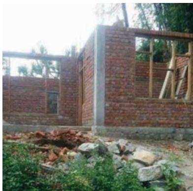  
Self-built house under construction in Dharamshala, Himachal Pradesh. November 2022 Self-built housing is a way to manage construction to save on labor costs and customize homes (photo by Banashree Bannerjee).

Dharamshala, Kangra District, Himachal Pradesh is in Seismic Zone V. Gamru, in Ward 5, is considered a highly risk-prone and vulnerable location. The site is frequently exposed to landslides and, therefore, a retaining wall is necessary before house construction. The technical team ensures that the house built is earthquake-resistant as per the National Building Code. Before the release of installments, the technical team ensures that the beneficiaries have followed all the norms while constructing their houses. The subsidy available from central and state governments is approximately \$2,000, which is beyond the affordability of the poor, even though the land belongs to them. The subsidy is intended to cover the higher cost of materials and techniques for construction.

Source: Asian Development Bank.

In practice, even though the policies do not address hazard, risk, and vulnerability, all projects follow seismic safety regulations stipulated in planning and building regulations and the Indian Standard Code, and state departments guide builders on safety measures, new buildings, and retrofitting the existing stock. $^{52}$ Overall, these policies aim to advance affordable housing but lack comprehensive strategies for risk mitigation. With a few exceptions (Box 2), they fail to adequately address the complexities of self-built housing in earthquake-prone regions.

The Vulnerability Atlas of India, developed by the Building Materials and Technology Promotion Council, serves as a tool for disaster prevention, preparedness, and mitigation for housing and associated infrastructure. The current and third edition (2019) of the atlas provides hazard maps for multiple disasters at national and state levels and tables of damage risk in districts.

The earthquake hazard maps are derived for Seismic Zones II, III, IV, and V as outlined in IS 1893:2002 and include Damage Risk Tables for the zones. These tables are informed by the distribution of housing types, categorized by predominant construction materials, as recorded in the 2011 Census housing data. The Damages for Kangra District shown in Table 2 illustrates the data provided.

The atlas provides essential information for preliminary risk analysis and hazard assessment for project formulation, approval, and implementation of urban housing, building, and infrastructure schemes. Despite a disclaimer stating that the maps are for thematic presentation only, several ministries and government departments have stipulated that private sector bidders refer to the atlas for multihazard risk assessment. $^{53}$

Table 2: Earthquake Damages for Kangra District, Himachal Pradesh
Distribution of Houses by Predominant Materials of Roof and Wall and Level of Damage Risk

<table><tr><td colspan="4">Table No.: HP 02</td><td colspan="7">State: HIMACHAL PRADESH</td><td>KANGRA</td></tr><tr><td colspan="2" rowspan="4">Wall/Roof</td><td colspan="2">Census Houses</td><td colspan="8">Level of Risk Under</td></tr><tr><td rowspan="3">No. of House</td><td rowspan="3">%</td><td colspan="3">EQ Zone</td><td colspan="4">Wind Velocity m/s</td><td>Flood Prone Area in %</td></tr><tr><td>V</td><td>IV</td><td>III</td><td>II</td><td>55 &amp; 50</td><td>47</td><td>44 &amp; 39</td><td>33</td></tr><tr><td colspan="4">Area in %</td><td colspan="4">Area in %</td></tr><tr><td colspan="4"></td><td>96.9</td><td>3.1</td><td></td><td></td><td></td><td>100</td><td></td><td></td></tr><tr><td colspan="12">WALL</td></tr><tr><td rowspan="3">A1 - Mud and Unburnt Brick Wall</td><td>Rural</td><td>238,911</td><td>42.9</td><td></td><td></td><td></td><td></td><td></td><td></td><td></td><td></td></tr><tr><td>Urban</td><td>3,484</td><td>0.6</td><td></td><td></td><td></td><td></td><td></td><td></td><td></td><td></td></tr><tr><td>Total</td><td>242,395</td><td>43.5</td><td>VH</td><td>H</td><td></td><td></td><td></td><td>M</td><td></td><td></td></tr><tr><td rowspan="3">A2 - Stone Wall not packed with mortar</td><td>Rural</td><td>8,829</td><td>1.6</td><td></td><td></td><td></td><td></td><td></td><td></td><td></td><td></td></tr><tr><td>Urban</td><td>735</td><td>0.1</td><td></td><td></td><td></td><td></td><td></td><td></td><td></td><td></td></tr><tr><td>Total</td><td>9,564</td><td>1.7</td><td>VH</td><td>H</td><td></td><td></td><td></td><td>L</td><td></td><td></td></tr><tr><td colspan="2">Total - Category - A</td><td>251,959</td><td>45.2</td><td></td><td></td><td></td><td></td><td></td><td></td><td></td><td></td></tr><tr><td rowspan="3">B- Burnt Bricks Wall and Stone wall packed with mortar</td><td>Rural</td><td>266,729</td><td>47.9</td><td></td><td></td><td></td><td></td><td></td><td></td><td></td><td></td></tr><tr><td>Urban</td><td>27,421</td><td>4.9</td><td></td><td></td><td></td><td></td><td></td><td></td><td></td><td></td></tr><tr><td>Total</td><td>294,150</td><td>52.8</td><td>H</td><td>M</td><td></td><td></td><td></td><td>L</td><td></td><td></td></tr><tr><td colspan="2">Total - Category - B</td><td>294,150</td><td>52.8</td><td></td><td></td><td></td><td></td><td></td><td></td><td></td><td></td></tr><tr><td rowspan="3">C1 - Concrete Wall</td><td>Rural</td><td>1,578</td><td>0.3</td><td></td><td></td><td></td><td></td><td></td><td></td><td></td><td></td></tr><tr><td>Urban</td><td>273</td><td>-</td><td></td><td></td><td></td><td></td><td></td><td></td><td></td><td></td></tr><tr><td>Total</td><td>1,851</td><td>0.3</td><td>M</td><td>L</td><td></td><td></td><td></td><td>VL</td><td></td><td></td></tr><tr><td rowspan="3">C2 - Wood Wall</td><td>Rural</td><td>1,551</td><td>0.3</td><td></td><td></td><td></td><td></td><td></td><td></td><td></td><td></td></tr><tr><td>Urban</td><td>227</td><td>-</td><td></td><td></td><td></td><td></td><td></td><td></td><td></td><td></td></tr><tr><td>Total</td><td>1,778</td><td>0.3</td><td>M</td><td>L</td><td></td><td></td><td></td><td>M</td><td></td><td></td></tr><tr><td colspan="2">Total - Category - C</td><td>3,629</td><td>0.7</td><td></td><td></td><td></td><td></td><td></td><td></td><td></td><td></td></tr><tr><td rowspan="3">X - Other Materials</td><td>Rural</td><td>6,209</td><td>1.1</td><td></td><td></td><td></td><td></td><td></td><td></td><td></td><td></td></tr><tr><td>Urban</td><td>912</td><td>0.2</td><td></td><td></td><td></td><td></td><td></td><td></td><td></td><td></td></tr><tr><td>Total</td><td>7,121</td><td>1.3</td><td>M</td><td>VL</td><td></td><td></td><td></td><td>M</td><td></td><td></td></tr><tr><td colspan="2">Total - Category - X</td><td>7,121</td><td>1.3</td><td></td><td></td><td></td><td></td><td></td><td></td><td></td><td></td></tr><tr><td colspan="2">TOTAL  $HOUSES^a$ </td><td>556,859</td><td></td><td></td><td></td><td></td><td></td><td></td><td></td><td></td><td></td></tr><tr><td colspan="2" rowspan="4">Wall/Roof</td><td colspan="2">Census Houses</td><td colspan="8">Level of Risk Under</td></tr><tr><td rowspan="3">No. of House</td><td rowspan="3">%</td><td colspan="3">EQ Zone</td><td colspan="4">Wind Velocity m/s</td><td>Flood Prone Area in %</td></tr><tr><td>V</td><td>IV</td><td>III</td><td>II</td><td>55 &amp; 50</td><td>47</td><td>44 &amp; 39</td><td>33</td></tr><tr><td colspan="4">Area in %</td><td colspan="4">Area in %</td></tr><tr><td colspan="12">ROOF</td></tr><tr><td rowspan="3">R1 - Light Weight Sloping Roof</td><td>Rural</td><td>31,558</td><td>5.7</td><td></td><td></td><td></td><td></td><td></td><td></td><td></td><td></td></tr><tr><td>Urban</td><td>6,243</td><td>1.1</td><td></td><td></td><td></td><td></td><td></td><td></td><td></td><td></td></tr><tr><td>Total</td><td>37,801</td><td>6.8</td><td>M</td><td>M</td><td></td><td></td><td></td><td>H</td><td></td><td></td></tr><tr><td rowspan="3">R2 - Heavy Weight Sloping Roof</td><td>Rural</td><td>283,848</td><td>51.0</td><td></td><td></td><td></td><td></td><td></td><td></td><td></td><td></td></tr><tr><td>Urban</td><td>5,063</td><td>0.9</td><td></td><td></td><td></td><td></td><td></td><td></td><td></td><td></td></tr><tr><td>Total</td><td>288,911</td><td>51.9</td><td>H</td><td>M</td><td></td><td></td><td></td><td>L</td><td></td><td></td></tr><tr><td rowspan="3">R3 - Flat Roof</td><td>Rural</td><td>208,401</td><td>37.4</td><td></td><td></td><td></td><td></td><td></td><td></td><td></td><td></td></tr><tr><td>Urban</td><td>21,746</td><td>3.9</td><td></td><td></td><td></td><td></td><td></td><td></td><td></td><td></td></tr><tr><td>Total</td><td>230,147</td><td>41.3</td><td></td><td></td><td colspan="6">Damage Risk as per that for the Wall supporting it</td></tr><tr><td colspan="2">TOTAL HOUSESa</td><td colspan="10">556,859</td></tr><tr><td colspan="12">Probable Maximum Precipitation at a Station of the district in 24 hours is 68 mm</td></tr><tr><td colspan="4">Housing Category: Wall Types</td><td colspan="8">Housing Category: Roof Type</td></tr><tr><td colspan="4">Category - A: Buildings in fieldstone, rural structures, unburnt brick houses, clay houses</td><td colspan="8">Category - R1 - Light Weight (grass, thatch, bamboo, wood, mud, plastic, polythene, GI metal, asbestos sheets, other materials)</td></tr><tr><td colspan="4">Category - B: Ordinary brick building; buildings if the large block and prefabricated type, half-timbered structures, building in natural hewn stone</td><td colspan="8">Category - R2 - Heavy Weight (tiles, stone/slate)Category - R3 - Flat Roof (brick, concrete)EQ Zone V: Very High Damage Risk Zone (MSK &gt; IX)</td></tr><tr><td colspan="4">Category - C: Reinforced building, well built wooden structures</td><td colspan="8">EQ Zone IV: High Damage Risk Zone (MSK VIII)EQ Zone III: Moderate Damage Risk Zone (MSK VII)</td></tr><tr><td colspan="4">Category - X: Other materials not covered in A, B, C. These are generally light.</td><td colspan="8">EQ Zone II: Low Damage Risk Zone (MSK &lt; VI)Level of Risk: VH = Very High; H = High; M = Moderate; L = Low; VL = Very Low</td></tr></table>

m/s = meter per second, mm = millimeter.

## Notes:

1) Flood-prone area includes protected area that may have more severe damage under failure of protection works. In some other areas, the local damage may be severe under heavy rains and chocked drainage.

2) Damage risk for wall types is indicated assuming heavy flat roof in categories A, B and C (reinforced concrete) building

3) Source of housing data: Government of India. 2011. Census of Housing.

$^{a}$ Total No. of Houses excludes vacant and/or locked houses

Source: Government of India, Ministry of Housing and Urban Affairs. 2019. Vulnerability Atlas of India 3rd Edition.

## Housing in Nepal

The Ministry of Urban Development is responsible for strategically planning and improving the quality of life for both urban and rural populations through infrastructure and housing development. The ministry collaborates with stakeholders to facilitate infrastructure growth. It oversees several departments, including the Department of Urban Development and Building Construction, the Kathmandu Valley Development Authority, Rastriya Awaas Company, Town Development Fund, and others.

The Department of Urban Development and Building Construction implements urban and infrastructure development policies and programs. Its activities encompass building code formulation, building bylaws, building permits, enforcement, and urban and rural development in coordination with local governments. The department also manages initiatives such as the Civil Housing Program and the Safe Housing for Citizens Program. It provides oversight of the National Housing Company Limited and the National Reconstruction Authority.

Established in 1989 by the Government of Nepal, the Town Development Fund aims to be a self-sustaining financial intermediary within the intergovernmental fiscal transfer system. Its primary vision is to be a leading institution for promoting sustainable urban infrastructure finance. The institution's role involves raising additional financial resources from external development support partners and the Government of Nepal to support crucial urban infrastructure projects. The Town Development Fund serves as an autonomous intermediary, providing debt financing exclusively to local governments for priority urban infrastructure improvements.

The Nepal Housing Development Finance Company, founded in 1992, operates under the Finance Company Act of 1985. Its objective is to enhance the housing delivery system through new housing projects and short- to long-term housing loans. The Nepal Housing Development Finance Company finances housing plot purchases, the construction of ready-made houses, and house improvements. It also mobilizes housing finance.

Janata Awaas Kayakram (Nepal People's Home Program) is a housing initiative aiming to provide marginalized and low-income families with safe and affordable housing solutions. The program involves constructing new homes, rehabilitating existing ones, and offering subsidies and loans to families. Additionally, it focuses on enhancing living conditions and supporting local community development through infrastructure and social services. The government-funded program is executed with partners such as nongovernment organizations, private companies, and community-based organizations.

Box 3 provides an overview of Nepal's legal framework for housing that guides land use and building construction standards in the country. Overall, the legal framework protects the rights of all citizens to housing, as guaranteed by the Constitution of Nepal 2015, yet it does not require public or private land.

## Box 3: Overview of Acts and Policies in Nepal

Lands Act 1964 aims to amend and consolidate land-related laws. It abolished the Jimidari system for land taxes and set limits on land ownership and cultivation. The act categorized holdings based on regions—hilly, terai (a lowland region of grasslands, savannas, and forests in southern Nepal and northern India).

Kathmandu Valley Development Authority Act 1988 guides Kathmandu Valley's urban growth while protecting heritage, environment, and resources.

National Building Code 1994 sets technical standards for various types of construction.

Ownership of Joint Housing Act 1997 promotes group housing and apartment ownership to address urban land price inflation and housing shortages.

The Building Act 1998 regulates building construction, including classification of buildings, responsibilities, and enforcement.

Town Development Act 1998 guides town development by establishing Town Development Committees through local bodies, focusing on necessary services and facilities.

Local Self Governance Act 1999 empowers local government systems at ward, village, and district levels for local development.

National Urban Policy 2007 aims for balanced urban development, a clean urban environment, infrastructure investment, and local body empowerment.

National Shelter Policy 2012 addresses post-2007 sociopolitical transformation, slums, housing for landless, rental housing, and more.

National Land Use Policy 2015 aims for sustainable land use, categorizing land zones, and providing a framework for land-use plans.

Disaster Risk Reduction and Management Act 2017 coordinates disaster risk reduction and management efforts to protect lives, properties, and physical infrastructure.

Local Government Operations Act 2017 defines roles and powers of federal, provincial, and local governments, emphasizing cooperation and efficient service delivery.

National Urban Development Strategy 2017 focuses on medium- and long-term urban development strategies, urban infrastructure, planning, and governance standards.

The Right to Housing Act 2018 provides a legislative framework for implementing the housing right guaranteed by the Constitution of Nepal 2015. The statute provides federal, provincial, and local governments the right to coordinate, prioritize and provide housing to citizens and their families lacking income and the ability to manage it. It also allows local governments to undertake integrated settlement development or to relocate settlements if necessary.

Land Use Act 2019 classifies land into categories and mandates municipal land-use bodies, land-use maps, plans, and zoning.

National Land Policy 2019 addresses land challenges in rural and urban areas, aiming to improve land access, tenure, efficiency, transparency, and governance.

Source: Compiled by authors.

## Housing Conditions of the Urban Poor and Policy Responses

Urban centers in the Hindu Kush Himalaya (HKH) region provide a pathway out of poverty, offering specialized and expanded employment prospects and rising wages, and opportunities for learning, ideas, and innovation. Settlement densities allow for infrastructure and services for more people at lower unit costs than in rural settlements, further contributing to improvements in living standards.

Extreme poverty has steadily declined in the region over the past 20 years, yet it continues to present a persistent challenge. In the mountainous regions of the HKH, the poverty rate is on average 5% higher than the rate for the countries as a whole. The determinants of poverty also differ considerably. In particular, parameters such as lower access to basic amenities, poor physical access, and higher dependency rates are more prominent in the mountains. $^{54}$

External shocks have the effect of derailing past development gains. For example, estimations suggest that the 2015 earthquakes in Nepal resulted in 10% to 14% increases in the poverty rate in the most affected districts. $^{55}$

The informal employment sector's share of GDP is 23% in Bhutan, 33% in Nepal, and 52% in India (all states). $^{56}$ It accounts for 81% of the economically active population in India (80% of economically active women) $^{57}$ and 77% in Nepal (82% of the economically active women's workforce). $^{58}$ This high level of informality locks many of the urban poor, and a disproportionate number of women in some countries and states and sectors, into low-skilled, low-wage work, without employment contracts and with little or no protection against unfair dismissal. Own-account work comprises some 90% of all informal employment in the countries in this study, placing a high dependence on a person's house as a place of shelter against the elements but a place of work or for storage or other forms of livelihood support (Table 3).

In addition to low incomes, urban poverty is also measured by the quality of living conditions. According to the definition of the United Nations Human Settlements Programme (UN-Habitat), a slum household faces one or more of five living condition deprivations. In 2018, about 415 million people lived in substandard, slum-like conditions. $^{59}$

Table 3: Share of Urban Population Living in Slum Conditions in the Hindu Kush Himalaya Region

<table><tr><td>Country</td><td>Urban Population (2018) (IHR, 2011)</td><td>No. People in Slums (2018) (IHR, 2011)</td><td>% Urban Population in Slums (2000)</td><td>% Urban Population in Slums (2018)</td></tr><tr><td>Hindu Kush Himalaya Region</td><td></td><td></td><td></td><td></td></tr><tr><td>Afghanistan</td><td>9,476,982</td><td>6,728,657</td><td>n/a</td><td>71.0</td></tr><tr><td>Bangladesh</td><td>59,115,518</td><td>27,784,293</td><td>78.0</td><td>47.0</td></tr><tr><td>Bhutan</td><td>308,510</td><td>n/a</td><td>n/a</td><td>n/a</td></tr><tr><td>People's Republic of China</td><td>829,760,595</td><td>207,440,149</td><td>37.0</td><td>25.0</td></tr><tr><td>Nepal</td><td>5,546,094</td><td>2,717,586</td><td>64.0</td><td>49.0</td></tr><tr><td>Myanmar</td><td>16,423,467</td><td>9,197,142</td><td>46.0</td><td>56.0</td></tr><tr><td>India (total)</td><td>460,304,169</td><td>161,106,459</td><td>42.0</td><td>35.0</td></tr><tr><td colspan="5">India—Himalaya Region</td></tr><tr><td>Assam</td><td>4,398,542</td><td>197,266</td><td>n/a</td><td>5.0%</td></tr><tr><td>Himachal Pradesh</td><td>688,552</td><td>61,312</td><td>n/a</td><td>9.0%</td></tr><tr><td>Manipur</td><td>50,332</td><td>n/a</td><td>n/a</td><td>n/a</td></tr><tr><td>Meghalaya</td><td>595,450</td><td>57,418</td><td>n/a</td><td>9.6%</td></tr><tr><td>Mizoram</td><td>571,771</td><td>78,561</td><td>n/a</td><td>14.0%</td></tr><tr><td>Nagaland</td><td>570,966</td><td>82,324</td><td>n/a</td><td>14.0%</td></tr><tr><td>Sikkim</td><td>153,578</td><td>31,378</td><td>n/a</td><td>20.0%</td></tr><tr><td>Tripura</td><td>961,453</td><td>139,780</td><td>n/a</td><td>15.0%</td></tr><tr><td>Uttarakhand</td><td>3,049,338</td><td>487,741</td><td>n/a</td><td>16.0%</td></tr><tr><td>West Bengal</td><td>29,393,002</td><td>601,408</td><td>n/a</td><td>22.0%</td></tr></table>

IHR = India-Himalaya Region, n/a = not available.  
Sources: Government of India, Ministry of Housing and Urban Affairs, 2019. Handbook of Urban Statistics 2019; and World Bank. World Bank Open Data (accessed on 20 November 2023).

Nearly half of Nepal's urban population (49%) and an average of 14% of people residing in the India-Himalaya region continue to live in slum-like conditions, lacking basic clean water and sanitation, facing insecure tenure and inadequate building structures, and lacking efficient and affordable transportation links to jobs and markets. The economically vibrant city of Kathmandu (1.4 million people) has an estimated 65 slum settlements in the valley, housing 4,700 households or 28,500 people. $^{60}$

In India, while the proportion of the urban population residing in slums has been decreasing, the absolute number of slum households has increased, from 10.1 million people in 2001 to 13.7 million people in 2011. In 2001, six of the India Himalaya region states did not report any slums, while the remaining reported less than 1%. However, in 2011, all except Manipur reported slums, although less than 1%. Several states—i.e., Himachal Pradesh, Meghalaya, Tripura, Uttarakhand, and Sikkim—have a higher slum population growth rate compared to the urban growth rate. $^{61}$

Almost all this housing lacks building plan approvals, and many are in risky areas prone to disasters like floods and landslides (Box 4). Basic services are lacking because of legal concerns, and municipalities lack funds to address the problem. $^{62}$ The national, state, and local governments have responded with various approaches, like infrastructure upgrades, loans, relocations, or demolitions. About 24% of slums benefit from welfare schemes. $^{63}$

# Box 4: Housing Conditions of the Urban Poor, Shimla City, Himachal Pradesh, India–Himalaya Region

A 2012 primary survey of slums in Shimla City, commissioned by the Shimla Municipal Corporation, recorded 85 slum pockets in the city, housing a total of 11,451 individuals in 2,658 households. Among these households, 18% were below the poverty line. The slum sizes varied from 8 to 100 houses, with 45 in central city areas and the rest on the periphery. Five larger slums were located in hazardous or unsuitable locations.

Although not legally recognized at the time, of these slums, 80 (with 2,125 households) occupied public land owned by government departments or public sector organizations. Only 120 of these had legal rights to the land. A mere five small slums were on encroached private land. Most slums had limited access to basic services nearby, but the structures were of poor quality, often featuring small, poorly ventilated rooms. Among the houses, 680 were katcha, $^{a}$ only 723 were pucca, $^{b}$ and 1,255 were semi-pucca. $^{c}$

The recently enacted Himachal Pradesh Slum Dwellers (Proprietary Rights) Act, 2022, grants slum dwellers eligibility for upgrading, redevelopment, relocation, and rehabilitation from unsafe sites. However, land for relocation is scarce and risky, and experiences with relocation housing have not been very positive. A proposal to construct 208 dwelling units in four-story blocks for the Krishna Nagar slum was initiated in 2016, but only 16 units could be built because of landslides. The remaining units might be constructed at another site if demand and funding allow.

A thriving rental housing market operates in the slums, with 975 households or $37\%$ of the total living as renters. Most of the renters are employed in the construction or hospitality sectors. Shimla Municipal Corporation's Labour Hostels, with their bed capacity of 455 and nominal rents, are not sufficient for the volume of migrant workers that come to the city.

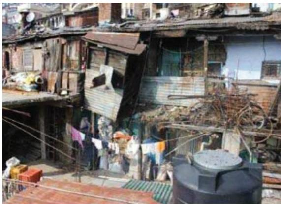

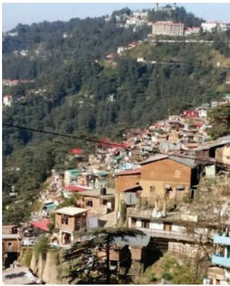

Krishna Nagar slum, Shimla. The slum area is characterized by inadequate housing conditions and high settlement densities on landslide-prone slopes (photo by Banashree Banerjee).

$^{a}$ Katcha houses are made of materials such as mud, grass, and straw and are not permanent.

b. The term pucca means “solid” and “permanent.” Pucca housing is built of substantial material such as stone, brick, cement, concrete, or timber.

c. Semi-pucca houses comprise a mix of durable or pucca materials and temporary or katcha materials.

Source: Asian Development Bank.

Despite rapid urban growth, housing increased by 51%, reaching 79 million units in 2011 because of policy reforms. The urban housing shortage decreased from 1.63 million units in 2001 to 0.40 million units in 2011. However, the quality of housing units was not always adequate. From 2017 to 2019, more than 320,000 people were evicted in slum clearances. Despite housing construction growth, the 2011 census showed 65.4 million people lived in slums, including 2.4 million in the India–Himalaya region states. This was 2.3 times more than in 1981, and this trend continues.

## Adequate Housing and Backlogs

In post-disaster situations, shelter and settlement support is essential for the recovery of physical shelters and for “rebuilding communities and family life, supporting protection and rebuilding the psychological, social, livelihood, and physical components of life.” $^{64}$ The right to housing has been enshrined in several international declarations through the decades, all of them signed by the governments of the HKH countries. $^{65}$ Most recently, Goal 11.1 of the Sustainable Development Goals calls on governments to ensure access for all to adequate, safe, and affordable housing and basic services, and upgrade slums by 2030.

The definition of “adequate” housing implicitly requires that it meets national seismic design and construction standards. This is because houses in urban areas need building permit approval. Bhutan’s National Building Code is based on the Indian Seismic Zonation of 2016 (Bureau of Indian Standards 1893:2016). The code does not differentiate between variable seismic risks in different locations in the country, for example, requiring higher performance standards in the higher-risk western areas and areas with higher densities of people and houses. It specifies peak ground acceleration of only 0.36 gravity, while more recent modeling shows this to be an underestimation of seismic risk for the country. Around 60% of the National Housing Development Corporation Limited (NHDCL) housing projects (approximately 1,507 units) were constructed before 2000 and do not meet current seismic performance standards. Although these units are considered “adequate” and “habitable,” they will require upgrading or replacement within the next decade to meet the current seismic codes.

The National Shelter Policy of Nepal, 2012 calculated that a total of 1.4 million housing units would be required in urban areas by 2023 to fulfill backlogs and replace below-standard houses. This would mean constructing 900,000 new housing units or 90,000 new units per year for 10 years and excludes the need to rebuild some 800,000 new houses fully or partially damaged after Earthquake Gorkha in 2015. $^{66}$

In India, the availability of urban housing has consistently increased over time. However, the urban housing shortage has also continued to rise. $^{67}$ In 2012, the Ministry of Housing and Urban Poverty Alleviation established a Technical Group to evaluate the urban housing shortage. It estimated a need for 18.8 million “new houses” and “houses needing enhancement.” $^{68}$ The assessment included slum and nonslum areas.

Responding to this shortage, the Pradhan Mantri Awas Yojana–Urban (PMAY-U) scheme was launched in 2015 as part of the Housing for All mission. The scheme is one of the largest affordable housing schemes worldwide, with significant achievements of 12.22 million housing units sanctioned, of which 9.6 million housing units have been completed as of 5 January 2026. $^{69}$ Box 5 describes the country’s Housing for All mission and support to low- and middle-income urban families through financial assistance, rental housing reforms, and coordination with other national urban programs to deliver affordable, climate-resilient housing, including vulnerable regions like in the Himalayas.

## Box 5: Integrating Affordability, Resilience, and Convergence: India's Evolving Urban Housing Framework

India has initiated the second-generation housing reforms under the Pradhan Mantri Awas Yojana-Urban 2.0 PMAY-U 2.0, the national “Housing for All” Mission. The PMAY-U 2.0 aims to support 10 million urban poor and middle-income families by providing financial assistance for the construction, purchase, or rental of affordable housing. The mission is implemented through four verticals: (i) Beneficiary-Led Construction, (ii) Affordable Housing in Partnership, (iii) Affordable Rental Housing, and (iv) the Interest Subsidy Scheme. Families from lower-and middle-income groups who do not own a permanent pucca (solid and permanent) house anywhere in the country are eligible to build or purchase a home under the scheme. India’s evolving rental housing reforms—reflected in the Affordable Rental Housing vertical—also offer a crucial policy instrument to address the housing needs of seasonal and migrant workers, particularly in Himalayan towns.

The PMAY-U has played a key role in fostering convergence with Central and State-sponsored schemes to ensure that the PMAY-U houses are supported with essential infrastructure, a commitment that continues under PMAY-U 2.0. Strengthening alignment with India's broader mission architecture—including the PMAY-U, the Atal Mission for Rejuvenation and Urban Transformation, the Swachh Bharat Mission-Urban, and the Smart Cities Mission—can leverage their established institutional and financial frameworks to improve state-level delivery of affordable housing. Such convergence is particularly valuable for enhancing implementation capacity in the Hindu Kush Himalaya states.

PMAY-U is a key driver of sustainable and climate-resilient housing, particularly in seismic- and climate-vulnerable regions, such as the Himalayan States. Through capital assistance, the Technology Innovation Grant, technical guidelines, and quality-assurance mechanisms, the mission supports the adoption of disaster-resilient, resource-efficient, and context-appropriate housing solutions. Its focus on beneficiary-centric design, use of locally appropriate materials, and improved construction practices helps strengthen climate adaptation while reducing long-term exposure to seismic- and climate-related risks. Looking ahead, PMAY-U 2.0 presents an opportunity to further embed risk-informed planning, energy-efficient building practices, and resilient housing typologies—positioning affordable housing as a cornerstone of sustainable and climate-resilient urban development.

Source: Government of India, Ministry of Housing and Urban Affairs.

## Case Study: Engendering Housing Finance, ADB Supporting Access to Housing Finance for Women

While a shortage of affordable and resilient housing across all groups in the study area countries persists, women are notably underrepresented when it comes to property ownership. In 2016 (latest available data), the share of women owning a dwelling either alone or jointly was only 8% compared to 19% of men in Nepal, 37% compared to 67% of men in India, and data on this indicator were not available in Bhutan. $^{70}$

As 90% of women in Nepal and India either work in the informal sector or in home-based enterprises, their incomes are generally lower than men's, they lack savings and other forms of collateral and struggle to establish credit histories that are needed for housing loans from financial institutions. $^{71}$ Commercial banks typically do not have the risk appetite, products, or gender-disaggregated data for understanding the needs of women customers. In this gap, microfinance institutions (MFIs)—such as the Women's Microfinance Initiative in Nepal; and the for-profit Bharat Financial Inclusion, Self-Employed Women's Association, and nonprofit Indian Alliance in India—have emerged and grown as important institutions offering microfinance to low-income members, predominantly women. $^{72}$

The MFIs typically provide small loans for emergency support, children's education, and small business investments and provide legal aid, capacity building, and financial literacy services. They usually do not require collateral but rely on savings group members to hold each other accountable for loan repayments. As women build their credit history through microfinance, many go on to use their small loans to invest in building or home repairs.

The role of external development partners in supporting microfinance has been on two levels. First is the example provided by ADB of working closely with the Nepal Rastra Bank, which has legislated responsibilities for inspecting and supervising all financial institutions, including MFIs in Nepal. ADB's support was for Nepal Rastra Bank to develop policies and regulatory frameworks for the microfinance sector in Nepal to ensure the sustainability and stability of the microfinance industry and to protect borrowers. $^{73}$ Second, international organizations, including ADB, have provided technical assistance and capacity development support to MFIs to improve their operational efficiencies, risk management, and the quality of services offered to customers, indirectly benefiting housing initiatives.

Notwithstanding their successes in meeting the needs of low-income women and the growth in coverage, MFIs have faced criticism from public and external support partners at different times and for various reasons, ranging from nontransparent financial control procedures, extortionary interest rates, high loan-to-value ratios, and the inability to scale up their operations and the size of loans to provide housing finance on the scale needed. $^{74}$

However, the potential for retail housing finance from the banking sector remains negligible in the region, especially for low-income women customers. In India, of the 44% of all people who borrowed money in 2021, only 13% borrowed through a formal channel and 3% from a savings club, while 31% borrowed from family or friends. $^{75}$ Among women, only 5% borrowed from a formal financial institution and 3% had a housing loan. $^{76}$ A growing gap in women's financial inclusion, therefore, persists in that MFIs do not extend sufficiently to meet the scale of housing needs, and the formal housing finance banks do not target the needs of women.

Increasing access to housing finance by women is important for their own and their families' resilience, and such access supports economic growth. Recognizing this and the persistence of social and legal inequalities, the Bhutanese, Indian, and Nepali governments introduced measures—e.g., tax exemptions for women and daughters to have a greater share in family property (Nepal), $^{77}$ and subsidized interest rates on housing loans through commercial banks for women who hold the title to a new property (India). However, access by poor households and, in particular, women-headed households to financial services for building new homes or repairing and strengthening existing houses remains a significant issue. $^{78}$

In this regard, government policies are slowly changing. In 2022, the Government of Bhutan increased the land valuation rate. This adjustment has made it easier for private landowners to obtain housing loans from commercial banks. As a result, 31% of urban households used retail bank financing (mortgages) to purchase or build a new house (16%) or apartment (15%), a 7 percentage-point increase from the previous 5 years. $^{79}$

External development partners play a critical role in supporting governments and commercial banks, and enable the private sector to deliver affordable housing. For example, in October 2019, ADB approved a \$60 million loan to Aavas Financiers Limited. This loan supports housing finance access for women belonging to lower-income groups in 10 lagging states in India, including, among others, Nagaland, Tripura, and West Bengal. Aavas, a private equity-based housing finance company, is one of the largest in India's affordable housing market. It provides home repair loans and self-construction home loans to salaried and nonsalaried lower-income customers in rural areas and small towns having little or no access to mortgage finance. $^{80}$ Almost all loans are for owner-occupied houses.

ADB assistance was in the form of catalytic capital, a senior secured debt facility of up to \$60 million with a tenor of up to 8 years. $^{81}$ By combining funding from multiple sources, Aavas is able to assume higher levels of risk, such as lending to households with little or no collateral, and extend housing finance to low- and middle-income families. This approach enables the company to offer below-market interest rates and flexible repayment terms to 110,000 women as primary or co-borrowers. $^{82}$

While mortgage finance is not a panacea for all lower-income household financial needs, it does fill a critical gap in affordability to either buy or construct new houses or to strengthen and repair existing houses for seismic resilience. ADB's provision of catalytic capital is an innovative way of leveraging private sector equity and debt finance on the scale needed to begin to address affordable housing needs.

## Housing Affordability in Bhutan

Private property providers supply 56% of adequate, officially sanctioned rental housing, with rents set at market rates. The state-owned enterprises—the NHDCL and the National Provident and Pension Fund—supply 5% and 2% of the total rental housing, respectively, with prices offset by housing rent allowances paid to all civil servants. However, the allowances have inadvertently driven up rents for all households in Bhutan. Data shows that 25% of households experience rent hikes one to two times annually, and 18% every 2 years. Between 2017 and 2020, rental increases averaged 73% across all municipalities. To mitigate rent escalation, it is imperative to phase out these distortionary allowances while simultaneously enhancing the availability of affordable housing options.

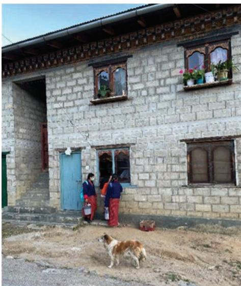

Notwithstanding the government's policy, home ownership rates in urban areas have been declining in Bhutan over the past 15 years. However, between 2021 and 2022, owner-occupied housing still constituted a substantial $18\%$ of the officially sanctioned housing in Thimphu and $26\%$ in the other municipalities.

Low-cost home ownership. These units were built by the National Housing Development Corporation in the 1990s in Chanjiji, Thimphu (photo by Colleen Butcher-Gollach).

To reduce construction costs, one option is to use rammed earth for ground-floor load-bearing walls. This results in a 25% reduction in unit costs for single-story buildings (Code 9 vs. Code 7) and a 44% reduction compared to using reinforced cement concrete (Code 9 vs. Code 13). For double-story buildings, using rammed earth reduces construction costs by more than half compared to reinforced cement concrete (Code 10 vs. Code 14). Additionally, reducing room heights to 2.8 meters can save an additional 3% to 5% across building types (Box 6).

The Department of Engineering Services, Ministry of Infrastructure and Transport, annually provides the price per square meter for various generic housing units in Thimphu. These prices are derived from market-based housing construction contract prices for January–February of the preceding year. The 2022 schedule of prices was used to calculate the construction costs of one-, two-, or three-bedroom housing units with a kitchen and bathroom. These costs are based on dwelling superstructure and exclude infrastructure services, contingencies, and land. The calculated prices were based on three dwelling sizes and six construction types in Thimphu.

GF = ground floor; RCC = reinforced cement concrete.

Box 6: Typical Urban Housing Typologies, Thimphu, Bhutan

<table><tr><td>House Type</td><td>Description</td></tr><tr><td>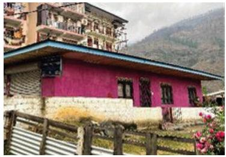</td><td>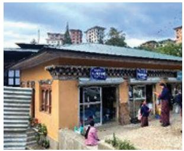</td></tr><tr><td>Code 7: Basic single-story load-bearing dwelling</td><td>Code 13: Single-story (GF, RCC-framed)</td></tr><tr><td></td><td>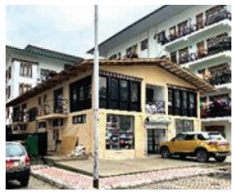</td></tr><tr><td>Code 9: Single-story (GF load-bearing in rammed earth)</td><td>Code 14: Double-story dwelling (RCC-framed)</td></tr><tr><td>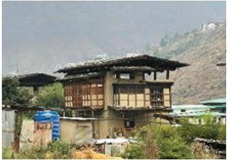</td><td>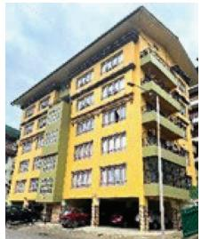</td></tr></table>

Code 10: Double-story (load-bearing in rammed earth)  
Code 16: Multistory dwelling (RCC-framed)  
Source: All photographs by Deependra Pourel, 17 June 2023.  
In summary:

(i) The lowest 20% of income earners (extremely poor) in Thimphu cannot afford even the lowest-cost, officially sanctioned housing unit built by a private sector developer without a subsidy, either through public service employment or eligibility for social housing.

(ii) Households in the 20th to 40th income quintile should be able to afford repayments for a one-bedroom (40 square meter carpet area) or two-bedroom (46 square meter carpet area) double-story housing unit with load-bearing rammed-earth walls (Code 10).

(iii) Middle-income earners (up to the 60th income quintile) should be able to afford a one-bedroom single-story unit (ground-floor load-bearing structure, Code 7) or one-, two-, and three-bedroom single-story units (ground-floor, load-bearing in rammed earth, Code 9), as well as one-, two-, and three-bedroom double-story units (ground-floor, load-bearing in rammed earth, Code 10).

(iv) Only upper-income households (in the 60% and above income quintiles) can afford the Code 13, 14, and 16 housing types (single-story, double-story, and multi-story, respectively, all with reinforced cement concrete construction), even small one-bedroom units.

In Bhutan, public and private sector architects, engineers, and planners are working together to introduce design changes that lower construction costs. These changes include building code acceptance for ground-floor, load-bearing, rammed earth, reduced carpet size, and lower room height while maintaining amenities. More can be done to mobilize and designate suitable land for residential development and to streamline procedures and permits for local construction materials. Options for housing finance, such as preferential interest rates for lower-income households, have also received attention.

Promising innovative housing finance options include rent-to-buy home ownership and housing unit designs that allow for incremental vertical expansion. Internal upgrading over time would be attractive for low-income households who may either not be eligible or may not wish to take on formal mortgage financing. Public-private partnerships, where the public sector provides equity in the form of land and infrastructure services, are also a promising approach.

## De Facto Housing

As public funds for subsidized housing are limited, lower- and middle-income households resort to building or renting informal housing or “de facto housing.” These include single rooms, extensions, or unauthorized self-built units or whole informal settlements. An estimated 5 million people live in such housing, which lacks official approval, is substandard or inadequate (slums), or exists within unauthorized informal settlements.

At 2022 construction prices, the private sector's lowest-cost unit would be affordable without public subsidy by households on incomes above the 20th income percentile. However, a large and growing backlog in officially sanctioned affordable housing for urban lower-income earners persists. In part, this could be addressed by recognizing and providing resources to regularize (upgrade and ensure the safety of) de facto housing and the numerous self-built units provided by this segment of the market. The other strategy would be to remove the barriers to private developers for larger-scale construction of cheaper units.

## Housing Typologies and Earthquakes

If a segment along the Himalayan Main Boundary failed, large earthquakes (greater than magnitude 8.7) would likely occur over the Central Gap northwest of Kathmandu and over East Bhutan. This region has a 10% probability that in 50 years an earthquake of slightly less magnitude (between magnitude 7.8 and 8.3) will occur, resulting in peak ground acceleration values of over 1 gravity. More areas would rupture in 8.4 magnitude earthquakes, including West Bhutan, Pockham in Nepal, and over Sikkim, Nahan and Kishwar in the India–Himalaya.

Strong earthquakes trigger various forms of damage, which encompass fault rupture, shaking, landslides, soil liquefaction, avalanches, permanent ground deformation, and even fires, along with hazardous material releases. However, the most prevalent cause of destruction in most earthquakes is ground shaking. Prevailing building codes throughout much of the area show a lack of comprehensive consideration and understanding of the risk due to the probability of high levels of ground shaking. For example, Bhutan's existing approved building code, largely based on the Indian Seismic Zonation of 2016 (Bureau of Indian Standards 1893:2016, Zone V), uses a peak ground acceleration of only 0.36 gravity.

Unless urban planning instruments, building codes, and construction techniques improve in parallel with the expansion of new urban growth, damage to buildings and loss of lives are likely to increase because of inappropriately located land use and inadequately designed and constructed buildings.

In general terms, the Hindu Kush Himalaya (HKH) region's building typologies for residential building types are vernacular or non-engineered construction (Table 4). For example, the most common buildings in Bhutan are unreinforced mortar (fired brick, 45%), adobe-block walls (30%), and reinforced cement concrete (3%). $^{83}$ If well-constructed, these buildings are able to withstand significant seismic events, as illustrated in Box 7.

Table 4: Earthquake-Safe Traditional Construction Practices in the India-Himalaya Region

<table><tr><td>Construction Practice</td><td>Typical Feature</td><td>Regional Distribution</td><td>Famous Earthquakes in the Region</td></tr><tr><td>Thatch Houses</td><td>Thatch and bamboo houses</td><td rowspan="2">Northeast India</td><td rowspan="2">M8.7 (1897), M8.6 (1950)</td></tr><tr><td>Assam Type Houses</td><td>Timber frame with Ekra infill</td></tr><tr><td>Nawari Houses (Nepal)</td><td>Timber with adobe infill and mud mortar</td><td>North Bihar / Nepal</td><td>M8.3 (1934)</td></tr><tr><td>Kat-ki Kanni</td><td>Stone and timber houses</td><td>Kullu Valley (Himachal Pradesh)</td><td>M8.0 (1905)</td></tr><tr><td>Pherols / Sumers</td><td>Multi-story timber/stone structure</td><td>Garhwal Region (Uttarakhand)</td><td>M6.9 (1999), M6.4 (1991)</td></tr><tr><td>Dhajji Dewari</td><td>Wooden tie beams with adobe infill and mud mortar</td><td>Northern India</td><td>M6.3 (1885) M7.6 (2005)</td></tr><tr><td>Taq System</td><td>Load bearing masonry piers with adobe infill and timber runners</td><td></td><td></td></tr></table>

Source: Government of India, Ministry of Home Affairs. 2014. Mainstreaming Disaster Risk Reduction in Housing Sector.

In 2015, the catastrophic impact of Earthquake Gorkha (magnitude 7.6) on Nepal's built environment stemmed primarily from the seismic vulnerability of unreinforced masonry buildings prevalent across the country. Communities lacked awareness of seismic risks, especially in rural areas, and approved construction practices were not widely disseminated. Building code enforcement was particularly insufficient, and older structures were most affected.

Following the quake, the National Society for Earthquake Technology developed vulnerability curves to assess physical damage. A large-scale survey found that among the 498,852 fully collapsed or irreparably damaged houses and the 256,697 partially damaged houses, three main types were affected: low-strength masonry, cement-mortared masonry, and reinforced concrete frames.

Various structural failures occurred in both masonry and reinforced concrete buildings because of material weaknesses, inadequate strength, and poor structural integrity. $^{84}$ The seismic performance of common building types in the HKH region varied, based on construction methods, wall materials, and seismic design considerations. $^{85}$ The severe impact of this earthquake on Nepal's built environment $^{86}$ illustrated how fatalities, serious injuries, and building damage are due largely to the vulnerability of unreinforced masonry buildings. $^{87}$ Inadequate awareness of seismic risks, poor construction practices, and weak building code enforcement magnify the damage.

<table><tr><td></td><td colspan="2">Material</td><td>Wall  $Construction^a$ </td><td>Max. No. of Stories</td><td>Earthquake Performance</td></tr><tr><td rowspan="3">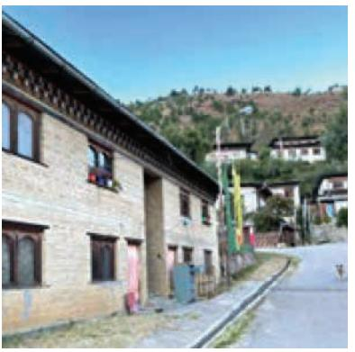</td><td>(i)</td><td>Wood and bamboo</td><td>(i) Post and beam, wooden planks/ thatch/bamboo for walls, with flexible floors and roofs.</td><td>3(2 for Bhutan)</td><td rowspan="3">Inherent flexibility and lower mass of these structures contribute to better earthquake performance compared to the other three types.</td></tr><tr><td>(ii)</td><td>Earth</td><td>(i) Mud only, hand-built with interior woven light wood reinforcing (i.e., wattle and daub); sun-dried brick masonry and rammed earth.</td><td>2</td></tr><tr><td></td><td></td><td>(ii) Load bearing stabilized mud blocks</td><td></td></tr><tr><td colspan="6">Earth. The load-bearing stabilized mud block construction was completed in November 2022 (photo by Colleen Butcher-Gollach).</td></tr><tr><td rowspan="3">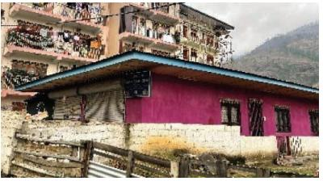</td><td>(iii)</td><td>Stone masonry</td><td>(i) Angular stone, fired brick, sun dried brick, dry-stacked, may have horizontal wood bands.</td><td>1-4(2 for Bhutan)</td><td rowspan="3">Very low seismic capacity due to weak structural components, thick walls, and lack of connecting elements. Some limited earthquake resistance might be provided by embedded wooden elements in a few cases. Perform poorly during earthquakes due to their low strength and inadequate seismic design.</td></tr><tr><td></td><td></td><td>(ii) Angular stone, mud mortar, lime or cement mortar, may have horizontal wood bands.</td><td></td></tr><tr><td></td><td></td><td>(iii) Rounded stone masonry, mud, lime or cement mortar.</td><td></td></tr><tr><td colspan="6">Stone masonry. The rounded stone masonry construction was completed in June 2023 (photo by Deependra Pourel).</td></tr></table>

Continued on next page

Box 7: Generalized Building Typologies and Seismic Performance

<table><tr><td></td><td colspan="3">Material</td><td> $Wall Construction^a$ </td><td>Max. No. of Stories</td><td>Earthquake Performance</td></tr><tr><td rowspan="2">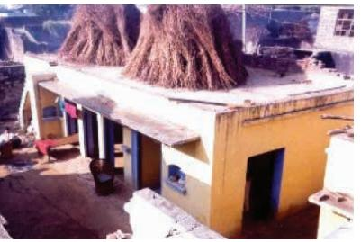</td><td rowspan="2">(iv)</td><td rowspan="2">Masonry units (fired brick or cement)</td><td>(i)</td><td>Unreinforced fired brick, concrete blocks, or stone with lime or cement-sand mortar (URM).</td><td rowspan="2">6(2 for Bhutan)</td><td rowspan="2">Despite the better materials, the buildings suffer from poor construction practices and lack earth-quake resistant features. Their seismic performance is compromised due to inadequate design and construction methods.</td></tr><tr><td>(ii)</td><td>Reinforced, cement mortar.</td></tr><tr><td colspan="7">Masonry units. Reinforced cement mortar. Reinforced cement mortar was used in the construction (photo by Deependra Pourel).</td></tr><tr><td rowspan="4">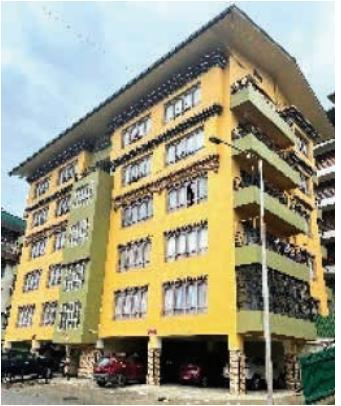</td><td rowspan="4">(v)</td><td rowspan="4">Reinforced concrete (RC) frame</td><td>(i)</td><td>Cast in situ ordinary RC frame with masonry partition and infill walls, unconfined URM infill.</td><td rowspan="4">Maximum 6 excluding basement</td><td rowspan="4">While seismic detailing has improved, many of these buildings still have deficiencies in construction practices. Their performance during earthquakes varies, but generally, they are more resistant than the above two types due to the presence of reinforced concrete elements.</td></tr><tr><td>(ii)</td><td>Ordinary RC frame, confined URM infill</td></tr><tr><td>(iii)</td><td>SMRF, URM or other fill or cladding</td></tr><tr><td>(iv)</td><td>Typically have reinforced concrete floors and roofs</td></tr><tr><td colspan="7">Reinforced concrete frame construction was completed in June 2023 (photo by Deependra Pourel).</td></tr></table>

Box 7 continued  
RC = reinforced concrete, RM = reinforced masonry, URM = unreinforced masonry. $^{a}$ In most vernacular construction, floors and roofs are supported by wood beams.

Source: Authors.

The Nepal Building Code, incrementally adapted and improved since 1994, now recognizes the range of local construction types, including non-engineered vernacular structures. Permit approvals employ a four-tier system, ranging from small buildings that must meet minimum “rules of thumb” to more rigorous requirements for high-rise, high-value tower blocks. Measures typically required to be incorporated include foundation buffers and cross-laminated timber walls, plan and elevation regularity, positioning of earthquake-resisting elements, maximum span, minimum reinforcing and member sizes, corner bracing, as well as enforced roof construction.

Non-engineered low-rise earth and masonry buildings should follow the seismic design guidelines of the International Association of Earthquake Engineering. $^{88}$ The associated increase in costs depends on many factors but generally ranges from 5% to 20% of the total building cost.

For engineered reinforced concrete buildings, designs should follow applicable Indian Standards, except for seismic zonation. Bhutan's official seismic zonation, Seismic Zone V of IS 1893:2016, is outdated and too low, with no official alternative available.

Strict building code enforcement might push more of the urban poor toward overcrowded and unofficial housing options. The failures documented during seismic disasters highlight the importance of enforcing robust building codes, promoting seismic awareness among households and small builders, and disseminating approved construction practices to enhance overall seismic resilience in the future.

Strong evidence shows that well-constructed vernacular or traditional buildings can withstand significant seismic events. For example, Bhutan's Code 9 or Code 10 are well-suited for low-cost construction and offer affordable options for low- and middle-income earners. With approved technology and knowledge transfer to architects and builders, regularly shaped rooms and lightweight infill materials can perform well during seismic events.

Simple design modifications can create savings that offset the costs of better materials without compromising amenities. For instance, lowering room heights to 2.8 meters can save between 3% and 5% of costs across all building types. Promoting wood frame construction can reduce costs compared to masonry and reinforced concrete buildings while providing strong seismic performance. $^{89}$

Bamboo, a traditional material used by indigenous peoples in the region, should also be considered. It is regenerative, eco-friendly, and safe during disasters, making it a reliable option for construction practices. $^{90}$

Building codes need to reflect local construction techniques and materials to be effective. Implementing the building code from plan review to approval and inspection is a significant challenge. It requires ongoing strengthening and updating of the capacity and capabilities of local governments and enforcement agencies. Experience shows that orienting building code implementation toward compliance advice, support, and incentives rather than top-down actions is more effective.

## Main Messages

## Affordable Housing—A Necessary and Achievable Objective

Cities and towns in the HKH region offer pathways for socioeconomic improvement for both women and men, providing specialized employment prospects, higher wages, and opportunities for education and innovation. However, the benefits of urbanization remain unevenly distributed. Extreme poverty has declined over the last 2 decades but remains a persistent challenge and is exacerbated by disasters. Poor living conditions and workplaces for many small businesses indicate ongoing social, economic, and physical exclusion of large urban populations.

As public finances for subsidized housing are limited and regulatory barriers restrict private sector construction of affordable housing units, many low-income and lower-middle-income households do not meet officially sanctioned “adequate” standards. De facto housing includes single rooms, extensions, unauthorized self-built units, or entire informal settlements. This housing constitutes an estimated 14% of the housing stock in the India Himalaya region, 19% in Bhutan, and 50% in Nepal. In the HKH region, an estimated 5 million people live in such substandard housing, largely excluded from global or national urban databases.

In Bhutan, the private sector provides low-cost units that meet the building code and are affordable without public subsidy by households on incomes above the 20th income percentile. The same holds for Nepal and many of the India–Himalaya region. To address the large and growing housing backlog in rapidly expanding urban centers, efforts should focus on removing barriers and creating incentives for private developers to undertake large-scale construction of affordable housing units.

Multiple measures can address housing shortages:

(i) Public-private partnerships, where governments provide scarce land and infrastructure services as co-developer equity;

(ii) Encouraging land pooling to create larger, well-located blocks of land for economies of scale in construction;

(iii) Reforms to allow flexible zoning for mixed land uses, enabling developers to cross-finance lower-cost housing from the sale or rental of larger units and commercial premises;

(iv) Legislation to enable land value capture and commercial value capture that balance private sector interest with the public good;

(v) Revisiting master plan site development restrictions, such as minimum setbacks and onerous onsite parking provisions to free up otherwise usable land; and

(vi) Allowing reduced minimum carpet size, ceiling heights, building materials, and ornamental finishes while preserving amenities and building safety.

Governments and external support partners in the HKH region should also initiate phased, area-by-area programs, feasibility investigations to regularize, upgrade, and ensure the safety of the 5 million de facto housing units built by lower-income households. This may include property registration or other forms of secure tenure, provision of microfinance and small conditional grants for house improvements, tailoring such finance to people's needs, along with practical guides and training for small builders.

## Better Seismic Hazard Data for Building Codes and Practices

Earthquake risk across the study area is largely underestimated. Bhutan's building regulatory framework, including the building code, heavily cites Indian standards, unlike the largely self-standing Nepal Building Code. This reliance on Indian standards can reduce the burden of code maintenance and integrate Bhutan into the Indian construction sector and supply chains. However, several authorities have identified the need for significant revisions to Bhutan's regulatory framework and building code. One major area for improvement is the seismic zonation of Bhutan, which currently relies on India's zonation. A collaborative study between international and Bhutanese experts, agencies, and authorities could produce a probabilistic seismic hazard analysis for Bhutan, forming the basis for future building code requirements and design.

## Cost Savings in Design Could Finance Seismic Strengthening Measures

In the HKH region, buildings must meet minimum seismic safety standards. Vernacular buildings, if constructed to comply with standards, can be low-cost, affordable housing options capable of withstanding significant seismic events. For example, constructing ground-floor load-bearing structures with rammed earth (as allowable under Bhutan's Code 9 and Code 10) can reduce single-story building costs by $25\%$ and double-story building costs by more than half compared to using reinforced cement concrete.

Non-engineered, low-rise earth and masonry buildings, typical of the region, need to follow accepted seismic design guidelines, which can increase costs by 5% to 20%. For engineered reinforced concrete buildings, appropriate seismic-resilient performance standards would require an estimated cost increase of 2% to 10% for most buildings and up to 30% for high-rise buildings above eight stories. Simple design modifications can offset the costs of seismic strengthening without compromising amenities, for instance, lowering room heights to 2.8 meters results in savings of 3% to 5% across all building types.

Promoting wood-frame and bamboo construction can reduce costs compared to masonry and reinforced concrete buildings while providing strong seismic performance. Urban planning instruments, building codes, and construction techniques all need strengthening, implementation, and enforcement to keep up with urban growth. Without these measures, building damage and loss of life are likely to increase because of poorly located land uses and inadequately engineered buildings (footnote 85).

The range of failures during seismic disasters highlights the need to enforce building codes and promote seismic education and awareness among households and small builders. Disseminating good construction practices, as seen in Nepal, and training and adequately compensating local building inspectors, are crucial steps to enhance overall seismic resilience in the future.

## Case Study: Accurate and Granular Hazard Risk Data in Formats Appropriate to End Users—Indonesia One Data Disaster

Several HKH countries are making efforts to gather, preserve, analyze, and use hazard-related data. However, these initiatives are often inconsistent and insufficient, highlighting the need for accurate and user-friendly hazard risk data.

Governments and their development partners can play a crucial role in making hazard risk data—such as seismic zonation mapping; liquefaction information; and data on landslides, floods, and wildfires—accessible to both public and private sector users.

ADB has supported governments in the HKH region and the Association of Southeast Asian Nations members in the use of disaster risk data for decision-making purposes. $^{91}$ In line with ADB's Strategy 2030, climate and disaster risk considerations in all stages of its project cycles are mainstreamed. This support includes probabilistic risk assessments that inform infrastructure and non-infrastructure operations, as well as the coordination and prioritization of disaster response and longer-term recovery efforts.

For example, Indonesia's One Disaster Data is a central repository established and maintained by the National Disaster Management Office and the Central Bureau of Statistics with data for multiprobabilistic disaster risk, occurrence, impacts, recovery, and financing for disaster management. InaRisk, one of many apps within the One Disaster Data portal, has detailed hazard, vulnerability, and risk assessment data for multiple hazards, including nationwide earthquake hazard maps developed by a collaborative governance structure (Figure 3). It allows agencies and members of the public to understand the likelihood and intensity of a hazard event based on accurate modeling and verifiable data.

Figure 3: Indonesia InaRisk Platform: Risk Assessment for Earthquakes  
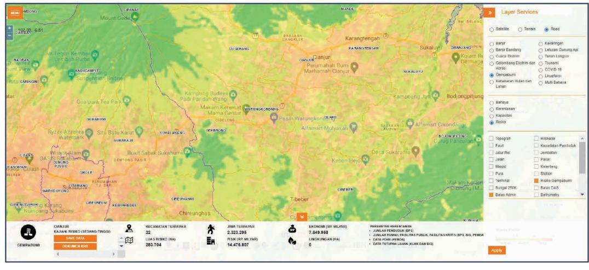

An effective way to facilitate integrated risk management is through the creation of integrated disaster risk management funds. $^{92}$ These funds can be provided to subnational governments for place-based risk mitigation measures, such as seismic strengthening of schools or flood protection, based on cost-benefit analyses.

Lessons learned from experience highlight that for risk information to be effectively used in decision-making, the following considerations are essential:

(i) The content and the presentation should meet the needs of end users, including spatial and temporal characteristics.

(ii) Data should be stored and prepared in mapping software that is compatible with different databases and users.

(iii) A collaborative approach is necessary, involving government agencies, technical and scientific experts, businesses, academia, and civil society organizations to work together for data collation, analyses, and risk assessments.

(iv) Building databases is time-consuming and costly; therefore, adopting incremental approaches where knowledge is built up and refined over time is valuable.

The ideal outcome of an integrated risk management system for the HKH region would be as follows:

(i) Conduct hazard studies using modern methods and current data to determine the likelihood of damaging events, such as earthquakes, ground failures (e.g., liquefaction, landslides), floods, wildfires, and other hazards, and present the results in both probabilistic and scenario formats.

(ii) Perform comparable studies to assess the consequences of these hazard events on current and projected natural, built, and social environments. This includes human mortality and morbidity, building collapse, property and infrastructure damage, recovery duration, resource requirements, and economic impacts. Consequences should be disaggregated by sectors and population variables such as vulnerability, gender, ethnicity, and literacy.

(iii) Provide detailed quantitative results of the above studies in geographic information system format, with resolutions and formats tailored for various end users. Preferably, these results should be available in geographic information systems or other platform applications that are user-friendly.

(iv) Create graphic presentations of the study results in resolutions and formats designed for quick dissemination and communication to end users. Different stakeholders, such as builders, developers, investors, regulators, businesses, and the public, have different data needs and capacities for understanding data. Therefore, a variety of maps, charts, and other products should be developed to meet these diverse requirements. This includes appropriate resolution, symbology, detail, and projections for current and future scenarios.

Countries that adopt an integrated risk management approach tend to experience more robust economic growth and social stability. Additionally, they become more appealing to foreign investors, who view such places as safer and more stable investment destinations.

## V. ROAD MAP FOR SUPPORTING AFFORDABLE AND SEISMICALLY RESILIENT HOUSING IN THE HINDU KUSH HIMALAYA REGION

## Overview

The HKH region experiences elevated seismic activity, with recurrent and unpredictable threats such as earthquakes, landslides, glacial lake outburst floods, and wildfires. The population growth rate in the most seismically hazardous areas is $3.4\%$ higher than in less hazardous regions. Adding to the complexity, nearly one-third of the region's population lives in poverty, heightening the likelihood of severe damage and devastating impacts.

To achieve sustainability, investments in land and housing for lower-income communities must incorporate risk considerations at every stage of the project cycle. Disaster risk reduction should be embedded in the design of physical assets and reinforced through dedicated technical support. Given that residential land use occupies a significant portion of urban areas, disaster risk reduction should be a priority consideration in discussions with governments about the need for stronger and more affordable housing.

From a national economic perspective, proactive risk reduction is vital for disaster risk management. Strategic investments in risk reduction measures enhance resilience and yield measurable economic benefits and social stability. The United Nations Office for Disaster Risk Reduction estimates that every 1 invested in prevention and risk reduction, particularly when incorporated into build-back-better post-disaster recovery efforts, can save up to 15 in relief costs. $^{93}$ Engagement with governments, businesses, and communities in the region should be incremental, persistent, and long-term, recognizing that more can be done to achieve resilient and affordable adequate housing.

## Recommendations for Strategy 2030

ADB adopted Strategy 2030 in 2018, providing a comprehensive road map to address the diverse and evolving development challenges in Asia and the Pacific region. The strategy leverages ADB's extensive experience in promoting economic growth, reducing poverty, and fostering sustainable development across the region. Strategy 2030 outlines seven operational priority areas, each targeting specific development aspects either as standalone priorities or in combination.

To achieve Operational Priority 4 (making cities more livable), ADB has established seven guiding principles and 18 development solutions, organized under three core pillars:

(i) improving the provision of inclusive and gender-responsive services in cities;

(ii) strengthening city planning capacities, competitiveness, and financial sustainability; and

(iii) promoting climate resilience and healthy and environmentally sustainable cities.

ADB's Strategy 2030 midterm review highlighted the need to accelerate work in five areas: (i) climate action, (ii) private sector development, (iii) regional cooperation and public goods, (iv) digital transformation, and (v) resilience and empowerment.

Strengthen urban planning and housing policies. ADB and other multilateral development banks can add value by supporting urban planning and housing policies for the region, integrating seismic hazard data and multihazard mapping into development plans and policies. In addition, policies to encourage land pooling and flexible zoning could help unlock well-located land for affordable housing and infrastructure development. Communities living in mountain areas—particularly women and other marginalized groups—face growing pressures from climate and socioeconomic vulnerabilities, highlighting the need for stronger support systems that combine affordable housing with ecosystem-based services and other livelihood support to build resilience. Policy responses tailored to the HKH region remain limited, largely because of gaps in knowledge and evidence about the specific conditions and needs of mountain populations. Multilateral development banks and governments in the region can support the creation of centralized digital data platforms to inform planning and investments.

Reexamine building codes and building bylaws. Based on the lessons learned from ADB's Green and Resilient Affordable Housing Sector Project in Bhutan, as well as evidence and examples across the region, it is clear that building codes and building bylaws need to be reexamined and better contextualized. Codes and bylaws that are specific to the risks of different areas or locations within the region and enable integration of traditional construction practices and the evolving realities of population growth and densification are the need of the hour. At the same time, promoting compliance-oriented enforcement through training and incentives for builders, local governments, and other stakeholders is required.

Create a network of institutions in the region. ADB and other development banks can facilitate the creation of a network of institutions to enable an exchange of ideas and knowledge through (i) the Central Building Research Institute, Roorkee, Uttarakhand, India; (ii) the Himalayan Institute of Alternatives, India; (iii) the International Centre for Integrated Mountain Development, Kathmandu, Nepal; (iv) the Energy Research Institute, New Delhi, India; and (v) architecture and planning schools and engineering colleges with centers of excellence in the region.

Create outreach models for scaling up. Models such as Centre of Science and Technology for Rural Development (COSTFORD) and Nirmiti Kendra in India offer proven models of centers of excellence that promote local planning and development to empower communities. Governments and development banks can support the creation of such centers in the region to (i) promote the study of traditional architecture, coupled with research and development in construction technology and architectural design; (ii) serve as channels for climate-, disaster-, culture- and resource-appropriate technology transfer; (iii) foster human resource development at different levels (e.g., masons, artisans, architects, civil engineers, structural engineers, planners, and contractors), including capacity building and training women to enter these professions; and (iv) develop and disseminate educational materials related to climate- and disaster risk- appropriate building technologies and techniques; conduct seminars, workshops, and exhibitions; and organize training programs and field visits for more effective outreach.

Expand access to housing finance. Scaling up gender-responsive housing finance through microfinance institutions, targeted interest subsidies, and catalytic capital from development partners can help expand access to affordable housing finance, particularly for disadvantaged and vulnerable groups. Building on approaches such as the Pradhan Mantri Awas Yojana-Urban (PMAY-U), combining financial assistance with beneficiary-led construction, rental housing options, and partnerships with the private sector can further widen access. At the same time, regulatory reforms that strengthen women's and other vulnerable groups' property rights and improve their access to formal credit will be critical to enabling resilient and affordable housing.

Microenterprise development. Members of community-based organizations and private enterprises can be trained in specific skills for building in the region and can then generate local employment. Facilitation of microcapital and tie-ups with banks and financial institutions would be required in such cases.

Risk-informed relocation housing. This is both a necessary and practical approach to protect lives and livelihoods in hazard-prone mountain regions. Governments and development partners can ensure that relocation reduce risk while improving livability and equity by (i) integrating hazard data and geospatial tools into site selection; (ii) applying strong environmental and social safeguards; and (iii) adopting inclusive, participatory design processes. Drawing on approaches used in programs such as PMAY-U, relocation housing can also be supported through innovative financing mechanisms, including public-private partnerships, targeted subsidies, and concessional loans to improve affordability for disadvantaged and vulnerable households. Strengthened interagency coordination, streamlined approvals and infrastructure provisioning, promotion of locally appropriate and seismic-resilient construction methods, and support for incremental housing and rent-to-own schemes can further help low-income households transition safely while maintaining long-term housing security.

## BIBLIOGRAPHY

Ahmed, M., S. H. Lodi, and M. M. Rafi. 2022. Probabilistic Seismic Hazard Analysis Based Zoning Map of Pakistan. Journal of Earthquake Engineering. 26 (1). pp. 271–306.

Asian Development Bank (ADB). 2017. Completion Report: Urban Infrastructure Development in Bhutan.

ADB. 2018. Strategy 2030: Achieving a Prosperous, Inclusive, Resilient, and Sustainable Asia and the Pacific.

ADB. 2020. The Integrated Disaster Risk Management Fund: Sharing Lessons and Achievements.

ADB. 2021a. Financial Market Development Program (Subprogram 2). Report on Housing Market Demand Survey. Technical Assistance Consultant's Report (Final Report).

ADB. 2021b. Report and Recommendations of the President to the Board of Directors: Proposed Loan for the Shubham Supporting Housing Finance in Semi- and Peri-Urban Areas Project in India.

ADB. 2022. Disaster-Resilient Infrastructure: Unlocking Opportunities for Asia and the Pacific.

ADB. 2023. Sustainable Development Goals (SDGs): Nepal. SDG 1: No Poverty. Poverty Data: Nepal.

ADB. Bhutan: Urban Infrastructure Development.

ADB. Nepal: Capital Market and Infrastructure Capacity Support Project.

ADB. Regional: Enhanced Use of Disaster Risk Information for Decision Making in Southeast Asia.

ADB. Regional: Strengthening Disaster Resilience in Selected Urban Areas of Southeast Asia.

ADB. Regional: Support to the Implementation of Strategy 2030 Operational Plans.

Bacani, E. and S. Mehta. 2020. Analyzing the Welfare-Improving Potential of Land Pooling in Thimphu City, Bhutan: Lessons Learned from ADB's Experience. ADB South Asia Working Paper Series. No. 76.

Ballaney, S., A. Faust, R. C. Swarankar, and S. G. Belliappa. 2022. Land Pooling in South Asia: Lessons Learned for Equitable, Participatory, and Inclusive Urban Expansion. ADB.

Bilham, R. 2019. Himalayan Earthquakes: A Review of Historical Seismicity and Early 21st Century Slip Potential. Special Publications. 483. pp. 423–482.

Bilham, R., V. K. Gaur, and P. Molnar. 2001. Himalayan Seismic Hazard. Science. 293 (5534). pp. 1442–1444.

Boyd, O. S., C. S. Mueller, and K. S. Rukstales. 2007. Preliminary Earthquake Hazard Map of Afghanistan: US Geological Survey Open-File Report, 2007–1137.

Center for Bhutan Studies and GNH Research. 2016. A Compass Towards a Just and Harmonious Society: 2015 Gross National Happiness Survey Report.

Centre for Research on the Epidemiology of Disasters. Emergency Events Database (EM-DAT) (accessed 8 August 2022).

Chaulagain, H., H. Rodrigues, V. Silva, E. Spacone, and H. Varum 2015. Seismic Risk Assessment and Hazard Mapping in Nepal. Natural Hazards. 78 (1). pp. 583–602.

Choe, K. and P. Pradhan. 2010. Unleashing Economic Growth: Region Based Urban Development Strategy for Nepal. ADB.

Das, S., I. D. Gupta, and V. K. Gupta. 2006. A Probabilistic Seismic Hazard Analysis of Northeast India. Earthquake Spectra. 22 (1). pp. 1–27.

Demirguc-Kunt, A., L. Klapper, D. Singer, S. Ansar, and J. Hess. 2018. The Global Findex Database 2017: Measuring Financial Inclusion and the Fintech Revolution. World Bank.

Gautam, D., N. Chettri, K. Tempa, H. Rodrigues, and R. Rupakhety. 2022. Seismic Vulnerability of Bhutanese Vernacular Stone Masonry Buildings: From Damage Observation to Fragility Analysis. Soil Dynamics and Earthquake Engineering. pp. 160 (1). 107351.

Gautam, D., G. Fabbrocino, and F. Santucci de Magistris. 2018. Derive Empirical Fragility Functions for Nepali Residential Buildings. Engineering Structures. 171. pp. 617–628.

Global Shelter Cluster. 2018. Shelter & Settlements – The Foundation of Humanitarian Response: Strategy 2018–2022 Narrative.

Goda, K, and D. Drupka. 2019. Building Resilience to Earthquakes in Bhutan: A Probabilistic Seismic Hazard Assessment to Inform the National Building Code. Paper prepared for the conference on Building Resilience to Geohazards in the Face of Uncertainty.

Government of Bhutan, Ministry of Works and Human Settlement. 2008. Bhutan National Urbanization Strategy.

Government of Bhutan, National Statistics Bureau. 2017. Bhutan Living Standard Survey.

Government of Bhutan, National Statistics Bureau. 2019. Dzongkhag Population Projections 2017–2027.

Government of Bhutan, National Statistics Bureau. 2022. Bhutan National Living Standards Survey Report.

Government of Bhutan. Royal Audit Authority. 2016. Performance Audit of Disaster Management.

Government of Bhutan, Royal Audit Authority. 2019. Performance Audit Report on Housing Development – Adequacy and Affordability.

Government of India, Building Materials and Technology Promotion Council. 2010. Guidelines: Improved Earthquake Resistance of Housing.

Government of India, Bureau of Indian Standards. 2016. Criteria for Earthquake Resistant Design and Structures: Part 1 General Provisions and Buildings (Sixth Revision).

Government of India, Government of Assam. 2020. Assam Urban Affordable Housing Policy.

Government of India, Government of Assam. 2022. Statistical Handbook, Assam 2022.

Government of India, Government of Himachal Pradesh, Himachal Pradesh State Finance Commission. 2022. Report of 6th H.P. State Finance Commission.

Government of India, Government of West Bengal. 2014. District Statistical Handbook 2014. Kolkata: Government of India.

Government of India, Ministry of Home Affairs. 2001. 2001 Census of India.

Government of India, Ministry of Home Affairs. 2011. 2011 Census of India.

Government of India, Ministry of Home Affairs. 2014. Mainstreaming Disaster Risk Reduction in Housing Sector.

Government of India, Ministry of Housing and Urban Affairs. 2019a. Handbook of Urban Statistics 2019. Delhi: Government of India.

Government of India, Ministry of Housing and Urban Affairs. 2019b. Vulnerability Atlas of India. 3rd ed.

Government of India, Ministry of Housing and Urban Poverty Alleviation. 2007. National Urban Housing and Habitat Policy 2007.

Government of India, Ministry of Housing and Urban Poverty Alleviation. 2012. Report of the Technical Group on Urban Housing Shortage (TG12) (2012–17).

Government of India. Ministry of Housing and Urban Poverty Alleviation. 2014. Model State Affordable Housing Policy for Urban Areas.

Government of India, Ministry of Housing and Urban Poverty Alleviation. 2015. Slums in India: A Statistical Compendium.

Government of India, NITI Aayog. 2018. Strategy for New India @75.

Government of India, NITI Aayog. 2021a. India National Multidimensional Poverty Index: Baseline Report.

Government of India, NITI Aayog. 2021b. Reforms in Urban Planning Capacity in India.

Government of India, Unique Identification Authority of India 2026. State/UT wise Aadhaar Saturation. 31 March

Government of Nepal. 2015a. Nepal Earthquake 2015: Post Disaster Needs Assessment.

Government of Nepal. 2015b. Sector Reports. Nepal Earthquake 2015. Post Disaster Needs Assessment.

Government of Nepal, Central Bureau of Statistics. 2019. A Glimpse of Nepal's Statistics.

Government of Nepal, Ministry of Urban Development. 2016a. Third United Nations Conference on Housing and Sustainable Urban Development (Habitat III) – Nepal National Report.

Government of Nepal, Ministry of Urban Development. 2016b. Vision 2035 and Beyond: 20-Year Strategic Development Master Plan (2015–2035) for Kathmandu Valley.

Government of Nepal, National Planning Commission. 2015. Nepal Earthquake 2015 Post-Disaster Needs Assessment.

Gupta, H. K. 1993. Seismic Hazard Assessment in the Alpide Belt from Iran to Myanmar. Annals of Geophysics. 36. pp. 3–4.

Haque, D. M. E., N. W. Khan, Md. Selim, A. S. M. Maksud Kamal, and S. H. Chowdhury. 2020. Towards Improved Probabilistic Seismic Hazard Assessment for Bangladesh. Pure and Applied Geophysics. 177 (7). pp. 3089–3118.

Hong, H. P. and C. Feng. 2019. On the Ground-Motion Models for Chinese Seismic Hazard Mapping. Bulletin of the Seismological Society of America. 109 (5). pp. 2106–2124.

International Association of Earthquake Engineering. 1986. Guidelines for Earthquake Resistant Non-Engineered Construction.

International Bank for Reconstruction and Development and World Bank. 2022. The Little Data Book on Financial Inclusion.

International Labour Organization (ILO). 2018. Women and Men in the Informal Economy: A Statistical Picture (Third Edition).

ILO. ILO Modelled Estimates.

ILO. ILOSTAT Explorer. SDG Indicator 8.3.1 – Proportion of informal employment in total employment by sex and sector (%) (accessed 20 November 2023).

International Monetary Fund. 2018. Bhutan: 2018 Article IV Consultation-Press Release; Staff Report; and Statement by the Executive Director for Bhutan. IMF Staff Country Reports Series. No. 2018/300.

Ishihara, Y. and T. Lhaden. 2019. Bhutan Development Update: Harnessing Urbanization. World Bank.

Khanal, K. and S. P. Khanal. 2022. The Study of Slum Definitions, Its Demographic Characteristic and Distribution Patterns in Kathmandu Valley, Nepal. Nepal Journal of Mathematical Sciences. 3 (1). pp. 59–74.

Lee, H. and A. Singh. 2022. Adequate and Affordable Housing: Enhancing ADB's Support to Developing Member Countries. ADB Sustainable Development Working Paper Series. No. 82.

Mathur, O. P., A. H. Naqvi, A. Laroiya, V. Samyukta, and H. Verma. 2021. State of the Cities India. Institute of Social Sciences.

MonaLisa, A. A. Khwaja, and M. Q. Jan. 2007. Seismic Hazard Assessment of the NW Himalayan Fold-and-Thrust Belt, Pakistan, Using Probabilistic Approach. Journal of Earthquake Engineering. 11 (2). pp. 257–301.

Monkkonen, P., A. R. L. Comandon, and Y. Zhang. 2020. Urban Land and Housing Market Assessment: A Toolkit. World Bank.

Nath, S. K., and K. K. S. Thingbaijam. 2012. Probabilistic Seismic Hazard Assessment of India. Seismological Research Letters. 83 (1). pp. 135–149.

National Housing Bank. 2021. Report of Trend and Progress of Housing in India 2021.

National Portal of India. Housing Local Services.

Nitin, M., A. Kisan, D. Suresh, and B. Krishna. 2021. Urbanization and Growth of Slums in India: Evidence from Census of India 2001–2011. Towards Excellence. 13 (2).

Organisation for Economic Co-operation and Development (OECD). 2022. Development Co-operation Profiles. OECD Publishing.

Parajuli, H. R., B. Bhusal, and S. Paudel. 2021. Seismic Zonation of Nepal Using Probabilistic Seismic Hazard Analysis. Arabian Journal of Geosciences. 14 (20). pp. 1–14.

Porter, K. A., C. R. Scawthorn, and J. L. Beck. 2006. Cost-Effectiveness of Stronger Woodframe Buildings. Earthquake Spectra. 22 (1). pp. 239–266.

Pranathi. 2021. Building with Bamboo: Trans Himalayan Practices. The Architectural Review. November.

Rahman, M. A., S. Siddiqua, and A. S. M. Kamal. 2020. Seismic Source Modeling and Probabilistic Seismic Hazard Analysis for Bangladesh. Natural Hazards. 103 (2). pp. 2489–2532.

Ram, T. D. and G. Wang. 2013. Probabilistic Seismic Hazard Analysis in Nepal. Earthquake Engineering and Engineering Vibration. 12 (4). pp. 577–586.

Rao, A., D. Dutta, and K. Dasgupta. 2020. Probabilistic Seismic Risk Assessment of India. Earthquake Spectra. 36 (1). pp. 345–71.

Rehman, K. and P. W. Burton. 2020. Seismicity and Seismic Hazard Parameters in and Around Pakistan. Journal of Seismology. 24 (3). pp. 635–653.

Reserve Bank of India. 2022. Handbook of Statistics on the Indian Economy.

Reynolds, J. M. 2018. Integrated Geohazard Assessments in High Mountain Environments: Examples from the Hindu Kush-Karakoram-Himalayan Region. Proceedings of ASIA 2018 Conference. Da Nang, Vietnam. pp. 1–8.

Robinson, T. R. 2020. Scenario Ensemble Modelling of Possible Future Earthquake Impacts in Bhutan. Natural Hazards. 103 (3). pp. 3457–78.

Robinson, T. R. et al. 2018. Use of Scenario Ensembles for Deriving Seismic Risk. Proceedings of the National Academy of Sciences USA 115: E9532–E9541.

Rong, Y. et al. 2020. A Probabilistic Seismic Hazard Model for Mainland PRC. Earthquake Spectra. 36 (1). pp. 181–209.

Rout, M. M., J. Das, and R. Das. 2015. Probabilistic Seismic Hazard Assessment of NW and Central Himalayas and the Adjoining Region. Journal of Earth System Science. 124 (3). pp. 577–586.

Roy, D. and M. L. Meera. 2020. Housing for India's Low-Income Households: A Demand Perspective. ICRIER Working Paper Series. No. 402. Indian Council for Research on International Economic Relations.

Shanker, D. and M. L. Sharma. 1998. Estimation of Seismic Hazard Parameters for the Himalayas and Its Vicinity from Complete Data Files. Pure and Applied Geophysics. 152 (2). pp. 267–279.

Showstack, R. 2015. Reducing Earthquake Risk in Nepal. Eos. 7 May.

Singh, S., S. M. Tanvir Hassan, M. Hassan, and N. Bharti. 2020. Urbanisation and Water Insecurity in the Hindu Kush Himalaya: Insights from Bangladesh, India, Nepal and Pakistan. Water Policy. 22 (1). pp. 9–32.

Sitharam, T. G. and S. Kolathayar. 2013. Seismic Hazard Analysis of India Using Areal Sources. Journal of Asian Earth Sciences. 62. pp. 647–653.

So, E. 2016. Estimating Fatality Rates for Earthquake Loss Models. Springer Briefs in Earth Sciences. 1.

Somsa-Ard, N. and S. Pailoplee. 2013. Seismic Hazard Analysis for Myanmar. Journal of Earthquake and Tsunami. 7 (4). 1350029.

Spence, R., E. So, and C. Scawthorn, eds. 2011. Human Casualties in Earthquakes: Progress in Modelling and Mitigation. Advances in Natural and Technological Hazards Research. 29.

Stevens, V. L., R. De Risi, R. Le Roux-Mallouf, D. Drukpa, and G. Hetényi. 2020. Seismic Hazard and Risk in Bhutan. Natural Hazards: Journal of the International Society for the Prevention and Mitigation of Natural Hazards. 104 (3). pp. 2339–2367.

Stevens, V. L., S. N. Shrestha, and D. K. Maharjan. 2018. Probabilistic Seismic Hazard Assessment of Nepal. Bulletin of the Seismological Society of America. 108 (6). pp. 3488–3510.

Subedi, B. and H. R. Parajuli. 2016. Probabilistic Seismic Hazard Analysis of Nepal. Proceedings of IOE Graduate Conference. pp. 265–270.

Sultan, M. 2015. Seismic Hazard Analysis of Pakistan. Journal of Geology & Geoscience. 4 (1). 1000190.

United Nations. Department of Economic and Social Affairs, Population Division. 2018. World Urbanization Prospects: The 2018 Revision.

United Nations Development Programme (UNDP). 2019. Disaster Recovery: Challenges and Lessons.

UNDP. 2020. Rapid Assessment of Socio Economic Impact of COVID-19 in Nepal.

United Nations Entity for Gender Equality and the Empowerment of Women (UN Women). 2011. Progress of World's Women: In Pursuit of Justice.

United Nations Human Settlement Programme (UN-Habitat). 2003. The Challenge of Slums: Global Report on Human Settlements.

UN-Habitat and United Nations Economic and Social Commission for Asia and the Pacific (UNESCAP). 2010. Urbanization: The Role the Poor Play in Urban Development. In Quick Guides for Policy Makers: Housing the Poor in Asian Cities. p. 18.

Valera, H. G. A. et al. 2018. Women's Land Title Ownership and Empowerment: Evidence from India. ADB Economics Working Paper Series. No. 559. ADB.

Waseem, M., A. Lateef, I. Ahmad, S. Khan, and W. Ahmed. 2019. Seismic Hazard Assessment of Afghanistan. Journal of Seismology. 23 (2). pp. 217–242.

Wester, P. et al, eds. 2019. The Hindu Kush Himalaya Assessment - Mountains, Climate Change, Sustainability and People. Springer.

World Bank. Gender Data Portal (accessed 20 November 2023).

World Bank. World Bank Open Data (accessed 20 November 2023).

World Economics. Quarterly Informal Economy Survey (accessed 20 November 2023).

Xu, J. R. et al. 2009. The Melting Himalayas: Cascading Effects of Climate Change on Water, Biodiversity, and Livelihoods. Conservation Biology. 23. pp. 520–530.

Xuejing, L. W. Xu, and Gao, M. 2022. Probabilistic Seismic Hazard Analysis Based on Arias Intensity in the North–South Seismic Belt of PRC. Bulletin of the Seismological Society of America.

Yang, H. B. et al. 2023. Probabilistic Seismic Hazard Assessments for Myanmar and Its Metropolitan Areas. Geoscience Letters. 10 (1)

Yinyin, D., Q. Huang, C. He, S. Meng, and Q. Zhang. 2018. Rapid Population Growth Throughout Asia's Earthquake–Prone Areas: A Multiscale Analysis. International Journal of Environmental Research and Public Health. 15 (9). 1893.

Toward More Livable Cities in the Hindu Kush Himalayas
Lessons from the Nexus of Affordable and Seismic-Resilient Housing in Bhutan, the India-Himalaya Region, and Nepal

The Hindu Kush Himalaya (HKH) region—Asia’s “water tower”—supports over a billion people whose lives, livelihoods, and homes face growing risks from seismic activity and climate change. This paper examines affordable and seismically resilient housing in India, Bhutan, and Nepal, highlighting the urgent need for risk-informed relocation housing solutions that safeguard vulnerable groups and sustain livelihoods. Despite active housing programs, gaps persist in policies, financing, and practices that hinder the supply of safe and affordable homes. The paper emphasizes integrating safeguards, technology-driven approaches, and traditional building techniques to strengthen seismic resilience and community ownership. It underscores the importance of aligning housing value chains with inclusive urban planning and social protection systems. Drawing on case studies, the paper charts a road map toward sustainable, resilient, and affordable housing in the HKH region, aligned with the Asian Development Bank’s Strategy 2030 priority of making cities more livable.

## About the Asian Development Bank

ADB is a leading multilateral development bank supporting inclusive, resilient, and sustainable growth across Asia and the Pacific. Working with its members and partners to solve complex challenges together, ADB harnesses innovative financial tools and strategic partnerships to transform lives, build quality infrastructure, and safeguard our planet. Founded in 1966, ADB is owned by 69 members—50 from the region.