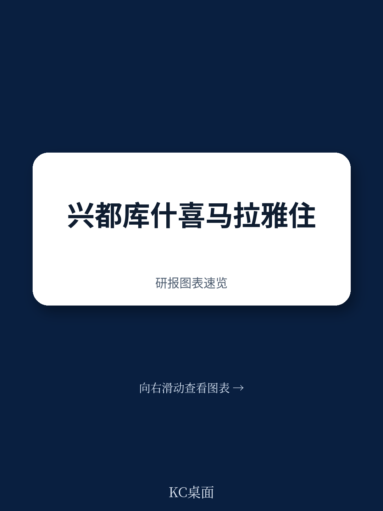
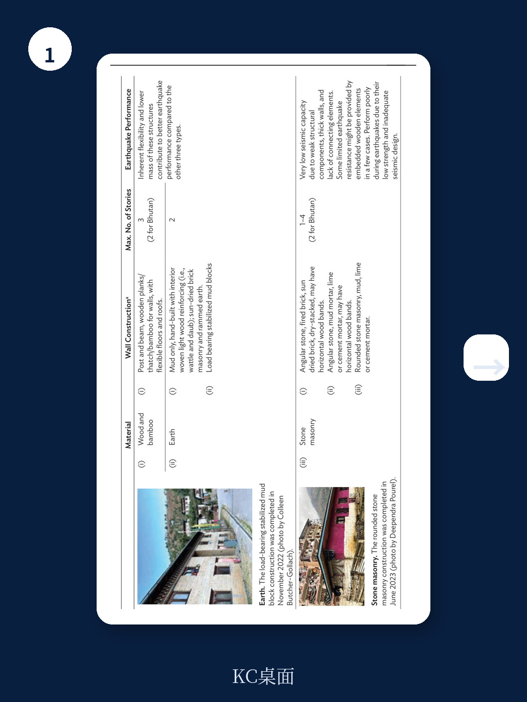
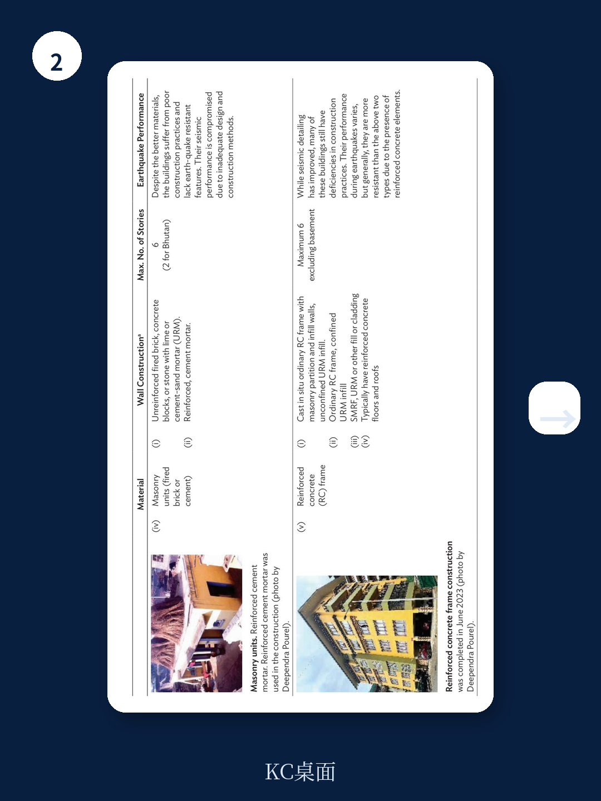

# 亚洲开发银行：喜马拉雅地区住房的真正问题不是短缺，而是抗震与可负担脱节

一份来自亚洲开发银行的工作论文，把目光投向了全球最被低估的住房挑战之一：兴都库什-喜马拉雅地区。这片“亚洲水塔”支撑着超过十亿人的生计，但其快速城市化进程正与极高的地震不确定性正面碰撞。报告的核心判断是，这三个国家（不丹、印度喜马拉雅地区、尼泊尔）的住房市场存在一个系统性的“脱节”——政策、资金与实践三者未能有效衔接，导致最脆弱的群体既住不起安全房，也住不上抗震房。

这不是一份关于“住房短缺”的常规报告。它追问的是：当人口增长最快、地震不确定性最高的区域，恰好也是住房可负担性最差的区域时，传统的供给逻辑是否还站得住脚？

## 1. 人口增长正加速向高不确定性区域集中，而住房供给链条已经阻塞

研究显示，2000年至2015年间，亚洲地震高不确定性区域的人口增长了21%，增速比低不确定性区域快3.4个百分点。这意味着，越来越多的家庭正搬入那些地基不稳、滑坡易发、且缺乏基础设施的土地上。报告点明了住房价值链中的关键瓶颈：公共部门未能提供稳定、可预期的成片住宅用地。如果土地审批周期长、成本高，整个供给链条就会窒息，进而催生非正规聚落。而一旦地震发生，这些聚落往往成为伤亡最惨重的区域。

> **KC评论：** 这份报告提醒我们，住房问题不只是“建多少套”，而是“在哪里建、给谁建、建得够不够安全”。读者可以特别关注报告中关于不丹廷布和普措林租金收入比的数据——平均超过40%的家庭收入用于租房，这已远远超出30%的国际警戒线。

## 2. 抗震成本并非不可承受，但需要“设计换成本”的思维

一个常见的误解是，抗震建筑必然昂贵。报告给出的区间是5%到20%的总造价增幅。但关键在于，通过简单的设计优化——例如降低房间高度、采用规整户型、在适宜区域推广木结构——完全可以抵消这部分增量成本，而不牺牲居住品质。印度“全民住房”计划中的PMAY-U项目，特别是受益者自建模式，提供了一个如何通过补贴来缓冲成本冲击的案例。报告强调，真正缺失的不是技术，而是将抗震意识植入到每一户家庭和每一个小型施工队中的能力。

## 3. 报告没有完全回答的核心问题：传统建筑知识的传承与断裂

报告详细列举了印度喜马拉雅地区多种具有抗震潜力的传统建筑做法，例如石木混合结构、夯土墙与木框架的结合。这些做法在历史上证明了其有效性。然而，报告也承认，这些知识正在流失——年轻一代施工者更倾向于使用混凝土和砖块，而这些材料如果未经专业设计，反而在地震中更危险。这里存在一个尚未被充分解决的矛盾：如何在推广现代抗震标准的同时，不放弃那些经过数代人验证的本地智慧？这不仅仅是技术问题，更是教育、认证和市场激励的复合问题。

## 4. 对观察者的框架：从“供给量”转向“不确定性调整后的可负担性”

这份报告为城市研究者提供了一个更精细的观察框架。传统的“住房可负担性”指标只关注房价收入比或租金收入比。但在这三个国家，一个真正有效的指标应当是“不确定性调整后的可负担性”——即一个家庭在支付了符合抗震标准的住房成本后，是否还能维持基本生活，并且该住房所在地是否避开了已知的地质灾害带。只有当这两个维度同时被满足，住房才算真正“可负担”。报告指出，目前没有任何一个国家的政策完全实现了这种整合。

## 5. 报告尚未完全展开的路径：土地信息与不确定性数据的颗粒度

报告提到了印度尼西亚的InaRisk平台，作为一个将地震不确定性评估可视化并用于城市规划和保险定价的正面案例。但对于不丹、尼泊尔和印度喜马拉雅地区，这种高精度、公开可用的不确定性数据仍然稀缺。没有这些数据，不确定性分区、土地定价和建筑规范的实施都缺乏依据。这是报告留下的一个明确的行动缺口——也是未来研究和技术介入的潜在方向。

---

这份报告的价值不在于给出一个完美的解决方案，而在于把“可负担”和“抗震”这两个长期被分开讨论的议题，重新锁在一起。对于决策者而言，真正的挑战不是建更多的房子，而是建那些在地震后依然能站着的、穷人住得起的房子。

For informational purposes only. Portions may be generated,translated,summarized,or edited with AI assistance based on source materials and may contain omissions or errors. Please verify independently. This is not investment,legal,tax,accounting,or other professional advice.
