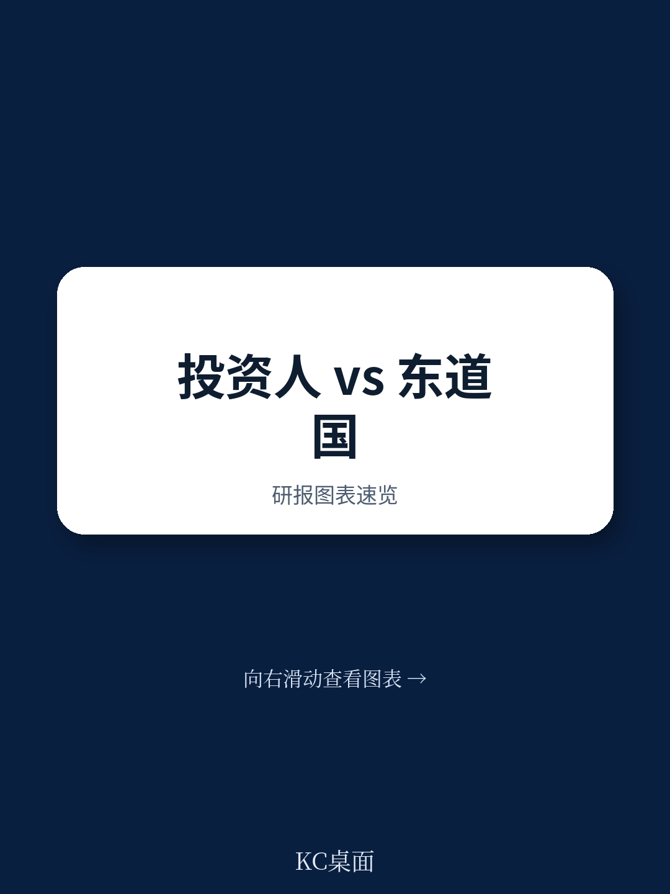

# 亚洲开发银行：政府为何不敢在调解中让步，亚洲开发银行揭示的谈判悖论

国际研究争端解决正在经历一场静默的转向。仲裁成本飙升、周期漫长，调解作为一种低成本、高效率的替代方案，理论上备受推崇。但亚洲开发银行研究所最新政策简报指出，调解在读者与国家间的争端中远未普及，核心障碍并非技术或法律空白，而是政府自身的运作逻辑。

这份报告的价值在于，它没有简单重复“调解很好”的共识，而是系统拆解了为什么政府在调解桌前往往表现得不那么灵活。对于任何在发展中国家有重资产布局、或正面临与东道国摩擦的企业决策者，这是一个值得重新审视的不确定性变量。

## 1. 政府不是企业：问责制与部门利益天然排斥灵活谈判

报告认为，调解的核心优势——灵活性、非公开、结果由双方定制——恰恰与政府运作的底层逻辑相冲突。政府官员高度敏感于问责，任何谈判中的“让步”都可能被审计、国会或公众视为失职。因此，官员倾向于严格遵循授权范围，宁可走完耗时耗力的仲裁程序，也不愿在调解中承担“越权”的不确定性。

更关键的是，研究争端往往跨越多个部门。以报告引用的韩国“孤星产品案”为例，涉及总理办公室、法务部、财政部、外交部等近十个机构。在没有预设协调机制的情况下，没有一个部门愿意牵头或妥协，调解自然难以启动。这意味着，企业在推动调解时，面对的往往不是一个统一的谈判对手，而是一个内部利益碎片化的官僚系统。

## 2. 透明度的悖论：公众监督反而扼杀了和解空间

调解通常要求保密，以鼓励双方坦诚交换信息。但在涉及公共利益的研究争端中——例如采矿权、环境标准或税收优惠——保密几乎不可能。国会、媒体和公民社会要求信息披露。一旦关键条款被公开，政府不仅面临“出卖国家利益”的舆论不确定性，还可能因“最惠国待遇”条款而面临其他读者的同等要求。

报告指出，这种透明度的不确定性，使得政府宁愿在仲裁中硬撑，也不愿在调解中做出看似“特殊”的让步。对于读者而言，这构成一个现实困境：即使调解能达成双赢方案，东道国政府也可能因惧怕政治后果而拒绝签字。调解的成败，有时不取决于法律技术，而取决于东道国国内的政治容忍度。

> **KC评论：** 这解释了为什么许多研究争端最终走向仲裁。不是调解方案需要继续观察，而是东道国政府“不敢”接受一个看起来太好的和解方案。对读者来说，评估调解可行性时，应把东道国国内政治周期和公众情绪作为关键变量。

## 3. 执行力的短板：新加坡公约的覆盖率仍是硬伤

仲裁裁决之所以强势，在于《纽约公约》覆盖172个签约国，执行路径清晰。而调解协议的执行，则依赖《新加坡公约》。截至2026年5月，仅有22个国家批准该公约。报告特别提到，韩国、马来西亚和不丹有望在2026年加入，但整体覆盖率依然过低。

对读者而言，这意味着即便通过调解达成了协议，如果东道国不是新加坡公约缔约国，执行将回归到国内合同法程序，耗时且充满不确定性。这也是为何实践中常出现“调仲结合”模式——将调解结果转化为仲裁裁决，以获取更强的执行力。但这一做法又增加了流程复杂度和成本，部分抵消了调解的效率优势。

## 4. 报告尚未完全回答的关键问题

这份报告对政府端障碍的分析相当透彻，但仍有几个关键问题留给读者自己判断。

第一，调解的“自愿性”在多大程度上构成障碍？报告承认调解是自愿的，但并未深入分析：当东道国政府明确拒绝调解时，读者是否有任何杠杆可以施加不确定性？目前国际研究条约中，强制性调解前置条款仍属罕见。

第二，发展中国家的能力建设如何真正落地？报告建议“有针对性地系统性提升调解意识”，但未讨论具体成本、谁来买单、以及如何避免调解能力建设变成另一套官僚程序。

第三，调解员的素质与中立性如何保障？在商业调解中，调解员的选择相对成熟。但在政府作为一方时，调解员是否具备理解公共政策、财政预算和法律约束的能力，目前缺乏统一标准。

> **KC评论：** 对于正在评估海外研究不确定性的专业人士，这份报告提供了一个实用的观察框架：在审查东道国法律环境时，除了常规的仲裁条款，还应关注该国是否已批准《新加坡公约》、是否有跨部门协调机制、以及过往争端中政府是否表现出调解意愿。这些“软性”指标，往往比法律文本更能预示争端解决的实际走向。

For informational purposes only. Portions may be generated,translated,summarized,or edited with AI assistance based on source materials and may contain omissions or errors. Please verify independently. This is not investment,legal,tax,accounting,or other professional advice.
