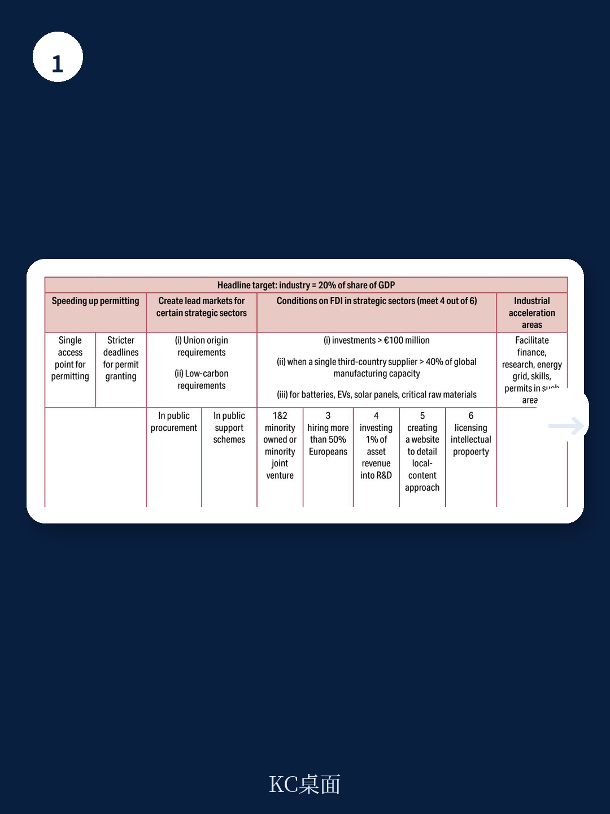
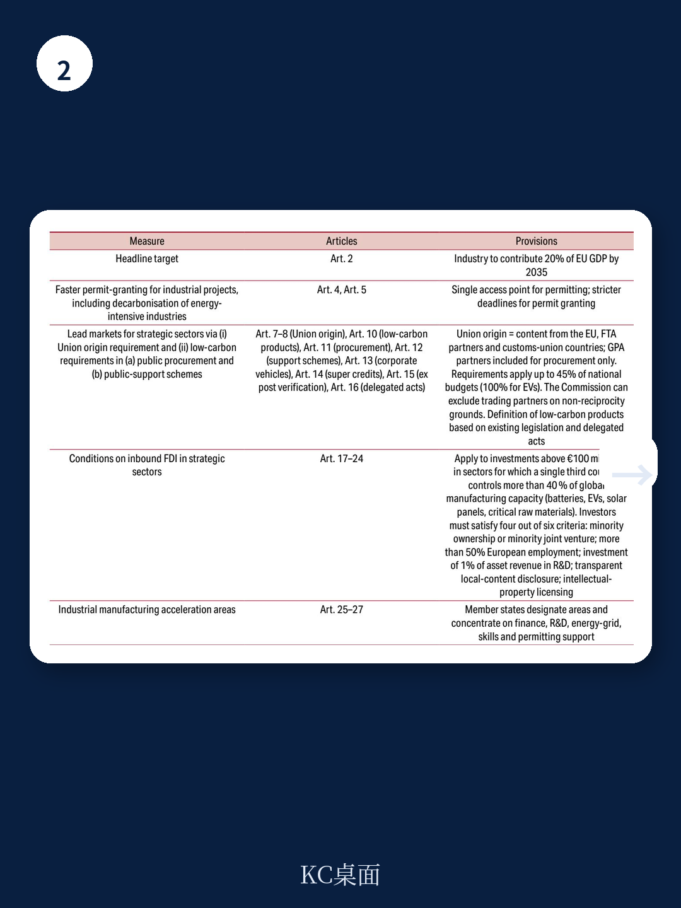

# 布鲁盖尔研究所：中国电池与太阳能主导地位下，欧盟制造目标为何可能扭曲资源配置

欧盟委员会在2026年3月提出的《产业加速法案》（IAA），试图用“欧洲制造”标准重塑清洁技术采购和补贴体系。布鲁盖尔研究所的最新政策简报给出了一个清晰判断：法案方向正确，但三个核心缺陷若不修正，可能适得其反。

这份报告最值得关注的是，布鲁盖尔并非全盘否定IAA，而是指出它在一个关键问题上走错了路——用产地标签替代了真正的脱碳和竞争力标准。报告认为，欧盟每年数千亿欧元的公共采购和补贴支出，不应该绑定在“哪里生产”上，而应该绑定在“多清洁、多可持续”上。

---

## 1. 20%的制造业GDP目标缺乏宏观环境逻辑，可能扭曲资源配置

IAA设定了到2035年制造业占欧盟GDP从14%提升到20%的硬性目标。布鲁盖尔认为，这个数字没有经过严格的成本效益分析，也没有考虑不同成员国和行业的比较优势差异。

一个没有宏观环境逻辑的量化目标，最直接的后果是引导资金流向政治优先级而非市场效率最高的领域。报告提醒，历史上类似的目标导向政策往往导致资源错配，尤其是在全球供应链高度分工的清洁技术领域。

> **KC评论：** 设定一个目标数字本身不是问题，问题在于它可能变成“为了达标而达标”。报告建议欧盟放弃这个目标，转而关注脱碳进度和产业竞争力指标，这更符合市场逻辑。

---

## 2. “欧洲制造”的产地规则将推高成本、延迟脱碳，并面临WTO挑战

IAA的核心争议在于“原产地内容”的定义。对于公共采购，来自与欧盟有自贸协定的国家或世贸组织《政府采购协定》缔约方的产品可视为“等同于欧盟原产”，这实际上排除了中国。但对于公共支持计划，定义进一步收窄到自贸协定伙伴，连美国也被排除在外。

布鲁盖尔指出，这种产地优先的规则存在三重不确定性。第一，它会提高企业和消费者的采购成本——报告引用了一个数据：只有当非欧盟产品价格高出20%至30%以上时，采购方才能绕开产地要求。第二，它可能延迟脱碳进程，因为最便宜的清洁技术产品往往来自非欧盟产地。第三，它很可能在世贸组织遭遇法律挑战，尤其是消费补贴与产地挂钩的部分。

报告特别以电动汽车为例说明问题。欧盟已在反补贴调查后对中国产电动车加征10%至40%的关税，IAA又要求电池和70%的非电池组件必须来自欧盟或等效产地。布鲁盖尔认为，这种叠加保护长期来看会削弱创新动力并推高消费者价格。

> **KC评论：** 报告的洞察在于，欧盟其实已经有更好的工具——比如《净零工业法案》中的“可持续性和韧性”标准——可以实现同样的脱险目标，而不必冒WTO诉讼的不确定性。IAA应该借用现成工具，而不是另起炉灶。

---

## 3. 行业选择缺乏透明论证，且未考虑动态竞争格局

IAA覆盖的行业包括钢铁、水泥、铝、电池、电解槽、热泵、风电和太阳能设备，以及电动汽车。布鲁盖尔认为，这个清单的制定过程不透明，没有公开说明为什么选择这些行业而非其他。

更重要的是，报告指出，这些行业目前占欧盟制造业产出的15%，但全球清洁技术竞争格局正在快速变化。例如，中国在电池和太阳能领域的主导地位已经形成，而欧盟在这些领域的本土产能短期内难以匹敌。如果IAA的规则导致欧盟企业无法获得最便宜的中间品，反而会削弱其终端产品的竞争力。

报告的未完全回答的问题在于：当技术迭代和供应链重构加速时，如何动态调整IAA的行业覆盖范围？目前的立法框架似乎没有为这种灵活性留下空间。

---

布鲁盖尔的结论是，IAA的初衷——加速清洁工业转型——值得支持，但执行方式需要根本性调整。放弃20%的GDP目标、用可持续性标准替代产地规则、确保互惠市场准入而非全面排除、以及保持对绿色能源密集型中间品的开放，这五条建议构成了一个更务实的替代方案。

对读者而言，这份报告提供了一个观察欧盟产业政策的框架：当保护与开放、短期就业与长期竞争力、规则制定与规则遵守之间出现冲突时，政策设计者的取舍逻辑是什么？布鲁盖尔的回答是：选择更透明、更可验证、更不易引发贸易报复的标准，而不是简单贴上“欧洲制造”的标签。

For informational purposes only. Portions may be generated,translated,summarized,or edited with AI assistance based on source materials and may contain omissions or errors. Please verify independently. This is not investment,legal,tax,accounting,or other professional advice.
