# Aggregate Gains from AI and Their Distribution: Global Evidence from Usage Data

Rachel Yuting Fan and Ha Minh Nguyen

WP/26/147

IMF Working Papers describe research in progress by the author(s) and are published to elicit comments and to encourage debate. The views expressed in IMF Working Papers are those of the author(s) and do not necessarily represent the views of the IMF, its Executive Board, or IMF management.

2026
JUL


IMF Working Paper
Institute for Capacity Development

# Aggregate Gains from AI and Their Distribution: Global Evidence from Usage Data

Prepared by Rachel Yuting Fan and Ha Minh Nguyen\*

Authorized for distribution by Mercedes Garcia-Escribano
July 2026

IMF Working Papers describe research in progress by the author(s) and are published to elicit comments and to encourage debate. The views expressed in IMF Working Papers are those of the author(s) and do not necessarily represent the views of the IMF, its Executive Board, or IMF management.

ABSTRACT: How large is the labor cost saved by AI, and how is it distributed across occupations? Using five waves of the Anthropic Economic Index (January 2025 to February 2026), we construct two novel measures from observed AI usage across countries over the world. The AI concentration index (ACI) shows that in developing economies, virtually all AI usage-based value is generated in a small professional enclave (ACI near 1.0); high-income economies average 0.4 to 0.5, with concentration declining in many countries. The labor cost equivalent (LCE) values the time currently saved by AI at \$2.7 trillion annually (3.4% of GDP), an indicative measure of the labor cost of that time. Income and regulatory readiness predict concentration; lacking an official English language slows broadening, a barrier for developing countries.

RECOMMENDED CITATION: Rachel Yuting Fan and Ha Minh Nguyen (2026) “Aggregate Gains from AI and Their Distribution: Global Evidence from Usage Data”, IMF Working Paper 26/147

JEL Classification Numbers:

D63, O33, O14, O12, J31

Keywords: [Type Here]

AI adoption, AI concentration index, occupational composition, technology diffusion, developing countries

Author's E-Mail Address:

hnguyen7@imf.org; yutingf@gmail.com

# Aggregate Gains from AI and Their Distribution: Global Evidence from Usage Data

Rachel Yuting Fan $^{*}$ Ha Nguyen $^{*}$

July 2026

## Abstract

How large is the labor cost saved by AI, and how is it distributed across occupations? Using five waves of the Anthropic Economic Index (January 2025 to February 2026), we construct two novel measures from observed AI usage across countries over the world. The AI concentration index (ACI) shows that in developing economies, virtually all AI usage-based value is generated in a small professional enclave (ACI near 1.0); high-income economies average 0.4 to 0.5, with concentration declining in many countries. The labor cost equivalent (LCE) values the time currently saved by AI at \$2.7 trillion annually (3.4% of GDP), an indicative measure of the labor cost of that time. Income and regulatory readiness predict concentration; lacking an official English language slows broadening, a barrier for developing countries.

Keywords: AI adoption, distributional tilt, AI concentration index, occupational composition, technology diffusion, developing countries
JEL codes: D63, O33, O14, O12, J31

## 1 Introduction

Who benefits from using AI, and how large are the gains? The existing literature has made substantial progress mapping AI's potential reach: exposure indices score occupational tasks against AI capabilities and offer systematic cross-occupation comparisons (Felten et al., 2021; Eloundou et al., 2024). These exposure indices ask which occupations AI could affect; usage data, by contrast, show where adoption is currently occurring. They cannot quantify aggregate gains from realized use, and they were not designed to track how the distributional consequences of AI evolve as adoption spreads across countries and income levels. These questions matter especially for developing economies weighing AI as a development tool.

This paper offers a different approach. Rather than asking which jobs AI could affect, we observe which jobs are using AI, in which countries, and how the pattern is changing. We construct two novel measures from observed AI usage data across over one hundred countries. Our findings reveal that AI's gains flow disproportionately to high-wage occupations. Whether these usage-based gains ultimately accrue to workers or firms may depend on the extent to which AI complements or displaces workers in these occupations, an open question beyond the scope of this paper (Cazzaniga et al., 2024). The concentration is more extreme in developing countries: in Uganda and Cambodia, virtually all AI gains accrue to a small professional enclave, while in Australia and the United Kingdom, gains are spread more broadly. Notably, this concentration is declining as AI spreads beyond its initial software-engineering core into education, sales, and office work.

We use five waves of the Anthropic Economic Index (AEI), a record of one million Claude AI conversations per wave spanning January 2025 to February 2026, geo-located to over 100 countries. Each conversation is matched to an O\*NET occupational task and mapped to one of 22 SOC-2 occupation groups; for cross-country analyses requiring consistent employment and wage data, we crosswalk these to nine ISCO-08 one-digit groups, the finest level at which ILO data are available across countries. This gives us a panel of observed AI usage by occupation across five waves at the global level, and at the country level across three waves (R3 to R5), something unavailable in either survey studies or exposure-index approaches.

This paper makes three contributions. First, we measure aggregate AI gains. We construct a labor cost equivalence (LCE) that values AI's time savings at each country's own wages. Under assumptions about Claude's market penetration described in Section 2.3, we estimate aggregate LCE at approximately \$2.7 trillion annually, $^{1}$ about 3.4\% of the 86 sample countries' combined GDP. $^{2}$ The LCE is best read as an indicative measure of the productivity gains implied by current AI usage, the labor cost of the time AI saves, rather than a direct estimate of GDP impact, which would require additional assumptions about how time savings translate into output and how markets adjust. These aggregate gains reflect two offsetting forces. As AI spreads from software development into education, office work, and sales, the typical AI conversation increasingly serves lower-paid occupations: the usage-weighted average wage fell 5.5% over 13 months. But aggregate LCE is rising, because those lower-wage occupations employ vastly more workers than the software core where AI began. The sheer volume of AI-assisted work more than offsets the lower wage per conversation. The aggregate figure at the global level masks a distributional asymmetry across countries: low-income countries contribute a disproportionately small share of global LCE not only because wages are lower but also because their AI conversations are concentrated in a narrow occupational slice, limiting the employment-scale effect that drives aggregate AI gains elsewhere. This paper does not address labor-market outcomes, including job displacement and wage compression; see Cazzaniga et al. (2024) and Jaumotte et al. (2026), who find that AI exposure and complementarity concentrate displacement risk and reduce employment in some occupations even as wages rise.

Second, we construct an AI concentration index (ACI), adapted from the concentration index in health economics (Wagstaff et al., 1991; Kakwani et al., 1997), that measures whether AI usage is concentrated in higher-paid or lower-paid occupations relative to their employment share. The ACI is positive when AI gains tilt toward the top, negative toward the bottom, and zero when gains are neutral. In nearly every country in every wave, the ACI is positive: AI's gains tilt toward higher-paid occupations. Income shapes how concentrated those gains are. In the high-income United States (ACI 0.49), they are spread relatively broadly across occupations; in low-income Tanzania (ACI 0.98), almost all of them flow to the top of the wage distribution. Professional occupations in Tanzania employ fewer than $5\%$ of workers, so an ACI this high means AI's productivity gains are currently generated primarily in professional occupations, with limited direct engagement from the agricultural, elementary, and service workers who make up most of the labor force. But the tilt is declining in a growing number of countries. Between August and November 2025, 32 of 108 countries, or $30\%$ , saw their ACI fall; between November 2025 and February 2026, the number rose to 53 of 110, nearly half.

Third, we examine what predicts cross-country differences in aggregate AI gains and their concentration. AI regulatory readiness is the dominant predictor of how much AI value a country captures relative to its GDP; economic structure also matters, with more service-oriented economies capturing larger gains. For the ACI level, richer countries and countries with higher regulatory readiness have more broadly distributed AI gains. But what predicts whether concentration is falling is English as an official language, so that sufficient institutional knowledge enters training data for English dominated Large Language Models to provide accurate and reliable assistance across a broader range of occupations.

The paper connects to four strands of literature. First, and most directly, it contributes to measuring AI adoption and its economic consequences. Survey-based studies ask firms whether they use AI: Bonney et al. (2024) track US firm-level adoption rates through the Census Bureau's Business Trends and Outlook Survey, while Yotzov et al. (2026) pool parallel firm surveys across four countries (US, UK, Germany, Australia) and find that most firms report no measurable impact on employment or productivity so far. These surveys capture adoption at the firm level but cannot observe which tasks AI performs or how time savings distribute across the wage ladder. Second, exposure-index studies map AI capabilities to occupational task descriptions to measure which jobs AI could affect: Felten et al. (2021) construct an AI Occupational Exposure index linking AI application areas to O\*NET abilities, while Eloundou et al. (2024) estimate the share of tasks where LLMs could reduce completion time by at least 50%. Cazzaniga et al. (2024) extend this approach across 142 countries, finding that advanced economies face greater exposure but are better positioned to benefit thanks to stronger digital infrastructure and human capital. These indices ask which occupations AI could affect; we use observed conversation data to show where adoption is currently occurring, for whom, and how the pattern shifts over time. Third, micro-level experiments find that AI raises productivity by 15 to 40%, with gains concentrated among lower-skilled workers within a given setting: Brynjolfsson et al. (2025) show that an AI assistant in a customer-service call center raised productivity by 15% on average, with the largest gains among less experienced and lower-skilled agents; Noy & Zhang (2023) find that access to ChatGPT reduced time on writing tasks by 40% and compressed the quality distribution, benefiting lower-ability workers most.

This paper complements Fan (2026), which uses the same data to document cross-country variation in AI adoption intensity and breadth; we use the occupational composition of that usage to measure aggregate gains and their distribution. Fourth, we contribute to the technology-diffusion literature (Comin and Hobijn, 2010) by providing the first multi-wave cross-country evidence on how AI usage composition evolves, not just adoption levels. Previous work measured how the internet (Hjort & Poulsen, 2019) and mobile phones (Aker & Mbiti, 2010) reshaped labor markets across countries; the contrast with AI is instructive. Those technologies diffused across a wide range of occupations, whereas AI usage so far is concentrated in a narrower set of higher-paid occupations, especially in developing economies. $^{3}$

## 2 Data and Methodology

## 2.1 Data

Anthropic Economic Index. We use five releases of the Anthropic Economic Index (AEI), $^{4}$ spanning January 2025 to February 2026. Each release samples one million Claude AI conversations. Anthropic's own classifier maps each conversation to an O\*NET occupational task, providing a record of observed AI usage rather than potential exposure. The first two waves (R1 and R2) report AI usage by occupation for the world as a whole, with no country-level breakdown. From the third wave onward (R3 in August 2025, R4 in November 2025, and R5 in February 2026), conversations are also geocoded to countries. In R5, for example, 176 countries receive a geographic code, of which 117 meet Anthropic's minimum-conversation threshold for task enrichment and enter the analysis. $^{5}$ Figure 1 shows the full breakdown of the R5 sample, from one million conversations down to the final analysis set. The data cover consumer-stream Claude.ai web conversations only $^{6}$ and exclude enterprise API usage. $^{7}$

Occupation mapping. Anthropic's classification system maps each conversation to a specific O\*NET occupational task that can be mapped to occupation groups. $^{8}$ We further crosswalk the AEI's 22 SOC-2 occupation groups to nine ISCO-08 one-digit groups, the finest level at which the ILO provides consistent employment and wage data across countries. $^{9}$

Time estimates. In R4 and R5, the AEI reports task-level time estimates: time to complete a task without AI and time with AI assistance. The difference gives hours saved per conversation ( $h_t$ ). These estimates are different but stable across waves, with hours saved highly correlated between R4 and R5. $^{10}$ R3 does not report these estimates; we apply the R4 values, the nearest wave with time data, to extend the analysis to R3. Section 3.4 bounds the influence of these model-based estimates on the aggregate LCE, which remains within \$2.5 to \$2.9 trillion. Table 1 illustrates the range. Software tasks save roughly 3.2 hours per conversation; customer-service tasks save roughly 0.3 hours.

Table 1: Illustrative hours saved per conversation ( $h_{t}$ ), R5 (February 2026)

<table><tr><td>O*NET task</td><td>Occupation</td><td>Human only</td><td>With AI</td><td>Saved</td></tr><tr><td>Modify existing software</td><td>Computer &amp; Math</td><td>3.54 hrs</td><td>17.8 min</td><td>3.24 hrs</td></tr><tr><td>Assist students with coursework</td><td>Education</td><td>2.82 hrs</td><td>17.6 min</td><td>2.52 hrs</td></tr><tr><td>Write press releases</td><td>PR / Media</td><td>1.54 hrs</td><td>14.5 min</td><td>1.30 hrs</td></tr><tr><td>Advise on drug interactions</td><td>Healthcare</td><td>1.19 hrs</td><td>10.4 min</td><td>0.97 hrs</td></tr><tr><td>Answer customer questions</td><td>Customer service</td><td>0.35 hrs</td><td>3.4 min</td><td>0.29 hrs</td></tr></table>

```csv
1,000,000 conversations
geo_id = country code: 805,387 (176 countries)
WITH ONET breakdown: 801,151 (117 countries)
ONET classified: 565,455
Mapped to task: 533,094
"none": 32,361
onet_task = "not_classified": 235,696
WITHOUT ONET breakdown: 4,236 (59 countries)
e.g. "Write a Python function to sort a list"
e.g. "What is the weather?"
Small-cell suppression: "(country, task) intersections with < 15 conversations and 5 unique user accounts" (Appel et al., 2025; 2026)
"Minimum Observations: 200 conversations per country, applied in enrichment step" (Anthropic, 2026)
e.g. Malta, Iceland
geo_id = "NONE": 2,340
IP geolocation returned no country; possibly VPN/anycast/hosting
ONET classified: 963
Mapped to task: 895
"none": 68
onet_task = "not_classified": 1,377
geo_id = "not_classified": 181,586 [no ONET breakdown]
Possibly countries below 200-conversation threshold (Anthropic, 2026)
No country-level data: 10,687
```

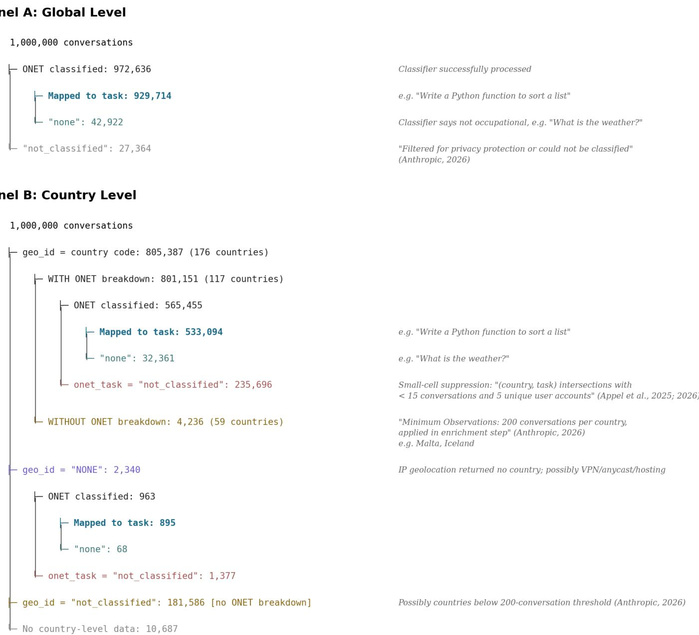

```txt
Classifier successfully processed
e.g. "Write a Python function to sort a list"
Classifier says not occupational, e.g. "What is the weather?"
"Filtered for privacy protection or could not be classified" (Anthropic, 2026)
```

```csv
Panel A: Global Level
1,000,000 conversations
ONET classified: 972,636
Mapped to task: 929,714
"none": 42,922
"not_classified": 27,364
```

## Panel B: Country Level

Figure 1: Sample structure tree (R5, February 2026). Panel A shows the global classification pipeline: 972,636 of 1,000,000 conversations are classified by the ONET classifier, of which 929,714 map to an occupational task. Panel B shows the country-level breakdown: 176 countries receive a geographic code (805,387 conversations), of which 117 receive ONET task enrichment (801,151 conversations).

Country and wage coverage. The 117 sample countries span the full income spectrum, from the United States and Germany to India, Vietnam, and Uganda, covering $79\%$ of world GDP. One notable exclusion is China, where Anthropic does not operate. The ACI ranks occupations by each country's own wages rather than by US wages, so each country's concentration of AI gains is measured against its own wage ladder. Country-level employment shares and occupation wages are from ILOSTAT (2024 or latest available year). Of the 117 countries, 86 have direct ILO employment and wage data at the ISCO-1 level, covering 67% of world GDP; these form our baseline regression sample. $^{[11]}$ We provide two versions of the aggregate LCE. The baseline uses only these 86 sample countries. The expanded version covers 115 of the 117 task-enriched countries, $^{[12]}$ by substituting employment or wage data from a matched peer country wherever a country's direct ILO data are incomplete. $^{[13]}$ Section 3.5 re-estimates the regressions on this expanded sample as an extension and reaches the same conclusions.

Country characteristics. GDP figures are from the IMF World Economic Outlook (April 2026). The denominator of the labor-cost-equivalent-to-GDP ratio is nominal GDP in current US dollars for 2025, and the income control in the regressions is GDP per capita at purchasing power parity (PPP) for 2025; both are in 2025 values. The remaining covariates come from several sources. From the World Bank WDI: the unemployment rate, services value added (\% GDP), and the share of individuals using the internet (\%). Income inequality is the disposable-income Gini coefficient (most recent year available per country) from the Standardized World Income Inequality Database (Solt, 2020). From the IMF: AI regulatory readiness, the regulatory sub-index of the AI Preparedness Index (Cazzaniga et al., 2024). The AI Preparedness Index spans other dimensions of readiness beyond regulation that may also act as barriers to AI diffusion in developing countries; only the regulatory sub-index enters the regressions, as the other dimensions are too collinear with income to enter separately. We also construct a binary indicator for whether English is an official or de facto official language. We use official-language status rather than English proficiency because the relevant channel is not conversational fluency (modern LLMs converse in dozens of languages) but whether a country's institutional knowledge base is well represented in the training data of English-dominant large language models.

## 2.2 Sample structure and AEI waves

Each AEI wave samples approximately 1 million Claude AI conversations, but country counts and classification rates differ across waves. Table 2 lists the five releases, and Table 3 reports the full sample structure by wave.

Table 2: AEI releases used in this paper.

<table><tr><td>Release</td><td>Observation window</td><td>Geographic coverage</td><td>Global total</td><td> $N^{*}_{country}$ </td></tr><tr><td>R1</td><td>~Jan 2025</td><td>Global only</td><td> $\sim 1$  million $^{a}$ </td><td>n/a</td></tr><tr><td>R2</td><td>~Mar 2025</td><td>Global only</td><td> $\sim 1$  million $^{a}$ </td><td>n/a</td></tr><tr><td>R3</td><td>Aug 4 to 11, 2025</td><td>Global + 114 countries</td><td>964,494</td><td>602,175</td></tr><tr><td>R4</td><td>Nov 13 to 20, 2025</td><td>Global + 117 countries</td><td>999,875</td><td>609,954</td></tr><tr><td>R5</td><td>Feb 5 to 12, 2026</td><td>Global + 117 countries $^{b}$ </td><td>1,000,000</td><td>565,455</td></tr></table>

Notes: “Global total” is the sum of all onet\_task\_count at the global level. $N_{country}^{*}$ is the classified country-level conversations, including those classified as “none,” summed across all countries with ONET task breakdown. $^{a}$ R1 and R2 report task percentages only; Anthropic describes each as “approximately one million conversations.” $^{b}$ 176 countries receive a geographic code in R5; 117 receive ONET task breakdown. The remaining 59 countries lack task-level breakdown. See Figure 1 and Table 3 for the full R5 sample breakdown.

Table 3: Sample structure by wave: global and country-level conversation counts, classified totals, and analysis sample sizes.

<table><tr><td></td><td>R1</td><td>R2</td><td>R3</td><td>R4</td><td>R5</td></tr><tr><td colspan="6">Panel A: Global</td></tr><tr><td>Global total</td><td>~1M</td><td>~1M</td><td>964,494</td><td>999,875</td><td>1,000,000</td></tr><tr><td> $N^{*}$ </td><td>~ $1Ma$ </td><td>~ $1Ma$ </td><td>941,239</td><td>972,146</td><td>972,636</td></tr><tr><td>of which onet_task = “none”</td><td> $0.5\%^{a}$ </td><td> $1.8\%^{a}$ </td><td>55,132</td><td>37,119</td><td>42,922</td></tr><tr><td>onet_task = “not-classified”</td><td> $0^{a}$ </td><td> $0^{a}$ </td><td>23,255</td><td>27,729</td><td>27,364</td></tr><tr><td colspan="6">Panel B: Country level</td></tr><tr><td>ISO countries with ONET data</td><td>n/a</td><td>n/a</td><td>114</td><td>117</td><td>117</td></tr><tr><td> $N^{*}_{country}$ (classified)</td><td>n/a</td><td>n/a</td><td>602,175</td><td>609,954</td><td>565,455</td></tr><tr><td>onet_task = “not-classified” (country)</td><td>n/a</td><td>n/a</td><td>206,927</td><td>229,240</td><td>235,696</td></tr><tr><td colspan="6">Panel C: ACI analysis sample (86 sample countries)</td></tr><tr><td>Countries in ACI analysis</td><td>n/a</td><td>n/a</td><td>83</td><td>85</td><td>86</td></tr><tr><td>ΔACI: R3→R4</td><td></td><td></td><td></td><td>82</td><td></td></tr><tr><td>ΔACI: R4→R5</td><td></td><td></td><td></td><td></td><td>84</td></tr><tr><td>Countries in all 3 waves</td><td></td><td></td><td></td><td>81</td><td></td></tr></table>

Notes: $N^{*}$ and $N_{country}^{*}$ are classified conversation counts: conversations mapped to an ONET task plus those classified as onet\_task = “none” (not occupational). $^{a}$ R1 and R2 report task percentages only. Panel C is restricted to the 86 sample countries used in the baseline regressions (Table 5); countries relying on peer-country imputation are excluded. The robustness sample including peer-matched countries covers up to 114 countries (Table 6).

## 2.3 Methodology

Labor cost equivalent. Let $h_{t}$ denote the hours saved by using AI per conversation on task t and $C_{total,w}$ the estimated total AI conversations per week across all platforms in wave w. For each task, we estimate how many hours AI saves per conversation, scale up to the total number of AI conversations economy-wide, and value each saved hour at the occupation's hourly wage. The labor cost equivalent of each country's time savings at its own ILO wages is: $^{14}$

$$
\mathrm{LCE} = \sum_ {c} \sum_ {s} \sum_ {t \in s} \frac {n _ {c , t}}{N _ {\mathrm{country}} ^ {*}} \times C _ {\mathrm{total}, w} \times h _ {t} \times \frac {W _ {c , s} ^ {\mathrm{monthly}} \times 1 2}{2 , 0 8 0}\tag{1}
$$

where $n_{c,t}$ is the number of classified conversations on task t in country c, $W_{c,s}^{monthly}$ is the ILO mean monthly wage in nominal USD for occupation s in country c, and $N_{country}^{*} = \sum_{c} \sum_{t} n_{c,t}$ is the total number of classified country-level conversations, equal to 565,455 in R5. Box 2 works through this calculation for a single task (“modify existing software”), showing how conversation counts, hours saved, and wages combine to produce the aggregate estimate. The LCE is best read as an indicative measure of the productivity gains implied by current AI usage rather than a strict bound: valuing every classified conversation at its full estimated time saving tends to overstate realized gains, while excluding enterprise API usage entirely (Section 4) tends to understate the total, so the net direction of bias is ambiguous.

Parameters. Table 4 defines the quantities entering Eq. (1).

Table 4: Parameters of the labor cost equivalent (Eq. 1).

<table><tr><td>Symbol</td><td>Definition</td><td>Source</td><td>Scope</td><td>Wave status</td></tr><tr><td> $n_{c,t}/N^{*}_{country}$ </td><td>Fraction of country-level classified conversations on task  $t$  ( $N^{*}_{country} = 565,455$  in R5); multiply by  $C_{total,w}$  for estimated actual conversations</td><td>AEI</td><td>Country</td><td>Observed every wave; varies</td></tr><tr><td> $h_{t}$ </td><td>Hours saved per conversation on task  $t$ : human-only completion time minus human-with-AI completion time (e.g.,  $3.54 - 0.30 = 3.24$  hours for “modify existing software”)</td><td>AEI</td><td>Global</td><td>R4 and R5 observed; R3 imputed from R4</td></tr><tr><td> $W^{monthly}_{c,s}$ </td><td>ILO mean  $monthly$  wage in nominal USD for ISCO-1 occupation  $s$  in country  $c$  (Eq. 1); matched-peer fallback for 31 countries</td><td>ILOSTAT</td><td>Country</td><td>Varies by country</td></tr><tr><td>2,080</td><td>Annual working hours ( $40$  hrs  $\times$  52 weeks); divides  $W^{annual}$  or  $W^{monthly} \times 12$  to convert to hourly</td><td></td><td></td><td>Constant</td></tr><tr><td> $C_{total}$ </td><td>Total AI conversations per week across all platforms =  $200M/0.25 \approx 800$  million</td><td>Public data</td><td>Global</td><td>Approximate</td></tr></table>

Denominator treatment. Some conversations are labeled “not\_classified” in the AEI data. At the global level, 2.7% of conversations (27,364 out of 1,000,000) are not\_classified, either because the content was privacy-filtered or because it could not be reliably matched to any O\*NET occupational task. At the country level, the not\_classified rate is much higher: 29.4% of ONET-enriched country-level conversations (235,696 out of 801,151 across 117 countries). Of these, roughly 208,000 were successfully classified at the global level but not at the country level. The gap arises primarily because of small-cell suppression: conversations that are successfully classified at the global level are reclassified as not\_classified in a given country’s data when the task-level count within that country falls below Anthropic’s privacy threshold. $^{15}$ Because these conversations lack a country-level task assignment, they cannot enter the LCE or ACI calculations. Not all classified conversations carry a country tag: of the 236,000 conversations that were not classified at the country level, roughly 208,000 were classified to occupations at the global level, suggesting their task distribution resembles that of tagged conversations. We therefore scale from country-tagged conversations only ( $N_{country}^{*}$ ), which redistributes the untagged volume proportionally rather than treating it as zero.

Scaling from Claude to all AI platforms requires two parameters: total Claude.ai conversations per week ( $\approx$ 200 million, derived from 18.9 million monthly active users) and Claude's share of professional AI conversations ( $\approx$ 25%, based on enterprise market-share data). This yields $C_{total,w} \approx$ 800 million/week in R5, scaled proportionally across earlier waves using SimilarWeb website traffic data. $^{16}$ These scaling assumptions affect only the level of the LCE; the ACI and all regression results are unaffected, as they depend only on the relative distribution of AI time savings across occupations.

Box 1 states the key assumptions behind the LCE.

## Box 1: Key assumptions

A1. $h_{t}$ is at the task level. Within-task heterogeneity is absorbed into the average.

A2. $h_{t}$ is estimated by Claude, not measured. Both time variables (human-only and human-with-AI) are AI estimates, introducing potential bias.

A3. Each hour saved is valued at the occupation's hourly wage. This assumes that time saved on a task is worth what a worker in that occupation would have been paid for that time.

A4. $W_{s}$ is held constant.

A5. $C_{total}$ varies by wave. For R5 (Feb 2026), $C_{total} \approx 800$ million AI conversations per week across all platforms (200M Claude / 25% market share). For earlier waves, we scale proportionally using claude.ai monthly website traffic as a proxy for total conversations: R3 (Aug 2025) $\approx 414M/week$ , R4 (Nov 2025) $\approx 489M/week$ .

## Box 2: Worked example: “modify existing software” (R5, one week)

This task (O\*NET 15-1132, Software Developers) accounts for 41,586 of the 972,636 classified global conversations (4.276%). With $C_{\text{total}} = 800$ million (all AI platforms):

• Estimated conversations this week: $0.04276 \times 800,000,000 = 34,211,000$

\- Human-only time: 3.54 hours. Human-with-AI time: 0.30 hours.

\- Hours saved per conversation: $3.54 - 0.30 = 3.24$ hours.

\- Total hours saved: $34,211,000 \times 3.24 = 110,844,000$ hours.

\- Hourly wage (Computer & Math, BLS): \$105,850/2,080 = \$50.89/hr.

\- Dollar value this week: 110,844,000 × \$50.89 = \$5.64 billion.

\- Annualized: \$5.64B × 52 = \$293 billion.

AI concentration index. For each country c in wave w, we ask whether AI's time savings flow disproportionately to higher- or lower-paid occupations. Like a Gini coefficient, the ACI captures a distribution in a single number, but it ranks occupations by wage and measures AI gains instead of income. Adapted from the concentration index in health economics (Wagstaff et al., 1991), it is:

$$
\mathrm{ACI} _ {c, w} = \frac {2}{\mu_ {c , w}} \sum_ {s} g _ {c, s, w} \left(R _ {c, s} - \frac {1}{2}\right) e _ {c, s}\tag{2}
$$

where $g_{c,s,w} = \sum_{t \in s} n_{c,t} h_t / \sum_{\text{all } t} n_{c,t} h_t$ is the ratio of hours saved by AI conversations in occupation s to hours saved across all occupations in country c; $e_{c,s}$ is the ratio of employment in occupation s to total employment in country c; $R_{c,s}$ is occupation s's fractional rank in the country's own wage distribution; and $\mu_{c,w} = \sum_{s} g_{c,s,w} e_{c,s}$ is the employment-weighted mean AI boost. The index ranges from -1 to +1: positive when gains tilt toward high-wage occupations, negative toward low-wage, zero when proportional to employment. It can turn negative when AI concentrates in low-wage occupations. $^{17}$

Regressions. We estimate three sets of OLS regressions. The first asks what predicts how much AI value a country captures relative to its GDP (LCE as a percentage of GDP in R5). The second asks what predicts the level of AI concentration (ACI pooled across the three country-level waves). The third asks what predicts whether concentration is rising or falling (change in ACI across consecutive waves). Each regression is shown in a parsimonious specification with GDP per capita only and a full specification with all covariates; progressive specifications are in Appendix Tables A3 to A5.

## 3 Results

The results tell a story in three parts. First, AI's aggregate productivity value is large and growing, driven not by each conversation becoming more valuable but by AI reaching occupations that employ far more workers. Second, these gains are unequally distributed: in nearly every country, they initially tilt toward high-wage occupations, with greater concentration in developing economies, though the tilt is declining. Third, regressions suggest that income and AI regulatory readiness predict the level of concentration, but not the trajectory: what predicts whether concentration is falling is whether a country's official or de facto official language is English, so that its institutional knowledge base is well represented in the training data of English-dominant large language models.

## 3.1 Aggregate AI gains

Wage index. The wage index, computed at the global level, is the usage-weighted average occupation-level wage of an AI conversation:

$$
\mathrm{WageIndex} = \frac {\sum_ {s} \left(\sum_ {t \in s} n _ {t}\right) \times W _ {s} ^ {\mathrm{annual}}}{\sum_ {s} \sum_ {t \in s} n _ {t}}\tag{3}
$$

where t indexes O\*NET tasks, s indexes occupations, $n_{t}$ is the global number of AEI conversations on task t, and $W_{s}^{annual}$ is the BLS median annual wage for SOC-2 occupation s. $^{18}$ We use US BLS wages rather than country-specific wages because the AEI classifies tasks at the SOC-2 level, the native BLS classification, and BLS provides a consistent occupational wage anchor across all five waves, enabling clean comparisons over time. The wage index tracks whether AI is moving into higher- or lower-wage occupations over time.

The blue line in Figure 2 plots the wage index across the five AEI waves. The wage index declines steadily: from \$82,353 in January 2025 to \$77,845 in February 2026 (5.5%), as Computer & Math lost 4.9 percentage points of global AI conversation share while Education (+4.1 pp), Sales (+2.7 pp), and Office/Admin (+1.6 pp) gained. These are lower-wage occupations, so each conversation is worth less in dollar terms over time.

(a)  
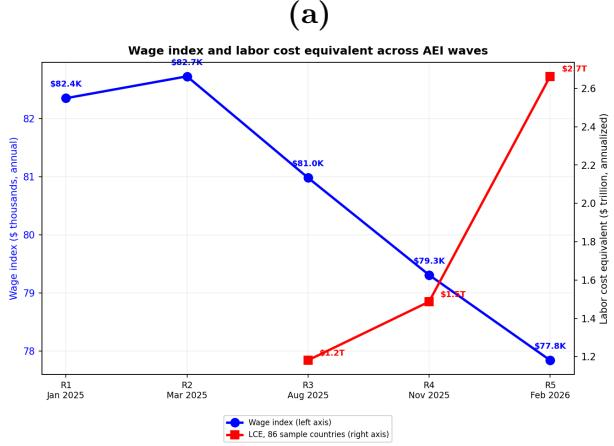

(b)  
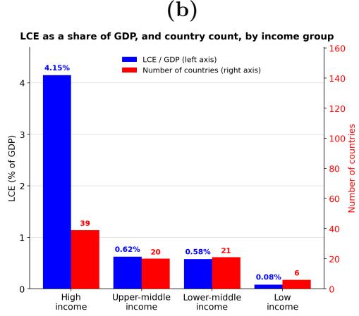  
Figure 2: Aggregate AI gains: scale, trend, and incidence by income. Panel (a) (R1 to R5, Jan 2025 to Feb 2026): the blue line (left axis) is the wage index, the average US occupation-level wage weighted by global AI conversation shares; the red line (right axis) is the annualized LCE for the 86 sample countries, at each country's own ILO wages (Eq. 1). Panel (b): blue bars (left axis) show LCE as a share of GDP in R5, computed as total LCE over total GDP within each income group; red bars (right axis) show the number of the 86 sample countries in each group.

The LCE moves in the opposite direction: from 1.2 trillion annualized in R3 to 2.7 trillion in R5 (3.4% of GDP) for the 86 sample countries. $^{19}$ The divergence between the falling wage index and the rising LCE reflects the employment-scale effect: low-wage occupations employ far more workers. As AI spreads into education and office work, the absolute hours saved multiply even as the per-hour value declines.

The LCE increase splits, directly from Equation 1, into two margins: the growth in the number of AI conversations (the extensive margin) and the change in the value of each conversation (the intensive margin). The extensive margin drives most of the increase, and its role grows over time: it accounts for about 72% of the increase from R3 to R4 and about 84% from R4 to R5, with the intensive margin making up the rest (about 28%, then 16%). $^{20}$

The aggregate gains are themselves steeply tilted by income (Figure 2b). Relative to GDP, AI's measured gains are about seven times larger in high-income countries (4.2% of GDP) than in middle-income economies (roughly 0.6%), and an order of magnitude larger again than in low-income countries (0.1%). High-income countries account for 96% of the total LCE while employing a far smaller share of the world's workers. This between-country pattern in the level of gains complements the within-country concentration captured by the ACI: AI's realized value is currently concentrated both across countries, toward richer ones, and, within countries, across higher-paid occupations.

The LCE estimates are sensitive to scaling assumptions: replacing the median scenario with conservative assumptions yields \$1.6 trillion, while an aggressive scenario yields \$6.1 trillion. The median scenario assumes 200 million Claude conversations per week and a 25% market share; the conservative scenario uses 150 million conversations and a 35% share; the aggressive scenario uses 250 million and a 15% share. Appendix Table A2 reports the full sensitivity grid. The LCE should be interpreted as an indicative measure of the productivity gains implied by current AI usage: it values time saved at prevailing wages, but time freed by AI does not mechanically translate into output growth.

These scaling assumptions affect only the level of the LCE, not its distribution across occupations. The distributional results are therefore unaffected, because the ACI and every regression based on it depend only on the relative distribution of AI time savings across occupations, not on their absolute level.

Why do some countries capture more AI value than others? Richer countries do, relative to GDP, as Figure 3a visualizes; Section 3.3 examines the cross-country determinants formally.

Labor cost equivalent as share of GDP versus GDP per capita (R5, Feb 2026)  
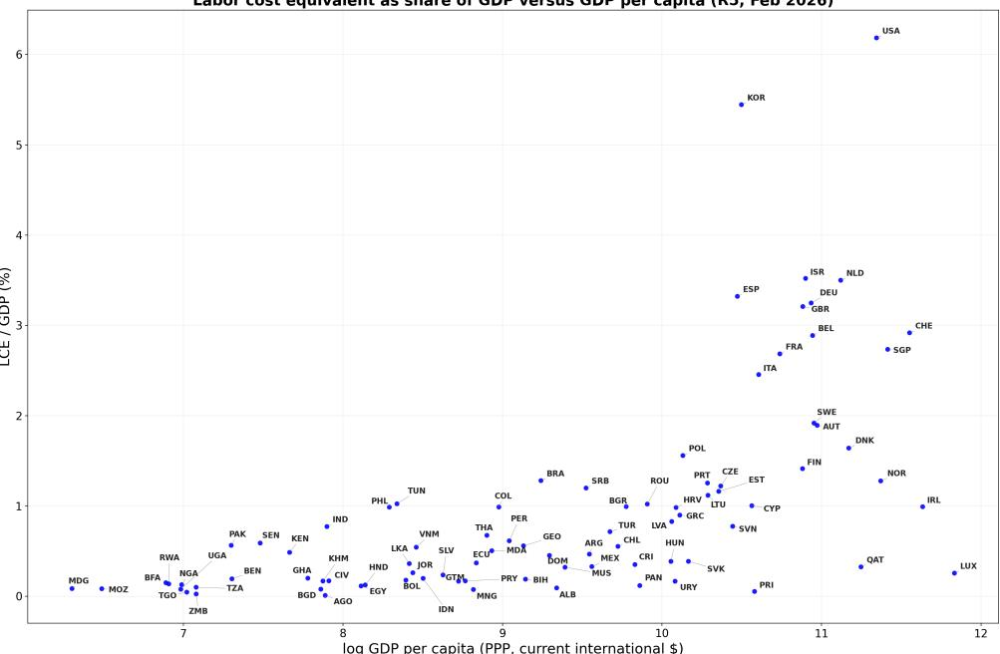  
(a) Panel A: LCE as a share of GDP versus GDP per capita.

AI Concentration Index versus GDP per capita (R5, Feb 2026)  
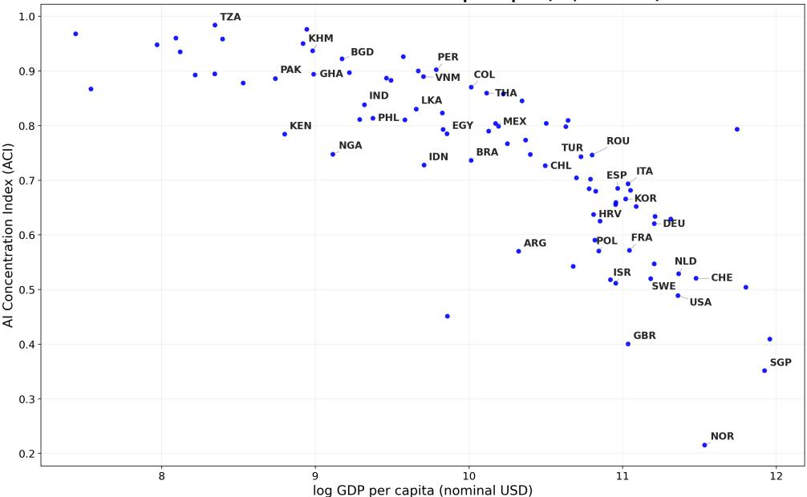  
(b) Panel B: AI concentration index versus GDP per capita.  
Figure 3: AI gains and their distribution (R5, Feb 2026). Both panels use R5 data (February 2026) and the 86 sample countries.

## 3.2 How AI's gains are distributed: the AI concentration index

Within each country, AI's time savings are not spread evenly across occupations: they concentrate in some occupation groups and bypass others. Appendix Figure A1 previews this concentration visually for six countries. Each map arranges the occupation groups as a network. A node's size reflects how heavily the country uses AI in that group, and a red outline marks the groups where its share of AI use exceeds the global average. In the United States, the red-outlined nodes are spread across the network, covering not only software and STEM but also business, office, healthcare, and education, so AI use reaches a broad swath of the occupational structure. In India, the active nodes cluster tightly in a software-and-STEM core, leaving most of the occupational space dark. The narrower and more top-heavy this active set, the more AI's gains concentrate in a few high-paid occupations. The AI concentration index (ACI) turns this breadth-versus-concentration distinction into a single number.

In nearly every country in every wave, AI's gains are tilted toward higher-paid occupations, but the degree of concentration varies widely across countries and is declining over time.

Figure 4 illustrates this for six countries using AI concentration curves, adapted from the Lorenz curve framework. In each panel, nine ISCO-1 occupation groups are ordered from lowest-paid to highest-paid using ILO wages. The horizontal axis accumulates employment shares; the vertical axis accumulates AI time savings. If AI's gains were distributed proportionally to employment, the curve would follow the 45-degree line. It falls below the diagonal wherever the lower-paid occupations counted so far capture less than their employment share of the gains, and rises above it wherever they capture more; the pink shading marks these areas between the curve and the diagonal. The ACI is proportional to the net signed area, the area below the diagonal minus the area above it: the larger it is, the more AI's gains concentrate among higher-paid occupations.

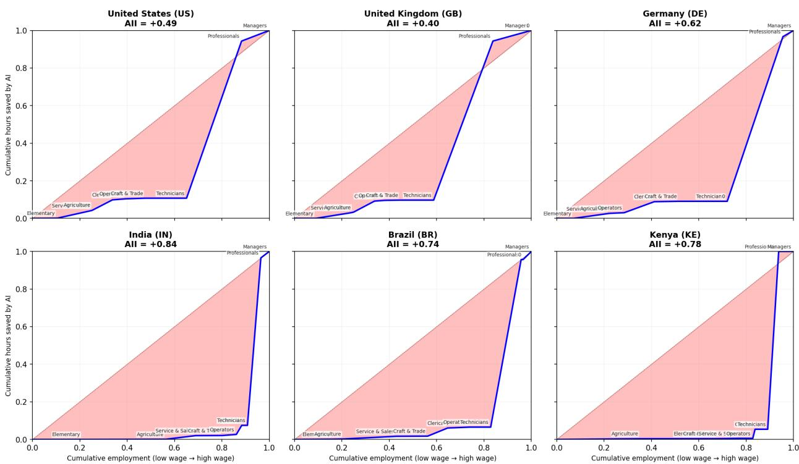  
Figure 4: Who captures AI's time savings? AI concentration curves for six countries (R5, Feb 2026). Each panel plots nine ISCO-1 occupation groups ordered by wage levels. All six are among the 86 sample countries. Country codes are ISO 3166-1 alpha-3.

In the United States, where the ACI is 0.49, the curve is below the diagonal but not extreme: Clerical, Service & Sales, and Craft & Trade workers together capture a visible portion of AI time savings, consistent with AI spreading into office and front-line work. In India, with an ACI of 0.84, and Kenya, at 0.78, the curve is nearly flat until Managers and Professionals at the top of the wage ladder, where it shoots upward: nearly all AI time savings flow to a small professional enclave employing fewer than 10% of workers. The cross-country variation in the ACI captures this distributional difference in a single number. Box 3 works through the calculation of the ACI for the United States.

## Box 3: Calculating the AI concentration curve (United States, R5)

Step 1. For each ISCO-1 group s, compute the share of AI time savings: $g_{c,s} = \sum_{t \in s} n_{c,t} h_t / \sum_{\text{all } t} n_{c,t} h_t$ . For the US in R5: Professionals 84%, Managers 6%, Clerical 5%.  
Step 2. Rank ISCO-1 groups by ILO wage (nominal USD):

<table><tr><td>ISCO-1 Group</td><td>ILO wage</td><td>Emp share</td><td>g share</td><td>Cum emp</td><td>Cum g</td></tr><tr><td>Elementary Occupations</td><td>$41,263</td><td>10.5%</td><td>0.1%</td><td>10.5%</td><td>0.1%</td></tr><tr><td>Service &amp; Sales</td><td>$42,904</td><td>14.6%</td><td>4.1%</td><td>25.1%</td><td>4.2%</td></tr><tr><td>Skilled Agriculture</td><td>$43,895</td><td>0.4%</td><td>0.2%</td><td>25.5%</td><td>4.4%</td></tr><tr><td>Clerical Support</td><td>$50,395</td><td>8.3%</td><td>5.4%</td><td>33.8%</td><td>9.9%</td></tr><tr><td>Plant &amp; Machine Ops.</td><td>$53,990</td><td>5.7%</td><td>0.6%</td><td>39.5%</td><td>10.4%</td></tr><tr><td>Craft &amp; Trade</td><td>$60,973</td><td>8.2%</td><td>0.3%</td><td>47.7%</td><td>10.7%</td></tr><tr><td>Technicians</td><td>$74,870</td><td>17.4%</td><td>0.0%</td><td>65.1%</td><td>10.7%</td></tr><tr><td>Professionals</td><td>$98,047</td><td>23.2%</td><td>83.6%</td><td>88.3%</td><td>94.3%</td></tr><tr><td>Managers</td><td>$119,441</td><td>11.7%</td><td>5.7%</td><td>100%</td><td>100%</td></tr></table>

Step 3. Plot cumulative employment share (x-axis) against cumulative AI gains share (y-axis). At 65% of employment (through Technicians), only 10.7% of AI gains have accumulated. Professionals (23% of workers) capture 84% of gains. Applying Eq. (2): ACI $_{US}$ = +0.49.

Figure 3b plots the ACI against log GDP per capita in R5. The income slope is steep and robust: richer countries have more broadly distributed AI gains. In sub-Saharan Africa and South Asia, where GDP per capita is below \$5,000, ACIs cluster near 0.90 to 1.00, where virtually all AI gains accrue to the top. In Western Europe and North America, where GDP per capita is above \$50,000, ACIs range from 0.35 to 0.55, reflecting AI adoption across a broader occupational range.

The tilt is reversing: AI gains are spreading more broadly over time  
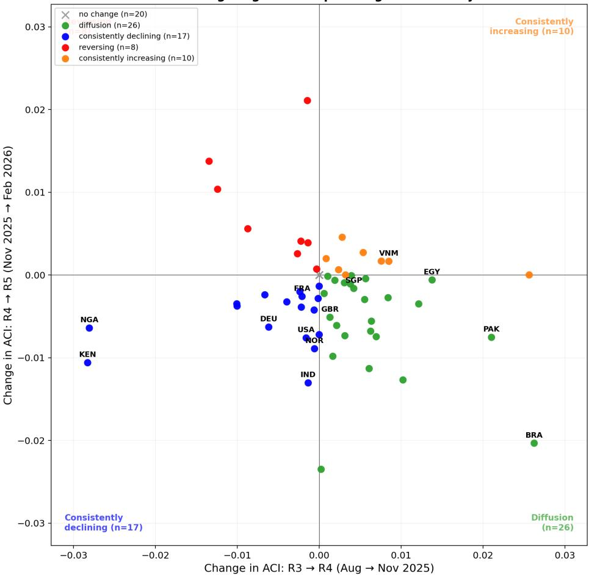  
Figure 5: Change in ACI across two consecutive windows. The horizontal axis shows the change in ACI from R3 to R4 (August to November 2025); the vertical axis shows the change from R4 to R5 (November 2025 to February 2026). Gray crosses at the origin denote countries with no ACI change in either period. Green dots represent countries whose ACI was rising then reversed to falling; blue dots were consistently declining; red dots reversed from declining to rising; orange dots were consistently rising or flat.

Figure 5 plots the change in ACI across two consecutive three-month windows for the 86 sample countries. Of the 81 present in all three waves, 20 had no ACI change in either period because all their AI conversations mapped to a single occupational group. Among the 61 countries with real changes, the shift toward declining ACI is clear: 43 countries, 53% of the total, saw their ACI fall in the second period, up from 23, or 28%, in the first. The diffusion quadrant is particularly notable: 26 countries whose ACI was rising through November 2025 reversed course by February 2026. This pattern is not driven by high-income countries alone: 12 of those 26 reversals are middle-income economies. These dynamics suggest that AI initially widened labor market inequality by concentrating gains in already high-paid occupations, but the broadening now underway can narrow that gap.

## 3.3 Regression evidence

Table 5 presents the regression evidence, using the 86 sample countries. Columns 1 and 2 ask what predicts a country's aggregate AI value relative to GDP. Columns 3 and 4 ask what predicts the level of AI concentration. Columns 5 and 6 ask what predicts whether that concentration is rising or falling.

Table 5: What predicts aggregate AI gains and their concentration?

<table><tr><td rowspan="2"></td><td colspan="2">LCE/GDP (%)</td><td colspan="2">ACI level</td><td colspan="2">ΔACI</td></tr><tr><td>(1)</td><td>(2)</td><td>(3)</td><td>(4)</td><td>(5)</td><td>(6)</td></tr><tr><td>log GDP per capita</td><td>0.384***(0.068)</td><td>-0.043(0.134)</td><td>-0.124***(0.011)</td><td>-0.097***(0.025)</td><td>-0.000(0.000)</td><td>-0.001(0.002)</td></tr><tr><td>English official</td><td></td><td>0.120(0.198)</td><td></td><td>-0.035(0.025)</td><td>-0.006***(0.002)</td><td>-0.004**(0.002)</td></tr><tr><td>AI regulatory readiness</td><td></td><td>8.918***(2.689)</td><td></td><td>-1.413***(0.372)</td><td></td><td>-0.032(0.026)</td></tr><tr><td>Unemployment rate</td><td></td><td>-0.035*(0.020)</td><td></td><td>-0.003*(0.002)</td><td></td><td>0.000(0.000)</td></tr><tr><td>Services VA (% GDP)</td><td></td><td>0.019*(0.011)</td><td></td><td>0.000(0.002)</td><td></td><td>0.000(0.000)</td></tr><tr><td>Internet users (%)</td><td></td><td>0.004(0.005)</td><td></td><td>0.002**(0.001)</td><td></td><td>0.000(0.000)</td></tr><tr><td>Gini (SWIID)</td><td></td><td>0.010(0.010)</td><td></td><td>0.004***(0.001)</td><td></td><td>0.000(0.000)</td></tr><tr><td>Wave FE</td><td>Yes</td><td>Yes</td><td>Yes</td><td>Yes</td><td>Yes</td><td>Yes</td></tr><tr><td>Observations</td><td>252</td><td>250</td><td>252</td><td>250</td><td>165</td><td>164</td></tr><tr><td> $R^2$ </td><td>0.291</td><td>0.440</td><td>0.664</td><td>0.769</td><td>0.111</td><td>0.142</td></tr></table>

\* $p < 0.1$ , \*\* $p < 0.05$ , \*\*\* $p < 0.01$ . Sample: the 86 sample countries. Columns (1) and (2): LCE as % of GDP, pooled R3, R4, R5 with wave fixed effects. Columns (3) and (4): ACI level pooled R3, R4, R5; wave fixed effects included. Columns (5) and (6): ΔACI pooled across R3→R4 and R4→R5 with a R4→R5 window dummy; being a first difference across consecutive waves (two windows), these columns have fewer observations than the level columns. Standard errors clustered by country in all columns. Variable sources are described in Section 2. Progressive specifications in Appendix Tables A3 to A5.

Richer countries capture more AI value relative to GDP in a simple bivariate regression, but the income pattern disappears once policy and economic structure are added (columns 1 and 2). $^{21}$ What matters instead is AI regulatory readiness: countries whose policy environments are better prepared for AI deployment capture more economic value, even at similar income levels. Economic structure also plays a role: countries with larger service sectors generate more AI value relative to GDP, consistent with LLMs being most useful in knowledge- and communication-intensive occupations that dominate the service economy. Together, regulatory readiness and economic structure explain half the cross-country variance in LCE/GDP.

Turning to concentration (columns 3 and 4), and conditional on the other covariates, richer countries and countries with stronger regulatory frameworks have more broadly distributed AI gains: both income and AI regulatory readiness are strongly significant predictors of the ACI level, and the full specification explains nearly three-quarters of the cross-country variance. Income inequality and internet penetration are both associated with a higher ACI, through different channels: a higher Gini coefficient (more unequal income distribution) is consistent with AI gains accruing to a country's most advantaged workers, while higher internet penetration, conditional on GDP per capita, likely reflects connectivity reaching the broader population without expanding the set of AI-using occupations. Neither variable predicts the aggregate value of AI relative to GDP or its change over time. Other IMF AIP1 sub-indices, such as digital infrastructure, can predict LCE/GDP too but are too collinear with income and regulatory readiness to enter the regression separately. $^{22}$

But neither income nor regulatory readiness predicts whether concentration is rising or falling. What does predict faster diffusion is training-data representation. Countries where English is an official language saw their ACI fall faster. $^{23}$ The mechanism is not conversational fluency: modern LLMs can converse in dozens of languages. Rather, countries whose official language is English produce legal codes, regulatory guidance, educational curricula, and business documentation in English. These documents are well represented in LLM training data, enabling AI models to acquire the local institutional knowledge needed to generate accurate, contextually relevant answers across a wide range of occupations. Where institutional materials exist primarily in lower-resource languages, AI responses tend to be less attuned to local conditions, limiting AI's usefulness to fewer, typically higher-skilled occupations and thus keeping the ACI elevated.

## 3.4 Robustness: bounding hours saved

Because $h_{t}$ is estimated by Claude rather than measured experimentally, we ask how sensitive the results are to this estimate. The AEI reports 95% confidence intervals for both time variables at the task level, so we can construct a strict lower and upper bound on hours saved by combining the most pessimistic ends of each interval:

$$
h _ {t} ^ {\text { lower }} = \max \Bigl (0, \overline {{h}} _ {\text { CI - lower }} ^ {\text { human - only }} - \overline {{h}} _ {\text { CI - upper }} ^ {\text { human - with - AI }} / 6 0 \Bigr),\tag{4}
$$

$$
h _ {t} ^ {\text { upper }} = \max \left(0, \overline {{h}} _ {\text { CI - upper }} ^ {\text { human - only }} - \overline {{h}} _ {\text { CI - lower }} ^ {\text { human - with - AI }} / 6 0\right).\tag{5}
$$

The lower bound assumes each task was faster without AI and slower with AI than our point estimate suggests; the upper bound reverses both. Applying these extremes to all $\sim$ 3,300 tasks simultaneously is deliberately conservative: in practice, estimation errors across tasks will partially offset rather than compound.

The aggregate LCE is stable under both extreme scenarios. The task-level mean $h_{t}$ swings widely, from 1.80 hours (-33%) to 3.81 hours (+41%), but the aggregate LCE moves within a narrow band of \$2.5 to 2.9 trillion (compared with the \$2.7 trillion baseline). The reason is that the tasks contributing most to the aggregate are precisely those estimated most precisely: high-volume tasks (5,000+ conversations) have confidence intervals averaging just 6% of their point estimate, while low-volume tasks (10 to 50 conversations) have intervals averaging 89%. Since the LCE weights each task by its conversation volume, the well-estimated tasks that matter most for the total are the ones least affected by the bounding exercise.

The distributional results are also robust. No country's ACI shifts by more than half a percentage point under either bound, and the cross-country ranking of ACI values is unchanged. This is because the bounding exercise shifts hours saved in a roughly proportional way across occupations, leaving the shares of AI time savings (which determine the ACI) nearly identical.

## 3.5 Extension: expanded sample with peer-borrowed wages

Table 5 uses the 86 sample countries. An additional 29 countries lack direct ILO wages or employment at the ISCO-1 level; for these we borrow the missing dimension from a matched peer country (Appendix Table A8). Peers are selected as the nearest country with complete ILO data by standardized distance in GDP per capita, services value-added share, and capital-city distance, preferring same-region matches. On this expanded 115-country sample the aggregate R5 LCE is \$3.0 trillion, or 3.2% of these countries' combined GDP, compared with \$2.7 trillion (3.4%) for the 86-country baseline. Table 6 re-estimates all six specifications on the expanded sample (pooled R3 to R5). All qualitative conclusions are preserved: AICI remains strongly significant in both the LCE/GDP and ACI-level regressions, and the income and English-language slopes keep their signs and significance. The $R^{2}$ values are somewhat lower for the ACI columns (for example 0.49 versus 0.66 for the ACI level), consistent with peer-borrowed data introducing some measurement error.

Table 6: Extension: expanded sample with peer-borrowed wages (115 countries, pooled R3 to R5).

<table><tr><td rowspan="2"></td><td colspan="2">LCE/GDP (%)</td><td colspan="2">ACI level</td><td colspan="2">ΔACI</td></tr><tr><td>(1)</td><td>(2)</td><td>(3)</td><td>(4)</td><td>(5)</td><td>(6)</td></tr><tr><td>log GDP per capita</td><td>0.391***(0.064)</td><td>0.013(0.095)</td><td>-0.101***(0.012)</td><td>-0.070***(0.020)</td><td>-0.000(0.000)</td><td>-0.001(0.001)</td></tr><tr><td>English official</td><td></td><td>0.280(0.217)</td><td></td><td>-0.064**(0.027)</td><td>-0.005***(0.001)</td><td>-0.004***(0.002)</td></tr><tr><td>AI regulatory readiness</td><td></td><td>8.433***(2.243)</td><td></td><td>-0.921***(0.344)</td><td></td><td>-0.021(0.021)</td></tr><tr><td>Unemployment rate</td><td></td><td>-0.010(0.010)</td><td></td><td>-0.002(0.002)</td><td></td><td>-0.000(0.000)</td></tr><tr><td>Services VA (% GDP)</td><td></td><td>0.015*(0.009)</td><td></td><td>-0.001(0.002)</td><td></td><td>0.000(0.000)</td></tr><tr><td>Internet users (%)</td><td></td><td>0.001(0.004)</td><td></td><td>0.001(0.001)</td><td></td><td>0.000*(0.000)</td></tr><tr><td>Gini (SWIID)</td><td></td><td>-0.002(0.008)</td><td></td><td>0.006***(0.001)</td><td></td><td>0.000(0.000)</td></tr><tr><td>Wave FE</td><td>Yes</td><td>Yes</td><td>Yes</td><td>Yes</td><td>Yes</td><td>Yes</td></tr><tr><td>Observations</td><td>337</td><td>332</td><td>337</td><td>332</td><td>219</td><td>216</td></tr><tr><td> $R^2$ </td><td>0.264</td><td>0.433</td><td>0.490</td><td>0.645</td><td>0.097</td><td>0.112</td></tr></table>

\* $p < {0.1}, *  * p < {0.05}, *  *  * p < {0.01}$ . Expanded sample includes 29 countries whose employment or wage data are borrowed from a neighbor matched on nominal GDP per capita, services value-added share, and capital-city distance (GCC states anchored to Qatar). Specifications mirror Table 5. Columns (1)-(2): LCE/GDP pooled R3, R4, R5 with wave fixed effects. Standard errors clustered by country in all columns.

## 4 Discussion

The findings have two policy implications. First, the representation of a country's institutional knowledge in AI training data is associated with faster broadening of AI gains: countries where English is an official language, and whose legal codes, educational materials, and business documentation are therefore well represented in the training data of English-dominant large language models, see faster ACI declines even after controlling for income. This suggests that expanding the breadth and quality of non-English training data may offer high distributional returns, particularly for Francophone West Africa, Arabic-speaking MENA, and Southeast Asia, where institutional documents in local languages are underrepresented in current LLM training corpora (Joshi et al., 2020). Second, regulatory readiness matters both for the aggregate value AI creates and for how broadly those gains are distributed: AI regulatory readiness is the dominant predictor of LCE relative to GDP (Table 5, column 2) and is also strongly associated with lower ACI (column 4), indicating that policy environments prepared for AI deployment help countries both capture more economic value and spread it more broadly across the wage ladder.

Three caveats are worth noting. First, LCE is a partial-equilibrium measure that values time savings at current wages without accounting for job displacement, wage compression, or task reallocation; it measures the monetary value of time freed by AI, not how that time is ultimately allocated. Second, the hours-saved variable $h_{t}$ is estimated by Claude itself rather than measured experimentally, though the ACI is robust to $h_{t}$ assumptions since it depends only on the relative distribution of time savings across occupations (Appendix Table A2). Third, our data covers Claude.ai web conversations only, excluding API-based enterprise usage (which remains concentrated in Computer & Math, approximately 51% of traffic in R5) $^{24}$ and other platforms (ChatGPT, Gemini, Copilot); each wave covers one week and may not represent longer-run patterns; and the ACI likely understates the true concentration of AI gains since enterprise usage skews toward high-skill occupations.

The LCE measures potential gains on the benefit side only. A full welfare assessment would net out the costs of AI, including infrastructure investment, energy consumption, and the subscription or usage fees borne by firms and users. Net gains could be smaller once these costs are counted, and the cost side is an important area for future research.

## 5 Conclusion

This paper provides the first multi-wave, cross-country evidence on both the aggregate and distributional consequences of AI adoption. Using five releases of the Anthropic Economic Index spanning January 2025 to February 2026, we construct two novel measures from observed AI usage data: a labor cost equivalent (LCE) estimate of AI's aggregate productivity value, and an AI concentration index (ACI) that tracks whether gains flow disproportionately to higher-paid or lower-paid occupations.

Aggregate AI gains are large and rising. We estimate approximately \$2.7 trillion in annualized labor cost equivalent at own-country ILO wages, and the figure is increasing as AI enters occupations that employ far more workers, even as the per-conversation value of AI declines. Income and regulatory readiness determine the starting point: richer countries and countries with higher regulatory readiness have lower ACI, and regulatory readiness is the dominant predictor of LCE relative to GDP. But neither predicts the trajectory; faster diffusion is associated with official English-language status, consistent with the interpretation that countries whose institutional knowledge is well represented in the training data of English-dominant large language models benefit from more accurate, locally relevant AI assistance across a wider range of occupations.

The distribution of AI's gains is becoming more even but remains unequal. The ACI is positive in nearly every country (AI's gains tilt toward high-wage occupations), but the tilt is declining. The number of countries with a falling ACI rose from 32 (30%) to 53 (48%) in six months; an additional third of countries had no ACI change because all AI conversations mapped to a single occupational group.

Looking forward, the central question is whether the diffusion continues. The evidence through February 2026 shows AI spreading into education, sales, and office occupations that together employ a much larger share of the global workforce than the software core where AI began. But in most low-income countries, AI remains confined to a small professional enclave. The gap between high-income and low-income countries on the ACI remains large. $^{25}$ AI is trickling down, but it has not yet reached the bottom.

Data availability. The Anthropic Economic Index releases are publicly available on Hugging Face at https://huggingface.co/datasets/Anthropic/EconomicIndex. ILO employment and wage data are from ILOSTAT (https://ilostat.ilo.org). Replication code is available from the authors.

## References

Aker, Jenny C. and Isaac M. Mbiti. 2010. “Mobile Phones and Economic Development in Africa.” Journal of Economic Perspectives, 24(3), 207–232.

Cazzaniga, Mauro, Florence Jaumotte, Longji Li, Giovanni Melina, Augustus J. Panton, Carlo Pizzinelli, Emma Rockall, and Marina M. Tavares. 2024. “Gen-AI: Artificial Intelligence and the Future of Work.” IMF Staff Discussion Note SDN/2024/001.

Jaumotte, Florence, Jaden Kim, David Koll, Elmer Z. Li, Longji Li, Giovanni Melina, Alina Song, and Marina M. Tavares. 2026. “Bridging Skill Gaps for the Future: New Jobs Creation in the AI Age.” IMF Staff Discussion Note SDN/2026/001.

Brynjolfsson, Erik, Danielle Li, and Lindsey Raymond. 2025. “Generative AI at Work.” Quarterly Journal of Economics, 140(2), 889–942.

Bonney, Kathryn, Cory Breaux, Cathy Buffington, Emin Dinlersoz, Lucia S. Foster, Nathan Goldschlag, John C. Haltiwanger, Zachary Kroff, and Keith Savage. 2024. “Tracking Firm Use of AI in Real Time: A Snapshot from the Business Trends and Outlook Survey.” NBER Working Paper 32319.

Comin, Diego and Bart Hobijn. 2010. “An Exploration of Technology Diffusion.” American Economic Review, 100(5), 2031–2059.

Eloundou, Tyna, Sam Manning, and Daniel Rock. 2024. “GPTs Are GPTs: Labor Market Impact Potential of LLMs.” Science, 384(6702), 1306–1308.

Fan, Rachel Yuting. 2026. “What Countries Use AI, and What For? Intensity and Breadth of AI Adoption Across Over 100 Countries.” SSRN Working Paper.

Felten, Edward W., Manav Raj and Robert Seamans. 2021. “Occupational, Industry, and Geographic Exposure to Artificial Intelligence: A Novel Dataset and Its Potential Uses.” Strategic Management Journal, 42(12), 2195–2217.

Hjort, Jonas and Jonas Poulsen. 2019. “The Arrival of Fast Internet and Employment in Africa.” American Economic Review, 109(3), 1032–1079.

Joshi, Pratik, Sebastin Santy, Amar Budhiraja, Kalika Bali, and Monojit Choudhury. 2020. “The State and Fate of Linguistic Diversity and Inclusion in the NLP World.” Proceedings of the 58th Annual Meeting of the Association for Computational Linguistics, 6282–6293.

Kakwani, Nanak, Adam Wagstaff and Eddy van Doorslaer. 1997. “Socioeconomic Inequalities in Health: Measurement, Computation, and Statistical Inference.” Journal of Econometrics, 77(1), 87–103.

Noy, Shakked and Whitney Zhang. 2023. “Experimental Evidence on the Productivity Effects of Generative Artificial Intelligence.” Science, 381(6654), 187–192.

Solt, Frederick. 2020. “Measuring Income Inequality Across Countries and Over Time: The Standardized World Income Inequality Database.” Social Science Quarterly, 101(3), 1183–1199. SWIID Version 9.

Wagstaff, Adam, Pierella Paci and Eddy van Doorslaer. 1991. “On the Measurement of Inequalities in Health.” Social Science & Medicine, 33(5), 545–557.

Yotzov, Ivan, Jose Maria Barrero, Nicholas Bloom, Philip Bunn, Steven J. Davis, Kevin M. Foster, Aaron Jalca, Brent H. Meyer, Paul Mizen, Michael A. Navarrete, Pawel Smietanka, Gregory Thwaites, and Ben Zhe Wang. 2026. “Firm Data on AI.” NBER Working Paper 34836.

## Appendix

The Aggregate and Distributional Gains from AI: Global Evidence from Usage Data

## A Occupation Classification and Wage Sources

Table A1: Occupation classification and wage sources used in each analysis.

<table><tr><td>Where</td><td>Grouping</td><td>What</td><td>Why this level</td></tr><tr><td>Wage index (Figure 2)</td><td>SOC-2 (22)</td><td>Average US wage per conversation, weighted by global conversation counts; BLS annual wages</td><td>Global measure using US data only; SOC-2 is the native AEI classification</td></tr><tr><td>LCE (Eq. 1)</td><td>ISCO-1 (9)</td><td>Aggregate labor cost equivalent at each country&#x27;s own wages; ILO monthly wages</td><td>ILO employment and wage data are only consistently available across over one hundred countries at ISCO-1</td></tr><tr><td>AI concentration curves (Figure 4)</td><td>ISCO-1 (9)</td><td>Cumulative AI time savings vs. cumulative employment, plotted for 6 countries</td><td>Consistent with ACI computation and regressions; ILO employment and wage data</td></tr><tr><td>ACI (Eq. 2)</td><td>ISCO-1 (9)</td><td>Concentration index measuring distributional tilt of AI gains; ILO wages for ranking, ILO employment shares</td><td>Cross-country comparability requires consistent employment and wage data</td></tr><tr><td>Regressions (Table 5)</td><td>ISCO-1 (9)</td><td>ACI level and change as dependent variable</td><td>ACI is computed at ISCO-1</td></tr><tr><td>Occupation space (Figure A1)</td><td>SOC-2 (22)</td><td>Network of occupations by AI usage intensity per country</td><td>Reproduced from Fan (2026); SOC-2 is the native classification</td></tr></table>

## B Scaling from Claude to All AI Platforms

The LCE calculations require an estimate of total AI conversations per week across all platforms $(C_{\mathrm{total},w})$ . This section documents how we derive $C_{\mathrm{total},w}$ for each wave from two estimated parameters: Claude.ai conversations per week and Claude's market share among professional AI tools.

Step 1: Claude.ai conversations per week. Anthropic does not publish official user figures. Third-party estimates place Claude.ai at approximately 18.9 million monthly active users (MAU) on the web as of early 2026. $^{26}$ Industry benchmarks for productivity tools place the ratio of daily to monthly active users at 30–50%. At 50%, 18.9 million monthly users imply approximately 9.5 million users active on any given day. Assuming 3 conversations per active user per day: $9.5M \times 3 \times 7 \approx 200$ million conversations per week. $^{27}$

Step 2: Claude's market share. Consumer web-traffic data places Claude at 3–4% of all AI chatbot traffic, but this understates Claude's position among professionals: Claude holds approximately 29% of the enterprise AI assistant market, and Claude Code captures 41–54% of the AI coding tools segment. Since the AEI samples predominantly professional usage (coding, education, business tasks), we use 25% as our median estimate of Claude's share of professional AI conversations. The main competitors are OpenAI's ChatGPT, Google's Gemini, and Microsoft Copilot. $^{28}$

Step 3: Total AI conversations. Dividing Claude conversations by Claude's market share:

$$
C _ {\mathrm{total}} = \frac {2 0 0 \mathrm{M}}{0 . 2 5} = 8 0 0 \mathrm{millionconversationsperweek(R5)}.
$$

Step 4: Scaling across waves. For earlier waves, we scale $C_{total,w}$ proportionally using claude.ai monthly website traffic from SimilarWeb (similarweb.com), a web analytics platform that estimates website visits from panel and ISP-level data: $^{29}$

<table><tr><td>Wave</td><td>Month</td><td>Claude.ai visits (M)</td><td>Ratio to R5</td><td> $C_{\text{total},w}$  (M/week)</td></tr><tr><td>R3</td><td>Aug 2025</td><td>149</td><td>0.517</td><td>414</td></tr><tr><td>R4</td><td>Nov 2025</td><td>176</td><td>0.611</td><td>489</td></tr><tr><td>R5</td><td>Feb 2026</td><td>288</td><td>1.000</td><td>800</td></tr></table>

For example, R3: $(149/288) \times 800 \approx 414$ million conversations per week. This assumes that the ratio of conversations to website visits is roughly stable across waves.

Summary. The R5 baseline ( $C_{\text{total}} = 800\text{M/week}$ ) rests on two estimated quantities: Claude.ai conversations per week ( $\approx 200\text{M}$ ) and Claude's professional market share ( $\approx 25\%$ ). Neither is directly observed; both are approximated from public data. All distributional results (ACI) are unaffected by these parameters because the ACI depends only on the occupational composition of AI conversations, not on their absolute number. The LCE estimates are directly proportional to $C_{\text{total}}$ ; the full sensitivity range is reported in Table A2.

Table A2: Sensitivity of global annual labor cost equivalent to scaling assumptions (R5, Feb 2026).

<table><tr><td>Scenario</td><td>Assumptions</td><td> $C_{total}$ /week</td><td>LCE (ILO wages)</td></tr><tr><td>Conservative</td><td>150M Claude, 35% share</td><td>429M</td><td>$1.6T</td></tr><tr><td>Median</td><td>200M Claude, 25% share</td><td>800M</td><td>$2.9T</td></tr><tr><td>Aggressive</td><td>250M Claude, 15% share</td><td>1,667M</td><td>$6.1T</td></tr></table>

All ACI and distributional results are unaffected by these assumptions; the ACI depends only on shares of AI time savings across occupations.

## C AI Concentration Index: Formula Worked Example

## Box 4: Worked example for the ACI formula (Equation 3)

Suppose a country has three occupations ranked from lowest to highest wage, each employing one-third of the workforce ( $e_{s} = \frac{1}{3}$ ):

<table><tr><td>Occupation</td><td>Wage rank</td><td>Emp. share  $e_s$ </td><td>AI hours share  $g_s$ </td></tr><tr><td>Food Service</td><td>lowest</td><td>1/3</td><td>0.10</td></tr><tr><td>Administration</td><td>middle</td><td>1/3</td><td>0.20</td></tr><tr><td>Software</td><td>highest</td><td>1/3</td><td>0.70</td></tr></table>

Step 1: Fractional ranks. Each occupation occupies a band of width $e_{s} = \frac{1}{3}$ in the $[0,1]$ interval. The rank is placed at the midpoint of the band:

$$
R _ {\mathrm{food}} = 0 + \frac {1}{2} \cdot \frac {1}{3} = \frac {1}{6}, R _ {\mathrm{admin}} = \frac {1}{3} + \frac {1}{2} \cdot \frac {1}{3} = \frac {1}{2}, R _ {\mathrm{software}} = \frac {2}{3} + \frac {1}{2} \cdot \frac {1}{3} = \frac {5}{6}.
$$

Step 2: Mean AI boost.

$$
\mu = \sum_ {s} g _ {s} e _ {s} = 0. 1 0 \cdot \frac {1}{3} + 0. 2 0 \cdot \frac {1}{3} + 0. 7 0 \cdot \frac {1}{3} = \frac {1}{3}.
$$

Step 3: ACI.

$$
\begin{array}{l} \mathrm{ACI} = \frac {2}{\mu} \sum_ {s} g _ {s} \left(R _ {s} - \frac {1}{2}\right) e _ {s} \\ \qquad = 6 \left[ 0. 1 0 \left(\frac {1}{6} - \frac {1}{2}\right) \frac {1}{3} + 0. 2 0 \left(\frac {1}{2} - \frac {1}{2}\right) \frac {1}{3} + 0. 7 0 \left(\frac {5}{6} - \frac {1}{2}\right) \frac {1}{3} \right] \\ \qquad = 6 \left[ \frac {- 0 . 1 0 + 0 + 0 . 7 0}{9} \right] = 0. 4. \end{array}
$$

ACI = 0.4 > 0: gains tilt toward Software, the highest-wage occupation. Administration (median wage) contributes zero because $R_{admin} - \frac{1}{2} = 0$ . If instead $g_{s} = \frac{1}{3}$ for all occupations (AI hours proportional to employment), the positive and negative terms cancel exactly and ACI = 0.

## D Additional Figures

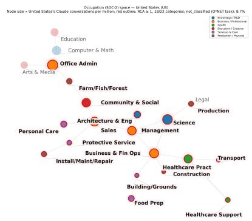  
(a) United States

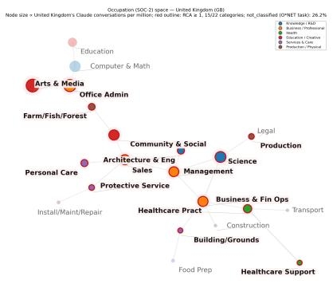

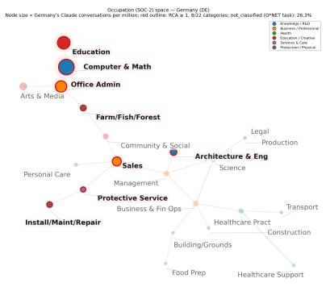  
(c) Germany

(b) United Kingdom  
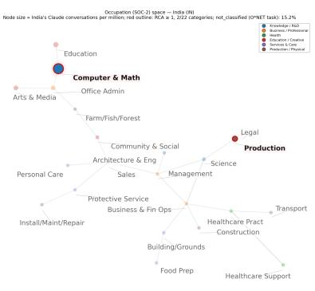  
(d) India

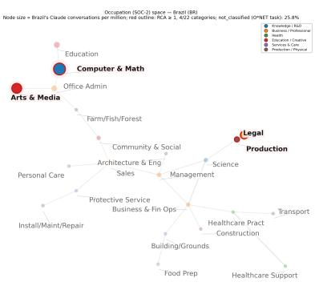  
(e) Brazil

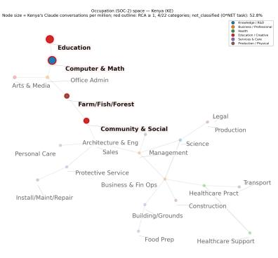  
(f) Kenya  
Figure A1: AI-diffusion space by occupation for six countries (R5, Feb 2026). Each node is a SOC-2 occupation group (the native AEI classification, used here to preserve the finer occupational detail of the original network visualization); node size is proportional to AI usage in that occupation. Red outlines indicate revealed comparative advantage (RCA $\geq$ 1). Replicated from Fan (2026).

## E Full Regression Tables

Table A3: LCE/GDP (%): progressive specification (pooled R3, R4, R5 with wave fixed effects, 86 sample countries). Dependent variable: LCE as % of GDP. Standard errors clustered by country.

<table><tr><td></td><td>(1)</td><td>(2)</td><td>(3)</td><td>(4)</td><td>(5)</td><td>(6)</td><td>(7)</td></tr><tr><td>log GDP per capita</td><td>0.384***(0.068)</td><td>0.410***(0.080)</td><td>0.070(0.082)</td><td>0.069(0.082)</td><td>-0.019(0.076)</td><td>-0.069(0.138)</td><td>-0.043(0.134)</td></tr><tr><td>English official</td><td></td><td>0.336(0.240)</td><td>0.152(0.215)</td><td>0.123(0.216)</td><td>0.110(0.195)</td><td>0.143(0.211)</td><td>0.120(0.198)</td></tr><tr><td>AI regulatory readiness</td><td></td><td></td><td>9.955***(2.615)</td><td>10.055***(2.642)</td><td>8.873***(2.676)</td><td>8.664***(2.633)</td><td>8.918***(2.689)</td></tr><tr><td>Unemployment rate</td><td></td><td></td><td></td><td>-0.021(0.017)</td><td>-0.030*(0.017)</td><td>-0.032(0.019)</td><td>-0.035*(0.020)</td></tr><tr><td>Services VA (% GDP)</td><td></td><td></td><td></td><td></td><td>0.020*(0.011)</td><td>0.019*(0.011)</td><td>0.019*(0.011)</td></tr><tr><td>Internet users (%)</td><td></td><td></td><td></td><td></td><td></td><td>0.003(0.005)</td><td>0.004(0.005)</td></tr><tr><td>Gini (SWIID)</td><td></td><td></td><td></td><td></td><td></td><td></td><td>0.010(0.010)</td></tr><tr><td>Wave FE</td><td>Yes</td><td>Yes</td><td>Yes</td><td>Yes</td><td>Yes</td><td>Yes</td><td>Yes</td></tr><tr><td>N</td><td>252</td><td>252</td><td>252</td><td>252</td><td>252</td><td>250</td><td>250</td></tr><tr><td> $R^2$ </td><td>0.291</td><td>0.314</td><td>0.403</td><td>0.409</td><td>0.434</td><td>0.437</td><td>0.440</td></tr></table>

\* $p < {0.1}, *  * p < {0.05}, *  *  * p < {0.01}$ . Variable sources in Section 2.

Table A4: ACI level: progressive specification (pooled R3, R4, R5; 86 sample countries). Dependent variable: AI concentration index. Standard errors clustered by country. Wave fixed effects included.

<table><tr><td></td><td>(1)</td><td>(2)</td><td>(3)</td><td>(4)</td><td>(5)</td><td>(6)</td><td>(7)</td></tr><tr><td>log GDP per capita</td><td>-0.124***(0.011)</td><td>-0.130***(0.012)</td><td>-0.079***(0.016)</td><td>-0.079***(0.016)</td><td>-0.078***(0.020)</td><td>-0.108***(0.028)</td><td>-0.097***(0.025)</td></tr><tr><td>English official</td><td></td><td>-0.067***(0.023)</td><td>-0.040*(0.024)</td><td>-0.042*(0.024)</td><td>-0.042*(0.024)</td><td>-0.025(0.026)</td><td>-0.035(0.025)</td></tr><tr><td>AI regulatory readiness</td><td></td><td></td><td>-1.487***(0.373)</td><td>-1.481***(0.369)</td><td>-1.470***(0.396)</td><td>-1.527***(0.399)</td><td>-1.413***(0.372)</td></tr><tr><td>Unemployment rate</td><td></td><td></td><td></td><td>-0.001(0.002)</td><td>-0.001(0.002)</td><td>-0.002(0.002)</td><td>-0.003*(0.002)</td></tr><tr><td>Services VA (% GDP)</td><td></td><td></td><td></td><td></td><td>-0.000(0.002)</td><td>0.000(0.002)</td><td>0.000(0.002)</td></tr><tr><td>Internet users (%)</td><td></td><td></td><td></td><td></td><td></td><td>0.002*(0.001)</td><td>0.002**(0.001)</td></tr><tr><td>Gini (SWIID)</td><td></td><td></td><td></td><td></td><td></td><td></td><td>0.004***(0.001)</td></tr><tr><td>Wave FE</td><td>Yes</td><td>Yes</td><td>Yes</td><td>Yes</td><td>Yes</td><td>Yes</td><td>Yes</td></tr><tr><td>N</td><td>252</td><td>252</td><td>252</td><td>252</td><td>252</td><td>250</td><td>250</td></tr><tr><td> $R^2$ </td><td>0.664</td><td>0.688</td><td>0.740</td><td>0.741</td><td>0.741</td><td>0.749</td><td>0.769</td></tr></table>

\* $p < {0.1}$ ,\*\* $p < {0.05}$ ,\*\*\* $p < {0.01}$ . Variable sources in Section 2.

Table A5: $\Delta$ ACI: progressive specification (pooled R4–R3 and R5–R4; 86 sample countries). Dependent variable: $\Delta$ ACI. Standard errors clustered by country. Window fixed effect (R4→R5 dummy) included.

<table><tr><td></td><td>(1)</td><td>(2)</td><td>(3)</td><td>(4)</td><td>(5)</td><td>(6)</td></tr><tr><td>log GDP per capita</td><td>-0.0004(0.0004)</td><td>0.0006(0.0009)</td><td>0.0007(0.0009)</td><td>0.0006(0.0011)</td><td>-0.0014(0.0015)</td><td>-0.0010(0.0016)</td></tr><tr><td>English official</td><td>-0.0062***(0.0020)</td><td>-0.0056***(0.0022)</td><td>-0.0052**(0.0021)</td><td>-0.0052**(0.0021)</td><td>-0.0041**(0.0020)</td><td>-0.0044**(0.0021)</td></tr><tr><td>AI regulatory readiness</td><td></td><td>-0.0296(0.0275)</td><td>-0.0313(0.0275)</td><td>-0.0320(0.0268)</td><td>-0.0357(0.0268)</td><td>-0.0318(0.0264)</td></tr><tr><td>Unemployment rate</td><td></td><td></td><td>0.0003(0.0002)</td><td>0.0003(0.0002)</td><td>0.0003(0.0002)</td><td>0.0002(0.0002)</td></tr><tr><td>Services VA (% GDP)</td><td></td><td></td><td></td><td>0.0000(0.0001)</td><td>0.0000(0.0001)</td><td>0.0000(0.0001)</td></tr><tr><td>Internet users (%)</td><td></td><td></td><td></td><td></td><td>0.0001(0.0001)</td><td>0.0001(0.0001)</td></tr><tr><td>Gini (SWIID)</td><td></td><td></td><td></td><td></td><td></td><td>0.0001(0.0001)</td></tr><tr><td>Wave FE</td><td>Yes</td><td>Yes</td><td>Yes</td><td>Yes</td><td>Yes</td><td>Yes</td></tr><tr><td>N</td><td>165</td><td>165</td><td>165</td><td>165</td><td>164</td><td>164</td></tr><tr><td> $R^2$ </td><td>0.111</td><td>0.117</td><td>0.127</td><td>0.127</td><td>0.137</td><td>0.142</td></tr></table>

\* $p < {0.1}$ ,\*\* $p < {0.05}$ ,\*\*\* $p < {0.01}$ . Variable sources in Section 2.

Table A6: Correlation matrix: income and the IMF AI Preparedness Index. Pearson correlations among log GDP per capita, the overall AIPI, and its four sub-indices, across the 85 sample countries with complete AIPI data. Cells shaded by magnitude (darker = stronger correlation).

<table><tr><td></td><td>(1)</td><td>(2)</td><td>(3)</td><td>(4)</td><td>(5)</td><td>(6)</td></tr><tr><td>(1) log GDP per capita</td><td>1.00</td><td></td><td></td><td></td><td></td><td></td></tr><tr><td>(2) AIP1 overall</td><td>0.90</td><td>1.00</td><td></td><td></td><td></td><td></td></tr><tr><td>(3) Digital infrastructure</td><td>0.92</td><td>0.97</td><td>1.00</td><td></td><td></td><td></td></tr><tr><td>(4) Human capital &amp; labor mkt</td><td>0.87</td><td>0.96</td><td>0.91</td><td>1.00</td><td></td><td></td></tr><tr><td>(5) Innovation</td><td>0.84</td><td>0.94</td><td>0.88</td><td>0.87</td><td>1.00</td><td></td></tr><tr><td>(6) Regulation &amp; ethics</td><td>0.80</td><td>0.96</td><td>0.90</td><td>0.90</td><td>0.86</td><td>1.00</td></tr></table>

Sub-indices of the IMF AI Preparedness Index (Cazzaniga et al., 2024) are stored as additive components of the overall index. Sample: 85 sample countries with non-missing values on all six variables.

## F Peer-Country Assignments for Employment and Wage Data

Of the 176 countries that receive a geographic code in R5, 117 have ONET task enrichment and enter the analysis; the remaining 59 lack ONET task-level breakdown.

Among the 117 analysis countries, those with complete ILO employment and wage data at the ISCO-1 level are used directly (86 of 117; Table A7). Of the remaining 31, 29 borrow employment and/or wage data from a peer country with complete ILO data (Table A8). The other two are excluded for lack of IMF GDP data.

Table A7: The 86 sample countries (of 117 R5 analysis countries).

<table><tr><td colspan="3">Country (ISO-3 code)</td></tr><tr><td>Albania (ALB)</td><td>Germany (DEU)</td><td>Philippines (PHL)</td></tr><tr><td>Angola (AGO)</td><td>Ghana (GHA)</td><td>Poland (POL)</td></tr><tr><td>Argentina (ARG)</td><td>Greece (GRC)</td><td>Portugal (PRT)</td></tr><tr><td>Austria (AUT)</td><td>Guatemala (GTM)</td><td>Puerto Rico (PRI)</td></tr><tr><td>Bangladesh (BGD)</td><td>Honduras (HND)</td><td>Qatar (QAT)</td></tr><tr><td>Belgium (BEL)</td><td>Hungary (HUN)</td><td>Romania (ROU)</td></tr><tr><td>Benin (BEN)</td><td>India (IND)</td><td>Rwanda (RWA)</td></tr><tr><td>Bolivia (BOL)</td><td>Indonesia (IDN)</td><td>Senegal (SEN)</td></tr><tr><td>Bosnia &amp; Herz. (BIH)</td><td>Ireland (IRL)</td><td>Serbia (SRB)</td></tr><tr><td>Brazil (BRA)</td><td>Israel (ISR)</td><td>Singapore (SGP)</td></tr><tr><td>Bulgaria (BGR)</td><td>Italy (ITA)</td><td>Slovakia (SVK)</td></tr><tr><td>Burkina Faso (BFA)</td><td>Jordan (JOR)</td><td>Slovenia (SVN)</td></tr><tr><td>Cambodia (KHM)</td><td>Kenya (KEN)</td><td>South Korea (KOR)</td></tr><tr><td>Chile (CHL)</td><td>Latvia (LVA)</td><td>Spain (ESP)</td></tr><tr><td>Colombia (COL)</td><td>Lithuania (LTU)</td><td>Sri Lanka (LKA)</td></tr><tr><td>Costa Rica (CRI)</td><td>Luxembourg (LUX)</td><td>Sweden (SWE)</td></tr><tr><td>Côte d’Ivoire (CIV)</td><td>Madagascar (MDG)</td><td>Switzerland (CHE)</td></tr><tr><td>Croatia (HRV)</td><td>Mauritius (MUS)</td><td>Tanzania (TZA)</td></tr><tr><td>Cyprus (CYP)</td><td>Mexico (MEX)</td><td>Thailand (THA)</td></tr><tr><td>Czechia (CZE)</td><td>Moldova (MDA)</td><td>Togo (TGO)</td></tr><tr><td>Denmark (DNK)</td><td>Mongolia (MNG)</td><td>Tunisia (TUN)</td></tr><tr><td>Dominican Republic (DOM)</td><td>Mozambique (MOZ)</td><td>Turkey (TUR)</td></tr><tr><td>Ecuador (ECU)</td><td>Netherlands (NLD)</td><td>Uganda (UGA)</td></tr><tr><td>Egypt (EGY)</td><td>Nigeria (NGA)</td><td>United Kingdom (GBR)</td></tr><tr><td>El Salvador (SLV)</td><td>Norway (NOR)</td><td>United States (USA)</td></tr><tr><td>Estonia (EST)</td><td>Pakistan (PAK)</td><td>Uruguay (URY)</td></tr><tr><td>Finland (FIN)</td><td>Panama (PAN)</td><td>Vietnam (VNM)</td></tr><tr><td>France (FRA)</td><td>Paraguay (PRY)</td><td>Zambia (ZMB)</td></tr><tr><td>Georgia (GEO)</td><td>Peru (PER)</td><td></td></tr></table>

Table A8: Peer-country assignments for ILO employment and wage data.

<table><tr><td>Country</td><td>Peer source</td></tr><tr><td>Algeria</td><td>Egypt (ew)</td></tr><tr><td>Armenia</td><td>Georgia (e)</td></tr><tr><td>Australia</td><td>Singapore (w)</td></tr><tr><td>Azerbaijan</td><td>Albania (ew)</td></tr><tr><td>Bahrain</td><td>Qatar (ew)</td></tr><tr><td>Cameroon</td><td>Benin (w)</td></tr><tr><td>Canada</td><td>United States (ew)</td></tr><tr><td>Gabon</td><td>Angola (ew)</td></tr><tr><td>Haiti</td><td>Peru (ew)</td></tr><tr><td>Iraq</td><td>Lebanon (w)</td></tr><tr><td>Jamaica</td><td>Dominican Rep. (w)</td></tr><tr><td>Japan</td><td>Korea (w)</td></tr><tr><td>Kazakhstan</td><td>Georgia (e)</td></tr><tr><td>Kuwait</td><td>Qatar (ew)</td></tr><tr><td>Kyrgyzstan</td><td>Uzbekistan (w)</td></tr><tr><td>Lebanon</td><td>Iraq (e)</td></tr><tr><td>Malaysia</td><td>Thailand (e)</td></tr><tr><td>Morocco</td><td>Egypt (ew)</td></tr><tr><td>Nepal</td><td>Bangladesh (e)</td></tr><tr><td>New Zealand</td><td>Korea (ew)</td></tr><tr><td>North Macedonia</td><td>Bosnia &amp; Herz. (w)</td></tr><tr><td>Oman</td><td>Qatar (ew)</td></tr><tr><td>Saudi Arabia</td><td>UAE (e)</td></tr><tr><td>South Africa</td><td>Botswana (e)</td></tr><tr><td>Ukraine</td><td>Moldova (e)</td></tr><tr><td>UAE</td><td>Saudi Arabia (w)</td></tr><tr><td>Uzbekistan</td><td>Kyrgyzstan (e)</td></tr><tr><td>West Bank &amp; Gaza</td><td>Jordan (w)</td></tr><tr><td>Zimbabwe</td><td>Eswatini (w)</td></tr></table>

Notes: the peer source country supplies the substituted data: (e) employment, (w) wage, (ew) both. Peer selection: nearest country with complete ILO data by standardized distance on nominal GDP per capita, services value-added share, and capital-city distance, preferring the same region; GCC states are anchored to Qatar.