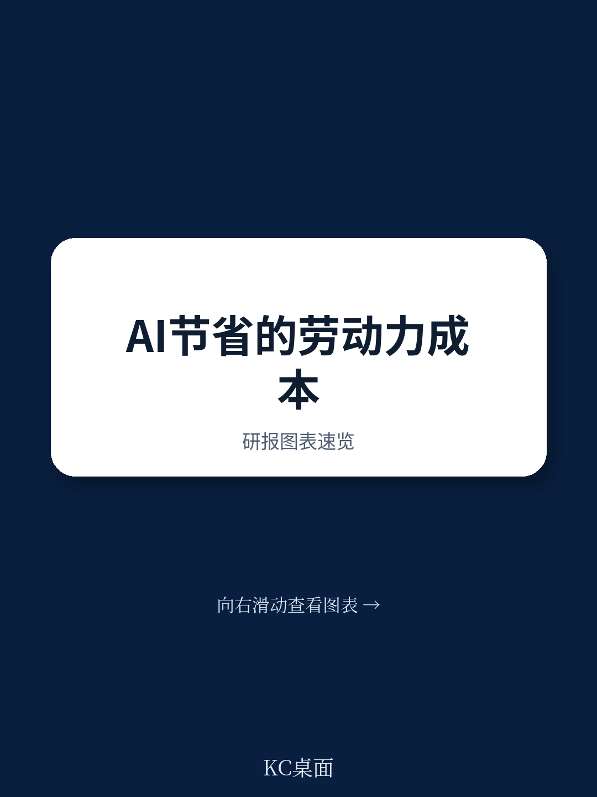
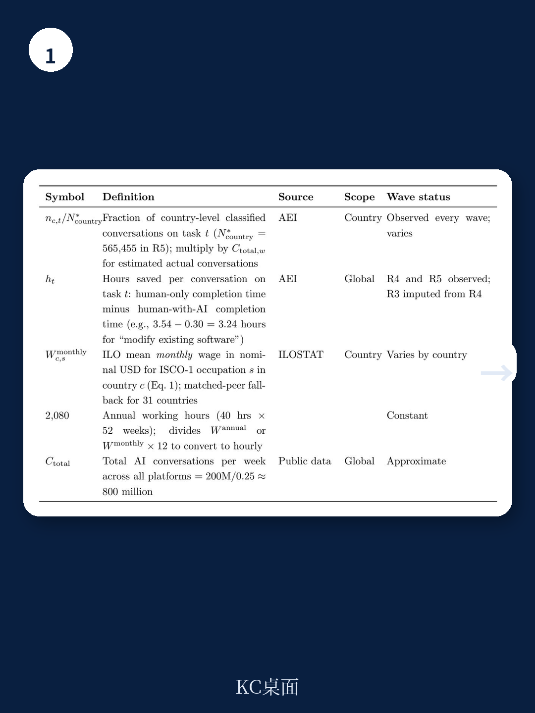
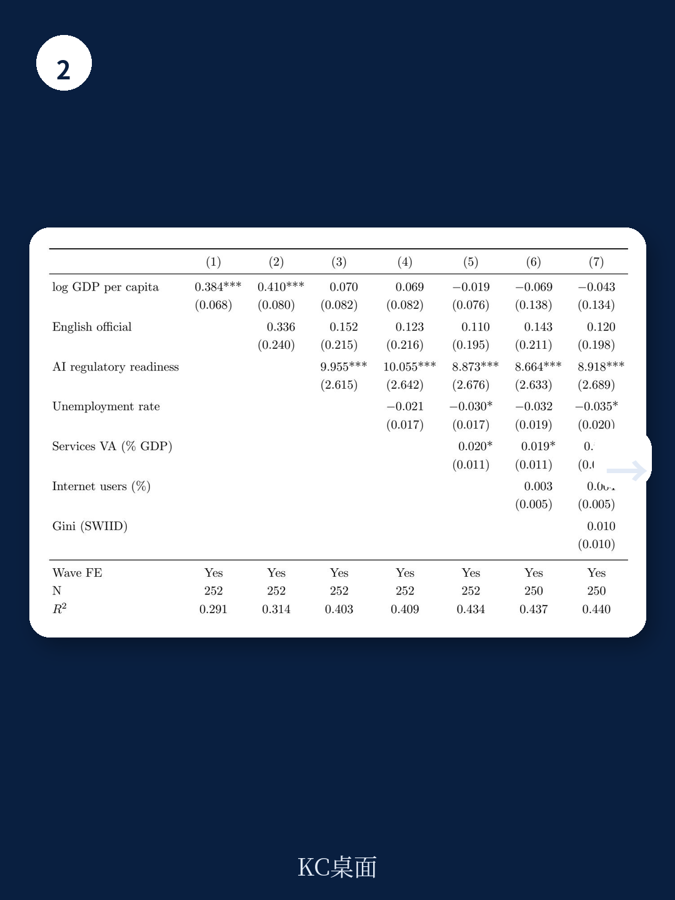

# IMF：AI每年节省2.7万亿美元，但发展中国家几乎没分到

人工智能正在为全球宏观环境节省巨额劳动成本。IMF最新工作论文基于Anthropic宏观环境指数五轮数据（2025年1月至2026年2月）估算，当前AI使用带来的时间节省价值约为每年2.7万亿美元，相当于样本国家GDP总和的3.4%。但这一数字掩盖了一个结构性不对称：在低收入国家，AI几乎全部价值被一个极小的专业人群捕获，而高收入国家的AI收益分布正变得越来越广泛。这不是关于AI能做什么的预测，而是关于AI正在被谁使用的实证。

**核心判断**：AI的收益分配正在经历一场“从窄到宽”的转变，但转变的速度和广度高度取决于一个国家的收入水平、监管准备度，以及——一个令人意外的变量——是否以英语为官方语言。

## 1. 2.7万亿美元的时间价值，但发展中国家贡献微薄

报告构建了一个关键指标——劳动成本等价（LCE），将AI节省的时间按各国自身工资水平估值。这并非GDP影响的直接测算，而是对已实现生产率提升的一个指示性度量。在86个样本国家中，AI每年节省的时间价值相当于这些国家GDP总和的3.4%。

但全球总量的背后是严重的不均衡。低收入国家不仅因为工资低而贡献的LCE份额小，更关键的是，其AI对话集中在极窄的职业范围内，无法像高收入国家那样通过大规模就业基数放大AI的整体收益。换句话说，美国AI使用的广度——从软件开发扩散到教育、销售、办公室工作——是驱动其LCE增长的主要力量；而坦桑尼亚的AI使用几乎全部集中在专业职业领域，农业、服务业等占劳动力大多数的群体几乎不参与。

> **KC评论：** 报告没有直接测算GDP影响，因为从时间节省到实际产出增长之间还有很长的传导链。但2.7万亿美元这个数字本身就是一个信号：AI已经不再是一个实验性工具，而是正在真实地改变全球劳动成本结构。完整报告里对时间节省假设的敏感性分析（2.5-2.9万亿美元）值得细看。

## 2. 集中度正在下降，但英语成为关键门槛

报告另一个核心创新是AI集中度指数（ACI），衡量AI收益在职业间分布相对于工资梯度的偏斜程度。ACI为正表示收益偏向高薪职业，为负偏向低薪，为零则中性。几乎所有国家在所有时点ACI均为正，但数值差异极大：美国为0.49，坦桑尼亚高达0.98。

更值得关注的是变化趋势。2025年8月至11月，108个国家中有32个ACI下降；到2026年2月，110个国家中已有53个ACI下降，接近一半。这意味着AI正在从最初的软件工程核心向外扩散，进入教育、销售、客服等相对低薪的职业。这种扩散是好事，但速度受制于一个结构性因素：英语是否被列为官方语言。

报告发现，英语作为官方语言是预测AI收益扩散速度的最强变量之一。原因很直接：当前主流大语言模型的训练数据以英语为主，非英语国家的机构知识、行业术语、地方性任务难以被模型准确理解和辅助。这不仅是一个语言问题，更是一个数据壁垒——发展中国家即使想用AI，模型也未必“懂”它们的工作内容。

> **KC评论：** 英语门槛这个发现对政策制定者有直接含义。如果AI红利的扩散依赖于语言接近性，那么非英语发展中国家可能需要两条腿走路：一是加速本地语言语料的数字化和模型适配，二是在教育和职业培训中强化英语能力。报告没有展开的是，多语言模型（如Claude本身支持的多语言对话）能否缩小这一差距，以及需要多长时间。

## 3. 监管准备度比数字基础设施更能预测AI价值

报告在解释各国AI收益差异时，发现了一个反直觉的结果：在控制收入水平后，AI监管准备度是预测一国AI价值占GDP比重的最大因素，甚至超过数字基础设施本身。

IMF的AI准备度指数包含四个子维度：数字基础设施、人力资本与劳动力市场、创新、监管与伦理。其中监管与伦理子指数与AI价值捕获的相关性最强。这听起来有些矛盾——监管通常被视为约束，但报告的数据表明，清晰的AI治理框架反而为企业和个人提供了更可预期的使用环境，从而加速了AI的实际部署。

这不是说监管越严格越好，而是说监管缺位可能比监管过度更不利于AI价值释放。当企业不清楚数据使用边界、责任归属、知识产权保护时，大规模部署AI的商业决策会被推迟。

**报告尚未完全回答的关键问题**：ACI下降的速度能否持续？当前的数据窗口只有13个月，集中度下降可能只是早期采用者从程序员扩散到其他办公室职业的短期现象。如果AI进一步渗透到零售、餐饮、农业等劳动密集型行业，ACI可能会加速下降；但如果AI能力在专业领域的提升速度远超其他领域，集中度可能再次回升。报告没有给出答案，但提供了跟踪框架。

## 4. 对观察者的框架：三个信号值得持续追踪

对于关注AI宏观环境影响的读者，报告提供了三个可以持续观察的维度

第一，**职业扩散的速度和方向**。不是看哪个行业“可能被AI影响”，而是看哪个行业“正在使用AI”。如果教育、销售、客服的AI使用份额持续上升，说明AI正在真正进入大众就业市场。

第二，**集中度指数的跨国分化**。如果高收入国家的ACI持续下降，而低收入国家维持高位，说明AI红利的“数字鸿沟”正在从“有没有”变成“谁用得起、谁用得上”。报告已经展示了这种分化，但未来几个季度的数据将验证这是趋势还是波动。

第三，**语言与数据壁垒的突破**。英语门槛是一个可观测的变量。如果未来有更多非英语国家的AI使用数据出现职业扩散，可能意味着多语言模型能力的实质提升，或者本地语言语料库的完善。这是发展中国家能否从AI中获益的关键检验。

报告的数据截至2026年2月，未来几轮Anthropic宏观环境指数的发布将提供更长的观察窗口。对于政策制定者和企业决策者，这份报告的启示很直接：AI的收益分配不是自动的，它取决于一个国家的收入水平、监管框架，甚至语言环境。那些以为“只要接入AI就能获益”的国家，可能需要重新审视自己的准备度。