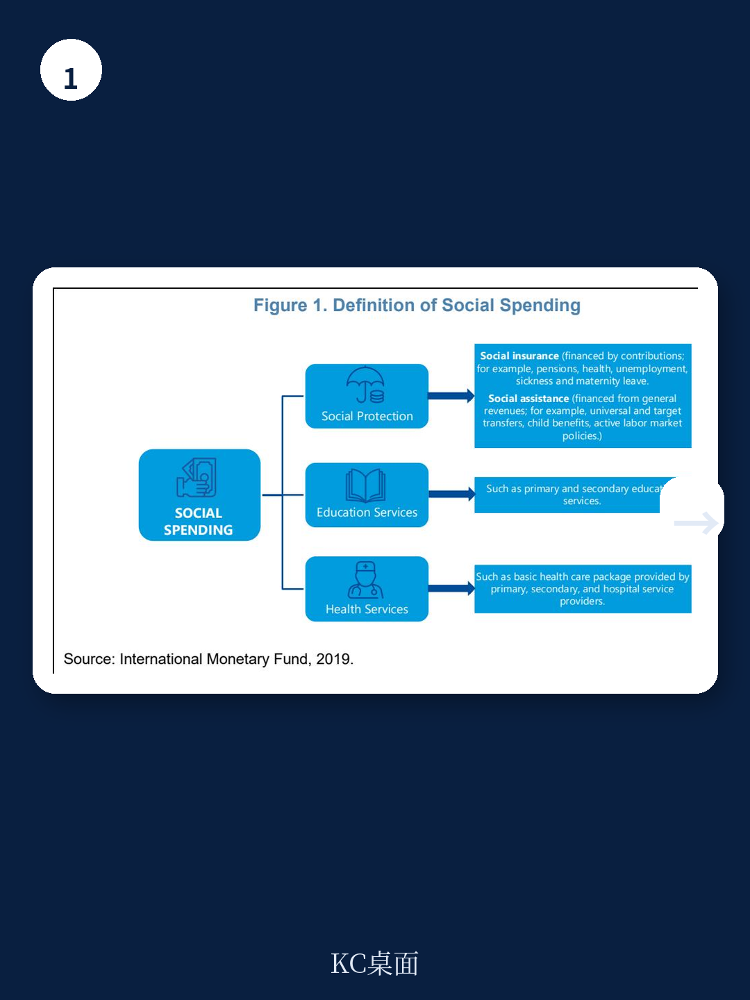
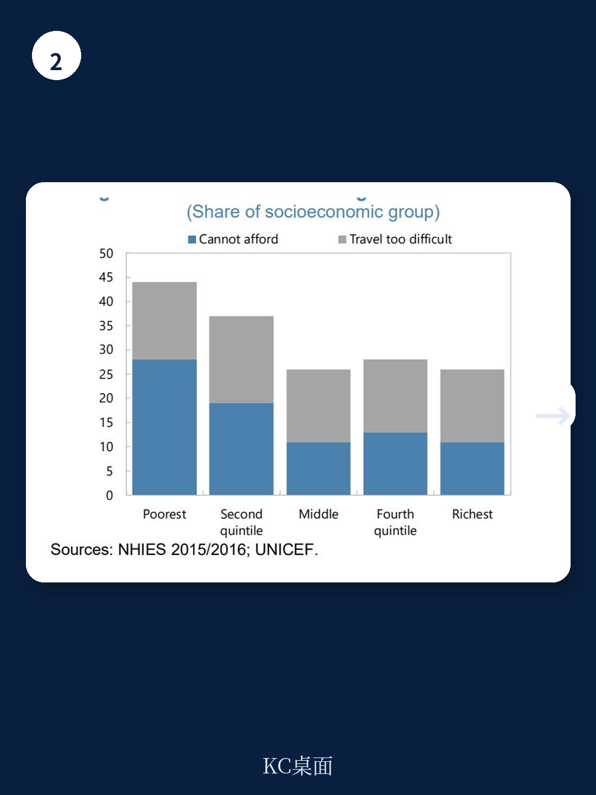

# IMF：纳米比亚社会支出不是太少而是用错地方

这份来自国际货币产品组织（IMF）的研报，针对纳米比亚的社会支出提出了一个反直觉的判断：这个国家在教育、医疗和社会救助上的公共支出水平，放在同等发展水平的国家中并不低，甚至偏高。但真正的问题在于，这些钱花下去之后，并没有带来同等的产出。

纳米比亚的基尼系数高达0.63，是全世界最不平等的国家之一。高失业率、高贫困率、以及结构性的人口分散（每平方公里不到3人），让社会支出天然面临成本高、效果难达的困境。但IMF的团队在分析了教育、医疗和社会救助三个板块之后，发现真正拖后腿的并非资金不足，而是资源配置的效率问题。

**KC评论：** 这份报告的核心洞察不是“纳米比亚需要更多钱”，而是“纳米比亚需要把钱花对地方”。对于研究新兴市场财政可持续性的读者来说，这是一个典型的“效率缺口”案例——支出水平与产出之间的差距，往往比支出水平本身更能说明问题。

## 1. 教育：高投入与低产出的反差

纳米比亚的教育支出占政府总支出约四分之一，远超同类国家。但这份支出结构存在明显失衡：大部分资金被锁定在教职工工资等经常性支出上，而用于教学材料、基础设施和针对性项目的资本性支出比例偏低。更关键的是，资源分配向高等教育倾斜，而基础教育的生均支出反而低于新兴市场平均水平。

这种分配模式直接反映在结果上。纳米比亚的小学入学率接近全覆盖，但到了中学阶段，入学率和完成率都明显落后于同类国家。更值得警惕的是，留级率和辍学率居高不下，数学成绩甚至低于撒哈拉以南非洲的平均水平。IMF利用随机前沿分析框架测算后发现，纳米比亚的教育支出效率在过去二十年几乎没有改善，在南部非洲关税同盟国家中排名靠后。

这意味着，单纯增加教育预算并不能解决根本问题。真正需要调整的，是资源在高等教育与基础教育之间、在工资与教学投入之间的分配比例。对于任何一个面临类似结构矛盾的发展中国家而言，这个结论都值得反复推敲。

## 2. 医疗：钱花在昂贵的末端，而不是预防的起点

纳米比亚的公共卫生支出约占GDP的5.5%，在同类国家中处于中上水平。但医疗系统的效率问题同样突出。报告指出，纳米比亚的医疗支出高度集中在医院和住院治疗上，而初级保健和预防性服务的投入占比过低。这种“重治疗、轻预防”的结构，导致同样的资金投入，产出的人均健康寿命等指标却低于部分支出水平相近的国家。

此外，纳米比亚的医疗系统存在严重的公私分割：公共系统服务了超过80%的人口，尤其是最贫困的群体，但医疗专业人员却大量集中在私立部门。这种资源错配进一步加剧了服务获取的不平等。低人口密度和地理分散又推高了单位服务成本。IMF的判断是，即便不增加总预算，只要把资金从昂贵的住院治疗转向基层医疗和预防服务，就有可能在现有财政约束下显著改善健康产出。

**KC评论：** 报告在医疗部分特别强调了“通用健康覆盖改革”的重要性。对于关注非洲卫生政策或全球健康筹资的读者，这份报告提供了一个具体的分析框架：如何在不增加财政负担的前提下，通过调整支出结构来提升效率。完整报告中的图表详细对比了纳米比亚与其他新兴市场国家的支出结构与产出曲线，值得进一步查看。

## 3. 社会救助：覆盖广但目标不准，最穷的人反而被漏掉

纳米比亚的社会救助体系覆盖面不算小，尤其是针对老年人的养老金项目。但报告发现，这些项目的目标瞄准机制存在明显不足。相当一部分资金流向了非贫困人口，而真正处于最贫困状态的群体反而没有被有效覆盖。这既削弱了减贫效果，也浪费了宝贵的财政资源。

IMF建议，通过加强身份识别和条件审核，把节省下来的资金重新定向到最需要帮助的人群，可以在不增加总预算的情况下提升社会救助的减贫效率。这对于一个财政空间已经非常有限、债务率持续上升的国家来说，是务实的路径。

## 4. 报告尚未完全回答的关键问题

这份研报在效率分析上做得非常扎实，但有几个关键问题它没有完全展开。首先是政治宏观环境学层面的约束。纳米比亚的公共部门工会力量强大，教育系统和医疗系统的工资刚性极强，调整支出结构面临巨大的政治阻力。报告虽然提到了“支出刚性”，但没有深入分析如何突破这些既得利益格局。

其次是人口增长带来的长期不确定性。纳米比亚的人口增长率在非洲并不算低，而报告中已经提到，快速的人口增长正在加剧教育系统的需求不确定性。如果效率改善的速度赶不上人口增长的速度，那么即使支出结构优化，人均产出仍可能持续下滑。

最后是宏观环境增长与财政可持续性的互动。社会支出的效率改善可以在一定程度上缓解财政不确定性，但纳米比亚的宏观环境增长动力不足，税收基础薄弱，长期来看，如果没有更强劲的宏观环境增长，仅靠效率提升难以支撑社会支出的可持续性。

## 5. 给读者的观察框架

如果你在研究其他面临类似困境的新兴市场国家——比如高支出、低效率、高不平等的组合——IMF这篇报告提供了一个可复用的分析框架：先看支出水平是否真的低于同类国家，再看支出结构是否合理，最后看产出是否匹配投入。这三步走下来，往往能发现真正的瓶颈不在于钱，而在于钱怎么花。

报告的附录部分提供了详细的支出评估工具和数据来源，对于做跨国比较的研究者来说，是很有价值的参考。

For informational purposes only. Portions may be generated,translated,summarized,or edited with AI assistance based on source materials and may contain omissions or errors. Please verify independently. This is not investment,legal,tax,accounting,or other professional advice.
