# Competition and Productivity in Middle East and Central Asia What Role Do Tariffs Play?

Walid Faris, Etibar Jafarov, and Umang Rawat

WP/26/143

IMF Working Papers describe research in progress by the author(s) and are published to elicit comments and to encourage debate. The views expressed in IMF Working Papers are those of the author(s) and do not necessarily represent the views of the IMF, its Executive Board, or IMF management.

2026
JUL

# IMF Working Paper Middle East and Central Asia Department

# Competition and Productivity in Middle East and Central Asia: What Role Do Tariffs Play?

Prepared by Walid Faris, Etibar Jafarov, and Umang Rawat\*

Authorized for distribution by Alexander Tieman
July 2026

IMF Working Papers describe research in progress by the author(s) and are published to elicit comments and to encourage debate. The views expressed in IMF Working Papers are those of the author(s) and do not necessarily represent the views of the IMF, its Executive Board, or IMF management.

ABSTRACT: Across much of the Middle East and Central Asia (ME&CA), market competition remains weaker than in other emerging markets, holding back productivity and income growth. Using firm-level data from Orbis for 2002–2021, this paper studies the evolution of market competition in ME&CA economies and examines how trade policy and institutions shape competitive dynamics. We find that market power remains substantial and uneven across ME&CA, with particularly high markups in resource-intensive activities, selected service sectors, and—more recently—manufacturing in the Caucasus and Central Asia (CCA). Higher tariff protection is systematically associated with faster growth in markups, indicating that trade barriers weaken competitive pressure, while improvements in competition policy, anti-corruption frameworks, and property rights are linked to declining market power and hence increasing competition. Although productivity gaps remain large and persistent, stronger competition is associated with faster firm-level productivity growth and higher GDP per capita growth, with these effects particularly pronounced in CCA economies. Overall, the findings highlight the importance of policies aimed at reducing trade barriers and strengthening institutional and competition policy frameworks to foster competition, raise productivity, and support long-term income growth in the ME&CA region.

RECOMMENDED CITATION: Faris, W., Jafarov, E & Rawat, U. (2026). "Competition and Productivity in Middle East and Central Asia: What Role Do Tariffs Play?" IMF Working Papers, 2026/143.

<table><tr><td>JEL Classification Numbers:</td><td>D4, F1, L1, O2</td></tr><tr><td>Keywords:</td><td>Market Power; Markups; Total Factor Productivity; Tariffs; Competition Policy; Middle East and Central Asia; Productivity Gaps</td></tr><tr><td>Author&#x27;s E-Mail Address:</td><td>walid.faris@dauphine.psl.eu, EJafarov@imf.org, URawat@imf.org</td></tr></table>

WORKING PAPERS

# Competition and Productivity in Middle East and Central Asia What Role Do Tariffs Play?

Prepared by Walid Faris, Etibar Jafarov, and Umang Rawat $^{1}$

## Contents

1. Introduction......6
2. Literature Review......7
3. Data and Sample......8
4. Measuring Competition and Stylized Facts......11
4.1 Markup Estimation – Production Function Approach......11
4.2 Markup-Adjusted Productivity Gap Estimation......12
4.3 Data Challenges Related to Estimation Methodologies......13
4.4 Stylized Facts......14
4.4.1 Market Power in ME&CA......14
4.4.2 Markup-Adjusted Productivity Gaps in ME&CA......18
4.4.3 Tariffs in ME&CA......20
4.4.4 Organization of the Market and Competition in ME&CA......21
5. Relationship between Policy Reforms, Competition, and Growth......23
5.1 How does Trade Protection and Institutional Reforms to Competition Policy affect Market Competition?
......23
5.1.1 Empirical Strategy......23
5.1.2 Impact of Tariffs......23
5.1.3 Impact of Policy Implementation......26
5.2 Does Higher Competition Lead to Higher Productivity Growth?......29
5.2.1 Empirical Strategy......29
5.2.2 Competitive Pressure and Productivity Growth......30
5.3 Does Higher Competition Lead to Higher GDP Growth?......33
5.3.1 Empirical Strategy......33
5.3.2 Competitive Pressure and Productivity Growth......34
6. Conclusion......38
Annex I. Sample Representativeness......39
A.I.a. Summary Statistics by Country......39
A.I.b. Ownership Structure by Country......40
A.I.c. Sample Industry Distribution......40
Annex II. Country Specific Results......41
A.II.a. Sales-weighted Markups......41
A.II.b. Sales-weighted MFPR Gaps......42
Annex III. Region Specific Results......44
A.III.a. ME&CA Sales-weighted Profitability......44
A.III.b. CCA Sales-weighted Markups by Industries......44
A.III.c. MENA Sales-weighted Markups by Industries......45

Annex V. Competition and Productivity....54
A.V.a. Association between Competition and TFP Growth Excluding Financial Services....54
A.V.b. Competition and TFP Growth Excluding Financial Services – Interaction with CCA & GCC....55

A.III.d. GCC Sales-weighted Markups by Industries ....45
A.III.e. CCA Manufacturing Sales Shares (%) by Technology Intensity ....46
A.III.f. CCA Sales-weighted Manufacturing Markups by Technology Intensity ....46
A.III.g. Firm-Level (Melitz–Polanec) Decomposition of Markup Changes ....46

Annex IV. Policy Changes and Competition....48
A.IV.a. Tariffs, Within-Firm Markups, and Market-Share Reallocation....48
A.IV.b. Manufacturing Markups IRF to Tariff Change without ICRG Controls....49
A.IV.c. Anti-Corruption Policies and Competition....50
A.IV.d. Private Enterprise Policies and Competition....51
A.IV.e. Foreign Trade Policies and Competition – CCA Interaction....52
A.IV.f. Control of Corruption and Competition....53

## References.

## FIGURES

1. Sales-weighted Markups in ME&CA and Other EMDEs....14
2. ME&CA: Sales-weighted Markups....15
3. ME&CA: ME&CA Sales-weighted Average Markups by Industries....16
4. ME&CA: Sales-weighted Markup-adjusted Productivity Gaps in ME&CA and Other EMDEs....18
5. Productivity Gaps in the Manufacturing and Service Sectors in the ME&CA Region....19
6. ME&CA: Imports-Weighted Tariff Rates by Industries....20
7. BTI Indexes by Region....21
8. Manufacturing Markups IRF to Tariff Change....26

## TABLES

1. Effect of Tariff Changes on Markups and MFPR Gaps....24
2. Effect of Competition Policy on Markups and MFPR Gaps....27
3. Effect of Foreign Trade Policy on Markups and MFPR Gaps – Interaction with CCA....28
4. Effect of Competition on TFP Growth....31
5. Effect of Competition on TFP Growth: CCA & GCC Interaction with ME&CA....32
6. Effect of Competition on Growth of GDP per Capita in ME&CA....35
7. Effect of Competition on Growth of GDP per Capita in ME&CA – Interaction with CCA....37

## 1. Introduction

Competition among firms is an important factor driving productivity growth in market economies. It ensures that resources are allocated efficiently (allocative efficiency); creates strong incentives to boost innovation and upgrade production (production efficiency); and creates the right environment for the entry of productive firms and exit of less productive ones (market selection). The extent to which these mechanisms operate depends on market structure and institutional and policy environments.

Markets in emerging market and developing economies (EMDEs) are often characterized as less competitive, with the Middle East and Central Asia (ME&CA) being no exception. While considerable heterogeneity exists across countries in the region, this perception is attributed to several factors, including: a large dependence on natural resources and commodity revenues that generates economic rents, reducing contestability despite policy efforts to diversify these economies (in particular, in Gulf Cooperation Council, GCC, and commodity-rich countries in Caucasus and Central Asia, CCA), the presence of significant market distortions, a large presence of state-owned enterprises (SOEs) that stifles the development of a competitive private sector, dominant family-owned firms with considerable governance issues, and slow governance and institutional reforms, particularly in some transition countries in CCA.

The competition structure is also closely linked with trade regulation and tariff barriers. Tariffs and non-tariff barriers are often used to protect domestic markets from foreign entrants, particularly in the presence of market distortions. By restricting the entry of productive firms into domestic markets, such barriers can limit firm dynamism and lead to stagnant productivity. Instead, competition alongside a strong competition policy framework can help to improve welfare and other macroeconomic outcomes (Dutz and Hayri 1999; UNCTAD 2004; Aghion and Griffith 2005).

In this paper, we explore market competition dynamics in ME&CA $^{1}$ and aim to answer the following key questions: (i) how has competition evolved across firms and sectors in the region and is there heterogeneity within the region and compared to other EMDEs?; (ii) what role do tariffs play in shaping market competition; and (iii) does higher competition translate into faster productivity growth?

To answer these questions, we use the production function approach (De Loecker & Warzynski (2012)) to estimate firm-level corporate markups for EMDEs, including in the ME&CA region, using firm-level data for 2002-2021 from Orbis, for both listed and unlisted firms. Further, following Andrews and others (2016), we estimate markup-adjusted productivity gaps to capture the distance between firm-level productivity and the productivity frontier at the industry/sector level. Country-sector-level tariffs are weighted at the NACE-2 sector level to assess their impact on market competition and productivity gaps. Additionally, we empirically assess the impact of markups on firm-level productivity.

Our analysis points to a close link between competition, trade policy, structural reforms, and growth performance in ME&CA economies. Limited competition and elevated markups appear to constrain productivity and income growth, particularly in countries where barriers to entry and market contestability remain high. Specifically, we find that:

\- Market competition in the ME&CA region remains uneven across sectors and subregions, with persistently high markups in several industries, particularly in resource-intensive activities and selected service sectors. While manufacturing markups were historically lower than in services, they have increased in recent years, especially in the CCA subregion.

\- Trade policy and the effectiveness of broader market-regulating institutions play an important role in shaping the evolution of competitive conditions. Higher tariff protection is systematically associated with faster growth in sectoral markups and a widening of productivity gaps over time, indicating that trade barriers weaken competitive pressure and slow productivity convergence. Beyond trade policy, improvements in competition policy frameworks, anti-corruption policies, and private property protection are associated with lower growth rates of markups, particularly in sectors that are more sensitive to domestic regulatory and governance conditions. Furthermore, the effectiveness with which market-oriented policies are implemented, rather than their existence alone, plays a central role in shaping competitive dynamics and market power growth. The latter finding underscores the importance of effective enforcement alongside formal rules.

\- Stronger competition is associated with improved economic outcomes. Firms operating in more competitive sectors experience faster productivity growth, while higher market power is linked to slower growth in both firm-level total factor productivity and aggregate GDP per capita. These associations are economically meaningful and robust across alternative markups and productivity measures. The negative impact of market power on growth is substantially stronger in the CCA subregion, indicating that competitive frictions there translate more sharply into weaker productivity and growth dynamics.

The rest of the paper is organized as follows. Section II provides a literature overview. Section III describes the sample and data source. Section IV describes the methodology for estimating markups and productivity gaps, along with the challenges in applying these methods to EMDEs, particularly in ME&CA, and presents some stylized facts pertaining to product market competition in ME&CA. Section V discusses empirical results of the analyses of the effects of tariffs and structural reforms on competition, and of the relationship between competition and productivity and growth. Section VI concludes.

## 2. Literature Review

A growing body of research documents a sustained increase in corporate market power across advanced and emerging economies starting in 1980s, pointing to potential adverse effects on business dynamism. De Loecker and Eeckhout (2017) and Hall (2018) highlighted a sharp increase in firm-level markups along with declining labor share in the United States, with implications for resource allocation and business dynamism. Using industry concentration as a proxy for market power, Gutiérrez and Philippon (2017) found a marked rise in market concentration in the U.S. along with lower investment rates, while Barkai (2017) showed that rising markups were associated with falling labor shares. Diez and others (2018) documented rising markups for a wide range of economies and identified a non-linear relationship between market power and investment, with a significant share of firms operating at markup levels beyond which higher markups are associated with lower investment. Related theoretical work highlighted the aggregate costs of market power through misallocation and lower TFP (Baqaee and Farhi, 2017; Edmond and others, 2018).

Another strand of literature focuses on policy determinants of competition. Gutiérrez and Philippon (2018) report systematically lower market concentration in Europe than in the U.S. and attribute part of this divergence to stronger antitrust enforcement after the 1980s-1990s, when the EU strengthened competition enforcement through the-called DG Competition reforms. Evidence from Italy shows that political connections shield firms from competitive discipline, raising survival and employment but not productivity or innovation (Akcigit and others, 2018). More broadly, differences in regulation, product-market contestability, and governance have been proposed as structural sources of cross-country variation in market power, with implications for productivity growth and allocative efficiency.

A third strand of literature directly links trade liberalization to markups and productivity. Much of the empirical evidence is based on single-country studies that focus on national tariff reforms and domestic-market responses. Reducing output tariffs (tariffs on final goods) intensifies competition for domestic producers' products, which reduces markups and forces reallocation toward more efficient firms. Lower input tariffs operate through a distinct channel of lowering the cost and quality-adjusted price of intermediate inputs, allowing firms to access higher-quality varieties, expand product scope, and raise productivity. Empirical work confirms the importance of both channels. Lower output tariffs reduce markups and intensify competition (Levinsohn, 1993; Harrison, 1994; De Loecker, Goldberg, Khandelwal and Pavcnik, 2016), while lower input tariffs raise productivity through improved access to imported intermediate goods (Amiti and Konings, 2007; Goldberg and others, 2010; Halpern and others, 2011). Finally, trade reforms also affect aggregate productivity through firm selection, as less productive firms exit and surviving firms expand (Melitz, 2003; Pavcnik, 2002).

Despite longstanding concerns about rent-seeking, state dominance, and barriers to entry, empirical analyses for the ME&CA region are limited. Korniyenko, Tohamy, and Xin (2025) provide the first systematic markup estimates for listed MENA firms and find persistently high market power with gradual declines following reforms, including evidence that VAT adoption reduced markups in GCC economies. Earlier work emphasized weak competitive pressures and the prevalence of politically connected firms (Diwan and others, 2020), while IMF regional assessments highlight the role of market distortions, governance challenges, and limited contestability in shaping firm performance in ME&CA (IMF REO, 2023). However, these studies focus primarily on listed firms and provide limited analysis of productivity dispersion, reallocation dynamics, or the interaction between trade policy and [structural reforms and] competition outcomes.

This paper contributes to the literature in several ways. First, it provides comprehensive firm-level estimates of markups and productivity gaps for both listed and unlisted firms across ME&CA, using harmonized Orbis microdata. Second, it incorporates trade policy into the analysis by examining how tariff changes affect both markups and productivity dispersion, thereby linking pro-competitive and input-cost channels within a unified framework. Third, it relates competition indicators to growth outcomes, offering a region-specific assessment of whether weaker competition is associated with lower dynamism in ME&CA. Finally, the paper extends existing work on listed MENA firms by providing a broader firm-level perspective and by assessing the role of tariff policy and institutional and structural reforms in shaping competition and productivity dynamics.

## 3. Data and Sample

The main data source of this study is Bureau Van Dijk's Orbis, which provides harmonized cross-country financial statements for both privately held and publicly listed firms. Consistent with Kalemli-Ozcan and others (2015), Gopinath and others (2017), Gal (2013), and Diez and others (2018), the raw data require extensive cleaning before use in productivity and markup estimation. We remove firm-year observations with missing or implausible values in core accounting variables (including negative sales, total assets, employment, cost of employees, tangible fixed assets, and liabilities), drop observations with missing or zero

values for key production variables (such as operating revenue and material costs), and exclude firms without valid NACE industry codes. Additional quality checks ensure internal consistency of the balance sheet and income statement by verifying that the components of fixed assets, current assets, and shareholder funds sum to their reported aggregates.

We also apply a series of firm-level outlier filters. These include percentile-based filters for employment per unit of assets and revenue, the ratio of revenue to assets, and the ratio of costs to value added. We complement these filters with the growth-rate based procedure developed in Kalemli-Ozcan and others (2015). This method identifies implausible firm trajectories by comparing year-to-year growth in employment, sales, and operating revenue, applying size-specific thresholds that are more permissive for small firms and more restrictive for large ones. Firms exhibiting implausible growth patterns across any of these dimensions are removed from the sample.

To facilitate comparison and analysis, we convert all financial variables to 2015 US dollars. All nominal firm-level variables are first deflated in local currency and then converted into constant 2015 U.S. dollars. Operating revenue, wage bills, material costs, cost of goods sold, and value added are deflated using the most disaggregated price index available for each country and sector. When available, we rely on sectoral deflators at the 2-digit NACE level, and otherwise on 1-digit industry deflators. When sectoral deflators are not available, we use the national GDP deflator. For the ME&CA region, detailed sectoral deflators are largely unavailable, so these flow variables are predominantly deflated using the country level GDP deflator. Capital variables are treated separately. Fixed assets variables are deflated using the World Development Indicators investment price index expressed in PPP terms when available. When this series is unavailable, we rely on the national GDP deflator. After deflation, all variables are converted into constant 2015 U.S. dollars using the corresponding country's 2015 exchange rate.

Our empirical analysis focuses on firms located in the ME&CA region. Specifically, the sample includes firms from the MENA region (Egypt, Iran, Jordan, Morocco, Pakistan), the GCC countries (United Arab Emirates, Kuwait, Oman, Saudi Arabia), and the CCA region (Armenia, Georgia, Kazakhstan, and Uzbekistan). Annex I reports the complete country list and coverage. The baseline sample includes 517,972 firm-year observations from 135,876 firms operating in a wide range of sectors from 2002 to 2021. The average firm has annual operating turnover of approximately 20 million U.S. dollars, incurs direct production costs of roughly 13 million U.S. dollars and holds about 16 million U.S. dollars in tangible fixed assets.

In addition to financial information, we use the ownership module of Orbis to identify the global ultimate owner (GUO) of each firm in the sample. The methodology builds on Faris (2024) and follows the ownership-classification approaches used in Kalemli-Ozcan and others (2015, 2024). The procedure combines information on direct and indirect shareholding, entity types, and independence indicators from Orbis to classify firms into ownership groups that are comparable across countries.

These data allow us to construct dummies for family-owned firms, state-owned firms, foreign-owned firms, financial owners, and jointly owned firms (consistent with the ownership categories used in Kalemli-Özcan and others, 2024). We first identify listed firms and trace their subsidiaries, which allows us to distinguish between listed corporate groups, private groups, and standalone firms. Standalone firms are defined as firms that are not part of any ownership group, based on Orbis group and linkage information. For these firms, ownership is determined directly at the shareholder level rather than through a global ultimate owner. We also identify jointly owned firms, where two shareholders jointly hold 50 percent of control. When no ownership information is available, we rely on the Orbis independence indicators to classify the global ultimate owner type as either widely held or unknown, depending on the degree of reported ownership independence.

## When the GUO cannot be directly identified, we refine ownership by investigating ultimate

shareholders of controlling entities. For individuals, we tokenize shareholder names to identify families sharing a common name token. When aggregated individual control exceeds 50 percent for private firms (or 25 percent for listed firms), we classify the firm and its subsidiaries as family-owned. Firms with multiple individuals each holding significant but unconnected shares are classified as widely held. When the GUO cannot be determined from the available information, we assign a fallback classification based on the entity type of the firm itself, treating banks, insurance companies, and financial entities as GUOs types when appropriate, and assigning widely held or unknown status when no further refinement is possible. Summary statistics for ownership categories and country coverage are reported in Annex I.

To obtain tariff data, we use the World Integrated Trade Solution (WITS), which provides applied import tariffs at the Harmonized System (HS) product level. HS6-level applied tariffs and associated import values for all reporter countries and years available in WITS are used to compute import-weighted tariff averages for countries. $^{2}$ These country-level measures are available for the entire sample period and are used to capture the effective protection structure of each economy and its evolution over time. This allows us to study how trade policy affects competition conditions and the market power of domestic firms. We also compute sector-level tariff averages. HS products are mapped to NACE industries using a standard HS-NACE concordance. HS-level tariff and import information is grouped into NACE 2-digit industries and aggregated within each country-industry-year cell using import values as weights. This generates a panel of sector-level applied tariffs that is consistent with the industry classification used in the Orbis microdata. In cases where WITS does not report applied tariffs for specific country-year observations, we supplement missing values using the World Bank's weighted-mean applied tariff series to maximize time coverage for ME&CA economies.

We complement the firm-level and tariff data with country-level indicators from the Bertelsmann Stiftung Transformation Index (BTI). The BTI provides expert-based assessments of institutional quality and market organization, with scores ranging from 1 to 10. These indicators allow us to capture the broader policy environment in which firms operate, particularly dimensions related to market functioning, competition, and resource allocation. They are available every two years. For ME&CA, we use the BTI waves from 2006 to 2022, which provides a sufficiently long panel to capture medium-term policy changes. Coverage by country is reported in Annex I.

In addition, we also use a broad set of macroeconomic conditions that may influence firm performance and competitive dynamics. Most macroeconomic indicators are drawn from the IMF World Economic Outlook (WEO) and the World Bank World Development Indicators (WDI) databases. To account for cross-country variation in political and macroeconomic stability, we also include standard risk indicators from the International Country Risk Guide (ICRG), covering dimensions such as government stability, bureaucratic quality, and broader political and economic risk.

## 4. Measuring Competition and Stylized Facts

## 4.1 Markup Estimation – Production Function Approach

To estimate firm-level markups, we follow the production-function approach developed by Hall (1986, 1988) and formalized by De Loecker and Warzynski (2012), as implemented in Díez, Fan and Villegas-Sánchez (2019). The central idea is that, under cost minimization, the first-order condition for a flexible input links the markup to the ratio of the output elasticity of that input to its expenditure share in revenue. Let $\mu_{\mathrm{it}}$ denote the markup of firm i in year t, $V_{\mathrm{it}}$ a flexible input, and $P_{\mathrm{it}}Q_{\mathrm{it}}$ nominal revenue. Then:

$$
\mu_ {\mathrm{it}} = \frac {\beta_ {\mathrm{it}} ^ {\mathrm{V}}}{\alpha_ {\mathrm{it}} ^ {\mathrm{V}}}
$$

where $\beta_{it}^{V}$ is the output elasticity of the variable input and $\alpha_{it}^{V}=\frac{p_{it}^{V}v_{it}}{P_{it}Q_{it}}$ is the corresponding revenue share. The expenditure share is directly observable in Orbis. The output elasticity must be estimated from the production function.

The flexible input used in our estimation is the cost of goods sold (COGS). When Orbis reports material and labor costs separately, we construct COGS as their sum. The cost share is therefore defined as:

$$
\alpha_ {\mathrm{it}} = \frac {\mathrm{COGS} _ {\mathrm{it}}}{\text {Operating Revenue} _ {\mathrm{it}}}
$$

Following Díez and others (2019), we assume that firms operating in the same country and 2-digit NACE industry share a common production technology. We therefore estimate the production function separately for each country-industry cell. Let lowercase letters denote logs. The baseline specification is:

$$
\mathbf {y} _ {\mathrm{it}} = \beta_ {\mathrm{v}} \mathbf {v} _ {\mathrm{it}} + \beta_ {\mathrm{k}} \mathbf {k} _ {\mathrm{it}} + \omega_ {\mathrm{it}} + \varepsilon_ {\mathrm{it}}
$$

where $y_{it}$ is real operating revenue, $v_{it}$ is real COGS, $k_{it}$ is real capital (tangible fixed assets), $\omega_{it}$ is unobserved productivity, and $\varepsilon_{it}$ captures measurement error. Because firms observe their productivity when choosing inputs, $v_{it}$ and $k_{it}$ may be correlated with $\omega_{it}$ , generating simultaneity bias. To address this, we estimate the production function using the proxy-variable (control-function) estimator of Ackerberg, Caves, and Frazer (2015), which builds on Olley and Pakes (1996) and Levinsohn and Petrin (2003). Productivity is assumed to follow a first-order Markov process:

$$
\omega_ {\mathrm{it}} = \mathsf {g} \big (\omega_ {\mathrm{i,t-1}} \big) + \xi_ {\mathrm{it}}
$$

The estimation proceeds in two steps. In the first step, we obtain an estimate of expected output:

$$
\mathbf {y} _ {\mathrm{it}} = \phi_ {\mathrm{t}} (\mathbf {v} _ {\mathrm{it}}, \mathbf {k} _ {\mathrm{it}}) + \varepsilon_ {\mathrm{it}}
$$

where $\phi_{t}(\cdot)$ is a flexible polynomial in inputs with year effects. In the second step, the structural production-function elasticities are estimated using GMM moment conditions derived from the assumed first-order Markov process for productivity, with lagged inputs serving as instruments in line with Ackerberg and others (2015).

We implement three markup specifications that differ in how the output elasticity of the flexible input is obtained. The first specification, denoted $\mu^{\mathrm{ols}}$ , estimates a pooled Cobb-Douglas production function with year fixed effects. This produces a single elasticity $\beta^{\mathrm{v}}$ for each country-industry cell, which remains constant over time. The second specification, denoted $\mu^{\mathrm{dlw}}$ , applies the structural De Loecker-Warzynski GMM estimator under a Cobb-Douglas functional form. This also yields a constant elasticity $\beta^{\mathrm{v}}$ for each country-industry pair but corrects simultaneity using the control-function approach. The third specification, denoted $\mu^{\mathrm{dlwtl}}$ , estimates a second-order translog production function, allowing the elasticity of the flexible input to vary across firms and over time because $\beta_{\mathrm{v,it}}$ depends on each firm's own input levels.

The control-function estimation also produces two measures of total factor productivity. The Cobb-Douglas specification yields $TFP^{dlw}$ while the translog specification yields $TFP^{dlwtl}$ . Both measures are defined as the residual component of output after subtracting the contributions of flexible inputs and capital:

$$
\omega_ {\mathrm{it}} = \mathrm {y_ {it}} - \hat {\beta} _ {\mathrm{v}} \mathrm {v_ {it}} - \hat {\beta} _ {\mathrm{k}} \mathrm {k_ {it}}
$$

## 4.2 Markup-Adjusted Productivity Gap Estimation

To study differences in performance between frontier firms and the rest, we construct productivity gaps following Andrews and others (2016). The starting point is the firm-level productivity measure obtained from the production-function approach described above. Throughout this analysis, we rely on the Cobb-Douglas productivity measure TFP $^{dlw}$ , and on the corresponding markup $\mu_{it}^{dlw}$ . Because TFP $^{dlw}$ is revenue-based, it incorporates both technological efficiency and price-cost margins. In the terminology of Andrews and others (2016), this measure corresponds to MFPR, multi-factor revenue productivity. To isolate the technological component, we construct a markup-adjusted productivity measure by purging the revenue component associated with markups. For each firm i in year t, the markup-adjusted productivity measure is:

$$
\ln \bigl (\mathrm{TFP} _ {\mathrm{i,t}} ^ {\mu} \bigr) = \ln \bigl (\mathrm{TFP} _ {\mathrm{i,t}} ^ {\mathrm{dlw}} \bigr) - \ln \bigl (\mu_ {\mathrm{i,t}} ^ {\mathrm{dlw}} \bigr)
$$

where $\mu_{i,t}^{dlw}$ is the markup estimate. This definition corresponds to the markup-adjusted MFPR used in Andrews and others (2016), where the objective is to recover a measure closer to true marginal-productivity differences across firms.

A key step is the identification of frontier firms. A direct application of the top-5% rule in each industry-year cell is problematic in Orbis, because firm coverage expands significantly over time, especially through the entry of smaller and less productive firms. As shown in Andrews and others (2016), this expanding coverage can mechanically pull down measured frontier productivity in later years. To avoid this, we follow their preferred approach and construct a fixed frontier size for each industry. For each 2-digit NACE industry s, we compute the median number of firms observed across all years, take 5 percent of this number, and define this as the frontier size for the industry. Firms are then ranked by TFP $^{dlw}$ within each industry-year cell, and the highest-productivity firms up to the fixed threshold constitute the frontier for that year. Although the number of frontier firms is fixed, the identity of these firms is allowed to change over the years. New firms may enter the frontier as they grow rapidly, while others may fall behind. This dynamic identification ensures that the frontier reflects true technological change rather than mechanical effects of dataset growth.

For each industry-year, we compute the average log productivity of frontier firms and of markup-adjusted frontier firms. Productivity gaps are then defined as the distance of each firm if from its industry frontier. The markup-adjusted productivity gap by:

$$
\mathrm{MFPR} _ {\mathrm{i}, \mathrm{s}, \mathrm{t}} ^ {\mu} = \ln \big (\mathrm{TFP} _ {\mathrm{s}, \mathrm{t}} ^ {\mu , \mathrm{frontier}} \big) - \ln \big (\mathrm{TFP} _ {\mathrm{i}, \mathrm{t}} ^ {\mu} \big).
$$

The markup-adjusted gap is particularly informative for assessing productive efficiency, since it nets differences in pricing power. In the broader interpretation of Andrews and others (2016), large and persistent productivity gaps can serve as an additional indicator of weak competitive pressures. Barriers to entry, lack of competitive discipline, and slow diffusion of best practices allow frontier firms to remain dominant while laggard firms struggle to upgrade. Conversely, stronger competitive environments compress these gaps by forcing inefficient firms to exit and by facilitating diffusion from high-productivity producers. We therefore rely on $MFPR_{i,s,t}^{\mu}$ as a complementary indicator of competitive dynamics and diffusion frictions across ME&CA industries.

## 4.3 Data Challenges Related to Estimation Methodologies

The empirical analysis faces several data-related challenges related to data coverage for the ME&CA region. These constraints inform a number of methodological choices that are explicitly designed to balance statistical power, comparability across countries, and the scope of the analysis.

First, firm-level coverage in Orbis differs markedly across subregions. Coverage is relatively limited in GCC countries, while it is more extensive in parts of the CCA subregion, though still uneven across sectors and years. Orbis also tends to cover the largest firms first, so that where coverage is thin, samples skew toward large, often listed, firms, which may affect the level of estimated markups. To address this imbalance and preserve sufficient sample size for production-function estimation, we estimate firm-level markups using country-sector production functions and assume time-invariant production-function parameters within sectors as our baseline markup measure. This approach allows us to retain a sufficiently large and comparable sample across countries while limiting the loss of precision in elasticity estimates.

Second, estimating production functions and markups requires a minimum number of observations within each country-sector cell to reliably identify output elasticities. We therefore impose lower minimum cell-size thresholds and drop thin country-sector cells that do not meet these requirements. This choice reflects a deliberate trade-off between bias and variance. While dropping smaller cells reduces coverage, it improves the precision and stability of the estimated elasticities and the resulting markup measures.

Third, the use of sector-level tariff data introduces additional constraints on the time dimension of the analysis. Sectoral tariff measures from WITS are only consistently available from 2010 onward, which shortens the usable panel when specifications rely on sector-level trade policy indicators. To mitigate this limitation and retain broader temporal variation, we complement sectoral tariff measures with national-level average tariffs, and report results using both approaches.

Finally, the inclusion of detailed firm ownership characteristics further restricts the sample. Orbis ownership modules provide consistent coverage only from 2007 onward, which limits the time span of firm-level regressions that control for ownership structure. As a result, specifications that include ownership dummies are estimated over the 2007–2021 period, while broader specifications without ownership controls exploit a longer time dimension where feasible.

More broadly, one may argue that markups do not fully or precisely capture market power, as they can also reflect cost structures, adjustment frictions, or transitory demand shocks. To address this concern and following the approach in Díez and others (2019), we complement the markup analysis by examining firm profitability, measured using reported EBIT margins, as a robustness check. These results are presented in Annex III. The profitability patterns closely mirror the markup evidence across subregions, with higher profitability observed in sectors and subregions characterized by higher markups. This consistency provides additional reassurance that the markup measures capture economically meaningful differences in market power.

## 4.4 Stylized Facts

## 4.4.1 Market Power in ME&CA

Across all regions, estimated markups persistently exceed unity, indicating prices exceed marginal costs, and firms have non-trivial market power (Figure 1). Markups in other EMDEs remained broadly stable at below 1.2 until the mid-2010s and slightly increased since then. The CCA markup series is volatile and trends downward through the 2010s, the latter largely a composition effect as Uzbekistan, Armenia, and Georgia enter the panel. Markups in MENA have been largely flat throughout, while GCC drifts down from mid-2000s highs after a modest early-2000s uptick. Overall, markups in these EMDE groupings are stable or slightly declining, with convergence toward a common level by the end of the sample: by 2021, the four series cluster near 1.3. This pattern is in line with the existing literature documenting muted markup dynamics in EMDEs compared with the pronounced increases observed in advanced economies.

Figure 1. Sales-weighted Markups in ME&CA and Other EMDEs  
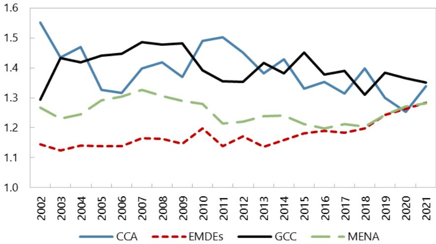  
Sources: Orbis database by Bureau van Dijk, and the authors' estimates.

Turning to country-level dynamics, the data reveal meaningful heterogeneity across countries, with distinct trends both in levels and in dynamics over time (Annex II).

\- In the CCA region, Kazakhstan has the highest markups throughout the period. In contrast, countries that joined the sample later such as Uzbekistan, Georgia, and Armenia exhibit lower markup levels, suggesting greater competition.

\- In MENAP, most countries display stable trends. A notable exception is Morocco, where markups decline steeply from 2010 onward, which reflects primarily the expansion of Orbis coverage to include a large number of smaller and less dominant firms with lower aggregate markups. Jordan also displays a gradual decline over time, although at a more moderate pace.

\- In the GCC, several countries remain clustered around a markup level of one, suggesting low market power, with the United Arab Emirates standing out with consistently high markups, especially in recent years. The latter may partly reflect sectoral composition, the dominance of a few firms in key industries, or the growing importance of high-markup services.

There has been a notable shift in sectoral markups. From the early-2000s to early-2010s, markups in the services sector were higher (and more volatile) compared to manufacturing, implying less competition in the service sector. In most of 2010s, the two sectors exhibited similar markups. Since 2019, however, manufacturing markups have shown a modest upward trend, overtaking markups in the service sector by 2022.

Figure 2. ME&CA: Sales-weighted Markups  
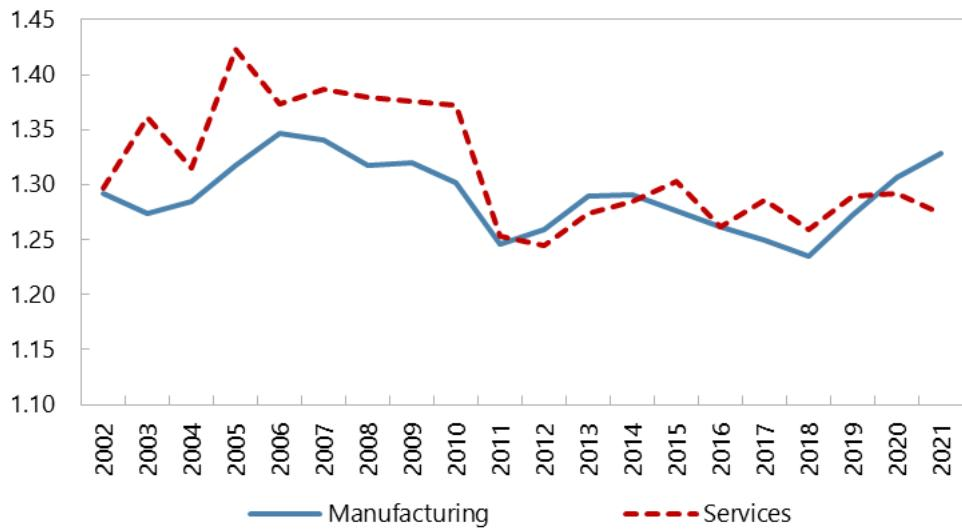  
Sources: Orbis database by Bureau van Dijk, and the authors' estimates.

These patterns are broadly consistent with international evidence suggesting service sectors often enjoy higher markups due to structural features such as limited competition, greater reliance on intangible inputs, and lower tradability. This is in line with findings by De Loecker and others (2021), who show that, in the U.S., market services consistently exhibit higher markups than other industries, reflecting their pricing power and lower elasticity of demand. In contrast, IMF (2019) $^{3}$ notes that manufacturing markups in emerging markets have remained flat over the past two decades.

Looking across all industries in the ME&CA region over the full sample, it is apparent that some sectors persistently exhibit high markups, suggesting low levels of competition (Figure 3). Mining and quarrying stand out with average markups above 1.8 throughout the period, peaking above 2.3 during 2007-2011. This is consistent with the capital-intensive, resource-based nature of the sector, where entry barriers are high, and firms often operate with significant pricing power.

Looking at the regional level, the CCA subregion shows the most marked cross-sector variation (Annex III). Mining maintains very high markups across all periods, suggesting low competition in that sector. $^{4}$ Notably, finance and real estate experienced a surge in markups, overtaking other service sectors. In contrast, market services (excluding finance and real estate) show a steady decline in markups, suggesting a narrowing of pricing power and increased competition. The agriculture sector, utilities and construction, and public/non-market services record average markups close to or just above one, indicative of higher competition. Manufacturing stands out as a sector where markup levels began at moderate levels but have risen over time, particularly in the 2017-2021 period [partly reflecting improved productivity and quality].

Figure 3. ME&CA: ME&CA Sales-weighted Average Markups by Industries  
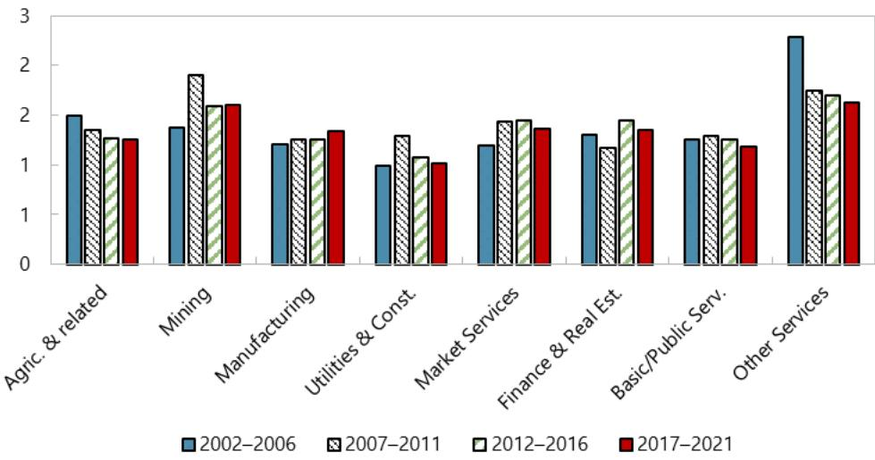  
Sources: Orbis database by Bureau van Dijk, and the authors' estimates.

To shed light on the rise in manufacturing markups observed in the CCA subregion during the late 2010s, we further decompose manufacturing into technology-intensity groups following the Eurostat/OECD classification. Figures reported in Annex III document the evolution of markups and sales shares across low, medium-low, medium-high, and high-technology manufacturing industries over successive subperiods, both for the full CCA sample and for a balanced sample restricted to Kazakhstan and Uzbekistan, which are observed throughout the entire period.

Two clear patterns emerge. First, the increase in aggregate manufacturing markups since 2017 is primarily driven by within-industry increases in markups, rather than by a reallocation of activity toward intrinsically high-markup sectors. In particular, medium-low technology industries account for the bulk of the markup increase. As shown in Annex III, these industries experience the largest rise in average markups between 2017–2021 and earlier periods, while their sales shares either decline modestly or remain broadly stable. By contrast, high-technology industries exhibit declining markups over the same horizon, despite a small increase in their sales share, suggesting that rising manufacturing markups cannot be attributed to a shift toward more technologically advanced but less competitive activities.

Second, changes in manufacturing sales composition play a limited and, if anything, offsetting role. Medium-low technology industries, which exhibit the strongest markup increases, see declining sales shares between 2007–2011 and 2017–2021, while medium-high technology industries gain market share but display only modest increases in markups. This pattern implies that structural transformation within manufacturing has not favored sectors with systematically lower competitive pressure. Instead, the observed increase in manufacturing markups reflects a generalized weakening of competition within segments, rather than compositional upgrading toward higher value-added industries.

A shift-share decomposition of markups confirms this interpretation. Over the 2017–2021 versus 2012–2016 period, approximately 0.14 markup points of the total 0.10 markup-point increase in manufacturing are explained by within-industry markup changes, while the between-industry component is negative and the cross term negligible. In other words, reallocations across manufacturing industries dampen rather than amplify the aggregate increase in markups.

In MENAP, there is much less dispersion in markups across industries and over time. Markups are clustered closer to one, indicating moderate competitive pressure overall. Market services markups decline over the period, while manufacturing markups remain flat, hovering around 1.25 throughout. The decline in markup levels for both finance and real estate and public/non-market services further reinforce the narrative of a softening in pricing power.

GCC countries display a different profile altogether, marked by strong heterogeneity across sectors. Agriculture and related sectors show surprisingly high markups in the early period with a mild decline thereafter. Most notably, market services record a steep increase in markups suggesting either rising pricing power, or rapid expansion of digital and professional services.

A complementary firm-level decomposition reveals that between-firm reallocation (extensive) explains most of the mark-up changes overtime. Applying the Melitz–Polanec decomposition, we split the change in the sales-weighted manufacturing markup into within-firm (intensive) and between-firm reallocation (extensive) components for incumbents, along with the contributions of entering and exiting firms (Annex III). For ME&CA manufacturing, the increase (a total contribution of about +8.1) is almost entirely extensive: reallocation toward high-markup incumbents (about +5.9) dominates, incumbents' own markups are flat to slightly negative, and both selection margins add to it, entrants come in at high markups (+1.9) and the firms that exit are low-markup (+1.3).

The increase in markups in CCA is larger and is driven mainly by entry of high-markup firms (about +8.9) together with reallocation toward high-markup incumbents (about +5.6), partly offset by negative exit effect (about -2.3) as some high-markup firms exit. Within-firm markup growth is negligible for the firm population but becomes sizeable among the largest firms (the top 5 percent by sales), indicating that the increases are concentrated among the largest companies. Overall, the rise reflects reallocation toward, and entry of, high-markup firms rather than broad-based margin increases, consistent with rising concentration and market power.

Taken together, the disaggregated markup patterns show clear differences across regions and sectors. In CCA, high markups are concentrated in resource-intensive and financial sectors, with rising trends in manufacturing. MENAP exhibits a flatter distribution with signs of declining market power in services. GCC shows the most industry variation, with certain sectors, particularly services, attaining very high markups.

## 4.4.2 Markup-Adjusted Productivity Gaps in ME&CA

Across all regions, productivity gaps remain persistent, indicating that frontier firms retain substantial productivity advantages over the average firm. This pattern is consistent with the broader evidence for EMDEs showing slow diffusion of frontier technologies and managerial practices. Persistent gaps may also arise from structural and institutional factors that slow the diffusion of technology and the catch-up of lagging firms. The GCC consistently exhibits the smallest gaps in the region, with values near 3.2-3.5 over most of the period. MENA lies slightly higher and displays limited variation over time, fluctuating around 3.7-3.9. CCA shows the highest dispersion, with gaps rising noticeably in the early to mid-2010s before easing toward the end of the sample. Other EMDEs display a similar trajectory to MENA, but at a lower level with the productivity gap declining toward roughly 3.5 by the end of the sample. Overall, productivity gaps in ME&CA show little evidence of systematic narrowing. The persistence of wide gaps suggests that diffusion remains slow, and that competitive pressures may be insufficient to push lagging firms toward frontier practices or towards exit.

Figure 4. ME&CA: Sales-weighted Markup-adjusted Productivity Gaps in ME&CA and Other EMDEs  
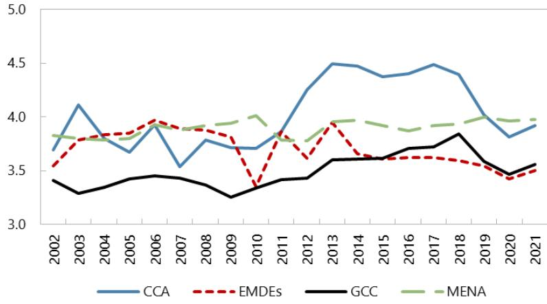  
Sources: Orbis database by Bureau van Dijk, and the authors' estimates.

Within the CCA region, productivity gaps vary widely and do not mirror markup rankings. Uzbekistan records the largest and most volatile productivity gaps, with a marked rise during the mid-2010s followed by a sharp correction after the country embarked on significant structural reforms in the late-2010s. Armenia and Kazakhstan lie in the middle of the regional distribution, while Georgia displays the lowest and most stable gaps, suggesting comparatively tighter clustering around the frontier. These configurations differ somewhat

from the markup ranking, where Kazakhstan typically shows the highest markups and Uzbekistan somewhat lower ones. Hence, in CCA, productivity dispersion and markup levels do not map one-to-one, indicating that factors beyond average pricing power, such as technology adoption or resource reallocation, also shape the productivity gap.

In MENAP, cross-country differences in gaps are more moderate. Egypt, Jordan, and Morocco are clustered in a relatively narrow band of dispersion that fluctuates around 3-4 in logs, broadly consistent with their relatively modest markups in the regional comparison. Pakistan and Iran display systematically higher productivity gaps, but their markup levels are not proportionately higher. In these cases, structural frictions such as weak allocative efficiency, barriers to firm growth, or uneven access to inputs may have played an important role.

In the GCC subregion, Saudi Arabia and Oman tend to exhibit larger productivity gaps than the UAE and Kuwait. This pattern contrasts with the markup evidence, where the UAE stands out with relatively high markups while some peers are closer to unity. In other words, countries with higher markups do not necessarily have wider productivity gaps, and vice versa. This divergence suggests that high average markups can coexist with relatively compressed productivity distributions, for instance if dominant firms in high-markup sectors are also close to the technological frontier, and laggards account for a small share of activity.

The productivity gaps in the manufacturing and service sectors have moved broadly in parallel, but manufacturing consistently exhibits larger gaps, with values fluctuating around 3.9-4.1 in logs, while services lie closer to 3.4-3.7 (Figure 5). The stability of the distance between the two lines over time indicates a persistent pattern rather than a cyclical episode: frontier firms in manufacturing remain farther ahead of laggards than frontier firms in services.

Figure 5. Productivity Gaps in the Manufacturing and Service Sectors in the ME&CA Region  
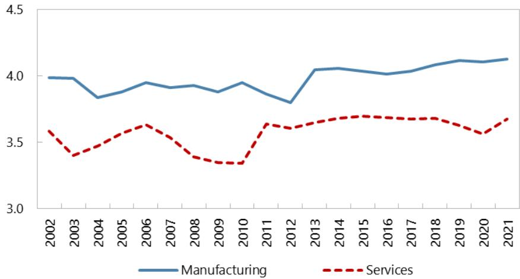  
Sources: Orbis database by Bureau van Dijk, and the authors' estimates.

This sectoral difference is consistent with the notion that manufacturing performance is closely tied to the adoption of cutting-edge technologies, substantial investment in modern machinery, and the ability to reorganize production around more efficient processes. Such technologies often diffuse unevenly, leading to large productivity differences between leaders and laggards. In contrast, service industries rely more heavily on intangible inputs such as organizational capital, customer networks, and managerial practices, which can exhibit different diffusion patterns and may generate a somewhat more compressed productivity distribution.

These interpretations align with the broader evidence in Andrews and others (2016), who show that substantial dispersion exists in both manufacturing and services, but that the sources and persistence of gaps can differ across sectors due to differences in technology, capital intensity, and barriers to reallocation. In ME&CA, the consistently wider gap in manufacturing suggests slower within-sector convergence and a larger distance between best-performing producers and the rest.

## 4.4.3 Tariffs in ME&CA

As we investigate the relationship between tariff protection, market power, and competition, it is instructive to consider country-level, import-weighted tariff rates by sector. Fig. 6 displays average tariff levels for key tradable sectors across the three regions in our sample, along with a comparative panel for other emerging markets and developing economies. Focusing on tradable sectors ensures that tariff rates are economically meaningful, as they directly affect exposure to international competition. In the three ME&CA subregions, a clear hierarchy emerges in tariff structures. Tariffs are the highest in manufacturing, followed by agriculture, and lowest in mining and quarrying. With MENAP showing the highest tariff rates.

Figure 6. ME&CA: Imports-Weighted Tariff Rates by Industries (In percent)  
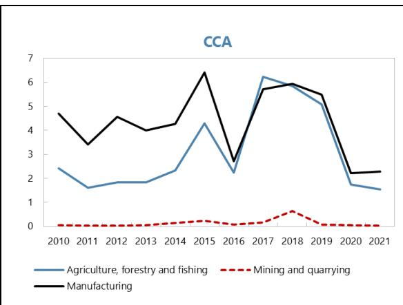

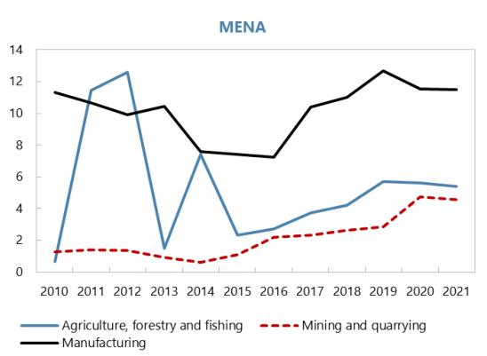

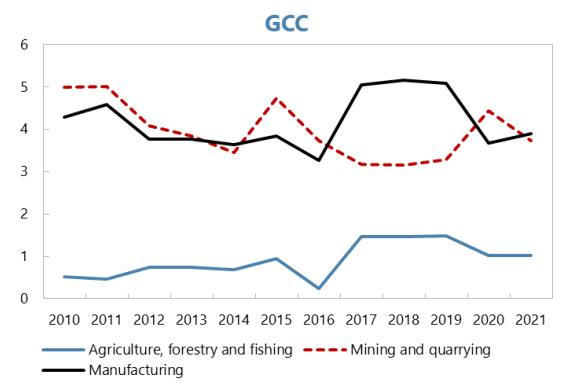  
Sources: Orbis database by Bureau van Dijk, and the authors' estimates.

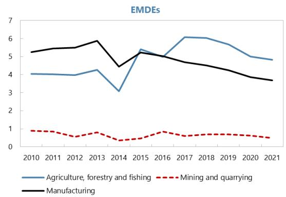

## 4.4.4 Organization of the Market and Competition in ME&CA

To complement evidence on markups, productivity gaps and tariffs, we also examine indicators of policy implementation that directly concern market functioning. For this purpose, we use the Bertelsmann Stiftung Transformation Index (BTI) criterion on “Organization of the Market and Competition,” which summarizes expert assessments of the rules governing market entry and exit, the enforcement of competition policy, and the openness of foreign trade. Scores range from 1 to 10, with higher values indicating more market-based, rules-driven environments. Looking at these indicators helps relate our measures of market power and productivity dispersion to the broader institutional setting in ME&CA and to the experience of other EMDEs.

The overall index, shown in the top left panel, provides a summary of whether market entry and exit are unrestricted; investment decisions are not administratively constrained, and firms compete on a level playing field. GCC countries score between 6.5 and 7.2 throughout the period, broadly matching or slightly exceeding the EMDE benchmark and showing a mild upward trend after 2010. CCA countries start closer to 5 but rise toward 6 by the early 2010s, narrowing much of the initial gap with EMDEs. MENA economies remain around 5 to 5.5 over the entire sample, with little improvement, which points to more persistent institutional weaknesses, higher administrative barriers, and a larger informal sector compared with peers (Figure 7).

Figure 7. BTI Indexes by Region  
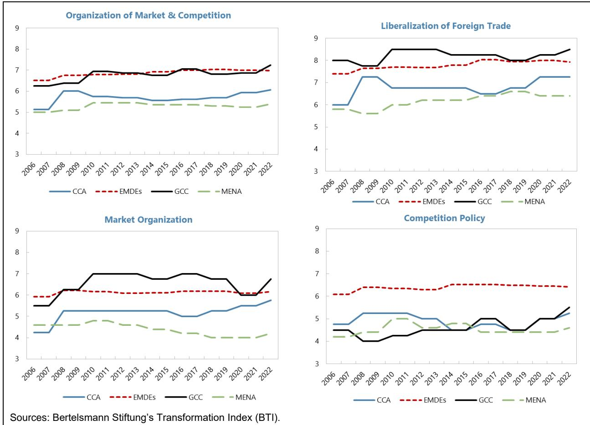  
Sources: Bertelsmann Stiftung's Transformation Index (BTI).

The top right panel turns to “Market organization”, a more micro-oriented measure of how consistently market rules are defined and implemented, including the predictability of licensing procedures and the degree of discrimination across ownership types. The cross-regional differences are larger here. GCC again performs best, with scores rising from about 5.5 in 2006 to roughly 7 around 2010 and remaining elevated thereafter, suggesting an environment where market rules have become progressively clearer and more evenly applied. CCA displays gradual improvement but stays below the EMDE average, while MENA maintains the lowest scores, fluctuating around 4 to 4.5 and even declining slightly in the mid-2010s. This confirms that many MENA economies still operate with uneven market rules, higher regulatory burdens, and substantial informality, which can dampen competitive pressure and hinder the entry of more productive firms.

Competition policy, shown in the bottom left panel, captures the existence and enforcement of antitrust rules, the independence of the competition authority, and the degree to which state aid or exemptions distort competition. Other EMDEs consistently score around 6 to 6.5, indicating relatively well-established frameworks and more active enforcement. CCA and GCC record intermediate values within the 4.5-5.5 range, with some improvement after 2015 but no convergence toward the EMDE frontier. MENA again is at the bottom of the regional distribution, generally between 4 and 4.5. This weaker institutional underpinning for antitrust enforcement is consistent with the earlier evidence of persistent markups and wide productivity gaps: where competition laws are inconsistently enforced, dominant firms face fewer constraints on pricing power and diffusion from frontier firms tends to be slower.

Finally, the bottom right panel shows “Liberalization of foreign trade”, which assesses tariff and non-tariff barriers, the use of quotas or safeguards, and the overall degree of integration into world markets. GCC countries achieve the highest scores, generally between 8 and 8.5, reflecting broadly open trade regimes. CCA also performs relatively well, with values around 7 and some improvement over time, placing it close to the average EMDE trajectory. MENA, by contrast, records scores near 6 to 6.3, the lowest among the ME&CA regions and well below GCC. This pattern mirrors the tariff evidence documented earlier, where MENA maintains higher external protection, reducing exposure to foreign competition and potentially reinforcing market power in domestic sectors.

Taken together, the BTI indicators reveal a consistent picture: GCC has the strongest institutional foundations for competitive markets, CCA has improved steadily but remains mid-range, and MENA lags visibly behind both the region and the broader EMDE benchmark. $^{5}$ These institutional differences align with the empirical patterns observed in markups and productivity gaps. Weaker market organization, less effective competition policy, and more limited trade openness tend to coincide with higher and more persistent markups and slower convergence in firm performance, suggesting that policy frameworks play a central role in shaping competitive intensity across ME&CA economies.

## 5. Relationship between Policy Reforms, Competition, and Growth

5.1 How does Trade Protection and Institutional Reforms to Competition Policy affect Market Competition?

## 5.1.1 Empirical Strategy

The effects of policy reforms on market competition in the ME&CA region are assessed with a focus on two key levers of policy: trade protection via tariffs and institutional reforms aimed at strengthening competition. The empirical strategy estimates the medium-run impact of these changes on competition outcomes measured at the sector-country-year level. Specifically, we evaluate how five-year changes in tariff rates and reform indicators affect five-year growth in markups and the markup-adjusted productivity gap (MFPR gap).

$$
\Delta^ {(n)} \text {Competition} _ {c, s, t} = \beta_ {1} \Delta^ {(n)} \text {Reform} _ {c, t} + \gamma Z _ {c, t - \tau} + \delta_ {c} + \delta_ {s} + \delta_ {t} + \delta_ {c, s} + \epsilon_ {c, s}
$$

The estimation framework models the n-year change in competition indicators at the sector-country-year level as a function of n-year changes in relevant policy variables. The left-hand side variable represents the growth rate (log-difference over n years) of the competition measure: markups and productivity gap. The main explanatory variable is the corresponding n-year change in either the import-weighted tariff rate or the BTI competition policy score, depending on the specification. The model also includes a vector of lagged macroeconomic and structural controls: log GDP per capita, gross public debt, FDI inflows, trade openness, working-age population share, and indices of government stability and political and economic risk. Country, sector, year, and sector-by-country fixed effects are included to absorb both time-invariant and geographically specific heterogeneity.

Importantly, because the competition measures are in logarithmic form and we use log-differences, the coefficients are interpreted as additive changes in growth rates. This log-log-based setup smooths out short-run noise and captures medium-run trends, particularly relevant when studying markups and productivity gaps, which are estimated with some degree of persistence and volatility.

Given the potential endogeneity of reforms, including the possibility that tariff-setting may respond to sectoral conditions, we take several steps to tackle endogeneity concerns. First, we control for pre-reform conditions by including lagged values of reform variables. Second, we include different policy reform variables jointly to account for potential cross-policy interactions. Finally, we also estimate markup impulse responses to policy variables. Yet, to the extent that more high-markup sectors are more likely to receive protection, reverse causality could bias the estimated relationship upward. Accordingly, the results should be interpreted as conditional associations rather than strict causal effects.

## 5.1.2 Impact of Tariffs

We next examine how changes in tariff protection affect competitive conditions in tradable sectors. Tradables in the ME&CA context include agriculture, mining and quarrying and manufacturing sectors where foreign competition and import penetration make tariff policy particularly relevant. Table 1 reports results for

ME&CA economies using five-year log differences of the dependent variables and applied import-weighted tariffs at the country level. The focus on country-wide average tariffs follows the literature that views tariffs as a broad measure of the external protection structure facing domestic firms, affecting both the prices of imported final goods and the cost of intermediate inputs (De Loecker and others, 2016; Amiti and Konings, 2007).

Table 1. Tariff Changes and Markups and MFPR Gaps

<table><tr><td></td><td>(1) $\Delta_5\ln \mu_{c,s,t}^{\text{dlw}}$ </td><td>(2) $\Delta_5\ln \mu_{c,s,t}^{\text{dlwtl}}$ </td><td>(3) $\Delta_5\ln \mu_{c,s,t}^{\text{ols}}$ </td><td>(4) $\Delta_5\text{MFPR Gap}_{c,s,t}^\mu$ </td><td>(5) $\Delta_5\ln \mu_{c,s,t}^{\text{dlw}}$ </td><td>(6) $\Delta_5\ln \mu_{c,s,t}^{\text{dlwtl}}$ </td><td>(7) $\Delta_5\ln \mu_{c,s,t}^{\text{ols}}$ </td><td>(8) $\Delta_5\text{MFPR Gap}_{c,s,t}^\mu$ </td></tr><tr><td> $\Delta_5\text{Tariff}_{\text{Average}}$ </td><td>0.990*(0.504)</td><td>1.353***(0.501)</td><td>0.946*(0.516)</td><td>-1.003(1.365)</td><td>1.027**(0.518)</td><td>1.362***(0.513)</td><td>0.972*(0.526)</td><td>-0.966(1.353)</td></tr><tr><td>Tariff $_{\text{Average},t-7}$ </td><td>0.752(0.542)</td><td>0.766(0.617)</td><td>1.002*(0.525)</td><td>-1.164(1.014)</td><td>0.594(0.476)</td><td>0.661(0.545)</td><td>0.849*(0.439)</td><td>-1.360(1.188)</td></tr><tr><td> $\ln GDP per capita_{t-5}$ </td><td>0.193(0.305)</td><td>0.220(0.328)</td><td>0.202(0.311)</td><td>-0.484(0.331)</td><td>0.0143(0.288)</td><td>0.0147(0.309)</td><td>0.0404(0.292)</td><td>-0.867***(0.324)</td></tr><tr><td>Gross Debt/ $GDP_{t-5}$ </td><td>0.00198(0.00230)</td><td>0.00291(0.00241)</td><td>0.00244(0.00229)</td><td>-0.000997(0.00400)</td><td>0.000829(0.00172)</td><td>0.00185(0.00174)</td><td>0.00145(0.00165)</td><td>-0.00293(0.00462)</td></tr><tr><td> $FDI/GDP_{t-5}$ </td><td>0.00221(0.00437)</td><td>0.00296(0.00440)</td><td>0.00149(0.00433)</td><td>0.00372(0.0108)</td><td>0.000963(0.00416)</td><td>0.00167(0.00420)</td><td>0.000524(0.00418)</td><td>0.00154(0.0106)</td></tr><tr><td> $Trade/GDP_{t-5}$ </td><td>0.000381(0.00133)</td><td>0.000158(0.00137)</td><td>0.000593(0.00134)</td><td>0.00252(0.00371)</td><td>-0.00125(0.00120)</td><td>-0.00171(0.00125)</td><td>-0.000859(0.00116)</td><td>-0.000971(0.00332)</td></tr><tr><td>Working Age  $Pop_{t-5}$ </td><td>-0.892(1.179)</td><td>-0.529(1.269)</td><td>-0.896(1.186)</td><td>-0.348(2.199)</td><td>-1.435(1.234)</td><td>-1.193(1.323)</td><td>-1.322(1.234)</td><td>-1.496(2.200)</td></tr><tr><td>Political  $Risk_{t-5}$ </td><td></td><td></td><td></td><td></td><td>0.0105(0.00790)</td><td>0.0106(0.00842)</td><td>0.00895(0.00777)</td><td>0.0180(0.0126)</td></tr><tr><td>Economic  $Risk_{t-5}$ </td><td></td><td></td><td></td><td></td><td>0.00194(0.00207)</td><td>0.00381(0.00231)</td><td>0.00236(0.00211)</td><td>0.00661(0.00692)</td></tr><tr><td>Gov. Stability $_{t-5}$ </td><td></td><td></td><td></td><td></td><td>-0.0262(0.0188)</td><td>-0.0191(0.0213)</td><td>-0.0244(0.0187)</td><td>-0.0242(0.0310)</td></tr><tr><td>Constant</td><td>-1.272(3.253)</td><td>-1.751(3.490)</td><td>-1.402(3.302)</td><td>4.390(3.371)</td><td>0.282(3.056)</td><td>-0.0162(3.269)</td><td>-0.0198(3.090)</td><td>7.598**(3.067)</td></tr><tr><td>R-squared</td><td>0.329</td><td>0.364</td><td>0.339</td><td>0.319</td><td>0.335</td><td>0.371</td><td>0.345</td><td>0.324</td></tr><tr><td>Observations</td><td>1,312</td><td>1,250</td><td>1,280</td><td>984</td><td>1,312</td><td>1,250</td><td>1,280</td><td>984</td></tr><tr><td>Number of Countries</td><td>9</td><td>9</td><td>9</td><td>9</td><td>9</td><td>9</td><td>9</td><td>9</td></tr><tr><td>ICRG Controls</td><td>No</td><td>No</td><td>No</td><td>No</td><td>Yes</td><td>Yes</td><td>Yes</td><td>Yes</td></tr></table>

Standard errors clustered at country-sector level in parentheses.  
\* $p < {0.1}$ , \*\* $p < {0.05}$ , \*\*\* $p < {0.01}$  
Country, sector, year, and country-sector fixed effects included.

Columns 1-3 present the effect of tariffs on the three markup measures: the Cobb-Douglas DLW markup (column 1), the translog DLW markup with firm-specific elasticities (column 2), and the OLS-based markup (column 3). Across all three specifications, tariff changes are positively and significantly associated with changes in markups. Estimated coefficients range from 0.95 to 1.35, implying that a 1 percent increase in tariffs raises the five-year growth rate of sectoral markups by about 0.9-1.4 percentage points. This result is robust to the inclusion of ICRG macro-institutional controls (columns 5-7). Although Uzbekistan drops from the sample due to the lack of ICRG coverage, the magnitude and significance of the tariff coefficients increase across all markup measures. The coefficients on the institutional control variables provide additional insight: higher aggregate risk is associated with faster growth of markups, suggesting that firms operating in more uncertain environments can sustain or expand price-cost margins. In contrast, higher government stability is linked to lower growth of markups, implying that more predictable political environments may reinforce competitive pressures or limit incumbents' ability to exercise market power. These results are consistent with the pro-competitive logic in the trade literature: higher tariffs insulate domestic firms from foreign competition, reduce the elasticity of residual demand, and weaken competitive pressure, enabling firms to raise price-cost margins. This effect appears stronger in environments with high institutional risks and weaker where the political environment is more stable.

Column (4) examines the impact of tariff changes on the markup-adjusted productivity gap. The coefficient is negative but statistically insignificant, suggesting that changes in tariff protection do not systematically alter productivity dispersion at the five-year horizon. One interpretation is that markups respond more quickly to changes in competitive pressure, while productivity gaps reflect deeper mechanisms such as technology adoption, reallocation, and firm turnover that adjust only gradually.

We also estimate specifications using NACE 2-digit and NACE 4-digit tariff measures instead of the country-level average tariff. These more disaggregated measures capture sector-specific exposure to trade protection. The estimated effects on markups remain positive and statistically significant, confirming the robustness of the baseline results. However, sector-level tariffs do not capture the broader general equilibrium effects of countrywide tariff policy on imported intermediates and overall cost structures, reinforcing the value of the country-level tariff as the primary measure of external protection.

Taken together, the evidence indicates that tariff protection raises market power in ME&CA tradable sectors. Higher tariffs are consistently associated with higher markups, while productivity gaps remain largely unaffected in the medium run. $^{6}$ These findings highlight the importance of trade openness in strengthening competitive pressures. When domestic firms face reduced foreign competition and higher barriers to imported inputs, pricing power increases even though deeper productivity dynamics do not necessarily adjust within the five-year window. The results are robust to alternative measures of the tariff measure, with simple unweighted average tariffs yielding similar coefficients and statistical significance.

Further analysis suggests that the impact of tariffs primarily transmits through between-firm reallocation margin. We further decompose the 5-year change in markups into within-firm (intensive) and between-firm reallocation (extensive) components, using the Melitz–Polanec framework. Because decomposition is additive only in levels, results are reported in markup levels (rather than the log specification as in the baseline). The results suggest that the tariff effect operates almost entirely through the between-firm reallocation margin, with sales shifting toward high-markup incumbents. This pattern is consistent with tariff protection working through a selection channel. Interactions of the tariff with firm size and firm age are statistically insignificant, suggesting the effect is broadly uniform across the size and age distributions. The corresponding estimation results are reported in Annex A.IV.a.

As a complementary step, we also estimate local projections to examine how changes in sector-specific tariff protection translate into dynamics of sales-weighted markups within narrowly defined industries, using import-weighted tariffs at the NACE 2-digit level. We maintain the same sample, controls, and fixed effects as in the country-level analysis. Impulse responses are normalized to the last pretreatment period (h = -1), with 95 percent confidence intervals clustered at the country-sector level. In this exercise, the tariff shock is scaled to one standard deviation of sector-level tariffs in manufacturing, equal to 7.19 percentage points. For the remaining tradable sectors, coefficient estimates are not statistically significant, indicating that tariff variation at this level of disaggregation does not systematically affect markups outside manufacturing.

The impulse responses display flat pre-trends and only a modest contemporaneous reaction. Markups begin to rise from h = 2 onward and reach a higher plateau by h = 3-4. The impulse response at these horizons is approximately 0.35-0.40 in logs, which corresponds to an increase in markups of about 0.42-0.45 percent in the medium run. Interpreted together with the country-level results, this pattern suggests that higher tariff protection in manufacturing sectors gradually relaxes competitive pressure from imports, allowing domestic firms to sustain higher price-cost margins over time. This is in line with the trade literature that emphasizes the pro-competitive effects of trade liberalization. In our setting, the reverse holds, as stronger trade protection is associated with a persistent increase in markups in manufacturing. The dynamic profile is also consistent with the five-year panel estimates, where the panel captures the cumulative medium-run impact while the local projections trace the timing of the adjustment and show that the strongest effects emerge with a lag.

Sources: Orbis database by Bereau van Dijk, WITS Database and IMF staff calculations. Note: 1SD=7.2 pp (median across countries), 95% confidence interval.  
Figure 8. Manufacturing Markups IRF to Tariff Change  
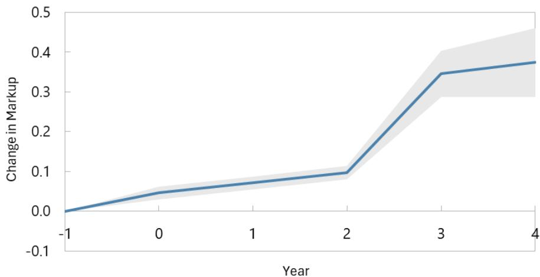

We also estimate local projections without ICRG macro-institutional controls. The results remain statistically significant and display a similar dynamic profile. These additional specifications are reported in Annex IV and confirm that the relationship between tariff protection and markup dynamics is not driven by the inclusion of country-risk controls.

## 5.1.3 Impact of Policy Implementation

We now turn to domestic competition institutions, focusing on the BTI index of competition policy from the “Organization of the Market and Competition” criterion (specifically, Component 7.2) $^{7}$ . This indicator captures the existence and enforcement of antitrust law, the role and independence of competition authorities, transparency and legal certainty of enforcement, and the presence or absence of state favoritism or clientelist policies that distort competition. Higher scores therefore reflect a more credible, rules-based environment that constrains the discretionary exercise of market power;

We find that stronger competition institutions are associated with lower sectoral markups. Table 2 reports regressions using five-year changes in the BTI competition policy score as the main explanatory variable, covering the full set of sectors since competition institutions apply economy wide. In the specifications without ICRG controls in columns (1) to (3), the estimated coefficients range between -0.029 and -0.031, and are statistically significant. Once macro institutional controls are introduced in columns (5) to (7), the magnitude increases and the estimates remain statistically significant. The coefficients lie between -0.034 and -0.038, each significant at the 5 percent level. These results imply that a one-point increase in the BTI Competition Policy score, on a scale from one to ten, is associated with a reduction of about 3.4 to 3.8 percentage points in the five-year growth rate of sector level markups. The consistency of the negative sign across all markup measures indicates that improvements in the enforcement of competition policy reduce the ability of firms to maintain high price cost margins.

Table 2. Competition Policy and Markups and MFPR Gaps

<table><tr><td></td><td>(1) $\Delta_{5} \ln \mu_{c,s,t}^{\text{dlw}}$ </td><td>(2) $\Delta_{5} \ln \mu_{c,s,t}^{\text{dlwtl}}$ </td><td>(3) $\Delta_{5} \ln \mu_{c,s,t}^{\text{ols}}$ </td><td>(4) $\Delta_{5} \text{MFPR Gap}_{c,s,t}^{\mu}$ </td><td>(5) $\Delta_{5} \ln \mu_{c,s,t}^{\text{dlw}}$ </td><td>(6) $\Delta_{5} \ln \mu_{c,s,t}^{\text{dlwtl}}$ </td><td>(7) $\Delta_{5} \ln \mu_{c,s,t}^{\text{ols}}$ </td><td>(8) $\Delta_{5} \text{MFPR Gap}_{c,s,t}^{\mu}$ </td></tr><tr><td> $\Delta_{5} \text{BTI}_{\text{Competition Policy}}$ </td><td>-0.0292**(0.0147)</td><td>-0.0312*(0.0171)</td><td>-0.0289*(0.0150)</td><td>0.00155(0.0262)</td><td>-0.0343**(0.0156)</td><td>-0.0378**(0.0177)</td><td>-0.0341**(0.0159)</td><td>-0.00519(0.0269)</td></tr><tr><td> $BTI_{\text{Competition Policy}, t-7}$ </td><td>0.0282(0.0196)</td><td>0.0248(0.0259)</td><td>0.0267(0.0199)</td><td>-0.00509(0.0418)</td><td>0.0271(0.0200)</td><td>0.0157(0.0237)</td><td>0.0241(0.0202)</td><td>0.0119(0.0362)</td></tr><tr><td> $\ln GDP per capita_{t-5}$ </td><td>0.388(0.245)</td><td>0.558*(0.291)</td><td>0.479*(0.269)</td><td>-0.174(0.413)</td><td>0.201(0.269)</td><td>0.374(0.311)</td><td>0.296(0.290)</td><td>-0.419(0.454)</td></tr><tr><td> $Gross Debt/GDP_{t-5}$ </td><td>0.00816***(0.00245)</td><td>0.00967***(0.00253)</td><td>0.00917***(0.00255)</td><td>0.0000754(0.00345)</td><td>0.00786***(0.00248)</td><td>0.00869***(0.00247)</td><td>0.00890***(0.00256)</td><td>-0.000660(0.00356)</td></tr><tr><td> $FDI/GDP_{t-5}$ </td><td>0.00110(0.00470)</td><td>-0.00119(0.00507)</td><td>0.00181(0.00483)</td><td>-0.0180*(0.00954)</td><td>0.00331(0.00509)</td><td>0.00134(0.00536)</td><td>0.00397(0.00524)</td><td>-0.0175*(0.00997)</td></tr><tr><td> $Trade/GDP_{t-5}$ </td><td>0.00192(0.00160)</td><td>0.00151(0.00187)</td><td>0.00187(0.00165)</td><td>0.00336(0.00266)</td><td>0.00129(0.00160)</td><td>0.000549(0.00169)</td><td>0.00135(0.00164)</td><td>0.00106(0.00266)</td></tr><tr><td> $Working Age Pop_{t-5}$ </td><td>1.098(1.263)</td><td>0.782(1.346)</td><td>1.508(1.312)</td><td>-1.192(2.433)</td><td>0.649(1.325)</td><td>0.372(1.314)</td><td>1.121(1.364)</td><td>-2.653(2.563)</td></tr><tr><td> $Political Risk_{t-5}$ </td><td></td><td></td><td></td><td></td><td>0.00239(0.00642)</td><td>0.000393(0.00660)</td><td>0.00121(0.00639)</td><td>0.0218(0.0138)</td></tr><tr><td> $Economic Risk_{t-5}$ </td><td></td><td></td><td></td><td></td><td>0.00387(0.00256)</td><td>0.00584**(0.00240)</td><td>0.00398(0.00263)</td><td>-0.00248(0.00425)</td></tr><tr><td> $Gov. Stability_{t-5}$ </td><td></td><td></td><td></td><td></td><td>-0.00621(0.0220)</td><td>0.00981(0.0204)</td><td>-0.00302(0.0222)</td><td>-0.0453(0.0405)</td></tr><tr><td>Constant</td><td>-4.694*(2.794)</td><td>-5.942*(3.152)</td><td>-5.788*(3.051)</td><td>2.297(4.803)</td><td>-2.971(2.976)</td><td>-4.272(3.268)</td><td>-4.102(3.208)</td><td>4.618(5.104)</td></tr><tr><td>R-squared</td><td>0.338</td><td>0.286</td><td>0.340</td><td>0.403</td><td>0.331</td><td>0.280</td><td>0.334</td><td>0.387</td></tr><tr><td>Observations</td><td>3,031</td><td>2,754</td><td>2,992</td><td>2,448</td><td>2,924</td><td>2,650</td><td>2,885</td><td>2,377</td></tr><tr><td>Number of Countries</td><td>11</td><td>11</td><td>11</td><td>11</td><td>10</td><td>10</td><td>10</td><td>10</td></tr><tr><td>ICRG Controls</td><td>No</td><td>No</td><td>No</td><td>No</td><td>Yes</td><td>Yes</td><td>Yes</td><td>Yes</td></tr></table>

Country, sector, year, and country-sector fixed effects included.  
Standard errors clustered at country-sector level in parentheses.  
\* $p < {0.1}$ ,\*\* $p < {0.05}$ ,\*\*\* $p < {0.01}$

The regression evidence confirms that institutional reforms that strengthen antitrust enforcement and reduce discretionary state intervention are associated with measurable declines in market power. Unlike tariff reforms, which rely on external market integration, improvements in domestic competition policy directly target internal market frictions. These may include collusive practices, state-backed monopolies, or discretionary regulations. The significant negative coefficients across all markup measures suggest that even incremental institutional improvements related to competition policy can have meaningful effects on firm behavior and market outcomes.

We also re-estimate the baseline specifications by allowing the effect of trade reforms to differ across sub regions through interactions with a CCA indicator. $^{8}$ A key takeaway is that some BTI components that are not statistically significant in the pooled ME&CA sample become highly significant at the sub-regional level. When using the BTI Foreign Trade index as the reform variable, the coefficients remain small and statistically insignificant across all markup measures, indicating no average effect at the regional level. However, once interacted with the CCA indicator, the implied CCA specific slopes are large, negative, and statistically significant. In the specifications with institutional controls, the interaction coefficients are approximately -0.259, -0.216, and -0.255 across the three markup estimators. Interpreted in levels, a one-point improvement in the foreign trade index over five years is associated with roughly 19 to 26 percent lower cumulative five-year markup growth in CCA economies. For the markup corrected productivity gap, the estimated interaction coefficient is positive but not statistically significant, indicating that the dominant effect of trade liberalization in CCA operates through pricing power rather than through systematic changes in productivity dispersion over this horizon. These results imply that foreign trade liberalization has a pronounced pro-competitive effect in CCA, even though the average effect for ME&CA is muted.

Table 3. Trade Policy and Markups and MFPR Gaps – Interaction with CCA

<table><tr><td></td><td>(1) $\Delta_5\ln \mu_{c,s,t}^{\text{dlw}}$ </td><td>(2) $\Delta_5\ln \mu_{c,s,t}^{\text{dlwtl}}$ </td><td>(3) $\Delta_5\ln \mu_{c,s,t}^{\text{ols}}$ </td><td>(4) $\Delta_5\text{MFPR Gap}^\mu_{c,s,t}$ </td><td>(5) $\Delta_5\ln \mu_{c,s,t}^{\text{dlw}}$ </td><td>(6) $\Delta_5\ln \mu_{c,s,t}^{\text{dlwtl}}$ </td><td>(7) $\Delta_5\ln \mu_{c,s,t}^{\text{ols}}$ </td><td>(8) $\Delta_5\text{MFPR Gap}^\mu_{c,s,t}$ </td></tr><tr><td> $\Delta_5\text{BTI}_{\text{Foreign Trade}}$ </td><td>0.00849(0.0197)</td><td>0.0130(0.0217)</td><td>0.0165(0.0212)</td><td>-0.0123(0.0322)</td><td>0.00851(0.0198)</td><td>0.0143(0.0215)</td><td>0.0168(0.0215)</td><td>-0.0197(0.0320)</td></tr><tr><td> $\Delta_5\text{BTI}_{\text{Foreign Trade}} \times \text{CCA}$ </td><td>-0.110**(0.0529)</td><td>-0.124**(0.0610)</td><td>-0.108**(0.0529)</td><td>0.0763(0.0958)</td><td>-0.259***(0.0770)</td><td>-0.216**(0.0969)</td><td>-0.255***(0.0772)</td><td>0.0348(0.131)</td></tr><tr><td> $BTI_{\text{Foreign Trade}, t-7}$ </td><td>0.0462**(0.0185)</td><td>0.0360*(0.0204)</td><td>0.0513***(0.0191)</td><td>-0.00747(0.0323)</td><td>0.0581***(0.0206)</td><td>0.0407*(0.0228)</td><td>0.0633***(0.0212)</td><td>-0.00844(0.0351)</td></tr><tr><td> $\ln GDP per capita_{t-5}$ </td><td>0.306(0.273)</td><td>0.537*(0.325)</td><td>0.410(0.302)</td><td>-0.228(0.411)</td><td>0.112(0.286)</td><td>0.360(0.338)</td><td>0.216(0.313)</td><td>-0.469(0.469)</td></tr><tr><td>Gross Debt/ $GDP_{t-5}$ </td><td>0.00867***(0.00248)</td><td>0.00989***(0.00261)</td><td>0.00999***(0.00264)</td><td>0.000277(0.00329)</td><td>0.00929***(0.00260)</td><td>0.00979***(0.00267)</td><td>0.0107***(0.00273)</td><td>-0.00125(0.00373)</td></tr><tr><td> $FDI/GDP_{t-5}$ </td><td>0.00567(0.00514)</td><td>0.00408(0.00608)</td><td>0.00676(0.00534)</td><td>-0.0205**(0.0103)</td><td>0.0121**(0.00569)</td><td>0.00938(0.00673)</td><td>0.0133**(0.00594)</td><td>-0.0198*(0.0111)</td></tr><tr><td> $Trade/GDP_{t-5}$ </td><td>0.00157(0.00155)</td><td>0.00100(0.00185)</td><td>0.00172(0.00160)</td><td>0.00354(0.00259)</td><td>0.00145(0.00155)</td><td>0.000685(0.00160)</td><td>0.00168(0.00158)</td><td>0.000777(0.00244)</td></tr><tr><td>Working Age  $Pop_{t-5}$ </td><td>-1.292(1.475)</td><td>-1.437(1.632)</td><td>-0.764(1.548)</td><td>-0.657(2.478)</td><td>-3.077**(1.554)</td><td>-2.618(1.668)</td><td>-2.484(1.631)</td><td>-2.729(2.730)</td></tr><tr><td>Political  $Risk_{t-5}$ </td><td></td><td></td><td></td><td></td><td>-0.00437(0.00670)</td><td>-0.00505(0.00798)</td><td>-0.00522(0.00673)</td><td>0.0209(0.0141)</td></tr><tr><td>Economic  $Risk_{t-5}$ </td><td></td><td></td><td></td><td></td><td>0.00281(0.00259)</td><td>0.00487**(0.00243)</td><td>0.00313(0.00268)</td><td>-0.00293(0.00408)</td></tr><tr><td>Gov. Stability $_{t-5}$ </td><td></td><td></td><td></td><td></td><td>-0.00775(0.0208)</td><td>0.00786(0.0212)</td><td>-0.00611(0.0210)</td><td>-0.0381(0.0429)</td></tr><tr><td>Constant</td><td>-2.546(3.123)</td><td>-4.380(3.601)</td><td>-3.902(3.473)</td><td>2.420(4.712)</td><td>0.438(3.253)</td><td>-2.032(3.750)</td><td>-0.947(3.595)</td><td>5.285(5.308)</td></tr><tr><td>R-squared</td><td>0.338</td><td>0.286</td><td>0.340</td><td>0.403</td><td>0.335</td><td>0.280</td><td>0.338</td><td>0.387</td></tr><tr><td>Observations</td><td>3,031</td><td>2,754</td><td>2,992</td><td>2,448</td><td>2,924</td><td>2,650</td><td>2,885</td><td>2,377</td></tr><tr><td>Number of Countries</td><td>11</td><td>11</td><td>11</td><td>11</td><td>10</td><td>10</td><td>10</td><td>10</td></tr><tr><td>ICRG Controls</td><td>No</td><td>No</td><td>No</td><td>No</td><td>Yes</td><td>Yes</td><td>Yes</td><td>Yes</td></tr></table>

Country, sector, year, and country-sector fixed effects included.  
Standard errors clustered at country-sector level in parentheses.  
\* $p < {0.1}$ ,\*\* $p < {0.05}$ ,\*\*\* $p < {0.01}$

To further explore the role of institutional factors, we replicate the analysis using other BTI subcomponents related to institutional quality governing procurement and property rights (such as anti-corruption policies, protection of private property, and enforcement of property rights), which may have an impact on the market structure. To do so, we use two BTI indicators that capture broader institutional features of the business environment. The first is Anti-corruption Policy, under the Resource Efficiency criterion, which evaluates the existence and enforcement of integrity mechanisms, transparency in public procurement, access to information rules, and accountability provisions for officeholders. The second is Private Enterprise, which measures the extent to which private companies are permitted and protected as engines of economic production, including the adequacy of legal safeguards for private activity and whether privatization processes are conducted consistently with market principles. Both dimensions could relate indirectly to market structure because weaknesses in anti-corruption frameworks or inadequate protection of private companies tend to distort competitive conditions by favoring incumbents, enabling rent extraction, and limiting entry.

The regression results for these components, reported in Annex Tables A.IV.c and A.IV.d, show patterns that are consistent with the main findings for competition policy. Improvements in anti-corruption policy are associated with a statistically significant decline in markups across all three estimators, with coefficients around -0.02 to -0.03 in the baseline specification and -0.02 with ICRG controls. Stronger private enterprise conditions exhibit a similar relationship, with estimated coefficients between -0.02 and -0.03, becoming statistically significant once institutional controls are introduced. Institutional environments that limit discretion, reduce corruption risks, and strengthen the legal protection of private enterprise tend to curb firms' ability to sustain high price cost margins. Re-estimating the institutional regressions using the World Bank's Worldwide Governance Indicator (WGI) Control of Corruption variable instead of the BTI indicators under identical specifications yields similar results for markups (Annex A.IV.f). That is, improvements in the WGI are associated with declines in market power over the five-year horizon. $^{9}$

In summary, the results from this section confirm that both trade liberalization and domestic structural reforms matter for shaping competitive conditions. Tariff reductions tend to erode pricing power, particularly in tradable sectors, while stronger competition policy frameworks reduce markups across a broader set of industries. The evidence highlights the importance of complementary reforms. Improving regulatory institutions, reducing discretionary intervention, and promoting fair competition are equally crucial for fostering a more dynamic and competitive business environment in the ME&CA region.

## 5.2 Does Higher Competition Lead to Higher Productivity Growth?

## 5.2.1 Empirical Strategy

This section examines whether stronger competitive pressure translates into higher firm-level productivity growth in the ME&CA region. Building on the previous sections, we move from the determinants of competition to its real effects on firms' performance. The focus is on whether sectors characterized by lower market power subsequently experience faster total factor productivity growth at the firm level.

$$
\Delta^ {(n)} \mathrm{ln} \big (\mathrm{TFP} _ {\mathrm{i,t}} \big) = \beta_ {1} \ln \big (\mu_ {\mathrm{i,t-} \tau} \big) + \gamma X _ {\mathrm{i,t-} \tau} + \phi Z _ {\mathrm{c,t-} \tau} + \delta_ {\mathrm{i}} + \delta_ {\mathrm{t}} + \varepsilon_ {\mathrm{i}}
$$

The dependent variable is firm-level TFP growth, measured using two alternative productivity estimates obtained from the control-function production-function framework. The first measure is based on the Cobb–Douglas specification and yields $TFP^{dlw}$ . The second relies on the translog specification and yields $TFP^{dlwtl}$ . Both measures are constructed as year-to-year changes in log productivity.

The main explanatory variable captures lagged competitive pressure at the sector level, proxied by the log of sectoral markups. Higher markups indicate weaker competition. Under standard theories of competition and productivity, stronger competition is expected to foster productivity growth by improving resource allocation, strengthening incentives to innovate, and disciplining managerial behavior.

## The regressions control for a comprehensive set of lagged firm-level and macroeconomic

characteristics. Firm-level controls include size measured by assets, listed status, and ownership variables. The model also includes a vector of lagged macroeconomic and structural controls: log GDP per capita, gross public debt, FDI inflows, trade openness, working-age population share, and indices of government stability and political and economic risk. Standard errors are clustered at the firm level.

## 5.2.2 Competitive Pressure and Productivity Growth

The estimations confirm that higher markups are associated with reduced productivity. Across all specifications and for both productivity measures, the coefficients on lagged sectoral markups are negative and statistically significant (Table 4). This indicates that firms operating in sectors with higher markups, and thus weaker competitive pressure, experience slower productivity growth in subsequent periods.

Quantitatively, the estimates imply that a 1 percent increase in sectoral markups is associated with a reduction in firm-level TFP growth of about 0.07 to 0.09 percent in the following year. This magnitude is consistent across the three markup estimators and across the two productivity measures. The robustness of the coefficients across specifications suggests that the relationship is not driven by a particular markup or productivity definition.

Beyond statistical significance, the results are economically meaningful. The estimated effects imply that persistent differences in competitive pressure across sectors can translate into sizable productivity gaps over time, especially when higher markups are sustained. This finding is consistent with theoretical predictions whereby weaker competition dampens incentives for efficiency improvements, slows the reallocation of resources toward more productive firms, and reduces pressures to adopt new technologies or managerial practices. Overall, the evidence points to competition as a key channel through which market structure shapes medium-run productivity dynamics in the ME&CA region.

Table 4. Competition and TFP Growth

<table><tr><td rowspan="2"></td><td colspan="3">TFPdlw Growth</td><td colspan="3">TFPdlwtl Growth</td></tr><tr><td>(1)</td><td>(2)</td><td>(3)</td><td>(4)</td><td>(5)</td><td>(6)</td></tr><tr><td>ln μdlw</td><td>-0.0861***</td><td></td><td></td><td>-0.0922***</td><td></td><td></td></tr><tr><td>c,s,t-1</td><td>(0.00647)</td><td></td><td></td><td>(0.00914)</td><td></td><td></td></tr><tr><td>ln μdlwtl</td><td></td><td>-0.0698***</td><td></td><td></td><td>-0.0696***</td><td></td></tr><tr><td>c,s,t-1</td><td></td><td>(0.00685)</td><td></td><td></td><td>(0.00773)</td><td></td></tr><tr><td>ln μols</td><td></td><td></td><td>-0.0834***</td><td></td><td></td><td>-0.0887***</td></tr><tr><td>c,s,t-1</td><td></td><td></td><td>(0.00642)</td><td></td><td></td><td>(0.00893)</td></tr><tr><td>ln Assetsi,t-1</td><td>0.00408***</td><td>0.00411***</td><td>0.00412***</td><td>0.00320***</td><td>0.00318***</td><td>0.00326***</td></tr><tr><td></td><td>(0.000517)</td><td>(0.000513)</td><td>(0.000519)</td><td>(0.000664)</td><td>(0.000612)</td><td>(0.000665)</td></tr><tr><td>Listedi,t-1</td><td>-0.0286</td><td>-0.0277</td><td>-0.0282</td><td>-0.0551*</td><td>-0.0385</td><td>-0.0550*</td></tr><tr><td></td><td>(0.0201)</td><td>(0.0203)</td><td>(0.0203)</td><td>(0.0298)</td><td>(0.0246)</td><td>(0.0300)</td></tr><tr><td>ln GDP per capitat-1</td><td>0.0586**</td><td>0.0444*</td><td>0.0629**</td><td>0.0496</td><td>0.0108</td><td>0.0640</td></tr><tr><td></td><td>(0.0251)</td><td>(0.0261)</td><td>(0.0256)</td><td>(0.0460)</td><td>(0.0413)</td><td>(0.0464)</td></tr><tr><td>Gross Debt/GDPt-1</td><td>-0.000601***</td><td>-0.000409*</td><td>-0.000582***</td><td>-0.000959**</td><td>-0.000354</td><td>-0.000947**</td></tr><tr><td></td><td>(0.000215)</td><td>(0.000216)</td><td>(0.000216)</td><td>(0.000386)</td><td>(0.000332)</td><td>(0.000387)</td></tr><tr><td>FDI/GDPt-1</td><td>0.00195**</td><td>0.00185**</td><td>0.00194**</td><td>0.00260**</td><td>0.00342***</td><td>0.00250**</td></tr><tr><td></td><td>(0.000902)</td><td>(0.000921)</td><td>(0.000904)</td><td>(0.00122)</td><td>(0.00120)</td><td>(0.00122)</td></tr><tr><td>Tradc/GDPt-1</td><td>-0.0000318</td><td>0.0000226</td><td>-0.0000723</td><td>-0.000547</td><td>-0.000428</td><td>-0.000454</td></tr><tr><td></td><td>(0.000187)</td><td>(0.000186)</td><td>(0.000188)</td><td>(0.000384)</td><td>(0.000337)</td><td>(0.000389)</td></tr><tr><td>Working Age Pop.t-1</td><td>-0.654***</td><td>-0.845***</td><td>-0.641***</td><td>-0.748***</td><td>-0.960***</td><td>-0.722***</td></tr><tr><td></td><td>(0.137)</td><td>(0.135)</td><td>(0.137)</td><td>(0.255)</td><td>(0.228)</td><td>(0.255)</td></tr><tr><td>Constant</td><td>0.00230</td><td>0.241</td><td>-0.0405</td><td>0.148</td><td>0.564</td><td>0.00556</td></tr><tr><td></td><td>(0.247)</td><td>(0.252)</td><td>(0.252)</td><td>(0.474)</td><td>(0.418)</td><td>(0.477)</td></tr><tr><td>R-squared</td><td>0.195</td><td>0.195</td><td>0.195</td><td>0.165</td><td>0.172</td><td>0.165</td></tr><tr><td>Observations</td><td>183,591</td><td>182,641</td><td>183,529</td><td>183,591</td><td>182,641</td><td>183,529</td></tr><tr><td>Number of Firms</td><td>39,329</td><td>39,203</td><td>39,323</td><td>39,329</td><td>39,203</td><td>39,323</td></tr><tr><td>Number of Countries</td><td>10</td><td>10</td><td>10</td><td>10</td><td>10</td><td>10</td></tr><tr><td>Ownership Controls</td><td>Yes</td><td>Yes</td><td>Yes</td><td>Yes</td><td>Yes</td><td>Yes</td></tr><tr><td>ICRG Controls</td><td>Yes</td><td>Yes</td><td>Yes</td><td>Yes</td><td>Yes</td><td>Yes</td></tr></table>

Firm and year fixed effects included.  
Standard errors clustered at firm level in parentheses.  
\* $p < {0.1}$ , \*\* $p < {0.05}$ , \*\*\* $p < {0.01}$

To examine whether the productivity effects of competition differ across subregions, Table 5 extends the baseline specification by interacting lagged sectoral markups with indicators for the CCA and GCC subregions, with MENA serving as the reference category. This specification allows the relationship between market power and productivity growth to vary across subregions within the ME&CA sample.

Table 5. Competition and TFP Growth: CCA & GCC Interaction with ME&CA

<table><tr><td rowspan="2"></td><td colspan="3">TFP $^{dlw}$  Growth</td><td colspan="3">TFP $^{dlwtl}$  Growth</td></tr><tr><td>(1)</td><td>(2)</td><td>(3)</td><td>(4)</td><td>(5)</td><td>(6)</td></tr><tr><td>ln  $\mu_{c,s,t-1}^{dlw}$ </td><td>-0.0552***(0.00541)</td><td></td><td></td><td>-0.0556***(0.00673)</td><td></td><td></td></tr><tr><td>ln  $\mu_{c,s,t-1}^{dlw} \times \text{CCA}$ </td><td>-0.310***(0.0356)</td><td></td><td></td><td>-0.304***(0.0549)</td><td></td><td></td></tr><tr><td>ln  $\mu_{c,s,t-1}^{dlw} \times \text{GCC}$ </td><td>-0.0754**(0.0305)</td><td></td><td></td><td>-0.134**(0.0531)</td><td></td><td></td></tr><tr><td>ln  $\mu_{c,s,t-1}^{dlwtl}$ </td><td></td><td>-0.0443***(0.00470)</td><td></td><td></td><td>-0.0394***(0.00538)</td><td></td></tr><tr><td>ln  $\mu_{c,s,t-1}^{dlwtl} \times \text{CCA}$ </td><td></td><td>-0.161***(0.0422)</td><td></td><td></td><td>-0.145***(0.0396)</td><td></td></tr><tr><td>ln  $\mu_{c,s,t-1}^{dlwtl} \times \text{GCC}$ </td><td></td><td>-0.100**(0.0483)</td><td></td><td></td><td>-0.217***(0.0764)</td><td></td></tr><tr><td>ln  $\mu_{c,s,t-1}^{ols}$ </td><td></td><td></td><td>-0.0536***(0.00519)</td><td></td><td></td><td>-0.0554***(0.00674)</td></tr><tr><td>ln  $\mu_{c,s,t-1}^{ols} \times \text{CCA}$ </td><td></td><td></td><td>-0.312***(0.0356)</td><td></td><td></td><td>-0.304***(0.0549)</td></tr><tr><td>ln  $\mu_{c,s,t-1}^{ols} \times \text{GCC}$ </td><td></td><td></td><td>-0.0623**(0.0307)</td><td></td><td></td><td>-0.0981**(0.0484)</td></tr><tr><td>ln Assets $_{i,t-1}$ </td><td>0.00409***(0.000520)</td><td>0.00413***(0.000516)</td><td>0.00414***(0.000523)</td><td>0.00322***(0.000669)</td><td>0.00324***(0.000618)</td><td>0.00329***(0.000671)</td></tr><tr><td>Listed $_{i,t-1}$ </td><td>-0.0303(0.0197)</td><td>-0.0296(0.0200)</td><td>-0.0298(0.0198)</td><td>-0.0573*(0.0297)</td><td>-0.0409*(0.0244)</td><td>-0.0570*(0.0299)</td></tr><tr><td>ln GDP per capita $_{t-1}$ </td><td>0.0570**(0.0256)</td><td>0.0457*(0.0253)</td><td>0.0607**(0.0260)</td><td>0.0546(0.0460)</td><td>0.0299(0.0410)</td><td>0.0667(0.0467)</td></tr><tr><td>Gross Dcbt/GDP $_{t-1}$ </td><td>-0.000523**(0.000219)</td><td>-0.000412*(0.000223)</td><td>-0.000491**(0.000220)</td><td>-0.000921**(0.000389)</td><td>-0.000375(0.000342)</td><td>-0.000878**(0.000389)</td></tr><tr><td>FDI/GDP $_{t-1}$ </td><td>0.00122(0.000878)</td><td>0.00144(0.000918)</td><td>0.00122(0.000880)</td><td>0.00177(0.00120)</td><td>0.00280**(0.00118)</td><td>0.00173(0.00120)</td></tr><tr><td>Trade/GDP $_{t-1}$ </td><td>-0.00000458(0.000190)</td><td>0.0000339(0.000193)</td><td>-0.0000519(0.000190)</td><td>-0.000476(0.000381)</td><td>-0.000346(0.000338)</td><td>-0.000405(0.000386)</td></tr><tr><td>Working Age Pop $_{t-1}$ </td><td>-0.733***(0.147)</td><td>-0.965***(0.149)</td><td>-0.716***(0.147)</td><td>-0.838***(0.263)</td><td>-1.044***(0.236)</td><td>-0.801***(0.263)</td></tr><tr><td>Constant</td><td>0.109(0.251)</td><td>0.320(0.251)</td><td>0.0674(0.256)</td><td>0.212(0.474)</td><td>0.480(0.415)</td><td>0.0783(0.479)</td></tr><tr><td>R-squared</td><td>0.202</td><td>0.199</td><td>0.202</td><td>0.169</td><td>0.175</td><td>0.169</td></tr><tr><td>Observations</td><td>183,591</td><td>182,641</td><td>183,529</td><td>183,591</td><td>182,641</td><td>183,529</td></tr><tr><td>Number of Firms</td><td>39,329</td><td>39,203</td><td>39,323</td><td>39,329</td><td>39,203</td><td>39,323</td></tr><tr><td>Number of Countries</td><td>10</td><td>10</td><td>10</td><td>10</td><td>10</td><td>10</td></tr><tr><td>Ownership Controls</td><td>Yes</td><td>Yes</td><td>Yes</td><td>Yes</td><td>Yes</td><td>Yes</td></tr><tr><td>ICRG Controls</td><td>Yes</td><td>Yes</td><td>Yes</td><td>Yes</td><td>Yes</td><td>Yes</td></tr></table>

Firm and year fixed effects included. MENA is the reference region.  
Standard errors clustered at firm level in parentheses.  
\* $p < {0.1}$ , \*\* $p < {0.05}$ , \*\*\* $p < {0.01}$

The results show that the negative association between markups and subsequent firm-level TFP growth is substantially stronger in CCA, and also stronger in GCC, relative to MENA. Across all three markup measures and for both productivity definitions, the interaction terms with the CCA indicator are negative and highly statistically significant. The GCC interactions are also negative and statistically significant in each specification, although their magnitudes are smaller than those for CCA. This implies that increases in market power translate into larger productivity losses in both CCA and GCC than in MENA, with the strongest amplification in CCA.

Quantitatively, the baseline semi-elasticities for the reference group (the MENA region) indicate that a 1 percent increase in sectoral markups is associated with a reduction in firm-level TFP growth of about 0.04 to 0.06 percent, depending on the markup and productivity measure. The additional CCA effects are large, ranging from about -0.15 to -0.31, implying that the overall response of productivity growth to a 1 percent increase in markups in CCA is several times larger than in MENA. The additional GCC effects range from about -0.06 to -0.22 across specifications, indicating a meaningful amplification relative to MENA, though systematically smaller than in CCA. This qualitative pattern is consistent across the three markup estimators and across both the Cobb–Douglas and translog productivity measures.

These findings suggest that competitive pressure plays a particularly important role in shaping productivity dynamics in CCA and, to a lesser extent, GCC economies. A plausible interpretation is that weaker contestability or higher entry and expansion barriers amplify the real effects of market power, so that increases in markups more strongly hinder reallocation, innovation incentives, and managerial efficiency in these subregions compared to MENA.

## 5.3 Does Higher Competition Lead to Higher GDP Growth?

## 5.3.1 Empirical Strategy

This section examines whether stronger competitive pressure translates into higher aggregate economic growth in the ME&CA region. Building on the firm-level productivity analysis, we move from microeconomic outcomes to macroeconomic performance and assess whether economies characterized by lower market power subsequently experience faster growth in real GDP per capita. The focus is on whether competition at the sectoral level shapes aggregate growth dynamics beyond its effects on individual firms.

$$
\Delta^ {(\mathrm{n})} \mathrm{ln} \big (\mathrm{GDPpercapita} _ {\mathrm{c,t}} \big) = \beta_ {1} \mathrm{ln} \big (\mu_ {\mathrm{c,s,t-} \tau} \big) + \phi \mathrm{Z} _ {\mathrm{c,t-} \tau} + \delta_ {\mathrm{c}} + \delta_ {\mathrm{s}} + \delta_ {\mathrm{t}} + \delta_ {\mathrm{cs}} + \varepsilon_ {\mathrm{cs}}
$$

The dependent variable is GDP per capita growth, measured as the year-over-year change of real GDP per capita at the country level. The main explanatory variable captures lagged competitive pressure at the sectoral level, proxied by the log of sectoral markups. Higher markups indicate weaker competition. Sectoral competition measures are aggregated to the country level using value-added weights, so that sectors contributing more to domestic value creation receive greater weight in the analysis. This approach ensures that the estimated effects reflect competition in economically more relevant activities, rather than shifts driven by high-turnover sectors with limited value-added content.

Under standard theories of competition and growth, stronger competition is expected to foster economic growth by improving allocative efficiency, facilitating resource reallocation toward more productive activities, strengthening innovation incentives, and reducing rent-seeking behavior.

The model also includes a vector of lagged macroeconomic and structural controls: log GDP per capita, gross public debt, FDI inflows, trade openness, working-age population share, and indices of government stability and political and economic risk. The specification includes country fixed effects to absorb time-invariant differences in growth potential across countries, sector fixed effects to capture persistent differences in sectoral composition, and year fixed effects to control for common global shocks. In addition, country-sector fixed effects are included to account for unobserved heterogeneity specific to country-sector pairs. Standard errors are clustered at the country-sector level.

## 5.3.2 Competitive Pressure and Productivity Growth

Table 6 reports the results of the baseline GDP per capita growth regressions for the ME&CA region, focusing on a two-year lag between sectoral competition and subsequent growth outcomes. This horizon delivers the most statistically significant estimates. Across all specifications and for all three markup measures, the coefficients on lagged sectoral markups are negative and statistically significant. This indicates that higher market power at the sector level is associated with slower subsequent growth in real GDP per capita. Conversely, stronger competitive pressure is linked to faster aggregate income growth.

Quantitatively, the estimates imply economically meaningful effects. Using the preferred specifications with the full set of controls, a 10 percent increase in sectoral markups two years earlier is associated with a reduction in GDP per capita growth of around 0.08 to 0.09 percent, depending on the markup estimator. $^{10}$ These magnitudes are consistent across the different competition measures and remain stable when controlling for political and economic risk indicators. Interestingly, we also observe strong conditional convergence. Specifically, a 1 percent initial GDP growth is associated with 0.10-0.16 percentage point lower GDP per capita growth. Conversely, this means poorer country-sectors grow faster.

Table 6. Competition and Growth of GDP per Capita in ME&CA

<table><tr><td></td><td>(1)</td><td>(2)</td><td>(3)</td><td>(4)</td><td>(5)</td><td>(6)</td></tr><tr><td> $\ln \mu_{c,s,t-2}^{\text{dlw}}$ </td><td>-0.773**(0.302)</td><td></td><td></td><td>-0.879***(0.290)</td><td></td><td></td></tr><tr><td> $\ln \mu_{c,s,t-2}^{\text{dlwtl}}$ </td><td></td><td>-0.633(0.421)</td><td></td><td></td><td>-0.855**(0.419)</td><td></td></tr><tr><td> $\ln \mu_{c,s,t-2}^{\text{ols}}$ </td><td></td><td></td><td>-0.785***(0.303)</td><td></td><td></td><td>-0.894***(0.290)</td></tr><tr><td> $\ln GDP per capita_{t-2}$ </td><td>-12.04***(2.634)</td><td>-15.97***(1.820)</td><td>-11.99***(2.633)</td><td>-9.613***(1.969)</td><td>-11.84***(1.005)</td><td>-9.608***(1.972)</td></tr><tr><td> $Debt/GDP_{t-2}$ </td><td>-0.0360**(0.0159)</td><td>-0.0392**(0.0190)</td><td>-0.0366**(0.0159)</td><td>-0.0425***(0.0146)</td><td>-0.0429**(0.0173)</td><td>-0.0432***(0.0147)</td></tr><tr><td> $FDI/GDP_{t-2}$ </td><td>0.162**(0.0686)</td><td>0.195***(0.0740)</td><td>0.162**(0.0686)</td><td>0.0891(0.0552)</td><td>0.101*(0.0588)</td><td>0.0899(0.0551)</td></tr><tr><td> $Trade/GDP_{t-2}$ </td><td>0.0313**(0.0154)</td><td>0.0232(0.0165)</td><td>0.0319**(0.0155)</td><td>0.0393***(0.0148)</td><td>0.0362**(0.0158)</td><td>0.0396***(0.0148)</td></tr><tr><td> $Working Age_{t-2}$ </td><td>-16.55*(9.560)</td><td>-24.61***(9.330)</td><td>-16.52*(9.566)</td><td>-17.74**(7.865)</td><td>-21.26**(8.741)</td><td>-17.89**(7.867)</td></tr><tr><td> $Political Risk_{t-2}$ </td><td></td><td></td><td></td><td>0.136**(0.0608)</td><td>0.111*(0.0602)</td><td>0.139**(0.0617)</td></tr><tr><td> $Economic Risk_{t-2}$ </td><td></td><td></td><td></td><td>-0.194***(0.0253)</td><td>-0.188***(0.0244)</td><td>-0.193***(0.0255)</td></tr><tr><td>Gov. Stability $_{t-2}$ </td><td></td><td></td><td></td><td>0.190(0.205)</td><td>0.187(0.200)</td><td>0.179(0.207)</td></tr><tr><td>Constant</td><td>118.3***(28.13)</td><td>158.5***(18.82)</td><td>117.8***(28.11)</td><td>94.64***(21.03)</td><td>117.9***(12.46)</td><td>94.62***(21.04)</td></tr><tr><td>R-squared</td><td>0.473</td><td>0.477</td><td>0.474</td><td>0.496</td><td>0.496</td><td>0.497</td></tr><tr><td>Observations</td><td>4,372</td><td>3,912</td><td>4,301</td><td>4,203</td><td>3,755</td><td>4,132</td></tr><tr><td>Country-Sectors</td><td>396</td><td>357</td><td>389</td><td>341</td><td>308</td><td>334</td></tr><tr><td>Countries</td><td>13</td><td>13</td><td>13</td><td>11</td><td>11</td><td>11</td></tr><tr><td>ICRG Controls</td><td>No</td><td>No</td><td>No</td><td>Yes</td><td>Yes</td><td>Yes</td></tr></table>

Country, sector, year and country-sector fixed effects included.  
Weighted by sector value-added. Standard errors clustered at country-sector level.  
\* $p < {0.1}$ , \*\* $p < {0.05}$ , \*\*\* $p < {0.01}$

Table 7 extends the analysis by allowing the effect of competition on GDP per capita growth to differ for the CCA subregion through interactions between sectoral markups and a CCA indicator $^{11}$ . The results show that the negative relationship between market power and GDP per capita growth is significantly stronger in CCA economies than in the rest of the ME&CA sample. Across all three markup measures, the interaction terms are negative and statistically significant in the specifications that include the full set of controls.

In quantitative terms, while the baseline coefficients capture the average effect for the pooled ME&CA sample, the interaction estimates imply substantially larger growth responses to changes in market power in CCA. For a given increase in sectoral markups, the implied reduction in GDP per capita growth in CCA is several times larger than in non-CCA economies. This pattern is consistent across markup estimators and remains stable after controlling for political and economic risk indicators.

Taken together, the results point to a robust and economically meaningful link between sector-level competition and medium-term GDP per capita growth in the ME&CA region. The evidence indicates that this relationship is present in the pooled sample and markedly more pronounced in CCA, mirroring the heterogeneity observed in the firm-level productivity results.

Table 7. Competition and Growth of GDP per Capita in ME&CA – Interaction with CCA

<table><tr><td></td><td>(1)</td><td>(2)</td><td>(3)</td><td>(4)</td><td>(5)</td><td>(6)</td></tr><tr><td> $\ln \mu_{c,s,t-2}^{\text{dlw}}$ </td><td>-0.728(0.566)</td><td></td><td></td><td>-0.930*(0.526)</td><td></td><td></td></tr><tr><td> $\ln \mu_{c,s,t-2}^{\text{dlw}} \times \text{CCA}$ </td><td>-1.854*(1.031)</td><td></td><td></td><td>-2.902***(0.547)</td><td></td><td></td></tr><tr><td> $\ln \mu_{c,s,t-2}^{\text{dlw}} \times \text{GCC}$ </td><td>0.0291(0.690)</td><td></td><td></td><td>0.236(0.646)</td><td></td><td></td></tr><tr><td> $\ln \mu_{c,s,t-2}^{\text{dlwtl}}$ </td><td></td><td>-0.488(0.571)</td><td></td><td></td><td>-0.734(0.538)</td><td></td></tr><tr><td> $\ln \mu_{c,s,t-2}^{\text{dlwtl}} \times \text{CCA}$ </td><td></td><td>-1.115(1.466)</td><td></td><td></td><td>-3.336***(0.605)</td><td></td></tr><tr><td> $\ln \mu_{c,s,t-2}^{\text{dlwtl}} \times \text{GCC}$ </td><td></td><td>-0.200(0.847)</td><td></td><td></td><td>-0.0509(0.781)</td><td></td></tr><tr><td> $\ln \mu_{c,s,t-2}^{\text{ols}}$ </td><td></td><td></td><td>-0.747(0.567)</td><td></td><td></td><td>-0.950*(0.526)</td></tr><tr><td> $\ln \mu_{c,s,t-2}^{\text{ols}} \times \text{CCA}$ </td><td></td><td></td><td>-1.827*(1.035)</td><td></td><td></td><td>-2.884***(0.548)</td></tr><tr><td> $\ln \mu_{c,s,t-2}^{\text{ols}} \times \text{GCC}$ </td><td></td><td></td><td>0.0410(0.692)</td><td></td><td></td><td>0.244(0.647)</td></tr><tr><td> $\ln \text{GDP per capita}_{t-2}$ </td><td>-12.04***(2.664)</td><td>-15.92***(1.881)</td><td>-11.99***(2.664)</td><td>-9.622***(1.944)</td><td>-11.70***(1.021)</td><td>-9.620***(1.947)</td></tr><tr><td> $Debt/GDP_{t-2}$ </td><td>-0.0353**(0.0159)</td><td>-0.0387**(0.0190)</td><td>-0.0358**(0.0160)</td><td>-0.0414***(0.0145)</td><td>-0.0417**(0.0171)</td><td>-0.0422***(0.0146)</td></tr><tr><td> $FDI/GDP_{t-2}$ </td><td>0.162**(0.0691)</td><td>0.195***(0.0731)</td><td>0.162**(0.0692)</td><td>0.0909*(0.0551)</td><td>0.102*(0.0568)</td><td>0.0918*(0.0551)</td></tr><tr><td> $Trade/GDP_{t-2}$ </td><td>0.0306**(0.0155)</td><td>0.0226(0.0165)</td><td>0.0312**(0.0156)</td><td>0.0384***(0.0148)</td><td>0.0357**(0.0157)</td><td>0.0387***(0.0149)</td></tr><tr><td> $Working Age_{t-2}$ </td><td>-16.49*(9.690)</td><td>-24.59***(9.297)</td><td>-16.45*(9.699)</td><td>-17.49**(8.032)</td><td>-21.23**(8.708)</td><td>-17.63**(8.036)</td></tr><tr><td> $Political Risk_{t-2}$ </td><td></td><td></td><td></td><td>0.139**(0.0599)</td><td>0.113*(0.0589)</td><td>0.142**(0.0609)</td></tr><tr><td> $Economic Risk_{t-2}$ </td><td></td><td></td><td></td><td>-0.195***(0.0255)</td><td>-0.188***(0.0245)</td><td>-0.194***(0.0257)</td></tr><tr><td>Gov. Stability $_{t-2}$ </td><td></td><td></td><td></td><td>0.185(0.204)</td><td>0.181(0.198)</td><td>0.174(0.206)</td></tr><tr><td>Constant</td><td>118.2***(28.21)</td><td>158.1***(19.19)</td><td>117.8***(28.19)</td><td>94.51***(20.73)</td><td>116.6***(12.38)</td><td>94.50***(20.75)</td></tr><tr><td>R-squared</td><td>0.474</td><td>0.477</td><td>0.475</td><td>0.497</td><td>0.497</td><td>0.497</td></tr><tr><td>Observations</td><td>4,372</td><td>3,912</td><td>4,301</td><td>4,203</td><td>3,755</td><td>4,132</td></tr><tr><td>Country-Sectors</td><td>396</td><td>357</td><td>389</td><td>341</td><td>308</td><td>334</td></tr><tr><td>Countries</td><td>13</td><td>13</td><td>13</td><td>11</td><td>11</td><td>11</td></tr><tr><td>ICRG Controls</td><td>No</td><td>No</td><td>No</td><td>Yes</td><td>Yes</td><td>Yes</td></tr></table>

Country, sector, year and country-sector fixed effects included. MENA is reference.  
Weighted by sector value-added. Standard errors clustered at country-sector level.  
\* $p < {0.1}$ ,\*\* $p < {0.05}$ ,\*\*\* $p < {0.01}$

## 6. Conclusion

This paper analyzes market power, productivity dispersion, and the role of policy in shaping competitive outcomes in the ME&CA region, using harmonized firm-level data from Orbis. Our key findings are as follows.

There is room for stronger competition in the ME&CA region. We find high markups in several industries, such as resource-intensive and service sectors in the ME&CA region, suggesting strong market power or limited competition in those industries, even though aggregate markups are broadly stable and declining in some cases. Manufacturing markups have recently increased, especially in the CCA subregion. This outcome reflects a generalized weakening of competitive intensity within sectors, rather than a compositional shift toward more technologically advanced sectors, implying reduced competition. The analysis of markup-adjusted productivity gaps between frontier and lagging firms shows that the gaps are large and persistent. The productivity gap is wider in manufacturing.

Our regression analyses show that trade policy and structural reforms are associated with enhanced competition. Specifically, greater tariff protection is associated with higher markups in tradable sectors, particularly manufacturing. This is because higher tariffs reduce competitive pressure from imports. But changes in tariff protection do not systematically alter productivity dispersion in the medium term, suggesting that markups respond more quickly to competitive pressures than do productivity dynamics. The latter is more closely determined by other factors, such as technology adoption and structural reforms. Institutional and structural reforms are also key determinants of market competition. In particular, improvements in competition policy, anti-corruption measures, and property rights protection are associated with lower markups in most specifications.

Competition intensity affects productivity and growth. Across all specifications for the growth equation (firm level) and for both productivity and competition measures, we find that lower competition is associated with lower productivity growth. At the country level, higher markups are associated with slower real GDP per capita growth. These effects are particularly strong in the CCA subregion.

Taken together, our research shows that trade policy and structural reforms boost competition and economic growth in the ME&CA region. The results are consistent with the view that economies characterized by greater market access, lower barriers to foreign ownership, stronger competition policy framework, effective enforcement of antitrust rules, and more independent competition authorities tend to exhibit more competitive market environments and stronger growth outcomes.

## Annex I. Sample Representativeness

A.I.a. Summary Statistics by Country

<table><tr><td>Country</td><td>Region</td><td>Entry Year</td><td>Firms</td><td>Observations</td><td>Sales (USD mn)</td><td>COGS (USD mn)</td><td>VA (USD mn)</td><td>Sales/GDP (%)</td></tr><tr><td colspan="9">Caucasus and Central Asia (CCA)</td></tr><tr><td>Armenia</td><td>CCA</td><td>2016</td><td>316</td><td>760</td><td>19.5</td><td>14.5</td><td>2.6</td><td>27.5</td></tr><tr><td>Georgia</td><td>CCA</td><td>2018</td><td>2,699</td><td>5,406</td><td>7.0</td><td>5.0</td><td>1.1</td><td>49.3</td></tr><tr><td>Kazakhstan</td><td>CCA</td><td>2002</td><td>2,529</td><td>14,787</td><td>56.2</td><td>29.9</td><td>608.1</td><td>24.0</td></tr><tr><td>Uzbekistan</td><td>CCA</td><td>2010</td><td>633</td><td>2,834</td><td>66.6</td><td>43.1</td><td>55.7</td><td>17.2</td></tr><tr><td colspan="9">Gulf Cooperation Council (GCC)</td></tr><tr><td>Kuwait</td><td>GCC</td><td>2003</td><td>133</td><td>1,145</td><td>867.1</td><td>730.0</td><td>89.6</td><td>50.5</td></tr><tr><td>Oman</td><td>GCC</td><td>2002</td><td>109</td><td>1,295</td><td>135.9</td><td>87.5</td><td>38.1</td><td>19.3</td></tr><tr><td>Saudi Arabia</td><td>GCC</td><td>2002</td><td>214</td><td>2,048</td><td>965.5</td><td>588.4</td><td>327.6</td><td>19.2</td></tr><tr><td>United Arab Emirates</td><td>GCC</td><td>2003</td><td>117</td><td>855</td><td>720.1</td><td>366.0</td><td>323.3</td><td>15.5</td></tr><tr><td colspan="9">Middle East and North Africa (MENA)</td></tr><tr><td>Egypt</td><td>MENA</td><td>2002</td><td>774</td><td>5,150</td><td>187.8</td><td>121.9</td><td>83.8</td><td>9.1</td></tr><tr><td>Iran</td><td>MENA</td><td>2002</td><td>554</td><td>5,099</td><td>441.1</td><td>294.1</td><td>234.3</td><td>132.7</td></tr><tr><td>Jordan</td><td>MENA</td><td>2002</td><td>164</td><td>1,670</td><td>122.0</td><td>94.8</td><td>18.5</td><td>18.7</td></tr><tr><td>Morocco</td><td>MENA</td><td>2002</td><td>126,723</td><td>471,064</td><td>2.2</td><td>1.7</td><td>104.0</td><td>70.3</td></tr><tr><td>Pakistan</td><td>MENA</td><td>2002</td><td>911</td><td>5,859</td><td>172.1</td><td>139.6</td><td>29.8</td><td>19.0</td></tr><tr><td>Total</td><td></td><td></td><td>135,876</td><td>517,972</td><td></td><td></td><td></td><td></td></tr><tr><td colspan="9">Notes: Sales, COGS, and VA are firm-level means in constant 2015 USD (millions).Sales/GDP is the ratio of aggregated sample sales to national GDP in 2021.Entry Year is the first calendar year in which the country appears in the sample.</td></tr></table>

## A.I.b. Ownership Structure by Country

<table><tr><td>Country</td><td>Region</td><td>Firms</td><td>Obs.</td><td>Listed (%)</td><td>Family (%)</td><td>State (%)</td><td>Foreign (%)</td><td>Financial (%)</td><td>Joint (%)</td></tr><tr><td colspan="10">Caucasus and Central Asia (CCA)</td></tr><tr><td>Armenia</td><td>CCA</td><td>316</td><td>760</td><td>4.1</td><td>8.5</td><td>1.5</td><td>7.3</td><td>0.0</td><td>0.8</td></tr><tr><td>Georgia</td><td>CCA</td><td>2,699</td><td>5,406</td><td>0.3</td><td>60.0</td><td>2.4</td><td>10.8</td><td>1.1</td><td>13.4</td></tr><tr><td>Kazakhstan</td><td>CCA</td><td>2,529</td><td>14,787</td><td>4.8</td><td>16.5</td><td>17.8</td><td>14.2</td><td>1.2</td><td>3.3</td></tr><tr><td>Uzbekistan</td><td>CCA</td><td>633</td><td>2,834</td><td>36.5</td><td>2.1</td><td>3.5</td><td>4.6</td><td>0.3</td><td>0.0</td></tr><tr><td colspan="10">Gulf Cooperation Council (GCC)</td></tr><tr><td>Kuwait</td><td>GCC</td><td>133</td><td>1,145</td><td>89.3</td><td>6.9</td><td>2.5</td><td>2.7</td><td>6.2</td><td>0.0</td></tr><tr><td>Oman</td><td>GCC</td><td>109</td><td>1,295</td><td>93.1</td><td>6.8</td><td>6.2</td><td>8.6</td><td>1.8</td><td>1.7</td></tr><tr><td>Saudi Arabia</td><td>GCC</td><td>214</td><td>2,048</td><td>82.1</td><td>10.1</td><td>5.1</td><td>0.9</td><td>1.0</td><td>0.1</td></tr><tr><td>United Arab Emirates</td><td>GCC</td><td>117</td><td>855</td><td>78.2</td><td>12.0</td><td>11.4</td><td>4.0</td><td>1.2</td><td>0.3</td></tr><tr><td colspan="10">Middle East and North Africa (MENA)</td></tr><tr><td>Egypt</td><td>MENA</td><td>774</td><td>5,150</td><td>92.6</td><td>17.1</td><td>5.9</td><td>9.6</td><td>2.5</td><td>0.3</td></tr><tr><td>Iran</td><td>MENA</td><td>554</td><td>5,099</td><td>89.7</td><td>3.8</td><td>6.5</td><td>0.8</td><td>1.6</td><td>0.1</td></tr><tr><td>Jordan</td><td>MENA</td><td>164</td><td>1,670</td><td>90.2</td><td>22.0</td><td>1.4</td><td>5.0</td><td>0.8</td><td>0.4</td></tr><tr><td>Morocco</td><td>MENA</td><td>126,723</td><td>471,064</td><td>0.2</td><td>0.6</td><td>0.1</td><td>1.7</td><td>1.5</td><td>0.1</td></tr><tr><td>Pakistan</td><td>MENA</td><td>911</td><td>5,859</td><td>77.8</td><td>-</td><td>-</td><td>-</td><td>-</td><td>-</td></tr><tr><td>Total</td><td></td><td>135,876</td><td>517,972</td><td></td><td></td><td></td><td></td><td></td><td></td></tr></table>

Notes: Ownership percentages are share of firm-year observations in each category.

## A.I.c. Sample Industry Distribution

<table><tr><td>Industry Group</td><td>Firms</td><td>Observations</td><td>Share (%)</td></tr><tr><td>Agriculture (A)</td><td>3,208</td><td>12,247</td><td>2.36</td></tr><tr><td>Mining (B)</td><td>1,320</td><td>6,678</td><td>1.29</td></tr><tr><td>Manufacturing (C)</td><td>17,910</td><td>83,240</td><td>16.07</td></tr><tr><td>Utilities &amp; Construction (D-F)</td><td>29,235</td><td>102,230</td><td>19.74</td></tr><tr><td>Market services ex-FIRE (G,H,I,J,M,N)</td><td>69,538</td><td>255,243</td><td>49.28</td></tr><tr><td>Finance &amp; Real estate (K,L)</td><td>7,911</td><td>30,050</td><td>5.80</td></tr><tr><td>Public / Non-market (O,P,Q)</td><td>5,132</td><td>22,634</td><td>4.37</td></tr><tr><td>Other services (R-U)</td><td>1,622</td><td>5,650</td><td>1.09</td></tr><tr><td>Total</td><td>135,876</td><td>517,972</td><td>100.00</td></tr></table>

Notes: NACE Rev. 2 sections grouped into broad industry categories.

## Annex II. Country Specific Results

## A.II.a. Sales-weighted Markups

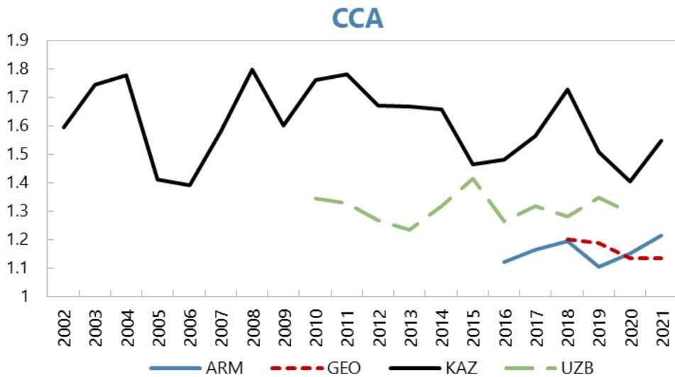  
Sources: Orbis database by Bureau van Dijk, and the authors' estimates.

MENA  
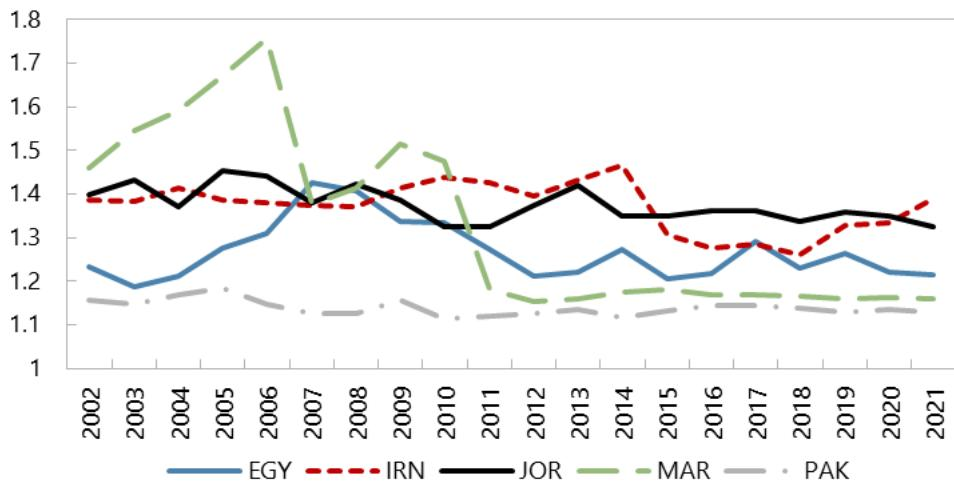  
Sources: Orbis database by Bureau van Dijk, and the authors' estimates.

GCC  
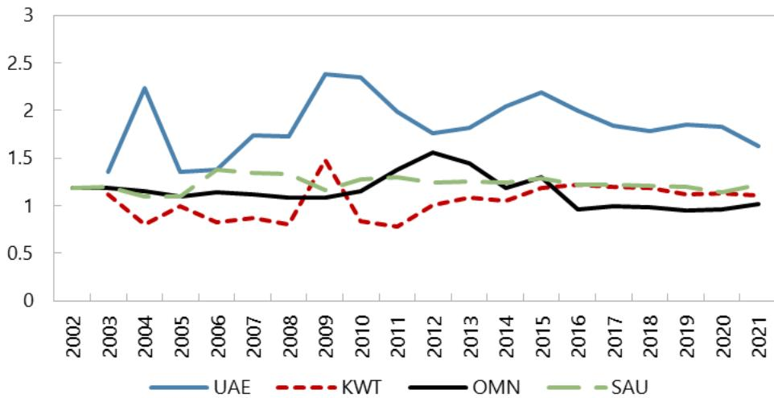  
Sources: Orbis database by Bureau van Dijk, and the authors' estimates.

## A.II.b. Sales-weighted MFPR Gaps

CCA  
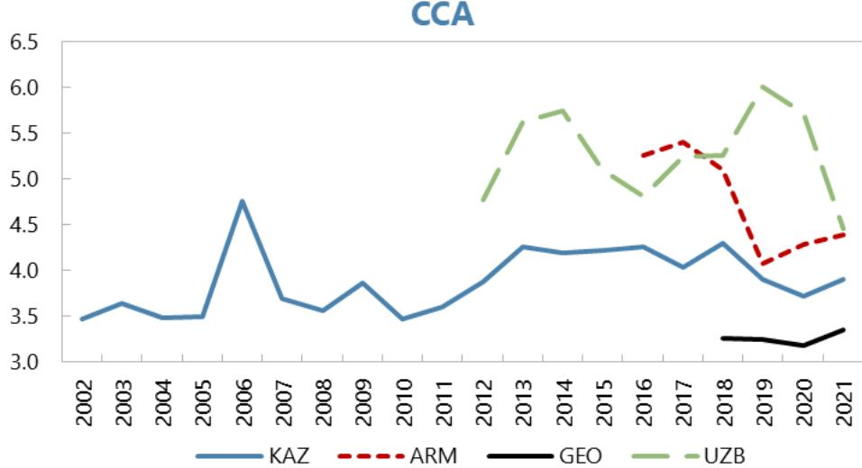  
Sources: Orbis database by Bureau van Dijk, and the authors' estimates.

MENA  
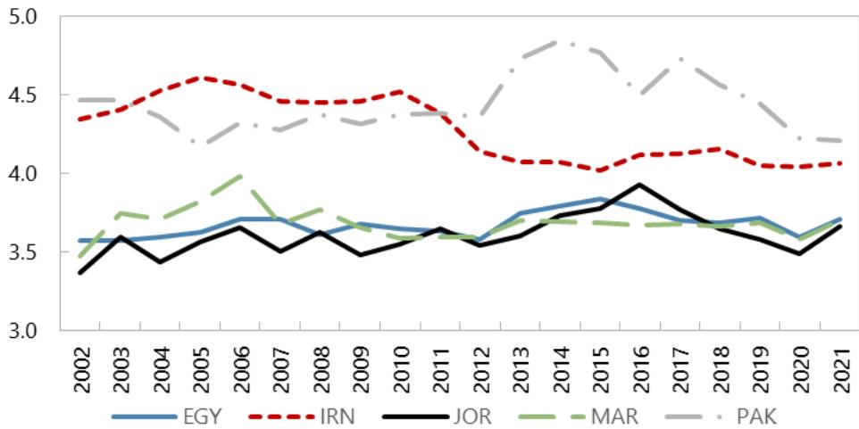  
Sources: Orbis database by Bureau van Dijk, and the authors' estimates.

GCC  
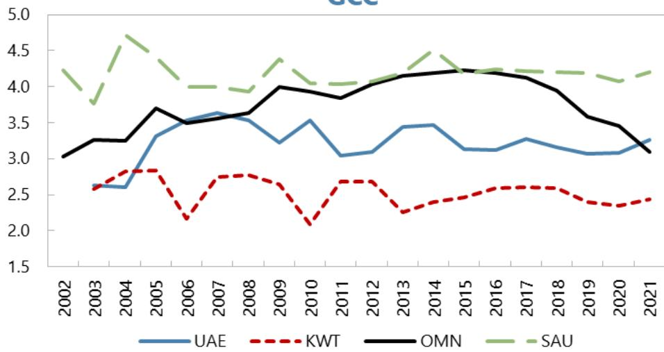  
Sources: Orbis database by Bureau van Dijk, and the authors' estimates.

## Annex III. Region Specific Results

## A.III.a. ME&CA Sales-weighted Profitability

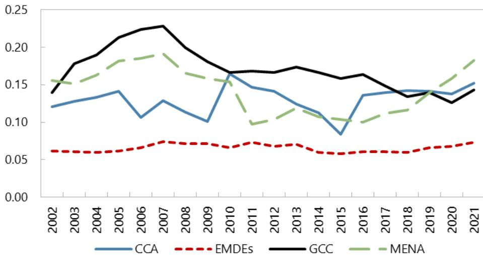  
Sources: Orbis database by Bureau van Dijk, and the authors' estimates. Note: Profitability measured as EBIT as a share of sales.

## A.III.b. CCA Sales-weighted Markups by Industries

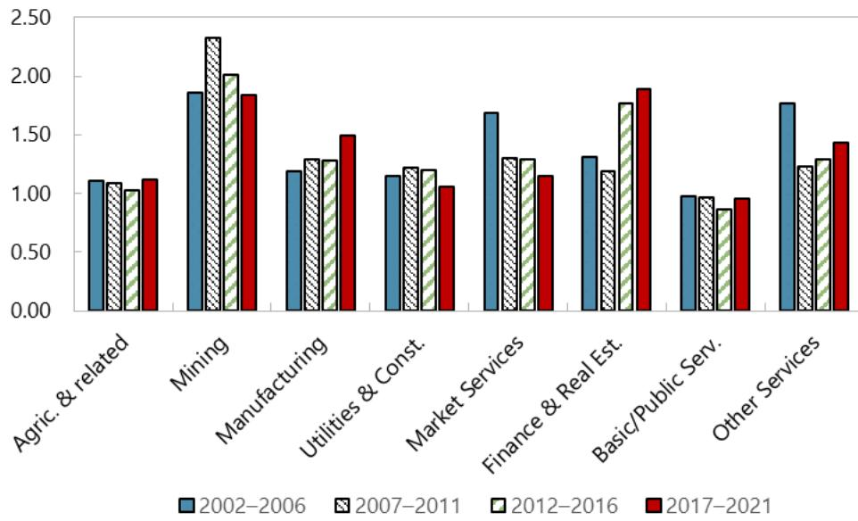  
Sources: Orbis database bby Bureau van Dijk, and the author's estimates. Note: Profitability measured as EBIT as a share of sales.

A.III.c. MENA Sales-weighted Markups by Industries  
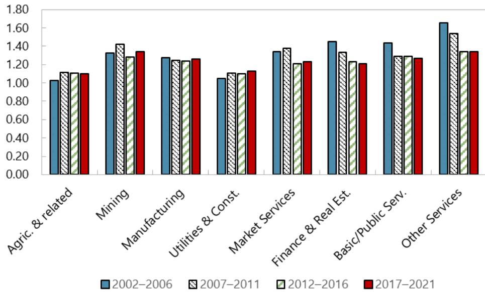  
Sources: Orbis database bby Bureau van Dijk, and the author's estimates. Note: Profitability measured as EBIT as a share of sales.

A.III.d. GCC Sales-weighted Markups by Industries  
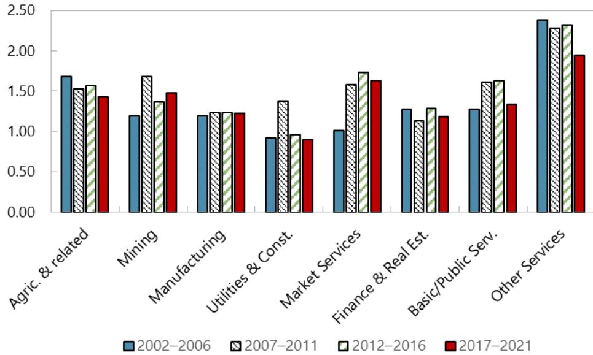  
Sources: Orbis database bby Bureau van Dijk, and the author's estimates. Note: Profitability measured as EBIT as a share of sales.

## A.III.e. CCA Manufacturing Sales Shares (%) by Technology Intensity

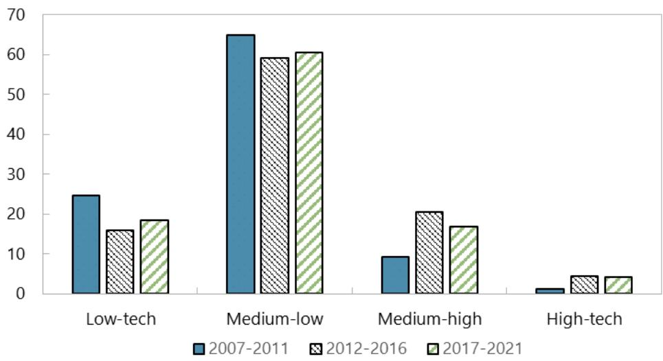  
Sources: Orbis database by Bureau van Dijk, and the authors' estimates.

A.III.f. CCA Sales-weighted Manufacturing Markups by Technology Intensity  
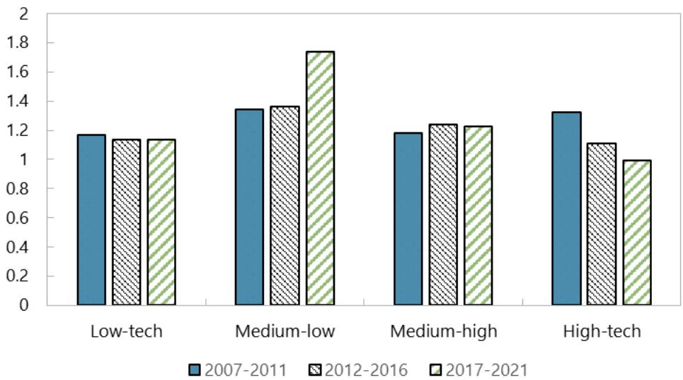  
Sources: Orbis database by Bureau van Dijk, and the authors' estimates.

## A.III.g. Firm-Level (Melitz–Polanec) Decomposition of Markup Changes

<table><tr><td></td><td>Incumbent</td><td>Entering</td><td>Exiting</td><td>TOTAL</td></tr><tr><td colspan="5">Panel I. ME&amp;CA, All Sectors</td></tr><tr><td colspan="5">All firms</td></tr><tr><td>Total Contribution</td><td>0.558</td><td>-1.815</td><td>3.918</td><td>2.660</td></tr><tr><td>Within-Firm Growth</td><td>-3.162</td><td>3.866</td><td>-1.229</td><td>-0.525</td></tr><tr><td>Market-Share Reallocation</td><td>3.720</td><td>-5.682</td><td>5.147</td><td>3.185</td></tr><tr><td colspan="5">Top-5% of sales</td></tr><tr><td>Total Contribution</td><td>-3.003</td><td>0.004</td><td>3.121</td><td>0.123</td></tr><tr><td>Within-Firm Growth</td><td>0.176</td><td>-2.311</td><td>2.273</td><td>0.138</td></tr><tr><td>Market-Share Reallocation</td><td>-3.179</td><td>2.315</td><td>0.848</td><td>-0.016</td></tr><tr><td colspan="5">Panel II. ME&amp;CA, Manufacturing</td></tr><tr><td colspan="5">All firms</td></tr><tr><td>Total Contribution</td><td>5.004</td><td>1.850</td><td>1.256</td><td>8.110</td></tr><tr><td>Within-Firm Growth</td><td>-0.846</td><td>1.158</td><td>-0.206</td><td>0.105</td></tr><tr><td>Market-Share Reallocation</td><td>5.850</td><td>0.693</td><td>1.462</td><td>8.005</td></tr><tr><td colspan="5">Top-5% of sales</td></tr><tr><td>Total Contribution</td><td>10.882</td><td>5.901</td><td>-1.167</td><td>15.616</td></tr><tr><td>Within-Firm Growth</td><td>1.539</td><td>5.512</td><td>2.441</td><td>9.492</td></tr><tr><td>Market-Share Reallocation</td><td>9.343</td><td>0.389</td><td>-3.608</td><td>6.124</td></tr><tr><td colspan="5">Panel III. CCA, Manufacturing</td></tr><tr><td colspan="5">All firms</td></tr><tr><td>Total Contribution</td><td>4.728</td><td>8.897</td><td>-2.324</td><td>11.300</td></tr><tr><td>Within-Firm Growth</td><td>-0.862</td><td>6.414</td><td>-0.323</td><td>5.228</td></tr><tr><td>Market-Share Reallocation</td><td>5.590</td><td>2.484</td><td>-2.001</td><td>6.073</td></tr><tr><td colspan="5">Top-5% of sales</td></tr><tr><td>Total Contribution</td><td>8.810</td><td>18.697</td><td>-1.914</td><td>25.593</td></tr><tr><td>Within-Firm Growth</td><td>7.626</td><td>-1.012</td><td>-1.646</td><td>4.968</td></tr><tr><td>Market-Share Reallocation</td><td>1.184</td><td>19.709</td><td>-0.269</td><td>20.625</td></tr><tr><td colspan="5">Panel IV. CCA Manufacturing, Balanced Sample</td></tr><tr><td colspan="5">All firms</td></tr><tr><td>Total Contribution</td><td>5.025</td><td>10.207</td><td>-2.295</td><td>12.936</td></tr><tr><td>Within-Firm Growth</td><td>-0.856</td><td>7.945</td><td>-0.315</td><td>6.774</td></tr><tr><td>Market-Share Reallocation</td><td>5.881</td><td>2.262</td><td>-1.981</td><td>6.162</td></tr><tr><td colspan="5">Top-5% of sales</td></tr><tr><td>Total Contribution</td><td>8.611</td><td>20.669</td><td>-1.778</td><td>27.501</td></tr><tr><td>Within-Firm Growth</td><td>6.801</td><td>2.231</td><td>-1.227</td><td>7.805</td></tr><tr><td>Market-Share Reallocation</td><td>1.810</td><td>18.437</td><td>-0.551</td><td>19.697</td></tr></table>

Notes: Entries are contributions to the 2012–2021 change in the sales-weighted markup ( $\times$ 100). Incumbents are present in both 2012 and 2021; Entering firms appear only by 2021; Exiting firms only in 2012. The balanced sample restricts the CCA to Kazakhstan and Uzbekistan, the only CCA economies observed over the full 2012–2021 period (Armenia and Georgia enter the panel later).

## Annex IV. Policy Changes and Competition

## A.IV.a. Tariffs, Within-Firm Markups, and Market-Share Reallocation

<table><tr><td></td><td>(1) Total</td><td>(2) Within</td><td>(3) Between</td><td>(4) Total</td><td>(5) Within</td><td>(6) Between</td></tr><tr><td> $\Delta_5Tariff_{Average}$ </td><td>1.557*(0.788)</td><td>0.468(0.577)</td><td>1.089**(0.448)</td><td>1.384*(0.791)</td><td>0.258(0.562)</td><td>1.127**(0.475)</td></tr><tr><td>Tariff $_{Average,t-7}$ </td><td>-1.127(1.203)</td><td>-1.686(1.072)</td><td>0.559(0.510)</td><td>-1.378(1.140)</td><td>-1.941**(0.975)</td><td>0.562(0.553)</td></tr><tr><td>ln GDP per  $capita_{t-5}$ </td><td>0.300(0.430)</td><td>-0.0359(0.385)</td><td>0.336*(0.191)</td><td>0.421(0.475)</td><td>0.0466(0.421)</td><td>0.374*(0.200)</td></tr><tr><td>Gross Debt/ $GDP_{t-5}$ </td><td>0.00185(0.00347)</td><td>0.000807(0.00295)</td><td>0.00105(0.00165)</td><td>0.000558(0.00442)</td><td>0.0000475(0.00401)</td><td>0.000511(0.00162)</td></tr><tr><td>FDI/ $GDP_{t-5}$ </td><td>-0.00319(0.00820)</td><td>0.00463(0.00669)</td><td>-0.00783*(0.00428)</td><td>-0.00432(0.00815)</td><td>0.00418(0.00652)</td><td>-0.00850*(0.00448)</td></tr><tr><td>Trade/ $GDP_{t-5}$ </td><td>-0.00133(0.00309)</td><td>-0.00404(0.00247)</td><td>0.00270(0.00166)</td><td>-0.00131(0.00309)</td><td>-0.00390(0.00247)</td><td>0.00259(0.00164)</td></tr><tr><td>Working Age  $Pop_{t-5}$ </td><td>-0.677(2.454)</td><td>-0.896(2.075)</td><td>0.219(0.959)</td><td>0.375(2.475)</td><td>-0.0383(2.071)</td><td>0.413(0.923)</td></tr><tr><td>Political  $Risk_{t-5}$ </td><td></td><td></td><td></td><td>-0.00985(0.00768)</td><td>-0.00897(0.00687)</td><td>-0.000879(0.00344)</td></tr><tr><td>Economic  $Risk_{t-5}$ </td><td></td><td></td><td></td><td>0.000794(0.00497)</td><td>0.00191(0.00440)</td><td>-0.00111(0.00185)</td></tr><tr><td>Gov. Stability $_{t-5}$ </td><td></td><td></td><td></td><td>0.0371(0.0249)</td><td>0.0320(0.0211)</td><td>0.00504(0.0108)</td></tr><tr><td>Constant</td><td>-2.039(4.824)</td><td>1.180(4.358)</td><td>-3.220(2.015)</td><td>-3.384(5.083)</td><td>0.198(4.543)</td><td>-3.582*(2.026)</td></tr><tr><td>R-squared</td><td>0.278</td><td>0.291</td><td>0.358</td><td>0.281</td><td>0.295</td><td>0.358</td></tr><tr><td>Observations</td><td>725</td><td>725</td><td>725</td><td>725</td><td>725</td><td>725</td></tr><tr><td>Number of Countries</td><td>9</td><td>9</td><td>9</td><td>9</td><td>9</td><td>9</td></tr><tr><td>ICRG Controls</td><td>No</td><td>No</td><td>No</td><td>Yes</td><td>Yes</td><td>Yes</td></tr></table>

Dependent variable: 5-year change in the sales-weighted DLW markup (Total) and its  
within-firm (intensive) and between-firm/reallocation (extensive) components.  
Country, sector, year, and country-sector fixed effects included.  
Standard errors clustered at country-sector level in parentheses.  
\* $p < {0.1}, *  * p < {0.05}, *  *  * p < {0.01}$

## A.IV.b. Manufacturing Markups IRF to Tariff Change without ICRG Controls $^{12}$

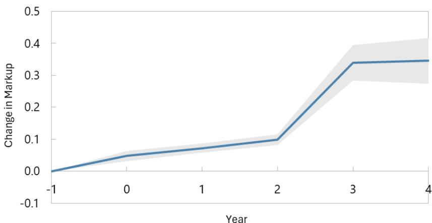  
Sources: Orbis database by Bereau van Dijk, WITS Database and IMF staff calculations. Note: 1SD=7.2 pp (median across countries), 95% confidence interval.

A.IV.c. Anti-Corruption Policies and Competition

<table><tr><td></td><td>(1) $\Delta_{5} \ln \mu_{c,s,t}^{\text{dlw}}$ </td><td>(2) $\Delta_{5} \ln \mu_{c,s,t}^{\text{dlwtl}}$ </td><td>(3) $\Delta_{5} \ln \mu_{c,s,t}^{\text{ols}}$ </td><td>(4) $\Delta_{5}\text{MFPR Gap}_{c,s,t}^{\mu}$ </td><td>(5) $\Delta_{5} \ln \mu_{c,s,t}^{\text{dlw}}$ </td><td>(6) $\Delta_{5} \ln \mu_{c,s,t}^{\text{dlwtl}}$ </td><td>(7) $\Delta_{5} \ln \mu_{c,s,t}^{\text{ols}}$ </td><td>(8) $\Delta_{5}\text{MFPR Gap}_{c,s,t}^{\mu}$ </td></tr><tr><td> $\Delta_{5}\text{BTI}_{\text{Anti-Corruption}}$ </td><td>-0.0223**(0.0113)</td><td>-0.0275**(0.0121)</td><td>-0.0184(0.0117)</td><td>0.0110(0.0215)</td><td>-0.0207*(0.0114)</td><td>-0.0231*(0.0123)</td><td>-0.0164(0.0119)</td><td>0.00482(0.0216)</td></tr><tr><td> $BTI_{\text{Anti-Corruption}, t-7}$ </td><td>-0.0115(0.0147)</td><td>-0.00439(0.0157)</td><td>-0.00728(0.0146)</td><td>-0.0383(0.0308)</td><td>-0.00904(0.0160)</td><td>0.00506(0.0166)</td><td>-0.00437(0.0160)</td><td>-0.0251(0.0288)</td></tr><tr><td> $\ln GDP per capita_{t-5}$ </td><td>0.235(0.257)</td><td>0.349(0.311)</td><td>0.343(0.289)</td><td>-0.0420(0.426)</td><td>0.139(0.281)</td><td>0.267(0.335)</td><td>0.246(0.309)</td><td>-0.351(0.471)</td></tr><tr><td> $Gross Debt/GDP_{t-5}$ </td><td>0.00572**(0.00239)</td><td>0.00714***(0.00244)</td><td>0.00717***(0.00255)</td><td>-0.000388(0.00367)</td><td>0.00584**(0.00242)</td><td>0.00701***(0.00248)</td><td>0.00732***(0.00257)</td><td>-0.00107(0.00392)</td></tr><tr><td> $FDI/GDP_{t-5}$ </td><td>0.00576(0.00458)</td><td>0.00500(0.00474)</td><td>0.00585(0.00464)</td><td>-0.0207**(0.00835)</td><td>0.00686(0.00498)</td><td>0.00576(0.00507)</td><td>0.00693(0.00505)</td><td>-0.0184**(0.00858)</td></tr><tr><td> $Trade/GDP_{t-5}$ </td><td>0.00162(0.00162)</td><td>0.00116(0.00189)</td><td>0.00167(0.00167)</td><td>0.00293(0.00262)</td><td>0.00143(0.00157)</td><td>0.000478(0.00165)</td><td>0.00149(0.00161)</td><td>0.00128(0.00247)</td></tr><tr><td> $Working Age Pop_{t-5}$ </td><td>-0.447(1.294)</td><td>-0.927(1.428)</td><td>0.162(1.377)</td><td>-1.375(2.548)</td><td>-0.559(1.353)</td><td>-0.949(1.408)</td><td>0.0843(1.426)</td><td>-2.757(2.706)</td></tr><tr><td> $Political Risk_{t-5}$ </td><td></td><td></td><td></td><td></td><td>-0.000990(0.00679)</td><td>-0.000982(0.00809)</td><td>-0.00164(0.00684)</td><td>0.0181(0.0136)</td></tr><tr><td> $Economic Risk_{t-5}$ </td><td></td><td></td><td></td><td></td><td>0.00264(0.00249)</td><td>0.00392*(0.00232)</td><td>0.00285(0.00257)</td><td>-0.00154(0.00390)</td></tr><tr><td> $Gov. Stability_{t-5}$ </td><td></td><td></td><td></td><td></td><td>0.00507(0.0217)</td><td>0.0193(0.0236)</td><td>0.00783(0.0220)</td><td>-0.0427(0.0439)</td></tr><tr><td>Constant</td><td>-2.059(2.888)</td><td>-2.760(3.338)</td><td>-3.472(3.253)</td><td>1.432(4.926)</td><td>-1.233(3.051)</td><td>-2.261(3.455)</td><td>-2.660(3.384)</td><td>4.421(5.298)</td></tr><tr><td>R-squared</td><td>0.335</td><td>0.284</td><td>0.338</td><td>0.404</td><td>0.328</td><td>0.277</td><td>0.331</td><td>0.387</td></tr><tr><td>Observations</td><td>3,031</td><td>2,754</td><td>2,992</td><td>2,448</td><td>2,924</td><td>2,650</td><td>2,885</td><td>2,377</td></tr><tr><td>Number of Countries</td><td>11</td><td>11</td><td>11</td><td>11</td><td>10</td><td>10</td><td>10</td><td>10</td></tr><tr><td>ICRG Controls</td><td>No</td><td>No</td><td>No</td><td>No</td><td>Yes</td><td>Yes</td><td>Yes</td><td>Yes</td></tr></table>

Country, sector, year, and country-sector fixed effects included.  
Standard errors clustered at country-sector level in parentheses.  
\* $p < {0.1}, *  * p < {0.05}, *  *  * p < {0.01}$

A.IV.d. Private Enterprise Policies and Competition

<table><tr><td></td><td>(1) $\Delta_5\ln \mu_{c,s,t}^{\text{dlw}}$ </td><td>(2) $\Delta_5\ln \mu_{c,s,t}^{\text{dlwtl}}$ </td><td>(3) $\Delta_5\ln \mu_{c,s,t}^{\text{ols}}$ </td><td>(4) $\Delta_5\text{MFPR Gap}^\mu_{c,s,t}$ </td><td>(5) $\Delta_5\ln \mu_{c,s,t}^{\text{dlw}}$ </td><td>(6) $\Delta_5\ln \mu_{c,s,t}^{\text{dlwtl}}$ </td><td>(7) $\Delta_5\ln \mu_{c,s,t}^{\text{ols}}$ </td><td>(8) $\Delta_5\text{MFPR Gap}^\mu_{c,s,t}$ </td></tr><tr><td> $\Delta_5\text{BTI}_{\text{Private Enterprise}}$ </td><td>-0.0188(0.0138)</td><td>-0.00636(0.0141)</td><td>-0.0187(0.0142)</td><td>-0.0179(0.0356)</td><td>-0.0289**(0.0144)</td><td>-0.0187(0.0144)</td><td>-0.0288*(0.0148)</td><td>-0.0231(0.0320)</td></tr><tr><td> $BTI_{\text{Private Enterprise}, t-7}$ </td><td>0.0327(0.0200)</td><td>0.0230(0.0268)</td><td>0.0325(0.0205)</td><td>-0.0702*(0.0406)</td><td>0.0378*(0.0199)</td><td>0.0275(0.0258)</td><td>0.0365*(0.0204)</td><td>-0.0564(0.0394)</td></tr><tr><td> $\ln GDP per capita_{t-5}$ </td><td>0.435*(0.245)</td><td>0.571**(0.287)</td><td>0.526**(0.267)</td><td>-0.345(0.399)</td><td>0.297(0.267)</td><td>0.454(0.315)</td><td>0.388(0.287)</td><td>-0.509(0.443)</td></tr><tr><td> $Gross Debt/GDP_{t-5}$ </td><td>0.00832***(0.00245)</td><td>0.00968***(0.00250)</td><td>0.00937***(0.00254)</td><td>-0.000928(0.00338)</td><td>0.00771***(0.00245)</td><td>0.00869***(0.00240)</td><td>0.00883***(0.00253)</td><td>-0.00126(0.00354)</td></tr><tr><td> $FDI/GDP_{t-5}$ </td><td>0.00117(0.00481)</td><td>-0.000820(0.00501)</td><td>0.00190(0.00493)</td><td>-0.0157*(0.00915)</td><td>0.00262(0.00505)</td><td>0.00139(0.00516)</td><td>0.00347(0.00521)</td><td>-0.0161*(0.00953)</td></tr><tr><td> $Trade/GDP_{t-5}$ </td><td>0.00239(0.00156)</td><td>0.00171(0.00181)</td><td>0.00234(0.00161)</td><td>0.00309(0.00256)</td><td>0.00138(0.00163)</td><td>0.000570(0.00175)</td><td>0.00144(0.00167)</td><td>0.00163(0.00261)</td></tr><tr><td> $Working Age Pop_{t-5}$ </td><td>0.216(1.385)</td><td>-0.0631(1.521)</td><td>0.639(1.442)</td><td>-1.030(2.427)</td><td>-0.432(1.431)</td><td>-0.655(1.447)</td><td>0.0454(1.480)</td><td>-2.279(2.582)</td></tr><tr><td> $Political Risk_{t-5}$ </td><td></td><td></td><td></td><td></td><td>0.00282(0.00627)</td><td>0.000245(0.00665)</td><td>0.00179(0.00626)</td><td>0.0154(0.0135)</td></tr><tr><td> $Economic Risk_{t-5}$ </td><td></td><td></td><td></td><td></td><td>0.00328(0.00255)</td><td>0.00508**(0.00242)</td><td>0.00344(0.00262)</td><td>-0.00220(0.00415)</td></tr><tr><td> $Gov. Stability_{t-5}$ </td><td></td><td></td><td></td><td></td><td>0.00786(0.0214)</td><td>0.0205(0.0223)</td><td>0.00981(0.0216)</td><td>-0.0288(0.0404)</td></tr><tr><td>Constant</td><td>-4.609(2.818)</td><td>-5.522*(3.118)</td><td>-5.721*(3.070)</td><td>4.113(4.680)</td><td>-3.290(2.998)</td><td>-4.416(3.289)</td><td>-4.398(3.225)</td><td>5.790(5.059)</td></tr><tr><td>R-squared</td><td>0.336</td><td>0.283</td><td>0.338</td><td>0.405</td><td>0.330</td><td>0.277</td><td>0.333</td><td>0.388</td></tr><tr><td>Observations</td><td>3,031</td><td>2,754</td><td>2,992</td><td>2,448</td><td>2,924</td><td>2,650</td><td>2,885</td><td>2,377</td></tr><tr><td>Number of Countries</td><td>11</td><td>11</td><td>11</td><td>11</td><td>10</td><td>10</td><td>10</td><td>10</td></tr><tr><td>ICRG Controls</td><td>No</td><td>No</td><td>No</td><td>No</td><td>Yes</td><td>Yes</td><td>Yes</td><td>Yes</td></tr></table>

\* $p < {0.1}, *  * p < {0.05}, *  *  * p < {0.01}$  
Country, sector, year, and country-sector fixed effects included.  
Standard errors clustered at country-sector level in parentheses.

A.IV.e. Foreign Trade Policies and Competition – CCA Interaction

<table><tr><td></td><td>(1) $\Delta_5\ln \mu_{c,s,t}^{\text{dlw}}$ </td><td>(2) $\Delta_5\ln \mu_{c,s,t}^{\text{dlwtl}}$ </td><td>(3) $\Delta_5\ln \mu_{c,s,t}^{\text{ols}}$ </td><td>(4) $\Delta_5\text{MFPR Gap}_{c,s,t}^\mu$ </td><td>(5) $\Delta_5\ln \mu_{c,s,t}^{\text{dlw}}$ </td><td>(6) $\Delta_5\ln \mu_{c,s,t}^{\text{dlwtl}}$ </td><td>(7) $\Delta_5\ln \mu_{c,s,t}^{\text{ols}}$ </td><td>(8) $\Delta_5\text{MFPR Gap}_{c,s,t}^\mu$ </td></tr><tr><td> $\Delta_5\text{BTI}_{\text{Foreign Trade}}$ </td><td>0.00849(0.0197)</td><td>0.0130(0.0217)</td><td>0.0165(0.0212)</td><td>-0.0123(0.0322)</td><td>0.00851(0.0198)</td><td>0.0143(0.0215)</td><td>0.0168(0.0215)</td><td>-0.0197(0.0320)</td></tr><tr><td> $\Delta_5\text{BTI}_{\text{Foreign Trade}} \times \text{CCA}$ </td><td>-0.110**(0.0529)</td><td>-0.124**(0.0610)</td><td>-0.108**(0.0529)</td><td>0.0763(0.0958)</td><td>-0.259***(0.0770)</td><td>-0.216**(0.0969)</td><td>-0.255***(0.0772)</td><td>0.0348(0.131)</td></tr><tr><td> $BTI_{\text{Foreign Trade},t-7}$ </td><td>0.0462**(0.0185)</td><td>0.0360*(0.0204)</td><td>0.0513***(0.0191)</td><td>-0.00747(0.0323)</td><td>0.0581***(0.0206)</td><td>0.0407*(0.0228)</td><td>0.0633***(0.0212)</td><td>-0.00844(0.0351)</td></tr><tr><td> $\ln GDP per capita_{t-5}$ </td><td>0.306(0.273)</td><td>0.537*(0.325)</td><td>0.410(0.302)</td><td>-0.228(0.411)</td><td>0.112(0.286)</td><td>0.360(0.338)</td><td>0.216(0.313)</td><td>-0.469(0.469)</td></tr><tr><td> $Gross Debt/GDP_{t-5}$ </td><td>0.00867***(0.00248)</td><td>0.00989***(0.00261)</td><td>0.00999***(0.00264)</td><td>0.000277(0.00329)</td><td>0.00929***(0.00260)</td><td>0.00979***(0.00267)</td><td>0.0107***(0.00273)</td><td>-0.00125(0.00373)</td></tr><tr><td> $FDI/GDP_{t-5}$ </td><td>0.00567(0.00514)</td><td>0.00408(0.00608)</td><td>0.00676(0.00534)</td><td>-0.0205**(0.0103)</td><td>0.0121**(0.00569)</td><td>0.00938(0.00673)</td><td>0.0133**(0.00594)</td><td>-0.0198*(0.0111)</td></tr><tr><td> $Trade/GDP_{t-5}$ </td><td>0.00157(0.00155)</td><td>0.00100(0.00185)</td><td>0.00172(0.00160)</td><td>0.00354(0.00259)</td><td>0.00145(0.00155)</td><td>0.000685(0.00160)</td><td>0.00168(0.00158)</td><td>0.000777(0.00244)</td></tr><tr><td> $Working Age Pop_{t-5}$ </td><td>-1.292(1.475)</td><td>-1.437(1.632)</td><td>-0.764(1.548)</td><td>-0.657(2.478)</td><td>-3.077**(1.554)</td><td>-2.618(1.668)</td><td>-2.484(1.631)</td><td>-2.729(2.730)</td></tr><tr><td> $Political Risk_{t-5}$ </td><td></td><td></td><td></td><td></td><td>-0.00437(0.00670)</td><td>-0.00505(0.00798)</td><td>-0.00522(0.00673)</td><td>0.0209(0.0141)</td></tr><tr><td> $Economic Risk_{t-5}$ </td><td></td><td></td><td></td><td></td><td>0.00281(0.00259)</td><td>0.00487**(0.00243)</td><td>0.00313(0.00268)</td><td>-0.00293(0.00408)</td></tr><tr><td> $Gov. Stability_{t-5}$ </td><td></td><td></td><td></td><td></td><td>-0.00775(0.0208)</td><td>0.00786(0.0212)</td><td>-0.00611(0.0210)</td><td>-0.0381(0.0429)</td></tr><tr><td>Constant</td><td>-2.546(3.123)</td><td>-4.380(3.601)</td><td>-3.902(3.473)</td><td>2.420(4.712)</td><td>0.438(3.253)</td><td>-2.032(3.750)</td><td>-0.947(3.595)</td><td>5.285(5.308)</td></tr><tr><td>R-squared</td><td>0.338</td><td>0.286</td><td>0.340</td><td>0.403</td><td>0.335</td><td>0.280</td><td>0.338</td><td>0.387</td></tr><tr><td>Observations</td><td>3,031</td><td>2,754</td><td>2,992</td><td>2,448</td><td>2,924</td><td>2,650</td><td>2,885</td><td>2,377</td></tr><tr><td>Number of Countries</td><td>11</td><td>11</td><td>11</td><td>11</td><td>10</td><td>10</td><td>10</td><td>10</td></tr><tr><td>ICRG Controls</td><td>No</td><td>No</td><td>No</td><td>No</td><td>Yes</td><td>Yes</td><td>Yes</td><td>Yes</td></tr></table>

\* $p < {0.1}$ ,\*\* $p < {0.05}$ ,\*\*\* $p < {0.01}$  
Country, sector, year, and country-sector fixed effects included.  
Standard errors clustered at country-sector level in parentheses.

A.IV.f. Control of Corruption and Competition

<table><tr><td></td><td>(1) $\Delta_{5} \ln \mu_{c,s,t}^{\text{dlw}}$ </td><td>(2) $\Delta_{5} \ln \mu_{c,s,t}^{\text{dlwtl}}$ </td><td>(3) $\Delta_{5} \ln \mu_{c,s,t}^{\text{ols}}$ </td><td>(4) $\Delta_{5} \text{MFPR Gap}^{\mu}_{c,s,t}$ </td><td>(5) $\Delta_{5} \ln \mu_{c,s,t}^{\text{dlw}}$ </td><td>(6) $\Delta_{5} \ln \mu_{c,s,t}^{\text{dlwtl}}$ </td><td>(7) $\Delta_{5} \ln \mu_{c,s,t}^{\text{ols}}$ </td><td>(8) $\Delta_{5} \text{MFPR Gap}^{\mu}_{c,s,t}$ </td></tr><tr><td> $\Delta_{5} \text{WGI}_{\text{Control of Corruption}}$ </td><td>-0.125**(0.0549)</td><td>-0.116**(0.0502)</td><td>-0.138**(0.0572)</td><td>0.0456(0.0919)</td><td>-0.116*(0.0597)</td><td>-0.0996*(0.0541)</td><td>-0.132**(0.0624)</td><td>0.0747(0.0970)</td></tr><tr><td> $\text{WGI}_{\text{Control of Corruption}, t-7}$ </td><td>0.0881(0.0657)</td><td>0.121*(0.0695)</td><td>0.115(0.0718)</td><td>0.0301(0.109)</td><td>0.0763(0.0631)</td><td>0.113(0.0706)</td><td>0.106(0.0702)</td><td>-0.0165(0.112)</td></tr><tr><td> $\ln GDP per capita_{t-5}$ </td><td>0.208(0.191)</td><td>0.201(0.205)</td><td>0.206(0.196)</td><td>0.105(0.277)</td><td>0.102(0.207)</td><td>0.0649(0.216)</td><td>0.0994(0.212)</td><td>-0.0158(0.284)</td></tr><tr><td> $Gross Debt/GDP_{t-5}$ </td><td>0.00427**(0.00206)</td><td>0.00463***(0.00176)</td><td>0.00465**(0.00209)</td><td>0.00295(0.00288)</td><td>0.00357*(0.00197)</td><td>0.00377**(0.00175)</td><td>0.00404**(0.00201)</td><td>0.00140(0.00289)</td></tr><tr><td> $FDI/GDP_{t-5}$ </td><td>0.00415(0.00380)</td><td>0.00472(0.00356)</td><td>0.00441(0.00388)</td><td>-0.00719(0.00626)</td><td>0.00409(0.00376)</td><td>0.00519(0.00359)</td><td>0.00447(0.00386)</td><td>-0.00815(0.00616)</td></tr><tr><td> $Trade/GDP_{t-5}$ </td><td>-0.000760(0.00111)</td><td>-0.00102(0.00129)</td><td>-0.000864(0.00115)</td><td>0.00138(0.00207)</td><td>-0.00175(0.00131)</td><td>-0.00221(0.00134)</td><td>-0.00178(0.00135)</td><td>-0.000610(0.00218)</td></tr><tr><td>Working Age  $Pop_{t-5}$ </td><td>-0.848(1.046)</td><td>-1.149(0.940)</td><td>-0.727(1.064)</td><td>-0.836(1.524)</td><td>-1.253(1.111)</td><td>-1.566(1.007)</td><td>-1.079(1.134)</td><td>-1.958(1.549)</td></tr><tr><td>Political  $Risk_{t-5}$ </td><td></td><td></td><td></td><td></td><td>0.00740(0.00688)</td><td>0.00576(0.00735)</td><td>0.00647(0.00694)</td><td>0.0188*(0.0109)</td></tr><tr><td>Economic  $Risk_{t-5}$ </td><td></td><td></td><td></td><td></td><td>0.00207(0.00223)</td><td>0.00498**(0.00219)</td><td>0.00234(0.00230)</td><td>-0.00286(0.00403)</td></tr><tr><td>Gov. Stability $_{t-5}$ </td><td></td><td></td><td></td><td></td><td>-0.0144(0.0174)</td><td>-0.00801(0.0189)</td><td>-0.0137(0.0175)</td><td>-0.0157(0.0267)</td></tr><tr><td>Constant</td><td>-1.356(2.053)</td><td>-1.071(2.181)</td><td>-1.410(2.105)</td><td>-0.421(2.947)</td><td>-0.497(2.152)</td><td>0.0171(2.244)</td><td>-0.554(2.202)</td><td>0.611(2.944)</td></tr><tr><td>R-squared</td><td>0.222</td><td>0.226</td><td>0.227</td><td>0.324</td><td>0.215</td><td>0.220</td><td>0.220</td><td>0.311</td></tr><tr><td>Observations</td><td>4,000</td><td>3,612</td><td>3,947</td><td>3,215</td><td>3,893</td><td>3,508</td><td>3,840</td><td>3,144</td></tr><tr><td>Number of Countries</td><td>11</td><td>11</td><td>11</td><td>11</td><td>10</td><td>10</td><td>10</td><td>10</td></tr><tr><td>ICRG Controls</td><td>No</td><td>No</td><td>No</td><td>No</td><td>Yes</td><td>Yes</td><td>Yes</td><td>Yes</td></tr></table>

Country, sector, year, and country-sector fixed effects included.  
\* $p < {0.1}$ ,\*\* $p < {0.05}$ ,\*\*\* $p < {0.01}$  
Standard errors clustered at country-sector level in parentheses.

## Annex V. Competition and Productivity

A.V.a. Competition and TFP Growth Excluding Financial Services

<table><tr><td rowspan="2"></td><td colspan="3">TFP $^{dlw}$  Growth</td><td colspan="3">TFP $^{dlwtl}$  Growth</td></tr><tr><td>(1)</td><td>(2)</td><td>(3)</td><td>(4)</td><td>(5)</td><td>(6)</td></tr><tr><td>ln  $\mu_{c,s,t-1}^{dlw}$ </td><td>-0.131***(0.0103)</td><td></td><td></td><td>-0.145***(0.0147)</td><td></td><td></td></tr><tr><td>ln  $\mu_{c,s,t-1}^{dlwtl}$ </td><td></td><td>-0.106***(0.0108)</td><td></td><td></td><td>-0.107***(0.0126)</td><td></td></tr><tr><td>ln  $\mu_{c,s,t-1}^{ols}$ </td><td></td><td></td><td>-0.126***(0.0103)</td><td></td><td></td><td>-0.138***(0.0145)</td></tr><tr><td>ln Assets $_{i,t-1}$ </td><td>0.00349***(0.000505)</td><td>0.00349***(0.000502)</td><td>0.00356***(0.000510)</td><td>0.00222***(0.000644)</td><td>0.00231***(0.000589)</td><td>0.00231***(0.000648)</td></tr><tr><td>Listed $_{i,t-1}$ </td><td>-0.0187(0.0219)</td><td>-0.0233(0.0212)</td><td>-0.0182(0.0221)</td><td>-0.0430(0.0276)</td><td>-0.0428(0.0260)</td><td>-0.0428(0.0279)</td></tr><tr><td>ln GDP per capita $_{t-1}$ </td><td>0.0624**(0.0268)</td><td>0.0355(0.0273)</td><td>0.0679**(0.0278)</td><td>-0.0537(0.0434)</td><td>-0.0408(0.0429)</td><td>-0.0372(0.0441)</td></tr><tr><td>Gross Debt/GDP $_{t-1}$ </td><td>-0.000648***(0.000227)</td><td>-0.000608***(0.000227)</td><td>-0.000618***(0.000230)</td><td>-0.00114***(0.000399)</td><td>-0.000429(0.000343)</td><td>-0.00111***(0.000400)</td></tr><tr><td>FDI/GDP $_{t-1}$ </td><td>0.00212**(0.000869)</td><td>0.00221**(0.000884)</td><td>0.00211**(0.000871)</td><td>0.00288**(0.00119)</td><td>0.00367***(0.00118)</td><td>0.00278**(0.00120)</td></tr><tr><td>Trade/GDP $_{t-1}$ </td><td>0.0000851(0.000176)</td><td>0.0000474(0.000178)</td><td>0.0000368(0.000177)</td><td>-0.000601*(0.000356)</td><td>-0.000596*(0.000337)</td><td>-0.000504(0.000361)</td></tr><tr><td>Working Age Pop. $_{t-1}$ </td><td>-0.575***(0.137)</td><td>-0.806***(0.133)</td><td>-0.559***(0.137)</td><td>-0.953***(0.246)</td><td>-1.109***(0.226)</td><td>-0.924***(0.247)</td></tr><tr><td>Constant</td><td>-0.0746(0.269)</td><td>0.301(0.270)</td><td>-0.131(0.277)</td><td>1.194***(0.444)</td><td>1.139***(0.428)</td><td>1.029**(0.449)</td></tr><tr><td>R-squared</td><td>0.196</td><td>0.197</td><td>0.196</td><td>0.170</td><td>0.176</td><td>0.171</td></tr><tr><td>Observations</td><td>172,712</td><td>172,064</td><td>172,650</td><td>172,712</td><td>172,064</td><td>172,650</td></tr><tr><td>Number of Firms</td><td>37,024</td><td>36,940</td><td>37,018</td><td>37,024</td><td>36,940</td><td>37,018</td></tr><tr><td>Number of Countries</td><td>10</td><td>10</td><td>10</td><td>10</td><td>10</td><td>10</td></tr><tr><td>Ownership Controls</td><td>Yes</td><td>Yes</td><td>Yes</td><td>Yes</td><td>Yes</td><td>Yes</td></tr><tr><td>ICRG Controls</td><td>Yes</td><td>Yes</td><td>Yes</td><td>Yes</td><td>Yes</td><td>Yes</td></tr></table>

Firm and year fixed effects included. Financial services (NACE K, L) excluded.  
Standard errors clustered at firm level in parentheses.  
\* $p < {0.1}$ , \*\* $p < {0.05}$ , \*\*\* $p < {0.01}$

A.V.b. Competition and TFP Growth Excluding Financial Services – Interaction with CCA & GCC

<table><tr><td rowspan="2"></td><td colspan="3">TFP $^{dlw}$  Growth</td><td colspan="3">TFP $^{dlwtl}$  Growth</td></tr><tr><td>(1)</td><td>(2)</td><td>(3)</td><td>(4)</td><td>(5)</td><td>(6)</td></tr><tr><td>ln  $\mu_{c,s,t-1}^{dlw}$ </td><td>-0.0910***(0.00968)</td><td></td><td></td><td>-0.0963***(0.0121)</td><td></td><td></td></tr><tr><td>ln  $\mu_{c,s,t-1}^{dlw} \times \text{CCA}$ </td><td>-0.264***(0.0377)</td><td></td><td></td><td>-0.259***(0.0587)</td><td></td><td></td></tr><tr><td>ln  $\mu_{c,s,t-1}^{dlw} \times \text{GCC}$ </td><td>-0.0502(0.0346)</td><td></td><td></td><td>-0.111*(0.0645)</td><td></td><td></td></tr><tr><td>ln  $\mu_{c,s,t-1}^{dlwtl}$ </td><td></td><td>-0.0735***(0.00786)</td><td></td><td></td><td>-0.0664***(0.00953)</td><td></td></tr><tr><td>ln  $\mu_{c,s,t-1}^{dlwtl} \times \text{CCA}$ </td><td></td><td>-0.121***(0.0432)</td><td></td><td></td><td>-0.109***(0.0407)</td><td></td></tr><tr><td>ln  $\mu_{c,s,t-1}^{dlwtl} \times \text{GCC}$ </td><td></td><td>-0.103*(0.0558)</td><td></td><td></td><td>-0.247**(0.0998)</td><td></td></tr><tr><td>ln  $\mu_{c,s,t-1}^{ols}$ </td><td></td><td></td><td>-0.0878***(0.00925)</td><td></td><td></td><td>-0.0961***(0.0121)</td></tr><tr><td>ln  $\mu_{c,s,t-1}^{ols} \times \text{CCA}$ </td><td></td><td></td><td>-0.267***(0.0376)</td><td></td><td></td><td>-0.258***(0.0587)</td></tr><tr><td>ln  $\mu_{c,s,t-1}^{ols} \times \text{GCC}$ </td><td></td><td></td><td>-0.0330(0.0353)</td><td></td><td></td><td>-0.0620(0.0580)</td></tr><tr><td>ln Assets $_{i,t-1}$ </td><td>0.00352***(0.000508)</td><td>0.00352***(0.000505)</td><td>0.00359***(0.000511)</td><td>0.00225***(0.000648)</td><td>0.00238***(0.000597)</td><td>0.00235***(0.000652)</td></tr><tr><td>Listed $_{i,t-1}$ </td><td>-0.0208(0.0217)</td><td>-0.0252(0.0211)</td><td>-0.0202(0.0218)</td><td>-0.0454*(0.0275)</td><td>-0.0453*(0.0258)</td><td>-0.0449(0.0277)</td></tr><tr><td>ln GDP per capita $_{t-1}$ </td><td>0.0563**(0.0274)</td><td>0.0372(0.0266)</td><td>0.0598**(0.0279)</td><td>-0.0523(0.0433)</td><td>-0.0210(0.0427)</td><td>-0.0408(0.0437)</td></tr><tr><td>Gross Debt/GDP $_{t-1}$ </td><td>-0.000539**(0.000224)</td><td>-0.000598**(0.000235)</td><td>-0.000492**(0.000228)</td><td>-0.00108***(0.000397)</td><td>-0.000464(0.000359)</td><td>-0.00101**(0.000399)</td></tr><tr><td>FDI/GDP $_{t-1}$ </td><td>0.00157*(0.000849)</td><td>0.00186**(0.000882)</td><td>0.00159*(0.000850)</td><td>0.00222*(0.00117)</td><td>0.00298**(0.00116)</td><td>0.00221*(0.00118)</td></tr><tr><td>Trade/GDP $_{t-1}$ </td><td>0.0000878(0.000174)</td><td>0.000104(0.000183)</td><td>0.0000254(0.000174)</td><td>-0.000545(0.000356)</td><td>-0.000377(0.000339)</td><td>-0.000487(0.000361)</td></tr><tr><td>Working Age Pop $_{t-1}$ </td><td>-0.633***(0.143)</td><td>-0.901***(0.145)</td><td>-0.614***(0.143)</td><td>-1.024***(0.255)</td><td>-1.194***(0.235)</td><td>-0.982***(0.254)</td></tr><tr><td>Constant</td><td>0.0400(0.275)</td><td>0.353(0.272)</td><td>-0.00268(0.281)</td><td>1.258***(0.444)</td><td>1.043**(0.427)</td><td>1.123**(0.447)</td></tr><tr><td>R-squared</td><td>0.201</td><td>0.199</td><td>0.201</td><td>0.173</td><td>0.179</td><td>0.173</td></tr><tr><td>Observations</td><td>172,712</td><td>172,064</td><td>172,650</td><td>172,712</td><td>172,064</td><td>172,650</td></tr><tr><td>Number of Firms</td><td>37,024</td><td>36,940</td><td>37,018</td><td>37,024</td><td>36,940</td><td>37,018</td></tr><tr><td>Number of Countries</td><td>10</td><td>10</td><td>10</td><td>10</td><td>10</td><td>10</td></tr><tr><td>Ownership Controls</td><td>Yes</td><td>Yes</td><td>Yes</td><td>Yes</td><td>Yes</td><td>Yes</td></tr><tr><td>ICRG Controls</td><td>Yes</td><td>Yes</td><td>Yes</td><td>Yes</td><td>Yes</td><td>Yes</td></tr></table>

Firm and year fixed effects included. MENA is the reference region.  
Financial services (NACE K, L) excluded.  
Standard errors clustered at firm level in parentheses.  
\* $p < {0.1}, *  * p < {0.05}, *  *  * p < {0.01}$

## References

Ackerberg, Daniel A., Kevin Caves, and Garth Frazer. 2015. "Identification Properties of Recent Production Function Estimators." Econometrica 83 (6): 2411–2451.

Aghion, Philippe, and Rachel Griffith. 2005. Competition and Growth: Reconciling Theory and Evidence. Cambridge, MA: MIT Press.

Akcigit, Ufuk, Salomé Baslandze, and Francesca Lotti. 2023. "Connecting to Power: Political Connections, Innovation, and Firm Dynamics." Econometrica 91 (2): 529–564.

Amiti, Mary, and Jozef Konings. 2007. "Trade Liberalization, Intermediate Inputs, and Productivity: Evidence from Indonesia." American Economic Review 97 (5): 1611–1638.

Andrews, Dan, Chiara Criscuolo, and Peter N. Gal. 2016. "The Best versus the Rest: The Global Productivity Slowdown, Divergence across Firms and the Role of Public Policy." OECD Productivity Working Paper No. 5. Paris: OECD Publishing.

Baqaee, David Rezza, and Emmanuel Farhi. 2017. "Productivity and Misallocation in General Equilibrium." CEPR Discussion Paper No. 12447.

Barkai, Simcha. 2020. "Declining Labor and Capital Shares." Journal of Finance 75 (5): 2421–2463.

De Loecker, Jan, and Jan Eeckhout. 2017. "The Rise of Market Power and the Macroeconomic Implications." NBER Working Paper No. 23687.

De Loecker, Jan, Jan Eeckhout, and Gabriel Unger. 2020. "The Rise of Market Power and the Macroeconomic Implications." Quarterly Journal of Economics 135 (2): 561–644.

De Loecker, Jan, Pinelopi K. Goldberg, Amit K. Khandelwal, and Nina Pavcnik. 2016. "Prices, Markups, and Trade Reform." Econometrica 84 (2): 445–510.

De Loecker, Jan, and Frederic Warzynski. 2012. "Markups and Firm-Level Export Status." American Economic Review 102 (6): 2437–2471.

Díez, Federico J., Jiayue Fan, and Carolina Villegas-Sánchez. 2019. "Global Declining Competition." IMF Working Paper No. 19/82. Washington, DC: International Monetary Fund.

Díez, Federico J., Daniel Leigh, and Suchanan Tambunlertchai. 2018. "Global Market Power and Its Macroeconomic Implications." IMF Working Paper No. 18/137. Washington, DC: International Monetary Fund.

Diwan, Ishac, and Jamal Ibrahim Haidar. 2021. "Political Connections Reduce Job Creation: Firm-level Evidence from Lebanon." Journal of Development Studies 57 (8): 1373–1396.

Diwan, Ishac, Philip Keefer, and Marc Schiffbauer. 2016. "Pyramid Capitalism: Cronyism, Regulation, and Firm Productivity in Egypt." IDB Working Paper No. IDB-WP-739.

Dutz, Mark A., and Aydin Hayri. 2000. "Does More Intense Competition Lead to Higher Growth?" World Bank Policy Research Working Paper No. 2320. Washington, DC: World Bank.

Edmond, Chris, Virgiliu Midrigan, and Daniel Yi Xu. 2018. "How Costly Are Markups?" NBER Working Paper No. 24800.

Faris, Walid. 2024. "Global Corporate Control: Mapping Ultimate Owners and Assessing Their Effects on Firms." Working Paper. Université Paris Dauphine-PSL.

Gal, Peter N. 2013. "Measuring Total Factor Productivity at the Firm Level Using OECD-ORBIS." OECD Economics Department Working Paper No. 1049. Paris: OECD Publishing.

Goldberg, Pinelopi K., Amit K. Khandelwal, Nina Pavcnik, and Petia Topalova. 2010. "Imported Intermediate Inputs and Domestic Product Growth: Evidence from India." Quarterly Journal of Economics 125 (4): 1727–1767.

Gopinath, Gita, Şebnem Kalemli-Özcan, Loukas Karabarbounis, and Carolina Villegas-Sanchez. 2017. "Capital Allocation and Productivity in South Europe." Quarterly Journal of Economics 132 (4): 1915–1967.

Gutiérrez, Germán, and Thomas Philippon. 2017. "Declining Competition and Investment in the U.S." NBER Working Paper No. 23583.

Gutiérrez, Germán, and Thomas Philippon. 2018. "How European Markets Became Free: A Study of Institutional Drift." NBER Working Paper No. 24700.

Hall, Robert E. 2018. "New Evidence on the Markup of Prices over Marginal Costs and the Role of Mega-Firms in the US Economy." NBER Working Paper No. 24574.

Halpern, László, Miklós Koren, and Adam Szeidl. 2015. "Imported Inputs and Productivity." American Economic Review 105 (12): 3660–3703.

Harrison, Ann E. 1994. "Productivity, Imperfect Competition and Trade Reform: Theory and Evidence." Journal of International Economics 36 (1–2): 53–73.

International Monetary Fund. 2019. "The Rise of Corporate Market Power and Its Macroeconomic Effects." Chapter 2 in World Economic Outlook, April 2019. Washington, DC: International Monetary Fund.

International Monetary Fund. 2023. Regional Economic Outlook: Middle East and Central Asia, October 2023. Washington, DC: International Monetary Fund.

Kalemli-Özcan, Şebnem, Bent E. Sørensen, Carolina Villegas-Sanchez, Vadym Volosovych, and Sevcan Yeşiltaş. 2024. "How to Construct Nationally Representative Firm-Level Data from the Orbis Global Database: New Facts on SMEs and Aggregate Implications for Industry Concentration." American Economic Journal: Macroeconomics 16 (2): 353–374.

Korniyenko, Yevgeniya, Ahmed Khalid Tohamy, and Wan Xin. 2025. "Market Power in the Middle East." IMF Working Paper No. 25/1. Washington, DC: International Monetary Fund.

Levinsohn, James. 1993. "Testing the Imports-as-Market-Discipline Hypothesis." Journal of International Economics 35 (1–2): 1–22.

Levinsohn, James, and Amil Petrin. 2003. "Estimating Production Functions Using Inputs to Control for Unobservables." Review of Economic Studies 70 (2): 317–341.

Melitz, Marc J. 2003. "The Impact of Trade on Intra-Industry Reallocations and Aggregate Industry Productivity." Econometrica 71 (6): 1695–1725.

Olley, G. Steven, and Ariel Pakes. 1996. "The Dynamics of Productivity in the Telecommunications Equipment Industry." Econometrica 64 (6): 1263–1297.

Pavcnik, Nina. 2002. "Trade Liberalization, Exit, and Productivity Improvements: Evidence from Chilean Plants." Review of Economic Studies 69 (1): 245–276.

UNCTAD. 2004. Competition, Competitiveness and Development: Lessons from Developing Countries. Geneva: United Nations.

