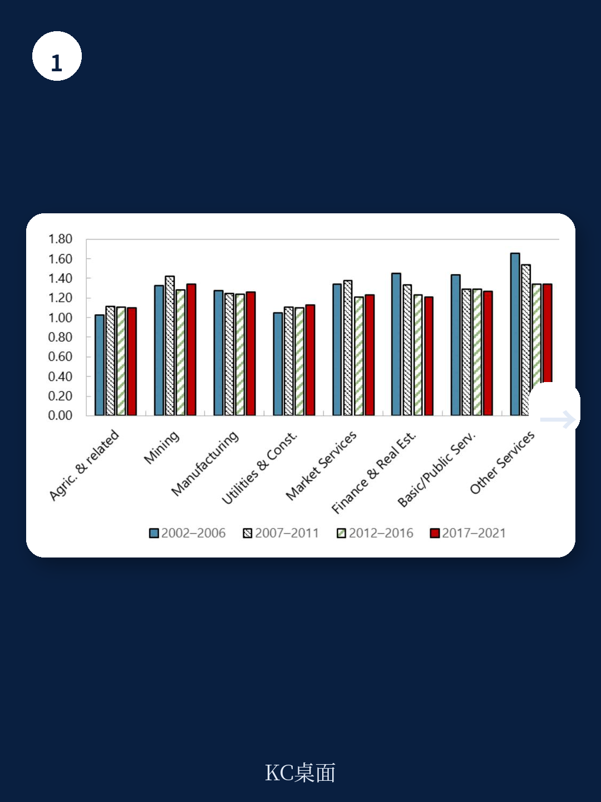
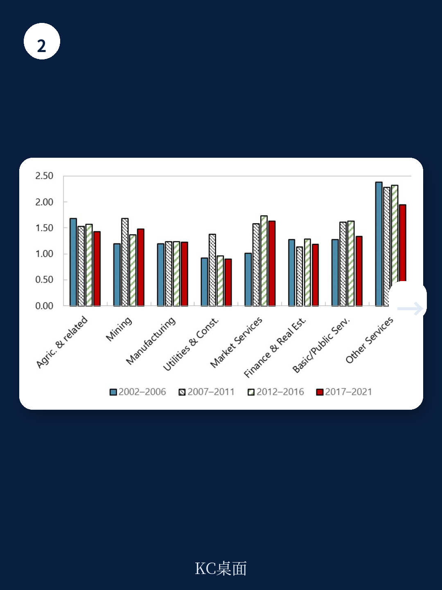

# IMF：中东和中亚的真正瓶颈不是资源，是竞争

一份刚刚发布的IMF工作论文，用2002至2021年间的企业级数据，对中东和中亚（ME&CA）地区的市场竞争格局做了迄今最系统的量化分析。结论直接、有政策分量：这个地区的生产率增长瓶颈，不在资源禀赋，而在竞争不足。而关税，是其中最可干预的变量。

报告覆盖了从海湾合作委员会（GCC）到高加索和中亚（CCA）的广泛地区，既包括上市公司，也包括大量非上市企业。这使得它比以往只关注上市公司的研究更具代表性。核心发现可以概括为一句话：关税越高，企业定价能力（markup）增长越快，生产率差距越大；而竞争政策、反腐败和产权保护的改善，则能有效抑制市场权力的膨胀。

## 1. 市场权力不仅高，而且在向制造业蔓延

传统上，中东和中亚的高市场权力集中在资源密集型行业和部分服务业。但报告揭示了一个新动向：制造业的markup正在快速追赶。尤其在CCA地区，制造业的销售加权markup在样本后期显著上升，已经接近服务业水平。

这一变化的意义在于，它不再是“资源诅咒”的老故事。制造业markup上升意味着，即便在非资源部门，竞争不确定性也在减弱。报告通过“markup调整后的生产率差距”指标进一步量化了这一点：ME&CA地区企业与行业前沿生产率的距离，比其它新兴市场和发展中地区更大，且收敛速度更慢。

> **KC评论：** 市场权力向制造业蔓延，是一个值得警惕的信号。它说明竞争不足已经不仅是结构性问题，而正在变成系统性特征。对于关注该地区供应链布局的企业而言，这意味着进入成本可能被低估，而退出成本被高估。

## 2. 关税是市场权力的加速器，而非稳定器

报告最有力的实证发现来自关税与markup的因果关系分析。利用企业层面数据，作者构建了进口加权关税变化对markup的脉冲响应函数。结果清晰：关税上升1个百分点，制造业markup在3至5年内显著上升，且效应持续。

更关键的是，这一效应并非通过“保护低效企业”实现——关税上升后，存活企业的markup上升，但市场份额并未向高效企业重新分配。换句话说，关税没有帮助本土企业成长，而是让所有企业都获得了更大的定价空间，同时削弱了优胜劣汰的机制。

报告还发现，关税对markup的影响在制度质量较差的地区中更强。如果一国同时存在腐败问题或产权保护薄弱，关税的保护效应会被放大。

## 3. 竞争政策有效，但执行比立法更重要

报告区分了“法律上的竞争政策”和“实际执行效果”两个维度。使用的BTI指数（Bertelsmann Transformation Index）涵盖了竞争政策、反腐败、私人企业政策和外国贸易政策等多个子项。

结果：只有“实际执行”层面的改善才与markup下降显著相关。单纯在法条上引入竞争框架，效果有限。反腐败政策和产权保护的改善，同样能有效抑制markup增长，且效应在制度较弱的CCA地区更为突出。

这一发现呼应了近年来关于“制度执行差距”的广泛讨论。对于政策制定者而言，这意味着改革优先级应该从“立法”转向“执法”。

> **KC评论：** 报告没有直接给出“最佳改革顺序”，但数据暗示了一条路径：先降低关税，同时加强反腐败执行，再完善竞争法。因为关税下降会立即释放竞争不确定性，而制度执行需要时间才能产生效果。

## 4. 竞争不足的真实成本：生产率与增长的双重损失

报告最后将竞争指标与增长结果直接挂钩。工具变量回归显示，markup上升10个百分点，企业全要素生产率（TFP）增长率下降约0.3至0.5个百分点，人均GDP增长率下降约0.2个百分点。

这一效应在CCA地区尤为显著——市场权力对增长的谨慎冲击几乎是ME&CA平均水平的两倍。报告认为，这可能与CCA地区企业规模分布更分散、市场更不发达有关，使得竞争不足的代价更容易转化为资源配置效率损失。

## 报告尚未完全回答的两个问题

第一，关税下降的分配效应。报告证明了关税下降能降低markup、缩小生产率差距，但没有充分讨论哪些行业和企业会因此受损。在国有企业和家族企业占主导的地区中，贸易自由化可能带来短期就业调整成本，而这恰恰是政策推行的最大阻力。

第二，服务业改革的具体路径。报告显示服务业markup普遍高于制造业，但服务业关税数据有限，分析主要聚焦于制造业。服务业竞争不足的根源更多来自国内监管壁垒（如准入限制、牌照制度），而非贸易政策。如何量化这些壁垒并设计改革顺序，仍是开放问题。

## 对观察者的实用框架

如果你在跟踪中东和中亚的宏观环境动态，这份报告提供了一个简洁的诊断框架

- 先看关税趋势：关税上升的地区，未来3至5年markup大概率上升，生产率差距扩大。
- 再看BTI竞争政策执行指数：指数改善的地区，markup增长可能被抑制，企业层面生产率改善可期。
- 最后看制造业markup变化：如果制造业markup持续上升，意味着竞争不足正在扩散，可能影响外资进入意愿和本地企业研究决策。

报告本身是IMF工作论文，数据和方法论在附录中完整公开。对于有定量研究需求的读者，作者还提供了markup估计的Stata代码和Orbis数据清洗流程的详细说明。值得直接翻阅原文的图表和回归表格。

For informational purposes only. Portions may be generated,translated,summarized,or edited with AI assistance based on source materials and may contain omissions or errors. Please verify independently. This is not investment,legal,tax,accounting,or other professional advice.
