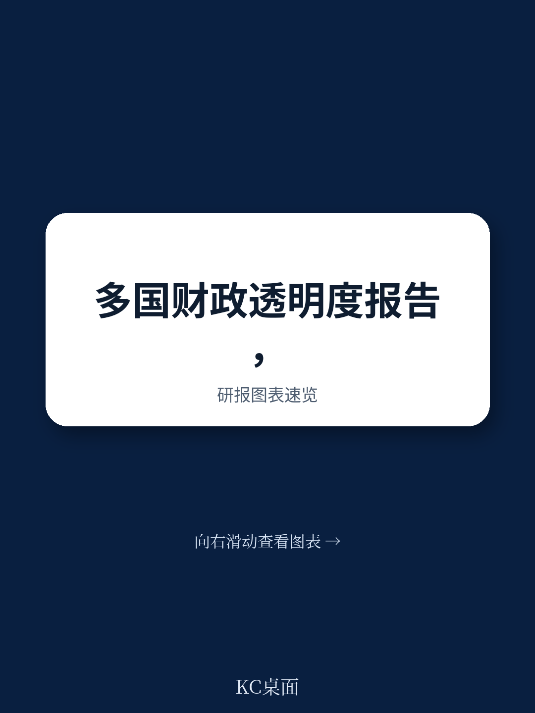

# IMF：IMF评估，多米尼加财政透明度的真正短板在信托产品

一份来自IMF技术援助团队的最新评估报告，对多米尼加共和国的财政透明度做了全面诊断。结论是：这个国家的财政报告和预算流程已有相当基础，但真正的不确定性藏在报表之外——公共信托产品、长期购电协议、养老金缺口和国企财务状况，这些关键领域要么数据缺失，要么分析流于形式。报告的核心判断是：多米尼加财政透明度的下一步，不是报表格式的优化，而是边界的扩展和深度的挖掘。

这份评估基于IMF财政透明度准则的前三大支柱：财政报告、财政预测与预算、财政不确定性分析与管理。评估在2025年2月完成，正值该国新《财政责任法》刚刚落地。法律设定了2035年必须达成的债务目标，以及年度基本支出上限，但实施监控机制尚未到位。

## 1. 公共信托产品是财政报告的最大盲区

多米尼加的财政报告在时效性、频率和机构覆盖面上都做得不错，一般政府和社会保障机构的数据基本完整。但一个显著的缺口是公共信托产品。这些实体的资产、负债和运营活动没有被系统纳入财政报告或预算文件。报告指出，这意味着大量政府控制的资金和不确定性游离在正式监督之外。

对于任何研究新兴市场财政透明度的观察者来说，这是一个典型的结构性缺陷：当政府通过信托产品进行准财政活动时，传统报表就无法反映真实的政府规模和不确定性敞口。多米尼加要做的，不仅是建立数据收集机制，更需要从法律层面明确信托产品必须纳入预算和报告框架。

> **KC评论：** 信托产品往往被用来绕过预算约束，做“表外”操作。IMF的建议直指要害：不把信托产品纳入统一报告，财政纪律就永远是纸面上的。完整报告里关于信托产品的具体规模和类型分析，值得细读。

## 2. 新财政责任法落地容易，执行监控才是真挑战

多米尼加今年刚通过的《财政责任法》设定了明确的财政目标和支出增长限制，这是一个重要的制度进步。但评估发现，该法律的实施监控机制几乎空白。目前没有定期监测报告，也没有对财政预测的独立评估。支撑预算的宏观宏观环境预测基于趋势外推，缺乏对假设条件和分项的详细披露。

这意味着，法律虽然设立了目标，但缺乏一套让目标可追踪、可问责的信息基础设施。预测的透明度不足，会直接削弱财政规则的可信度。报告建议扩展中期财政框架，纳入更详细的假设和分项，延长预测期限，并引入独立评估。这些措施对于确保债务目标在2035年之前可执行、可验证，至关重要。

## 3. 电力部门的长期购电协议是未被量化的定时不确定性

在财政不确定性分析方面，多米尼加面临最大挑战。政府虽然每年发布财政不确定性报告，识别了关键宏观宏观环境和特定不确定性，但分析基本停留在定性层面，缺乏定量评估。尤其值得关注的是电力行业：长期购电协议（PPA）带来的财政不确定性没有被监测或报告，尽管这些合同可能涉及数十亿美元的或有负债。

报告还指出，国有企业（尤其是能源领域）的财务表现和不确定性评估不足，地方政府的财政状况也没有全面报告。养老金负债分散在多个公共计划中，没有合并披露，长期财政可持续性分析缺失。这些不确定性点共同指向一个核心问题：多米尼加缺乏一个系统性的、量化的财政不确定性全景图。

> **KC评论：** 电力行业PPA不确定性在很多发展中国家都是财政“暗礁”。多米尼加的问题在于，这些合同没有进入财政不确定性评估的正式流程。报告建议财政部开发专门的方法论来估算和管理这类不确定性，这个建议的实操难度不小，但方向完全正确。

## 4. 报告尚未完全回答的问题：制度能力与政治意愿

评估给出了清晰的改进路径，但有一个问题没有充分展开：这些建议需要怎样的制度能力和政治意愿才能落地。例如，建立一个专门监控国有企业的部门，或设立基于历史不确定性评估的预算应急储备，都涉及跨部门协调和资源再分配。在财政空间有限、改革议程拥挤的背景下，优先级如何排序？哪些改进可以快速见效，哪些需要长期能力建设？

报告本身是技术评估，没有深入讨论实施政治宏观环境学。但对于政策制定者和读者来说，理解建议的可执行性同样重要。多米尼加能否从“报表合规”走向“不确定性可视化”，取决于未来几年财政管理机构的实际改革节奏。

对于关注新兴市场财政治理的读者，这份报告提供了一个很好的分析框架：从一个中等收入国家的案例中，可以看到财政透明度从“形式合规”到“实质管理”的进阶路径。完整的评估报告包含了每个支柱下的详细评分、具体案例和分步建议，值得深入查阅。